# 第二章：操作字符串值

现在我们已经了解了这本书将带领我们完成的内容概述。我们知道如何安装 Go 二进制文件，编写 Go 代码并使用终端运行它。在本章中，我们将学习一些操作字符串值的技巧，比如从字符串的开头和结尾修剪空格，提取子字符串，替换字符串的部分，转义字符串值中的字符，以及将字符串值大写。

# 从字符串的开头和结尾修剪空格

让我们从字符串的开头和结尾修剪空格开始。有许多原因你可能想要从字符串的开头和结尾删除空格；例如，如果你接受一些值，比如名字，你通常不需要在字符串值的末尾或开头有任何空格。

所以，让我们继续进行我们的项目，并看看我们如何在 Go 语言中进行这个过程。所以，你必须为修剪空格添加一个新项目，并有一个我们将放置我们的代码的`main.go`文件，然后我们只需要运行它；你的屏幕应该看起来像这样：

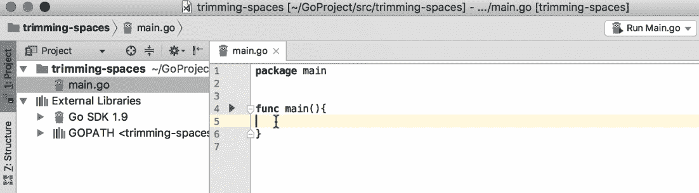

首先，让我们想象一下，我们有一个字符串变量，其中有一些空格：

```go
package main
import (
  "fmt"
  "strings"
)
func main(){
  greetings := "\t Hello, World "
  fmt.Printf("%d %s\n", len(greetings), greetings)
}
```

在上面的代码片段中，`/t`代表制表符，后面有一些空格。有*hello World*和一些空格。我已经将这个字符串值与它的长度属性一起放到控制台上。`len`函数将给我们字符串的长度，表示字符串中的字符数。让我们运行一下：

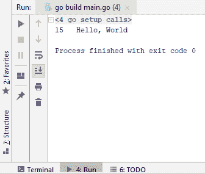

从屏幕截图中可以看出，它有 15 个字符，包括制表符、空格和字符串的其余部分。

现在，让我们继续修剪变量中的空格。我们有`strings.TrimSpace`，它返回另一个字符串，如下面的屏幕截图所示：

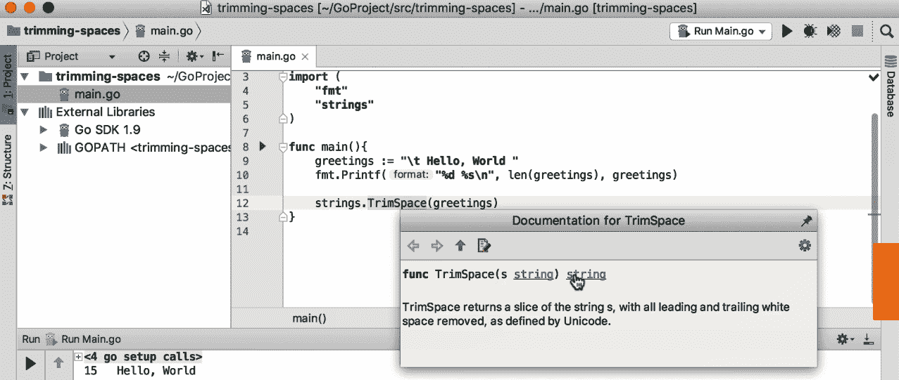

然后我们可以将字符串捕获到一个变量中。检查以下代码：

```go
package main
import (
 "fmt"
 "strings"
)
func main(){
 greetings := "\t Hello, World "
 fmt.Printf("%d %s\n", len(greetings), greetings)
trimmed := strings.TrimSpace(greetings)
 fmt.Printf("%d %s\n", len(trimmed), trimmed)
}
```

上面代码的输出如下：

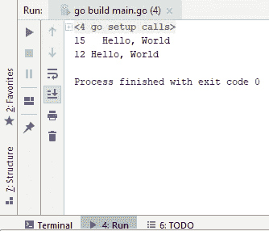

看！正如你所看到的，我们的开头和结尾的空格，包括制表符，都消失了，现在我们这里有 12 个字符。这就是你在 Go 中修剪空格的方法。在下一节中，我们将看到如何从字符串值中提取子字符串。

# 从字符串值中提取子字符串

在这一部分，你将学习如何从字符串值中提取子字符串。Go 语言中的字符串实际上是一个只读的字节切片，这意味着你也可以对字符串执行任何切片操作。让我们去编辑器看看我们如何进行操作。

在编辑器中，添加一个新文件并将其命名为`main.go`。你必须将包更改为`main`，并添加一个名为`main`的新函数。这个`main`函数将是我们示例的入口点。所以，让我们假设我们有一个字符串值如下：

```go
package main
import "fmt"
func main(){
 greetings := "Hello, World and Mars"
```

我想从字符串中删除*Mars*和*and*这两个词，只提取其中的*Hello, World*部分。可以这样做：

```go
package main
import "fmt"
func main(){
 greetings := "Hello, World and Mars"
 helloWorld := greetings[0:12]
 fmt.Println(helloWorld)
}
```

索引从 0 开始，因为它是切片。上面代码的输出如下：

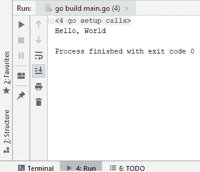

如你所见，我们只提取了整个短语中的*Hello, World*部分。如果索引中没有 0，它仍然可以工作。如果我们只想要这个字符串的*World*和*Mars*部分，索引可以是[6:]。

这就是你从字符串值中提取子字符串的方法。在我们的下一个视频中，我们将看到如何用另一个字符串替换字符串的一部分。

# 替换字符串的部分

在本节中，我们将看到如何快速将字符串的一部分替换为另一个值。在 Go 语言中进行字符串操作时，您会发现在字符串包下有许多实用方法。在这里，我们将使用相同的包来将字符串的一部分替换为另一个值。让我们回到我们的编辑器，看看我们如何开始这个过程。

因此，我将有一个`helloWorld`变量，并且我们将用*Mars*替换*World*。检查以下代码：

```go
package main
import (
 "strings"
 "fmt"
)
func main(){
 helloWorld := "Hello, World"
 helloMars := strings.Replace(helloWorld, "World", "Mars", 1)
 fmt.Println(helloMars)
}
```

下面的屏幕截图将解释我们刚刚看到的代码：

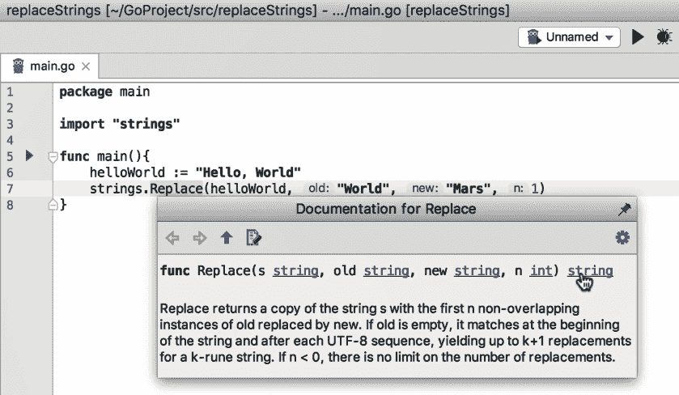

如屏幕截图所示，我们将使用`strings`包，它有一个`replace`函数，它接受我们要搜索的变量作为第一个参数，即*Hello, World*。旧字符串将是我们要替换的字符串中的内容，即*World*。新字符串将是*Mars*，我们要应用于此替换的重复次数将是'1'。

如果您看一下，此方法的签名返回另一个字符串，并且我们将其分配给另一个变量，在这种情况下是`helloMars`。因此，您将看到以下输出：

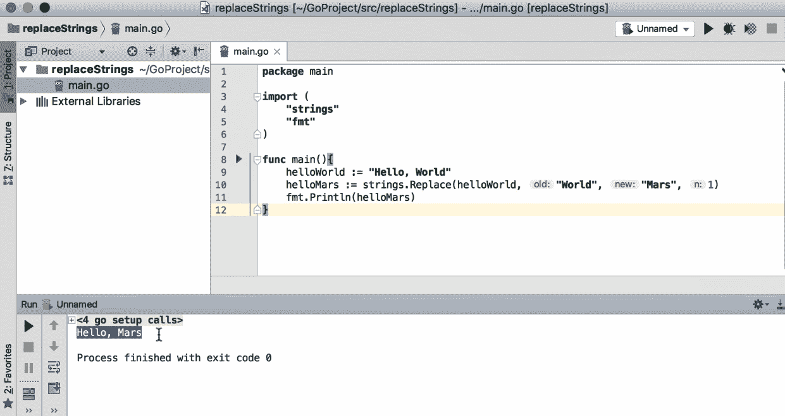

如您所见，我们已经用*Mars*替换了*World*。

现在，假设我们在句子中有多个*World*实例，并且您使用以下代码：

```go
package main
import (
 "strings"
 "fmt"
)
```

```go
func main(){
 helloWorld := "Hello, World. How are you World, I am good, thanks World."
 helloMars := strings.Replace(helloWorld, "World", "Mars", 1)
 fmt.Println(helloMars)
}
```

因此，如果您有这样的字符串值，使用 1 将无济于事。它只会用*Mars*替换第一个*World*出现，但其余部分仍将保留为*World*，如下面的屏幕截图所示：

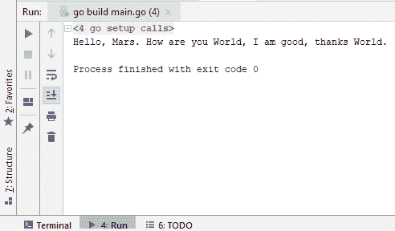

因此，您可以通过更改重复次数来替换尽可能多的*World*实例。例如，如果您想要用*Mars*替换前两个*World*实例，重复次数将为 2，依此类推。如果您想要用*Mars*替换所有*World*实例，一个快速简单的方法是使用减一，这有效地告诉 Go 用单词*Mars*替换您可以找到的字符串中的任何*World*实例。让我们运行以下代码：

```go
package main
import (
 "strings"
 "fmt"
)
```

```go
func main(){
 helloWorld := "Hello, World. How are you World, I am good, thanks World."
 helloMars := strings.Replace(helloWorld, "World", "Mars", -1)
 fmt.Println(helloMars)
}
```

上述代码将产生以下输出：

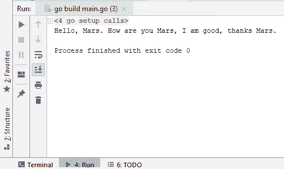

现在，所有*world*实例都已被单词*Mars*替换。Go 字符串包提供了许多其他选项，正如您所见，替换字符串真的很容易。在下一节中，我们将看到如何在字符串中转义字符。

# 在字符串中转义字符

在本节中，我们将看到如何转义字符串值中的特殊字符。与今天市场上许多其他语言类似，Go 以特殊方式处理某些字符。例如，如果 Go 在字符串值中看到\t 字符，它将将其视为制表符字符。此外，如果不进行转义，您无法在双引号内包含双引号，现在我们将看到如何转义它们以正确显示这些字符到我们的输出中。

像往常一样，我们将有我们的`main.go`文件和`main`函数。因此，让我们检查一个与之前类似的示例。

```go
package main
import "fmt"
func main(){
  helloWorld := "Hello World, this is Tarik."
}
```

因此，如果我想在术语 Tarik 周围包含双引号，我可以这样做，但是，正如您所看到的，它会给我一个编译时错误，如下面的屏幕截图所示：

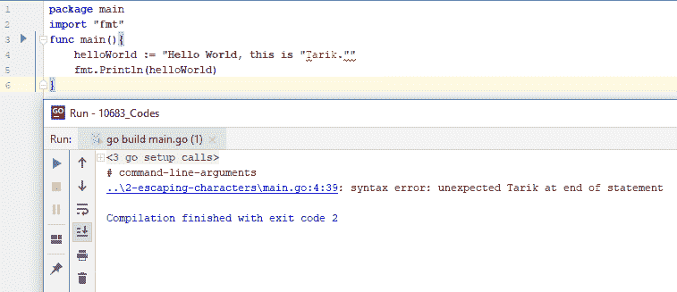

所以，让我们来修复这个问题。我所需要做的就是使用`\`。因此，每当您想要转义特殊字符时，都要用`\`进行转义。让我们继续并将其添加到我们的控制台：

```go
package main
import "fmt" 
func main(){
 helloWorld := "Hello World, this is \"Tarik.\""
fmt.Println(helloWorld)
}
```

上述代码的输出将如下所示：

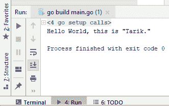

好了！正如您所看到的，它说 Hello World, this is "Tarik."，但 Tarik 被包含在两个双引号中，这是我们想要的。

现在还有其他问题。假设我想以某种原因输出`\t`而不带双引号：

```go
package main
import "fmt"
func main(){
 helloWorld := "Hello World, this is \"Tarik.\" \t"
fmt.Println(helloWorld)
}
```

看起来可以运行，既然我们没有看到任何编译时错误，我们可以继续运行。得到以下输出：

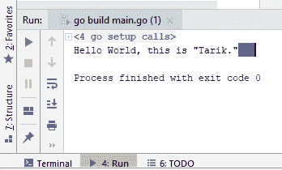

如您所见，\t 不会出现在控制台中；实际上，我看到了一个大制表符，因为这是一个特殊字符；\t 表示制表符。还有其他类似的特殊字符，例如\n，表示换行。因此，让我们尝试运行以下代码：

```go
package main
import "fmt"
func main(){
 helloWorld := "Hello World, this is \"Tarik.\" \t\nHello again."
 fmt.Println(helloWorld)
}
```

前面的代码将产生以下输出：

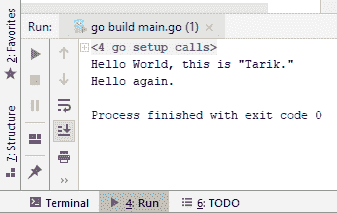

如您所见，`Hello again`不再在同一行上，而是放在了新的一行上。如果我删除/n 并再次运行代码，hello again 将回到同一行，我们还会因为特殊字符\t 而有一个大的空格：

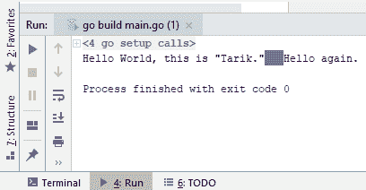

那么，我们如何转义\t？让我们看看如果包含另一个\会发生什么，并运行以下代码：

```go
package main
import "fmt"
func main(){
 helloWorld := "Hello World, this is \"Tarik.\" \\tHello again."
 fmt.Println(helloWorld)
}
```

如您在以下屏幕截图中所见，我们现在在字符串值中有了\t，Go 不再将其视为特殊字符：

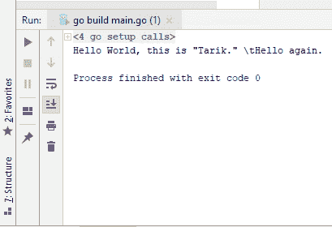

这就是在 Go 中使用转义字符的方法。在我们的下一节中，我们将看到如何轻松地将字符串值大写。

# 大写字符串值

在本节中，我们将看到如何在 Go 中大写单词。有多种方式可以大写句子中的单词；例如，您可能希望大写句子中的所有字母，或者只是所有单词的首字母，我们将看到如何做到这一点。

让我们回到我们的编辑器。前几个步骤与从字符串的开头和结尾修剪空格时一样。然而，在这里，我们有一个变量，其值为"hello world, how are you today"，我们希望只大写这个句子中所有单词的首字母。因此，我们之前在上一节中看到的 strings 包中有一个名为`title`的函数，该方法的签名也返回另一个字符串，我们可以将其赋给另一个变量，即`HelloWorldtitle`。为了继续，我们将不得不运行刚刚描述的代码：

```go
package main
import (
 "strings"
 "fmt"
)
func main(){
 helloWorld := "hello world, how are you today!"
 helloWorldtitle := strings.Title(helloWorld)
 fmt.Println(helloWorldtitle)
}
```

前面的代码将产生以下输出：

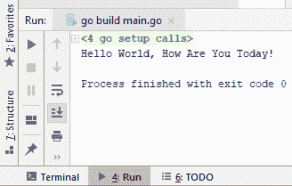

如您所见，该代码导致了句子中所有首字母的大写。现在，如果我们想要大写这个句子中的所有字母，我们将不得不使用新的`ToUpper`函数运行以下代码：

```go
package main
import (
 "strings"
 "fmt"
)
func main(){
 helloWorld := "hello world, how are you today!"
 helloWorldtitle := strings.Title(helloWorld)
 fmt.Println(helloWorldtitle)
helloWorldUpper := strings.ToUpper(helloWorld)
 fmt.Println(helloWorldUpper)
}
```

如果您打印`Ln`，它实际上会在新的一行中打印该字符串，而如果您不打印，它就不会这样做。我们刚刚看到的代码将产生以下输出：

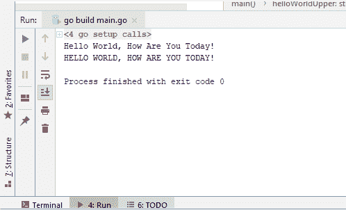

这就是关于大写字符串值的全部内容！

# 总结

在本章中，我们学习了如何从字符串的开头和结尾修剪空格，如何从字符串值中提取子字符串，如何替换字符串的部分内容，如何在字符串中转义字符，以及如何将字符串值大写。有了这些，我们已经完成了关于字符串操作的学习。下一章将描述如何在各种类型之间进行类型转换，我们将从将 pool 转换为字符串值开始。
