# 类型转换

在日常编程活动中，从一种类型转换为另一种类型是非常常见的操作，因此知道如何做到这一点非常重要。在本章中，我们将通过一些实际示例来学习如何轻松地将一种类型转换为另一种类型。

在本章中，我们将涵盖以下主题：

+   从字符串的开头和结尾修剪空格

+   从字符串值中提取子字符串

+   替换字符串的部分

+   在字符串中转义字符

+   大写字符串值

# 将布尔值转换为字符串

我们将从学习如何将`Boolean`值转换为`String`值开始：

1.  在我们的编辑器中，创建一个名为`main.go`的新文件和`main`函数后，让我们考虑一个名为`isNew`的变量，它是一个布尔值。因此值将是`true`。

1.  所以，假设我们想要将其打印到控制台并附上消息。请查看以下截图：

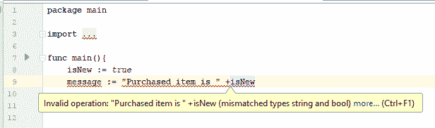

正如您所看到的，我们遇到了一个编译时错误。因此，您不能使用`+`运算符，我们需要将`isNew`布尔值转换为其字符串表示形式。

1.  让我们使用`stringconvert`包，其中有各种字符串转换函数，其中，我们将使用`FormatBool`。

1.  获取`Boolean`值返回其每个字符串表示形式，此时是`isNew`。如果您查看签名，您会看到它根据传递的布尔值的值返回 true 或 false：

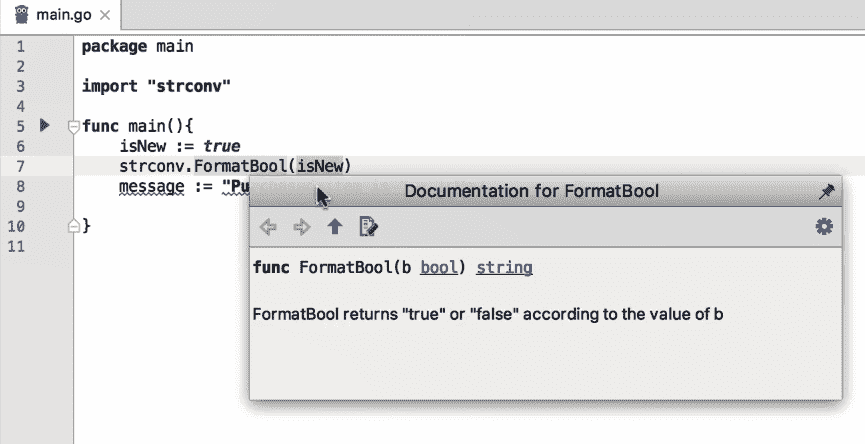

1.  所以，让我们添加`isNewStr`，运行它并检查输出：

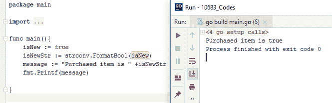

还有另一种将这些值打印到控制台的方法，称为`Printf`。它实际上可以将各种类型格式化到控制台。例如，我们可以使用之前介绍过的特殊字符。

请注意，我们不会为`Printf`使用`isNewStr`，因为现在我们可以使用任何类型，它将找到一个默认的字符串表示。

1.  此外，Go 不接受未使用的变量和未使用的包，因此，我们将注释掉`isNewStr := strconv.FormatBool(isNew)`并删除`isNewStr`。现在，我们可以运行以下代码：

```go
package main
import (
  "fmt"
)
func main(){
  isNew := true
  // isNewStr := strconv.FormatBool(isNew)
  message := "Purchased item is "
  fmt.Printf("%s %v", message, isNew)
}
```

1.  得到以下输出：

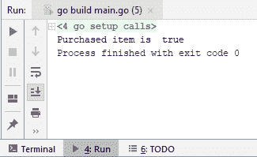

1.  现在，我们得到与之前相同的消息，这就是您如何轻松地将`Boolean`类型转换为`String`类型。

在下一节中，我们将看到如何将整数和浮点值转换为字符串。

# 将整数和浮点值转换为字符串

在本节中，我们将学习如何将整数和浮点值转换为字符串值。起初，这可能看起来有点复杂，但在本节之后，您将感到足够舒适以处理这些转换。所以让我们回到我们的编辑器，看看我们如何做到这一点。

# 将整数值转换为字符串值

让我们从将整数值转换为字符串值开始：

1.  在字符串转换包`strconv`下，我们有一堆可以用于这些转换的函数；其中一个函数是`FormatInt`。

1.  所以让我们继续使用十进制。您可以有不同的基数，比如 16、10 和 24。

1.  如果您查看签名，您会看到它返回一个字符串。

1.  现在，代码将不会完全按照我们想要的方式工作，但我们将看到原因并加以修复。当您运行先前描述的代码时，将获得以下输出：

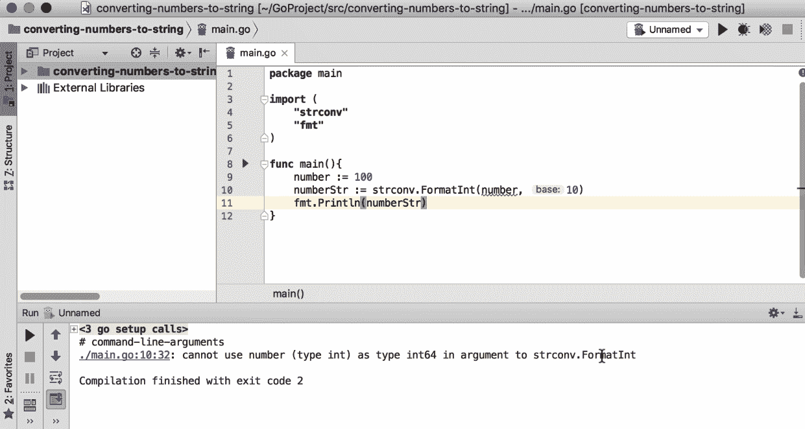

1.  现在，我们知道它接受 64 位整数类型；让我们修改代码并再次运行以获得以下输出：

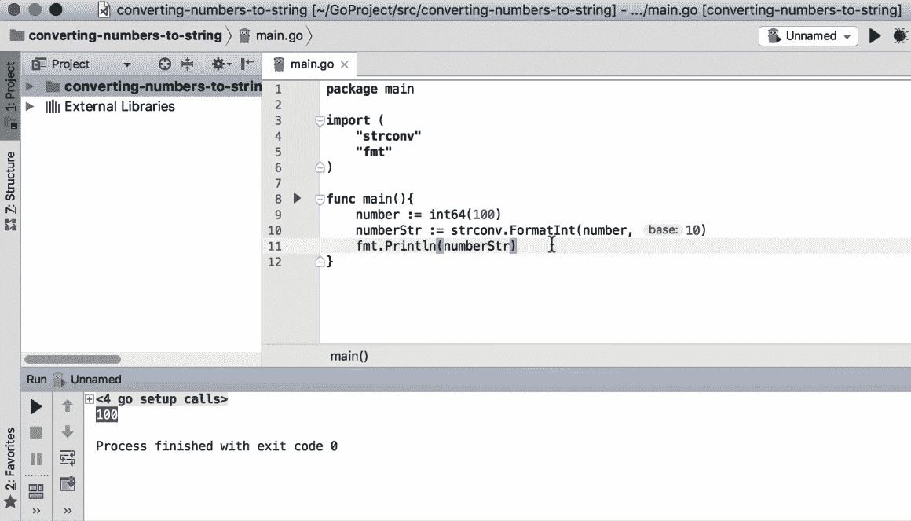

1.  我们得到`100`作为字符串值返回到我们的控制台。您可能不想一直这样做，因此这是您可以运行的代码：

```go
package main
import (
  "strconv"
  "fmt"
)
func main(){
  number := 100
  numberStr := strconv.Itoa(number)
  fmt.Println(numberStr)
}
```

1.  我们使用了一个不同的函数，它会自动将整数转换为 ASCII。运行代码后，我们得到以下输出：

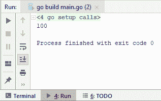

# 将浮点值转换为字符串值

让我们继续进行第二次转换，即将浮点值转换为字符串值：

1.  在这里，我们将为`numberFloat`有另一个数字，例如`23445221.1223`，并且我们将学习将其转换为缩小值。

1.  我们将考虑另一个函数，即`FormatFloat`。

1.  因此，让我们继续看一下签名：

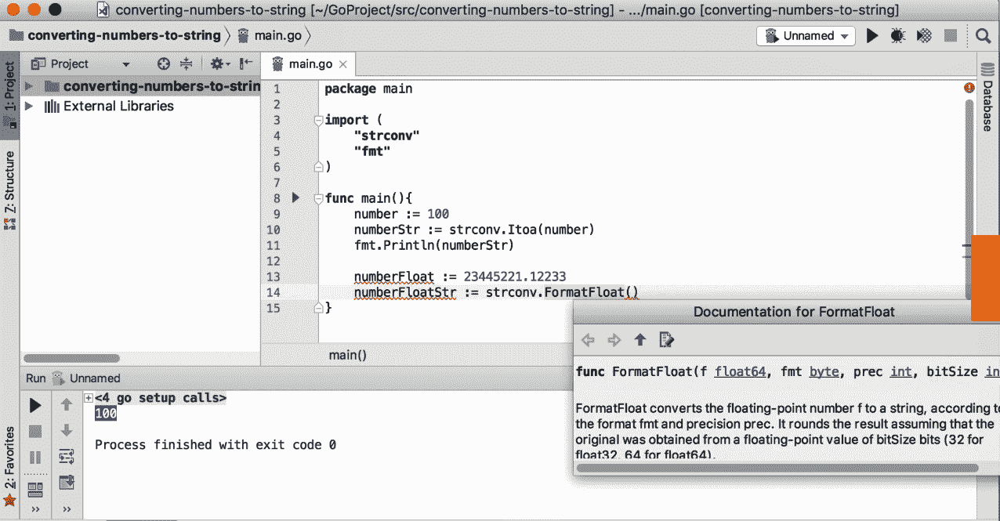

1.  首先，它希望我们传递一个浮点数`64`（我们也有浮点数`32`）；它们是`bitSizes`，表示浮点数的大小。我们有格式（`fmt`），可以使用各种字母，如*E*、*F*或*G*；例如，*G*用于大指数，*F*用于无指数。我们有精度，基本上告诉我们想要使用小数点后的数字有多远，位大小是浮点数`32`或浮点数`64`。我们可以根据情况添加所有这些实体。因此，您可以运行以下代码：

```go
package main
import (
 "strconv"
 "fmt"
)
func main(){
 number := 100
 numberStr := strconv.Itoa(number)
 fmt.Println(numberStr)
 numberFloat := 23445221.1223356
 numberFloatStr := strconv.FormatFloat(numberFloat, 'f', 5, 64 )
 fmt.Println(numberFloatStr)
}
```

1.  上述代码的输出将如下：

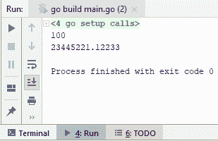

1.  让我们再玩一下精度；如果我们将其更改为`3`，您将获得以下输出：

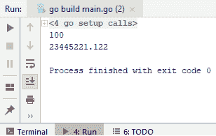

1.  输出只显示小数点后的三个字符或三个数字。如果您不知道小数点后需要多少位数，可以将精度设置为`-1`，输出将显示小数点后的所有数字；例如，检查以下代码：

```go
package main
import (
  "strconv"
  "fmt"
)
func main(){
  number := 100
  numberStr := strconv.Itoa(number)
  fmt.Println(numberStr)
  numberFloat := 23445221.1223356
  numberFloatStr := strconv.FormatFloat(numberFloat, 'f',-1,64 )
  fmt.Println(numberFloatStr)
}
```

1.  上述代码将给我们以下输出：

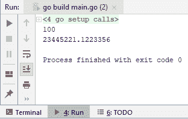

1.  因此，当您想显示所有内容但不知道小数点后的确切数字时，您可能希望使用精度为`-1`。

这就是您可以在 Go 中执行整数和浮点值转换为字符串值的方法。在下一节中，我们将看到如何将字符串值解析为布尔值。

# 将字符串值解析为布尔值

在本节中，我们将看到如何将字符串值转换为布尔值：

1.  因此，在我们的编辑器中，我们将有一个名为`isNew`的变量，这将是一个字符串值，是一个真值。我们将使用一个名为`strconv`的包，其中有`ParseBool`。它返回两件事：一个是布尔值，另一个是错误。因此，让我们检查以下代码：

```go
package main
import (
  "strconv"
  "fmt"
)
```

```go
func main(){
  isNew := "true"
  isNewBool, err := strconv.ParseBool(isNew)
  if(err != nil){
    fmt.Println("failed")
  }else{
    if(isNewBool){
      fmt.Print("IsNew")
    }else{
      fmt.Println("Not new")
    }
  }
}
```

1.  您应该检查错误是否不为 nil。这将意味着发生了错误，我们将不得不处理它。例如，我们只会输出一些失败消息，即`failed`。

1.  如果在其他语言中它不是 nil，但在这里它是 nil，那么我们将不得不检查`isNew`布尔值。如果看起来没问题，我们将`IsNew`写入输出，或者`Not new`。

1.  运行代码后，您将获得以下输出：

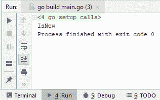

1.  如您所见，它通过了并且没有抛出异常。如果`true`更改为`false`，我们将获得`Not new`的输出。当然，`ParseBool`方法足够灵活，可以接受各种字符串值。

1.  如果您查看以下截图中的签名，您将看到`T`、`TRUE`、`true`等：

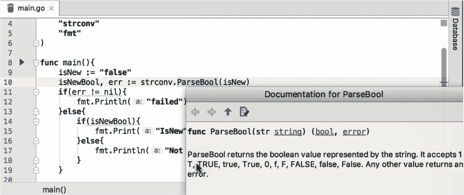

1.  如果我们输入`1`而不是`true`，输出仍将是`IsNew`；如果我们输入`0`、`F`或`f`，它将转换为`false`，并输出`Not new`。

1.  让我们看看如果我们传入`J`会发生什么：

```go
package main
import (
  "strconv"
  "fmt"
)
func main(){
  isNew := "j"
  isNewBool, err := strconv.ParseBool(isNew)
  if(err != nil){
    fmt.Println("failed")
  }else{
    if(isNewBool){
      fmt.Print("IsNew")
    }else{
      fmt.Println("Not new")
    }
  }
}
```

1.  代码将输出以下内容：

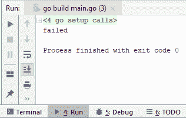

1.  如您所见，输出将是`failed`。

在下一节中，我们将向您展示如何将字符串值解析为整数和浮点类型。

# 将字符串值解析为整数和浮点类型

在本节中，我们将看到如何将字符串值解析为整数和浮点类型。

# 将字符串值解析为整数类型

假设我们有一个名为`number`的变量，它的字符串值为`2`。我们将使用`strconv.ParseInt`，它返回两个变量：第一个是我们期望的实际整数，另一个是在转换过程中发生错误时出现的返回变量。

如果你看一下签名，你会看到它返回整数`64`和一个错误：

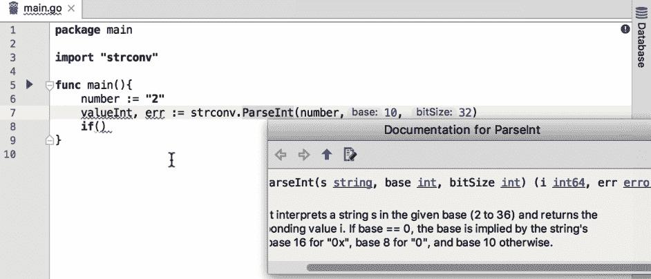

因此，我们可以首先检查在转换过程中是否发生了任何错误；如果不是 nil，我们就可以理解发生了某些事情，然后打印`Error happened`。

在 Go 中没有`try...catch`，所以如果要编写弹性代码，就必须始终进行错误检查。

现在，对于`if`检查，如果数字是`2`，我们可以输出`Success`。现在，让我们运行如下描述的代码：

```go
package main
import (
  "strconv"
  "fmt"
)
func main(){

  number := "2"
  valueInt, err := strconv.ParseInt(number, 10, 32)
  if err != nil {
    fmt.Print("Error happened.")
  } else {
    if valueInt == 2{
      fmt.Println("Success")
    }
  }
}
```

代码的输出将如下所示：

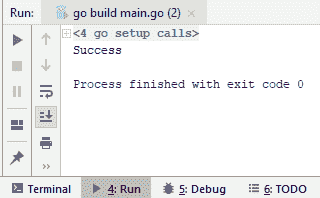

转换成功了。你也可以尝试 64 位，结果是一样的。好了！这是从字符串转换为整数。

# 将字符串值解析为浮点数

现在，让我们来检查将字符串值解析为浮点数。首先，我们将使用与将字符串值解析为浮点数相同的代码，只进行了轻微的修改。修改后的代码如下：

```go
package main
import (
  "strconv"
  "fmt"
)
func main(){

  numberFloat := "2.2"
  valueFloat, errFloat := strconv.ParseFloat(numberFloat, 64)
  if errFloat != nil {
    fmt.Print("Error happened.")
  } else {
    if valueFloat == 2.2 {
      fmt.Println("Success")
    }
  }
}
```

运行代码后，返回一个`Success`消息。这意味着我们的转换成功了，我们成功地从`ParseFloat`方法中得到了`2.2`。

在下一节中，我们将学习如何将字节数组转换为字符串。

# 将字节数组转换为字符串

在本节中，我们将学习如何将字节数组转换为字符串：

关于本教程，你需要知道的最重要的事情是，在 Go 中，字符串变量只是字节切片。因此，将字节数组转换为字符串值和将字符串值转换为字节数组非常容易。

1.  让我们看看如何开始。假设你有一个`helloWorldByte`数组；目前，它是一个字节数组，但你可以从任何流中获取它，比如网络或文件。

```go
package main

import "fmt"

func main(){
  helloWorldByte := []byte{72, 101, 108, 108, 111, 44, 32, 87, 111, 114, 108, 100}
  fmt.Println(string(helloWorldByte))
}
```

1.  我们还有字符串构造，它使将字节数组转换为其字符串表示变得非常容易。我们将使用`fmt.Println`来打印`helloWorldByte`的字符串表示，并运行代码。

1.  因此，让我们运行代码并检查输出：

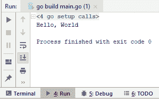

1.  正如你所看到的，我们非常简单地将整个字节数组转换为了字符串表示。如果你想将字符串转换为字节数组，也可以使用一个字节来做同样的事情。让我们快速地做一下。检查以下代码：

```go
package main
import "fmt"
func main(){
  helloWorld := "Hello, World"
  fmt.Println([]byte(helloWorld))
}
```

1.  运行代码后，我们得到以下输出：

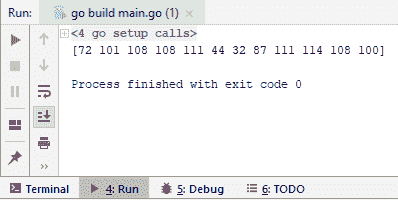

将字节数组转换为字符串结束了第三章，*类型转换*。

# 总结

在本章中，我们涵盖了从字符串开头和结尾修剪空格、从字符串值中提取子字符串、替换字符串的部分、在字符串中转义字符以及将字符串值大写。在第四章中，*日期和时间*，我们将学习日期和时间的用法，并首先学习如何找到今天的日期和时间。
