# 日期和时间

在本章中，我们将学习如何在 Go 编程语言中处理日期和时间。你将学习如何对`DateTime`值进行基本操作，比如找到两个日期之间的差异、获取今天的日期、对`DateTime`值进行简单的算术运算以及从字符串值中解析日期。本章将涵盖以下主题：

+   找到今天的日期和时间

+   从日期中添加和减去

+   找到两个日期之间的差异

+   从字符串中解析日期和时间

# 找到今天的日期和时间

在本节中，我们将学习如何找到今天的日期和时间。我们可以使用`time.Now`来获取今天的日期，它导入了一个`time`包，`time`返回一个`time`类型，因此我们将其分配给另一个变量并使用`String`函数。以下代码将帮助你更好地理解：

```go
package main

import (
  "time"
  "fmt"
)

func main(){
  current := time.Now()
  fmt.Println(current.String())
}
```

前面代码的输出如下：

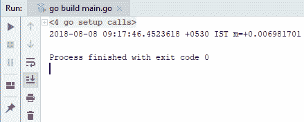

如你所见，我们得到了一个包含所有内容的大字符串，当然，我们可以根据需要进行格式化。例如，我可以添加`current.Format`函数和一个预定义的布局，如下面的截图所示：

```go
package main

import (
 "time"
 "fmt"
)

func main(){
 current := time.Now()
 fmt.Println(current.String())

 fmt.Println("MM-DD-YYYY :", current.Format("01-02-2006"))
}
```

在前面截图中显示的代码的输出如下：

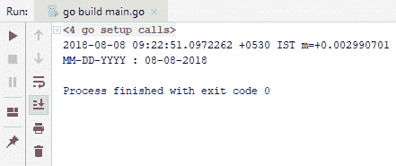

在前面的截图中，你会看到今天的日期。你也可以通过绕过布局`snf`，提及你想要的输出格式(`YYYY-MM-DD hh:mm:ss`)，来同时获得时间和日期，如下面的代码所示：

```go
package main

import (
  "time"
  "fmt"
)

func main(){
  current := time.Now()
  fmt.Println(current.String())

  fmt.Println("MM-DD-YYYY :", current.Format("01-02-2006"))

  fmt.Println("YYYY-MM-DD hh:mm:ss", current.Format("2006-01-02 15:04:05"))
}
```

在运行前面截图中提到的代码时，我们得到了以下输出，其中包括年、月、日和时间信息。可以在以下截图中看到：

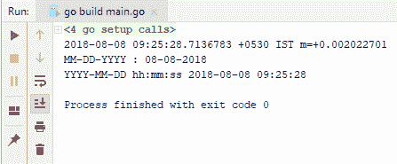

因此，这就是你如何简单地获取今天的日期，并以各种方式在 Go 语言中进行格式化。在下一节中，我们将学习如何对日期值进行添加或减去。

# 从日期中添加和减去

在本节中，我们将学习如何对日期值进行添加和减去操作。

# 添加日期

让我们继续学习如何向当前日期添加一个月。但在这之前，我们需要知道当前日期。你可以按照我们在上一节中学到的步骤来做到这一点。假设我得到了 8 月 8 日(`2018-08-08 09:35:16.2687997 +0530 IST m=+0.003951601`)作为输出，我们需要在这个值上再添加一个月。通过在`time`类型上使用`AddDate`函数，我们可以添加任意多的年、月和日，因为它接受三个参数。整个代码将如下所示：

```go
package main

import (
  "time"
  "fmt"
)

func main(){
  current := time.Now()
  septDate := current.AddDate(0,1,0)

  fmt.Println(current.String())
  fmt.Println(septDate.String())
}
```

因此，从输出的下面截图中，你会注意到我们通过将值`1`传递给第二个参数，成功地向八月添加了一个额外的月份：

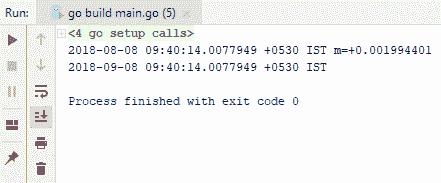

我们可以执行相同的步骤来添加年份。你可以将`years:`参数更改为`1`，并将输出中的`2018`更改为`2019`。这可以在下面的截图中看到：

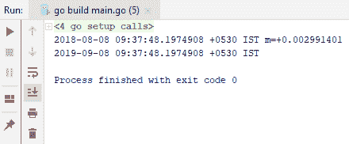

这就是你如何添加日期值。

# 从日期中减去

我们要学习的第二件事是如何从当前日期中减去日期。如你在下面的代码行中所见，我们使用了`Sub`方法，因为它接受另一个`time`类型：

```go
septDate.Sub(time.Date(2000, 1, 1, 0, 0, 0, 0, time.UTC))
```

相反，我们将使用`AddDate`并向参数传递一个负值。因此，让我们将其分配给另一个变量并运行以下代码：

```go
package main

import (
  "time"
  "fmt"
)

func main(){
  current := time.Now()
  septDate := current.AddDate(1,1,0)

  fmt.Println(current.String())
  fmt.Println(septDate.String())

  //septDate.Sub(time.Date(2000, 1, 1, 0, 0, 0, 0, time.UTC))

  oneLessYears := septDate.AddDate(-1,0,0)
  fmt.Println(oneLessYears.String())
}
```

以下代码的输出将如下所示：

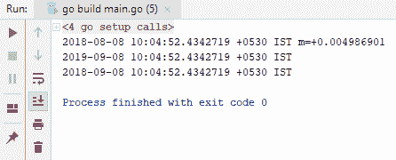

如你所见，我们通过从`2019`中减去`1`获得了`2018`。

# 添加时间

现在，假设你需要添加时间而不是月份或年份。为了继续，我们必须使用`Add`，它有`duration`，即你想要添加的时间量。

例如，让我们假设我们想要添加 10 分钟。检查以下代码：

```go
package main

import (
  "time"
  "fmt"
)

func main(){
  current := time.Now()
  septDate := current.AddDate(1,1,0)

  fmt.Println(current.String())
  fmt.Println(septDate.String())

  //septDate.Sub(time.Date(2000, 1, 1, 0, 0, 0, 0, time.UTC))

  oneLessYears := septDate.AddDate(-1,0,0)
  fmt.Println(oneLessYears.String())

  tenMoreMinutes := septDate.Add(10 * time.Minute)
  fmt.Println(tenMoreMinutes)
}
```

该代码返回另一种类型或值，即`time`类型，如果您查看输出，将会看到我们在 9 月的日期上添加了 10 分钟：

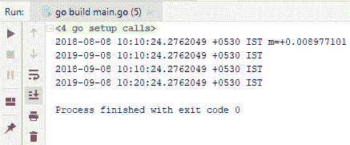

现在，如果我看一下输出，我们可以看到我们添加了`10`分钟，所以`10:10:24`变成了`10:20:24`。如果我将`Minute`改为`Hour`，然后运行代码，我们将看到我们从 9 月的日期中添加了`10`小时，可以在以下代码块中看到：

```go
package main

import (
  "time"
  "fmt"
)

func main(){
  current := time.Now()
  septDate := current.AddDate(1,1,0)

  fmt.Println(current.String())
  fmt.Println(septDate.String())

  oneLessYears := septDate.AddDate(-1,0,0)
  fmt.Println(oneLessYears.String())

  tenMoreMinutes := septDate.Add(10 * time.Hour)
  fmt.Println(tenMoreMinutes)
}
```

我们将得到以下输出：

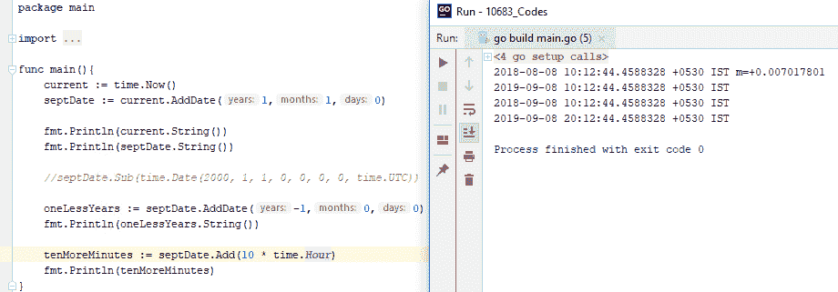

所以，这基本上就是您进行时间添加的方法。在我们的下一节中，我们将看到如何找到两个日期值之间的差异。

# 查找两个日期之间的差异

在本节中，我们将学习如何找到两个日期之间的差异。假设我们有两个日期，如下面的代码块所示，您将看到此方法的签名是不言自明的。因此，我们只需使用以下代码来减去第一个日期：

```go
package main

import (
  "time"
  "fmt"
)

func main(){
  first := time.Date(2017, 1,1,0,0,0,0,time.UTC)
  second := time.Date(2018, 1,1,0,0,0,0,time.UTC)

  difference := second.Sub(first)
  fmt.Printf("Difference %v", difference)
}
```

现在，在我们运行代码并获得输出之前，如果您检查签名，您将看到该方法返回`Duration`而不是日期之间的`Time`类型：

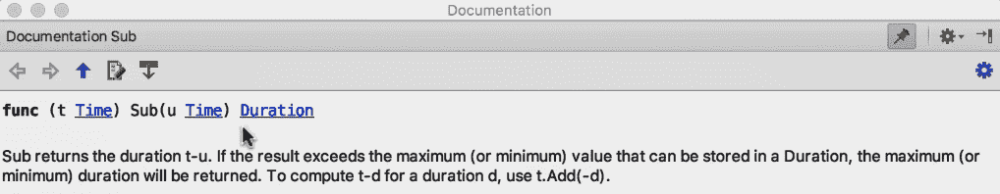

回到运行我们的代码，您将看到以下输出：

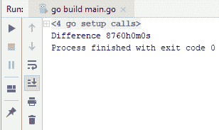

这就是您简单地找到两个日期之间的差异。在我们的下一节中，我们将学习如何从给定的字符串中解析日期和时间。

# 解析字符串中的日期和时间

在本节中，我们将学习如何从字符串中解析日期和时间。本节将结束我们的章节。当您从字符串中解析日期和时间时，您需要两样东西：第一是布局，第二样是您想要解析的实际字符串。所以，让我们假设我们有一个变量，其中包含`str := "2018-08-08T11:45:26.371Z"`的字符串值。

为了让 Go 理解这一点，您需要提供一个`layout`属性。`layout`属性基本上描述了您的字符串`DateTime`的外观；它以年份开头，然后是月份，日期，然后是时间。与往常一样，`time`包为我们提供了各种实用函数，我们可以用来操作日期和时间。`Parse`方法返回两样东西，一个是解析日期，另一个是错误。如果在解析过程中发生任何错误，将会抛出一个错误，我们可以检查错误并查看出了什么问题，否则我们将只输出当前时间和我们解析的时间的字符串表示。所以，让我们运行以下代码：

```go
package main

import (
  "time"
  "fmt"
)

func main(){
  str := "2018-08-08T11:45:26.371Z"
  layout := "2006-01-02T15:04:05.000Z"
  t,err := time.Parse(layout, str)
  if err != nil{
    fmt.Println(err)
  }
  fmt.Println(t.String())
}
```

我们运行的代码的输出如下：

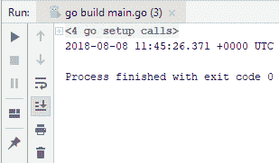

正如您所看到的，我们准确地捕获了我们试图解析的日期。这就是您在 Go 中进行解析的方法。

# 总结

在本章中，我们学习了如何找到当前日期和时间，如何在日期上添加和减去，如何找到两个日期之间的差异，以及如何从字符串中解析日期和时间。在下一章中，您将学习如何在 Go 语言中使用映射和数组。您将看到操作和迭代数组的实际示例，合并数组和映射，以及测试映射中是否存在键。
