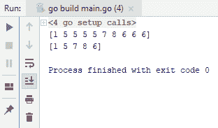
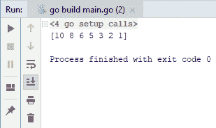
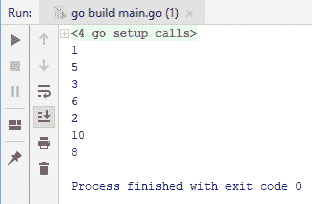
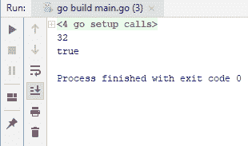
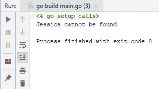
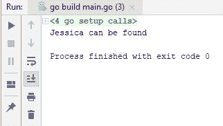

# 映射和数组

在本章中，您将学习如何在 Go 中使用映射和数组。您将看到操作和迭代数组、合并数组和映射以及测试映射中是否存在键的实际示例。在本章中，我们将介绍以下配方：

+   从列表中提取唯一的元素

+   从数组中查找元素

+   反转数组

+   迭代数组

+   将映射转换为键和值的数组

+   合并数组

+   合并映射

+   测试映射中是否存在键

# 从数组中提取唯一的元素

首先，我们将学习如何从列表中提取唯一的元素。首先，让我们想象我们有一个包含重复元素的切片。

现在，假设我们想提取唯一的元素。由于 Go 中没有内置的构造，我们将制作自己的函数来进行提取。因此，我们有`uniqueIntSlice`函数，它接受`intSlice`或`intarray`。我们的唯一函数将接受`intSlice`，并返回另一个切片。

因此，这个函数的想法是在一个单独的列表中跟踪重复的元素，如果一个元素在我们给定的列表中再次出现，那么我们就不会将该元素添加到我们的新列表中。现在，看看以下代码：

```go
package main
import "fmt"
func main(){
  intSlice := []int{1,5,5,5,5,7,8,6,6, 6}
  fmt.Println(intSlice)
  uniqueIntSlice := unique(intSlice)
  fmt.Println(uniqueIntSlice)
}
func unique(intSlice []int) []int{
  keys := make(map[int]bool)
  uniqueElements := []int{}
  for _,entry := range intSlice {
    if _, value := keys[entry]; !value{
      keys[entry] =true
      uniqueElements = append(uniqueElements, entry)
    }
  }
  return uniqueElements
}
```

所以，我们将有`keys`，它基本上是一个映射，在其他语言中称为字典。我们将有另一个切片来保存我们的`uniqueElements`，我们将使用`for each`循环来迭代每个元素，并将其添加到我们的新列表中，如果它不是重复的。我们通过传递一个`entry`来基本上获取我们的值；如果值是`false`，那么我们将该条目添加到我们的键或映射中，并将其值设置为`true`，以便我们可以看到这个元素是否已经出现在我们的列表中。我们还有一个内置的`append`函数，它接受一个切片，并将条目附加到我们的切片末尾，返回另一个切片。运行代码后，您应该获得以下输出：



如果您看一下第一个数组，会发现有重复的元素：多个`6`和`5`的实例。在我们的新数组或切片中，我们没有任何重复项，这就是我们从列表中提取唯一元素的方法。

在下一节中，我们将学习如何在 Go 中从数组中查找元素。

# 从数组中查找元素

在本节中，我们将学习如何从数组或切片中查找元素。有许多方法可以做到这一点，但在本章中，我们将介绍其中的两种方法。假设我们有一个变量，其中包含一系列字符串。在这个切片中搜索特定字符串的第一种方法将使用`for`循环：

```go
package main
import (
 "fmt"
 "sort"
)
func main() {
 str := []string{"Sandy","Provo","St. George","Salt Lake City","Draper","South Jordan","Murray"}
 for i,v := range str{
 if v == "Sandy" {
 fmt.Println(i)
 }
 }
}
```

运行上述代码后，我们发现单词`Sandy`在索引`0`处：


另一种方法是使用排序，我们可以先对切片进行排序，然后再搜索特定的项目。为了做到这一点，Go 提供了一个`sort`包。为了能够对切片进行排序，切片需要实现`sort`包需要的各种方法。`sort`包提供了一个名为`sort.stringslice`的类型，我们可以将我们的`stringslice`转换为`sort`提供的`StringSlice`类型。在这里，`sortedList`没有排序，所以我们必须显式对其进行排序。现在，看看以下代码：

```go
package main
import (
  "fmt"
  "sort"
)
func main() {
  str := []string{"Sandy","Provo","St. George","Salt Lake City","Draper","South Jordan","Murray"}
  for i,v := range str{
    if v == "Sandy" {
      fmt.Println(i)
    }
  }
  sortedList := sort.StringSlice(str)
  sortedList.Sort()
  fmt.Println(sortedList)
}
```

该代码将给出以下输出：


你可以看到`Draper`先出现，然后是`Murray`，基本上是按升序排序的。现在，要在这里搜索特定的项目，例如`Sandy`，只需在`main`函数中添加以下代码行：

```go
index := sortedList.Search("Sandy")
fmt.Println(index)
```

运行整个代码后，获得以下输出：


它输出`4`，这是单词`Sandy`的位置。这就是如何在数组中找到一个元素。同样的方法也适用于数字；例如，如果您查看`sort`包，您会发现`IntSlice`。使用整数切片确实简化了所有数字的排序和搜索操作。在我们的下一节中，我们将看到如何对数组进行反转。

# 反转一个数组

在本节中，我们将学习如何对数组进行反向排序。我们将有一个变量，它保存了一组数字的切片。由于您现在熟悉了 Go 中的`sort`包，您会知道`sort`包提供了许多功能，我们可以用来对数组和切片进行排序。如果您查看`sort`包，您会看到许多类型和函数。

现在，我们需要`sort`函数，它接受一个接口，这个接口在`sort`包中定义；因此，我们可以称之为`Sort`接口。我们将把我们的数字切片转换成一个接口。看看以下代码：

```go
package main
import (
  "sort"
  "fmt"
)
func main() {
  numbers := []int{1, 5, 3, 6, 2, 10, 8}
  tobeSorted := sort.IntSlice(numbers)
  sort.Sort(tobeSorted)
  fmt.Println(tobeSorted)
}
```

这段代码将给出以下输出：


如果您查看输出，您会发现我们已经按升序对数字进行了排序。如果我们想按降序对它们进行排序呢？为了能够做到这一点，我们有另一种类型叫做`Reverse`，它实现了不同的函数来按降序对事物进行排序。看看以下代码：

```go
package main
import (
  "sort"
  "fmt"
)
func main() {
  numbers := []int{1, 5, 3, 6, 2, 10, 8}
  tobeSorted := sort.IntSlice(numbers)
  sort.Sort(sort.Reverse(tobeSorted))
  fmt.Println(tobeSorted)
}
```

运行代码后，我们得到以下输出，您会看到数字按降序排列：



在下一节中，我们将看到如何遍历一个数组。

# 遍历一个数组

在本节中，我们将学习如何遍历一个数组。遍历一个数组是 Go 编程中最基本和常见的操作之一。让我们去我们的编辑器，看看我们如何轻松地做到这一点：

```go
package main

import "fmt"

func main(){
  numbers := []int{1, 5, 3, 6, 2, 10, 8}

  for index,value := range numbers{
     fmt.Printf("Index: %v and Value: %v\n", index, value)
  }
}
```

我们从上述代码中获得以下输出：


这就是您如何轻松地遍历各种类型的切片，包括字符串切片、字节切片或字节数组。

有时，您不需要`index`。在这种情况下，您可以使用下划线(`_`)来忽略它。这意味着您只对值感兴趣。为了执行这个操作，您可以输入以下代码：

```go
package main

import "fmt"

func main(){
  numbers := []int{1, 5, 3, 6, 2, 10, 8}
  for _,value := range numbers{
    // fmt.Printf("Index: %v and Value: %v\n", index, value)
    fmt.Println(value)
  }
}
```

这段代码的输出将如下所示：



这就是您如何轻松地遍历各种类型的切片。在下一节中，我们将看到如何将一个 map 转换成一个键和值的数组。

# 将一个 map 转换成一个键和值的数组

在本节中，我们将看到如何将一个 map 转换成一个键和值的数组。让我们想象一个名为`nameAges`的变量，它有一个`map`，如下面的代码块所示，我们将字符串值映射到整数值。还有名字和年龄。

我们需要添加一个名为`NameAge`的新结构，它将有`Name`作为字符串和`Age`作为整数。我们现在将遍历我们的`nameAges`映射。我们将使用一个`for`循环，当您在映射类型上使用范围运算符时，它会返回两个东西，一个键和一个值。因此，让我们编写这段代码：

```go
package main
import "fmt"
type NameAge struct{
  Name string
  Age int
}
func main(){
  var nameAgeSlice []NameAge
  nameAges := map[string]int{
    "Michael": 30,
    "John": 25,
    "Jessica": 26,
    "Ali": 18,
  }
  for key, value := range nameAges{
    nameAgeSlice = append(nameAgeSlice, NameAge {key, value})
  }

  fmt.Println(nameAgeSlice)

}
```

运行上述代码后，您将获得以下输出：


这就是如何将一个 map 轻松转换成一个数组。在下一节中，我们将学习如何在 Go 中合并数组。

# 合并数组

在本节中，我们将看到如何在 Go 中轻松合并两个数组。假设我们有两个数组，我们将把它们合并。如果您之前使用过`append`，您会知道它可以接受任意数量的参数。让我们看看以下代码：

```go
package main
import "fmt"
func main(){
  items1 := []int{3,4}
  items2 := []int{1,2}
  result := append(items1, items2...)
  fmt.Println(result)
}
```

运行以下代码后，您将获得以下输出：


现在，我们在输出中看到了`[3 4 1 2]`。你可以向数组中添加更多的值，仍然可以合并它们。这就是我们如何在 Go 中轻松合并两个数组。在下一节中，我们将看到如何这次合并地图。

# 合并地图

在本节中，我们将学习如何合并地图。查看以下截图中的两张地图：


正如你所看到的，有四个项目，这些地图基本上是将一个字符串映射到一个整数。

如果你不使用逗号，就像在上述截图中`22`后面所示的那样，你将得到一个编译时异常。这是因为在 Go 中自动添加了一个分号，这在这段代码中是不合适的。

好的，让我们继续合并这两张地图。不幸的是，没有内置的方法可以做到这一点，所以我们只需要迭代这两张地图，然后将它们合并在一起。查看以下代码：

```go
package main
import "fmt"
func main(){
  map1 := map[string]int {
   "Michael":10,
   "Jessica":20,
   "Tarik":33,
   "Jon": 22,
  }
  fmt.Println(map1)

  map2 := map[string]int {
    "Lord":11,
    "Of":22,
    "The":36,
    "Rings": 23,
  }
  for key, value := range map2{
    map1[key] = value
  }
  fmt.Println(map1)
}
```

上述代码的输出如下：


好的，第一行，你可以看到，只有我们使用的初始元素，第二行包含基本上所有的东西，也就是来自`map2`的所有项目。这就是你可以快速将两张地图合并成一张地图的方法。在下一节中，我们将学习如何测试地图中键的存在。

# 测试地图中键的存在

在本节中，我们将看到如何检查给定地图中键是否存在。因此，我们有一个地图`nameAges`，它基本上将名字映射到年龄。查看以下代码：

```go
package main
import "fmt"
func main() {
  nameAges := map[string]int{
    "Tarik": 32,
    "Michael": 30,
    "Jon": 25,
  }

  fmt.Println(nameAges["Tarik"])
}
```

如你从以下截图中所见，我们基本上从`Tarik`键中获取了值。因此，它只返回了一个值，即`32`：


然而，还有另一种使用这个地图的方法，它返回两个东西：第一个是值，第二个是键是否存在。例如，查看以下代码：

```go
package main
import "fmt"
func main() {
  nameAges := map[string]int{
    "Tarik": 32,
    "Michael": 30,
    "Jon": 25,
  }

  value, exists := nameAges["Tarik"]
  fmt.Println(value)
  fmt.Println(exists)
}
```

输出将如下所示：



正如你所看到的，代码返回`true`，因为地图中存在`Tarik`，存在于`nameAges`中。现在，如果我们在地图中输入一个不存在的名字会怎么样呢？如果我们在`nameAges`中用`Jessica`替换`Tarik`，代码将返回`0`和`false`，而不是之前得到的`32`和`true`。

此外，你可以使用 Go 的`if`条件，这是一个条件检查。查看以下代码：

```go
package main
import "fmt"
func main() {
  nameAges := map[string]int{
    "Tarik": 32,
    "Michael": 30,
    "Jon": 25,
  }
  if _, exists := nameAges["Jessica"]; exists{
    fmt.Println("Jessica has found")
  }else {
    fmt.Println("Jessica cannot be found")
  }
}
```

如果你查看以下输出，你会看到我们得到了`Jessica 找不到`：



这意味着它不存在。现在，如果我将`Jessica`添加到地图中并运行以下代码会怎么样：

```go
package main
import "fmt"
func main() {
  nameAges := map[string]int{
    "Tarik": 32,
    "Michael": 30,
    "Jon": 25,
    "Jessica" : 20,
  }
  if _, exists := nameAges["Jessica"]; exists{
    fmt.Println("Jessica can be found")
  }else {
    fmt.Println("Jessica cannot be found")
  }
}
```

如你从上述代码的输出中所见，代码返回`Jessica 可以找到`：



实际上，我们甚至可以在`if`后面添加一个`value`，就像我们之前看到的那样，并用以下代码打印出`value`：

```go
package main
import "fmt"
func main() {
  nameAges := map[string]int{
    "Tarik": 32,
    "Michael": 30,
    "Jon": 25,
    "Jessica" : 20,
  }
  if value, exists := nameAges["Jessica"]; exists{
    fmt.Println(value)
  }else {
    fmt.Println("Jessica cannot be found")
  }
}
```

我们将得到以下输出：


这就是你可以简单地查看给定地图中键是否存在的方法。

# 总结

本章带你了解了许多主题，比如从列表中提取唯一元素，从数组中找到一个元素，反转一个数组，将地图转换为键和值的数组，合并数组，合并地图，以及测试地图中键的存在。在第六章中，*错误和日志*，我们将看到有关错误和日志的用法，我们将从在 Go 中创建自定义错误类型开始。
