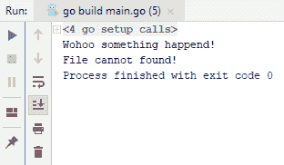
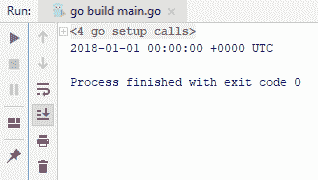
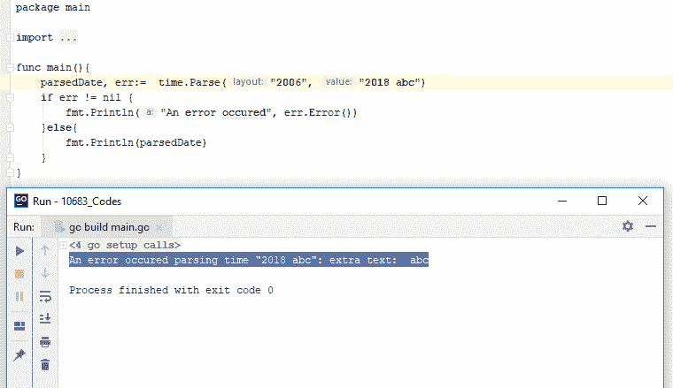
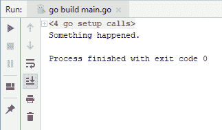
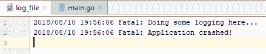
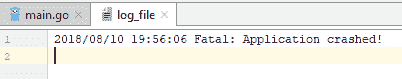
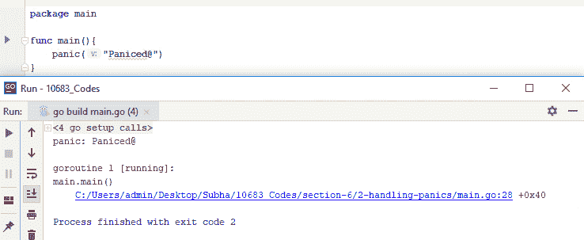
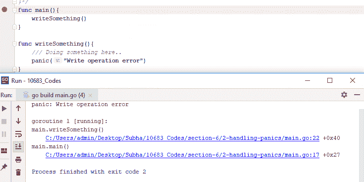
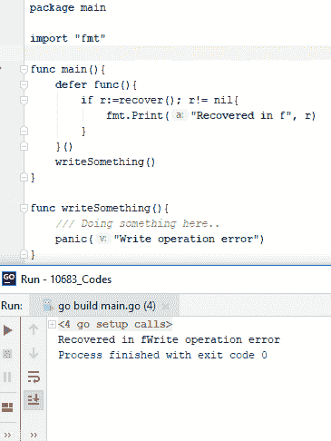
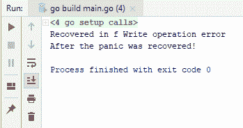

# 错误和日志记录

在本章中，我们将学习如何处理错误并在需要时返回错误。Go 的错误机制与一些其他流行语言的不同，本节将教你如何按照 Go 的方式处理错误。我们还将学习如何在应用程序中执行简单的日志记录操作，以便更好地调试你的运行应用程序。在本章中，我们将涵盖以下主题：

+   创建自定义错误类型

+   在 Go 中的 try...catch 等价物

+   在你的应用程序中进行简单的日志记录

+   优雅地处理 panic

# 创建自定义错误类型

让我们从创建自定义错误类型开始。如果你来自 C#和 Java 等语言，你可能会发现 Go 中的错误机制有些不同。此外，创建自定义错误的方式非常简单，因为 Go 是一种鸭子类型的语言，这意味着只要你的结构满足一个接口，你就可以使用。让我们继续使用一个新类型创建我们自己的自定义错误。所以，我将有两个字段，`ShortMessage`和`DetailedMessage`，类型为字符串。你可以有尽可能多的字段，以捕获有关错误的更多信息。此外，为了满足`error`接口，我将实现一个新方法，`*MyError`，它将返回一个`string`值，我们可以将这个错误输出到控制台或某个日志文件中。

然后，我要做的是返回错误消息。所以，你可以很简单地从你的方法中返回这个错误类型。假设我们有一个`doSomething`方法返回一个错误。假设我们在该方法中做了一些代码，并且由于某种原因返回了一个错误，比如一个`ShortMessage`实例为`"Wohoo something happened!"`。当然，你可能需要在这里使用更有意义的消息，并且不要忘记使用`&`运算符。它将获取你的`*MyError`对象的地址，因为我们在这里使用的是指针。如果你不这样做，你会看到有一个类型错误，修复这个错误的一种方法是删除那个`*`指针，错误就会被修复。但你可能不想有多个相同对象的副本，所以不要按照我刚刚描述的做法，你可以很容易地这样做：发送一个引用回去，这样你就有更好的内存管理。现在让我们看一下整个代码：

```go
package main

import "fmt"

type MyError struct{
  ShortMessage string
  DetailedMessage string
  //Name string
  //Age int
}

func (e *MyError) Error() string {
  return e.ShortMessage + "\n" +e.DetailedMessage

}
  func main(){
    err:= doSomething()
    fmt.Print(err)
}
func doSomething() error {
  //Doing something here...
  return &MyError{ShortMessage:"Wohoo something happened!", DetailedMessage:"File cannot found!"}
}
```

所以，让我们运行一下，当然它会返回一些错误；我们只需要在这里添加`err`，然后运行到控制台。现在，我们可以看到我们的消息或错误消息被写入到控制台中，如下面的截图所示：



这就是你可以简单地创建自己的错误消息类型。在我们的下一节中，我们将学习 Go 中的`try...catch`等价物。

# 在 Go 中的 try...catch 等价物

与其他语言不同，Go 中没有`try...catch`块。在本节中，我们将看到 Go 如何处理基本错误。所以，我们首先要看的是如何处理 API 调用返回的错误。我们可以使用`time.Parse()`方法，因为它接受一个布局和一个值字符串。它返回两个东西，一个是`parsedDate`，另一个是一个错误。Go 大多数时候不是返回异常，而是返回一个错误作为它的第二个参数。

现在，你可以处理这个错误，检查`parsedDate`是否为 nil。如果在 Go 中不是 nil，那么我们知道发生了错误，我们需要处理它。如果什么都没发生，我们可以安全地继续下一行，即将`parsedDate`的内容写入输出。所以，检查下面的代码示例：

```go
package main

import (
  "time"
  "fmt"
)

func main(){
  parsedDate, err:= time.Parse("2006", "2018")
  if err != nil {
    fmt.Println("An error occured", err.Error())
  }else{
    fmt.Println(parsedDate)
  }
}
```

上述代码将给出以下输出：



你可以看到它运行正常。如果我们在`2018`后面添加一些`string`值会发生什么？让我们添加`abc`，然后运行代码。如果你看到以下截图，你会看到在解析时间时发生了错误；它还添加了错误消息`An error occured parsing time "2018 abc": extra text: abc`，如下截图所示：



现在，本节的第二部分是当你自己返回一个错误时。假设我们有一个`doSomething`函数，它返回一个`err`类型。检查以下代码：

```go
package main
import (
  "fmt"
  "errors"
)
func main(){
  _, err := doSomething()
  if err != nil {
    fmt.Println(err)
  }
}
func doSomething() (string,error) {
  return "", errors.New("Something happened.")
}
```

上述代码将产生以下输出：



这就是你可以在 Go 中做一个简单的`try...catch`的等价物。在下一节中，我们将看到如何在你的应用程序中进行简单的日志记录。

# 在你的应用程序中进行简单的日志记录

在本节中，我们将学习如何在应用程序中进行简单的日志记录。当然，你可以用各种方法来做这个，也有第三方包可以让你这样做，但我们将使用 Go 提供的`log`包。所以，我们首先要做的是使用`os`包创建一个新文件，如果在创建`log`文件时出现错误，我们将把它写入控制台。我们还将使用`defer`函数。在`main`方法退出之前，这个`defer`函数将被调用，下一步是设置输出：

```go
package main
import (
  "os"
  "fmt"
  "log"
)
func main(){
  log_file, err := os.Create("log_file")
  if err != nil{
    fmt.Println("An error occured...")
  }
  defer log_file.Close()
  log.SetOutput(log_file)

  log.Println("Doing some logging here...")
  log.Fatalln("Fatal: Application crashed!")
}
```

当我们运行上述代码时，将创建一个名为`log_file`的新文件，其中包含以下内容：



你可能想知道致命错误和普通信息错误之间的区别。让我们重新排列这两行，看看新的顺序的行为。因此，我们将首先运行`Fatalln`，然后运行`Println`如下：

```go
package main
import (
  "os"
  "fmt"
  "log"
)
func main(){
  log_file, err := os.Create("log_file")
  if err != nil{
    fmt.Println("An error occured...")
  }
  defer log_file.Close()
  log.SetOutput(log_file)
  log.Fatalln("Fatal: Application crashed!")
  log.Println("Doing some logging here...")
}
```

如果你现在运行上述代码并检查`log_file`的内容，你会发现第二个`Println`没有被写入：



区别在于`Fatalln`类似于`Println`，但后面只有一个对`os.Exit`的调用。因此，它基本上写入一个日志并退出应用程序，这就是两者之间的简单区别。这就是你可以在你的应用程序中简单地进行日志记录。当然，如果你不想一直设置输出，你可以将`main`函数封装到你的包中，就像我们在这里做的那样。在下一节中，我们将看到如何优雅地处理恐慌。

# 优雅地处理恐慌

在本节中，我们将看到如何优雅地处理恐慌。与错误不同，如果你不从恐慌中恢复，它将停止程序的执行。因此，处理它们是重要的，如果你希望你的程序继续执行。首先，让我们看看如何在 Go 程序中抛出恐慌。你可以简单地使用一个叫做`panic`的关键字，这是一个内置函数，类型为 panic，运行它以获得输出：



还有另一种方法。让我们在这里使用另一个函数并写一些东西。假设我们正在做某事，由于某种原因它突然恐慌了。这可能是一个第三方方法，这意味着它位于第三方包中，所以我们可能无法完全控制该包。因此，如果你运行上述代码，这是我们将在应用程序窗口中看到的内容，以及我们想要写入控制台的消息，如下所示：



我们还在这里看到了我们的`panic`的堆栈跟踪。首先，它触发了主要消息，后来又触发了`writeSomething()`方法。那么我们如何处理这个`panic`呢？我们有这个`defer`关键字，你必须使用这个`defer`。`defer`的意思是；嗯，就在你的方法退出之前，你想运行另一段代码，所以你只需传递一个函数，然后说“我想运行这个`defer`函数”。当然，它需要像这样：`defer func(){}()`，或者你可以在这里直接说`defer writeSomething()`。没关系，但是因为我要运行一些代码，所以我在这里将它们封装在函数中。我们还有另一个关键字叫做`recover`，它在`main`函数退出之前运行`defer`函数。此外，在这个函数中，我们尝试`recover`。

如果发生了 panic，这个`recover`会返回一些东西，如果没有 panic，那就意味着它不会返回任何东西。因此，`r`的值将是`nil`，这意味着我们不会向控制台写任何东西，因为我们不需要。但是，如果发生了 panic，那么我们就会进入`if`条件，然后写下来自`recover`构建方法的任何内容，然后继续运行以下代码，我们将得到相应的输出：



所以，现在你可以看到我们基本上说`Recovered in f`，消息就是 panic 抛出的内容，这是我们在这里写的。如果你想看到这个过程的继续，我们可以从`main`函数中复制`defer func()`函数。接下来，我们将创建另一个名为`sayHello()`的方法，并将`defer func()`粘贴到其中。我想向你展示的是，我们已经从 panic 中恢复了，所以执行也会到达这一行。所以，我们可以继续运行以下代码：

```go
package main

import "fmt"

func main(){
  sayHello()
  fmt.Println("After the panic was recovered!")
}

func sayHello(){
  defer func(){
    if r := recover(); r != nil {
      fmt.Println("Recovered in f", r)
    }
  }()
  writeSomething()
}

func writeSomething(){
  /// Doing something here..
  panic("Write operation error")
}
```

在执行`main`函数之后，现在我们看到消息：



如果我们没有`defer`函数，让我们看看它会如何表现。现在你看到它没有触发`main`函数，我们有 panic 和所有的堆栈跟踪，这就是你如何在应用程序中优雅地处理 panic。

# 摘要

本章是关于错误和日志记录的介绍。在下一章中，我们将学习如何在操作系统中处理文件和目录。我们还将学习解析和使用各种格式，如 XML、YAML 和 JSON。
