# 第七章：文件和目录

在上一章中，您学会了如何处理错误和日志记录。在本章中，我们将看到如何在 Go 语言中处理文件和目录的相关操作。您还将了解解析和使用各种格式，如 XML、YAML 和 JSON。本章将涵盖以下主题：

+   检查文件是否存在

+   读取文本文件的全部内容

+   写入文件

+   创建临时文件

+   计算文件中的行数

+   在文件中读取特定行

+   比较两个文件的内容

+   删除文件

+   复制或移动文件

+   重命名文件

+   删除目录及其内容

+   列出目录下的所有文件

# 检查文件是否存在

我们将从检查文件是否存在开始。因此，首先让我们通过单击 New | File 并将其命名为`log.txt`来创建一个文件。

要开始检查文件是否存在，我们将使用`os.Stat`包。它返回两个值：第一个是文件信息，第二个是错误。我们不需要文件信息，只需要错误本身，因为我们将检查错误以查看文件是否存在。如果错误是`nil`（没有错误发生），那么文件存在。请查看以下代码：

```go
package main
import (
  "os"
  "fmt"
)
func main(){
  if _, err := os.Stat("log.txt"); err == nil{
    fmt.Println("Log.txt file exists")
  }
}
```

运行上述代码时，您将获得以下输出：

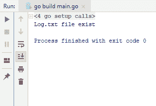

要以相反的方式检查文件是否存在，我们只需输入`os.IsNotExist()`并传递我们捕获的`err`并将其打印到控制台。请查看以下代码：

```go
package main
import (
  "os"
  "fmt"
)
func main(){
  if _, err := os.Stat("log.txt"); os.IsNotExist(err){
    fmt.Println("Log.txt file does not exist")
  }else{
    fmt.Println("Log.txt file exists")
  }
}
```

运行上述代码时，我们将得到相同的输出，显示`Log.txt 文件存在`。现在，让我们尝试运行相同的代码，但这次删除`log.txt`文件。您将得到以下输出：

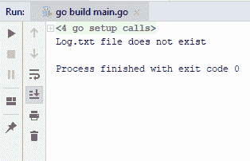

您可以看到现在输出显示`Log.txt 文件不存在`，这样您就可以轻松地检查文件是否存在。在下一节中，我们将看到如何读取文件的全部内容。

# 读取文本文件的全部内容

在本节中，我们将看到如何读取文件的全部内容。我们将创建一个名为`names`的新文件，我有一堆名字，例如`Tarik`，`Guney`，`Michael`，`John`和`Montana`。我们将读取这个文件。我们将使用提供读取文件功能的`io`实用程序包，并接受文件的路径，即`names.txt`。它返回两个东西：文件的实际内容和错误。如果没有错误发生，我们将首先将`contentBytes`转换为`string`表示。现在让我们使用以下代码将内容写入控制台：

```go
package main
import (
  "io/ioutil"
  "fmt"
)
func main(){
  contentBytes, err := ioutil.ReadFile("names.txt")
  if err == nil{
    var contentStr string = string(contentBytes)
    fmt.Println(contentStr)
  }
}
```

通过在终端中使用`go run main.go`命令运行代码，您将获得以下输出：

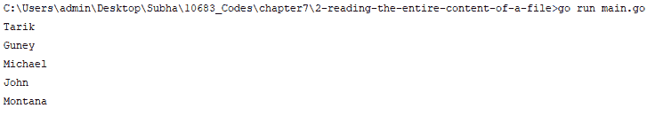

因此，您可以看到我们已经从文件中读取了所有的名字。这就是您如何轻松地将文件的全部内容读入内存中。

在下一节中，我们将看到如何写入文件。

# 写入文件

在这一部分，我们将看到如何写入文件。与读取文件类似，我们将使用`ioutil`包。我们将使用`ioutil.WriteFile`函数，它接受三个参数。第一个参数是我们要写入的文件名，第二个是我们要写入的数据，最后一个是文件权限。这里的优势是，如果文件不存在，`WriteFile`将使用`perm`参数给出的权限创建文件，如果文件已经存在，则在写入之前将截断文件。我们将继续往我们的文件中写入一些内容，因为我们的文件还不存在，它会为我们创建一个新文件。我们将写入`Hello, World`，这是一个`string`参数，我们将把它转换为`byte`数组，然后才能传递给`WriteFile`。文件名将是`hello_world`，第二个参数将是`hello`变量的字节表示。这将返回一个错误。如果它不是`nil`，意味着发生了某些事情。让我们检查一下代码：

```go
package main
import (
  "io/ioutil"
  "fmt"
)
```

```go
func main() {
  hello := "Hello, World"
  err := ioutil.WriteFile("hello_world", []byte(hello), 0644)
  if err != nil{
    fmt.Println(err)
  }
}
```

运行代码时，你会看到没有错误发生，我们的`hello_world`文件存在。如果你打开文件，你会看到`Hello, World`已经被写入了：

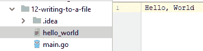

如果我们再次用不同的`string`和`Hello, World Again`运行代码，你会看到之前的内容被清除并替换为新内容，如下截图所示：

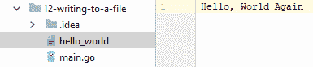

这基本上就是如何写入文件。在我们的下一部分中，我们将看到如何创建临时文件。

# 创建临时文件

在这一部分，我们将看到如何创建临时文件。我们还将有一个包含字符串的变量，叫做`helloWorld := "Hello, World"`。我们将使用`ioutil`包，它提供了`TempFile()`方法。第一个参数是目录；如果你不给它传递任何东西，它将使用默认的临时目录，这在这种情况下我们将使用，第二个是给你的临时文件一个前缀，将是`hello_world_temp`。它返回两个东西：第一个是创建的临时文件，第二个是错误（`err`）。现在，如果发生任何错误，我们将会抛出错误作为消息。

当你完成临时文件后，建议删除文件，我们可以使用`defer`函数，其中有一个`os.Remove()`方法。你只需要提供文件名，它就会找到并删除它。现在我们要把`helloWorld`写入我们的文件。现在让我们检查一下代码：

```go
package main
import (
 "io/ioutil"
 "fmt"
)
func main(){
 helloWorld := "Hello, World"
 file, err := ioutil.TempFile("", "hello_world_temp")
 if err != nil{
 panic(err)
 }
 defer os.Remove(file.Name())
 if _, err := file.Write([]byte(helloWorld)); err != nil {
 panic(err)
 }
 fmt.Println(file.Name())
}
```

运行上述代码，你将得到以下输出：

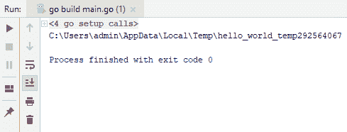

路径是我们的文件所在的位置，选择的部分是我们文件的名称，这是一个临时文件，当然，这个文件会被删除。如果没有被删除，我们会在那个位置看到它。现在，我们不会删除文件，只需注释掉前面代码块中的`deferos.Remove(file.Name())`一行并运行它。

此外，我们将打开文件，并使用终端，我们将显示该文件的内容，使用`less`命令（在 Linux 中）和`more <`命令（在 Windows 中），如截图所示：

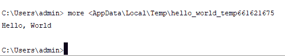

如果你看前面的截图，你会看到`Hello, World`在那里。

这就是你如何在 Go 中创建临时文件。

在我们的下一部分中，我们将看到如何计算文件的行数。

# 在文件中计算行数

在本节中，我们将看到如何计算文件的行数。假设我们有一个文件，每行都有一堆名字，我们必须计算文件中有多少行。首先，我们将使用`os.Open`包打开我们的文件，文件名将是`names.txt`。它返回一个错误，但是对于这个例子，我们不会关心错误，因为我们知道文件是存在的。因此，我将使用文件扫描程序来扫描文件。我们有`bufio.NewScanner`包，其中有新的扫描程序，它接受一个读取器，因此我们可以传递文件。行数将从`0`开始，我们将对`fileScanner.scan`进行此操作。因此，只要它扫描，它将增加行数。最后，我们将将行号写入控制台。当一切都完成时，我们将使用`defer file.Close()`函数。让我们检查代码：

```go
package main
import (
  "os"
  "bufio"
  "fmt"
)
func main() {
  file, _ := os.Open("names.txt")
  fileScanner := bufio.NewScanner(file)
  lineCount := 0;
  for fileScanner.Scan(){
    lineCount++
  }
  defer file.Close()
  fmt.Println(lineCount)
}
```

运行上述代码时，您将获得以下输出：

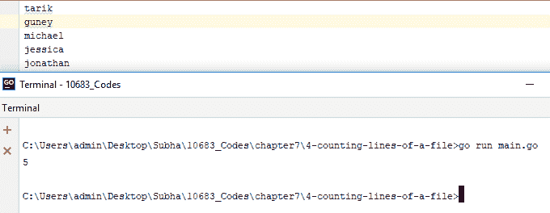

输出打印出`5`，您也可以通过查看文件并手动计数来确认。

在我们的下一节中，我们将看到如何读取文件中的特定行。

# 读取文件中的特定行

在本节中，我们将看到如何读取文件中的特定行。我们有一个名为`names.txt`的文件，每行都有一堆名字：

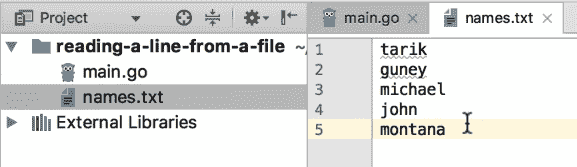

我们只想从文件中读取第三行。查看以下代码：

```go
package main
import (
  "os"
  "bufio"
  "fmt"
)
func main(){
  fmt.Println(ReadLine(3))
}
func ReadLine(lineNumber int) string{
  file, _ := os.Open("names.txt")
  fileScanner := bufio.NewScanner(file)
  lineCount := 0
  for fileScanner.Scan(){
    if lineCount == lineNumber{
      return fileScanner.Text()
    }
    lineCount++
  }
  defer file.Close()
  return ""
}
```

首先，我们将有一个`ReadLine()`函数，它接受行号并返回一个字符串。首先，我们将使用`os.Open()`函数打开文件，然后我们将使用`fileScanner`。然后我们将传递文件，我们将使用的行数将从`0`开始。如果行数等于给定给我们的行号，那么我们将返回文件`scanner.txt`；否则，我们将递增计数器。最后，我们将使用`defer file.Close()`函数。运行上述代码时，您将获得以下输出：

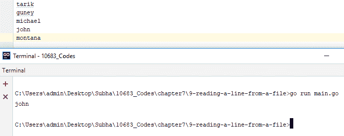

因此，它返回`john`，这是第三行，从`0`开始计数。如果您希望与人们在文件中计算行数时的预期更加一致，可以更改索引并从`1`开始。这样您就可以轻松地从文件中获取特定行。

在我们的下一节中，我们将看到如何比较两个文件的内容。

# 比较两个文件的内容

在本节中，我们将看到如何比较两个文件的内容。首先，我们将创建两个文本文件，内容相同，以便比较，`one.txt`和`two.txt`。我们将使用`ioutil`包将文件读入内存；与往常一样，我们将确保在导入第一个文件时没有错误，如果有错误，我们将简单地发生 panic。我们还将导入第二个文件。有一种非常简单的方法来检查这两个文件是否具有相同的内容（相等），即使用`byte`包下定义的`Equal`函数。查看以下代码：

```go
package main
import (
  "io/ioutil"
  "bytes"
  "fmt"
)
func main(){
  one, err := ioutil.ReadFile("one.txt")
  if err != nil{
    panic(err)
  }
  two, err2 := ioutil.ReadFile("two.txt")
  if err2 != nil{
    panic(err2)
  }
  same := bytes.Equal(one, two)
  fmt.Println(same)
}
```

运行上述代码时，您将获得以下输出：

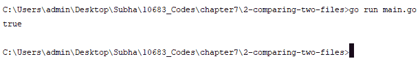

输出为`true`，这意味着文件的内容相等。如果更改一个文件中的内容并再次运行相同的代码，则输出为`false`。这就是您检查两个不同文件中的内容是否相同的方法。

在下一节中，我们将学习如何使用 Go 语言删除文件。

# 删除文件

在这一部分，我们将看到如何在 Go 中删除文件。删除文件是 Go 中最简单的操作之一，因为`os`包提供了一个名为`Remove()`的函数，允许您删除任何文件。因此，首先，我们将创建一个新文件并命名为`new.txt`。下面的屏幕截图将显示在创建`new.txt`后的文件夹结构：

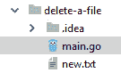

我们将看到如何删除`new.txt`文件。`Remove()`函数接受您文件的路径。如果发生错误，它会返回一个错误，我们将“捕获”该错误，如果它不是`nil`，则会触发。查看以下代码：

```go
package main
import "os"
func main() {
  err := os.Remove("new.txt")
  if err != nil{
    panic(err)
  }
}
```

让我们运行代码并检查输出：


您可以看到`new.txt`文件已经消失，我们已成功删除了该文件。因此，我要继续运行这个，正如您所看到的，`new.txt`文件消失了。让我们再次运行这个并看看当您尝试删除一开始不存在的文件时，我们将得到什么类型的恐慌和错误消息：

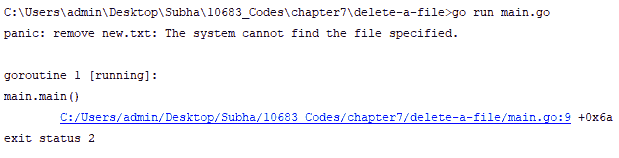

好了，这就是您如何在 Go 中轻松删除文件。在下一节中，我们将看到如何复制或移动文件。

# 复制或移动文件

在这一部分，我们将看到如何复制或移动文件。您可以以各种方式执行此操作，其中一些取决于您将要使用的操作系统。但是，我们将看到在不过多依赖操作系统的情况下复制或移动文件的最简单方法。首先，我们将添加一个要复制的文件并命名为`original.txt`，并添加一些包含`Hello, World`的内容。然后，我们将使用`os.Open()`打开文件，它将返回两个东西，原始文件和一个错误。如果没有错误，我们将继续执行`defer`，然后关闭文件。此外，我们将使用`os.Create()`创建一个新文件在相同的位置，它也会返回一个错误。现在最简单的方法是使用`io.Copy()`。因此，代码将看起来像这样：

```go
package main
import (
  "os"
  "io"
)
func main(){
  original, err := os.Open("original.txt")
  if err != nil{
    panic(err)
  }
  defer original.close()
  original_copy, err2 := os.Create("copy.txt")
  if err2 != nil{
    panic(err2)
  }
  defer original_copy.Close()
  _, err3 := io.Copy(original_copy, original)
  if err3 != nil{
    panic(err3)
  }
}
```

运行代码后，我们看到`copy.txt`出现，并且打开它时，我们可以看到其中包含从`original.txt`文件复制的`Hello, World`：

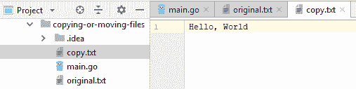

现在，让我们来看如何移动文件。首先，我们将创建一个名为`target`的新文件夹，并将`original.txt`复制到`target`中，并删除放置在`target`文件夹外部的`original.txt`文件。为此，`original_copy, err2 := os.Create("copy.txt")`将更改为`original_copy, err2 := os.Create("target/original.txt")`。如果您看到以下屏幕截图，您将注意到`original.txt`文件已被复制到`target`文件夹下：

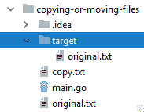

我们现在可以删除外部的`original.txt`文件。在上述代码的`main`函数末尾添加以下两行代码：

```go
original.Close()
os.Remove("original.txt")
```

运行上述代码后，您将获得以下输出：

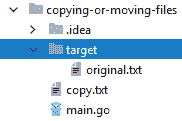

正如您所看到的，该代码有效地通过移动和删除文件来移动`original.txt`文件。这就是您如何简单地在 Go 中复制和移动文件。

在下一节中，我们将看到如何在 Go 中轻松重命名文件。

# 重命名文件

在这一部分，我们将看到如何在 Go 中重命名文件。首先，我们将创建一个新文件并命名为`old.txt`，文件夹结构将如下屏幕截图所示：

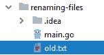

我们将更改此文件的名称为`new.txt`。要做到这一点，最简单的方法是使用`os`包提供的`Rename()`函数。该函数接受旧路径`old.txt`和新路径`new.txt`。让我们来看看代码：

```go
package main
import "os"
func main() {
  os.Rename("old.txt", "new.txt")
}
```

在运行代码时，您可以看到在以下屏幕截图中，名称`old.txt`已更改为`new.txt`：

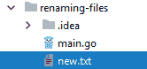

因此，这基本上是我们如何在 Go 中重命名文件的方法。

在下一节中，我们将看到如何删除目录及其所有内容。

# 删除目录及其内容

在本节中，我们将看到如何删除目录及其内容。我们将使用`os`包，它提供了两个函数，`Remove（）`和`RemoveAll（）`。我们将检查这两个函数。首先，我们将创建一个名为`hello`的新目录，并保持为空，如下面的屏幕截图所示：

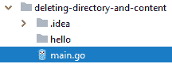

如前所述，我们将使用`os`包，它接受文件或目录。我们将传递一个目录，如果发生任何事情，它总是返回一个错误。我们必须检查这个错误是否不是`nil`。请查看以下代码：

```go
package main
import (
  "os"
  "fmt"
)
func main(){
  err := os.Remove("hello")
  if err != nil{
    fmt.Println(err)
  }
}
```

如果您运行代码，将获得以下文件夹结构作为输出：


如果您比较两个输出屏幕截图，您会发现我们已成功删除了`hello`目录。但是，如果目录中有文件（比如`world.txt`），也就是说，目录不是空的，并且您运行相同的代码，那么目录将不会被删除，并且如果`hello`目录中有文件，则会显示以下消息：

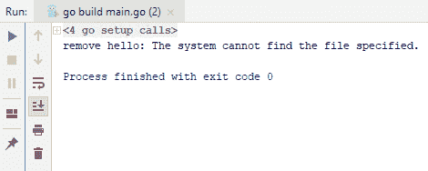

现在，有一个选项可以删除文件以及目录。我们可以使用我们在本节开头提到的`RemoveAll（）`函数。要做到这一点，只需将上述代码中的`err：= os.Remove（“hello”）`更改为`err：= os.RemoveAll（“hello”）`。

在运行上述代码时，您会发现您已成功删除了文件和目录，并且您将再次查看以下文件夹结构：


在下一节中，我们将看到如何列出目录下的所有文件。

# 列出目录下的所有文件

在本节中，我们将看到如何列出目录下的所有文件。我们将创建一个名为`hello`的新目录，其中包括三个文件，即`jupiter.txt`，`mars.txt`和`world.txt`：

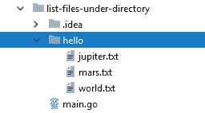

我们要做的是读取所有文件并将它们的名称输出到控制台。我们将使用`ioutil.ReadDir`包并传入`hello`，这是我们目录的名称。这将返回两种类型的东西：两个文件和一个错误。我们将检查错误是否不是`nil`，并使用 panic 打印出内容。我们还将使用`for`循环来遍历文件。请查看以下代码：

```go
package main
import (
  "io/ioutil"
  "fmt"
)
func main() {
  files, err := ioutil.ReadDir("hello")
  if err != nil{
    panic(nil)
  }
  for _,f := range files{
    fmt.Println(f.Name())
  }
}
```

如果您运行上述代码，将获得以下输出：

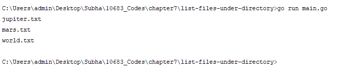

这就是您如何简单列出目录下的所有文件。

# 摘要

在本章中，您学习了如何在操作系统中处理文件和目录。您还学习了解析和使用各种格式，如 XML，YAML 和 JSON。在下一章中，我们将学习有关并发的技巧，并且我们将从同时运行多个函数开始。
