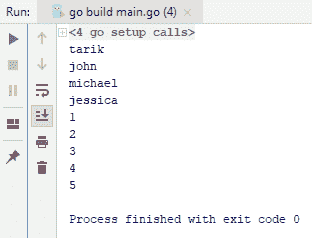
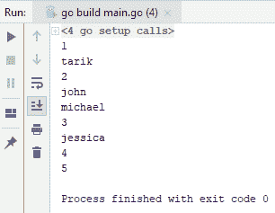
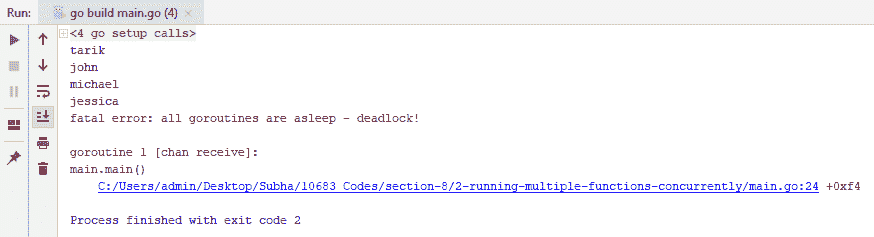
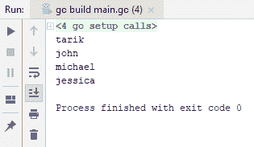
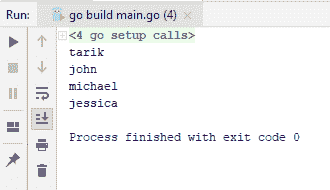
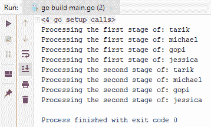
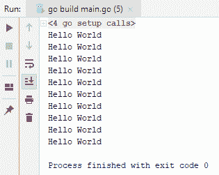
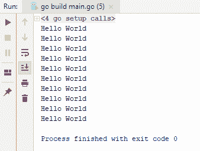
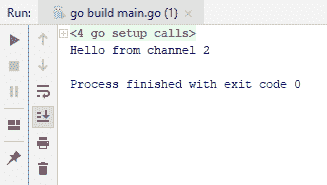

# 第八章：并发

Go 最强大的一点是它与 API 的并发。在本章中，你将学习如何在 Go 语言中利用并发构造。本章将涵盖以下主题：

+   并发运行多个函数

+   在并发运行函数之间传递数据

+   等待所有并发函数完成

+   选择并发函数的结果

# 并发运行多个函数

让我们开始并发运行多个函数。

看一下以下代码块中的代码：

```go
import (
  "fmt"
  "time"
)

func main() {

  names := []string{"tarik", "john", "michael", "jessica"}

  for _, name := range names {
   time.Sleep(1 * time.Second)
   fmt.Println(name)
  }
ages := []int{1, 2, 3, 4, 5}
  for _, age:= range ages {
    time.Sleep(1 * time.Second)
    fmt.Println(age)
  }
}
```

从上面的代码可以看出，有两个不同的列表；每个列表都有至少花费一秒钟才能完成的项目，但出于练习目的，我们不会有任何实际的代码，只是`fmt.Println`。我们在每次迭代中都添加了`time.Sleep`一秒钟。如前面的代码所示，我们首先处理名称，然后处理年龄。你可以注意到的一件事是它们实际上并不相互依赖；它们实际上是两项不同的工作。所以，让我们继续运行这个程序，看看在控制台上的效果如何：



如果你观察输出的过程，你会发现每行输出在传递下一个之前等待了一秒钟。你会发现它们实际上是顺序的代码片段，尽管它们并不相互依赖。在继续到第二个`for`循环之前，我们必须等待循环完成。

我们可以通过使用并发模式使这个过程更具可扩展性和效率。为此，我们将在 Go 中使用 Go 例程。Go 例程比线程更轻量级，而且与线程不同，它们是自愿地而不是强制性地交还控制权。随着我们继续前进，你会更多地了解我所说的具体含义。检查以下代码：

```go
package main

import (
  "fmt"
  "time"
)
func main() {

  go func() {
    names := []string{"tarik", "john", "michael", "jessica"}

    for _, name := range names {
      time.Sleep(1 * time.Second)
      fmt.Println(name)
    }
  }()

  go func(){
    ages := []int{1, 2, 3, 4, 5}
    for _, age:= range ages {
      time.Sleep(1 * time.Second)
      fmt.Println(age)
    }
  }()
  time.Sleep(10*time.Second)
}
```

如你所见，我们已经将代码转换为独立的功能片段，使用了 Go 关键字和匿名函数来创建 Go 例程。我们对年龄也做了同样的事情。运行代码时，你将得到以下输出：



如你所见，与以前顺序显示输出不同，它是随机显示的。这意味着两个循环是同时进行处理的。

如果我们移除`time.Sleep`（使用`//`注释掉它），我们将在控制台上看不到任何结果。这是因为主应用程序也是在一个 Go 例程下运行的，这意味着我们有三个 Go 例程：我们输入的两个和整个主应用程序。如前所述，问题在于 Go 例程自愿地而不是强制性地将控制权交还给其他 Go 例程。这意味着当你使用`time.Sleep`时，控制权将交给其他 Go 例程，我们的系统将正常工作。

现在，如果我们使用`1`秒而不是上次代码中看到的`10`秒，会发生什么？你将得不到任何输出。这是因为`1`秒对于所有 Go 例程来说不足以完成任务。一旦主 Go 例程完成了它的处理，它就会关闭整个应用程序，并且不会给其他 Go 例程足够的时间来完成。有一种处理这种情况的方法，我们有另一个叫做通道的构造。因此，为了简单起见，我们将删除第二个 Go 例程，现在使用通道。检查以下代码：

```go
package main

import (
    "time"
  "fmt"
)

func main() {

  nameChannel := make(chan string)

  go func() {
    names := []string{"tarik", "john", "michael", "jessica"}

    for _, name := range names {
    time.Sleep(1 * time.Second)
      //fmt.Println(name)
    nameChannel <- name
    }
  }()

  for data:= range nameChannel{
    fmt.Println(data)
  }
}
```

当你运行上面的代码时，你将得到以下异常：



出现这种异常的原因是，当你完成一个通道时，你需要关闭它，否则`for`循环将一直等待。然而，因为你的 Go 例程已经完成了该通道，循环将陷入死锁并停止你的应用程序。关闭通道的一种方法是添加下面突出显示的代码行：

```go
package main

import (
    "time"
  "fmt"
)

func main() {

  nameChannel := make(chan string)

  go func() {
    names := []string{"tarik", "john", "michael", "jessica"}

    for _, name := range names {
    time.Sleep(1 * time.Second)
      //fmt.Println(name)
    nameChannel <- name
    }
    close(nameChannel)
    //nameChannel <- ""
  }()

  for data:= range nameChannel{
    fmt.Println(data)

    }

  //<-nameChannel
}
```

当一个通道关闭时，循环将终止。所以，让我们继续运行这个程序并检查输出：



如您所见，这里没有任何异常，一切看起来都很好。如果您不关心结果，并且想要使用我们的第一种方法，可以使用以下代码：

```go
package main

import (
  "fmt"
  "time"
)

func main() {
  nameChannel := make(chan string)
  go func() {
    names := []string{"tarik", "john", "michael", "jessica"}
    for _, name := range names {
      time.Sleep(1 * time.Second)
      fmt.Println(name)
    }
    nameChannel <- ""
  }()
  <-nameChannel
}
```

我们所做的是将所有内容写入控制台，一旦循环结束，就设置了`nameChannel`。此外，在这种情况下，我们会等待直到从名称通道获取一些数据，因此不会终止应用程序。一旦从名称通道获取到一些数据，我们就会读取它，但实际上并不会将其分配给任何变量。当`main` Go 例程继续执行到下一行时，那里没有代码，因此`main`函数退出。因此，我们的应用程序关闭了。您将获得以下输出：



这就是您可以使用通道和函数执行并发操作的方法。在结束之前，让我们重申一点关于通道。如果通道为空并且您尝试读取它，它将阻塞其 Go 例程。一旦填充，我们可以从中读取一些东西；我们读取数据并继续。之所以`main` Go 例程无法退出是因为我们之前没有向其发送任何值，这比在我们之前的示例中使用计时器要更有效。

在下一节中，我们将看到如何在并发运行的函数之间传递数据。

# 在并发运行的函数之间传递数据

在本节中，我们将看到如何在 Go 例程之间传递数据。假设我们有两个 Go 例程。第一个 Go 例程对数据执行一些操作，并将数据交给另一个 Go 例程，后者对该数据执行第二个处理阶段。现在，我们需要一种方法在第一个 Go 例程和第二个 Go 例程之间传递数据。正如您所看到的，我们可能需要在两个 Go 例程之间进行一些同步，因为第二个 Go 例程将不得不等待，直到第一个 Go 例程向其提供一些数据。

首先，我们将使用以下代码：

```go
package main
import "fmt"
func main(){
  nameChannel := make(chan string)
  done := make(chan string)
  go func(){
    names := []string {"tarik", "michael", "gopi", "jessica"}
    for _, name := range names {
      // doing some operation
      fmt.Println("Processing the first stage of: " + name)
      nameChannel <- name
    }
    close(nameChannel)
  }()
  go func(){
    for name := range nameChannel{
      fmt.Println("Processing the second stage of: " + name)
    }
    done <- ""
  }()
  <-done
}
```

如果您查看代码，您会看到我们再次使用了通道：`nameChannel`。由于我们需要从两个 Go 例程中访问`nameChannel`，因此我们必须在`main`函数内声明它。在第一个 Go 例程中，我们将向`nameChannel`传递一些数据，即`name`。`name`变量是包含一些数据的字符串数组，来自第一个 Go 例程。在第二个 Go 例程中，我们将使用`nameChannel`并读取它，因为它已经填充。此外，我们还必须使用另一个 Go 例程来向主 Go 例程发出信号，指示所有 Go 例程都已完成（`done := make(chan string)`）。我们还必须终止应用程序以避免任何死锁，使用`close`函数。当通道关闭时，`for`循环将被终止，Go 例程将向`done`变量发送一些数据。然后，我们的主 Go 例程将读取它并继续执行下一行，退出`main`函数，应用程序就完成了。这就是无缓冲通道；也就是说，您可以发送单个数据，必须在发送更多数据之前读取并清空它，否则它将被阻塞。

另一种方法是使用缓冲通道来提高性能。对前面的代码进行轻微修改将有所帮助。我们将添加整数`5`，这意味着您可以在不等待的情况下将五个数据发送到`nameChannel`中。检查修改后的代码：

```go
package main
import "fmt"
func main(){
  nameChannel := make(chan string, 5)
  done := make(chan string)
  go func(){
    names := []string {"tarik", "michael", "gopi", "jessica"}
    for _, name := range names {
      // doing some operation
      fmt.Println("Processing the first stage of: " + name)
      nameChannel <- name
    }
    close(nameChannel)
  }()
  go func(){
    for name := range nameChannel{
      fmt.Println("Processing the second stage of: " + name)
    }
    done <- ""
  }()
  <-done
}
```

例如，它将发送一些数据，但不会等待，因为还有四个位置。因此，它将进入第二次迭代，并将一些数据发送到其中，直到计数达到`5`。好处是，当我们向名称通道发送数据时，我们也从中读取数据。以下将是输出：



这是如何在多个 Go 例程之间传递数据的方法。在下一节中，我们将看到如何等待所有并发函数完成。

# 等待所有并发函数完成

在本节中，我们将看到如何等待所有并发函数完成。假设我们有如下代码片段：

```go
package main

import (
  "fmt"
  )

func main() {
  for i := 0; i < 10; i++ {
    go func(){
      fmt.Println("Hello World")
    }()
  }
}
```

假设我们想在循环中创建多个 Go 例程。在这种情况下，假设我们想要有 10 个 Go 例程加上主 Go 例程，因此总共有 11 个 Go 例程。如果运行前面屏幕截图中显示的代码，将不会有任何输出。

等待所有这些 Go 例程完成，以便我们可以向控制台显示一些内容的一种方法是使用`time.Sleep`，如以下代码所示：

```go
package main

import (
  "fmt"
  "time"
)

func main() {
  for i := 0; i < 10; i++ {
   go func(){
      fmt.Println("Hello World")
    }()
  }

  time.Sleep(10*time.Second)
}

```

运行上述代码后，您将获得以下输出：



现在，您已经获得了一个输出，但是这种方法的问题是，通常您不知道所有 Go 例程完成需要多长时间；因此，您无法真正预测时间。因此，我们可以使用 Go 库本身提供的`sync.WaitGroup`。顾名思义，它基本上是一组等待，您可以使用它来等待所有 Go 例程完成。检查以下代码：

```go
package main
import (
  "fmt"
  "sync"
)

func main() {
  var wg sync.WaitGroup
  for i := 0; i < 10; i++ {
    wg.Add(1)
    go func(){
      fmt.Println("Hello World")
      wg.Done()
    }()
  }
  wg.Wait()
}
```

因此，在每次迭代中，我们可以向我们的等待组添加一个新项，这在这种情况下将是`1`。因此，我们基本上会将`WaitGroup`中的等待数量增加`1`。当 Go 例程完成时，它将使用`wg.Done()`进行信号传递，这将基本上减少组中的等待数量`1`。此外，`wg.Wait`将阻塞我们的主 Go 例程，直到所有 Go 例程都完成。运行代码后，我们将获得以下输出：



这是你可以简单等待应用程序中所有 Go 例程完成的方法。在下一节中，我们将看到如何选择并发函数的结果，因为它们被返回。

# 选择并发函数的结果

在本节中，我们将看到如何选择并发排名函数的结果。假设我们的`main`函数中有两个 Go 例程，它们基本上正在设置自己的通道：`channel1`和`channel2`。假设我们想先读取任何内容，然后继续下一行。为此，Go 提供了一个名为`select`的内置结构，`select`基本上等待通道填充并且看起来像`switch`语句。让我们继续看看现在的样子：

```go
package main
import (
  "time"
  "fmt"
)
func main() {
  channel1 := make(chan string)
  channel2 := make(chan string)
  go func(){
    time.Sleep(1*time.Second)
    channel1 <- "Hello from channel1"
  }()
  go func(){
    time.Sleep(1 * time.Second)
    channel2 <- "Hello from channel2"
  }()
  var result string
  select {
  case result = <-channel1:
    fmt.Println(result)
  case result = <-channel2:
    fmt.Println(result)
  }
}
```

因此，您只需说`select`，并且例如说`channel1`，当`channel1`准备就绪时，我们将执行类似创建`string`类型的`result`变量的操作。因此，在这里，我将把`channel1`的值分配给将使用`Println`打印到控制台的`result`变量。在第二种情况下，如果不是`channel1`而是准备好读取的`channel2`，那么我们将将其读取到我们的`result`变量中。`select`语句在这里不会同时使用两种情况；例如，如果`channel1`和`channel2`同时准备就绪，那么`select`语句将随机选择其中一个。

由于`channel1`已准备就绪，我们从`channel1`得到了`Hello`作为输出。如果我们再次运行代码，您将从以下屏幕截图中看到`channel2`：



因此，您可以轻松地看到输出中的随机性。这就是它的工作原理。

现在，可能会有一些情况需要多次等待。在这种情况下，您可以使用循环：

```go
package main
import (
 "time"
 "fmt"
)
func main() {
 channel1 := make(chan string)
 channel2 := make(chan string)
go func(){
 time.Sleep(1*time.Second)
 channel1 <- "Hello from channel1"
 }()
go func(){
 time.Sleep(1 * time.Second)
 channel2 <- "Hello from channel2"
 }()
var result string
 for {
 select {
 case result = <-channel1:
 fmt.Println(result)
 case result = <-channel2:
 fmt.Println(result)
 }
 case <-quit:
 return
 }
}
```

想象一下，你正在编写一些必须不断等待某些传入数据的东西，当数据进来时，你希望将其写入控制台。或者你可能想对这些数据进行一些操作。在这种情况下，你可以在一个无限循环中等待它们。如果你想要跳出这个循环，你可以读取另一个通道，比如`quit`。如果`quit`已经存在，那么你可以直接跳出这个循环，或者如果它是一个函数，你可以使用 return，这样也会跳出函数。

所以，这就是你如何可以轻松地在 Go 中读取来自多个函数的数据。这就结束了我们的并发章节。

# 总结

在这一章中，你学会了如何在 Go 语言中利用并发构造。在下一章中，我们将学习系统编程，并将从捕获信号开始。您还将学习如何使用 Go 处理命令行参数。
