# 第九章：系统编程

系统编程允许你处理系统消息并运行处理任务。在本章中，你将学习如何使用 Go 处理命令行参数。本章将涵盖以下主题：

+   捕获信号

+   从 Go 应用程序中运行子进程

+   处理命令行参数

# 捕获信号

在我们深入了解如何捕获信号之前，让我们先了解一下信号是什么，以及你如何使用它们。信号是一种有限的进程间通信形式，通常用于 Unix 和类 Unix 操作系统。信号是一种异步通知，发送给同一进程中的特定线程或另一个目标进程，通知它发生了某个事件。你可以捕获信号的原因有很多；例如，你可以捕获来自另一个进程的终止信号，以执行一些终止清理操作。在 Go 中，Go 信号通知通过在我们的通道上发送`os.signal`值来工作。现在，让我们继续看看在我们的 Go 应用程序中是什么样子。

首先，我们将创建一个名为 signals 的新通道，并在这里使用`os.signal`。如果你想捕获多个信号，你可以使用一个带缓冲的通道，并将 3 或 4 作为整数类型。要一次只捕获一个信号，我们可以输入 1，或者你可以只传递这个，那么默认值将自动为 1。我们还需要一些其他通道来通知我们已经完成了信号处理，这样我们就可以终止我们的应用程序或执行其他操作。在我们的`signal`包中，有一个名为`Notify()`的方法，所以让我们继续看看文档，它说*Notify 会导致包信号将传入的信号中继到通道*。因此，Go 将自动监听信号，并将这些信号关联到我们将作为其第一个参数提供的通道上。现在，检查以下代码：

```go
package main
import (
  "os"
  "os/signal"
  "syscall"
  "fmt"
)
func main(){
  signals := make (chan os.Signal, 1)
  done := make(chan bool)
  signal.Notify(signals, syscall.SIGINT, syscall.SIGTERM)
  go func (){
    sig := <- signals
    fmt.Println(sig)
    fmt.Println("Signal captured and processed...")
    done <- true
  }()
  fmt.Println("Waiting for signal")
  <-done
  fmt.Println("Exiting the application...")
}
```

有参数可以过滤你想要监听的信号，即`syscall.SIGINT`和`syscall.SIGTERM`。此外，我们将创建一个 Go 例程，简单地监听这个信号并执行一个操作。此外，我们将读取这个值并将信号的内容写入控制台。我们将添加一个`print`语句，说明`信号已捕获并处理...`。此外，`done <- true`将帮助我们处理信号。最后，我们将输入`print`语句`等待信号`，然后我们完成了信号的捕获和处理。让我们继续运行代码以获得输出。我们现在将运行`main.go`应用程序，它将打印`等待信号`：

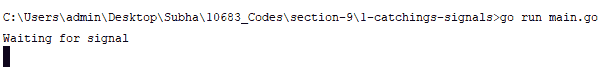

现在，我们可以发送一个信号来关闭应用程序，使用*Ctrl* + *C*命令，正如你在下面的截图中所看到的，发生了中断。我们的中断被捕获并处理，现在我们退出应用程序，这也可以在下面的截图中看到：

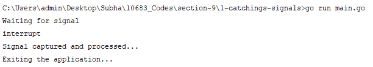

这就是你可以简单地捕获进程并在你的 Go 应用程序中使用信号的方法。在下一节中，我们将看到如何从 Go 应用程序中运行子进程。

# 运行子进程

在这个视频中，我们将看到如何在应用程序中运行子进程。在我们的应用程序中，我们将运行一个名为`ls`（在 Linux 中）和`dir`（在 Windows 中）的命令。`ls`和`dir`命令是一个简单地列出给定目录中所有文件的应用程序。因此，从我们当前的目录中，它将给我们返回`hello.txt`和`main.go`文件。我们将在我们的应用程序中运行这个`ls`实用程序应用。因此，我们首先要做的是使用`exec`包，它提供了命令。我们将使用`ls`命令，现在不传递任何参数。这将返回命令本身。你会发现两个函数；一个是`start`，另一个是`run`。

`start`和`r`的区别在于，如果您查看文档，您会发现`run`启动指定的命令并等待其完成。根据您的要求，您可以选择`start`或`run`。

我们还有`PID`，即进程 ID，并且我们将将其输出到控制台。因此，让我们继续运行代码。您会看到以下内容：

```go
package main

import (
  "os/exec"
  "fmt"
  )

func main() {
  lsCommand := exec.Command("ls")
  lsCommand.Start()
  fmt.Println(lsCommand.Process.Pid)
}
```

您将得到以下输出：

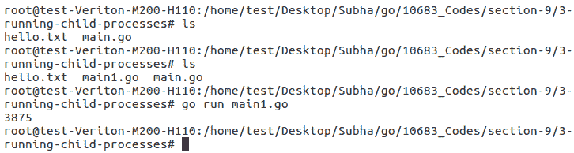

如您所见，我们得到了进程 ID，但尚未看到目录中的文件。现在，让我们尝试`run`。我们希望读取来自`ls`命令的任何内容，然后将其打印到控制台上。我们将使用“lsCommand.Output（）”，它返回一个字节数组和一个错误，但我们现在将忽略错误。好了！现在让我们检查上述代码：

```go
package main
import (
  "os/exec"
  "fmt"
)
func main() {
  lsCommand := exec.Command("ls")
  output,_ := lsCommand.Output()
  lsCommand.Run()
  fmt.Println(lsCommand.Process.Pid)
  fmt.Println(string(output))
}
```

我们还将清除终端，然后检查输出：

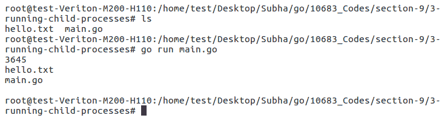

如您所见，它给了我们两个文件名和进程 ID。这就是您可以简单地从 Go 应用程序中运行进程的方法。当然，还有更多的方法。您可以运行其他类型的进程，例如 Google Chrome 或 Firefox，或者您开发的另一个应用程序。因此，当您需要从应用程序内部启动进程时，这是一个非常强大的工具。在下一节中，我们将看到如何处理命令行参数。

# 处理命令行参数

在本节中，我们将看到如何处理命令行参数。命令行参数的典型示例是`ls -a`。在这里，`a`是传递给我们最后一个命令的命令行参数，`ls`是操作系统中的一个程序。根据传递给`ls`命令的参数，它的行为会有所不同。

例如，如果我们键入`ls`，它将显示所有可见文件。如果我们键入`ls -a`，那么它将显示该目录下的所有内容，包括不可见项目，这可以在以下截图中看到：

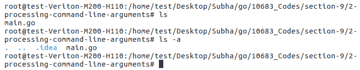

因此，我们将对我们的程序执行相同的操作。您可以使用`os.Args`来读取传递给应用程序的参数。我们将读取并将这些参数写入控制台，然后查看在我们向应用程序传递一些参数后的外观。我们首先需要清除我们的终端并输入`go run main.go`。由于最初我们不会传递任何参数，因此我们可以期望只看到一个参数，那就是我们可执行文件的路径。但是，由于我们使用`go run`，它将为我们创建一个临时可执行文件并运行它，因此那是`temp`位置：

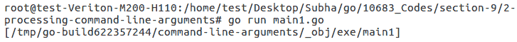

如果我们键入`go run main.go -someArgument`，我们将得到第二个项目，即`- someArgument`：

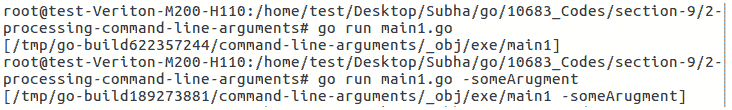

如果我们不关心第一个参数，我们可以使用`realArgs`：

```go
package main
import (
  "os"
  "fmt"
)

func main(){
  realArgs := os.Args[1:]
  fmt.Println(realArgs)
}
```

您将得到以下输出：

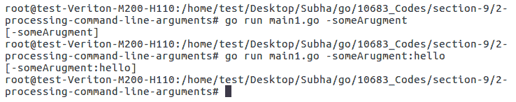

让我们继续检查一个真实的例子。假设我们只期望传递一个参数。检查以下代码：

```go
package main
import (
  "os"
  "fmt"
)
func main(){
  realArgs := os.Args[1:]
  if len(realArgs) == 0{
    fmt.Println("Please pass an argument.")
    return
  }
  if realArgs[0] == "a"{
    writeHelloWorld()
  }else if realArgs[0] == "b"{
    writeHelloMars()
  }else{
    fmt.Println("Please pass a valid argument.")
  }
}
func writeHelloWorld(){
  fmt.Println("Hello, World")
}
func writeHelloMars(){
  fmt.Println("Hello, Mars")
}
```

正如您在前面的代码中所看到的，我们已经输入了`realArgs[0] == "a"`，这将运行一个名为“writeHelloWorld（）”的函数；如果是`realArgs[0] == "b"`，那么它将运行“writeHelloMars（）”，对于任何默认情况，我们将打印一个警告，“请传递有效的参数”。现在，我们将添加“writeHelloWorld（）”和“writeHelloMars（）”函数。此外，我们将使用内置函数来获取我们的`realArgs`的长度，如果是`0`，我们将打印“请传递参数”。完成后，我们需要添加一个`return`语句并退出。

运行代码后，您将得到以下输出：

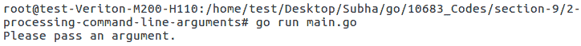

正如你所看到的，我们收到了我们的第一条消息。如果我们输入 `go run main.go a`，我们会在控制台上看到 `Hello, World` 的输出，如下面的截图所示：

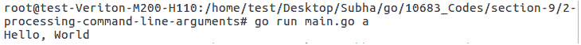

如果我们输入 `go run main.go b`，我们会在控制台上看到 `Hello, Mars` 的输出，如下面的截图所示：

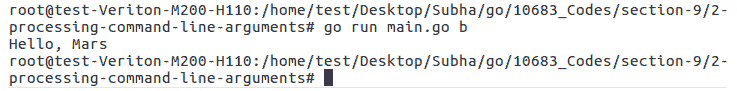

这就是你如何在 Go 应用程序中执行命令行参数处理的方法。这就结束了我们的章节。

# 总结

在这一章中，你学会了捕获信号、运行子进程和处理命令行参数。在下一章中，你将学习如何从互联网上下载网页和文件。你还将看到如何创建文件和 Web 服务器，以及处理 HTTP 请求和响应。
