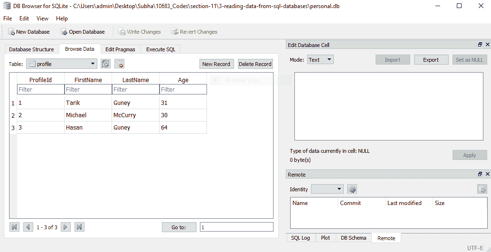
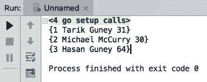
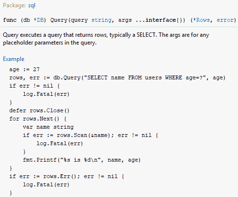
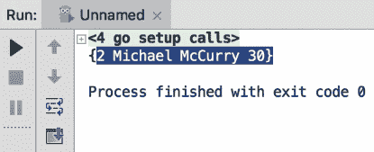
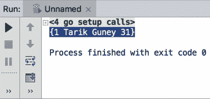
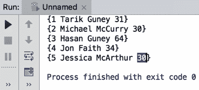
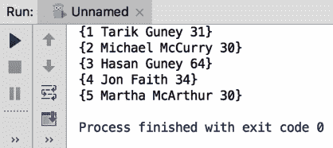
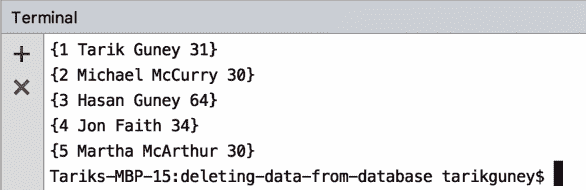
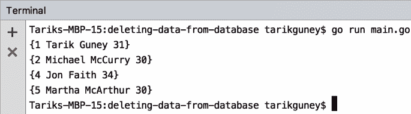

# 关系数据库

Go 可以与各种关系数据库一起工作，包括 SQL Server、MySQL、Postgres SQL 和 SQLite。在本章中，我们将使用 SQLite。与其他更先进的数据库引擎相比，SQLite 可能稍微受限，但对于我们的示例来说，它基本上是足够的。在本节中，您将学习如何使用 Go 读取、更新、删除和创建关系数据库中的数据。

本章将涵盖以下主题：

+   从数据库中读取数据

+   将数据插入数据库

+   在数据库中更新数据

+   从数据库中删除数据

# 从数据库中读取数据

让我们开始学习如何从 SQL 数据库中读取数据。在开始之前，我们将不得不创建一个名为`personal.db`的数据库。我们将使用一个名为 SQLite 的 DB 浏览器，它允许我们创建新的 SQLite 数据库，编辑它们，添加新记录等。您可以在[`sqlitebrowser.org/`](http://sqlitebrowser.org/)找到有关该工具的更多信息并下载它。这是一个免费工具，它可以在 Windows、macOS 和 Linux 上使用。让我们从一个示例开始。请查看以下屏幕截图：



在这里，我们只有一个名为`profile`的表。在这个表上的操作足以让我们学会如何与 SQLite 数据库交互，然后您可以使用相同的技术与 MySQL 或 SQL Server 交互。如果您查看屏幕截图，您会看到我们有三条记录和四列：`ProfileId`，`FirstName`，`LastName`和`Age`。`FirstName`和`LastName`列是字符串或文本，`Age`列是一个数字，`ProfileId`是我们的主键；它也是一个整数列。因此，让我们继续创建我们自己的结构和代码：

```go
package main
import (_ "github.com/mattn/go-sqlite3"
  "database/sql"
  "fmt"
)

type Profile struct{
  ProfileId int
  FirstName string
  LastName string
  Age int
}
func main(){
  db, err := sql.Open("sqlite3", "./personal.db")
  checkError(err)
  var profile Profile
  rows, err := db.Query("select ProfileId, FirstName, LastName, Age from Profile")
  checkError(err)
  for rows.Next(){
    err := rows.Scan(&profile.ProfileId, &profile.FirstName, &profile.LastName, &profile.Age)
    checkError(err)
    fmt.Println(profile)
  }
  rows.Close()
  db.Close()
}
func checkError(err error) {
  if (err != nil) {
    panic(err)
  }
}
```

现在，让我们来解释一下代码。我们使用了结构类型将来自 SQL 数据库的数据映射到我们的内存对象。我们需要导入两个包：第一个是 SQL 数据库，第二个是`go-sqlite3`。我们将进行一个空白导入，这将自动删除 SQL 数据库导入，但这没关系，因为我们稍后会再次导入它。我们之所以进行空白导入，是因为如果此包中有初始化代码，它仍将被执行。这个包将自己注册为底层的 SQL 驱动程序，因此我们仍将使用 SQL 数据库包作为我们的 API，但该 API 将在后台使用`go-sqlite3`包与我们的数据库交互，正如您将看到的，Go 中的数据库交互非常简单。因此，我们要做的第一件事是打开数据库。当我们使用 SQL 包时，您会看到它自动导入我们的 SQL 数据库。

此外，我们将使用 SQLite 版本 3 的 SQLite 驱动程序，并且我们还将指定我们的数据库位于何处。数据源名称可能会根据您使用的数据库类型而更改；它可能是一个 URL，但在我们的情况下，它是一个文件，因为 SQLite 使用数据文件。因此，我们将输入`./personal.db`。我们还添加了错误检查实用程序函数，这样我们就不必一直检查错误。我们只需说`checkError`，错误就会被检查。我们将使用 DB 查询来查询我们的数据库，它返回两件事：一个是行，另一个是错误。数据库查询基本上在这里接受一个 SQL 查询。我们还将使用`for`循环，`rows.next`来迭代每一行和`rows.scan`来获取每一行的值。尊重您的列的顺序很重要，因为它们来自 profile 数据库；如果您需要不同的顺序，您可以在此处指定`*`："select * from Profile"。我通常建议明确指定每一行，而不是使用通配符(`*`)。

当您运行此代码时，您将获得以下输出：



如您所见，我们能够在表中捕获我们的数据库记录（`ProfileId`、`FirstName`、`LastName`和`Age`）。

现在，让我们快速看一下如何进行过滤。因此，我们将使用`where`子句，如果您了解 SQL，就会知道`where`子句用于过滤。我们将按`ProfileId`进行过滤。请查看此方法的签名：



签名中的第二个参数是占位符的参数，由于它是一个非常古老的函数，只要您有匹配的占位符，就可以提供尽可能多的参数。我们将添加`2`，如您在以下代码片段中所见；您也可以使用变量名：

```go
var profile Profile
rows, err := db.Query("select ProfileId, FirstName, LastName, Age from Profile where ProfileID = ?", 2)
checkError(err)
```

现在，让我们继续运行修改后的代码：

```go
package main
import (_ "github.com/mattn/go-sqlite3"
  "database/sql"
  "fmt"
)
type Profile struct{
  ProfileId int
  FirstName string
  LastName string
  Age int
}
func main(){
  db, err := sql.Open("sqlite3", "./personal.db")
  checkError(err)
  var profile Profile
  rows, err := db.Query("select ProfileId, FirstName, LastName, Age from Profile where ProfileID = ?", 2)
  checkError(err)
  for rows.Next(){
    err := rows.Scan(&profile.ProfileId, &profile.FirstName, &profile.LastName, &profile.Age)
    checkError(err)
    fmt.Println(profile)
  }
  rows.Close()
  db.Close()
}
func checkError(err error) {
  if (err != nil) {
    panic(err)
  }
}
```

运行前述代码后，您将获得以下输出：



因此，我们从数据库中获取了第二条记录。您还可以使用多个`where`子句，如下面的代码所示：

```go
package main
import (_ "github.com/mattn/go-sqlite3"
  "database/sql"
  "fmt"
)
type Profile struct{
  ProfileId int
  FirstName string
  LastName string
  Age int
}
func main(){
  db, err := sql.Open("sqlite3", "./personal.db")
  checkError(err)
  var profile Profile
  rows, err := db.Query("select ProfileId, FirstName, LastName, Age from Profile where FirstName = ? and LastName = ?","Tarik", "Guney")
  checkError(err)
  for rows.Next(){
    err := rows.Scan(&profile.ProfileId,   &profile.FirstName, &profile.LastName, &profile.Age)
    checkError(err)
    fmt.Println(profile)
  }
  rows.Close()
  db.Close()
}
func checkError(err error) {
  if (err != nil) {
    panic(err)
  }
}
```

您将获得以下输出：



完美！这就是我们期望的记录。这就是您可以在 Go 中轻松查询 SQL 数据库的方式。

在接下来的部分，我们将看到如何向 SQLite 数据库中插入数据。

# 将数据插入数据库

在本节中，我们将看到如何向数据库中插入数据。我们将使用我们在上一节中开发的代码，并添加一个新的代码片段，将数据插入到我们的`personal.db`数据库中。我们将添加`statement`和`err`，并使用`insert`语句将名称添加到我们的`Profile`表中。我们将指定要将数据插入的列，但我们不会指定`ProfileId`，因为它是表的主键。我们将输入`FirstName`、`LastName`和`Age`，值将只是占位符。我们还将使用`statement.Exec`并为占位符提供值，例如`Jessica`、`McArthur`和`30`。以下是代码：

```go

package main
import (_ "github.com/mattn/go-sqlite3"
  "database/sql"
  "fmt"
)
type Profile struct{
  ProfileId int
  FirstName string
  LastName string
  Age int
}
func main(){
  db, err := sql.Open("sqlite3", "./personal.db")
  checkError(err)
  statement, err := db.Prepare("insert into Profile (FirstName, LastName, Age) values(?,?,?)")
  checkError(err)
  statement.Exec("Jessica", "McArthur", 30)
  var profile Profile
  rows, err := db.Query("select ProfileId, FirstName, LastName, Age from Profile")
  checkError(err)
  for rows.Next(){
    err := rows.Scan(&profile.ProfileId, &profile.FirstName, &profile.LastName, &profile.Age)
    checkError(err)
    fmt.Println(profile)
  }
  rows.Close()
  db.Close()
}

func checkError(err error) {
  if (err != nil) {
    panic(err)
  }
}
```

以下是前述代码的输出：



如您所见，我们的 ID 是`5`，名字是`Jessica`，姓氏是`McArthur`，年龄是`30`。这就是您可以简单地使用 Go 向数据库中插入数据的方式。

在我们的下一部分中，我们将看到如何更新数据库中的现有数据。

# 在数据库中更新数据

在本节中，我们将看到如何更新数据库中的现有数据。我们将使用我们在上一节中开发的相同代码，但是我们将更改一些字段。

我们将在 SQL 中使用`update`语句。因此，以下字段将被更改：

```go
statement, err := db.Prepare("update Profile set FirstName = ? where ProfileId = ?")
checkError(err)

statement.Exec("Martha", 5)
```

一旦我们更新了我们的个人资料记录，我们将列出我们`profile`表中的所有记录。如果您还记得我们上一节，最后一条记录的个人资料 ID 是`5`，我们将对其进行更改。上一节输出的最后一行是`{5 Jessica McArthur 30}`，我们现在将更改更新代码的名字：

```go
package main
import (_ "github.com/mattn/go-sqlite3"
  "database/sql"
  "fmt"
)
type Profile struct{
  ProfileId int
  FirstName string
  LastName string
  Age int
}
func main(){
  db, err := sql.Open("sqlite3", "./personal.db")
  checkError(err)
  statement, err := db.Prepare("update Profile set FirstName = ? where ProfileId = ?")
  checkError(err)
  statement.Exec("Martha", 5)
  var profile Profile
  rows, err := db.Query("select ProfileId, FirstName, LastName, Age from Profile")
  checkError(err)
  for rows.Next(){
    err := rows.Scan(&profile.ProfileId, &profile.FirstName, &profile.LastName, &profile.Age)
    checkError(err)
    fmt.Println(profile)
  }
  rows.Close()
  db.Close()
}
func checkError(err error) {
  if (err != nil) {
    panic(err)
  }
}
```

如果运行代码，您将获得以下输出：



您可以看到，我们已成功将名称`Jessica`更改为`Martha`。这就是您可以在 Go 中简单进行更新的方式。

在我们的下一部分中，我们将看到如何从数据库中删除数据。

# 从数据库中删除数据

在本节中，我们将看到如何从数据库中删除数据。我们仍将使用我们在上一节中开发的旧代码，并对其进行一些小的修改。请查看以下代码：

```go
package main
import (
  _ "github.com/mattn/go-sqlite3"
  "database/sql"
  "fmt"
)
type Profile struct{
  ProfileId int
  FirstName string
  LastName string
  Age int
}
func main(){
  db, err := sql.Open("sqlite3", "./personal.db")
  checkError(err)

  var profile Profile
  rows, err := db.Query("select ProfileId, FirstName, LastName, Age from Profile")
  checkError(err)
  for rows.Next(){
    err := rows.Scan(&profile.ProfileId, &profile.FirstName, &profile.LastName, &profile.Age)
    checkError(err)
    fmt.Println(profile)
  }
  rows.Close()
  db.Close()
}
func checkError(err error) {
  if (err != nil) {
    panic(err)
  }
}
```

前述代码的输出将如下所示：



现在，要删除数据，比如说第 3 行，您将需要对代码进行一些修改。我们将对`statement`、`err`和`statement.Exec`进行一些小的修改。

因此，为了实现我们想要的，我们将使用以下修改后的代码：

```go
package main
import (
  _ "github.com/mattn/go-sqlite3"
  "database/sql"
  "fmt"
)
type Profile struct{
  ProfileId int
  FirstName string
  LastName string
  Age int
}
func main(){
  db, err := sql.Open("sqlite3", "./personal.db")
  checkError(err)
  statement ,err := db.Prepare("delete from Profile where  ProfileId = ?")
  checkError(err)
  statement.Exec(3)

  var profile Profile
  rows, err := db.Query("select ProfileId, FirstName, LastName, Age from Profile")
  checkError(err)
  for rows.Next(){
    err := rows.Scan(&profile.ProfileId, &profile.FirstName, &profile.LastName, &profile.Age)
    checkError(err)
    fmt.Println(profile)
  }
  rows.Close()
  db.Close()
}
func checkError(err error) {
  if (err != nil) {
    panic(err)
  }
}
```

你可以看到我们使用了`db.Prepare`。我们从`profile`中提供了`ProfileId`的引导，其中`ProfileId`是一个占位符。我们还使用了`statement.Exec`，它将使用参数执行；重要的是参数的数量要与你在代码中放置的占位符数量相匹配。让我们运行代码并检查输出：



因此，如果你比较两个输出，你会发现我们成功删除了第三个条目，现在我们只有`4`个条目，第三个条目已经被删除。这就是你可以简单地从数据库中删除数据的方法。

# 总结

这基本上结束了我们的书。你将学到很多关于 Go 的知识，现在你可以在各种场景中有效地运用这些知识。你现在可以通过遵循本书中包含的简洁易懂的配方来克服开发者面临的最常见挑战。祝一切顺利！
