# 第四章：Walk - 构建图形窗口应用程序

Walk 是 Go 编程语言的 Windows GUI 工具包——它的目的是使我们能够使用 Go 构建 Windows 的原生桌面 GUI 应用程序。它是基于同一作者编写的 win 包构建的，该包是 Windows API 的直接 Go 绑定。主要的 API 设计旨在使与**Windows API**（**WinAPI**）的工作既容易又符合 Go 设计原则。

在本章中，我们将涵盖以下主题：

+   背景 和 目标

+   开始使用 Walk

+   声明式 API 的好处

+   构建用户界面

+   在跨平台应用程序中使用 Walk

让我们开始探索 Walk 项目及其为 Windows 平台开发的 Go 应用程序的解决方案的背景。

# 背景 和 目标

Walk 项目是 Go 最古老的 GUI 工具包之一，始于 2010 年 9 月。这个名字代表**Windows 应用程序库套件**，反映了其支持为 Microsoft 平台构建 GUI 应用程序的目的。其项目主页在 GitHub 上，您可以查看最新的发展和讨论：[`github.com/lxn/walk`](https://github.com/lxn/walk)。

项目 API 受到了 Qt 框架的 Qt Widgets 模块的启发（将在第七章，*Go-Qt - 多平台与 QT*中介绍）。Qt Widgets 是一组标准用户界面特性，用于创建具有熟悉外观和感觉的图形应用程序。通过紧密匹配 Qt 设计，可以在准备基于 Walk 的用户界面时使用一些 Qt 工具，例如 UI 设计器。Walk 目前支持最常用的控件，这意味着它可能不适合每个应用程序。在撰写本文时，第二章，*图形用户界面挑战*中描述的**多文档界面**（**MDI**）和可停靠的工具窗口不支持——尽管作者指出这是一个开源项目，欢迎贡献。

Walk 为构建 Windows 桌面应用程序提供了一个出色的 API。尽管它不提供某些工具包提供的主题或呈现样式选择，但使用它的应用程序看起来与其它 Windows 应用程序完全一样。项目的一个目标是在没有任何额外依赖或复杂的设置的情况下工作，这意味着它是一个很好的起点——您将在下一节中看到。

# 开始使用 Walk

现在我们已经对 Walk 库有了一些了解，让我们看看它的实际应用。以下步骤旨在使用 Walk API 创建一个简单的应用程序，以验证一切是否正常工作。如果您在这些步骤中遇到任何问题，请考虑查看附录，*安装细节*，并在*安装 Go*中的*Microsoft Windows*部分进行操作。

# 设置

在我们开始使用 Walk 编写 GUI 之前，我们需要安装库——这意味着 Go 将能够编译我们编写的代码，并且任何已安装的开发环境在编写代码时都将能够提供建议。只需在命令提示符中执行 `go get github.com/lxn/walk` 即可。此命令将从 `%GOPATH%/src` 下载并安装 Walk 库，以便在应用程序中使用。如果你没有手动设置 `GOPATH` 环境变量，不要担心，因为 Go 安装程序已经为你设置了一个默认值（通常是 `%HOMEDRIVE%%HOMEPATH%/go`）。

# 代码

现在让我们编写一些代码！首先，创建一个新的目录来存放这段代码——由于 Walk 二进制文件的创建方式（参见以下代码），我们需要在目录级别进行构建，而不是单个文件，因此拥有一个干净的工作空间是很好的。将以下代码复制到一个名为 `hello.go` 的文件中：

```go
package main

import (
   "github.com/lxn/walk"
   . "github.com/lxn/walk/declarative"
)

func main() {
   MainWindow{
      Title: "Hello",
      Layout: VBox{},
      Children: []Widget{
         Label{Text: "Hello World!"},
         PushButton{
            Text: "Quit",
            OnClicked: func() {
               walk.App().Exit(0)
            },
         },
      },
   }.Run()
}
```

在前面的代码中，你可以看到两个不同的 Walk 导入——我们稍后会详细讨论这个问题。在 `main()` 函数中，我们设置了一个简单的窗口，其中包含一个 `VBox` 布局中的两个项目：一个 `Label` 和一个 `PushButton`，当点击时会退出应用程序。接下来，我们需要创建一个额外的文件，名为 `hello.exe.manifest`，内容如下（此清单文件在构建过程中是必需的）：

```go
<?xml version="1.0" encoding="UTF-8" standalone="yes"?>
<assembly  manifestVersion="1.0" >
   <assemblyIdentity version="1.0.0.0" processorArchitecture="*" name="HelloWorld" type="win32"/>
   <dependency>
      <dependentAssembly>
         <assemblyIdentity type="win32" name="Microsoft.Windows.Common-Controls" version="6.0.0.0" processorArchitecture="*" publicKeyToken="6595b64144ccf1df" language="*"/>
      </dependentAssembly>
   </dependency>
   <asmv3:application>
      <asmv3:windowsSettings >
         <dpiAware>true</dpiAware>
      </asmv3:windowsSettings>
   </asmv3:application>
</assembly>
```

此清单文件是必需的，用于告知 Windows 运行时我们正在使用 Common Controls 框架版本 6.0.0.0（或更高版本），这是 Walk API 所必需的。

# 构建

保存这两个文件后，你可以构建应用程序。由于 Walk 应用程序的性质（特别是清单文件中描述的 Windows API），需要额外一步来准备目录。Walk 应用程序需要一个将嵌入我们构建的可执行文件的清单文件。为此，我们需要从 `github.com/akavel/rsrc` 下载 rsrc 工具，该工具将嵌入所需的元数据。然后，我们使用 `-manifest` 参数运行 `rsrc.exe` 命令以生成嵌入文件，如下所示：

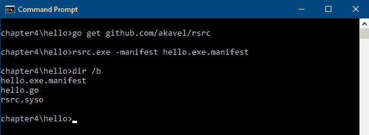

rsrc 工具生成 .syso 文件以嵌入

该步骤将创建一个 `.syso` 文件，该文件将自动包含在下一步中。现在我们可以实际运行 go build 命令。在命令行中，我们添加一个额外的 `ldflag` 参数，设置为 `"-H windowsgui"`，这告诉编译器输出一个 GUI 应用程序，而不是命令行应用程序。虽然没有这个参数也可以正常工作，但当你从常规图标点击启动应用程序时，你的应用程序后面会显示一个命令行窗口：

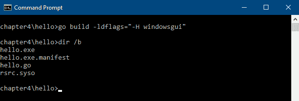

再次运行 go build 将嵌入 `.syso` 文件

# 运行

上一步构建的 hello world 应用程序可以通过两种方式执行：要么从命令行运行，要么通过文件管理器中的图标点击：

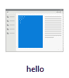

hello 应用程序图标

在当前目录下，你应该在你的文件管理器中看到一个类似于前面的图标。或者，返回到命令提示符，并简单地从项目目录中输入`hello.exe`命令。使用任何一种方法，你现在都应该能在你的桌面上看到这个应用程序正在运行（你可能需要寻找，因为它是一个非常小的窗口）：

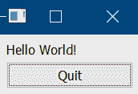

基于 Walk 的 Hello World

# 声明式 API 的好处

如代码示例所示，Walk API 分为两个显著的包：`github.com/lxn/walk`和`github.com/lxn/walk/declarative`。声明式 API 是使用 Walk 开发应用程序 GUI 的首选方法，因为它提供了更好的抽象层，并且更符合习惯用法。声明式 API 的实现还提供了各种标准指标和默认值，有助于用最少的代码创建标准用户界面。该包通常使用`.`前缀导入，这样 GUI 代码就可以避免重复使用`declarative.`前缀。

# 与原生 API 相比

使用原生 API（原生 winAPI 的 Go 绑定）是可能的，但在大多数情况下，这会更冗长，因为你是在直接与低级 API 工作。以这种方式编码无法利用由高级声明式 API 处理的标准化指标或配置，该 API 旨在更好地适应现代编程语言。为了说明这种差异，以下是在我们仅使用原生 API 时前面示例的样子：

```go
package main

import (
   "log"

   "github.com/lxn/walk"
)

var marginSize = 9

func buildWindow() (*walk.MainWindow, error) {
   win, err := walk.NewMainWindowWithName("Hello")
   if err != nil {
      return nil, err
   }
   layout := walk.NewVBoxLayout()
   layout.SetMargins(walk.Margins{marginSize, marginSize, marginSize, marginSize})
   layout.SetSpacing(marginSize)
   win.SetLayout(layout)

   label, err := walk.NewLabel(win)
   if err != nil {
      return win, err
   }
   label.SetText("Hello World!")

   button, err := walk.NewPushButton(win)
   if err != nil {
      return win, err
   }
   button.SetText("Quit")
   button.Clicked().Attach(func() {
      walk.App().Exit(0)
   })

   return win, nil
}

func main() {
   win, err := buildWindow()
   if err != nil {
      log.Fatalln(err)
   }

   win.SetVisible(true)
   win.Run()
}
```

这段代码可以像前面的示例一样编译，运行时看起来完全一样。显然，为了获得相同的结果，需要更多的代码，而且阅读起来也更困难，而且没有特别的收益。在使用声明式 API 时，这种替代示例中的错误处理是隐式处理的。抛开 Go 语法的差异，应该很明显，这个例子中使用的原生 API 调用是直接操作 WinAPI 中的小部件。实际上，通过`NewLabel()`、`NewPushButton()`和`NewMainWindowWithName()`创建的每个对象都是 WinAPI（由`github.com/lxn/win`提供）的 Go 绑定的轻量级包装器。

有很多情况下使用这种原生 API 是有用的；最常见的是，当你需要控制细节或处理现有小部件的更改时，例如在事件处理代码中。声明式 API 旨在轻松定义应用程序用户界面，但它通常不足以管理复杂 GUI 的工作流程。因此，通常会将这两个 API 一起使用——在适当的时候使用每个 API 的力量。

# 使用两种 API 以获得灵活性

理解声明式 API 和本地 API 之间的区别非常重要，因为任何应用程序都可能需要同时使用这两种 API。使用声明式语法非常适合简洁地描述用户界面，但要对图形元素进行运行时操作，则需要引用代码包装的本地小部件之一。为了建立这种联系，每个声明式类型都有一个`AssignTo`字段，它通常传递一个指向`var`的指针，而`var`本身是一个指向表示本地类型的对象的指针。这意味着在用户界面构建阶段，声明式 API 解析器可以创建本地小部件，并在您的代码中设置指针以供以后使用。让我们看看这个功能在实际中的应用：

```go
package main

import (
   "fmt"

   "github.com/lxn/walk"
   . "github.com/lxn/walk/declarative"
)

func main() {
   var message *walk.Label
   var userName *walk.TextEdit

   MainWindow{
      Title: "Hello",
      Layout: VBox{},
      Children: []Widget{
         Label{
            AssignTo: &message,
            Text: "Hello World!",
         },
         TextEdit{
            AssignTo: &userName,
            OnTextChanged: func() {
               welcome := fmt.Sprintf("Hello %s!", userName.Text())
               message.SetText(welcome)
            },
         },
         PushButton{
            Text: "Quit",
            OnClicked: func() {
               walk.App().Exit(0)
            },
         },
      },
   }.Run()
}
```

上述代码可以像之前的*hello world*示例一样编译（如果您为这个示例创建了一个新项目，别忘了包含和处理清单）。当运行此示例时，您应该看到以下界面，并额外有一个文本输入字段。当您在输入框中键入时，欢迎信息将改变，例如，在这个截图中输入了`John Doe`：

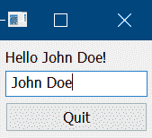

带有姓名输入的 hello world

您会注意到`message`和`userName`变量不是由应用程序代码直接初始化的，而是在分配给`OnTextChanged`函数的函数被调用时，它们持有对已实例化小部件的有效引用。使用这种方法，我们可以在使用声明式 API 提供的易于阅读的 UI 定义的同时，获得本地 API 包装器提供的访问类型。

# 构建用户界面

在了解了 Walk API 的设计和利用方法之后，让我们继续探讨一个现实世界的例子。在这本书中，我们将为每个探索的工具包（在第 4、5、6、7、8、9、10 章）构建相同的用户界面，这将是一个名为 GoMail 的简单电子邮件应用程序。由于 Walk 和 Qt 小部件之间的紧密关系，我们可以快速开始使用 Qt Creator 中包含的 UI Builder 设计用户界面（文档可在[`doc.qt.io/qtcreator/creator-using-qt-designer.html`](http://doc.qt.io/qtcreator/creator-using-qt-designer.html)找到）。

基本应用程序将由两个窗口组成：主电子邮件浏览器和一个用于编写新电子邮件的辅助窗口。主窗口将包含一个列表或树视图，显示我们收到的电子邮件，一个较大的面板用于显示当前选定的电子邮件内容，以及一个菜单和工具栏，用于访问电子邮件应用程序的各种功能：

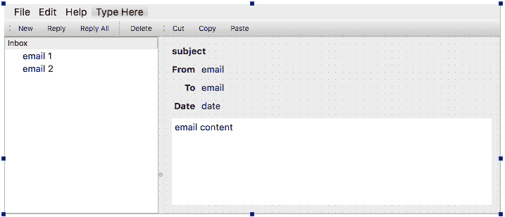

Qt Designer 中的主要电子邮件窗口

要撰写新电子邮件，我们将显示一个次要窗口，该窗口将要求输入发送电子邮件的各种详细信息。打开新窗口将允许用户在撰写新要发送的电子邮件的同时继续阅读电子邮件。撰写窗口还将有发送或丢弃正在编写的电子邮件的按钮：

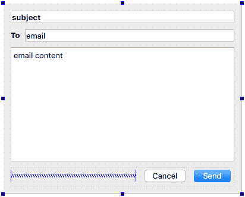

正在设计的附加撰写窗口

# 样式

使用 Walk 构建的应用程序由原生 Windows 组件组成，因此样式由微软提供的实现设置（这是由 Common Controls 部分提供的 `ComCtl32.dll`）。Walk 所需的版本（版本 6.0）增加了对视觉样式的支持；这是提供应用程序使用当前运行的 Windows 桌面版本的正确视觉样式的系统。

此功能从 Windows XP 开始可用，但从 Vista 开始成为标准功能：

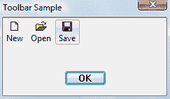

Windows 7 默认主题（Aero – 经微软许可使用）

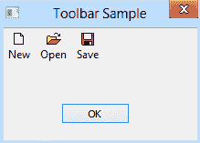

Windows 8 默认主题（称为 Windows，经微软许可使用）

上述图片展示了简单应用程序如何适应不同版本的 Windows 主题。这些插图使用的是默认主题，但用户可以在他们的桌面上应用额外的自定义设置，这些设置也将适用于使用 Walk 构建的应用程序。

# 布局

Walk 布局（如它们所受启发的 Qt Widget 布局）基于有限的基于网格的变体。已实现的布局列表包括以下内容：

+   `GridLayout`: 元素以常规网格布局

+   `VBoxLayout`: 元素被放置在单列中

+   `HBoxLayout`: 元素在一行中对齐

如果你已经探索了 Qt UI Builder 或熟悉 Qt，你可能期望有一个第四个布局 `FormLayout`，但目前 Walk 中没有这个布局。然而，可以通过使用两列 `GridLayout` 并应用所需的对齐属性来模拟它。

除了标准布局外，还有各种控件（其中一些在最终界面中不可见），有助于分组 UI 元素并提供更满意的布局。以下是最常用的这些控件：

+   `Splitter`: 在两个子控件之间放置一个可拖动的分隔条

+   `Spacer`: 用于创建视觉填充，以便项目可以收缩而不是填充空间

+   `分隔符`: 在工具栏或菜单等界面元素之间提供视觉分隔

+   `ScrollView`: 提供可滚动内容的标准控件

+   `GroupBox`: 带有边框和可选标题的视觉控件容器

+   `Composite`: 用于逻辑分组项的控件容器

让我们开始通过创建一些使用声明式 API 的 Go 代码来实现我们的电子邮件应用用户界面。我们从一个设置了合适的`MinSize`的`MainWindow`开始，并添加一个`HSplitter`来存放我们的内容。`TreeView`用于在分割器的左侧列出电子邮件（作为`Children`列表中的第一个项目），在右侧（列表中的第二个项目）是一个设置为使用`Grid`布局的`Composite`——这是最接近我们设计的表单布局。在组内，我们添加了许多子`Label`实例，我们将在这里显示电子邮件详情（将在“与 GUI 通信”部分更新）：

```go
MainWindow{
   Title:   "GoMail",
   Layout:  HBox{},
   MinSize: Size{600, 400},
   Children: []Widget{
      HSplitter{
         Children: []Widget{
            TreeView{},
            Composite{
               Layout: Grid{Columns: 3},
               Children: []Widget{
                  Label{
                     Text:       "subject",
                     Font:       Font{Bold: true},
                     ColumnSpan: 3,
                  },
                  Label{
                     Text: "From",
                     Font: Font{Bold: true},
                  },
                  Label{
                     Text:       "email",
                     ColumnSpan: 2,
                  },
                  Label{
                     Text: "To",
                     Font: Font{Bold: true},
                  },
                  Label{
                     Text:       "email",
                     ColumnSpan: 2,
                  },
                  Label{
                     Text: "Date",
                     Font: Font{Bold: true},
                  },
                  Label{
                     Text:       "email",
                     ColumnSpan: 2,
                  },
                  TextEdit{
                     Text:       "email content",
                     ReadOnly:   true,
                     ColumnSpan: 3,
                  },
               },
            },
         },
      },
   },
}
```

上述代码可以通过替换上一个“hello world”示例中的`MainWindow`，重新编译，然后再次运行来执行。如果你设置了一个新项目，请记住包括清单文件，并再次运行`rsrc`！运行时，它应该看起来像以下截图，在 Windows 10 上拍摄：

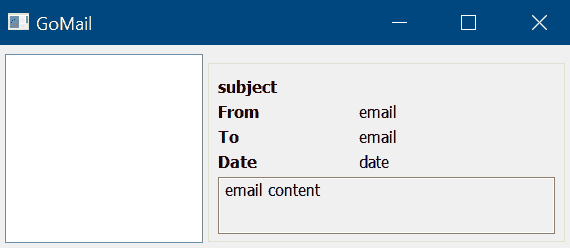

使用 Walk 的声明式 API 的基本电子邮件界面

接下来，我们将创建一个具有类似布局的`Dialog`，用`LineEdit`或`TextEdit`替换`Label`实例，以输入新电子邮件的详细信息。最后，我们添加另一个具有`HBox`布局的`Composite`，其中包含用于`Cancel`和`Send`的`PushButton`实例，以及一个`HSpacer`来完成布局：

```go
Dialog{
   Title:   "New GoMail",
   Layout:  Grid{Columns: 3},
   MinSize: Size{400, 320},
   Children: []Widget{
      Composite{
         Layout: Grid{Columns: 3},
         Children: []Widget{
            LineEdit{
               Text:       "subject",
               Font:       Font{Bold: true},
               ColumnSpan: 3,
            },
            Label{
               Text: "To",
               Font: Font{Bold: true},
            },
            LineEdit{
               Text:       "email",
               ColumnSpan: 2,
            },
            TextEdit{
               Text:       "email content",
               ColumnSpan: 3,
            },
            Composite{
               Layout:     HBox{},
               ColumnSpan: 3,
               Children: []Widget{
                  HSpacer{},
                  PushButton{Text: "Cancel"},
                  PushButton{Text: "Send"},
               },
            },
   },
}
```

如果你想测试这段代码，最简单的方法是将`Dialog`替换为`MainWindow`，然后像主布局一样运行它（别忘了在继续之前将其改回）。

一旦我们有了事件处理，它就会像对话框一样打开，这就是为什么在先前的列表中它不是一个`MainWindow`。运行代码应该产生以下截图：

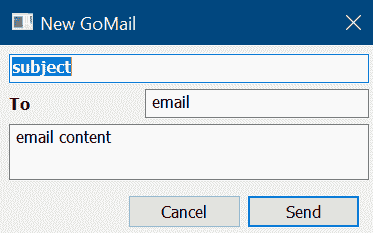

使用 Walk 的声明式 API 创建撰写电子邮件视图

完成主界面功能布局代码所需的所有内容就是这些。接下来，让我们添加菜单、工具栏，并为已定义的按钮设置操作。

# 工具栏和菜单

使用声明式 API 添加菜单和工具栏非常简单。`MainWindow`结构体有一个`Menu`字段（它是一个`MenuItem`切片）和一个`ToolBar`字段（它接受一个包含`Items`字段的`ToolBar`结构体，该字段用于`MenuItem`列表）。列表中的每个项目都是一个`Action`、一个`Separator`或另一个与我们在早期创建的设计相匹配的`Menu`。

声明式 API 中的每个`Action`都期望一个用于菜单显示的`Text`字符串。工具栏也使用此内容作为工具提示，并在样式设置为`ToolBarButtonTextOnly`时用于显示。一个`Image`字段允许你设置工具栏的图标，如果你想要引用安装的图像或与你的应用一起分发的图标。最重要的是`OnTriggered`字段，它应该设置为在按钮或菜单项被点击时执行的`func()`。

以下代码用于设置我们在*布局*部分创建的`MainWindow`上的菜单：

```go
MenuItems: []MenuItem{
   Menu{
      Text: "File",
      Items: []MenuItem{
         Action{
            Text: "New",
         },
         Action{
            Text: "Reply",
         },
         Action{
            Text: "Reply All",
         },
         Separator{},
         Action{
            Text: "Delete",
         },
         Separator{},
         Action{
            Text: "Quit",
         },
      },
   },
   Menu{
      Text:  "Edit",
      Items: []MenuItem{
         Action{
            Text: "Cut",
         },
         Action{
            Text: "Copy",
         },
         Action{
            Text: "Paste",
         },
      },
   },
   Menu{
      Text: "Help",
   },
},
```

工具栏的代码几乎完全相同，因此省略了细节，但您可以通过`ToolBar`字段将其添加到`MainWindow`中，如下所示：

```go
ToolBar: ToolBar{
   Items: []MenuItem{
      Action{
         Text: "New",
      },

// full listing omitted but is available in the book's example code

   },
   ButtonStyle: ToolBarButtonTextOnly,
},
```

添加的代码的结果应该是一个类似于以下截图的窗口：

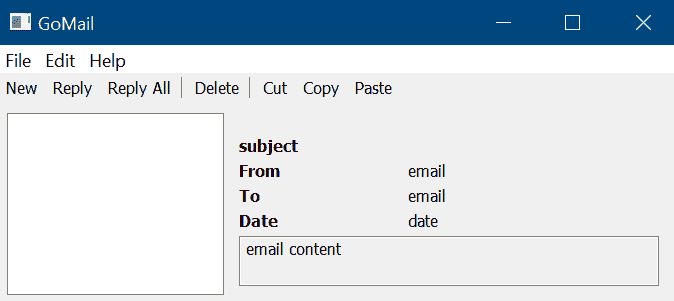

添加了菜单和工具栏的主要电子邮件界面

如果新按钮的代码没有为您工作，请不要担心——完整的应用程序源代码可在[`github.com/PacktPublishing/Hands-On-GUI-Application-Development-in-Go`](https://github.com/PacktPublishing/Hands-On-GUI-Application-Development-in-Go)下载。在用户界面代码完成之前，我们应该添加一些代码，这将帮助我们导航应用程序。最简单的是文件菜单中的退出项。只需将以下代码添加到前面的`Quit`操作中：

```go
OnTriggered: func() {
   walk.App().Exit(0)
},
```

我们的编辑对话框的打开稍微复杂一些，因为对话框需要知道它从哪个父窗口加载。为此，创建一个名为`window`的本地变量，其类型为`*walk.MainWindow`，并使用以下行将其分配给`MainWindow`声明性 API：

```go
AssignTo:  &window,
```

然后，您可以在`New`操作处理程序中引用它，其中`NewCompose`是一个创建电子邮件编辑窗口的函数：

```go
OnTriggered: func() {
   NewCompose().Run(window)
},
```

最后，我们应该为我们的编辑对话框中的按钮设置默认行为。为此，我们需要声明两个`*walk.PushButton`变量，分别分配给`Cancel`和`Send`按钮。然后通过`CancelButton`和`DefaultButton`字段将这些变量传递给对话框定义，我们就能获得适当的行为：

```go
DefaultButton: &send,
CancelButton:  &cancel,
```

现在，让我们将取消按钮设置为关闭对话框——您需要创建一个`walk.Dialog`变量来`AssignTo`声明性 API，就像主窗口一样。完成这些步骤后，无论是点击取消按钮还是按*Esc*键，都应该关闭编辑窗口：

```go
OnClicked: func() {
   dialog.Cancel()
},
```

# 与 GUI 通信

为了填充用户界面，我们需要定义一个数据模型并加载一些测试数据。在本书的代码中，有一个客户端包包含一个数据模型和一些测试数据，用于模拟电子邮件服务器。我们将通过将`github.com/PacktPublishing/Hands-On-GUI-Application-Development-in-Go/client`包导入到本项目的 Go 文件中来使用该包。我们不会在本章中详细介绍该包的细节，但我们将引用其定义的`client.EmailServer`和`client.EmailMessage`类型。电子邮件消息的定义如下——字段名称在加载 UI 中的电子邮件详细信息时将很有用：

```go
type EmailMessage struct {
   Subject, Content string
   To, From         Email
   Date             time.Time
}
```

# 视图模型

为了与 Walk 用户界面通信，我们需要定义另一个数据模型。这个视图模型旨在以声明性 API 能够理解的方式传递信息。我们将创建一个名为`EmailClientModel`的类型，它将处理将我们的客户端代码中的数据转换为我们的用户界面定义。创建一个新文件`model.go`，在那里你可以开始定义这些模型。代码的第一部分允许设置电子邮件服务器，从而使电子邮件列表相应更新。

为了简洁，省略了`walk.TreeModel`的琐碎方法——你可以在本书的完整代码列表中找到它们：

```go
type EmailClientModel struct {
   Server *client.EmailServer

   root walk.TreeItem

   itemsResetPublisher  walk.TreeItemEventPublisher
   itemChangedPublisher walk.TreeItemEventPublisher
}

// TreeModel methods omitted - see full code listing

func (e *EmailClientModel) SetServer(s *client.EmailServer) {
   e.Server = s

   e.root = NewInboxList(s.ListMessages())
   e.itemsResetPublisher.Publish(e.root)
}

func NewEmailClientModel() *EmailClientModel{
   return &EmailClientModel{}
}
```

这个模型的电子邮件列表需要将我们的电子邮件列表作为树中的项目来表示，而不是客户端代码返回的简单列表。为了支持这一点，我们需要另一个类型，`EmailModel`，它实现了`walk.TreeItem`接口。在这里，我们又省略了琐碎的细节——每个电子邮件项目永远不会包含子元素，因此我们可以忽略这种复杂性：

```go
type EmailModel struct {
   email  *client.EmailMessage
   parent walk.TreeItem
}

// TreeItem functions omitted - see full code listing
```

我们希望将我们的电子邮件分组在`Inbox`标题下，因此我们需要构建根节点，然后在其内部填充电子邮件列表。为此，我们定义了一个额外的类型`InboxList`，它也实现了`walk.TreeItem`接口，但这次它将允许访问它所持有的子列表（电子邮件）。我们还需要编写一个方法，用于从消息列表（客户端代码将提供给我们）构建收件箱列表。看看这个代码片段中的最终方法是如何为每条消息创建`EmailModel`实例并将它们添加到收件箱列表中的：

```go
type InboxList struct {
   emails []walk.TreeItem
}

func (i *InboxList) Text() string {
   return "Inbox"
}

func NewInboxList(l []*client.EmailMessage) *InboxList {
   list := &InboxList{}

   for _, item := range l {
      list.emails = append(list.emails, &EmailModel{item, list})
   }

   return list
}
```

# 详细视图

现在我们已经构建了数据模型，让我们显示加载的数据。从电子邮件详细视图开始，我们将使用 Walk 的声明性 API，`DataBinder`。这允许我们避免在每次加载新消息时手动设置每个标签上的数据。为了正确工作，我们还需要创建一个`walk.DataBinder`来分配——这将处理实际的绑定：

```go
emailDetail *walk.DataBinder
```

然后，我们可以更新显示电子邮件信息的`Composite`小部件，以使用这种数据绑定。让我们也通过`DataSource`字段设置默认内容。这些信息将来自模型，我们将在稍后初始化它：

```go
DataBinder: DataBinder{
   AssignTo: &emailDetail,
   DataSource: model.Server.CurrentMessage(),
},
```

然后，每个项目只需将其静态`Text`字段更改为适当的`Bind()`调用；参数将是*视图模型*部分中描述的`client.EmailMessage`类型上的字段名称：

```go
Text:       Bind("Subject"),
```

对于`Date`字段，我们无法直接绑定`time.Time`类型，因此使用`DateString()`辅助函数代替：

```go
Text:       Bind("DateString"),
```

最后，让我们创建一个辅助方法，允许我们更新当前绑定的电子邮件消息：

```go
func (g *GoMailUIBrowse) SetMessage(email *client.EmailMessage) {
   g.emailDetail.SetDataSource(email)
   g.emailDetail.Reset()
}
```

# 列表视图

我们电子邮件列表的大部分工作是在前面的模型代码中完成的——现在我们需要将其连接到用户界面。以下代码设置了一个`walk.TreeView`类，我们用它来跟踪当前项，并将其分配给声明性的`TreeView`。之后，设置模型，然后传递一个函数，当当前项发生变化时会通知我们：

```go
emailList *walk.TreeView

TreeView{
   AssignTo: &g.emailList,
   Model: model,
   OnCurrentItemChanged: func() {
      item := g.emailList.CurrentItem()

      if email, ok := item.(*EmailModel); ok {
         g.SetMessage(email.email)
      }
   },
},
```

所有这些准备就绪后，应用程序将使用`model.Server.CurrentMessage()`通过`DataBinder`的默认`DataSource`从当前电子邮件消息加载电子邮件详情。当点击主列表时，传递给`OnCurrentItemChanged`的函数会检查该项是否为`EmailModel`，如果是，则更新详细视图。最后，我们需要设置前面代码中使用的模型，如下所示：

```go
model := NewEmailClientModel()
model.SetServer(client.NewTestServer())
```

此模型用于设置列表内容，也用于设置详细视图的默认内容。构建并运行后，应用程序现在应该看起来像一个完整（尽管是基本的）的电子邮件客户端：

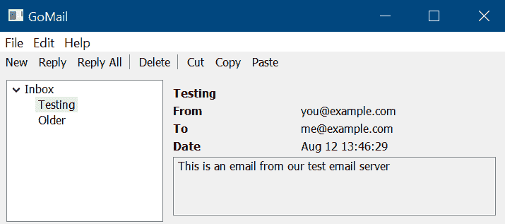

加载了一些测试数据的我们的电子邮件界面

# 背景处理

所有使用 Walk 的用户界面代码都必须在主线程上运行；这是处理小部件的 winAPI 的限制。这意味着任何在后台的工作必须在运行任何 UI 代码之前更改线程。这是通过在`walk.Window`上使用`Synchronize()`函数来完成的。它接受一个函数作为参数，并确保包含的代码将被适当地运行。

为了处理当新电子邮件到达时的更新，我们创建了一个新的函数`incomingEmail()`，该函数将更新我们的电子邮件列表模型。此函数将导致将电子邮件添加到模型中，这将发生在主线程上，以便用户界面可以更新以反映新数据：

```go
func (g *GoMailUIBrowse) incomingEmail(email *client.EmailMessage, model *EmailClientModel) {
   g.window.Synchronize(func() {
      model.AddEmail(email)
   })
}
```

为了支持此更改，我们需要更新`EmailClientModel`以添加此新的`AddEmail()`函数。该函数将向列表添加一个项并发布数据重置事件：

```go
func (e *EmailClientModel) AddEmail(email *client.EmailMessage) {
   e.root.Add(email)
   e.itemsResetPublisher.Publish(e.root)
}
```

这反过来需要一个在`InboxList`类型中的`Add()`函数，我们创建它以向模型提供数据：

```go
func (i *InboxList) Add(email *client.EmailMessage) {
   i.emails = append(i.emails, &EmailModel{email, i})
}
```

最后，我们需要监听`Incoming()`服务器通道，它将每个新电子邮件传递到我们的应用程序。由于此通道读取将阻塞，直到收到电子邮件，因此必须在单独的 goroutine 中运行——这就是为什么需要背景处理。当电子邮件到达时，我们只需调用我们刚刚创建的函数，传递新的`email`和一个对`model`的引用，我们应该刷新它：

```go
server := client.NewTestServer()
model.SetServer(server)

go func() {
   incoming := server.Incoming()
   for email = range incoming {
      g.incomingEmail(email, model)
   }
}()
```

在此代码到位后，您将看到当新电子邮件到达时电子邮件列表更新。然后可以点击电子邮件以查看详情。

# 在跨平台应用程序中漫步

Walk 显然是一个针对 Microsoft Windows 平台创建图形用户界面的库——但这并不意味着使用 Walk 构建你的应用程序会限制你只能在 Windows 上使用。通过在第三章中探索的技术，“Go to the Rescue!”，我们可以设置 Windows 的代码在为该平台构建时条件性地包含，并引入其他可能为其他平台提供用户界面的文件。

第一步是更新我们迄今为止构建的文件，以便仅在 Windows 上构建。我们使用构建约束注释格式来完成此操作（如果你愿意，你也可以在这一步使用文件命名）：

```go
// +build windows

package main

...
```

然后，我们引入了一个新的文件，用于处理我们在不同平台上的回退情况。对于这个简单的项目，我们将它称为 `nonwindows.go`，因为其内容将在任何非 Windows 计算机上运行。在这个文件中，我们放置了一小段代码，如果应用程序在任何不受支持的平台上启动，它将打印失败消息并退出。请注意，这里的构建约束被设置为在任何非 Windows 平台上编译；这也将更新以匹配你的项目可能有的任何回退情况：

```go
// +build !windows

package main

import "log"

func NewMailUIBrowse() {
   log.Fatalln("GoMail with Walk only works on windows")
}
```

注意 `NewMailUIBrowse()` 函数的名称——这是我们用于加载和运行主 GoMail 浏览界面的通用方法名。你可能需要更新之前用于运行应用程序的方法的名称。最可能的是，你使用了 `main()`，但我们需要提供一个包含该方法的新的 `main.go` 文件。这个新文件是项目中唯一没有构建约束的文件。它将编译为任何平台，并且在运行时，它将执行为目标平台编译的 `NewMailUIBrowse()` 方法：

```go
package main

func main() {
   NewMailUIBrowse()
}
```

如果我们切换到另一个操作系统，比如 macOS，并现在编译代码，应该没有编译错误。运行应用程序将显示一个简单的错误消息，并立即退出。显然，这段代码可以比仅仅显示错误消息做更多有意义的事情：

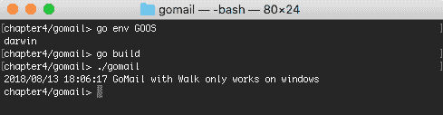

因此，你可以看到我们如何使用 Walk 开发特定于 Windows 的用户界面。作为多平台策略的一部分，这可以帮助确保你的受众在 Windows 上的平台集成度更高，或者你可能希望为你的应用程序的某些部分提供特定于平台的实现。无论原因如何，你可以看到在用 Go 进行跨平台应用程序构建时包含多个平台特定替代方案是多么容易。

# 摘要

在本章中，我们首先通过查看 Windows 图形应用程序开发的 Walk API 来开始对 GUI 工具包的探索。我们了解了如何运行基于 Go 的 Windows 应用程序，并学习了 Walk 项目是如何构建为独立的声明性 API 和本地 API 的。我们还看到了每个 API 提供的不同好处以及它们如何最佳地组合以创建一个简单的应用程序。

由于 Walk 设计深受 Qt 项目（我们将在第七章，*Go-Qt - 多平台与 Qt*）的启发，我们得以利用 Qt Creator 的界面设计功能来模拟一个基本的电子邮件应用程序，然后使用声明性 API 构建它。这个电子邮件应用程序是一个设计，可以用于每个工具包探索章节。为了支持示例应用程序，我们导入了这个书中源代码提供的另一个包，它提供了一些数据模型和测试数据。通过结合我们的 UI 代码、电子邮件客户端库以及 Walk 工具包的数据绑定功能，我们能够创建一个简单的电子邮件应用程序，该程序可以在 Windows 平台上使用系统提供的控件原生运行。通过一些小的调整，展示了这可以成为更广泛的跨平台策略的一部分，其中每个平台的图形表示由不同的工具包提供。

在下一章中，我们将把重点转移到提供跨多个平台原生外观和感觉的代码。我们将特别关注 andlabs UI——一个旨在提供与当前操作系统相匹配的外观和感觉的 GUI 工具包。如果用于 Windows，它将与 Walk 相似，但它也可以适应不同的桌面平台，而只需编写一次用户界面代码。
