# 第五章：andlabs UI - 跨平台原生 UI

就像我们在上一章中探索的 Walk API 一样，andlabs UI 旨在在操作系统原生小部件之上创建 Go API，但与 Walk 不同，andlabs UI 项目支持单个 API 的多个操作系统。这意味着使用该 API 创建的图形应用程序可以使用相同的源代码在 Windows、macOS 和 Linux 上编译和运行。

在本章中，我们将探讨与操作系统外观和感觉相匹配的跨平台原生应用程序。特别是，我们将涵盖以下主题：

+   背景和历史

+   开始使用 andlabs UI

+   多平台通用的 API

+   构建用户界面

+   多个原生 GUI 的挑战

在我们开始探讨使用原生小部件工具包的跨平台 API 的益处和复杂性之前，让我们更深入地了解一下项目的背景。

# 背景和历史

andlabs UI 项目是为了提供一个简单易用的方法来使用 Go 创建原生图形应用程序。API 是最小化的，因为它旨在只提供创建 GUI 程序所必需的内容。核心是一个 C 库，它隐藏了平台特定的 API，允许主库管理 Go GUI API 的惯用考虑因素。最近，这个 C 库（libui）被移动到一个单独的项目中，为了方便开发者，它被包含在 Go 项目中。

项目中包含的可用小部件的演示——当在 Linux 计算机上运行时，它将看起来像以下截图：

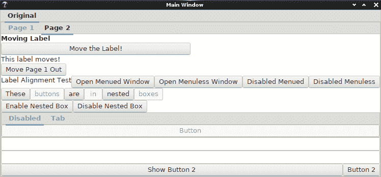

andlabs UI 的小部件演示

作为平台原生实现，andlabs UI 中的小部件在每个操作系统上看起来都不同。在 Windows 和 macOS 上，库使用原生小部件集，而在 Linux 上则使用 GTK+库。这种方法创建的应用程序与当前计算机上的其他软件保持一致，因此应该对用户来说很容易理解。这种方法功能强大，具有实质性的好处，但可能给应用程序开发者带来复杂性。我们将在本章中探讨这种方法的益处和挑战，但首先让我们从一个简单的*hello world*应用程序开始运行。

# 开始使用 andlabs UI

andlabs UI 在大多数平台上都很容易开始使用，但具体细节因系统而异。由于链接到许多不同的操作系统的原生小部件工具包，可能会有一些隐藏的复杂性，尤其是在开发基于 Linux 的应用程序时。在我们能够构建第一个基于 andlabs 的应用程序 GUI 之前，有一些设置是必需的。我们需要准备当前的开发环境以与原生小部件一起工作。

# 先决条件

作为利用每个平台原生控件的 API，Windows、macOS 和 Linux 的先决条件各不相同。在此部分需要安装的任何包都将由您开发的应用程序的用户所需要。还需要确保 CGo 运行（Go 代码调用 C 函数的能力在第三章，*Go 来拯救!*中有所说明），这可能需要安装额外的构建工具。

# Microsoft windows

Windows 上使用的原生控件是通用控件——与我们在第四章，*Walk - 构建图形化窗口应用程序*中详细探讨的 Walk 库所使用的相同。由于它们是操作系统的原生控件，因此在使用 Windows Vista 或更高版本时不需要安装。如果您想支持更早的版本（回溯到 Windows XP），如果安装至少 `ComCtl32.dll` 版本 6.0，则是有可能的。

Andlabs UI，像本书中介绍的其他许多工具包一样，需要 CGo 的存在来利用原生库。在完整的开发系统中，这可能是已经设置好的。如果您不确定，或者想要回顾如何设置 Cgo 依赖项，请检查附录中的*设置 CGo*部分，*安装详情*。

# macOS

在为 macOS 开发时，直接使用原生控件。因为这些控件由操作系统为 macOS 的每个最新版本提供，所以不需要额外的库。

CGo 支持对于 andlabs UI 是必需的，这需要安装 XCode 命令行工具。如果您还没有设置好，请检查附录中的*设置 CGo*部分，*安装详情*。

# Linux

在 Linux 上，andlabs UI 使用 GTK+ 控件库（我们将在第六章，*Go-GTK - 多平台与 GTK*中详细探讨）因此，必须在您的计算机上安装此库。如果您已安装 Gnome 桌面或使用 GTK+ 的其他应用程序（如 Gimp），库已安装。如果没有，您将需要使用系统包管理器安装此依赖项。

虽然这是一个简单的任务，但包名在不同的系统之间可能会有所不同——它可能被称为 `gtk3-devel`、`libgtk-3-dev` 或 `gtk3`。按照常规方式安装它，您就准备好设置 andlabs UI 库了。

要在 Linux 上启用 CGo，这是 andlabs UI 所必需的，您必须安装一个编译器（gcc 或 clang）。这通常已经安装在开发 Linux 安装中，但如果您不确定，可以遵循附录中的*设置 CGo*部分，*安装详情*。

# 设置

andlabs UI 的设置非常简单——它只需要你使用 Go 工具获取库。你只需要执行`go get github.com/andlabs/ui`。在 Windows、macOS 和 Linux 上，这完全一样，前提是你已经安装并运行了 Go（如果没有，请查看附录中的*安装 Go*部分，*安装细节*)。如果你遇到错误，首先检查你的 Go 安装是否是最新的——这些问题通常很快就会得到修复——并且你已经按照描述设置了 CGo。

# 重新构建 UI 库（解决方案）

andlabs UI 构建所基于的 libui 库与主库一起打包，但有时这会过时或没有为你的电脑的精确配置编译。如果你看到错误，例如`relocation R_X86_64_32S against '.rodata' can not be used when making a shared object`，这些说明将有所帮助。如果你在安装时没有看到错误，请跳过这些提示！

以下命令将为你的电脑重新构建 libui 文件。它假设使用 Linux bash shell，因为这种情况最有可能发生在 Linux 电脑上。这不会是使用你构建的应用程序的人所需要的——只是用于设置你的开发环境。libui 项目是从 GitHub 下载的，并使用标准的 cmake 工具构建。务必指定`-DBUILD_SHARED_LIBS=OFF`参数，因为我们必须构建一个静态库以嵌入 Go 库中：

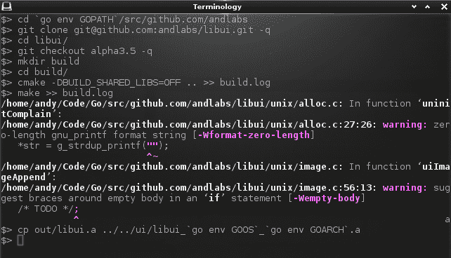

如果打包版本不起作用，重新构建 libui

命令设计为无需任何环境配置即可工作，但你需要安装 cmake——如果你的系统包管理器找不到它，它将能够安装。一旦构建完成，生成的库`out/libui.a`应该移动到 UI 项目中并适当地重命名。

# 代码

现在库已经安装，是时候编写一些代码了。以下示例是 andlabs UI 的*hello world*示例，我们在第四章，*Walk - 构建图形化窗口应用程序*中使用过。首先，将以下代码输入到一个新文件中，命名为`hello.go`：

```go
package main

import "github.com/andlabs/ui"

func main() {
        err := ui.Main(func() {
                window := ui.NewWindow("Hello", 100, 50, false)
                window.SetMargined(true)
                window.OnClosing(func(*ui.Window) bool {
                        ui.Quit()
                        return true
                })

                button := ui.NewButton("Quit")
                button.OnClicked(func(*ui.Button) {
                        ui.Quit()
                })
                box := ui.NewVerticalBox()
                box.Append(ui.NewLabel("Hello World!"), false)
                box.Append(button, false)

                window.SetChild(box)
                window.Show()
        })
        if err != nil {
                panic(err)
        }
}
```

这段代码相当简单，但还有一些事情我们应该讨论，所以让我们一步步来。通常情况下，对于一个简单的图形化 Go 应用程序，我们在定义`main()`函数之前使用`main`包并导入工具库。然后我们调用 andlabs UI 应用程序的主入口点`ui.Main()`，它接受一个函数来构建和显示应用程序的 GUI。如果发生错误，我们将二进制文件导致 panic，因为接口无法加载。

在我们的用户界面代码中，我们首先使用`ui.NewWindow()`设置一个窗口，带有标题和默认大小，最后一个参数表示窗口是否应该有菜单栏。我们打开默认边距（填充），并通过调用`ui.Quit()`分配一个关闭函数以退出应用程序。接下来，使用`ui.NewButton()`创建一个新的按钮，标签为`Quit`，点击它也会退出应用程序。这些组件使用`ui.NewVerticalBox()`容器进行布局。一个`Hello World!`标签和一个`Quit`按钮都被添加。`ui.Box`的`Append()`方法接受一个布尔参数`stretchy`——如果设置为`true`，则组件将扩展以填充可用空间。最后，我们使用`SetChild()`设置窗口的内容，并使用`Show()`显示它。

# 构建

构建这个示例应用非常简单。例如，在下面的屏幕截图中，我们正在 Linux 计算机上运行一个终端，并简单地执行`go build hello.go`。这会创建一个可以直接运行的可执行文件，无需安装 Go 工具：


为当前 Linux 环境构建

在 Windows 计算机上构建（只要 gcc 在命令行路径中——参见前面提到的*先决条件*部分）与在 Linux 或 macOS 上构建一样简单：

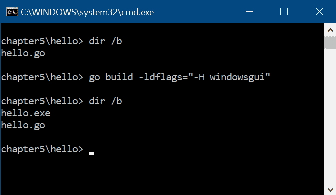

在 Windows 上构建 hello world 应用程序

在这些示例中，我们是在它们将要运行的平台构建应用程序。与 andlabs UI 相比，交叉编译是 Go 工具链的优势之一，但更为复杂。

# 运行

应用程序可以通过命令行（Linux 或 macOS 上的`./hello`，Windows 上的`hello.exe`）运行，或者简单地通过双击系统文件浏览器中的文件图标。无论哪种方式，结果都应该是出现一个熟悉的*hello world*窗口。这将在多个操作系统上看起来非常相似，但外观和感觉会有所不同：

在 Windows 上这与 Walk 相同：

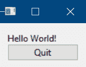

Andlabs UI 在 Linux 上的 hello world：


在 macOS 上运行的 hello world：

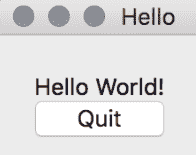

# 多平台通用的 API

andlabs UI 项目提供了一个通用的 API，它封装了 Windows、Linux 和 macOS 上的操作系统原生小部件。由于这种方法，它主要限于*最低共同分母*级别的功能，但考虑到这些工具包的相似性，生成的 API 出人意料地丰富。

所有小部件都继承自`ui.Control`接口，该接口定义了所有控件必须实现的`Show()`、`Hide()`、`Enable()`和`Disable()`方法（具有明显的预期行为）。此外，它还定义了`LibuiControl()`和`Handle()`方法，分别提供对低级 libui 和操作系统小部件的指针。这些方法的使用通常不推荐，因此在本章中未涉及。

与第四章中受 Qt 启发的 Walk API 相比，andlabs UI 的布局功能似乎有限，因为管理 GUI 视觉流的控件较少。本地控件（尽管广泛相似）编程方式不同，并且不一定与相同的顶级布局定义兼容。您将在下一节中看到，容器通常被设置为期望一个子控件，该子控件使用`ui.Box`控件进行布局。在许多其他工具包中可能被视为容器的小部件，在 andlabs UI 中作为单个控件管理（例如`ui.RadioButtons`），以便可以内部处理操作系统特定的实现。

# 控件

andlabs UI 中定义的所有小部件都实现了`Control`接口，因此可以通过`SetChild()`（除`ui.Window`之外）显示、隐藏、启用或禁用，并将它们设置为窗口的内容。出于明显的原因，窗口不能是任何其他`ui.Control`的子控件。窗口的`show()`和`hide()`定义将由操作系统或小部件工具包设置，禁用窗口内容的方式也是如此。

# Box

很可能任何窗口的内容都将设置为 Box——这是因为它是唯一一个提供将多个控件组合在一起方式的控件。这是一个没有可见容器的控件，这是 withinlabs UI 中的基本布局机制。您可以使用`ui.NewHorizontalBox()`或`ui.NewVerticalBox()`创建一个新的 Box，它以线性排列的方式水平或垂直布局其子控件。在水平排列中，子项将具有相同的高度（这将与最高子项所需的高度相匹配），而在垂直（堆叠）配置中，它们的宽度将相同。

向 Box 添加子控件的方法是调用`Append()`函数，该函数接受一个`ui.Control`子控件参数和一个`bool`可伸缩参数。**子控件**将被添加到组件列表中，而**可伸缩**参数决定了如何填充可用空间。当可伸缩参数为`true`时，项目将扩展以填充额外空间；如果为`false`，则观察最小尺寸。如果有多个组件的可伸缩性被打开，则额外空间将在它们之间平均分配。

如果小部件之间留有一定的空间，通常会对用户界面提供更好的视觉流程。提供了一个合适的方法，`SetPadded()`，它将在 Box 中的子小部件之间设置标准空间。这个大小由小部件工具包的标准度量设置，并且会因平台而异。以这种方式应用的填充放置在子组件之间——对于外部（周围）空间，您应该设置边距。边距在嵌入子控件的控件中可用——在本章中被称为“容器”。

# 容器

容器，或允许我们嵌入另一个控件的控件，通常通过其类型定义中存在的 `SetChild()` 或 `SetMargined()` 函数来识别。由于这些控件相互嵌入，通常希望围绕内容有边距——这是 `ui.Box` 中填充的外部等效物。这可以通过使用 `SetMargined(true)` 来开启，并且将在子控件周围引入系统定义的边距大小。

以下容器是作为 andlabs UI 的一部分定义的：

+   `Window` 控件描述了一个应用程序窗口，并且是 andlabs UI 图形应用程序的主要入口点。主要内容是通过 `SetChild()` 设置的。如果是一个简单的内容窗口，则可能需要开启边距，如果您正在添加进一步的容器控件，则可能不需要开启。

+   `Group` 定义了一个围绕子小部件（通过 `SetChild()` 分配）的框架，并带有标题（通过 `ui.NewGroup()` 传递）。组控件的外观在不同系统之间可能会有所不同；在某些系统上，它可能是一个围绕子小部件的框，而在其他系统上则可能不可见。与窗口控件一样，在决定是否启用边距之前，您应该考虑子内容。

+   `Tab` 与其他控件略有不同，因为它可能包含多个子控件——但一次只能看到一个。由于存在多个子控件，添加子控件的方法是 `Append(string, Control)`——第一个参数是要在标签上显示的标题，第二个参数是此新标签的子控件。为了适应多个子控件，边距控件也进行了调整——您需要调用 `SetMargined(int, bool)`，其中第一个参数是标签索引，后者是用于打开或关闭边距的常规参数。

那就是管理其他控件的所有控件，让我们看看构成 andlabs UI 应用程序的主要小部件的详细信息。

# 小部件

剩余的小部件对任何桌面图形应用程序的开发者或实际上使用它们的人来说都很熟悉。以下是每个小部件的功能或限制的快速概述：

+   `Button`: 一个带有标签的标准 `pushbutton`，并具有 `onClicked` 回调

    +   `Checkbox`: 一个可切换的条目，可以是勾选的或未勾选的；在更改时将触发 `onToggled` 回调

+   `Combobox`: 一个提供字符串列表以供选择的控件

+   `DateTimePicker`: 一个用于输入日期和/或时间的字段——配置是通过不同的构造函数设置的

+   `Entry`: 一个单行文本输入控件，可以是只读的；它支持用于更改事件的 `onChanged` 处理程序

+   `Label`: 一个简单的只读文本组件，用于注释用户界面

+   `ProgressBar`: 一个水平条，用于指示进度；值范围从 0 到 100

+   `RadioButtons`: 一个用于展示选项列表的控件，如复选框，但只能选择一个

+   `Separator`: 一个水平或垂直线，用于在视觉上分隔其他控件

+   `Slider`：一个水平条，可以通过移动指示器在设定的最小值和最大整数值之间选择

+   `Spinbox`：一个输入框，可以通过上下按钮选择介于最小值和最大值之间的整数

在这个列表中一个明显的遗漏是菜单或工具栏小部件；在撰写本文时，它们不包括在 andlabs UI 工具包中。接下来，我们将查看一个可能的解决方案，通过访问底层的 libui 来处理菜单（不幸的是，这不会适用于工具栏）。

# 菜单

在撰写本文时，andlabs UI 没有公开菜单 API（尽管`ui.NewWindow()`接受一个`hasMenubar`参数）。目前有一个项目正在进行中，旨在正确公开菜单功能到 Go API，但到目前为止，它仅在你与底层的 libui C 代码一起工作时才可用。C 库中定义的菜单可以通过添加一些 CGo 代码从 Go 项目中访问，例如以下代码：

```go
/*
void onMenuNewClicked(uiMenuItem *item, uiWindow *w, void *data) {
   void menuNewClicked(void);
   menuNewClicked();
}

int onQuit(void *data) {
   return 1;
}

void loadMenu() {
   uiMenu *menu;
   uiMenuItem *item;

   menu = uiNewMenu("File");
   item = uiMenuAppendItem(menu, "New");
   uiMenuItemOnClicked(item, onMenuNewClicked, NULL);
   uiMenuAppendSeparator(menu);
   item = uiMenuAppendQuitItem(menu);
   uiOnShouldQuit(onQuit, NULL);

   menu = uiNewMenu("Help");
   item = uiMenuAppendItem(menu, "About");
}
*/
import "C"
```

代码片段为“新建”菜单项设置了一个点击处理程序，并为“退出”菜单项（由于 macOS 以不同的方式处理退出菜单项，因此它是一个特殊项）设置了一个退出处理程序。然后我们有一个`loadMenu()`函数，它设置了一个文件菜单，子项被添加到其中，有一个分隔符，以及一个目前为空的“帮助”菜单。

要正确编译此代码，需要`cfuncs.go`文件知道头文件和 C 库存储的位置。在运行此代码之前，请确保`CFLAGS`和`LDFLAGS`显示了正确的位置。虽然构建菜单的代码并不复杂，但 CGo 配置和链接相当复杂，因此可能不推荐这样做：


启动菜单示例

结果应该类似于这张截图，它是在 Linux 计算机上拍摄的：


andlabs libui 菜单

在本书的代码仓库中有一个完整的菜单项目。不幸的是，它不是一个跨平台项目，可能无法在所有操作系统或 Go 版本上正确执行。

# 面积和绘图

`ui.Area`小部件呈现一个类似于画布的控制元素——一个可以使用路径和其他绘图原语绘制的表面。在撰写本文时，这些 API 都是`ui`包的一部分，但它们可能很快就会移动到`ui/draw`，以便将它们与主要控件 API 分开。一个区域可以是它占据的空间的大小，也可以更大，在这种情况下，它将嵌入到一个可滚动的控件中。所需的行为基于是否调用`ui.NewArea(handler)`或`ui.NewScrollingArea(handler, width, height)`（其中 width 和 height 是期望的内容大小）。

面积背后的逻辑是 `ui.AreaHandler`，它是面积构造函数的任意一个的第一个参数。它的 `Draw(*ui.Area, *ui.AreaDrawParams)` 函数在工具包需要重新绘制面积时被调用，第一个参数是它注册的面积，第二个提供了上下文，例如要填充的剪辑矩形。除了绘制面积的内容外，处理器还负责处理鼠标和键盘事件，当鼠标事件发生时调用 `MouseEvent(*ui.Area, *ui.AreaMouseEvent)`，对于任何键盘事件调用 `KeyEvent(*ui.Area, *ui.AreaKeyEvent)`。

为了更仔细地查看绘图功能，让我们运行一段小代码。在这个例子中，我们创建了一个新的 `ui.AreaHandler` 类型（命名为 `areaHandler`），它实现了接口中所有必需的函数。唯一感兴趣的方法是 `Draw()` 调用，它包含在这里：

```go
func (areaHandler) Draw(a *ui.Area, dp *ui.AreaDrawParams) {
   p := ui.NewPath(ui.Winding)
   p.NewFigure(10, 10)
   p.LineTo(dp.ClipWidth - 10, 10)
   p.LineTo(dp.ClipWidth - 10, dp.ClipHeight - 10)
   p.LineTo(10, dp.ClipHeight - 10)
   p.CloseFigure()
   p.End()

   dp.Context.Fill(p, &ui.Brush{Type:ui.Solid, R:.75, G:.25, B:0, A:1})
   dp.Context.Stroke(p, &ui.Brush{Type:ui.Solid, R:.25, G:.25, B:.75, A:.5},
      &ui.StrokeParams{Thickness: 4, Dashes: []float64{10, 6}, Cap:ui.RoundCap})
   p.Free()
}
```

此代码分为两部分：首先我们设置一个 `ui.Path`，然后我们使用路径进行绘制。路径（命名为 p）被设置为在正在绘制的剪辑区域内部 10 像素处——这样做是为了演示画布背景（在每次 `Draw()` 调用之前都会清除绘图区域）。接下来，我们使用这个路径在绘图上下文 (`dp.Context`) 中进行 `Fill()` 和 `Stroke()`。`Fill()` 调用指定了一个不透明的橙色画笔（前述代码中的 `A` 代表 alpha）。然后，我们使用相同的路径调用 `Stroke()`（这将绘制一个围绕填充框的线）。我们要求一个四像素宽的虚线，带有圆形端点——这次使用半透明的蓝色颜色。

要将此绘制到屏幕上，我们需要配置一个窗口，使其具有一个 `ui.Area` 控制器，该控制器扩展以填充窗口，如下所示：

```go
func main() {
   err := ui.Main(func() {
      window := ui.NewWindow("Draw", 200, 150, false)
      window.SetMargined(false)
      window.OnClosing(func(*ui.Window) bool {
         ui.Quit()
         return true
      })

      handler := new(areaHandler)
      box := ui.NewVerticalBox()
      box.Append(ui.NewArea(handler), true)

      window.SetChild(box)
      window.Show()
   })
   if err != nil {
      panic(err)
   }
}
```

如果你将这些放在一起（或运行 `chapter5/draw` 示例），你应该会看到以下截图类似的内容：


Andlabs UI 绘图函数

注意透明蓝色是如何勾勒出橙色填充的矩形，并且也显示了矩形和下面的背景。如果我们颠倒 `Fill()` 和 `Stroke()` 调用的顺序，橙色矩形将完全覆盖虚线轮廓的一半。

# 构建用户界面

现在我们已经了解了 andlabs UI 的 API 功能，让我们看看如何构建一个具有一定复杂性的图形应用程序。对于本节，我们将遵循在 第四章 中介绍的 "GoMail" 应用程序的设计，即 *Walk - 构建图形窗口应用程序*。所提出的设计是使用 Qt Creator 工具创建的，虽然它非常适合使用 Walk 库开发应用程序，但并不是所有 GUI 工具包的直接选择。andlabs UI 的多平台方法使用原生小部件意味着某些组件不可用，但可以通过组合简单的小部件来创建更复杂的组件。

考虑到这一点，让我们快速看一下不同平台的样式功能可能会如何影响我们正在构建的应用程序。在探索样式之后，我们将开始实现应用程序的基本布局，并添加控件和功能来展示用户界面能力。

# 样式

基于 andlabs-UI 的应用程序样式是平台特定的，通常由操作系统设置。一些支持基于用户的自定义，这可能会微妙或极大地影响应用程序的外观和感觉——因此在应用程序设计和测试期间考虑可能的变体是很重要的。

当在 Microsoft Windows 上运行时，使用的工具包是通用控件（在第四章[3b8f1272-2158-4744-945f-3258b5c4f61c.xhtml]中讨论，*构建图形窗口应用程序*）。基本上，控件在 Windows 的不同版本中看起来会有所不同，这有助于应用程序与不断发展的桌面外观和感觉相融合。Windows 中的大多数用户自定义选项都集中在较新的（“通用”）应用程序上，但可能会在使用通用控件（因此与 andlabs UI 相关）构建的应用程序中显示一些颜色变化。在测试你的应用程序布局和设计时，务必考虑你打算支持的 Windows 版本。

苹果公司也在随着时间的推移不断进化他们的 macOS 小部件工具包的外观和感觉，尽管大多数最新版本（自 2007 年发布的 OS X 10.5 以来）在组件的布局和尺寸上保持大体一致。在 macOS 环境中运行 andlabs UI 的应用程序应该在整个支持的版本中保持相当一致——除非用户在 2018 年底发布的 macOS Mojave 中启用了新的“深色模式”。随着这个新的用户配置选项的出现，用户界面可能会以亮色（默认）或深色模式呈现，以匹配用户的偏好。应用程序设计师应考虑这一点，并确保他们的内容在两种配置中都能良好展示。

在 andlabs UI 中使用的组件能够正确适应这种新样式，但自定义内容可能不行。目前还没有 API 来检测正在使用哪种颜色模式，因此最简单的方法是限制你的界面使用标准控件，或者选择一个在两种模式下都看起来合适的颜色方案：

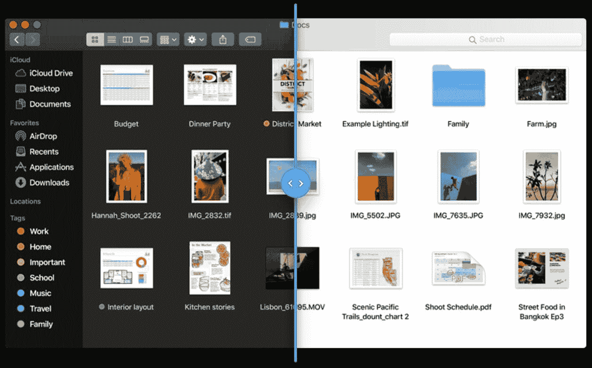

macOS 浅色和深色模式的并排比较（版权所有：IDG UK via MacWorld）

在 Linux 中，andlabs UI 工具包建立在 GTK+小部件集之上，该小部件集旨在允许主题和样式调整。虽然这些类型的主题不能实质性地改变组件的布局，但它们可以显著影响主题提供的尺寸、填充和着色，从而影响应用程序用户界面的流动和尺寸。这对于希望在其程序中支持固有灵活性的软件开发者来说可能是一个挑战。GTK+有超过一千个主题，许多可以在 Gnome Look 网站上找到：[`www.gnome-look.org/browse/cat/135/ord/top/`](https://www.gnome-look.org/browse/cat/135/ord/top/)。GTK+主题在第六章，*Go-GTK - 多平台与 GTK*中进一步探讨，我们更深入地研究了 GTK+工具包。

这两个截图比较了一个流行的浅色和深色主题——显然它们可以改变不仅仅是配色方案：

|  | 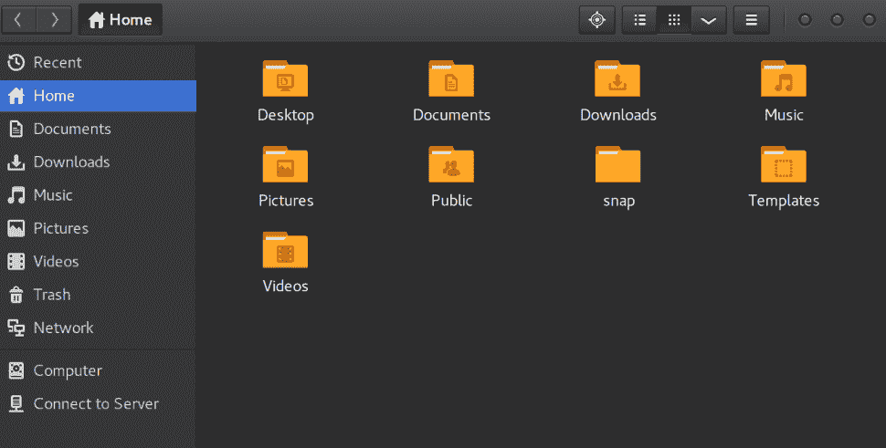 |
| --- | --- |

GTK+ SuperFlat 和 Vertex 主题比较

这些平台主题和配置选项中的每一个都可能影响最终应用程序的外观和感觉。如果您计划支持这些视觉风格，最佳策略是避免自定义控件，绘制功能并让原生控件适当地适应。如果您的应用程序需要自定义内容或渲染，选择一个适用于许多不同主题或样式的调色板将非常重要。

# 布局

andlabs UI 中的布局由水平和垂直的盒子组成，每个盒子都包含一个子元素列表，这些元素可以是可拉伸的或静态的。水平盒子在一个单独的行上布局，盒子内的每个控件都有相同的高度（即与最高元素的高度相匹配）。在垂直盒子中，控件以单列布局，每个元素都有相同的宽度（即最宽项的宽度）。如果容器比容纳项目所需的最小尺寸大，任何额外的空间都将由任何被附加为*可拉伸*的元素共享——如果没有可拉伸的元素，项目将保持左对齐或顶对齐。

为了在元素组之间提供视觉分隔，我们可以使用`ui.Separator`控件，它在水平或垂直方向上绘制一条细线——记得在盒子布局中将其标记为不可拉伸。如果您希望在布局中引入空间而不使用视觉线，可以创建一个空白标签（使用`ui.Label("")`），并将其附加到盒子时将可拉伸参数设置为`true`。

# 主要电子邮件窗口

我们电子邮件客户端的主要布局框`content`是一个使用`ui.NewHorizontalBox()`创建的水平框，其中包含左侧的电子邮件列表（第一个要附加的项目）、一个垂直的`ui.Separator`以及右侧的详细视图（因为它是要附加的项目列表项）。电子邮件列表由一个名为`inbox`的`ui.Group`组成，包括`Inbox`标题；请注意，我们的标题标签后面跟着一系列空格——这有助于在我们的应用程序中创建更宽敞的布局。在这个布局中，我们有一个垂直的`ui.Box`，其中每个电子邮件都有一个`ui.Label`。

由于没有可用的网格布局，详细视图由各种框组成。你可以看到`meta`框是两个垂直`ui.Box`子实例的水平布局：第一个包含标签的垂直框，第二个是稍后将要填充的值的列表——填充将提供它们之间的合适间隔。

与*hello world*示例一样，我们创建了一个带有`GoMail`标题、请求的大小，并将`hasMenu`参数设置为`false`的窗口。在示例的末尾，我们设置窗口的内容并调用`Show()`：

```go
window := ui.NewWindow("GoMail", 600, 400, false)
window.SetMargined(true)
window.OnClosing(func(*ui.Window) bool {
   ui.Quit()
   return true
})

list := ui.NewVerticalBox()
list.Append(ui.NewLabel("email1"), false)
list.Append(ui.NewLabel("email2"), false)
inbox := ui.NewGroup("Inbox")
inbox.SetChild(list)

subject := ui.NewLabel("subject")
content := ui.NewLabel("content")
labels := ui.NewVerticalBox()
labels.Append(ui.NewLabel("From "), false)
labels.Append(ui.NewLabel("To "), false)
labels.Append(ui.NewLabel("Date "), false)

values := ui.NewVerticalBox()
from := ui.NewLabel("email")
values.Append(from, false)
to := ui.NewLabel("email")
values.Append(to, false)
date := ui.NewLabel("date")
values.Append(date, false)

meta := ui.NewHorizontalBox()
meta.SetPadded(true)
meta.Append(labels, false)
meta.Append(values, true)

detail := ui.NewVerticalBox()
detail.SetPadded(true)
detail.Append(subject, false)
detail.Append(meta, false)
detail.Append(ui.NewHorizontalSeparator(), false)
detail.Append(content, true)

content := ui.NewHorizontalBox()
content.SetPadded(true)
content.Append(inbox, false)
content.Append(ui.NewVerticalSeparator(), false)
content.Append(detail, true)

window.SetChild(content)
window.Show()
```

通过将那段代码放入我们在*hello world*应用程序中使用的相同`main()`包装器中，我们可以运行这个用户界面以查看布局是如何工作的。你应该会看到以下截图：

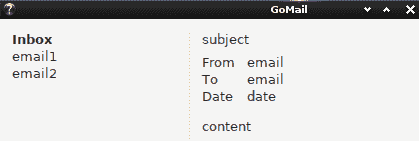

主要电子邮件浏览器布局

如你所见，我们无法使用 Walk 示例中的拆分器，但使用`ui.Separator`模拟了那种外观。虽然代码相同，但它们在不同操作系统上可能表现不同，如下所示 macOS 上扩展的垂直`ui.Box`：

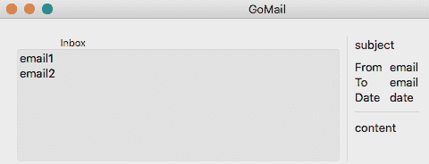

在 macOS 上，布局不同，但随着我们添加内容将会改进

左侧的树形或列表组件在这个阶段只是一个简单的标签集合，因为没有提供标准的列表组件。最后，我们没有将标签加粗。这是可能的，但只能通过使用 draw API，这将显著复杂化代码。此外，使用绘图可能导致用户界面的某些部分与加载的平台主题不同；为此，我们坚持使用标准的`ui.Label`组件。在先前的屏幕截图中，你可以看到在这个阶段不同平台具有非常不同的布局——随着我们添加更多内容，这将趋于一致。

# 电子邮件编写对话框

我们编写的对话框窗口布局稍微简单一些：一个名为 `layout` 的垂直框管理着输入元素附加的控件堆栈。我们需要创建另一个水平排列的框，将“收件人”标签放置在输入字段之前；确保开启填充以提供一些间隔。每个文本输入框都是使用 `ui.NewEntry()` 创建的，它创建了一个简单的单行输入字段。不幸的是，在撰写本文时，还没有多行输入字段——在当前阶段，这个限制没有明显的解决方案。UI 库的下一个版本将有一个新的 `ui.MultilineEntry`，这将提供这个功能。

编写布局的最后一个是第二个水平框，`buttonBox`，它使用熟悉的空标签技巧使取消和发送按钮在可用空间内右对齐：

```go
window := ui.NewWindow("New GoMail", 400, 320, false)
window.SetMargined(true)
window.OnClosing(func(*ui.Window) bool {
   return true
})

subject := ui.NewEntry()
subject.SetText("subject")

toBox := ui.NewHorizontalBox()
toBox.setPadded(true)
toBox.Append(ui.NewLabel("To"), false)
to := ui.NewEntry()
to.SetText("email")
toBox.Append(to, true)

content := ui.NewEntry()
content.SetText("email content")

buttonBox := ui.NewHorizontalBox()
buttonBox.SetPadded(true)
buttonBox.Append(ui.NewLabel(""), true)
buttonBox.Append(ui.NewButton("Cancel"), false)
buttonBox.Append(ui.NewButton("Send"), false)

layout := ui.NewVerticalBox()
layout.SetPadded(true)
layout.Append(subject, false)
layout.Append(toBox, false)
layout.Append(content, true)
layout.Append(buttonBox, false)

window.SetChild(layout)
window.Show()
```

如前述代码所示，它使用了与主电子邮件浏览器代码相同的 `ui.NewWindow()` —这是因为 andlabs UI 不区分窗口类型。各种对话框窗口确实存在，但它们是为特定目的预定义的，因此对于我们的自定义对话框，我们将使用普通窗口。因此，你可以通过使用与之前的代码示例相同的 `main()` 方法轻松测试此代码。一旦运行，你应该会看到类似于以下截图的内容：

电子邮件编写窗口：

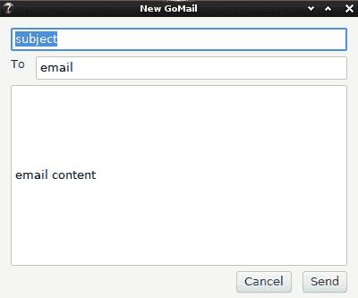

macOS 上的电子邮件编写：

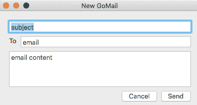

在 Windows 计算机上加载：

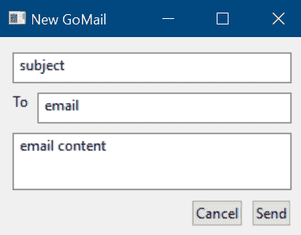

# 工具栏和菜单

很遗憾，目前 andlabs UI 中没有 API 支持菜单或工具栏功能。相反，我们将通过使用水平框、按钮和分隔符来模拟工具栏，这应该会提供所需的效果。由于分隔符可以非常细，我们在其两侧添加了额外的空间：

```go
toolbar := ui.NewHorizontalBox()
toolbar.Append(ui.NewButton("New"), false)
toolbar.Append(ui.NewButton("Reply"), false)
toolbar.Append(ui.NewButton("Reply All"), false)

toolbar.Append(ui.NewLabel(" "), false)
toolbar.Append(ui.NewVerticalSeparator(), false)
toolbar.Append(ui.NewLabel(" "), false)
toolbar.Append(ui.NewButton("Delete"), false)
toolbar.Append(ui.NewLabel(" "), false)
toolbar.Append(ui.NewVerticalSeparator(), false)
toolbar.Append(ui.NewLabel(" "), false)

toolbar.Append(ui.NewButton("Cut"), false)
toolbar.Append(ui.NewButton("Copy"), false)
toolbar.Append(ui.NewButton("Paste"), false)
```

如你所见，我们指定了没有任何按钮、分隔符或间隔应该扩展，因此按钮将左对齐在栏上。如果你希望按钮展开，可以通过传递 `true` 给 `stretchy` 参数来改变这种行为，例如，在附加空的 `ui.Label` 控件时。 

我们需要将此添加到窗口中——添加了一个新的垂直框，称为 `layout`，并将之前的内容打包在工具栏下方。为了在工具栏和主要内容之间提供一些间隔，我们调用了 `SetPadded(true)`。请注意，工具栏和空间（垂直方向）不会拉伸，但内容布局会：

```go
layout := ui.NewVerticalBox()
layout.SetPadding(true)
layout.Append(buildToolbar(), false)
layout.Append(content, true)

window.SetChild(layout)
```

通过将此代码与前面描述的主要布局相结合，你应该会得到一个接近我们在第四章，“漫步 - 构建图形窗口应用程序”中设计的电子邮件用户界面的应用程序：

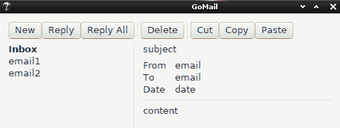

添加了一个按钮框来模拟工具栏

注意外观如何在不同的操作系统之间有所不同——以下是在 Microsoft Windows 上运行的：


在 Windows 上添加我们的工具栏框

# 与 GUI 通信

现在基本布局已经编码完成，我们将添加功能以展示从模拟电子邮件服务器获取的一些数据。与 Walk 示例一样，我们将从`github.com/PacktPublishing/Hands-On-GUI-Application-Development-in-Go/client`包中加载模型定义和测试电子邮件服务器。

首先，让我们编写代码将模型内容加载到用户界面中。我们将创建一个`SetEmail(EmailMessage)`函数，该函数将电子邮件的内容设置到用户界面中。为了帮助将`client.Email`和`time.Time`转换为`string`，我们将使用辅助函数`ToEmailString()`和`DateString()`。此函数将在界面加载期间调用，并且每次更改所选电子邮件时也会调用：

```go
func (m *mainUI) setEmail(e *client.EmailMessage) {
   m.subject.SetText(e.Subject)
   m.to.SetText(e.ToEmailString())
   m.from.SetText(e.FromEmailString())
   m.date.SetText(e.DateString())
   m.content.SetText(e.Content)
}
```

接下来，我们应该更新电子邮件列表。在列表中不再使用两个虚拟电子邮件，而是创建一个新的方法，该方法将遍历所有电子邮件并为每个电子邮件添加一个条目。为了能够在点击时设置电子邮件内容，我们必须从`ui.Label`移动到`ui.Button`（没有其他 andlabs UI 标准控件有`OnClicked`回调）。正如你所见，我们为每个添加的按钮设置了一个新函数，该函数通过调用`setEmail()`函数来设置显示的电子邮件。`captured`变量是必需的，以避免在每次迭代中重新定义 for 循环的`email`：

```go
func (m *mainUI) listEmails(list []*client.EmailMessage) {
   for _, email := range list {
      item := ui.NewButton(email.Subject)
      captured := email
      item.OnClicked(func(*ui.Button) {
         m.SetEmail(captured)
      })
      m.list.Append(item, false)
   }
}
```

为了在加载时调用这些新功能，我们需要更新`main()`方法。首先，使用`client.NewTestServer()`创建一个新的服务器，然后使用从服务器获取的适当信息调用我们编写的函数：

```go
func main() {
   server := client.NewTestServer()
   err := ui.Main(func() {
      main := new(mainUI)
      window := main.buildUI()

      main.listEmails(server.ListMessages())
      main.setEmail(server.CurrentMessage())
      window.Show()
   })
   if err != nil {
      panic(err)
   }
}
```

主视图的最后一步是在用户点击新建按钮时打开撰写窗口。这可以通过另一个`OnClicked`处理程序轻松完成，该处理程序构建并显示二级`ui.Window`：

```go
compose := ui.NewButton("New")
compose.OnClicked(func(*ui.Button) {
   compose := &composeUI{}
   compose.buildUI().Show()
})
```

在我们能够发送电子邮件之前，我们需要从撰写用户界面中的控件构造一个电子邮件。这个新的`CreateMessage()`函数简单地收集用户输入的信息，并将其封装在一个新的`client.EmailMessage`中，该消息已准备好发送：

```go
func (c *composeUI) createMessage() *client.EmailMessage {
   email := &client.EmailMessage{}

   email.Subject = c.subject.Text()
   email.To = client.Email(c.to.Text())
   email.Content = c.content.Text()
   email.Date = time.Now()

   return email
}
```

最后，我们希望取消和发送按钮能按预期工作。两个按钮都应该关闭撰写窗口，但发送按钮应首先尝试发送电子邮件。我们在 UI 代码中已经创建的`buttonBox`上为这些按钮添加了简单的`OnClicked`处理程序：

```go
cancel := ui.NewButton("Cancel")
cancel.OnClicked(func(*ui.Button) {
   window.Hide()
})
buttonBox.Append(cancel, false)
send := ui.NewButton("Send")
send.OnClicked(func(*ui.Button) {
   email := c.createMessage()
   c.server.Send(email)

   window.Hide()
})
buttonBox.Append(send, false)
```

一旦将所有这些代码组合在一起，你就可以运行它，应该会看到一个看起来像这些屏幕截图的应用程序：

+   加载测试数据后运行的 GoMail 接口在 Linux 上：

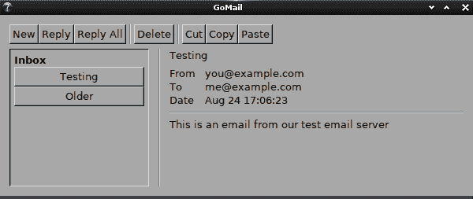

+   使用不同主题（Minwaita）的相同界面：


+   在 macOS 上运行的完成后的 GoMail 界面：

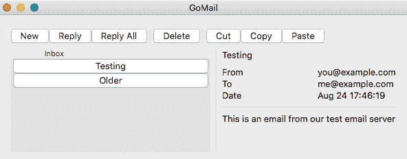

+   在 macOS 暗黑模式下运行：

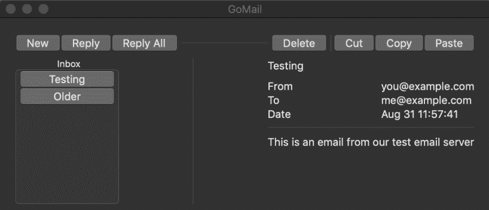

+   在 Windows 10 上运行的 GoMail 接口：


# 后台处理

如您从 andlabs UI 代码的第一行（`ui.Main(func() { ... })`）中可能已经意识到的，在构建此 API 时需要考虑多线程。这是因为它集成的大多数工具包都要求所有图形更新都在同一线程上执行（通常是主应用程序线程）。andlabs UI 通过内部管理线程并提供辅助方法来管理这些复杂性。

由于这种设计，任何在 `ui.Main()` 设置之外的用户界面更新（或在该处创建的控件上的回调）都必须以函数的形式传递给 `ui.QueueMain()` 方法，就像初始设置一样。这允许 andlabs UI 代码在当前框架的适当线程上处理更新。以下代码说明了标签文本如何作为某些后台处理的结果而更改：

```go
ui.QueueMain(func () {
   label.SetText("background")
})
```

回调函数如 `OnClicked()` 和 `OnClosing()` 也像 `ui.QueueMain()` 函数一样接受一个 `func()` 参数。此代码将在正确的线程上自动执行，因此无需担心额外的复杂性。

# 示例

为了查看后台线程的影响，我们将向 GoMail 应用程序添加另一个功能——当新电子邮件到达时更新用户界面。为了启用此功能，我们必须监听 `client.EmailServer` 类型定义的 `Incoming` 通道。

首先，我们创建了一个处理传入电子邮件的函数。这只是一个对新的方法 `appendEmail(*client.EmailMessage)` 的包装，该方法负责将新项目添加到电子邮件列表中。但必须创建一个包装的 `func()` 并将其传递给 `ui.QueueMain`，以便代码在正确的线程上执行：

```go
func (m *mainUI) incomingEmail(email *client.EmailMessage) {
   ui.QueueMain(func() {
      m.appendEmail(email)
   })
}
```

然后我们在 `main()` 方法中添加一些额外的代码来监听来自 `client.EmailServer` 的传入电子邮件。以下代码从服务器模型请求传入通道，然后遍历通过该通道通信的任何电子邮件，触发任何到达的处理程序：

```go
go func() {
   incoming := server.Incoming()
   for email := range incoming {
      main.incomingEmail(email)
   }
}()
```

在这些更新运行的同时，相同的客户端将在 10 秒后触发一个新的电子邮件出现。使用 Go，并发处理很简单，前面的代码显示了 andlabs UI 如何使我们能够从处理用户界面的并发中受益。

# 多个原生 GUI 的挑战

在本章中，我们看到了如何使用单个代码库创建可以在多个平台上与原生小部件工具包协同工作的应用程序。这是一种非常强大的快速开发与平台风格一致、提供熟悉用户体验的图形应用程序的方法。然而，这种方法也可能会对你的项目带来挑战，你可能需要克服这些挑战。

# 一致的风格

虽然在决定适应本地工具包时，一致的风格可能并不明显很重要，但在风格和应用程序设计中涉及许多参数。你们的设计团队或产品专家是否有定义的标准或方法，希望应用于所有应用程序和平台？是否应该将品牌指南包含在界面设计中？

# 品牌风格

由于 andlabs UI 是一个旨在提供对标准小部件抽象的工具包（因此使用当前平台的视觉和感觉），定制选项有限。引入自定义元素的唯一方式是 `ui.Area` 小部件和我们所探索的绘图功能。这使公司字体或标志可以在界面中的某个位置绘制（据说在稍后的版本中将支持加载图像）。

如果您正在寻找进一步定制或主题化您正在构建的应用程序的能力，那么 andlabs UI 可能不是您项目的正确解决方案。可能更好的是探索 GTK+ 或 Qt（我们在第六章 Go-GTK - 多平台与 GTK 和第七章 Go-Qt - 多平台与 QT 中进行了介绍），或者跳转到第三部分（第八章 Shiny - 实验性的 Go GUI API，第九章 nk - Nuklear for Go 和第十章 Fyne - 基于 Material Design 的 GUI），并了解其他图形应用程序设计的途径。

# 用户体验

使用单个 API 并不能保证在多个操作系统上的一致性。所使用的工具包可能有不同的布局默认值，例如不同的填充或对齐。The andlabs UI（以及其底层的 andlabs `libui`）API 被设计为提供尽可能接近操作系统默认值的程序。如果您有关于用户界面外观（除了风格之外）的具体要求，例如布局或对齐，您可能需要编写特殊的代码。使用 Go 的构建标签方法，为不同的操作系统加载不同的代码，您可以使您的代码在不同平台上略有不同地表现。

如果我们查看之前的 *hello world* 示例，我们可以更新代码以调整不同平台上的退出按钮布局。在这里，我们将为 macOS 加载一个右对齐的按钮，但其他系统则保持全宽。

创建退出按钮的代码已从 `hello.go` 中移除，并替换为调用新的 `layoutQuit()` 函数的行：

```go
button := layoutQuit()
```

在一个名为`custom_other.go`的新文件中，我们将之前的按钮定义移动到一个新的`layoutQuit()`函数中。此外，在顶部添加了一个条件编译注释，以确保此文件不包括 macOS（darwin）。请注意，文本也已更改为退出，以说明平台如何进行适配：

```go
// +build !darwin

package main

import "github.com/andlabs/ui"

func layoutQuit() ui.Control {
   button := ui.NewButton("Exit")
   button.OnClicked(func(*ui.Button) 
   {
      ui.Quit()
   })

   return button
}
```

这一切都很直接；然后我们添加另一个名为`custom_darwin.go`的文件，在那里我们定义了替代行为。在这个文件中，我们不需要构建定义，因为文件名为我们提供了这个信息。在这个实现中，我们创建了一个带有退出按钮并使用一个空的可拉伸`ui.Label`向右填充的水平`ui.Box`，如下所示：

```go
package main

import "github.com/andlabs/ui"

func layoutQuit() ui.Control {
   button := ui.NewButton("Quit")
   button.OnClicked(func(*ui.Button) {
      ui.Quit()
   })

   box := ui.NewHorizontalBox()
   box.Append(ui.NewLabel(""), true)
   box.Append(button, false)

   return box
}
```

使用这种方法，您可以将用户界面适配为在特定平台上略有不同。如果您需要在不同的系统上使用不同的小部件布局，这是一个有用的方法：

 

更新的 hello 应用程序（左侧）和 macOS 的布局（右侧）

# 测试

由于多平台抽象的各个方面（包括风格的差异），测试 andlabs UI 应用程序可能需要很长时间。此外，由于设计上的原因，该应用程序在 Windows、macOS 和 Linux 上看起来和工作方式略有不同，可能还会受到额外的用户自定义的影响。这三个平台都提供了一些用户选项来更改用户界面——Windows 允许调整颜色，macOS 类似地有高亮颜色，最近还增加了暗黑模式，而 GTK+（Linux 的实现）提供完整的主题支持。

测试以这种方式构建的应用程序的一部分是决定您将支持哪些平台和变体。您的 Windows 用户是否都在 Windows 的最新版本上，还是您将确保应用程序与较旧的控件样式兼容？在 macOS 上，您是否检查您的界面在暗黑和浅色模式下是否易于阅读？对于 Linux，您是否支持（因此测试）各种不同的主题？

非常推荐您为可能影响应用程序外观的每个系统变体配置一个测试环境。幸运的是，虚拟机使这变得更容易——您不再需要一排电脑或复杂的多启动配置。如果您可以在单独的虚拟机镜像中加载和设置这些配置，那么应该可以测试所有这些潜在变体。请注意，macOS 许可要求它在 Macintosh 计算机上运行——即使是在虚拟化环境中。

当然，这种跨平台方法的影响可能更为深远——操作系统还有许多不可见的不同之处。重要的是要加载并完全运行您的应用程序以检查所有功能，仅仅查看用户界面是不够的，以满足一个坚实的测试策略。

# 跨平台编译

由于 libui 是针对本地小部件 API 构建的，因此交叉编译比简单的 Go 应用程序更复杂。除了为当前计算机上的 andlabs UI 构建应用程序所需的开发工具外，你还需要访问小部件库定义以成功进行交叉编译。在某些情况下，这意味着简单的库安装，在其他情况下，可能需要安装操作系统的**软件开发套件**（**SDK**）。让我们看看每个目标平台的详细信息。

正常的 Go 交叉编译一样，我们首先设置环境变量`GOOS`（可选的`GOARCH`），以定义构建的目标平台。为了与 libui 一起工作，我们需要使用`CGO_ENABLED=1`重新启用 CGo（默认情况下交叉编译时是禁用的）。简单地使用此设置执行构建可能会因为缺少库或 SDK 而失败，如下所示：

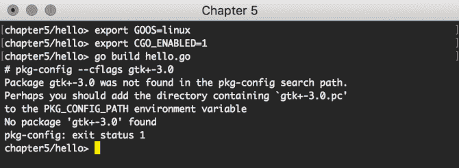

在 macOS 上为 Linux 构建失败

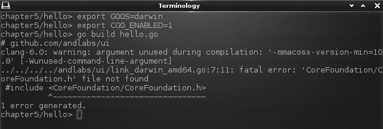

一台 Linux 计算机编译 macOS 失败

让我们来看看如何为各种配置启用交叉编译。

# 在 macOS 或 Windows 上为 Linux 构建

要能够为 Linux 进行交叉编译，主要要求是 GTK+库，它为 Linux 上的 andlabs UI 提供小部件。由于操作系统没有标准的包管理器，安装这个库会稍微困难一些，但如果你遵循这里描述的步骤，应该可以完成。这个过程还涉及到安装交叉编译工具链，就像本节中的其他示例一样。设置交叉编译的详细信息可以在附录中找到，即附录的*交叉编译设置*部分。主要步骤在此处概述，以供快速参考。

# macOS

要为 macOS 进行交叉编译，我们需要安装一个包管理器。最简单且最完整的是 Homebrew——你可以从[`brew.sh/`](https://brew.sh/)安装它。Linux 编译推荐的工具链是`musl-cross`，它位于`FiloSottile/musl-cross/musl-cross`包中。安装 Homebrew 后，在你的终端窗口中执行以下命令：

1.  `brew install gtk+3`

1.  `export HOMEBREW_BUILD_FROM_SOURCE=1`

1.  `brew install FiloSottile/musl-cross/musl-cross`

完成这些后，你应该可以通过设置`GOOS=linux`、`GOARCH=amd64`、`CGO_ENABLED=1`和`CC=x86_64-linux-musl-gcc`环境变量（`CXX=x86_64-linux-musl-g++`）来为 Linux 构建。然后你可以像平常一样构建，结果将是一个 Linux 可执行文件而不是 macOS：

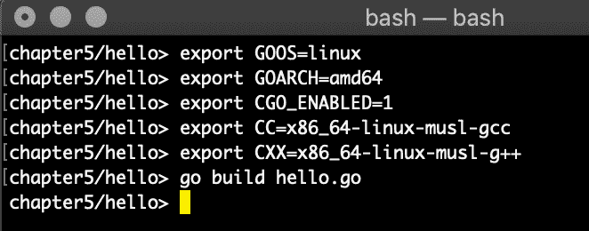

在 macOS 上构建 Linux 可执行文件

# Windows

使用 Windows 进行交叉编译稍微复杂一些，因为没有标准的包管理器。推荐的方法是安装 Cygwin（从 [cygwin.com/install.html](https://cygwin.com/install.html)）。然后安装 gtk3 和 linux-gcc（交叉编译器）软件包。从那里开始，按照前面为 macOS 概述的说明进行，但使用 `CC=linux-gcc` 和 `CXX=linux-g++`。

# 在 Linux 或 macOS 上为 Windows 构建

从其他平台构建 Windows 需要安装 mingw（类似于我们在 Windows 上安装的以支持 CGo）。设置交叉编译的详细信息可以在 附录 的 *使用 CGo 交叉编译 Windows* 部分，*交叉编译器设置* 中找到。

主要步骤在此处概述，以便快速参考：

使用您的包管理器（macOS 上的 Homebrew 和 Linux 上的各种），安装 mingw 软件包，该软件包通常命名为 `mingw-w64-clang` 或 `w64-mingw`。如果您找不到此软件包，可以直接使用 [`github.com/tpoechtrager/wclang`](https://github.com/tpoechtrager/wclang) 中的说明进行安装。

安装完成后，我们需要设置适当的构建标志——特别是 `CC=x86_64-w64-mingw32-clang`（用于 C 工具链）和 `CXX=x86_64-w64-mingw32-g++`（用于 C++ 需求）。假设您还设置了 `CGO_ENABLED=1` 和 `GOOS=windows`，则可以构建 Windows 可执行文件。查看生成的 `hello.exe` 文件，您可以看到它是一个 MS Windows 可执行文件：


使用 mingw（x86_64-w64-mingw32-clang），我们在 Linux 上构建了一个 Windows 原生 UI 应用程序

当从 macOS 构建时，可以使用 Homebrew 安装 mingw-w64 软件包。

# 在 Linux 或 Windows 上为 macOS 构建

为 macOS 进行交叉编译需要 macOS SDK 可用于链接。当从 Linux 或 Windows 计算机构建时，我们必须下载并安装 SDK，并更新我们的构建工具链以使用它。最简单的方法是使用 *osxcross* 工具。有关此设置的详细信息，请参阅 附录 中的 *使用 CGo 交叉编译 macOS* 部分，*交叉编译器设置*。此处概述了主要步骤，以便快速参考，使用 Linux 终端——一旦安装了 cygwin 或 mingw 终端，Windows 设置类似。

首先，我们需要下载 macOS SDK，它包含在 Xcode 中。从苹果下载网站 [`developer.apple.com/download/more/?name=Xcode%207.3`](https://developer.apple.com/download/more/?name=Xcode%207.3) 下载 `XCode.dmg`（推荐使用 7.3.1 版本用于 osxcross）。接下来，从 [github.com/tpoechtrager/osxcross](https://github.com/tpoechtrager/osxcross) 安装 osxcross 工具（完整的安装细节可在该网址或附录中找到）。完成安装后，将提取 macOS SDK 并创建用于构建这些已安装 API 的编译工具链。

现在我们准备构建。除了之前的环境变量外，我们添加了`CC=o32-clang`，之后我们的构建命令应该能够成功执行。在这里，你可以看到我们的 Linux 计算机成功创建了一个名为`hello`的 macOS 64 位 Mach-O 可执行文件：


使用 osxcross（o32-clang），我们在 Linux 上构建了一个 macOS 本机 UI 应用程序。

Windows 的过程类似，详细内容可以在附录的*使用 CGo 为 macOS 交叉编译*部分找到，*交叉编译器设置*。

# 一个更好的解决方案

这些步骤很复杂且可能很脆弱。由于这些挑战，创建了一个新的项目来帮助跨编译 andlabs UI 应用程序。你可以通过访问项目主页了解更多信息，并比较以下详细说明的过程：[`github.com/magJ/go-ui-crossbuild/`](https://github.com/magJ/go-ui-crossbuild/)。

# 摘要

在本章中，我们探讨了 andlabs UI 工具包，它提供了一个单一的 API，用于使用运行操作系统的本地小部件构建图形 Go 应用程序。我们逐步介绍了如何在 macOS、Windows 和 Linux 上设置构建 andlabs UI 应用程序，并展示了如何从单个 Go 源文件在各个系统上运行一个简单的*hello world*应用程序。然后我们详细研究了用于构建应用程序的小部件 API 和用于自定义渲染的绘图 API。

带着这些知识，我们回顾了第四章，*Walk - 构建图形 Windows 应用程序*中的 GoMail 应用程序，并再次使用 andlabs UI 库构建用户界面。尽管当前版本有一些限制，但我们能够模拟一些缺失的小部件，几乎完全重现了应用程序。当然，好处是我们可以从相同的源代码在 Windows、Linux 和 macOS 上运行 GUI。

测试使用具有可变用户界面的库构建的应用程序，并确保其尽可能保持一致性，可能取决于你的应用程序设计而变得困难。此外，由于 Go 提供的简单交叉编译方式在 andlabs UI 中由于它使用特定于操作系统的小部件 API 实现而变得相当困难。我们探讨了如何在这些限制下工作并构建适用于不同平台的应用程序。

在接下来的两个章节中，我们将调查通过 Go API 提供的现有跨平台小部件库。GTK+（我们在 andlabs UI 中看到它被用于 Linux）和 QT 都提供了一个标准的 widget 集合，这对现有桌面应用程序的用户来说会感觉熟悉。我们将在下一章中详细探讨 GTK+。
