# 第八章：Shiny - 实验性 Go GUI API

Shiny 是一个从头开始设计和纯 Go 编写的实验性 GUI 库。它被创建来探索为 Go 语言构建跨平台 GUI 时可能实现的内容。它不是 Go 语言的官方 GUI 工具包（尽管它是由谷歌的开发者创建的），但它为大多数受支持的 Go 平台上的图形应用程序提供了一个坚实的基础。

本章探讨了如何使用 Shiny 项目构建跨平台的图形应用程序，无需 C 库或预安装的依赖项。本章将涵盖以下主题：

+   Shiny 项目的原理及其小部件的设计

+   工具包是如何构建以支持多个平台而无需外部驱动程序或本地库的

+   构建一个可以轻松交叉编译到不同系统的基本图形应用程序

+   使用 Shiny 创建一个完整的应用程序

在本章结束时，你应该对这一实验性新 API 了如指掌。

# Shiny 的背景和愿景

Shiny 项目是为了理解如何创建一个符合 Go 语法的图形应用程序工具包而创建的。因此，它的 API 和方法应该与 Go 语言语义和标准库相匹配，其依赖项应该是纯 Go 库或现有系统例程，并且它应该提供一种现代的方法来开发应用程序 GUI。正如我们从本书的第二部分中看到的工具包绑定所知，这一切大多只有在从头开始时才有可能。它位于`golang.org/x/exp/shiny`存储库中——这是 Go 库的一个实验性扩展。

该项目最初是由 Go 开发者 Nigel Tao 发起的一项调查，他一直在从事`golang.org/x/mobile`（Shiny 所依赖的项目），因为他想看到桌面应用程序由新的 API 支持。经过大量开发后，建议将其添加为[golang.org](http://www.golang.org/)存储库中的实验性项目，并于 2015 年获得批准。预计在未来某个时刻，`golang.org/x/mobile`和`golang.org/x/exp/shiny`之间的共性将体现在一个独立的项目中，而移动和桌面特定的部分将保留在其各自的项目中。

近年来，该项目的开发速度有所放缓，但它仍然是构建图形应用程序的强大基础。目前尚不清楚该项目是否会复兴，或者将成为其他项目的基础。无论如何，它是一个优秀的低级图形 API，适用于 Go 语言，因此我们将深入研究其细节，并开始构建一个示例应用程序。

# 设计和受支持的平台

Shiny 项目被设计成确保小部件代码和底层渲染代码之间有良好的分离。它还基于这样的理解：图形驱动程序可能对多个平台都很有用，并且随着时间的推移可能会被更改或添加。

# 架构

Shiny API 被分为两层，底层处理图形缓冲区和渲染，高层则存放小部件和布局代码。每一层都有明确的职责，它们的分离有助于保持 API 的整洁。

# 底层

Shiny API 的底层负责为每个支持的平台创建渲染上下文。它还负责处理来自键盘和其他外围设备输入。图形展示的主要概念是 **缓冲区**、**纹理** 和 **窗口**：

+   **缓冲区**：缓冲区指的是内存中像素数据的一个数组。这可能是加载的图像、绘图画布或任何需要在应用程序中展示的其他图形数据。

+   **纹理**：纹理是对图形状态的快照的引用，它已准备好进行渲染。它将不可用于应用程序。纹理可以立即渲染（例如当前小部件状态）或存储并在将来多次渲染（例如图像）。

+   **窗口**：窗口是应用程序图形输出的位置。在应用了某些变换（由驱动程序确定）后，纹理将被渲染到窗口中。

在正常的应用程序流程中，图形用户界面的代码将更新小部件或布局状态——导致缓冲区内容更新。然后，该缓冲区将被上传到纹理中，以便由驱动程序进行绘制。纹理随后将被渲染到应用程序窗口，可能通过驱动程序或底层平台的图形实现中的变换。如果你熟悉 OpenGL 的工作方式，那么这些过程将看起来非常熟悉——这不是巧合，因为这种方法已被充分验证，Shiny 驱动程序之一就使用了 OpenGL API。对于大多数应用程序开发者来说，纹理的存在可能不可见或不重要，但在优化代码时考虑这个过程可能会有所帮助。

驱动程序还处理用户交互，将它们封装为`mouse.Event`和`key.Event`结构（在`x/mobile/event`中定义）。一个`widget.Widget`可以注册接收这些事件，使用过滤器来确定哪些与该对象相关，并将它们标记为已处理。或者，应用程序可以直接从`screen.Window`访问事件队列，调用`NextEvent()`将等待另一个事件发生。采用这种方法的程序应该意识到 Shiny 可以生成大量的事件（参见本章后面的*入门*部分中的*示例*）。当处理事件时，Shiny 项目包括一个强大的手势包，它允许你根据`gesture.Event`进行过滤，该事件描述了比底层数据更多的基于意图的信息。有用的事件类型包括`gesture.TypeDrag`、`gesture.TypeIsLongPress`和`gesture.TypeIsDoublePress`（事件类型可以通过手势事件上的`Event.Type`访问）。

# 高层

高层 API 专注于小部件和图形用户界面的整体布局和行为。在这个级别工作，开发者不会期望处理缓冲区和事件，而是处理按钮、文本区域和布局等高级概念。在这个层（在`widget`包内）定义的类型和函数旨在从高层次易于理解，并包括大多数开发者都熟悉的图形用户界面概念。

Shiny 小部件（在本章后面的*小部件和材料设计*部分中进一步详细说明）都是用纯 Go 编写的，并封装了任何小部件逻辑（如输入处理），以及渲染（通过实现`node.PaintBase()`或`node.Paint()`函数）。这使得用户界面代码可以完全与驱动程序分离，以便更好地测试，并促进所有支持的操作系统的统一性。

# 支持的平台

Shiny 项目目前支持 Windows、macOS、Linux、DragonFly BSD 和 OpenBSD。其他使用 X11 的 BSD 发行版或 Unix 系统（参见以下关于驱动程序的讨论）可能可以工作，但在此时尚未官方支持。

如果现有的驱动程序能够运行，支持操作系统的代码相对较轻量。例如，如果在一个尚未得到支持的平台上安装了 OpenGL，那么你可能能够添加操作系统特定的代码来连接它。在这种情况下，需要为特定平台创建一个 Go 文件来打开窗口，并处理 OpenGL 窗口的任何平台特定输入或设备设置。

在一个现有驱动程序当前无法工作的平台上，添加支持将是一项巨大的工作。除了窗口和用户交互代码外，还需要从头编写图形渲染器和表示层，或者提供一个 API 桥接到现有的一个。这种实现必须处理主 Shiny 代码使用的完整绘图原语和变换集（此类列表超出了本书的范围）。

# 当前包含的驱动程序

在撰写本文时，Shiny 有三个完整的驱动程序（**win**、**gl**和**x11**），并且这些驱动程序必须实现 Shiny 工具包的所有输入和输出功能。驱动程序输出部分需要定义一个合适的`screen.Texture`提供者，以便将缓冲区上传并准备好进行渲染，并处理渲染过程。在输入方面，驱动程序必须处理鼠标和键盘事件，并将它们转换为`golang.org/x/mobile`类型，然后由 Shiny 事件处理代码进行过滤。每个驱动程序的详细信息如下：

+   **gl**：最常用的驱动程序，基于跨平台的 OpenGL 构建，它利用这个标准 API 进行图形显示。许多操作系统提供此功能，但应注意的是，这可能在所有设备上都不受支持。

+   **win**：win 驱动程序专门为 Microsoft Windows 操作系统构建，无需 OpenGL API 即可工作。渲染由**图形设备接口**（**GDI**）提供。

+   **x11**：X11 驱动程序为 Linux 和 Unix 上的标准图形桌面平台提供支持。它直接与*XServer*通信，并使用**共享内存**（**SHM**）扩展来有效地通信图像数据。

在这些驱动程序之间，至少为本书前面描述的工具包支持的操作系统提供了至少一个渲染定义，可能还有更多。这些细节在日常使用 Shiny 编程时不应成为问题，但了解未来的可能扩展是有帮助的。

# 开始使用 Shiny

遵循 Shiny 的设计原则，不依赖于任何本地库或系统依赖项，因此使用 Shiny 没有先决条件。因此，我们可以直接开始安装库并看到它的实际应用。

# 设置

安装 Shiny 库就像安装来自`golang.org/x/exp/shiny`的 Go 文件及其`x/mobile`和`x/image`依赖项一样简单。由于这些都是顶级项目，您可能会看到有关没有 Go 文件的警告——您可以忽略这个警告，因为 API 将被安装：

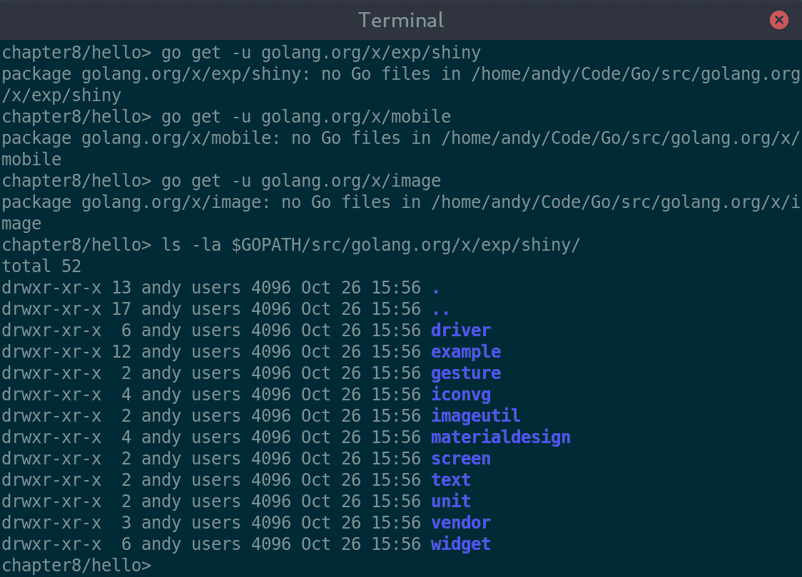

获取 x/exp/shiny 将下载包内容

不需要额外的库或系统配置。

# 示例

在我们开始构建应用程序之前，让我们加载一个示例项目来检查 Shiny 是否已安装并且工作正常。该项目提供了各种示例项目——我们将检查名为*basic*的项目。只需切换到`examples/basic`目录并运行`main.go`：

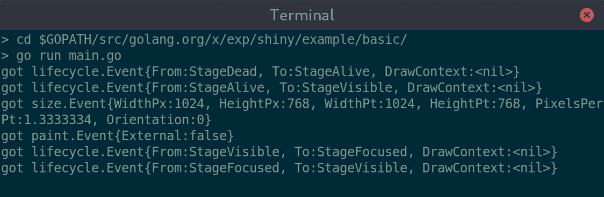

启动基本的 Shiny 示例

启动后，你应该看到以下窗口，以及（如前所述）由应用程序触发的事件输出。窗口的大小可能因你运行的操作系统而异，这是由于驱动程序的默认值：

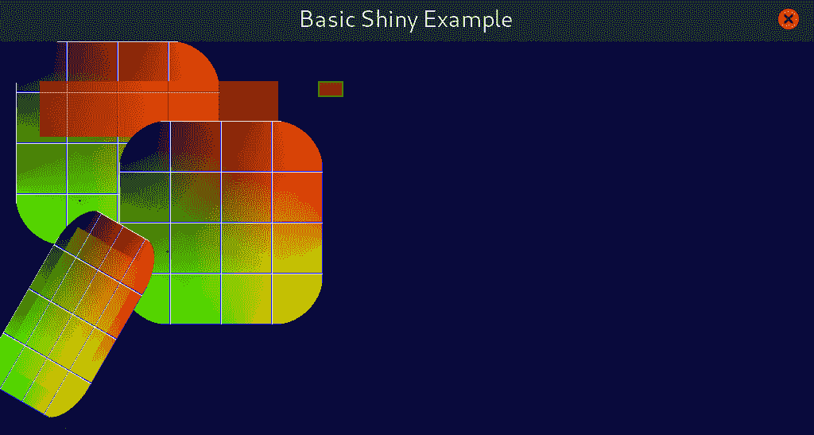

一个相当不寻常的示例应用

正如你所见，这个示例应用与其他我们探索的工具包不同。这代表了 Shiny 项目的主要焦点，即作为一个技术演示。

# 交叉编译

作为旨在完全用 Go 编写的项目，其目标之一是使其交叉编译到不同平台与为当前操作系统构建一样简单。在 Shiny 驱动程序是纯 Go（如当前**windows**和**x11**，由 Linux 和 BSD 使用）的操作系统的情况下，为特定操作系统编译就像使用`GOOS`参数一样简单，如第三章中所述，*Go 来拯救！*：

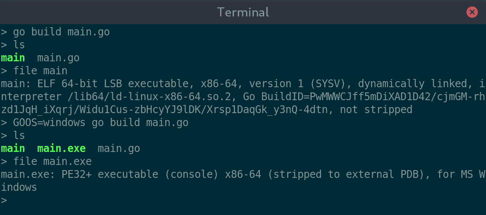

从 Linux 命令提示符编译 Linux 和 Windows 的二进制文件

提供硬件加速渲染（由 macOS 和 Linux 使用）的**gl**驱动程序依赖于一个当前没有 CGO 就无法获得的系统 API，因此交叉编译更具挑战性。通过工具包设计，如果 CGO 不可用，可以使用**x11**驱动程序为 Unix 目标平台，因此 Linux 或 BSD 仍然可以进行交叉编译。

注意，为 Linux 交叉编译 Shiny 应用程序将导致应用程序没有启用图形加速。这可以通过使用`CGO_ENABLED=1`并安装各种库来解决，但它很容易被遗忘，因此建议设置一个专门的 Linux 构建环境。

这意味着，从 macOS 出发，我们可以通过简单地设置适当的`GOOS`变量来交叉编译 Linux 和 Windows 的可执行文件，正如预期的那样：

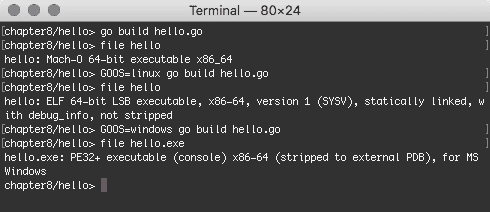

# 为 macOS 交叉编译

对于 Windows 和 Linux（以及一些 BSD 版本），所有交叉编译都不需要 CGO，因此我们只需要关注 macOS 作为一个特殊情况。为了成功为 macOS 交叉编译，我们必须在我们的构建中添加`CGO_ENABLED=1`，这将使构建过程寻找所需的系统库。显然，这些库通常不可用，因此我们必须设置我们的开发环境以提供所需的 API。

设置用于 macOS 交叉编译的 clang 二进制文件和所需 API 包的过程可能很复杂，但如果你已经完成了第五章，*andlabs UI - 跨平台原生 UIs*，那么这些设置已经完成。如果你直接跳到了这一章，那么你可能需要遵循附录，*跨平台编译设置，*在*使用 cgo 进行 macOS 交叉编译*部分中的步骤。一旦完成，你应该会有一个名为`o32-clang`的新编译器可用，它能够链接到 macOS Foundation API。

为了构建应用程序，我们现在设置`GOOS`和`CGO_ENABLED`标志，就像之前一样，但还通过额外的`CC`环境变量指定要使用的编译器，将其设置为`o32-clang`。完成此配置后，我们可以从 Linux 终端构建 macOS Shiny 应用程序：

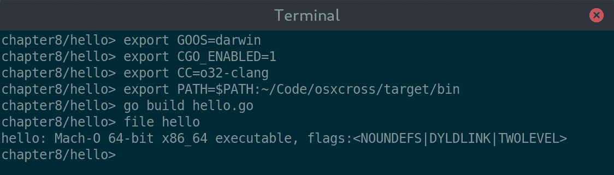

从 Linux 终端构建 macOS 应用程序

以这种方式构建的应用程序将具有完整的 OpenGL 加速，就像它们是在 macOS 计算机上直接构建的一样。

现在我们已经看到了使用 Shiny 构建的所有细节，让我们来探索这些应用程序是如何设计的。

# 小部件和材料设计

在我们开始一个简单的应用程序之前，我们需要更多地了解 Shiny 小部件及其视觉设计对开发的影响。我们之前探讨的其他工具箱在使用 API 时不需要这种理解，但 Shiny 中高级 API 的实验性状态意味着即使是“hello world”应用程序也需要对工具箱的工作方式有一定的了解。

在我们深入了解 Shiny 提供的小部件及其使用方法之前，让我们先看看 Shiny 项目的整体设计和图标设计。这种设计方法与我们在本书中之前探讨的工具箱有所不同，但对于任何 Android 应用开发者或 Google 产品套件的用户来说，应该都很熟悉。

# 设计

如果你对“材料设计”这个概念还不熟悉，可以这样定义：

...一个灵活的指南、组件和工具系统，支持用户界面设计的最佳实践"

-[material.io](https://material.io/)

这些设计原则对于拥有 Android 智能手机或平板电脑的人来说都很熟悉，并且与微软为最近发布的支持平板电脑和触摸屏用户输入的 Windows 操作系统所采用的用户界面设计有些相似。这种方法旨在帮助开发者快速创建美观的应用程序，并简化开发者和设计师之间的沟通。这种*设计语言*也有助于在应用程序试图通过自己的品牌设计脱颖而出的世界中，促进一致的用户体验。

利用材料设计原则的应用程序可能不会与所有其他应用程序完全相同，但将具有足够的相似性，用户应该不会难以理解其工作方式。颜色、布局和导航可能因界面而异，只要它们遵循设定的指南。材料设计包括一些标准调色板和创建自定义调色板的建议，以满足您的需求。布局和导航小部件也有标准实现，但可以根据上下文进行扩展和使用。这些标准小部件被称为*材料组件*，它们是为 Android、iOS、Flutter 和网页创建的——Shiny 是将它们带到桌面的一种潜在方法：

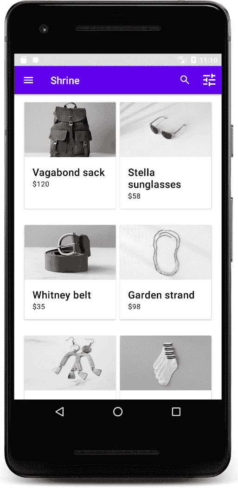

展示材料设计的 Android 应用程序。图片版权：Google。

在线有许多工具可以帮助您了解和采用材料设计原则。它们可以在材料设计网站上找到，网址为[material.io](https://material.io/)。让我们探索 Shiny API 核心的一些细节。

# 图标

材料设计项目创建了一套标准的图标，这些图标可以免费在任何应用程序中使用。将这些清晰、简洁的图标集成到用户界面中，可以添加简单易懂的提示，与其它应用程序保持一致，并可以减少最终用户界面中过多的文本。Shiny 将最常用的图标打包在`materialdesign/icons`包中，并且可以通过 API 通过名称引用。要查看名称和图标的列表，可以运行 Shiny 的*IconGallery*示例（如图中所示）：

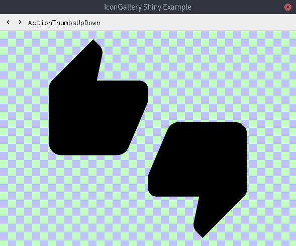

Shiny 包括矢量图形的材料图标集

图标可以通过在`node.PaintBase()`方法中创建一个`iconvg.Rasterizer`实例来绘制，并为`node.PaintBaseContext`调用`iconvg.Decode()`来解码图标引用（这些图标以紧凑的 IconVG 格式存储）。本章后面（或 Shiny 示例代码中）可以找到此代码的示例。

# 主题

材料设计中的一个核心概念是调色板——虽然它不强制规定应用程序可以使用的颜色，但它对颜色选择和搭配有非常明确的规则。鼓励设计师从标准调色板（用于大多数用户界面元素）中选择一个主色（用于突出显示和强调），以及一个辅助色（用于辅助色和强调色），以相互补充。对于每种颜色，都有标准的浅色和深色变体，这可以为应用程序界面增加深度。您可以通过[material.io/tools/color](https://material.io/tools/color)上的在线颜色工具来探索这些。

Shiny 使用的调色板遵循这种方法；可用的颜色有：

+   `theme.Foreground`：主题的标准前景色——用于文本和图标

+   `theme.Background`：容器标准背景颜色

+   `theme.Neutral`：较小区域的后景色，应与背景区分开来

+   `theme.Light`：中性颜色的较浅版本

+   `theme.Dark`：中性颜色的较深版本

+   `theme.Accent`：次要调色板中的主颜色，用于突出显示关键元素

在 Shiny API 中，颜色是通过`theme.Color`类型而不是 golang 的`color.Color`类型传递的。这确保了使用的颜色来自主题调色板。从主题颜色类型中，您可以调用`Color()`函数来获取标准颜色类型或调用`Uniform()`函数来获取`image.Uniform`，这在`Paint()`函数中用于绘制填充矩形。

应用程序可以选择使用内置主题（`theme.Default`）或提供自己的主题。任何实现了`theme.Theme`类型的类型都可以用于 Shiny GUI 的渲染。

# 小部件

作为更专注于底层跨平台图形渲染能力的项目，Shiny 工具包不附带许多标准小部件。已经投入了大量工作来设置构建块，以便应用程序可以提供自己的小部件，但如果您想使用内置类型，`widget`包提供的列表如下：

+   **流：**这是一个容器，其子小部件沿水平或垂直轴（在`Flow.Axis`或`NewFlow()`中设置）排列。

+   **弹性：**实际上，在`flex`子包中，这是一个根据 CSS flexbox 算法排列其子小部件的容器。与`widget.Flow`一样，布局参数是在`flex.Flex`容器上设置的。

+   **图像：**此小部件在屏幕上渲染 golang 的`image.Image`。其尺寸是单独指定给图像的。

+   **标签：**这是一个简单的显示带有主题颜色（例如，`theme.Foreground`）的文本行的工具。

+   **填充器：**一个包含子小部件并带有指定空间围绕水平或垂直维度（或两者）显示的不可见小部件。

+   **工作表：**工作表提供了所有其他小部件将绘制其上的缓冲区。任何不是工作表子小部件的小部件可能不会被渲染。如果内容应独立移动，则需要多个工作表，例如滚动视图。

+   **尺寸调整器：**尺寸调整器是一个包含子小部件但覆盖其尺寸的不可见小部件。这可以用来指定与现有小部件默认尺寸不同的自然尺寸。

+   **空间：**一个占据可用空间的不可见小部件。放置在两个小部件之间，它们将变为左对齐和右对齐，或者通过在`widget.Space`小部件的任一侧放置小部件，它将变为居中对齐。

+   **文本：**一个多行文本小部件，用于显示比`widget.Label`更复杂的文本。

+   **均匀：**这是一个简单的绘制来自主题调色板（例如，`theme.Background`）的实色矩形的工具。

此外，还有一个名为`glwidget.GL`的高级小部件，它将**嵌入式系统的 OpenGL**（**GLES**）`framebuffer`渲染到 Shiny 应用程序中。这对于传统应用程序来说并不常见，但它是一个很好的附加功能，以支持这一功能。

尽管前面的列表很长，但你可能会注意到它并没有提供我们在其他章节中使用过的所有小部件。因此，我们将构建一个不同的示例应用程序。这次，一个更适合工具包功能的应用程序。在此之前，让我们回到*开始*并创建一个 hello world 应用程序。

# 开始继续

现在我们已经探索了 Shiny 的设计方式和当前的限制，我们可以实现我们的第一个图形应用程序并看到它运行。

# 代码

让我们从编写一个简单的*hello world*窗口开始，就像前面的章节一样。由于当前工具包的低级性质，这段代码比前面的例子要复杂一些。除了定义窗口、标签和按钮外，我们还需要设置背景层并测量包含窗口的最小尺寸：

```go
package main

import (
   "golang.org/x/exp/shiny/driver"
   "golang.org/x/exp/shiny/screen"
   "golang.org/x/exp/shiny/widget"
   "golang.org/x/exp/shiny/widget/theme"

   "log"
)

func main() {
   driver.Main(func(s screen.Screen) {
      label := widget.NewLabel("Hello World!")
      button := newButton("Quit",
         func() {
            log.Println("To quit close this window")
         })

      w := widget.NewFlow(widget.AxisVertical, label, button)
      sheet := widget.NewSheet(widget.NewUniform(theme.Neutral, w))

      w.Measure(theme.Default, 0, 0)
      if err := widget.RunWindow(s, sheet, &widget.RunWindowOptions{
         NewWindowOptions: screen.NewWindowOptions{
            Title: "Hello",
            Width: w.MeasuredSize.X,
            Height: w.MeasuredSize.Y,
         },
      }); err != nil {
         log.Fatal(err)
      }
   })
}
```

在前面的代码中，你可以看到流布局（`widget.NewFlow()`）、背景层（`widget.NewSheet()`）和测量初始化（`w.Measure()`）。在 Shiny 中，`widget.Sheet`是任何小部件下面的必需项，这样它们才能正确绘制。在简单的应用程序中，一个单独的层应该足够，但在更复杂的用户界面中，其中项目可以独立移动（即，滚动），可能需要额外的层。

# 支持代码

如你所注意到的，前面的代码有两个问题，都与`Quit`按钮有关。首先，被调用的`func()`实际上并没有退出应用程序。这是 Shiny 生命周期代码的一个当前限制。可以通过自定义生命周期来解决这个问题，但由于需要大量代码，这并不推荐。其次，你可能注意到`newButton()`是一个局部函数，而不是`widget`包的一部分。工具包列表中目前缺少的一个标准按钮，因此，我们必须自己定义一个。这可以通过添加以下描述的代码来完成：

首先，我们定义自定义节点；它必须首先继承自`node.LeafEmbed`。我们添加了包含文本标签的字段和当它被点击时应该调用的`onClick`函数。我们还应该添加一个方便的方法来构建按钮。这需要设置`node.Embed.Wrapper`字段，因为这个字段不应该为`nil`：

```go
type button struct {
   node.LeafEmbed

   label   string
   onClick func()
}

func NewButton(label string, onClick func()) *button {
   b := &button {label: label, onClick: onClick}
   b.Wrapper = b

   return b
}
```

为了定义按钮占据的合适区域，我们需要实现`Measure()`函数。这将更新一个用于界面布局的缓存大小（`node.Embed.MeasuredSize`）：

```go
const buttonPad = 4

func (b *button) Measure(t *theme.Theme, widthHint, heightHint int) {
   face := t.AcquireFontFace(theme.FontFaceOptions{})
   defer t.ReleaseFontFace(theme.FontFaceOptions{}, face)

   b.MeasuredSize.X = font.MeasureString(face, b.label).Ceil() + 2*buttonPad
   b.MeasuredSize.Y = face.Metrics().Ascent.Ceil() + face.Metrics().Descent.Ceil() + 2*buttonPad
}
```

要在屏幕上显示内容（这实际上是将画到前面提到的底层 `widget.Sheet` 上），我们添加一个 `PaintBase()` 函数。对于我们的按钮，我们将绘制一个 `theme.Foreground` 颜色的矩形作为基础，并使用 `theme.Background` 颜色作为文本的颜色（这样我们的按钮就能从其他文本中脱颖而出）。请注意，在实际绘制之前，我们从对象中移除 `node.MarkNeedsPaintBase` 标记，这样它就不会在下一个界面重绘时被重新绘制：

```go
func (b *button) PaintBase(ctx *node.PaintBaseContext, origin image.Point) error {
   b.Marks.UnmarkNeedsPaintBase()
   face := ctx.Theme.AcquireFontFace(theme.FontFaceOptions{})
   defer ctx.Theme.ReleaseFontFace(theme.FontFaceOptions{}, face)

   draw.Draw(ctx.Dst, b.Rect.Add(origin).Inset(buttonPad), theme.Foreground.Uniform(ctx.Theme), image.Point{}, draw.Src)
   d := font.Drawer{
      Dst: ctx.Dst,
      Src: theme.Background.Uniform(ctx.Theme),
      Face: face,
      Dot: fixed.Point26_6{X: fixed.I(b.Rect.Min.X + buttonPad), Y: fixed.I(b.Rect.Min.Y + face.Metrics().Ascent.Ceil() + buttonPad)},
   }
   d.DrawString(b.label)

   return nil
}
```

最后，按钮需要一个点击处理程序。我们可以实现 `OnInputEvent()` 函数，以便 Shiny 可以向按钮发送事件。在这里，我们检查事件是否为 `gesture.Event`，如果是，则检查其类型是否为 `gesture.TypeTap`。如果满足这些条件，并且我们已注册 `onClick` 处理程序，则调用 `b.onClick()`：

```go
func (b *button) OnInputEvent(e interface{}, origin image.Point) node.EventHandled {
   if ev, ok := e.(gesture.Event); ok {
      if ev.Type == gesture.TypeTap && b.onClick != nil {
         b.onClick()
      }

      return node.Handled
   }

   return node.NotHandled
}
```

这就完成了使用 Shiny 实现一个“Hello World”图形应用程序所需的代码（完整代码在本书的代码库中）。现在，让我们构建并运行该应用程序。

# 构建 & 运行

由于 Shiny 没有原生依赖项，构建我们的 Shiny “Hello World” 应用程序非常简单——我们可以直接构建或运行 `hello.go` 文件。此外，由于许多平台驱动程序没有使用 CGo 编写，我们可以轻松地为这些操作系统进行交叉编译。以下屏幕截图显示了为 Linux 构建然后为 Windows 构建而没有额外设置的情况：

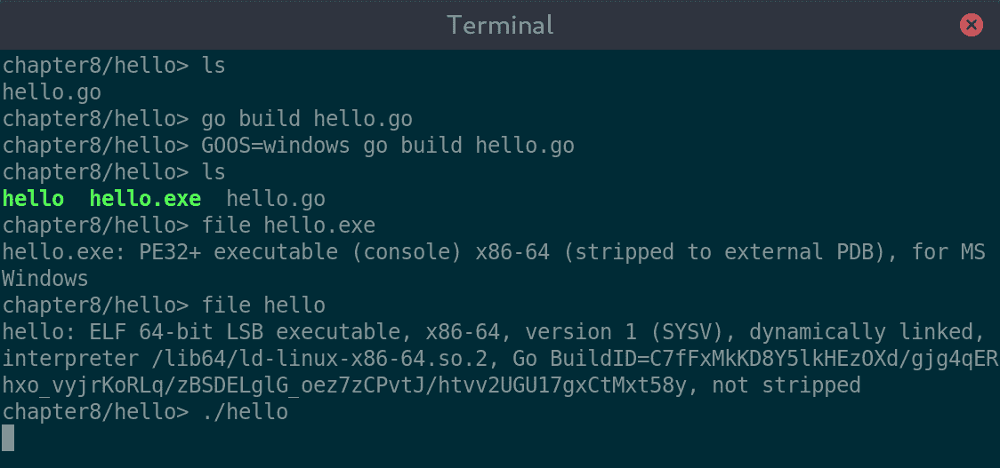

构建我们的 hello 应用程序并在没有 CGo 的情况下运行它很容易

注意，为 macOS 构建将需要一些额外的设置，因为它的驱动程序使用 CGo（如 *入门* 中先前所述的 *交叉编译* 部分中描述的）。

无论你如何构建或运行应用程序，你应该看到一个小的窗口，类似于以下内容：

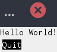

使用 Shiny 的“Hello World”

我们可以完善我们应用程序的视觉效果，但我们将继续进行一个更大的应用程序，以展示 Shiny 的功能。

# 构建用户界面

为了探索 Shiny 工具包的功能，我们将构建另一个完整的图形应用程序。由于 Shiny 的发展主要集中在图形 API 的底层，因此像 GoMail 这样的应用程序将涉及创建许多自定义小部件。相反，我们将查看一个更具图形导向的应用程序——图像查看器。

# 设计

为了了解图像查看器应该如何看起来，我们将制作一个粗略的设计，以便我们遵循。在线工具 Balsamiq ([balsamiq.com](https://balsamiq.com/)) 是快速创建适合此目的的线框的好方法。看看下面的导出。它包括顶部的导航栏、左侧的目录列表和右侧的全尺寸图像视图：

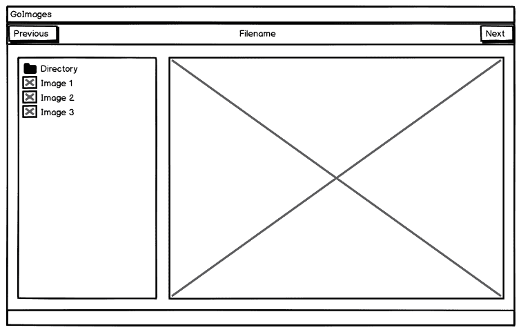

使用 Balsamiq 工具制作的 GoImages 应用程序原型

显然，这张图片的细节水平远低于我们在第四章，“走——构建图形窗口应用”（回到第二部分，“使用现有小部件的工具包”）中使用的图形设计工具，但这是故意的。本书第三部分，“现代图形工具包”中的每个工具包都有一个非常不同的外观，由其主题定义和通过使用粗略的设计来设置，我们可以为每个工具包构建一个使用最佳实践的实现。

# 布局

要开始，我们将实现布局。为我们的应用设置布局的最简单方法是使用水平和垂直流布局。在创建布局之前，我们应该定义那些将被包含的小部件。目前这些由`makeBar()`和`makeList()`中创建的占位符表示——每个都简单地创建一个标签来显示其目的。我们还希望确保项目根据我们的设计进行填充。为了使用 Shiny 实现这一点，我们使用`widget.NewPadder()`和一个定义的单位`padSize`。我们还定义了一个`spaceSize`，稍后用于中央填充：

```go
package main

import (
  "golang.org/x/exp/shiny/driver"
  "golang.org/x/exp/shiny/screen"
  "golang.org/x/exp/shiny/unit"
  "golang.org/x/exp/shiny/widget"
  "golang.org/x/exp/shiny/widget/node"
  "golang.org/x/exp/shiny/widget/theme"

  "image"
  "log"
  "os"

  _ "image/jpeg"
)

var padSize = unit.DIPs(20)
var spaceSize = unit.DIPs(10)

func makeBar() node.Node {
   bar := widget.NewUniform(theme.Neutral,
      widget.NewPadder(widget.AxisBoth, padSize,
         widget.NewLabel("Navigation")))

   return widget.WithLayoutData(bar,
      widget.FlowLayoutData{ExpandAlong: true, ExpandAcross: true})
}

func makeList() node.Node {
   return widget.NewUniform(theme.Background, widget.NewLabel("File list"))
}
```

要在我们的布局中显示图片，我们可以使用`widget.Image`，但首先我们需要从文件系统加载一张图片——一个辅助函数`loadImage()`被定义来处理这个应用。当加载图片时，别忘了导入适当的解码器（在这个例子中，`image/jpeg`）：

```go
func loadImage(name string) image.Image {
   reader, err := os.Open(name)
   if err != nil {
      log.Fatal(err)
   }
   defer reader.Close()

   image, _, err := image.Decode(reader)
   if err != nil {
      log.Fatal(err)
   }

   return image
}
```

准备就绪后，我们就可以实现布局了。主方法构建了小部件树并创建`widget.Sheet`来管理它们的渲染。这被传递给`widget.RunWindow()`以显示内容和运行应用。主要的布局元素是`body`（水平流）和`container`（垂直流，包含导航和主体）。注意在文件列表和图片查看器之间传递了一个`nil`子小部件给`widget.NewPadder()`，以近似小部件间距。你还可以看到`sheet`的子小部件实际上是一个使用`widget.NewUniform()`创建的`theme.Background`着色矩形——这有助于确保如果有小部件未绘制其部分区域，我们有一个一致的后台颜色。然后容器通过成为均匀的子小部件来填充空间：

```go
func main() {
   driver.Main(func(s screen.Screen) {
      image := loadImage("shiny-hall.jpg")

      body := widget.NewFlow(widget.AxisHorizontal, makeList(),
         widget.NewPadder(widget.AxisHorizontal, spaceSize, nil),
         widget.NewImage(image, image.Bounds()))
      container := widget.NewFlow(widget.AxisVertical, makeBar(),
                      widget.NewPadder(widget.AxisBoth, padSize, body))
      sheet := widget.NewSheet(widget.NewUniform(theme.Background, container))

      container.Measure(theme.Default, 0, 0)
      if err := widget.RunWindow(s, sheet, &widget.RunWindowOptions{
         NewWindowOptions: screen.NewWindowOptions{
            Title:  "GoImages",
            Width:  container.MeasuredSize.X,
            Height: container.MeasuredSize.Y,
         },
      }); err != nil {
         log.Fatal(err)
      }
   })
}
```

运行前面的代码应该会显示一个窗口，其中包含以下内容，这与我们之前设计的布局大致匹配。随着我们进入本章，我们将向每个区域添加内容并完善界面的每个部分：

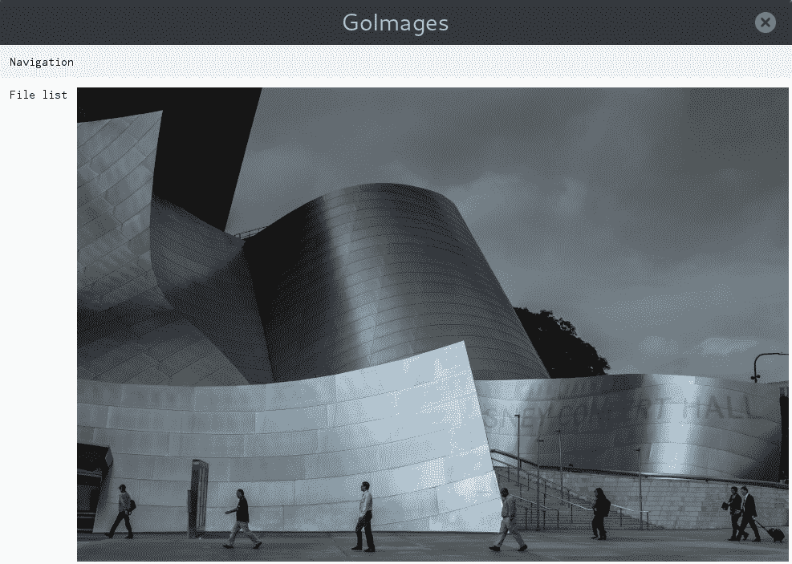

带有导航栏和文件列表占位符的 GoImages 布局

# 导航

在我们的设计中创建导航栏时，水平流布局是完成这项工作的正确工具。我们可以使用`widget.Spacer`在按钮和标签之间创建间隔，并确保文件名在可用空间中居中。我们添加了一个辅助方法`expandSpace()`，它将创建一个新的间隔，该间隔将沿着流布局轴扩展。我们还定义了`previousImage()`和`nextImage()`函数，这些函数将在按钮被按下时执行：

```go
func previousImage() {}

func nextImage() {}

func expandSpace() node.Node {
   return widget.WithLayoutData(widget.NewSpace(),
      widget.FlowLayoutData{ExpandAlong: true, ExpandAcross: true, AlongWeight:1})
}
```

定义了这些函数后，我们可以布局导航栏。我们定义了`prev`、`next`和`name`项，并将它们添加到一个包含`expandSpace()`元素的`widget.AxisHoriontal`流容器中，以分隔项目。为了创建按钮，我们使用本章前面（由于 Shiny 小部件 API 没有定义标准按钮）提到的相同的`newButton()`函数。我们使用`theme.Neutral`作为此部分的背景容器，并将整个栏设置为沿水平轴扩展：

```go
func makeBar() node.Node {
   prev := newButton("Previous", previousImage)
   next := newButton("Next", nextImage)
   name := widget.NewLabel("Filename")

   flow := widget.NewFlow(widget.AxisHorizontal, prev, expandSpace(),
      widget.NewPadder(widget.AxisBoth, padSize, name), expandSpace(), next)

   bar := widget.NewUniform(theme.Neutral, flow)

   return widget.WithLayoutData(bar,
      widget.FlowLayoutData{ExpandAlong: true, ExpandAcross: true})
}
```

上述代码应更新导航栏，如下所示。因为我们自己定义了按钮，所以如果需要，可以使用边框样式进行自定义（完整的代码列表可在本书的代码仓库中找到）：

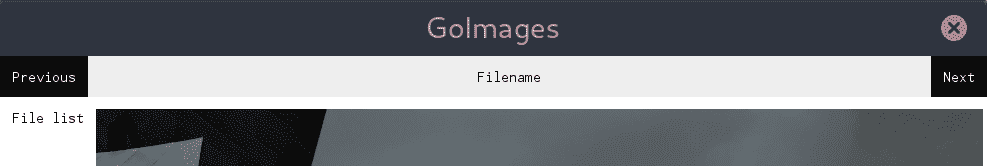

更新后的导航栏，按钮左对齐和右对齐

# 文件列表

由于 Shiny 没有定义列表小部件，我们将使用另一个垂直流容器来构建一个。列表中的每个项目都将是一个自定义单元格小部件，它将在左侧显示一个图标，并将文件名文本左对齐在剩余的空间中。首先，我们将更新我们的`makeList()`函数以添加一些虚拟数据。每个项目都是一个新单元格，使用`makeCell()`（稍后定义）创建。项目使用`widget.NewFlow()`在垂直轴上作为列表布局：

```go
func makeList(dir string) node.Node {
   parent := makeCell(dir, nil)
   cell1 := makeCell("Filename 1", loadImage("shiny-hall.jpg"))
   cell2 := makeCell("Filename 2", loadImage("shiny-hall.jpg"))
   cell3 := makeCell("Filename 3", loadImage("shiny-hall.jpg"))
   return widget.NewFlow(widget.AxisVertical, parent, cell1, cell2, cell3)
}
```

如您所见，列表中的第一项是我们目录的名称，它需要一个不同的图标。我们可以使用`iconvg`包从 Shiny 图标库中加载一个标准图标，具体来说，使用`iconvg.Rasterizer`和`iconvg.Decode()`。使用以下辅助函数，我们可以将`icons.FileFolder`图标加载到图像中，以便可以使用与从文件系统加载的图像相同的函数进行绘制：

```go
func loadDirIcon() image.Image {
   var raster iconvg.Rasterizer
   bounds := image.Rect(0, 0, iconSize, iconSize)
   icon := image.NewRGBA(bounds)
   raster.SetDstImage(icon, bounds, draw.Over)

   iconvg.Decode(&raster, icons.FileFolder, nil)
   return icon
}
```

我们布局代码的最后部分是`makeCell()`函数。在这种情况下，它是一个简单的包装，用于创建`cell`小部件。当此函数传递一个`nil`图标时，它将使用上面的辅助程序设置目录图标。当传递一个图标时，它创建一个`onClick`函数，该函数将在主视图中加载图像：

```go
func makeCell(name string, icon image.Image) node.Node {
   var onClick func()
   if icon == nil {
      icon = loadDirIcon()
   } else {
      onClick = func() {chooseImage(icon)}
   }

   return newCell(icon, name, onClick)
}
```

我们单元格小部件的细节与之前创建的按钮非常相似，因此大部分代码被省略了。下一个摘录显示了它的`PaintBase()`函数，该函数将图标和文本绘制到屏幕上。它计算图像的比率，以便可以在单元格中正确绘制。然后，文本就像按钮代码一样绘制，但与绘制的图像之间有一个空格。

为了使这起作用，还需要一个简单的`scaleImage()`函数，它使用`draw.ApproxBiLinear`将图形缩放到适合的尺寸，以获得合理的性能：

```go

func (c *cell) PaintBase(ctx *node.PaintBaseContext, origin image.Point) error {
   c.Marks.UnmarkNeedsPaintBase()
   face := ctx.Theme.AcquireFontFace(theme.FontFaceOptions{})
   defer ctx.Theme.ReleaseFontFace(theme.FontFaceOptions{}, face)

   ratio := float32(c.icon.Bounds().Max.Y)/float32(c.icon.Bounds().Max.X)
   if c.icon.Bounds().Max.Y > c.icon.Bounds().Max.X {
      ratio = float32(c.icon.Bounds().Max.X)/float32(c.icon.Bounds().Max.Y)
   }
   scaled := scaleImage(c.icon, iconSize, int(float32(iconSize)*ratio))

   draw.Draw(ctx.Dst, c.Rect.Add(origin), scaled, image.Point{}, draw.Over)
   d := font.Drawer{
      Dst:  ctx.Dst,
      Src:  theme.Foreground.Uniform(ctx.Theme),
      Face: face,
      Dot:  fixed.Point26_6{X: fixed.I(c.Rect.Min.X + origin.X + iconSize + space),
         Y: fixed.I(c.Rect.Min.Y + origin.Y + face.Metrics().Ascent.Ceil())},
   }
   d.DrawString(c.label)

   return nil
}

func scaleImage(src image.Image, width, height int) image.Image {
   ret := image.NewRGBA(image.Rect(0, 0, width, height))

   draw.ApproxBiLinear.Scale(ret, ret.Bounds(), src, src.Bounds(), draw.Src, nil)

   return ret
}
```

所有这些代码组合在一起，创建了一个带有图像预览的文件列表，如下面的截图所示：

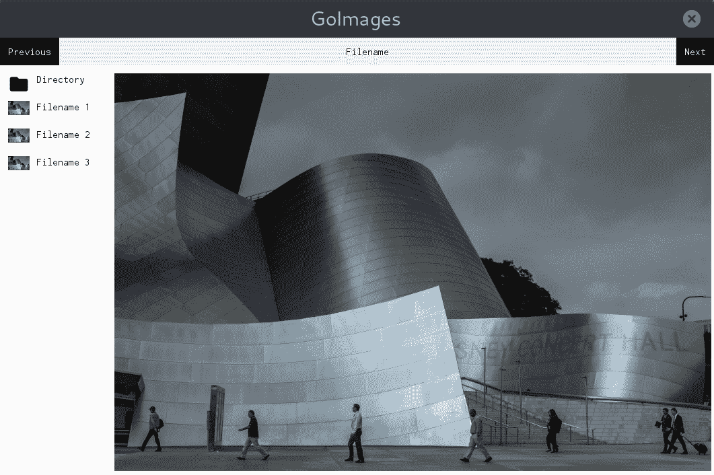

左侧完成的文件列表，包含占位符内容

# 图像视图

`widget.Image`类型以加载时的相同分辨率在缓冲区中绘制图像（源图像中的一个像素与屏幕上的一个像素匹配）。对于图像查看器，我们需要将其缩放以适应可用空间。为此，我们创建了一个名为`scaledImage`的新自定义小部件。代码与 Shiny 图像小部件非常相似，但`PaintBase()`函数更复杂。

此函数计算`imgWidth`和`imgHeight`以适应当前小部件的边界并保持源图像的宽高比。然后使用之前定义的`scaleImage()`辅助函数缩放图像，以便以正确的分辨率绘制。最后，计算`offset`以确保图像在可用空间中居中：

```go
func (w *scaledImage) PaintBase(ctx *node.PaintBaseContext, origin image.Point) error {
   w.Marks.UnmarkNeedsPaintBase()
   if w.Src == nil {
      return nil
   }

   wRect := w.Rect.Add(origin)
   ratio := float32(w.Src.Bounds().Max.X)/float32(w.Src.Bounds().Max.Y)
   width := wRect.Max.X - wRect.Min.X
   height := wRect.Max.Y - wRect.Min.Y

   imgWidth := int(math.Min(float64(width), float64(w.Src.Bounds().Max.X)))
   imgHeight := int(float32(imgWidth)/ratio)

   if imgHeight > height {
      imgHeight = int(math.Min(float64(height), float64(w.Src.Bounds().Max.Y)))
      imgWidth = int(float32(imgHeight)*ratio)
   }

   scaled := scaleImage(w.Src, imgWidth, imgHeight)
   offset := image.Point{(imgWidth-width)/2, (imgHeight-height)/2}

   draw.Draw(ctx.Dst, wRect, scaled, offset, draw.Over)
   return nil
}
```

为了避免前述计算留下的空白空间，让我们添加一个在许多其他图像应用程序中常见的棋盘图案。为了实现这一点，我们创建了一个名为`checkerImage`的自定义图像类型，它简单地根据规则的棋盘图案从`At()`函数返回像素。由于图像是有限的，我们需要添加一个`resize()`函数，以便图像可以扩展以填充空间：

```go
var checkers = &checkerImage{}

type checkerImage struct {
   bounds image.Rectangle
}

func (c *checkerImage) resize(width, height int) {
   c.bounds = image.Rectangle{image.Pt(0, 0), image.Pt(width, height)}
}

func (c *checkerImage) ColorModel() color.Model {
   return color.RGBAModel
}

func (c *checkerImage) Bounds() image.Rectangle {
   return c.bounds
}

func (c *checkerImage) At(x, y int) color.Color {
   xr := x/10
   yr := y/10

   if xr%2 == yr%2 {
      return color.RGBA{0xc0, 0xc0, 0xc0, 0xff}
   } else {
      return color.RGBA{0x99, 0x99, 0x99, 0xff}
   }
}
```

要包含棋盘图案，我们只需更新`scaledImage`的`PaintBase()`函数的末尾。在绘制图像本身之前，我们将棋盘图案设置为扩展到正确的尺寸，并将其绘制到背景上。棋盘是用`draw.Src`模式绘制的，然后使用`draw.Over`模式在顶部绘制图像：

```go
func (w *scaledImage) PaintBase(ctx *node.PaintBaseContext, origin image.Point) error {

   ...

   checkers.resize(width, height)
   draw.Draw(ctx.Dst, wRect, checkers, checkers.Bounds().Min, draw.Src)
   draw.Draw(ctx.Dst, wRect, scaled, offset, draw.Over)
   return nil
}
```

在所有这些代码到位后，我们有一个更新的应用程序，它正确地填充了我们设计的布局，并缩放和定位了占位符图像以适应可用空间：

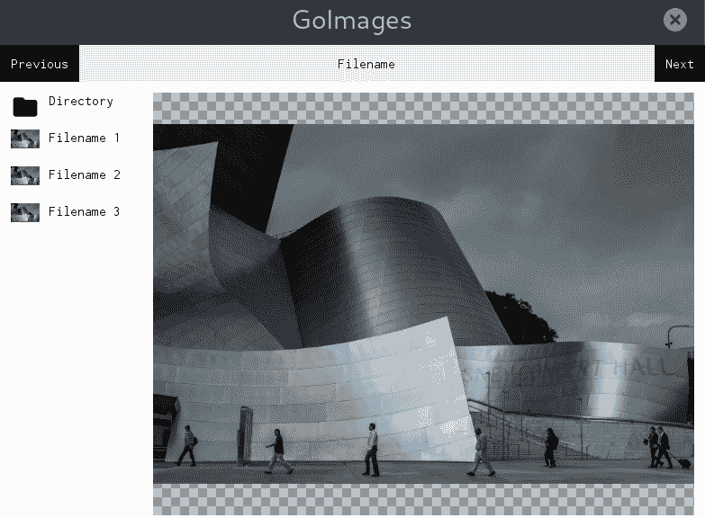

界面更新以显示以正确宽高比居中的图像

这就是我们的图形代码的大部分内容。接下来，我们将添加必要的代码来从本地文件系统加载实际内容。

# 与 GUI 通信

现在我们已经有一个运行的用户界面，我们需要加载一些实际数据并显示它。我们通过获取请求目录的图像文件列表并更新用户界面以列出这些文件而不是占位符信息来开始这个任务。记住，在这个阶段，添加额外的图像导入，以便我们可以解码我们将在新的`getImageList()`函数中过滤的所有图像：

```go
import (
   _ "image/jpeg"
   _ "image/png"
   _ "image/gif"
)

var names []string

func getImageList(dir string) []string {
   files, _ := ioutil.ReadDir(dir)

   for _, file := range files {
      if file.IsDir() {
         continue
      }

      ext := strings.ToLower(filepath.Ext(file.Name()))
      if ext == ".jpg" || ext == ".jpeg" || ext == ".png" || ext == ".gif" {
         names = append(names, file.Name())
      }
   }

   return names
}
```

列表显示了一个相当简单的算法，用于检查目录中的每个项目，如果文件名看起来像我们支持的图像文件，则将其添加到 `names` 列表中。简单的文件扩展名检查应该足以满足我们的目的。我们将这些文件名添加到全局列表中，以便在用户界面中稍后使用。

一旦我们有一个支持文件的列表，我们就可以更新现有的 `makeList()` 函数。新版本遍历 `files` 列表并为每个项目添加一个新单元格。`makeCell()` 函数不需要进行任何额外的工作即可使用新内容，但我们确实传递了数组索引，以便在按钮处理程序中稍后使用。我们还保存了在选中时用于显示的内存中加载的 `images`：

```go
var images []image.Image

func makeList(dir string, files []string) node.Node {
   parent := makeCell(-1, filepath.Base(dir), nil)
   children := []node.Node{parent}

   for idx, name := range files {
      img := loadImage(path.Join(dir, name))
      cell := makeCell(idx, name, img)
      children = append(children, cell)
      images = append(images, img)
   }

   return widget.NewFlow(widget.AxisVertical, children...)
}
```

要更新显示的主图像，我们需要为我们的 `scaledImage` 小部件添加一个新功能。这个新的 `SetImage()` 函数设置要显示的图像引用，并标记小部件进行绘制。更新 `node.MarkNeedsPaintBase` 标记意味着小部件将在下一次图形绘制事件发生时重新绘制（我们将在稍后更详细地讨论绘制事件）：

```go
func (w *scaledImage) SetImage(img image.Image) {
   w.Src = img
   w.Mark(node.MarkNeedsPaintBase)
}
```

要使用这个新功能，我们需要更新我们的 `chooseImage()` 代码以设置选定的图像。我们还需要存储对创建以调用此函数的 `scaledImage` 小部件的引用：

```go
var view *scaledImage

func chooseImage(idx int) {
   view.SetImage(images[idx])
}

```

当图像更改时，我们还需要将正确的文件名设置到图像上方的标签中。为此，我们将添加对 `widget.Label` 对象的引用并设置其 `Text` 字段。更新此属性后，我们还需要设置 `node.MarkNeedsMeasureLayout` 标志，因为文本可能具有与之前内容不同的尺寸。我们使用 `names` 数组和传递给 `chooseImage()` 的索引变量来查找内容。这也可以通过创建一个使用新对象类型存储图像、名称和元数据的单个列表来完成，但使用多个索引列表的方法在较小的代码示例中更容易解释：

```go
var name *widget.Label
var index = 0

func chooseImage(idx int) {
   index = idx
   view.SetImage(images[idx])

   name.Text = names[idx]
   name.Mark(node.MarkNeedsMeasureLayout)
   name.Mark(node.MarkNeedsPaintBase)
}
```

我们还需要填写由标题按钮调用的空 `previousImage()` 和 `nextImage()` 函数。添加了一个名为 `changeImage()` 的简单辅助函数，用于根据当前图像的偏移量（`1` 或 `-1`）处理图像切换。每个按钮回调都使用适当的偏移量调用此函数：

```go
func changeImage(offset int) {
   newidx := index + offset
   if newidx < 0 || newidx >= len(images) {
      return
   }

   chooseImage(newidx)
}

func previousImage() {
   changeImage(-1)
}

func nextImage() {
   changeImage(1)
}
```

在此基础上，`main()` 函数可以包含对 `chooseImage(0)` 的调用，以加载目录中找到的第一个图像。当然，在这样做之前，你应该检查至少存在一个图像。

最后的更改是在应用程序加载时确定要显示图像的目录。之前的`main()`函数被重命名为`loadUI()`（它接受一个目录参数传递给`getImageList()`和`makeList()`）。创建了一个新的主函数，它解析命令行参数，允许用户指定一个目录。如果传递了意外的参数（或指定了`--help`），以下代码将打印出有用的使用提示；如果没有找到参数，它将显示当前工作目录（使用`os.Getwd()`）：

```go
func main() {
   dir, _ := os.Getwd()

   flag.Usage = func() {
      fmt.Println("goimages takes a single, optional, directory parameter")
   }
   flag.Parse()

   if len(flag.Args()) > 1 {
      flag.Usage()
      os.Exit(2)
   } else if len(flag.Args()) == 1 {
      dir = flag.Args()[0]

      if _, err := ioutil.ReadDir(dir); os.IsNotExist(err) {
         fmt.Println("Directory", dir, "does not exist or could not be read")
         os.Exit(1)
      }
   }
   loadUI(dir)
}
```

通过这些修改，我们创建了一个完整的图像查看器应用程序，可以显示整个图像目录的缩略图和一张大图像视图。通过点击列表中的项目，或使用“下一张”和“上一张”按钮，可以在可用的图像之间切换。虽然这样可以工作，但在大型目录中加载可能会非常慢。接下来，我们将探讨如何改进这一点：

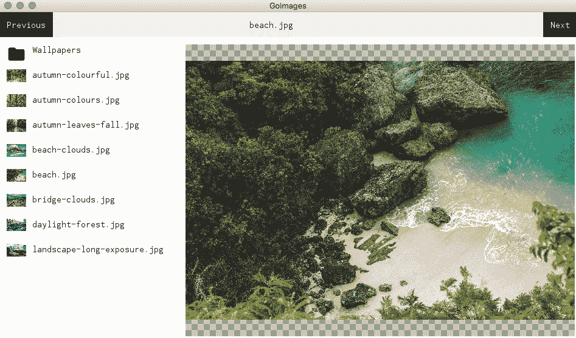

在 macOS 上运行的完成的 GoImages 应用程序

# 背景处理

图像处理，即使是加载要查看的图像，也是一个 CPU 密集型任务，所以如果我们打开一个包含大量图片的目录，应用程序加载将非常慢。我们可以通过将图像加载移动到后台工作，在我们加载用户界面时进行修复这个延迟。幸运的是，使用 Go 创建新的线程进行异步处理非常简单（如我们在第三章，*Go to the Rescue!*中探讨的那样），但我们还需要确保用户界面相应地更新。

为了延迟图像的加载直到有处理能力可用，我们可以用替换的`asyncImage`类型替换`loadImage()`的使用，该类型将处理繁重的工作。主图像加载代码将被移动到一个私有的`load()`函数中，该函数由`newAsyncImage()`调用，使用`go img.load()`启动，因此它在后台开始：

```go
type asyncImage struct {
   path     string
   img      image.Image
   callback func(image.Image)
}

func (a *asyncImage) load() {
   reader, err := os.Open(a.path)
   if err != nil {
      log.Fatal(err)
   }
   defer reader.Close()

   a.img, _, err = image.Decode(reader)
   if err != nil {
      log.Fatal(err)
   }

   a.callback(a.img)
}

func newAsyncImage(path string, loaded func(image.Image)) *asyncImage {
   img := &asyncImage{path: path, callback:loaded}
   go img.load()

   return img
}
```

通过定义异步图像加载器，我们可以用`asyncImage`替换`image.Image`的使用。需要记住的重要一点是，`img`字段中的图像在`load()`函数完成之前将是`nil`。确保任何使用图像的代码在处理之前检查`nil`数据。我们首先更新的是`makeCell()`函数，使其不再接受图像参数。相反，我们传递一个`loaded`回调函数，以便在图像加载后设置图像。我们将`makeList()`更新为用以下代码替换单元格创建代码：

```go
   cell := makeCell(idx, name)
   i := idx
   img := newAsyncImage(path.Join(dir, name), func(img image.Image) {
      cell.icon.SetImage(img)
      if i == index {
         view.SetImage(img)
      }
   })
```

此代码将确保在图像加载完成后显示缩略图，同时如果图像是当前选择，它还会更新主图像`view`。

如果你在这个时候运行应用程序，你会注意到一些图像被加载，而其他可能没有被加载。这是因为我们没有通知 Shiny 需要重新绘制。应用于小部件以强制它们重新绘制的标记实际上并没有触发界面的绘制；它只是标记它们需要在下一次重新绘制时进行绘制：

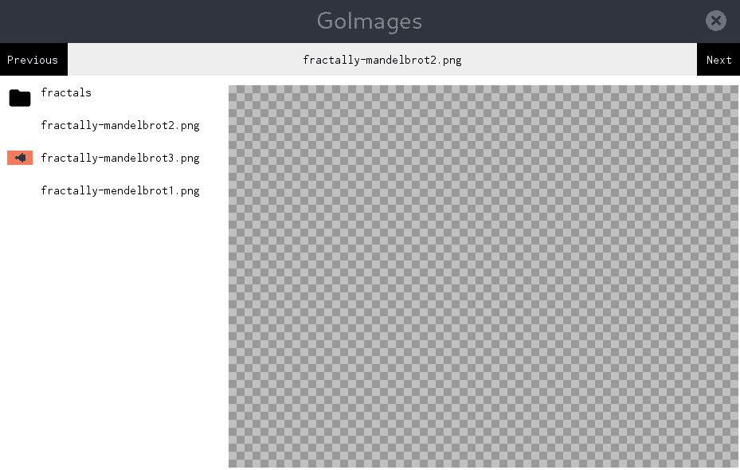

在后台加载图像时的部分渲染

没有简单的方法来通知 Shiny 刷新用户界面，因此我们将创建一个`refresh()`函数以方便使用。当文件名的文本更新以及在不同（或懒加载）的图像被设置在`scaledImage`小部件上时，应该调用此函数：

```go
func chooseImage(idx int, img image.Image) {
   ...

   name.Mark(node.MarkNeedsPaintBase)
   refresh(name)
}

func (w *scaledImage) SetImage(img image.Image) {
   w.Src = img
   w.Mark(node.MarkNeedsPaintBase)

   refresh(w)
}

func refresh(_ node.Node) {
   // Ideally we should refresh but this requires a reference to the window
   // win.Send(paint.Event{})
}
```

不幸的是，在这个阶段，没有大量的额外代码，我们无法进一步进行。这是我们所使用的推荐`widget.RunWindow()`函数的限制。我们需要发送绘图事件到窗口的引用在 Shiny 包外部不可用。为了解决这个问题，有必要在`screen.Screen`实例上使用`NewWindow()`函数，该实例被传递到`driver.Main()`函数中——但是这样做意味着完全重新实现事件循环，这是一项大量工作。

我们在设置主图像时没有注意到这个问题，是因为当应用程序接收用户事件（鼠标移动等）时，其事件循环会运行。每次循环迭代完成时，用户界面都会重新绘制。发送之前展示的`paint.Event`也会导致这种情况发生。因此，如果用户当前正在与 GUI 交互（即使只是将鼠标移到上面），则界面将在后台图像加载后更新。如果需要，将实现替换生命周期以解决这个问题，留作读者的练习。

# 摘要

在本章中，我们探讨了我们的第一个现代小部件工具包 Shiny，它专门为 Go 语言设计。我们探讨了其设计原则以及它是如何在不需要外部依赖的情况下支持跨平台图形应用程序开发的。我们还看到，其设计利用了 Go 语言的一些强大功能，如并发和标准库。

Shiny 背后的图形设计原则为桌面应用程序 GUI 提供了一种新的解释，这对于使用相同材料设计方法的 Android 移动操作系统用户来说将非常熟悉。在探索其图形功能时，我们发现当前的小部件集还处于早期阶段，因此尚未准备好支持我们在前几章中创建的 GoMail 应用程序。为了探索 Shiny 工具包的功能，我们反而开发了一个图像查看器应用程序，它更适合当前的功能集。我们看到了 Shiny 的渲染能力是多么强大，但也意识到在创建丰富的应用程序用户界面方面存在一些挑战。

在下一章中，我们将探讨另一个采用现代方法处理小部件工具包的工具包。Nuklear 还帮助开发者创建跨平台的图形用户界面，但它采用嵌入式用户界面方法。我们将探索这个名为`nk`的库的 Go 绑定。
