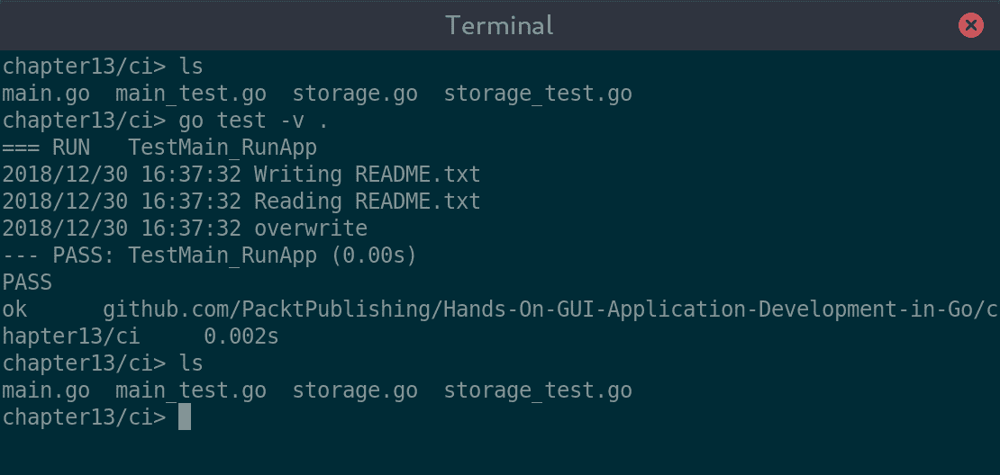

# 第十三章：Go GUI 开发的最佳实践

Go 语言有明确的格式化、文档和代码结构实践。您可以在许多地方找到这些参考，例如，[`golang.org/doc/effective_go.html#formatting`](https://golang.org/doc/effective_go.html#formatting) 和 [`github.com/golang/go/wiki/CodeReviewComments`](https://github.com/golang/go/wiki/CodeReviewComments)。此外，有一个强大的社区推动编写惯用的 Go 语言，例如 [`dmitri.shuralyov.com/idiomatic-go`](https://dmitri.shuralyov.com/idiomatic-go)。许多这些设计决策都编码在工具如`gofmt`和`golint`中，这使得人们学习并维护标准化代码变得容易。

在本章中，我们将超越这些代码标准和常见约定，专注于使基于 GUI 的应用程序更容易维护和扩展的最佳实践方面。我们将涵盖以下主题：

+   关注点的分离

+   驱动 UI 开发的测试

+   GUI 的持续集成

+   管理平台特定性

在应用程序中添加图形元素通常会使其测试变得更加困难。在本章中，我们将看到，通过正确的准备和结构，我们可以克服这些挑战，并使我们的代码更加健壮和易于更改。让我们首先看看如何为可维护性构建基于 GUI 的应用程序的结构。

# 关注点的分离

这个概念与罗伯特·C·马丁在其面向对象设计原则中引入的*单一责任原则*密切相关 ([butunclebob.com/ArticleS.UncleBob.PrinciplesOfOod](http://butunclebob.com/ArticleS.UncleBob.PrinciplesOfOod))，该原则指出：

“一个类应该只有一个，且仅有一个，改变的理由。”

–罗伯特·C·马丁

在这方面，*关注点*比*责任*具有更广泛的范围，通常影响您的应用程序的设计和架构，而不是单个类或接口。在图形应用程序中，分离关注点是必要的，以便正确地将易于测试的逻辑与处理用户交互的表示代码分离。

通过分离应用程序的关注点，我们可以更容易地测试子组件并验证我们软件的有效性，甚至不需要运行应用程序。这样做，我们创建了更健壮的应用程序，这些应用程序可以随着时间的推移适应需求或技术的变化。例如，您为应用程序选择图形工具包时，不应将其纳入或影响您的业务逻辑设计。考虑我们在前几章中构建的 GoMail 示例；我们能够使用不同的工具包来显示我们的电子邮件，但管理访问它们的代码从未更改。这样，我们在不影响相关区域的情况下，保持了软件的开放性，易于更改。

# 建议的应用结构

在规划应用程序的开发时，考虑如何将核心关注点分离以保持灵活性。以下建议的结构应提供一些灵感：|

| `project/` | 项目结构的根目录。此包应定义其余项目使用的接口和实用函数。这些文件不应依赖于任何子包。 |
| --- | --- |
| `project/logic/` | 此包将包含大部分应用程序逻辑。应仔细考虑哪些函数和类型被暴露，因为它们将形成其余应用程序所依赖的 API。随着你将应用程序的关注点分离，可能会有多个包含应用程序逻辑的包。可能更倾向于使用特定领域的术语来代替 `logic`。 |
| `project/storage/` | 大多数应用程序都将依赖于某种类型的数据源。此包将定义一个或多个可能的数据源。它们将符合顶级项目中的接口，以便在项目中的包之间传递数据访问。 |
| `project/gui/` | 此包是唯一导入图形工具包的地方。它负责加载应用程序的 GUI 并响应用户事件。它可能会访问由应用程序运行器设置的存储包提供的数据。 |
| `project/cmd/appname/` | Go 语言中应用程序二进制的约定是它们位于 `cmd/appname` 子包中。该目录的实际包将是 `main`，它将包含加载和运行其他包中定义的主要应用程序所需的最低限度的代码。它可能会初始化一个存储系统，加载应用程序逻辑，并指示图形界面进行加载。 |

在为这些包中的每一个编写测试时，它们将关注当前包的功能。`logic` 包应该有非常高的单元测试覆盖率，而 `storage` 包可能更多地依赖于集成测试（关于不同类型测试的复习，请参阅 [www.atlassian.com/continuous-delivery/software-testing/types-of-software-testing](https://www.atlassian.com/continuous-delivery/software-testing/types-of-software-testing)）。通常被认为最难测试的 `gui` 包可以在其测试中直接导入逻辑包，但可能不应该包含主存储包以验证其功能。您可以在 [medium.com/@benbjohnson/standard-package-layout-7cdbc8391fc1](https://medium.com/@benbjohnson/standard-package-layout-7cdbc8391fc1) 上了解更多关于推荐包结构的建议。|

遵循合理的结构将极大地帮助使你的应用程序可测试，正如许多开发者可能已经意识到的。然而，测试应用程序的图形部分通常要困难得多。从一开始就设计你的应用程序以便进行单元测试，通常会得到一个组织得更好的代码库，并自然地导致代码更容易理解和修改。让我们看看**测试驱动开发**（**TDD**）能教给我们关于构建图形界面的哪些东西。

# 测试驱动 UI 开发

自动测试用户界面或前端软件所需付出的努力常常被争论为代价过高，因为它在避免未来错误方面所提供的价值。然而，这很大程度上源于所使用的工具包或甚至所选择的表现技术。如果没有开发工具或图形 API 对测试的全面支持，确实很难在没有巨大努力的情况下创建简单的单元测试。正如在基于 Web 的环境（以及一些本地测试框架）中经常看到的那样，唯一剩下的可能性就是运行应用程序并执行测试脚本，这些脚本将执行验证。它们通常会控制用户输入，模拟鼠标动作和键盘敲击，并监控被测试应用程序的结果行为。然而，如果你的应用程序和 GUI 工具包在设计时考虑了测试（例如，使用关注点分离），那么使用更少的开销进行自动化测试应该是可能的。

# 设计为可测试

在设置项目 UI 代码中的组件（如图`gui`子包所示）时，应小心定义具有单一责任和清晰 API 的类型和类。这样做将使使用标准的 Go 测试工具加载和测试单个组件变得更容易。如果可以测试较小的组件，我们就可以避免启动整个应用程序和所需的测试运行器，从而使测试过程更快。当测试套件运行得快时，它可以更频繁地运行并更容易扩展，从而导致更高的测试覆盖率和更大的软件质量信心。

为了一个实际的例子，让我们看看 GoMail 的撰写对话框及其发送按钮。显然，对话框在发送之前应该执行各种验证，如果验证通过，则发送电子邮件。验证可以通过正常的单元测试轻松测试，但验证发送按钮是否正确发送新电子邮件则需要测试用户界面。在下面的示例中，我们将加载撰写窗口，输入一些数据，并模拟按下发送按钮。通过使用 GoMail 示例中使用的测试电子邮件服务器，我们可以检查用户界面是否已发送电子邮件，而无需与真实的电子邮件服务器通信。

# 示例应用程序测试

我们回到第十章的 GoMail 代码，*Fyne – 基于 Material-design 的 GUI*，并创建一个新文件，`compose_test.go`。由于测试在同一个包中，我们可以测试内部函数定义，而不是依赖于导出的 API——只要应用程序足够小，不需要单独的包或库，这种情况在 UI 代码中很常见。我们首先添加测试导入；`testing` 是 go test 代码所必需的，而 `github.com/stretchr/testify/assert` 提供了有用的断言功能。我们还导入了为我们的 GoMail 示例创建的客户端电子邮件库，最后是 Fyne 测试包，`fyne.io/fyne/test`：

```go
package main

import (
   "testing"

   "fyne.io/fyne/test"

   "github.com/PacktPublishing/Hands-On-GUI-Application-Development-in-Go/client"
   "github.com/stretchr/testify/assert"
)
```

现在，我们可以添加一个测试方法，使用推荐的命名模式 `Test<type>_<function>()`；通常，函数名会是函数名，但在这里我们指的是按钮标题或其动作。在函数的第一部分，我们通过调用 `newCompose()` 并传递一个测试应用程序（由 `test.NewApp()` 返回）来设置测试的编辑窗口。然后我们为测试准备状态——我们记录服务器发件箱的大小，并设置一个 `OnClosed` 处理器，当窗口关闭时会报告。最后，我们使用 `test.Type()` 模拟在 `compose.to` 字段中输入电子邮件地址：

```go
func TestCompose_Send(t *testing.T) {
   server := client.NewTestServer()
   compose := newCompose(test.NewApp(), server)
   ui := compose.loadUI()

   pending := len(server.Outbox)
   closed := false
   ui.SetOnClosed(func() {
      closed = true
   })
   address := "test@example.com"
   test.Type(compose.to, address)

   ...
}
```

一旦设置代码完成，我们就可以实现主要的测试。这首先是通过使用 `test.Tap()` 点击 `compose.send` 按钮，这将导致发送电子邮件。我们首先验证在电子邮件发送完成后窗口是否已 `关闭`（我们添加的 `OnClosed` 处理器记录了这一点）。然后我们检查 `server.Outbox` 中的电子邮件比之前多一个。

如果这些测试通过，我们将进行最终检查。发送的电子邮件是从发件箱中提取出来的，这样我们可以检查其内容。通过一个最终的断言，我们验证电子邮件地址与我们输入到 *To* 输入框中的内容相匹配：

```go
func TestCompose_Send(t *testing.T) {
   ...

   test.Tap(compose.send)
   assert.True(t, closed)
   assert.Equal(t, pending + 1, len(server.Outbox))

   email := server.Outbox[len(server.Outbox)-1]
   assert.Equal(t, address, email.ToEmailString())
}
```

运行前面的测试将在内存中加载用户界面，执行设置代码，并运行测试，然后退出并显示结果。我们使用 `-v` 运行以下测试，以便查看每个运行的测试，而不仅仅是总结。您会注意到以这种方式进行测试花费的时间非常少（`go test` 报告测试耗时为 0.00 秒，总耗时为 0.004 秒）；因此，可以定期运行更多测试以验证应用程序的行为：


运行用户界面测试花费的时间非常少

当运行测试时，您可能会注意到这个测试不会在您的计算机屏幕上显示任何窗口。这是许多 GUI 工具包测试框架的设计特性——对于测试目的，不显示应用程序运行要快得多。这通常被称为 **无头** 模式，当作为 **持续集成** 过程的一部分运行自动化测试时非常有用。

# GUI 的持续集成

持续集成（定期将团队的工作进行中的代码合并以自动测试）已成为软件开发团队的常态。将此过程添加到您的团队工作流程中已被证明可以更早地突出显示开发过程中的问题，这有助于更快地修复问题，并最终产生高质量的软件。这部分的关键是自动化测试，这些测试会测试整个源代码，包括图形用户界面。

# GUI 测试自动化的方法

将代码组织成逻辑组件以进行开发和测试是很重要的。使用框架测试功能（或外部支持库），较小的组件可以通过简单的测试更容易地得到验证。Go 语言内置的测试支持意味着测试覆盖率正在提高；事实上，流行的 Go 库列表[awesome-go.com](http://awesome-go.com)要求库至少有 80%的测试覆盖率！GUI 工具包，尤其是第三部分中讨论的新工具包，需要满足这些期望，并允许使用它们的开发者也能做到这一点。

如果您选择的框架不提供必要的支持，仍然可以自动化功能测试。这种技术涉及从测试脚本中运行应用程序，然后在该主机计算机上执行模拟用户操作。这并不是理想的做法，因为它要求应用程序在屏幕上可见，并且测试脚本需要控制键盘和鼠标——但比没有 GUI 测试要好。为了克服这种不便，可以在其中运行应用程序的虚拟帧缓冲区（一个离屏显示区域）。这种技术基本上创建了一个不可见的*屏幕*，应用程序可以将其绘制。这些方法通常由商业持续集成服务器支持，但设置它们超出了本书的范围。

# 避免外部依赖

在测试应用程序或其部分时，需要注意的一点是可能涉及外部系统。文件浏览器可能依赖于网络连接来完成一些工作，或者即时通讯应用将需要一个服务器来处理发送和接收消息。如果您的代码已经精心组织以分离其关注点，您已经使用了接口来定义不同组件之间的交互。如果采取这种方法，我们可以使用*依赖注入*来为不应包含在自动化测试中的应用程序区域提供替代实现。

“将复杂问题分解成更小的模块并实现这些模块的主要目标之一是依赖。一个高度依赖于底层技术或平台的模块可重用性较低，并且使软件的更改变得复杂和昂贵。”

–[`best-practice-software-engineering.ifs.tuwien.ac.at/patterns/dependency_injection.html`](http://best-practice-software-engineering.ifs.tuwien.ac.at/patterns/dependency_injection.html)

当代码正确地与它所依赖的组件解耦时，就有可能为测试加载应用程序的不同版本。以这种方式，我们可以避免依赖任何外部系统或对数据存储造成永久性更改。让我们看看一个简单的例子，定义了一个`Storage 接口`，它将被用来从磁盘读取和写入文件：

```go
type Storage interface {
   Read(name string) string
   Write(name, content string)
}
```

有一个应用程序运行器调用一个永久存储，并使用它来写入然后读取一个文件：

```go
func runApp(storage Storage) {
   log.Println("Writing README.txt")
   storage.Write("README.txt", "overwrite")

   log.Println("Reading README.txt")
   log.Println(storage.Read("README.txt"))
}

func main() {
   runApp(NewPermanentStorage())
}
```

显然，这个应用程序将会覆盖现有的`README.txt`文件中的内容，将其替换为`overwrite`的内容。如果我们假设，例如，这是期望的行为，我们可能不希望这个外部系统（磁盘）受到我们的测试的影响。因为我们已经设计存储来符合接口，我们的测试代码可以包含一个不同的存储系统，我们可以在测试中使用它，如下所示：

```go
type testStorage struct {
   items map[string]string
}

func (t *testStorage) Read(name string) string {
   return t.items[name]
}

func (t *testStorage) Write(name, content string) {
   t.items[name] = content
}

func newTestStorage() Storage {
   store := &testStorage{}
   store.items = make(map[string]string)
   return store
}
```

在此添加之后，我们可以测试应用程序的`runApp`函数，而不会覆盖真实文件的风险：

```go
import (
   "testing"

   "github.com/stretchr/testify/assert"
)

func TestMain_RunApp(t *testing.T) {
   testStore := newTestStorage()
   runApp(testStore)

   newFile := testStore.Read("README.txt")
   assert.Equal(t, "overwrite", newFile)
}
```

当运行这个测试时，你会看到我们得到了预期的结果，同时也应该注意到没有任何实际文件被更改。这个示例中的代码也包含在书的源代码仓库中的`chapter13/ci`文件夹里：



确认我们的 TestMain_RunApp 测试成功完成，没有写入我们的磁盘

# 管理平台特定性

在第三章，*Go to the Rescue!*中，我们看到了 Go 编译器内置了对基于环境变量和构建标签的源文件条件包含的支持。随着应用程序功能的增加，尤其是从平台集成角度来看，你选择的工具包可能无法提供你所需的所有功能。当这种情况发生时，代码需要更新以处理特定平台的功能。为此，我们将使用条件构建的变体——使用命名良好的文件而不是构建标签（如第十一章，*Navigation and Multiple Windows*中使用的那样）。这在项目级别上更容易阅读，并且应该清楚地表明哪些文件将被编译用于哪个平台。

让我们创建一个简单的例子：我们想要显示一个通知，但我们的代码只能在 macOS（darwin）上这样做。我们将在`notification_darwin.go`文件中设置一个简单的`notify()`函数，以实现我们想要的功能：

```go
package main

import (
   "log"
   "os/exec"
)

func notify(title, content string) {
   cmd := exec.Command("osascript", "-e", "display notification \""+content+
      "\" with title \""+title+"\"")
   err := cmd.Run()

   if err != nil {
      log.Printf("Error showing notification: %v", err)
   }
}
```

这个简单的函数调用了`osascript`工具，这是一个与 macOS 捆绑的命令行应用程序，允许执行系统脚本。由于此文件以名称`_darwin.go`结尾，它只有在为 macOS 构建时才会被编译。为了在其他平台上正确编译，我们需要创建另一个将被加载的文件，我们将称之为`notification_other.go`：

```go
// +build !darwin

package main

import "log"

func notify(title, content string) {
   log.Println("Notifications not supported")
}
```

在这个文件中，我们必须指定构建条件，因为没有为所有其他平台指定特殊的文件名格式；这里，`// +build !darwin`表示该文件将包含在任何除 macOS 以外的平台上。我们在这个文件中提供的简单方法只是记录该功能不受支持。最后，我们创建了一个名为`main.go`的简单应用程序启动器，它将调用`notify()`函数：

```go
package main

func main() {
   notify("Email", "A new email arrived")
}
```

在 macOS 上运行此代码将导致出现预期的通知：


我们简单的通知出现在 macOS 上

在任何其他操作系统上，它将记录回退错误信息：


当在 Linux（或 Windows 或其他操作系统）上运行时，我们只看到日志消息

我们可以以一种对学习源代码的人来说清晰易懂的方式处理特定平台的代码。另一位开发者可以选择添加一个`notification_windows.go`文件来支持 Windows 上的通知。只要他们也更新了`notification_other.go`中的构建规则，应用程序将继续按预期工作，但会添加基于 Windows 的通知。这种方法的优点是，它不需要对现有代码进行任何修改来添加这个新功能。

# 摘要

在本章中，我们探讨了使用 Go 编写的基于 GUI 的应用程序的一些管理和技巧。通过仔细规划应用程序的模块及其交互方式，我们看到了我们可以使其更容易测试和维护。由于更高的测试覆盖率是提高软件应用程序质量的因素之一，我们探讨了如何使用这些技术来测试我们的图形代码，这是一个众所周知难以处理的话题。我们逐步分析了为简单 GUI 应用程序编写测试代码的示例，该代码可以自动运行。

从这些基本概念出发，我们探讨了如何为常规自动化测试准备应用程序，以不断检查代码中的错误（称为**持续集成**）。通过利用良好的模块化代码库，我们可以避免在测试软件时依赖外部服务或产生意外的副作用。我们看到了**依赖注入**如何提高我们的测试可靠性和加快反馈过程。最后，我们看到了如何将我们的知识应用于处理图形应用程序中的操作系统特定功能。

在接下来的，也是最后一章中，我们将探讨开发过程的最后一步：打包和共享编译后的应用程序。我们将研究每个平台可用的各种选项，以及这些渠道如何有助于，或复杂化，我们的跨平台策略。
