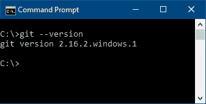
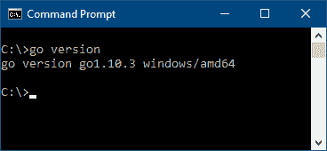
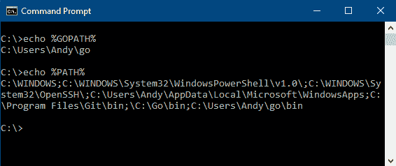
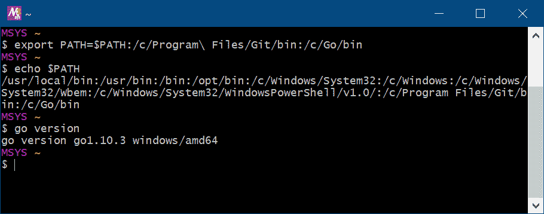
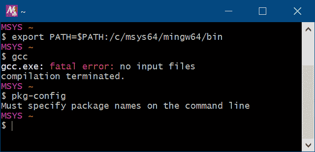

# 第十五章：安装详情

为了运行本书中的代码示例，你需要安装 Go 编译器和 C 编译器（以支持 Cgo）。如果其中任何一个没有设置，这个附录将指导你完成安装。

# 安装 Go

作为一种相对较新的编程语言，Go 并没有预安装在许多操作系统上。本节将指导任何尚未设置的用户如何设置它。

# Microsoft Windows

在 Windows 上配置开发环境可能很复杂，因为默认情况下没有安装很多工具。因此，有多个选项可以使用外部工具和包（如 MSYS、MinGW 和 Ubuntu 子系统）进行设置，但探索这些内容超出了本书的范围。幸运的是，可以在不需要许多额外开发工具的情况下开始开发 Go 应用程序。

# Git

首先，如果你还没有这样做，你需要下载并安装 Git。下载可在[`git-scm.com/download/win`](https://git-scm.com/download/win)找到，当你访问该页面时，它应该会自动开始。运行下载的文件，设置程序将开始（如果出现通知表示此程序未经验证，请点击“仍然安装”按钮）。对于大多数用户，默认选项应该可以工作——确保选中“从 Windows 命令提示符使用 Git”以避免以后更多的麻烦。

完成这些后，打开一个命令提示符窗口（如果没有快捷方式，可以从开始菜单搜索 `cmd`）并输入 `git --version`——你应该会看到以下类似的输出：



通过检查版本来测试 Git 是否已安装

# Go

接下来，你应该安装 Go——可以在[`golang.org/dl/`](https://golang.org/dl/)找到。在这个页面上，选择推荐的 Microsoft Windows 下载（文件名将以 `.msi` 结尾）。与 Git 安装一样，你需要运行下载的文件，并可能确认你想要继续安装未经验证的程序。再次提醒，默认值应该合适——如果你更改了任何配置，请确保适当地更新以下行。

安装程序完成后，返回你的命令提示符并输入 `go version`，它应该输出版本号然后退出：



通过检查版本来测试 Go 是否已安装

# 环境

如果前面的安装成功，那么你的环境应该已经正确配置。如果你在安装过程中做了某些更改，你可能需要调整你的环境配置：



检查我们的 %GOPATH%/bin 是否出现在 %PATH% 中

在前面的输出中，您可以看到 `Git\bin`、`Go\bin` 和 `%GOPATH%` 已包含在您的 `%PATH%` 环境中，以便查找可执行文件。如果情况不是这样，您可能需要注销或重启以使设置生效。

# Apple macOS

许多开发者工具（包括 Git）都是作为 `XCode` 软件包的一部分安装的。如果您还没有安装 Xcode 用于其他开发工作，您可以从 Mac App Store 中免费下载。安装完成后，您还应设置命令行工具——为此，请转到 Xcode 菜单并选择首选项，然后下载和安装命令行工具。

如果您不确定是否已经安装了这些，那么请打开终端应用程序并执行 `xcode-select`——如果已安装，它将正常执行；如果没有，您将被提示运行安装：


如果未安装开发者工具，将显示安装对话框

除了这些工具之外，您还需要安装 Go。您可以从 [`golang.org/dl/`](https://golang.org/dl/) 获取下载包——点击 Apple macOS 的特色下载链接并运行下载的安装程序包。您可能需要关闭任何打开的终端窗口以更新您的环境变量。

# Linux

在 Linux 上设置先决软件通常只需要安装您发行版的正确软件包。`git` 软件包将提供版本控制工具，而 Go 语言应包含在 `go` 或 `golang` 软件包中。安装这些软件包将提供运行本书中示例所需的必要命令。您可能需要将 `~/go/bin` 添加到您的 `PATH` 环境变量中，以便能够运行 Go 安装的工具。

# 设置 Cgo

要使用本书中探索的大多数库和功能，您还需要使用 Cgo（Go 内置的 C 语言桥接器）。Cgo 需要操作系统可用的一个 C 编译器和一些相关工具。本节概述了如何设置它们。

# Microsoft Windows

要在 Windows 上使 Cgo 正常工作，您需要安装 `gcc`（或兼容的）编译器。如果已经安装了 Visual Studio，那么您可能已经有了一个 C 编译器。对于那些还没有安装的人来说，本节将指导您在命令行上配置构建环境。根据我的经验，最简单的方法是下载并安装 MSYS2（一个软件发行版）并为 Windows 构建一个平台。使用 MSYS2，我们可以安装 `mingw-w64` 软件包，这些软件包提供了一个名为 **mingw** 的针对 Windows 的 *gcc* 项目的更新版。

从[www.msys2.org/](http://www.msys2.org/)下载安装程序——根据你的计算机架构选择 32 位（i686）或 64 位（x86_64）版本。下载完成后，运行此安装程序，它将下载基本包到你的计算机上，包括包管理器（pacman）。完成后，它将启动 MSYS 命令提示符，该提示符将用于任何需要 Cgo 的项目。你需要更新`PATH`环境变量以使用现有的 Go 和 Git 安装：



MSYS 控制台提供了访问许多额外包的方式

一旦设置了命令行，包管理器就被用来安装 C 编译器和工具链以及`pkg-config`（Cgo 用来查找包的工具）：

```go
pacman -S mingw-w64-x86_64-toolchain mingw-w64-x86_64-pkg-config
```

一旦完成，你将能够从 MSYS 命令行执行`gcc`和`pkg-config`——这些工具对于 Cgo 的正常设置是必不可少的。以下输出可能会显示错误，但它表明工具已被找到：



MSYS 上的 Pacman 提供了我们需要的包

# Apple macOS

要在 macOS 上启用 Cgo 支持，你需要 Xcode 发行版中包含的开发工具。如果你之前在你的 Macintosh 计算机上做过开发工作，或者如果你遵循了安装 Git 工具的先前说明，那么你已经有这个安装了。如果你已经安装了 Xcode 但之前没有使用过命令行工具，那么你可以通过以下命令从终端窗口安装这些工具：

```go
xcode-select --install
```

# Linux

Linux 上的 Cgo 需要`gcc`的存在，这通常在 Linux 环境中由其他包安装。如果从终端执行`gcc`时出现错误，例如`gcc: command not found`，那么你需要从你的系统包管理器安装`gcc`包。
