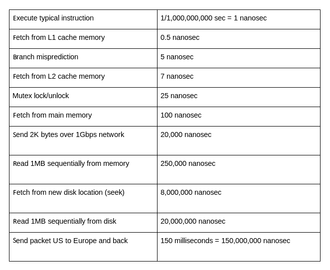
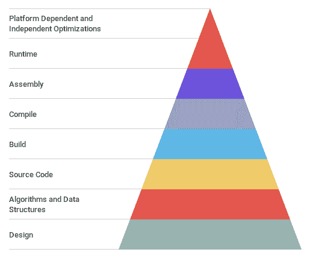

# Go 性能简介

本书是针对中级到高级 Go 开发人员编写的。这些开发人员将希望从其 Go 应用程序中挤出更多性能。为此，本书将帮助推动《Site Reliability Engineering Workbook》中定义的四个黄金信号（[`landing.google.com/sre/sre-book/chapters/monitoring-distributed-systems/`](https://landing.google.com/sre/sre-book/chapters/monitoring-distributed-systems/)）。如果我们能减少延迟和错误，同时增加流量并减少饱和，我们的程序将继续更加高效。遵循四个黄金信号的理念对于任何以性能为目标开发 Go 应用程序的人都是有益的。

在本章中，您将介绍计算机科学性能的一些核心概念。您将了解 Go 计算机编程语言的一些历史，其创建者是如何决定将性能置于语言的前沿，并且为什么编写高性能的 Go 很重要。Go 是一种以性能为重点设计的编程语言，本书将带您了解如何利用 Go 的设计和工具来提高性能。这将帮助您编写更高效的代码。

在本章中，我们将涵盖以下主题：

+   了解计算机科学中的性能

+   Go 的简要历史

+   Go 性能背后的理念

这些主题旨在指导您开始了解在 Go 语言中编写高性能代码所需的方向。

# 技术要求

对于本书，您应该对 Go 语言有一定的了解。在探索这些主题之前，了解以下一些关键概念是很重要的：

+   Go 参考规范：[`golang.org/ref/spec`](https://golang.org/ref/spec)

+   如何编写 Go 代码：[`golang.org/doc/code.html`](https://golang.org/doc/code.html)

+   Effective Go: [`golang.org/doc/effective_go.html`](https://golang.org/doc/effective_go.html)

在本书中，将提供许多代码示例和基准结果。所有这些都可以通过 GitHub 存储库访问[`github.com/bobstrecansky/HighPerformanceWithGo/`](https://github.com/bobstrecansky/HighPerformanceWithGo/)。

如果您有问题或想要请求更改存储库，请随时在存储库内创建问题[`github.com/bobstrecansky/HighPerformanceWithGo/issues/new`](https://github.com/bobstrecansky/HighPerformanceWithGo/issues/new)。

# 了解计算机科学中的性能

计算机科学中的性能是计算机系统可以完成的工作量的衡量标准。高性能的代码对许多不同的开发人员群体至关重要。无论您是大型软件公司的一部分，需要快速向客户交付大量数据，还是嵌入式计算设备程序员，可用的计算资源有限，或者是业余爱好者，希望从用于宠物项目的树莓派中挤出更多请求，性能都应该是您开发思维的前沿。性能很重要，特别是当您的规模不断增长时。

重要的是要记住，我们有时会受到物理限制。 CPU、内存、磁盘 I/O 和网络连接性都有性能上限，这取决于您从云提供商购买或租用的硬件。还有其他系统可能会与我们的 Go 程序同时运行，也会消耗资源，例如操作系统软件包、日志记录工具、监控工具和其他二进制文件——要记住，我们的程序很频繁地不是物理机器上唯一的租户。

优化的代码通常在许多方面有所帮助，包括以下内容：

+   响应时间减少：响应请求所需的总时间。

+   降低延迟：系统内因果关系之间的时间延迟。

+   增加吞吐量：数据处理速率。

+   更高的可扩展性：可以在一个封闭系统内处理更多的工作。

在计算机系统中有许多方法可以处理更多的请求。增加更多的个体计算机（通常称为横向扩展）或升级到更强大的计算机（通常称为纵向扩展）是处理计算机系统需求的常见做法。在不需要额外硬件的情况下，提高代码性能是服务更多请求的最快方法之一。性能工程既可以帮助横向扩展，也可以帮助纵向扩展。代码性能越高，单台机器就能处理更多的请求。这种模式可能导致运行工作负载的物理主机减少或更便宜。这对许多企业和爱好者来说是一个巨大的价值主张，因为它有助于降低运营成本，改善最终用户体验。

# Big O 符号简要说明

Big O 符号([`en.wikipedia.org/wiki/Big_O_notation`](https://en.wikipedia.org/wiki/Big_O_notation))通常用于描述基于输入大小的函数的极限行为。在计算机科学中，Big O 符号用于解释算法相对于彼此的效率——我们将在第二章中更详细地讨论这一点，*数据结构和算法*。Big O 符号在优化性能方面很重要，因为它被用作比较运算符，解释算法的扩展性如何。了解 Big O 符号将帮助您编写更高性能的代码，因为它将在代码编写时帮助您做出性能决策。了解不同算法在何时具有相对优势和劣势的点，将帮助您确定实现的正确选择。我们无法改进我们无法衡量的东西——Big O 符号帮助我们对手头的问题陈述给出一个具体的衡量。

# 衡量长期性能的方法

在进行性能改进时，我们需要不断监视我们的变化以查看影响。有许多方法可以用来监视计算机系统的长期性能。其中一些方法的例子如下：

+   Brendan Gregg 的 USE 方法：利用率、饱和度和错误([www.brendangregg.com/usemethod.html](http://www.brendangregg.com/usemethod.html))

+   Tom Wilkie 的 RED 指标：请求、错误和持续时间([`www.weave.works/blog/the-red-method-key-metrics-for-microservices-architecture/`](https://www.weave.works/blog/the-red-method-key-metrics-for-microservices-architecture/))

+   Google SRE 的四个黄金信号：延迟、流量、错误和饱和度([`landing.google.com/sre/sre-book/chapters/monitoring-distributed-systems/`](https://landing.google.com/sre/sre-book/chapters/monitoring-distributed-systems/))

我们将在第十五章中进一步讨论这些概念，*跨版本比较代码质量*。这些范式帮助我们做出关于代码性能优化的明智决策，避免过早优化。过早优化对许多计算机程序员来说是非常关键的一个方面。我们经常不得不确定什么是*足够快*。当许多其他代码路径有机会从性能角度进行改进时，我们可能会浪费时间尝试优化一小部分代码。Go 的简单性允许进行额外的优化，而不会增加认知负担或增加代码复杂性。我们将在第二章中讨论的算法，将帮助我们避免过早优化。

# 优化策略概述

在这本书中，我们还将尝试理解我们到底在优化什么。优化 CPU 或内存利用率的技术可能看起来与优化 I/O 或网络延迟的技术大不相同。了解问题空间以及硬件和上游 API 中的限制将帮助您确定如何针对手头的问题陈述进行优化。优化通常也会显示出递减的回报。经常情况下，基于外部因素，特定代码热点的开发投资回报不值得，或者添加优化会降低可读性并增加整个系统的风险。如果您能够早期确定优化是否值得进行，您将能够更加狭窄地聚焦，并可能继续开发更高性能的系统。

了解计算机系统中的基线操作可能是有帮助的。*Peter Norvig*，谷歌研究总监，设计了一张表（随后的图片），帮助开发人员了解典型计算机上各种常见的时间操作（[`norvig.com/21-days.html#answers`](https://norvig.com/21-days.html#answers)）。



清楚地了解计算机的不同部分如何相互协作有助于我们推断出我们的性能优化应该放在哪里。从表中得出，从磁盘顺序读取 1 MB 的数据所需的时间要比通过 1 Gbps 网络链路发送 2 KB 的数据要长得多。当您能够对常见的计算机交互进行*草稿计算*比较运算符时，可以帮助您推断出下一个应该优化的代码部分。当您退后一步并全面审视系统的快照时，确定程序中的瓶颈变得更容易。

将性能问题分解为可以同时改进的小而可管理的子问题是一种有助于优化的转变。试图一次解决所有性能问题通常会让开发人员感到受挫和沮丧，并且经常导致许多性能努力失败。专注于当前系统中的瓶颈通常会产生结果。解决一个瓶颈通常会很快地发现另一个。例如，解决了 CPU 利用率问题后，您可能会发现系统的磁盘无法快速写入计算出的值。以结构化方式解决瓶颈是创建高性能和可靠软件的最佳方法之一。

# 优化级别

从下图的金字塔底部开始，我们可以逐步向上发展。这张图表显示了进行性能优化的建议优先级。这个金字塔的前两个级别——设计级别和算法和数据结构级别——通常会提供更多的现实世界性能优化目标。以下图表显示了一种通常有效的优化策略。改变程序的设计以及算法和数据结构往往是提高代码质量和速度的最有效的地方：



设计层面的决策通常对性能有最明显的影响。在设计层面确定目标可以帮助确定最佳的优化方法。例如，如果我们正在为一个具有缓慢磁盘 I/O 的系统进行优化，我们应该优先降低对磁盘的调用次数。相反，如果我们正在为一个具有有限计算资源的系统进行优化，我们需要计算程序响应所需的最基本值。在新项目开始时创建详细的设计文档将有助于理解性能提升的重要性以及如何在项目中优先考虑时间。从在计算系统内传输有效载荷的角度思考往往会导致注意到优化可能发生的地方。我们将在《理解并发》的第三章中更多地讨论设计模式。

算法和数据结构的决策通常会对计算机程序产生可衡量的性能影响。在编写高性能代码时，我们应该专注于尝试利用常数 O(1)、对数 O(log n)、线性 O(n)和对数线性 O(n log n)函数。在规模上避免二次复杂度 O(n²)对于编写可扩展的程序也很重要。我们将在《数据结构和算法》的第二章中更多地讨论 O 符号及其与 Go 语言的关系。

# Go 的简要历史

Robert Griesemer、Rob Pike 和 Ken Thompson 于 2007 年创建了 Go 编程语言。最初，它被设计为一种以系统编程为重点的通用语言。语言的创造者们在设计 Go 语言时考虑了一些核心原则：

+   静态类型

+   运行效率

+   可读性

+   可用性

+   易学习

+   高性能网络和多处理

Go 于 2009 年公开宣布，v1.0.3 于 2012 年 3 月 3 日发布。在撰写本书时，Go 版本 1.14 已发布，Go 版本 2 也即将推出。正如前面提到的，Go 最初的核心架构考虑之一是具有高性能的网络和多处理。本书将涵盖 Griesemer、Pike 和 Thompson 实施和宣传的许多设计考虑。设计者们创建 Go 是因为他们对 C++语言中做出的一些选择和方向感到不满。长时间运行的大型分布式编译集群是创作者们的主要痛点。在此期间，作者们开始了解下一个 C++编程语言版本的发布，被称为 C++x11。这个 C++版本计划中有很多新功能，Go 团队决定他们想要在他们的工作中采用“少即是多”的计算语言习惯。

语言的作者们在第一次会议上讨论了从 C 编程语言开始，构建功能并删除他们认为对语言不重要的多余功能。最终，团队从零开始，只借用了一些最基本的 C 和其他编程语言的部分。在他们的工作开始形成后，他们意识到他们正在剥夺其他语言的一些核心特性，尤其是没有头文件、循环依赖和类。作者们相信，即使剥夺了许多这些片段，Go 仍然可以比其前身更具表现力。

# Go 标准库

Go 标准库遵循相同的模式。它旨在同时考虑简单性和功能性。将切片，映射和复合文字添加到标准库有助于语言早期变得有见地。Go 的标准库位于`$GOROOT`中，并且可以直接导入。将这些默认数据结构内置到语言中使开发人员能够有效地使用这些数据结构。标准库包与语言分发捆绑在一起，并在安装 Go 后立即可用。经常提到标准库是如何编写符合惯用法的 Go 的可靠参考。标准库符合惯用法的原因是这些核心库部分清晰，简洁，并且具有相当多的上下文。它们还很好地添加了一些小但重要的实现细节，例如能够为连接设置超时，并明确地能够从底层函数中收集数据。这些语言细节有助于语言的繁荣。

一些显着的 Go 运行时特性包括以下内容：

+   垃圾收集以进行安全内存管理（并发的，三色的，标记-清除收集器）

+   并发性以支持同时执行多个任务（关于这一点，可以在第三章中了解更多，*理解并发性*）

+   堆栈管理以进行内存优化（原始实现中使用了分段堆栈；当前的 Go 堆栈管理采用了堆栈复制）

# Go 工具集

Go 的二进制发布还包括用于创建优化代码的庞大工具集。在 Go 二进制文件中，`go`命令具有许多功能，可帮助构建，部署和验证代码。让我们讨论一些与性能相关的核心功能。

Godoc 是 Go 的文档工具，将文档的要点放在程序开发的前沿。清晰的实现，深入的文档和模块化都是构建可扩展，高性能系统的核心要素。Godoc 通过自动生成文档来帮助实现这些目标。Godoc 从在`$GOROOT`和`$GOPATH`中找到的包中提取和生成文档。生成文档后，Godoc 运行一个 Web 服务器，并将生成的文档显示为 Web 页面。可以在 Go 网站上查看标准库的文档。例如，标准库`pprof`包的文档可以在[`golang.org/pkg/net/http/pprof/`](https://golang.org/pkg/net/http/pprof/)找到。

将`gofmt`（Go 的代码格式化工具）添加到语言中为 Go 带来了不同类型的性能。`gofmt`的诞生使得 Go 在代码格式化方面非常有见地。强制执行精确的格式化规则使得可以以对开发人员有意义的方式编写 Go，同时让工具按照一致的模式格式化代码，从而使得在 Go 项目中保持一致的模式成为可能。许多开发人员在保存他们正在编写的文件时，让他们的 IDE 或文本编辑器执行`gofmt`命令。一致的代码格式化减少了认知负荷，并允许开发人员专注于代码的其他方面，而不是确定是否使用制表符或空格来缩进他们的代码。减少认知负荷有助于开发人员的动力和项目速度。

Go 的构建系统也有助于性能。`go build`命令是一个强大的工具，用于编译包及其依赖项。Go 的构建系统还有助于依赖管理。构建系统的输出结果是一个编译的、静态链接的二进制文件，其中包含了在您为其编译的平台上运行所需的所有必要元素。`go module`（Go 1.11 中引入的初步支持功能，Go 1.13 中最终确定）是 Go 的依赖管理系统。语言的显式依赖管理有助于以版本化包的组合作为一个统一单元提供一致的体验，从而实现更可重现的构建。可重现的构建有助于开发人员通过源代码的可验证路径创建二进制文件。在项目中创建一个 vendored 目录的可选步骤也有助于本地存储和满足项目的依赖关系。

编译后的二进制文件也是 Go 生态系统中的重要组成部分。Go 还允许您为其他目标环境构建二进制文件，这在需要为另一台计算机架构交叉编译二进制文件时非常有用。能够构建可以在任何平台上运行的二进制文件，有助于您快速迭代和测试代码，以便在它们变得更难以修复之前，在其他架构上找到瓶颈。语言的另一个关键特性是，您可以在一个带有 OS 和架构标志的机器上编译二进制文件，然后在另一个系统上执行该二进制文件。当构建系统具有大量系统资源而构建目标具有有限的计算资源时，这一点至关重要。为两种架构构建二进制文件就像设置构建标志一样简单：

在 x86_64 架构的 macOS X 上构建二进制文件时，使用以下执行模式：

```go
GOOS=darwin GOARCH=amd64 go build -o myapp.osx
```

在 ARM 架构的 Linux 上构建二进制文件时，使用以下执行模式：

```go
GOOS=linux GOARCH=arm go build -o myapp.linuxarm
```

您可以使用以下命令找到所有有效的`GOOS`和`GOARCH`组合的列表：

```go
go tool dist list -json
```

这有助于您查看 Go 语言可以为其编译二进制文件的所有 CPU 架构和操作系统。

# 基准测试概述

基准测试的概念也将是本书的核心要点。Go 的测试功能内置了性能。在开发和发布过程中触发测试基准是可能的，这使得继续交付高性能代码成为可能。随着引入新的副作用、添加功能和代码复杂性的增加，验证代码库中性能回归的方法变得很重要。许多开发人员将基准测试结果添加到其持续集成实践中，以确保其代码在向存储库添加的所有新拉取请求中继续保持高性能。您还可以使用[golang.org/x/perf/cmd/benchstat](http://golang.org/x/perf/cmd/benchstat)包中提供的`benchstat`实用程序来比较基准测试的统计信息。以下示例存储库演示了对标准库的排序函数进行基准测试的示例，网址为[`github.com/bobstrecansky/HighPerformanceWithGo/tree/master/1-introduction`](https://github.com/bobstrecansky/HighPerformanceWithGo/tree/master/1-introduction)。

在标准库中密切结合测试和基准测试鼓励将性能测试作为代码发布过程的一部分。重要的是要记住，基准测试并不总是表明真实世界的性能场景，因此要对从中获得的结果持保留态度。记录、监控、分析和跟踪运行中的系统（将在第十二章《Go 代码性能分析》、第十三章《Go 代码跟踪》和第十五章《跨版本比较代码质量》中讨论）可以帮助验证您在进行基准测试后对代码所做的假设。

# Go 性能背后的思想

Go 的许多性能立场都来自并发和并行。Goroutines 和 channels 经常用于并行执行许多请求。Go 提供的工具有助于实现接近 C 语言的性能，同时语义清晰易读。这是 Go 常被开发人员在大规模解决方案中使用的许多原因之一。

# Goroutines - 从一开始就有性能

Go 语言的诞生是在多核处理器开始在商用硬件中变得越来越普遍的时候。Go 语言的作者意识到他们的新语言需要并发性。Go 通过 goroutines 和 channels（我们将在第三章《理解并发性》中讨论）使并发编程变得简单。Goroutines 是轻量级的计算线程，与操作系统线程不同，通常被描述为该语言的最佳特性之一。Goroutines 并行执行它们的代码，并在工作完成时完成。与依赖于操作系统线程的 Java 等语言相比，Goroutines 的启动时间比线程的启动时间更快，这允许程序中发生更多的并发工作。Go 还对于与 goroutines 相关的阻塞操作非常智能。这有助于 Go 在内存利用、垃圾回收和延迟方面更加高效。Go 的运行时使用`GOMAXPROCS`变量将 goroutines 复用到真实的操作系统线程上。我们将在第二章《数据结构和算法》中学习更多关于 goroutines 的知识。

# Channels - 一种类型的导管

Channels 提供了在 goroutines 之间发送和接收数据的模型，同时跳过底层平台提供的同步原语。通过深思熟虑的 goroutines 和 channels，我们可以实现高性能。Channels 可以是有缓冲的，也可以是无缓冲的，因此开发人员可以通过开放的通道传递动态数量的数据，直到接收者接收到值时，发送者解除通道的阻塞。如果通道是有缓冲的，发送者将会阻塞直到缓冲区填满。一旦缓冲区填满，发送者将解除通道的阻塞。最后，`close()`函数可以被调用来指示通道将不再接收任何值。我们将在第三章《理解并发性》中学习更多关于 channels 的知识。

# C-可比性能

另一个最初的目标是接近 C 语言对于类似程序的性能。Go 语言还内置了广泛的性能分析和跟踪工具，我们将在第十二章“Go 代码性能分析”和第十三章“Go 代码跟踪”中了解到。Go 语言让开发人员能够查看 goroutine 使用情况、通道、内存和 CPU 利用率，以及与个别调用相关的函数调用的细分。这是非常有价值的，因为 Go 语言使得通过数据和可视化轻松解决性能问题。

# 大规模分布式系统

由于其操作简单性和标准库中内置的网络原语，Go 经常用于大规模分布式系统。在开发过程中能够快速迭代是构建强大、可扩展系统的重要部分。在分布式系统中，高网络延迟经常是一个问题，Go 团队一直致力于解决这个平台上的问题。从标准库网络实现到使 gRPC 成为在分布式平台上在客户端和服务器之间传递缓冲消息的一等公民，Go 语言开发人员已经将分布式系统问题置于他们语言问题空间的前沿，并为这些复杂问题提出了一些优雅的解决方案。

# 摘要

在本章中，我们学习了计算机科学中性能的核心概念。我们还了解了 Go 编程语言的一些历史，以及它的起源与性能工作直接相关。最后，我们了解到由于语言的实用性、灵活性和可扩展性，Go 语言在许多不同的情况下被使用。本章介绍了将在本书中不断建立的概念，让您重新思考编写 Go 代码的方式。

在第二章“数据结构和算法”中，我们将深入研究数据结构和算法。我们将学习不同的算法、它们的大 O 表示法，以及这些算法在 Go 语言中的构建方式。我们还将了解这些理论算法如何与现实世界的问题相关，并编写高性能的 Go 代码，以快速高效地处理大量请求。了解更多关于这些算法的知识将帮助您在本章早期提出的优化三角形的第二层中变得更加高效。
