# 数据结构和算法

数据结构和算法是构建软件的基本单元，尤其是复杂的性能软件。了解它们有助于我们思考如何有影响地组织和操作数据，以编写有效的、高性能的软件。本章将包括不同数据结构和算法的解释，以及它们的大 O 符号受到的影响。

正如我们在第一章中提到的，“Go 性能简介”，设计层面的决策往往对性能有着最明显的影响。最廉价的计算是您不必进行的计算——如果您在软件架构时早期努力优化设计，就可以避免很多性能惩罚。

在本章中，我们将讨论以下主题：

+   利用大 O 符号进行基准测试

+   搜索和排序算法

+   树

+   队列

创建不包含多余信息的简单数据结构将帮助您编写实用的、高性能的代码。算法也将有助于改善您拥有的数据结构的性能。

# 理解基准测试

度量和测量是优化的根本。谚语“不能衡量的东西无法改进”在性能方面是正确的。为了能够对性能优化做出明智的决策，我们必须不断地测量我们试图优化的函数的性能。

正如我们在第一章中提到的，“Go 性能简介”，Go 的创建者在语言设计中将性能作为首要考虑。Go 测试包（[`golang.org/pkg/testing/`](https://golang.org/pkg/testing/)）用于系统化地测试 Go 代码。测试包是 Go 语言的基本组成部分。该包还包括一个有用的内置基准测试功能。通过`go test -bench`调用的这个功能运行您为函数定义的基准测试。测试结果也可以保存并在以后查看。拥有函数的基准测试以前的结果可以让您跟踪您在函数和它们结果中所做的长期变化。基准测试与性能分析和跟踪相结合，可以获取系统状态的准确报告。我们将在第十二章“Go 代码性能分析”和第十三章“Go 代码跟踪”中学习更多关于性能分析和跟踪的知识。在进行基准测试时，重要的是要注意禁用 CPU 频率调整（参见[`blog.golang.org/profiling-go-programs`](https://blog.golang.org/profiling-go-programs)）。这将确保在基准测试运行中更加一致。可以在[`github.com/bobstrecansky/HighPerformanceWithGo/blob/master/frequency_scaling_governor_diable.bash`](https://github.com/bobstrecansky/HighPerformanceWithGo/blob/master/frequency_scaling_governor_diable.bash)找到一个包含的禁用频率调整的 bash 脚本。

# 基准测试执行

在 Go 中，基准测试使用在函数调用中以大写 B 开头的单词`Benchmark`来表示它们是基准测试，并且应该使用基准测试功能。要执行您在测试包中为代码定义的基准测试，可以在`go test`执行中使用`-bench=.`标志。这个测试标志确保运行所有您定义的基准测试。以下是一个基准测试的示例代码块：

```go
package hello_test 
import ( 
    "fmt" 
    "testing" 
) 
func BenchmarkHello(b *testing.B) { // Benchmark definition 
    for i := 0; i < b.N; i++ { 
        fmt.Sprintf("Hello High Performance Go")
    } 
}
```

在这个（诚然简单的）基准测试中，我们对我们的 `fmt.Sprintf` 语句进行了 b.N 次迭代。基准测试包执行并运行我们的 `Sprintf` 语句。在我们的测试运行中，基准测试会调整 `b.N`，直到可以可靠地计时该函数。默认情况下，go 基准测试会运行 1 秒，以获得具有统计学意义的结果集。

在调用基准测试实用程序时有许多可用的标志。以下表格列出了一些有用的基准测试标志：

| **标志** | **用例** |
| --- | --- |
| `-benchtime t` | 运行足够的测试迭代以达到定义的 t 时长。增加此值将运行更多的 `b.N` 迭代。 |
| `-count n` | 每个测试运行 n 次。 |
| `-benchmem` | 为你的测试打开内存分析。 |
| `-cpu x,y,z` | 指定应执行基准测试的 `GOMAXPROCS` 值列表。 |

以下是基准测试执行的示例。在我们的示例执行中，我们两次对现有的 Hello 基准测试进行了分析。我们还使用了四个 `GOMAXPROCS`，查看了我们测试的内存分析，并将这些请求执行了 2 秒，而不是默认的 1 秒测试调用。我们可以像这样调用我们的 `go test -bench` 功能：

```go
$ go test -bench=. -benchtime 2s -count 2 -benchmem -cpu 4
```

基准测试将一直运行，直到函数返回、失败或跳过。一旦测试完成，基准测试的结果将作为标准错误返回。在测试完成并整理结果后，我们可以对基准测试的结果进行智能比较。我们的下一个结果显示了一个示例测试执行以及前面的 `BenchmarkHello` 函数的结果输出：

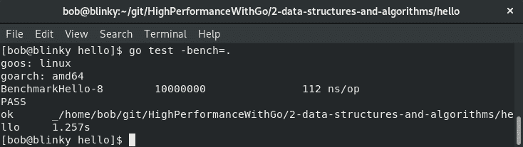

在我们的输出结果中，我们可以看到返回了一些不同的数据：

+   `GOOS` 和 `GOARCH`（在第一章的*Go 工具集*部分讨论过）

+   运行的基准测试的名称，然后是以下内容：

+   -8：用于执行测试的 `GOMAXPROCS` 的数量。

+   10000000：我们的循环运行了这么多次以收集必要的数据。

+   112 ns/op：我们测试中每次循环的速度。

+   PASS：表示我们的基准测试运行的结束状态。

+   测试的最后一行，编译测试运行的结束状态（ok），我们运行测试的路径以及测试运行的总时间。

# 真实世界的基准测试

在本书中运行基准测试时，请记住基准测试并非性能结果的全部和终极标准。基准测试既有积极的一面，也有缺点：

基准测试的积极面如下：

+   在问题变得难以控制之前就能发现潜在问题

+   帮助开发人员更深入地了解他们的代码

+   可以识别设计和数据结构以及算法阶段的潜在瓶颈

基准测试的缺点如下：

+   需要按照给定的节奏进行，才能产生有意义的结果

+   数据整理可能会很困难

+   并非总是能为手头的问题产生有意义的结果

基准测试适用于比较。在同一系统上将两个事物进行基准测试可以得到相对一致的结果。如果你有能力运行更长时间的基准测试，可能会更准确地反映函数的性能。

Go `benchstat` ([`godoc.org/golang.org/x/perf/cmd/benchstat`](https://godoc.org/golang.org/x/perf/cmd/benchstat)) 包是一个有用的实用程序，它帮助你比较两个基准测试。比较非常重要，以便推断你对函数所做的更改对系统是否产生了积极或消极的影响。你可以使用 `go get` 实用程序安装 `benchstat`：

```go
go get golang.org/x/perf/cmd/benchstat
```

考虑以下比较测试。我们将测试单个 JSON 结构的编组，其中包含三个元素，与两个包含五个元素的 JSON 数组的编组进行比较。您可以在[`github.com/bobstrecansky/HighPerformanceWithGo/tree/master/2-data-structures-and-algorithms/Benchstat-comparison`](https://github.com/bobstrecansky/HighPerformanceWithGo/tree/master/2-data-structures-and-algorithms/Benchstat-comparison)找到这些的源代码。

为了得到一个示例比较运算符，我们执行我们的基准测试，如下面的代码片段所示：

```go
[bob@testhost single]$ go test -bench=. -count 5 -cpu 1,2,4 > ~/single.txt
[bob@testhost multi]$ go test -bench=. -count 5 -cpu 1,2,4 > ~/multi.txt
[bob@testhost ~]$ benchstat -html -sort -delta single.txt multi.txt > out.html
```

这将生成一个 HTML 表格，用于验证执行时间的最大增量。如下图所示，即使对我们的数据结构和我们处理的元素数量增加了一点复杂性，也会对函数的执行时间产生相当大的变化：

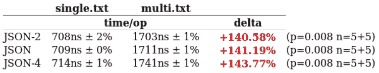

快速识别终端用户的性能痛点可以帮助您确定编写高性能软件的路径。

在下一节中，我们将看到大 O 符号是什么。

# 介绍大 O 符号

大 O 符号是一种近似算法速度的好方法，它会随着传递给算法的数据大小而改变。大 O 符号通常被描述为函数的增长行为，特别是它的上限。大 O 符号被分解为不同的类。最常见的类别是 O(1)、O(log n)、O(n)、O(n log n)、O(n²)和 O(2^n)。让我们快速看一下每个算法的定义和在 Go 中的实际示例。

这些常见类别的图表如下。生成此图的源代码可以在[`github.com/bobstrecansky/HighPerformanceWithGo/blob/master/2-data-structures-and-algorithms/plot/plot.go`](https://github.com/bobstrecansky/HighPerformanceWithGo/blob/master/2-data-structures-and-algorithms/plot/plot.go)找到：

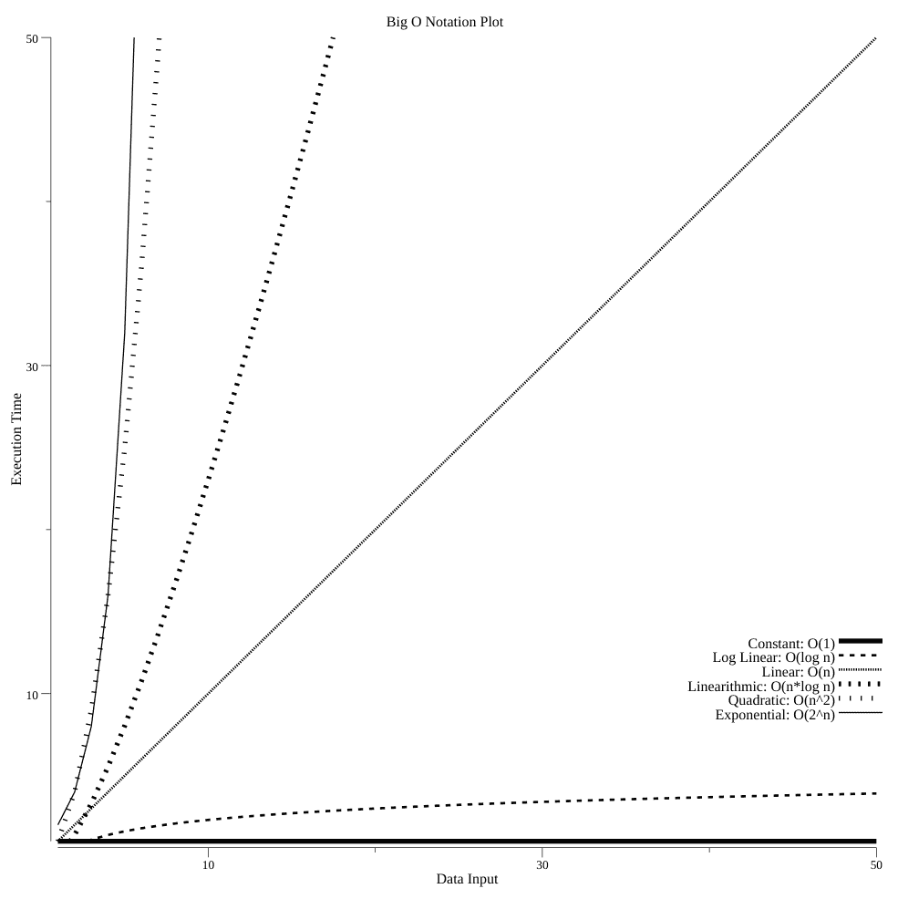

这个大 O 符号图表给我们一个常用的计算机软件中不同算法的可视化表示。

# 实际的大 O 符号示例

如果我们拿一个包含 32 个输入值的样本数据集，我们可以快速计算每个算法完成所需的时间。您会注意到下表中的完成单位时间开始迅速增长。实际的大 O 符号值如下：

| **算法** | **完成的单位时间** |
| --- | --- |
| O(1) | 1 |
| O(log n) | 5 |
| O(n) | 32 |
| O(n log n) | 160 |
| O(n²) | 1,024 |
| O(2^n) | 4,294,967,296 |

随着完成单位时间的增加，我们的代码变得不那么高效。我们应该努力使用尽可能简单的算法来解决手头的数据集。

# 数据结构操作和时间复杂度

以下图表包含一些常见的数据结构操作及其时间复杂度。正如我们之前提到的，数据结构是计算机科学性能的核心部分。在编写高性能代码时，了解不同数据结构之间的差异是很重要的。有这个表格可以帮助开发人员在考虑操作对性能的影响时选择正确的数据结构操作：

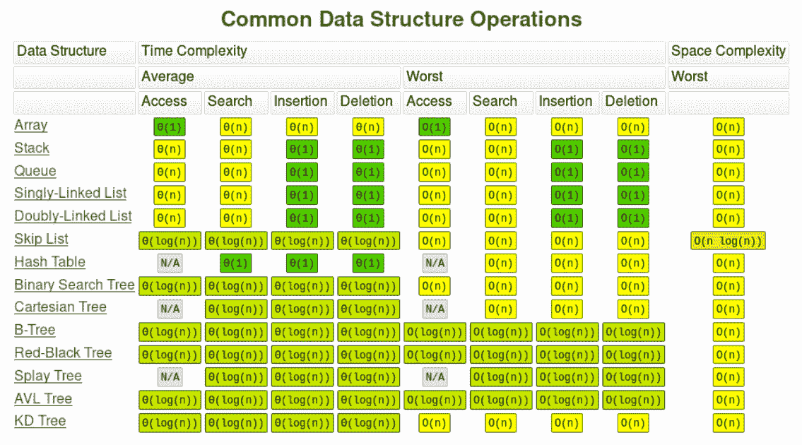

常见的数据结构操作（来自 bigocheatsheet.com）- 感谢 Eric Rowell

这个表格向我们展示了特定数据结构的时间和空间复杂度。这是一个有价值的性能参考工具。

# O(1) - 常数时间

在常数时间内编写的算法具有不依赖于算法输入大小的上限。常数时间是一个常数值的上限，因此不会比数据集的上限时间长。这种类型的算法通常可以添加到实践中的函数中——它不会给函数增加太多的处理时间。请注意这里发生的常数。单个数组查找对函数的处理时间增加了可忽略的时间量。在数组中查找成千上万个单独的值可能会增加一些开销。性能始终是相对的，重要的是要注意您为函数增加的额外负载，即使它们只执行微不足道的处理。

常数时间的例子如下：

+   访问地图或数组中的单个元素

+   确定一个数字的模

+   堆栈推送或堆栈弹出

+   推断一个整数是偶数还是奇数

在 Go 中，一个常数时间算法的例子是访问数组中的单个元素。

在 Go 中，这将被写成如下形式：

```go
package main
import "fmt"
func main() {
   words := [3]string{"foo", "bar", "baz"}
   fmt.Println(words[1]) // This references the string in position 1 in the array, "bar"
}
```

这个函数的大 O 符号是 O(1)，因为我们只需要查看`words[1]`的单个定义值，就可以找到我们要找的值，也就是`bar`。在这个例子中，随着数组大小的增长，引用数组中的对象的时间将保持恒定。该算法的标准化时间应该都是相同的，如下表所示：

| **数据集中的项目数** | **结果计算时间** |
| --- | --- |
| 10 | 1 秒 |
| 100 | 1 秒 |
| 1,000 | 1 秒 |

O(1)符号的一些示例代码如下：

```go
package oone

func ThreeWords() string {
  threewords := [3]string{"foo", "bar", "baz"}
  return threewords[1]
}

func TenWords() string {
  tenwords := [10]string{"foo", "bar", "baz", "qux", "grault", "waldo", "plugh", "xyzzy", "thud", "spam"}
  return tenwords[6]
}
```

无论数组中有多少项，查找一个元素的时间都是相同的。在下面的示例输出中，我们分别有三个元素和十个元素的数组。它们都花费了相同的时间来执行，并在规定的时间范围内完成了相同数量的测试迭代。这可以在下面的截图中看到：

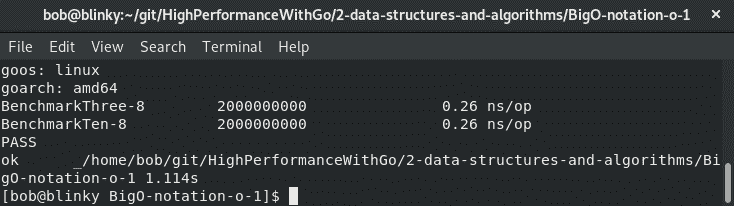

这个基准测试的表现与我们的预期一样。`BenchmarkThree`和`BenchmarkTen`基准测试都花费了 0.26 ns/op，这应该在数组查找中保持一致。

# O(log n) - 对数时间

对数增长通常表示为调和级数的部分和。可以表示如下：

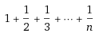

在对数时间内编写的算法具有随着输入大小减少而趋于零的操作数量。当必须访问数组中的所有元素时，不能在算法中使用 O(log n)算法。当 O(log n)单独使用时，通常被认为是一种高效的算法。关于对数时间性能的一个重要概念是，搜索算法通常与排序算法一起使用，这增加了找到解决方案的复杂性。根据数据集的大小和复杂性，通常在执行搜索算法之前对数据进行排序是有意义的。请注意此测试的输入和输出范围——额外的测试被添加以显示数据集的结果计算时间的对数增长。

一些对数时间算法的例子如下：

+   二分查找

+   字典搜索

下表显示了对数时间的标准化时间：

| **数据集中的项目数** | **结果计算时间** |
| --- | --- |
| 10 | 1 秒 |
| 100 | 2 秒 |
| 1,000 | 3 秒 |

Go 的标准库有一个名为`sort.Search()`的函数。以下代码片段中已包含了它以供参考：

```go
func Search(n int, f func(int) bool) int {
  // Define f(-1) == false and f(n) == true.
  // Invariant: f(i-1) == false, f(j) == true.
  i, j := 0, n
  for i < j {
    h := int(uint(i+j) >> 1) // avoid overflow when computing h
    // i ≤ h < j
    if !f(h) {
      i = h + 1 // preserves f(i-1) == false
    } else {
      j = h // preserves f(j) == true
    }
  }
  // i == j, f(i-1) == false, and f(j) (= f(i)) == true => answer is i.
  return i
}
```

这个代码示例可以在标准库中找到[`golang.org/src/sort/search.go`](https://golang.org/src/sort/search.go)。O(log n)函数的代码和基准可以在[`github.com/bobstrecansky/HighPerformanceWithGo/tree/master/2-data-structures-and-algorithms/BigO-notation-o-logn`](https://github.com/bobstrecansky/HighPerformanceWithGo/tree/master/2-data-structures-and-algorithms/BigO-notation-o-logn)找到。

以下截图显示了对数时间基准：

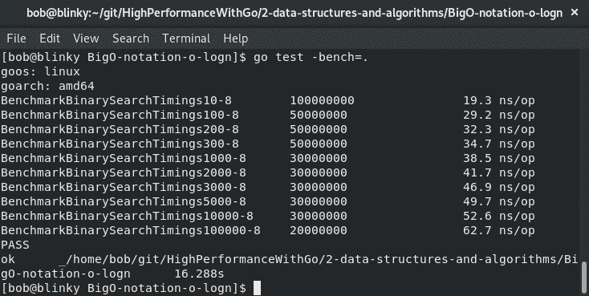

这个测试显示了基于我们设置的输入的对数增长的时间。具有对数时间响应的算法在编写高性能代码方面非常有帮助。

# O(n) – 线性时间

以线性时间编写的算法与其数据集的大小成线性比例。线性时间是当整个数据集需要按顺序读取时的最佳时间复杂度。算法在线性时间内花费的时间量与数据集中包含的项目数量呈 1:1 的关系。

一些线性时间的例子如下：

+   简单循环

+   线性搜索

线性时间的标准化时间可以在以下表中找到：

| **数据集中的项目数量** | **结果计算时间** |
| --- | --- |
| 10 | 10 秒 |
| 100 | 100 秒 |
| 1,000 | 1,000 秒 |

请注意，结果计算时间呈线性增长，并与我们的数据集中找到的项目数量相关（参见以下截图）。O(n)函数的代码和基准可以在[`github.com/bobstrecansky/HighPerformanceWithGo/tree/master/2-data-structures-and-algorithms/BigO-notation-o-n`](https://github.com/bobstrecansky/HighPerformanceWithGo/tree/master/2-data-structures-and-algorithms/BigO-notation-o-n)找到：

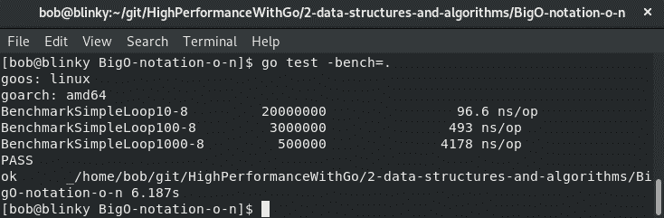

一个重要的要点是，大 O 符号并不一定是响应时间增长的完美指标；它只表示一个上限。在审查这个基准时，要注意计算时间随数据集中项目数量的线性增长。O(n)算法通常不是计算机科学中性能的主要瓶颈。计算机科学家经常在迭代器上执行循环，这是一个常用的模式，用于完成计算工作。确保你始终注意你的数据集的大小！

# O(n log n) – 准线性时间

在 Go 中，通常使用准线性（或对数线性）时间编写的算法来对数组中的值进行排序。

一些准线性时间的例子如下：

+   Quicksort 的平均情况时间复杂度

+   Mergesort 的平均情况时间复杂度

+   Heapsort 的平均情况时间复杂度

+   Timsort 的平均情况时间复杂度

准线性时间的标准化时间可以在以下表中找到：

| **数据集中的项目数量** | **结果计算时间** |
| --- | --- |
| 10 | 10 秒 |
| 100 | 200 秒 |
| 1,000 | 3,000 秒 |

你会在这里看到一个熟悉的模式。这个算法遵循了与 O(log n)算法类似的模式。这里唯一改变的是 n 的乘数，所以我们可以看到类似的结果与一个缩放因子（参见以下截图）。O(n log n)函数的代码和基准可以在[`github.com/bobstrecansky/HighPerformanceWithGo/tree/master/2-data-structures-and-algorithms/BigO-notation-o-nlogn`](https://github.com/bobstrecansky/HighPerformanceWithGo/tree/master/2-data-structures-and-algorithms/BigO-notation-o-nlogn)找到：

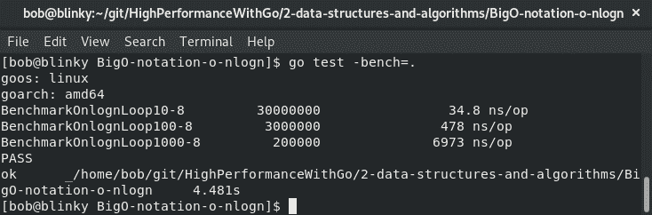

排序算法仍然相当快，并不是性能不佳代码的关键。通常，语言中使用的排序算法使用基于大小的多种排序算法的混合。Go 的`quickSort`算法，在`sort.Sort()`中使用，如果切片包含少于 12 个元素，则使用`ShellSort`和`insertionSort`。`quickSort`的标准库算法如下：

```go
func quickSort(data Interface, a, b, maxDepth int) {
  for b-a > 12 { // Use ShellSort for slices <= 12 elements
    if maxDepth == 0 {
      heapSort(data, a, b)
      return
    }
    maxDepth--
    mlo, mhi := doPivot(data, a, b)
    // Avoiding recursion on the larger subproblem guarantees
    // a stack depth of at most lg(b-a).
    if mlo-a < b-mhi {
      quickSort(data, a, mlo, maxDepth)
      a = mhi // i.e., quickSort(data, mhi, b)
    } else {
      quickSort(data, mhi, b, maxDepth)
      b = mlo // i.e., quickSort(data, a, mlo)
    }
  }
  if b-a > 1 {
    // Do ShellSort pass with gap 6
    // It could be written in this simplified form cause b-a <= 12
    for i := a + 6; i < b; i++ {
      if data.Less(i, i-6) {
        data.Swap(i, i-6)
      }
    }
    insertionSort(data, a, b)
  }
}
```

前面的代码可以在标准库中找到[`golang.org/src/sort/sort.go#L183`](https://golang.org/src/sort/sort.go#L183)。这个`quickSort`算法性能良好，并且在 Go 生态系统中经常使用。

# O(n2) – 二次时间

用二次时间编写的算法的执行时间与输入大小的平方成正比。嵌套循环是常见的二次时间算法，这带来了排序算法。

二次时间的一些例子如下：

+   冒泡排序

+   插入排序

+   选择排序

二次时间的标准化时间可以在下表中找到：

| **数据集中的项目数量** | **计算时间** |
| --- | --- |
| 10 | 100 秒 |
| 100 | 10,000 秒 |
| 1,000 | 1,000,000 秒 |

您会注意到从这个表中，随着输入增加了 10 倍，计算时间呈二次增长。

如果可能的话，应该避免二次时间算法。如果需要嵌套循环或二次计算，请确保验证您的输入并尝试限制输入大小。

可以在[`github.com/bobstrecansky/HighPerformanceWithGo/tree/master/2-data-structures-and-algorithms/BigO-notation-o-n2`](https://github.com/bobstrecansky/HighPerformanceWithGo/tree/master/2-data-structures-and-algorithms/BigO-notation-o-n2)找到 O(n²)函数的代码和基准测试。以下是运行此基准测试的输出：

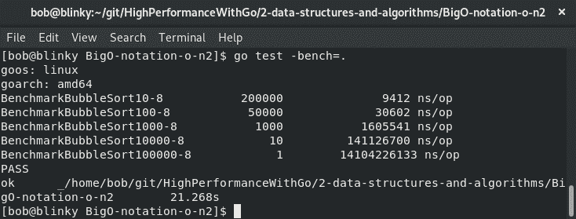

二次时间算法的计时非常迅速增加。我们可以通过自己的基准测试看到这一点。

# O(2n) – 指数时间

当数据添加到输入集时，指数算法呈指数增长。通常在没有输入数据集的倾向时使用，必须尝试输入集的每种可能的组合。

指数时间的一些例子如下：

+   斐波那契数列的递归实现不佳

+   汉诺塔

+   旅行推销员问题

指数时间的标准化时间可以在下表中找到：

| **数据集中的项目数量** | **计算时间** |
| --- | --- |
| 10 | 1,024 秒 |
| 100 | 1.267 * 10³⁰秒 |
| 1,000 | 1.07 * 10³⁰¹秒 |

随着数据集中项目数量的增加，计算时间呈指数增长。

指数时间算法应该只在非常狭窄的数据集范围内的紧急情况下使用。通常，澄清您的潜在问题或数据集进一步可以帮助您避免使用指数时间算法。

可以在[`github.com/bobstrecansky/HighPerformanceWithGo/tree/master/2-data-structures-and-algorithms/BigO-notation-o-n2`](https://github.com/bobstrecansky/HighPerformanceWithGo/tree/master/2-data-structures-and-algorithms/BigO-notation-o-n2)找到 O(n²)算法的代码。可以在以下截图中看到此基准测试的一些示例输出：

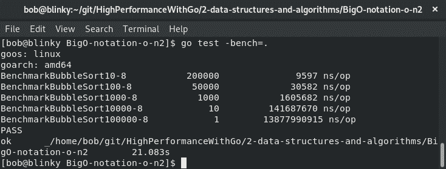

指数时间算法问题通常可以分解为更小、更易消化的部分。这也可以进行优化。

在下一节中，我们将看看排序算法。

# 了解排序算法

排序算法用于获取数据集中的各个元素并按特定顺序排列它们。通常，排序算法会获取数据集并将其按字典顺序或数字顺序排列。能够高效地进行排序对于编写高性能代码很重要，因为许多搜索算法需要排序的数据集。常见的数据结构操作可以在以下图表中看到：

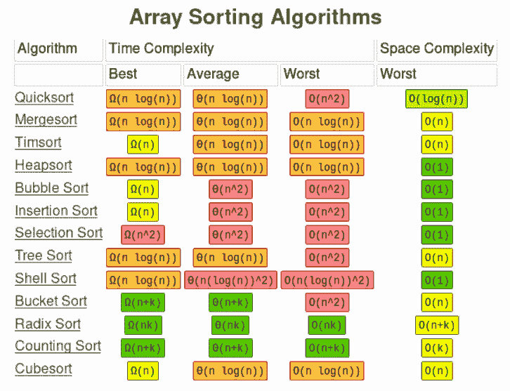

常见数据结构操作（来自 bigocheatsheet.com）- 感谢 Eric Rowell

正如你所看到的，数组排序算法的大 O 符号表示可以有很大的不同。在为无序列表选择正确的排序算法时，这对于提供优化的解决方案非常重要。

# 插入排序

插入排序是一种排序算法，它一次构建一个数组项，直到结果为排序数组。它并不是非常高效，但它有一个简单的实现，并且对于非常小的数据集来说很快。数组是原地排序的，这也有助于减少函数调用的内存占用。

这个标准库中的`insertionSort`算法可以在下面的代码片段中找到。我们可以使用下面的代码片段来推断插入排序是一个 O(n²)算法的平均情况。这是因为我们要遍历一个二维数组并操作数据：

```go
func insertionSort(data Interface, a, b int) {
  for i := a + 1; i < b; i++ {
    for j := i; j > a && data.Less(j, j-1); j-- {
      data.Swap(j, j-1)
    }
  }
}
```

这段代码可以在标准库中找到[`golang.org/src/sort/sort.go#L183`](https://golang.org/src/sort/sort.go#L24)。简单的插入排序通常对小数据集很有价值，因为它非常容易阅读和理解。当编写高性能代码时，简单性往往比其他一切都更重要。

# 堆排序

Go 语言在标准库中内置了`heapSort`，如下面的代码片段所示。这段代码片段帮助我们理解`heapSort`是一个 O(n log n)的排序算法。这比我们之前的插入排序示例要好，因此对于更大的数据集，使用我们的堆排序算法时，我们将拥有更高性能的代码：

```go
func heapSort(data Interface, a, b int) {
  first := a
  lo := 0
  hi := b - a
  // Build heap with greatest element at top.
  for i := (hi - 1) / 2; i >= 0; i-- {
    siftDown(data, i, hi, first)
  }
  // Pop elements, largest first, into end of data.
  for i := hi - 1; i >= 0; i-- {
    data.Swap(first, first+i)
    siftDown(data, lo, i, first)
  }
}
```

这段代码可以在标准库中找到[`golang.org/src/sort/sort.go#L53`](https://golang.org/src/sort/sort.go#L53)。当我们的数据集变得更大时，开始使用高效的排序算法如`heapSort`是很重要的。

# 归并排序

归并排序是一种平均时间复杂度为 O(n log n)的排序算法。如果算法的目标是产生稳定的排序，通常会使用`MergeSort`。稳定的排序确保输入数组中具有相同键的两个对象在结果数组中以相同的顺序出现。如果我们想要确保键-值对在数组中有序，稳定性就很重要。Go 标准库中可以找到稳定排序的实现。下面的代码片段中可以看到：

```go
func stable(data Interface, n int) {
  blockSize := 20 // must be > 0
  a, b := 0, blockSize
  for b <= n {
    insertionSort(data, a, b)
    a = b
    b += blockSize
  }

  insertionSort(data, a, n)
  for blockSize < n {
    a, b = 0, 2*blockSize
    for b <= n {
      symMerge(data, a, a+blockSize, b)
      a = b
      b += 2 * blockSize
    }

    if m := a + blockSize; m < n {
      symMerge(data, a, m, n)
    }
    blockSize *= 2
  }
}
```

这段代码可以在标准库中找到[`golang.org/src/sort/sort.go#L356`](https://golang.org/src/sort/sort.go#L356)。当需要保持顺序时，稳定的排序算法非常重要。

# 快速排序

Go 标准库中有一个快速排序算法，正如我们在*O(n log n) – quasilinear time*部分中看到的。快速排序最初在 Unix 中作为标准库中的默认排序例程实现。从那时起，它被构建并用作 C 编程语言中的 qsort。由于它的熟悉度和悠久的历史，它通常被用作今天许多计算机科学问题中的排序算法。使用我们的算法表，我们可以推断`quickSort`算法的标准实现具有 O(n log n)的平均时间复杂度。它还具有使用最坏情况下 O(log n)的空间复杂度的额外好处，使其非常适合原地移动。

现在我们已经完成了排序算法，我们将转向搜索算法。

# 理解搜索算法

搜索算法通常用于从数据集中检索元素或检查该元素是否存在。搜索算法通常分为两个独立的类别：线性搜索和区间搜索。

# 线性搜索

在线性搜索算法中，当顺序遍历切片或数组时，会检查切片或数组中的每个元素。这个算法并不是最高效的算法，因为它的复杂度为 O(n)，因为它可以遍历列表中的每个元素。

线性搜索算法可以简单地写成对切片的迭代，如下面的代码片段所示：

```go
func LinearSearch(data []int, searchVal int) bool { 
for _, key := range data {
       if key == searchVal {
           return true
       }
   }
   return false
}
```

这个函数告诉我们，随着数据集的增大，它会很快变得昂贵。对于包含 10 个元素的数据集，这个算法不会花费太长时间，因为它最多只会迭代 10 个值。如果我们的数据集包含 100 万个元素，这个函数将需要更长的时间才能返回一个值。

# 二分搜索

一个更常用的模式（也是您最有可能想要用于高性能搜索算法的模式）称为二分搜索。二分搜索算法的实现可以在 Go 标准库中找到[`golang.org/src/sort/search.go`](https://golang.org/src/sort/search.go)，并且在本章前面的排序搜索函数中显示过。与我们之前编写的线性搜索函数的 O(n)复杂度相比，二分搜索树具有 O(log n)的搜索复杂度。二分搜索往往经常被使用，特别是当需要搜索的数据集达到任何合理大小时。二分搜索也很聪明地早早实现 - 如果您的数据集增长而您不知情，至少所使用的算法不会增加复杂性。在下面的代码中，我们使用了`SearchInts`便利包装器来进行 Go 搜索函数。这允许我们使用二分搜索迭代整数数组：

```go
package main

import (
    "fmt"
    "sort"
)

func main() {
    intArray := []int{0, 2, 3, 5, 11, 16, 34}
    searchNumber := 34
    sorted := sort.SearchInts(intArray, searchNumber)
    if sorted < len(intArray) {
        fmt.Printf("Found element %d at array position %d\n", searchNumber, sorted)
    } else {
        fmt.Printf("Element %d not found in array %v\n", searchNumber, intArray)
    }
}
```

这个函数的输出如下：

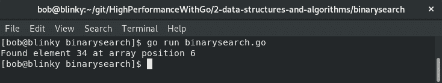

这告诉我们，二分搜索库能够在我们搜索的数组（`intArray`）中找到我们正在搜索的数字（`34`）。它在数组中的第 6 个位置找到了整数 34（这是正确的；数组是从 0 开始索引的）。

接下来的部分涉及另一个数据结构：树。

# 探索树

树是一种非线性数据结构，用于存储信息。它通常用于存储维护关系的数据，特别是如果这些关系形成层次结构。树也很容易搜索（*理解排序算法*部分的数组排序算法图表向我们展示了许多树的操作具有 O(log n)的时间复杂度）。对于许多问题，树是最佳解决方案，因为它们引用分层数据。树是由不形成循环的节点组合而成。

每棵树都由称为节点的元素组成。我们从根节点开始（下面的二叉树图中标有根的黄色框）。在每个节点中有一个左引用指针和一个右引用指针（在我们的例子中是数字 2 和 7），以及一个数据元素（在本例中是数字 1）。随着树的增长，节点的深度（从根到给定节点的边的数量）增加。在这个图中，节点 4、5、6 和 7 的深度都是 3。节点的高度是从节点到树中最深的叶子的边的数量（如下面二叉树图中的高度 4 框所示）。整个树的高度等于根节点的高度。

# 二叉树

二叉树是计算机科学中重要的数据结构。它们经常用于搜索、优先队列和数据库。它们是高效的，因为它们易于以并发方式遍历。Go 语言具有出色的并发原语（我们将在第三章中讨论，*理解并发*），可以让我们以简单的方式做到这一点。能够使用 goroutines 和通道来遍历二叉树可以帮助加快我们遍历分层数据的速度。平衡的二叉树可以在下图中看到：

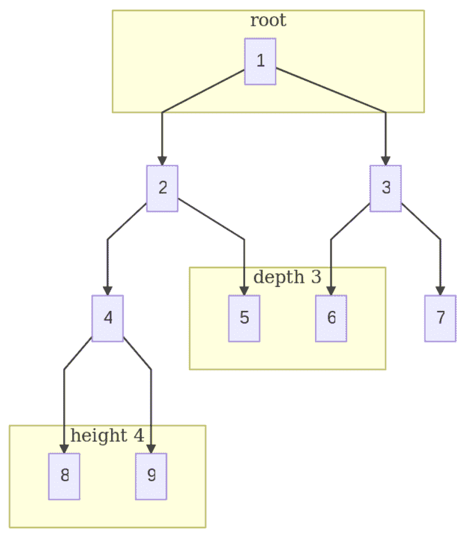

以下是一些特殊的二叉树：

+   **满二叉树**：除了叶子节点外，每个节点都有 2 个子节点。

+   **完全二叉树**：一棵完全填充的树，除了底层之外。底层必须从左到右填充。

+   **完美二叉树**：一个完全二叉树，其中所有节点都有两个子节点，树的所有叶子都在同一层。

# 双向链表

双向链表也是 Go 标准库的一部分。这是一个相对较大的包，因此为了方便起见，可以在以下代码片段中找到此包的函数签名：

```go
func (e *Element) Next() *Element {
func (e *Element) Prev() *Element {
func (l *List) Init() *List {
func New() *List { return new(List).Init() }
func (l *List) Len() int { return l.len }
func (l *List) Front() *Element {
func (l *List) Back() *Element {
func (l *List) lazyInit() {
func (l *List) insert(e, at *Element) *Element {
func (l *List) insertValue(v interface{}, at *Element) *Element {
func (l *List) remove(e *Element) *Element {
func (l *List) move(e, at *Element) *Element {
func (l *List) Remove(e *Element) interface{} {
func (l *List) PushFront(v interface{}) *Element {
func (l *List) PushBack(v interface{}) *Element {
func (l *List) InsertBefore(v interface{}, mark *Element) *Element {
func (l *List) InsertAfter(v interface{}, mark *Element) *Element {
func (l *List) MoveToFront(e *Element) {
func (l *List) MoveToBack(e *Element) {
func (l *List) MoveBefore(e, mark *Element) {
func (l *List) MoveAfter(e, mark *Element) {
func (l *List) PushBackList(other *List) {
func (l *List) PushFrontList(other *List) {
```

这些函数签名（以及它们对应的方法）可以在 Go 标准库中找到，网址为[`golang.org/src/container/list/list.go`](https://golang.org/src/container/list/list.go)。

最后，我们将看一下队列。

# 探索队列

队列是计算机科学中经常用来实现**先进先出**（**FIFO**）数据缓冲区的模式。进入队列的第一件事也是离开的第一件事。这是以有序的方式进行的，以处理排序数据。将事物添加到队列中称为将数据入队列，从队列末尾移除称为出队列。队列通常用作存储数据并在另一个时间进行处理的固定装置。

队列的好处在于它们没有固定的容量。新元素可以随时添加到队列中，这使得队列成为异步实现的理想解决方案，例如键盘缓冲区或打印机队列。队列用于必须按接收顺序完成任务的情况，但在实时发生时，可能基于外部因素而不可能完成。

# 常见的排队函数

非常频繁地，其他小的排队操作被添加，以使队列更有用：

+   `isfull()`通常用于检查队列是否已满。

+   `isempty()`通常用于检查队列是否为空。

+   `peek()`检索准备出队的元素，但不出队。

这些函数很有用，因为正常的入队操作如下：

1.  检查队列是否已满，如果队列已满则返回错误

1.  递增后指针；返回下一个空位

1.  将数据元素添加到后指针指向的位置

完成这些步骤后，我们可以将下一个项目入队到我们的队列中。

出队也和以下操作一样简单：

1.  检查队列是否为空，如果队列为空则返回错误

1.  访问队列前端的数据

1.  将前指针递增到下一个可用元素

完成这些步骤后，我们已经从队列中出队了这个项目。

# 常见的排队模式

拥有优化的排队机制对于编写高性能的 Go 代码非常有帮助。能够将非关键任务推送到队列中，可以让您更快地完成关键任务。另一个要考虑的问题是，您使用的排队机制不一定非得是 Go 队列。您可以将数据推送到外部机制，如 Kafka ([`kafka.apache.org/`](https://kafka.apache.org/))或 RabbitMQ ([`www.rabbitmq.com/`](https://www.rabbitmq.com/))在分布式系统中。管理自己的消息队列可能会变得非常昂贵，因此在今天，拥有单独的消息排队系统是司空见惯的。当我们研究集群和作业排队时，我们将在第十四章 *集群和作业队列*中更详细地介绍这一点。

# 总结

在本章中，我们学习了如何对 Go 程序进行基准测试。我们了解了如何根据 Big O 符号的考虑来设计对问题集具有影响力的数据结构和算法。我们还学习了搜索和排序算法、树和队列，以使我们的数据结构和算法对手头的问题具有最大的影响力。

在第三章中，*理解并发*，我们将学习一些最重要的 Go 构造，并了解它们如何影响性能。闭包、通道和 goroutines 可以帮助我们在并行性和并发性方面做出一些强大的设计决策。
