# 第三章：理解并发

迭代器和生成器对于 Go 至关重要。在 Go 中使用通道和 goroutine 进行并行和并发是 Go 中的惯用法，也是编写高性能、可读性强的代码的最佳方式之一。我们首先将讨论一些基本的 Go 构造，以便能够理解如何在 Go 的上下文中使用迭代器和生成器，然后深入探讨语言中可用的迭代器和生成器的构造。

在本章中，我们将涵盖以下主题：

+   闭包

+   Goroutines

+   通道

+   信号量

+   WaitGroups

+   迭代器

+   生成器

能够理解 Go 语言的基本构造以及何时何地使用适当的迭代器和生成器对于编写高性能的 Go 语言至关重要。

# 理解闭包

Go 语言最重要的部分之一是它是一种支持头等函数的语言。头等函数是具有作为变量传递给其他函数的能力的函数。它们也可以从其他函数返回。这一点很重要，因为我们可以将它们用作闭包。

闭包很有帮助，因为它们是保持代码 DRY 的好方法，同时有助于隔离数据。到目前为止，保持数据集小是本书的核心原则，这在本章（以及任何后续章节）中都没有改变。能够隔离希望操作的数据可以帮助您继续编写高性能的代码。

闭包保持局部作用域，并访问外部函数的作用域和参数，以及全局变量。闭包是引用其主体外部的变量的函数。这些函数有能力为引用的变量分配值并访问这些值，因此我们可以在函数之间传递闭包。

# 匿名函数

理解 Go 中的闭包的第一步是理解匿名函数。使用变量创建匿名函数。它们也是没有名称或标识符的函数，因此称为*匿名函数*。

将`Hello Go`打印到屏幕的普通函数调用将是以下代码块中显示的内容：

```go
func HelloGo(){
  fmt.Println("Hello Go")
}
```

接下来，我们可以调用`HelloGo()`，函数将打印`Hello Go`字符串。

如果我们想将`HelloGo()`函数实例化为匿名函数，我们将在以下代码块中引用它：

```go
// Note the trailing () for this anonymous function invocation
func() { 
    fmt.Println("Hello Go")
}()
```

我们之前的匿名函数和`HelloGo()`函数在词法上是相似的。

我们还可以将函数存储为变量以供以后使用，如下面的代码块所示：

```go
    fmt.Println("Hello Go from an Anonymous Function Assigned to a Variable")
}
```

这三个东西——`HelloGo()`函数、我们之前定义的匿名函数和分配给`hello`变量的函数——在词法上是相似的。

在我们分配了这个`hello`变量之后，我们可以通过简单调用`hello()`来调用这个函数，我们之前定义的匿名函数将被调用，并且`Hello Go`将以与之前调用的匿名函数相同的方式打印到屏幕上。

我们可以在以下代码块中看到这些每个是如何工作的：

```go
package main

import "fmt"

func helloGo() {
    fmt.Println("Hello Go from a Function")

} 

func main() {   
    helloGo() 
    func() { fmt.Println("Hello Go from an Anonymous Function") }()
    var hello func() = func() { fmt.Println("Hello Go from an Anonymous Function Variable") }
    hello()
} 
```

此程序的输出显示了三个相似的打印语句，略有不同的打印以显示它们如何在以下截图中返回：

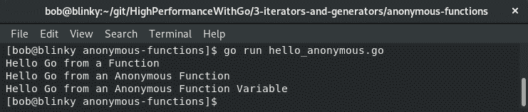

匿名函数是 Go 语言的一个强大方面。随着我们继续本章，我们将看到如何在它们的基础上构建一些非常有用的东西。

# 关于闭包的匿名函数

此时，您可能想知道为什么具有匿名函数以及它们与闭包有关是明智的。一旦我们有了匿名函数，我们就可以利用闭包来引用在其自身定义之外声明的变量。我们可以在接下来的代码块中看到这一点：

```go
package main 
import "fmt" 
func incrementCounter() func() int {
 var initializedNumber = 0
 return func() int {
 initializedNumber++
 return initializedNumber
 } 
} 

func main() {
 n1 := incrementCounter() 
 fmt.Println("n1 increment counter #1: ", n1()) // First invocation of n1
 fmt.Println("n1 increment counter #2: ", n1()) // Notice the second invocation; n1 is called twice, so n1 == 2
 n2 := incrementCounter() // New instance of initializedNumber
 fmt.Println("n2 increment counter #1: ", n2()) // n2 is only called once, so n2 == 1
 fmt.Println("n1 increment counter #3: ", n1()) // state of n1 is not changed with the n2 calls
}
```

当我们执行此代码时，我们将收到以下结果输出：

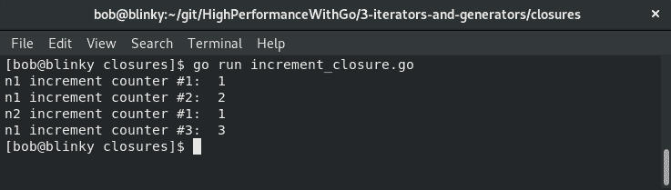

在这个代码示例中，我们可以看到闭包如何帮助数据隔离。`n1`变量使用`incrementCounter()`函数进行初始化。这个匿名函数将`initializedNumber`设置为`0`，并返回一个增加的`initializedNumber`变量的计数。

当我们创建`n2`变量时，同样的过程再次发生。调用一个新的`incrementCounter`匿名函数，并返回一个新的`initializedNumber`变量。在我们的主函数中，我们可以注意到`n1`和`n2`有单独的维护状态。我们可以看到，即使在第三次调用`n1()`函数之后。能够在函数调用之间保持这些数据，同时还将数据与另一个调用隔离开来，这是匿名函数的一个强大部分。

# 用于嵌套和延迟工作的闭包

闭包也经常用于嵌套和延迟工作。在下面的例子中，我们可以看到一个函数闭包，它允许我们嵌套工作：

```go
package main
import (
 "fmt"
 "sort"
) 

func main() {
 input := []string{"foo", "bar", "baz"}
 var result []string
 // closure callback
 func() {
 result = append(input, "abc") // Append to the array
 result = append(result, "def") // Append to the array again
 sort.Sort(sort.StringSlice(result)) // Sort the larger array
 }() 
 fmt.Print(result)
}
```

在这个例子中，我们可以看到我们两次向字符串切片添加内容并对结果进行排序。我们稍后将看到如何将匿名函数嵌套在 goroutine 中以帮助提高性能。

# 使用闭包的 HTTP 处理程序

闭包在 Go 的 HTTP 调用中也经常用作中间件。您可以将普通的 HTTP 函数调用包装在闭包中，以便在需要时为调用添加额外的信息，并为不同的函数重用中间件。

在我们的示例中，我们将设置一个具有四个独立路由的 HTTP 服务器：

+   `/`：这提供以下内容：

+   一个带有 HTTP 418 状态码的 HTTP 响应（来自`newStatusCode`中间件）。

+   一个`Foo:Bar`头部（来自`addHeader`中间件）。

+   一个`Hello PerfGo!`的响应（来自`writeResponse`中间件）。

+   `/onlyHeader`：提供只添加`Foo:Bar`头部的 HTTP 响应。

+   `/onlyStatus`：只提供状态码更改的 HTTP 响应。

+   `/admin`：检查用户`admin`头部是否存在。如果存在，它会打印管理员门户信息以及所有相关的普通值。如果不存在，它会返回未经授权的响应。

这些示例已经被使用，因为它们易于理解。在 Go 中使用闭包处理 HTTP 处理程序也很方便，因为它们可以做到以下几点：

+   将数据库信息与数据库调用隔离开来

+   执行授权请求

+   用隔离的数据（例如时间信息）包装其他函数

+   与其他第三方服务透明地通信，并具有可接受的超时时间

位于[[`golang.org/doc/articles/wiki/`](https://golang.org/doc/articles/wiki/)]的 Go *编写 Web 应用程序*文档提供了一堆其他设置模板的主要示例，能够实时编辑页面，验证用户输入等。让我们来看看我们的示例代码，展示了在以下代码块中 HTTP 处理程序中的闭包。首先，我们初始化我们的包并创建一个`adminCheck`函数，它帮助我们确定用户是否被授权使用系统：

```go
package main

import (
 "fmt"
 "net/http"
) 

// Checks for a "user:admin" header, proper credentials for the admin path
func adminCheck(h http.Handler) http.HandlerFunc {
 return http.HandlerFunc(func(w http.ResponseWriter, r *http.Request) {
 if r.Header.Get("user") != "admin" {
 http.Error(w, "Not Authorized", 401)
 return
 }
 fmt.Fprintln(w, "Admin Portal")
 h.ServeHTTP(w, r)
 }) 
} 
```

接下来，我们设置了一些其他示例，比如提供一个 HTTP 418（`I'm a teapot`状态码）并添加一个`foo:bar`的 HTTP 头部，并设置特定的 HTTP 响应：

```go
// Sets a HTTP 418 (I'm a Teapot) status code for the response
func newStatusCode(h http.Handler) http.HandlerFunc {
 return http.HandlerFunc(func(w http.ResponseWriter, r *http.Request) {
 w.WriteHeader(http.StatusTeapot)
 h.ServeHTTP(w, r)
 })
}

// Adds a header, Foo:Bar
func addHeader(h http.Handler) http.HandlerFunc {
 return http.HandlerFunc(func(w http.ResponseWriter, r *http.Request) {
 w.Header().Add("Foo", "Bar")
 h.ServeHTTP(w, r)
 })
}

// Writes a HTTP Response
func writeResponse(w http.ResponseWriter, r *http.Request) {
 fmt.Fprintln(w, "Hello PerfGo!")
} 
```

最后，我们用一个 HTTP 处理程序将所有内容包装在一起：

```go
// Wrap the middleware together
func main() {
 handler := http.HandlerFunc(writeResponse)
 http.Handle("/", addHeader(newStatusCode(handler)))
 http.Handle("/onlyHeader", addHeader(handler)) 
 http.Handle("/onlyStatus", newStatusCode(handler))
 http.Handle("/admin", adminCheck(handler))
 http.ListenAndServe(":1234", nil)
}
```

我们的路由器测试示例如下。这是修改头部和 HTTP 状态码的输出：

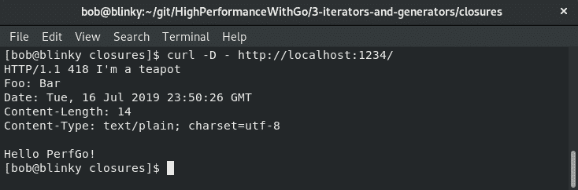

这是仅修改头部的输出：

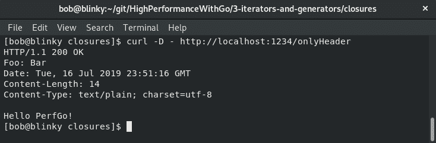

这是仅修改状态的输出：

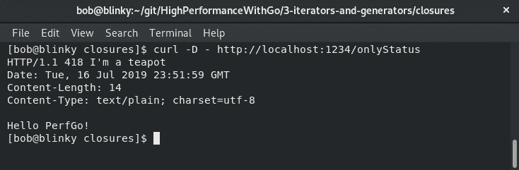

这是未经授权的管理员输出：

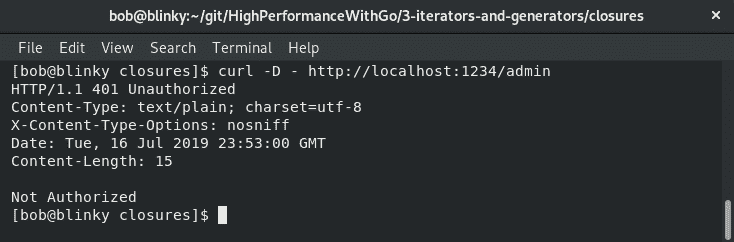

这是授权的管理员输出：

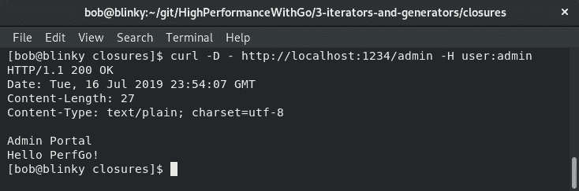

能够使用匿名函数添加中间件可以帮助快速迭代，同时保持代码复杂性低。在下一节中，我们将探讨 goroutines。

# 探索 goroutines

Go 是一种以并发为设计目标的语言。并发是执行独立进程的能力。Goroutines 是 Go 中的一种构造，可以帮助处理并发。它们通常被称为“轻量级线程”，原因是充分的。在其他语言中，线程由操作系统处理。这反过来使用了更大尺寸的调用堆栈，并且通常使用给定内存堆栈大小的并发较少。Goroutines 是在 Go 运行时内并发运行的函数或方法，不连接到底层操作系统。Go 语言内的调度器管理 goroutines 的生命周期。系统的调度器也有很多开销，因此限制正在使用的线程数量可以帮助提高性能。

# Go 调度器

Go 运行时调度器通过几个不同的部分来管理 goroutine 的生命周期。Go 调度器在其第二次迭代中进行了更改，这是根据 Dmitry Vyukov 撰写的设计文档而得出的，该文档于 Go 1.1 中发布。在这份设计文档中，Vyukov 讨论了最初的 Go 调度器以及如何实现工作共享和工作窃取调度器，这是由 MIT 的 Robert D. Blumofe 博士和 Charles E. Leiserson 博士在一篇名为《通过工作窃取进行多线程计算的调度》的论文中最初提出的。这篇论文背后的基本概念是确保动态的、多线程的计算，以确保处理器被有效利用同时保持内存需求。

Goroutines 在初始时只有 2KB 的堆栈大小。这是为什么 goroutines 被用于大量并发编程的原因之一——因为在一个程序中拥有数万甚至数十万个 goroutines 要容易得多。其他语言中的线程可能占用数兆字节的空间，使它们不太灵活。如果需要更多内存，Go 的函数可以在可用内存空间的其他位置分配更多内存，以帮助 goroutine 的空间增长。默认情况下，运行时会给新的堆栈分配两倍的内存。

Goroutines 只有在系统调用时才会阻塞运行的线程。当这种情况发生时，运行时会从调度器结构中取出另一个线程。这些线程用于等待执行的其他 goroutines。

工作共享是一个过程，其中调度器将新线程迁移到其他处理器以进行工作分配。工作窃取执行类似的操作，但是未被充分利用的处理器从其他处理器窃取线程。在 Go 中遵循工作窃取模式有助于使 Go 调度器更加高效，并且反过来为在内核调度器上运行的 goroutines 提供更高的吞吐量。最后，Go 的调度器实现了自旋线程。自旋线程将利用额外的 CPU 周期而不是抢占线程。线程以三种不同的方式自旋：

+   当一个线程没有附加到处理器时。

+   当使一个 goroutine 准备好时，会将一个 OS 线程解除阻塞到一个空闲的处理器上。

+   当一个线程正在运行但没有 goroutines 附加到它时。这个空闲线程将继续搜索可运行的 goroutines 来执行。

# Go 调度器 goroutine 内部

Go 调度器有三个关键结构来处理 goroutines 的工作负载：M 结构、P 结构和 G 结构。这三个结构共同工作，以高效的方式处理 goroutines。让我们更深入地看看每一个。如果你想查看这些的源代码，可以在[`github.com/golang/go/blob/master/src/runtime/runtime2.go/`](https://github.com/golang/go/blob/master/src/runtime/runtime2.go/)找到。

# M 结构

M 结构标记为**M**代表**机器**。M 结构是 OS 线程的表示。它包含一个指针，指向可运行的 goroutine 全局队列（由 P 结构定义）。M 从 P 结构中检索其工作。M 包含准备执行的空闲和等待的 goroutine。一些值得注意的 M 结构参数如下：

+   包含调度堆栈的 goroutine（go）

+   **线程本地存储**（**tls**）

+   用于执行 Go 代码的 P 结构（p）

# P 结构

这个结构标记为**P**代表**处理器**。P 结构表示一个逻辑处理器。这是由`GOMAXPROCS`设置的（在 Go 版本 1.5 之后应该等于可用核心数）。P 维护所有 goroutine 的队列（由 G 结构定义）。当您使用 Go 执行器调用新的 goroutine 时，这个新的 goroutine 会被插入到 P 的队列中。如果 P 没有关联的 M 结构，它将分配一个新的 M。一些值得注意的 P 结构参数如下：

+   P 结构 ID（id）

+   如果适用，与关联的 M 结构的后向链接（m）

+   可用延迟结构的池（deferpool）

+   可运行 goroutine 的队列（runq）

+   可用 G 的结构（gFree）

# G 结构

这个结构标记为**G**代表**goroutine**。G 结构表示单个 goroutine 的堆栈参数。它包括一些对于 goroutine 很重要的不同参数的信息。对于每个新的 goroutine 以及运行时的 goroutine，都会创建 G 结构。一些值得注意的 G 结构参数如下：

+   堆栈指针的当前值（`stack.lo`和`stack.hi`）

+   Go 和 C 堆栈增长序言的当前值（`stackguard0`和`stackguard1`）

+   M 结构的当前值（m）

# 正在执行的 goroutine

现在我们对 goroutine 的基本原理有了基本的了解，我们可以看到它们的实际应用。在下面的代码块中，我们将看到如何使用`go`调用来调用 goroutine：

```go
package main

import (
 "fmt"
 "time"
) 

func printSleep(s string) {
 for index, stringVal := range s {
 fmt.Printf("%#U at index %d\n", stringVal, index)
 time.Sleep(1 * time.Millisecond) // printSleep sleep timer
 } 
} 

func main() {
 const t time.Duration = 9 
 go printSleep("HELLO GOPHERS")
 time.Sleep(t * time.Millisecond) // Main sleep timer
 fmt.Println("sleep complete")
} 
```

在执行此函数期间，我们只得到了`printSleep()`函数的部分返回（打印`HELLO GOPHERS`），然后主睡眠计时器完成。为什么会发生这种情况？如果`main()` goroutine 完成，它会关闭，程序终止，并且剩余的 goroutine 将不会运行。我们能够得到前九个字符的返回，是因为这些 goroutine 在主函数执行完成之前就已经完成了。如果我们将`const t`的持续时间更改为`14`，我们将收到整个`HELLO GOPHERS`字符串。原因是在`main`函数完成之前，`go printSleep()`周围产生的所有 goroutine 都没有执行。只有在正确使用时，goroutine 才是强大的。

另一个帮助管理并发 goroutine 的 Go 内置功能是 Go 通道，这是我们将在下一节中讨论的主题。

# 引入通道

通道是允许发送和接收值的机制。通道通常与 goroutine 一起使用，以便在 goroutine 之间并发地传递对象。Go 中有两种主要类型的通道：无缓冲通道和缓冲通道。

# 通道内部

通道是使用`make()` Golang 内置函数调用的，其中创建了一个`hchan`结构。`hchan`结构包含队列中的数据计数，队列的大小，用于缓冲区的数组指针，发送和接收索引和等待者，以及互斥锁。以下代码块说明了这一点：

```go
type hchan struct {
    qcount   uint           // total data in the queue
    dataqsiz uint           // size of the circular queue
    buf      unsafe.Pointer // points to an array of dataqsiz elements
    elemsize uint16
    closed   uint32
    elemtype *_type // element type
    sendx    uint   // send index
    recvx    uint   // receive index
    recvq    waitq  // list of recv waiters
    sendq    waitq  // list of send waiters
    // lock protects all fields in hchan, as well as several
    // fields in sudogs blocked on this channel.
    //  
    // Do not change another G's status while holding this lock
    // (in particular, do not ready a G), as this can deadlock
    // with stack shrinking.
    lock mutex
}
```

这个代码块引用自[`golang.org/src/runtime/chan.go#L32`](https://golang.org/src/runtime/chan.go#L32)。

# 缓冲通道

缓冲通道是具有有限大小的通道。它们通常比无限大小的通道更高效。它们对于从你启动的一组显式数量的 goroutine 中检索值非常有用。因为它们是**FIFO**（先进先出）的排队机制，它们可以有效地用作固定大小的排队机制，我们可以按照它们进入的顺序处理请求。通道在使用之前通过调用`make()`函数创建。一旦创建了缓冲通道，它就已经准备好可以使用了。如果通道中仍有空间，缓冲通道不会在接收写入时阻塞。重要的是要记住数据在通道内的箭头方向流动。在我们的示例中（以下代码块），我们执行以下操作：

+   将`foo`和`bar`写入我们的`buffered_channel`

+   检查通道的长度-长度为`2`，因为我们添加了两个字符串

+   从通道中弹出`foo`和`bar`

+   检查通道的长度-长度为`0`，因为我们移除了两个字符串

+   向我们的通道中添加`baz`

+   从通道中弹出`baz`到一个变量`out`

+   打印结果的`out`变量，它是`baz`（我们添加到通道中的最后一个元素）

+   关闭我们的缓冲通道，表示不再有数据通过这个通道传递

让我们看一下以下代码块：

```go
package main
import "fmt"
 func main() {
 buffered_channel := make(chan string, 2)
 buffered_channel <- "foo"
 buffered_channel <- "bar"

 // Length of channel is 2 because both elements added to channel
 fmt.Println("Channel Length After Add: ", len(buffered_channel))

 // Pop foo and bar off the stack
 fmt.Println(<-buffered_channel)
 fmt.Println(<-buffered_channel)

 // Length of channel is 0 because both elements removed from channel
 fmt.Println("Channel Length After Pop: ", len(buffered_channel)) 

 // Push baz to the stack
 buffered_channel <- "baz"

 // Store baz as a variable, out
 out := <-buffered_channel
 fmt.Println(out)
 close(buffered_channel)
}
```

这段代码可以在[`github.com/bobstrecansky/HighPerformanceWithGo/blob/master/3-iterators-and-generators/channels/buffered_channel.go`](https://github.com/bobstrecansky/HighPerformanceWithGo/blob/master/3-iterators-and-generators/channels/buffered_channel.go)找到。

正如我们在代码块示例中看到的，我们能够将数据推送到栈中并从栈中弹出数据。还需要注意的是`len()`内置函数返回通道缓冲区中未读（或排队）的元素数量。除了`len()`内置函数，我们还可以使用`cap()`内置函数来推断缓冲区的总容量。这两个内置函数结合使用通常可以用来了解通道的当前状态，特别是如果它的行为不符合预期。关闭通道也是一个好习惯。当你关闭一个通道时，你告诉 Go 调度程序不会再有值被发送到该通道。还需要注意的是，如果你尝试向一个关闭的通道或者队列中没有空间的通道写入数据，你的程序会引发 panic。

以下程序会引发 panic：

```go
package main
 func main() {
 ch := make(chan string, 1) 
 close(ch)
 ch <- "foo"
}
```

我们将会看到以下的错误消息截图：

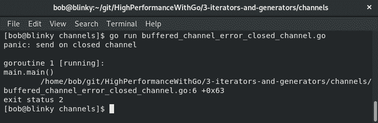

这是因为我们试图向一个已经关闭的通道(`ch`)传递数据(`foo`字符串)。

以下程序也会引发 panic：

```go
package main 
 func main() {
 ch := make(chan string, 1)
ch <- "foo"
ch <- "bar"
}
```

我们会看到以下错误消息：

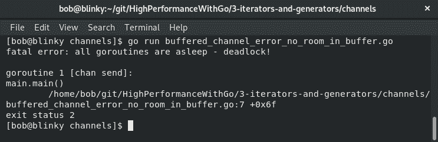

程序会因为 goroutine 会被阻塞而引发 panic。这个错误会被运行时检测到，程序退出。

# 遍历通道

你可能想知道你的缓冲通道中所有的值。我们可以通过在我们想要检查的通道上调用`range`内置函数来实现这一点。我们在以下代码块的示例中向通道添加了三个元素，关闭了通道，然后使用`fmt`写入了通道中的所有元素：

```go
package main

import "fmt"

func main() {

    bufferedChannel := make(chan int, 3)
    bufferedChannel <- 1
    bufferedChannel <- 3
    bufferedChannel <- 5
    close(bufferedChannel)                                                                                                                  
    for i := range bufferedChannel {
        fmt.Println(i)
    }   
} 

```

结果输出显示了我们缓冲通道中的所有值：

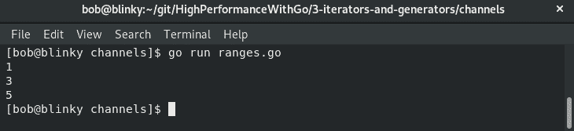

提醒一下-确保关闭通道。如果我们删除前面的`close(bufferedChannel)`函数，我们将会遇到死锁。

# 无缓冲通道

在 Go 中，无缓冲通道是默认的通道配置。无缓冲通道是灵活的，因为它们不需要有一个有限的通道大小定义。当通道的接收者比通道的发送者慢时，它们通常是最佳选择。它们在读取和写入时都会阻塞，因为它们是同步的。发送者将阻塞通道，直到接收者接收到值。它们通常与 goroutines 一起使用，以确保项目按预期的顺序进行处理。

在我们接下来的示例代码块中，我们执行以下操作：

+   创建一个布尔通道来维护状态

+   创建一个未排序的切片

+   使用 `sortInts()` 函数对我们的切片进行排序

+   响应我们的通道，以便我们可以继续函数的下一部分

+   搜索我们的切片以查找给定的整数

+   响应我们的通道，以便我们的通道上的事务完成

+   返回通道值，以便我们的 Go 函数完成

首先，我们导入我们的包并创建一个函数，用于在通道中对整数进行排序：

```go
package main
import (
    "fmt"
    "sort"
)
func sortInts(intArray[] int, done chan bool) {
    sort.Ints(intArray)
    fmt.Printf("Sorted Array: %v\n", intArray)
    done < -true
}
```

接下来，我们创建一个 `searchInts` 函数，用于在通道中搜索整数：

```go
func searchInts(intArray []int, searchNumber int, done chan bool) {
    sorted := sort.SearchInts(intArray, searchNumber)
    if sorted < len(intArray) {
        fmt.Printf("Found element %d at array position %d\n", searchNumber, sorted)
    } else {
        fmt.Printf("Element %d not found in array %v\n", searchNumber, intArray)
    }       
    done <- true
}        
```

最后，我们在我们的 `main` 函数中将它们全部绑定在一起：

```go
func main() {
    ch := make(chan bool)
    go func() {
        s := []int{2, 11, 3, 34, 5, 0, 16} // unsorted
        fmt.Println("Unsorted Array: ", s)
        searchNumber := 16
        sortInts(s, ch)
        searchInts(s, searchNumber, ch)
    }()
    <-ch
}             
```

我们可以在以下截图中看到该程序的输出：

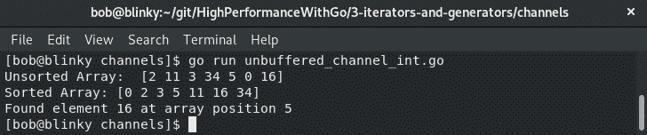

这是使用通道并行执行操作的好方法。

# 选择

选择是一种允许您以有意义的方式结合 goroutines 和通道的构造。我们可以复用 Go 函数，以便能够执行 goroutine 运行时发生的情况。在我们的示例中，我们创建了三个单独的通道：一个 `string` 通道，一个 `bool` 通道和一个 `rune` 通道。接下来，我们在以下代码块中运行一些匿名函数，以便向这些通道中填充数据，并使用内置的 select 返回通道中的值。

1.  首先，我们初始化我们的包并设置三个单独的通道：

```go
package main

import (
    "fmt"
    "time"
) 

func main() {

    // Make 3 channels
    ch1 := make(chan string)
    ch2 := make(chan bool)
    ch3 := make(chan rune)
```

1.  接下来，通过匿名函数向每个通道传递适当的变量：

```go
    // string anonymous function to ch1
    go func() {
        ch1 <- "channels are fun"
    }() 

    // bool anonymous function to ch2
    go func() {
        ch2 <- true
    }() 

    // rune anonymous function to ch3 with 1 second sleep
    go func() {
        time.Sleep(1 * time.Second)
        ch3 <- 'r' 
    }() 
```

1.  最后，我们通过我们的 `select` 语句将它们传递：

```go

    // select builtin to return values from channels                                                                                        
    for i := 0; i < 3; i++ {
        select {
        case msg1 := <-ch1:
            fmt.Println("Channel 1 message: ", msg1)
        case msg2 := <-ch2:
            fmt.Println("Channel 2 message: ", msg2)
        case msg3 := <-ch3:
            fmt.Println("Channel 3 message: ", msg3)
        }   
    }   
}       
```

该程序的结果输出可以在以下截图中看到：

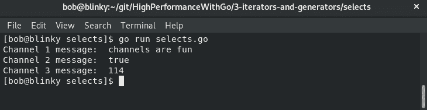

您会注意到这里 `rune` 匿名函数最后返回。这是由于在该匿名函数中插入了休眠。如果多个值准备就绪，`select` 语句将随机返回传递到通道中的值，并在 goroutine 结果准备就绪时按顺序返回。

在下一节中，我们将学习什么是信号量。

# 引入信号量

信号量是另一种控制 goroutines 执行并行任务的方法。信号量很方便，因为它们使我们能够使用工作池模式，但我们不需要在工作完成并且工作线程处于空闲状态时关闭工作线程。在 Go 语言中使用加权信号量的概念相对较新；信号量的 sync 包实现是在 2017 年初实现的，因此它是最新的并行任务构造之一。

如果我们以以下代码块中的简单循环为例，向请求添加 100 毫秒的延迟，并向数组添加一个项目，我们很快就会看到随着这些任务按顺序操作，所需的时间增加：

```go
package main

import (
    "fmt"
    "time"
)       

func main() {
    var out = make([]string, 5)                                                                                                             
    for i := 0; i < 5; i++ {
        time.Sleep(100 * time.Millisecond)
        out[i] = "This loop is slow\n"
    }   
    fmt.Println(out)
}       
```

我们可以使用相同的构造创建一个加权信号量实现。我们可以在以下代码块中看到：

1.  首先，我们初始化程序并设置信号量变量：

```go
package main

import (
 "context"
 "fmt"
 "runtime"
 "time"

 "golang.org/x/sync/semaphore"
)

func main() {
    ctx := context.Background()
    var (
        sem    = semaphore.NewWeighted(int64(runtime.GOMAXPROCS(0)))
        result = make([]string, 5)
    )   
```

1.  然后，我们运行我们的信号量代码：

```go

    for i := range result {
        if err := sem.Acquire(ctx, 1); err != nil {
            break
        }
        go func(i int) {
            defer sem.Release(1)
            time.Sleep(100 * time.Millisecond)
            result[i] = "Semaphores are Cool \n"
        }(i)
    }   
    if err := sem.Acquire(ctx, int64(runtime.GOMAXPROCS(0))); err != nil {
        fmt.Println("Error acquiring semaphore")
    }   
    fmt.Println(result)
}    
```

这两个函数之间的执行时间差异非常明显，可以在以下输出中看到：

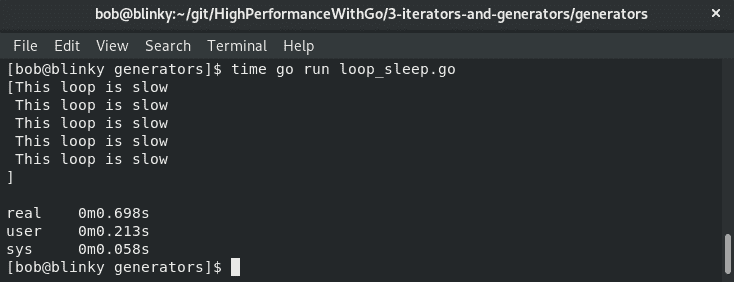

信号量实现的运行速度比两倍还要快，如下截图所示：

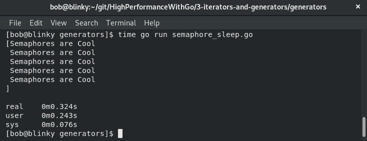

信号量实现的速度超过两倍。 这是只有五个 100 毫秒的阻塞睡眠。 随着规模的不断增长，能够并行处理事务变得越来越重要。

在下一节中，我们将讨论 WaitGroups。

# 理解 WaitGroups

WaitGroups 通常用于验证多个 goroutine 是否已完成。 我们这样做是为了确保我们已完成了所有我们期望完成的并发工作。

在以下代码块的示例中，我们使用`WaitGroup`对四个网站进行请求。 这个`WaitGroup`将等到所有的请求都完成后才会完成`main`函数，并且只有在所有的`WaitGroup`值都返回后才会完成：

1.  首先，我们初始化我们的包并设置我们的检索函数：

```go
package main

import (
    "fmt"
    "net/http"
    "sync"
    "time"
) 

func retrieve(url string, wg *sync.WaitGroup) {
    // WaitGroup Counter-- when goroutine is finished
    defer wg.Done() 
    start := time.Now()
    res, err := http.Get(url)
    end := time.Since(start)
    if err != nil {
        panic(err)
    } 
    // print the status code from the response
    fmt.Println(url, res.StatusCode, end) 

} 
```

1.  在我们的`main`函数中，我们接下来使用我们的检索函数在一个 goroutine 中使用 WaitGroups：

```go
func main() {
    var wg sync.WaitGroup
    var urls = []string{"https://godoc.org", "https://www.packtpub.com", "https://kubernetes.io/"}
    for i := range urls {
        // WaitGroup Counter++ when new goroutine is called
        wg.Add(1) 
        go retrieve(urls[i], &wg)
    }
    // Wait for the collection of goroutines to finish 
    wg.Wait()
} 
```

从以下输出中可以看出，我们收到了所有网页请求的测量数据，它们的响应代码和它们各自的时间：

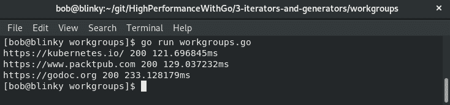

我们经常希望所有的 goroutine 都能完成。 WaitGroups 可以帮助我们做到这一点。

在下一节中，我们将讨论迭代的过程。

# 迭代器和迭代的过程

迭代是查看一组数据的方法，通常是列表，以便从该列表中检索信息。 Go 有许多不同的迭代器模式，都有利有弊：

| **迭代器** | **优点** | **缺点** |
| --- | --- | --- |
| `for`循环 | 最简单的实现 | 没有默认并发。 |
| 具有回调的迭代器函数 | 简单的实现 | Go 的非常规样式； 难以阅读。 |
| 通道 | 简单的实现 | 在计算上比其他一些迭代器更昂贵（成本差异较小）。 唯一自然并发的迭代器。 |
| 有状态的迭代器 | 难以实现 | 良好的调用者接口。 适用于复杂的迭代器（通常在标准库中使用）。 |

重要的是要相互对比所有这些以验证关于每个迭代器需要多长时间的假设。 在以下测试中，我们对它们的和进行了`0`到`n`的求和，并对它们进行了基准测试。

以下代码块具有简单的`for`循环迭代器：

```go
package iterators

var sumLoops int
func simpleLoop(n int) int {
    for i: = 0; i < n; i++ {
        sumLoops += i
    }
    return sumLoops
}
```

以下代码块具有回调迭代器：

```go
package iterators

var sumCallback int

func CallbackLoop(top int) {
    err: = callbackLoopIterator(top, func(n int) error {
        sumCallback += n
        return nil
    })
    if err != nil {
        panic(err)
    }
}

func callbackLoopIterator(top int, callback func(n int) error) error {
    for i: = 0; i < top; i++{
        err: = callback(i)
        if err != nil {
            return err
        }
    }
    return nil
}
```

以下代码块将展示`Next()`的使用。 让我们再一次一步一步地看一下：

1.  首先，我们初始化我们的包变量和结构。 接下来，我们创建一个`CounterIterator`：

```go
package iterators

var sumNext int

type CounterStruct struct {
    err error
    max int
    cur int
}

func NewCounterIterator(top int) * CounterStruct {
    var err error
    return &CounterStruct {
        err: err,
        max: top,
        cur: 0,
    }
}
```

1.  接下来是`Next()`函数，`Value()`函数和`NextLoop()`函数：

```go
func(i * CounterStruct) Next() bool {
    if i.err != nil {
        return false
    }
    i.cur++
        return i.cur <= i.max
}
func(i * CounterStruct) Value() int {
    if i.err != nil || i.cur > i.max {
        panic("Value is not valid after iterator finished")
    }
    return i.cur
}
func NextLoop(top int) {
    nextIterator: = NewCounterIterator(top)
    for nextIterator.Next() {
        fmt.Print(nextIterator.Value())
    }
}
```

1.  下一个代码块具有缓冲通道实现：

```go
package iterators

var sumBufferedChan int

func BufferedChanLoop(n int) int {

    ch: = make(chan int, n)

        go func() {
        defer close(ch)
        for i: = 0;
        i < n;
        i++{
            ch < -i
        }
    }()

    for j: = range ch {
        sumBufferedChan += j
    }
    return sumBufferedChan
}
```

1.  下一个代码块具有无缓冲通道实现：

```go
package iterators

var sumUnbufferedChan int

func UnbufferedChanLoop(n int) int {
    ch: = make(chan int)

        go func() {
        defer close(ch)
        for i: = 0;
        i < n;
        i++{
            ch < -i
        }
    }()

    for j: = range ch {
        sumUnbufferedChan += j
    }
    return sumUnbufferedChan
}
```

1.  将所有这些编译在一起后，我们可以进行测试基准。 这些基准测试可以在以下代码块中找到。 让我们再一次一步一步地看一下。

1.  首先，我们初始化我们的包并设置一个简单的回调循环基准：

```go
package iterators

import "testing"

func benchmarkLoop(i int, b *testing.B) {
    for n := 0; n < b.N; n++ {
        simpleLoop(i)
    } 
}

func benchmarkCallback(i int, b *testing.B) {
    b.ResetTimer()
    for n := 0; n < b.N; n++ {
        CallbackLoop(i)
    } 
}
```

1.  接下来是一个`Next`和缓冲通道基准：

```go
func benchmarkNext(i int, b *testing.B) {
    b.ResetTimer()
    for n := 0; n < b.N; n++ {
        NextLoop(i)
    } 
}

func benchmarkBufferedChan(i int, b *testing.B) {
    b.ResetTimer()
    for n := 0; n < b.N; n++ {
        BufferedChanLoop(i)
    } 
}
```

1.  最后，我们设置了无缓冲通道基准，并为每个基准创建了循环函数：

```go
func benchmarkUnbufferedChan(i int, b *testing.B) {
    b.ResetTimer()
    for n := 0; n < b.N; n++ {
        UnbufferedChanLoop(i)
    }   
}

func BenchmarkLoop10000000(b *testing.B)           { benchmarkLoop(1000000, b) }
func BenchmarkCallback10000000(b *testing.B)       { benchmarkCallback(1000000, b) }
func BenchmarkNext10000000(b *testing.B)           { benchmarkNext(1000000, b) }
func BenchmarkBufferedChan10000000(b *testing.B)   { benchmarkBufferedChan(1000000, b) }
func BenchmarkUnbufferedChan10000000(b *testing.B) { benchmarkUnbufferedChan(1000000, b) }   
```

基准测试的结果可以在以下截图中找到：

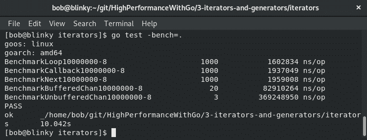

这些迭代器测试的上下文非常重要。 因为在这些测试中我们只是做简单的加法，所以迭代的简单构造是关键。 如果我们在每次调用中添加延迟，那么并发通道迭代器的性能将更好。 并发在合适的上下文中是一件强大的事情。

在下一节中，我们将讨论生成器。

# 生成器简介

生成器是在循环结构中返回下一个顺序值的例程。生成器通常用于实现迭代器并引入并行性。在 Go 中，Goroutines 被用来实现生成器。为了在 Go 中实现并行性，我们可以使用生成器与消费者并行运行以产生值。它们通常在循环结构中被使用。生成器本身也可以并行化。这通常是在生成输出的成本很高且输出可以以任何顺序生成时才会这样做。

# 总结

在本章中，我们学习了 Go 中用于迭代器和生成器的许多基本构造。理解匿名函数和闭包帮助我们建立了关于这些函数如何工作的基础知识。然后我们学习了 goroutines 和 channels 的工作原理，以及如何有效地实现它们。我们还学习了关于信号量和 WaitGroups，以及它们在语言中的作用。理解这些技能将帮助我们以更有效的方式解析计算机程序中的信息，从而实现更多的并发数据操作。在第四章中，*在 Go 中的 STL 算法等效实现*，我们将学习如何在 Go 中实现**标准模板库**（**STL**）的实际应用。
