# Go 中的 STL 算法等价物

许多来自其他高性能编程语言，特别是 C++的程序员，了解**标准模板库**（**STL**）的概念。该库提供了常见的编程数据结构和函数访问通用库，以便快速迭代和编写大规模的高性能代码。Go 没有内置的 STL。本章将重点介绍如何在 Go 中利用一些最常见的 STL 实践。STL 有四个常见的组件：

+   算法

+   容器

+   函数对象

+   迭代器

熟悉这些主题将帮助您更快、更有效地编写 Go 代码，利用常见的实现和优化模式。在本章中，我们将学习以下内容：

+   如何在 Go 中使用 STL 实践

+   如何在 Go 中利用标准编程算法

+   容器如何存储数据

+   Go 中函数的工作原理

+   如何正确使用迭代器

记住，所有这些部分仍然是我们性能拼图的一部分。知道何时使用正确的算法、容器或函数对象将帮助您编写性能更好的代码。

# 了解 STL 中的算法

STL 中的算法执行排序、搜索、操作和计数等功能。这些功能由 C++中的`<algorithm>`头文件调用，并用于元素范围。被修改的对象组不会影响它们所关联的容器的结构。这里每个小标题中概述的模式使用 Go 的语言结构来实现这些算法。本章的这一部分将解释以下类型的算法：

+   排序

+   逆转

+   最小和最大元素

+   二分搜索

能够理解所有这些算法的工作原理将帮助您在需要使用这些技术来操作数据结构时编写性能良好的代码。

# 排序

**sort**算法将数组按升序排序。排序不需要创建、销毁或复制新的容器——排序算法对容器中的所有元素进行排序。我们可以使用 Go 的标准库 sort 来实现这一点。Go 的标准库 sort 对不同的数据类型（`IntsAreSorted`、`Float64sAreSorted`和`StringsAreSorted`）有辅助函数来对它们进行排序。我们可以按照以下代码中所示的方式实现排序算法：

```go
package main
import (
    "fmt"
    "sort"
)
func main() {
    intData := []int{3, 1, 2, 5, 6, 4}
    stringData := []string{"foo", "bar", "baz"}
    floatData := []float64{1.5, 3.6, 2.5, 10.6}
```

这段代码使用值实例化简单的数据结构。之后，我们使用内置的`sort`函数对每个数据结构进行排序，如下所示：

```go

    sort.Ints(intData)
    sort.Strings(stringData)
    sort.Float64s(floatData)
    fmt.Println("Sorted Integers: ", intData, "\nSorted Strings:
      ", stringData, "\nSorted Floats: ", floatData)
}
```

当我们执行这个代码时，我们可以看到所有的切片都按顺序排序，如下面的截图所示：

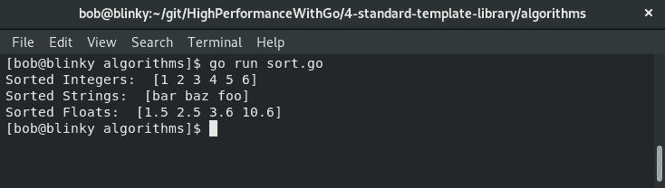

整数按从低到高排序，字符串按字母顺序排序，浮点数按从低到高排序。这些是`sort`包中的默认排序方法。

# 反转

**reverse**算法接受一个数据集并反转集合的值。Go 标准的`sort`包没有内置的反转切片的方法。我们可以编写一个简单的`reverse`函数来反转我们数据集的顺序，如下所示：

```go
package main

import (
  "fmt"
)

func reverse(s []string) []string {
  for x, y := 0, len(s)-1; x < y; x, y = x+1, y-1 {
    s[x], s[y] = s[y], s[x]
  }
  return s
}
func main() {
  s := []string{"foo", "bar", "baz", "go", "stop"}
  reversedS := reverse(s)
  fmt.Println(reversedS)
}
```

这个函数通过切片进行迭代，增加和减少`x`和`y`直到它们收敛，并交换切片中的元素，如下面的截图所示：

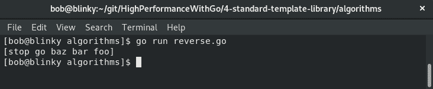

我们可以看到，我们的切片使用`reverse()`函数被反转。使用标准库可以使一个难以手动编写的函数变得简单、简洁和可重用。

# 最小元素和最大元素

我们可以使用`min_element`和`max_element`算法在数据集中找到最小和最大值。我们可以使用简单的迭代器在 Go 中实现`min_element`和`max_element`：

1.  首先，我们将编写一个函数来找到切片中最小的整数：

```go
package main

import "fmt"

func findMinInt(a []int) int {
  var minInt int = a[0]
  for _, i := range a {
    if minInt > i {
      minInt = i
    }
  }
  return minInt

}
```

1.  接下来，我们将按照相同的过程，尝试在切片中找到最大的整数：

```go
func findMaxInt(b []int) int {
  var max int = b[0]
  for _, i := range b {
    if max < i {
      max = i
    }
  }
  return max
}
```

1.  最后，我们将使用这些函数打印出最终的最小值和最大值：

```go
func main() {
  intData := []int{3, 1, 2, 5, 6, 4}
  minResult := findMinInt(intData)
  maxResult := findMaxInt(intData)
  fmt.Println("Minimum value in array: ", minResult)
  fmt.Println("Maximum value in array: ", maxResult)
}
```

这些函数遍历整数切片，并在切片中找到最小值和最大值，如下面的屏幕截图所示：

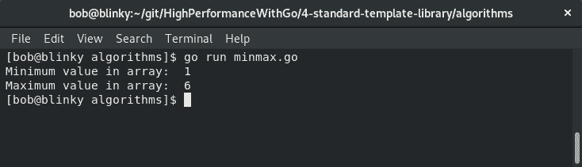

从我们的执行结果可以看出，找到了最小值和最大值。

在 Go 的`math`包中，我们还有`math.Min`和`math.Max`。这些仅用于比较`float64`数据类型。浮点数比较并不是一件容易的事情，因此 Go 的设计者决定将默认的`Min`和`Max`签名；在`math`库中，应该使用浮点数。如果 Go 有泛型，我们上面编写的主要函数可能适用于不同类型。这是 Go 语言设计的一部分——保持事情简单和集中。

# 二分查找

**二分查找**是一种用于在排序数组中查找特定元素位置的算法。它从数组中间元素开始。如果没有匹配，算法接下来取可能包含该项的数组的一半，并使用中间值来找到目标。正如我们在第二章中学到的，*数据结构和算法*，二分查找是一个高效的*O*(log *n*)算法。Go 标准库的`sort`包有一个内置的二分查找函数。我们可以这样使用它：

```go
package main

import (
  "fmt"
  "sort"
)

func main() {
  data := []int{1, 2, 3, 4, 5, 6}
  findInt := 2
  out := sort.Search(len(data), func(i int) bool { return data[i]
     >= findInt })
  fmt.Printf("Integer %d was found in %d at position %d\n",
     findInt, data, out)
}
```

二分查找算法正确地找到了我们正在搜索的整数值`2`，并且在预期位置（在零索引切片中的位置`1`）上。我们可以在以下屏幕截图中看到二分查找的执行：

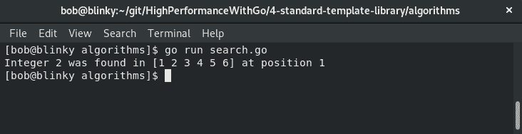

总之，STL 中的算法都很好地转换到了 Go 中。Go 的默认函数和迭代器使得组合简单、可重用的算法变得容易。在下一节中，我们将学习关于容器的知识。

# 理解容器

STL 中的容器分为三个独立的类别：

+   序列容器

+   序列容器适配器

+   关联容器

接下来，我们将在以下小节中介绍这三种类型的容器。

# 序列容器

序列容器存储特定类型的数据元素。目前有五种序列容器的实现：`array`、`vector`、`deque`、`list`和`forward_list`。这些序列容器使得以顺序方式引用数据变得容易。能够利用这些序列容器是编写有效代码和重用标准库中模块化部分的一个很好的捷径。我们将在以下小节中探讨这些内容。

# 数组

在 Go 中，**数组**类似于 C++中的数组。Go 的数组结构在编译时静态定义，不可调整大小。数组在 Go 中的实现方式如下：

```go
arrayExample := [5]string{"foo", "bar", "baz", "go", "rules"}
```

这个数组保存了在`arrayExample`变量中定义的字符串的值，该变量被定义为一个数组。

# 向量

Go 最初有一个**向量**的实现，但这在语言开发的早期就被移除了（2011 年 10 月 11 日）。人们认为切片更好（正如拉取请求的标题所说），切片成为了 Go 中的事实上的向量实现。我们可以这样实现一个切片：

```go
sliceExample := []string{"slices", "are", "cool", "in", "go"}
```

切片很有益，因为它们像 STL 中的向量一样，可以根据添加或删除而增长或缩小。在我们的示例中，我们创建一个切片，向切片附加一个值，并从切片中移除一个值，如下面的代码所示：

```go
package main

import "fmt"

// Remove i indexed item in slice
func remove(s []string, i int) []string {
  copy(s[i:], s[i+1:])
  return s[:len(s)-1]
}

func main() {
  slice := []string{"foo", "bar", "baz"} // create a slice
  slice = append(slice, "tri") // append a slice
  fmt.Println("Appended Slice: ", slice) // print slice [foo, bar baz, tri]
  slice = remove(slice, 2) // remove slice item #2 (baz)
  fmt.Println("After Removed Item: ", slice) // print slice [foo, bar, tri]
}
```

当我们执行我们的向量示例时，我们可以看到我们的附加和移除操作，如下面的屏幕截图所示：

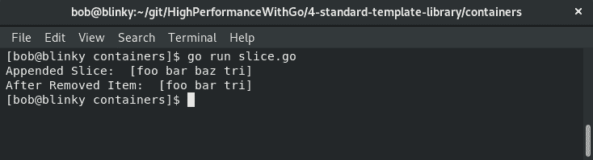

我们可以看到`tri`元素被附加到了我们的切片末尾，并且我们还可以看到基于我们的`remove()`函数调用，`baz`元素（切片中的第 3 个元素）被移除了。

# 双端队列

**双端队列**是一个可以扩展的容器。这些扩展可以发生在容器的前端或后端。当需要频繁引用队列的顶部或后部时，通常会使用双端队列。以下代码块是双端队列的简单实现：

```go
package main

import (
    "fmt"

    "gopkg.in/karalabe/cookiejar.v1/collections/deque"
)

func main() {
    d := deque.New()
    elements := []string{"foo", "bar", "baz"}
    for i := range elements {
        d.PushLeft(elements[i])
    }
    fmt.Println(d.PopLeft())  // queue => ["foo", "bar"]
    fmt.Println(d.PopRight()) // queue => ["bar"]
    fmt.Println(d.PopLeft())  // queue => empty
}
```

`deque`包接受一个元素的切片，并使用`PushLeft`函数将它们推送到队列上。接下来，我们可以从双端队列的左侧和右侧弹出元素，直到我们的队列为空。我们可以在以下截图中看到我们双端队列逻辑的执行：

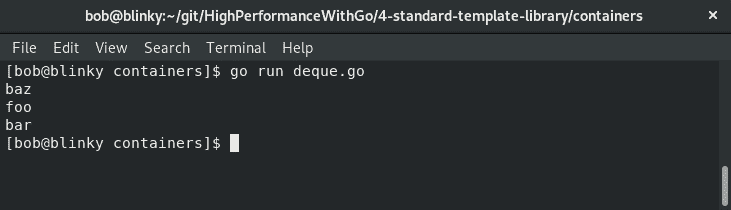

我们的结果显示了对双端队列的操作输出以及我们如何可以从队列的任一端取出东西。能够从队列的任一端取出东西在数据操作中是有优势的，这就是为什么双端队列是一种流行的数据结构选择。

# 列表

**列表**是 Go 语言中双向链表的实现。这是内置在标准库的 container/list 包中的。我们可以使用通用双向链表的实现执行许多操作，如下面的代码所示：

```go
package main

import (
    "container/list"
    "fmt"
)

func main() {
    ll := list.New()
    three := ll.PushBack(3)           // stack representation -> [3]
    four := ll.InsertBefore(4, three) // stack representation -> [4 3]
    ll.InsertBefore(2, three)         // stack representation ->
                                      //  [4 2 3]
    ll.MoveToBack(four)               // stack representation ->
                                      // [2 3 4]
    ll.PushFront(1)                   // stack representation ->
                                      //  [1 2 3 4]
    listLength := ll.Len()
    fmt.Printf("ll type: %T\n", ll)
    fmt.Println("ll length: :", listLength)
    for e := ll.Front(); e != nil; e = e.Next() {
        fmt.Println(e.Value)
    }
}
```

双向链表类似于双端队列容器，但如果需要，它允许在堆栈的中间进行插入和移除。双向链表在实践中使用得更多。我们可以在以下截图中看到我们双向链表代码的执行。

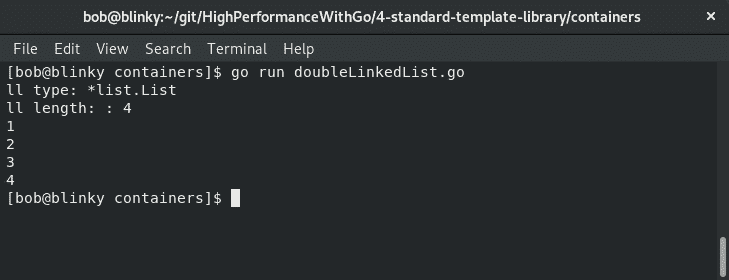

我们可以看到所有元素在程序输出中按照它们在堆栈上协调的顺序。链表是编程的基本要素，因为它们是当今计算机科学建立在其上的基本算法。

# 前向列表

**前向列表**是单向链表的实现。单向链表通常比双向链表具有更小的内存占用；然而，通过单向链表进行迭代不太好，特别是在反向方向上。让我们看看如何实现前向列表：

1.  首先，我们初始化我们的程序并定义我们的结构：

```go
package main

import "fmt"

type SinglyLinkedList struct {
    head *LinkedListNode
}

type LinkedListNode struct {
    data string
    next *LinkedListNode
}
```

1.  然后我们创建我们的`Append`函数并在我们的`main`函数中应用它：

```go

func (ll *SinglyLinkedList) Append(node *LinkedListNode) {
    if ll.head == nil {
        ll.head = node
        return
    }

    currentNode := ll.head
    for currentNode.next != nil {
        currentNode = currentNode.next
    }
    currentNode.next = node
}

func main() {
    ll := &SinglyLinkedList{}
    ll.Append(&LinkedListNode{data: "hello"})
    ll.Append(&LinkedListNode{data: "high"})
    ll.Append(&LinkedListNode{data: "performance"})
    ll.Append(&LinkedListNode{data: "go"})

    for e := ll.head; e != nil; e = e.next {
        fmt.Println(e.data)
    }
}
```

从以下截图的输出结果中可以看到，我们附加到我们的单链表的所有数据都是可访问的：

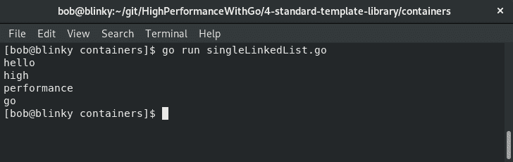

这个数据结构的初始元素按照它们在代码块中添加的顺序放入列表中。这是预期的，因为单向链表通常用于保持数据结构中的数据顺序。

# 容器适配器

**容器适配器**接受一个顺序容器并调整它的使用方式，以便原始顺序容器能够按照预期的方式运行。在研究这些容器适配器时，我们将学习它们是如何创建的，以及它们如何从实际的角度使用。

# 队列

**队列**是遵循**FIFO**队列方法或**先进先出**的容器。这意味着我们可以将东西添加到容器中，并从容器的另一端取出它们。我们可以通过向切片附加和出列来制作最简单形式的队列，如下面的代码所示：

```go
package main

import "fmt"

func main() {

    var simpleQueue []string
    simpleQueue = append(simpleQueue, "Performance ")
    simpleQueue = append(simpleQueue, "Go")

    for len(simpleQueue) > 0 {
        fmt.Println(simpleQueue[0])   // First element
        simpleQueue = simpleQueue[1:] // Dequeue
    }
    fmt.Println(simpleQueue) //All items are dequeued so result should be []
}
```

在我们的示例中，我们将字符串附加到我们的`simpleQueue`，然后通过移除切片的第一个元素来出列它们：

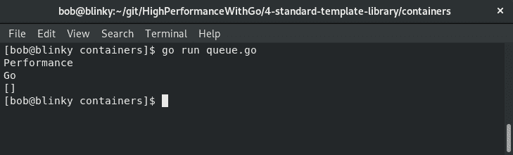

在我们的输出中，我们可以看到我们正确地向队列添加了元素并将它们移除。

# 优先队列

**优先队列**是使用堆来保持容器中元素的优先列表的容器。优先队列很有帮助，因为可以按优先级对结果集进行排序。优先队列通常用于许多实际应用，从负载平衡 Web 请求到数据压缩，再到 Dijkstra 算法。

在我们的优先级队列示例中，我们创建了一个新的优先级队列，并插入了几种具有给定优先级的不同编程语言。我们从 Java 开始，它是第一个优先级，然后 Go 成为第一个优先级。添加了 PHP，Java 的优先级被推到 3。以下代码是优先级队列的一个示例。在这里，我们实例化了必要的要求，创建了一个新的优先级队列，向其中插入元素，改变了这些项的优先级，并从堆栈中弹出项：

```go
package main

import (
    "fmt"

    pq "github.com/jupp0r/go-priority-queue"
)

func main() {
    priorityQueue := pq.New()
    priorityQueue.Insert("java", 1)
    priorityQueue.Insert("golang", 1)
    priorityQueue.Insert("php", 2)
    priorityQueue.UpdatePriority("java", 3)
    for priorityQueue.Len() > 0 {
        val, err := priorityQueue.Pop()
        if err != nil {
            panic(err)
        }
        fmt.Println(val)
    }
}
```

在我们执行这个示例代码之后，我们可以看到基于我们设置的优先级队列值的语言的正确排序，如下所示：

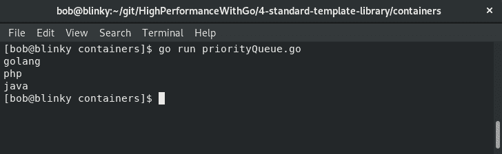

优先级队列是一种常用的重要数据结构。它们用于首先处理数据结构中最重要的元素，并且能够使用 STL 等效实现这一点有助于我们节省时间和精力，同时能够优先处理传入的请求。

# 堆栈

**堆栈**使用`push`和`pop`来添加和删除容器中的元素，用于对数据进行分组。堆栈通常具有**LIFO**（**后进先出**）的操作顺序，`Peek`操作通常允许您查看堆栈顶部的内容而不将其从堆栈中移除。堆栈非常适用于具有有限内存集的事物，因为它们可以有效地利用分配的内存。以下代码是堆栈的简单实现：

```go
package main

import (
    "fmt"

    stack "github.com/golang-collections/collections/stack"
)

func main() {
    // Create a new stack
    fmt.Println("Creating New Stack")
    exstack := stack.New()
    fmt.Println("Pushing 1 to stack")
    exstack.Push(1) // push 1 to stack
    fmt.Println("Top of Stack is : ", exstack.Peek())
    fmt.Println("Popping 1 from stack")
    exstack.Pop() // remove 1 from stack
    fmt.Println("Stack length is : ", exstack.Len())
}
```

我们可以从我们的程序输出中看到以下内容：

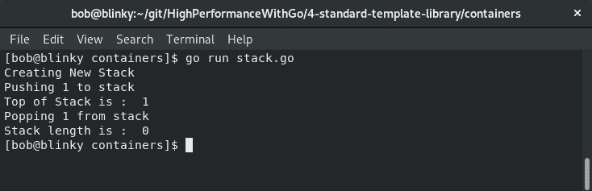

我们可以看到我们的堆栈操作按预期执行。能够使用堆栈操作在计算机科学中非常重要，因为这是许多低级编程技术执行的方式。

# 关联容器

**关联容器**是实现关联数组的容器。这些数组是有序的，只是在算法对它们的每个元素施加的约束上有所不同。STL 引用关联容器，即 set、map、multiset 和 multimap。我们将在以下部分探讨这些内容。

# 集合

**集合**用于仅存储键。Go 没有集合类型，因此经常使用`map`类型到布尔值的映射来构建集合。以下代码块是 STL 等效集合的实现：

```go
package main

import "fmt"

func main() {
    s := make(map[int]bool)

    for i := 0; i < 5; i++ {
        s[i] = true
    }

    delete(s, 4)

    if s[2] {
        fmt.Println("s[2] is set")
    }
    if !s[4] {
        fmt.Println("s[4] was deleted")
    }
}
```

结果输出显示我们能够设置和删除相应的值：

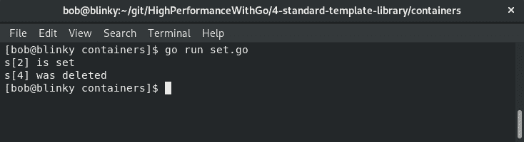

从我们的输出中可以看出，我们的代码可以正确地操作集合，这对于常见的键-值对非常重要。

# 多重集

**多重集**是带有与每个元素关联的计数的无序集合。多重集可以进行许多方便的操作，例如取差集、缩放集合或检查集合的基数。

在我们的示例中，我们构建了一个多重集`x`，将其缩放为多重集`y`，验证`x`是否是`y`的子集，并检查`x`的基数。我们可以在以下代码中看到多重集的一个示例实现：

```go
package main

import (
    "fmt"

    "github.com/soniakeys/multiset"
)

func main() {
    x := multiset.Multiset{"foo": 1, "bar": 2, "baz": 3}
    fmt.Println("x: ", x)
    // Create a scaled version of x
    y := multiset.Scale(x, 2)
    fmt.Println("y: ", y)
    fmt.Print("x is a subset of y: ")
    fmt.Println(multiset.Subset(x, y))

    fmt.Print("Cardinality of x: ")
    fmt.Println(x.Cardinality())
}
```

当我们执行此代码时，我们可以看到`x`，`x`的缩放版本`y`的验证，以及`x`的基数计算。以下是我们多重集代码片段执行的输出：

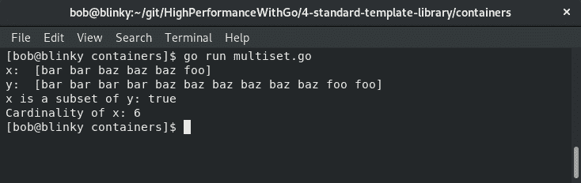

多重集对于集合操作非常有用，并且非常方便，因为每个元素可以有多个实例。多重集的一个很好的实际例子是购物车——您可以向购物车中添加许多物品，并且您可以在购物车中拥有同一物品的多个计数。

# 映射

**映射**是一种用于存储键-值对的容器。Go 的内置`map`类型使用哈希表来存储键和它们关联的值。

在 Go 中，实例化映射很简单，如下所示：

```go
package main

import "fmt"

func main() {
    m := make(map[int]string)
    m[1] = "car"
    m[2] = "train"
    m[3] = "plane"
    fmt.Println("Full Map:\t ", m)
    fmt.Println("m[3] value:\t ", m[3])
    fmt.Println("Length of map:\t ", len(m))
}
```

现在让我们来看一下输出：

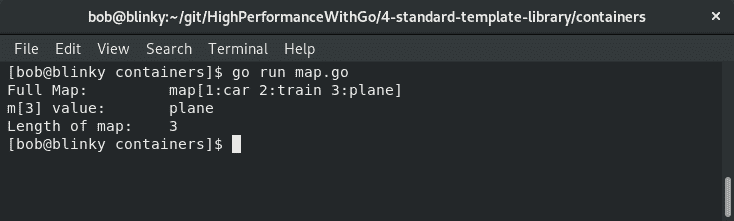

在前面的执行结果中，我们可以看到我们可以创建一个映射，通过使用它的键引用映射中的值，并使用`Len()`内置类型找到我们映射中的元素数量。

# 多重映射

**多重映射**是一个可以返回一个或多个值的映射。多重映射的一个实际应用是 Web 查询字符串。查询字符串可以将多个值分配给相同的键，就像我们在下面的示例 URL 中看到的那样：`https://www.example.com/?foo=bar&foo=baz&a=b`。

在我们的例子中，我们将创建一个汽车的多重映射。我们的`car`结构体每辆车都有一个年份和一个风格。我们将能够聚合这些不同类型。以下代码片段是一个多重映射的实现：

```go
package main

import (
    "fmt"

    "github.com/jwangsadinata/go-multimap/slicemultimap"
)

type cars []struct {
    year  int
    style string
}

func main() {

    newCars := cars{{2019, "convertible"}, {1966, "fastback"}, {2019, "SUV"}, {1920, "truck"}}
    multimap := slicemultimap.New()

    for _, car := range newCars {
        multimap.Put(car.year, car.style)
    }

    for _, style := range multimap.KeySet() {
        color, _ := multimap.Get(style)
        fmt.Printf("%v: %v\n", style, color)
    }
}
```

我们有多个版本的汽车，有一个`2019`年的车型（敞篷车和 SUV）。在我们的输出结果中，我们可以看到这些值被聚合在一起：

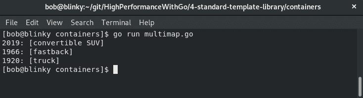

当你想要在映射中捕获一对多的关联时，多重映射是非常有用的。在下一节中，我们将看看函数对象。

# 理解函数对象

**函数对象**，也称为**函子**，用于生成、测试和操作数据。如果将一个对象声明为函子，你可以像使用函数调用一样使用该对象。通常情况下，STL 中的算法需要一个参数来执行它们指定的任务。函子往往是一种有用的方式来帮助执行这些任务。在本节中，我们将学习以下内容：

+   函子

+   内部和外部迭代器

+   生成器

+   隐式迭代器

# 函子

**函子**是一种函数式编程范式，它在保持结构的同时对结构执行转换。

在我们的例子中，我们取一个整数切片`intSlice`，并将该切片提升为一个函子。`IntSliceFunctor`是一个包括以下内容的接口：

+   `fmt.Stringer`，它定义了值的字符串格式及其表示。

+   `Map(fn func(int int) IntSliceFunctor` – 这个映射将`fn`应用到我们切片中的每个元素。

+   一个方便的函数，`Ints() []int`，它允许你获取函子持有的`int`切片。

在我们有了我们的提升切片之后，我们可以对我们新创建的函子执行操作。在我们的例子中，我们执行了一个平方操作和一个模三操作。以下是一个函子的示例实现：

```go
package main                                                                                                                                

import (
    "fmt"

    "github.com/go-functional/core/functor"
)

func main() {
    intSlice := []int{1, 3, 5, 7}
    fmt.Println("Int Slice:\t", intSlice)
    intFunctor := functor.LiftIntSlice(intSlice)
    fmt.Println("Lifted Slice:\t", intFunctor)

    // Apply a square to our given functor
    squareFunc := func(i int) int {
        return i * i 
    }   

    // Apply a mod 3 to our given functor
    modThreeFunc := func(i int) int {
        return i % 3 
    }   

    squared := intFunctor.Map(squareFunc)
    fmt.Println("Squared: \t", squared)

    modded := squared.Map(modThreeFunc)
    fmt.Println("Modded: \t", modded)
}
```

在执行这段代码时，我们可以看到我们的函子对函数操作的处理符合预期。我们取出了我们的初始`intSlice`，将它提升为一个函子，用`squareFunc`对每个值应用了平方，并用`modThreeFunc`对每个值应用了`%3`：

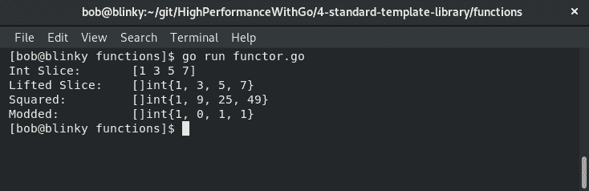

函子是一种非常强大的语言构造。函子以一种易于修改的方式抽象了一个容器。它还允许关注点的分离——例如，你可以将迭代逻辑与计算逻辑分开，函子可以更简单地进行参数化，函子也可以是有状态的。

# 迭代器

我们在第三章中讨论了迭代器，*理解并发*。迭代器是允许遍历列表和其他容器的对象。迭代器通常作为容器接口的一部分实现，这对程序员来说是一个重要的方法。它们通常被分为以下类别：

+   内部迭代器

+   外部迭代器

+   生成器

+   隐式迭代器

我们将在接下来的章节中更详细地讨论这些类别是什么。

# 内部迭代器

**内部迭代器**表示为高阶函数（通常使用匿名函数，正如我们在第三章中所见，*理解并发*）。高阶函数将函数作为参数并返回函数作为输出。匿名函数是不绑定标识符的函数。

内部迭代器通常映射到将函数应用于容器中的每个元素。这可以由变量标识符表示，也可以匿名表示。语言的作者曾提到在 Go 语言中可以使用 apply/reduce，但不应该使用（这是因为在 Go 语言中通常更喜欢使用`for`循环）。这种模式符合 Go 语言的座右铭*简单胜于巧妙*。

# 外部迭代器

外部迭代器用于访问对象中的元素并指向对象中的下一个元素（分别称为元素访问和遍历）。Go 语言大量使用`for`循环迭代器。`for`循环是 Go 语言唯一的自然循环结构，并极大简化了程序构建。`for`循环就像下面这样简单：

```go
package main

import "fmt"

func main() {
    for i := 0; i < 5; i++ {
        fmt.Println("Hi Gophers!")
    }
}
```

我们可以看到我们的输出如下：

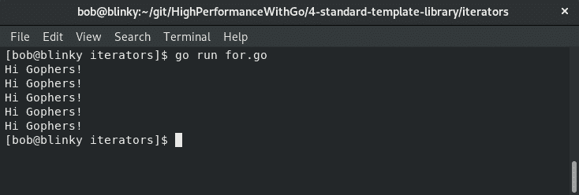

我们的`for`循环迭代器很简单，但证明了一个重要观点——有时，简单对于复杂的问题集也能起到预期的作用。

# 生成器

**生成器**在调用函数时返回序列中的下一个值。如下面的代码块所示，匿名函数可以用于在 Go 语言中实现生成器迭代器模式：

```go
package main

import "fmt"

func incrementCounter() func() int {
    initializedNumber := 0
    return func() int {
        initializedNumber++
        return initializedNumber
    }   
}

func main() {
    n1 := incrementCounter()
    fmt.Println("n1 increment counter #1: ", n1())
    fmt.Println("n1 increment counter #2: ", n1())
    n2 := incrementCounter()
    fmt.Println("n2 increment counter #1: ", n2())
    fmt.Println("n1 increment counter #3: ", n1())
}
```

当调用`incrementCounter()`时，函数中表示的整数会递增。能够以这种方式并发使用匿名函数对许多从其他语言转到 Go 语言的程序员来说是一个很大的吸引点。它为利用语言的并发提供了简洁的方法。

# 隐式迭代器

**隐式迭代器**为程序员提供了一种简单的方法来迭代容器中存储的元素。这通常是使用 Go 语言中的内置 range 创建的。内置的 range 允许您遍历容器。以下是实现隐式迭代器的代码片段：

```go
package main

import "fmt"

func main() {
    stringExample := []string{"foo", "bar", "baz"}
    for i, out := range stringExample {
        fmt.Println(i, out)
    }
}
```

我们可以看到以下结果输出：

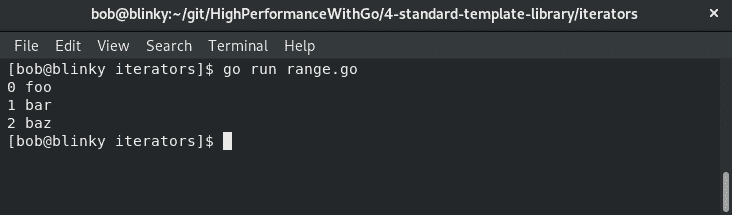

此输出显示了我们对`stringExample`变量范围的迭代。`range`函数是一种非常强大的构造，简洁易读。

# 总结

在本章中，我们学习了如何在 Go 语言中使用 STL 实践。我们还学习了如何利用标准编程算法来处理 Go 语言，学习了容器如何存储数据，学习了函数在 Go 语言中的工作原理，并了解了如何正确使用迭代器。在我们继续 Go 性能之旅时，我们应始终将这些算法、容器、函数和迭代器放在编写代码选择的首要位置。这样做将帮助我们快速而简洁地编写符合惯例的 Go 代码。选择这些 STL 习语的正确组合将帮助我们更快、更有效地操作手头的数据。在下一章中，我们将学习如何在 Go 语言中计算向量和矩阵。
