# 第五章：在 Go 中的矩阵和向量计算

矩阵和向量计算在计算机科学中很重要。向量可以在动态数组中保存一组对象。它们使用连续的存储，并且可以被操作以适应增长。矩阵建立在向量的基础上，创建了一个二维向量集。在本章中，我们将讨论矩阵和向量以及这两种数据结构如何实际使用，以执行今天计算机科学中发生的大部分数据操作。向量和矩阵是线性代数的基本组成部分，在今天的计算机科学中非常重要。诸如图像处理、计算机视觉和网络搜索等过程都利用线性代数来执行它们各自的操作。

在本章中，你将学习以下主题：

+   **基本线性代数子程序**（**BLAS**）

+   向量

+   矩阵

+   向量和矩阵操作

一旦我们能够将所有这些东西联系在一起，你将学会如何利用矩阵和向量计算的不同方面来推动大量数据的有效操作。

# 介绍 Gonum 和 Sparse 库

Go 中最受欢迎的科学算法库之一是 Gonum 包。Gonum 包（[`github.com/gonum`](https://github.com/gonum)）提供了一些工具，帮助我们使用 Go 编写有效的数值算法。这个包专注于创建高性能算法，可以在许多不同的应用程序中使用，向量和矩阵是这个包的核心要点。这个库是以性能为目标创建的 - 创建者们在 C 中看到了向量化的问题，所以他们建立了这个库，以便更容易地在 Go 中操作向量和矩阵。Sparse 库（[`github.com/james-bowman/sparse`](https://github.com/james-bowman/sparse)）是建立在 Gonum 库之上的，用于处理在机器学习和科学计算的其他部分中发生的一些正常的稀疏矩阵操作。在 Go 中使用这些库是一种高性能的方式来管理向量和矩阵。

在下一节中，我们将看看 BLAS 是什么。

# 介绍 BLAS

BLAS 是一个常用的规范，用于执行线性代数运算。这个库最初是在 1979 年作为 FORTRAN 库创建的，并且自那时以来一直得到维护。BLAS 对矩阵的高性能操作进行了许多优化。由于这个规范的深度和广度，许多语言选择在其领域内的线性代数库中使用这个规范的一部分。Go Sparse 库使用了 BLAS 实现进行线性代数操作。BLAS 规范由三个单独的例程组成：

+   级别 1：向量操作

+   级别 2：矩阵-向量操作

+   级别 3：矩阵-矩阵操作

有了这些分级的例程，有助于实现和测试这个规范。BLAS 已经在许多实现中使用过，从 Accelerate（macOS 和 iOS 框架）到英特尔**数学核心库**（**MKL**），并且已经成为应用计算机科学中线性代数的一个重要部分。

现在，是时候学习关于向量的知识了。

# 介绍向量

向量是一种常用于存储数据的一维数组。Go 最初有一个容器/向量实现，但在 2011 年 10 月 18 日被移除，因为切片被认为更适合在 Go 中使用向量。内置切片提供的功能可以提供大量的向量操作帮助。切片将是一个行向量，或者 1×m 矩阵的实现。一个简单的行向量如下所示：

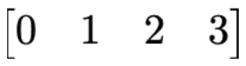

正如你所看到的，我们有一个 1×m 矩阵。要在 Go 中实现一个简单的行向量，我们可以使用切片表示，如下所示：

```go
v := []int{0, 1, 2, 3}
```

这是一种使用 Go 内置功能来描绘简单行向量的简单方法。

# 向量计算

列向量是一个 m x 1 矩阵，也被称为行向量的转置。矩阵转置是指矩阵沿对角线翻转，通常用上标 T 表示。我们可以在下面的图片中看到一个列向量的例子：

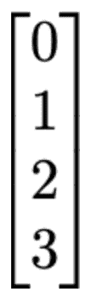

如果我们想在 Go 中实现一个列向量，我们可以使用 Gonum 向量包来初始化这个向量，就像下面的代码块中所示的那样：

```go
package main

import (
   "fmt"
   "gonum.org/v1/gonum/mat"
)
func main() {
   v := mat.NewVecDense(4, []float64{0, 1, 2, 3})
   matPrint(v)
}

func matrixPrint(m mat.Matrix) {
   formattedMatrix := mat.Formatted(m, mat.Prefix(""), mat.Squeeze())
   fmt.Printf("%v\n", formattedMatrix)
}
```

这将打印出一个列向量，就像前面图片中所示的那样。

我们还可以使用 Gonum 包对向量进行一些整洁的操作。例如，在下面的代码块中，我们可以看到如何简单地将向量中的值加倍。我们可以使用`AddVec`函数将两个向量相加，从而创建一个加倍的向量。我们还有`prettyPrintMatrix`便利函数，使我们的矩阵更容易阅读：

```go
package main

import (
   "fmt"
   "gonum.org/v1/gonum/mat"
)

func main() {
   v := mat.NewVecDense(5, []float64{1, 2, 3, 4, 5})
   d := mat.NewVecDense(5, nil)
   d.AddVec(v, v)
   fmt.Println(d)
}

func prettyPrintMatrix(m mat.Matrix) { 
    formattedM := mat.Formatted(m, mat.Prefix(""), mat.Squeeze())
    fmt.Printf("%v\n", formattedM)
}

```

这个函数的结果，也就是加倍的向量，如下所示：

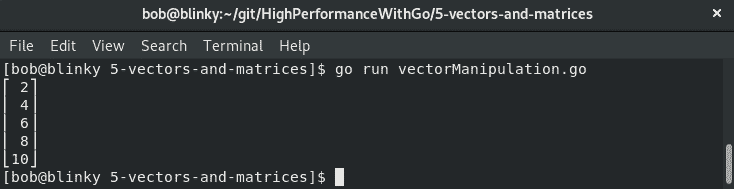

`gonum/mat`包还为向量提供了许多其他整洁的辅助函数，包括以下内容：

+   `Cap()` 给出了向量的容量

+   `Len()` 给出了向量中的列数

+   `IsZero()` 验证向量是否为零大小

+   `MulVec()`将向量*a*和*b*相乘并返回结果

+   `AtVec()`返回向量中给定位置的值

`gonum/mat`包中的向量操作函数帮助我们轻松地将向量操作成我们需要的数据集。

现在我们已经完成了向量，让我们来看看矩阵。

# 介绍矩阵

矩阵是二维数组，按行和列分类。它们在图形处理和人工智能中很重要；即图像识别。矩阵通常用于图形处理，因为矩阵中的行和列可以对应于屏幕上像素的行和列排列，以及因为我们可以让矩阵的值对应于特定的颜色。矩阵也经常用于数字音频处理，因为数字音频信号使用傅里叶变换进行滤波和压缩，矩阵有助于执行这些操作。

矩阵通常用*M × N*的命名方案表示，其中*M*是矩阵中的行数，*N*是矩阵中的列数，如下图所示：

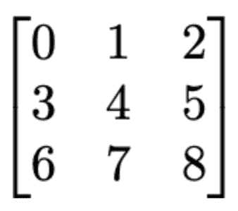

例如，前面的图片是一个 3 x 3 的矩阵。*M x N*矩阵是线性代数的核心要素之一，因此在这里看到它的关系是很重要的。

现在，让我们看看矩阵是如何操作的。

# 矩阵操作

矩阵是以高效的方式存储大量信息的好方法，但是矩阵的操作是矩阵真正价值的所在。最常用的矩阵操作技术如下：

+   矩阵加法

+   矩阵标量乘法

+   矩阵转置

+   矩阵乘法

能够在矩阵上执行这些操作是很重要的，因为它们可以帮助处理规模化的真实世界数据操作。我们将在接下来的部分中看一些这些操作，以及它们的实际应用。

# 矩阵加法

矩阵加法是将两个矩阵相加的方法。也许我们想要找到两个 2D 集合的求和结果值。如果我们有两个相同大小的矩阵，我们可以将它们相加，就像这样：

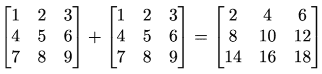

我们也可以用 Go 代码表示这一点，就像下面的代码块中所示的那样：

```go
package main

import (
   "fmt"
   "gonum.org/v1/gonum/mat"
)

func main() {
   a := mat.NewDense(3, 3, []float64{1, 2, 3, 4, 5, 6, 7, 8, 9})
   a.Add(a, a) // add a and a together
   matrixPrint(a)
}

func matrixPrint(m mat.Matrix) {
   formattedMatrix := mat.Formatted(m, mat.Prefix(""), mat.Squeeze())
   fmt.Printf("%v\n", formattedMatrix)
}
```

执行这个函数的结果如下：

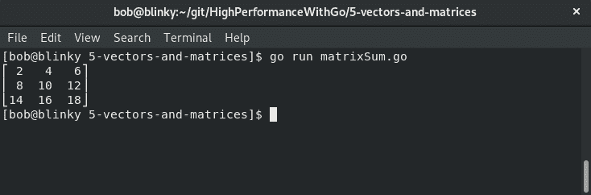

结果是我们代码块中矩阵求和的描述。

在下一节中，我们将讨论矩阵操作的一个实际例子。为了演示这个例子，我们将使用矩阵减法。

# 一个实际的例子（矩阵减法）

假设您拥有两家餐厅，一家位于**纽约，纽约**，另一家位于**亚特兰大，乔治亚**。您想要弄清楚每个月在您的餐厅中哪些物品销售最好，以确保您在接下来的几个月中备货正确的原料。我们可以利用矩阵减法找到每家餐厅的单位销售净总数。我们需要每家餐厅的单位销售原始数据，如下表所示：

五月销量：

|  | **纽约，纽约** | **亚特兰大，乔治亚** |
| --- | --- | --- |
| 龙虾浓汤 | 1,345 | 823 |
| 鲜蔬沙拉 | 346 | 234 |
| 肋眼牛排 | 843 | 945 |
| 冰淇淋圣代 | 442 | 692 |

六月销量：

|  | **纽约，纽约** | **亚特兰大，乔治亚** |
| --- | --- | --- |
| 龙虾浓汤 | 920 | 776 |
| 鲜蔬沙拉 | 498 | 439 |
| 肋眼牛排 | 902 | 1,023 |
| 冰淇淋圣代 | 663 | 843 |

现在，我们可以使用以下矩阵减法找到这两个月之间的单位销售差异：

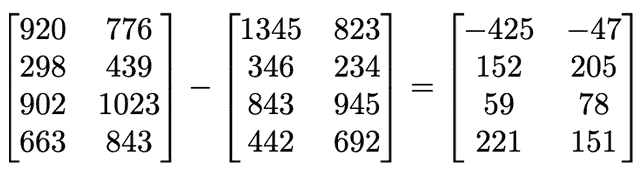

我们可以在 Go 中执行相同的操作，如下所示的代码块：

```go
package main

import (
  "fmt"

  "gonum.org/v1/gonum/mat"
)

func main() {
  a := mat.NewDense(4, 2, []float64{1345, 823, 346, 234, 843, 945, 442, 692})
  b := mat.NewDense(4, 2, []float64{920, 776, 498, 439, 902, 1023, 663, 843})
  var c mat.Dense
  c.Sub(b, a)
  result := mat.Formatted(&c, mat.Prefix(""), mat.Squeeze())
 fmt.Println(result)
}
```

我们的结果输出给出了五月和六月之间两家餐厅的销售差异，如下所示：

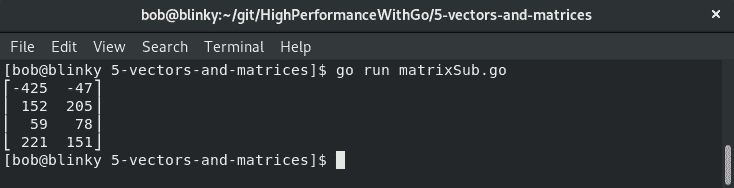

在上述屏幕截图中的结果显示为*N × M*矩阵，描述了销售差异。

随着我们拥有更多的餐厅并在餐厅菜单中添加更多项目，利用矩阵减法将有助于我们记下我们需要保持库存的物品。

# 标量乘法

在操作矩阵时，我们可能希望将矩阵中的所有值乘以一个标量值。

我们可以用以下代码在 Go 中表示这一点：

```go
package main

import (
  "fmt"

  "gonum.org/v1/gonum/mat"
)

func main() {
  a := mat.NewDense(3, 3, []float64{1, 2, 3, 4, 5, 6, 7, 8, 9})
  a.Scale(4, a) // Scale matrix by 4
  matrixPrint(a)
}

func matrixPrint(m mat.Matrix) {
  formattedMatrix := mat.Formatted(m, mat.Prefix(""), mat.Squeeze())
  fmt.Printf("%v\n", formattedMatrix)
}
```

这段代码产生了以下结果：

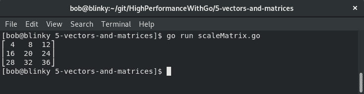

在这里，我们可以看到矩阵中的每个元素都被缩放了 4 倍，从而提供了矩阵缩放的执行示例。

# 标量乘法实际示例

假设我们拥有一个五金店，我们有一个产品目录，其中的产品与**美元**（**USD**）值相关联。我们公司决定开始在加拿大和美国销售我们的产品。在撰写本书时，1 美元等于 1.34 加拿大元（**CAD**）。我们可以查看我们的螺丝、螺母和螺栓价格矩阵，根据数量计数，如下表所示：

|  | **单个 USD** | **100 个 USD** | **1000 个 USD** |
| --- | --- | --- | --- |
| 螺丝 | $0.10 | $0.05 | $0.03 |
| 螺母 | $0.06 | $0.04 | $0.02 |
| 螺栓 | $0.03 | $0.02 | $0.01 |

如果我们使用矩阵标量乘法来找到 CAD 中的结果成本，我们将得到以下矩阵计算：

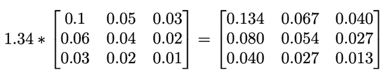

我们可以使用 Go 标量乘法功能验证这一点，如下所示的代码片段：

```go
package main

import (
    "fmt"

    "gonum.org/v1/gonum/mat"
) 

func main() {
    usd := mat.NewDense(3, 3, []float64{0.1, 0.05, 0.03, 0.06, 0.04, 0.02, 0.03, 0.02, 0.01})
    var cad mat.Dense
    cad.Scale(1.34, usd)
    result := mat.Formatted(&cad, mat.Prefix(""), mat.Squeeze()) 
    fmt.Println(result)
} 
```

我们收到一个包含我们每个物品的 CAD 值的结果矩阵：

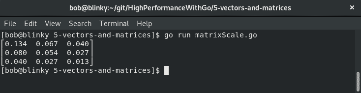

输出显示了我们缩放后的结果矩阵。

随着我们获得越来越多的产品，并有更多不同的货币需要考虑，我们的标量矩阵操作将非常方便，因为它将减少我们需要操作这些大量数据集的工作量。

# 矩阵乘法

我们可能还想将两个矩阵相乘。将两个矩阵相乘会得到两个矩阵的乘积。当我们想要同时以并发方式将许多数字相乘时，这将非常有帮助。我们可以取矩阵*A*，一个*N × M*矩阵，以及*B*，一个*M × P*矩阵。结果集称为*AB*，是一个*N × P*矩阵，如下所示：

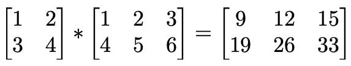

我们可以用以下代码在 Go 中表示这一点：

```go
package main

import (
    "fmt"
    "gonum.org/v1/gonum/mat"
)

func main() {
    a := mat.NewDense(2, 2, []float64{1, 2, 3, 4})
    b := mat.NewDense(2, 3, []float64{1, 2, 3, 4, 5, 6})
    var c mat.Dense
    c.Mul(a, b)
    result := mat.Formatted(&c, mat.Prefix(""), mat.Squeeze())
    fmt.Println(result)
}
```

执行后，我们得到以下结果：

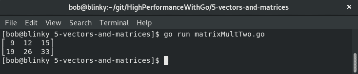

这是我们可以使用`gonum/mat`包将矩阵相乘的方式。矩阵乘法是一个常见的矩阵函数，了解如何执行这个操作将帮助您有效地操作矩阵。

# 矩阵乘法实际示例

让我们来谈谈矩阵乘法的一个实际例子，这样我们就可以将我们的理论工作与一个可行的例子联系起来。两家不同的电子供应商正在竞相为您的公司制造小部件。供应商 A 和供应商 B 都为该小部件设计并为您提供了所需的零件清单。供应商 A 和供应商 B 都使用相同的组件供应商。在这个例子中，我们可以使用矩阵乘法来找出哪个供应商创建了一个更便宜的小部件。每个供应商给您的零件清单如下：

+   **供应商 A**：电阻：5

晶体管：10

电容器：2

+   **供应商 B**：

电阻：8

晶体管：6

电容器：3

您从组件供应商目录中得知，每个组件的定价如下：

+   电阻成本：$0.10

+   晶体管成本：$0.42

+   电容器成本：$0.37

我们可以用之前学到的方法，用矩阵来表示每个输入。这样做如下：

1.  我们创建了一个由组件成本组成的矩阵，如下所示：

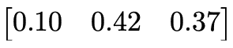

我们创建了一个由每个供应商的组件数量组成的矩阵：

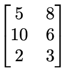

1.  然后，我们使用矩阵乘法来找到一些有趣的结果：

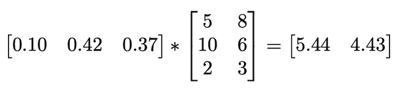

这个结果告诉我们，供应商 A 的解决方案零件成本为 5.44 美元，而供应商 B 的解决方案零件成本为 4.43 美元。从原材料的角度来看，供应商 B 的解决方案更便宜。

这可以在 Go 中用以下代码计算：

```go
package main

import (
    "fmt"
    "gonum.org/v1/gonum/mat"
)

func main() {
    a := mat.NewDense(1, 3, []float64{0.10, 0.42, 0.37})
    b := mat.NewDense(3, 2, []float64{5, 8, 10, 6, 2, 3})
    var c mat.Dense
    c.Mul(a, b)
    result := mat.Formatted(&c, mat.Prefix("    "), mat.Squeeze())
    fmt.Println(result)
}
```

得到的输出确认了我们在前面程序中所做的计算：

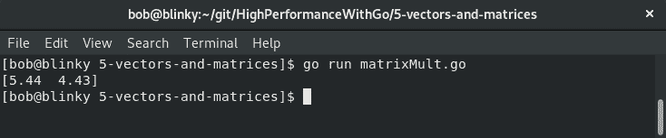

正如我们从结果中看到的，我们格式化的矩阵与我们之前执行的数学相吻合。在巩固我们对理论概念的理解方面，具有一个实际的例子可能会非常有帮助。

# 矩阵转置

矩阵转置是指将矩阵对角线翻转，交换行和列索引。以下图片显示了矩阵的一个转置示例：

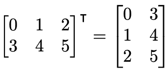

我们可以用以下代码在 Go 中表示矩阵转置：

```go
package main

import (
    "fmt"
    "gonum.org/v1/gonum/mat"
)

func main() {
    a := mat.NewDense(3, 3, []float64{5, 3, 10, 1, 6, 4, 8, 7, 2})
    matrixPrint(a)
    matrixPrint(a.T())
}

func matrixPrint(m mat.Matrix) {
    formattedMatrix := mat.Formatted(m, mat.Prefix(""), mat.Squeeze())
    fmt.Printf("%v\n", formattedMatrix)
}
```

这个矩阵转置的结果可以在下图中看到：

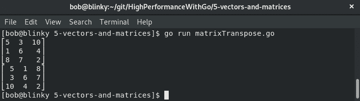

在前面的输出中，我们可以看到常规矩阵和转置版本。矩阵转置经常用于计算机科学中，比如通过在内存中转置矩阵来改善内存局部性。

# 矩阵转置实际示例

转置矩阵很有趣，但对您来说，可能有一个矩阵转置可能会被使用的实际示例会很有帮助。假设我们有三个工程师：**鲍勃**，**汤姆**和**爱丽丝**。这三个工程师每天都推送 Git 提交。我们希望以一种有意义的方式跟踪这些 Git 提交，以便我们可以确保工程师们有他们需要继续编写代码的所有资源。让我们统计一下我们工程师连续 3 天的代码提交：

| **用户** | **天** | **提交** |
| --- | --- | --- |
| 鲍勃 | 1 | 5 |
| 鲍勃 | 2 | 3 |
| 鲍勃 | 3 | 10 |
| 汤姆 | 1 | 1 |
| 汤姆 | 2 | 6 |
| 汤姆 | 3 | 4 |
| 爱丽丝 | 1 | 8 |
| 爱丽丝 | 2 | 7 |
| 爱丽丝 | 3 | 2 |

当我们有了我们的数据点后，我们可以用一个二维数组来表示它们：

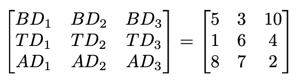

现在我们有了这个数组，我们可以对数组进行转置：

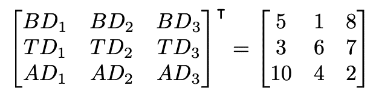

现在我们已经进行了这个转置，我们可以看到转置数组的行对应于提交的天数，而不是个体最终用户的提交。让我们看看第一行：

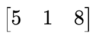

现在代表**BD1**、**TD1**和**AD1**——每个开发者的第 1 天提交。

现在我们完成了操作部分，是时候看看矩阵结构了。

# 理解矩阵结构

矩阵通常被分类为两种不同的结构：密集矩阵和稀疏矩阵。密集矩阵由大部分非零元素组成。稀疏矩阵是一个大部分由值为 0 的元素组成的矩阵。矩阵的稀疏度被计算为具有零值的元素数除以总元素数。

如果这个方程的结果大于 0.5，那么矩阵是稀疏的。这种区别很重要，因为它帮助我们确定矩阵操作的最佳方法。如果矩阵是稀疏的，我们可能能够使用一些优化来使矩阵操作更有效。相反，如果我们有一个密集矩阵，我们知道我们很可能会对整个矩阵执行操作。

重要的是要记住，矩阵的操作很可能会受到当今计算机硬件的内存限制。矩阵的大小是一个重要的记住的事情。当你在计算何时使用稀疏矩阵或密集矩阵时，密集矩阵将具有一个 int64 的值，根据 Go 中数字类型的大小和对齐，这是 8 个字节。稀疏矩阵将具有该值，加上一个条目的列索引的 int。在选择要用于数据的数据结构时，请记住这些大小。

# 密集矩阵

当你创建一个密集矩阵时，矩阵的所有值都被存储。有时这是不可避免的——当我们关心与表相关的所有值并且表大部分是满的时。对于密集矩阵存储，使用 2D 切片或数组通常是最好的选择，但如果你想操作矩阵，使用 Gonum 包可以以有效的方式进行数据操作。实际上，大多数矩阵不属于密集矩阵类别。

# 稀疏矩阵

稀疏矩阵在现实世界的数据集中经常出现。无论某人是否观看了电影目录中的视频，听了播放列表上的歌曲数量，或者完成了待办事项列表中的项目，都是可以使用稀疏矩阵的好例子。这些表中的许多值都是零，因此将这些矩阵存储为密集矩阵是没有意义的。这将占用大量内存空间，并且操作起来会很昂贵。

我们可以使用 Go 稀疏库来创建和操作稀疏矩阵。稀疏库使用来自 BLAS 例程的习语来执行许多常见的矩阵操作。Go 稀疏库与 Gonum 矩阵包完全兼容，因此可以与该包互换使用。在这个例子中，我们将创建一个新的稀疏**键字典**（**DOK**）。创建后，我们将为数组中的集合设置特定的*M x N*值。最后，我们将使用`gonum/mat`包来打印我们创建的稀疏矩阵。

在以下代码中，我们使用 Sparse 包创建了一个稀疏矩阵。`ToCSR()`和`ToCSC()`矩阵函数分别创建 CSR 和 CSC 矩阵：

```go
package main

import (
    "fmt"
    "github.com/james-bowman/sparse"
    "gonum.org/v1/gonum/mat"
)

func main() {
    sparseMatrix := sparse.NewDOK(3, 3)
    sparseMatrix.Set(0, 0, 5)
    sparseMatrix.Set(1, 1, 1)
    sparseMatrix.Set(2, 1, -3)
    fmt.Println(mat.Formatted(sparseMatrix))
    csrMatrix := sparseMatrix.ToCSR()
    fmt.Println(mat.Formatted(csrMatrix))
    cscMatrix := sparseMatrix.ToCSC()
    fmt.Println(mat.Formatted(cscMatrix))
}
```

执行完这段代码后，我们可以看到稀疏矩阵已经返回：

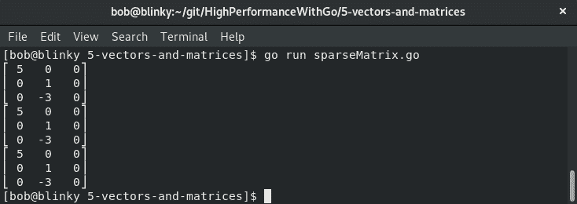

这个输出向我们展示了生成的稀疏矩阵。

稀疏矩阵可以分为三种不同的格式：

+   用于有效创建和修改矩阵的格式

+   用于有效访问和矩阵操作的格式

+   专用格式

用于有效创建和修改矩阵的格式如下：

+   **键字典**（**DOK**）

+   **列表的列表**（**LIL**）

+   **坐标列表**（**COO**）

这些格式将在以下部分中定义。

# DOK 矩阵

DOK 矩阵是 Go 中的一个映射。这个映射将行和列对链接到它们的相关值。如果没有为矩阵中的特定坐标定义值，则假定为零。通常，哈希映射被用作底层数据结构，这为随机访问提供了 O(1)，但遍历元素的速度会变得稍慢一些。DOK 对于矩阵的构建或更新是有用的，但不适合进行算术运算。一旦创建了 DOK 矩阵，它也可以简单地转换为 COO 矩阵。

# LIL 矩阵

LIL 矩阵存储了每行的列表，其中包含列索引和值，通常按列排序，因为这样可以减少查找时间。LIL 矩阵对于逐步组合稀疏矩阵是有用的。当我们不知道传入数据集的稀疏模式时，它们也是有用的。

# COO 矩阵

A COO 矩阵（也经常被称为三元组格式矩阵）存储了按行和列索引排序的元组列表，其中包含行、列和值。COO 矩阵可以简单地通过 O(1) 的时间进行追加。从 COO 矩阵中进行随机读取相对较慢（O(n)）。COO 矩阵是矩阵初始化和转换为 CSR 的良好选择。COO 矩阵不适合进行算术运算。通过对矩阵内的向量进行排序，可以提高对 COO 矩阵的顺序迭代的性能。

用于高效访问和矩阵操作的格式如下：

+   **压缩稀疏行**（**CSR**）

+   **压缩稀疏列**（**CSC**）

这些格式将在以下部分中定义。

# CSR 矩阵

CSR 矩阵使用三个一维数组来表示矩阵。CSR 格式使用这三个数组：

+   A：数组中存在的值。

+   IA：这些值的索引。这些值定义如下：

+   IA 在索引 0 处的值，IA[0] = 0

+   IA 在索引 i 处的值，IA[i] = IA[i − 1] +（原始矩阵中第 i-1 行上的非零元素数）

+   JA：存储元素的列索引。

下图显示了一个 4 x 4 矩阵的示例。这是我们将在下面的代码示例中使用的矩阵：

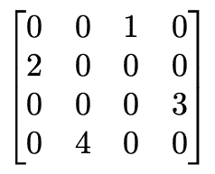

我们可以按以下方式计算这些值：

+   A = [ 1 2 3 4]

+   IA = [0 1 2 3 4]

+   JA = [2 0 3 1]

我们可以使用 `sparse` 包进行验证，如下面的代码片段所示：

```go
package main

import (
    "fmt"
    "github.com/james-bowman/sparse"
    "gonum.org/v1/gonum/mat"
)

func main() {
    sparseMatrix := sparse.NewDOK(4, 4)
    sparseMatrix.Set(0, 2, 1)
    sparseMatrix.Set(1, 0, 2)
    sparseMatrix.Set(2, 3, 3)
    sparseMatrix.Set(3, 1, 4)
    fmt.Print("DOK Matrix:\n", mat.Formatted(sparseMatrix), "\n\n") // Dictionary of Keys
    fmt.Print("CSR Matrix:\n", sparseMatrix.ToCSR(), "\n\n")        // Print CSR version of the matrix
}
```

结果显示了我们创建的矩阵的 DOK 表示的重新转换值，以及其对应的 CSR 矩阵：

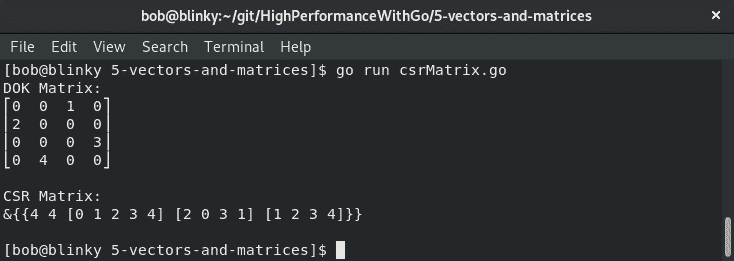

这段代码的输出显示了一个打印 IA、JA 和 A 值的 CSR 矩阵。随着矩阵的增长，能够计算 CSR 矩阵使得矩阵操作变得更加高效。计算机科学通常会处理数百万行和列的矩阵，因此能够以高效的方式进行操作会使您的代码更加高效。

# CSC 矩阵

CSC 矩阵与 CSR 矩阵具有相同的格式，但有一个小的不同之处。列索引切片是被压缩的元素，而不是行索引切片，就像我们在 CSR 矩阵中看到的那样。这意味着 CSC 矩阵以列为主序存储其值，而不是以行为主序。这也可以看作是对 CSR 矩阵的自然转置。我们可以通过对前一节中使用的示例进行操作，来看一下如何创建 CSC 矩阵，如下面的代码块所示：

```go
package main

import (
    "fmt"

    "github.com/james-bowman/sparse"
    "gonum.org/v1/gonum/mat"
)

func main() {
    sparseMatrix := sparse.NewDOK(4, 4)
    sparseMatrix.Set(0, 2, 1)
    sparseMatrix.Set(1, 0, 2)
    sparseMatrix.Set(2, 3, 3)
    sparseMatrix.Set(3, 1, 4)
    fmt.Print("DOK Matrix:\n", mat.Formatted(sparseMatrix), "\n\n") // Dictionary of Keys
    fmt.Print("CSC Matrix:\n", sparseMatrix.ToCSC(), "\n\n")        // Print CSC version
}
```

结果显示了我们创建的矩阵的 DOK 表示的重新转换值，以及其对应的 CSC 矩阵：

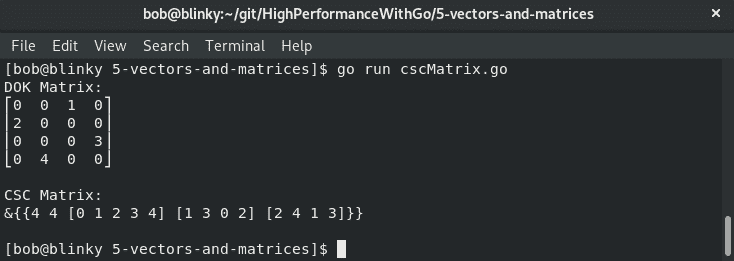

前面代码块的输出向我们展示了 DOK 矩阵和 CSC 矩阵。了解如何表示 CSR 和 CSC 矩阵对于矩阵操作过程至关重要。这两种不同类型的矩阵具有不同的特征。例如，DOK 矩阵具有 O(1)的访问模式，而 CSC 矩阵使用面向列的操作以提高效率。

# 摘要

在本章中，我们讨论了矩阵和向量，以及这两种数据结构如何在计算机科学中实际使用来执行大部分数据操作。此外，我们还了解了 BLAS、向量、矩阵和向量/矩阵操作。向量和矩阵是线性代数中常用的基本组件，我们看到了它们在哪些情况下会发挥作用。

本章讨论的示例将在涉及真实世界数据处理的情况下对我们有很大帮助。在第六章中，《编写可读的 Go 代码》，我们将讨论如何编写可读的 Go 代码。能够编写可读的 Go 代码将有助于保持主题和想法清晰简洁，便于代码贡献者之间的轻松协作。
