# 编写可读的 Go 代码

学习如何编写可读的 Go 代码是语言的一个重要部分。语言开发人员在编写其他语言时使用了他们的先前经验来创建一种他们认为清晰简洁的语言。在描述使用这种语言编写的正确方式时，经常使用的短语是*惯用 Go*。这个短语用来描述在 Go 中编程的*正确*方式。风格往往是主观的，但 Go 团队为了以一种有见地的方式编写语言并促进开发者的速度、可读性和协作而努力工作。在本章中，我们将讨论如何保持语言的一些核心原则：

+   简单

+   可读性

+   打包

+   命名

+   格式化

+   接口

+   方法

+   继承

+   反射

了解这些模式和惯用法将帮助您编写更易读和可操作的 Go 代码。能够编写惯用的 Go 将有助于提高代码质量水平，并帮助项目保持速度。

# 保持 Go 中的简单性

Go 默认不遵循其他编程语言使用的特定模式。作者选择了不同的惯用法来保持语言简单和清晰。保持语言的简单性对语言开发人员来说是一项艰巨的任务。拥有工具、库、快速执行和快速编译，同时保持简单性，一直是语言开发的重中之重。Go 的语言开发人员一直坚持这些决定，采用共识设计模式——对向语言添加新功能的共识确保了这些功能的重要性。

语言维护者在 GitHub 的问题页面上活跃，并且非常乐意审查拉取请求。从其他使用该语言的人那里获得反馈，使语言维护者能够就向语言添加新功能和功能做出明智的决定，同时保持可读性和简单性。

接下来的部分将向我们展示 Go 语言的下一个基本方面：可读性。

# 保持 Go 语言中的可读性

可读性是 Go 的另一个核心原则。能够快速理解新代码库并理解其中一些微妙之处是任何编程语言的重要部分。随着分布式系统的不断增长，供应商库和 API 变得更加普遍，能够轻松阅读包含的代码并理解其中的意义对于推动前进是有帮助的。这也使得破损的代码更容易修复。

拥有具体的数据类型、接口、包、并发、函数和方法有助于 Go 继续前进。可读性是能够在较长时间内维护大型代码库的最重要参数之一，这是 Go 与竞争对手之间最重要的区别之一。该语言是以可读性作为一等公民构建的。

Go 语言有许多复杂的底层内部部分，但这些实际上并不复杂。诸如简单定义的常量、接口、包、垃圾回收和易于实现的并发等都是复杂的内部部分，但对最终用户来说是透明的。拥有这些构造有助于使 Go 语言蓬勃发展。

让我们在下一节看看 Go 语言中的打包意味着什么。

# 探索 Go 中的打包

打包是 Go 语言的一个基本部分。每个 Go 程序都需要在程序的第一行定义一个包。这有助于可读性、可维护性、引用和组织。

Go 程序中的`main`包使用主声明。这个主声明调用程序的`main`函数。这之后，我们在`main`函数中有其他导入，可以用来导入程序中的其他包。我们应该尽量保持主包的小型化，以便将我们程序中的所有依赖项模块化。接下来我们将讨论包命名。

# 包命名

在命名包时，开发人员应遵循以下规则：

+   包不应该有下划线、连字符或混合大小写

+   包不应该以通用的命名方案命名，比如 common、util、base 或 helper

+   包命名应该与包执行的功能相关

+   包应该保持一个相当大的范围；包中的所有元素应该具有相似的目标和目标

+   在新包与公共 API 对齐之前，利用内部包可以帮助您审查新包

# 包装布局

当我们讨论 Go 程序的布局时，我们应该遵循一些不同的流程。一个常见的约定是将主程序放在名为`cmd`的文件夹中。您构建的其他要从`main`函数执行的包应该放在`pkg`目录中。这种分离有助于鼓励包的重用。在下面的例子中，如果我们想要在 CLI 和 Web 主程序中都重用通知包，我们可以轻松地通过一个导入来实现。以下是一个屏幕截图显示了这种分离：

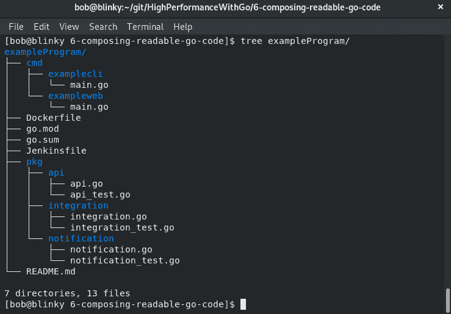

Go 的一个反模式是为包映射创建一对一的文件。我们应该以在特定目录结构内驱动常见用例的方式来编写 Go。例如，我们可以创建一个文件的单个目录并进行如下测试：

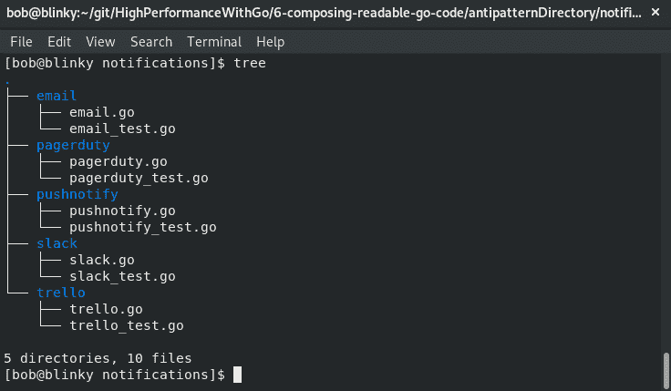

然而，我们应该按照以下方式创建我们的包：

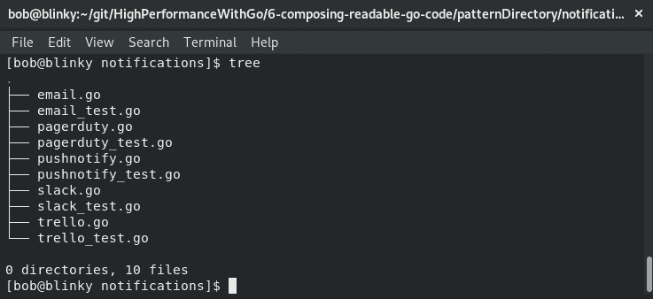

所有这些不同的通知策略都共享一个共同的做法。我们应该尝试将类似的功能耦合在同一个包中。这将帮助其他人理解通知包具有类似功能的任何上下文。

# 内部包装

许多 Go 程序使用内部包的概念来表示尚未准备好供外部使用的 API。内部包的概念首次在 Go 1.4 中引入，以在程序内部添加组件边界。这些内部包不能从存储它们的子树之外导入。如果您想要维护内部包并不将它们暴露给程序的其余部分，这是很有用的。一旦您以您认为合适的方式审查了内部包，您可以更改文件夹名称并公开先前的内部包。

让我们看一个例子：

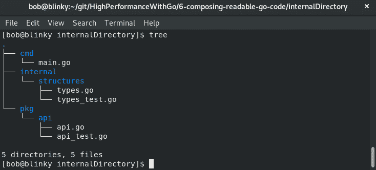

在前面的例子中，我们可以看到我们有一个内部目录。这只能从这个项目内部访问。然而，`pkg`和`cmd`目录将可以从其他项目访问。这对于我们继续开发新产品和功能是很重要的，这些产品和功能在其他项目中还不应该可以导入。

# 供应商目录

供应商目录的概念起源于 Go 1.5 的发布。 `vendor`文件夹是一个存储外部和内部源代码的编译组合的地方，存放在项目的一个目录中。这意味着代码组合器不再需要将依赖包复制到源代码树中。当`GOPATH`寻找依赖项时，将在`vendor`文件夹中进行搜索。这有很多好处：

+   我们可以在我们的项目中保留外部依赖项的本地副本。如果我们想要在具有有限或没有外部网络连接的网络上执行我们的程序，这可能会有所帮助。

+   这样可以加快我们 Go 程序的编译速度。将所有这些依赖项存储在本地意味着我们不需要在构建时拉取依赖项。

+   如果您想使用第三方代码，但已经为您的特定用例进行了调整，您可以将该代码存储并更改为内部发布。

# Go 模块

Go 模块是在 Go 1.11 中引入的。它们可以跟踪 Go 代码库中的版本化依赖项。它们是一组作为一个统一单元存储在项目目录中的`go.mod`文件的 Go 包。

我们将执行以下步骤来初始化一个新模块：

1.  首先执行`go mod init repository`：

```go
go mod init github.com/bobstrecansky/HighPerformanceWithGo
go: creating new go.mod: module github.com/bobstrecansky/HighPerformanceWithGo
```

1.  初始化新模块后，您可以构建 Go 包并像往常一样执行它。您将在项目目录中的`go.mod`文件中保存来自项目内导入的模块。

例如，如果我们想要使用 Gin 框架[[`github.com/gin-gonic/gin`](https://github.com/gin-gonic/gin)]创建一个简单的 Web 服务器，我们可以在项目结构中创建一个目录，如下所示：`/home/bob/git/HighPerformanceWithGo/6-composing-readable-go-code/goModulesExample`。

1.  接下来创建一个简单的 Web 服务器，以对`/foo`请求返回`bar`：

```go
package main
import "github.com/gin-gonic/gin"
func main() {
  server := gin.Default()
  server.GET("/foo", func(c *gin.Context) {
    c.JSON(200, gin.H{
      "response": "bar",
    })
  })
  server.Run()
}
```

1.  之后，我们可以在新创建的目录中创建一个新的 Go 模块：

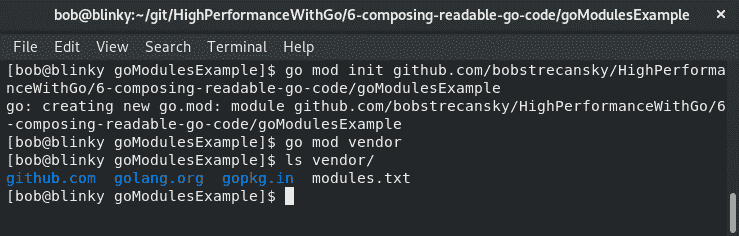

1.  接下来，我们可以执行我们的 Go 程序；必要时将引入适当的依赖项：

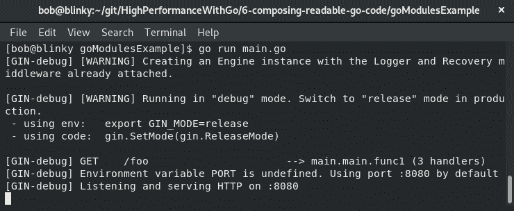

现在我们可以看到我们的简单 Web 服务器的依赖项存储在我们目录中的`go.sum`文件中（我使用了`head`命令将列表截断为前 10 个条目）：

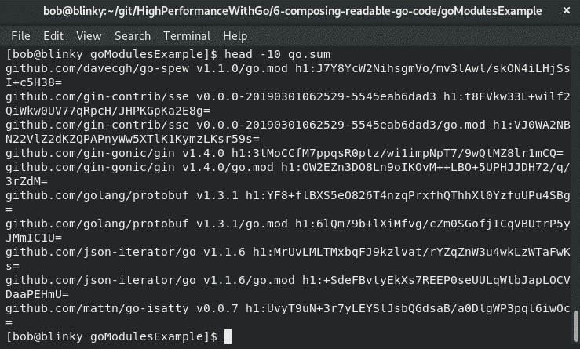

Go 模块有助于保持 Go 存储库中的依赖项清洁和一致。如果需要，我们还可以使用存储库来保持所有依赖项与项目本地相关。

关于在存储库中存储依赖项的意见往往差异很大。一些人喜欢使用存储库，因为它可以减少构建时间并限制无法从外部存储库中拉取包的风险。其他人认为存储可能会妨碍包更新和安全补丁。您是否选择在程序中使用存储目录取决于您，但 Go 模块包含这种功能是很方便的。以下输出说明了这一点：


能够使用内置编译工具来存储目录使得设置和配置变得容易。

在下一节中，我们将讨论在 Go 中命名事物。

# 了解 Go 中的命名

有很多一致的行为，Go 程序员喜欢保留以保持可读性和可维护性的代码。Go 命名方案往往是一致的、准确的和简短的。我们希望在创建名称时记住以下习语：

+   迭代器的局部变量应该简短而简单：

+   `i` 代表迭代器；如果有二维迭代器，则使用`i`和`j`

+   `r` 代表读取器

+   `w` 代表写入器

+   `ch` 代表通道

+   全局变量名称应该简短且描述性强：

+   `RateLimit`

+   `Log`

+   `Pool`

+   首字母缩略语应遵循使用全大写的约定：

+   `FooJSON`

+   `FooHTTP`

+   避免使用模块名称时的口吃：

+   `log.Error()` 而不是 `log.LogError()`

+   具有一个方法的接口应遵循方法名称加上`-er`后缀：

+   `Stringer`

+   `Reader`

+   `Writer`

+   `Logger`

+   Go 中的名称应遵循 Pascal 或 mixedCaps 命名法：

+   `var ThingOne`

+   `var thingTwo`

重要的是要记住，如果名称的首字母大写，它是公开的，并且可以在其他函数中使用。在为事物想出自己的命名方案时，请记住这一点。

遵循这些命名约定可以使您拥有可读性强、易消化、可重用的代码。另一个良好的实践是使用一致的命名风格。如果您正在实例化相同类型的参数，请确保它遵循一致的命名约定。这样可以使新的使用者更容易跟随您编写的代码。

在下一节中，我们将讨论 Go 代码的格式化。

# 了解 Go 中的格式化

正如在第一章中所述，*Go 性能简介*，`gofmt`是 Go 代码的一种主观格式化工具。它会缩进和对齐您的代码，以便按照语言维护者的意图进行阅读。今天许多最受欢迎的代码编辑器在保存文件时都可以执行`gofmt`。这样做，以及拥有您的持续集成软件验证，可以使您无需关注您正在编写的代码的格式，因为语言将会在输出中规定格式。使用这个工具将使 Go 代码更容易阅读、编写和维护，同时有多个贡献者。它还消除了语言内的许多争议，因为空格、制表符和大括号会自动定位。

我们还可以向我们的 Git 存储库（在`.git/hooks/pre-commit`中）添加一个预提交挂钩，以确保提交到存储库的所有代码都按预期格式化。以下代码块说明了这一点：

```go
#!/bin/bash
FILES=$(/usr/bin/git diff --cached --name-only --diff-filter=dr | grep '\.go$')
[ -z "$FILES" ] && exit 0
FORMAT=$(gofmt -l $FILES)
[ -z "$FORMAT" ] && exit 0

echo >&2 "gofmt should be used on your source code. Please execute:"
  for gofile in $FORMAT; do
      echo >&2 " gofmt -w $PWD/$gofile"
  done
  exit 1
```

在添加了这个预提交挂钩之后，我们可以通过向存储库中的文件添加一些错误的空格来确认一切是否按预期工作。这样做后，当我们`git commit`我们的代码时，我们将看到以下警告消息：

```go
git commit -m "test"
//gofmt should be used on your source code. Please execute:
gofmt -w /home/bob/go/example/badformat.go
```

`gofmt`还有一个鲜为人知但非常有用的简化方法，它将在可能的情况下执行源代码转换。这将对一些复合、切片和范围复合文字进行缩短。简化格式化命令将采用以下代码：

```go
package main
import "fmt"
func main() {
    var tmp = []int{1, 2, 3}
    b := tmp[1:len(tmp)]
    fmt.Println(b)
    for i, _ := range tmp {
       fmt.Println(tmp[i])
    }
}
```

这将简化为以下代码：`gofmt -s gofmtSimplify.go`。

这个`gofmt`代码片段的输出如下：

```go
package main
import "fmt"
func main() {
    var tmp = []int{1, 2, 3}
    b := tmp[1:]
    fmt.Println(b)
    for i := range tmp {
       fmt.Println(tmp[i]) 
    }
}
```

请注意，前面代码片段中的变量`b`有一个简单的定义，并且范围定义中的空变量已被`gofmt`工具移除。这个工具可以帮助您在存储库中定义更清晰的代码。它还可以用作一种编写代码的机制，使编写者可以思考问题，但`gofmt`生成的结果代码可以以紧密的方式存储在共享存储库中。

在下一节中，我们将讨论 Go 中的接口。

# Go 接口简介

Go 的接口系统与其他语言的接口系统不同。它们是方法的命名集合。接口在组合可读的 Go 代码方面非常重要，因为它们使代码具有可伸缩性和灵活性。接口还赋予我们在 Go 中具有多态性（为具有不同类型的项目提供单一接口）的能力。接口的另一个积极方面是它们是隐式实现的——编译器检查特定类型是否实现了特定接口。

我们可以定义一个接口如下：

```go
type example interface {
foo() int
bar() float64
}
```

如果我们想要实现一个接口，我们只需要实现接口中引用的方法。编译器会验证您的接口方法，因此您无需执行此操作。

我们还可以定义一个空接口，即一个没有方法的接口，表示为`interface{}`。在 Go 中，空接口是有价值和实用的，因为我们可以向它们传递任意值，如下面的代码块所示：

```go
package main
import "fmt"
func main() {
    var x interface{}
    x = "hello Go"
    fmt.Printf("(%v, %T)\n", x, x)
    x = 123
    fmt.Printf("(%v, %T)\n", x, x)
    x = true
    fmt.Printf("(%v, %T)\n", x, x)
}
```

当我们执行我们的空接口示例时，我们可以看到 x 接口的类型和值随着我们改变（最初）空接口的定义而改变：

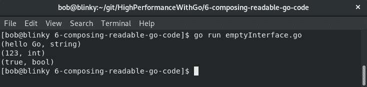

空的、可变的接口很方便，因为它们给了我们灵活性，以一种对代码编写者有意义的方式来操作我们的数据。

在下一节中，我们将讨论 Go 中的方法理解。

# 理解 Go 中的方法

Go 中的方法是具有特殊类型的函数，称为`接收器`，它位于`function`关键字和与关键字相关联的方法名称之间。Go 没有类与其他编程语言相同的方式。结构体通常与方法一起使用，以便以与其他语言中构造类似的方式捆绑数据及其相应的方法。当我们实例化一个新方法时，我们可以添加结构值以丰富函数调用。

我们可以实例化一个结构和一个方法如下：

```go
package main
import "fmt"
type User struct {
    uid int
    name string
    email string
    phone string
}

func (u User) displayEmail() {
    fmt.Printf("User %d Email: %s\n", u.uid, u.email)
}
```

完成后，我们可以使用此结构和方法来显示有关用户的信息，如下所示：

```go
func main() {
    userExample := User{
       uid: 1,
       name: "bob",
       email: "bob@example.com",
       phone: "123-456-7890",
    }

    userExample.displayEmail()
}
```

这将返回`userExample.displayEmail()`的结果，它会在方法调用中打印结构的相关部分，如下所示：

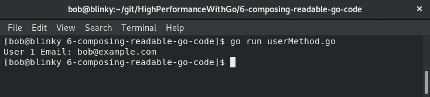

随着我们拥有更大的数据结构，我们有能力轻松有效地引用存储在这些结构中的数据。如果我们决定要编写一个方法来查找最终用户的电话号码，那么使用我们现有的数据类型并编写类似于`displayEmail`方法的方法来返回最终用户的电话号码将是很简单的。

到目前为止，我们所看到的方法只有值接收器。方法也可以有指针接收器。指针接收器在您希望在原地更新数据并使结果可用于调用函数时很有帮助。

考虑我们之前的例子，做一些修改。我们将有两种方法，允许我们更新用户的电子邮件地址和电话号码。电子邮件地址更新将使用值接收器，而电话更新将使用指针接收器。

我们在以下代码块中创建这些函数，以便能够轻松更新最终用户的信息：

```go
package main 
import "fmt"

type User struct {
    uid int
    name string
    email string
    phone string
} 

func (u User) updateEmail(newEmail string) {
    u.email = newEmail
} 

func (u *User) updatePhone(newPhone string) {
    u.phone = newPhone
} 
```

接下来在`main`中创建我们的示例最终用户，如下代码块所示：

```go
func main() {
      userExample := User{ 
        uid: 1, 
        name: "bob",
        email: "bob@example.com",
        phone: "123-456-7890",
    } 
```

然后我们在以下代码块中更新我们最终用户的电子邮件和电话号码：

```go
userExample.updateEmail("bob.strecansky@example.com") 
    (userExample).updatePhone("000-000-0000")
    fmt.Println("Updated User Email: ", userExample.email)
    fmt.Println("Updated User Phone: ", userExample.phone)
}     
```

在我们的输出结果中，我们可以看到从接收器的角度来看，用户的电子邮件地址没有被更新，但用户的电话号码已经被更新了：

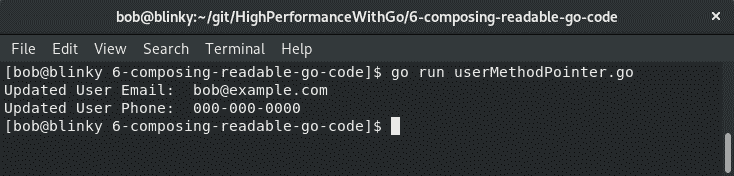

在尝试从方法调用中改变状态时，记住这一点是很重要的。方法在操作 Go 程序中的数据方面非常有帮助。

现在是时候看看 Go 中的继承是怎么回事了。

# 理解 Go 中的继承

Go 没有继承。组合用于将项目（主要是结构）嵌入在一起。当您有一个用于许多不同功能的基线结构时，这是方便的，其他结构在初始结构的基础上构建。

我们可以描述一些我厨房里的物品，以展示继承是如何工作的。

我们可以初始化我们的程序，如下代码块所示。在这个代码块中，我们创建了两个结构：

`器具`：我厨房抽屉里的器具

`电器`：我厨房里的电器

```go
package main
import "fmt" 

func main() {
    type Utensils struct {
        fork string
        spoon string
        knife string
    } 

    type Appliances struct {
        stove string
        dishwasher string
        oven string
    } 
```

接下来，我可以使用 Go 的嵌套结构来创建一个包含所有器具和电器的`厨房`结构，如下所示：

```go
    type Kitchen struct {
        Utensils
        Appliances
    } 
```

然后我可以用我拥有的器具和电器填满我的厨房：

```go
    bobKitchen := new(Kitchen)
    bobKitchen.Utensils.fork = "3 prong"
    bobKitchen.Utensils.knife = "dull"
    bobKitchen.Utensils.spoon = "deep"
    bobKitchen.Appliances.stove = "6 burner"
    bobKitchen.Appliances.dishwasher = "3 rack"
    bobKitchen.Appliances.oven = "self cleaning"
    fmt.Printf("%+v\n", bobKitchen) 
}                 
```

所有这些东西都在之后，我们可以看到结果输出，我的厨房物品（`器具`和`电器`）被组织在我的`厨房`结构中。我的`厨房`结构稍后可以轻松地在其他方法中引用。

拥有嵌套结构对于未来的扩展非常实用。如果我决定想要向这个结构中添加其他元素，我可以创建一个`House`结构，并将我的`Kitchen`结构嵌套在`House`结构中。我还可以为房子中的其他房间组合结构，并将它们添加到房子结构中。

在下一节中，我们将探讨 Go 中的反射。

# 探索 Go 中的反射

Go 中的反射是一种元编程形式。在 Go 中使用反射让程序理解自己的结构。有时候，当程序被组合时，我们想要在运行时使用一个变量，而这个变量在程序被组合时并不存在。我们使用反射来检查存储在接口变量中的键值对。反射通常不太清晰，因此在使用时要谨慎——它应该在必要时才使用。它只有运行时检查（而不是编译时检查），因此我们需要理性地使用反射。

重要的是要记住，Go 的变量是静态类型的。我们可以在 Go 中使用许多不同的变量类型——`rune`、`int`、`string`等。我们可以声明特定类型如下：

```go
Type foo int
var x int
var y foo
```

变量`x`和`y`都将是 int 类型的变量。

有三个重要的反射部分用于获取信息：

+   类型

+   种类

+   值

这三个不同的部分共同工作，以推断与接口相关的信息。让我们分别看看每个部分，看看它们如何配合。

# 类型

能够确定变量的类型在 Go 中是很重要的。在我们的例子中，我们可以验证字符串类型是否确实是字符串，如下面的代码块所示：

```go
package main

import (
    "fmt"
    "reflect"
)

func main() {
    var foo string = "Hi Go!"
    fooType := reflect.TypeOf(foo)
    fmt.Println("Foo type: ", fooType)
}
```

我们程序的输出将向我们展示反射类型将准确推导出`foo string`类型：

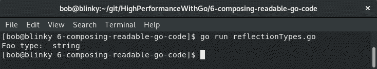

尽管这个例子很简单，但重要的是要理解其中的基本原则：如果我们不是验证字符串，而是查看传入的网络调用或外部库调用的返回，或者尝试构建一个可以处理不同类型的程序，反射库的`TypeOf`定义可以帮助我们正确地识别这些类型。

# 种类

种类被用作占位符，用于定义特定类型表示的类型。它用于表示类型由什么组成。这在确定定义了什么样的结构时非常有用。让我们看一个例子：

```go
package main
import (
    "fmt"
    "reflect"
)

func main() {
    i := []string{"foo", "bar", "baz"}
    ti := reflect.TypeOf(i)
    fmt.Println(ti.Kind())
}
```

在我们的例子中，我们可以看到我们创建了一个字符串切片——`foo`、`bar`和`baz`。然后，我们可以使用反射来找到`i`的类型，并且我们可以使用`Kind()`函数来确定类型是由什么组成的——在我们的例子中，是一个切片，如下所示：

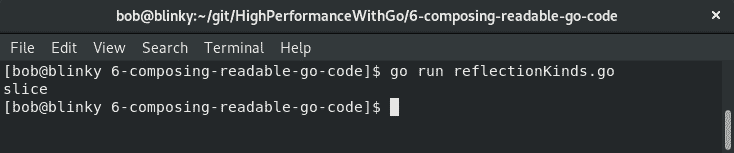

如果我们想要推断特定接口的类型，这可能会很有用。

# 值

反射中的值有助于读取、设置和存储特定变量的结果。在下面的例子中，我们可以看到我们设置了一个示例变量`foo`，并且使用反射包，我们可以推断出我们示例变量的值如下所示：

```go
package main
import (
    "fmt"
    "reflect"
)

func main() {
    example := "foo"
    exampleVal := reflect.ValueOf(example)
    fmt.Println(exampleVal)
}
```

在我们的输出中，我们可以看到示例变量`foo`的值被返回：

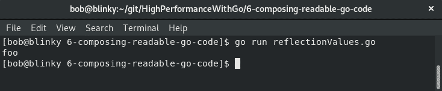

反射系统中的这三个不同的函数帮助我们推断我们可以在代码库中使用的类型。

# 总结

在本章中，我们学习了如何使用语言的一些核心原则来编写可读的 Go 代码。我们学习了简单性和可读性的重要性，以及打包、命名和格式化对于编写可读的 Go 代码是至关重要的。此外，我们还学习了接口、方法、继承和反射如何都可以用来编写其他人能够理解的代码。能够有效地使用这些核心 Go 概念将帮助您产生更高效的代码。

在下一章中，我们将学习 Go 语言中的内存管理，以及如何针对手头的内存资源进行优化。
