# 第七章：Go 中的模板编程

Go 中的模板编程允许最终用户编写生成、操作和运行 Go 程序的 Go 模板。Go 具有清晰的静态依赖关系，这有助于元编程。Go 中的模板编程，包括生成的二进制文件、CLI 工具和模板化库，都是语言的核心原则，帮助我们编写可维护、可扩展、高性能的 Go 代码。

在本章中，我们将涵盖以下主题：

+   Go generate

+   协议缓冲区代码生成

+   链接工具链

+   使用 Cobra 和 Viper 进行配置元编程

+   文本和 HTML 模板

+   Go 模板的 Sprig

所有这些主题都将帮助您更快、更有效地编写 Go 代码。在下一节中，我们将讨论 Go generate 以及它在 Go 编程语言中的用途。

# 理解 Go generate

截至 Go 版本 1.4，该语言包含一个名为 Go generate 的代码生成工具。Go generate 扫描源代码以运行通用命令。这独立于`go build`运行，因此必须在构建代码之前运行。Go generate 由代码作者运行，而不是由编译后的二进制文件的用户运行。这个工具的运行方式类似于通常使用 Makefile 和 shell 脚本的方式，但它是与 Go 工具一起打包的，我们不需要包含任何其他依赖项。

Go generate 将搜索代码库以查找以下模式的行：`//go:generate command argument`。

生成的源文件应该有以下一行，以传达代码是生成的：

```go
^// Code generated .* DO NOT EDIT\.$
```

当生成器运行时，Go generate 利用一组变量：

+   `$GOARCH`：执行平台的架构

+   `$GOOS`：执行平台的操作系统

+   `$GOFILE`：文件名

+   `$GOLINE`：包含指令的源文件的行号

+   `$GOPACKAGE`：包含指令的文件的包名称

+   `$DOLLAR`：一个字面的`$`

我们可以在 Go 中使用这个 Go generate 命令来处理各种不同的用例。它们可以被视为 Go 的内置构建机制。使用 Go generate 执行的操作可以使用其他构建工具，比如 Makefile，但有了 Go generate，您就不需要在构建环境中包含任何其他依赖项。这意味着所有的构建产物都存储在 Go 文件中，以保持项目的一致性。

# 生成 protobufs 的代码

在 Go 中生成代码的一个实际用例是使用 gRPC 生成协议缓冲区。协议缓冲区是一种用于序列化结构化数据的新方法。它通常用于在分布式系统中的服务之间传递数据，因为它往往比其 JSON 或 XML 对应物更有效。协议缓冲区还可以跨多种语言和多个平台进行扩展。它们带有结构化数据定义；一旦您的数据被结构化，就会生成可以从数据源读取和写入的源代码。

首先，我们需要获取最新版本的协议缓冲区：[`github.com/protocolbuffers/protobuf/releases`](https://github.com/protocolbuffers/protobuf/releases)。

在撰写本文时，该软件的稳定版本为 3.8.0。安装此软件包后，我们需要确保使用`go get github.com/golang/protobuf/protoc-gen-go`命令拉取所需的 Go 依赖项。接下来，我们可以生成一个非常通用的协议定义：

```go
syntax = "proto3";
package userinfo;
  service UserInfo {
  rpc PrintUserInfo (UserInfoRequest) returns (UserInfoResponse) {}

} 

message UserInfoRequest {
  string user = 1;
  string email = 2;
} 

message UserInfoResponse {
  string response = 1; 
} 
```

之后，我们可以使用 Go generate 生成我们的 protofile。在与您的`.proto`文件相同的目录中创建一个包含以下内容的文件：

```go
package userinfo
//go:generate protoc -I ../userinfo --go_out=plugins=grpc:../userinfo ../userinfo/userinfo.proto
```

这使我们可以通过使用 Go generate 来生成协议缓冲区定义。在这个目录中执行 Go generate 后，我们会得到一个文件`userinfo.pb.go`，其中包含了所有我们的协议缓冲区定义的 Go 格式。当我们使用 gRPC 生成客户端和服务器架构时，我们可以使用这些信息。

接下来，我们可以创建一个服务器来使用我们之前添加的 gRPC 定义：

```go
package main

import (
    "context"
    "log"
    "net"      
    pb "github.com/HighPerformanceWithGo/7-metaprogramming-in-go/grpcExample/userinfo/userinfo"
    "google.golang.org/grpc"
)      
type userInfoServer struct{}       
func (s *userInfoServer) PrintUserInfo(ctx context.Context, in *pb.UserInfoRequest) (*pb.UserInfoResponse, error) {
    log.Printf("%s %s", in.User, in.Email)
    return &pb.UserInfoResponse{Response: "User Info: User Name: " + in.User + " User Email: " + in.Email}, nil 
} 
```

一旦我们初始化了服务器结构并有一个返回用户信息的函数，我们就可以设置我们的 gRPC 服务器监听我们的标准端口并注册我们的服务器：

```go
func main() {
  l, err := net.Listen("tcp", ":50051")
  if err != nil {
    log.Fatalf("Failed to listen %v", err)
  }
  s := grpc.NewServer()
  pb.RegisterUserInfoServer(s, &userInfoServer{})
  if err := s.Serve(l); err != nil {
    log.Fatalf("Couldn't create Server: %v", err)
  }
}
```

一旦我们设置好服务器定义，我们就可以专注于客户端。我们的客户端具有所有常规的导入，以及一些默认的常量声明，如下所示：

```go
package main

import (
  "context"
  "log"
  "time"

  pb "github.com/HighPerformanceWithGo/7-metaprogramming-in-go/grpcExample/userinfo/userinfo"
  "google.golang.org/grpc"
)

const (
  defaultGrpcAddress = "localhost:50051"
  defaultUser = "Gopher"
  defaultEmail = "Gopher@example.com"
)

```

在我们设置好导入和常量之后，我们可以在主函数中使用它们将这些值发送到我们的服务器。我们设置了一个默认超时为 1 秒的上下文，我们发出了一个`PrintUserInfo`的 protobuf 请求，然后得到了一个响应并记录下来。以下是我们的 protobuf 示例：

```go
func main() {
  conn, err := grpc.Dial(defaultGrpcAddress, grpc.WithInsecure())
  if err != nil {
    log.Fatalf("did not connect: %v", err)
  }
  defer conn.Close()
  c := pb.NewUserInfoClient(conn)

  user := defaultUser
  email := defaultEmail
  ctx, cancel := context.WithTimeout(context.Background(), time.Second)
  defer cancel()
  r, err := c.PrintUserInfo(ctx, &pb.UserInfoRequest{User: user, Email: email})
  if err != nil {
    log.Fatalf("could not greet: %v", err)
  }
  log.Printf("%s", r.Response)
}
```

我们可以在这里看到我们的 protobuf 示例在运行中的情况。Protobuf 是在分布式系统中发送消息的强大方式。Google 经常提到 protobuf 对于他们在规模上的稳定性有多么重要。我们将在下一节讨论我们的 protobuf 代码的结果。

# Protobuf 代码结果

一旦我们有了我们的协议定义、我们的服务器和我们的客户端，我们可以一起执行它们，看到我们的工作在实际中的效果。首先，我们启动服务器：

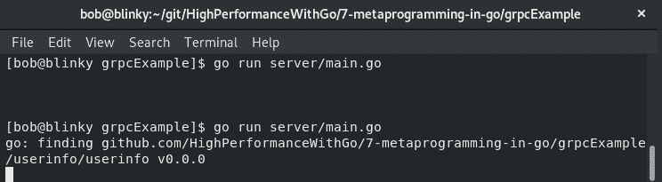

接下来，我们执行客户端代码。我们可以在我们的客户端代码中看到我们创建的默认用户名和电子邮件地址：

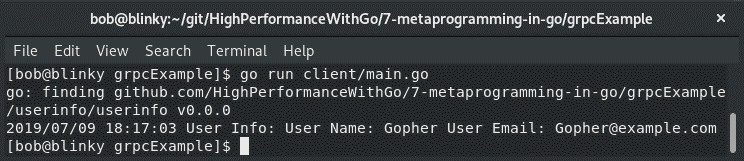

在服务器端，我们可以看到我们发出的请求的日志：

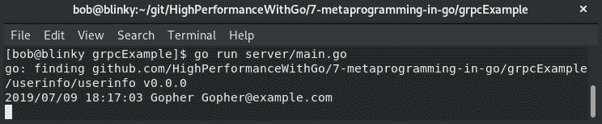

gRPC 是一个非常高效的协议：它使用 HTTP/2 和协议缓冲区来快速序列化数据。客户端到服务器的单个连接可以进行多次调用，从而减少延迟并增加吞吐量。

在下一节中，我们将讨论链接工具链。

# 链接工具链

Go 语言在其链接工具中有一堆方便的工具，允许我们将相关数据传递给可执行函数。使用这个工具，程序员可以为具有特定名称和值对的字符串设置一个值。在 Go 语言的`cmd`/`link`包中允许您在链接时向 Go 程序传递信息。将此信息从工具链传递到可执行文件的方法是利用构建参数：

```go
go build -ldflags '-X importpath.name=value'
```

例如，如果我们试图从命令行中获取程序的序列号，我们可以做如下操作：

```go
package main

import (
  "fmt"
)

var SerialNumber = "unlicensed"

func main() {
  if SerialNumber == "ABC123" {
    fmt.Println("Valid Serial Number!")
  } else {
    fmt.Println("Invalid Serial Number")
  }
}
```

如前面的输出所示，如果我们尝试在不传入序列号的情况下执行此程序，程序将告诉我们我们的序列号无效：

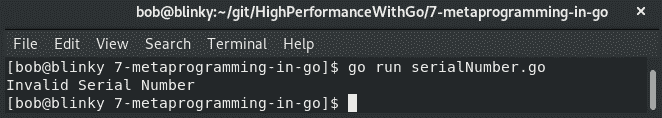

如果我们传入一个不正确的序列号，我们将得到相同的结果：

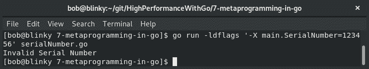

如果我们传入正确的序列号，我们的程序将告诉我们我们有一个有效的序列号：

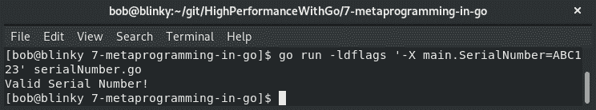

在链接时将数据传递到程序中的能力在排查大型代码库时非常有用。当您需要部署一个已编译的二进制文件，但稍后可能需要以非确定性方式更新一个常见值时，这也是非常有用的。

在下一节中，我们将讨论两个常用于配置编程的工具——Cobra 和 Viper。

# 介绍 Cobra 和 Viper 用于配置编程

两个常用的 Go 库`spf13/cobra`和`spf13/viper`用于配置编程。这两个库可以一起用于创建具有许多可配置选项的 CLI 二进制文件。Cobra 允许您生成应用程序和命令文件，而 Viper 有助于读取和维护 12 因素 Go 应用程序的完整配置解决方案。Cobra 和 Viper 在一些最常用的 Go 项目中使用，包括 Kubernetes 和 Docker。

要一起使用这两个库制作一个`cmd`库，我们需要确保我们嵌套我们的项目目录，如下所示：

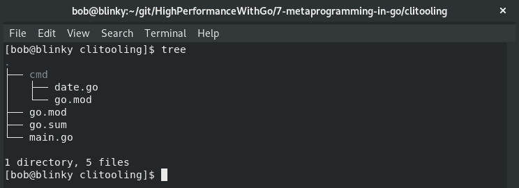

一旦我们创建了嵌套的目录结构，我们就可以开始设置我们的主程序。在我们的 `main.go` 文件中，我们已经定义了我们的日期命令 - Cobra 和 Viper 的 `main.go` 函数故意简单，以便我们可以调用在 `cmd` 目录中编写的函数（这是一个常见的 Go 习惯）。我们的 `main` 包如下所示：

```go
package main

import (
    "fmt"
    "os"

    "github.com/HighPerformanceWithGo/7-metaprogramming-in-go/clitooling/cmd"
) 

func main() {

    if err := cmd.DateCommand.Execute(); err != nil { 
        fmt.Println(err)
        os.Exit(1)
    } 
} 
```

一旦我们定义了我们的 `main` 函数，我们就可以开始设置我们的其余命令工具。我们首先导入我们的要求：

```go
package cmd 

import (
    "fmt"
    "time"

    "github.com/spf13/cobra"
    "github.com/spf13/viper"
) 

var verbose bool
```

接下来，我们可以设置我们的根 `date` 命令：

```go
var DateCommand = &cobra.Command{
    Use: "date",
    Aliases: []string{"time"},
    Short: "Return the current date",
    Long: "Returns the current date in a YYYY-MM-DD HH:MM:SS format",
    Run: func(cmd *cobra.Command, args []string) {
        fmt.Println("Current Date :\t", time.Now().Format("2006.01.02 15:04:05"))
        if viper.GetBool("verbose") {
            fmt.Println("Author :\t", viper.GetString("author"))
            fmt.Println("Version :\t", viper.GetString("version"))
        } 
    }, 
} 
```

一旦我们设置了这个，我们还可以设置一个子命令来显示我们的许可信息，如下面的代码示例所示。子命令是 CLI 工具的第二个参数，以便为 `cli` 提供更多信息：

```go
var LicenseCommand = &cobra.Command{
    Use: "license",
    Short: "Print the License",
    Long: "Print the License of this Command",
    Run: func(cmd *cobra.Command, args []string) {
        fmt.Println("License: Apache-2.0")
    }, 
}         
```

最后，我们可以设置我们的 `init()` 函数。Go 中的 `init()` 函数用于一些事情：

+   向用户显示初始信息

+   初始变量声明

+   初始化与外部方的连接（例如 DB 连接池或消息代理初始化）

我们可以在代码的最后部分利用我们新的 `init()` 函数知识来初始化我们之前定义的 `viper` 和 `cobra` 命令：

```go
func init() {
    DateCommand.AddCommand(LicenseCommand) 
    viper.SetDefault("Author", "bob")
    viper.SetDefault("Version", "0.0.1")
    viper.SetDefault("license", "Apache-2.0")
    DateCommand.PersistentFlags().BoolP("verbose", "v", false, "Date 
     Command Verbose")
    DateCommand.PersistentFlags().StringP("author", "a", "bob", "Date 
     Command Author")

    viper.BindPFlag("author",    
     DateCommand.PersistentFlags().Lookup("author"))
    viper.BindPFlag("verbose", 
     DateCommand.PersistentFlags().Lookup("verbose"))

} 
```

前面的代码片段向我们展示了 Viper 中常用的一些默认、持久和绑定标志。

# Cobra/Viper 结果集

现在我们已经实例化了所有的功能，我们可以看到我们的新代码在运行中的情况。

如果我们调用我们的新的 `main.go` 而没有任何可选参数，我们将只看到我们在初始 `DateCommand` 运行块中定义的日期返回，如下面的代码输出所示：

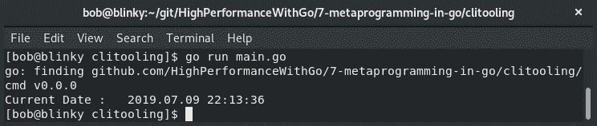

如果我们向我们的输入添加额外的标志，我们可以收集详细信息并使用命令行标志更改包的作者，如下所示：

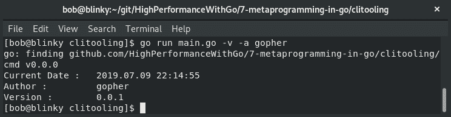

我们还可以通过将其作为参数添加来查看我们为许可创建的子命令，如下所示：

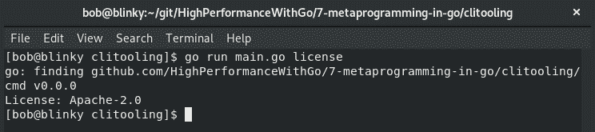

我们已经看到了 `spf13` Cobra 和 Viper 包的一小部分功能，但重要的是要理解它们的根本原则 - 它们用于在 Go 中促进可扩展的 CLI 工具。在下一节中，我们将讨论文本模板。

# 文本模板

Go 有一个内置的模板语言 `text/template`，它使用数据实现模板并生成基于文本的输出。我们使用结构来定义我们想要在模板中使用的数据。与所有事物一样，Go 输入文本被定义为 UTF-8，并且可以以任何格式传递。我们使用双大括号 `{{}}` 来表示我们想要在我们的数据上执行的操作。由 `.` 表示的光标允许我们向我们的模板添加数据。这些组合在一起创建了一个强大的模板语言，它将允许我们为许多代码片段重用模板。

首先，我们将初始化我们的包，导入我们需要的依赖项，并为我们想要传递到模板中的数据定义我们的结构：

```go
package main

import (
  "fmt"
  "os"
  "text/template"
)

func main() {
  type ToField struct {
    Date string
    Name string
    Email string
    InOffice bool
  }
```

现在，我们可以使用我们之前提到的 text/template 定义来设置我们的模板和输入结构：

```go
     const note = `
{{/* we can trim whitespace with a {- or a -} respectively */}}
Date: {{- .Date}}
To: {{- .Email | printf "%s"}}
{{.Name}},
{{if .InOffice }}
Thank you for your input yesterday at our meeting.  We are going to go ahead with what you've suggested.
{{- else }}
We were able to get results in our meeting yesterday.  I've emailed them to you.  Enjoy the rest of your time Out of Office!
{{- end}}
Thanks,
Bob
`
    var tofield = []ToField{
        {"07-19-2019", "Mx. Boss", "boss@example.com", true},
        {"07-19-2019", "Mx. Coworker", "coworker@example.com", false},
    }
```

最后，我们可以执行我们的模板并打印它。我们的示例打印到 `Stdout`，但我们也可以打印到文件，写入缓冲区，或自动发送电子邮件：

```go
    t := template.Must(template.New("Email Body").Parse(note))
    for _, k := range tofield {
        err := t.Execute(os.Stdout, k)
        if err != nil {
            fmt.Print(err)
        }
    }
}
```

利用 Go 文本模板系统，我们可以重复使用这些模板来生成一致的高质量内容。由于我们有新的输入，我们可以调整我们的模板并相应地得出结果。在下一节中，我们将讨论 HTML 模板。

# HTML 模板

我们还可以使用 HTML 模板，类似于我们执行文本模板，以便在 Go 中为 HTML 页面生成动态结果。为了做到这一点，我们需要初始化我们的包，导入适当的依赖项，并设置一个数据结构来保存我们计划在 HTML 模板中使用的值，如下所示：

```go
package main

import (
    "html/template"
    "net/http"
)

type UserFields struct {
    Name string
    URL string
    Email string
}
```

接下来，我们创建`userResponse` HTML 模板：

```go
var userResponse = ` 
<html>
<head></head>
<body>
<h1>Hello {{.Name}}</h1>
<p>You visited {{.URL}}</p>
<p>Hope you're enjoying this book!</p> 
<p>We have your email recorded as {{.Email}}</p>
</body>
</html>
`
```

然后，我们创建一个 HTTP 请求处理程序：

```go
func rootHandler(w http.ResponseWriter, r *http.Request) {
    requestedURL := string(r.URL.Path)
    userfields := UserFields{"Bob", requestedURL, "bob@example.com"}
    t := template.Must(template.New("HTML Body").Parse(userResponse))
    t.Execute(w, userfields)
    log.Printf("User " + userfields.Name + " Visited : " + requestedURL)
}
```

之后，我们初始化 HTTP 服务器：

```go
func main() {
 s := http.Server{
 Addr: "127.0.0.1:8080",
 } 
 http.HandleFunc("/", rootHandler)
 s.ListenAndServe()
}
```

然后，我们使用`go run htmlTemplate.go`调用我们的 Web 服务器。当我们在该域上请求页面时，我们将看到以下结果：

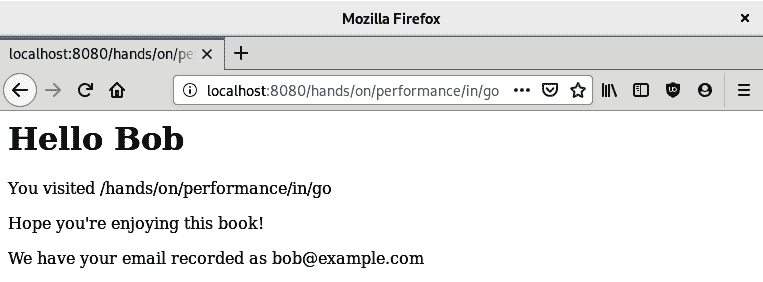

前面的输出来自于我们的 HTML 模板中的模板化代码。这个例子可以扩展到包括解析通过 X-Forwarded-For 头部的传入 IP 地址请求，基于用户代理字符串的最终用户浏览器信息，或者可以用于向客户端返回丰富响应的任何其他特定请求参数。在下一节中，我们将讨论 Sprig，一个用于 Go 模板函数的库。

# 探索 Sprig

Sprig 是一个用于定义 Go 模板函数的库。该库包括许多函数，扩展了 Go 的模板语言的功能。Sprig 库有一些原则，有助于确定哪些函数可用于驱动增强的模板：

+   只允许简单的数学运算

+   只处理传递给模板的数据；从不从外部来源检索数据

+   利用模板库中的函数构建结果布局

+   永远不会覆盖 Go 核心模板功能

在以下小节中，我们将更详细地了解 Sprig 的功能。

# 字符串函数

Sprig 具有一组字符串函数，可以在模板中操作字符串。

在我们的示例中，我们将采用`"   -  bob smith"`字符串（注意空格和破折号）。然后，我们将执行以下操作：

+   使用`trim()`实用程序修剪空格

+   用单词`smith`替换单词`strecansky`的实例

+   修剪`-`前缀

+   将字符串更改为标题大小写，即从`bob strecansky`更改为`Bob Strecansky`

+   重复字符串 10 次

+   创建一个 14 个字符的单词换行（我的名字的宽度），并用新行分隔每个字符。

Sprig 库可以在一行中执行此操作，类似于 bash shell 可以将函数串联在一起。

我们首先初始化我们的包并导入必要的依赖项：

```go
package main 

import ( 
    "fmt" 
    "os" 
    "text/template" 

    "github.com/Masterminds/sprig" 
) 

```

接下来，我们将我们的字符串映射设置为`interface`，执行我们的转换，并将我们的模板呈现到标准输出：

```go
func main() {
  inStr := map[string]interface{}{"Name": " - bob smith"}
  transform := `{{.Name | trim | replace "smith" "strecansky" | trimPrefix "-" | title | repeat 10 | wrapWith 14 "\n"}}`

  functionMap := sprig.TxtFuncMap()
  t := template.Must(template.New("Name Transformation").Funcs(functionMap).Parse(transform))

  err := t.Execute(os.Stdout, inStr)
  if err != nil {
    fmt.Printf("Couldn't create template: %s", err)
    return
  }
}
```

执行程序后，我们将看到字符串操作发生的方式与我们预期的方式相同：

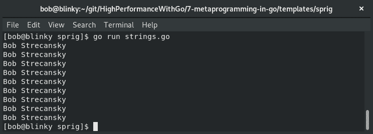

能够像我们的示例中那样在模板中操作字符串，有助于我们快速纠正可能存在的任何模板问题，并即时操纵它们。

# 字符串切片函数

能够在模板中操作字符串切片是有帮助的，正如我们在之前的章节中所看到的。Sprig 库帮助我们执行一些字符串切片操作。在我们的示例中，我们将根据`.`字符拆分字符串。

首先，我们导入必要的库：

```go
package main

import (
    "fmt"
    "os"
    "text/template"

    "github.com/Masterminds/sprig"
) 

func main() {
```

接下来，我们使用`.`分隔符拆分我们的模板字符串：

```go
    tpl := `{{$v := "Hands.On.High.Performance.In.Go" | splitn "." 5}}{{$v._3}}`

    functionMap := sprig.TxtFuncMap()
    t := template.Must(template.New("String 
     Split").Funcs(functionMap).Parse(tpl))

    fmt.Print("String Split into Dict (word 3): ")
    err := t.Execute(os.Stdout, tpl)
    if err != nil {
        fmt.Printf("Couldn't create template: %s", err)
        return
    } 
```

我们还可以使用`sortAlpha`函数将模板化列表按字母顺序排序：

```go
    alphaSort := `{{ list "Foo" "Bar" "Baz" | sortAlpha}}` 
    s := template.Must(template.New("sortAlpha").
      Funcs(functionMap).Parse(alphaSort))
    fmt.Print("\nAlpha Tuple: ")
    alphaErr := s.Execute(os.Stdout, tpl)
    if alphaErr != nil {
        fmt.Printf("Couldn't create template: %s", err)
        return
    } 

    fmt.Print("\nString Slice Functions Completed\n")
} 
```

这些字符串操作可以帮助我们组织包含在模板化函数中的字符串列表。

# 默认函数

Sprig 的默认函数为模板化函数返回默认值。我们可以检查特定数据结构的默认值以及它们是否为空。对于每种数据类型，都定义了*空*。

| 数字 | `0` |
| --- | --- |
| 字符串 | `""`（空字符串） |
| 列表 | `[]`（空列表） |
| 字典 | `{}`（空字典） |
| 布尔值 | `false` |
| 并且总是 | 空（也称为空） |
| 结构 | 空的定义；永远不会返回默认值 |

我们从导入开始：

```go
package main

import (
    "fmt"
    "os"
    "text/template"

    "github.com/Masterminds/sprig"
) 

```

接下来，我们设置我们的空和非空模板变量：

```go
func main() {

    emptyTemplate := map[string]interface{}{"Name": ""} 
    fullTemplate := map[string]interface{}{"Name": "Bob"}
    tpl := `{{empty .Name}}`
    functionMap := sprig.TxtFuncMap()
    t := template.Must(template.New("Empty 
     String").Funcs(functionMap).Parse(tpl))
```

然后，我们验证我们的空模板和非空模板：

```go
    fmt.Print("empty template: ")
    emptyErr := t.Execute(os.Stdout, emptyTemplate)
    if emptyErr != nil {
        fmt.Printf("Couldn't create template: %s", emptyErr)
        return
    } 

    fmt.Print("\nfull template: ")
    fullErr := t.Execute(os.Stdout, fullTemplate)
    if emptyErr != nil {
        fmt.Printf("Couldn't create template: %s", fullErr)
        return
    } 
    fmt.Print("\nEmpty Check Completed\n") 
}
```

当我们有模板输入需要验证输入不为空时，这是非常有用的。我们的输出结果显示了我们的预期：空模板标记为 true，而完整模板标记为 false：

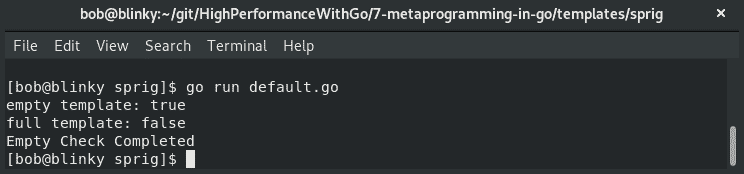

我们还可以将 JSON 文字编码为 JSON 字符串并进行漂亮打印。如果您正在处理需要向最终用户返回 JSON 数组的 HTML 创建的模板，这将特别有帮助。

```go
package main
import (
    "fmt"
    "os"
    "text/template"
    "github.com/Masterminds/sprig"
)
func main() {
    jsonDict := map[string]interface{}{"JSONExamples": map[string]interface{}{"foo": "bar", "bool": false, "integer": 7}} 
    tpl := `{{.JSONExamples | toPrettyJson}}`
    functionMap := sprig.TxtFuncMap()
    t := template.Must(template.New("String Split").Funcs(functionMap).Parse(tpl))
    err := t.Execute(os.Stdout, jsonDict)
    if err != nil {
        fmt.Printf("Couldn't create template: %s", err)
        return
    } 
} 
```

在我们的输出结果中，我们可以看到基于我们的`jsonDict`输入的漂亮打印的 JSON 块：

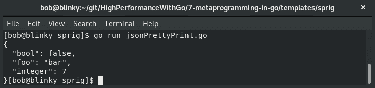

当与 HTML/template 内置和添加的`content-encoding:json`HTTP 头一起使用时，这非常有用。

Sprig 库有相当多的功能，其中一些我们将在本书的本节中讨论。

可以在[`masterminds.github.io/sprig/`](http://masterminds.github.io/sprig/)找到通过 Sprig 可用的功能的完整列表。

# 总结

在本章中，我们讨论了生成 Go 代码。我们讨论了如何为 Go 代码中最常见的生成部分之一，gRPC protobufs，进行生成。然后，我们讨论了使用链接工具链添加命令行参数和`spf13/cobra`和`spf13/viper`来创建元编程 CLI 工具。最后，我们讨论了使用 text/template、HTML/template 和 Sprig 库进行模板化编程。使用所有这些包将帮助我们编写可读、可重用、高性能的 Go 代码。这些模板也将在长远来看为我们节省大量工作，因为它们往往是可重用和可扩展的。

在下一章中，我们将讨论如何优化内存资源管理。
