# Go 中的内存管理

内存管理对系统性能至关重要。能够充分利用计算机的内存占用空间，使您能够将高度运行的程序保持在内存中，以便您不经常不得不承受交换到磁盘的巨大性能损失。能够有效地管理内存是编写高性能 Go 代码的核心原则。在本章中，我们将学习以下主题：

+   计算机内存

+   内存如何分配

+   Go 如何有效利用内存

+   内存中如何分配对象

+   有限内存计算设备的策略

了解内存如何被利用可以帮助您学会在程序中有效地利用内存。内存是计算机中存储和操作数据的最快速的地方之一，因此能够高效地管理它将对您的代码质量产生持久的影响。

# 理解现代计算机内存 - 入门

现代计算机具有**随机存取存储器**（**RAM**），用于机器代码和数据存储。 RAM 与 CPU 和硬盘一起用于存储和检索信息。利用 CPU、RAM 和硬盘会有性能折衷。在撰写本文时的现代计算机中，我们对计算机中一些常见操作的一些通用、粗略的时间有以下表述：

| **数据存储类型** | **时间** |
| --- | --- |
| L1（处理器缓存）引用 | 1 ns |
| L2（处理器缓存）引用 | 4 ns |
| 主内存引用 | 100 ns |
| SSD 随机读取 | 16 μs |
| 7200 RPM HDD 磁盘搜索 | 2 ms |

正如您从表中所注意到的，不同的存储类型在现代计算机架构的不同部分具有截然不同的时间。新计算机具有 KB 的 L1 缓存，MB 的 L2 缓存，GB 的主内存和 TB 的 SSD/HDD。由于我们认识到这些不同类型的数据存储在成本和性能方面存在显着差异，我们需要学会如何有效地使用它们，以便编写高性能的代码。

# 分配内存

计算机的主内存用于许多事情。**内存管理单元**（**MMU**）是一种计算机硬件，用于在物理内存地址和虚拟内存地址之间进行转换。当 CPU 执行使用内存地址的指令时，MMU 会获取逻辑内存地址并将其转换为物理内存地址。这些以物理内存地址的分组称为页面。页面通常以 4 kB 段处理，使用称为页表的表。MMU 还具有其他功能，包括使用缓冲区，如**转换旁路缓冲器**（**TLB**），用于保存最近访问的转换。

虚拟内存有助于做到以下几点：

+   允许将硬件设备内存映射到地址空间

+   允许特定内存区域的访问权限（rwx）

+   允许进程具有单独的内存映射

+   允许内存更容易移动

+   允许内存更容易地交换到磁盘

+   允许共享内存，其中物理内存映射到多个进程

当在现代 Linux 操作系统中分配虚拟内存时，内核和用户空间进程都使用虚拟地址。这些虚拟地址通常分为两部分 - 虚拟地址空间中的内存上部分用于内核和内核进程，内存下部分用于用户空间程序。

操作系统利用这些内存。它将进程在内存和磁盘之间移动，以优化我们计算机中可用资源的使用。计算机语言在其运行的底层操作系统中使用**虚拟内存空间**（**VMS**）。 Go 也不例外。如果您在 C 中编程，您会知道 malloc 和 free 的习语。在 Go 中，我们没有`malloc`函数。 Go 也是一种垃圾收集语言，因此我们不必考虑释放内存分配。

我们在用户空间内有两种不同的主要内存度量：VSZ 和 RSS。

# 介绍 VSZ 和 RSS

**VSZ**，**虚拟内存大小**，指的是一个单独进程可以访问的所有内存，包括交换内存。这是在程序初始执行时分配的内存大小。VSZ 以 KiB 为单位报告。

**RSS**，**驻留集大小**，指的是特定进程在 RAM 中分配了多少内存，不包括交换内存。RSS 包括共享库内存，只要该内存目前可用。RSS 还包括堆栈和堆内存。根据这些内存引用通常是共享的事实，RSS 内存可能大于系统中可用的总内存。RSS 以千字节为单位报告。

当我们启动一个简单的 HTTP 服务器时，我们可以看到分配给我们各个进程的 VSZ 和 RSS 如下：

```go
package main
import (
    "io"
    "net/http"
)

func main() {
    Handler := func(w http.ResponseWriter, req *http.Request) {
       io.WriteString(w, "Memory Management Test")
    }
    http.HandleFunc("/", Handler)
    http.ListenAndServe(":1234", nil)
}
```

然后我们可以看一下在调用服务器时生成的进程 ID，如下所示：

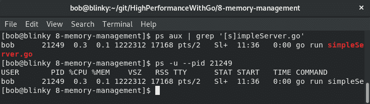

在这里，我们可以看到我们调用的`server.go`进程的 VSZ 和 RSS 值。

如果我们想要减小 Go 二进制文件的构建大小，我们可以使用`build`标志构建我们的二进制文件，而不包括 libc 库，如下所示：

```go
go build -ldflags '-libgcc=none' simpleServer.go
```

如果我们构建二进制文件时不包括 libc 库，我们的示例服务器的内存占用将会小得多，如下所示：

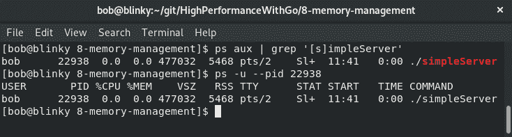

正如我们所看到的，我们的 VSZ 和 RSS 内存利用率都大大减少了。在实践中，内存是廉价的，我们可以将 libc 库留在我们的 Golang 二进制文件中。Libc 用于许多标准库部分，包括用户和组解析以及主机解析的部分，这就是为什么它在构建时动态链接的原因。

在构建 Go 二进制文件后，它们以容器格式存储。Linux 机器将这个特定的二进制文件存储在一种称为**ELF**（可执行和可链接格式）的格式中。Go 的标准库有一种方法来读取 ELF 文件。我们可以检查之前生成的`simpleServer`二进制文件：

```go
package main
import (
    "debug/elf"
    "fmt"
    "log"
    "os"
)
func main() {
    if len(os.Args) != 2 {
       fmt.Println("Usage: ./elfReader elf_file")
       os.Exit(1)
    }
    elfFile, err := elf.Open(os.Args[1])
    if err != nil {
       log.Fatal(err)
    }
    for _, section := range elfFile.Sections {
       fmt.Println(section)
    }
}
```

我们的`simpleServer`示例的输出结果如下：

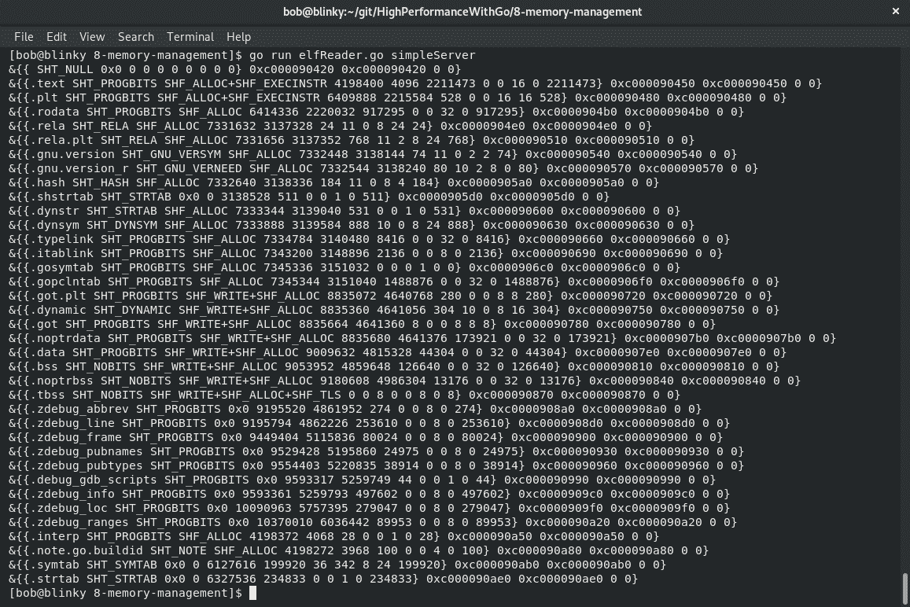

还有其他 Linux 工具可以用来调查这些 ELF 二进制文件。`readelf`也会以更易读的格式打印 ELF 文件。例如，我们可以这样查看一个 ELF 文件：

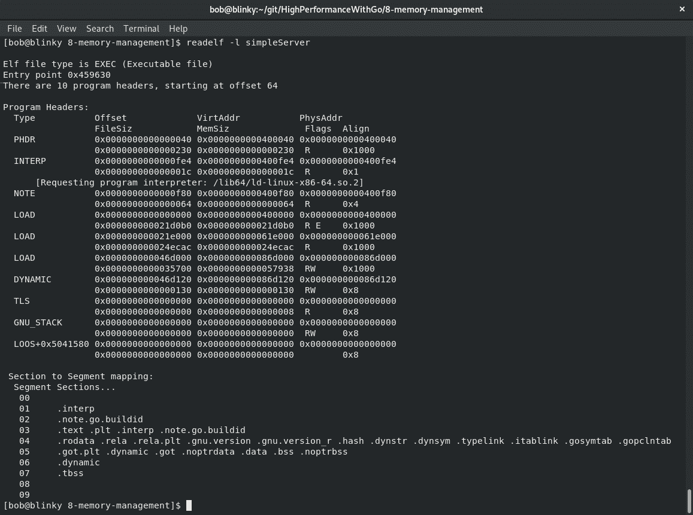

ELF 文件有特定的格式。该格式如下：

| **文件布局部分** | **描述** |
| --- | --- |
| 文件头 | **类字段**：定义 32 位和 64 位地址分别为 52 或 64 字节长。**数据**：定义小端或大端。**版本**：存储 ELF 版本（目前只有一个版本，01）。**OS/ABI**：定义操作系统和应用程序二进制接口。**机器**：告诉你机器类型。**类型**：指示这是什么类型的文件；常见类型有 CORE，DYN（用于共享对象），EXEC（用于可执行文件）和 REL（用于可重定位文件）。 |
| 程序头或段 | 包含有关如何在运行时创建进程或内存映像以执行的指令。然后内核使用这些指令通过 mmap 映射到虚拟地址空间。 |
| 部分头或部分 | `.text`：可执行代码（指令，静态常量，文字）`.data`：受控访问的初始化数据`.rodata`：只读数据`.bss`：读/写未初始化数据 |

我们还可以编译这个程序的 32 位版本以查看差异。如第一章中所述，*Go 性能简介*，我们可以为不同的架构构建 Go 二进制文件。我们可以使用以下构建参数为 i386 Linux 系统构建二进制文件：

`env GOOS=linux GOARCH=386 go build -o 386simpleServer simpleServer.go`

完成此构建后，我们可以检查生成的 ELF 文件，并证实生成的 ELF 与之前为我的 x86_64 计算机处理的 ELF 不同。我们将使用`-h`标志仅查看每个文件的头部以简洁起见：


如您在输出结果中所见，这个特定的二进制文件是为 i386 处理器生成的，而不是最初生成的 x86_64 二进制文件：

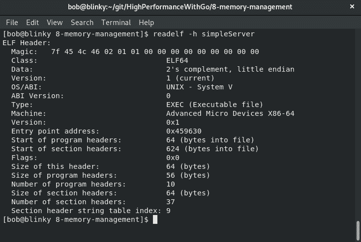

了解系统的限制、架构和内存限制可以帮助您构建在主机上有效运行的 Go 程序。在本节中，我们将处理内存利用。

# 理解内存利用

一旦我们有了初始的二进制文件，我们就开始建立对 ELF 格式的了解，以继续理解内存利用。文本、数据和 bss 字段是堆和栈的基础。堆从`.bss`和`.data`位的末尾开始，并持续增长以形成更大的内存地址。

堆栈是连续内存块的分配。这种分配在函数调用堆栈内自动发生。当调用函数时，其变量在堆栈上分配内存。函数调用完成后，变量的内存被释放。堆栈具有固定大小，只能在编译时确定。从分配的角度来看，堆栈分配是廉价的，因为它只需要推送到堆栈和从堆栈中拉取以进行分配。

堆是可用于分配和释放的内存组合。内存是以随机顺序分配的，由程序员手动执行。由于其非连续的块，它在时间上更昂贵，访问速度较慢。然而，堆中的元素可以调整大小。堆分配是昂贵的，因为 malloc 搜索足够的内存来容纳新数据。随着垃圾收集器的工作，它扫描堆中不再被引用的对象，并将它们释放。这两个过程比堆栈分配/释放位要昂贵得多。因此，Go 更喜欢在堆栈上分配而不是在堆上分配。

我们可以使用`-m`的 gcflag 编译程序，以查看 Go 编译器如何使用逃逸分析（编译器确定在运行时初始化变量时是否使用堆栈或堆的过程）。

我们可以创建一个非常简单的程序如下：

```go
package main

import "fmt"

func main() {
    greetingString := "Hello Gophers!"
    fmt.Println(greetingString) 
} 
```

然后，我们可以使用逃逸分析标志编译我们的程序如下：

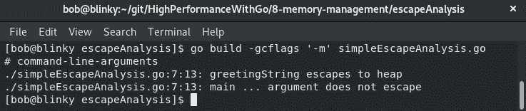

在我们的输出结果中，我们可以看到我们简单的`greetingString`被分配到了堆上。如果我们想要使用此标志进行更多详细信息，我们可以传递多个`m`值。在撰写本文时，传递多达 5 个`-m`标志会给我们不同级别的详细信息。以下屏幕截图是使用 3 个`-m`标志进行构建的（为简洁起见）：

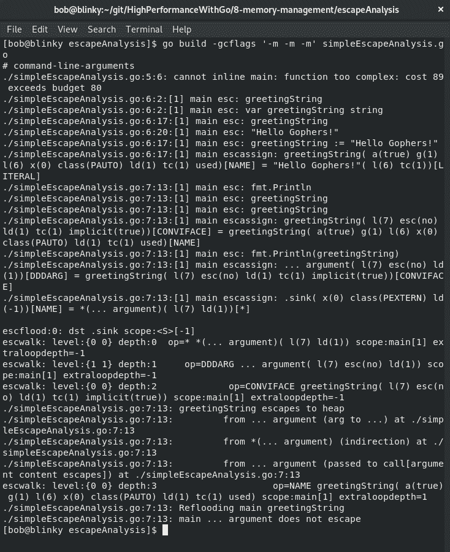

静态分配的 Go 变量倾向于存在堆栈上。指向内存或接口类型方法的项目倾向于是动态的，因此通常存在堆上。

如果我们想在执行构建时看到更多可用的优化，我们可以使用以下命令查看它们：`go tool compile -help`。

# Go 运行时内存分配

正如我们在第三章中所学的，*理解并发性*，Go 运行时使用`G`结构来表示单个 goroutine 的堆栈参数。`P`结构管理执行的逻辑处理器。作为 Go 运行时的一部分使用的 malloc，在[`golang.org/src/runtime/malloc.g`](https://golang.org/src/runtime/malloc.go)中定义，做了很多工作。Go 使用 mmap 直接向底层操作系统请求内存。小的分配大小（内存分配最多达到 32KB）与大内存分配分开处理。

# 内存分配入门

让我们快速讨论与 Go 的小对象内存分配相关的一些对象。

我们可以在[`golang.org/src/runtime/mheap.go`](https://golang.org/src/runtime/mheap.go)中看到`mheap`和`mspan`结构。

`mheap`是主要的 malloc 堆。它跟踪全局数据，以及许多其他堆细节。一些重要的细节如下：

| **名称** | **描述** |
| --- | --- |
| lock | 互斥锁机制 |
| free | 一个非清除的 mspan 的 mTreap（一种树和堆的混合数据结构） |
| scav | 一个包含空闲和清除的 mspan 的 mTreap |
| sweepgen | 用于跟踪跨度清除状态的整数 |
| sweepdone | 跟踪所有跨度是否都被清除 |
| sweepers | 活动的`sweepone`调用数量 |

`mspan`是主要的跨度 malloc。它跟踪所有可用的跨度。跨度是内存的 8K 或更大的连续区域。它还保留许多其他跨度细节。一些重要的细节如下：

| **名称** | **描述** |
| --- | --- |
| `next` | 列表中的下一个跨度；如果没有则为（nil） |
| `previous` | 列表中的前一个跨度；（nil）如果没有 |
| `list` | 用于调试的跨度列表 |
| `startAddr` | 跨度的第一个字节 |
| `npages` | 跨度中的页面数 |

# 内存对象分配

内存对象有三种分类：

+   微小：小于 16 字节的对象

+   小：大于 16 字节且小于或等于 32KB 的对象

+   大：大于 32KB 的对象

在 Go 中，内存中的微小对象执行以下内存分配过程：

1.  如果`P`的 mcache 有空间，就使用那个空间。

1.  取现有的 mcache 中的子对象，并将其四舍五入为 8、4 或 2 字节。

1.  如果适合分配空间，则将对象放入内存中。

在 Go 中，内存中的小对象遵循特定的内存分配模式：

1.  对象的大小被四舍五入并分类为在[`golang.org/src/runtime/mksizeclasses.go`](https://golang.org/src/runtime/mksizeclasses.go)中生成的小尺寸类之一。在以下输出中，我们可以看到在我的 x86_64 机器上定义的`_NumSizeClasses`和`class_to_size`变量分配。然后使用此值在 P 的 mcache 中找到一个空闲位图，并根据需要进行分配，如果有可用的内存空间。以下截图说明了这一点：

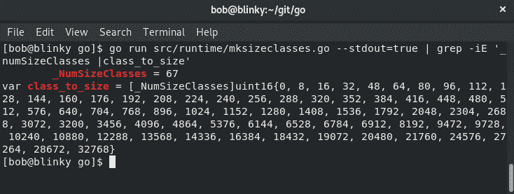

1.  如果 P 的 mspan 没有空闲位置，则从 mcentral 的 mspan 列表中获取一个新的 mspan，该列表有足够的空间来存放新的内存对象。

1.  如果该列表为空，则从 mheap 中执行页面运行，以便为 mspan 找到空间。

1.  如果失败，为空，或者没有足够大的页面来分配，就会从操作系统中分配一组新的页面。这很昂贵，但至少以 1MB 的块来完成，这有助于减少与操作系统通信的成本。

从 mspan 中释放对象遵循类似的过程：

1.  如果 mspan 正在响应分配而被清除，则将其返回到 mcache。

1.  如果 mspan 仍然有分配给它的对象，mcentral 的空闲列表将接收该 mspan 以进行释放。

1.  如果 mspan 处于空闲状态（没有分配的对象），它将被返回到 mheap。

1.  一旦 mspan 在给定的间隔内处于空闲状态，这些页面就会被返回到底层操作系统。

大对象不使用 mcache 或 mcentral；它们直接使用 mheap。

我们可以使用先前创建的 HTTP 服务器来查看一些内存统计信息。使用 runtime 包，我们可以推导出程序从操作系统检索的内存量，以及 Go 程序的堆分配。让我们一步一步地看看这是如何发生的：

1.  首先，我们初始化我们的包，执行我们的导入，并设置我们的第一个处理程序：

```go
package main
import (
    "fmt"
    "io"
    "net/http"
    "runtime"
)

func main() {
    Handler := func(w http.ResponseWriter, req *http.Request) {
       io.WriteString(w, "Memory Management Test")
    }
```

1.  然后我们编写一个匿名函数来捕获我们的运行统计：

```go
  go func() {
       for {
           var r runtime.MemStats
           runtime.ReadMemStats(&r)
           fmt.Println("\nTime: ", time.Now())
           fmt.Println("Runtime MemStats Sys: ", r.Sys)
           fmt.Println("Runtime Heap Allocation: ", r.HeapAlloc)
           fmt.Println("Runtime Heap Idle: ", r.HeapIdle)
           fmt.Println("Runtime Head In Use: ", r.HeapInuse)
           fmt.Println("Runtime Heap HeapObjects: ", r.HeapObjects)
           fmt.Println("Runtime Heap Released: ", r.HeapReleased)
           time.Sleep(5 * time.Second)
       }
    }()
    http.HandleFunc("/", Handler)
    http.ListenAndServe(":1234", nil)
}
```

1.  执行此程序后，我们可以看到我们服务的内存分配。以下结果中的第一个打印输出显示了内存的初始分配：

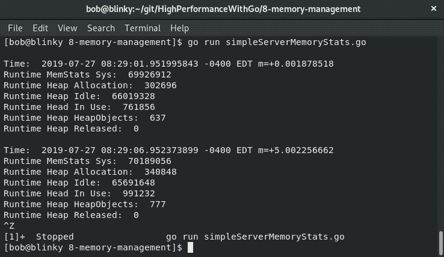

第二个打印输出是在对`http://localhost:1234/`发出请求后。您可以看到系统和堆分配大致保持不变，并且空闲堆和正在使用的堆会随着 Web 请求的利用而发生变化。

Go 的内存分配器最初源自 TCMalloc，一个线程缓存的 malloc。有关 TCMalloc 的更多信息可以在[`goog-perftools.sourceforge.net/doc/tcmalloc.html`](http://goog-perftools.sourceforge.net/doc/tcmalloc.html)找到。

Go 分配器，Go 内存分配器，使用线程本地缓存和 8K 或更大的连续内存区域。这些 8K 区域，也称为 span，通常用于以下三种能力之一：

+   空闲：可以重用于堆/栈或返回给操作系统的 span

+   使用中：当前在 Go 运行时中使用的 span

+   堆栈：用于 goroutine 堆栈的 span

如果我们创建一个没有共享库的程序，我们应该看到我们的程序的内存占用要小得多：

1.  首先，我们初始化我们的包并导入所需的库：

```go
package main
import (
    "fmt"
    "runtime"
    "time"
)
```

1.  然后，我们执行与之前的简单 http 服务器相同的操作，但我们只使用`fmt`包来打印一个字符串。然后我们休眠，以便能够看到内存利用输出：

```go
func main() {
    go func() {
       for {
           var r runtime.MemStats
           runtime.ReadMemStats(&r)
           fmt.Println("\nTime: ", time.Now())
           fmt.Println("Runtime MemStats Sys: ", r.Sys)
           fmt.Println("Runtime Heap Allocation: ", r.HeapAlloc)
           fmt.Println("Runtime Heap Idle: ", r.HeapIdle)
           fmt.Println("Runtime Heap In Use: ", r.HeapInuse)
           fmt.Println("Runtime Heap HeapObjects: ", r.HeapObjects)
           fmt.Println("Runtime Heap Released: ", r.HeapReleased)
           time.Sleep(5 * time.Second)
       }
    }()
    fmt.Println("Hello Gophers")
    time.Sleep(11 * time.Second)
}
```

1.  从执行此程序的输出中，我们可以看到此可执行文件的堆分配要比我们的简单 HTTP 服务器小得多：

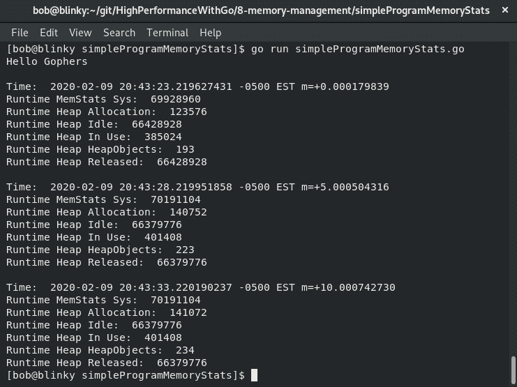

但为什么会这样呢？我们可以使用 goweight 库[[`github.com/jondot/goweight`](https://github.com/jondot/goweight)]来查看程序中依赖项的大小。我们只需要下载这个二进制文件：`go get github.com/jondot/goweight`。

1.  然后我们可以确定我们 Go 程序中的大依赖项是什么：

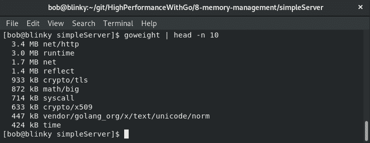

我们可以看到`net/http`库占用了很多空间，runtime 和 net 库也是如此。

相比之下，让我们看一下带有内存统计的简单程序：

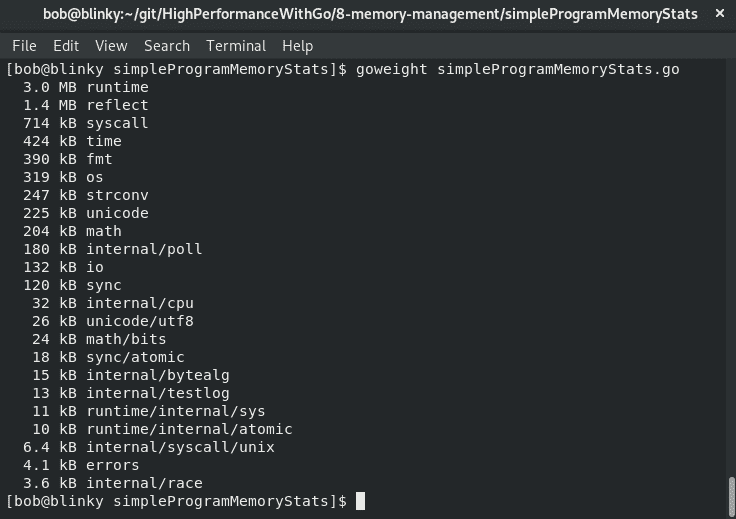

我们可以看到，没有运行时的下一个最大段要比`net/http`和`net`库小得多。了解资源的确切利用情况总是很重要，以便制作更高效的二进制文件。

如果我们使用 strace 查看操作系统级别的调用，我们接下来可以看到与我们的简单 Web 服务器和简单程序的交互之间的差异。我们简单 Web 服务器的示例如下：

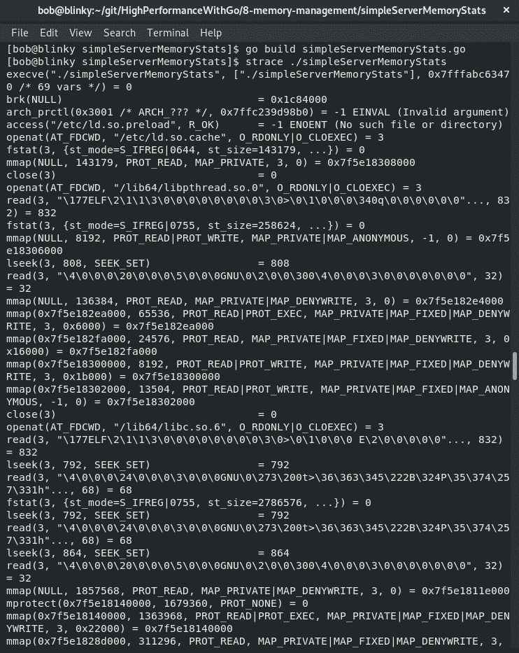

我们简单程序的示例可以在这里看到：

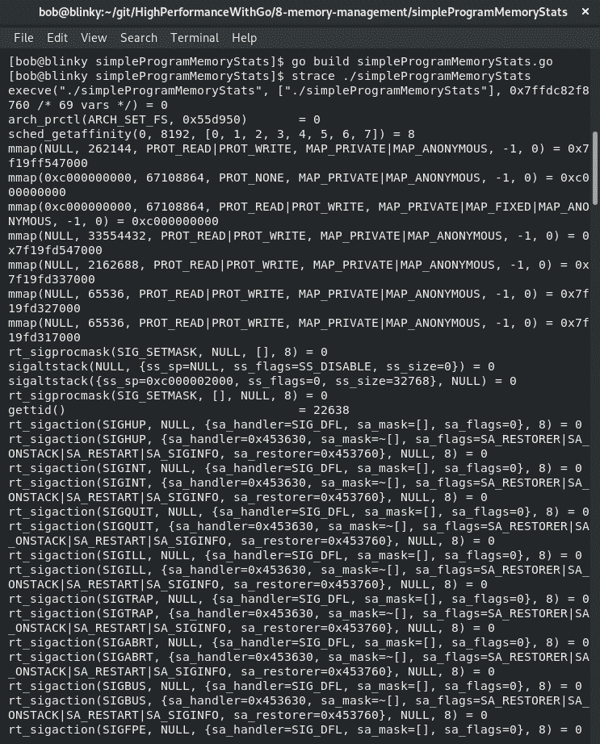

从输出中，我们可以注意到几件事情：

+   我们的`simpleWebServer`的输出比我们的`simpleProgram`要长得多（在截图中已经被截断，但如果生成了，我们可以看到响应长度更长）。

+   `simpleWebServer`加载了更多的 C 库（我们可以在截图中的 strace 捕获中看到`ld.so.preload`、`libpthread.so.0`和`libc.so.6`）。

+   我们的`simpleWebServer`中的内存分配比我们的`simpleProgram`输出要多得多。

我们可以看看这些是从哪里拉取的。`net/http`库没有任何 C 引用，但其父库 net 有。在 net 库中的所有 cgo 包中，我们有文档告诉我们如何跳过使用底层 CGO 解析器的包：[`golang.org/pkg/net/#pkg-overview`](https://golang.org/pkg/net/#pkg-overview)。

这份文档向我们展示了如何使用 Go 和 cgo 解析器：

```go
export GODEBUG=netdns=go    # force pure Go resolver
export GODEBUG=netdns=cgo   # force cgo resolver
```

让我们使用以下命令仅启用 Go 解析器在我们的示例 Web 服务器中：

```go
export CGO_ENABLED=0
go build -tags netgo
```

在下面的屏幕截图中，我们可以看到没有 C 解析器的`simpleServer`正在执行的过程：

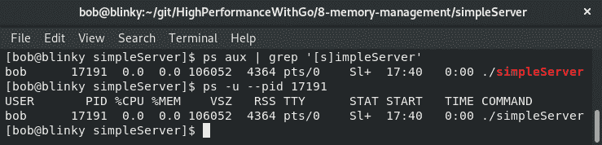

我们可以看到我们的 VSZ 和 RSS 都很低。将其与使用 C 解析器进行比较，方法是输入以下命令：

```go
 export CGO_ENABLED=1
 go build -tags cgo
```

我们可以看到使用以下 C 解析器的`simpleServer`的输出：

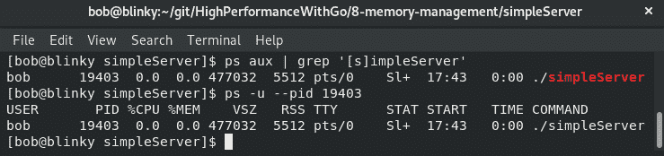

我们的 VSZ 在没有使用 cgo 解析器编译的服务器中显着较低。接下来，我们将讨论有限的内存情况以及如何考虑和构建它们。

# 有限内存情况简介

如果您在嵌入式设备或内存非常受限的设备上运行 Go，有时了解运行时内部的一些基本过程以便就您的进程做出明智的决策是明智的。Go 垃圾收集器*优先考虑低延迟和简单性*。它使用非生成并发三色标记和扫描垃圾收集器。默认情况下，它会自动管理内存分配。

Go 在调试标准库中有一个函数，它将强制进行垃圾收集并将内存返回给操作系统。Go 垃圾收集器在 5 分钟后将未使用的内存返回给操作系统。如果您在内存较低的设备上运行，可以在这里找到此函数`FreeOSMemory()`: [`golang.org/pkg/runtime/debug/#FreeOSMemory`](https://golang.org/pkg/runtime/debug/#FreeOSMemory)。

我们还可以使用`GC()`函数，可以在这里找到：[`golang.org/pkg/runtime/#GC`](https://golang.org/pkg/runtime/#GC)。

`GC()`函数也可能会阻塞整个程序。使用这两个函数要自担风险，因为它们可能导致意想不到的后果。

# 总结

在本章中，我们了解了 Go 如何分配堆和栈。我们还学习了如何有效地监视 VSZ 和 RSS 内存，以及如何优化我们的代码以更好地利用可用内存。能够做到这一点使我们能够有效地利用我们拥有的资源，使用相同数量的硬件为更多的并发请求提供服务。

在下一章中，我们将讨论 Go 中的 GPU 处理。
