# Go 中的 GPU 并行化

GPU 加速编程在当今的高性能计算堆栈中变得越来越重要。它通常用于**人工智能**（**AI**）和**机器学习**（**ML**）等领域。GPU 通常用于这些任务，因为它们往往非常适合并行计算。

在本章中，我们将学习 Cgo、GPU 加速编程、**CUDA**（**Compute Unified Device Architecture**的缩写）、make 命令、Go 程序的 C 样式链接，以及在 Docker 容器中执行启用 GPU 的进程。学习所有这些单独的东西将帮助我们使用 GPU 来支持 Go 支持的 CUDA 程序。这将帮助我们确定如何有效地使用 GPU 来帮助使用 Go 解决计算问题：

+   Cgo - 在 Go 中编写 C

+   GPU 加速计算-利用硬件

+   GCP 上的 CUDA

+   CUDA-为程序提供动力

# Cgo - 在 Go 中编写 C

Cgo 是 Go 标准库中内置的一个库，允许用户在其 Go 代码中调用底层 C 程序。Cgo 通常用作当前用 C 编写但没有等效 Go 代码的事物的代理。

应该谨慎使用 Cgo，只有在系统中没有等效的 Go 库可用时才使用。Cgo 对您的 Go 程序添加了一些限制：

+   不必要的复杂性

+   困难的故障排除

+   构建和编译 C 代码的复杂性增加

+   Go 的许多工具在 Cgo 程序中不可用

+   交叉编译不像预期的那样有效，或者根本不起作用

+   C 代码的复杂性

+   本机 Go 调用比 Cgo 调用快得多

+   构建时间较慢

如果您可以（或必须）接受所有这些规定，Cgo 可能是您正在开发的项目的必要资源。

有一些情况是适合使用 Cgo 的。主要的两个例子如下：

+   当您必须使用专有的**软件开发工具包**（**SDK**）或专有库时。

+   当您有一个遗留的 C 软件，由于业务逻辑验证的原因，将其移植到 Go 可能会很困难。

+   您已经将 Go 运行时耗尽，并且需要进一步优化。我们很少有机会遇到这种特殊情况。

更多优秀的 cgo 文档可以在以下网址找到：

+   [`golang.org/cmd/cgo/`](https://golang.org/cmd/cgo/)

+   [`blog.golang.org/c-go-cgo`](https://blog.golang.org/c-go-cgo)

在下一节中，我们将看一个简单的 cgo 示例，以便熟悉 Cgo 的工作原理，以及它的一些亮点和缺点。

# 一个简单的 Cgo 示例

让我们来看一个相对简单的 Cgo 示例。在这个例子中，我们将编写一个简单的函数来从 C 绑定打印“Hello Gophers”，然后我们将从我们的 Go 程序中调用该 C 代码。在这个函数中，我们返回一个常量字符字符串。然后我们在 Go 程序中调用`hello_gophers` C 函数。我们还使用`C.GoString`函数将 C 字符串类型转换为 Go 字符串类型：

```go
package main

/*

 #include <stdio.h>
 const char* hello_gophers() {
    return "Hello Gophers!";
 }
*/

import "C"
import "fmt"
func main() {
    fmt.Println(C.GoString(C.hello_gophers()))
}
```

一旦执行了这个程序，我们就可以看到一个简单的“Hello Gophers！”输出：

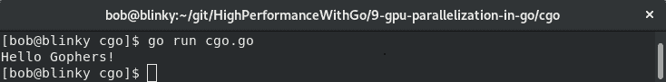

这个例子虽然简单，但向我们展示了如何在我们的 Go 程序中绑定 C 函数。为了进一步强调执行时间的差异，我们可以看一下我们的 Cgo 函数和我们的 Go 函数的基准测试： 

```go
package benchmark

/*
 #include <stdio.h>
 const char* hello_gophers() {
     return "Hello Gophers!";
 }
*/

import "C"
import "fmt"

func CgoPrint(n int) {
    for i := 0; i < n; i++ {
       fmt.Sprintf(C.GoString(C.hello_gophers()))
    }
}

func GoPrint(n int) {
    for i := 0; i < n; i++ {
       fmt.Sprintf("Hello Gophers!")
    }
}
```

然后，我们可以使用这些函数来对我们的绑定 C 函数进行基准测试，以比较普通的`GoPrint`函数：

```go
package benchmark

import "testing"

func BenchmarkCPrint(b *testing.B) {
    CgoPrint(b.N)
}

func BenchmarkGoPrint(b *testing.B) {
    GoPrint(b.N)
}
```

执行完这个之后，我们可以看到以下输出：

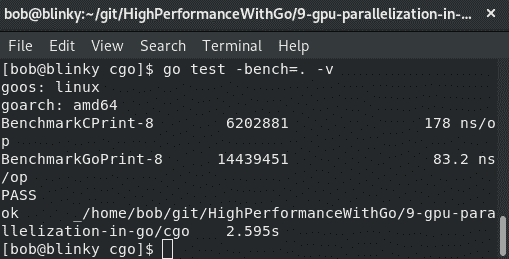

请注意，绑定的 Cgo 函数所需的时间大约比本机 Go 功能长一个数量级。在某些情况下这是可以接受的。这个基准测试只是进一步验证了我们只有在有意义的时候才应该使用 Cgo 绑定。重要的是要记住，有特定的时机我们可以证明使用 Cgo 是合理的，比如当我们必须执行本地 Go 功能中不可用的操作时。

在下一节中，我们将学习 GPU 加速编程和 NVIDIA 的 CUDA 平台。

# GPU 加速计算-利用硬件

在今天的现代计算机中，我们有一些硬件部件来完成系统的大部分工作。CPU 执行大部分来自计算机其他部分的指令操作，并传递这些操作的结果。内存是数据存储和处理的快速短期位置。硬盘用于长期数据存储和处理，网络设备用于在网络中的计算设备之间发送这些数据位。现代计算系统中经常使用的设备是独立 GPU。无论是显示具有高保真图形的最新电脑游戏，解码 4K 视频，还是执行金融数字计算，GPU 都成为高速计算的更受欢迎的选择。

GPU 旨在以高效的方式执行特定任务。随着高吞吐量计算的广泛采用，将 GPU 用作通用图形处理单元（GPGPUs）变得更加普遍。

有许多不同的 GPU 编程 API 可供使用，以充分利用 GPU 的性能，包括以下内容：

+   OpenCL：[`www.khronos.org/opencl/`](https://www.khronos.org/opencl/)

+   OpenMP：[`www.openmp.org/`](https://www.openmp.org/)

+   NVIDIA 的 CUDA 平台：[`developer.nvidia.com/cuda-zone`](https://developer.nvidia.com/cuda-zone)

NVIDIA 的 CUDA 库是成熟、高性能且广泛接受的。我们将在本章的示例中使用 CUDA 库。让我们更多地了解 CUDA 平台。

NVIDIA 的 CUDA 平台是由 NVIDIA 团队编写的 API，用于增加并行性并提高具有 CUDA 启用的图形卡的速度。在数据结构上执行并行算法可以严重提高计算时间。许多当前的 ML 和 AI 工具集在内部使用 CUDA，包括但不限于以下内容：

+   TensorFlow：[`www.tensorflow.org/install/gpu`](https://www.tensorflow.org/install/gpu)

+   Numba：[`devblogs.nvidia.com/gpu-accelerated-graph-analytics-python-numba/`](https://devblogs.nvidia.com/gpu-accelerated-graph-analytics-python-numba/)

+   PyTorch：[`pytorch.org/`](https://pytorch.org/)

CUDA 提供了一个用于在 C++中访问这些处理习语的 API。它使用内核的概念，内核是从 C++代码调用的函数，在 GPU 设备上执行。内核是代码的部分，可以并行执行。CUDA 使用 C++语法规则来处理指令。

有许多地方可以使用云中的 GPU 来执行计算任务，例如以下：

+   Google Cloud GPU：[`cloud.google.com/gpu/`](https://cloud.google.com/gpu/)

+   带有 GPU 的 AWS EC2 实例：[`aws.amazon.com/nvidia/`](https://aws.amazon.com/nvidia/)

+   Paperspace：[`www.paperspace.com/`](https://www.paperspace.com/)

+   FloydHub：[`www.floydhub.com/`](https://www.floydhub.com/)

您还可以在本地工作站上运行 CUDA 程序。这样做的要求如下：

+   支持 CUDA 的 GPU（我在示例中使用了 NVIDIA GTX670）

+   具有 GCC 编译器和工具链的操作系统（我在示例中使用了 Fedora 29）

在下一节中，我们将介绍如何设置我们的工作站进行 CUDA 处理：

1.  首先，我们需要为我们的主机安装适当的内核开发工具和内核头文件。我们可以通过执行以下命令在我们的示例 Fedora 主机上执行此操作：

```go
sudo dnf install kernel-devel-$(uname -r) kernel-headers-$(uname -r)
```

1.  我们还需要安装`gcc`和适当的构建工具。我们可以通过以下方式来实现：

```go
sudo dnf groupinstall "Development Tools"
```

1.  安装了先决条件后，我们可以获取 NVIDIA 为 CUDA 提供的本地`.run`文件安装程序。在撰写本文时，`cuda_10.2.89_440.33.01_linux.run`包是最新可用的。您可以从[`developer.nvidia.com/cuda-downloads`](https://developer.nvidia.com/cuda-downloads)下载最新的 CUDA 工具包：

```go
wget http://developer.download.nvidia.com/compute/cuda/10.2/Prod/local_installers/cuda_10.2.89_440.33.01_linux.run
```

1.  然后我们可以使用以下代码安装此软件包：

```go
sudo ./cuda_10.2.89_440.33.01_linux.run
```

这将为我们提供一个安装提示，如下截图所示：

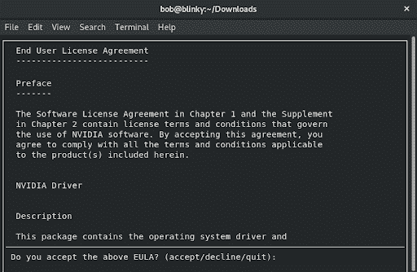

1.  接受最终用户许可协议后，我们可以选择安装所需的依赖项并选择`Install`： 

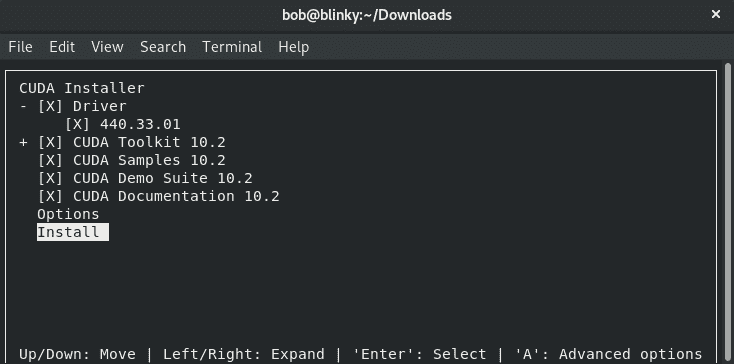

接受安装提示后，CUDA 安装程序应成功完成安装。如果在安装过程中出现任何错误，请查看以下位置可能会帮助您解决安装问题：

+   `/var/log/cuda-installer.log`

+   `/var/log/nvidia-installer.log`

在下一节中，我们将讨论如何使用主机机器进行 CUDA 进程。

# CUDA - 利用主机进程

安装了 CUDA 后，您需要设置一些环境变量，以便将安装的部分添加到执行路径中。如果您在主机上没有 Docker 访问权限，或者您更愿意使用裸机执行 GPU 密集型操作，此功能将按预期工作。如果您想使用更可重现的构建，可以使用以下*Docker for GPU-enabled programming*部分中定义的 Docker 配置。

我们需要更新我们的`PATH`以包括我们刚刚安装的 CUDA 二进制路径。我们可以通过执行以下命令来实现：`export PATH=$PATH:/usr/local/cuda-10.2/bin:/usr/local/cuda-10.2/NsightCompute-2019.1`。

我们还需要更新我们的`LD_LIBRARY_PATH`变量，这是一个环境变量，您的操作系统在链接动态和共享库时会查找它。我们可以通过执行`export LD_LIBRARY_PATH=:/usr/local/cuda-10.2/lib64`来添加 CUDA 库。

这将把 CUDA 库添加到您的库路径中。我们将在本章的结束部分的 GNU Makefile 中以编程方式将这些添加到我们的路径中。在下一节中，我们将讨论如何使用 Docker 利用 CUDA。

# 用于 GPU 启用编程的 Docker

如果您想在本章中使用 Docker 进行 GPU 启用的编程，可以执行以下步骤，但是为了使用此功能，您必须在计算机上拥有兼容的 NVIDIA CUDA GPU。您可以在[`developer.nvidia.com/cuda-gpus`](https://developer.nvidia.com/cuda-gpus)找到已启用的卡的完整列表。

在生产环境中，我们可能不会以这种方式使用 Docker 进行 GPU 加速计算，因为您很可能希望尽可能接近硬件以进行 GPU 加速编程，但我选择在本章中使用这种方法，以便本书的使用者有一个可重现的构建。大多数情况下，可重现的构建是使用容器化方法略有性能损失的可接受折衷方案。

如果您不确定您的 NVIDIA 启用的 GPU 支持什么，您可以使用`cuda-z`实用程序来查找有关您的显卡的更多信息。该程序的可执行文件可以在[`cuda-z.sourceforge.net/`](http://cuda-z.sourceforge.net/)找到。

下载适用于您特定操作系统的版本后，您应该能够执行以下文件：

```go
./CUDA-Z-0.10.251-64bit.run
```

您将看到一个输出，其中包含有关您当前使用的卡的各种信息：

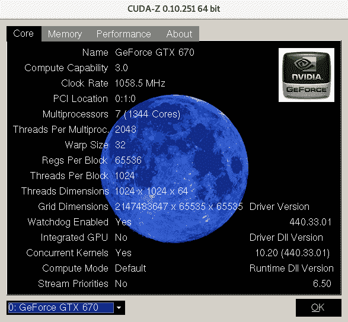

一旦您确定您的卡支持所需的 GPU 处理，我们可以使用 Docker 来连接到您的 GPU 进行处理。为此，我们将按照以下步骤进行：

1.  为您的计算机启用 NVIDIA 容器工具包。对于我的 Fedora 测试系统，我不得不通过将我的发行版更改为``centos7``来进行一些小调整——安装的 RPM 仍然按预期工作：

```go
distribution=$(. /etc/os-release;echo $ID$VERSION_ID)
curl -s -L https://nvidia.github.io/nvidia-docker/$distribution/nvidia-docker.repo | sudo tee /etc/yum.repos.d/nvidia-docker.repo
```

在其他操作系统上安装的完整说明可以在[`github.com/NVIDIA/nvidia-docker#quickstart`](https://github.com/NVIDIA/nvidia-docker#quickstart%7C)找到。

1.  安装`nvidia-container-toolkit`：

```go
sudo yum install -y nvidia-container-toolkit
```

1.  重新启动 Docker 以应用这些新更改：

```go
sudo systemctl restart docker
```

1.  禁用 SELINUX，以便您的计算机能够使用 GPU 进行这些请求：

```go
setenforce 0 #as root
```

1.  执行一个测试`docker run`，以确保您能够在 Docker 中执行 GPU 操作，并检查有关您特定 NVIDIA 卡的信息：

```go
docker run --gpus all tensorflow/tensorflow:latest-gpu nvidia-smi
```

在下一节中，我们将介绍如何在 Google Cloud Platform 上设置支持 CUDA GPU 的机器。

# GCP 上的 CUDA

如果您没有必要的硬件，或者您想在云中运行支持 GPU 的代码，您可能决定您更愿意在共享托管环境中使用 CUDA。在下面的示例中，我们将向您展示如何在 GCP 上使用 GPU。

还有许多其他托管的 GPU 提供商（您可以在本章的*GPU 加速计算-利用硬件*部分中看到所有这些提供商的列表）——我们将在这里以 GCP 的 GPU 实例为例。

您可以在[`cloud.google.com/gpu`](https://cloud.google.com/gpu)了解更多关于 GCP 的 GPU 提供。

# 创建一个带有 GPU 的虚拟机

我们需要创建一个 Google Compute Engine 实例，以便能够在 GCP 上利用 GPU。

您可能需要增加 GPU 配额。要这样做，您可以按照以下网址的步骤进行：

https://cloud.google.com/compute/quotas#requesting_additional_quota

在撰写本文时，NVIDIA P4 GPU 是平台上最便宜的，而且具有足够的性能来展示我们的工作。您可以通过在 IAM 管理员配额页面上检查 NVIDIA P4 GPU 指标来验证您的配额：

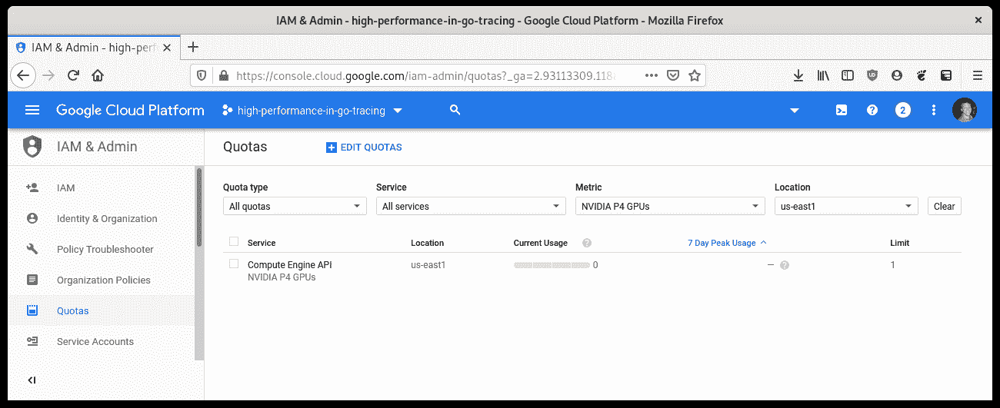

为此，我们可以访问 Google Cloud 控制台上的 VM 实例页面。以下是此页面的截图。点击屏幕中央的创建按钮：

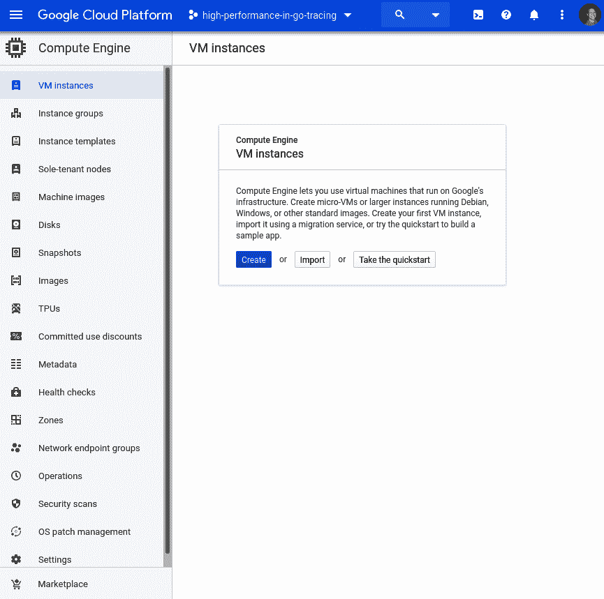

接下来，我们创建一个附加了 GPU 的 Ubuntu 18.04 VM。我们的 VM 实例配置示例如下截图所示：

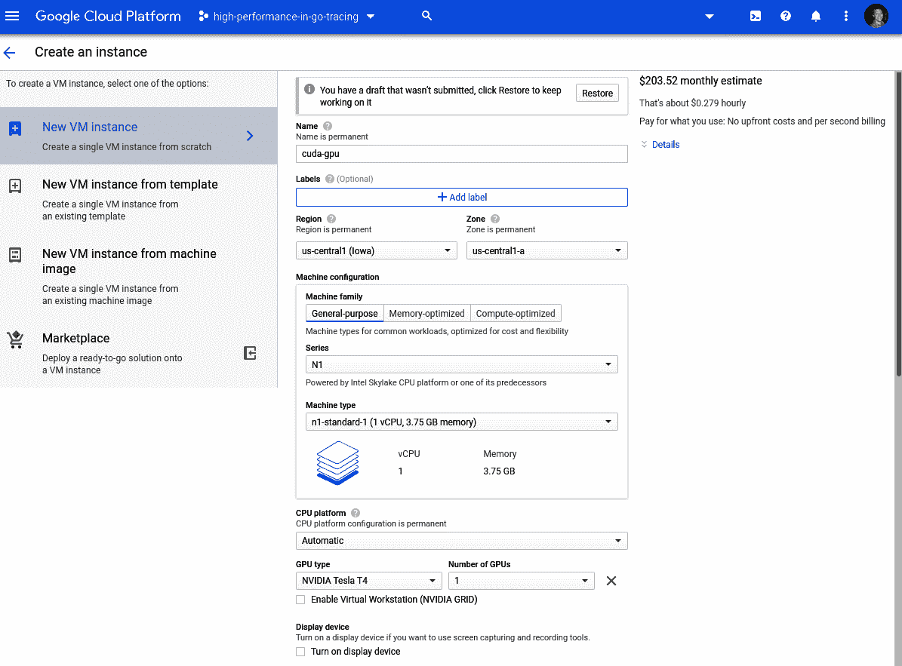

我们在这里使用 Ubuntu 18.04 作为示例，而不是 Fedora 29，以展示如何为多种架构设置 CUDA。

我们的操作系统和其他配置参数如下截图所示：

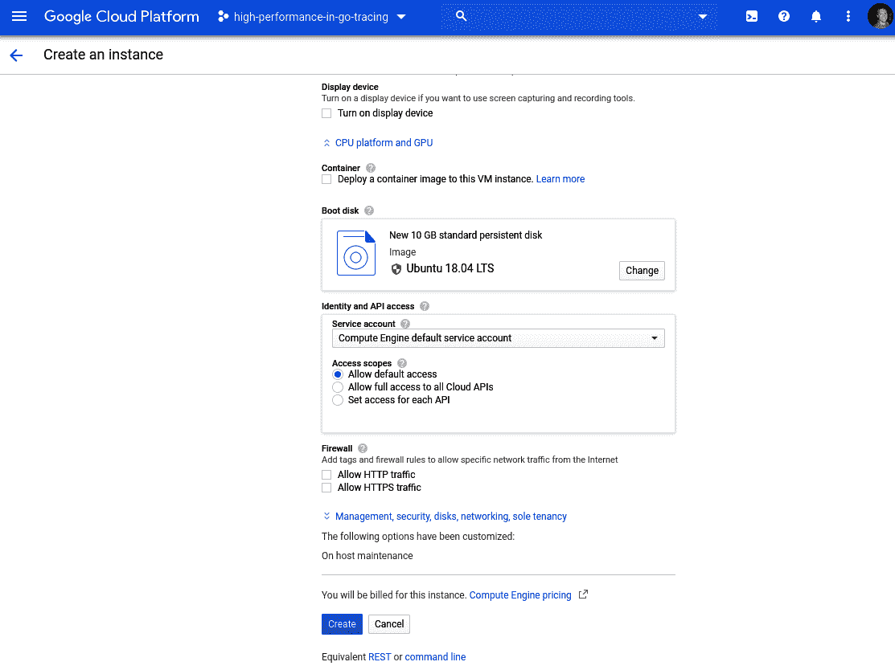

点击创建按钮后，我们将返回到 VM 实例页面。等待您的 VM 完全配置好（它的名称左侧会有一个绿色的勾号）：

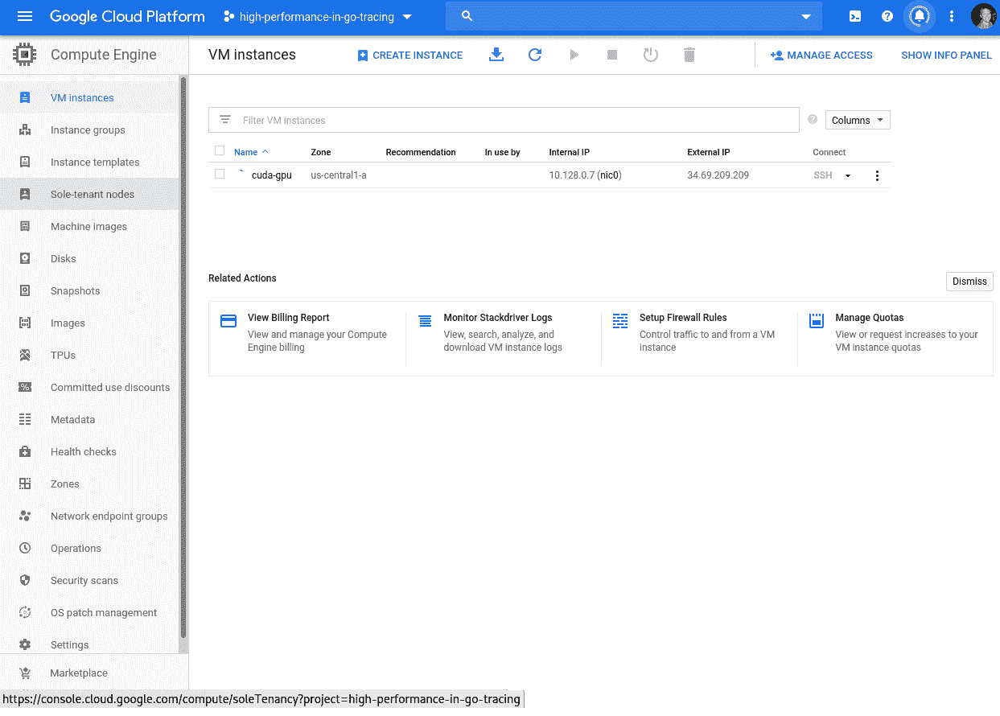

接下来，我们可以 SSH 到实例，如下截图所示：

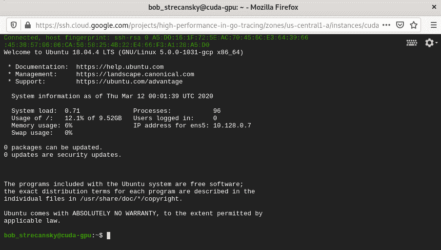

在接下来的小节中，我们将安装运行支持 GPU 的 CGo 程序所需的所有依赖项。我还在解释的最后包括了一个执行所有这些操作的脚本，以方便您使用。

# 安装 CUDA 驱动程序

按照[`cloud.google.com/compute/docs/gpus/install-drivers-gpu`](https://cloud.google.com/compute/docs/gpus/install-drivers-gpu)中的说明安装 NVIDIA CUDA 驱动程序：

1.  检索 CUDA 存储库：

```go
curl -O http://developer.download.nvidia.com/compute/cuda/repos/ubuntu1804/x86_64/cuda-repo-ubuntu1804_10.0.130-1_amd64.deb
```

1.  安装`.deb`软件包：

```go
sudo dpkg -i cuda-repo-ubuntu1804_10.0.130-1_amd64.deb
```

1.  将 NVIDIA GPG 密钥添加到 apt 源密钥环：

```go
sudo apt-key adv --fetch-keys http://developer.download.nvidia.com/compute/cuda/repos/ubuntu1804/x86_64/7fa2af80.pub
```

1.  安装 NVIDIA CUDA 驱动程序：

```go
sudo apt-get update && sudo apt-get install cuda
```

1.  现在我们在 GCP VM 上有一个支持 CUDA 的 GPU。我们可以使用`nvidia-smi`命令验证这一点：

```go
nvidia-smi
```

1.  我们将在截图中看到以下输出：

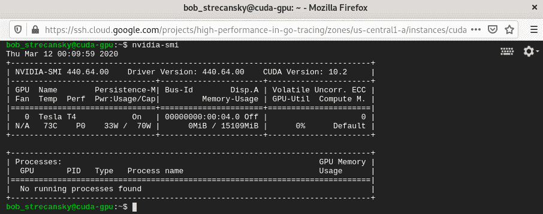

# 在 GCP 上安装 Docker CE

接下来，我们需要在启用 CUDA 的 GCE VM 上安装 Docker CE。要在我们的 VM 上安装 Docker CE，我们可以按照此页面上的说明进行操作：

[`docs.docker.com/install/linux/docker-ce/ubuntu/`](https://docs.docker.com/install/linux/docker-ce/ubuntu/)

在撰写本书时，以下步骤是必要的：

1.  验证主机上没有其他 docker 版本：

```go
sudo apt-get remove docker docker-engine docker.io containerd runc
```

1.  确保我们的存储库是最新的：

```go
sudo apt-get update
```

1.  安装安装 docker CE 所需的依赖项：

```go
sudo apt-get install apt-transport-https ca-certificates curl gnupg-agent software-properties-common
```

1.  添加 docker CE 存储库：

```go
curl -fsSL https://download.docker.com/linux/ubuntu/gpg | sudo apt-key add -
sudo add-apt-repository "deb [arch=amd64] https://download.docker.com/linux/ubuntu $(lsb_release -cs) stable"
```

1.  运行更新以确保 docker CE 存储库是最新的：

```go
sudo apt-get update
```

1.  安装必要的 docker 依赖项：

```go
sudo apt-get install docker-ce docker-ce-cli containerd.io
```

我们现在在主机上有一个可用的 Docker CE 实例。

# 在 GCP 上安装 NVIDIA Docker

要在我们的 VM 上安装 NVIDIA docker 驱动程序，我们可以按照此页面上的说明进行操作：

[`github.com/NVIDIA/nvidia-docker#ubuntu-16041804-debian-jessiestretchbuster`](https://github.com/NVIDIA/nvidia-docker#ubuntu-16041804-debian-jessiestretchbuster)

1.  设置一个分发变量：

```go
distribution=$(. /etc/os-release;echo $ID$VERSION_ID)
```

1.  添加`nvidia-docker`存储库 gpg 密钥和 apt 存储库：

```go
curl -s -L https://nvidia.github.io/nvidia-docker/gpgkey | sudo apt-key add -
curl -s -L https://nvidia.github.io/nvidia-docker/$distribution/nvidia-docker.list | sudo tee /etc/apt/sources.list.d/nvidia-docker.list
```

1.  安装 nvidia-container-toolkit：

```go
sudo apt-get update && sudo apt-get install -y nvidia-container-toolkit
```

1.  重新启动您的 VM 以使此驱动程序生效。

# 将所有内容脚本化

以下 bash 脚本将所有先前的操作组合在一起。首先，我们安装 CUDA 驱动程序：

```go
#!/bin/bash

# Install the CUDA driver
curl -O http://developer.download.nvidia.com/compute/cuda/repos/ubuntu1804/x86_64/cuda-repo-ubuntu1804_10.0.130-1_amd64.deb
dpkg -i cuda-repo-ubuntu1804_10.0.130-1_amd64.deb
apt-key adv --fetch-keys http://developer.download.nvidia.com/compute/cuda/repos/ubuntu1804/x86_64/7fa2af80.pub
apt-get -y update && sudo apt-get -y install cuda
```

然后我们安装 Docker CE：

```go
# Install Docker CE
apt-get remove docker docker-engine docker.io containerd runc
apt-get update
apt-get -y install apt-transport-https ca-certificates curl gnupg-agent software-properties-common
curl -fsSL https://download.docker.com/linux/ubuntu/gpg | sudo apt-key add -
add-apt-repository "deb [arch=amd64] https://download.docker.com/linux/ubuntu $(lsb_release -cs) stable"
apt-get -y update
apt-get -y install docker-ce docker-ce-cli containerd.io
```

最后我们安装`nvidia-docker`驱动程序：

```go
# Install nvidia-docker
distribution=$(. /etc/os-release;echo $ID$VERSION_ID)
curl -s -L https://nvidia.github.io/nvidia-docker/gpgkey | sudo apt-key add -
curl -s -L https://nvidia.github.io/nvidia-docker/$distribution/nvidia-docker.list | sudo tee /etc/apt/sources.list.d/nvidia-docker.list
apt-get -y update && sudo apt-get -y install nvidia-container-toolkit
usermod -aG docker $USER
systemctl restart docker
```

这包含在[`git/HighPerformanceWithGo/9-gpu-parallelization-in-go/gcp_scripts`](https://github.com/bobstrecansky/HighPerformanceWithGo/blob/master/9-gpu-parallelization-in-go/gcp_scripts/nvidia-cuda-gcp-setup.sh)中的 repo 中，并且可以通过运行以下命令来执行：

```go
sudo bash nvidia-cuda-gcp-setup.sh
```

在目录中。在下一节中，我们将通过一个使用 Cgo 执行的示例 CUDA 程序。

# CUDA-推动程序。

在安装了所有 CUDA 依赖项并运行后，我们可以从一个简单的 CUDA C++程序开始：

1.  首先，我们将包括所有必要的头文件，并定义我们想要处理的元素的数量。`1 << 20`是 1,048,576，这已经足够多的元素来展示一个合适的 GPU 测试。如果您想要查看处理时间的差异，可以进行移位：

```go
#include <cstdlib>
#include <iostream>

const int ELEMENTS = 1 << 20;
```

我们的`multiply`函数被包装在一个`__global__`说明符中。这允许`nvcc`，CUDA 特定的 C++编译器，在 GPU 上运行特定的函数。这个乘法函数相对简单：它使用一些 CUDA 魔法将`a`和`b`数组相乘，并将值返回到`c`数组中：

```go
__global__ void multiply(int j, float * a, float * b, float * c) {

  int index = threadIdx.x * blockDim.x + threadIdx.x;
  int stride = blockDim.x * gridDim.x; 

  for (int i = index; i < j; i += stride)
    c[i] = a[i] * b[i];
}
```

这个 CUDA 魔法是指 GPU 的并行处理功能。变量定义如下：

+   +   `gridDim.x`：处理器上可用的线程块数

+   `blockDim.x`：每个块中的线程数

+   `blockIdx.x`：网格内当前块的索引

+   `threadId.x`：块内当前线程的索引

然后我们需要添加一个`extern "C"`调用，以便为这个特定函数使用 C 风格的链接，这样我们就可以有效地从我们的 Go 代码中调用这个函数。这个`cuda_multiply`函数创建了三个数组：

+   +   `a`和`b`，它们存储 1 到 10 之间的随机数

+   `c`，它存储了`a`和`b`的乘积的结果

```go
extern "C" {

  int cuda_multiply(void) {
    float * a, * b, * c;
    cudaMallocManaged( & a, ELEMENTS * sizeof(float));
    cudaMallocManaged( & b, ELEMENTS * sizeof(float));
    cudaMallocManaged( & c, ELEMENTS * sizeof(float));
```

1.  然后我们创建我们的随机浮点数数组：

```go
    for (int i = 0; i < ELEMENTS; i++) {
      a[i] = rand() % 10;
      b[i] = rand() % 10;
    }
```

然后我们执行我们的乘法函数（我们在文件开头定义的），基于块大小。我们根据数字计算出我们想要使用的块数：

```go
    int blockSize = 256;
    int numBlocks = (ELEMENTS + blockSize - 1) / blockSize;
    multiply << < numBlocks, blockSize >>> (ELEMENTS, a, b, c);
```

完成我们的乘法后，我们将等待 GPU 完成，然后才能访问我们在主机上的信息：`cudaDeviceSynchronize();`。

1.  然后我们可以将我们执行的乘法的值打印到屏幕上，以便让最终用户看到我们正在执行的计算。这在代码中被注释掉了，因为打印到`stdout`对于这段特定的代码来说并不显示很好的性能。如果您想要查看正在发生的计算，可以取消注释：

```go
    //for (int k = 0; k < ELEMENTS; k++) {
      //std::cout << k << ":" << a[k] << "*" << b[k] << "=" << c[k] << "\n";
    //}
```

1.  然后，我们释放为乘法函数分配的 GPU 内存，通过在每个数组指针上调用`cudaFree`，然后返回`0`来完成我们的程序：

```go
    cudaFree(a);
    cudaFree(b);
    cudaFree(c);
    return 0;
  }
}
```

1.  然后，我们将添加我们的头文件`cuda_multiply.h`：

```go
int cuda_multiply(void);
```

本章中，我们的 Go 程序只是围绕我们使用一些语法糖创建的`cuda_multiply.cu`函数的包装器。

1.  我们实例化`main`并导入必要的包：

```go
package main

import (
    "fmt"
    "time"
)
```

1.  然后，我们添加了我们需要的`CFLAGS`和`LDFLAGS`，以便引用我们使用 nvcc make 创建的库，以及系统库。这里需要注意的是，这些注释，在 cgo 代码中称为*preambles*，在编译包的 C 部分时用作头文件。我们可以在这里包含任何必要的 C 代码，以使我们的 Go 代码更易于理解。如果您计划使用以下任何一种风格的标志，它们必须以`#cgo`指令为前缀，以调整底层编译器的行为：

+   +   `CFLAGS`

+   `CPPFLAGS`

+   `CXXFLAGS`

+   `FFLAGS`

+   `LDFLAGS`

1.  然后，我们导入伪包`C`，这使我们能够执行我们编写的 C 代码（回想一下我们在`cuda_multiply.cu`文件中的`extern C`调用）。我们还在这个函数周围添加了一个计时包装器，以便查看执行这个函数需要多长时间：

```go
//#cgo CFLAGS: -I.
//#cgo LDFLAGS: -L. -lmultiply
//#cgo LDFLAGS: -lcudart
//#include <cuda_multiply.h>

import "C"
func main() {
    fmt.Printf("Invoking cuda library...\n")
    start := time.Now()
    C.cuda_multiply()
    elapsed := time.Since(start)
    fmt.Println("\nCuda Execution took", elapsed)
}
```

1.  我们将为接下来要构建的 Docker 容器提供一个 Makefile。我们的 Makefile 定义了一个方法来构建我们的 nvcc 库，运行我们的 Go 代码，并清理我们的 nvcc 库：

```go
//target:
    nvcc -o libmultiply.so --shared -Xcompiler -fPIC cuda_multiply.cu
//go:
    go run cuda_multiply.go
```

```go

//clean:
    rm *.so
```

我们的 Dockerfile 将所有内容整合在一起，以便我们的演示可以非常容易地再现：

```go
FROM tensorflow/tensorflow:latest-gpu
ENV LD_LIBRARY_PATH=/usr/local/cuda-10.1/lib64
RUN ln -s /usr/local/cuda-10.1/lib64/libcudart.so /usr/lib/libcudart.so
RUN apt-get install -y golang
COPY . /tmp
WORKDIR /tmp
RUN make
RUN mv libmultiply.so /usr/lib/libmultiply.so 
ENTRYPOINT ["/usr/bin/go", "run", "cuda_multiply.go"]  
```

1.  接下来，我们将构建和运行我们的 Docker 容器。以下是来自缓存构建的输出，以缩短构建步骤的长度：

```go
$ sudo docker build -t cuda-go .
Sending build context to Docker daemon  8.704kB
Step 1/9 : FROM tensorflow/tensorflow:latest-gpu
 ---> 3c0df9ad26cc
Step 2/9 : ENV LD_LIBRARY_PATH=/usr/local/cuda-10.1/lib64
 ---> Using cache
 ---> 65aba605af5a
Step 3/9 : RUN ln -s /usr/local/cuda-10.1/lib64/libcudart.so /usr/lib/libcudart.so
 ---> Using cache
 ---> a0885eb3c1a8
Step 4/9 : RUN apt-get install -y golang
 ---> Using cache
 ---> bd85bd4a8c5e
Step 5/9 : COPY . /tmp
 ---> 402d800b4708
Step 6/9 : WORKDIR /tmp
 ---> Running in ee3664a4669f
Removing intermediate container ee3664a4669f
 ---> 96ba0678c758
Step 7/9 : RUN make
 ---> Running in 05df1a58cfd9
nvcc -o libmultiply.so --shared -Xcompiler -fPIC cuda_multiply.cu
Removing intermediate container 05df1a58cfd9
 ---> 0095c3bd2f58
Step 8/9 : RUN mv libmultiply.so /usr/lib/libmultiply.so
 ---> Running in 493ab6397c29
Removing intermediate container 493ab6397c29
 ---> 000fcf47898c
Step 9/9 : ENTRYPOINT ["/usr/bin/go", "run", "cuda_multiply.go"]
 ---> Running in 554b8bf32a1e
Removing intermediate container 554b8bf32a1e
 ---> d62266019675
Successfully built d62266019675
Successfully tagged cuda-go:latest 
```

然后，我们可以使用以下命令执行我们的 Docker 容器（根据您的 docker 守护程序配置情况，可能需要使用 sudo）：

```go
sudo docker run --gpus all -it --rm cuda-go
```

接下来是前述命令的输出：

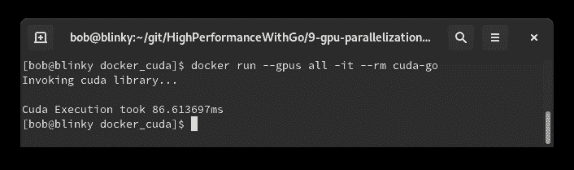

对于如此大的乘法计算来说，相当令人印象深刻！在高计算工作负载下，GPU 编程通常是非常快速计算的良好解决方案。在同一台机器上，仅使用 CPU 的等效 C++程序大约需要 340 毫秒才能运行。

# 摘要

在本章中，我们学习了 cgo、GPU 加速编程、CUDA、Make 命令、用于 Go 程序的 C 风格链接，以及在 Docker 容器中执行启用 GPU 的进程。学习所有这些单独的元素帮助我们开发了一个性能良好的 GPU 驱动应用程序，可以进行一些非常大的数学计算。这些步骤可以重复进行，以便以高性能的方式进行大规模计算。我们还学会了如何在 GCP 中设置启用 GPU 的 VM，以便我们可以使用云资源来执行 GPU 计算。

在下一章中，我们将讨论 Go 语言中的运行时评估。
