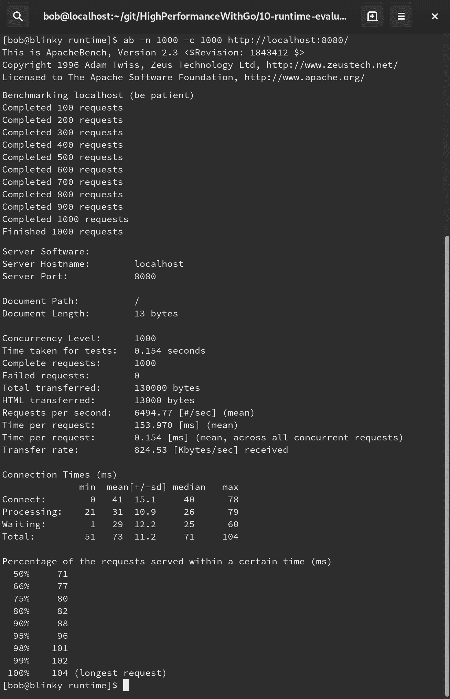
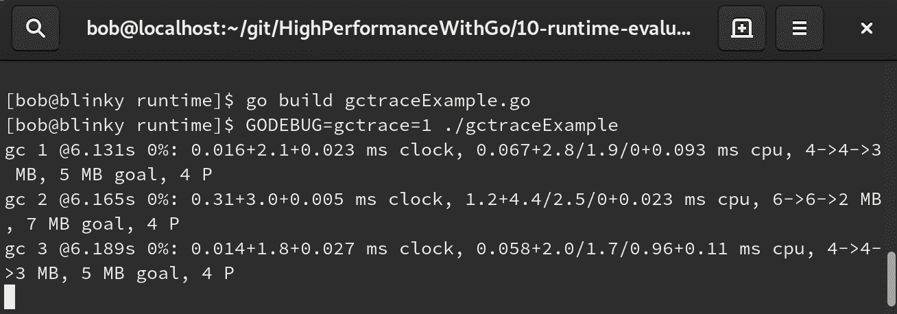
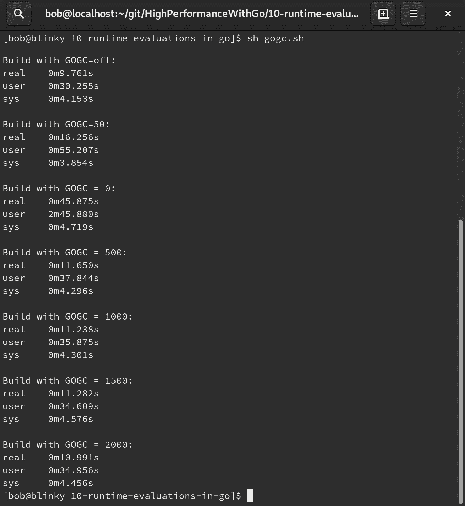
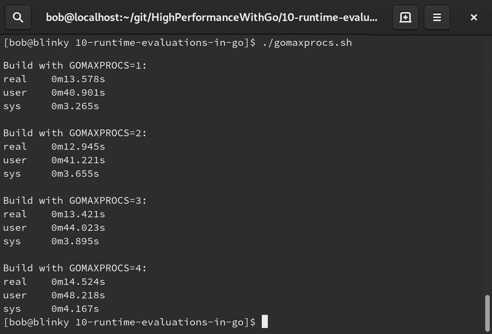
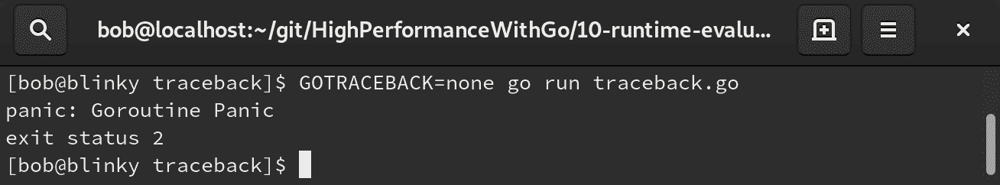
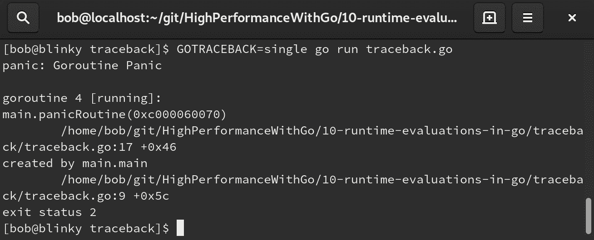
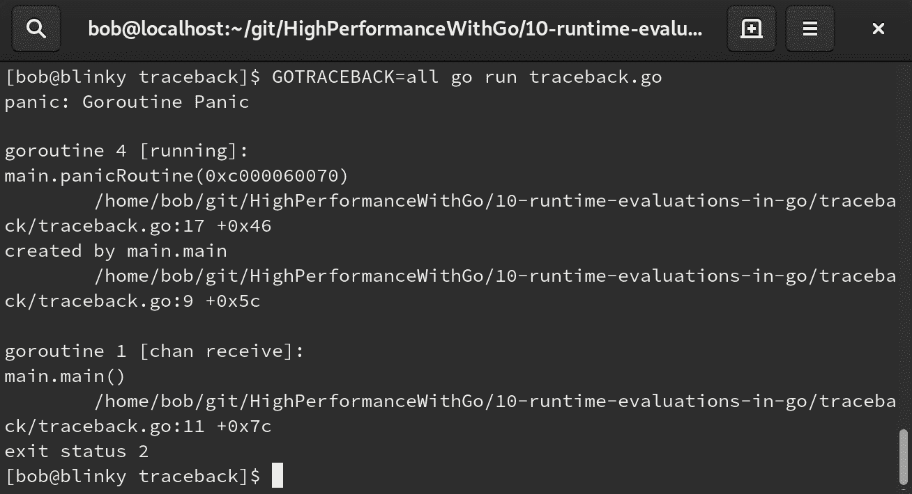
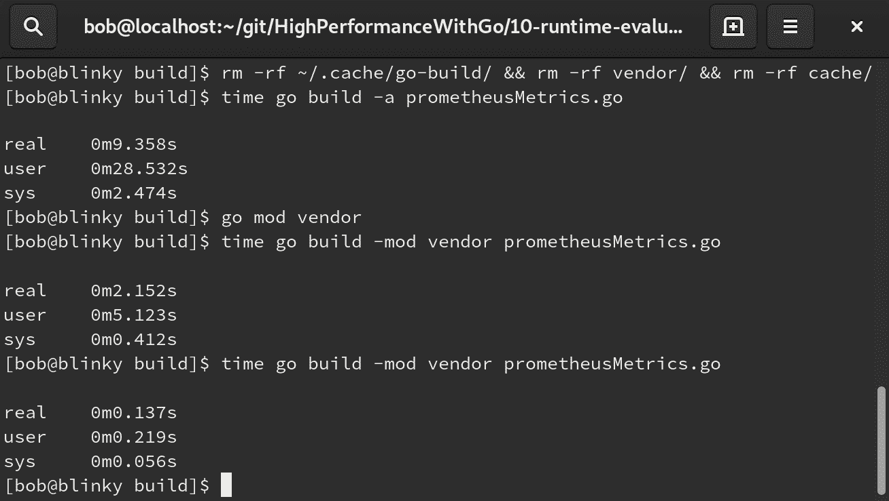
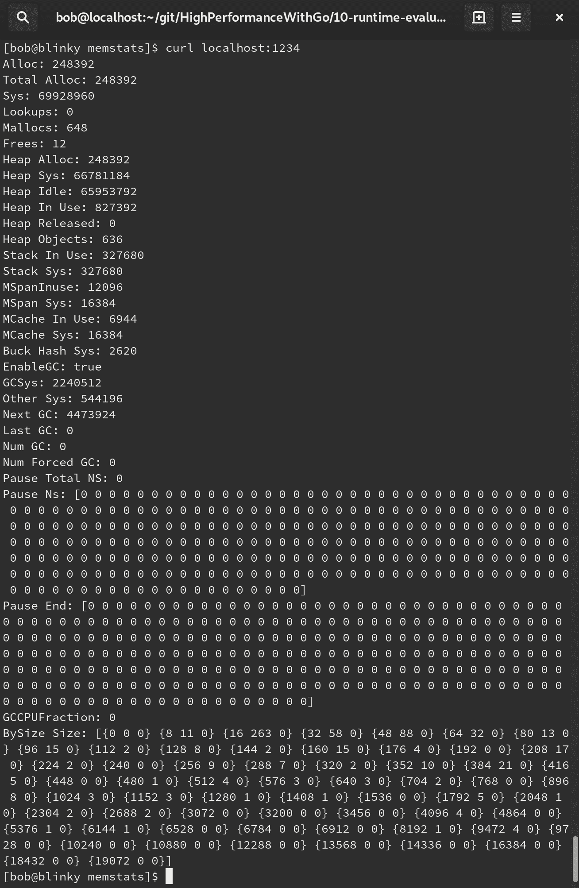

# 第十章：Go 中的编译时评估

Go 的作者以一种最小化依赖的方式编写了语言，每个文件都声明了自己的依赖关系。常规的语法和模块支持也有助于开发人员提高编译时间，以及接口满意度。在本章中，我们将看到运行时评估如何帮助加快 Go 编译速度，以及如何使用容器构建 Go 代码和利用 Go 构建缓存。

在本章中，我们将涵盖以下主题：

+   Go 运行时

+   `GCTrace`

+   `GOGC`

+   `GOMAXPROCS`

+   `GOTRACEBACK`

+   Go 构建缓存

+   供应

+   缓存

+   调试

+   `KeepAlive`

+   `NumCPU`

+   `ReadMemStats`

这些都是了解 Go 运行时如何工作以及如何使用它编写高性能代码的宝贵主题。

# 探索 Go 运行时

在 Go 源代码中，我们可以通过查看[`golang.org/src/runtime/`](https://golang.org/src/runtime/)来查看运行时源代码。运行时包含与 Go 运行时交互的操作。该包用于控制诸如 goroutines、垃圾回收、反射和调度等功能，这些功能对语言的运行至关重要。在运行时包中，我们有许多环境变量，可以帮助我们改变 Go 可执行文件的运行时行为。让我们回顾一些关于 Go 运行时的最重要的环境变量。

# GODEBUG

`GODEBUG`是变量的控制器，用于在 Go 运行时进行调试。该变量包含一系列以逗号分隔的`name=val`键值对。这些命名变量用于调整二进制文件返回的调试信息的输出。关于这个变量的一个好处是，运行时允许您直接将其应用于预编译的二进制文件，而不是在构建时调用它。这很好，因为它允许您调试已经构建的二进制文件（并且可能已经在生产环境中造成了损害）。您可以传递给`GODEBUG`的变量如下：

| **GODEBUG 变量** | **启用值** | **描述** |
| --- | --- | --- |
| `allocfreetrace` | 1 | 用于对每个分配进行分析。为每个对象的分配和释放打印堆栈跟踪。每个堆栈跟踪包含内存块、大小、类型、goroutine ID 和单个元素的堆栈跟踪。 |
| `clobberfree` | 1 | 当释放对象时，GC 会用不良内容破坏对象的内容。 |
| `cgocheck` | 0 – 禁用 1（默认）– 廉价检查 2 – 昂贵检查 | 用于检查使用 cgo 的包是否将错误传递给非 Go 代码的 go 指针。设置为 0 表示禁用，1 表示廉价检查可能会错过一些错误（默认），或者 2 表示昂贵检查会减慢程序运行速度。 |
| `efence` | 1 | 分配器将确保每个对象都分配在唯一的页面上，并且内存地址不会被重复使用。 |
| `gccheckmark` | 1 | 通过进行第二次标记传递来验证 GC 的当前标记阶段。在这第二次标记传递期间，世界会停止。如果第二次传递发现了并发标记没有找到的对象，GC 将会发生 panic。 |
| `gcpacertrace` | 1 | 打印有关垃圾收集器的并发 pacer 内部状态的信息。 |
| `gcshrinkstackoff` | 1 | 移动的 goroutines 不能移动到更小的堆栈上。在这种模式下，goroutine 的堆栈只会增长。 |
| `gcstoptheworld` | 1 – 禁用 GC 2 – 禁用 GC 和并发扫描 | 1 禁用并发垃圾回收。这将使每个 GC 事件变成一个全局停止的情况。2 禁用 GC 并在垃圾回收完成后禁用并发扫描。 |
| `gctrace` | 1 | 请参阅下一页的`GCTrace`标题。 |
| `madvdontneed` | 1 | 在 Linux 上使用`MADV_DONTNEED`而不是`MADV_FREE`将内存返回给内核。使用此标志会导致内存利用效率降低，但也会使 RSS 内存值更快地下降。 |
| `memprofilerate` | 0 – 关闭分析 1 – 包括每个分配的块 X – 更新`MemProfileRate`的值 | 控制在内存分析中报告和记录的内存分配分数。更改 X 控制记录的内存分配的分数。 |
| `invalidptr` | 0 – 禁用此检查 1 – 如果发现无效指针，则垃圾收集器和堆栈复制器将崩溃 | 如果在存储指针的地方发现无效指针的值，垃圾收集器和堆栈复制器将崩溃。 |
| `sbrk` | 1 | 从操作系统中交换一个不回收内存的简单分配器，而不是使用默认的内存分配器和垃圾收集器。 |
| `scavenge` | 1 | 启用堆清扫调试模式。 |
| `scheddetail` | 1（与 schedtrace=X 一起使用） | 调度器每 X 毫秒返回与调度器、处理器、线程和 goroutine 进程相关的信息。 |
| `schedtrace` | X | 每 X 毫秒向 STDERR 发出一行调度器状态摘要。 |
| `tracebackancestors` | N | 哪些 goroutine 的回溯与它们关联的堆栈被扩展，报告 N 个祖先 goroutine。如果 N = 0，则不返回祖先信息。 |

其他包还有一些变量可以传递给`GODEBUG`。这些通常是非常知名的包，可能需要运行时性能调整，比如`crypto/tls`和`net/http`。如果包含`GODEBUG`标志在运行时是可用的，包应该包含文档。

# GCTRACE

`GCTRACE`在运行时被使用，以查看已经打印到 stderr 的单行，显示每次收集时总内存和暂停的长度。在撰写本文时，此行组织如下：

```go
gc# @#s #%: #+#+# ms clock, #+#/#/#+# ms cpu, #->#-># MB, # MB goal, #P
```

我们可以为提供一个简单的 HTTP 服务器来提供这个工作原理的示例。首先，我们编写一个简单的 HTTP 服务器，对`localhost:8080`的根目录返回一个简单的`Hello Gophers`响应：

```go

package main
import (
    "fmt"
    "net/http"
)

func hello(w http.ResponseWriter, r *http.Request) {
    fmt.Fprintf(w, "Hello Gophers")
}

func main() {
    http.HandleFunc("/", hello)
    err := http.ListenAndServe(":8080", nil)
    if err != nil {
       fmt.Println(err)
    }
}
```

接下来，我们可以构建并运行这个简单的 Web 服务器，然后我们可以使用 Apache bench ([`httpd.apache.org/docs/2.4/programs/ab.html`](https://httpd.apache.org/docs/2.4/programs/ab.html)) 来模拟对主机的一些负载：



当我们从 Apache bench 看到这个输出，显示我们的测试已经完成，我们将在最初实例化我们的简单 HTTP 守护程序的终端上看到一些垃圾回收统计信息：



让我们分解一下这个示例的垃圾回收输出：|

| **输出** | **描述** |
| --- | --- |
| gc 1 | 垃圾回收编号。每次垃圾回收时，此编号会递增。 |
| @6.131s | 此垃圾回收发生在程序启动后的 6.131 秒。 |
| 0% | 自程序启动以来在 GC 中花费的时间百分比。 |

| 0.016+2.1+0.023 ms clock | GC 阶段发生的挂钟/CPU 时间。这可以表示为*Tgc = Tseq + Tmark + Tsweep.* **Tseq**: 用户 Go 例程时间停止（停止世界清扫终止）。

**Tmark**: 堆标记时间（并发标记和扫描时间）。

**Tsweep**: 堆清扫时间（清扫世界标记终止）。|

| 4->4->3 MB | GC 开始、GC 结束和活动堆大小。 |
| --- | --- |
| 5 MB goal | 目标堆大小。 |
| 4 P | 使用的处理器数。 |

如果我们等待几分钟，我们的终端应该会产生以下输出：

```go
scvg1: 57 MB released
scvg1: inuse: 1, idle: 61, sys: 63, released: 57, consumed: 5 (MB)
```

这是使用`gctrace > 0`发生的输出。每当 Go 运行时将内存释放回系统时，也称为**清扫**，它会产生一个摘要。在撰写本文时，此输出遵循以下格式：

| **输出** | **描述** |
| --- | --- |
| scvg1: 57 MB released | 垃圾回收周期编号。每次垃圾回收时，此编号会递增。此数据点还让我们知道释放回操作系统的内存块的大小。 |
| inuse: 1 | 程序中使用的内存大小（这也可能表示部分使用的跨度）。 |
| 空闲：61 | 待清理的跨度大小（以 MB 为单位）。 |
| sys: 3 | 从系统映射的内存大小（以 MB 为单位）。 |
| released: 57 | 释放给系统的内存大小（以 MB 为单位）。 |
| consumed: 5 | 从系统分配的内存大小（以 MB 为单位）。 |

垃圾收集和清理输出示例都很重要-它们可以以简单易读的方式告诉我们系统内存利用的当前状态。

# GOGC

`GOGC`变量允许我们调整 Go 垃圾收集系统的强度。垃圾收集器（在[`golang.org/src/runtime/mgc.go`](https://golang.org/src/runtime/mgc.go)实例化）读取`GOGC`变量并确定垃圾收集器的值。值为`off`会关闭垃圾收集器。这在调试时通常很有用，但在长期内不可持续，因为程序需要释放在可执行堆中收集的内存。将此值设置为小于默认值 100 将导致垃圾收集器更频繁地执行。将此值设置为大于默认值 100 将导致垃圾收集器执行更不频繁。对于多核大型机器，垃圾收集经常发生，如果我们减少垃圾收集的频率，可以提高性能。我们可以使用标准库的编译来查看更改垃圾收集如何影响编译时间。在以下代码示例中，我们可以看到标准库的构建及其相应的时间：

```go
#!/bin/bash

export GOGC=off
printf "\nBuild with GOGC=off:"
time go build -a std
printf "\nBuild with GOGC=50:"
export GOGC=50
time go build -a std
for i in 0 500 1000 1500 2000
do
    printf "\nBuild with GOGC = $i:"
    export GOGC=$i
    time go build -a std
done
```

我们的输出显示了 Go 标准库编译时间的相应时间：



通过调整垃圾收集，我们可以看到编译时间有很大的差异。这将大大变化，取决于您的架构、系统规格和 Go 版本。重要的是要认识到这是一个我们可以为我们的 Go 程序调整的旋钮。这个旋钮通常用于构建时间或高度监控、对延迟敏感的二进制文件，在执行时间内需要挤出更多的性能。

# GOMAXPROCS

`GOMAXPROCS`是一个可以调整的变量，允许我们控制操作系统为 Go 二进制文件中的 goroutine 分配的线程数。默认情况下，`GOMAXPROCS`等于应用程序可用的核心数。这可以通过运行时包动态配置。重要的是要注意，从 Go 1.10 开始，`GOMAXPROCS`将没有上限限制。

如果我们有一个 CPU 密集型且并行化的函数（例如 goroutine 排序字符串），如果调整我们拥有的`GOMAXPROCS`数量，我们将看到一些严重的改进。在以下代码示例中，我们将测试使用不同数字设置`GOMAXPROCS`来构建标准库：

```go
#!/bin/bash
for i in 1 2 3 4
do
    export GOMAXPROCS=$i
    printf "\nBuild with GOMAXPROCS=$i:"
    time go build -a std
done  
```

在我们的结果中，我们可以看到当我们操纵`GOMAXPROCS`的总数时会发生什么：



实际上，我们不应该手动设置`GOMAXPROCS`。很少有情况下，您可能希望根据系统上可用的资源限制特定二进制文件的 CPU 利用率，或者您可能确实需要根据手头的资源进行优化。然而，在大多数情况下，默认的`GOMAXPROCS`值是合理的。

# GOTRACEBACK

`GOTRACEBACK`允许您控制 Go 程序在出现意外运行时条件或未恢复的恐慌状态时生成的输出。设置`GOTRACEBACK`变量将允许您查看有关为特定错误或恐慌实例化的 goroutine 的更多或更少粒度的信息。来自通道/ goroutine 中断的恐慌示例如下：

```go
package main
import (
    "time"
)

func main() {
    c := make(chan bool, 1)
    go panicRoutine(c)
    for i := 0; i < 2; i++ {
       <-c
    }
}

func panicRoutine(c chan bool) {
    time.Sleep(100 * time.Millisecond)
    panic("Goroutine Panic")
    c <- true
}

```

如果我们在输出中调整`GOTRACEBACK`变量，我们将看到不同级别的堆栈跟踪。设置`GOTRACEBACK=none`或`GOTRACEBACK=0`会给我们关于此恐慌的最少信息：



设置`GOTRACEBACK=single`（Go 运行时的默认选项）将为我们的特定请求发出当前 goroutine 的单个堆栈跟踪，如下所示：



设置`GOTRACEBACK=all`或`GOTRACEBACK=1`将为用户创建的所有 goroutine 发送回堆栈跟踪：



设置`GOTRACEBACK=system`或`GOTRACEBACK=2`将为由运行时创建的函数和 goroutine 添加所有运行时堆栈帧。

最后，我们可以设置`GOTRACEBACK=crash`。这与系统类似，但允许操作系统触发核心转储。

大多数情况下，默认的`GOTRACEBACK=single`为我们提供了关于当前上下文的足够信息，以便就为什么我们的程序以我们没有预期的方式结束做出明智的决定。

# Go 构建缓存

在本章中，我们讨论了优化 Go 构建的几种方法。我们还可以通过一些简单的调整来提高 Go 构建时间的能力。Go 团队一直在优化运行时，而不是构建时间。Go 具有缓存构建时间依赖项的能力，这有助于重用先前构建的常见构件。这些构件保存在`$GOPATH/pkg/`中。我们可以通过在调用 go build 时使用`-i`标志来保留这些中间结果，以便重新利用这些构件。如果我们想调试构建过程中发生了什么，我们可以使用`-x`标志运行我们的构建，以便从 Go 构建系统产生更详细的输出。

# Vendoring 依赖项

Vendoring 也是改善构建一致性和质量的流行选择。在项目结构中，语言的作者们对保持对 vendoring 依赖的支持的反馈持开放态度。将依赖项保留在存储库中会使其非常庞大，但可以帮助在构建时保持本地可用的第三方依赖项。当我们使用 Go 版本 1.11 或更高版本时，我们可以使用 Go 模块标志来允许 vendored 构建。我们可以使用`go mod vendor`来捕获`vendor/`目录中的所有依赖项，然后在构建时使用`go build -mod vendor`。

# 缓存和 vendoring 改进

为了看到我们可以通过构建和缓存资产进行的改进，让我们构建一个具有第三方依赖的项目。Prometheus[[`prometheus.io/`](https://prometheus.io/)]是一个流行的时间序列数据库（也是用 Go 编写的），通常用于指标收集和收集。我们可能希望在我们的任何应用程序中启动一个 Prometheus 指标服务器，以便从系统角度了解我们当前运行的二进制文件。为此，我们可以按如下方式导入 Prometheus 库：

```go
package main
import (
    "net/http"

    "github.com/prometheus/client_golang/prometheus/promhttp"
)

func main() {
    http.Handle("/promMetrics", promhttp.Handler())
    http.ListenAndServe(":1234", nil)
}
```

在我们在基本二进制文件中实例化`prometheus`服务器之后，我们可以构建我们的二进制文件并执行它。要对已经是最新的包执行强制重建，我们可以使用`go build`的`-a`标志。如果你想知道在我们超长的构建时间中到底花了多长时间，你也可以添加`-x`标志——它会给你一个非常详细的输出，说明构建过程中发生了什么。

默认情况下，较新版本的 Golang 将定义一个`GOCACHE`。您可以使用`go env GOCACHE`查看其位置。使用`GOCACHE`和 mod vendor 的组合，我们可以看到我们的构建时间显著提高了。列表中的第一个构建是冷构建，强制重新构建包以使其保持最新。我们的第二个构建，其中一些项目存储在 mod vendor 段中，要快得多。我们的第三个构建，应该有大部分构建元素被缓存，与之相比非常快。以下截图说明了这一点：



# 调试

运行时内的调试包为我们提供了许多可用于调试的函数和类型。我们可以做到以下几点：

+   使用`FreeOSMemory()`强制进行垃圾收集。

+   使用`PrintStack()`打印在运行时生成的堆栈跟踪到 stderr。

+   使用`ReadGCStats()`读取我们的垃圾收集统计数据。

+   使用`SetGCPercent()`设置我们的垃圾收集百分比。

+   使用`SetMaxStack()`设置单个 goroutine 的最大堆栈大小。

+   使用`SetMaxThreads()`设置我们的最大 OS 线程数。

+   使用`SetPanicOndefault()`在意外地址故障时控制运行时行为。

+   使用`SetTraceback()`设置回溯的数量。

+   使用`Stack()`返回 goroutine 的堆栈跟踪。

+   使用`WriteHeapDump()`编写堆转储。

# PProf/race/trace

我们将在第十二章 *Go 代码性能分析*和第十三章 *Go 代码追踪*中详细介绍性能分析和追踪 Go 程序的细节。值得注意的是运行时库是这些实用程序的关键驱动程序。能够使用 pprof/race/trace 可以帮助您以有意义的方式调试代码，并能够找到新生错误。在下一节中，我们将学习运行时函数以及它们对 Go 运行时库的重要性。

# 理解函数

Go 运行时库还有一些函数，可以注入到程序的运行时中以发出运行时数据。让我们通过一些主要示例来了解一下。所有可用运行时函数的完整列表可以在[`golang.org/pkg/runtime/#pkg-index`](https://golang.org/pkg/runtime/#pkg-index)找到。这个包中提供的许多函数也包含在`runtime/pprof`包中，我们将在第十二章 *Go 代码性能分析*中更详细地进行调查。

# KeepAlive

`runtime.KeepAlive()`函数期望`interface{}`，并确保传递给它的对象不被释放，并且它的终结器（由`runtime.SetFinalizer`定义）不被运行。这使得传递给`KeepAlive`的参数可达。编译器设置了`OpKeepAlive`，如**静态单赋值**（SSA）包中所定义的（[`golang.org/src/cmd/compile/internal/gc/ssa.go#L2947`](https://golang.org/src/cmd/compile/internal/gc/ssa.go#L2947)）- 这使得编译器能够知道接口的状态作为一个变量，并允许保持保持活动的上下文。

作为一个经验法则，我们不应该在正常的实现中调用`KeepAlive`。它用于确保垃圾收集器不会从函数内部不再被引用的值中回收内存。

# NumCPU

`NumCPU`函数返回当前进程可用的逻辑 CPU 数量。当二进制文件被调用时，运行时会验证启动时可用的 CPU 数量。这个的一个简单示例可以在以下代码片段中找到：

```go
package main

import (
    "fmt"
    "runtime"
)

func main() {
    fmt.Println("Number of CPUs Available: ", runtime.NumCPU())
}
```

现在，我们可以看到当前进程可用的 CPU 数量。在我的情况下，这个值最终是`4`：


通过这个，我们可以看到我的计算机有 4 个可用于使用的 CPU。

# ReadMemStats

`ReadMemStats()`函数读取内存分配器统计信息并将其填充到一个变量中，比如`m`。`MemStats`结构体包含了关于内存利用的很多有价值的信息。让我们深入了解一下它可以为我们产生哪些值。一个允许我们查看二进制文件内存利用的 HTTP 处理程序函数可能会有所帮助，因为我们在系统中发出更多请求并希望看到我们的内存分配是在哪里被利用：

1.  首先，我们可以实例化程序和函数：

```go
package main

import (
    "fmt"
    "net/http"
    "runtime"
) 

func memStats(w http.ResponseWriter, r *http.Request) {
    var memStats runtime.MemStats
    runtime.ReadMemStats(&memStats)
```

1.  接下来，我们可以打印运行时提供给我们的各个内存统计值。让我们从`Alloc`、`Mallocs`和`Frees`开始：

```go
    fmt.Fprintln(w, "Alloc:", memStats.Alloc)
    fmt.Fprintln(w, "Total Alloc:", memStats.TotalAlloc)
    fmt.Fprintln(w, "Sys:", memStats.Sys)
    fmt.Fprintln(w, "Lookups:", memStats.Lookups)
    fmt.Fprintln(w, "Mallocs:", memStats.Mallocs)
    fmt.Fprintln(w, "Frees:", memStats.Frees)
```

1.  现在，让我们看一下堆信息：

```go
    fmt.Fprintln(w, "Heap Alloc:", memStats.HeapAlloc)
    fmt.Fprintln(w, "Heap Sys:", memStats.HeapSys)
    fmt.Fprintln(w, "Heap Idle:", memStats.HeapIdle)
    fmt.Fprintln(w, "Heap In Use:", memStats.HeapInuse)
    fmt.Fprintln(w, "Heap Released:", memStats.HeapReleased)
    fmt.Fprintln(w, "Heap Objects:", memStats.HeapObjects)
```

1.  接下来，我们将查看堆栈/跨度/缓存/桶分配：

```go
    fmt.Fprintln(w, "Stack In Use:", memStats.StackInuse)
    fmt.Fprintln(w, "Stack Sys:", memStats.StackSys)
    fmt.Fprintln(w, "MSpanInuse:", memStats.MSpanInuse)
    fmt.Fprintln(w, "MSpan Sys:", memStats.MSpanSys)
    fmt.Fprintln(w, "MCache In Use:", memStats.MCacheInuse)
    fmt.Fprintln(w, "MCache Sys:", memStats.MCacheSys)
    fmt.Fprintln(w, "Buck Hash Sys:", memStats.BuckHashSys)
```

1.  然后，我们查看垃圾收集信息：

```go
    fmt.Fprintln(w, "EnableGC:", memStats.EnableGC)
    fmt.Fprintln(w, "GCSys:", memStats.GCSys)
    fmt.Fprintln(w, "Other Sys:", memStats.OtherSys)
    fmt.Fprintln(w, "Next GC:", memStats.NextGC)
    fmt.Fprintln(w, "Last GC:", memStats.LastGC)
    fmt.Fprintln(w, "Num GC:", memStats.NumGC)
    fmt.Fprintln(w, "Num Forced GC:", memStats.NumForcedGC)
```

1.  现在，让我们看一下垃圾收集中断信息：

```go
    fmt.Fprintln(w, "Pause Total NS:", memStats.PauseTotalNs)
    fmt.Fprintln(w, "Pause Ns:", memStats.PauseNs)
    fmt.Fprintln(w, "Pause End:", memStats.PauseEnd)
    fmt.Fprintln(w, "GCCPUFraction:", memStats.GCCPUFraction)
    fmt.Fprintln(w, "BySize Size:", memStats.BySize)
```

1.  接下来，我们实例化一个简单的 HTTP 服务器：

```go
 func main() {
    http.HandleFunc("/", memStats)
    http.ListenAndServe(":1234", nil)
}
```

在这里，我们可以使用我们的 Apache bench 工具在我们的内存分配器上生成一些负载：

```go
ab -n 1000 -c 1000 http://localhost:1234/
```

最后，我们可以通过向`localhost:1234`发出请求来查看一些活动的 HTTP 服务器信息和响应：



所有`MemStats`值的定义可以在文档中找到：[`golang.org/pkg/runtime/#MemStats`](https://golang.org/pkg/runtime/#MemStats)。

# 总结

在本章中，我们学习了`GODEBUG`、`GCTRACE`、`GOGC`、`GOMAXPROCS`和`GOTRACEBACK`运行时优化。我们还了解了`GOBUILDCACHE`和 Go 依赖项的供应。最后，我们学习了调试和从代码中调用运行时函数。在排除 Go 代码问题时使用这些技术将帮助您更容易地发现问题和瓶颈。

在下一章中，我们将讨论有效部署 Go 代码的正确方法。
