# 构建和部署 Go 代码

一旦我们找到了编写高性能 Go 代码的方法，我们需要部署它，验证它，并继续迭代它。这个过程的第一步是部署新的 Go 代码。Go 的代码被编译成二进制文件，这允许我们在代码开发的迭代过程中以模块化的方式部署新的 Go 代码。我们可以将其推送到一个或多个位置，以便针对不同的环境进行测试。这样做将使我们能够优化我们的代码，充分利用系统中将可用的吞吐量。

在本章中，我们将学习有关 Go 构建过程的所有内容。我们将看看 Go 编译器如何构建二进制文件，并利用这些知识为当前平台构建合适大小、优化的二进制文件。我们将涵盖以下主题：

+   构建 Go 二进制文件

+   使用`go clean`来删除对象文件

+   使用`go get`来下载和安装依赖项

+   使用`go mod`进行依赖管理

+   使用`go list`来列出包和模块

+   使用`go run`来执行程序

+   使用`go install`来安装包

这些主题将帮助我们从我们的源代码构建高效的 Go 二进制文件。

# 构建 Go 二进制文件

在第十章中，*Go 中的编译时评估*，我们讨论了一些可能有助于优化我们构建策略的 Go 构建优化。Go 的构建系统有很多选项，可以帮助系统操作员向他们的构建策略添加额外的参数化。

Go 工具有许多不同的方法来构建我们的源代码。让我们先了解每个顶层理解，然后我们将更深入地讨论每个包。了解这些命令之间的关键区别可能会帮助您了解它们如何相互作用，并选择适合工作的正确工具。让我们来看看它们：

+   `go build`：为您的项目构建二进制文件，编译包和依赖项

+   `go clean`：从包源目录中删除对象和缓存文件

+   `go get`：下载并安装包及其依赖项

+   `go mod`：Go 的（相对较新的）内置依赖模块系统

+   `go list`：列出命名的包和模块，并显示有关文件、导入和依赖项的重要构建信息

+   `go run`：运行和编译命名的 Go 程序

+   `go install`：为您的项目构建二进制文件，将二进制文件移动到`$GOPATH/bin`，并缓存所有非主要包

在本章中，我们将调查 Go 构建系统的这些不同部分。随着我们对这些程序如何相互操作的了解越来越多，我们将能够看到如何利用它们来构建适合我们期望的支持架构和操作系统的精简、功能丰富的二进制文件。

在下一节中，我们将通过`go build`来看一下。

# Go build - 构建您的 Go 代码

go build 的调用标准如下：

```go
go build [-o output] [build flags] [packages]
```

使用`-o`定义输出，使用特定命名的文件编译二进制文件。当您有特定的命名约定要保留到您的文件中，或者如果您想根据不同的构建参数（平台/操作系统/git SHA 等）命名二进制文件时，这将非常有帮助。

包可以定义为一组 go 源文件，也可以省略。如果指定了一组 go 源文件的列表，构建程序将使用作为指定单个包的组传递的文件列表。如果未定义任何包，构建程序将验证目录中的包是否可以构建，但将丢弃构建的结果。

# 构建标志

Go 的构建标志被`build`、`clean`、`install`、`list`、`run`和`test`命令共享。以下是一个表格，列出了构建标志及其用法描述：

| **构建标志** | **描述** |
| --- | --- |
| `-a` | 强制重新构建包。如果您想确保所有依赖项都是最新的，这可能特别方便。 |
| `-n` | 打印编译器使用的命令，但不运行命令（类似于其他语言中的干运行）。这对于查看包的编译方式很有用。 |
| `-p n` | 并行化构建命令。默认情况下，此值设置为构建系统可用的 CPU 数量。 |

|`-race` | 启用竞争检测。只有某些架构才能检测到竞争检测：

+   linux/amd64

+   freebsd/amd64

+   darwin/amd64

+   windows/amd64

|

| `-msan` | 检测 C 中未初始化的内存读取。这仅在 Linux 上支持 amd64 或 arm64 架构，并且需要使用 clang/LLVM 编译器进行主机。可以使用`CC=clang go build -msan example.go`进行调用。 |
| --- | --- |
| `-v` | 在编译程序时，构建的包的名称将列在 stdout 中。这有助于验证用于构建的包。 |
| `-work` | 打印 Go 在构建二进制文件时使用的临时工作目录的值。这通常默认存储在`/tmp/`中。 |
| `-x` | 显示构建过程中使用的所有命令。这有助于确定如何构建包。有关更多信息，请参见*构建信息*部分。 |
| `-asmflags '[pattern=]arg list'` | 调用`go tool asm`时要传递的参数列表。 |

|`-buildmode=type` | 这告诉构建命令我们想要构建哪种类型的目标文件。目前，`buildmode`有几种类型选项：

+   `archive`: 将非主包构建为`.a`文件。

+   `c-archive`: 将主包和其所有导入项构建为 C 存档文件。

+   `c-shared`: 将主包和其导入项构建为 C 共享库。

+   `default`: 创建主包列表。

+   `shared`: 将所有非主包合并为单个共享库。

+   `exe`: 将主包和其导入项构建为可执行文件。

+   `pie`: 将主包和其导入项构建为**位置无关可执行文件**（**PIE**）。

+   `plugin`: 将主包和其导入项构建为 Go 插件。

|

| `-compiler name` | 确定要使用的编译器。常见用途是`gccgo`和`gc`。 |
| --- | --- |
| `-gccgoflags` | `gccgo`编译器和链接器调用标志。 |
| `-gcflags` | `gc`编译器和链接器调用标志。有关更多详细信息，请参见*编译器和链接器*部分。 |
| `-installsuffix suffix` | 向包安装目录的名称添加后缀。这是为了使输出与默认构建分开而使用的。 |
| `-ldflags '[pattern=]arg list'` | Go 工具链接调用参数。有关更多详细信息，请参见*编译器和链接器*部分。 |
| `-linkshared` | 在进行`-buildmode=shared`调用后，此标志将链接到新创建的共享库。 |
| `-mod` | 确定要使用的模块下载模式。在撰写本文时，有两个选项：`- readonly`或`vendor`。 |
| `-pkgdir dir` | 利用定义的`dir`来安装和加载所有包。 |
| `-tags tag,list` | 要在构建过程中满足的构建标签列表。此列表以逗号分隔的形式传递。 |

|`-trimpath` | 结果构建的可执行文件将在可执行文件构建期间使用不同的文件系统路径命名方案。这些如下：

+   Go（用于标准库）

+   路径@版本（用于 go 模块）

+   普通导入路径（使用`GOPATH`）

|

| `-toolexec 'cmd args'` | 调用工具链程序，例如调试器或其他交互式程序。这用于诸如 vet 和 asm 的程序。 |
| --- | --- |

有了所有这些信息，您将能够有效地构建正确的链接器标志。

# 构建信息

为了更好地了解构建过程，让我们看一些构建示例，以便更好地了解构建工具是如何协同工作的。

假设我们想要构建一个简单的 HTTP 服务器，其中有一个 Prometheus 导出器。我们可以这样创建一个导出器：

```go
package main
import (
    "fmt"
    "net/http"
    "github.com/prometheus/client_golang/prometheus/promhttp"
)

func main() {
    http.Handle("/", promhttp.Handler())
    port := ":2112"
    fmt.Println("Prometheus Handler listening on port ", port)
    http.ListenAndServe(port, nil)
}                                                                
```

当我们的包准备好后，我们可以使用以下命令构建我们的包：

```go
go build -p 4 -race -x prometheusExporterExample.go
```

当我们构建这个二进制文件时，我们会看到一些东西回到 stdout（因为我们传递了`-x`标志来查看在过程中使用的命令）。让我们来看一下：

1.  我们将截断输出，以便结果更易于阅读。如果你自己测试一下，你会看到更大的构建输出：

```go
WORK=/tmp/go-build924967855
```

为构建设置了一个临时工作目录。正如我们之前提到的，这通常位于`/tmp/`目录中，除非另有规定：

```go
mkdir -p $WORK/b001/
```

1.  编译器还创建了一个子工作目录：

```go
cat >$WORK/b001/importcfg.link << 'EOF' # internal
```

1.  创建并添加了一个链接配置。这会向链接配置添加各种不同的参数：

```go
packagefile command-line-arguments=/home/bob/.cache/go-build/aa/aa63d73351c57a147871fde4964d74c9a39330b467c6d73640815775e6673084-d
```

1.  命令行参数的包是从缓存中引用的：

```go
packagefile fmt=/home/bob/.cache/go-build/74/749e110dc104578def1859fbd4ca5c5546f4032f02ffd5ea4d14c730fbd65b81-d
```

`fmt`是我们用来显示`fmt.Println("Prometheus Handler listening on port ", port)`的打印包。这样引用：

```go
packagefile github.com/prometheus/client_golang/prometheus/promhttp=/home/bob/.cache/go-build/e9/e98940b17504e2f647dccc7832793448aa4e8a64047385341c94c1c4431d59cf-d
```

1.  编译器还为 Prometheus HTTP 客户端库添加了包。之后，还有许多其他引用被添加到构建中。由于篇幅原因，这部分已被截断。

文件末尾用`EOF`表示。

1.  创建一个可执行目录：

```go
mkdir -p $WORK/b001/exe/
```

1.  然后编译器使用之前创建的`importcfg`构建二进制文件：

```go
/usr/lib/golang/pkg/tool/linux_amd64/link -o $WORK/b001/exe/a.out -importcfg $WORK/b001/importcfg.link -installsuffix race -buildmode=exe -buildid=bGYa4XecCYqWj3VjKraU/eHfXIjk2XJ_C2azyW4yU/8YHxpy5Xa69CGQ4FC9Kb/bGYa4XecCYqWj3VjKraU -race -extld=gcc /home/bob/.cache/go-build/aa/aa63d73351c57a147871fde4964d74c9a39330b467c6d73640815775e6673084-
```

1.  然后添加了一个`buildid`：

```go
/usr/lib/golang/pkg/tool/linux_amd64/buildid -w $WORK/b001/exe/a.out # internal
```

1.  接下来，二进制文件被重命名为我们在导出示例中使用的文件名（因为我们没有使用`-o`指定不同的二进制文件名）：

```go
cp $WORK/b001/exe/a.out prometheusExporterExample
```

1.  最后，工作目录被删除：

```go
rm -r $WORK/b001/
```

这个程序的工作输出是一个 Go 二进制文件。在下一节中，我们将讨论编译器和链接器标志。

# 编译器和链接器标志

在构建 Go 二进制文件时，`-gcflags`标志允许您传递可选的编译器参数，而`-ldflags`标志允许您传递可选的链接器参数。可以通过调用以下命令找到编译器和链接器标志的完整列表：

```go
go tool compile -help
go tool link -help
```

让我们看一个利用编译器和链接器标志的例子。我们可以构建一个简单的程序，返回一个未初始化的字符串变量的值。以下程序看起来似乎无害：

```go
package main
import "fmt"

var linkerFlag string
func main() {
    fmt.Println(linkerFlag)
}
```

如果我们使用一些常见的编译器和链接器标志构建这个，我们将看到一些有用的输出：

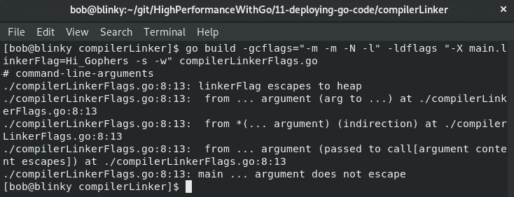

编译器标志我们在这里传递的实现了以下功能：

+   `"-m -m"`：打印有关编译器优化决策的信息。这是我们在构建命令后看到的前面截图中的输出。

+   `"-N"`：禁用 Go 二进制文件中的优化。

+   `"-l"`：禁用内联。

我们传递的链接器标志做了以下事情：

+   `"-X main.linkerFlag=Hi_Gophers"`：为`main`中的`linkerFlag`变量设置一个值。在构建时添加变量是很重要的，因为许多开发人员希望在编译时向他们的代码添加某种构建参数。我们可以使用``date -u +.%Y%m%d%.H%M%S``传递构建日期，也可以使用`git rev-list -1 HEAD`传递 git 提交版本。这些值以后可能对引用构建状态很有帮助。

+   `"-s"`：禁用符号表，这是一种存储源代码中每个标识符的数据结构，以及声明信息。这通常不需要用于生产二进制文件。

+   `"-w"`：禁用 DWARF 生成。由于 Go 二进制文件包括基本类型信息、PC 到行数据和符号表，通常不需要保存 dwarf 表。

如果我们使用标准方法构建二进制文件，然后使用一些可用的编译器和链接器标志，我们将能够看到二进制文件大小的差异：

+   非优化构建：

```go
$ go build -ldflags "-X main.linkerFlag=Hi_Gophers" -o nonOptimized
```

+   优化构建：

```go
$ go build -gcflags="-N -l" -ldflags "-X main.linkerFlag=Hi_Gophers -s -w" -o Optimized
```

正如我们所看到的，`Optimized`二进制文件比`nonOptimized`二进制文件小 28.78%：

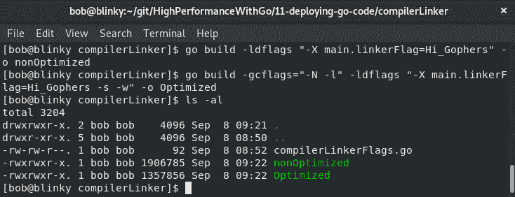

这两个二进制文件对最终用户执行相同的功能，因此考虑使用编译器和链接器标志删除一些构建优化，以减少最终生成的二进制文件大小。这在存储和部署这些二进制文件时可能是有益的。

# 构建约束

如果您想要向您的 Go 构建添加构建约束，可以在文件开头添加一行注释，该注释只在空行和其他注释之前。此注释的形式是`// +build darwin,amd64,!cgo, android,386,cgo`。

这对应于`darwin AND amd64 AND (NOT cgo)) OR (android AND 386 AND cgo`的布尔输出。

这需要在包声明之前，构建约束和包初始化之间有一个换行。这采用以下形式：

```go
// +build [OPTIONS]

package main
```

可以在[`golang.org/pkg/go/build/#hdr-Build_Constraints`](https://golang.org/pkg/go/build/#hdr-Build_Constraints)找到完整的构建约束列表。此列表包括以下构建约束：

+   `GOOS`

+   `GOARCH`

+   编译器类型（`gc`或`gccgo`）

+   `cgo`

+   所有 1.x Go 版本（beta 或次要版本没有构建标签）

+   `ctxt.BuildTags`中列出的其他单词

如果您的库中有一个文件，您希望在构建中排除它，您也可以以以下形式添加注释：

```go
// +build ignore
```

相反，您可以使用以下形式的注释将文件构建限制为特定的`GOOS`、`GOARCH`和`cgo`位：

```go
// +build windows, 386, cgo
```

只有在使用`cgo`并在 Windows 操作系统的 386 处理器上构建时才会构建文件。这是 Go 语言中的一个强大构造，因为您可以根据必要的构建参数构建包。

# 文件名约定

如果文件匹配`GOOS`和`GOARCH`模式，并去除任何扩展名和`_test`后缀（用于测试用例），则该文件将为特定的`GOOS`或`GOARCH`模式构建。这样的模式通常被引用如下：

+   `*_GOOS`

+   `*_GOARCH`

+   `*_GOOS_GOARCH`

例如，如果您有一个名为`example_linux_arm.go`的文件，它将只作为 Linux arm 构建的一部分构建。

在下一节中，我们将探讨`go clean`命令。

# Go clean - 清理您的构建目录

Go 命令会在临时目录中构建二进制文件。go clean 命令是为了删除其他工具创建的多余的对象文件或手动调用 go build 时创建的对象文件。Go clean 有一个用法部分`go clean [clean flags] [build flags] [packages]`。

对于 clean 命令，以下标志是可用的：

+   `-cache`标志会删除整个 go 构建缓存。如果您想要比较多个系统上的新构建，或者想要查看新构建所需的时间，这可能会有所帮助。

+   `-i`标志会删除 go install 创建的存档或二进制文件。

+   `-n`标志是一个空操作；打印结果会删除命令，但不执行它们。

+   `-r`标志会递归地应用逻辑到导入路径包的所有依赖项。

+   `-x`标志会打印并执行生成的删除命令。

+   `-cache`标志会删除整个 go 构建缓存。

+   `-testcache`标志会删除构建缓存中的测试结果。

+   `-modcache`标志会删除模块下载缓存。

如果我们想尝试一个没有现有依赖关系的干净构建，我们可以使用一个命令从 go 构建系统的许多重要缓存中删除项目。让我们来看一下：

1.  我们将构建我们的`prometheusExporterExample`以验证构建缓存的大小是否发生变化。我们可以使用 go 环境`GOCACHE`变量找到我们的构建缓存位置：

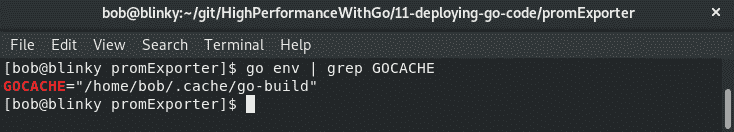

1.  对于我们的验证，我们将连续使用几个命令。首先，我们将使用`rm -rf ~/.cache/go-build/`删除整个缓存目录。

1.  接下来，我们可以通过运行`go build prometheusExporterExample.go`命令来构建我们的 Go 二进制文件。

1.  然后，我们可以通过使用`du -sh ~/.cache/go-build/`检查其大小来验证缓存的大小是否显著增加。

1.  现在，我们可以使用 go clean 程序来清除缓存，即`go clean -cache -modcache -i -r 2&>/dev/null`。

需要注意的是，一些缓存信息存储在主要库中，因此普通用户无法删除。如果需要，我们可以通过以超级用户身份运行 clean 命令来绕过这个问题，但这通常不被推荐。

然后，我们可以验证缓存的大小是否减小。如果我们在清理后查看缓存目录，我们会发现缓存目录中只剩下三个项目：

+   一个解释目录的`README`文件。

+   有一个`log.txt`文件告诉我们有关缓存信息。

+   一个`trim.txt`文件，告诉我们上次完成缓存修剪的时间。在下面的截图中，我们可以看到一个清理后的构建缓存：

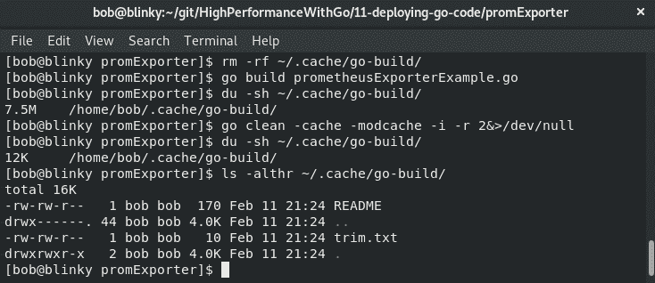

验证构建的正确缓存将加快构建过程并使开发体验更加轻松。

在下一节中，我们将看一下`go get`和`go mod`命令。

# 使用 go get 和 go mod 检索包依赖项

在构建 Go 程序时，您可能会遇到希望添加依赖项的地方。`go get`下载并安装包及其依赖项。`go get`的调用语法是`go get [-d] [-f] [-t] [-u] [-v] [-fix] [-insecure] [build flags] [packages]`。

Go 1.11 增加了对 Go 模块的初步支持。我们在第六章中学习了如何在*Go 模块*部分中利用 Go 模块。

由于我们可以在我们的 Go 程序中使用打包的依赖项，因此 Go mod vendor 通常作为 Go 构建系统的一部分。在您的代码库中打包依赖项有积极和消极的方面。在构建时本地可用所有必需的依赖项可以加快构建速度。如果您用于构建依赖项的上游存储库发生更改或被删除，您将遇到构建失败。这是因为您的程序将无法满足其上游依赖项。

打包依赖项的消极方面包括，打包依赖项将使程序员负责保持包的最新状态 - 来自上游的更新，如安全更新、性能改进和稳定性增强可能会丢失，如果依赖项被打包而没有更新。

许多企业采用打包的方法，因为他们认为存储所有必需的依赖项的安全性胜过了需要从上游更新打包目录中的新包。

初始化 go 模块后，我们将我们的依赖项打包并使用我们的打包模块构建它们：

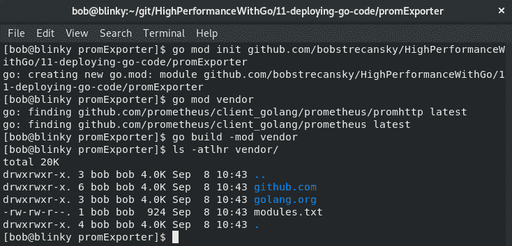

如前面的输出所示，我们有需要满足项目构建约束的依赖项（来自[`github.com/`](https://github.com/)和[`golang.org/`](https://golang.org/)）。我们可以在我们的构建中使用`go mod tidy`来验证`go.mod`是否包含了仓库的所有必要元素。

`go mod tidy`添加丢失的模块并删除未使用的模块，以验证我们的源代码与目录的`go.mod`匹配。

在接下来的部分中，我们将学习`go list`命令。

# Go list

`go list`执行列出命名的包和模块的操作，并显示有关文件、导入和依赖项的重要构建信息。`go list`的调用语法是`usage: go list [-f format] [-json] [-m] [list flags] [build flags] [packages]`。

拥有访问构建过程的主要数据结构的权限是强大的。我们可以使用`go list`来了解我们正在构建的程序的很多信息。例如，考虑以下简单的程序，它打印一条消息并为最终用户计算平方根：

```go
package main

import (
    "fmt"
    "math"
)

func main() {
    fmt.Println("Hello Gophers")
    fmt.Println(math.Sqrt(64))
}
```

如果我们想了解我们特定项目的所有依赖项，我们可以调用`go list -f '{{.Deps}}'`命令。

结果将是我们的存储库包含的所有依赖项的切片：

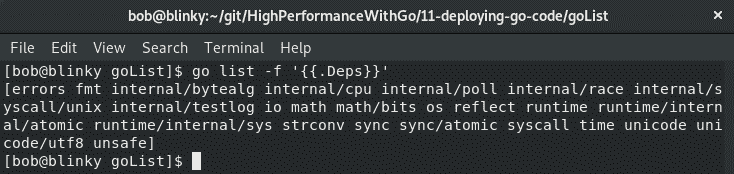

`go list`数据结构可以在这里找到：[`golang.org/cmd/go/#hdr-List_packages_or_modules`](https://golang.org/cmd/go/#hdr-List_packages_or_modules)。它有许多不同的参数。从 go list 程序中得到的另一个流行输出是 JSON 格式的输出。在下面的截图中，您可以看到执行`go list -json`对我们的`listExample.go`的输出：

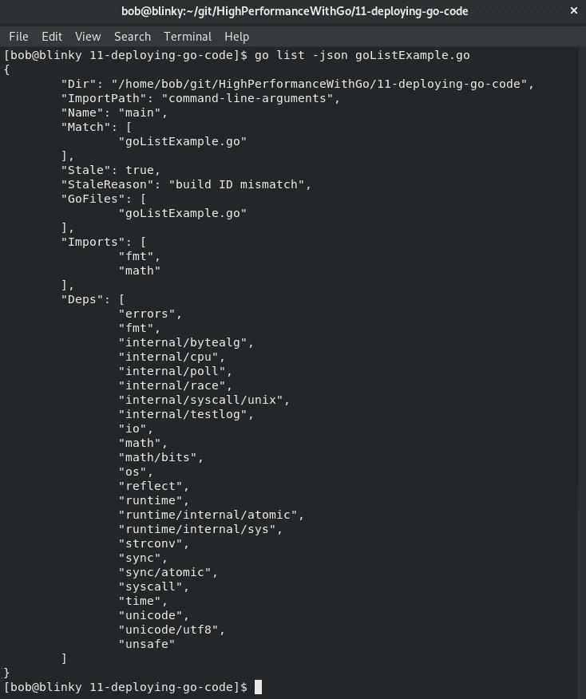

`go list -m -u all`也会显示您的依赖项。如果它们有可用的升级，结果输出中还会列出第二个版本。如果我们想要密切监视我们的依赖项及其升级，使用`go mod`包可能会有所帮助。

如果我们使用我们的 Prometheus 导出器示例，我们可以看到我们的包是否有需要升级的依赖关系：

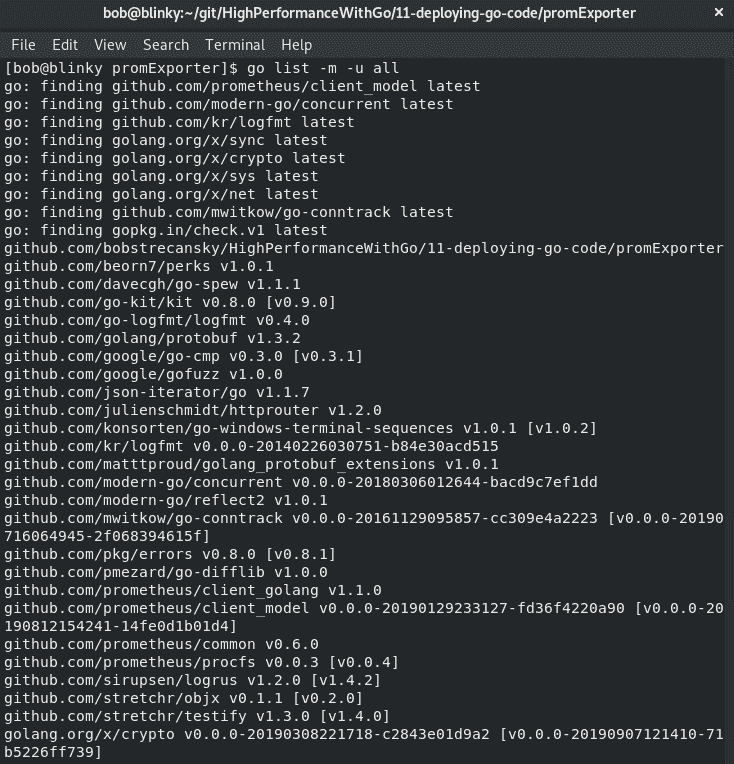

在这个例子中，我们可以看到有几个包可以升级。如果我们为其中一个依赖项调用 go get，我们将能够有效地升级它们。我们可以使用`go get github.com/pkg/errors@v0.8.1`将前面截图中列出的 errors 包从 v0.8.0 升级到 v0.8.1。

完成这次升级后，我们可以通过运行`go list -m -u github.com/pkg/errors`来验证依赖项是否已经升级。

我们可以在下面的截图中看到这个输出：

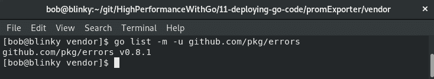

在我们之前的输出中，我们可以看到被引用的 errors 包现在是 v0.8.1，而不是我们之前输出中显示的 v0.8.0。

接下来，让我们看看`go run`是什么。

# Go run – 执行您的包

`go run`运行并编译一个命名的 Go 程序。`go run`的调用标准是`go run [build flags] [-exec xprog] package [arguments...]`。

Go run 允许开发人员快速编译和运行一个 go 二进制文件。在这个过程中，`go run`构建可执行文件，运行它，然后删除可执行文件。这在开发环境中特别有帮助。当您快速迭代您的 Go 程序时，`go run`可以用作一个快捷方式，以验证您正在更改的代码是否会产生您认为可以接受的构建产物。正如我们在本章前面学到的，许多这些工具的构建标志是一致的。

`goRun.go`是可能的 go 程序中最简单的一个。它没有参数，只是一个空的`main()`函数调用。我们使用这个作为一个例子，以展示这个过程没有额外的依赖或开销：

```go
package main 
func main() {}
```

我们可以通过执行`go run -x goRun.go`命令来看到与`go run`调用相关的工作输出。

当我们执行此操作时，我们将能够看到作为`go run`程序的一部分调用的构建参数：

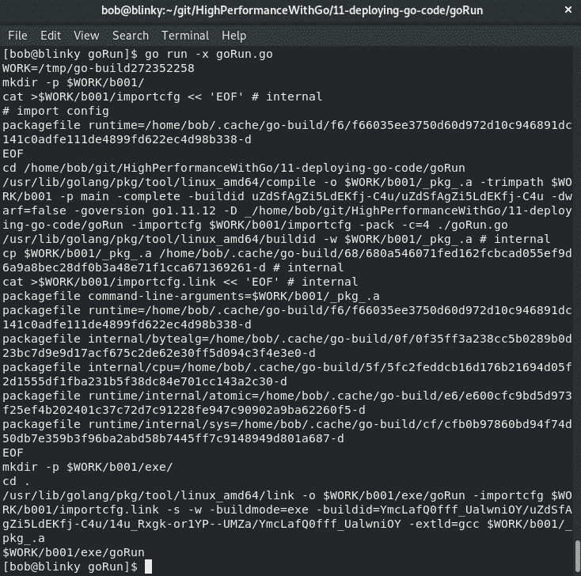

这应该看起来非常熟悉，因为输出与我们在 go build 示例中看到的输出非常相似。然后，我们可以看到我们的包被调用。

如果我们对我们的 Prometheus HTTP 服务器执行相同的操作，我们会看到我们的 Prometheus HTTP 服务器是通过执行`go run`程序启动和运行的。在这个 go run 调用期间杀死进程后，我们会注意到我们的本地目录中没有存储任何二进制文件。`go run`调用不会默认保存这些输出。

下一节中的 Go 命令（`go install`）是本章的最后一个命令。让我们看看它是什么。

# Go install – 安装您的二进制文件

`go install`编译并安装一个命名的 Go 程序。`go run`的调用标准是`go install [-i] [build flags] [packages]`。

这些被导入到`$GOPATH/pkg`。如果它们没有被修改，下次编译时将使用缓存的项目。go install 的结果输出是一个可执行文件，与使用 go build 命令编译的文件相同，安装在系统上的`$GOBIN`路径上。例如，如果我们想要在我们的主机上安装我们的 Prometheus HTTP 服务器，我们可以调用 go install 命令，即`GOBIN=~/prod-binaries/ go install -i prometheusExporterExample.go`。

设置我们的`GOBIN`变量告诉编译器在编译完成后安装编译后的二进制文件的位置。go install 程序允许我们将二进制文件安装到我们的`GOBIN`位置。`-i`标志安装命名包的依赖项。我们可以在以下截图中看到这一点：

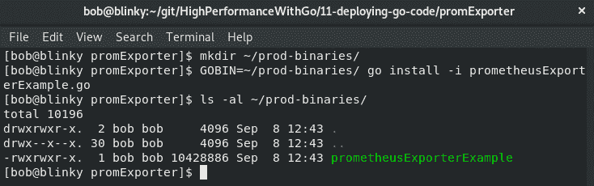

完成后，我们可以看到我们在示例中定义的`GOBIN`位置有一个`prometheusExporterExample`二进制文件可用。

在本章的即将到来的最后一节中，我们将看到如何使用 Docker 构建 Go 二进制文件。

# 使用 Docker 构建 Go 二进制文件

根据目标架构的不同，您可能希望使用 Docker 构建您的 Go 二进制文件，以保持可重现的构建，限制构建大小，并最小化服务的攻击向量。使用多阶段 Docker 构建可以帮助我们完成这项任务。

要执行这些操作，您必须安装最新版本的 Docker。我们将要使用的多阶段构建功能要求守护程序和客户端的 Docker 版本都为 17.05 或更高。您可以在[`docs.docker.com/install/`](https://docs.docker.com/install/)找到您的操作系统的最新版本的 Docker，以及安装说明。

考虑以下简单的包，它将一个调试消息记录到屏幕上：

```go
package main
import "go.uber.org/zap"
func main() {
  zapLogger: = zap.NewExample()
  defer zapLogger.Sync()
  zapLogger.Debug("Hi Gophers - from our Zap Logger")
}
```

如果我们想要在 Docker 容器中构建并执行它，同时最小化依赖关系，我们可以使用多阶段 Docker 构建。为此，我们可以执行以下步骤：

1.  通过执行以下操作将当前目录初始化为模块的根：

```go
go mod init github.com/bobstrecansky/HighPerformanceWithGo/11-deploying-go-code/multiStageDockerBuild
```

1.  通过执行以下命令添加`vendor`存储库：

```go
go mod vendor

```

现在我们的存储库中有所有必需的 vendor 包（在我们的情况下是 Zap 记录器）。可以在以下截图中看到：

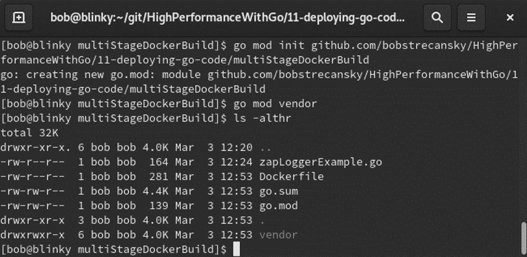

1.  构建我们的`zapLoggerExample` Docker 容器。我们可以使用以下 Dockerfile 构建我们的容器：

```go
# Builder - stage 1 of 2
FROM golang:alpine as builder
COPY . /src
WORKDIR /src
RUN CGO_ENABLED=0 GOOS=linux go build -mod=vendor -o zapLoggerExample
# Executor - stage 2 of 2
FROM alpine:latest
WORKDIR /src/
COPY --from=builder /src/zapLoggerExample .
CMD ["./zapLoggerExample"]
```

请注意，我们使用`golang:alpine`镜像来构建 Go 二进制文件，因为它是包含成功构建我们的 Go 二进制文件所需的必要元素的最简单的 Docker 镜像之一。我们使用`alpine:latest`镜像来执行 Go 二进制文件，因为它是包含成功运行我们的 Go 二进制文件所需的必要元素的最简单的 Docker 镜像之一。

在这个 Dockerfile 示例中，我们使用多阶段 Docker 构建来构建和执行我们的二进制文件。在第 1 阶段（构建阶段）中，我们使用 golang alpine 镜像作为基础。我们将当前目录中的所有文件复制到 Docker 容器的`/src/`目录中，将`/src/`设置为我们的工作目录，并构建我们的 Go 二进制文件。禁用 cgo，为我们的 Linux 架构构建，并添加我们在*步骤 1*中创建的 vendor 目录都可以帮助减小构建大小和时间。

在第 2 阶段（执行器阶段）中，我们使用基本的 alpine Docker 镜像，将`/src/`设置为我们的工作目录，并将我们在第一阶段构建的二进制文件复制到这个 Docker 容器中。然后我们在这个 Docker 构建中执行我们的记录器作为最后的命令。

1.  在我们收集了必要的依赖项之后，我们可以构建我们的 Docker 容器。我们可以通过执行以下命令来完成这个过程：

```go
docker build -t zaploggerexample .
```

1.  构建完成后，我们可以通过执行以下命令来执行 Docker 容器：

```go
docker run -it --rm zaploggerexample
```

在以下截图中，您可以看到我们的构建和执行步骤已经完成：

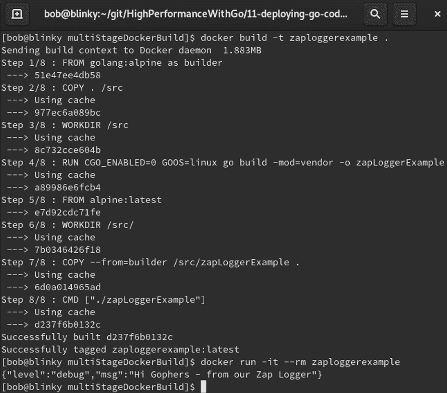

在多阶段 Docker 容器中构建我们的 Go 程序可以帮助我们创建可重复的构建，限制二进制文件大小，并通过仅使用我们需要的部分来最小化我们服务的攻击向量。

# 总结

在本章中，我们学习了如何构建 Go 二进制文件。我们学会了如何有效和永久地做到这一点。我们还学会了如何理解和管理依赖关系，使用`go run`测试 go 代码，并使用 go install 将 go 二进制文件安装到特定位置。了解这些二进制文件的工作原理将帮助您更有效地迭代您的代码。

在下一章中，我们将学习如何分析 Go 代码以找到功能瓶颈。
