# 第十二章：Go 代码分析

分析是一种用于测量计算机系统中所使用资源的实践。通常进行分析以了解程序内的 CPU 或内存利用率，以便优化执行时间、大小或可靠性。在本章中，我们将学习以下内容：

+   如何使用`pprof`对 Go 中的请求进行分析

+   如何比较多个分析

+   如何阅读生成的分析和火焰图

进行分析将帮助您推断在函数内部可以进行哪些改进，以及在函数调用中个别部分所需的时间与整个系统相比有多少。

# 了解分析

对 Go 代码进行分析是确定代码基础中瓶颈所在的最佳方法之一。我们的计算机系统有物理限制（CPU 时钟速度、内存大小/速度、I/O 读/写速度和网络吞吐量等），但我们通常可以优化我们的程序，以更有效地利用我们的物理硬件。使用分析器对计算机程序进行分析后，将生成一份报告。这份报告通常称为分析报告，可以告诉您有关您运行的程序的信息。有许多原因可能会让您想了解程序的 CPU 和内存利用率。以下是一些例子：

CPU 性能分析的原因：

+   检查软件新版本的性能改进

+   验证每个任务使用了多少 CPU

+   限制 CPU 利用率以节省成本

+   了解延迟来自何处

内存分析的原因：

+   全局变量的不正确使用

+   未完成的 Goroutines

+   不正确的反射使用

+   大字符串分配

接下来我们将讨论探索仪器方法。

# 探索仪器方法

`pprof`工具有许多不同的方法来将分析纳入您的代码。Go 语言的创建者希望确保它在实现编写高性能程序所需的分析方面简单而有效。我们可以在 Go 软件开发的许多阶段实现分析，包括工程、新功能的创建、测试和生产。

重要的是要记住，分析确实会增加一些性能开销，因为在运行的二进制文件中会持续收集更多的指标。许多公司（包括谷歌）认为这种权衡是可以接受的。为了始终编写高性能代码，增加额外的 5%的 CPU 和内存分析开销是值得的。

# 使用 go test 实施分析

您可以使用`go test`命令创建 CPU 和内存分析。如果您想比较多次测试运行的输出，这可能很有用。这些输出通常会存储在长期存储中，以便在较长的日期范围内进行比较。要执行测试的 CPU 和内存分析，请执行`go test -cpuprofile /tmp/cpu.prof -memprofile /tmp/mem.prof -bench`命令。

这将创建两个输出文件，`cpu.prof`和`mem.prof`，它们都将存储在`/tmp/`文件夹中。稍后在本章的*分析分析*部分中可以使用这些生成的分析。

# 在代码中手动进行仪器分析

如果您想特别对代码中的特定位置进行分析，可以直接在该代码周围实施分析。如果您只想对代码的一小部分进行分析，如果您希望`pprof`输出更小更简洁，或者如果您不想通过在已知的昂贵代码部分周围实施分析来增加额外开销，这可能特别有用。对代码基础的不同部分进行 CPU 和内存分析有不同的方法。

对特定代码块进行 CPU 利用率分析如下：

```go
function foo() {
pprof.StartCPUProfile()
defer pprof.StopCPUProfile()
...
code
...
}
```

对特定代码块进行内存利用率分析如下：

```go
function bar() {
runtime.GC()
defer pprof.WriteHeapProfile()
...
code
...
}
```

希望，如果我们设计有效，迭代有影响，并且使用下一节中的习语实现我们的分析，我们就不必实现代码的各个部分，但知道这始终是分析代码和检索有意义输出的潜在选择是很好的。

# 分析运行服务代码

在 Go 代码中实施分析的最常用方法是在 HTTP 处理程序函数中启用分析器。这对于调试实时生产系统非常有用。能够实时分析生产系统让您能够基于真实的生产数据做出决策，而不是基于您的本地开发环境。

有时，错误只会在特定规模的数据达到特定规模时发生。一个可以有效处理 1,000 个数据点的方法或函数，在其基础硬件上可能无法有效处理 1,000,000 个数据点。这在运行在不断变化的硬件上尤为重要。无论您是在具有嘈杂邻居的 Kubernetes 上运行，还是在具有未知规格的新物理硬件上运行，或者使用代码或第三方库的新版本，了解更改的性能影响对于创建可靠性和弹性至关重要。

能够从生产系统接收数据，其中您的最终用户及其数据的数量级可能大于您在本地使用的数量级，可以帮助您进行性能改进，影响最终用户，这可能是您在本地迭代时从未发现的。 

如果我们想在我们的 HTTP 处理程序中实现`pprof`库，我们可以使用`net/http/pprof`库。这可以通过将`_ "net/http/pprof"`导入到您的主包中来完成。

然后，您的 HTTP 处理程序将为您的分析注册 HTTP 处理程序。确保您不要在公开的 HTTP 服务器上执行此操作；您的程序概要会暴露一些严重的安全漏洞。`pprof`包的索引显示了在使用此包时可用的路径。以下是`pprof`工具索引的屏幕截图：

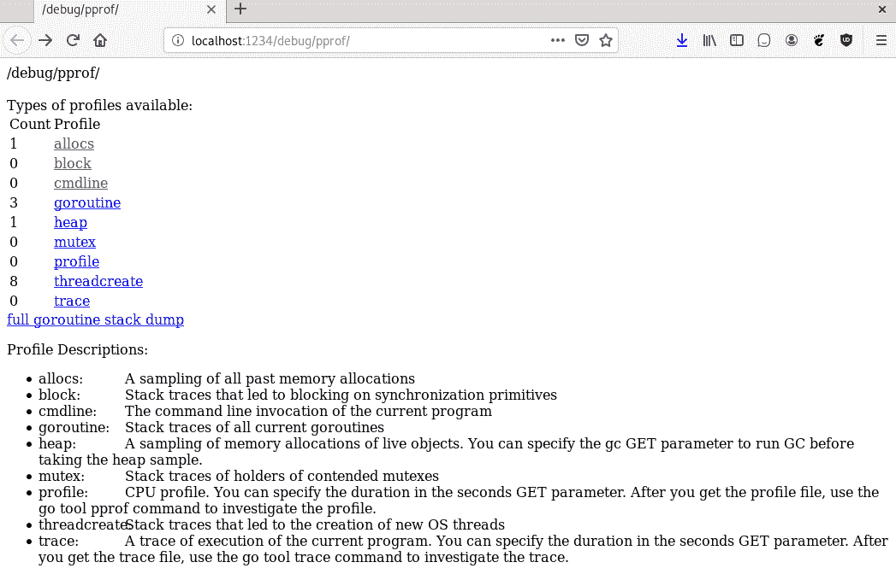

我们可以查看公开的 HTTP `pprof`路径及其描述。路径和相关描述可以在以下表中找到：

| **名称** | **HTTP 路径** | **描述** |
| --- | --- | --- |
| `allocs` | `/debug/pprof/allocs` | 内存分配信息。 |
| `block` | `/debug/pprof/block` | Goroutines 阻塞等待的信息。这通常发生在同步原语上。 |
| `cmdline` | `/debug/pprof/cmdline` | 我们二进制命令行调用的值。 |
| `goroutine` | `/debug/pprof/goroutine` | 当前正在运行的 goroutines 的堆栈跟踪。 |
| `heap` | `/debug/pprof/heap` | 内存分配采样（用于监视内存使用和泄漏）。 |
| `mutex` | `/debug/pprof/mutex` | 有争议的互斥锁堆栈跟踪。 |
| `profile` | `/debug/pprof/profile` | CPU 概要。 |
| `symbol` | `/debug/pprof/symbol` | 请求程序计数器。 |
| `threadcreate` | `/debug/pprof/threadcreate` | 操作系统线程创建堆栈跟踪。 |
| `trace` | `/debug/pprof/trace` | 当前程序跟踪。这将在第十三章中深入讨论，*跟踪 Go 代码*。 |

在下一节中，我们将讨论 CPU 分析。

# CPU 分析简介

让我们对一个简单的 Go 程序执行一些示例分析，以了解分析器的工作原理。我们将创建一个带有一些休眠参数的示例程序，以便查看不同函数调用的时间：

1.  首先，我们实例化我们的包并添加所有导入：

```go
import (
    "fmt"
    "io"
    "net/http"
    _ "net/http/pprof"
    "time"
)
```

1.  接下来，在我们的`main`函数中，我们有一个 HTTP 处理程序，其中包含两个休眠函数，作为处理程序的一部分调用：

```go
func main() {
    Handler := func(w http.ResponseWriter, req *http.Request) {
        sleep(5)
        sleep(10)
        io.WriteString(w, "Memory Management Test")
    }
    http.HandleFunc("/", Handler)
    http.ListenAndServe(":1234", nil)
}
```

我们的`sleep`函数只是睡眠了一段特定的毫秒数，并打印出结果输出：

```go
func sleep(sleepTime int) {
    time.Sleep(time.Duration(sleepTime) * time.Millisecond)
    fmt.Println("Slept for ", sleepTime, " Milliseconds")
}
```

1.  当我们运行我们的程序时，我们看到输出`go run httpProfiling.go`。要从这个特定的代码生成概要文件，我们需要调用`curl -s "localhost:1234/debug/pprof/profile?seconds=10" > out.dump`。这将运行一个 10 秒钟的概要文件，并将结果返回到一个名为`out.dump`的文件中。默认情况下，`pprof`工具将运行 30 秒，并将二进制文件返回到`STDOUT`。我们要确保我们限制这个测试的时间，以便测试持续时间合理，并且我们需要重定向输出，以便能够捕获一些有意义的内容在我们的分析工具中查看。

1.  接下来，我们为我们的函数生成一个测试负载。我们可以使用 Apache Bench 来完成这个任务，生成 5,000 个并发为 10 的请求；我们使用`ab -n 5000 -c 10 http://localhost:1234/`来设置这个。

1.  一旦我们得到了这个测试的输出，我们可以查看我们的`out.dump`文件，`go tool pprof out.dump`。这将带您进入分析器。这是 C++分析器`pprof`的一个轻微变体。这个工具有相当多的功能。

1.  我们可以使用`topN`命令查看概要文件中包含的前*N*个样本，如下图所示：

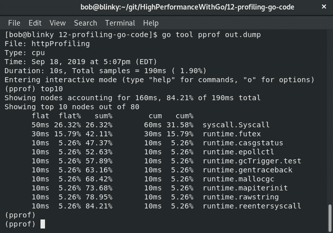

在执行分析器时，Go 程序大约每秒停止 100 次。在此期间，它记录 goroutine 堆栈上的程序计数器。我们还可以使用累积标志`(-cum)`，以便按照我们当前概要文件采样中的累积值进行排序：

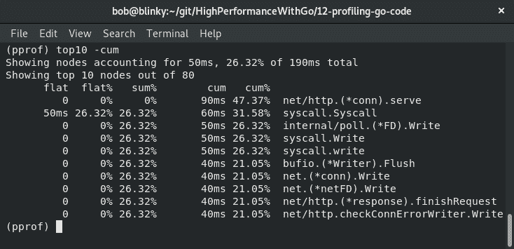

1.  我们还可以显示跟踪的可视化图形表示形式。确保安装了`graphviz`包（它应该包含在您的包管理器中，或者可以从[`www.graphviz.org/`](http://www.graphviz.org/)下载，只需键入`web`命令）

这将为我们提供一个从我们的程序内生成的概要文件的可视化表示：

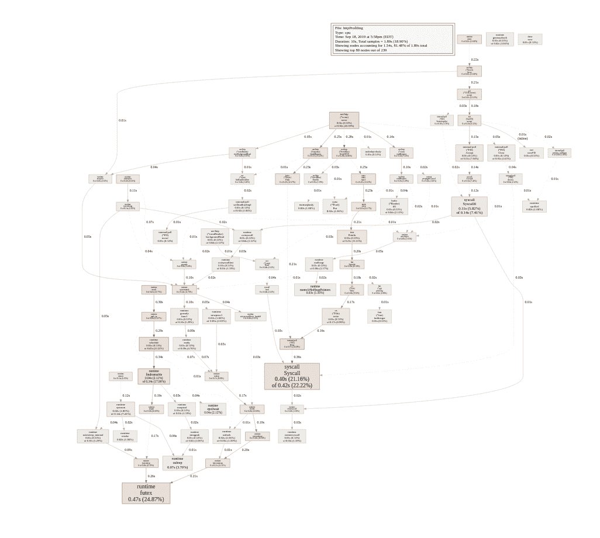

概要文件中的红色框表示对请求流最有影响的代码路径。我们可以查看这些框，并且正如我们所期望的那样，我们可以看到我们的示例程序中有相当多的时间用于睡眠和向客户端写回响应。我们可以通过传递我们想要查看的函数的名称来以相同的 web 格式查看这些特定函数。例如，如果我们想要查看我们的`sleep`函数的详细视图，我们只需键入`(pprof) web sleep`命令。

1.  然后我们将获得一个以睡眠调用为焦点的 SVG 图像：

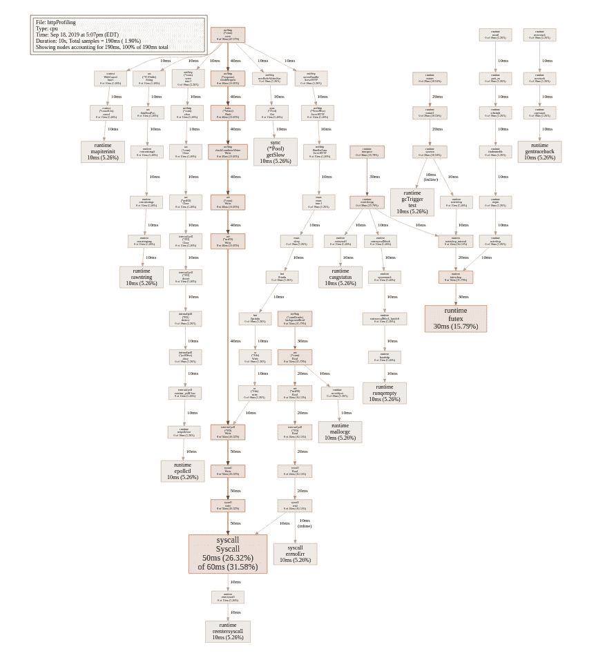

1.  在我们得到这个分解之后，我们可能想要查看睡眠函数实际执行了什么。我们可以使用`pprof`中的`list`命令，以便获得对`sleep`命令及其后续调用的调用进行分析的输出。以下屏幕截图显示了这一点；为了简洁起见，代码被缩短了：

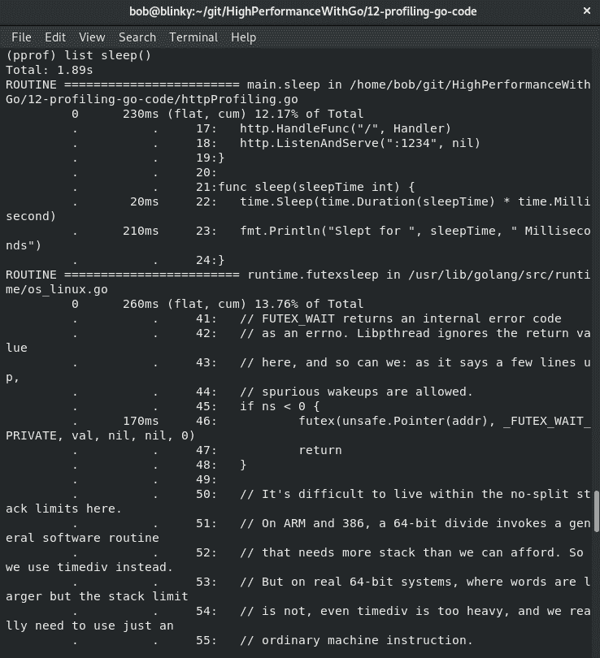

通过对我们正在进行的工作进行分析并将其分解为可分段的块，可以告诉我们很多关于我们需要从利用角度采取的开发方向。

在下一节中，我们将看到内存分析是什么。

# 内存分析简介

我们可以对内存执行与我们在上一节中对 CPU 测试相似的操作。让我们看看另一种处理分析的方法，使用测试功能。让我们使用我们在第二章中创建的例子，*数据结构和算法*中的`o-logn`函数。我们可以使用我们已经为这个特定函数创建的基准，并为这个特定的测试添加一些内存分析。我们可以执行`go test -memprofile=heap.dump -bench`命令。

我们将看到与我们在第二章中看到的类似的输出，*数据结构和算法*：

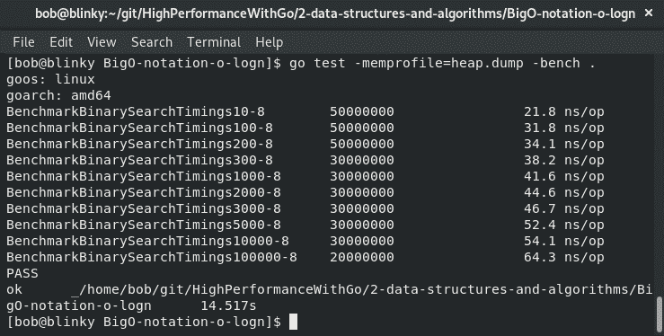

唯一的区别是现在我们将从这个测试中得到堆剖析。如果我们用分析器查看它，我们将看到关于堆使用情况的数据，而不是 CPU 使用情况。我们还将能够看到该程序中每个函数的内存分配情况。以下图表说明了这一点：

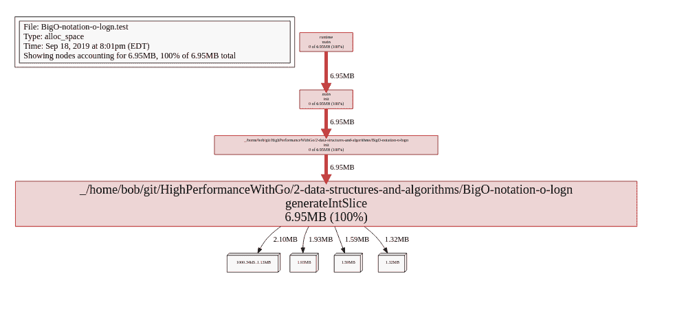

这很有帮助，因为它使我们能够看到代码中每个部分生成的堆大小。我们还可以查看累积内存分配的前几名：

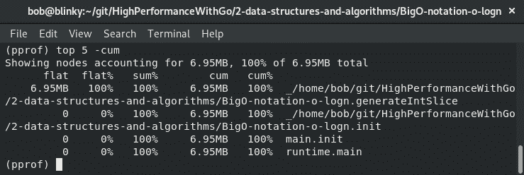

随着我们的程序变得更加复杂，理解内存利用情况变得越来越重要。在下一节中，我们将讨论如何通过上游`pprof`扩展我们的分析能力。

# 上游 pprof 的扩展功能

如果我们想要默认使用额外的功能，我们可以使用上游的`pprof`二进制文件来扩展我们的分析视图：

1.  我们可以通过调用`go get github.com/google/pprof`来获取这个。`pprof`工具有几种不同的调用方法。我们可以使用报告生成方法来生成所请求格式的文件（目前支持`.dot`、`.svg`、`.web`、`.png`、`.jpg`、`.gif`和`.pdf`格式）。我们还可以像在前几节关于 CPU 和内存分析中所做的那样，使用交互式终端格式。最后，最常用的方法是使用 HTTP 服务器。这种方法涉及在一个易于消化的格式中托管包含大部分相关输出的 HTTP 服务器。

1.  一旦我们通过`go get`获取了二进制文件，我们可以使用 web 界面调用它，查看我们之前生成的输出：`pprof -http=:1234 profile.dump`。

1.  然后我们可以访问新提供的 UI，看看默认的`pprof`工具中没有内置的功能和功能。这个工具提供的一些关键亮点如下：

+   一个正则表达式可搜索的表单字段，以帮助搜索必要的分析元素

+   一个下拉式视图菜单，方便查看不同的分析工具

+   一个样本下拉菜单，显示来自剖析的样本

+   一个细化的过滤器，用于隐藏/显示请求流的不同部分

拥有所有这些工具来进行分析有助于使分析过程更加流畅。如果我们想要查看运行任何带有`fmt`名称的调用所花费的时间，我们可以使用带有正则表达式过滤器的示例视图，它将突出显示`fmt`调用，正如我们在下面的截图中所看到的那样：

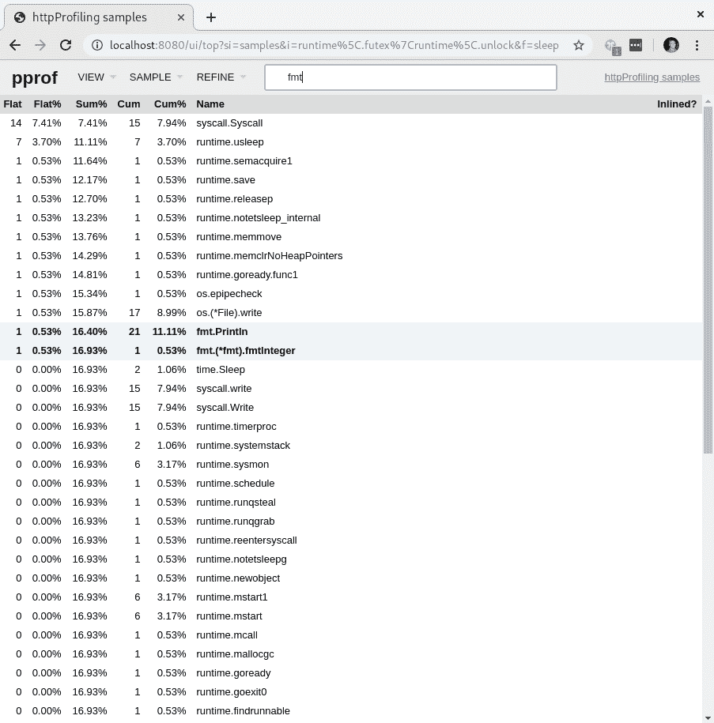

根据这些值进行过滤可以帮助缩小性能不佳函数的范围。

# 比较多个分析

分析的一个非常好的特性是可以将不同的分析进行比较。如果我们从同一个程序中有两个单独的测量，我们可以确定我们所做的更改是否对系统产生了积极的影响。让我们稍微改进一下我们的 HTTP 睡眠定时函数：

1.  让我们添加一些额外的导入：

```go
package main

import (
  "fmt"
  "net/http"
  _ "net/http/pprof"
  "strconv"
  "time"
)
```

1.  接下来，我们将增强我们的处理程序以接受`time`的查询字符串参数：

```go
func main() { 
    Handler := func(w http.ResponseWriter, r *http.Request) {
        sleepDuration := r.URL.Query().Get("time")
        sleepDurationInt, err := strconv.Atoi(sleepDuration)
        if err != nil {
            fmt.Println("Incorrect value passed as a query string for time")
            return
        }
        sleep(sleepDurationInt)
        fmt.Fprintf(w, "Slept for %v Milliseconds", sleepDuration)
    } 
    http.HandleFunc("/", Handler)
    http.ListenAndServe(":1234", nil)
}
```

1.  我们将保持我们的睡眠函数完全相同：

```go
func sleep(sleepTime int) {
    time.Sleep(time.Duration(sleepTime) * time.Millisecond)
    fmt.Println("Slept for ", sleepTime, " Milliseconds")
}
```

1.  现在我们有了这个额外的功能，我们可以通过向我们的 HTTP 处理程序传递查询参数来使用不同时间进行多个配置文件的采集：

+   我们可以运行我们的新定时配置工具：

```go
go run timedHttpProfiling.go
```

1.  +   在另一个终端中，我们可以启动我们的配置工具：

```go
curl -s "localhost:1234/debug/pprof/profile?seconds=20" > 5-millisecond-profile.dump
```

1.  +   然后我们可以对我们的新资源进行多次请求：

```go
ab -n 10000 -c 10 http://localhost:1234/?time=5
```

1.  +   然后我们可以收集第二个配置文件：

```go
curl -s "localhost:1234/debug/pprof/profile?seconds=20" > 10-millisecond-profile.dump
```

1.  +   然后我们对我们的新资源进行第二次请求，生成第二个配置文件：

```go
ab -n 10000 -c 10 http://localhost:1234/?time=10
```

1.  现在我们有两个单独的配置文件，分别存储在`5-millisecond-profile.dump`和`10-millisecond-profile.dump`中。我们可以使用与之前相同的工具进行比较，设置一个基本配置文件和一个次要配置文件。以下截图说明了这一点：

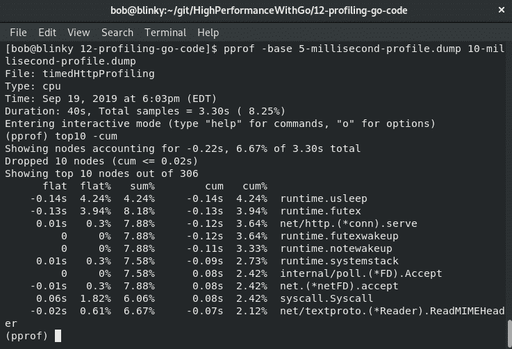

比较配置文件可以帮助我们了解变化如何影响我们的系统。

让我们继续下一节的火焰图。

# 解释 pprof 中的火焰图

在上游`pprof`包中最有帮助/有用的工具之一是火焰图。火焰图是一种固定速率采样可视化，可以帮助确定配置文件中的热代码路径。随着您的程序变得越来越复杂，配置文件变得越来越大。往往很难知道到底哪段代码路径占用了最多的 CPU，或者我经常称之为*帐篷中的长杆*。

火焰图最初是由 Netflix 的 Brendan Gregg 开发的，用于解决 MySQL 的 CPU 利用率问题。这种可视化的出现帮助许多程序员和系统管理员确定程序中延迟的来源。`pprof`二进制文件生成一个 icicle-style（火焰向下指）火焰图。在火焰图中，我们有特定帧中的数据可视化。

+   *x*轴是我们请求的所有样本的集合

+   y 轴显示了堆栈上的帧数，通常称为堆栈深度

+   方框的宽度显示了特定函数调用使用的总 CPU 时间

这三个东西一起可视化有助于确定程序的哪一部分引入了最多的延迟。您可以访问`pprof`配置文件的火焰图部分，网址为`http://localhost:8080/ui/flamegraph`。以下图片显示了一个火焰图的示例：

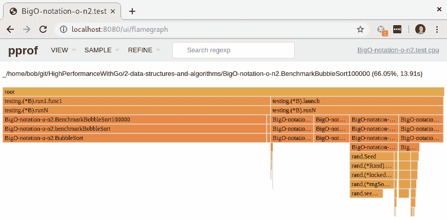

如果我们看看第二章中的`bubbleSort`示例，*数据结构和算法*，我们可以看到在我们的测试中占用 CPU 时间的不同部分。在交互式网络模式中，我们可以悬停在每个样本上，并验证它们的持续时间和百分比执行时间。

在接下来的部分中，我们将看到如何检测 Go 中的内存泄漏。

# 检测 Go 中的内存泄漏

正如第八章中*Go 内存管理*部分所讨论的，我们有很多工具可以查看当前正在执行的程序的内存统计信息。在本章中，我们还将学习使用 pprof 工具进行配置文件。Go 中更常见的内存泄漏之一是无限创建 goroutine。当您过载一个非缓冲通道或者有一个具有大量并发生成新 goroutine 的抽象时，这种情况经常发生。Goroutine 的占用空间非常小，系统通常可以生成大量的 goroutine，但最终会有一个上限，在生产环境中调试程序时很难找到。

在下面的示例中，我们将查看一个有泄漏抽象的非缓冲通道：

1.  我们首先初始化我们的包并导入我们需要的依赖项：

```go
package main

import (
 "fmt"
 "net/http"

 _ "net/http/pprof"                                                                   
 "runtime"
 "time"
)
```

1.  在我们的主函数中，我们处理 HTTP 监听和为`leakyAbstraction`函数提供服务。我们通过 HTTP 提供这个服务，以便简单地看到 goroutines 的数量增长：

```go
func main() {
 http.HandleFunc("/leak", leakyAbstraction)
 http.ListenAndServe("localhost:6060", nil)
}  
```

1.  在我们的`leakyAbstraction`函数中，我们首先初始化一个无缓冲的字符串通道。然后我们通过一个 for 循环无休止地迭代，将 goroutines 的数量写入 HTTP 响应写入器，并将我们的`wait()`函数的结果写入通道：

```go
func leakyAbstraction(w http.ResponseWriter, r *http.Request) {
 ch := make(chan string)                                                                

 for {
   fmt.Fprintln(w, "Number of Goroutines: ", runtime.NumGoroutine())
   go func() { ch <- wait() }()
 }          
}
```

1.  我们的`wait()`函数休眠五微秒并返回一个字符串：

```go
func wait() string {
 time.Sleep(5 * time.Microsecond)
 return "Hello Gophers!"
}
```

这些函数一起将生成 goroutines，直到运行时不再能够这样做并死亡。我们可以通过执行以下命令来测试这一点：

```go
go run memoryLeak.go
```

服务器运行后，在一个单独的终端窗口中，我们可以使用以下命令向服务器发出请求：

```go
curl localhost:6060/leak
```

`curl`命令将打印生成的 goroutines 数量，直到服务器被关闭：

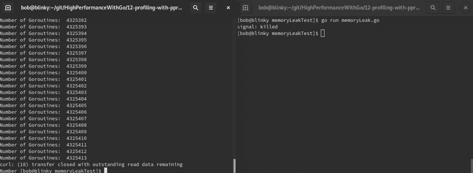

请注意，根据您系统的规格，此请求可能需要一段时间。这没关系——它说明了您的程序可用于使用的 goroutines 数量。

使用我们在本章学到的技术，我们将能够进一步调试类似这样的内存问题，但理解潜在的问题将帮助我们避免内存问题。

这个例子是为了明确展示内存泄漏，但如果我们想要使这个可执行文件不泄漏 goroutines，我们需要修复两件事：

+   我们的无限循环很可能应该有一个限制

+   我们可以添加一个带缓冲的通道，以确保我们有能力处理通过通道进入的所有生成的 goroutines

# 总结

在本章中，我们学习了关于 profiles 的知识——profiles 是什么，以及如何使用`pprof`生成 profiles。您还学会了如何使用不同的方法分析 profiles，如何比较 profiles，以及如何阅读性能的火焰图。能够在生产环境中执行这个操作将帮助您保持稳定，提高性能，并为最终用户提供更好的用户体验。在下一章中，我们将讨论另一种分析代码的方法——跟踪。
