# 跟踪 Go 代码

跟踪 Go 程序是检查 Go 程序中函数和服务之间的互操作性的一种绝妙方式。跟踪允许您通过系统传递上下文，并评估您被阻止的位置，无论是由第三方 API 调用、缓慢的消息队列还是*O*(*n*²)函数。跟踪将帮助您找到这个瓶颈所在。在本章中，我们将学习以下内容：

+   实施跟踪的过程

+   使用跟踪进行采样的过程

+   解释跟踪的过程

+   比较跟踪的过程

能够实施跟踪并解释结果将帮助开发人员理解和排除故障他们的分布式系统。

# 实施跟踪仪器

Go 的并发模型使用 goroutines，非常强大。高并发的一个缺点是，当您尝试调试高并发模型时，您会遇到困难。为了避免这种困难，语言创建者创建了`go tool trace`。然后他们在 Go 版本 1.5 中分发了这个工具，以便能够调查和解决并发问题。Go 跟踪工具钩入 goroutine 调度程序，以便能够提供有关 goroutines 的有意义信息。您可能希望使用 Go 跟踪调查的一些实现细节包括以下内容：

+   延迟

+   资源争用

+   并行性差

+   与 I/O 相关的事件

+   系统调用

+   通道

+   锁

+   **垃圾收集** (**GC**)

+   Goroutines

解决所有这些问题将帮助您构建一个更具弹性的分布式系统。在下一节中，我们将讨论跟踪格式以及它如何适用于 Go 代码。

# 理解跟踪格式

Go 跟踪可以提供大量信息，并且可以捕获大量请求每秒。因此，跟踪以二进制格式捕获。跟踪输出的结构是静态的。在以下输出中，我们可以看到跟踪遵循特定的模式-它们被定义，并且事件被用十六进制前缀和有关特定跟踪事件的一些信息进行分类。查看这个跟踪格式将帮助我们理解我们的跟踪事件如何存储和如何使用 Go 团队为我们提供的工具检索：

```go
Trace = "gotrace" Version {Event} .

Event = EventProcStart | EventProcStop | EventFreq | EventStack | EventGomaxprocs | EventGCStart | EventGCDone | EventGCScanStart | EventGCScanDone | EventGCSweepStart | EventGCSweepDone | EventGoCreate | EventGoStart | EventGoEnd | EventGoStop | EventGoYield | EventGoPreempt | EventGoSleep | EventGoBlock | EventGoBlockSend | EventGoBlockRecv | EventGoBlockSelect | EventGoBlockSync | EventGoBlockCond | EventGoBlockNet | EventGoUnblock | EventGoSysCall | EventGoSysExit | EventGoSysBlock | EventUser | EventUserStart | EventUserEnd .

EventProcStart = "\x00" ProcID MachineID Timestamp .
EventProcStop = "\x01" TimeDiff .
EventFreq = "\x02" Frequency .
EventStack = "\x03" StackID StackLen {PC} .
EventGomaxprocs = "\x04" TimeDiff Procs .
EventGCStart = "\x05" TimeDiff StackID .
EventGCDone = "\x06" TimeDiff .
EventGCScanStart= "\x07" TimeDiff .
EventGCScanDone = "\x08" TimeDiff .
EventGCSweepStart = "\x09" TimeDiff StackID .
EventGCSweepDone= "\x0a" TimeDiff .
EventGoCreate = "\x0b" TimeDiff GoID PC StackID .
EventGoStart = "\x0c" TimeDiff GoID .
EventGoEnd = "\x0d" TimeDiff .
EventGoStop = "\x0e" TimeDiff StackID .
EventGoYield = "\x0f" TimeDiff StackID .
EventGoPreempt = "\x10" TimeDiff StackID .
EventGoSleep = "\x11" TimeDiff StackID .
EventGoBlock = "\x12" TimeDiff StackID .
EventGoBlockSend= "\x13" TimeDiff StackID .
EventGoBlockRecv= "\x14" TimeDiff StackID .
EventGoBlockSelect = "\x15" TimeDiff StackID .
EventGoBlockSync= "\x16" TimeDiff StackID .
EventGoBlockCond= "\x17" TimeDiff StackID .
EventGoBlockNet = "\x18" TimeDiff StackID .
EventGoUnblock = "\x19" TimeDiff GoID StackID .
EventGoSysCall = "\x1a" TimeDiff StackID .
EventGoSysExit = "\x1b" TimeDiff GoID .
EventGoSysBlock = "\x1c" TimeDiff .
EventUser = "\x1d" TimeDiff StackID MsgLen Msg .
EventUserStart = "\x1e" TimeDiff StackID MsgLen Msg .
EventUserEnd = "\x1f" TimeDiff StackID MsgLen Msg .
```

有关 Go 执行跟踪器的更多信息可以在 Dmitry Vyukov 发布的原始规范文档中找到[`docs.google.com/document/u/1/d/1FP5apqzBgr7ahCCgFO-yoVhk4YZrNIDNf9RybngBc14/pub`](https://docs.google.com/document/u/1/d/1FP5apqzBgr7ahCCgFO-yoVhk4YZrNIDNf9RybngBc14/pub)。

能够看到跟踪的所有这些元素将帮助我们理解如何将跟踪分解为原子块。在下一节中，我们将讨论跟踪收集。

# 理解跟踪收集

能够收集跟踪是实施分布式系统中跟踪的重要部分。如果我们不在某个地方汇总这些跟踪，我们将无法在规模上理解它们。我们可以使用三种方法收集跟踪数据：

+   通过调用`trace.Start`和`trace.Stop`手动调用数据的跟踪

+   使用测试标志`-trace=[OUTPUTFILE]`

+   对`runtime/trace`包进行仪器化

为了了解如何在代码周围实施跟踪，让我们看一个简单的示例程序：

1.  我们首先实例化我们的包并导入必要的包：

```go
package main

import (
    "os"
    "runtime/trace"
)
```

1.  然后我们调用我们的`main`函数。我们将跟踪输出写入一个名为`trace.out`的文件，稍后我们将使用它：

```go
func main() {

    f, err := os.Create("trace.out")
    if err != nil {
        panic(err)
    } 

    defer f.Close()
```

1.  接下来，我们实现我们想要在程序中使用的跟踪，并在函数返回时推迟跟踪的结束：

```go
    err = trace.Start(f)
    if err != nil {
        panic(err)
    } 

    defer trace.Stop()
```

1.  然后我们编写我们想要实现的代码。我们这里的示例只是在匿名函数中通过通道简单地传递字符串`"Hi Gophers"`：

```go
    ch := make(chan string)
    go func() {
        ch <- "Hi Gophers"
    }()
    <-ch
}
```

现在我们已经在我们的（诚然简单的）程序周围实施了跟踪，我们需要执行我们的程序以产生跟踪输出：

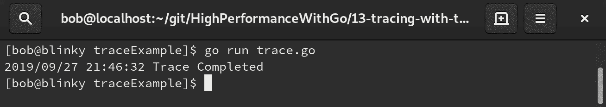

1.  要查看跟踪，您可能需要安装额外的软件包。对于我正在测试的 Fedora 系统，我不得不安装额外的 `golang-misc` 软件包：`sudo dnf install golang-misc`。

1.  创建跟踪后，您可以使用 `go tool trace trace.out` 命令打开您创建的跟踪。

这使您可以启动将提供跟踪输出的 HTTP 服务器。我们可以在下面的截图中看到这个输出：

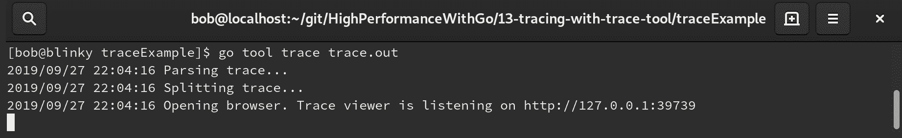

我们可以在 Chrome 浏览器中看到生成的跟踪输出。重要的是要提到，我们需要使用兼容的浏览器，即 Chrome。在撰写本书时，Firefox 会产生一个空白页面的跟踪输出。这是在 Chrome 浏览器中的跟踪输出：

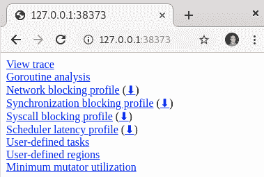

这个 HTML 页面为您提供了许多不同的有用输出选择。让我们逐个在下表中查看它们：

| 链接 | 描述 |
| --- | --- |
| 查看跟踪 | 查看 GUI 跟踪输出。 |
| Goroutine 分析 | 显示不同的 goroutine 信息。 |
| 网络阻塞概要 | 显示网络阻塞；可以创建单独的概要。 |
| 同步阻塞概要 | 显示同步阻塞；可以创建单独的概要。 |
| 系统调用阻塞概要 | 显示系统调用阻塞；可以创建单独的概要。 |
| 调度器延迟概要 | 显示与调度器相关的所有延迟；可以创建单独的概要。 |
| 用户定义的任务 | 允许查看任务数据类型；用于跟踪用户定义的逻辑操作。这是使用格式 `trace.NewTask()` 调用的。 |
| 用户定义的区域 | 允许查看区域数据类型；用于跟踪代码区域。这是使用格式 `trace.WithRegion()` 调用的。 |
| 最小 mutator 利用率 | 创建一个可视化图表，显示垃圾收集器从程序中窃取工作的位置和时间。这有助于您了解您的生产服务是否受到 GC 的限制。 |

我们可以先在网页浏览器中查看跟踪：

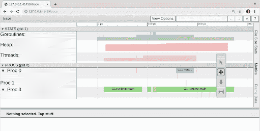

当我们查看这些跟踪时，我们可以做的第一件事是查看帮助菜单，它位于屏幕右上角的问号框中。这个信息菜单为我们提供了有关跟踪工具能力的许多描述：

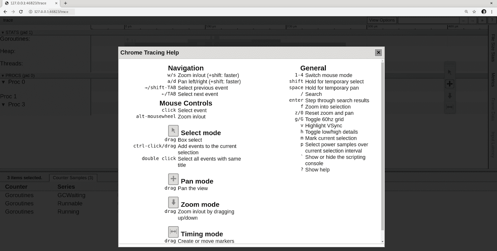

能够快速有效地在跟踪窗口中移动将帮助您快速查看跟踪。当您试图快速解决生产问题时，这可能非常有帮助。

# 跟踪窗口中的移动

使用经典的 *WASD* 移动键（受到许多第一人称角色扮演视频游戏的启发），我们可以在跟踪中移动。移动键的描述如下：

+   按下 *W* 键，可以放大跟踪的时间窗口。

+   按下 *S* 键缩小。

+   按下 *A* 键向后移动时间。

+   按下 *D* 键向前移动时间。我们也可以通过点击和拖动鼠标向前和向后移动时间。

使用鼠标指针选择器或点击数字键可以操作时间信息。键盘更改列在以下项目符号中：

+   按下 *1* 键让我们选择要检查的跟踪部分

+   按下 *2* 键可以平移

+   按下 *3* 键调用放大功能

+   按下 *4* 键可以选择特定的时间

现在我们可以使用 */* 键搜索跟踪，使用 *Enter* 键浏览结果。

我们还有文件大小统计、指标、帧数据和右侧屏幕上可用的输入延迟窗口。单击这些按钮将打开一个弹出窗口，告诉您有关跟踪中每个特定统计信息的更多细节。

如果我们在跟踪中的 goroutines 行中点击蓝色区域，我们可以查看一些我们的 goroutines 可用统计信息：

+   `GCWaiting`，即正在等待的垃圾收集运行数量（当前值为 0）

+   当前可运行的 goroutines 数量为 1

+   当前正在运行的 goroutines 数量为 1

我们可以在以下截图中看到我们的 goroutines 的可用统计信息：

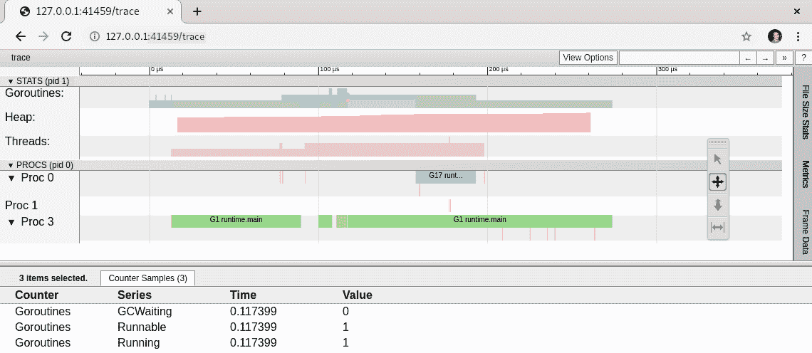

goroutine 信息对于最终用户调试程序可能有所帮助。在 Go 跟踪工具中观察 goroutines 可以帮助我们确定 goroutine 何时在争用。它可能正在等待通道清除，可能被系统调用阻塞，或者可能被调度程序阻塞。如果有许多 goroutines 处于等待状态，这意味着程序可能创建了太多的 goroutines。这可能导致调度程序被过度分配。拥有所有这些信息可以帮助我们做出明智的决定，以更有效地编写程序来利用 goroutines。

单击堆行中的橙色条将显示堆信息：

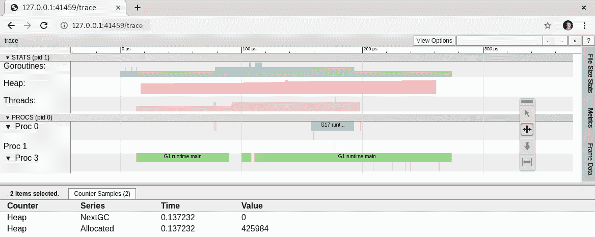

在所选时间（0.137232）时，我们可以看到我们的堆分配了 425984 字节，或大约 425 KB。了解当前分配给堆的内存量可以告诉我们我们的程序是否存在内存争用。剖析（正如我们在第十二章中学到的，*Go 代码的剖析*）通常是查看堆信息的更好方法，但在跟踪上下文中对分配有一个一般的了解通常是有帮助的。

接下来我们可以查看线程信息。单击跟踪中线程行中的活动线程（跟踪的 Threads 行中的洋红色块）将显示处于 InSyscall 和 Running 状态的线程数量：

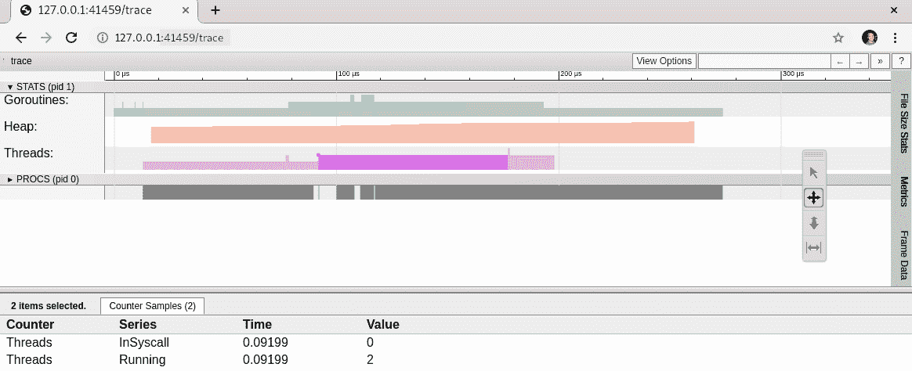

了解正在运行的 OS 线程数量以及当前有多少个线程被系统调用阻塞可能会有所帮助。

接下来，我们可以查看正在运行的每个单独进程。单击进程将显示以下截图中显示的所有详细信息。如果将鼠标悬停在跟踪底部窗格中的事件之一上，您将能够看到进程如何相互关联，如以下截图中的红色箭头所示：

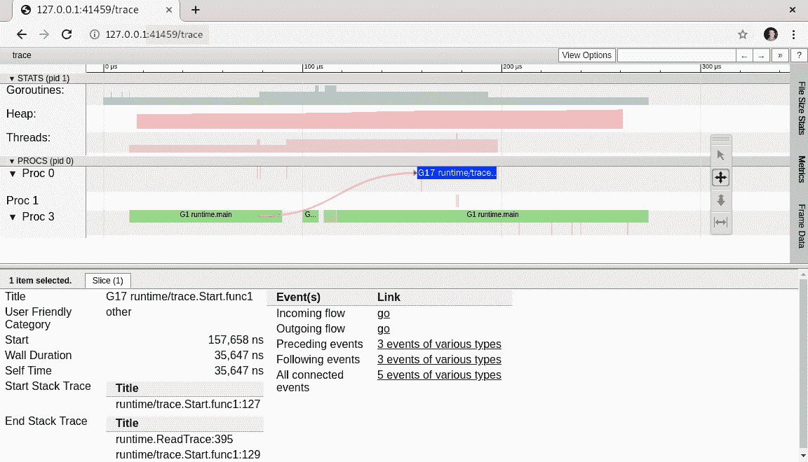

了解您的进程的端到端流程通常可以帮助您诊断问题进程。在下一节中，我们将学习如何探索类似 pprof 的跟踪。

# 探索类似 pprof 的跟踪

Go 工具跟踪也可以生成四种不同类型的跟踪，这可能与您的故障排除需求相关：

+   `net`：一个网络阻塞配置文件

+   `sync`：一个同步阻塞的配置文件

+   `syscall`：一个系统调用阻塞配置文件

+   `sched`：一个调度器延迟配置文件

让我们看看如何在 Web 服务器上使用这些跟踪配置文件的示例：

1.  首先，我们初始化我们的`main`并导入必要的包。请注意，对于`_ "net/http/pprof"`中的显式包名称，使用了空白标识符。这是为了确保我们可以进行跟踪调用：

```go
package main

import (
    "io"
    "net/http"
    _ "net/http/pprof"
    "time"
)

```

1.  接下来，我们设置一个简单的 Web 服务器，等待五秒钟并向最终用户返回一个字符串：

```go
func main() {

   handler := func(w http.ResponseWriter, req *http.Request) {
       time.Sleep(5 * time.Second)
       io.WriteString(w, "Network Trace Profile Test")
    }

    http.HandleFunc("/", handler)
    http.ListenAndServe(":1234", nil)
}
```

1.  在执行`go run netTracePprof.go`后运行服务器后，我们可以进行跟踪：`curl localhost:1234/debug/pprof/trace?seconds=10 > trace.out`。我们可以在以下截图中看到我们的`curl`的输出：

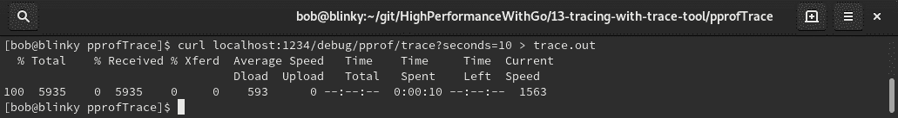

1.  同时，在另一个终端中，我们可以对我们示例的 Web 服务器的`/`路径进行请求：`curl localhost:1234/`。然后我们将在运行跟踪的目录中返回一个`trace.out`文件。然后我们可以使用`go tool trace trace.out`打开我们的跟踪。然后我们将看到我们的跟踪结果。在生成的 HTTP 页面中利用网络阻塞配置文件，我们可以看到网络阻塞配置文件的跟踪：

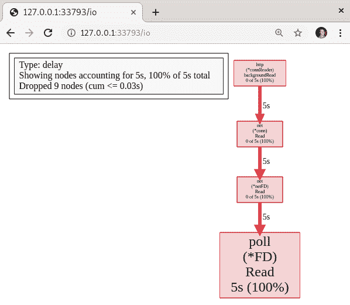

正如预期的那样，我们看到了五秒的等待，因为这是我们为这个特定的 web 请求在处理程序函数中添加的等待时间。如果我们愿意，我们可以下载这个配置文件，并在我们在第十二章中讨论的上游`pprof`工具中查看它，*Go 代码性能分析*。在跟踪 HTML 窗口中，有一个下载按钮，旁边是 web 配置文件：

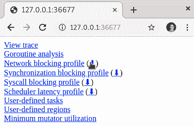

在我们下载了这个配置文件之后，我们可以使用我们在第十二章中安装的上游`pprof`工具来查看它，*Go 代码性能分析*：

```go
$ pprof -http=:1235 ~/Downloads/io.profile
```

然后我们可以看一下火焰图：

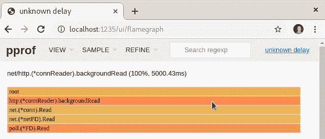

我们可以在以下截图中看到 peek UI：

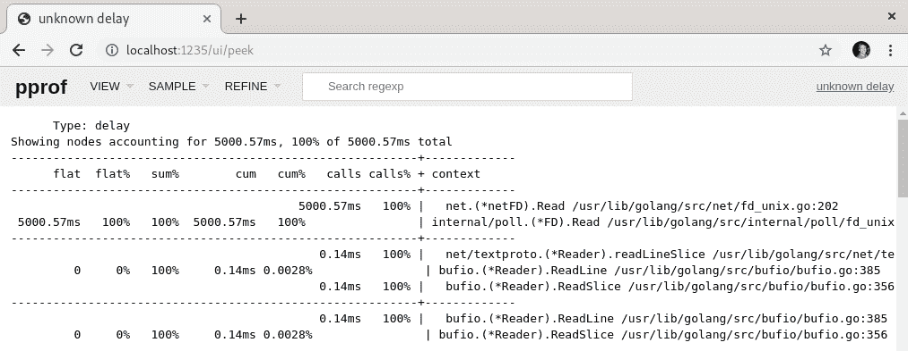

火焰图和 peek UI 都有助于使这些复杂的调试视图变得更加简洁。在下一节中，我们将看到 Go 中的分布式跟踪是什么。

# Go 分布式跟踪

为 Go 程序实现和调查单个跟踪可能是一项富有成效的工作，可以提供大量关于导致我们程序请求的数据的输出。随着企业拥有越来越多的分布式代码库，以及更多相互操作的复杂调用，追踪单个调用在长期内变得不可行。有两个项目试图帮助 Go 进行分布式跟踪，它们分别是 OpenCensus Go 库和 OpenTelemetry 库：

+   `opencensus-go`: [`github.com/census-instrumentation/opencensus-go`](https://github.com/census-instrumentation/opencensus-go)

+   `opentracing-go`: [`github.com/opentracing/opentracing-go`](https://github.com/opentracing/opentracing-go)

这些项目的维护者已决定将这两个项目合并，并开始在一个名为 OpenTelemetry 的代码库上进行工作。这个新的代码库将允许在许多语言和基础设施中简化集成分布式跟踪。您可以在[`github.com/open-telemetry/opentelemetry-go`](https://github.com/open-telemetry/opentelemetry-go)了解更多关于 OpenTelemetry 的 Go 实现。

在撰写本书时，OpenTelemetry 尚未准备好供生产使用。OpenTelemetry 将向后兼容 OpenCensus 和 OpenTracing，并提供安全补丁。在本书的下一节中，我们将看看如何使用 OpenCensus 实现 Go 程序。将来，使用我们将要讨论的实现 OpenCensus 跟踪的策略，使用 OpenTelemetry 实现您的程序应该是相对简单的。

在接下来的部分，我们将看到如何为我们的应用程序实现 OpenCensus。

# 为您的应用程序实现 OpenCensus

让我们用一个实际的例子来介绍在应用程序中使用 OpenCensus 跟踪。要开始，我们需要确保我们的机器上安装了 Docker。您可以使用[`docs.docker.com/`](https://docs.docker.com/)上的安装文档来确保 Docker 已安装并在您的机器上正确运行。完成后，我们可以开始创建、实现和查看一个示例应用程序。安装了 Docker 后，我们可以拉取我们的仪器的重要镜像。在我们的示例中，我们将使用 Redis（一个键值存储）来存储应用程序中的键值事件，并使用 Zipkin（一个分布式跟踪系统）来查看这些跟踪。

让我们拉取这个项目的依赖项：

1.  Redis 是我们将在示例应用程序中使用的键值存储：

```go
docker pull redis:latest
```

1.  Zipkin 是一个分布式跟踪系统：

```go
docker pull openzipkin/zipkin
```

1.  我们将启动我们的 Redis 服务器，并让它在后台运行：

```go
docker run -it -d -p 6379:6379 redis
```

1.  我们将为我们的 Zipkin 服务器做同样的事情：

```go
docker run -it -d -p 9411:9411 openzipkin/zipkin
```

一旦我们安装并准备好所有依赖项，我们就可以开始编写我们的应用程序：

1.  首先，我们将实例化我们的`main`包并添加必要的导入：

```go
package main

import (

    "context"
    "log"
    "net/http"
    "time"

    "contrib.go.opencensus.io/exporter/zipkin"
    "go.opencensus.io/trace"
    "github.com/go-redis/redis"
    openzipkin "github.com/openzipkin/zipkin-go"
    zipkinHTTP "github.com/openzipkin/zipkin-go/reporter/http"
)

```

1.  我们的`tracingServer`函数定义了一些内容：

+   我们设置了一个新的 Zipkin 端点。

+   我们初始化一个新的 HTTP 报告器，这是我们发送跨度的端点。

+   我们设置了一个新的导出器，它返回一个`trace.Exporter`（这是我们将跨度上传到 Zipkin 服务器的方式）。

+   我们将我们的导出器注册到跟踪处理程序。

+   我们应用了采样率的配置。在这个例子中，我们设置我们的示例始终跟踪，但我们可以将其设置为我们请求的较小百分比：

```go
func tracingServer() {

    l, err := openzipkin.NewEndpoint("oc-zipkin", "192.168.1.5:5454")

    if err != nil {
        log.Fatalf("Failed to create the local zipkinEndpoint: %v", err)

    }

    r := zipkinHTTP.NewReporter("http://localhost:9411/api/v2/spans")
    z := zipkin.NewExporter(r, l)
    trace.RegisterExporter(z)
    trace.ApplyConfig(trace.Config{DefaultSampler: trace.AlwaysSample()})

}
```

1.  在我们的`makeRequest`函数中，我们执行以下操作：

+   创建一个新的`span`

+   向给定的 HTTP URL 发出请求

+   设置睡眠超时以模拟额外的延迟

+   注释我们的跨度

+   返回响应状态

```go
func makeRequest(ctx context.Context, url string) string {
    log.Printf("Retrieving URL")
    _, span := trace.StartSpan(ctx, "httpRequest")
    defer span.End()
    res, _ := http.Get(url)
    defer res.Body.Close()
    time.Sleep(100 * time.Millisecond)
    log.Printf("URL Response : %s", res.Status)
    span.Annotate([]trace.Attribute{
        trace.StringAttribute("URL Response Code", res.Status),
    }, "HTTP Response Status Code:"+res.Status)
    time.Sleep(50 * time.Millisecond)
    return res.Status
}
```

1.  在我们的`writeToRedis`函数中，我们执行以下操作：

+   开始一个新的跨度

+   连接到我们的本地 Redis 服务器

+   设置特定的键值对

```go
func writeToRedis(ctx context.Context, key string, value string) {

    log.Printf("Writing to Redis")
    _, span := trace.StartSpan(ctx, "redisWrite")
    defer span.End()
    client := redis.NewClient(&redis.Options{
        Addr: "localhost:6379",
        Password: "",
        DB: 0,
    })

    err := client.Set(key, value, 0).Err()
    if err != nil {
        panic(err)
    }
}  
```

1.  然后我们使用我们的`main`函数将所有这些内容整合在一起：

```go
func main() {

    tracingServer()
    ctx, span := trace.StartSpan(context.Background(), "main")
    defer span.End()
    for i := 0; i < 10; i++ {
        url := "https://golang.org/"
        respStatus := makeRequest(ctx, url)
        writeToRedis(ctx, url, respStatus)
    }
} 
```

1.  在我们通过执行`go run ocZipkin.go`调用我们的程序之后，我们可以查看我们的 Zipkin 服务器。如果我们选择我们跟踪列表中的一个跟踪，我们可以看到我们创建的跟踪：

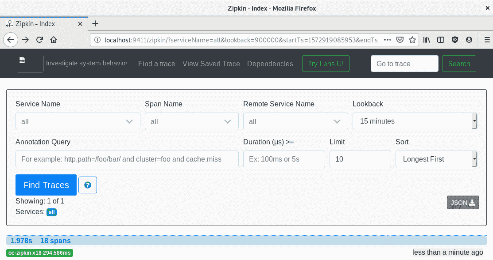

如果我们点击一个跨度，我们可以进一步调查它：

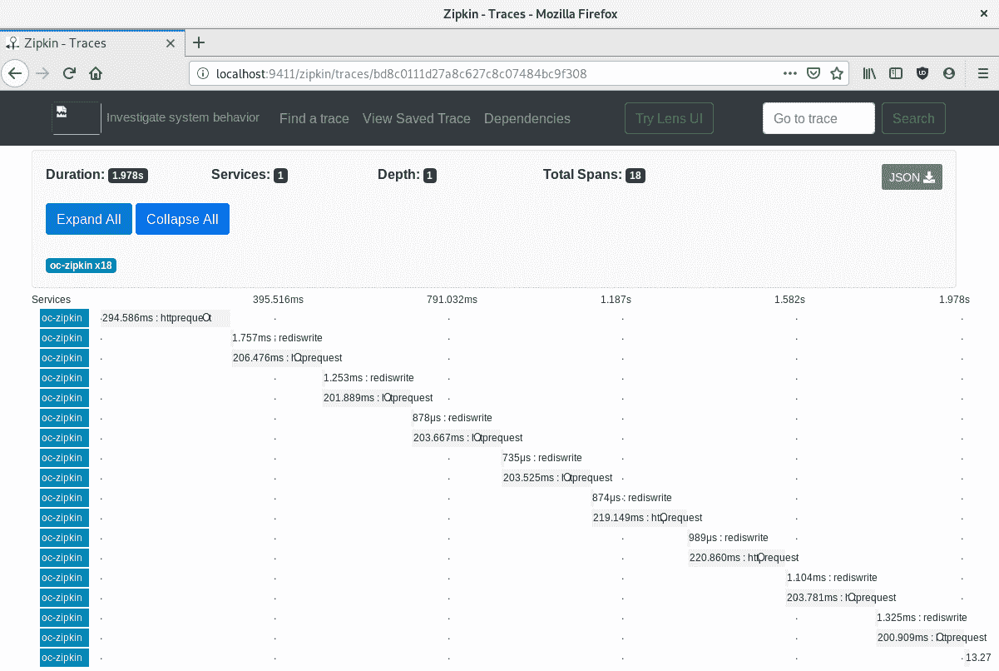

我们可以看到我们代码中的`httprequest`和`rediswrite`函数的调用。随着我们在代码周围实现更多的跨度，我们将获得越来越大的跟踪，这将帮助我们诊断代码的延迟最严重的地方。

如果我们点击跟踪中的一个单独元素，我们可以看到我们在代码中编写的注释：

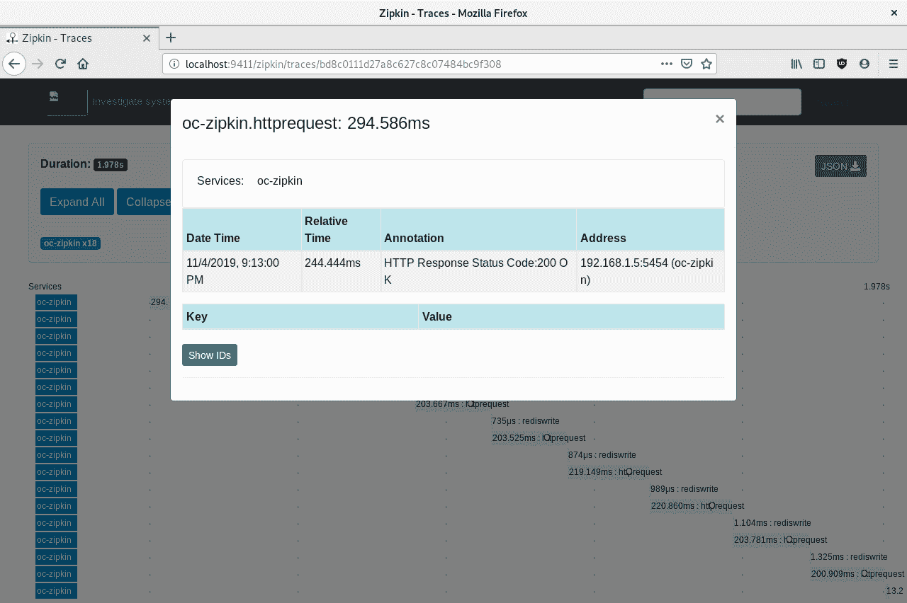

如果我们试图理解特定用户行为，注释可能会很有用。我们还可以看到`traceId`、`spanId`和`parentId`的详细信息。

# 摘要

在本章中，我们学习了有关跟踪的所有内容。我们学会了如何在特定代码片段上实现单独的跟踪并分析它们以了解它们的行为。我们还学会了如何实现和分析分布式跟踪以了解分布式系统中的问题。能够使用这些技能将帮助您调试分布式系统，并进而帮助降低**平均解决时间**（**MTTR**）。

在第十四章中，*集群和作业队列*，我们将学习如何评估集群和作业队列以进行性能优化。
