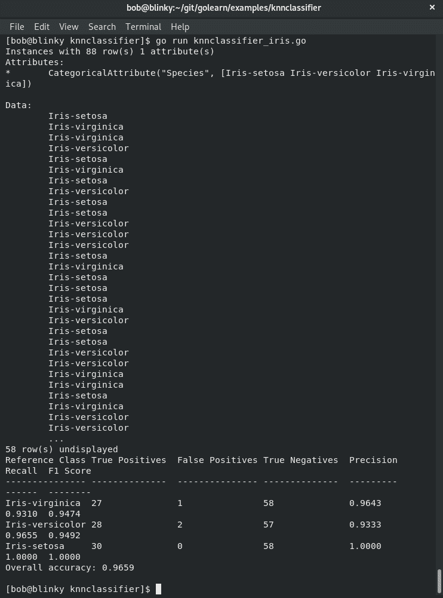
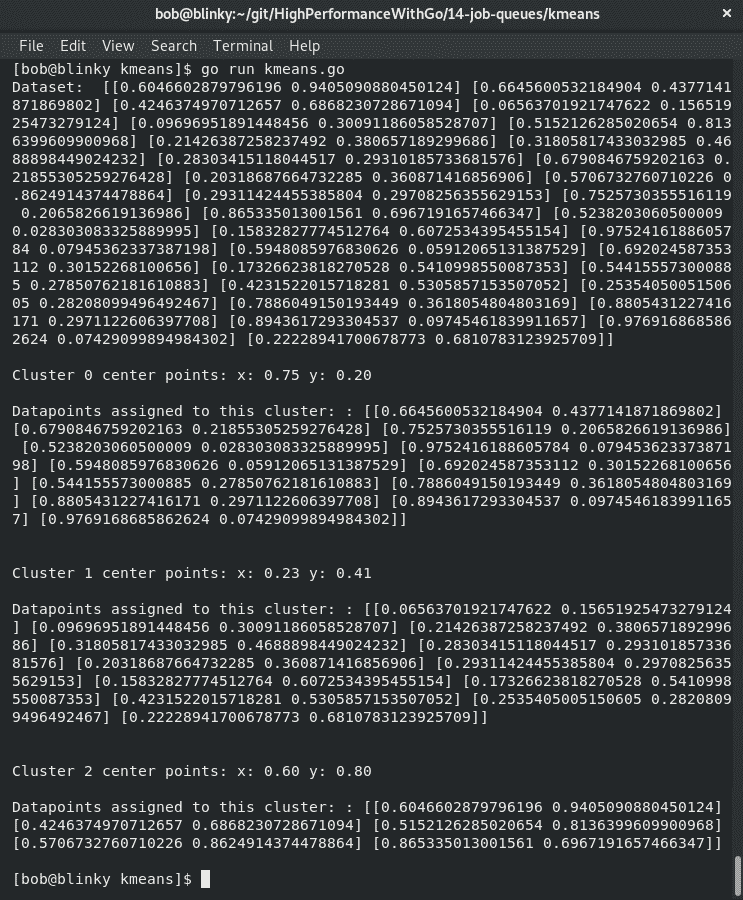
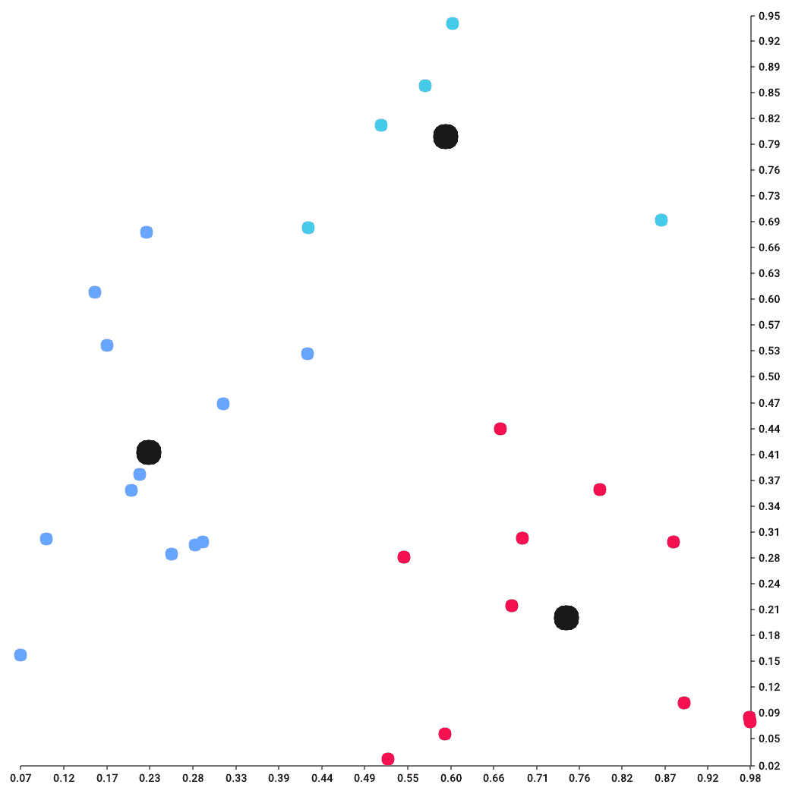
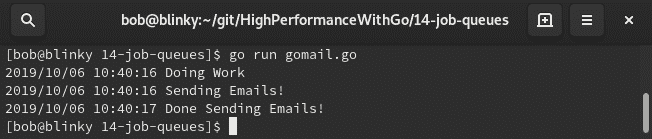
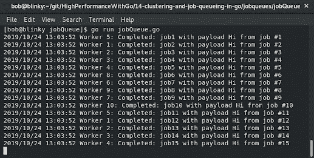
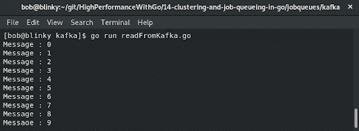
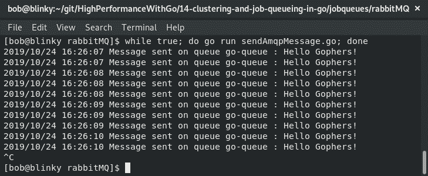
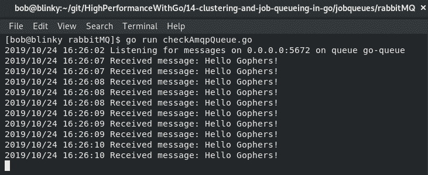
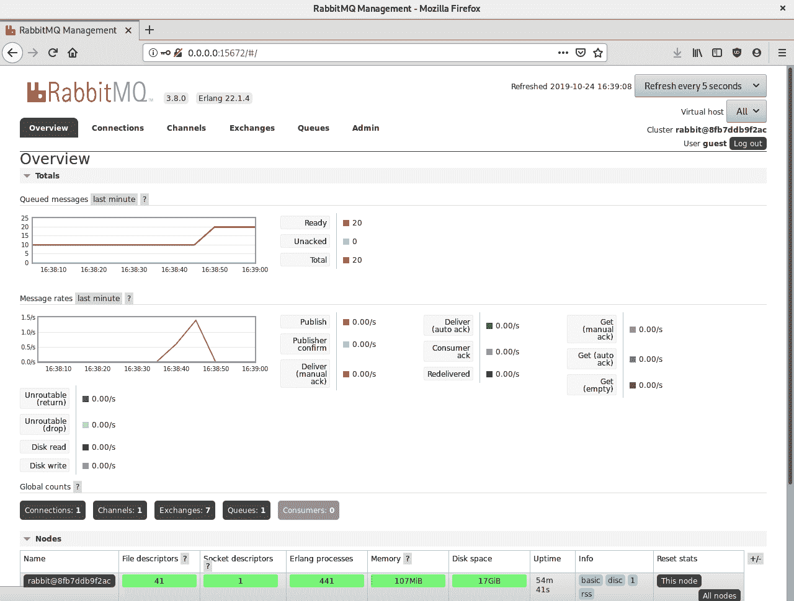

# 簇和作业队列

在 Go 中的聚类和作业队列是使分布式系统同步工作并传递一致消息的好方法。分布式计算很困难，因此在聚类和作业队列中都非常重要地观察潜在的性能优化。

在本章中，我们将学习以下主题：

+   使用分层和质心算法进行聚类

+   Goroutines 作为队列

+   作业队列中的缓冲通道

+   实现第三方排队系统（Kafka 和 RabbitMQ）

了解不同的聚类系统可以帮助您识别数据中的大型群组，以及如何在数据集中准确对其进行分类。了解排队系统将帮助您将大量信息从数据结构传输到特定的排队机制，以便实时将大量数据传递给不同的系统。

# Go 中的聚类

聚类是一种方法，您可以使用它来搜索给定数据集中一致的数据组。使用比较技术，我们可以寻找数据集中包含相似特征的项目组。然后将这些单个数据点划分为簇。聚类通常用于解决多目标问题。

聚类有两种一般分类，都有不同的子分类：

+   **硬聚类**：数据集中的数据点要么明确属于一个簇，要么明确不属于一个簇。硬聚类可以进一步分类如下：

+   **严格分区**：一个对象只能属于一个簇。

+   **带异常值的严格分区**：严格分区，还包括一个对象可以被分类为异常值的概念（意味着它们不属于任何簇）。

+   **重叠聚类**：个体对象可以与一个或多个簇相关联。

+   **软聚类**：根据明确的标准，数据点被分配与特定簇相关联的概率。它们可以进一步分类如下：

1.  +   **子空间**：簇使用二维子空间，以便进一步分类为两个维度。

+   **分层**：使用分层模型进行聚类；与子簇相关联的对象也与父簇相关联。

还有许多不同类型的算法用于聚类。以下表格中显示了一些示例：

| **名称** | **定义** |
| --- | --- |
| 分层 | 用于尝试构建簇的层次结构。通常基于自顶向下或自底向上的方法，试图将数据点分割为一对多个簇（自顶向下）或多对少个簇（自底向上）。 |
| 质心 | 用于找到作为簇中心的特定点位置。 |
| 密度 | 用于寻找数据集中具有数据点密集区域的位置。 |
| 分布 | 用于利用分布模型对簇内的数据点进行排序和分类。 |

在本书中，我们将专注于分层和质心算法，因为它们在计算机科学中（特别是在机器学习中）通常被使用。

# K 最近邻

分层聚类是一种聚类方法，其中与子簇相关联的对象也与父簇相关联。该算法从数据结构中的所有单个数据点开始，分配到单个簇。最近的簇合并。这种模式持续进行，直到所有数据点都与另一个数据点相关联。分层聚类通常使用一种称为**树状图**的图表技术来显示。分层聚类的时间复杂度为*O(n²)*，因此通常不用于大型数据集。

**K 最近邻**（**KNN**）算法是机器学习中经常使用的一种分层算法。在 Go 中查找 KNN 数据的最流行的方法之一是使用`golearn`包。作为机器学习示例经常使用的经典 KNN 示例是鸢尾花的分类，可以在[`github.com/sjwhitworth/golearn/blob/master/examples/knnclassifier/knnclassifier_iris.go`](https://github.com/sjwhitworth/golearn/blob/master/examples/knnclassifier/knnclassifier_iris.go)中看到。

给定一个具有萼片和花瓣长度和宽度的数据集，我们可以看到关于该数据集的计算数据：



我们可以在此预测模型中看到计算出的准确度。在前面的输出中，我们有以下描述：

| **描述符** | **定义** |
| --- | --- |
| 参考类 | 与输出相关联的标题。 |
| 真阳性 | 模型正确预测了正面响应。 |
| 假阳性 | 模型错误地预测了正面响应。 |
| 真阴性 | 模型正确预测了负面响应。 |
| 精确度 | 不将实际上是负面的实例标记为正面的能力。 |
| 召回率 | *真阳性/（真阳性总和+假阴性）*的比率。 |
| F1 分数 | 精确度和召回率的加权调和平均值。该值介于 0.0 和 1.0 之间，1.0 是该值的最佳可能结果。 |

最后但肯定不是最不重要的，我们有一个总体准确度，告诉我们算法如何准确地预测了我们的结果。

# K-means 聚类

K-means 聚类是机器学习中最常用的聚类算法之一。K-means 试图识别数据集中数据点的潜在模式。在 K-means 中，我们将*k*定义为我们的聚类具有的质心数（具有均匀密度的对象的中心）。然后，我们根据这些质心对不同的数据点进行分类。

我们可以使用 K-means 库，在[`github.com/muesli/kmeans`](https://github.com/muesli/kmeans)中找到，对数据集执行 K-means 聚类。让我们来看一下：

1.  首先，我们实例化`main`包并导入我们所需的包：

```go
package main

import (
  "fmt"
  "log"
  "math/rand"

  "github.com/muesli/clusters"
  "github.com/muesli/kmeans"
)
```

1.  接下来，我们使用`createDataset`函数创建一个随机的二维数据集：

```go
func createDataset(datasetSize int) clusters.Observations {
  var dataset clusters.Observations
  for i := 1; i < datasetSize; i++ {
    dataset = append(dataset, clusters.Coordinates{
      rand.Float64(),
      rand.Float64(),
    })
  }
  return dataset
}
```

1.  接下来，我们创建一个允许我们打印数据以供使用的函数：

```go
func printCluster(clusters clusters.Clusters) {
  for i, c := range clusters {
    fmt.Printf("\nCluster %d center points: x: %.2f y: %.2f\n", i, c.Center[0], c.Center[1])
    fmt.Printf("\nDatapoints assigned to this cluster: : %+v\n\n", c.Observations)
  }
}
```

在我们的`main`函数中，我们定义了我们的聚类大小，数据集大小和阈值大小。

1.  现在，我们可以创建一个新的随机 2D 数据集，并对该数据集执行 K-means 聚类。我们按如下方式绘制结果并打印我们的聚类：

```go
func main() {

  var clusterSize = 3
  var datasetSize = 30
  var thresholdSize = 0.01
  rand.Seed(time.Now().UnixNano())
  dataset := createDataset(datasetSize)
  fmt.Println("Dataset: ", dataset)

  km, err := kmeans.NewWithOptions(thresholdSize, kmeans.SimplePlotter{})
  if err != nil {
    log.Printf("Your K-Means configuration struct was not initialized properly")
  }

  clusters, err := km.Partition(dataset, clusterSize)
  if err != nil {
    log.Printf("There was an error in creating your K-Means relation")
  }

  printCluster(clusters)
}

```

执行此函数后，我们将能够看到我们的数据点分组在各自的聚类中：



在我们的结果中，我们可以看到以下内容：

+   我们的初始（随机生成的）2D 数据集

+   我们定义的三个聚类

+   分配给每个聚类的相关数据点

该程序还生成了每个聚类步骤的`.png`图像。最后创建的图像是数据点聚类的可视化：



如果要将大型数据集分组为较小的组，K-means 聚类是一个非常好的算法。它的 O 符号是*O(n)*，因此通常适用于大型数据集。K-means 聚类的实际应用可能包括以下的二维数据集：

+   使用 GPS 坐标在地图上识别犯罪多发区

+   为值班开发人员识别页面聚类

+   根据步数输出与休息天数的比较来识别运动员表现特征

在下一节中，让我们探索 Go 中的作业队列。

# 在 Go 中探索作业队列

作业队列经常用于在计算机系统中处理工作单元。它们通常用于调度同步和异步函数。在处理较大的数据集时，可能会有需要花费相当长时间来处理的数据结构和算法。系统正在处理非常大的数据段，应用于数据集的算法非常复杂，或者两者兼而有之。能够将这些作业添加到作业队列中，并以不同的顺序或不同的时间执行它们，对于维护系统的稳定性并为最终用户提供更好的体验非常有帮助。作业队列也经常用于异步作业，因为作业完成的时间对最终用户来说并不那么重要。如果实现了优先级队列，作业系统还可以对作业进行优先处理。这允许系统首先处理最重要的作业，然后处理没有明确截止日期的作业。

# Goroutines 作为作业队列

也许您的特定任务并不需要作业队列。对于任务，使用 goroutine 通常就足够了。假设我们想在某个特定任务期间异步发送电子邮件。我们可以在我们的函数中使用 goroutine 发送这封电子邮件。

在这个例子中，我将通过 Gmail 发送电子邮件。为了做到这一点，您可能需要允许不太安全的应用程序访问电子邮件验证工作（[`myaccount.google.com/lesssecureapps?pli=1`](https://myaccount.google.com/lesssecureapps?pli=1)）。这并不是长期推荐的做法；这只是一个展示真实世界电子邮件交互的简单方法。如果您有兴趣构建更健壮的电子邮件解决方案，您可以使用 Gmail API（[`developers.google.com/gmail/api/quickstart/go`](https://developers.google.com/gmail/api/quickstart/go)）。让我们开始吧：

1.  首先，我们将实例化我们的`main`包，并将必要的包导入到我们的示例程序中：

```go
package main

import (
  "log"
  "time"

  "gopkg.in/gomail.v2"
)

```

1.  然后，我们将创建我们的`main`函数，它将执行以下操作：

+   记录一个`Doing Work`行（代表在我们的函数中做其他事情）。

+   记录一个`Sending Emails`行（代表电子邮件被添加到 goroutine 的时间）。

+   生成一个 goroutine 来发送电子邮件。

+   确保 goroutine 完成后再休眠（如果需要，我们也可以在这里使用`WaitGroup`）：

```go
func main() {

    log.Printf("Doing Work")
    log.Printf("Sending Emails!")
    go sendMail()
    time.Sleep(time.Second)
    log.Printf("Done Sending Emails!")
}
```

在我们的`sendMail`函数中，我们接收一个收件人，设置我们需要发送电子邮件的正确电子邮件头，并使用`gomail`拨号器发送它。如果您希望看到此程序成功执行，您需要更改`sender`、`recipient`、`username`和`password`变量：

```go
func sendMail() {
    var sender = "USERNAME@gmail.com"
    var recipient = "RECIPIENT@gmail.com"
    var username = "USERNAME@gmail.com"
    var password = "PASSWORD"
    var host = "smtp.gmail.com"
    var port = 587 

    email := gomail.NewMessage()
    email.SetHeader("From", sender)
    email.SetHeader("To", recipient)
    email.SetHeader("Subject", "Test Email From Goroutine")
    email.SetBody("text/plain", "This email is being sent from a Goroutine!")

    dialer := gomail.NewDialer(host, port, username, password)
    err := dialer.DialAndSend(email)
    if err != nil {
        log.Println("Could not send email")
        panic(err)
    }   
}
```

从我们的输出结果中可以看出，我们能够有效地完成一些工作并发送电子邮件：



本书已经指出，执行任务的最有效方法通常是最简单的方法。如果不需要构建新的作业排队系统来执行简单的任务，就应该避免这样做。在大公司中，通常有专门的团队来维护大规模数据的作业队列系统。从性能和成本的角度来看，它们是昂贵的。它们通常是管理大规模数据系统的重要组成部分，但我觉得如果不提到在将分布式作业队列添加到技术栈之前应该仔细考虑，我会感到遗憾。

# 作业队列作为缓冲通道

Go 的缓冲通道是一个完美的工作队列示例。正如我们在第三章中学到的*理解并发*，缓冲通道是具有有界大小的通道。它们通常比无界通道更高效。它们用于从您启动的显式数量的 goroutine 中检索值。因为它们是**先进先出**（**FIFO**）的排队机制，它们可以有效地用作固定大小的排队机制，我们可以按照它们进来的顺序处理请求。我们可以使用缓冲通道编写一个简单的作业队列。让我们来看一下：

1.  我们首先实例化我们的`main`包，导入所需的库，并设置我们的常量：

```go
package main

import (
  "log"
  "net/http"
)

const queueSize = 50
const workers = 10
const port = "1234"
```

1.  然后，我们创建一个`job`结构。这个结构跟踪作业名称和有效载荷，如下面的代码块所示：

```go
type job struct {
  name string
  payload string
}
```

1.  我们的`runJob`函数只是打印一个成功的消息。如果我们愿意，这里可以添加更多的工作：

```go
func runJob(id int, individualJob job) {
  log.Printf("Worker %d: Completed: %s with payload %s", id, individualJob.name, individualJob.payload)
}

```

我们的主函数创建了一个定义的`queueSize`的`jobQueue`通道。然后，它遍历工作人员并为每个工作人员生成 goroutine。最后，它遍历作业队列并运行必要的作业：

```go
func main() {
  jobQueue := make(chan job, queueSize)
  for i := 1; i <= workers; i++ {
    go func(i int) {
      for j := range jobQueue {
        runJob(i, j)
      }
    }(i)

  }

```

我们还在这里有一个 HTTP 处理函数，用于接收来自外部来源的请求（在我们的情况下，它将是一个简单的 cURL 请求，但您可以从外部系统接收许多不同的请求）：

```go
http.HandleFunc("/", func(w http.ResponseWriter, r *http.Request) {
    submittedJob := job{r.FormValue("name"), r.FormValue("payload")}
    jobQueue <- submittedJob
  })

  http.ListenAndServe(":"+port, nil)
}
```

1.  在此之后，我们启动作业队列并执行请求以测试命令：

```go
for i in {1..15}; do curl localhost:1234/ -d id=$i -d name=job$i -d payload=”Hi from Job $i”; done
```

以下截图显示了一个结果集，显示了不同的工作人员完成了不同的工作：



请注意，个别的工作人员会根据自己的能力接手工作。这对我们继续发展需要这些工作的系统是有帮助的。

# 集成作业队列

有时我们可能不想使用内置的 Go 队列系统。也许我们已经有一个包含其他消息队列系统的流水线，或者我们知道我们将不得不维护一个非常大的数据输入。用于这项任务的两个常用系统是 Apache Kafka 和 RabbitMQ。让我们快速看一下如何使用 Go 与这两个系统集成。

# Kafka

Apache Kafka 被称为*分布式流系统*，这只是说分布式作业队列的另一种方式。Kafka 是用 Java 编写的，使用发布/订阅模型进行消息队列。它通常用于编写实时流数据管道。

我们假设您已经设置了 Kafka 实例。如果没有，您可以使用以下 bash 脚本快速获取 Kafka 实例：

```go
#!/bin/bash
rm -rf kafka_2.12-2.3.0
wget -c http://apache.cs.utah.edu/kafka/2.3.0/kafka_2.12-2.3.0.tgz
tar xvf kafka_2.12-2.3.0.tgz
./kafka_2.12-2.3.0/bin/zookeeper-server-start.sh kafka_2.12-2.3.0/config/zookeeper.properties &
./kafka_2.12-2.3.0/bin/kafka-server-start.sh kafka_2.12-2.3.0/config/server.properties
wait
```

我们可以执行以下 bash 脚本：

```go
./testKafka.sh
```

在这之后，我们可以运行`kafka`读取和写入 Go 程序来读取和写入 Kafka。让我们分别调查一下。

我们可以使用`writeToKafka.go`程序来写入 Kafka。让我们来看一下：

1.  首先，我们初始化我们的`main`包并导入所需的包：

```go
package main

import (
  "context"
  "fmt"
  "log"
  "time"

  "github.com/segmentio/kafka-go"
)
```

1.  在我们的`main`函数中，我们创建了一个连接到 Kafka，设置了写入截止日期，然后写入了我们的 Kafka 主题/分区的消息。在这种情况下，它只是从 1 到 10 的简单消息计数：

```go
func main() {
    var topic = "go-example"
    var partition = 0 
    var connectionType = "tcp"
    var connectionHost = "0.0.0.0"
    var connectionPort = ":9092"

    connection, err := kafka.DialLeader(context.Background(), connectionType,              
      connectionHost+connectionPort, topic, partition)
    if err != nil {
        log.Fatal(err)
    } 
    connection.SetWriteDeadline(time.Now().Add(10 * time.Second))

    for i := 0; i < 10; i++ {
        connection.WriteMessages(
            kafka.Message{Value: []byte(fmt.Sprintf("Message : %v", i))},
        )
    }

    connection.Close()
} 
```

1.  `readFromKafka.go`程序实例化`main`包并导入所有必要的包，如下所示：

```go
package main
import (
    "context"
    "fmt"
    “log”
    "time"
    "github.com/segmentio/kafka-go"
)

```

1.  我们的`main`函数然后设置了一个 Kafka 主题和分区，然后创建了一个连接，设置了连接截止日期，并设置了批处理大小。

有关 Kafka 主题和分区的更多信息，请访问：[`kafka.apache.org/documentation/#intro_topics`](http://kafka.apache.org/documentation/#intro_topics)。

1.  我们可以看到我们的`topic`和`partition`已经被设置为变量，并且我们的连接已经被实例化：

```go
func main() {

    var topic = "go-example"
    var partition = 0
    var connectionType = "tcp"
    var connectionHost = "0.0.0.0"
    var connectionPort = ":9092"

    connection, err := kafka.DialLeader(context.Background(), connectionType,  
      connectionHost+connectionPort, topic, partition)
    if err != nil {
        log.Fatal("Could not create a Kafka Connection")
    }

```

1.  然后，我们在连接上设置了截止日期并读取我们的批处理。最后，我们关闭我们的连接：

```go
  connection.SetReadDeadline(time.Now().Add(1 * time.Second))
  readBatch := connection.ReadBatch(500, 500000)

  byteString := make([]byte, 500)
  for {
    _, err := readBatch.Read(byteString)
    if err != nil {
        break
    }
    fmt.Println(string(byteString))
  }

  readBatch.Close()
  connection.Close()
}
```

1.  在我们执行`readFromKafka.go`和`writeFromKafka.go`文件之后，我们可以看到生成的输出：



我们的 Kafka 实例现在有了我们从`writeToKafka.go`程序发送的消息，现在可以被我们的`readFromKafka.go`程序消费。

在完成 Kafka 和 zookeeper 服务后，我们可以执行以下命令来停止它们：

```go
./kafka_2.12-2.3.0/bin/kafka-server-stop.sh
./kafka_2.12-2.3.0/bin/zookeeper-server-stop.sh
```

许多企业使用 Kafka 作为消息代理系统，因此能够理解如何在 Go 中从这些系统中读取和写入对于在企业环境中创建规模化的东西是有帮助的。

# RabbitMQ

RabbitMQ 是一个流行的开源消息代理，用 Erlang 编写。它使用一种称为**高级消息队列协议**（**AMQP**）的协议来通过其排队系统传递消息。话不多说，让我们设置一个 RabbitMQ 实例，并使用 Go 来传递消息到它和从它那里接收消息：

1.  首先，我们需要使用 Docker 启动 RabbitMQ 实例：

```go
docker run -d --name rabbitmq -p 5672:5672 -p 15672:15672 rabbitmq:3-management
```

1.  然后，我们在我们的主机上运行了一个带有管理门户的 RabbitMQ 实例。

1.  现在，我们可以使用 Go AMQP 库（[`github.com/streadway/amqp`](https://github.com/streadway/amqp)）来通过 Go 与我们的 RabbitMQ 系统传递消息。

我们将首先创建一个监听器。让我们一步一步地看这个过程：

1.  首先，我们实例化`main`包并导入必要的依赖项，以及设置显式变量：

```go
package main

import (
  "log"

  "github.com/streadway/amqp"
)

func main() {
    var username = "guest"
    var password = "guest"
    var protocol = "amqp://"
    var host = "0.0.0.0"
    var port = ":5672/"
    var queueName = "go-queue"

```

1.  然后，我们创建到`amqp`服务器的连接：

```go
  connectionString := protocol + username + ":" + password + "@" + host + port
  connection, err := amqp.Dial(connectionString)
  if err != nil {
    log.Printf("Could not connect to Local RabbitMQ instance on " + host)
  }
  defer connection.Close()

  ch, err := connection.Channel()
  if err != nil {
    log.Printf("Could not connect to channel")
  }
  defer ch.Close()
```

1.  接下来，我们声明我们正在监听的队列，并从队列中消费消息：

```go
  queue, err := ch.QueueDeclare(queueName, false, false, false, false, nil)
  if err != nil {
    log.Printf("Could not declare queue : " + queueName)
  }

  messages, err := ch.Consume(queue.Name, "", true, false, false, false, nil)
  if err != nil {
    log.Printf("Could not register a consumer")
  }

  listener := make(chan bool)

  go func() {
    for i := range messages {
      log.Printf("Received message: %s", i.Body)
    }
  }()

  log.Printf("Listening for messages on %s:%s on queue %s", host, port, queueName)
  <-listener
}
```

1.  现在，我们可以创建发送函数。同样，我们声明我们的包并导入我们的依赖项，以及设置我们的变量：

```go
package main

import (
  "log"

  "github.com/streadway/amqp"
)

func main() {
  var username = "guest"
  var password = "guest"
  var protocol = "amqp://"
  var host = "0.0.0.0"
  var port = ":5672/"
  var queueName = "go-queue"
```

1.  我们使用了与我们的监听器中使用的相同的连接方法。在生产实例中，我们可能会将其抽象化，但在这里包含它是为了方便理解：

```go
  connectionString := protocol + username + ":" + password + "@" + host + port
  connection, err := amqp.Dial(connectionString)
  if err != nil {
    log.Printf("Could not connect to Local RabbitMQ instance on " + host)
  }
  defer connection.Close()

  ch, err := connection.Channel()
  if err != nil {
    log.Printf("Could not connect to channel")
  }
  defer ch.Close()
```

1.  然后，我们声明我们想要使用的队列并将消息主体发布到该队列：

```go
  queue, err := ch.QueueDeclare(queueName, false, false, false, false, nil)
  if err != nil {
    log.Printf("Could not declare queue : " + queueName)
  }

  messageBody := "Hello Gophers!"
  err = ch.Publish("", queue.Name, false, false,
    amqp.Publishing{
      ContentType: "text/plain",
      Body: []byte(messageBody),
    })
  log.Printf("Message sent on queue %s : %s", queueName, messageBody)
  if err != nil {
    log.Printf("Message not sent successfully on queue %s", queueName, messageBody)
  }
}
```

1.  创建了这两个程序后，我们可以测试它们。我们将使用一个 while true 循环迭代我们的消息发送程序：



在完成这些操作后，我们应该能看到消息进入我们的接收器：



我们还可以通过查看位于`http://0.0.0.0:15672`的 RabbitMQ 管理门户的输出来查看此活动的输出，默认情况下使用 guest 作为用户名和密码：



该门户为我们提供了有关 RabbitMQ 作业队列的各种不同信息，从排队的消息数量，发布/订阅模型状态，到有关 RabbitMQ 系统的各个部分（连接、通道、交换和队列）的结果。了解这个排队系统的工作原理将有助于您，如果您将来需要与 RabbitMQ 队列通信的话。

# 总结

在本章中，我们学习了使用分层和质心算法进行集群化，使用 goroutines 作为队列，使用缓冲通道作为作业队列，以及实现第三方排队系统（Kafka 和 RabbitMQ）。

学习所有这些集群和作业队列技术将帮助您更好地使用算法和分布式系统，并解决计算机科学问题。在下一章中，我们将学习如何使用 Prometheus 导出器、APMs、SLIs/SLOs 和日志来衡量和比较不同版本的代码质量。
