# 跨版本比较代码质量

在编写、调试、分析和监视您的 Go 代码之后，您需要长期监视您的应用程序性能回归。如果您无法继续提供基础架构中其他系统所依赖的性能水平，那么向您的代码添加新功能是没有用的。

在本章中，我们将学习以下主题：

+   利用 Go Prometheus 导出器

+   **应用程序性能监控**（**APM**）工具

+   **服务级指标**和**服务级目标**（**SLIs**和**SLOs**）

+   利用日志记录

了解这些概念应该有助于驱使您在长期内编写高性能的代码。在处理大规模项目时，工作通常不会很好地扩展。拥有 10 倍数量的工程师通常并不意味着能够提供 10 倍的产出。能够以编程方式量化代码性能在软件团队增长并向产品添加功能时非常重要。宣传高性能代码总是会受到积极的评价，使用本章描述的一些技术将有助于您长期改进代码性能，无论您是在企业环境中工作还是在一个小型开源项目中。

# Go Prometheus 导出器 - 从您的 Go 应用程序导出数据

跟踪应用程序长期变化的最佳方法之一是使用时间序列数据来监视并警告我们重要的变化。Prometheus

([`prometheus.io/`](https://prometheus.io/))是执行此任务的一个很好的方法。Prometheus 是一个开源的时间序列监控工具，通过 HTTP 使用拉模型来驱动监控和警报。它是用 Go 编写的，并且为 Go 程序提供了一流的客户端库。以下步骤展示了 Go Prometheus HTTP 库的一个非常简单的实现：

1.  首先，我们实例化我们的包并导入我们需要的库：

```go
package main
import (
    "net/http"
    "github.com/prometheus/client_golang/prometheus/promhttp"

)
```

1.  然后，在我们的`main`函数中，我们实例化一个新的服务器，并让它提供一个返回 Prometheus 处理程序（`promhttp.Handler()`）的`NewServeMux`：

```go
func main() {
    mux := http.NewServeMux()
    mux.Handle("/metrics", promhttp.Handler())
    http.ListenAndServe(":1234", mux)
}
```

在这之后，我们可以看到我们从默认的 Prometheus 导出器返回值。这些都有很好的注释，并包括以下内容：

+   +   Go 垃圾收集信息

+   Goroutine 信息

+   Go 环境版本

+   Go 内存统计

+   Go CPU 利用率统计

+   HTTP 处理程序统计

1.  接下来，我们构建我们 Go 服务的二进制文件：

```go
GOOS=linux go build promExporter.go
```

1.  接下来，我们创建一个 docker 网络来链接我们的服务：

```go
docker network create prometheus
```

1.  然后我们创建我们的 Prometheus 导出器服务：

```go
docker build -t promexporter -f Dockerfile.promExporter .
```

1.  接下来，在我们的 Docker 主机上运行我们的 Prometheus 导出器服务：

```go
docker run -it --rm --name promExporter -d -p 1234:1234 --net prometheus promexporter
```

在下面的截图中，我们可以看到这个响应的截断输出。出于简洁起见，我们排除了注释和内置的 Go 统计信息。您可以在服务器的响应中看到键-值响应：

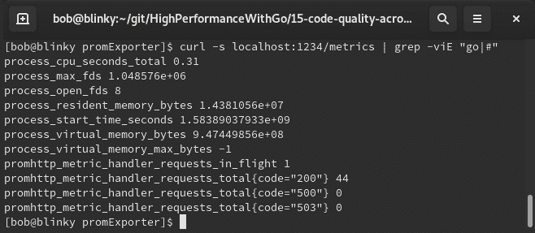

在设置了这个服务器之后，我们可以以给定的节奏监视它。我们可以在容器中运行我们的度量服务和 Prometheus，并让它们相互通信。我们可以为我们的 Prometheus 容器使用一个简单的`prometheus.yml`定义：

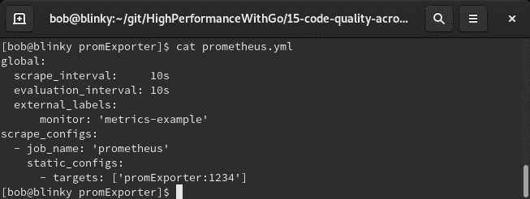

如果您想要使用除了 docker 主机之外的 IP 地址或主机名，您可以在 YAML 的`scrape_configs`->`static_configs`->`targets`部分中用 IP 地址或主机名替换`promExporter`。

1.  在我们构建了二进制文件之后，我们可以创建两个单独的 Dockerfile：一个用于包含我们的 Prometheus 导出器服务的容器，另一个用于包含我们的 Prometheus 服务的容器。我们的 Prometheus 服务的 Dockerfile 采用基线 Prometheus 镜像，并将我们的 YAML 配置添加到图像的适当位置。我们的`Dockerfile.promservice`配置如下：

```go
FROM prom/prometheus
ADD prometheus.yml /etc/prometheus/
```

1.  一旦我们创建了`Dockerfile.promservice`，我们就可以构建我们的 Prometheus 服务：

```go
docker build -t prom -f Dockerfile.promservice .
```

1.  然后我们可以在我们的 Docker 主机上运行我们的 Prometheus 服务：

```go
docker run -it --rm --name prom -d -p 9090:9090 --net prometheus prom
```

现在我们在本地环境上运行了一个 Prometheus 实例。

1.  在我们的 Prometheus 服务运行起来后，我们可以访问 `http://[IPADDRESS]:9090/`，就能看到我们的 Prometheus 实例：

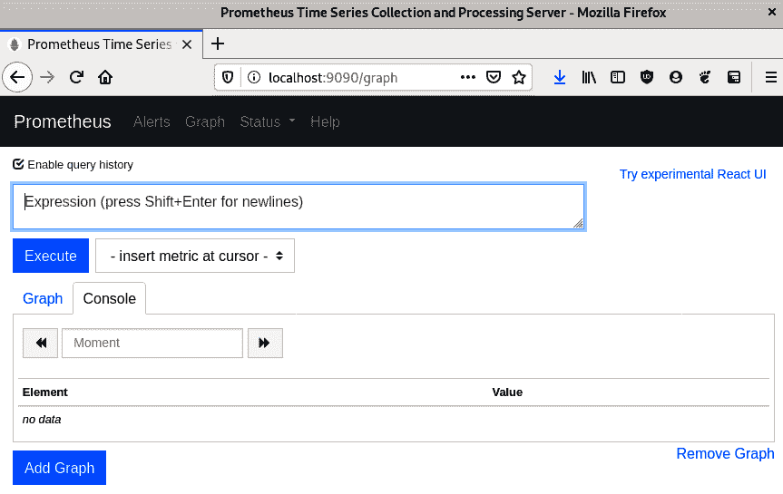

1.  我们可以通过查看相同 URL 中的`/targets`路径来验证我们正在抓取我们的目标：

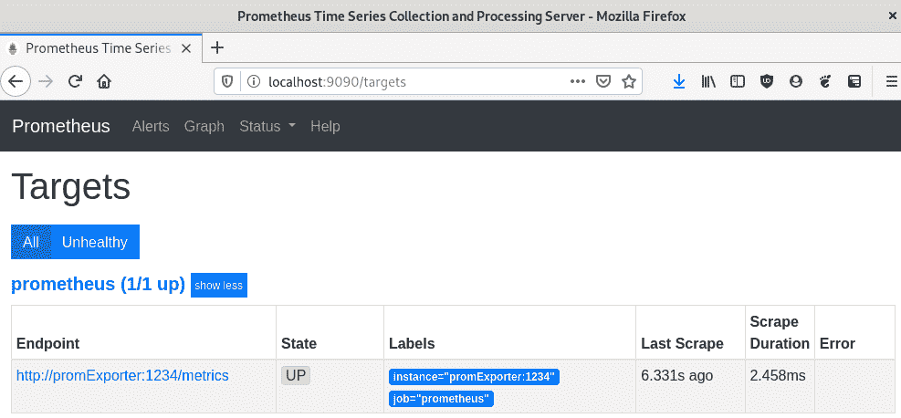

1.  接下来，我们可以向我们的主机发出一些请求：

```go
for i in {1..10}; do curl -s localhost:1234/metrics -o /dev/null; done
```

1.  接下来，我们可以在我们的 Prometheus 实例中看到我们的`curl`的结果：

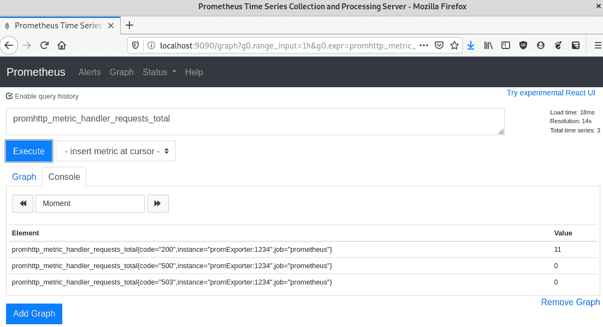

通过这些结果，我们可以看到我们提供的总 HTTP 响应次数，其中包括 200、500 和 503 状态码。我们的示例很简单，但我们可以在这里使用许多不同类型的指标来验证我们的任何假设。在本章后面的 SLI/SLO 示例中，我们将进行更多涉及指标收集的示例。

在下一节中，我们将讨论 APM 以及如何在维护高性能分布式系统中使用它。

# APM – 监控你的分布式系统性能

今天市场上有许多 APM 工具。它们经常用于随时间监视软件的性能和可靠性。在撰写本书时，Go 语言可用的一些产品如下：

+   **Elastic APM agent**: [`www.elastic.co/guide/en/apm/agent/go/current/index.html`](https://www.elastic.co/guide/en/apm/agent/go/current/index.html)

+   **New Relic APM**: [`newrelic.com/golang`](https://newrelic.com/golang)

+   **Datadog**: [`docs.datadoghq.com/tracing/setup/go/`](https://docs.datadoghq.com/tracing/setup/go/)

+   **SignalFX**: [`docs.signalfx.com/en/latest/apm/apm-instrument/apm-go.html`](https://docs.signalfx.com/en/latest/apm/apm-instrument/apm-go.html)

+   **AppDynamics** : [`www.appdynamics.com/supported-technologies/go`](https://www.appdynamics.com/supported-technologies/go)

+   **Honeycomb APM**: [`docs.honeycomb.io/getting-data-in/go/`](https://docs.honeycomb.io/getting-data-in/go/)

+   **AWS XRay**: [`docs.aws.amazon.com/xray/latest/devguide/xray-sdk-go.html`](https://docs.aws.amazon.com/xray/latest/devguide/xray-sdk-go.html)

+   **Google 的 APM 产品套件**: [`cloud.google.com/apm/`](https://cloud.google.com/apm/)

这些工具大多是闭源和付费服务。聚合分布式跟踪是一个困难的价值主张。这里列出的供应商（以及一些未提及的供应商）结合了数据存储、聚合和分析，以便为 APM 提供一站式服务。我们还可以使用我们在第十三章中创建的 OpenCensus/Zipkin 开源示例，在我们的系统中执行分布式跟踪。在我们的代码库周围实现跨度可以帮助我们监视长期的应用程序性能。

让我们来看一个 Google 的 APM 解决方案示例。在撰写本文时，Google Cloud 每月提供 250 万个跨度摄取和 2500 万个跨度扫描，这对于一个示例来说已经足够了。

# Google Cloud 环境设置

首先，我们需要创建一个 GCP 项目并检索应用凭据：

1.  首先，我们要登录 [`console.cloud.google.com/`](https://console.cloud.google.com/)。登录后，我们可以点击页面顶部的项目选择器下拉菜单：


1.  然后，我们可以在屏幕右上角创建一个新项目，如下截图所示：

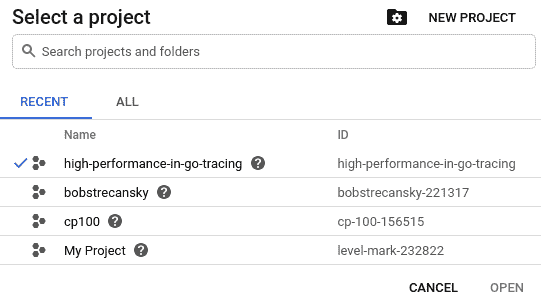

1.  然后，我们可以访问服务账号密钥页面 [`console.cloud.google.com/apis/credentials/serviceaccountkey`](https://console.cloud.google.com/apis/credentials/serviceaccountkey)，这将让我们创建一个服务账号密钥。

1.  我们可以为我们的应用程序创建一个服务帐号密钥。确保您选择 Cloud Trace 代理，因为这对我们向 Google Cloud Trace 添加跟踪是必要的。这在以下截图中有所体现：

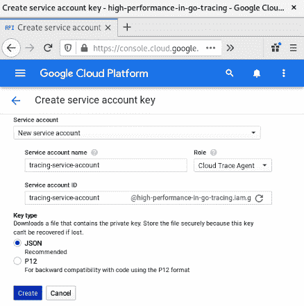

1.  点击创建后，浏览器将提示我们下载新的凭据。供参考，我们将称此密钥为`high-performance-in-go-tracing.json`。您可以根据需要命名密钥。

1.  一旦我们将此密钥保存在本地，我们可以将其转换为环境变量。在您的终端中，输入以下命令：

```go
export GOOGLE_APPLICATION_CREDENTIALS=/home/bob/service-accounts-private-key.json
```

这将把您的服务帐号凭据保存为一个特殊的环境变量，`GOOGLE_APPLICATION_CREDENTIALS`，我们将在下一个示例中使用它。

# Google Cloud Trace 代码

一旦我们的应用程序凭据全部设置好，我们就可以开始编写我们的第一个将被我们的 APM 捕获的跟踪：

1.  首先，我们实例化必要的包并设置服务器主机/端口常量：

```go
package main

import (
    "context"
    "fmt"
    "log"
    "net/http"
    "os"
    "time"

    "contrib.go.opencensus.io/exporter/stackdriver"

    "go.opencensus.io/trace"

)

const server = ":1234"
```

1.  接下来，在我们的`init()`函数中，我们设置了 StackDriver 导出器，并注册了我们的跟踪器以对每个进来的网络请求进行采样。在生产环境中，我们可能应该对更少的请求进行采样，因为采样会给我们的请求增加额外的延迟：

```go
func init() {

    exporter, err := stackdriver.NewExporter(stackdriver.Options{
       ProjectID: os.Getenv("GOOGLE_CLOUD_PROJECT"),
    })

    if err != nil {
       log.Fatal("Can't initialize GOOGLE_CLOUD_PROJECT environment    
         variable", err)

    }

    trace.RegisterExporter(exporter)
    trace.ApplyConfig(trace.Config{DefaultSampler:   
      trace.AlwaysSample()})

}
```

1.  接下来，我们将有一个休眠函数，它接受一个上下文，休眠，并向最终用户写入一条消息。在这个函数中，我将跨度的结束推迟到函数的末尾：

```go
func sleep(ctx context.Context, w http.ResponseWriter, r *http.Request) {
    _, span := trace.StartSpan(ctx, "sleep")
    defer span.End()
    time.Sleep(1 * time.Second)
    fmt.Fprintln(w, "Done Sleeping")
}
```

1.  我们的 GitHub 请求函数向[`github.com`](https://github.com)发出请求，并将状态返回给我们的最终用户。在这个函数中，我明确调用了跨度的结束：

```go
func githubRequest(ctx context.Context, w http.ResponseWriter, r *http.Request) {
    _, span := trace.StartSpan(ctx, "githubRequest")
    defer span.End()
    res, err := http.Get("https://github.com")
    if err != nil {
       log.Fatal(err)
    }

    res.Body.Close()
    fmt.Fprintln(w, "Request to https://github.com completed with a status of: ", res.Status)
    span.End()
}
```

我们的主函数设置了一个执行`githubRequest`和`sleep`函数的 HTTP 处理程序函数：

```go
func main() {

    h := http.HandlerFunc(func(w http.ResponseWriter, r *http.Request) {

       ctx, span := trace.StartSpan(context.Background(), "function/main")
       defer span.End()
       githubRequest(ctx, w, r)
       sleep(ctx, w, r)
    })

    http.Handle("/", h)
    log.Printf("serving at : %s", server)
    err := http.ListenAndServe(server, nil)

    if err != nil {
       log.Fatal("Couldn't start HTTP server: %s", err)
    }
}
```

1.  我们执行主函数后，向`localhost:1234`发出请求并看到响应：

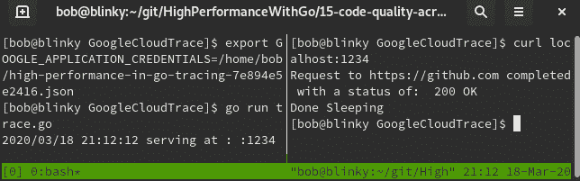

1.  之后，我们访问 Google Cloud 控制台并选择我们创建的跟踪：

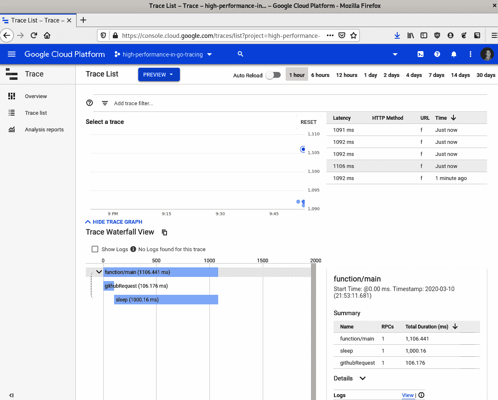

在这个跟踪示例中，我们可以看到各种相关细节：

+   已经采取的所有跟踪样本（我在这里添加了一堆不同的样本来填充字段）。

+   我们的请求流的瀑布图。对于我们的示例来说有点小，只有网络请求和休眠，但是在分布式系统中传递上下文时，这个图很快就会变得更大。

+   每个跟踪的摘要。如果您点击图表中的一个跟踪条，您可以查看有关特定跟踪的更多详细信息。

将分布式跟踪作为 APM 解决方案添加到确定花费最多时间的网络请求的位置中可能非常有帮助。找到现实生活中的瓶颈通常比深入日志更实际。Google 的 APM 还可以让您根据您所做的跟踪运行报告。在您进行了 100 多次请求之后，您可以执行分析报告并查看结果。密度分布延迟图表显示了您的请求延迟在图表中的位置。我们的示例应该有大致相似的结果，因为我们进行了长时间的休眠，并且只向外部服务发出了一个请求。我们可以在以下截图中看到密度分布图：

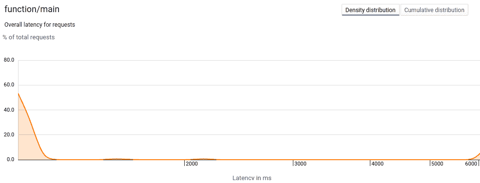

我们还可以在此门户中查看累积延迟，这将显示比*x*轴上的值短的请求的百分比：

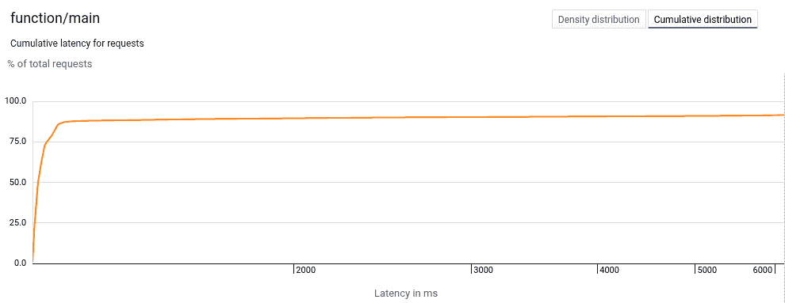

我们还可以看到与相关请求相关的延迟配置文件：

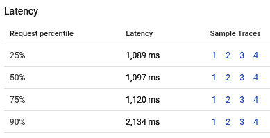

此外，我们还可以看到分布式系统中的感知瓶颈：

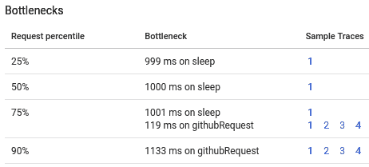

这些分析工具帮助我们推断出我们在分布式系统中可以进行改进的地方。APM 帮助许多公司向客户交付高性能的应用程序。这些工具非常有价值，因为它们从客户体验的角度来看待性能。在下一节中，我们将讨论使用 SLIs 和 SLOs 设定目标。

# SLIs 和 SLOs - 设定目标

SLIs 和 SLOs 是由 Google 引入计算机科学领域的两种范式。它们在 SRE 工作手册中有定义

（[`landing.google.com/sre/sre-book/chapters/service-level-objectives/`](https://landing.google.com/sre/sre-book/chapters/service-level-objectives/)）是衡量计算系统中可操作项目的绝佳方式。这些测量通常遵循 Google 的四个黄金信号：

+   **延迟**：请求完成所需的时间（通常以毫秒为单位衡量）

+   **流量**：您的服务接收的流量量（通常以每秒请求次数来衡量）

+   **错误**：失败请求占总请求的百分比（通常用百分比来衡量）

+   **饱和度**：硬件饱和度的测量（通常以排队请求计数来衡量）

这些测量结果可以用来创建一个或多个 SLA。这些通常提供给期望从您的应用程序中获得特定服务水平的客户。

我们可以使用 Prometheus 来测量这些指标。Prometheus 有很多不同的计数方法，包括饱和度计、计数器和直方图。我们将使用所有这些不同的工具来测量我们系统中的这些指标。

为了测试我们的系统，我们将使用`hey`负载生成器。这是一个类似于我们在之前章节中使用的`ab`的工具，但是对于这种特定情况，它会更好地显示我们的分布。我们可以通过运行以下命令来获取它：

```go
go get -u github.com/rakyll/hey
```

我们需要搭建我们的 Prometheus 服务，以便读取其中一些值。如果您的服务还没有从我们之前的示例中搭建起来，我们可以执行以下命令：

```go
docker build -t slislo -f Dockerfile.promservice .
docker run -it --rm --name slislo -d -p 9090:9090 --net host slislo
```

这将使我们的 Prometheus 实例搭建起来并测量请求：

1.  我们的代码首先实例化`main`包并导入必要的 Prometheus 包：

```go
package main

import (
    "math/rand"
    "net/http"
    "time"

    "github.com/prometheus/client_golang/prometheus"
    "github.com/prometheus/client_golang/prometheus/promhttp"

)
```

1.  然后我们在我们的`main`函数中收集饱和度、请求和延迟数字。我们使用饱和度计、请求计数器和延迟直方图：

```go
    saturation := prometheus.NewGauge(prometheus.GaugeOpts{
       Name: "saturation",
       Help: "A gauge of the saturation golden signal",
    })

    requests := prometheus.NewCounterVec(
       prometheus.CounterOpts{
           Name: "requests",
           Help: "A counter for the requests golden signal",
       },
       []string{"code", "method"},
    )

    latency := prometheus.NewHistogramVec(
       prometheus.HistogramOpts{
           Name: "latency",
           Help: "A histogram of latencies for the latency golden 
            signal",
           Buckets: []float64{.025, .05, 0.1, 0.25, 0.5, 0.75},
       },
       []string{"handler", "method"},
    )
```

1.  然后我们创建我们的`goldenSignalHandler`，它会随机生成一个 0 到 1 秒的延迟。为了更好地显示我们的信号，如果随机数能被 4 整除，我们返回 404 错误状态，如果能被 5 整除，我们返回 500 错误。然后我们返回一个响应并记录请求已完成。

我们的`goldenSignalChain`将这些指标联系在一起：

```go
goldenSignalChain := promhttp.InstrumentHandlerInFlight
 (saturation,promhttp.InstrumentHandlerDuration
 (latency.MustCurryWith(prometheus.Labels{"handler": "signals"}),

           promhttp.InstrumentHandlerCounter(requests, goldenSignalHandler),
       ),
    )
```

1.  然后我们在 Prometheus 中注册所有的测量（饱和度、请求和延迟），处理我们的 HTTP 请求，并启动我们的 HTTP 服务器：

```go
    prometheus.MustRegister(saturation, requests, latency)
    http.Handle("/metrics", promhttp.Handler())
    http.Handle("/signals", goldenSignalChain)
    http.ListenAndServe(":1234", nil)
}
```

1.  在执行`go run SLISLO.go`启动 HTTP 服务器后，我们可以向我们的 HTTP 服务器发出`hey`请求。`hey`调用的输出在以下截图中可见。请记住，这些都是随机值，如果您执行相同的测试，结果将不同：

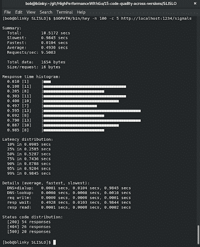

然后我们可以查看我们的个体黄金信号。

# 测量流量

要测量我们的流量，我们可以使用 Prometheus 查询`sum(rate(requests[1m]))`。

我们可以在任何给定的时间间隔内测量速率。以几种不同的方式配置这个速率，看看哪种对您系统的要求最有利。

# 测量延迟

要测量延迟，我们可以查看`latency_bucket` Prometheus 查询。我们的请求被分成了一个包含不同延迟数字的直方图，这个查询反映了这一点。

# 测量错误

要衡量系统中的错误数量，我们需要找到具有成功响应代码的请求与没有成功响应代码的请求的比率。我们可以使用以下查询找到这个比率`sum(requests {code!="200"}) / (sum(requests {code="200"})) + sum(requests {code!="200"})`。

这个比率是重要的监控指标。计算机系统会出现故障，人们会发出不正确的请求，但您的 200 响应与非 200 响应的比率应该相对较小。

# 衡量饱和度

我们可以使用`饱和度`的**Prometheus**查询来衡量饱和度。我们想要验证我们的系统是否饱和，这个查询可以帮助我们执行这个操作。

# Grafana

我们可以将所有这些黄金信号封装到 Grafana 仪表板中。我们可以通过调用在本地运行 Grafana 来运行 Grafana：

```go
docker run  -it --rm --name grafana -d -p 3000:3000 --net prometheus grafana/grafana
```

我们需要通过访问`http://localhost:3000`并使用默认的用户名和密码组合来登录 Grafana 门户网站：

**用户名**：admin

**密码**：admin

登录后，我们可以设置新的密码。

登录后，我们点击页面顶部的添加数据源，并在下一页选择 Prometheus。然后输入我们的本地 IP 地址并点击保存并测试。如果一切正常，我们应该在屏幕底部看到数据源正在工作的弹出窗口：

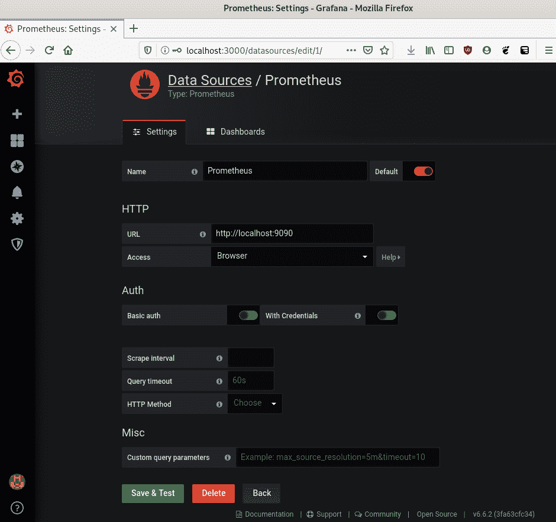

完成后，我们访问[`localhost:3000/dashboard/import`](http://localhost:3000/dashboard/import)。

然后我们在右上角选择上传.json 文件，并上传为此仪表板创建的 JSON 文件，位于[`github.com/bobstrecansky/HighPerformanceWithGo/blob/master/15-code-quality-across-versions/SLISLO/four_golden_signals_grafana_dashboard.json`](https://github.com/bobstrecansky/HighPerformanceWithGo/blob/master/15-code-quality-across-versions/SLISLO/four_golden_signals_grafana_dashboard.json)。

上传了这个 JSON 文件后，我们导入这个数据源，就能够看到我们的请求速率、持续延迟桶、错误率和饱和度图表，如下面的截图所示：

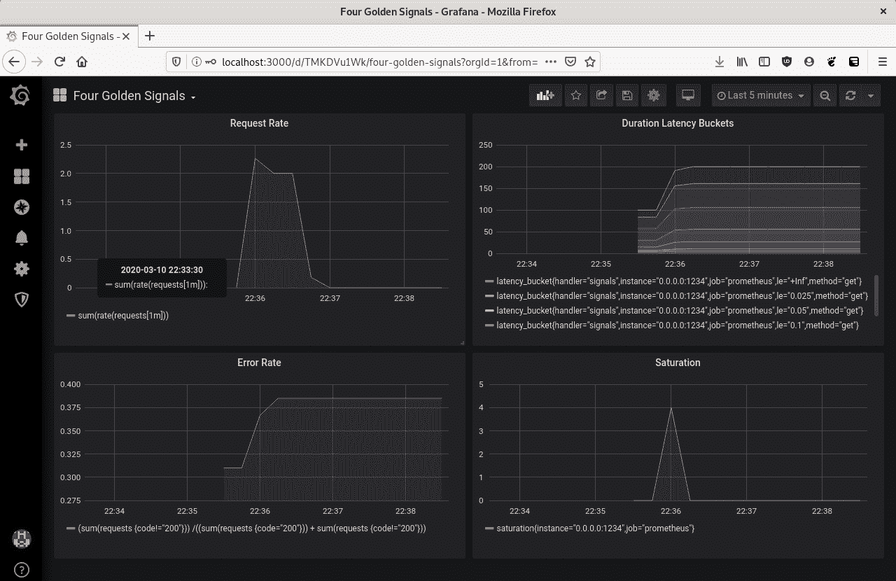

了解这些统计数据可以帮助维护稳定的系统。在捕获了这些统计数据之后，您可以使用 Prometheus Alertmanager 来设置您感兴趣的监控阈值的警报。

有关配置 Alertmanager 的更多信息，请访问

[`prometheus.io/docs/alerting/alertmanager/`](https://prometheus.io/docs/alerting/alertmanager/)

在下一节中，我们将学习如何跟踪我们的数据，也称为日志记录。

# 日志记录-跟踪您的数据

记录系统中发生的事件的日志记录是创建高性能软件系统的重要组成部分。能够记录和验证编程系统中的事件是确保您在应用程序的各个版本中保持代码质量的一个很好的方法。日志通常可以快速显示软件中的错误，并且能够快速消化这些信息通常可以帮助降低您的**平均恢复时间**（**MTTR**）。

Go 有许多不同的日志包。以下是一些最受欢迎的包：

+   Go 维护者提供的标准内置日志包

+   **Glog 包**：[`github.com/golang/glog`](https://github.com/golang/glog)

+   **Uber 的 Zap 包**：[`github.com/uber-go/zap`](https://github.com/uber-go/zap)

+   **零分配 JSON 记录器**：[`github.com/rs/zerolog`](https://github.com/rs/zerolog)

+   **Logrus 包**：[`github.com/sirupsen/logrus`](https://github.com/sirupsen/logrus)

我们将以 Zap 包作为示例，因为基准测试表明。通常使用标准库记录器就足够了（如果你注意到了，这是我迄今为止在书中用于记录的包）。拥有诸如 Zap 这样的结构化日志包可以弥补愉快的体验，因为它提供了一些标准库记录器无法直接提供的功能，例如以下内容：

+   日志级别

+   结构化日志（特别是 JSON）

+   类型化日志

在日志记录器之间进行比较基准测试时，它的性能表现最佳。Zap 有两种不同类型的日志记录可用，即 sugared 记录器和结构化记录器。结构化记录器性能略高，而 sugared 记录器类型较松散。由于这是一本关于性能的书，我们将看一下结构化记录器，因为它的性能更高，但这两种记录选项都非常适合生产使用。

拥有具有不同日志级别的记录器很重要，因为它可以帮助您确定哪些日志需要紧急关注，哪些日志只是返回信息。这还可以根据日志的紧急程度为您的团队设置优先级，当您达到日志拐点时，可以确定修复的紧急程度。

具有可结构化的日志对于将其摄入到其他系统中非常有帮助。JSON 日志记录迅速变得越来越受欢迎，因为诸如以下的日志聚合工具接受 JSON 日志记录：

+   ELK Stack（ElasticSearch，Logstash 和 Kibana）

+   Loggly

+   Splunk

+   Sumologic

+   Datadog

+   Google Stackdriver 日志记录

正如我们在 APM 解决方案中看到的，我们可以利用这些日志记录服务在集中位置聚合大量日志，无论是在本地还是在云中。

拥有类型化日志可以让您以对程序或业务有意义的方式组织日志数据。保持日志记录的一致性可以让系统操作员和站点可靠性工程师更快地诊断问题，从而缩短生产事故的 MTTR。

让我们看一个使用 Zap 的日志示例：

1.  首先，我们实例化我们的包并导入`time`包和 Zap 记录器：

```go
package main

import (
    "time"
    "go.uber.org/zap"

)
```

1.  然后，我们设置一个生产配置，将日志返回到`stdout`（遵循十二要素应用程序流程）。这些通常可以发送到诸如 Fluentd（[`www.fluentd.org/`](https://www.fluentd.org/)）之类的日志路由器，我们可以测试 Zap 中提供的所有不同日志级别：

```go
func main() {

    c := zap.NewProductionConfig()
    c.OutputPaths = []string{"stdout"}
    logger, _ := c.Build()

    logger.Debug("We can use this logging level to debug. This won't be printed, as the NewProduction logger only prints info and above log levels.")

    logger.Info("This is an INFO message for your code. We can log individual structured things here", zap.String("url", "https://reddit.com"), zap.Int("connectionAttempts", 3), zap.Time("requestTime", time.Now()))

    logger.Warn("This is a WARNING message for your code. It will not exit your program.")

    logger.Error("This is an ERROR message for your code. It will not exit your program, but it will print your error message -> ")

    logger.Fatal("This is a Fatal message for your code. It will exit your program with an os.Exit(1).")

    logger.Panic("This is a panic message for your code. It will exit your program. We won't see this execute because we have already exited from the above logger.Fatal log message. This also exits with an os.Exit(1)")

}
```

运行记录器后，我们可以看到一些非常干净的 JSON 输出。我们还可以使用诸如 jq（[`stedolan.github.io/jq/`](https://stedolan.github.io/jq/)）之类的实用程序，以便在本地环境中轻松消耗这些输出：

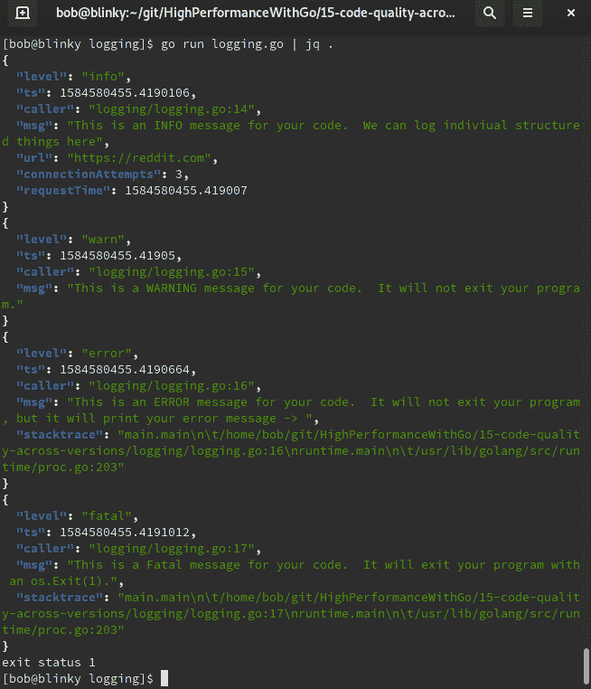

正如我们提到的，在您的 Go 应用程序中拥有结构化、分级的记录器将帮助您更快速、更有效地进行故障排除。

# 摘要

在本章中，我们讨论了比较代码质量的不同方法：

+   利用 Go Prometheus 导出器

+   APM 工具

+   SLIs 和 SLOs

+   利用日志记录

利用所有这些技术可以帮助您确定应用程序的性能不如预期的地方。了解这些情况可以帮助您快速迭代并产生最好的软件。

在本书的过程中，您已经了解了应用程序性能及其与 Go 的关系。我希望这本书能帮助您在编写应用程序时考虑 Web 性能。始终将性能放在首要位置。每个人都喜欢高性能的应用程序，希望这本书能帮助您作为开发人员尽自己的一份力。
