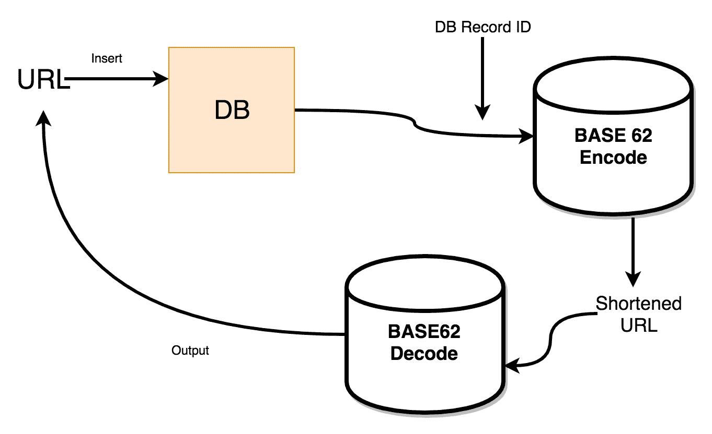

# 第二章：处理 REST 服务的路由

在本章中，我们将讨论 REST 应用程序的路由。要创建 API，第一步是定义路由。要定义路由，我们必须了解 Go 中可用的系统包。我们将从探索 Go 中的基本内部路由机制开始本章。然后，我们将看到如何创建一个自定义的多路复用器，该实体将给定的 URL 与已注册的模式匹配。多路复用器基本上允许开发者创建一个路由来监听客户端请求，并附加包含应用程序业务逻辑的处理程序。`ServeMux`包是 Go 提供的基礎多路复用器。然后，我们将探索一些其他框架，因为`ServeMux`的功能非常有限。

本章还包括类似`httprouter`和`gorilla/mux`的第三方库。然后，我们将讨论诸如 SQL 注入等主题。本章的核心是教您如何使用`gorilla/mux`在 Go 中创建优雅的 HTTP 路由器。我们还将简要讨论设计 URL 缩短服务。

我们将涵盖以下主题：

+   理解 Go 的`net/http`包

+   `ServeMux`——Go 中的基本路由器

+   理解`httprouter`——一个轻量级的 HTTP 路由器

+   介绍`gorilla/mux`——一个强大的 HTTP 路由器

+   读者挑战：一个 URL 缩短 API

# 技术要求

以下是在运行代码示例之前应预安装的软件：

+   操作系统：Linux (Ubuntu 18.04)/Windows 10/Mac OS X >=10.13

+   Go 最新版本编译器 >= 1.13.5

您可以从[`github.com/PacktPublishing/Hands-On-Restful-Web-services-with-Go/tree/master/chapter2`](https://github.com/PacktPublishing/Hands-On-Restful-Web-services-with-Go/tree/master/chapter2)下载本章的代码。克隆代码并使用`chapter2`目录中的代码示例。

# 理解 Go 的`net/http`包

接受 HTTP 请求是 Web 服务器的主要目标。在 Go 中，有一个`系统级`的包帮助开发者创建 HTTP 服务器和客户端。该包的名称是`net/http`。我们可以通过创建一个小示例来理解`net/http`包的功能。该示例接受传入的请求并返回服务器的时间戳。让我们看看创建此类服务器的步骤：

1.  按照以下方式创建程序文件：

```go
touch -p $GOPATH/src/github.com/git-user/chapter2/healthCheck/main.go
```

现在，我们有一个文件，我们可以开发一个带有健康检查 API 的服务器，该 API 返回日期/时间字符串。

1.  导入`net/http`包并创建一个名为`HealthCheck`的函数处理程序。`http.HandleFunc`是一个方法，它接受一个路由和一个函数处理程序作为其参数。这个函数处理程序必须返回一个`http.ResponseWriter`对象：

```go
package main

import (
 "io"
  "log"
  "net/http"
  "time"
)

// HealthCheck API returns date time to client
func HealthCheck(w http.ResponseWriter, req *http.Request) {
  currentTime := time.Now()
  io.WriteString(w, currentTime.String())
}

func main() {
  http.HandleFunc("/health", HealthCheck)
  log.Fatal(http.ListenAndServe(":8000", nil))
}
```

上一段代码创建了一个`HealthCheck`函数并将其附加到一个 HTTP 路由上。`HandleFunc`用于将路由模式附加到处理函数。`ListenAndServe`启动一个新的 HTTP 服务器。如果服务器启动失败，它将返回一个错误。它将`address:port`作为第一个参数，第二个参数是`nil`，表示使用默认的多路复用器。我们将在接下来的章节中详细了解多路复用器。

使用`log`函数来调试潜在的错误。如果存在错误，`ListenAndServe`函数将返回一个错误。

1.  现在，我们可以使用以下命令启动 Web 服务器：

```go
go run $GOPATH/src/github.com/git-user/chapter2/healthCheck/main.go 
```

从 shell 中运行`healthCheck.go`文件。

1.  现在，打开一个 shell 或浏览器来查看服务器运行的情况。在这里，我们使用`curl`请求：

```go
curl -X GET http://localhost:8000/health
```

响应如下：

```go
2019-04-10 17:54:05.450783 +0200 CEST m=+6.612810181
```

Go 在处理请求和响应方面有一个不同的概念。我们使用了`io`库来写入响应。对于 Web 开发，我们可以使用模板来自动填充细节。Go 的内部 URL 处理程序使用 ServeMux 多路复用器。在下一节中，我们将进一步讨论 ServeMux，Go 内置的 URL 路由器。

# ServeMux – Go 中的基本路由器

ServeMux 是一个 HTTP 请求多路复用器。在前一节中我们使用的`HandleFunc`实际上是 ServeMux 的一个方法。通过使用 ServeMux，我们可以处理多个路由。我们也可以创建自己的多路复用器。多路复用器通过一个名为`ServeHTTP`的函数来处理分离路由的逻辑。因此，如果我们创建一个具有`ServeHTTP`方法的 Go 结构体，它就可以像内置的多路复用器一样完成工作。

将路由视为 Go 字典（map）中的键，将多路复用器视为其值。Go 从路由中查找多路复用器并尝试执行`ServeHTTP`函数。在下一节中，我们将通过创建一个生成 UUID 字符串的 API 来查看 ServeMux 的使用。

# 使用 ServeMux 开发 UUID 生成 API

UUID 是一个资源或事务的唯一标识符。UUID 被广泛用于标识 HTTP 请求。让我们开发一个生成 UUID 的 API。请按照以下步骤操作：

1.  按照以下方式创建程序文件：

```go
touch -p $GOPATH/src/github.com/git-user/chapter2/uuidGenerator/main.go
```

1.  任何具有几个专用 HTTP 方法的 Go 结构体都符合成为 ServeMux 的资格。例如，我们可以创建一个自定义的`UUID`结构体并实现`**ServeHTTP**`函数，使其成为一个 ServeMux 对象。以下是`uuidGenerator.go`模块的实现：

```go
import (
  "crypto/rand"
  "fmt"
)

// UUID is a custom multiplexer
type UUID struct {
}

func (p *UUID) ServeHTTP(w http.ResponseWriter, r *http.Request) {
  if r.URL.Path == "/" {
    giveRandomUUID(w, r)
    return
  }
  http.NotFound(w, r)
  return
}

func giveRandomUUID(w http.ResponseWriter, r *http.Request) {
 c := 10
  b := make([]byte, c)
  _, err := rand.Read(b)
  if err != nil {
    panic(err)
  }
  fmt.Fprintf(w, fmt.Sprintf("%x", b))
}
```

它由作为 ServeMux 对象的`UUID`结构体组成。我们可以在处理函数中访问 URL 路径，并使用这些信息手动将请求路由到不同的响应生成器。

`giveRandomUUID`是一个响应生成函数，它将一个随机的 UUID 字符串设置到响应中。Go 的`crypto`包有一个`Read`函数，可以将随机字符填充到一个字节数组中。

1.  现在向模块中添加一个主函数，使用 ServeMux 对象。我们应该将我们的 ServeMux 传递给`http.ListenAndServe`函数以提供我们的内容。我们在端口`8000`上提供服务：

```go
package main

import (
  "net/http"
)

func main() {
  mux := &UUID{}
  http.ListenAndServe(":8000", mux)
}
```

在 `ListenAndServe` 函数中，我们使用 UUID 作为多路复用器，该函数启动一个 HTTP 服务器。服务器执行在 `mux` 对象之前定义的 `ServeHTTP` 方法。

1.  从您的 shell/Terminal 运行以下命令：

```go
go run $GOPATH/src/github.com/git-user/chapter2/uuidGenerator/main.go
```

1.  我们可以像这样发送 `curl` 请求来向监听端口 `8000` 的 Web 服务器发送请求：

```go
curl -X GET http://localhost:8000/
```

返回的响应将是一个随机字符串：

```go
544f5519592ac25bb2c0
```

使用 *Ctrl* + *C* 或 *Cmd* + *C* 来停止您的 Go 服务器。如果您将其作为后台进程运行，请使用 `sudo kill `sudo lsof -t -i:8000` ` 来终止在端口 `8000` 上运行的进程。

到目前为止，我们一直使用单个处理器。让我们看看如何使用 ServeMux 将多个处理器添加到不同的函数处理器路由中。

# 使用 ServeMux 添加多个处理器

假设我们有一个 API 需求，它生成不同类型的随机数，如 int、float 等。当我们有多个具有不同功能的端点时，我们开发的自定义 **多路复用器**（**mux**）可能会变得繁琐。为了添加该逻辑，我们需要添加多个 `if/else` 条件来手动检查 URL 路由。为了克服这种复杂的代码结构，我们可以实例化一个新的内置 `ServeMux` 对象并定义许多处理器。让我们看看带有 `ServeMux` 的代码：

```go
newMux := http.NewServeMux()

newMux.HandleFunc("/randomFloat", func(w http.ResponseWriter,
r *http.Request) {
 fmt.Fprintln(w, rand.Float64())
})

newMux.HandleFunc("/randomInt", func(w http.ResponseWriter, 
r *http.Request) {
 fmt.Fprintln(w, rand.Int(100))
})
```

此代码片段展示了如何创建 `ServeMux` 并将其附加到多个处理器。

`randomFloat` 和 `randomInt` 是我们创建的两个路由，分别用于返回随机的 `float` 和随机的 `int`。现在，我们将这些传递给 `ListenAndServe` 函数。`Int(100)` 返回一个 0-100 范围内的随机整数。

更多关于随机函数的详细信息，请访问 Go 随机包页面：[`golang.org`](http://golang.org)。

让我们看看一个完整的示例：

1.  创建一个文件来存放我们的程序，并将其命名为 `multipleHandlers.go`，路径如下：

```go
touch -p $GOPATH/src/github.com/git-user/chapter2/multipleHandlers/main.go 
```

1.  现在创建一个主函数，并添加创建 `ServeMux` 对象和函数处理器的代码。

1.  最后，使用 `http.ListenAndServe` 方法运行服务器：

```go
package main

import (
    "fmt"
    "math/rand"
    "net/http"
)

func main() {
    newMux := http.NewServeMux()
    newMux.HandleFunc("/randomFloat", func(w http.ResponseWriter,
    r *http.Request) {
        fmt.Fprintln(w, rand.Float64())
    })
    newMux.HandleFunc("/randomInt", func(w http.ResponseWriter,
    r *http.Request) {
        fmt.Fprintln(w, rand.Intn(100))
    })
    http.ListenAndServe(":8000", newMux)
}
```

1.  我们可以直接使用 `run` 命令来运行程序：

```go
go run $GOPATH/src/github.com/git-user/chapter2/multipleHandlers/main.go
```

1.  现在，让我们执行两个 `curl` 命令并查看输出：

```go
curl -X GET http://localhost:8000/randomFloat
curl -X GET http://localhost:8000/randomInt
```

响应将包括：

```go
0.6046602879796196
87
```

我们看到了如何使用基本的 Go 构造创建 URL 路由器。让我们看看一些在 Go 社区中广泛使用的、用于 API 服务器的流行 URL 路由框架。

# 理解 httprouter – 一个轻量级 HTTP 路由器

`httprouter`，正如其名所示，将 HTTP 请求路由到特定的处理器。`httprouter` 是 Go 中创建具有优雅 API 的简单路由器的知名包。来自 Python/Django 社区的开发者非常熟悉 Django 框架中的完整 URL 分派器。`httprouter` 提供了类似的功能：

+   允许在路由路径中使用变量

+   匹配 REST 方法（`GET`、`POST`、`PUT` 等）

+   不妥协性能

在下一节中，我们将更详细地讨论这些特性。在此之前，有一些值得注意的点使得 `httprouter` 成为一个更好的 URL 路由器：

+   `httprouter` 与内置的 `http.Handler` 兼容得很好

+   `httprouter` 明确表示一个请求只能匹配到一个路由或没有路由

+   路由器的设计鼓励构建合理、分层的 RESTful API

+   你可以构建简单高效的静态文件服务器

在下一节中，我们将看到 `httprouter` 的安装及其基本用法。

# 安装 httprouter

`httprouter` 是一个开源的 Go 包，可以使用 `go get` 命令安装。让我们看看以下步骤中的安装和基本用法：

1.  使用以下命令安装 `httprouter`：

```go
go get github.com/julienschmidt/httprouter
```

我们可以在源代码中导入这个库，如下所示：

```go
import "github.com/julienschmidt/httprouter"
```

1.  通过示例可以理解 `httprouter` 的基本用法。

    让我们用 Go 编写一个 REST 服务，提供以下两个功能：

+   获取 Go 编译器版本

+   获取指定文件的正文

我们需要使用一个名为 `os/exec` 的系统包来获取前面的详细信息。

1.  `os/exec` 包有一个 `Command` 函数，我们可以用它来执行任何系统调用，其函数签名如下：

```go
// arguments... means an array of strings unpacked as arguments
// in Go
cmd := exec.Command(command, arguments...)
```

1.  **`exec.Command`** 函数接收命令和一个额外的参数数组。额外的参数是命令的选项或输入。然后可以通过调用 `Output` 函数来执行它，如下所示：

```go
out, err := cmd.Output()
```

1.  这个程序使用 `httprouter` 创建服务。让我们在以下路径创建它：

```go
touch -p $GOPATH/src/github.com/git-user/chapter2/httprouterExample/main.go
```

程序的主函数创建了两个路由和两个函数处理器。函数处理器的职责是：

+   获取当前 Go 编译器版本

+   获取文件的正文

程序正在尝试使用 `httprouter` 实现 REST 服务**。** 我们在这里定义了两个路由：

+   `/api/v1/go-version`

+   `/api/v1/show-file/:name`

```go
package main

import (
  "fmt"
  "io"
  "log"
  "net/http"
  "os/exec"

  "github.com/julienschmidt/httprouter"
)

func main() {
  router := httprouter.New()
  router.GET("/api/v1/go-version", goVersion)
  router.GET("/api/v1/show-file/:name", getFileContent)
  log.Fatal(http.ListenAndServe(":8000", router))
}
```

`:name` 是一个路径参数。基本的 Go 路由器无法定义这些特殊参数。通过使用 `httprouter`，我们可以匹配 REST 方法。在主块中，我们正在匹配 `GET` 请求到相应的路由。

现在我们将转向三个处理器函数的实现：

```go
func getCommandOutput(command string, arguments ...string) string {
  out, _ := exec.Command(command, arguments...).Output()
  return string(out)
}

func goVersion(w http.ResponseWriter, r *http.Request, params httprouter.Params) {
  response := getCommandOutput("/usr/local/go/bin/go", "version")
  io.WriteString(w, response)
  return
}

func getFileContent(w http.ResponseWriter, r *http.Request, params httprouter.Params) {
  fmt.Fprintf(w, getCommandOutput("/bin/cat", params.ByName("name")))
}
```

`exec.Command` 接收 `bash` 命令及其相应选项作为其参数，并返回一个对象。该对象有一个 `Output` 方法，它返回命令执行的结果输出。我们在 `goVersion` 和 `getFileContent` 处理器中都使用了这个 `getCommandOutput` 函数。我们在处理器中使用如 `go --version` 和 `cat file_name` 这样的 shell 命令格式。

如果观察代码，我们使用了 `/usr/local/go/bin/go` 作为 Go 可执行文件的位置，因为它是 Mac OS X 中的 Go 编译器位置。在执行 `exec.Command` 时，你应该给出可执行文件的绝对路径。因此，如果你在 Ubuntu 机器或 Windows 上工作，请使用你安装的 Go 可执行文件的路径。在 Linux 机器上，你可以通过使用 `$ which go` 命令轻松找到它。

现在，在同一个目录中创建两个新文件。这些文件将由我们的文件服务器程序提供服务。你可以在该目录中创建任何自定义文件进行测试：

`Latin.txt`：

```go
Lorem ipsum dolor sit amet, consectetuer adipiscing elit. Aenean commodo ligula eget dolor. Aenean massa. Cum sociis natoque penatibus et magnis dis parturient montes, nascetur ridiculus mus. Donec quam felis, ultricies nec, pellentesque eu, pretium quis, sem. Nulla consequat massa quis enim. Donec pede justo, fringilla vel, aliquet nec, vulputate eget, arcu.
```

`Greek.txt`：

```go
Οἱ δὲ Φοίνιϰες οὗτοι οἱ σὺν Κάδμῳ ἀπιϰόμενοι.. ἐσήγαγον διδασϰάλια ἐς τοὺς ῞Ελληνας ϰαὶ δὴ ϰαὶ γράμματα, οὐϰ ἐόντα πρὶν ῞Ελλησι ὡς ἐμοὶ δοϰέειν, πρῶτα μὲν τοῖσι ϰαὶ ἅπαντες χρέωνται Φοίνιϰες· μετὰ δὲ χρόνου προβαίνοντος ἅμα τῇ ϕωνῇ μετέβαλον ϰαὶ τὸν ϱυϑμὸν τῶν γραμμάτων. Περιοίϰεον δέ σϕεας τὰ πολλὰ τῶν χώρων τοῦτον τὸν χρόνον ῾Ελλήνων ῎Ιωνες· οἳ παραλαβόντες διδαχῇ παρὰ τῶν Φοινίϰων τὰ γράμματα, μεταρρυϑμίσαντές σϕεων ὀλίγα ἐχρέωντο, χρεώμενοι δὲ ἐϕάτισαν, ὥσπερ ϰαὶ τὸ δίϰαιον ἔϕερε ἐσαγαγόντων Φοινίϰων ἐς τὴν ῾Ελλάδα, ϕοινιϰήια ϰεϰλῆσϑαι.
```

使用以下命令运行程序。这次，我们不再使用`curl`命令，而是使用浏览器作为`GET`请求的输出。Windows 用户可能没有 curl 作为首选应用程序。在开发 REST API 时，他们可以使用 Postman 客户端等 API 测试软件。看看以下命令：

```go
go run $GOPATH/src/github.com/git-user/chapter2/httprouterExample/main.go
```

第一次`GET`请求的输出如下所示：

```go
curl -X GET http://localhost:8000/api/v1/go-version
```

结果将是这样的：

```go
go version go1.13.5 darwin/amd64
```

第二个请求`Greek.txt`的`GET`请求是：

```go
curl -X GET http://localhost:8000/api/v1/show-file/greek.txt
```

现在，我们将看到希腊语的文件输出：

```go
Οἱ δὲ Φοίνιϰες οὗτοι οἱ σὺν Κάδμῳ ἀπιϰόμενοι.. ἐσήγαγον διδασϰάλια ἐς τοὺς ῞Ελληνας ϰαὶ δὴ ϰαὶ γράμματα, οὐϰ ἐόντα πρὶν ῞Ελλησι ὡς ἐμοὶ δοϰέειν, πρῶτα μὲν τοῖσι ϰαὶ ἅπαντες χρέωνται Φοίνιϰες· μετὰ δὲ χρόνου προβαίνοντος ἅμα τῇ ϕωνῇ μετέβαλον ϰαὶ τὸν ϱυϑμὸν τῶν γραμμάτων. Περιοίϰεον δέ σϕεας τὰ πολλὰ τῶν χώρων τοῦτον τὸν χρόνον ῾Ελλήνων ῎Ιωνες· οἳ παραλαβόντες διδαχῇ παρὰ τῶν Φοινίϰων τὰ γράμματα, μεταρρυϑμίσαντές σϕεων ὀλίγα ἐχρέωντο, χρεώμενοι δὲ ἐϕάτισαν, ὥσπερ ϰαὶ τὸ δίϰαιον ἔϕερε ἐσαγαγόντων Φοινίϰων ἐς τὴν ῾Ελλάδα, ϕοινιϰήια ϰεϰλῆσϑαι.
```

永远不要让用户在 REST API 上执行系统命令。在`exec`示例中，我们让处理程序使用`getCommandOutput`辅助函数来执行系统命令。

在`exec`示例中定义的端点`/api/v1/show-file/`并不那么高效。使用`httprouter`，我们可以构建高级和性能优化的文件服务器。在下一节中，我们将学习如何做到这一点。

# 几分钟内构建一个简单的静态文件服务器

有时，一个 API 可以提供文件。除了路由之外，`httprouter`的另一个应用是构建高效的文件服务器。这意味着我们可以构建自己的内容交付平台。一些客户端需要从服务器获取静态文件。传统上，我们使用 Apache2 或 Nginx 来达到这个目的。如果必须完全使用 Go 创建类似的东西，他们可以利用`httprouter`。

让我们来构建一个。从 Go 服务器开始，为了提供静态文件，我们需要通过一个通用路由来路由它们，如下所示：

```go
/static/*
```

计划使用`http`包的`Dir`方法来加载文件系统，并将它返回的文件系统处理程序传递给`httprouter`。我们可以使用`httprouter`实例的`ServeFiles`函数将路由器附加到文件系统处理程序。它应该为给定的公共目录中的所有文件提供服务。通常，静态文件保存在 Linux 机器上的`/var/public/www`文件夹中。在你的主目录中创建一个名为`static`的文件夹：

```go
mkdir -p /users/git-user/static
```

现在，将我们为前一个示例创建的`Latin.txt`和`Greek.txt`文件复制到前面的静态目录中。完成此操作后，让我们按照以下步骤编写文件服务器的程序。你会对`httprouter`的简单性感到惊讶：

1.  在以下路径创建一个程序：

```go
touch -p $GOPATH/src/github.com/git-user/chapter2/fileServer/main.go
```

1.  更新代码如下。你必须添加一个路由，将静态文件路径路由链接到文件系统处理程序：

```go
package main

import (
  "log"
  "net/http"

  "github.com/julienschmidt/httprouter"
)

func main() {
  router := httprouter.New()
  // Mapping to methods is possible with HttpRouter
  router.ServeFiles("/static/*filepath", 
   http.Dir("/Users/git-user/static"))
  log.Fatal(http.ListenAndServe(":8000", router))
}

```

1.  现在运行服务器并查看输出：

```go
go run $GOPATH/src/github.com/git-user/chapter2/fileServer/main.go
```

1.  打开另一个终端并发出以下`curl`请求：

```go
http://localhost:8000/static/latin.txt
```

1.  现在，输出将是一个来自我们的文件服务器的静态文件内容服务器：

```go
Lorem ipsum dolor sit amet, consectetuer adipiscing elit. Aenean commodo ligula eget dolor. Aenean massa. Cum sociis natoque penatibus et magnis dis parturient montes, nascetur ridiculus mus. Donec quam felis, ultricies nec, pellentesque eu, pretium quis, sem. Nulla consequat massa quis enim. Donec pede justo, fringilla vel, aliquet nec, vulputate eget, arcu. 
```

在下一节中，我们将讨论一个广泛使用的 HTTP 路由器，称为`gorilla/mux`。

# 介绍 gorilla/mux – 一个强大的 HTTP 路由器

单词 `Mux` 代表多路复用器。`gorilla/mux` 是一个设计用于多路复用 HTTP 路由（URL）到不同处理器的多路复用器。处理器是可以处理给定请求的函数。`gorilla/mux` 是一个编写我们 API 服务器美丽路由的绝佳包。

`gorilla/mux` 提供了大量选项来控制如何对您的 Web 应用程序进行路由。它允许许多功能，例如：

+   基于路径的匹配

+   基于查询的匹配

+   基于域的匹配

+   基于子域的匹配

+   反向 URL 生成

应使用哪种类型的路由取决于请求服务器的客户端类型。我们首先看到安装，然后是一个基本示例，以了解 `gorilla/mux` 包。

# 安装 gorilla/mux

按照以下步骤安装 mux 包：

1.  您需要在终端（Mac OS X 和 Linux）中运行此命令：

```go
go get -u github.com/gorilla/mux
```

1.  如果您收到任何错误消息说 `package github.com/gorilla/mux: cannot download, $GOPATH not set. For more details see--go help gopath`，请使用以下命令设置 `$GOPATH` 环境变量：

```go
export GOPATH=~/go
```

1.  正如我们在第一章“REST API 开发入门”中讨论的那样，所有包和程序都放入 GOPATH。它有三个文件夹：`bin`、**`pkg`** 和 `src`。现在，将 `GOPATH` 添加到 `PATH` 变量中，以便将安装的 bin 文件作为没有 `./executable` 风格的系统实用程序使用。请参考以下命令：

```go
PATH="$GOPATH/bin:$PATH"
```

1.  这些设置将持续到您关闭计算机。因此，要使其成为永久更改，请将前面的行添加到您的 `bash/zsh` 配置文件中：

```go
vi ~/.profile
(or)
vi ~/.zshrc 
```

我们可以在程序中导入 `gorilla/mux`，如下所示：

```go
import "github.com/gorilla/mux"
```

现在，我们准备出发。假设 `gorilla/mux` 已安装，我们现在可以探索其基础知识。

# gorilla/mux 的基础

`gorilla/mux` 包主要帮助创建路由器，类似于 `httprouter`。两者之间的区别在于将处理函数附加到给定的 URL 上。如果我们观察，`gorilla/mux` 附加处理函数的方式类似于基本的 ServeMux。与 `httprouter` 不同，`gorilla/mux` 将 HTTP 请求的所有信息封装到一个单一的请求对象中。

`gorilla/mux` API 提供的三个重要工具是：

+   `mux.NewRouter` 方法

+   `*http.Request` 对象

+   `*http.ResponseWriter` 对象

`NewRouter` 方法创建一个新的路由器对象。该对象基本上将路由映射到函数处理器。`gorilla/mux` 将修改后的 `*http.Request` 和 `*http.ResponseWriter` 对象传递给函数处理器。这些特殊对象包含有关头部、路径参数、请求体和查询参数的大量附加信息。让我们解释如何在 `gorilla/mux` 中定义和使用不同类型的路由器，使用两种常见类型：

+   基于路径的匹配

+   基于查询的匹配

# 基于路径的匹配

HTTP `GET` 请求的 URL 中的路径参数看起来像这样：

```go
https://example.org/articles/books/123
```

由于它们是在基础 URL 和 API 端点之后传递的，在这个例子中是`https://example.org/articles/`，因此它们被称为路径参数。在上面的 URL 中，`books`和`123`是路径参数。让我们看看如何创建可以消费作为路径参数提供的数据的路由的示例。按照以下步骤操作：

1.  在以下路径创建我们程序的新的文件：

```go
touch -p $GOPATH/src/github.com/git-user/chapter2/muxRouter/main.go
```

1.  策略是创建一个新的路由器，`mux.NewRouter`，并使用内置的`http.Server`作为处理程序。我们可以将 URL 端点附加到这个路由对象上的处理程序函数。附加的 URL 端点也可以是正则表达式。一个简单的程序，用于从客户端 HTTP 请求中收集路径参数并返回相同的内容，如下所示：

```go
package main

import (
  "fmt"
  "log"
  "net/http"
  "time"

  "github.com/gorilla/mux"
)

func ArticleHandler(w http.ResponseWriter, r *http.Request) {
  vars := mux.Vars(r)
  w.WriteHeader(http.StatusOK)
  fmt.Fprintf(w, "Category is: %v\n", vars["category"])
  fmt.Fprintf(w, "ID is: %v\n", vars["id"])
}

func main() {
  r := mux.NewRouter()
  r.HandleFunc("/articles/{category}/{id:[0-9]+}", ArticleHandler)
  srv := &http.Server{
    Handler: r,
    Addr: "127.0.0.1:8000",
    WriteTimeout: 15 * time.Second,
    ReadTimeout: 15 * time.Second,
  }
  log.Fatal(srv.ListenAndServe())
}
```

1.  现在在 shell 中使用以下命令运行服务器：

```go
go run $GOPATH/src/github.com/git-user/chapter2/muxRouter/main.go
```

1.  在另一个 shell 中发出`curl`请求，我们可以得到以下输出：

```go
curl http://localhost:8000/articles/books/123 Category is: books ID is: 123
```

这个示例展示了如何匹配和解析路径参数。还有另一种从 HTTP 请求中收集变量信息的方法，那就是使用查询参数。在下一节中，我们将看到如何创建匹配带有查询参数的 HTTP 请求的路由。

# 基于查询的匹配

查询参数是随 HTTP 请求一起传递的变量。这是我们通常在 REST `GET`请求中看到的内容。"gorilla/mux"路由可以匹配并收集查询参数。以下是一个示例 URL：

```go
http://localhost:8000/articles?id=123&category=books
```

它有`id`和`category`作为查询参数。所有查询参数都开始于`?`字符之后。

让我们将我们之前的示例的副本修改成一个新的，命名为`queryParameters/main.go`。修改路由对象，使其指向一个新的名为`QueryHandler`的处理程序，如下所示：

```go
// Add this in your main program
r := mux.NewRouter()
r.HandleFunc("/articles", QueryHandler)
```

在`QueryHandler`中，我们可以使用`request.URL.Query()`从 HTTP 请求中获取查询参数。"QueryHandler"看起来像这样：

```go
// QueryHandler handles the given query parameters
func QueryHandler(w http.ResponseWriter, r *http.Request) {
  queryParams := r.URL.Query()
  w.WriteHeader(http.StatusOK)
  fmt.Fprintf(w, "Got parameter id:%s!\n", queryParams["id"][0])
  fmt.Fprintf(w, "Got parameter category:%s!", queryParams["category"][0])
}
```

这个程序与之前的示例类似，但处理查询参数而不是路径参数。

运行新的程序：

```go
go run $GOPATH/src/github.com/git-user/chapter2/queryParameters/main.go
```

在终端中按照以下格式发出`curl`请求：

```go
curl -X GET http://localhost:8000/articles\?id\=1345\&category\=birds
```

我们需要在 shell 中转义特殊字符。如果在浏览器中，则没有转义的问题。输出看起来像这样：

```go
Got parameter id:1345! 
Got parameter category:birds!
```

**`r.URL.Query()`**函数返回一个包含所有参数和值对的映射。它们基本上是字符串，为了在程序逻辑中使用它们，我们需要将数字字符串转换为整数。我们可以使用 Go 的`strconv`包将字符串转换为整数，反之亦然。

我们已经使用`http.StatusOK`来写入成功的 HTTP 响应。同样，为不同的 REST 操作使用适当的状态码。例如，404 – 未找到，500 – 服务器错误，等等。

# 猩猩/mux 的其他显著特性

我们已经看到了两个基本示例。接下来是什么？`gorilla/mux`包提供了许多方便的特性，使得 API 开发者的生活变得容易。它在创建路由时提供了很多灵活性。在本节中，我们尝试讨论一些重要特性。第一个引人注目的特性是使用**反向映射**技术生成动态 URL。

简而言之，反向映射 URL 是获取 API 资源的完整 API 路由。反向映射在分享我们的 Web 应用程序或 API 链接时非常有用。然而，为了从数据创建 URL，我们应该将一个`Name`与`gorilla/mux`路由关联起来。你可以像这样命名多路复用路由：

```go
r.HandlerFunc("/articles/{category}/{id:[0-9]+}", ArticleHandler).
  Name("articleRoute")
```

现在，我们可以通过使用`url`方法获取动态生成的 API 路由：

```go
url, err := r.Get("articleRoute").URL("category", "books", "id", "123")
fmt.Printf(url.Path) // prints /articles/books/123
```

如果一个路由包含定义的附加路径参数，我们应该将那些数据作为参数传递给`URL`方法。

URL 路由的下一个重要特性是**路径前缀**。路径前缀是一个通配符路由，用于匹配所有可能的路径。它匹配所有以根词为前缀的 API 服务器路由。路径前缀的一般用例是静态文件服务器。然后，当我们从静态文件夹中提供文件时，API 路径应该与文件系统路径匹配，以成功返回文件内容。

例如，如果我们定义`/static/`为路径前缀，那么具有此根词作为前缀的每个 API 路由都将被路由到附加的处理程序。

这些路径将被匹配：

+   `http://localhost:8000/static/js/jquery.min.js`

+   `http://localhost:8000/static/index.html`

+   `http://localhost:8000/static/some_file.extension`

使用 gorilla/mux 的`PathPrefix`和`StripPrefix`方法，我们可以编写一个静态文件服务器，如下所示：

```go
r.PathPrefix("/static/").Handler(http.StripPrefix("/static/", http.FileServer(http.Dir("/tmp/static"))))
```

下一个重要特性是**严格斜杠**。在`gorilla/mux`路由器上激活严格斜杠允许 URL 重定向到末尾添加了`/`的相同 URL，反之亦然。

例如，假设我们有一个附加到`ArticleHandler`处理器的`/articles/`路由：

```go
r.StrictSlash(true)
r.Path("/articles/").Handler(ArticleHandler)
```

在前一个例子中，严格斜杠设置为`true`。然后，路由器会将`/articles`（末尾没有'/'）重定向到`ArticleHandler`。如果设置为`false`，路由器将`/articles/`和`/articles`视为不同的路径。

URL 路由的下一个重要特性是匹配编码的路径参数。可以在路由器上调用`gorilla/mux UseEncodedPath`方法来匹配编码的路径参数。

服务器可以从几个客户端接收编码路径。我们可以匹配编码的路径参数，甚至可以匹配编码的 URL 路由并将其转发给指定的处理器：

```go
r.UseEncodedPath()
r.NewRoute().Path("/category/id")
```

这可以匹配以下 URL：

```go
http://localhost:8000/books/2
```

此外：

```go
http://localhost:8000/books%2F2
```

其中`%2F2`代表编码形式中的`/2`。

它的模式匹配特性和简单性使得`gorilla/mux`成为 HTTP 路由器在项目中的热门选择。全球许多成功的项目已经使用 mux 来满足他们的路由需求。

我们可以自由地为我们的应用程序定义路由。由于路由是任何 API 的入口点，因此开发者应该小心处理从客户端接收到的数据。客户端也可能是攻击者，他们可以在路径或查询参数中注入恶意脚本。这种情况被称为 **安全漏洞**。API 容易受到一种常见的应用程序漏洞，即 SQL 注入。在下一节中，我们将简要介绍它并查看可能的对策步骤。

# URL 中的 SQL 注入及其避免方法

**SQL 注入** 是一种使用恶意脚本攻击数据库的过程。在定义 URL 路由时如果不小心，可能会给 SQL 注入留下机会。这些攻击可能发生在所有类型的 REST 操作中。例如，如果我们允许客户端向服务器传递参数，那么攻击者就有可能向这些参数中添加格式不正确的字符串。如果我们直接将这些变量/参数用于在数据库上执行的 SQL 查询，可能会导致潜在的安全漏洞。

看以下 Go 代码片段，它将 `username` 和 `password` 详细信息插入到数据库中。它从 HTTP `POST` 请求中收集值并将原始值附加到 SQL 查询中：

```go
username := r.Form.Get("id")
password := r.Form.Get("category")
sql := "SELECT * FROM article WHERE id='" + username + "' AND category='" + password + "'"
Db.Exec(sql)
```

在这个片段中，我们正在执行数据库 SQL 查询，但由于我们直接附加了值，我们可能会在查询中包含恶意 SQL 语句，如 `--` 注释和 `ORDER BY n` 范围子句：

```go
?category=books&id=10 ORDER BY 10--
```

如果应用程序直接将数据库响应返回给客户端，可能会泄露有关表列的信息。攻击者可以将 `ORDER BY` 改为另一个数字并提取敏感信息：

```go
Unknown column '10' in 'order clause'
```

我们将在接下来的章节中了解更多关于这一点，其中我们将使用其他方法，如 `POST`、`PUT` 等，构建完整的 REST 服务：

那么，如何避免这些注入呢？有几种预防措施：

+   将用户权限设置为数据库中的各种表

+   记录请求并找出可疑的请求

+   使用 Go 的 `text/template` 包中的 `HTMLEscapeString` 函数来转义 API 参数中的特殊字符，例如 `body` 和 `path`

+   使用驱动程序程序而不是执行原始 SQL 查询

+   停止将数据库调试消息回传给客户端

+   使用安全工具如 `sqlmap` 来发现漏洞

在了解了路由和安全的基础之后，在下一节中，我们将向读者提出一个有趣的挑战。那就是创建一个 URL 缩短服务。我们将在下一节中简要提供所有背景细节。

# 读者挑战 - URL 缩短 API

在学习了到目前为止的所有基础知识之后，尝试实现一个 URL 缩短服务。URL 缩短器接受一个非常长的 URL，并返回一个简短、清晰且易于记忆的 URL 给用户。乍一看，这似乎像魔术，但实际上是一个简单的数学技巧。

在一个单独的语句中，URL 缩短服务建立在两个东西之上：

+   一种将长字符串映射到短字符串的字符串映射算法（Base 62）

+   一个简单的网络服务器，将短 URL 重定向到原始 URL

URL 缩短有几个明显的优势：

+   用户可以记住 URL；易于维护

+   用户可以在文本长度有限的地方使用链接，例如 Twitter

+   可预测的缩短 URL 长度

看看以下图表：



在 URL 缩短服务的底层，以下事情会发生：

1.  取原始 **URL**

1.  对其应用 **BASE62** 编码；它生成一个 **缩短的 URL**

1.  将该 URL 存储在数据库中。将其映射到原始 URL (`[shortened_url: original_url]`)

1.  当请求到达缩短的 URL 时，只需进行 HTTP 重定向到原始 URL

当我们在 API 服务器中集成数据库时，我们将在接下来的章节中实现一个完整的示例，但在那之前，我们应该指定 API 设计文档。

看看以下表格：

| **URL** | **REST 动词** | **操作** | **成功** | **失败** |
| --- | --- | --- | --- | --- |
| `/api/v1/new` | `POST` | `创建缩短的 URL` | `200` | `500, 404` |
| `/api/v1/:url` | `GET` | `重定向到原始 URL` | `301` | `404` |

你现在可以使用一个虚拟的 JSON 文件/Go 地图来存储 URL，而不是使用数据库。

# 概述

在本章中，我们首先介绍了 HTTP 路由器。我们尝试使用 Go 的 `net/http` 包创建 HTTP 路由。然后，我们通过一个示例简要讨论了 ServeMux。我们看到了如何向多个路由添加多个处理函数。然后，我们介绍了一个名为 `httprouter` 的轻量级路由包，它允许开发者创建优雅的路由，并可选择解析 URL 路径中传递的参数。

我们还可以使用 `httprouter` 通过 HTTP 提供文件。我们构建了一个小型服务来获取 Go 版本和文件内容（只读）。该示例可以扩展为获取任何系统信息或运行系统命令。

接下来，我们介绍了流行的 Go 路由库 `gorilla/mux`。我们讨论了它与 `httprouter` 的不同之处，并通过实现两个示例来探索其功能。我们解释了如何使用 `Vars` 获取路径参数和 `r.URL.Query` 解析查询参数。

作为保护 API 路由的一部分，我们讨论了 SQL 注入及其在我们的应用程序中可能发生的方式。我们还看到了对策。在本章结束时，可以定义路由和处理函数以接受 HTTP API 请求。

在下一章中，我们将探讨 `Middleware` 函数，这些函数作为 HTTP 请求和响应的篡改者。这种现象帮助我们即时修改 API 响应。下一章还将介绍 **远程过程调用**（**RPC**）。
