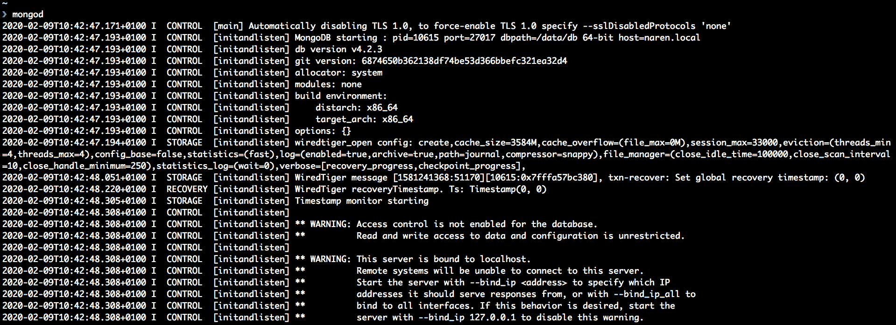
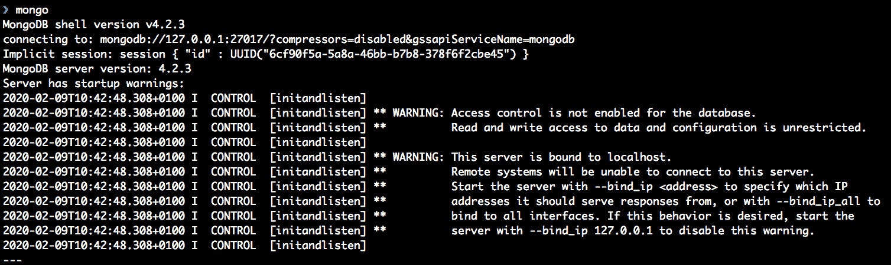
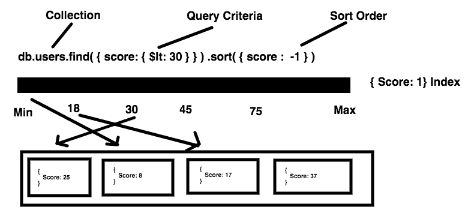

# 第五章：使用 MongoDB 和 Go 创建 REST API

在本章中，我们将介绍一个流行的 NoSQL 数据库 MongoDB。我们将通过存储文档而不是关系来了解 MongoDB 如何适合现代网络服务。我们将从学习 MongoDB 集合和文档开始，并使用 MongoDB 作为数据库创建一个示例 API。在这个过程中，我们将使用一个名为 `mongo-driver` 的驱动程序包。然后，我们将尝试为配送物流问题设计一个文档模型架构。

在本章中，我们将讨论以下主题：

+   MongoDB 简介

+   安装 MongoDB 并使用 shell

+   介绍 `mongo-driver`，它是 Go 的官方 MongoDB 驱动程序

+   基于 `gorilla/mux` 和 MongoDB 的 RESTful API

+   通过索引提高查询性能

+   为配送物流设计 MongoDB 文档

# 技术要求

如果您希望运行本书中的代码示例，以下软件需要预先安装：

+   操作系统：Linux(Ubuntu 18.04)/Windows 10/Mac OS X >=10.13

+   Dep：Go 的依赖管理工具 >= 0.5.3

+   Go 编译器 >= 1.13.5

+   MongoDB >= 4.2.3

您可以从 [`github.com/PacktPublishing/Hands-On-Restful-Web-services-with-Go/tree/master/chapter5`](https://github.com/PacktPublishing/Hands-On-Restful-Web-services-with-Go/tree/master/chapter5) 下载本章的代码。克隆代码并使用 `chapter5` 目录中的代码示例。

# MongoDB 简介

**MongoDB** 是一个流行的 NoSQL 数据库，吸引了全球许多开发者的关注。它与传统的如 MySQL、PostgreSQL 和 SQLite3 的关系数据库不同。与其它数据库相比，MongoDB 的主要区别在于它是无模式的，并存储集合和文档。将 MongoDB 集合视为表，将文档视为 SQL 数据库中的行。然而，在 MongoDB 中，集合之间没有关系。这种无模式的设计允许 MongoDB 通过称为 **Sharding** 的机制进行水平扩展。MongoDB 将数据存储在磁盘上的 BSON 文件中。BSON 是一种高效的操作和数据传输的二进制格式。几乎所有的 MongoDB 客户端在插入或检索文档时都将 JSON 转换为 BSON，反之亦然。

许多大型公司，如 Expedia、Comcast 和 MetLife，都基于 MongoDB 构建了他们的应用程序。它已被证明是现代互联网业务中的一个关键元素。MongoDB 以文档的形式存储数据；将其视为 SQL 数据库中的一行。所有 MongoDB 文档都存储在集合中，这个集合类似于表（在 SQL 的意义上）。让我们看看一个例子。一个 IMDb 电影的示例文档有几个键，如名称、年份和导演。这些键的值可以是数字、布尔值、字符串、列表或映射。这看起来可能类似于以下内容：

```go
{
  _id: 5,
  name: 'Star Trek',
  year: 2009,
  directors: ['J.J. Abrams'],
  writers: ['Roberto Orci', 'Alex Kurtzman'],
  boxOffice: {
     budget:150000000,
     gross:257704099
  }
}
```

MongoDB 相对于关系数据库的主要优势如下：

+   易于建模（无模式）

+   可以利用查询能力

+   文档结构适合现代网络应用程序（**JSON**）

+   比关系型数据库更可扩展（通过 **分片**）

既然我们已经了解了 MongoDB 是什么，让我们更详细地看看它。在下一节中，我们将学习如何安装 MongoDB 并尝试从 MongoDB 壳中访问它。

# 安装 MongoDB 和使用壳

MongoDB 可以轻松地安装在任何平台上。在 Ubuntu 18.04 上，在运行 `apt-get` 命令之前，我们需要执行一些步骤：

```go
sudo apt-get update
sudo apt-get install -y mongodb
```

一旦安装完成，检查 `mongo` 进程是否正在运行。如果没有，可以使用以下命令启动 MongoDB 守护进程：

```go
systemctl start mongod
```

如果用户是 root，可以在每个命令之前删除 `sudo` 关键字。

我们也可以从网站上手动下载 MongoDB 并将其复制到 `/usr/local/bin`。为此，我们必须为服务器创建一个初始化脚本，因为当系统关闭时，服务器会停止。我们可以使用 `nohup` 工具在后台运行服务器。通常，使用 `apt-get` 安装它更好。

要在 Mac OS X 上安装 MongoDB，您需要使用 Homebrew 软件。按照以下步骤进行操作：

1.  我们可以使用以下命令轻松安装它：

```go
brew tap mongodb/brew
brew install mongodb-community 
```

1.  然后，我们需要创建 MongoDB 存储数据库的 `db` 目录：

```go
mkdir -p /data/db
```

1.  然后，使用 `chown` 修改该文件的权限：

```go
chown -R `id -un` /data/db
```

1.  现在，MongoDB 已经准备好了。为了交互式地查看其日志，我们需要停止 MongoDB 作为进程并在壳中运行它。要停止服务，请使用以下命令：

```go
systemctl stop mongod
```

1.  现在，在终端窗口中，运行以下命令，这将交互式地启动 MongoDB（不在后台）：

```go
mongod
```

上述命令会产生以下输出：



上述命令显示了数据库状态的一些列。从这些 `日志` 中，我们可以推断出服务器在端口 `27017` 上启动。它显示了构建环境、使用的存储引擎等等。

在 Windows 上，我们可以手动下载安装程序二进制文件，通过将安装 `bin` 目录添加到 `PATH` 变量中来启动它。然后，我们可以使用 `mongod` 命令运行它。与 MongoDB 安装一起来的还有一个名为 Mongo 的客户端壳。我们将在下一节简要介绍它。

# 使用 MongoDB 壳工作

每当我们开始使用 MongoDB 时，我们首先需要探索的是我们可以用来与之交互的可用命令。通过一个简单的客户端工具查找可用的数据库、集合、文档等，称为 **MongoDB 壳**。它与 MySQL 客户端类似。这个壳程序包含在标准的 MongoDB 服务器安装中。我们可以使用以下命令启动它：

```go
mongo
```

参考以下截图：



如果您看到已经创建了一个 `session` ID，如前面的截图所示，那么一切正常。如果您收到错误，服务器可能没有按预期运行。为了排除故障，请查看 MongoDB 故障排除指南[`docs.mongodb.com/manual/faq/diagnostics`](https://docs.mongodb.com/manual/faq/diagnostics/)。客户端提供有关 MongoDB 版本和其他警告的信息。要查看所有可用的 shell 命令，请使用 `help` 命令。

让我们创建一个名为 `movies` 的新集合，并将前面的示例文档插入其中。按照以下步骤操作：

1.  默认情况下，数据库将是一个测试数据库：

```go
> show databases

admin   0.000GB
config  0.000GB
local   0.000GB
test    0.000GB
```

前面的 `show` 命令列出了所有可用的数据库。`admin`、`config`、`test` 和 `local` 是默认可用的四个数据库。

1.  要创建新数据库或切换到现有数据库，只需键入 `use db_name`。在我们的例子中，让我们将我们的数据库命名为 `appDB`。在 MongoDB shell 中键入以下内容：

```go
> use appDB
```

这会将当前数据库切换到 `appDB` 数据库。如果您尝试列出可用的数据库，`appDB` 不会显示，因为 MongoDB 只有在向其中插入一些数据时（第一个集合或文档）才会创建物理数据库。

1.  现在，我们可以通过插入第一个文档来创建一个新的集合。我们可以使用以下命令将 IMDb 电影的示例文档插入到名为 `movies` 的集合中：

```go
> db.movies.insertOne({ _id: 5, name: 'Star Trek', year: 2009, directors: ['J.J. Abrams'], writers: ['Roberto Orci', 'Alex Kurtzman'], boxOffice: { budget:150000000, gross:257704099 } } )
{ 
 "acknowledged" : true,
 "insertedId" : 5 
}
```

您插入的 JSON 中有一个名为 `_id` 的 ID。我们可以在插入文档时提供它，或者 MongoDB 本身可以为您生成一个。

1.  在 SQL 数据库中，我们使用 *auto-increment* 与 `ID` 架构一起增加 `ID` 字段。在这里，MongoDB 生成一个唯一的哈希 `ID` 而不是序列。让我们插入一个关于《黑暗骑士》的更多文档，但这次我们不会传递 `_id` 字段：

```go
> db.movies.insertOne({ name: 'The Dark Knight ', year: 2008, directors: ['Christopher Nolan'], writers: ['Jonathan Nolan', 'Christopher Nolan'], boxOffice: { budget:185000000, gross:533316061 } } )
{ 
 "acknowledged" : true,
 "insertedId" : ObjectId("59574125bf7a73d140d5ba4a")
}
```

如确认 JSON 响应所示，`insertedId` 已更改为一个非常长的 `59574125bf7a73d140d5ba4a`。这是由 MongoDB 生成的唯一哈希。

我们还可以使用 `insertMany` 函数在给定时间内插入一批文档。

1.  在电影集合上使用不带参数的 `find` 函数将返回所有匹配的文档，如下所示：

```go
> db.movies.find()

{ "_id" : 5, "name" : "Star Trek", "year" : 2009, "directors" : [ "J.J. Abrams" ], "writers" : [ "Roberto Orci", "Alex Kurtzman" ], "boxOffice" : { "budget" : 150000000, "gross" : 257704099 } }
{ "_id" : ObjectId("59574125bf7a73d140d5ba4a"), "name" : "The Dark Knight ", "year" : 2008, "directors" : [ "Christopher Nolan" ], "writers" : [ "Jonathan Nolan", "Christopher Nolan" ], "boxOffice" : { "budget" : 185000000, "gross" : 533316061 } }
```

1.  为了返回单个文档，请使用 `findOne` 函数。这返回多个结果中最旧的文档：

```go
> db.movies.findOne()

{ "_id" : 5, "name" : "Star Trek", "year" : 2009, "directors" : [ "J.J. Abrams" ], "writers" : [ "Roberto Orci", "Alex Kurtzman" ], "boxOffice" : { "budget" : 150000000, "gross" : 257704099 }}
```

1.  我们如何查询文档？在 MongoDB 中，查询被称为过滤数据并返回结果。如果我们需要过滤 2008 年发布的电影，我们可以这样做：

```go
> db.movies.find({year: {$eq: 2008}})

{ "_id" : ObjectId("59574125bf7a73d140d5ba4a"), "name" : "The Dark Knight ", "year" : 2008, "directors" : [ "Christopher Nolan" ], "writers" : [ "Jonathan Nolan", "Christopher Nolan" ], "boxOffice" : { "budget" : 185000000, "gross" : 533316061 } }
```

前面的 MongoDB shell 语句中的过滤查询如下：

```go
{year: {$eq: 2008}}
```

这表示搜索标准是 `year`，并且值应该是 `2008`。`$eq` 被称为 **过滤运算符**，它有助于在字段和数据之间建立条件关系。它在 SQL 中相当于 `=` 运算符。在 SQL 中，等效的查询可以写成以下内容：

```go
SELECT * FROM movies WHERE year=2008;
```

1.  我们可以将之前编写的 MongoDB shell 语句简化为以下内容：

```go
> db.movies.find({year: 2008})
```

这个过滤查询和之前的过滤查询是相同的，因为它们返回相同的文档集。前者的语法是使用`$eq`，这是一个查询操作符。从现在起，我们将一个*查询操作符*简单地称为*操作符*。

其他主要操作符如下：

| **操作符** | **函数** |
| --- | --- |
| `$lt` | `小于` |
| `$gt` | `大于` |
| `$in` | `在...之中` |
| `$lte` | `小于或等于` |
| `$ne` | `不等于` |

您可以在这里找到所有可用的操作符：[`docs.mongodb.com/manual/reference/operator/`](https://docs.mongodb.com/manual/reference/operator/).

1.  现在，让我们给自己提出一个问题。我们有一个需求，需要获取所有预算超过$150,000,000 的文档。如何使用我们之前学到的查询知识来过滤这些文档？看看下面的代码片段：

```go
> db.movies.find({'boxOffice.budget': {$gt: 150000000}})

{ "_id" : ObjectId("59574125bf7a73d140d5ba4a"), "name" : "The Dark Knight ", "year" : 2008, "directors" : [ "Christopher Nolan" ], "writers" : [ "Jonathan Nolan", "Christopher Nolan" ], "boxOffice" : { "budget" : 185000000, "gross" : 533316061 } }
```

如您所见，我们使用`boxOffice.budget`在 JSON 中访问了`budget`键。MongoDB 的美丽之处在于它允许我们以很大的自由度查询 JSON。

1.  我们在获取文档时不能添加两个或更多操作符到标准吗？是的，我们可以！让我们找到数据库中所有在`2009`年上映且预算超过$150,000,000 的电影：

```go
> db.movies.find({'boxOffice.budget': {$gt: 150000000}, year: 2009})
```

这没有返回任何内容，因为我们没有符合给定标准的任何文档。默认情况下，以逗号分隔的查询字段，如`'boxOffice.budget': {$gt: 150000000}, year: 2009`，会与`AND`操作结合。

1.  现在，让我们放宽条件，找到任何在`2009`年上映或预算超过$150,000,000 的电影：

```go
> db.movies.find({$or: [{'boxOffice.budget': {$gt: 150000000}}, {year: 2009}]})

{ "_id" : 5, "name" : "Star Trek", "year" : 2009, "directors" : [ "J.J. Abrams" ], "writers" : [ "Roberto Orci", "Alex Kurtzman" ], "boxOffice" : { "budget" : 150000000, "gross" : 257704099 } }
{ "_id" : ObjectId("59574125bf7a73d140d5ba4a"), "name" : "The Dark Knight ", "year" : 2008, "directors" : [ "Christopher Nolan" ], "writers" : [ "Jonathan Nolan", "Christopher Nolan" ], "boxOffice" : { "budget" : 185000000, "gross" : 533316061 } }
```

这里，查询略有不同。我们使用了一个名为`$or`的操作符来找到两个条件的谓词。结果将是获取文档的标准。`$or`需要分配给一个 JSON 条件对象的列表（见前面的查询）。由于 JSON 可以嵌套，条件也可以嵌套。这种查询风格可能对来自 SQL 背景的人来说是新的。MongoDB 团队设计它以直观地过滤数据。我们也可以通过巧妙地使用操作符，在 MongoDB 中轻松编写如内连接、外连接、嵌套查询等高级查询。

1.  到目前为止，我们已经探讨了两个**创建**、**读取**、**更新**和**删除**（**CRUD**）操作，以便在 MongoDB 文档上创建和读取。现在，我们将查看更新和删除操作。要更新一个文档，使用`db.collection.update`方法。语法包括标准和设置操作：

```go
db.movies.update(CRITERIA, SET)
```

1.  让我们更新《星际迷航》（ID：5）的票房预算。我们的目标是把`150000000`改为`200000000`：

```go
db.movies.update({"_id": 5}, {$set: {"boxOffice.budget": 200000000}})
```

`update`方法的第一个参数是过滤标准。第二个参数是一个`$set`操作符，它更改文档中的字段/部分。

1.  现在，让我们看看删除操作。我们可以使用`deleteOne`和`deleteMany`函数从给定的集合中删除一个文档：

```go
> db.movies.deleteOne({"_id": ObjectId("59574125bf7a73d140d5ba4a")})
{ "acknowledged" : true, "deletedCount" : 1 }
```

传递给 **`deleteOne`** 函数的参数是一个过滤条件，这与读取和更新操作类似。所有符合给定条件的文档都将从集合中删除。响应包含一个友好的确认消息，其中包含已删除文档的数量。

这一部分和前面的章节讨论了使用 MongoDB shell 的 MongoDB 基础知识。然而，我们如何从一个 Go 程序中完成相同的事情？我们需要使用一个驱动程序包。在下一节中，我们将探索官方的 MongoDB Go 驱动程序包，称为 `mongo-driver`。MongoDB 支持包括 Python、Java、Ruby 和 Go 在内的主要语言的官方驱动程序。

# 介绍 mongo-driver，Go 的官方 MongoDB 驱动程序

`mongo-driver` 是一个功能丰富的 MongoDB 驱动程序，允许开发者编写使用 MongoDB 作为数据库的应用程序。Go 应用程序可以使用 `mongo` 驱动程序轻松地与 MongoDB 进行所有 CRUD 操作。这是一个由 MongoDB 维护的开源实现，可以自由使用和修改。我们可以将其视为 MongoDB API 的包装器。安装此包的命令与其他 `go get` 命令类似。然而，在本章中，我们将介绍一个新的 Go 包工具，称为 `dep`。

`dep` 是一个类似于 Python 的 `pip` 或 JavaScript 的 `npm` 的 Go 包安装工具。按照以下网页安装 dep 工具到各种平台：[`golang.github.io/dep/docs/installation.html`](https://golang.github.io/dep/docs/installation.html)。

让我们编写一个 Go 程序，将 `The Dark Knight` 电影文档插入到 MongoDB 中。按照以下步骤操作：

1.  为我们的项目创建一个目录：

```go
mkdir $GOPATH/src/github.com/git-user/chapter5/intro
```

1.  现在，切换到 `intro` 目录并初始化 `dep` 工具。它创建了一些文件，以便我们可以跟踪包依赖项：

```go
dep init
```

1.  将 `mongo-driver` 依赖项添加到 `dep` 中：

```go
dep ensure -add "go.mongodb.org/mongo-driver/mongo@~1.0.0"
```

1.  创建一个 `main` 文件，如下所示：

```go
touch $GOPATH/src/github.com/git-user/chapter5/intro/main.go
```

1.  这就是我们设置所有文件和依赖项所需做的全部工作。为了表示电影和票房，我们必须创建模仿 BSON 数据的结构体。这些结构体看起来像这样：

```go
// Movie holds a movie data
type Movie struct {
  Name string `bson:"name"`
  Year string `bson:"year"`
  Directors []string `bson:"directors"`
  Writers []string `bson:"writers"`
  BoxOffice `bson:"boxOffice"`
}

// BoxOffice is nested in Movie
type BoxOffice struct {
  Budget uint64 `bson:"budget"`
  Gross uint64 `bson:"gross"`
}
```

我们为结构体字段使用了 `bson` 标签。我们这样做的原因是 `mongo-driver` 包使用另一个名为 `bson` 的包将 Go 结构体序列化为 BSON 格式。这个 `bson` 包需要一些以标签形式存在的元信息来处理字段。因此，我们附加了一些 `helper` 标签。前面的结构体代表了内存中的 BSON 文档。

1.  现在，我们必须从 `mongo-driver` 中导入两个名为 `mongo` 和 `options` 的包。如果我们希望对 MongoDB 集合执行查询，则需要 `bson` 包。程序中的导入部分看起来像这样：

```go
package main

import (
  "context"
  "fmt"
  "log"

  "go.mongodb.org/mongo-driver/mongo"
  "go.mongodb.org/mongo-driver/mongo/options"
  "gopkg.in/mgo.v2/bson"
)
```

1.  现在，在 `main` 函数中，我们必须创建一个数据库客户端并连接到它。这应该在程序的 main 块中完成。根据 `mongo-driver` API，我们创建一个 `ClientOptions` 实例。`ClientOptions` 对象包含数据库服务器信息（主机和端口）等细节。然后，我们使用上下文和 `ClientOptions` 对象创建一个客户端。上下文用作请求超时。借助客户端，我们可以使用 `Ping` 方法 ping 数据库。如果数据库 ping 成功，我们可以获取集合的引用。创建客户端和 ping 服务器的逻辑如下：

```go
clientOptions := options.Client().ApplyURI("mongodb://localhost:27017")
client, err := mongo.Connect(context.TODO(), clientOptions)

if err != nil {
  panic(err)
}

err = client.Ping(context.TODO(), nil)

if err != nil {
  log.Fatal(err)
}

fmt.Println("Connected to MongoDB successfully")
collection := client.Database("appDB").Collection("movies")
```

1.  现在集合已准备就绪，我们可以将电影记录插入到数据库中。`mongo-driver` 为集合提供了一个名为 `InsertOne` 的方法。我们可以将结构体插入到数据库集合中，如下所示：

```go
  // Create a movie
  darkNight := Movie{
    Name: "The Dark Knight",
    Year: "2008",
    Directors: []string{"Christopher Nolan"},
    Writers: []string{"Jonathan Nolan", "Christopher Nolan"},
    BoxOffice: BoxOffice{
      Budget: 185000000,
      Gross: 533316061,
    },
  }

  // Insert a document into MongoDB
  _, err := collection.InsertOne(context.TODO(), darkNight)

  if err != nil {
    log.Fatal(err)
  }
```

1.  通过这样做，一条记录已被插入到数据库中。让我们使用带有过滤器的查询检索它，即票房预算超过 150 亿美元的电影。我们应该创建一个空的电影结构体来存储结果。可以使用 `bson.M` 结构体构建一个过滤器查询。它是一个通用的映射，包含 `KEY:VALUE` 对，便于创建 BSON 查询。`collection.FindOne` 方法接受一个过滤器查询并返回一个 `SingleResult` 对象。我们可以将此对象解码到空的电影结构体中，如下所示：

```go
  queryResult := &Movie{}
  // bson.M is used for building map for filter query
  filter := bson.M{"boxOffice.budget": bson.M{"$gt": 150000000}}
  result = collection.FindOne(context.TODO(), filter)
  err = result.Decode(queryResult)

  if err != nil {
    log.Fatal(err)
  }

  fmt.Println("Movie:", queryResult)
```

1.  最后，在我们的操作完成后，从数据库断开连接：

```go
  err = client.Disconnect(context.TODO())
  if err != nil {
    panic(err)
  }
  fmt.Println("Disconnected from MongoDB")
```

1.  我们可以使用以下代码运行整个程序：

```go
go run $GOPATH/src/github.com/git-user/chapter5/intro/main.go
```

输出如下所示：

```go
Connected to MongoDB successfully
Movie: &{ObjectID("5cfd106733090c1e34713c43")}
Disconnected from MongoDB
```

查询的结果可以存储在一个新的结构体中，并可以序列化为 JSON，以便客户端也能使用它。为此，你应该在结构体中添加 JSON 元标签，以及 BSON 标签。

# 使用 gorilla/mux 和 MongoDB 的 RESTful API

在前面的章节中，我们探讨了构建 RESTful API 的所有可能方式。我们使用了基本的 HTTP 路由器，以及许多其他网络框架。然而，为了保持简单，我们可以使用 `gorilla/mux` 与 `mongo-driver` 作为 MongoDB 驱动器。在本节中，我们将构建一个端到端的电影 API，同时集成数据库和 HTTP 路由器。在前一节中，我们学习了如何使用 `mongo-driver` 创建新的 MongoDB 文档并检索它。通过整合我们对 HTTP 路由器和数据库的知识，我们可以创建一个电影 API。

让我们制定计划，以便我们可以创建 API：

1.  准备结构体来存储电影信息和数据库连接。

1.  创建一个用于托管 API 的服务器。

1.  准备 API 端点的路由。

1.  实现路由的处理程序。

我们必须遵循以下步骤才能实现我们的目标：

1.  创建一个目录来存放我们的项目：

```go
mkdir $GOPATH/src/github.com/git-user/chapter5/movieAPI
```

1.  在项目中添加一个 `main.go` 文件：

```go
touch $GOPATH/src/github.com/git-user/chapter5/movieAPI/main.go
```

请使用 `dep` 工具安装 `mongo-driver` 包，就像我们在前一节中所做的那样。

1.  让我们看看我们需要创建的结构体；即，`DB`、`Movie` 和 `BoxOffice`。`Movie` 和 `BoxOffice` 存储电影信息。`DB` 结构体在 MongoDB 数据库中存储一个集合，该集合可以在多个函数之间传递。相应的代码如下：

```go
type DB struct {
  collection *mongo.Collection
}

type Movie struct {
  ID interface{} `json:"id" bson:"_id,omitempty"`
  Name string `json:"name" bson:"name"`
  Year string `json:"year" bson:"year"`
  Directors []string `json:"directors" bson:"directors"`
  Writers []string `json:"writers" bson:"writers"`
  BoxOffice BoxOffice `json:"boxOffice" bson:"boxOffice"`
}

type BoxOffice struct {
  Budget uint64 `json:"budget" bson:"budget"`
  Gross uint64 `json:"gross" bson:"gross"`
}
```

1.  为了实现我们的 API，我们需要几个重要的包。这些是 `gorilla/mux`、`mongo-driver` 和几个其他的 `helper` 包。让我们看看如何导入这些包：

```go
  ...
  "go.mongodb.org/mongo-driver/bson/primitive"

  "go.mongodb.org/mongo-driver/bson"

  "github.com/gorilla/mux"
  "go.mongodb.org/mongo-driver/mongo"
  "go.mongodb.org/mongo-driver/mongo/options"
```

我们需要 `primitive` 包从字符串生成 `ObjectID`，`bson` 包用于创建查询过滤器，以及 `mongo/options` 包用于创建 MongoDB 客户端。

1.  让我们创建 `main` 函数，这是创建 MongoDB 客户端的地方。客户端是通过传递选项给 `Connect` 方法创建的。一旦我们连接到本地运行的 MongoDB（端口 `27017`），我们就可以使用 `Database.Collection` 方法访问集合。我们可以使用 `defer` 关键字延迟清理连接：

```go
func main() {
  clientOptions := 
    options.Client().ApplyURI("mongodb://localhost:27017")
  client, err := mongo.Connect(context.TODO(), clientOptions)
  if err != nil {
    panic(err)
  }
  defer client.Disconnect(context.TODO())

  collection := client.Database("appDB").Collection("movies")
  db := &DB{collection: collection}
  ...
}
```

`defer` 关键字在 Go 程序中是特殊的。它延迟一个函数调用，以便它在包含的外部函数返回之前执行。它通常用于 I/O 连接清理。

在我们的情况下，包含的函数是 `main`，延迟的函数是 `client.Disconnect`。所以，当 `main` 返回/终止时，defer 语句会正确地关闭 MongoDB 连接。

1.  接下来，我们为电影上的 `GET` 和 `POST` 操作创建一些 HTTP 路由。让我们分别称它们为 `GetMovie` 和 `PostMovie`。代码如下：

```go
  r := mux.NewRouter()
  r.HandleFunc("/v1/movies/{id:[a-zA-Z0-9]*}",
   db.GetMovie).Methods("GET")
  r.HandleFunc("/v1/movies", db.PostMovie).Methods("POST")
```

1.  现在，我们可以使用 `http.Server` 方法启动服务器，如下面的代码所示：

```go
  srv := &http.Server{
    Handler: r,
    Addr: "127.0.0.1:8000",
    WriteTimeout: 15 * time.Second,
    ReadTimeout: 15 * time.Second,
  }
  log.Fatal(srv.ListenAndServe())
}
```

1.  现在是处理器的实际实现。`GetMovie`，像任何其他的 mux 处理器一样，接收响应和请求对象。它从路径参数中接收电影的 `ObjectId`（十六进制字符串）并从数据库中查询匹配的文档。我们可以使用 `mux.Vars` 映射来收集路径参数。

我们不能简单地使用原始 ID 形成过滤查询。我们必须使用来自 `mongo-driver/bson/primitive` 包的 `primitive.ObjectIDFromHex` 方法将传递的十六进制字符串转换为 `ObjectID`。我们应该在 `filter` 查询中使用这个 `ObjectID`。

然后，我们使用 `collection.FindOne` 方法运行查询。结果可以解码为 `Movie` 结构体字面量并作为 JSON `response` 返回。请看以下 `GetMovie` 函数处理器的代码：

```go
// GetMovie fetches a movie with a given ID
func (db *DB) GetMovie(w http.ResponseWriter, r *http.Request) {
  vars := mux.Vars(r)
  var movie Movie
  objectID, _ := primitive.ObjectIDFromHex(vars["id"])
  filter := bson.M{"_id": objectID}
  err := db.collection.FindOne(context.TODO(),
   filter).Decode(&movie)

  if err != nil {
    w.WriteHeader(http.StatusInternalServerError)
    w.Write([]byte(err.Error()))
  } else {
    w.Header().Set("Content-Type", "application/json")
    response, _ := json.Marshal(movie)
    w.WriteHeader(http.StatusOK)
    w.Write(response)
  }
}
```

1.  `PostMovie` 与 `GET` 处理器函数具有完全相同的函数签名。它不是从路径参数中读取信息，而是从请求体中读取 JSON 信息并将其反序列化为 `Movie` 结构体。然后，我们使用 `collection.InsertOne` 方法执行数据库插入操作。JSON 的结果作为 HTTP 响应发送回。`PostMovie` 处理器函数的代码如下：

```go
// PostMovie adds a new movie to our MongoDB collection
func (db *DB) PostMovie(w http.ResponseWriter, r *http.Request) {
  var movie Movie
  postBody, _ := ioutil.ReadAll(r.Body)
  json.Unmarshal(postBody, &movie)

  result, err := db.collection.InsertOne(context.TODO(), movie)
  if err != nil {
    w.WriteHeader(http.StatusInternalServerError)
    w.Write([]byte(err.Error()))
  } else {
    w.Header().Set("Content-Type", "application/json")
    response, _ := json.Marshal(result)
    w.WriteHeader(http.StatusOK)
    w.Write(response)
  }
}
```

1.  现在，让我们运行程序：

```go
go run $GOPATH/src/github.com/git-user/chapter5/movieAPI/main.go
```

1.  接下来，我们打开终端，使用 `curl` 或 `Postman` 发送 `POST` API 请求以创建一个新的电影：

```go
curl -X POST \
 http://localhost:8000/v1/movies \
 -H 'cache-control: no-cache' \
 -H 'content-type: application/json' \
 -d '{ "name" : "The Dark Knight", "year" : "2008", "directors" : [ "Christopher Nolan" ], "writers" : [ "Jonathan Nolan", "Christopher Nolan" ], "boxOffice" : { "budget" : 185000000, "gross" : 533316061 }
}'
```

这返回以下响应：

```go
{"InsertedID":"5cfd6cf0c281945c6cfefaab"}
```

1.  我们的电影已成功创建。接下来，让我们检索它。使用 `curl` 发送 `GET` API 请求：

```go
curl -X GET http://localhost:8000/v1/movies/5cfd6cf0c281945c6cfefaab
```

它返回我们在创建资源时得到的数据：

```go
{"id":"5cfd6cf0c281945c6cfefaab","name":"The Dark Knight","year":"2008","directors":["Christopher Nolan"],"writers":["Jonathan Nolan","Christopher Nolan"],"boxOffice":{"budget":185000000,"gross":533316061}}
```

1.  我们可以轻松地添加 `PUT`（更新）和 `DELETE` 方法到/从前面的代码中。我们只需要定义两个额外的处理器。首先，看看 `UpdateMovie` 处理器。它通过路径参数获取 `ObjectID` 以更新 MongoDB 中的文档，如下面的代码所示：

```go
// UpdateMovie modifies the data of given resource
func (db *DB) UpdateMovie(w http.ResponseWriter, r *http.Request) {
  vars := mux.Vars(r)
  var movie Movie
  putBody, _ := ioutil.ReadAll(r.Body)
  json.Unmarshal(putBody, &movie)

  objectID, _ := primitive.ObjectIDFromHex(vars["id"])
  filter := bson.M{"_id": objectID}
  update := bson.M{"$set": &movie}
  _, err := db.collection.UpdateOne(context.TODO(), filter, update)
  ...
}
```

1.  接下来，处理器函数是 `DeleteMovie`。它从路径参数中获取对象 ID，并尝试使用 `DeleteOne` 方法在数据库中删除具有相同 ID 的文档，如下所示：

```go
// DeleteMovie removes the data from the db
func (db *DB) DeleteMovie(w http.ResponseWriter, r *http.Request) {
  vars := mux.Vars(r)
  objectID, _ := primitive.ObjectIDFromHex(vars["id"])
  filter := bson.M{"_id": objectID}

  _, err := db.collection.DeleteOne(context.TODO(), filter)
  ...
}
```

在这些 API 操作中，我们也可以简单地向客户端发送状态，而不需要 HTTP 主体。

为了让这些处理器由 `gorilla/mux` 激活，我们必须将两个新的 HTTP 端点注册到路由器中，如下所示：

```go
r.HandleFunc("/v1/movies/{id:[a-zA-Z0-9]*}", db.UpdateMovie).Methods("PUT")
r.HandleFunc("/v1/movies/{id:[a-zA-Z0-9]*}", db.DeleteMovie).Methods("DELETE")
```

这些添加的完整代码可在 `chapter5/movieAPI_updated/main.go` 文件中找到。如果您运行更新后的程序，您将拥有一个基于 MongoDB 后端的完整 CRUD API。

# 通过索引提高查询性能

我们都知道，在阅读书籍时，索引非常重要。当我们试图在书中搜索一个主题时，我们会滚动索引页面。如果主题在索引中找到，我们就去该主题的具体页码。但这里有一个缺点。我们为了这个索引使用了额外的页面。同样，MongoDB 需要每次查询时都遍历所有文档。如果文档存储了重要字段的索引，它可以快速提供数据。同时，我们应该记住，存储索引需要额外的空间。

在计算机科学中，B-tree 是实现索引的重要数据结构，因为它可以分类节点。通过遍历该树，我们可以以更少的步骤找到所需的数据。我们可以使用 MongoDB 提供的 `createIndex` 函数创建索引。以学生及其考试成绩为例。`GET` 操作在排序成绩时更为频繁。这种场景的索引可以可视化如下：



这是由 MongoDB 网站提供的官方示例。**score** 是因为频繁使用而被索引的字段。一旦它被索引，数据库就会将每个文档的地址存储在一个二叉树中。每当有人查询这个字段时，它会检查范围运算符（在这种情况下，它是 `$lt`），遍历二叉树，并在更少的步骤中获取文档的地址。由于 score 已被索引，排序操作的成本较低。因此，数据库返回排序（升序或降序）结果所需的时间更短。

回到我们之前提到的电影 API 的示例，我们可以为数据创建索引。默认情况下，所有`_id`字段都是索引的，所以我们使用 MongoDB shell 来显示这一点。之前，我们将`year`字段视为字符串。让我们将其修改为整数并对其进行索引。使用`mongo`命令启动 MongoDB shell。从一个 MongoDB shell 连接到一个新数据库；例如，`test`，并向其中插入一个文档：

```go
> db.movies.insertOne({ name: 'Star Trek',   year: 2009,   directors: ['J.J. Abrams'],   writers: ['Roberto Orci', 'Alex Kurtzman'],   boxOffice: {      budget:150000000,      gross:257704099   } } )
{ 
 "acknowledged" : true,
 "insertedId" : ObjectId("595a6cc01226e5fdf52026a1")
}
```

插入一个包含不同数据的类似文档：

```go
> db.movies.insertOne({ name: 'The Dark Knight ', year: 2008, directors: ['Christopher Nolan'], writers: ['Jonathan Nolan', 'Christopher Nolan'], boxOffice: { budget:185000000, gross:533316061 } } )
{ 
 "acknowledged" : true,
 "insertedId" : ObjectId("59603d3b0f41ead96110cf4f")
}
```

现在，让我们使用`createIndex`函数为年份添加索引：

```go
db.movies.createIndex({year: 1})
```

这一行添加了检索数据库记录更快的方法。现在，所有与`year`相关的查询都利用了索引：

```go
> db.movies.find({year: {$lt: 2010}})
{ "_id" : ObjectId("5957397f4e5c31eb7a9ed48f"), "name" : "Star Trek", "year" : 2009, "directors" : [ "J.J. Abrams" ], "writers" : [ "Roberto Orci", "Alex Kurtzman" ], "boxOffice" : { "budget" : 150000000, "gross" : 257704099 } }
{ "_id" : ObjectId("59603d3b0f41ead96110cf4f"), "name" : "The Dark Knight ", "year" : 2008, "directors" : [ "Christopher Nolan" ], "writers" : [ "Jonathan Nolan", "Christopher Nolan" ], "boxOffice" : { "budget" : 185000000, "gross" : 533316061 } }
```

查询结果没有差异。然而，由于索引，通过`MongoDB`查找文档的机制已经改变。对于大量文档，这可能会大大减少查找时间。

索引是有成本的。如果索引没有正确设置，一些查询在不同字段上运行会非常慢。MongoDB 中还可以有复合索引，可以索引多个字段。

MongoDB 附带一个名为`query planner`的工具。要查看查询的执行时间，请在`query`函数之后使用`explain`函数，例如，`db.movies.find({year: {$lt: 2010}}).explain("executionStats")`。这解释了查询的获胜计划、所需时间（以毫秒为单位）、使用的索引等。

您可以使用`explain`函数查看索引和非索引数据的性能。请访问 MongoDB 网站了解有关索引的更多信息：[`docs.mongodb.com/manual/indexes/`](https://docs.mongodb.com/manual/indexes/).

在您的口袋里拥有 MongoDB 和`driver` API 的所有知识后，您可以从开发使用 NoSQL 作为后端的 REST API 开始。在下一节中，我们将展示配送物流的架构，并指导您开发一个示例 API。

# 为配送物流 API 设计 MongoDB 文档

对于许多情况，可以开发 REST API。其中一种情况是配送物流。在物流世界中，许多实体都扮演着重要的角色。为了知道要实现什么，你需要了解物流中使用的术语。在这里，我们将模拟一些可以用于 MongoDB 的 JSON 文档。在本节学习完毕后，请尝试使用此架构信息作为构建物流 REST API 的指南。

在任何配送物流设计中，以下六个最小组件是必不可少的：

+   发件人

+   收件人

+   包裹

+   付款

+   承运人

+   装运

让我们看看每个组件的架构：

1.  发件人是发送包裹的人：

```go
{
  _id: ObjectId("5cfe142a7ba402aacb71f710"),
  first_name: "Philip",
  last_name: "Zorn",
  address: {
    type: "work"
    street: "241 Indian Spring St",
    city: "Pittsburg",
    state: "California",
    pincode: 94565,
    country: "USA"
  },
  "phone": "(xxx) yyy-zzzz"
}
```

1.  收件人从发件人那里接收包裹：

```go
{
  _id: ObjectId("5cfe142a7ba402aacb71f706"),
  first_name: "Max",
  last_name: "Charles",
  address: {
    type: "home"
    street: "Ludwig Str. 5",
    city: "Ansbach",
    state: "Bayern",
    pincode: 91522,
    country: "Deutschland"
  },
  "phone": "xx-yyyyyy-zzzzz"
}

```

1.  发件人向收件人发送包裹。因此，我们必须创建一个包含包裹信息的文档，例如厘米和克的尺寸和重量：

```go
{
  _id: ObjectId("5cfe15607ba402aacb71f711"),
  dimensions: {
    width: 21,
    height: 12
  },
  weight: 10,
  is_damaged: false,
  status: "In transit"
}
```

1.  当发送者购买配送服务时，应记录支付交易。它应包含支付交易详情以供进一步参考：

```go
{
  _id: ObjectId("5cfe162a7ba402aacb71f713"),
  initiated_on: ISODate("2019-06-10T08:38:30.894Z"),
  successful_on: ISODate("2019-06-10T08:39:06.894Z").
  merchant_id: 112543,
  mode_of_payment: "paypal",
  payment_details: {
    transaction_token: "dfghjvbsclka76asdadn89"
  }
}
```

1.  现在是承运商。我们有一个第三方国际供应商，将代表我们发送包裹：

```go
{
  _id: ObjectId("5cfe1a4e7ba402aacb71f714"),
  name: "PHL International",
  carrier_code: 988,
  is_partner: true
}
```

1.  最后，有了所有这些细节，我们有一个包含关于所有其他利益相关者信息的运输文档：

```go
{
  _id: ObjectId("5cfe162a7ba402aacb71f712"),
  sender: ObjectId("5cfe142a7ba402aacb71f710"),
  receiver: ObjectId("5cfe142a7ba402aacb71f706"),
  package: ObjectId("5cfe15607ba402aacb71f711"),
  payment: ObjectId("5cfe162a7ba402aacb71f713"),
  carrier: ObjectId("5cfe1a4e7ba402aacb71f714"),
  promised_on: ISODate("2019-07-15T08:54:11.694Z")
}
```

一个运输包含 `sender`（发送者）、`receiver`（接收者）、`payment`（支付）、`carrier`（承运商）和 `package`（包裹）详情。这是交付物流的最小文档设计。

你可以在本项目的仓库中找到所有之前的 MongoDB Shell 架构，即 `chapter5/delivery_logistics`。

所有的前一个架构都已实现，以便你了解如何为 MongoDB 作为存储系统设计 REST 服务。

注意，前面的格式是针对 MongoDB shell 的。在创建服务时，请注意这个差异。

这里有一个编码练习给你：*你能利用本章前几节学到的知识创建一个物流 REST 服务吗？*

# 摘要

我们本章开始时介绍了 MongoDB 以及它是如何解决现代网络问题的。MongoDB 是一种不同于传统关系型数据库的 NoSQL 数据库。然后，我们学习了如何在所有平台上安装 MongoDB，如何启动 MongoDB 服务器，以及我们探讨了 MongoDB shell 的功能。MongoDB shell 是一个工具，可以用来快速检查或执行 CRUD 操作，以及在 MongoDB 中执行许多其他操作。我们查看查询的运算符符号。然后，我们介绍了 Go 的 MongoDB 驱动程序 `mongo-driver` 并学习了它的用法。我们借助 `mongo-driver` 和 Go 创建了一个持久电影 API。最后，我们学习了如何将 Go 结构体映射到 JSON 文档。

并非每个查询在 MongoDB 中都高效。因此，为了提高查询性能，我们引入了索引机制，通过按 B 树的顺序排列文档来减少文档检索时间。我们学习了如何使用 `explain` 命令来衡量查询的执行时间。最后，我们通过提供 BSON（*MongoDB shell 语法*）来制定物流文档设计。

有时，你的 REST API 需要支持额外的后台服务和传输。其中一种服务是 **远程过程调用**（**RPC**）。当分布式系统支持 REST API 时，后台可能会有成千上万的 RPC 调用。这些 RPC 调用可以调用不同的端点，使用不同的数据格式和传输方式等。如果你想在分布式系统中开发 API，了解这些至关重要。在下一章中，我们将学习如何使用名为 **gRPC** 的 RPC 方法和一个名为 **Protocol Buffers** 的数据格式。
