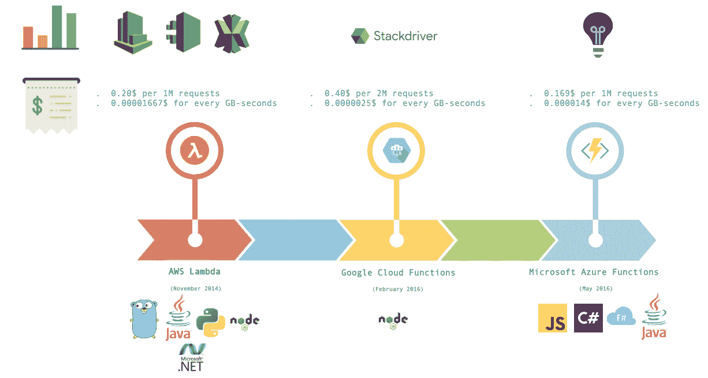
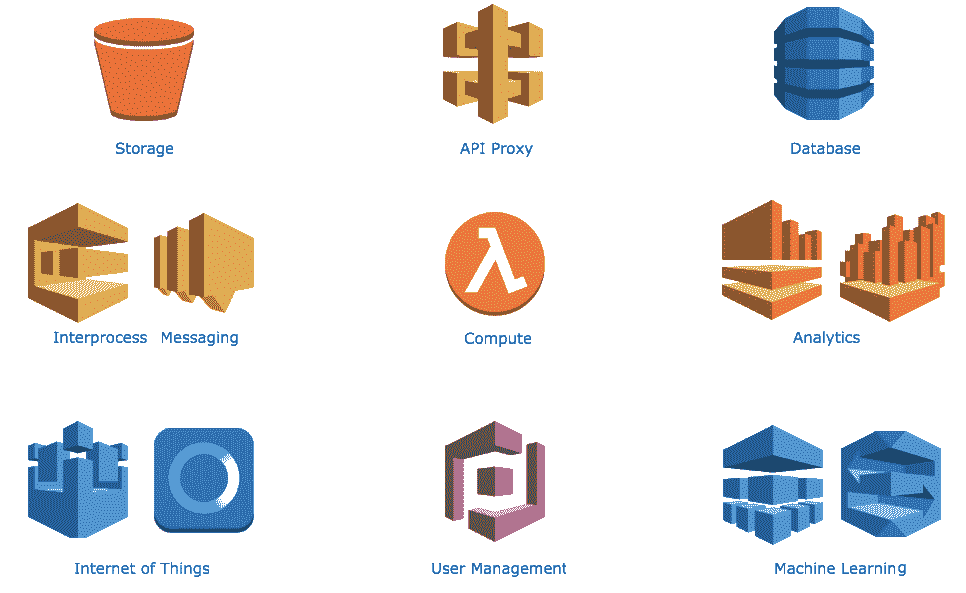
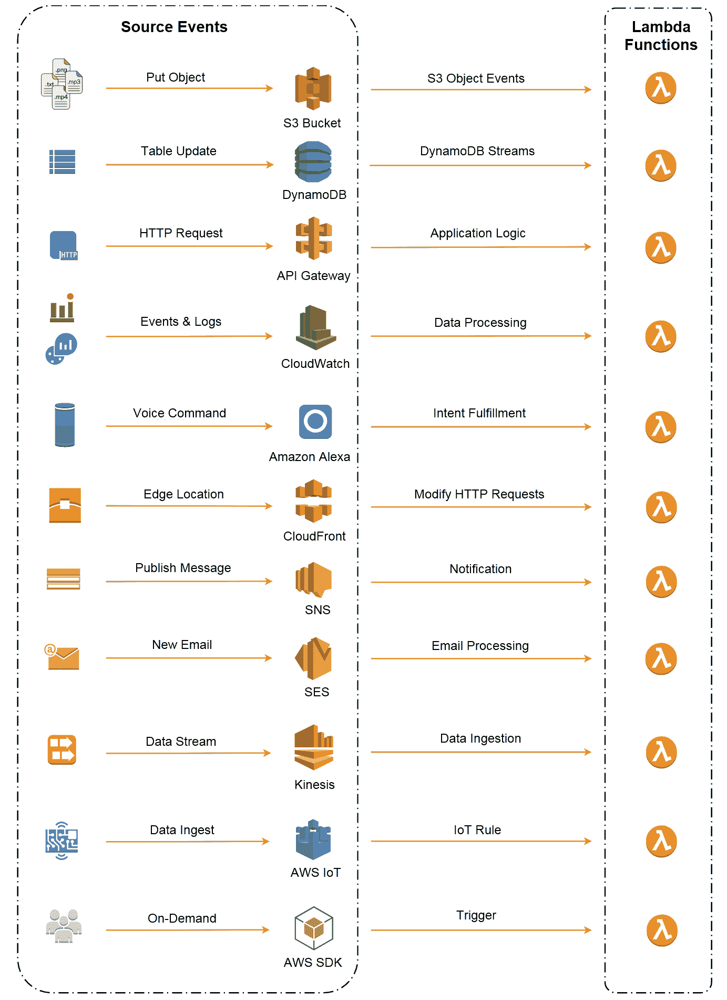
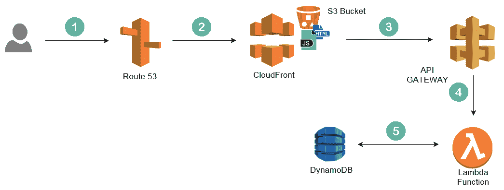
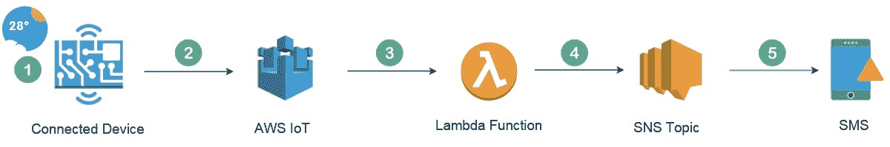
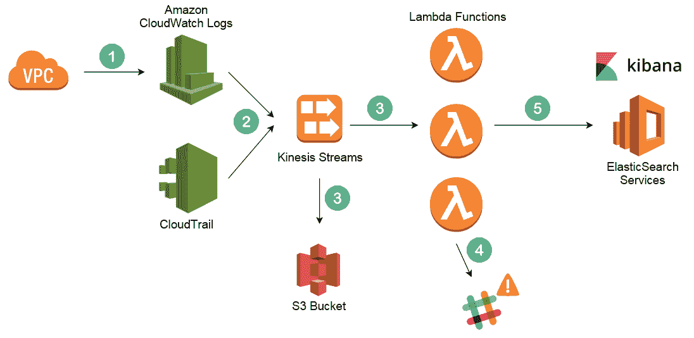
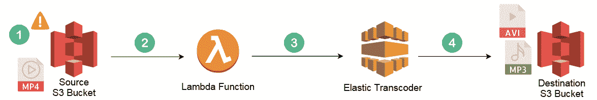
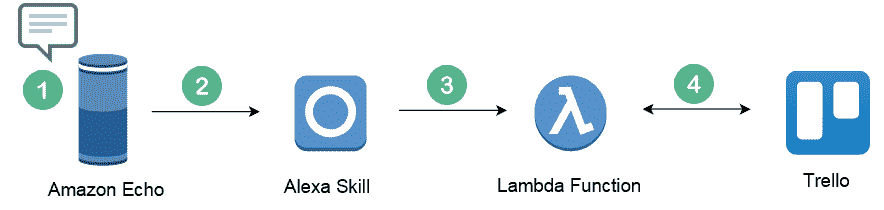
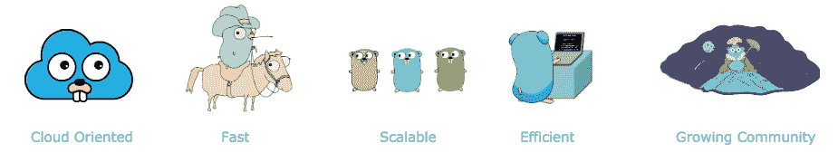
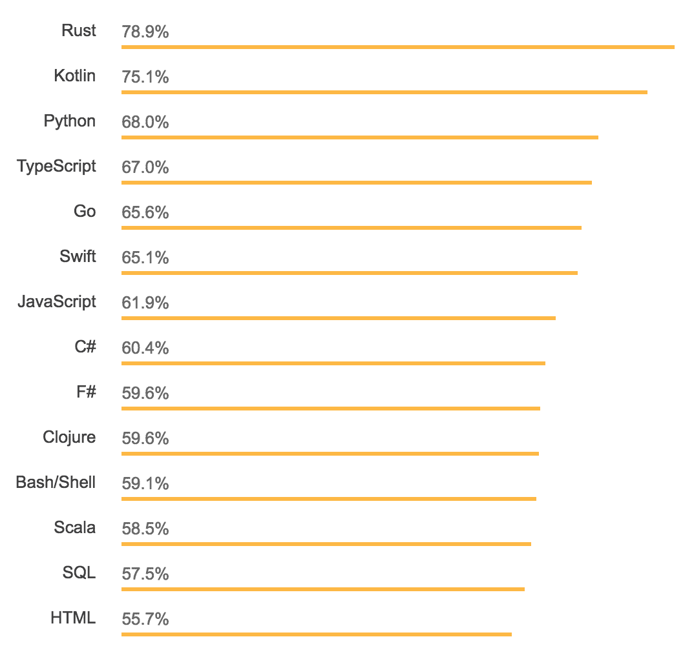

# Go 无服务器

本章将为您提供对**无服务器架构**是什么，它是如何工作的，以及它的特点是什么的基础理解。您将了解到**AWS Lambda**如何与谷歌云函数和微软 Azure 函数等大型参与者不相上下。然后，您将了解 AWS Lambda 的不同执行环境及其对 Go 语言的支持。此外，我们将讨论使用 Go 作为构建无服务器应用程序的编程语言的优势。

本章将涵盖以下主题：

+   云计算模型——了解它们是什么以及可以用于什么。

+   无服务器架构的优缺点。

+   为什么 Go 非常适合 AWS Lambda。

# 无服务器范式

基于云的应用程序可以构建在低级基础设施部件上，也可以使用提供抽象层的更高级服务，从而摆脱核心基础设施的管理、架构和扩展要求。在接下来的部分，您将了解不同的云计算模型。

# 云计算的演进

云提供商根据四种主要模型提供其服务：IaaS、PaaS、CaaS 和 FaaS。所有上述模型只是在底层添加了数千台服务器、磁盘、路由器和电缆。它们只是在顶部添加了抽象层，以使管理更容易，并增加开发速度。

# 基础设施即服务

**基础设施即服务**（**IaaS**），有时缩写为 IaaS，是基本的云消费模型。它在虚拟化平台之上构建了一个 API，以访问计算、存储和网络资源。它允许客户无限扩展其应用程序（无需容量规划）。

在这种模型中，云提供商抽象了硬件和物理服务器，云用户负责管理和维护其上的客户操作系统和应用程序。

根据 Gartner 的基础设施即服务魔力象限图，AWS 是领先者。无论您是在寻找内容传递、计算能力、存储还是其他服务功能，AWS 在 IaaS 云计算模型方面是各种可用选项中最有利的。它主导着公共云市场，而微软 Azure 正在逐渐赶上亚马逊，其次是谷歌云平台和 IBM 云。

# 平台即服务

**平台即服务**（**PaaS**）为开发人员提供了一个框架，他们可以在其中开发应用程序。它简化、加快了开发、测试和部署应用程序的过程，同时隐藏了所有实现细节，如服务器管理、负载均衡器和数据库配置。

PaaS 建立在 IaaS 之上，因此隐藏了底层基础设施和操作系统，使开发人员能够专注于提供业务价值并减少运营开销。

Heroku 是最早推出 PaaS 的之一，于 2007 年；后来，谷歌应用引擎和 AWS 弹性 Beanstalk 也加入了竞争。

# 容器即服务

**容器即服务**（**CaaS**）随着 2013 年 Docker 的发布而变得流行。它使得在本地数据中心或云上构建和部署容器化应用变得容易。

容器改变了 DevOps 和站点可靠性工程师的规模单位。多个容器可以在单个虚拟机上运行，这样可以更好地利用服务器并降低成本。它还通过消除“在我的机器上运行”的笑话，使开发人员和运维团队更加紧密地联系在一起。这种转变到容器使多家公司能够现代化其传统应用程序并将其迁移到云上。

为了实现容错、高可用性和可伸缩性，需要一个编排工具，比如 Docker Swarm、Kubernetes 或 Apache Mesos，来管理节点集群中的容器。因此，引入了 CaaS 来快速高效地构建、部署和运行容器。它还处理了诸如集群管理、扩展、蓝/绿部署、金丝雀更新和回滚等重型任务。

市场上最流行的 CaaS 平台是 AWS，因为 57%的 Kubernetes 工作负载运行在亚马逊**弹性容器服务**（**ECS**）、**弹性 Kubernetes 服务**（**EKS**）和 AWS Fargate 上，其次是 Docker Cloud、CloudFoundry 和 Google 容器引擎。

这种模型，CaaS，使您能够进一步分割虚拟机以实现更高的利用率，并在机器集群中编排容器，但云用户仍然需要管理容器的生命周期；作为解决方案，引入了**函数即服务**（**FaaS**）。

# 函数即服务

FaaS 模型允许开发人员在不需要预配或维护复杂基础设施的情况下运行代码（称为函数）。云提供商将客户代码部署到完全托管的、临时的、有时间限制的容器中，这些容器仅在函数调用期间处于活动状态。因此，企业可以在不必担心扩展或维护复杂基础设施的情况下实现增长；这被称为无服务器化。

亚马逊在 2014 年推出了 AWS Lambda，开启了无服务器革命，随后是微软 Azure Functions 和 Google Cloud Functions。

# 无服务器架构

无服务器计算，或者说 FaaS，是云计算的第四种消费方式。在这种模式下，预配、维护和打补丁的责任从客户转移到了云提供商。开发人员现在可以专注于构建新功能和创新，并且只支付他们消耗的计算时间。

# 无服务器化的好处

无服务器化有很多合理之处：

+   **无运维**：服务器基础设施由云提供商管理，这减少了开销并提高了开发速度。操作系统更新和补丁由 FaaS 提供商处理。这导致了缩短的上市时间和更快的软件发布，消除了系统管理员的需求。

+   **自动扩展和高可用性**：作为规模的单位，函数导致了小型、松耦合和无状态的组件，从长远来看，这会导致可伸缩的应用程序。如何有效地利用基础设施来为客户提供服务请求并根据负载水平扩展函数，这取决于服务提供商。

+   **成本优化**：您只支付您消耗的计算时间和资源（RAM、CPU、网络或调用时间）。您不支付闲置资源。没有工作意味着没有成本。例如，如果 Lambda 函数的计费周期为 100 毫秒，那么它可以显著降低成本。

+   **多语言**：无服务器方法带来的一个好处是，作为程序员，您可以根据您的用例选择不同的语言运行时。应用程序的一部分可以用 Java 编写，另一部分可以用 Go 编写，另一部分可以用 Python 编写；只要能完成工作，就没有关系。

# 无服务器化的缺点

另一方面，无服务器计算仍处于起步阶段；因此，并不适用于所有用例，并且它确实有其局限性：

+   **透明性**：基础设施由 FaaS 提供商管理。这是为了灵活性；您无法完全控制您的应用程序，无法访问底层基础设施，也无法在不同平台提供商之间切换（供应商锁定）。未来，我们预计将会有更多工作朝着 FaaS 的统一化方向发展；这将有助于避免供应商锁定，并允许我们在不同的云提供商甚至本地运行无服务器应用程序。

+   **调试**：监控和调试工具并非是针对无服务器架构而构建的。因此，无服务器函数很难进行调试和监控。此外，在部署之前很难设置本地环境来测试您的函数（预集成测试）。好消息是，随着无服务器的普及和社区和云提供商创建了多个开源项目和框架（如 AWS X-Ray、Datadog、Dashbird 和 Komiser），最终会出现工具来改善无服务器环境的可观察性。

+   **冷启动**：处理函数的第一个请求需要一些时间，因为云提供商需要为您的任务分配适当的资源（AWS Lambda 需要启动一个容器）。为了避免这种情况，您的函数必须保持活动状态。

+   **无状态**：函数需要是无状态的，以提供使无服务器应用程序能够透明扩展的提供。因此，要持久保存数据或管理会话，您需要使用外部数据库，如 DynamoDB 或 RDS，或内存缓存引擎，如 Redis 或 Memcached。

尽管已经说明了所有这些限制，但这些方面将随着越来越多的供应商推出升级版本的平台而发生变化。

# 无服务器云提供商

有多个 FaaS 提供商，但为了简单起见，我们只比较最大的三个：

+   AWS Lambda

+   Google Cloud Functions

+   Microsoft Azure Functions

以下是一张图示比较：

如前图所示，AWS Lambda 是当今无服务器空间中使用最广泛、最知名和最成熟的解决方案，这就是为什么即将到来的章节将完全专注于 AWS Lambda。

# AWS Lambda

AWS Lambda 是 AWS 无服务器平台的核心：

AWS Lambda 在 2014 年的 re:Invent 上推出。这是无服务器计算的第一个实现，用户可以将他们的代码上传到 Lambda。它会代表用户执行操作和管理活动，包括提供容量、监控舰队健康状况、应用安全补丁、部署他们的代码，并将实时日志和指标发布到 Amazon CloudWatch。

Lambda 遵循事件驱动架构。您的代码会在响应事件时触发并并行运行。每个触发器都会被单独处理。此外，您只需按执行次数收费，而使用 EC2 时则按小时计费。因此，您可以以低成本和零前期基础设施投资获得应用程序的自动扩展和容错能力。

# 事件源

AWS Lambda 根据事件运行您的代码。当这些事件源检测到事件时，将调用您的函数：

Amazon 现在支持 SQS 作为 Lambda 的事件源

# 使用情况

AWS Lambda 可用于无尽的应用场景：

+   **Web 应用程序**：您可以使用 S3 和 Lambda 来代替维护带有 Web 服务器的专用实例来托管您的静态网站，以便以更低的成本获得可伸缩性。下图描述了一个无服务器网站的示例：

**Route 53**中的别名记录指向**CloudFront**分发。**CloudFront**分发建立在**S3 Bucket**之上，其中托管着静态网站。**CloudFront**减少了对静态资产（JavaScript、CSS、字体和图像）的响应时间，提高了网页加载时间，并减轻了分布式拒绝服务（DDoS）攻击。然后，来自网站的 HTTP 请求通过**API Gateway** HTTP 端点，触发正确的**Lambda Function**来处理应用程序逻辑并将数据持久保存到完全托管的数据库服务，如**DynamoDB**。

+   **移动和物联网**：构建传感器应用程序的示意图，该应用程序从实时传感器连接的设备中测量温度，并在温度超出范围时发送短信警报，如下所示：

**连接设备**将数据摄入到**AWS IoT**。**AWS IoT**规则将调用**Lambda 函数**以分析数据，并在紧急情况下向**SNS 主题**发布消息。发布消息后，Amazon SNS 将尝试将该消息传递给订阅主题的每个端点。在这种情况下，它将是**短信**。

+   **数据摄入：**监控日志并保持审计跟踪是强制性的，您应该意识到云基础设施中的任何安全漏洞。以下图表说明了一个实时日志处理管道与 Lambda：

VPC 流日志功能捕获有关 VPC 中网络接口的 IP 流量信息，并将日志发送到 Amazon CloudWatch 日志。AWS CloudTrail 记录您帐户上的所有 AWS API 调用。所有日志都被聚合并流式传输到 AWS Kinesis 数据流。

Kinesis 触发 Lambda 函数，分析日志以查找事件或模式，并在异常活动发生时向 Slack 或 PagerDuty 发送通知。最后，Lambda 将数据集发布到预安装了 Kibana 的 Amazon Elasticsearch，以可视化和分析网络流量和日志，使用动态和交互式仪表板。这是为了长期保留和存档日志，特别是对于具有合规性计划的组织。Kinesis 将日志存储在 S3 存储桶中进行备份。可以配置存储桶的生命周期策略，将未使用的日志存档到 Glacier。

+   **定时任务：**定时任务和事件非常适合 Lambda。您可以使用 Lambda 创建备份，生成报告和执行 cron 作业，而不是保持实例 24/7 运行。以下示意图描述了如何使用 AWS Lambda 执行后处理作业：

当视频到达 S3 存储桶时，事件将触发一个 Lambda 函数，该函数将视频文件名和路径传递给弹性转码器管道，以执行视频转码，生成多种视频格式（.avi，.h264，.webm，.mp3 等），并将结果存储在 S3 存储桶中。

+   **聊天机器人和语音助手：**您可以使用**自然语言理解**（**NLU**）或**自动语音识别**（**ASR**）服务，如 Amazon Lex，构建可以触发 Lambda 函数以响应语音命令或文本的应用程序机器人。以下图表描述了使用 Lambda 构建个人助手的用例：

用户可以询问**Amazon Echo**关于其待办事项清单。Echo 将拦截用户的语音命令并将其传递给自定义**Alexa 技能**，该技能将进行语音识别并将用户的语音命令转换为意图，触发**Lambda 函数**，然后查询**Trello** API 以获取今天的任务列表。

由于 Lambda 在内存、CPU 和超时执行方面的限制，它不适用于长时间运行的工作流和其他大规模工作负载。

# Go 无服务器

AWS 在 2018 年 1 月宣布支持 Go 作为 AWS Lambda 的语言。已经有一些开源框架和库可以用来支持使用 Node.js 的 Go 应用程序（Apex 无服务器框架），但现在 Go 已经得到官方支持，并添加到可以用来编写 Lambda 函数的编程语言列表中：

+   Go

+   Node.js

+   Java

+   Python

+   .NET

但是我们应该使用哪种语言来编写高效的 Lambda 函数呢？无服务器的一个原因是多语言。无论您选择哪种语言，编写 Lambda 函数的代码都有一个共同的模式。同时，您需要特别注意性能和冷启动。这就是 Go 发挥作用的地方。以下图表突出了在 AWS Lambda 中使用 Go 进行无服务器应用程序的主要优势：

+   **面向云**：它是由谷歌专门为云设计的，考虑到可扩展性，并减少构建时间。Go 是分布式系统和基础设施工具的坚实语言。Docker、Kubernetes、Terraform、etcd、Prometheus 等许多编排、提供和监控工具都是使用 Go 构建的。

+   **快速**：Go 编译成单个二进制文件。因此，您可以向 AWS Lambda 提供预编译的 Go 二进制文件。AWS 不会为您编译 Go 源文件，这会产生一些后果，比如快速的冷启动时间。Lambda 不需要设置运行时环境；另一方面，Java 需要启动 JVM 实例来使您的函数热起来。Go 具有清晰的语法和明确的语言规范。这为开发人员提供了一种易于学习的语言，并在产生可维护的代码的同时快速显示出良好的结果。

+   **可扩展**：Go 具有内置的 goroutines 并发，而不是线程。它们从堆中消耗了几乎 2 Kb 的内存，并且比线程工作得更快；因此，您可以随时启动数百万个 goroutine。对于软件开发，不需要框架；Golang 社区已经构建了许多工具，这些工具受到 Go 语言核心的本地支持：

+   Go 的错误处理很优雅。

+   轻量级的单元测试框架。

+   标准库稳固—HTTP 协议支持开箱即用。

+   支持的常见数据类型和结构—映射、数组、结构等。

+   **高效**：它涉及高效的执行和编译。Go 是一种编译语言；它编译成单个二进制文件。它使用静态链接将所有依赖项和模块组合成一个单个的二进制文件。此外，它更快的编译速度允许快速反馈。快速的开发节省时间和金钱；因此，这对于预算紧张的人来说无疑是最重要的优势。

+   **不断增长的社区**：以下截图显示了（根据 StackOverflow Survey 2017 观察到的）最受喜爱、最受恐惧和最想要的编程语言的流行度和使用率：

此外，Go 得到了谷歌的支持，并拥有一个庞大、不断增长的生态系统和众多 GitHub 上的贡献者，以及出色的 IDE 支持（IntelliJ、VSCode、Atom、GoGland）和调试功能。

# 总结

AWS Lambda 是无服务器计算或 FaaS 的第一个成功实现。它使用户摆脱了管理服务器的束缚，提高了开发速度，降低了系统复杂性，并使小型企业能够在零前期基础设施投资的情况下扩大规模。

对于在 Lambda 上运行业务的人来说，Go 对 AWS Lambda 的支持可以显著节省成本并提高性能。所以如果你正在寻找一种现代、快速、安全、易用的语言，Go 就是你的选择。

在下一章中，您将开始使用 AWS Lambda 控制台并设置您的 Golang 开发环境。

# 问题

1.  使用无服务器方法的优势是什么？

1.  Lambda 是一种节省时间的方法吗？

1.  无服务器架构如何实现微服务？

1.  AWS Lambda 函数的最长时间限制是多少？

1.  以下哪些是 AWS Lambda 支持的事件源？

+   Amazon Kinesis 数据流

+   Amazon RDS

+   AWS CodeCommit

+   AWS CloudFormation

1.  解释一下在 Go 中 goroutine 是什么。你如何停止 goroutines？

1.  AWS 中的 Lambda@Edge 是什么？

1.  函数即服务和平台即服务之间有什么区别？

1.  AWS Lambda 冷启动是什么？

1.  AWS Lambda 函数可以是无状态的还是有状态的？
