# 第三章：使用 Lambda 开发无服务器函数

在本章中，我们最终将学习如何从头开始编写我们的第一个基于 Go 的 Lambda 函数，然后学习如何手动配置、部署和测试 Lambda 函数。在此过程中，您将获得一组关于如何授予函数访问权限以便安全地与其他 AWS 服务进行交互的提示。

我们将涵盖以下主题：

+   用 Go 编写 Lambda 函数

+   执行角色

+   部署包

+   事件测试

# 技术要求

为了跟随本章，您需要按照上一章中描述的设置和配置您的 Go 和 AWS 开发环境。熟悉 Go 是首选但不是必需的。本章的代码包托管在 GitHub 上，网址为[`github.com/PacktPublishing/Hands-On-Serverless-Applications-with-Go`](https://github.com/PacktPublishing/Hands-On-Serverless-Applications-with-Go)。

# 用 Go 编写 Lambda 函数

按照本节中的步骤从头开始创建您的第一个 Go Lambda 函数：

1.  编写 Lambda 函数需要安装一些依赖项。因此，打开一个新的终端会话，并使用以下命令安装 Go Lambda 包：

```go
go get github.com/aws/aws-lambda-go/lambda
```

1.  接下来，打开您喜欢的 Go IDE 或编辑器；在我的情况下，我将使用 VS Code。在**GOPATH**中创建一个新的项目目录，然后将以下内容粘贴到`main.go`文件中：

```go
package main

import "github.com/aws/aws-lambda-go/lambda"

func handler() (string, error){
  return "Welcome to Serverless world", nil
}

func main() {
  lambda.Start(handler)
}
```

前面的代码使用`lambda.Start()`方法注册一个入口点处理程序，其中包含当调用 Lambda 函数时将执行的代码。Lambda 支持的每种语言都有其自己的要求，用于定义如何定义函数处理程序。对于 Golang，处理程序签名必须满足以下标准：

+   +   它必须是一个函数

+   它可以有 0 到 2 个参数

+   它必须返回一个错误

1.  接下来，登录到 AWS 管理控制台（[`console.aws.amazon.com/console/home`](https://console.aws.amazon.com/console/home)）并从“计算”部分选择 Lambda：

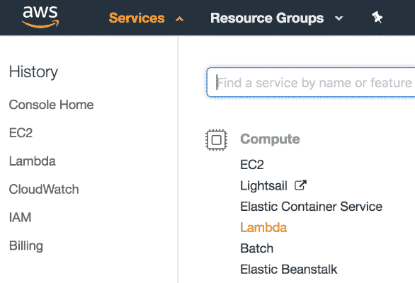

1.  在 AWS Lambda 控制台中，点击“创建函数”按钮，然后按照向导创建您的第一个 Lambda 函数：

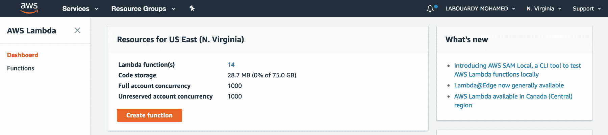

1.  选择从头开始的作者选项，为您的函数命名，然后从支持的语言列表中选择 Go 1.x 作为运行时环境：

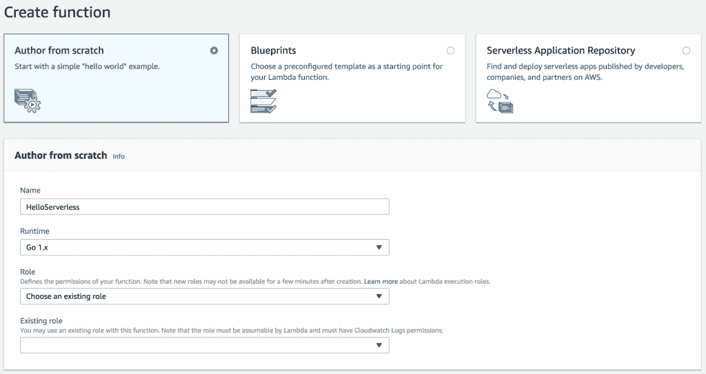

您必须为您的 Lambda 函数分配一个 IAM 角色（称为执行角色）。附加到该角色的 IAM 策略定义了您的函数代码被授权与哪些 AWS 服务进行交互。

# 执行角色

1.  现在我们已经学会了如何编写我们的第一个 Go Lambda 函数，让我们从身份和访问管理（[`console.aws.amazon.com/iam/home`](https://console.aws.amazon.com/iam/home)）中创建一个新的 IAM 角色，以授予函数访问 AWS CloudWatch 日志的权限：

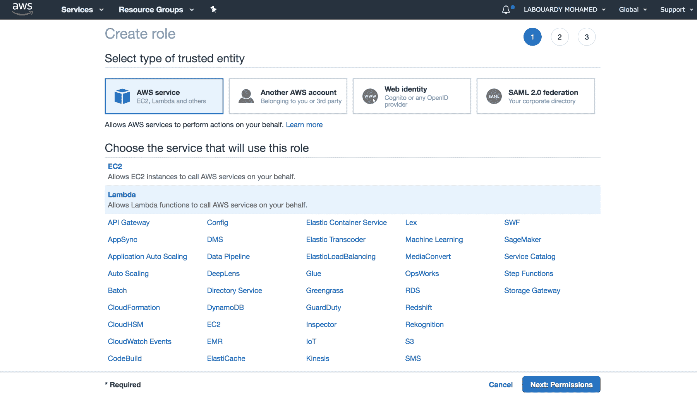

1.  在权限页面上，您可以选择一个现有的 AWS 托管策略，称为 CloudWatchFullAccess，或者（如第 3 步所示）创建一个最小特权的 IAM 角色（AWS 推荐的第二个选项；专门讨论安全最佳实践的章节将深入讨论 Lambda 函数）：

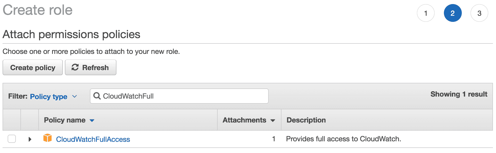

1.  继续点击“创建策略”按钮，并通过从可视编辑器中选择适当的服务（`CloudWatch`）来创建一个策略：

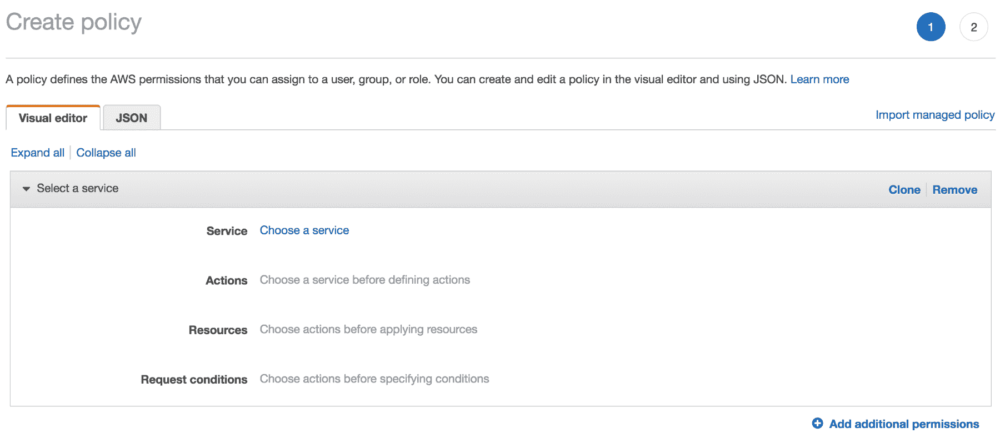

1.  对于熟悉 JSON 格式的读者，可以在 JSON 选项卡中使用 JSON 策略文档。该文档必须有一个声明，授予创建日志组和日志流以及将日志事件上传到 AWS CloudWatch 的权限：

```go
{
 "Version": "2012-10-17",
 "Statement": [
    {
      "Sid": "VisualEditor0",
      "Effect": "Allow",
      "Action": [
         "logs:CreateLogStream",
         "logs:CreateLogGroup",
         "logs:PutLogEvents"
      ],
      "Resource": "*"
    }
  ]
 }
```

1.  在“审阅策略”页面上，为策略输入名称和描述：

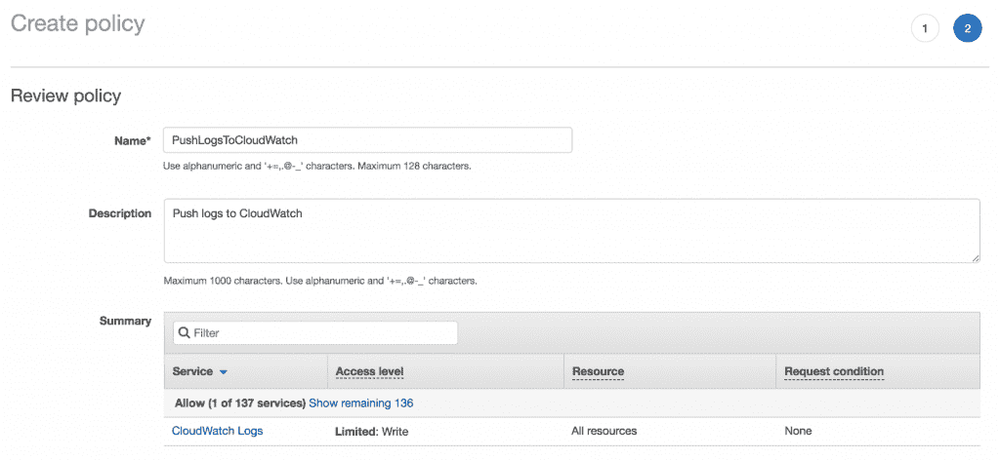

1.  返回“创建角色”页面，点击“刷新”，您应该看到我们之前创建的策略：

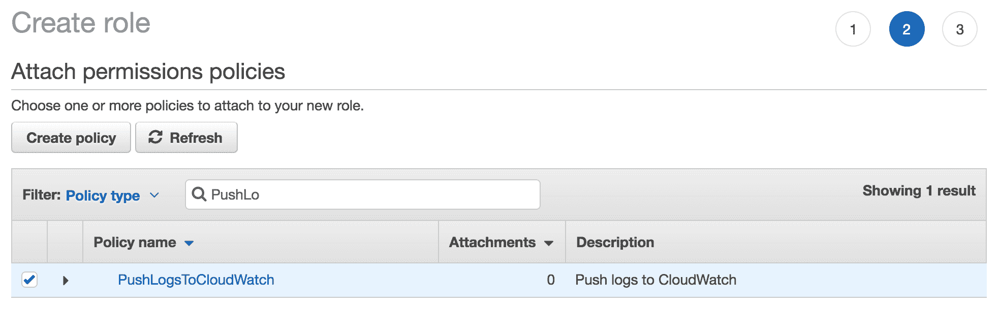

1.  在“审阅”页面上，为角色输入名称并选择“创建角色”：

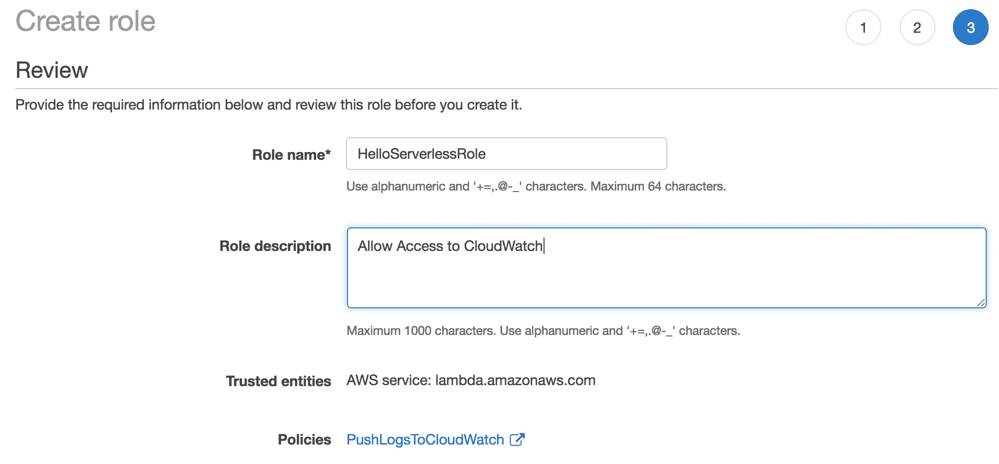

1.  现在我们的角色已经定义，返回 Lambda 表单创建并从现有角色下拉列表中选择 IAM 角色（可能需要刷新页面以使更改生效），然后点击“创建函数”按钮：

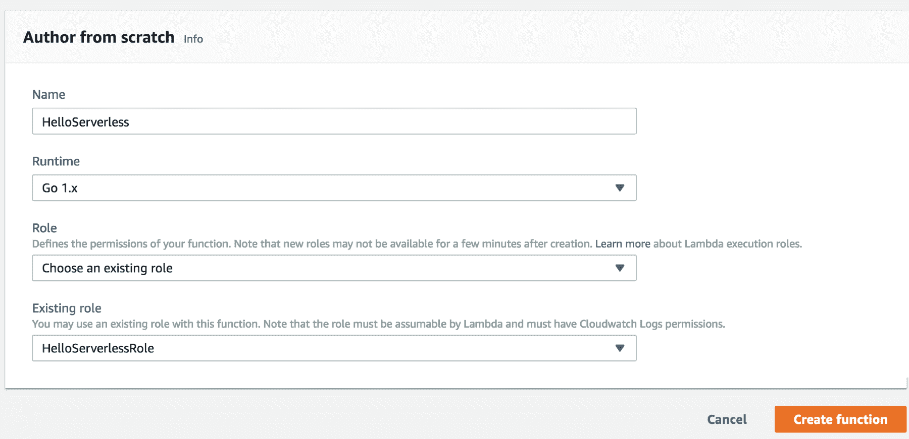

可以选择使用 AWS CLI 部署 Lambda 函数。有关此内容及其逐步过程的更全面讨论将保留在第六章中，“部署您的无服务器应用程序”中进行。

Lambda 控制台将显示绿色的成功消息，表示您的函数已成功创建：

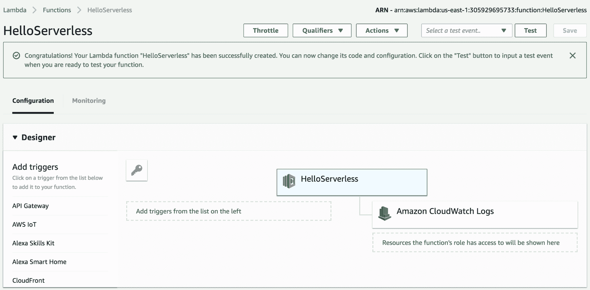

在编写、打包和创建 Lambda 函数之后，我们有各种配置选项可设置，定义代码在 Lambda 中的执行方式。如前面的截图所示，您可以通过不同的 AWS 服务（称为触发器）触发 Lambda 函数。

将其余高级设置保持不变（VPC、资源使用、版本、别名和并发），因为它们将在后续章节中进行深入讨论。

由于 Go 是最近添加的语言，其开发人员尚未添加内联编辑器的功能，因此您必须以 ZIP 文件格式提供可执行二进制文件，或者引用您已上传包的 S3 存储桶和对象键：

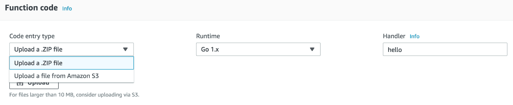

# 部署包

在本节中，我们将看到如何为函数构建部署包以及如何将其部署到 AWS Lambda 控制台。

# 上传 ZIP 文件

如第一章“Go 无服务器”中所述，Go 是一种编译语言。因此，您必须使用以下 Shell 脚本生成可执行二进制文件：

```go
#!/bin/bash

echo "Build the binary"
GOOS=linux GOARCH=amd64 go build -o main main.go

echo "Create a ZIP file"
zip deployment.zip main

echo "Cleaning up"
rm main
```

Lambda 运行时环境基于**Amazon Linux AMI**；因此，处理程序应为 Linux 编译（注意使用`GOOS`标志）。

对于 Windows 用户，建议您使用`build-lambda-zip`工具为 Lambda 创建一个可用的 ZIP 文件。

执行以下 Shell 脚本：

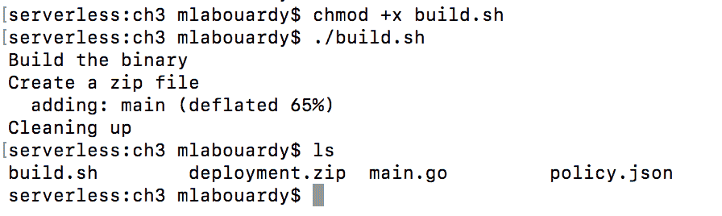

现在我们的 ZIP 文件已经生成；您现在可以返回 Lambda 控制台并上传 ZIP 文件，确保更新处理程序为 main 并保存结果：

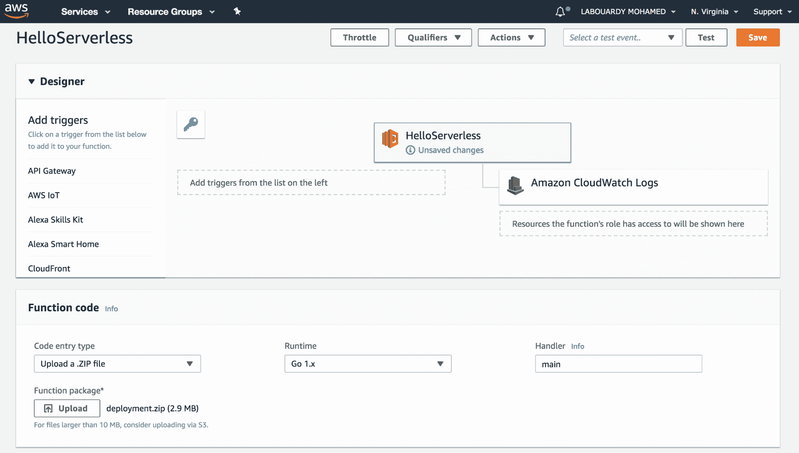

处理程序配置属性必须与可执行文件的名称匹配。如果您使用不同名称构建（`go build -o NAME`）二进制文件，则必须相应地更新处理程序属性。

# 从 Amazon S3 上传

将部署包上传到 Lambda 的另一种方法是使用 AWS S3 存储桶存储 ZIP 文件。在存储中，选择 S3 打开 Amazon S3 控制台：

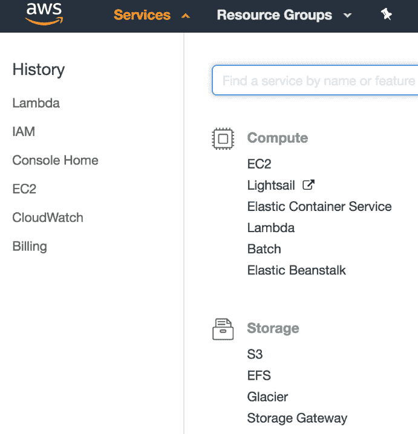

在您可以将 ZIP 上传到 Amazon S3 之前，您必须在创建 Lambda 函数的同一 AWS 区域中创建一个新的存储桶，如下截图所示：

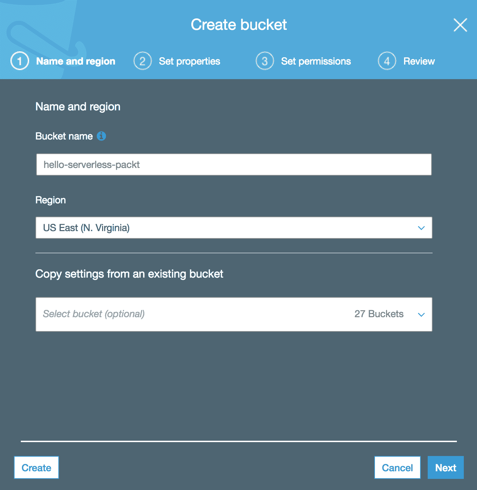

S3 存储桶具有全局命名空间。因此，它必须在 Amazon S3 中所有现有存储桶名称中全局唯一。

现在您已经创建了一个存储桶，将在上一节中生成的 ZIP 文件拖放到目标存储桶中，或者使用上传按钮：

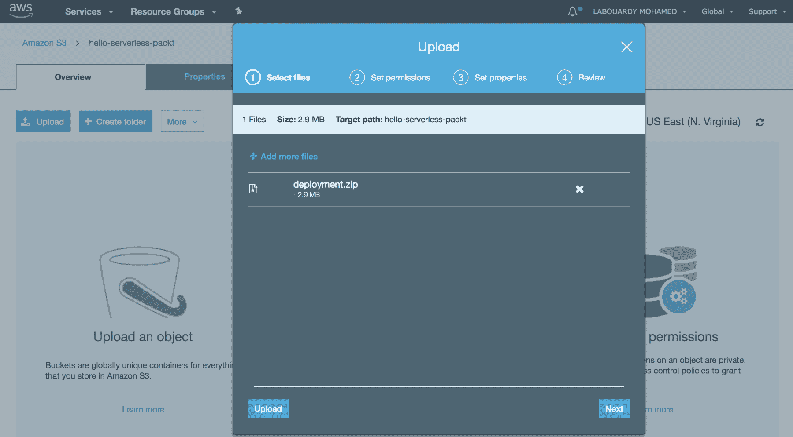

可以使用 AWS CLI 将部署包上传到 S3 存储桶，如下所示：

```go
aws s3 cp deployment.zip s3://hello-serverless-packt
```

确保 IAM 用户被授予`S3:PutObject`权限，以便使用 AWS 命令行上传对象。

上传后，选择 ZIP 文件并将链接值复制到剪贴板：

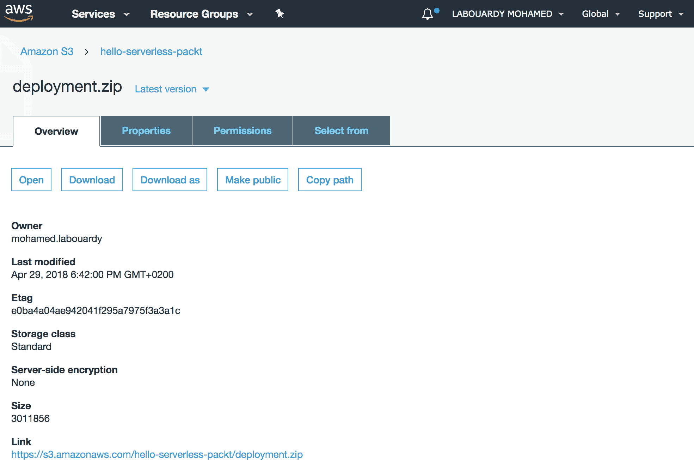

返回 Lambda 仪表板，从“代码输入类型”下拉列表中选择“从 Amazon S3 上传文件”，然后粘贴 S3 中部署包的路径：

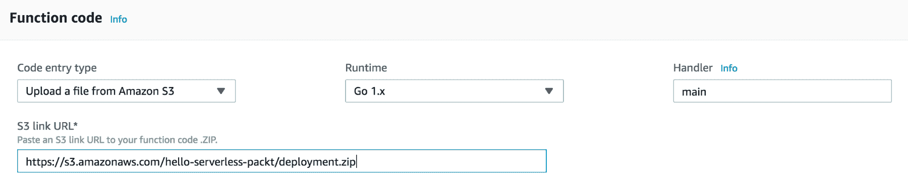

保存后，您可以在 AWS Lambda 控制台中测试 Lambda 函数。

# 事件测试

以下步骤将演示如何从控制台调用 Lambda 函数：

1.  现在函数已部署，让我们通过单击控制台右上角的“测试”按钮，手动使用示例事件数据来调用它。

1.  选择“配置测试事件”会打开一个新窗口，其中有一个下拉菜单。下拉菜单中的项目是样本 JSON 事件模板，这些模板是 Lambda 可以消耗的源事件或触发器的模拟，以便测试其功能（回顾第一章，*Go Serverless*）：

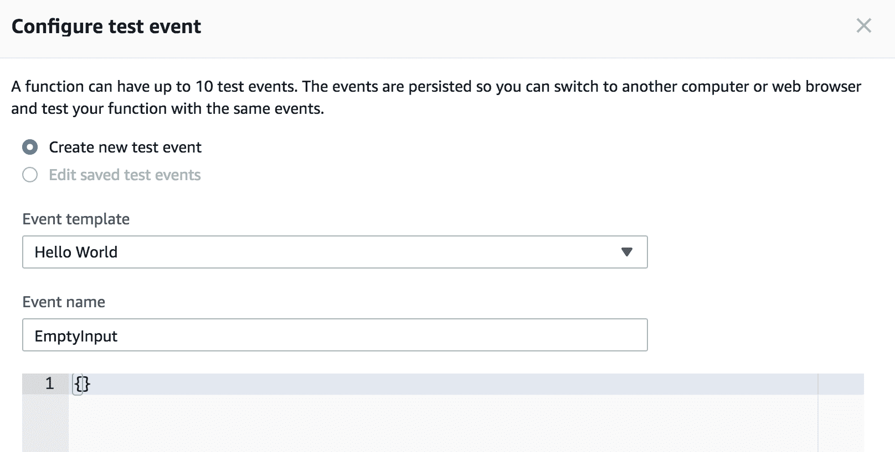

1.  保留默认的 Hello World 选项。输入事件名称并提供一个空的 JSON 对象：

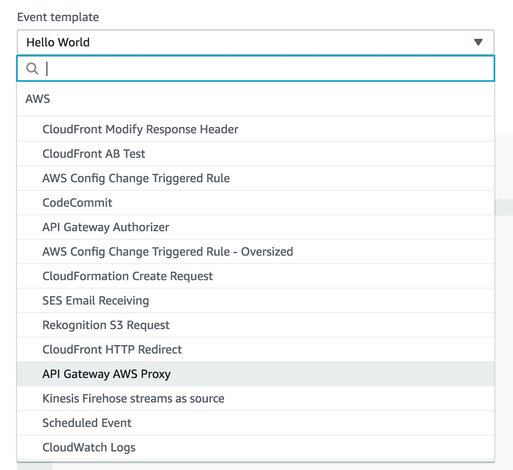

1.  选择创建。保存后，您应该在测试列表中看到 EmptyInput：

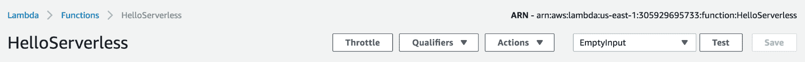

1.  再次单击“测试”按钮。AWS Lambda 将执行您的函数并显示以下输出：

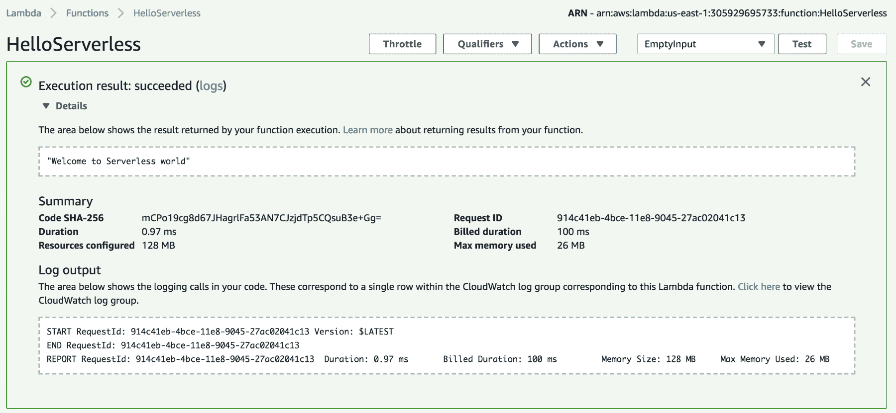

除了函数返回的结果外，我们还将能够看到“欢迎来到无服务器世界”，这是关于 Lambda 函数的资源使用和执行持续时间的全局概述，以及 Lambda 函数写入 CloudWatch 的日志。

将在第十一章中讨论使用 CloudWatch 指标进行高级监控以及使用 CloudWatch 日志和 CloudTrail 进行日志记录和故障排除。

恭喜！您刚刚设置并部署了您的第一个 Lambda 函数。当您使用触发器或源事件与 Lambda 函数一起使用时，Lambda 的真正力量就会显现出来，因此它会根据发生的事件执行。我们将在下一章中看看这一点。

# 摘要

在本章中，我们学习了如何从头开始使用 Go 编写 Lambda 函数。然后，我们介绍了如何为 Lambda 创建执行角色，以便将事件日志生成到 AWS CloudWatch。我们还学习了如何从 AWS Lambda 控制台手动测试和调用此函数。

在下一章中，我将向您介绍如何使用触发器自动调用 Lambda 函数，以及如何使用 AWS API Gateway 构建一个统一的 RESTful API 来执行 Lambda 函数以响应 HTTP 请求。

# 问题

1.  为 AWS Lambda 函数创建 IAM 角色的命令行命令是什么？

1.  在弗吉尼亚地区（*us-east-1*）创建一个新的 S3 存储桶并将 Lambda 部署包上传到其中的命令行命令是什么？

1.  Lambda 包大小限制是多少？

+   10 MB

+   50 MB

+   250 MB

1.  AWS Lambda 控制台支持编辑 Go 源代码。

+   True

+   False

1.  AWS Lambda 执行环境的基础是什么？

+   Amazon Linux 镜像

+   Microsoft Windows Server

1.  AWS Lambda 中如何表示事件？
