# 第四章：使用 API 网关设置 API 端点

在上一章中，我们学习了如何使用 Go 构建我们的第一个 Lambda 函数。我们还学习了如何从控制台手动调用它。为了利用 Lambda 的强大功能，在本章中，我们将学习如何在收到 HTTP 请求时触发这个 Lambda 函数（事件驱动架构）使用 AWS API 网关服务。在本章结束时，您将熟悉 API 网关高级主题，如资源、部署阶段、调试等。

我们将涵盖以下主题：

+   开始使用 API 网关

+   构建 RESTful API

# 技术要求

本章是上一章的后续内容，因此建议先阅读上一章，以便轻松地理解本部分。此外，需要对 RESTful API 设计和实践有基本的了解。本章的代码包托管在 GitHub 上，网址为[`github.com/PacktPublishing/Hands-On-Serverless-Applications-with-Go`](https://github.com/PacktPublishing/Hands-On-Serverless-Applications-with-Go)。

# 开始使用 API 网关

API 网关是 AWS 无服务器 API 代理服务，允许您为所有 Lambda 函数创建一个单一且统一的入口点。它代理和路由传入的 HTTP 请求到适当的 Lambda 函数（映射）。从服务器端的角度来看，它是一个外观或包装器，位于 Lambda 函数的顶部。但是，从客户端的角度来看，它只是一个单一的单片应用程序。

除了为客户端提供单一接口和可伸缩性外，API 网关还提供了以下强大功能：

+   **缓存**：您可以缓存端点响应，从而减少对 Lambda 函数的请求次数（成本优化）并增强响应时间。

+   **CORS 配置**：默认情况下，浏览器拒绝从不同域的资源访问。可以通过在 API 网关中启用**跨域资源共享**（**CORS**）来覆盖此策略。

CORS 将在第九章中深入讨论，*使用 S3 构建前端*，并提供一个实际示例。

+   **部署阶段/生命周期**：您可以管理和维护多个 API 版本和环境（沙盒、QA、暂存和生产）。

+   **监控**：通过启用与 API 网关的 CloudWatch 集成，简化故障排除和调试传入请求和传出响应。它将推送一系列日志事件到 AWS CloudWatch 日志，并且您可以向 CloudWatch 公开一组指标，包括：

+   客户端错误，包括 4XX 和 5XX 状态代码

+   在给定周期内的 API 请求总数

+   端点响应时间（延迟）

+   **可视化编辑**：您可以直接从控制台描述 API 资源和方法，而无需任何编码或 RESTful API 知识。

+   **文档**：您可以为 API 的每个版本生成 API 文档，并具有导入/导出和发布文档到 Swagger 规范的能力。

+   **安全和身份验证**：您可以使用 IAM 角色和策略保护您的 RESTful API 端点。API 网关还可以充当防火墙，防止 DDoS 攻击和 SQL/脚本注入。此外，可以在此级别强制执行速率限制或节流。

以上是足够的理论。在下一节中，我们将介绍如何设置 API 网关以在收到 HTTP 请求时触发我们的 Lambda 函数。

除了支持 AWS Lambda 外，API 网关还可用于响应 HTTP 请求调用其他 AWS 服务（EC2、S3、Kinesis、CloudFront 等）或外部 HTTP 端点。

# 设置 API 端点

以下部分描述了如何使用 API 网关触发 Lambda 函数：

1.  要设置 API 端点，请登录到**AWS 管理控制台**（[`console.aws.amazon.com/console/home`](https://console.aws.amazon.com/console/home)），转到 AWS Lambda 控制台，并选择我们在上一章节中构建的 Lambda 函数 HelloServerless：

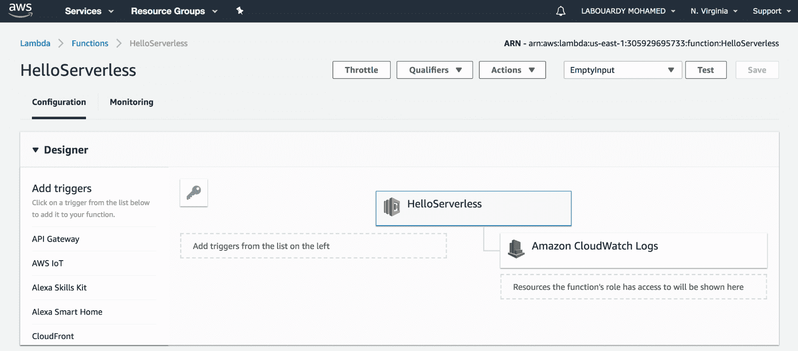

1.  从可用触发器列表中搜索 API 网关并单击它：

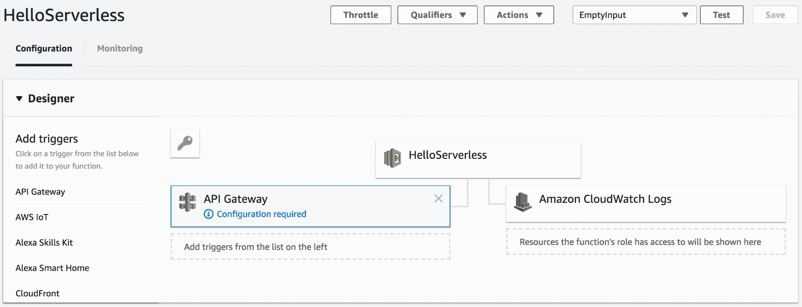

可用触发器的列表可能会根据您使用的 AWS 区域而变化，因为 AWS Lambda 支持的源事件并不在所有 AWS 区域都可用。

1.  页面底部将显示一个“配置触发器”部分，如下面的屏幕截图所示：

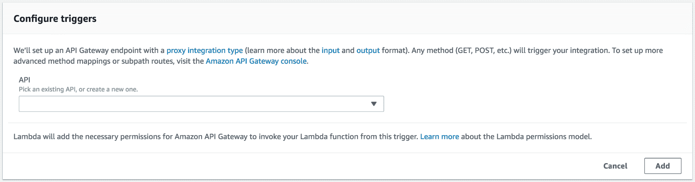

1.  创建一个新的 API，为其命名，将部署阶段设置为`staging`，并将 API 公开给公众：

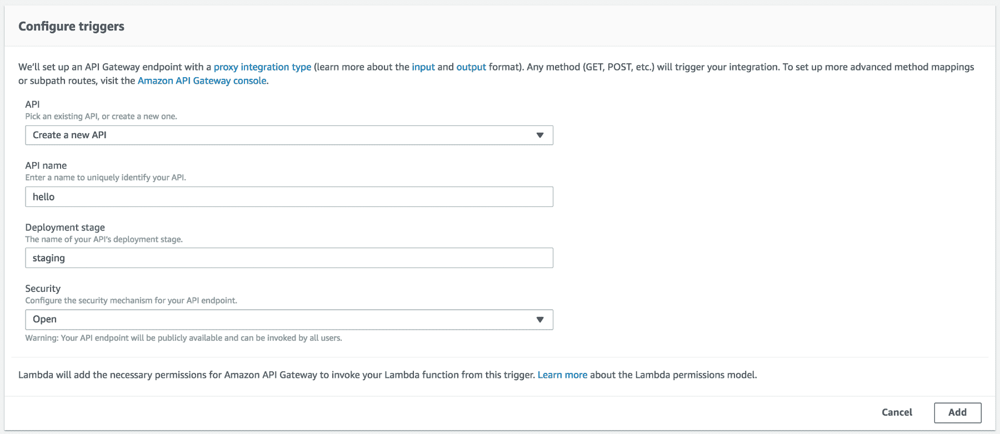

表格将需要填写以下参数：

+   **API 名称**：API 的唯一标识符。

+   **部署阶段**：API 阶段环境，有助于分隔和维护不同的 API 环境（开发、staging、生产等）和版本/发布（主要、次要、测试等）。此外，如果实施了持续集成/持续部署流水线，它非常方便。

+   **安全性**：它定义了 API 端点是公开还是私有：

+   **开放**：可公开访问，任何人都可以调用

+   **AWS IAM**：将由被授予 IAM 权限的用户调用

+   **使用访问密钥打开**：需要 AWS 访问密钥才能调用

1.  定义 API 后，将显示以下部分：

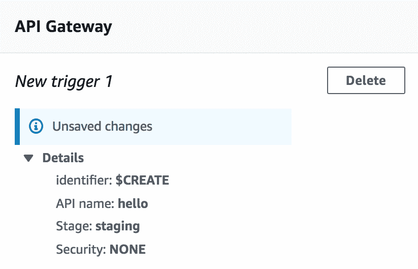

1.  单击页面顶部的“保存”按钮以创建 API 网关触发器。保存后，API 网关调用 URL 将以以下格式生成：`https://API_ID.execute-api.AWS_REGION.amazonaws.com/DEPLOYMENT_STAGE/FUNCTION_NAME`，如下面的屏幕截图所示：

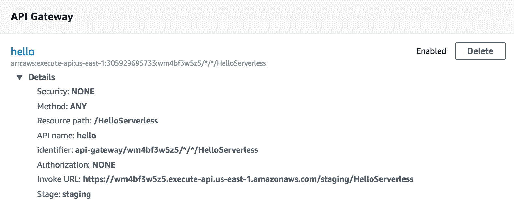

1.  使用 API 调用 URL 在您喜欢的浏览器中打开，您应该会看到如下屏幕截图中所示的消息：

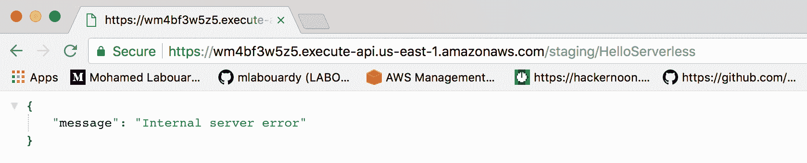

1.  内部服务器错误消息意味着 Lambda 方面出现了问题。为了帮助我们解决问题并调试问题，我们将在 API 网关中启用日志记录功能。

# 调试和故障排除

为了解决 API 网关服务器错误，我们需要按照以下步骤启用日志记录：

1.  首先，我们需要授予 API 网关访问 CloudWatch 的权限，以便能够将 API 网关日志事件推送到 CloudWatch 日志中。因此，我们需要从身份和访问管理中创建一个新的 IAM 角色。

为了避免重复，有些部分已被跳过。如果您需要逐步操作，请确保您已经从上一章节开始。

下面的屏幕截图将让您了解如何创建 IAM 角色：

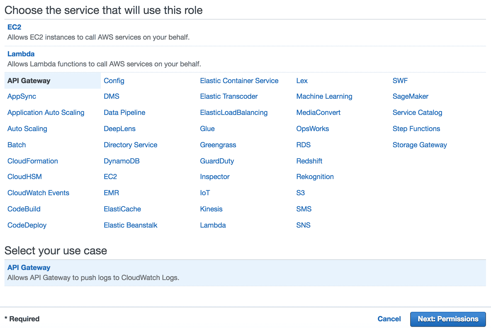

1.  从 AWS 服务列表中选择 API 网关，然后在权限页面上，您可以执行以下操作之一：

+   选择一个名为 AmazonAPIGatewayPushToCloudWatchLogs 的现有策略，如下面的屏幕截图所示：

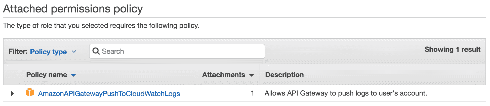

+   +   创建一个新的策略文档，其中包含以下 JSON：

```go
{
 "Version": "2012-10-17",
 "Statement": [
 {
 "Effect": "Allow",
     "Action": [
        "logs:CreateLogGroup",
        "logs:CreateLogStream",
        "logs:DescribeLogGroups",
        "logs:DescribeLogStreams",
        "logs:PutLogEvents",
        "logs:GetLogEvents",
        "logs:FilterLogEvents"
      ],
      "Resource": "*"
    }
  ]
}
```

1.  接下来，为角色指定一个名称，并将角色 ARN（Amazon 资源名称）复制到剪贴板上：

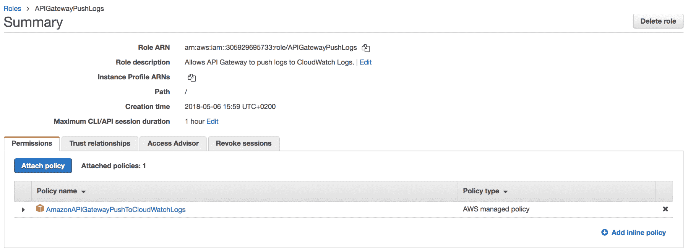

1.  然后，从“网络和内容传递”部分选择 API 网关。单击“设置”，粘贴我们之前创建的 IAM 角色 ARN：

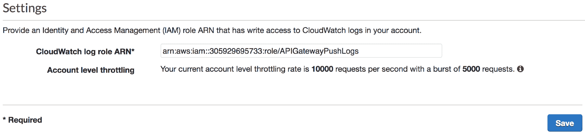

1.  保存并选择由 Lambda 函数创建的 API。在导航窗格中单击“阶段”：

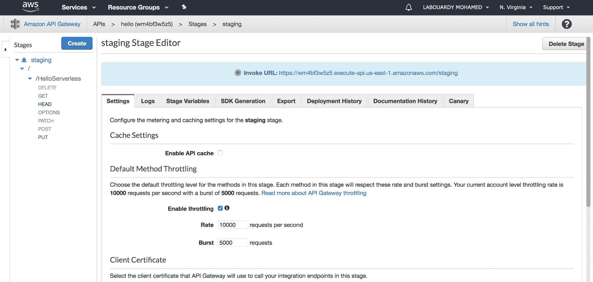

1.  然后，点击日志选项卡，在 CloudWatch 设置下，点击启用 CloudWatch 日志，并选择要捕获的日志级别。在这种情况下，我们对错误日志感兴趣：

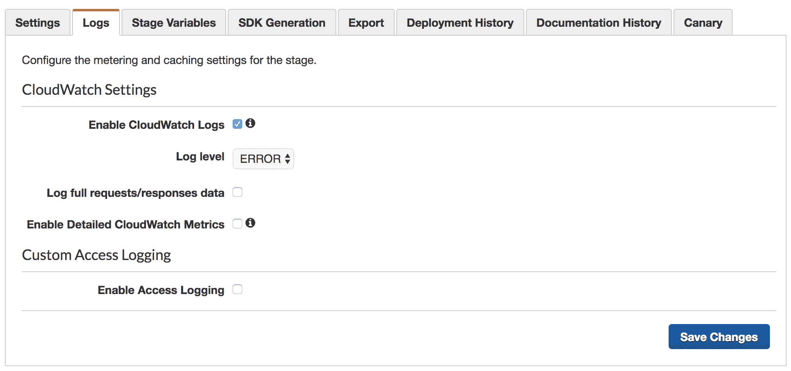

1.  尝试使用 API URL 再次调用 Lambda，并跳转到 AWS CloudWatch 日志控制台；您会看到已创建了一个新的日志组，格式为*API-Gateway-Execution-Logs_AP_ID/DEPLOYMENT_STAGE*：

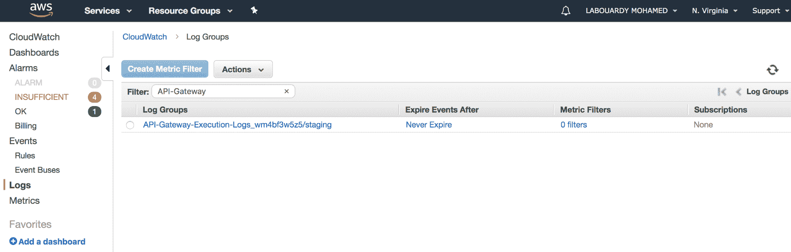

1.  点击日志组，您将看到 API 网关生成的日志流：

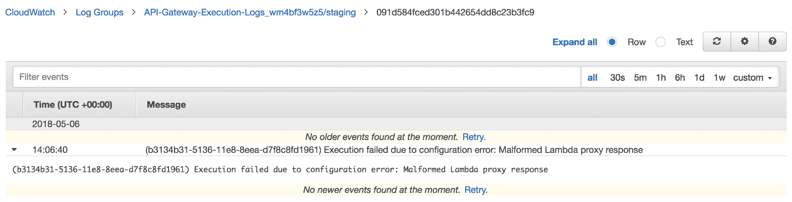

1.  前面的日志表明，从 Lambda 函数返回的响应格式不正确。正确的响应格式应包含以下属性：

+   **Body**：这是一个必需的属性，包含函数的实际输出。

+   **状态码**：这是函数响应状态码，如 HTTP/1.1 标准中所述([`tools.ietf.org/html/rfc7231#section-6`](https://tools.ietf.org/html/rfc7231#section-6))。这是强制性的，否则 API 网关将显示 5XX 错误，如前一节所示。

+   **可选参数**：它包括`Headers`和`IsBase64Encoded`等内容。

在接下来的部分中，我们将通过格式化 Lambda 函数返回的响应来修复此错误响应，以满足 API 网关期望的格式。

# 使用 HTTP 请求调用函数

如前一节所示，我们需要修复 Lambda 函数返回的响应。我们将返回一个包含实际字符串值的`struct`变量，以及一个`StatusCode`，其值为`200`，告诉 API 网关请求成功。为此，更新`main.go`文件以匹配以下签名：

```go
package main

import "github.com/aws/aws-lambda-go/lambda"

type Response struct {    
  StatusCode int `json:"statusCode"`
  Body string `json:"body"`
}

func handler() (Response, error) {
  return Response{
    StatusCode: 200,
    Body: "Welcome to Serverless world",
  }
, nil
}

func main() {
  lambda.Start(handler)
} 
```

更新后，使用上一章节提供的 Shell 脚本构建部署包，并使用 AWS Lambda 控制台上传包到 Lambda，或使用以下 AWS CLI 命令：

```go
aws lambda update-function-code --function-name HelloServerless \
 --zip-file fileb://./deployment.zip \
 --region us-east-1
```

确保您授予 IAM 用户`lambda:CreateFunction`和`lambda:UpdateFunctionCode`权限，以便在本章节中使用 AWS 命令行。

返回到您的网络浏览器，并再次调用 API 网关 URL：

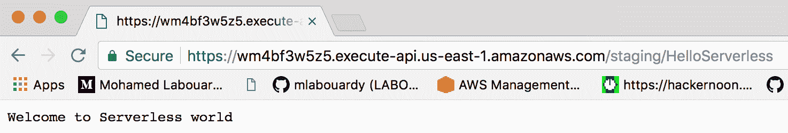

恭喜！您刚刚使用 Lambda 和 API 网关构建了您的第一个事件驱动函数。

供快速参考，Lambda Go 包提供了一种更容易地将 Lambda 与 API 网关集成的方法，即使用`APIGatewayProxyResponse`结构。

```go
package main

import (
  "github.com/aws/aws-lambda-go/events"
  "github.com/aws/aws-lambda-go/lambda"
)

func handler() (events.APIGatewayProxyResponse, error) {
  return events.APIGatewayProxyResponse{
    StatusCode: 200,
    Body: "Welcome to Serverless world",
  }, nil
}

func main() {
  lambda.Start(handler)
}
```

现在我们知道如何在响应 HTTP 请求时调用 Lambda 函数，让我们进一步构建一个带有 API 网关的 RESTful API。

# 构建 RESTful API

在本节中，我们将从头开始设计、构建和部署一个 RESTful API，以探索涉及 Lambda 和 API 网关的一些高级主题。

# API 架构

在进一步详细介绍架构之前，我们将看一下一个 API，它将帮助本地电影租赁店管理其可用电影。以下图表显示了 API 网关和 Lambda 如何适应 API 架构：

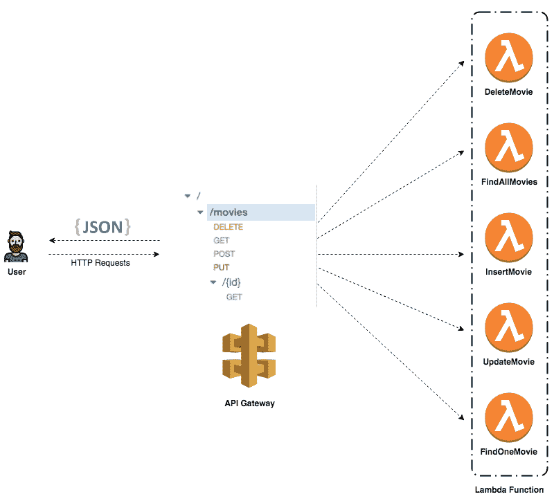

AWS Lambda 赋予了微服务开发的能力。也就是说，每个端点触发不同的 Lambda 函数。这些函数彼此独立，可以用不同的语言编写。因此，这导致了在函数级别的扩展、更容易的单元测试和松散的耦合。

所有来自客户端的请求首先经过 API 网关。然后将传入的请求相应地路由到正确的 Lambda 函数。

请注意，单个 Lambda 函数可以处理多个 HTTP 方法（`GET`，`POST`，`PUT`，`DELETE`等）。为了利用微服务的优势，我们将为每个功能创建多个 Lambda 函数。但是，构建一个单一的 Lambda 函数来处理多个端点可能是一个很好的练习。

# 端点设计

现在架构已经定义好了，我们将实现前面图表中描述的功能。

# GET 方法

要实现的第一个功能是列出电影。这就是`GET`方法发挥作用的地方。要执行此操作，需要参考以下步骤：

1.  创建一个 Lambda 函数来注册`findAll`处理程序。此处理程序将`movies`结构的列表转换为`string`，然后将此字符串包装在`APIGatewayProxyResponse`变量中，并返回带有 200 HTTP 状态代码的字符串。它还处理转换失败的错误。处理程序的实现如下：

```go
package main

import (
  "encoding/json"

  "github.com/aws/aws-lambda-go/events"
  "github.com/aws/aws-lambda-go/lambda"
)

var movies = []struct {
  ID int `json:"id"`
  Name string `json:"name"`
}{
    {
      ID: 1,
      Name: "Avengers",
    },
    {
      ID: 2,
      Name: "Ant-Man",
    },
    {
      ID: 3,
      Name: "Thor",
    },
    {
      ID: 4,
      Name: "Hulk",
    }, {
      ID: 5,
      Name: "Doctor Strange",
    },
}

func findAll() (events.APIGatewayProxyResponse, error) {
  response, err := json.Marshal(movies)
  if err != nil {
    return events.APIGatewayProxyResponse{}, err
  }

  return events.APIGatewayProxyResponse{
    StatusCode: 200,
    Headers: map[string]string{
      "Content-Type": "application/json",
    },
    Body: string(response),
  }, nil
}

func main() {
  lambda.Start(findAll)
}
```

您可以使用`net/http` Go 包而不是硬编码 HTTP 状态代码，并使用内置的状态代码变量，如`http.StatusOK`，`http.StatusCreated`，`http.StatusBadRequest`，`http.StatusInternalServerError`等。

1.  然后，在构建 ZIP 文件后，使用 AWS CLI 创建一个新的 Lambda 函数：

```go
aws lambda create-function --function-name FindAllMovies \
 --zip-file fileb://./deployment.zip \
 --runtime go1.x --handler main \
 --role arn:aws:iam::ACCOUNT_ID:role/FindAllMoviesRole \
 --region us-east-1
```

`FindAllMoviesRole`应该事先创建，如前一章所述，具有允许流式传输 Lambda 日志到 AWS CloudWatch 的权限。

1.  返回 AWS Lambda 控制台；您应该看到函数已成功创建：

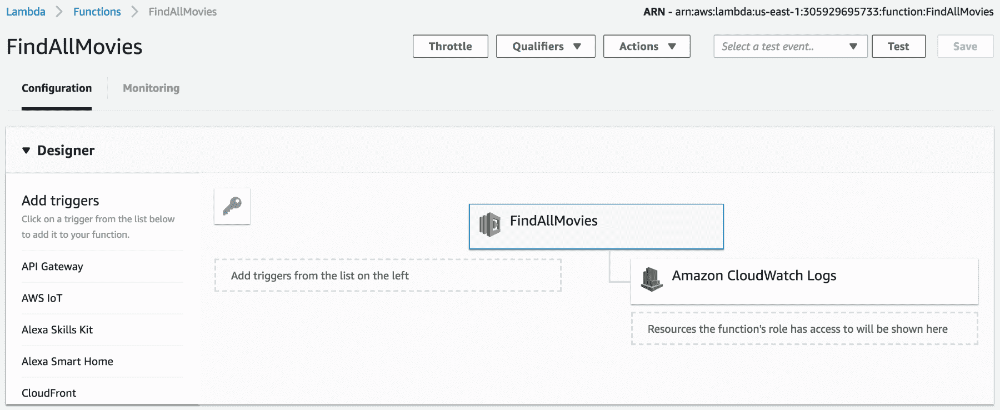

1.  创建一个带有空 JSON 的示例事件，因为该函数不需要任何参数，并单击“测试”按钮：

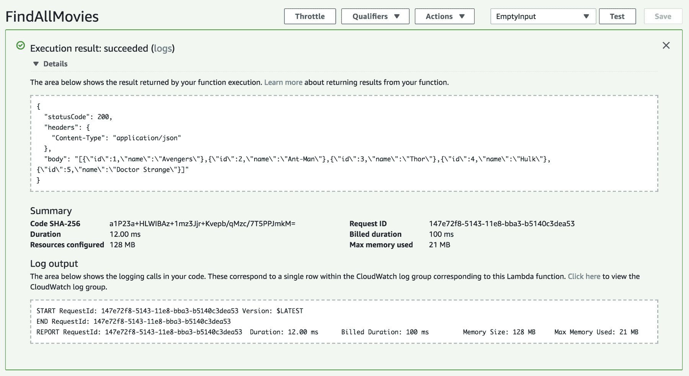

您会注意到在前一个屏幕截图中，该函数以 JSON 格式返回了预期的输出。

1.  现在函数已经定义好了，我们需要创建一个新的 API 网关来触发它：

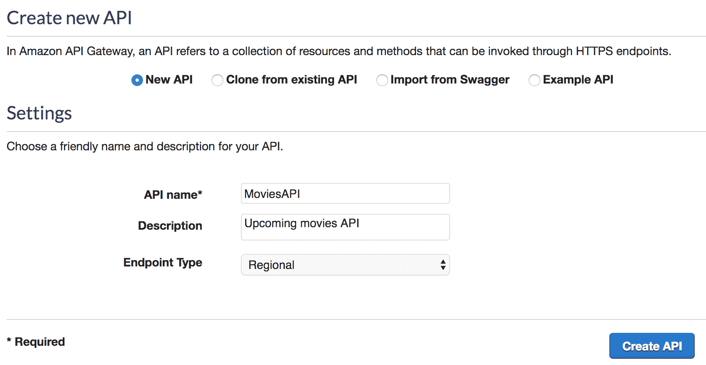

1.  接下来，从“操作”下拉列表中选择“创建资源”，并将其命名为 movies：

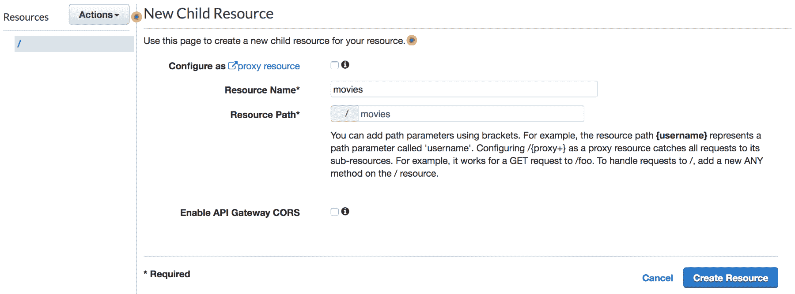

1.  通过单击“创建方法”在`/movies`资源上公开一个 GET 方法。在“集成类型”部分下选择 Lambda 函数，并选择*FindAllMovies*函数：

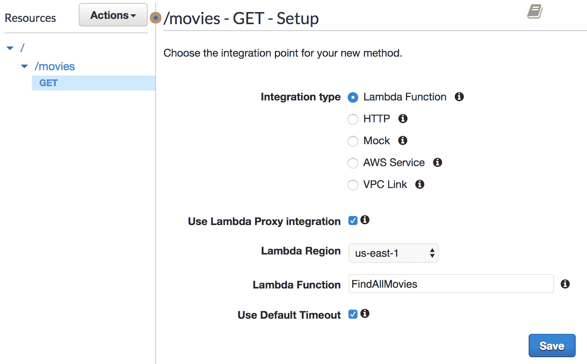

1.  要部署 API，请从“操作”下拉列表中选择“部署 API”。您将被提示创建一个新的部署阶段：

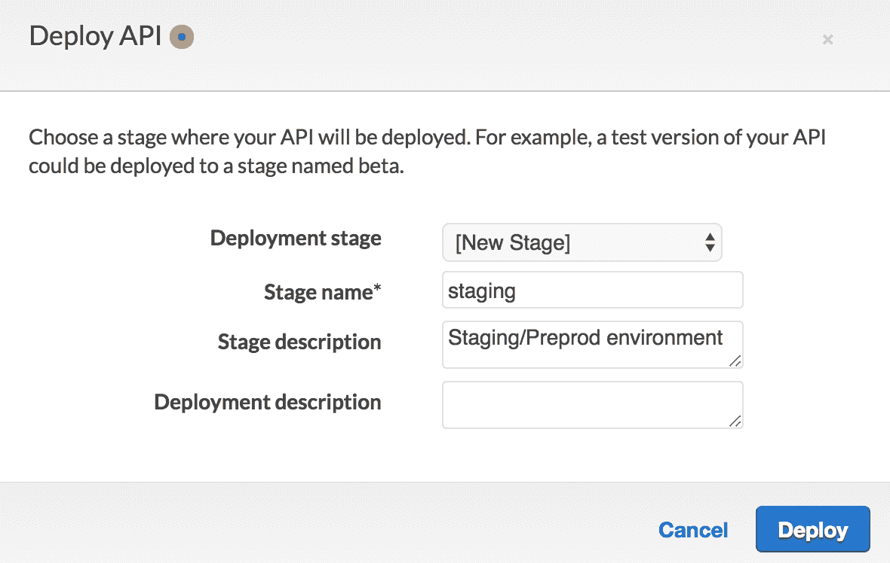

1.  创建部署阶段后，将显示一个调用 URL：

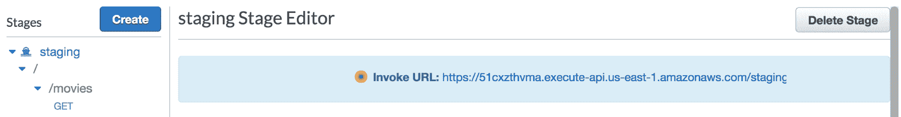

1.  将浏览器指向给定的 URL，或者使用像 Postman 或 Insomnia 这样的现代 REST 客户端。我选择使用 cURL 工具，因为它默认安装在几乎所有操作系统上：

```go
curl -sX GET https://51cxzthvma.execute-api.us-east-1.amazonaws.com/staging/movies | jq '.'
```

上述命令将以 JSON 格式返回电影列表：

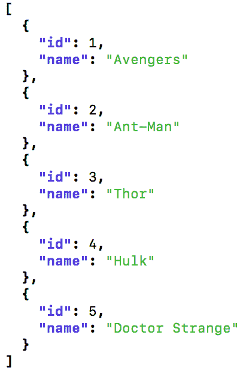

当调用`GET`端点时，请求将通过 API 网关，触发`findAll`处理程序。这将返回一个以 JSON 格式代理给客户端的响应。

现在`findAll`函数已经部署，我们可以实现一个`findOne`函数来按其 ID 搜索电影。

# 带参数的 GET 方法

`findOne`处理程序期望包含事件输入的`APIGatewayProxyRequest`参数。然后，它使用`PathParameters`方法获取电影 ID 并验证它。如果提供的 ID 不是有效数字，则`Atoi`方法将返回错误，并将 500 错误代码返回给客户端。否则，将根据索引获取电影，并以包含`APIGatewayProxyResponse`的 200 OK 状态返回给客户端：

```go
...

func findOne(req events.APIGatewayProxyRequest) (events.APIGatewayProxyResponse, error) {
  id, err := strconv.Atoi(req.PathParameters["id"])
  if err != nil {
    return events.APIGatewayProxyResponse{
      StatusCode: 500,
      Body:       "ID must be a number",
    }, nil
  }

  response, err := json.Marshal(movies[id-1])
  if err != nil {
    return events.APIGatewayProxyResponse{
      StatusCode: 500,
      Body:       err.Error(),
    }, nil
  }

  return events.APIGatewayProxyResponse{
    StatusCode: 200,
    Headers: map[string]string{
      "Content-Type": "application/json",
    },
    Body: string(response),
  }, nil
}

func main() {
  lambda.Start(findOne)
}
```

请注意，在上述代码中，我们使用了处理错误的两种方法。第一种是`err.Error()`方法，当编码失败时返回内置的 Go 错误消息。第二种是用户定义的错误，它是特定于错误的，易于从客户端的角度理解和调试。

类似于`FindAllMovies`函数，为搜索电影创建一个新的 Lambda 函数：

```go
aws lambda create-function --function-name FindOneMovie \
 --zip-file fileb://./deployment.zip \
 --runtime go1.x --handler main \
 --role arn:aws:iam::ACCOUNT_ID:role/FindOneMovieRole \
 --region us-east-1
```

返回 API Gateway 控制台，创建一个新资源，并公开`GET`方法，然后将资源链接到`FindOneMovie`函数。请注意路径中的`{id}`占位符的使用。`id`的值将通过`APIGatewayProxyResponse`对象提供。以下屏幕截图描述了这一点：

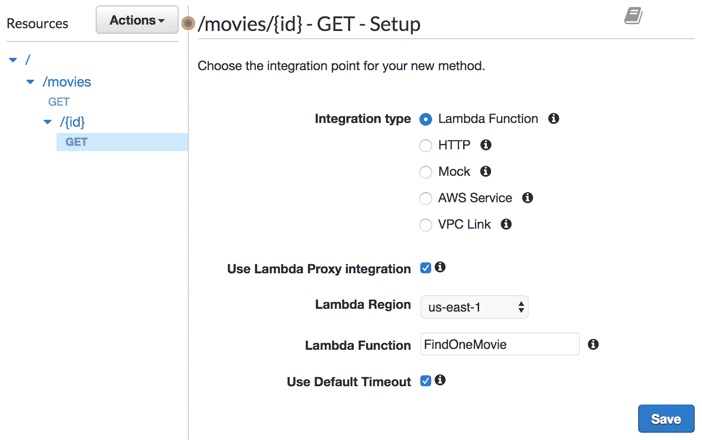

重新部署 API，并使用以下 cURL 命令测试端点：

```go
curl -sX https://51cxzthvma.execute-api.us-east-1.amazonaws.com/staging/movies/1 | jq '.' 
```

将返回以下 JSON：

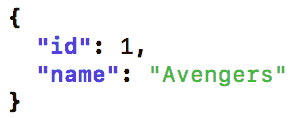

当使用 ID 调用 API URL 时，如果存在，将返回与 ID 对应的电影。

# POST 方法

现在我们知道了如何使用路径参数和不使用路径参数来使用 GET 方法。下一步将是通过 API Gateway 向 Lambda 函数传递 JSON 有效负载。代码是不言自明的。它将请求输入转换为电影结构，将其添加到电影列表中，并以 JSON 格式返回新的电影列表：

```go
package main

import (
  "encoding/json"

  "github.com/aws/aws-lambda-go/events"
  "github.com/aws/aws-lambda-go/lambda"
)

type Movie struct {
  ID int `json:"id"`
  Name string `json:"name"`
}

var movies = []Movie{
  Movie{
    ID: 1,
    Name: "Avengers",
  },
  ...
}

func insert(req events.APIGatewayProxyRequest) (events.APIGatewayProxyResponse, error) {
  var movie Movie
  err := json.Unmarshal([]byte(req.Body), &movie)
  if err != nil {
    return events.APIGatewayProxyResponse{
      StatusCode: 400,
      Body: "Invalid payload",
    }, nil
  }

  movies = append(movies, movie)

  response, err := json.Marshal(movies)
  if err != nil {
    return events.APIGatewayProxyResponse{
      StatusCode: 500,
      Body: err.Error(),
    }, nil
  }

  return events.APIGatewayProxyResponse{
    StatusCode: 200,
    Headers: map[string]string{
      "Content-Type": "application/json",
    },
    Body: string(response),
  }, nil
}

func main() {
  lambda.Start(insert)
}
```

接下来，使用以下命令为`InsertMovie`创建一个新的 Lambda 函数*：*

```go
aws lambda create-function --function-name InsertMovie \
 --zip-file fileb://./deployment.zip \
 --runtime go1.x --handler main \
 --role arn:aws:iam::ACCOUNT_ID:role/InsertMovieRole \
 --region us-east-1
```

接下来，在`/movies`资源上创建一个`POST`方法，并将其链接到`InsertMovie`函数：

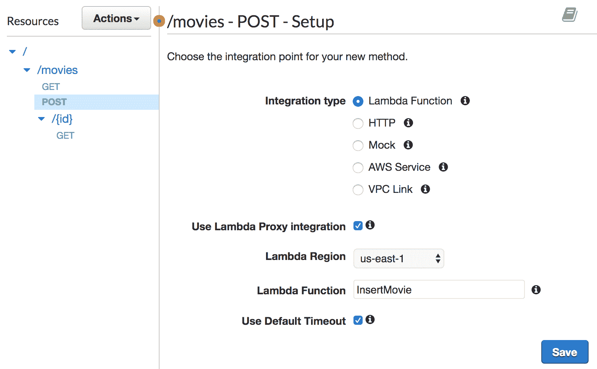

要测试它，使用以下 cURL 命令，使用`POST`动词和`-d`标志，后跟 JSON 字符串（带有`id`和`name`属性）：

```go
curl -sX POST -d '{"id":6, "name": "Spiderman:Homecoming"}' https://51cxzthvma.execute-api.us-east-1.amazonaws.com/staging/movies | jq '.'
```

上述命令将返回以下 JSON 响应：

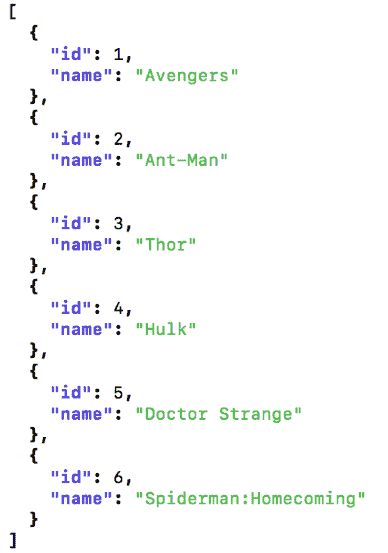

如您所见，新电影已成功插入。如果再次测试，它应该按预期工作：

```go
curl -sX POST -d '{"id":7, "name": "Iron man"}' https://51cxzthvma.execute-api.us-east-1.amazonaws.com/staging/movies | jq '.'
```

上述命令将返回以下 JSON 响应：

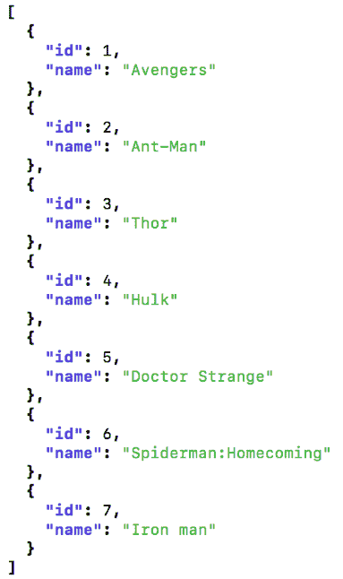

如您所见，它成功了，并且电影再次按预期插入，但是如果我们等待几分钟并尝试插入第三部电影会怎样？以下命令将用于再次执行它：

```go
curl -sX POST -d '{"id":8, "name": "Captain America"}' https://51cxzthvma.execute-api.us-east-1.amazonaws.com/staging/movies | jq '.'

```

再次，将返回一个新的 JSON 响应：

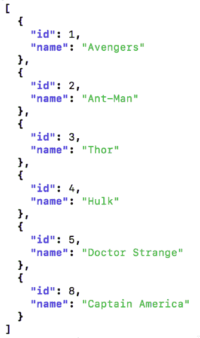

您会发现 ID 为 6 和 7 的电影已被移除；为什么会这样？很简单。如果您还记得第一章中的*Go Serverless*，Lambda 函数是无状态的。当第一次调用`InsertMovie`函数（第一次插入）时，AWS Lambda 会创建一个容器并将函数有效负载部署到容器中。然后，在被终止之前保持活动状态几分钟（**热启动**），这就解释了为什么第二次插入会成功。在第三次插入中，容器已经被终止，因此 Lambda 会创建一个新的容器（**冷启动**）来处理插入。

因此，之前的状态已丢失。以下图表说明了冷/热启动问题：

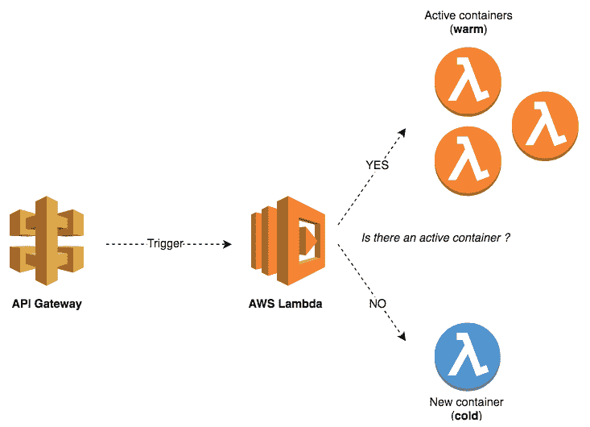

这解释了为什么 Lambda 函数应该是无状态的，以及为什么我们不应该假设状态会从一次调用到下一次调用中保留。那么，在处理无服务器应用程序时，我们如何管理数据持久性呢？答案是使用 DynamoDB 等外部数据库，这将是即将到来的章节的主题。

# 总结

在本章中，您学习了如何使用 Lambda 和 API Gateway 从头开始构建 RESTful API。我们还介绍了如何通过启用 CloudWatch 日志功能来调试和解决传入的 API Gateway 请求，以及如何创建 API 部署阶段以及如何创建具有不同 HTTP 方法的多个端点。最后，我们了解了冷/热容器问题以及为什么 Lambda 函数应该是无状态的。

在接下来的章节中，我们将使用 DynamoDB 作为数据库，为我们的 API 管理数据持久性。
