# 使用 DynamoDB 管理数据持久性

在上一章中，我们学习了如何使用 Lambda 和 API Gateway 构建 RESTful API，并发现了为什么 Lambda 函数应该是无状态的。在本章中，我们将使用 AWS DynamoDB 解决无状态问题。此外，我们还将看到如何将其与 Lambda 函数集成。

我们将涵盖以下主题：

+   设置 DynamoDB

+   使用 DynamoDB

# 技术要求

本章是上一章的后续，因为它将使用相同的源代码。因此，为避免重复，某些代码片段将不予解释。此外，最好具备 NoSQL 概念的基本知识，以便您可以轻松地跟随本章。本章的代码包托管在 GitHub 上，网址为[`github.com/PacktPublishing/Hands-On-Serverless-Applications-with-Go`](https://github.com/PacktPublishing/Hands-On-Serverless-Applications-with-Go)。

# 设置 DynamoDB

DynamoDB 是 AWS 的 NoSQL 数据库。它是一个托管的 AWS 服务，允许您在不管理或维护数据库服务器的情况下按比例存储和检索数据。

在深入了解与 AWS Lambda 的集成之前，您需要了解一些关于 DynamoDB 的关键概念：

+   **结构和设计**：

+   **表**：这是一组项目（行），其中每个项目都是一组属性（列）和值。

+   **分区键**：也称为哈希键。这是 DynamoDB 用来确定可以找到项目的分区（物理位置）（读操作）或将存储项目的分区（写操作）的唯一 ID。可以使用排序键来对同一分区中的项目进行排序。

+   **索引**：与关系数据库类似，索引用于加速查询。在 DynamoDB 中，可以创建两种类型的索引：

+   **全局二级索引**（**GSI**）

+   **本地二级索引**（**LSI**）

+   **操作**：

+   **扫描**：顾名思义，此操作在返回所请求的项目之前扫描整个表。

+   **查询**：此操作根据主键值查找项目。

+   **PutItem**：这将创建一个新项目或用新项目替换旧项目。

+   **GetItem**：通过其主键查找项目。

+   **DeleteItem**：通过其主键在表中删除单个项目。

在性能方面，扫描操作效率较低，成本较高（消耗更多吞吐量），因为该操作必须遍历表中的每个项目以获取所请求的项目。因此，始终建议使用查询而不是扫描操作。

现在您熟悉了 DynamoDB 的术语，我们可以开始创建我们的第一个 DynamoDB 表来存储 API 项目。

# 创建表

要开始创建表，请登录 AWS 管理控制台（[`console.aws.amazon.com/console/home`](https://console.aws.amazon.com/console/home)）并从**数据库**部分选择 DynamoDB。点击**创建表**按钮以创建新的 DynamoDB 表，如下面的屏幕截图所示：

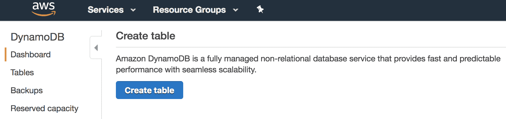

接下来，在下一个示例中为表命名为`movies`。由于每部电影将由唯一 ID 标识，因此它将是表的分区键。将所有其他设置保留为默认状态，然后点击创建，如下所示：

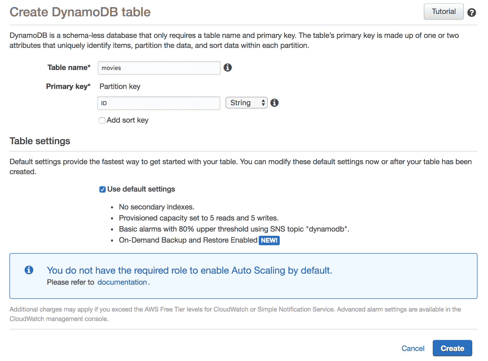

等待几秒钟，直到表被创建，如下所示：

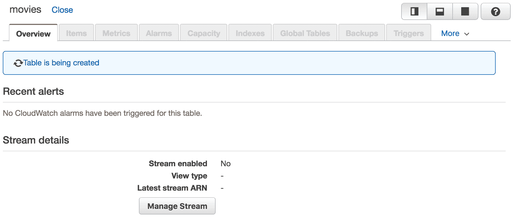

创建`movies`表后，将提示成功消息以确认其创建。现在，我们需要将示例数据加载到表中。

# 加载示例数据

要在`movies`表中填充项目，请点击**项目**选项卡：

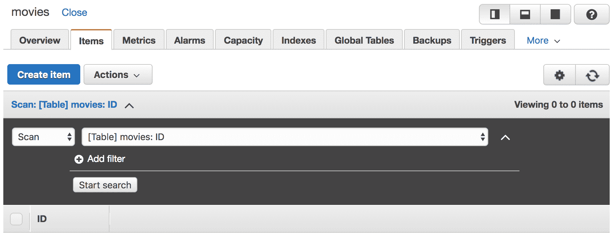

然后，点击**创建项目**并插入一个新电影，如下面的屏幕截图所示（您需要使用加号（+）按钮添加额外的列来存储电影名称）：

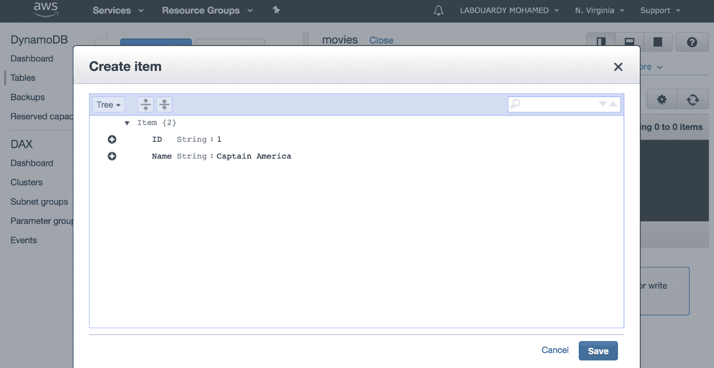

点击保存。表应该看起来像这样：

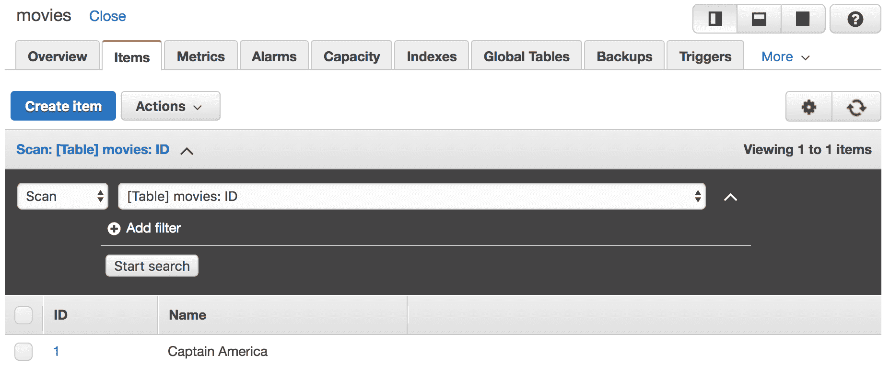

对于真实的应用程序，我们不会使用控制台来填充数百万条目。为了节省时间，我们将使用 AWS SDK 编写一个小型的 Go 应用程序来将项目加载到表中。

在 Go 工作区中创建一个新项目，并将以下内容复制到`init-db.go`文件中：

```go
func main() {
  cfg, err := external.LoadDefaultAWSConfig()
  if err != nil {
    log.Fatal(err)
  }

  movies, err := readMovies("movies.json")
  if err != nil {
    log.Fatal(err)
  }

  for _, movie := range movies {
    fmt.Println("Inserting:", movie.Name)
    err = insertMovie(cfg, movie)
    if err != nil {
      log.Fatal(err)
    }
  }

}
```

上述代码读取一个 JSON 文件（[`github.com/PacktPublishing/Hands-On-Serverless-Applications-with-Go/blob/master/ch5/movies.json`](https://github.com/PacktPublishing/Hands-On-Serverless-Applications-with-Go/blob/master/ch5/movies.json)），其中包含一系列电影；将其编码为`Movie`结构的数组，如下所示：

```go
func readMovies(fileName string) ([]Movie, error) {
  movies := make([]Movie, 0)

  data, err := ioutil.ReadFile(fileName)
  if err != nil {
    return movies, err
  }

  err = json.Unmarshal(data, &movies)
  if err != nil {
    return movies, err
  }

  return movies, nil
}
```

然后，它遍历电影数组中的每部电影。然后，使用`PutItem`方法将其插入 DynamoDB 表中，如下所示：

```go
func insertMovie(cfg aws.Config, movie Movie) error {
  item, err := dynamodbattribute.MarshalMap(movie)
  if err != nil {
    return err
  }

  svc := dynamodb.New(cfg)
  req := svc.PutItemRequest(&dynamodb.PutItemInput{
    TableName: aws.String("movies"),
    Item: item,
  })
  _, err = req.Send()
  if err != nil {
    return err
  }
  return nil
}
```

确保使用终端会话中的`go get github.com/aws/aws-sdk-go-v2/aws`命令安装 AWS Go SDK*.*

要加载`movies`表中的数据，请输入以下命令：

```go
AWS_REGION=us-east-1 go run init-db.go
```

您可以使用 DynamoDB 控制台验证加载到`movies`表中的数据，如下截图所示：

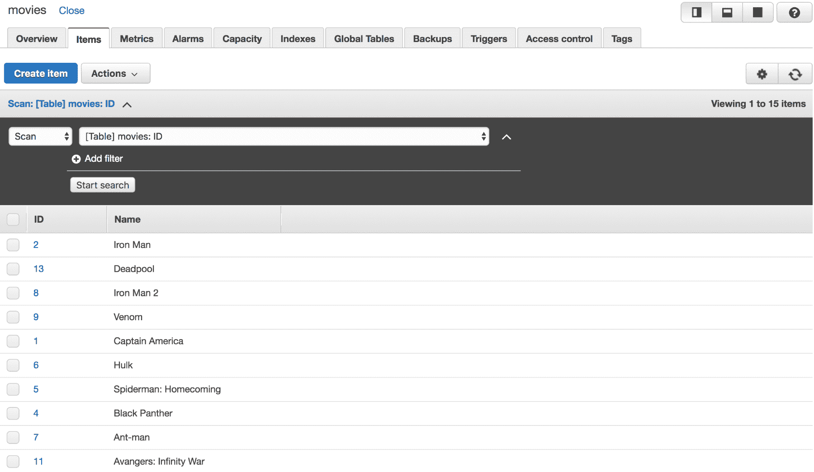

现在 DynamoDB 表已准备就绪，我们需要更新每个 API 端点函数的代码，以使用表而不是硬编码的电影列表。

# 使用 DynamoDB

在这一部分，我们将更新现有的函数，从 DynamoDB 表中读取和写入。以下图表描述了目标架构：

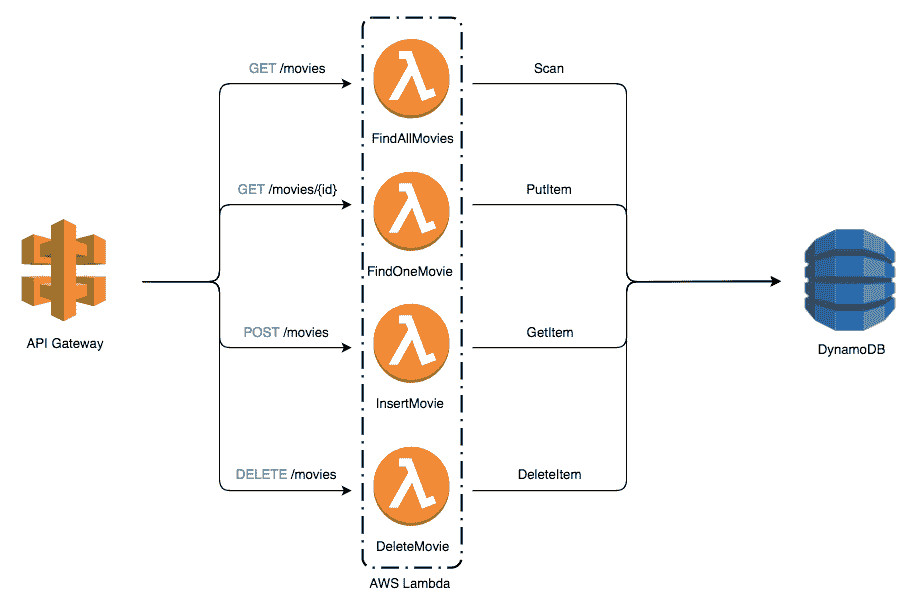

API Gateway 将转发传入的请求到目标 Lambda 函数，该函数将在`movies`表上调用相应的 DynamoDB 操作。

# 扫描请求

要开始，我们需要实现负责返回电影列表的函数；以下步骤描述了如何实现这一点：

1.  更新`findAll`处理程序端点以使用`Scan`方法从表中获取所有项目：

```go
func findAll() (events.APIGatewayProxyResponse, error) {
  cfg, err := external.LoadDefaultAWSConfig()
  if err != nil {
    return events.APIGatewayProxyResponse{
      StatusCode: http.StatusInternalServerError,
      Body: "Error while retrieving AWS credentials",
    }, nil
  }

  svc := dynamodb.New(cfg)
  req := svc.ScanRequest(&dynamodb.ScanInput{
    TableName: aws.String(os.Getenv("TABLE_NAME")),
  })
  res, err := req.Send()
  if err != nil {
    return events.APIGatewayProxyResponse{
      StatusCode: http.StatusInternalServerError,
      Body: "Error while scanning DynamoDB",
    }, nil
  }

  response, err := json.Marshal(res.Items)
  if err != nil {
    return events.APIGatewayProxyResponse{
      StatusCode: http.StatusInternalServerError,
      Body: "Error while decoding to string value",
    }, nil
  }

  return events.APIGatewayProxyResponse{
    StatusCode: 200,
    Headers: map[string]string{
      "Content-Type": "application/json",
    },
    Body: string(response),
  }, nil
}
```

此功能的完整实现可以在 GitHub 存储库中找到（[`github.com/PacktPublishing/Hands-On-Serverless-Applications-with-Go/blob/master/ch5/findAll/main.go`](https://github.com/PacktPublishing/Hands-On-Serverless-Applications-with-Go/blob/master/ch5/findAll/main.go)）。

1.  构建部署包，并使用以下 AWS CLI 命令更新`FindAllMovies` Lambda 函数代码：

```go
aws lambda update-function-code --function-name FindAllMovies \
 --zip-file fileb://./deployment.zip \
 --region us-east-1
```

1.  确保更新 FindAllMoviesRole，以授予 Lambda 函数调用 DynamoDB 表上的`Scan`操作的权限，方法是添加以下 IAM 策略：

```go
{
  "Version": "2012-10-17",
  "Statement": [
    {
      "Sid": "1",
      "Effect": "Allow",
      "Action": "dynamodb:Scan",
      "Resource": [
        "arn:aws:dynamodb:us-east-1:ACCOUNT_ID:table/movies/index/ID",
        "arn:aws:dynamodb:us-east-1:ACCOUNT_ID:table/movies"
      ]
    }
  ]
}
```

一旦策略分配给 IAM 角色，它应该成为附加策略的一部分，如下一张截图所示：

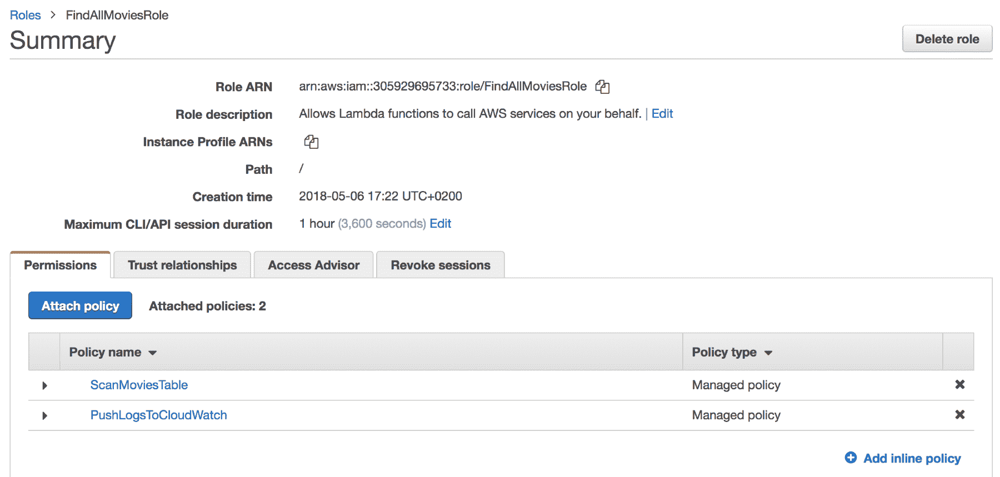

1.  最后，使用 Lambda 控制台或 AWS CLI，添加一个新的环境变量，指向我们之前创建的 DynamoDB 表名：

```go
aws lambda update-function-configuration --function-name FindAllMovies \
 --environment Variables={TABLE_NAME=movies} \
 --region us-east-1
```

下图显示了一个正确配置的 FindAllMovies 函数，具有对 DynamoDB 和 CloudWatch 的 IAM 访问权限，并具有定义的`TABLE_NAME`环境变量：

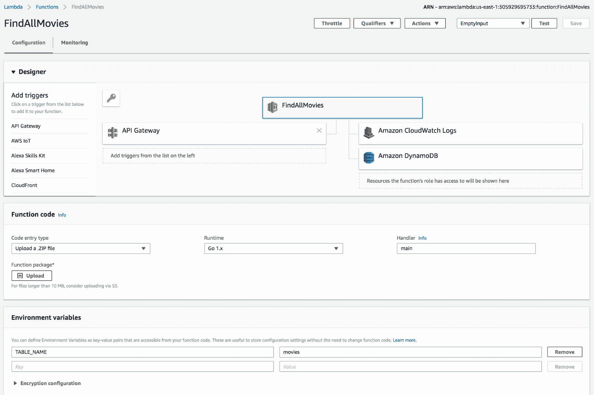

正确配置的 FindAllMovies 函数

1.  保存并使用以下 cURL 命令调用 API Gateway URL：

```go
curl -sX GET https://51cxzthvma.execute-api.us-east-1.amazonaws.com/staging/movies | jq '.'
```

1.  将以 JSON 格式返回一个数组，如下所示：

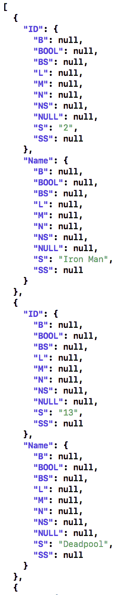

1.  端点正在工作，并从表中获取电影项目，但返回的 JSON 是原始的 DynamoDB 响应。我们将通过仅返回`ID`和`Name`属性来修复这个问题，如下所示：

```go
movies := make([]Movie, 0)
for _, item := range res.Items {
  movies = append(movies, Movie{
    ID: *item["ID"].S,
    Name: *item["Name"].S,
  })
}

response, err := json.Marshal(movies)
```

1.  此外，生成 ZIP 文件并更新 Lambda 函数代码，然后使用前面给出的 cURL 命令调用 API Gateway URL，如下所示：

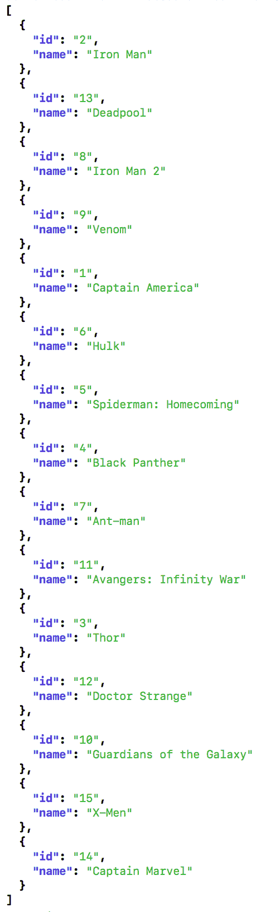

好多了，对吧？

# GetItem 请求

要实现的第二个功能将负责从 DynamoDB 返回单个项目，以下步骤说明了应该如何构建它：

1.  更新`findOne`处理程序以调用 DynamoDB 中的`GetItem`方法。这应该返回一个带有传递给 API 端点参数的标识符的单个项目：

```go
func findOne(request events.APIGatewayProxyRequest) (events.APIGatewayProxyResponse, error) {
  id := request.PathParameters["id"]

  cfg, err := external.LoadDefaultAWSConfig()
  if err != nil {
    return events.APIGatewayProxyResponse{
      StatusCode: http.StatusInternalServerError,
      Body: "Error while retrieving AWS credentials",
    }, nil
  }

  svc := dynamodb.New(cfg)
  req := svc.GetItemRequest(&dynamodb.GetItemInput{
    TableName: aws.String(os.Getenv("TABLE_NAME")),
    Key: map[string]dynamodb.AttributeValue{
      "ID": dynamodb.AttributeValue{
        S: aws.String(id),
      },
    },
  })
  res, err := req.Send()
  if err != nil {
    return events.APIGatewayProxyResponse{
      StatusCode: http.StatusInternalServerError,
      Body: "Error while fetching movie from DynamoDB",
    }, nil
  }

  ...
}
```

此函数的完整实现可以在 GitHub 存储库中找到（[`github.com/PacktPublishing/Hands-On-Serverless-Applications-with-Go/blob/master/ch5/findOne/main.go`](https://github.com/PacktPublishing/Hands-On-Serverless-Applications-with-Go/blob/master/ch5/findAll/main.go)）。

1.  与`FindAllMovies`函数类似，创建一个 ZIP 文件，并使用以下 AWS CLI 命令更新现有的 Lambda 函数代码：

```go
aws lambda update-function-code --function-name FindOneMovie \
 --zip-file fileb://./deployment.zip \
 --region us-east-1
```

1.  授予`FindOneMovie` Lambda 函数对`movies`表的`GetItem`权限的 IAM 策略：

```go
{
  "Version": "2012-10-17",
  "Statement": [
    {
      "Sid": "1",
      "Effect": "Allow",
      "Action": "dynamodb:GetItem",
      "Resource": "arn:aws:dynamodb:us-east-1:ACCOUNT_ID:table/movies"
    }
  ]
}
```

1.  IAM 角色应配置如下截图所示：

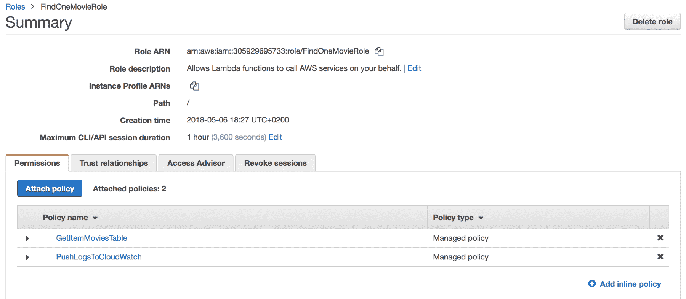

1.  使用 DynamoDB 表名定义一个新的环境变量：

```go
aws lambda update-function-configuration --function-name FindOneMovie \
 --environment Variables={TABLE_NAME=movies} \
 --region us-east-1
```

1.  返回`FindOneMovie`仪表板，并验证所有设置是否已配置，如下截图所示：

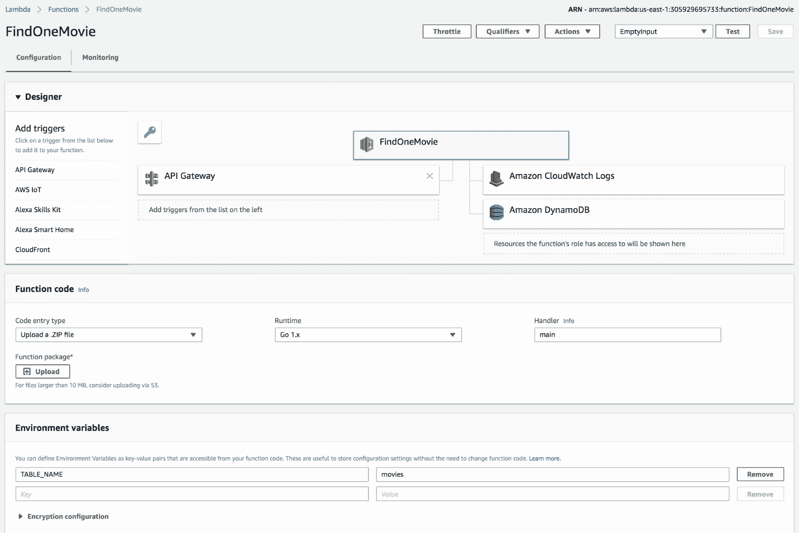

1.  通过发出以下 cURL 命令调用 API Gateway：

```go
curl -sX GET https://51cxzthvma.execute-api.us-east-1.amazonaws.com/staging/movies/3 | jq '.'
```

1.  如预期的那样，响应是一个具有 ID 为 3 的单个电影项目，如 cURL 命令中请求的那样：

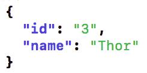

# PutItem 请求

到目前为止，我们已经学会了如何列出所有项目并从 DynamoDB 返回单个项目。以下部分描述了如何实现 Lambda 函数以将新项目添加到数据库中：

1.  更新`insert`处理程序以调用`PutItem`方法将新电影插入表中：

```go
func insert(request events.APIGatewayProxyRequest) (events.APIGatewayProxyResponse, error) {
  ...

  cfg, err := external.LoadDefaultAWSConfig()
  if err != nil {
    return events.APIGatewayProxyResponse{
      StatusCode: http.StatusInternalServerError,
      Body: "Error while retrieving AWS credentials",
    }, nil
  }

  svc := dynamodb.New(cfg)
  req := svc.PutItemRequest(&dynamodb.PutItemInput{
    TableName: aws.String(os.Getenv("TABLE_NAME")),
    Item: map[string]dynamodb.AttributeValue{
      "ID": dynamodb.AttributeValue{
        S: aws.String(movie.ID),
      },
      "Name": dynamodb.AttributeValue{
        S: aws.String(movie.Name),
      },
    },
  })
  _, err = req.Send()
  if err != nil {
    return events.APIGatewayProxyResponse{
      StatusCode: http.StatusInternalServerError,
      Body: "Error while inserting movie to DynamoDB",
    }, nil
  }

  ...
}
```

此函数的完整实现可以在 GitHub 存储库中找到（[`github.com/PacktPublishing/Hands-On-Serverless-Applications-with-Go/blob/master/ch5/insert/main.go`](https://github.com/PacktPublishing/Hands-On-Serverless-Applications-with-Go/blob/master/ch5/findAll/main.go)）。

1.  创建部署包，并使用以下命令更新`InsertMovie` Lambda 函数代码：

```go
aws lambda update-function-code --function-name InsertMovie \
 --zip-file fileb://./deployment.zip \
 --region us-east-1
```

1.  允许该函数在电影表上调用`PutItem`操作，并使用以下 IAM 策略：

```go
{
  "Version": "2012-10-17",
  "Statement": [
    {
      "Sid": "1",
      "Effect": "Allow",
      "Action": "dynamodb:PutItem",
      "Resource": "arn:aws:dynamodb:us-east-1:ACCOUNT_ID:table/movies"
    }
  ]
}
```

以下截图显示 IAM 角色已更新以处理`PutItem`操作的权限：

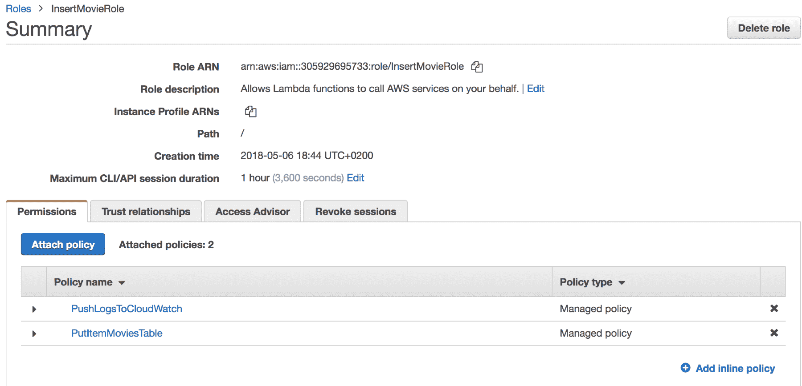

1.  创建一个新的环境变量，DynamoDB 表名如下：

```go
aws lambda update-function-configuration --function-name InsertMovie \
 --environment Variables={TABLE_NAME=movies} \
 --region us-east-1
```

1.  确保 Lambda 函数配置如下：

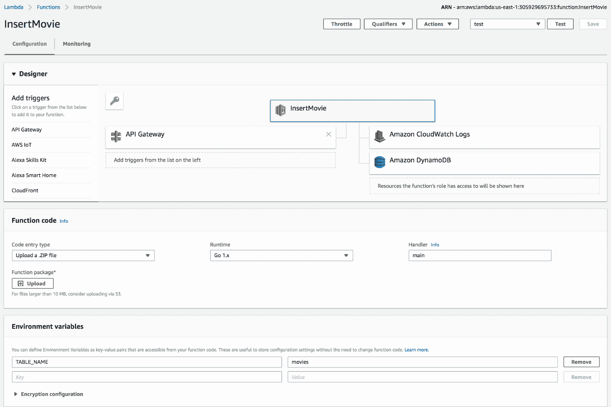

正确配置的 InsertMovie 函数

1.  通过在 API Gateway URL 上调用以下 cURL 命令插入新电影：

```go
curl -sX POST -d '{"id":"17", "name":"The Punisher"}' https://51cxzthvma.execute-api.us-east-1.amazonaws.com/staging/movies | jq '.'
```

1.  验证电影是否已插入 DynamoDB 控制台，如下截图所示：

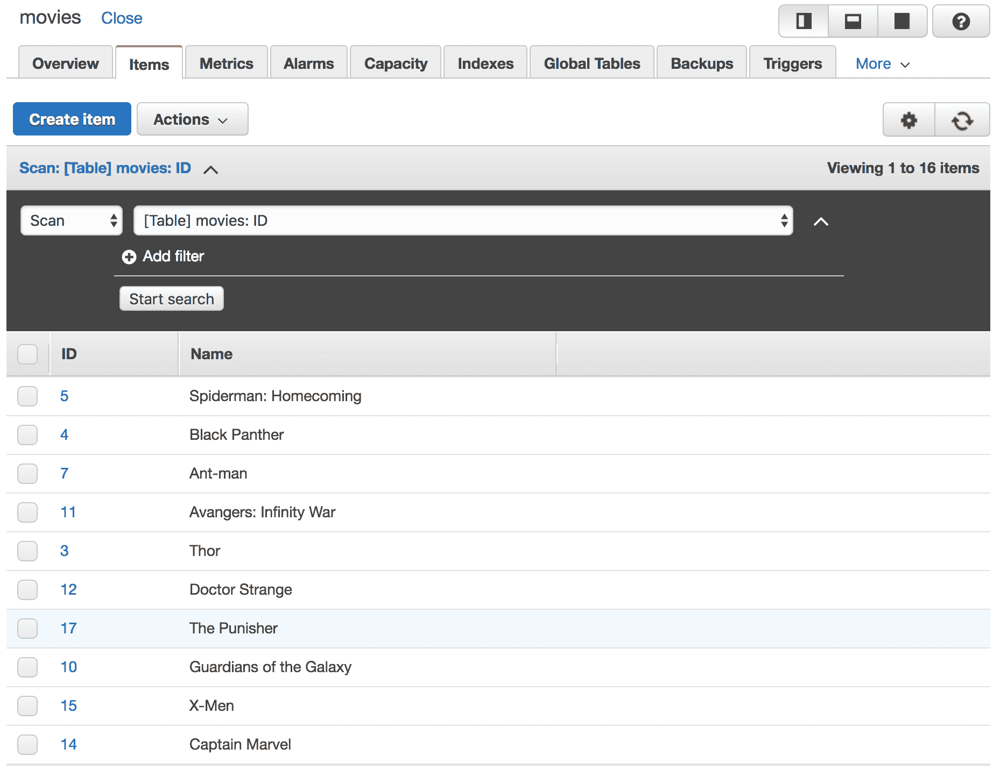

验证插入是否成功执行的另一种方法是使用 cURL 命令使用`findAll`端点：

```go
curl -sX GET https://51cxzthvma.execute-api.us-east-1.amazonaws.com/staging/movies | jq '.'
```

1.  具有 ID 为`17`的电影已创建。如果表中包含具有相同 ID 的电影项目，则会被替换。以下是输出：

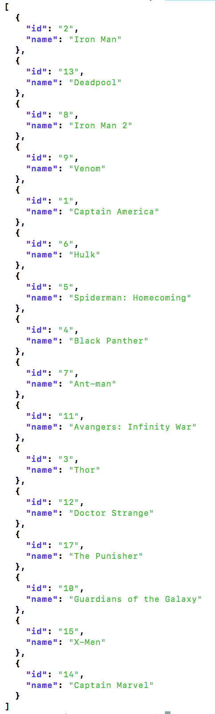

# DeleteItem 请求

最后，为了从 DynamoDB 中删除项目，应实现以下 Lambda 函数：

1.  注册一个新的处理程序来删除电影。处理程序将请求体中的有效负载编码为`Movie`结构：

```go
var movie Movie
err := json.Unmarshal([]byte(request.Body), &movie)
if err != nil {
   return events.APIGatewayProxyResponse{
      StatusCode: 400,
      Body: "Invalid payload",
   }, nil
}
```

1.  然后，调用`DeleteItem`方法，并将电影 ID 作为参数从表中删除：

```go
cfg, err := external.LoadDefaultAWSConfig()
if err != nil {
  return events.APIGatewayProxyResponse{
    StatusCode: http.StatusInternalServerError,
    Body: "Error while retrieving AWS credentials",
  }, nil
}

svc := dynamodb.New(cfg)
req := svc.DeleteItemRequest(&dynamodb.DeleteItemInput{
  TableName: aws.String(os.Getenv("TABLE_NAME")),
  Key: map[string]dynamodb.AttributeValue{
    "ID": dynamodb.AttributeValue{
      S: aws.String(movie.ID),
    },
  },
})
_, err = req.Send()
if err != nil {
  return events.APIGatewayProxyResponse{
    StatusCode: http.StatusInternalServerError,
    Body: "Error while deleting movie from DynamoDB",
  }, nil
}
```

此函数的完整实现可以在 GitHub 存储库中找到（[`github.com/PacktPublishing/Hands-On-Serverless-Applications-with-Go/blob/master/ch5/delete/main.go`](https://github.com/PacktPublishing/Hands-On-Serverless-Applications-with-Go/blob/master/ch5/findAll/main.go)）。

1.  与其他函数一样，创建一个名为`DeleteMovieRole`的新 IAM 角色，该角色具有将日志推送到 CloudWatch 并在电影表上调用`DeleteItem`操作的权限，如下截图所示：

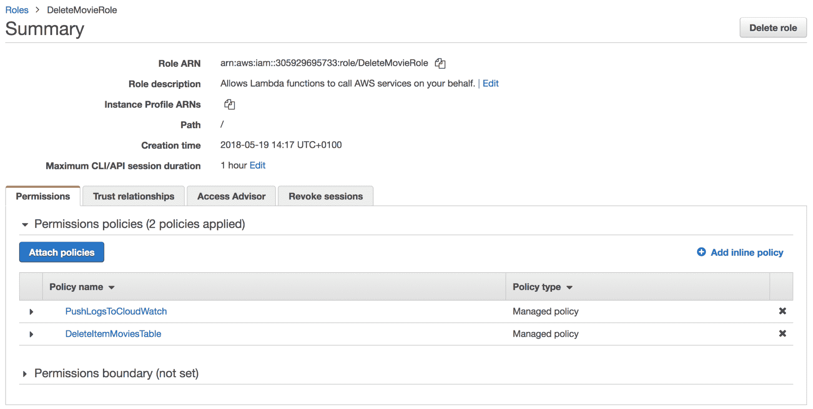

1.  接下来，在构建部署包后创建一个新的 Lambda 函数：

```go
aws lambda create-function --function-name DeleteMovie \
 --zip-file fileb://./deployment.zip \
 --runtime go1.x --handler main \
 --role arn:aws:iam::ACCOUNT_ID:role/DeleteMovieRole \
 --environment Variables={TABLE_NAME=movies} \
 --region us-east-1
```

1.  返回 Lambda 控制台。应该已创建一个`DeleteMovie`函数，如下截图所示：

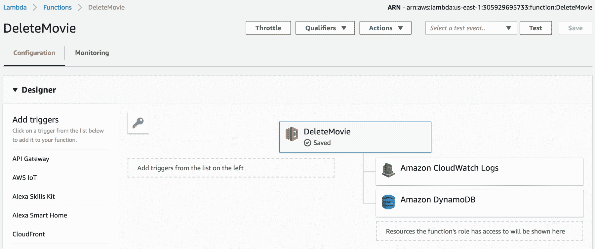

1.  最后，我们需要在 API Gateway 的`/movies`端点上公开一个`DELETE`方法。为此，我们不会使用 API Gateway 控制台，而是使用 AWS CLI，以便您熟悉它。

1.  要在`movies`资源上创建一个`DELETE`方法，我们将使用以下命令：

```go
aws apigateway put-method --rest-api-id API_ID \
 --resource-id RESOURCE_ID \
 --http-method DELETE \
 --authorization-type "NONE" \
 --region us-east-1 
```

1.  但是，我们需要提供 API ID 以及资源 ID。这些 ID 可以在 API Gateway 控制台中轻松找到，如下所示：

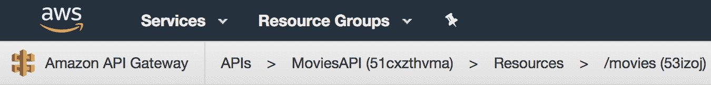

对于像我这样的 CLI 爱好者，您也可以通过运行以下命令来获取这些信息：

+   +   REST API ID：

```go
aws apigateway get-rest-apis --query "items[?name==\`MoviesAPI\`].id" --output text
```

+   +   资源 ID：

```go
aws apigateway get-resources --rest-api-id API_ID --query "items[?path==\`/movies\`].id" --output text
```

1.  现在已经定义了 ID，更新`aws apigateway put-method`命令，使用你的 ID 并执行该命令。

1.  接下来，将`DeleteMovie`函数设置为`DELETE`方法的目标：

```go
aws apigateway put-integration \
 --rest-api-id API_ID \
 --resource-id RESOURCE_ID \
 --http-method DELETE \
 --type AWS_PROXY \
 --integration-http-method DELETE \
 --uri arn:aws:apigateway:us-east-1:lambda:path/2015-03-31/functions/arn:aws:lambda:us-east-1:ACCOUNT_ID:function:DeleteMovie/invocations \
 --region us-east-1
```

1.  最后，告诉 API Gateway 跳过任何翻译，并在 Lambda 函数返回的响应中不做任何修改：

```go
aws apigateway put-method-response \
 --rest-api-id API_ID \
 --resource-id RESOURCE_ID \
 --http-method DELETE \
 --status-code 200 \
 --response-models '{"application/json": "Empty"}' \
 --region us-east-1
```

1.  在资源面板中，应该定义一个`DELETE`方法，如下所示：

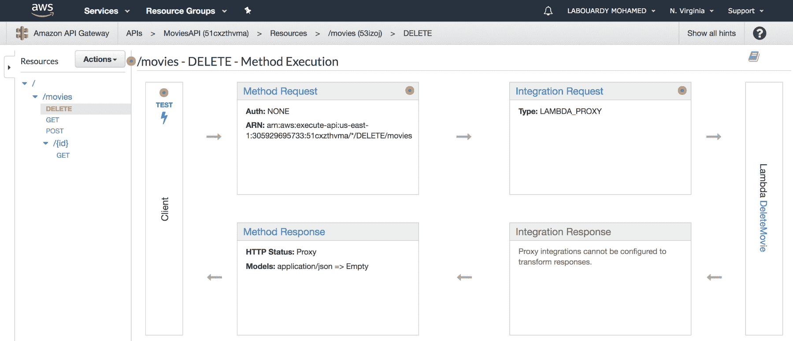

1.  使用以下 AWS CLI 命令重新部署 API：

```go
aws apigateway create-deployment \
 --rest-api-id API_ID \
 --stage-name staging \
 --region us-east-1
```

1.  使用以下 cURL 命令删除电影：

```go
curl -sX DELETE -d '{"id":"1", "name":"Captain America"}' https://51cxzthvma.execute-api.us-east-1.amazonaws.com/staging/movies | jq '.'
```

1.  通过调用`findAll`端点的以下 cURL 命令来验证电影是否已被删除：

```go
curl -sX GET https://51cxzthvma.execute-api.us-east-1.amazonaws.com/staging/movies | jq '.'
```

1.  ID 为 1 的电影不会出现在返回的列表中。您可以在 DynamoDB 控制台中验证电影已成功删除，如下所示：

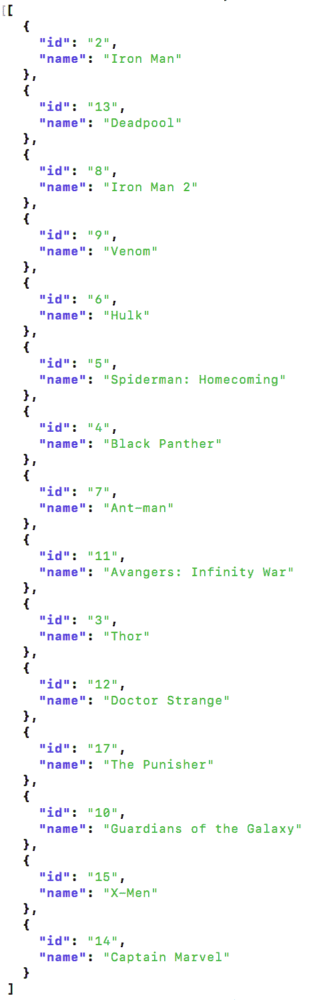

确实，ID 为 1 的电影不再存在于`movies`表中。

到目前为止，我们已经使用 AWS Lambda，API Gateway 和 DynamoDB 创建了一个无服务器 RESTful API。

# 摘要

在本章中，您学会了如何使用 Lambda 和 API Gateway 构建事件驱动的 API，以及如何在 DynamoDB 中存储数据。在后面的章节中，我们将进一步添加 API Gateway 顶部的安全层，构建 CI/CD 管道以自动化部署，等等。

在下一章中，我们将介绍一些高级的 AWS CLI 命令和选项，您可以在构建 AWS Lambda 中的无服务器函数时使用这些选项来节省时间。我们还将看到如何创建和维护多个版本和发布 Lambda 函数。

# 问题

1.  实现一个`update`处理程序来更新现有的电影项目。

1.  在 API Gateway 中创建一个新的 PUT 方法来触发`update` Lambda 函数。

1.  实现一个单一的 Lambda 函数来处理所有类型的事件（GET，POST，DELETE，PUT）。

1.  更新`findOne`处理程序以返回有效请求的正确响应代码，但是空数据（例如，请求的 ID 没有电影）。

1.  在`findAll`端点上使用`Range`头和`Query`字符串实现分页系统。
