# 部署您的无服务器应用程序

在之前的章节中，我们学习了如何从头开始构建一个无服务器 API。在本章中，我们将尝试完成以下内容：

+   通过一些高级 AWS CLI 命令构建、部署和管理我们的 Lambda 函数

+   发布 API 的多个版本

+   学习如何使用别名分隔多个部署环境（沙盒、暂存和生产）

+   覆盖 API Gateway 阶段变量的使用，以更改方法端点的行为。

# Lambda CLI 命令

在本节中，我们将介绍各种 AWS Lambda 命令，您可能在构建 Lambda 函数时使用。我们还将学习如何使用它们来自动化您的部署过程。

# 列出函数命令

如果您还记得，此命令是在第二章中引入的，*开始使用 AWS Lambda*。顾名思义，它会列出您提供的 AWS 区域中的所有 Lambda 函数。以下命令将返回北弗吉尼亚地区的所有 Lambda 函数：

```go
aws lambda list-functions --region us-east-1
```

对于每个函数，响应中都包括函数的配置信息（`FunctionName`、资源使用情况、`Environment`变量、IAM 角色、`Runtime`环境等），如下截图所示：

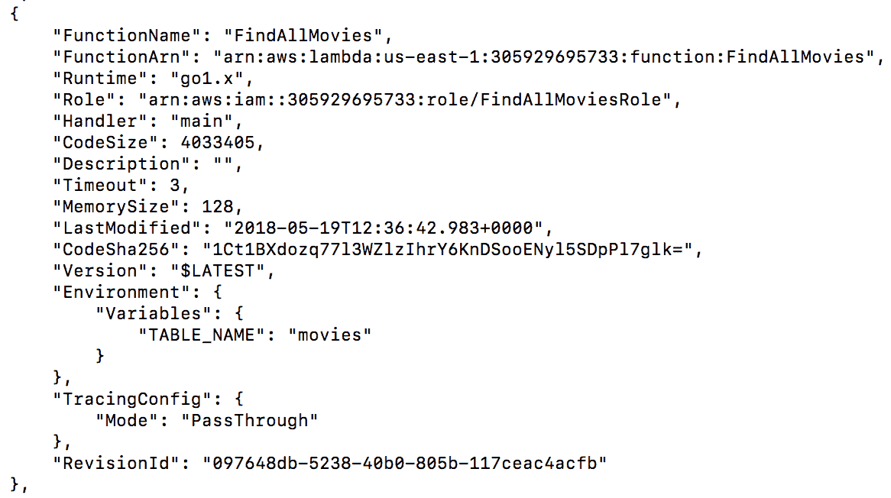

要仅列出一些属性，例如函数名称，可以使用`query`筛选选项，如下所示：

```go
aws lambda list-functions --query Functions[].FunctionName[]
```

# 创建函数命令

如果您已经阅读了前面的章节，您应该对此命令很熟悉，因为它已经多次用于从头开始创建新的 Lambda 函数。

除了函数的配置，您还可以使用该命令以两种方式提供部署包（ZIP）：

+   **ZIP 文件**：它使用`--zip-file`选项提供代码的 ZIP 文件路径：

```go
aws lambda create-function --function-name UpdateMovie \
 --description "Update an existing movie" \
 --runtime go1.x \
 --role arn:aws:iam::ACCOUNT_ID:role/UpdateMovieRole \
 --handler main \
 --environment Variables={TABLE_NAME=movies} \
 --zip-file fileb://./deployment.zip \
 --region us-east-1a
```

+   **S3 存储桶对象**：它使用`--code`选项提供 S3 存储桶和对象名称：

```go
aws lambda create-function --function-name UpdateMovie \
 --description "Update an existing movie" \
 --runtime go1.x \
 --role arn:aws:iam::ACCOUNT_ID:role/UpdateMovieRole \
 --handler main \
 --environment Variables={TABLE_NAME=movies} \
 --code S3Bucket=movies-api-deployment-package,S3Key=deployment.zip \
 --region us-east-1
```

如上述命令将以 JSON 格式返回函数设置的摘要，如下所示：

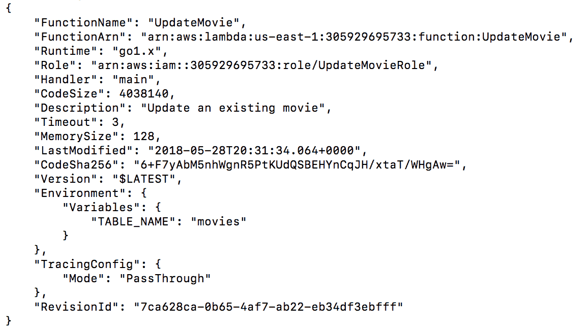

值得一提的是，在创建 Lambda 函数时，您可以根据函数的行为覆盖计算使用率和网络设置，使用以下选项：

+   `--timeout`：默认执行超时时间为三秒。当达到三秒时，AWS Lambda 终止您的函数。您可以设置的最大超时时间为五分钟。

+   `--memory-size`：执行函数时分配给函数的内存量。默认值为 128 MB，最大值为 3,008 MB（以 64 MB 递增）。

+   `--vpc-config`：这将在私有 VPC 中部署 Lambda 函数。虽然如果函数需要与内部资源通信，这可能很有用，但最好避免，因为它会影响 Lambda 的性能和扩展性（这将在即将到来的章节中讨论）。

AWS 不允许您设置函数的 CPU 使用率，因为它是根据为函数分配的内存自动计算的。 CPU 使用率与内存成比例。

# 更新函数代码命令

除了 AWS 管理控制台外，您还可以使用 AWS CLI 更新 Lambda 函数的代码。该命令需要目标 Lambda 函数名称和新的部署包。与上一个命令类似，您可以按以下方式提供包：

+   新`.zip`文件的路径：

```go
aws lambda update-function-code --function-name UpdateMovie \
    --zip-file fileb://./deployment-1.0.0.zip \
    --region us-east-1
```

+   存储`.zip`文件的 S3 存储桶：

```go
aws lambda update-function-code --function-name UpdateMovie \
    --s3-bucket movies-api-deployment-packages \
    --s3-key deployment-1.0.0.zip \
    --region us-east-1
```

此操作会为 Lambda 函数代码中的每个更改打印一个新的唯一 ID（称为`RevisionId`）：

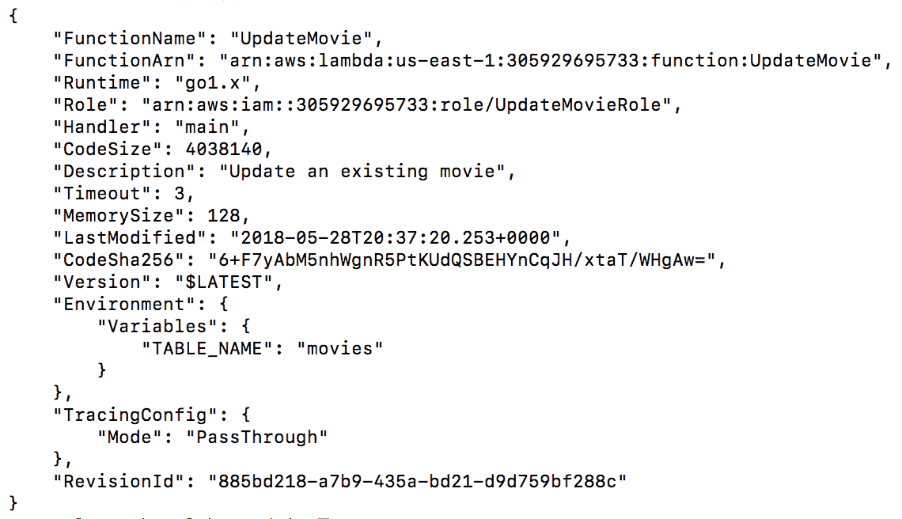

# 获取函数配置命令

为了检索 Lambda 函数的配置信息，请发出以下命令：

```go
aws lambda get-function-configuration --function-name UpdateMovie --region us-east-1
```

前面的命令将以输出提供与使用`create-function`命令时显示的相同信息。

要检索特定 Lambda 版本或别名的配置信息（下一节），您可以使用`--qualifier`选项。

# 调用命令

到目前为止，我们直接从 AWS Lambda 控制台和通过 API Gateway 的 HTTP 事件调用了我们的 Lambda 函数。除此之外，Lambda 还可以通过 AWS CLI 使用`invoke`命令进行调用：

```go
aws lambda invoke --function-name UpdateMovie result.json

```

上述命令将调用`UpdateMovie`函数，并将函数的输出保存在`result.json`文件中：

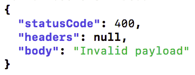

状态码为 400，这是正常的，因为`UpdateFunction`需要 JSON 输入。让我们看看如何使用`invoke`命令向我们的函数提供 JSON。

返回到 DynamoDB 的`movies`表，并选择要更新的电影。在本例中，我们将更新 ID 为 13 的电影，如下所示：

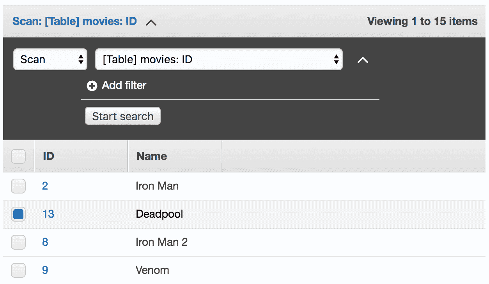

创建一个包含新电影项目属性的`body`属性的 JSON 文件，因为 Lambda 函数期望输入以 API Gateway 代理请求格式呈现：

```go
{
  "body": "{\"id\":\"13\", \"name\":\"Deadpool 2\"}"
}
```

最后，再次运行`invoke`函数命令，将 JSON 文件作为输入参数：

```go
aws lambda invoke --function UpdateMovie --payload file://input.json result.json
```

如果打印`result.json`的内容，更新后的电影应该会返回，如下所示：

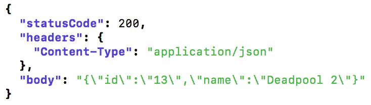

您可以通过调用`FindAllMovies`函数来验证 DynamoDB 表中电影的名称是否已更新：

```go
aws lambda invoke --function-name FindAllMovies result.json
```

`body`属性应该包含新更新的电影，如下所示：

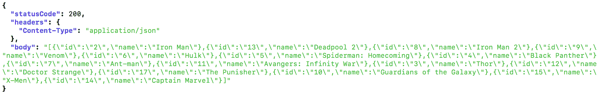

返回到 DynamoDB 控制台；ID 为 13 的电影应该有一个新的名称，如下截图所示：

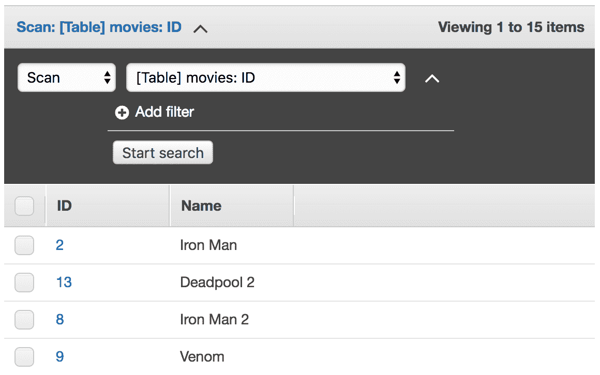

# 删除函数命令

要删除 Lambda 函数，您可以使用以下命令：

```go
aws lambda delete-function --function-name UpdateMovie
```

默认情况下，该命令将删除所有函数版本和别名。要删除特定版本或别名，您可能需要使用`--qualifier`选项。

到目前为止，您应该熟悉了在构建 AWS Lambda 中的无服务器应用程序时可能使用和需要的所有 AWS CLI 命令。在接下来的部分中，我们将看到如何创建 Lambda 函数的不同版本，并使用别名维护多个环境。

# 版本和别名

在构建无服务器应用程序时，您必须将部署环境分开，以便在不影响生产的情况下测试新更改。因此，拥有多个 Lambda 函数版本是有意义的。

# 版本控制

版本代表了您函数代码和配置在某个时间点的状态。默认情况下，每个 Lambda 函数都有一个`$LATEST`版本，指向您函数的最新更改，如下截图所示：

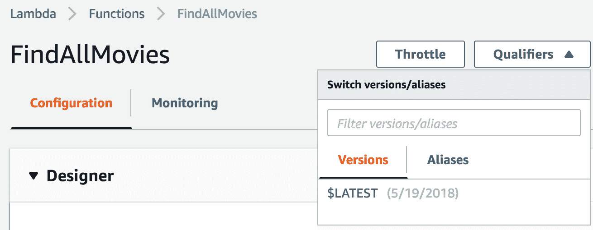

要从`$LATEST`版本创建新版本，请单击“操作”并选择“发布新版本”。让我们称其为`1.0.0`，如下截图所示：

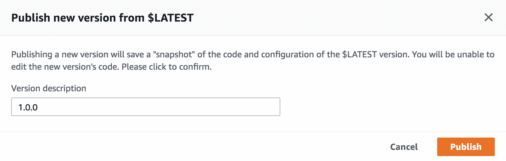

新版本将创建一个 ID=1（递增）。请注意以下截图中窗口顶部的 ARN Lambda 函数；它具有版本 ID：

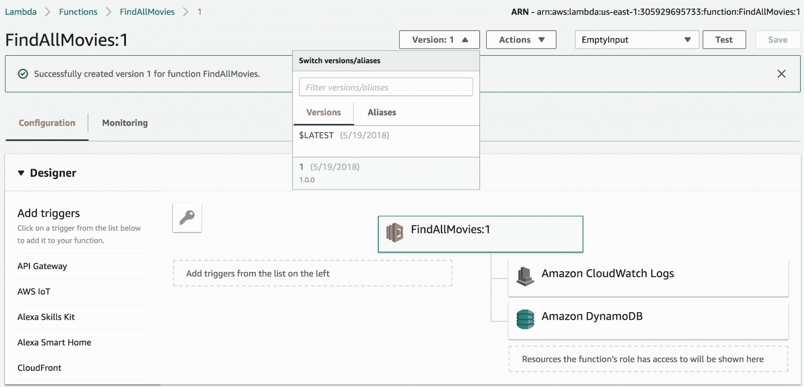

版本创建后，您无法更新函数代码，如下所示：

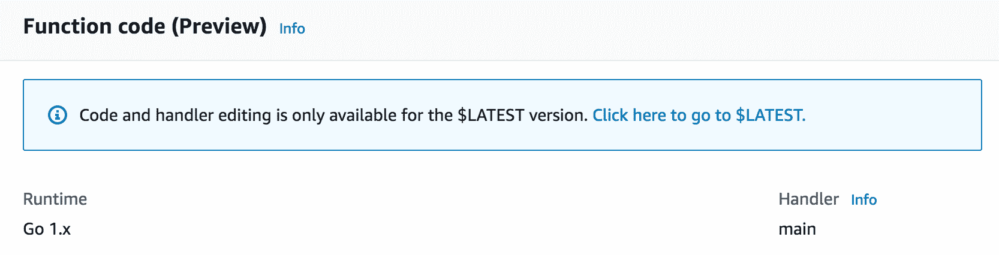

此外，高级设置，如 IAM 角色、网络配置和计算使用情况，无法更改，如下所示：

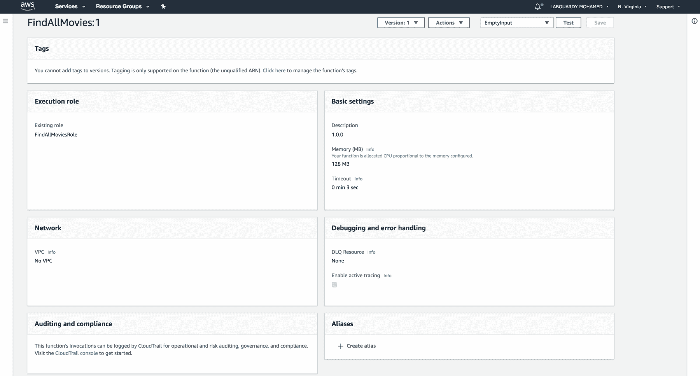

版本被称为**不可变**，这意味着一旦发布，它们就无法更改；只有`$LATEST`版本是可编辑的。

现在，我们知道如何从控制台发布新版本。让我们使用 AWS CLI 发布一个新版本。但首先，我们需要更新`FindAllMovies`函数，因为如果自从发布版本`1.0.0`以来对`$LATEST`没有进行任何更改，我们就无法发布新版本。

新版本将具有分页系统。该函数将仅返回用户请求的项目数量。以下代码将读取`Count`头参数，将其转换为数字，并使用带有`Limit`参数的`Scan`操作从 DynamoDB 中获取电影：

```go
func findAll(request events.APIGatewayProxyRequest) (events.APIGatewayProxyResponse, error) {
  size, err := strconv.Atoi(request.Headers["Count"])
  if err != nil {
    return events.APIGatewayProxyResponse{
      StatusCode: http.StatusBadRequest,
      Body: "Count Header should be a number",
    }, nil
  }

  ...

  svc := dynamodb.New(cfg)
  req := svc.ScanRequest(&dynamodb.ScanInput{
    TableName: aws.String(os.Getenv("TABLE_NAME")),
    Limit: aws.Int64(int64(size)),
  })

  ...
}
```

接下来，使用`update-function-code`命令更新`FindAllMovies` Lambda 函数的代码：

```go
aws lambda update-function-code --function-name FindAllMovies \
    --zip-file fileb://./deployment.zip
```

然后，基于当前配置和代码，使用以下命令发布一个新版本`1.1.0`：

```go
aws lambda publish-version --function-name FindAllMovies --description 1.1.0
```

返回到 AWS Lambda 控制台，导航到您的`FindAllMovies`；应该创建一个新版本，ID=2，如下截图所示：

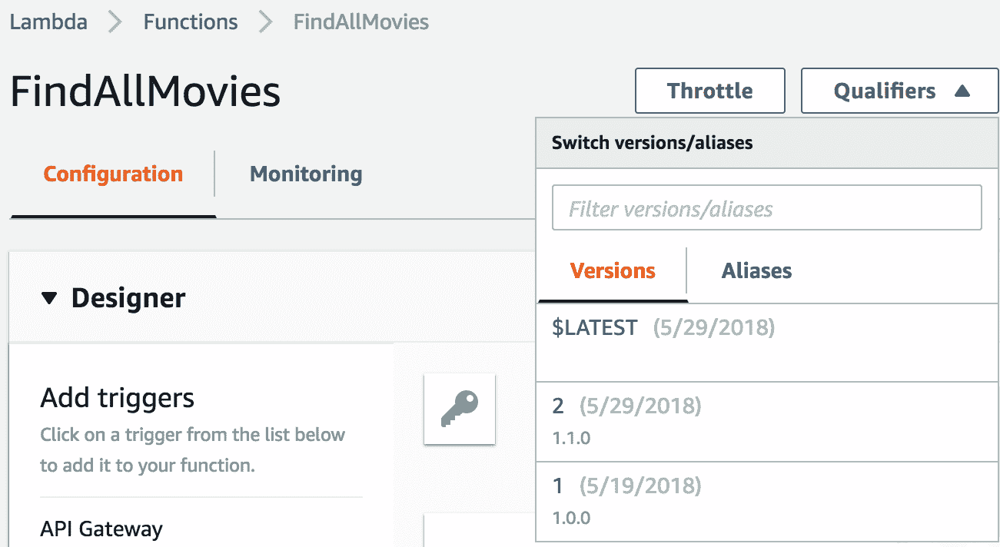

现在我们的版本已经创建，让我们通过使用 AWS CLI `invoke`命令来测试它们。

# FindAllMovies v1.0.0

使用以下命令在限定参数中调用`FindAllMovies` v1.0.0 版本：

```go
aws lambda invoke --function-name FindAllMovies --qualifier 1 result.json
```

`result.json`应该包含 DynamoDB`movies`表中的所有电影，如下所示：

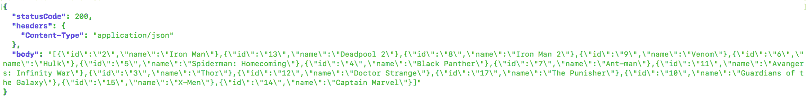

输出显示 DynamoDB 电影表中的所有电影

# FindAllMovies v1.1.0

创建一个名为`input.json`的新文件，并粘贴以下内容。此函数的版本需要一个名为`Count`的 Header 参数，用于返回电影的数量：

```go
{
  "headers": {
    "Count": "4"
  }
}
```

执行该函数，但这次使用`--payload`参数和指向`input.json`文件的路径位置：

```go
aws lambda invoke --function-name FindAllMovies --payload file://input.json
    --qualifier 2 result.json
```

`result.json`应该只包含四部电影，如下所示：

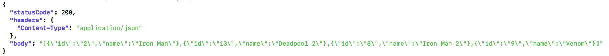

这就是如何创建多个版本的 Lambda 函数。但是，Lambda 函数版本控制的最佳实践是什么？

# 语义化版本控制

当您发布 Lambda 函数的新版本时，应该给它一个重要且有意义的版本名称，以便您可以通过其开发周期跟踪对函数所做的不同更改。

当您构建一个将被数百万客户使用的公共无服务器 API 时，您命名不同 API 版本的方式至关重要，因为它允许您的客户知道新版本是否引入了破坏性更改。它还让他们选择合适的时间升级到最新版本，而不会冒太多破坏他们流水线的风险。

这就是语义化版本控制（[`semver.org`](https://semver.org)）的作用，它是一种使用三个数字序列的版本方案：

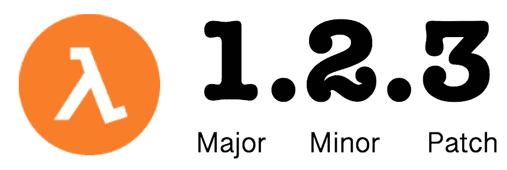

每个数字都根据以下规则递增：

+   **主要**：如果 Lambda 函数与先前版本不兼容，则递增。

+   **次要**：如果新功能或特性已添加到函数中，并且仍然向后兼容，则递增。

+   **补丁**：如果修复了错误和问题，并且函数仍然向后兼容，则递增。

例如，`FindAllMovies`函数的版本`1.1.0`是第一个主要版本，带有一个次要版本带来了一个新功能（分页系统）。

# 别名

别名是指向特定版本的指针，它允许您将函数从一个环境提升到另一个环境（例如从暂存到生产）。别名是可变的，而版本是不可变的。

为了说明别名的概念，我们将创建两个别名，如下图所示：一个指向`FindAllMovies` Lambda 函数`1.0.0`版本的`Production`别名，和一个指向函数`1.1.0`版本的`Staging`别名。然后，我们将配置 API Gateway 使用这些别名，而不是`$LATEST`版本：

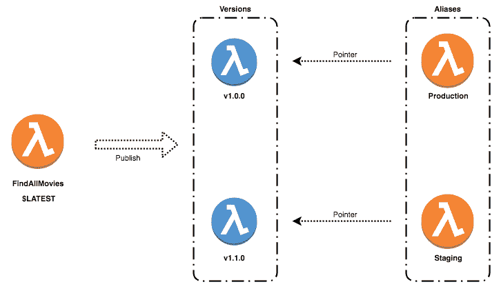

返回到`FindAllMovies`配置页面。如果单击**Qualifiers**下拉列表，您应该看到一个名为`Unqualified`的默认别名，指向您的`$LATEST`版本，如下截图所示：

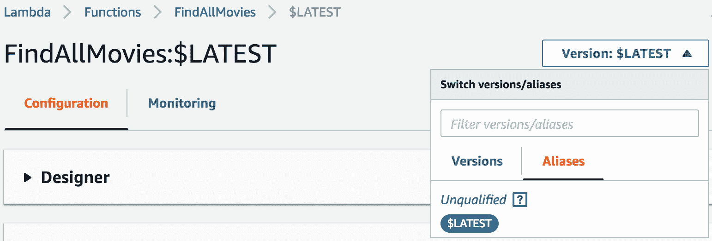

要创建一个新别名，单击操作，然后创建一个名为`Staging`的新别名。选择`5`版本作为目标，如下所示：

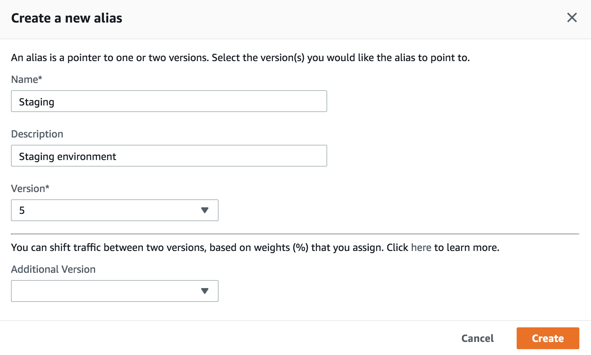

创建后，新版本应添加到别名列表中，如下所示：

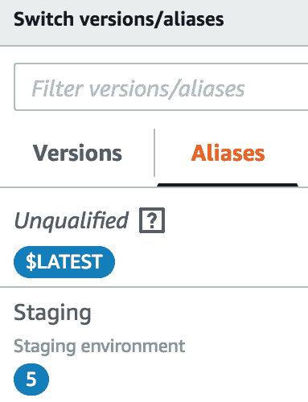

接下来，使用 AWS 命令行为`Production`环境创建一个指向版本`1.0.0`的新别名：

```go
aws lambda create-alias --function-name FindAllMovies \
    --name Production --description "Production environment" \
    --function-version 1
```

同样，新别名应成功创建：

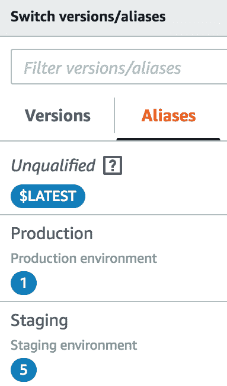

现在我们已经创建了别名，让我们配置 API Gateway 以使用这些别名和**阶段变量**。

# 阶段变量

阶段变量是环境变量，可用于在每个部署阶段运行时更改 API Gateway 方法的行为。接下来的部分将说明如何在 API Gateway 中使用阶段变量。

在 API Gateway 控制台上，导航到`Movies` API，单击`GET`方法，并更新目标 Lambda 函数，以使用阶段变量而不是硬编码的 Lambda 函数名称，如下截图所示：

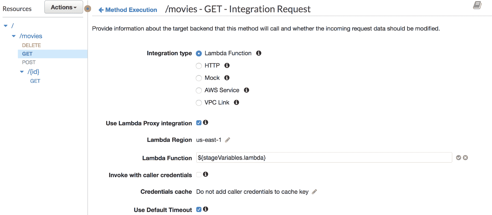

当您保存时，将会出现一个新的提示，要求您授予 API Gateway 调用 Lambda 函数别名的权限，如下截图所示：

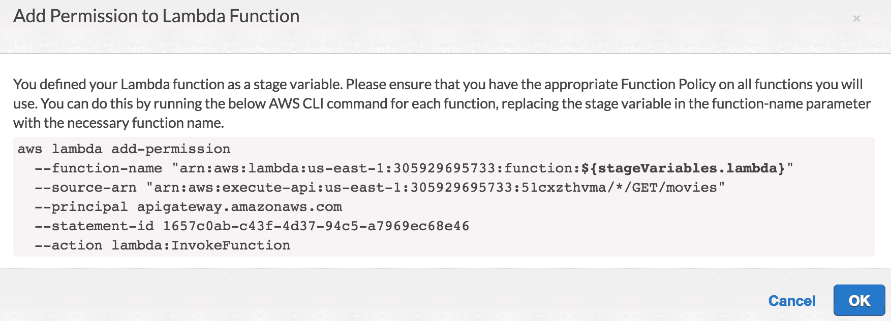

执行以下命令以允许 API Gateway 调用`Production`和`Staging`别名：

+   **Production 别名：**

```go
aws lambda add-permission --function-name "arn:aws:lambda:us-east-1:ACCOUNT_ID:function:FindAllMovies:Production" \
 --source-arn "arn:aws:execute-api:us-east-1:ACCOUNT_ID:API_ID/*/GET/movies" \
 --principal apigateway.amazonaws.com \
 --statement-id STATEMENT_ID \
 --action lambda:InvokeFunction
```

+   **Staging 别名：**

```go
aws lambda add-permission --function-name "arn:aws:lambda:us-east-1:ACCOUNT_ID:function:FindAllMovies:Staging" \
 --source-arn "arn:aws:execute-api:us-east-1:ACCOUNT_ID:API_ID/*/GET/movies" \
 --principal apigateway.amazonaws.com \
 --statement-id STATEMENT_ID \
 --action lambda:InvokeFunction
```

然后，创建一个名为`production`的新阶段，如下截图所示：

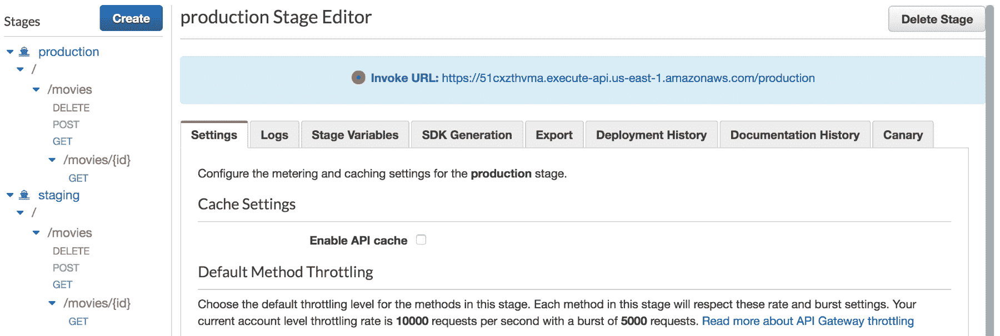

接下来，单击**Stages Variables**选项卡，并创建一个名为`lambda`的新阶段变量，并将`FindAllMovies:Production`设置为值，如下所示：

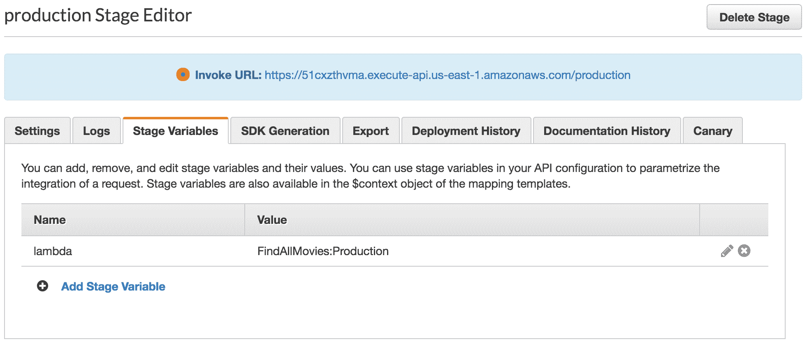

对于`staging`环境，使用指向 Lambda 函数`Staging`别名的`lambda`变量进行相同操作，如下所示：

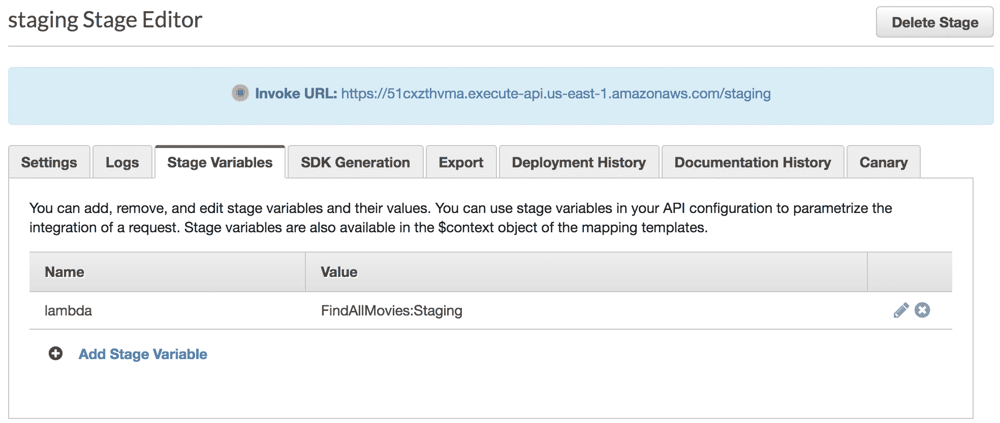

要测试端点，请使用`cURL`命令或您熟悉的任何 REST 客户端。我选择了 Postman。在 API Gateway 的`production`阶段调用的 URL 上使用`GET`方法应该返回数据库中的所有电影，如下所示：

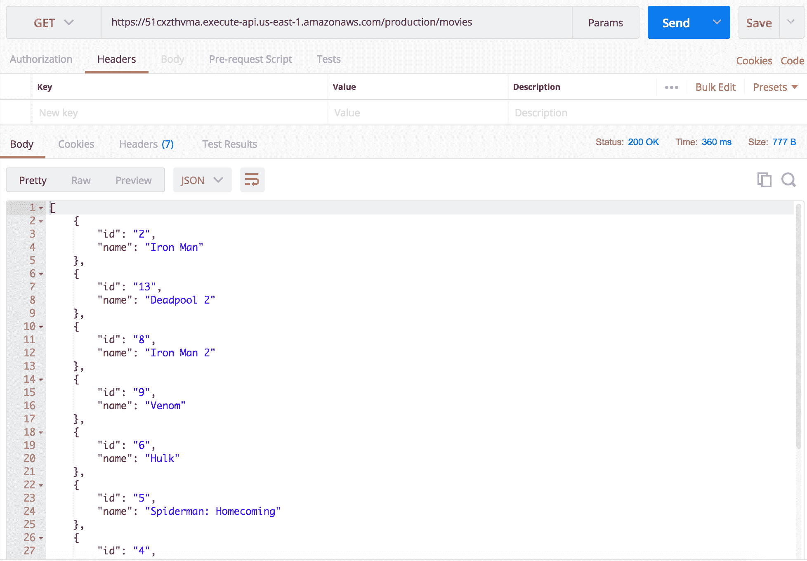

对于`staging`环境，执行相同操作，使用名为`Count=4`的新`Header`键；您应该只返回四个电影项目，如下所示：

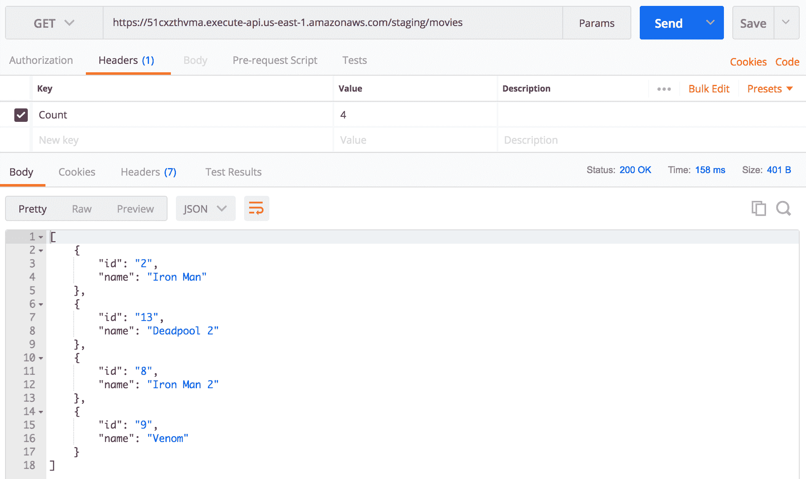

这就是您可以维护 Lambda 函数的多个环境的方法。现在，您可以通过将`Production`指针从`1.0.0`更改为`1.1.0`而轻松将`1.1.0`版本推广到生产环境，并在失败时回滚到以前的工作版本，而无需更改 API Gateway 设置。

# 摘要

AWS CLI 对于创建自动化脚本来管理 AWS Lambda 函数非常有用。

版本是不可变的，一旦发布就无法更改。另一方面，别名是动态的，它们的绑定可以随时更改以实现代码推广或回滚。采用 Lambda 函数版本的语义化版本控制可以更容易地跟踪更改。

在下一章中，我们将学习如何从头开始设置 CI/CD 流水线，以自动化部署 Lambda 函数到生产环境的过程。我们还将介绍如何在持续集成工作流程中使用别名和版本。
