# 第七章：实施 CI/CD 流水线

本章将讨论高级概念，如：

+   如何建立一个高度弹性和容错的 CI/CD 流水线，自动化部署您的无服务器应用程序

+   拥有一个用于 Lambda 函数的集中式代码存储库的重要性

+   如何自动部署代码更改到生产环境。

# 技术要求

在开始本章之前，请确保您已经创建并上传了之前章节中构建的函数的源代码到一个集中的 GitHub 存储库。此外，强烈建议具有 CI/CD 概念的先前经验。本章的代码包托管在 GitHub 上，网址为[`github.com/PacktPublishing/Hands-On-Serverless-Applications-with-Go`](https://github.com/PacktPublishing/Hands-On-Serverless-Applications-with-Go)。

# 持续集成和部署工作流

持续集成、持续部署和持续交付是加速软件上市时间并通过反馈推动创新的绝佳方式，同时确保在每次迭代中构建高质量产品。但这些实践意味着什么？在构建 AWS Lambda 中的无服务器应用程序时，如何应用这些实践？

# 持续集成

**持续集成**（**CI**）是指拥有一个集中的代码存储库，并在将所有更改和功能整合到中央存储库之前，通过一个复杂的流水线进行处理的过程。经典的 CI 流水线在代码提交时触发构建，运行单元测试和所有预整合测试，构建构件，并将结果推送到构件管理存储库。

# 持续部署

**持续部署**（**CD**）是持续集成的延伸。通过持续集成流水线的所有阶段的每个更改都会自动发布到您的暂存环境。

# 持续交付

**持续交付**（**CD**）与 CD 类似，但在将发布部署到生产环境之前需要人工干预或业务决策。

现在这些实践已经定义，您可以使用这些概念来利用自动化的力量，并构建一个端到端的部署流程，如下图所示：

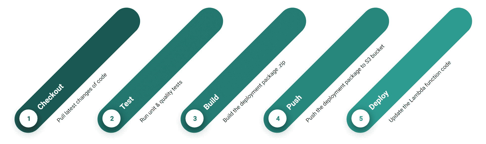

在接下来的章节中，我们将介绍如何使用最常用的 CI 解决方案构建这个流水线。

为了说明这些概念，只使用`FindAllMovies`函数的代码，但相同的步骤可以应用于其他 Lambda 函数。

# 自动化部署 Lambda 函数

在本节中，我们将看到如何构建一个流水线，以不同的方式自动化部署前一章中构建的 Lambda 函数的部署过程。

+   由 AWS 管理的解决方案，如 CodePipeline 和 CodeBuild

+   本地解决方案，如 Jenkins

+   SaaS 解决方案，如 Circle CI

# 使用 CodePipeline 和 CodeBuild 进行持续部署

AWS CodePipeline 是一个工作流管理工具，允许您自动化软件的发布和部署过程。用户定义一组步骤，形成一个可以在 AWS 托管服务（如 CodeBuild 和 CodeDeploy）或第三方工具（如 Jenkins）上执行的 CI 工作流。

在本例中，AWS CodeBuild 将用于测试、构建和部署您的 Lambda 函数。因此，应在代码存储库中创建一个名为`buildspec.yml`的构建规范文件。

`buildspec.yml`定义了将在 CI 服务器上执行的一组步骤，如下所示：

```go
version: 0.2
env:
 variables:
 S3_BUCKET: "movies-api-deployment-packages"
 PACKAGE: "github.com/mlabouardy/lambda-codepipeline"

phases:
 install:
 commands:
 - mkdir -p "/go/src/$(dirname ${PACKAGE})"
 - ln -s "${CODEBUILD_SRC_DIR}" "/go/src/${PACKAGE}"
 - go get -u github.com/golang/lint/golint

 pre_build:
 commands:
 - cd "/go/src/${PACKAGE}"
 - go get -t ./...
 - golint -set_exit_status
 - go vet .
 - go test .

 build:
 commands:
 - GOOS=linux go build -o main
 - zip $CODEBUILD_RESOLVED_SOURCE_VERSION.zip main
 - aws s3 cp $CODEBUILD_RESOLVED_SOURCE_VERSION.zip s3://$S3_BUCKET/

 post_build:
 commands:
 - aws lambda update-function-code --function-name FindAllMovies --s3-bucket $S3_BUCKET --s3-key $CODEBUILD_RESOLVED_SOURCE_VERSION.zip
```

构建规范分为以下四个阶段：

+   **安装**：

+   设置 Go 工作空间

+   安装 Go linter

+   预构建：

+   安装 Go 依赖项

+   检查我们的代码是否格式良好，并遵循 Go 的最佳实践和常见约定

+   使用`go test`命令运行单元测试

+   **构建**：

+   使用`go build`命令构建单个二进制文件

+   从生成的二进制文件创建一个部署包`.zip`

+   将`.zip`文件存储在 S3 存储桶中

+   **后构建**：

+   使用新的部署包更新 Lambda 函数的代码

单元测试命令将返回一个空响应，因为我们将在即将到来的章节中编写我们的 Lambda 函数的单元测试。

# 源提供者

现在我们的工作流已经定义，让我们创建一个持续部署流水线。打开 AWS 管理控制台（[`console.aws.amazon.com/console/home`](https://console.aws.amazon.com/console/home)），从**开发人员工具**部分导航到 AWS CodePipeline，并创建一个名为 MoviesAPI 的新流水线，如下图所示：

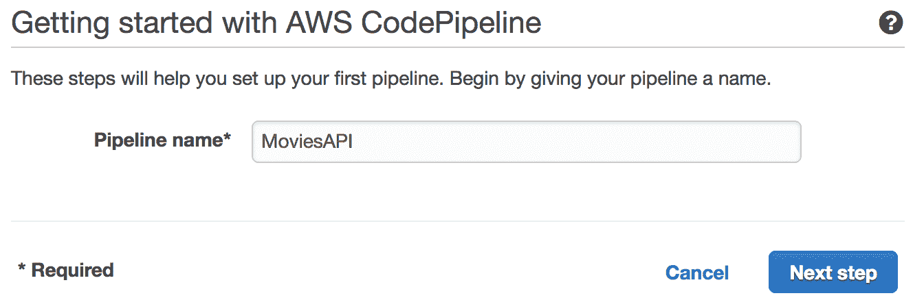

在源位置页面上，选择 GitHub 作为源提供者，如下图所示：

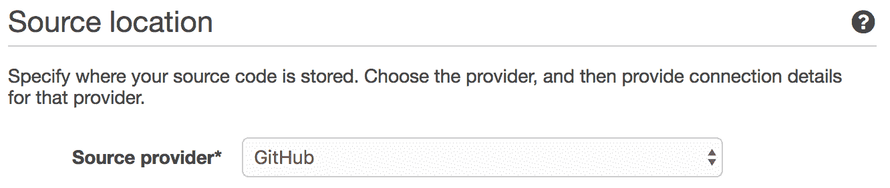

除了 GitHub，AWS CodePipeline 还支持 Amazon S3 和 AWS CodeCommit 作为代码源提供者。

点击“连接到 GitHub”按钮，并授权 CodePipeline 访问您的 GitHub 存储库；然后，选择存储代码的 GitHub 存储库和要构建的目标 git 分支，如下图所示：

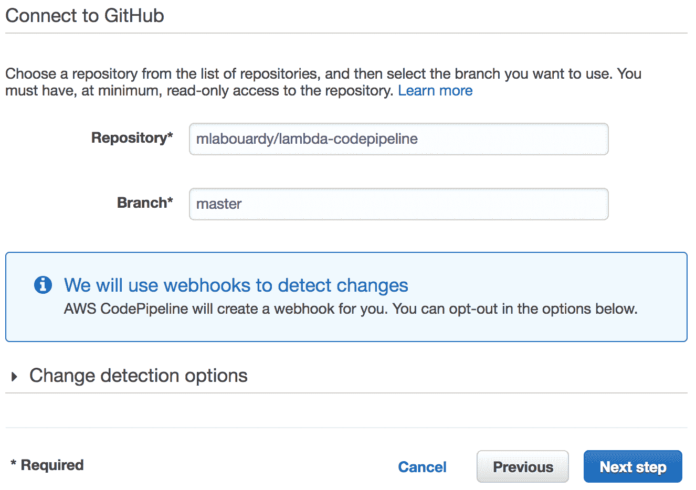

# 构建提供者

在构建阶段，选择 AWS CodeBuild 作为构建服务器。Jenkins 和 Solano CI 也是支持的构建提供者。请注意以下截图：

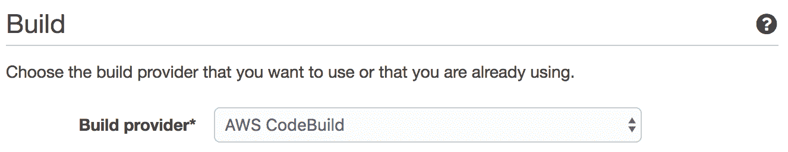

在创建流水线的下一步是定义一个新的 CodeBuild 项目，如下所示：

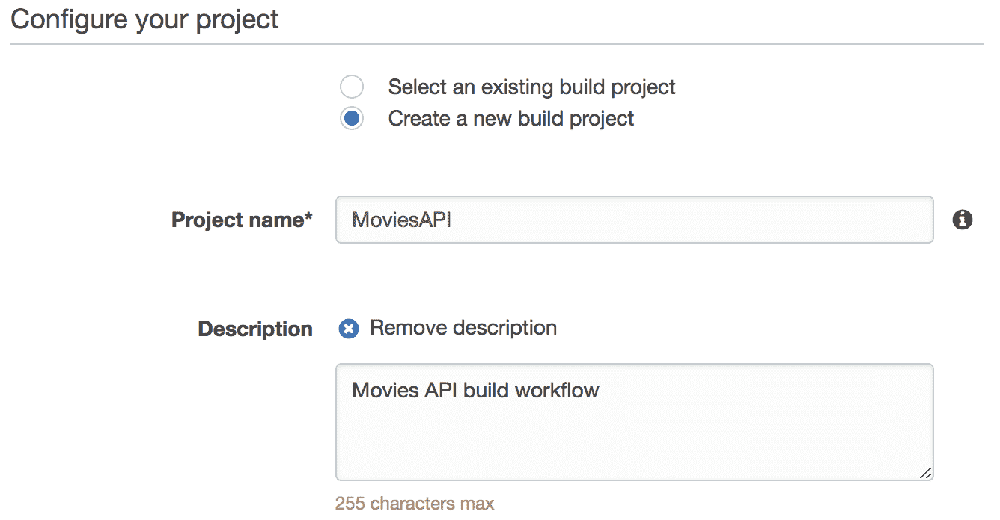

将构建服务器设置为带有 Golang 的 Ubuntu 实例作为运行时环境，如下图所示：

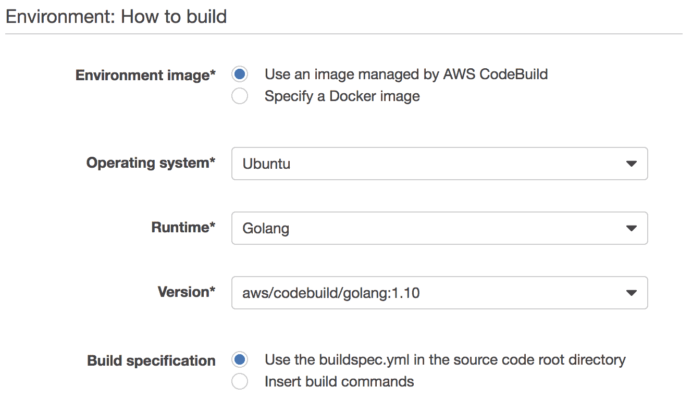

构建环境也可以基于 DockerHub 上公开可用的 Docker 镜像或私有注册表，例如**弹性容器注册表**（**ECR**）。

CodeBuild 将在 S3 存储桶中存储构件（`部署`包），并更新 Lambda 函数的`FindAllMovies`代码。因此，应该附加一个具有以下策略的 IAM 角色：

```go
{
  "Version": "2012-10-17",
  "Statement": [
    {
      "Sid": "VisualEditor0",
      "Effect": "Allow",
      "Action": [
        "s3:PutObject",
        "s3:GetObject",
        "lambda:UpdateFunctionCode"
      ],
      "Resource": [
        "arn:aws:s3:::movies-api-deployment-packages/*",
        "arn:aws:lambda:us-east-1:305929695733:function:FindAllMovies"
      ]
    }
  ]
}
```

在上述代码块中，`arn:aws:lambda:us-east-1`帐户 ID 应该替换为您的帐户 ID。

# 部署提供者

项目构建完成后，在流水线中配置的下一步是部署到一个环境。在本章中，我们将选择**无部署**选项，并让 CodeBuild 使用 AWS CLI 将新代码部署到 Lambda，如下图所示：

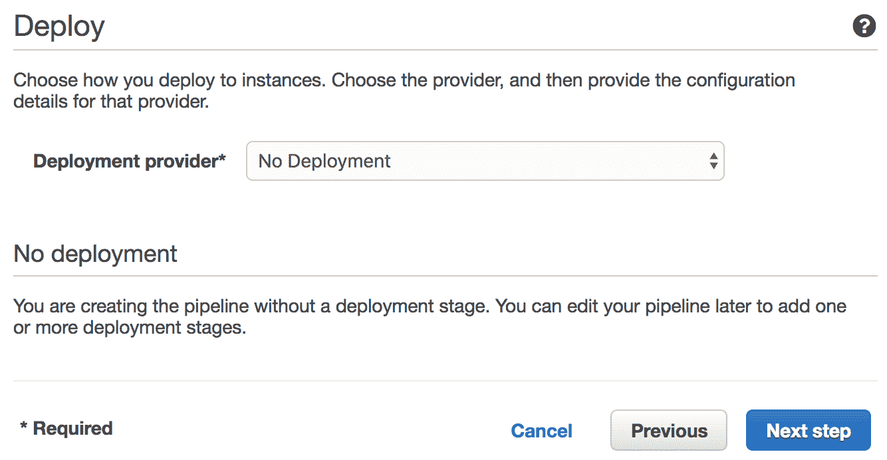

这个部署过程需要解释无服务器应用程序模型和 CloudFormation，这将在后续章节中详细解释。

审查详细信息；当您准备好时，点击保存，将创建一个新的流水线，如下所示：

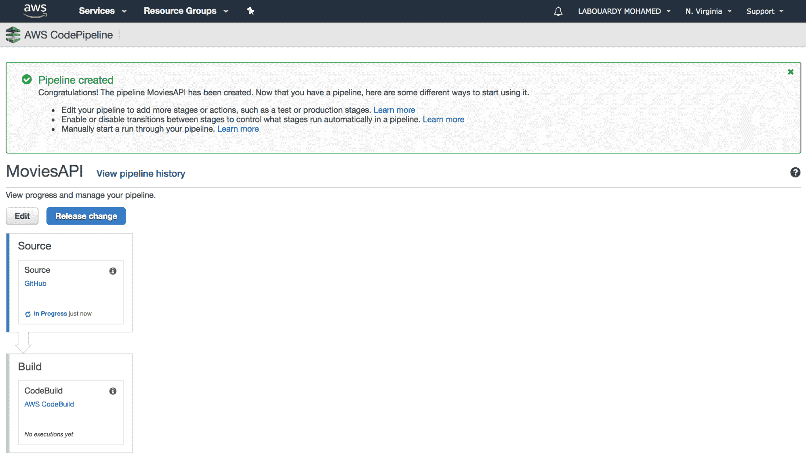

流水线将启动，并且构建阶段将失败，如下图所示：

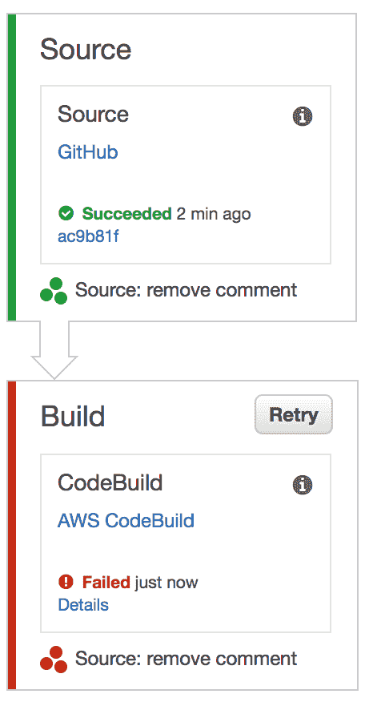

如果我们点击“详细信息”链接，它将带您到该特定构建的 CodeBuild 项目页面。可以在这里看到描述构建规范文件的阶段：

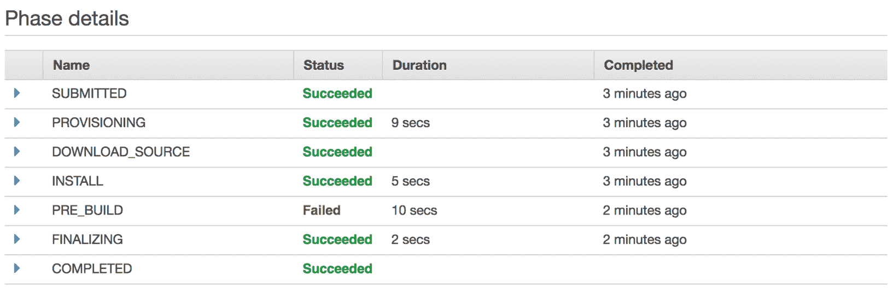

如图所示，预构建阶段失败了；在底部的日志部分，我们可以看到这是由于`golint`命令：

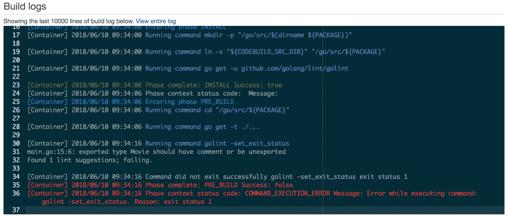

在 Golang 中，所有顶级的、公开的名称（大写）都应该有文档注释。因此，应该在 Movie 结构声明的顶部添加一个新的注释，如下所示：

```go
// Movie entity
type Movie struct {
  ID string `json:"id"`
  Name string `json:"name"`
}
```

将新更改提交到 GitHub，新的构建将触发流水线的执行：

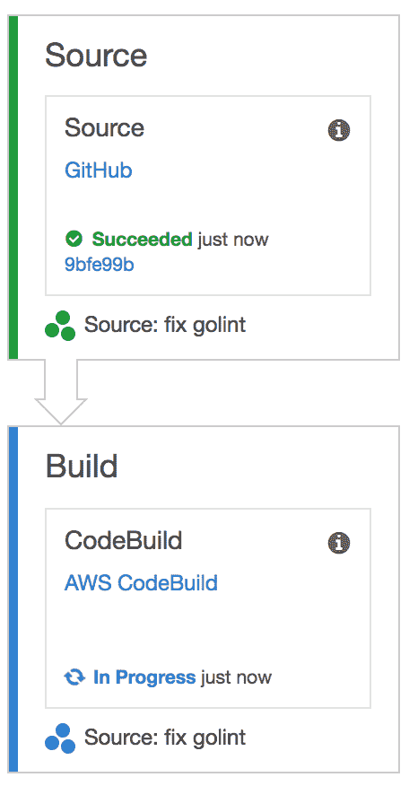

您可能想知道如何将代码更改推送到代码存储库会触发新的构建。答案是 GitHub Webhooks。当您创建 CodeBuild 项目时，GitHub 存储库中会自动创建一个新的 Webhook。因此，所有对代码存储库的更改都会通过 CI 流水线，如下截图所示：

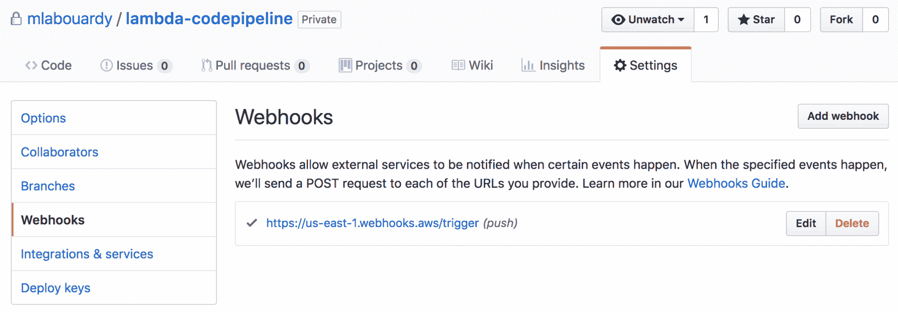

一旦流水线完成，所有 CodeBuild 阶段都应该通过，如下截图所示：

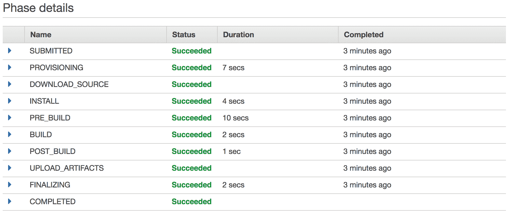

打开 S3 控制台，然后单击流水线使用的存储桶；新的部署包应该以与提交 ID 相同的键名存储：

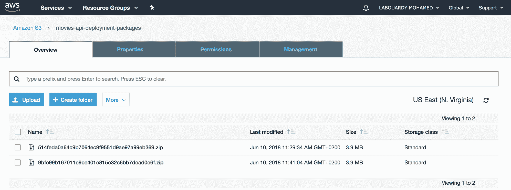

最后，CodeBuild 将使用`update-function-code`命令更新 Lambda 函数的代码。

# 使用 Jenkins 的连续管道

多年来，Jenkins 一直是首选工具。它是一个用 Java 编写的开源持续集成服务器，构建在 Hudson 项目之上。由于其插件驱动的架构和丰富的生态系统，它具有很高的可扩展性。

在接下来的部分中，我们将使用 Jenkins 编写我们的第一个*Pipeline as Code*，但首先我们需要设置我们的 Jenkins 环境。

# 分布式构建

要开始，请按照此指南中的官方说明安装 Jenkins：[`jenkins.io/doc/book/installing/`](https://jenkins.io/doc/book/installing/)。一旦 Jenkins 启动并运行，将浏览器指向`http://instance_ip:8080`。此链接将打开 Jenkins 仪表板，如下截图所示：

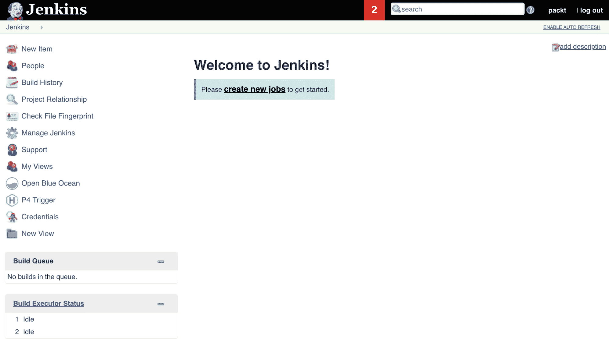

使用 Jenkins 的一个优势是其主/从架构。它允许您设置一个 Jenkins 集群，其中有多个负责构建应用程序的工作节点（代理）。这种架构有许多好处：

+   响应时间，队列中等待构建的作业不多

+   并发构建数量增加

+   支持多个平台

以下步骤描述了为 Jenkins 构建服务器启动新工作节点的配置过程。工作节点是一个 EC2 实例，安装了最新稳定版本的`JDK8`和`Golang`（有关说明，请参见第二章，*使用 AWS Lambda 入门*）。

工作节点运行后，将其 IP 地址复制到剪贴板，返回 Jenkins 主控台，单击“管理 Jenkins”，然后单击“管理节点”。单击“新建节点”，给工作节点命名，并选择永久代理，如下截图所示：

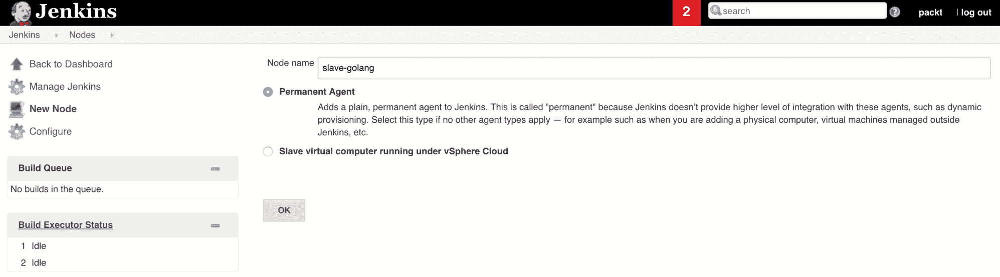

然后，将节点根目录设置为 Go 工作空间，并粘贴节点的 IP 地址并选择 SSH 密钥，如下所示：

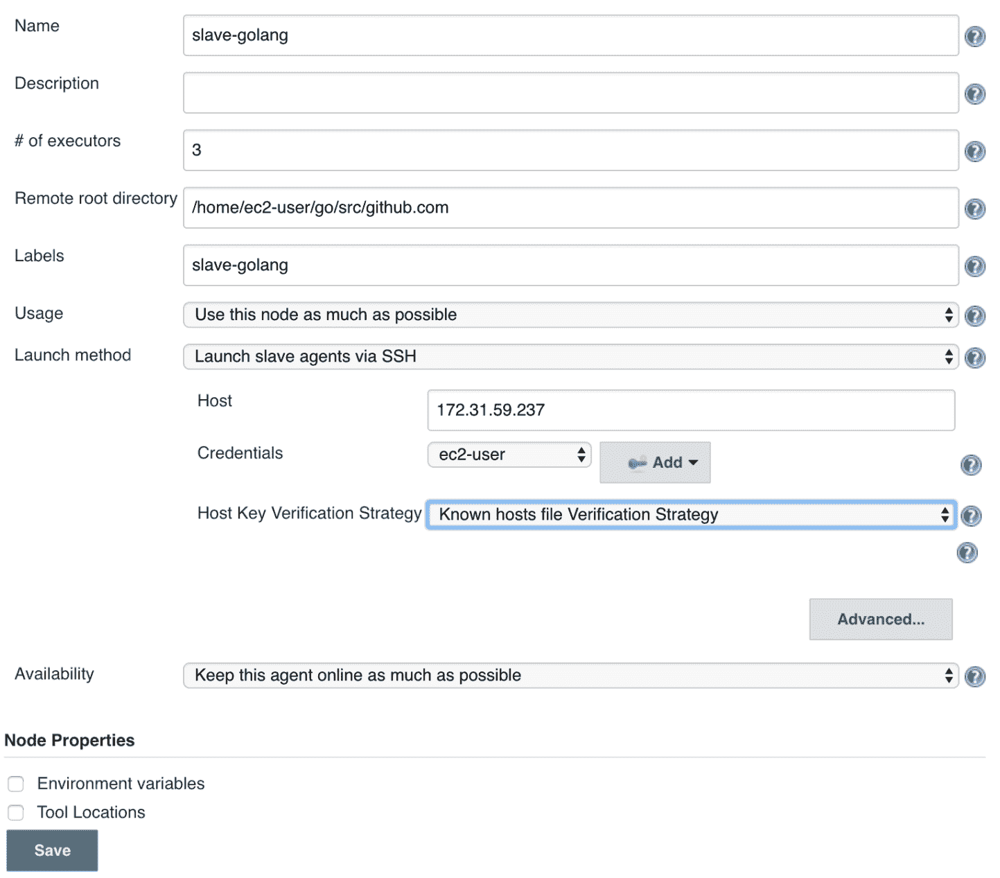

如果一切配置正确，节点将上线，如下所示：

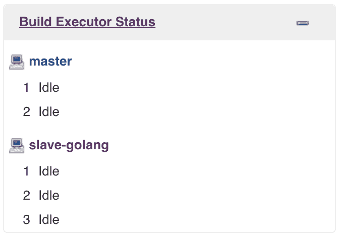

# 设置 Jenkins 作业

现在我们的集群已部署，我们可以编写我们的第一个 Jenkins 流水线。这个流水线定义在一个名为`Jenkinsfile`的文本文件中。这个定义文件必须提交到 Lambda 函数的代码存储库中。

Jenkins 必须安装`Pipeline`插件才能使用*Pipeline as Code*功能。这个功能提供了许多即时的好处，比如代码审查、回滚和版本控制。

考虑以下`Jenkinsfile`，它实现了一个基本的五阶段连续交付流水线，用于`FindAllMovies` Lambda 函数：

```go
def bucket = 'movies-api-deployment-packages'

node('slave-golang'){
    stage('Checkout'){
        checkout scm
    }

    stage('Test'){
        sh 'go get -u github.com/golang/lint/golint'
        sh 'go get -t ./...'
        sh 'golint -set_exit_status'
        sh 'go vet .'
        sh 'go test .'
    }

    stage('Build'){
        sh 'GOOS=linux go build -o main main.go'
        sh "zip ${commitID()}.zip main"
    }

    stage('Push'){
        sh "aws s3 cp ${commitID()}.zip s3://${bucket}"
    }

    stage('Deploy'){
        sh "aws lambda update-function-code --function-name FindAllMovies \
                --s3-bucket ${bucket} \
                --s3-key ${commitID()}.zip \
                --region us-east-1"
    }
}

def commitID() {
    sh 'git rev-parse HEAD > .git/commitID'
    def commitID = readFile('.git/commitID').trim()
    sh 'rm .git/commitID'
    commitID
}
```

流水线使用基于 Groovy 语法的**领域特定语言**（**DSL**）编写，并将在我们之前添加到集群的节点上执行。每次对 GitHub 存储库进行更改时，您的更改都将经过多个阶段：

+   检查来自源代码控制的代码

+   运行单元和质量测试

+   构建部署包并将此构件存储到 S3 存储桶

+   更新`FindAllMovies`函数的代码

请注意使用 git 提交 ID 作为部署包的名称，以便为每个发布提供有意义且重要的名称，并且如果出现问题，可以回滚到特定的提交。

现在我们的管道已经定义好，我们需要通过单击“新建”在 Jenkins 上创建一个新作业。然后，为作业输入名称，并选择多分支管道。设置存储您的 Lambda 函数代码的 GitHub 存储库以及`Jenkinsfile`的路径如下：

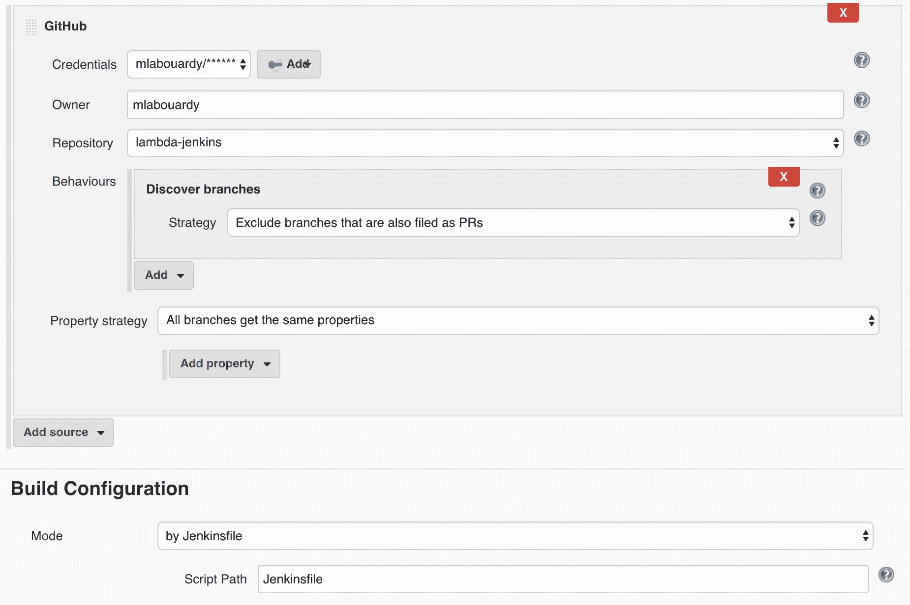

在构建之前，必须在 Jenkins 工作程序上配置具有对 S3 的写访问权限和对 Lambda 的更新操作的 IAM 实例角色。

保存后，管道将在主分支上执行，并且作业应该变为绿色，如下所示：

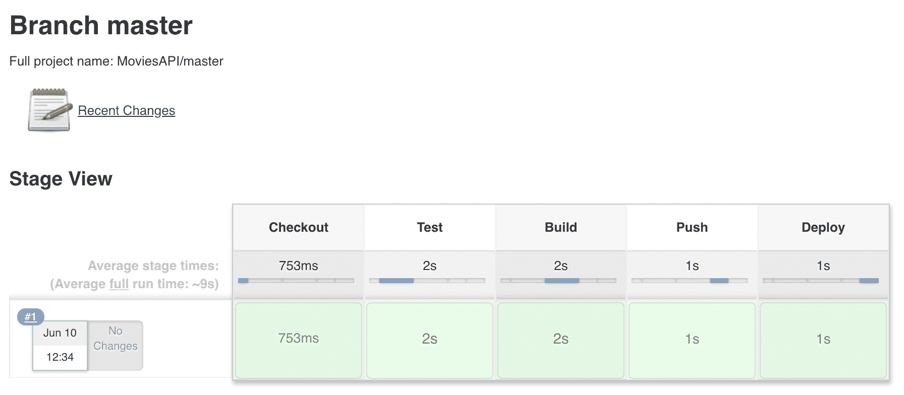

管道完成后，您可以单击每个阶段以查看执行日志。在以下示例中，我们可以看到`部署`阶段的日志：

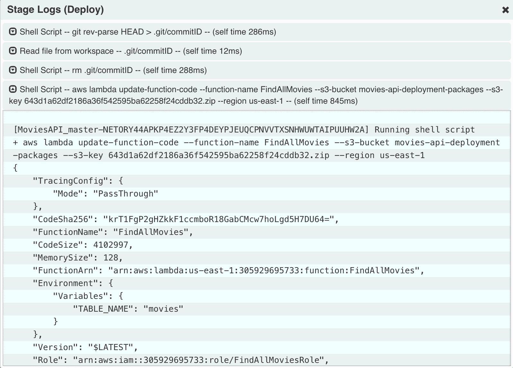

# Git 钩子

最后，为了使 Jenkins 在您推送到代码存储库时触发构建，请从您的 GitHub 存储库中单击**设置**，然后在**集成和服务**中搜索**Jenkins（GitHub 插件）**，并填写类似以下的 URL：

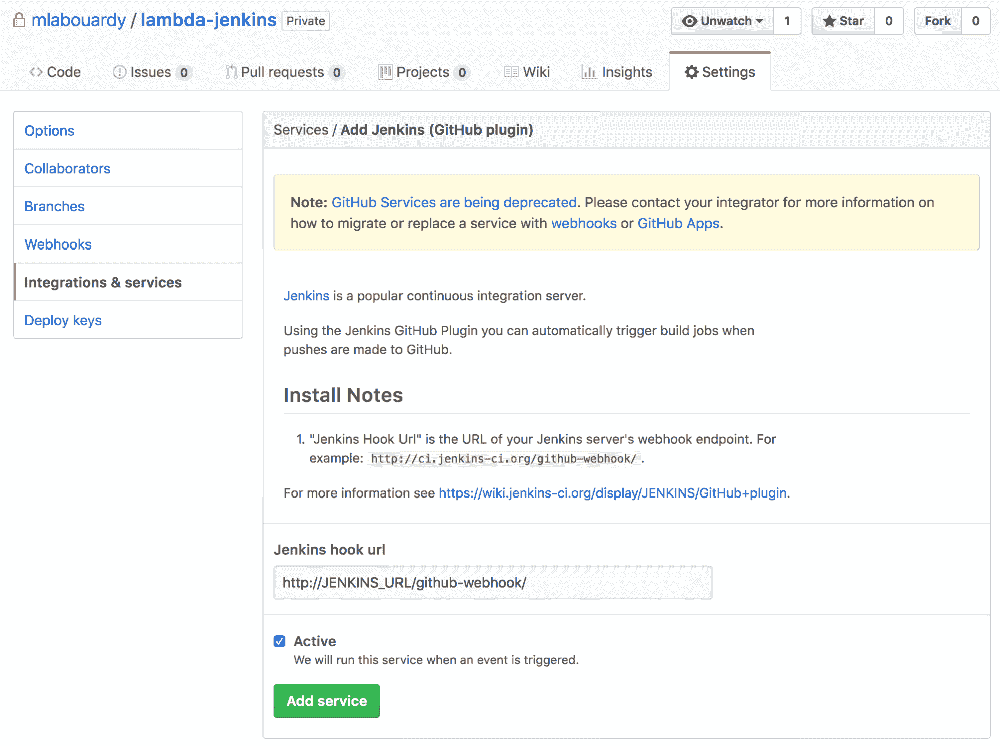

现在，每当您将代码推送到 GitHub 存储库时，完整的 Jenkins 管道将被触发，如下所示：

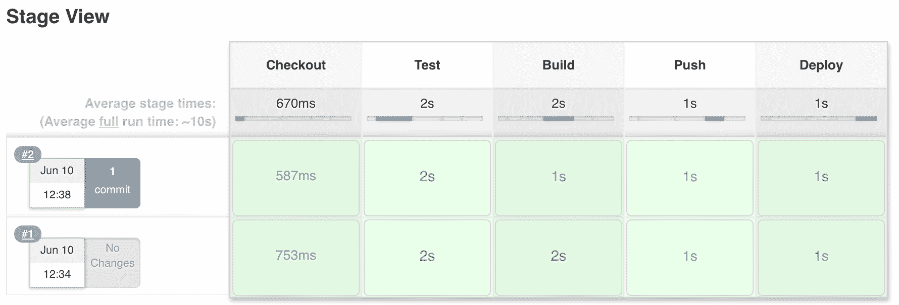

另一种使 Jenkins 在检测到更改时创建构建的方法是定期轮询目标 git 存储库（cron 作业）。这种解决方案效率有点低，但如果您的 Jenkins 实例在私有网络中，这可能是有用的。

# 使用 Circle CI 进行持续集成

CircleCI 是“CI/CD 即服务”。这是一个与基于 GitHub 和 BitBucket 的项目非常好地集成，并且内置支持 Golang 应用程序的平台。

在接下来的部分中，我们将看到如何使用 CircleCI 自动化部署我们的 Lambda 函数的过程。

# 身份和访问管理

使用您的 GitHub 帐户登录 Circle CI（[`circleci.com/vcs-authorize/`](https://circleci.com/vcs-authorize/)）。然后，选择存储您的 Lambda 函数代码的存储库，然后单击“设置项目”按钮，以便 Circle CI 可以自动推断设置，如下面的屏幕截图所示：

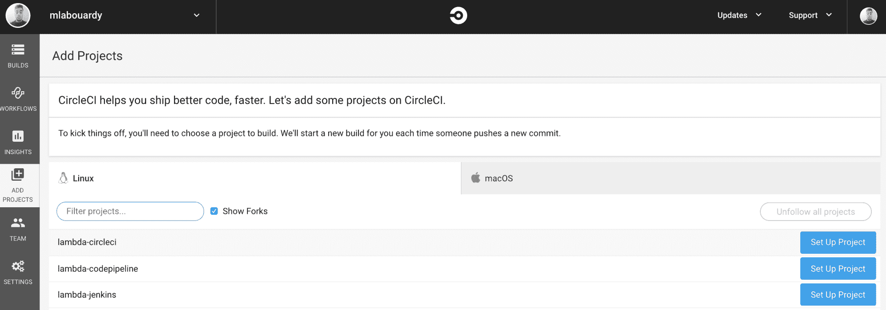

与 Jenkins 和 CodeBuild 类似，CircleCI 将需要访问一些 AWS 服务。因此，需要一个 IAM 用户。返回 AWS 管理控制台，并创建一个名为**circleci**的新 IAM 用户。生成 AWS 凭据，然后从 CircleCI 项目的设置中点击“设置”，然后粘贴 AWS 访问和秘密密钥，如下面的屏幕截图所示：

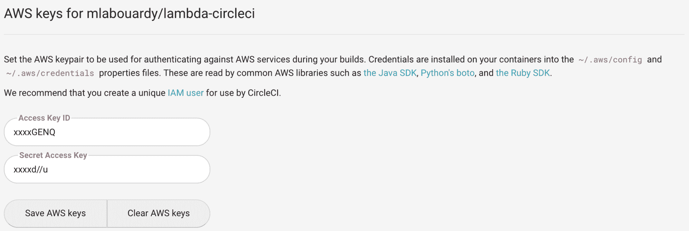

确保附加了具有对 S3 读/写权限和 Lambda 函数的权限的 IAM 策略到 IAM 用户。

# 配置 CI 管道

现在我们的项目已经设置好，我们需要定义 CI 工作流程；为此，我们需要在`.circleci`文件夹中创建一个名为`config.yml`的定义文件，其中包含以下内容：

```go
version: 2
jobs:
  build:
    docker:
      - image: golang:1.8

    working_directory: /go/src/github.com/mlabouardy/lambda-circleci

    environment:
        S3_BUCKET: movies-api-deployment-packages

    steps:
      - checkout

      - run:
         name: Install AWS CLI & Zip
         command: |
          apt-get update
          apt-get install -y zip python-pip python-dev
          pip install awscli

      - run:
          name: Test
          command: |
           go get -u github.com/golang/lint/golint
           go get -t ./...
           golint -set_exit_status
           go vet .
           go test .

      - run:
         name: Build
         command: |
          GOOS=linux go build -o main main.go
          zip $CIRCLE_SHA1.zip main

      - run:
          name: Push
          command: aws s3 cp $CIRCLE_SHA1.zip s3://$S3_BUCKET

      - run:
          name: Deploy
          command: |
            aws lambda update-function-code --function-name FindAllMovies \
                --s3-bucket $S3_BUCKET \
                --s3-key $CIRCLE_SHA1.zip --region us-east-1
```

构建环境将是 DockerHub 中 Go 官方 Docker 镜像。从该镜像中，将创建一个新容器，并按照*steps*部分中列出的命令执行：

1.  从 GitHub 存储库中检出代码。

1.  安装 AWS CLI 和 ZIP 命令。

1.  执行自动化测试。

1.  从源代码构建单个二进制文件并压缩部署包。与构建对应的提交 ID 将用作 zip 文件的名称（请注意使用`CIRCLE_SHA1`环境变量）。

1.  将工件保存在 S3 存储桶中。

1.  使用 AWS CLI 更新 Lambda 函数的代码。

一旦模板被定义并提交到 GitHub 存储库，将触发新的构建，如下所示：

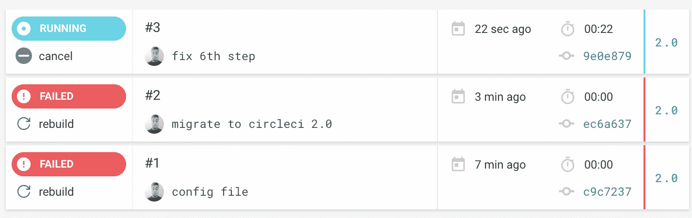

当流水线成功运行时，它会是这个样子：

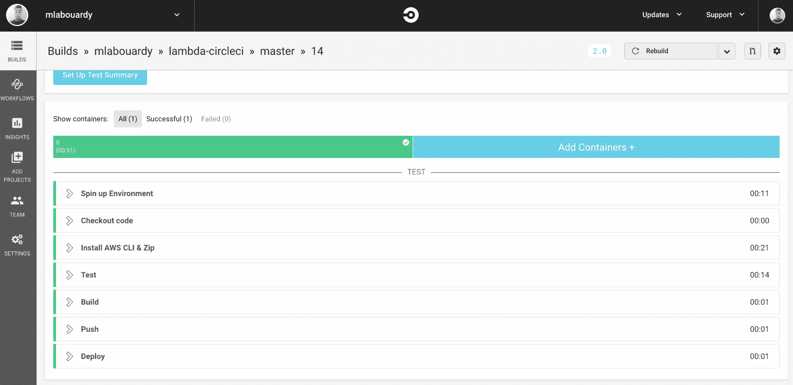

基本上就是这样。本章只是初步介绍了 CI/CD 流水线的功能，但应该为您开始实验和构建 Lambda 函数的端到端工作流提供了足够的基础。

# 总结

在本章中，我们学习了如何从头开始设置 CI/CD 流水线，自动化 Lambda 函数的部署过程，以及如何使用不同的 CI 工具和服务来实现这个解决方案，从 AWS 托管服务到高度可扩展的构建服务器。

在下一章中，我们将通过为我们的无服务器 API 编写自动化单元和集成测试，以及使用无服务器函数构建带有 REST 后端的单页面应用程序，构建这个流水线的改进版本。

# 问题

1.  使用 CodeBuild 和 CodePipeline 为其他 Lambda 函数实现 CI/CD 流水线。

1.  使用 Jenkins Pipeline 实现类似的工作流。

1.  使用 CircleCI 实现相同的流水线。

1.  在现有流水线中添加一个新阶段，如果当前的 git 分支是主分支，则发布一个新版本。

1.  配置流水线，在每次部署或更新新的 Lambda 函数时，在 Slack 频道上发送通知。
