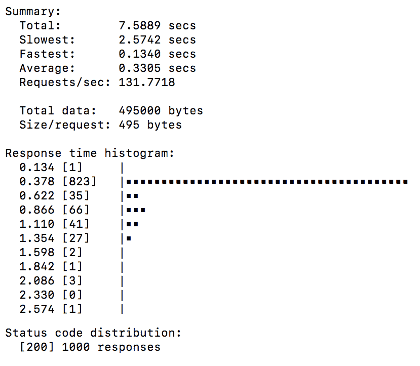
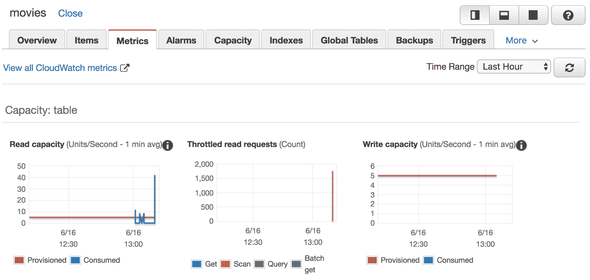
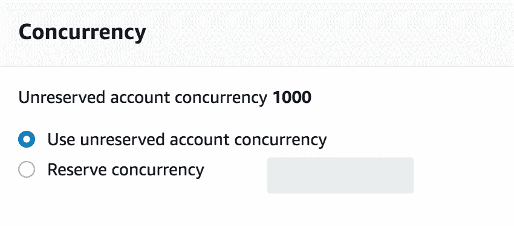
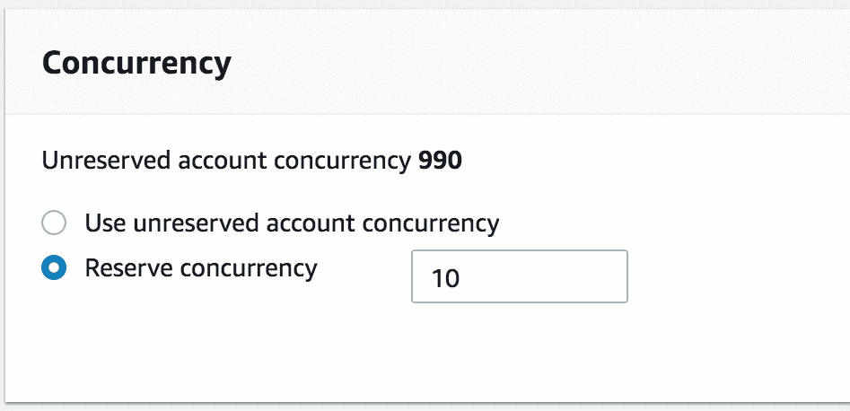
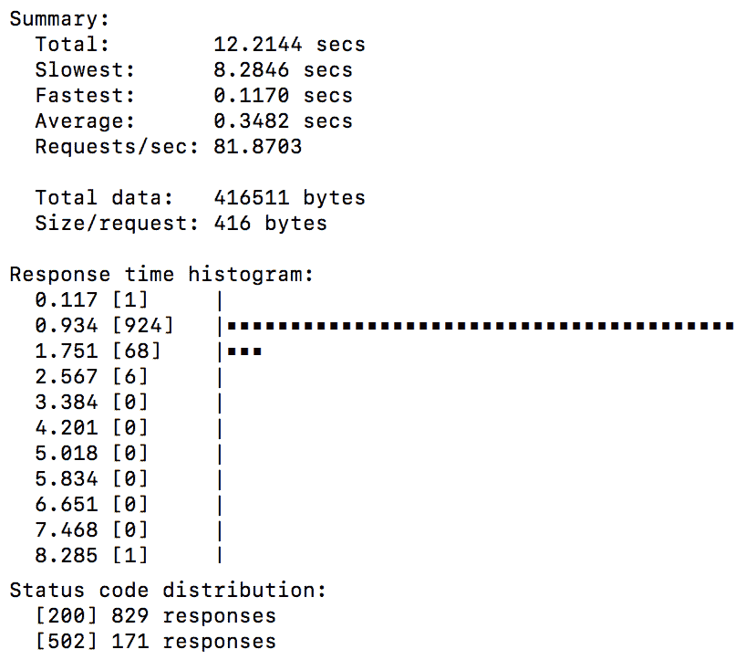
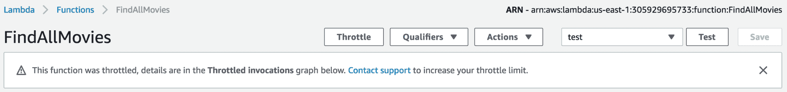
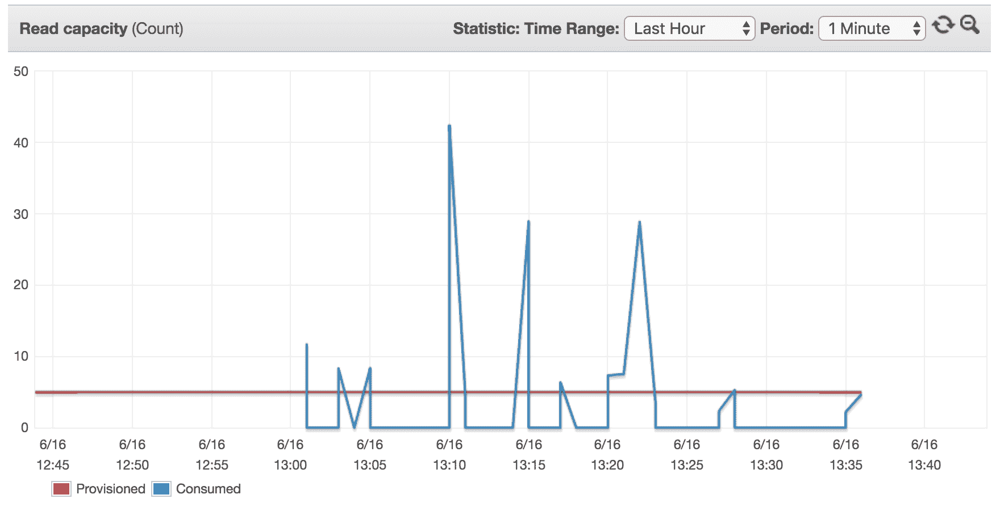

# 扩展您的应用程序

本章是上一技术章节的一个短暂休息，我们将深入探讨以下内容：

+   无服务器自动扩展的工作原理

+   Lambda 如何在高峰服务使用期间处理流量需求，而无需容量规划或定期扩展

+   AWS Lambda 如何使用并发性来并行创建多个执行以执行函数的代码

+   它如何影响您的成本和应用程序性能。

# 技术要求

本章是上一章的后续，因为它将使用上一章中构建的无服务器 API；建议在处理本节之前先阅读上一章。

# 负载测试和扩展

在这部分中，我们将生成随机工作负载，以查看 Lambda 在传入请求增加时的表现。为了实现这一点，我们将使用负载测试工具，比如**Apache Bench**。在本章中，我将使用`hey`，这是一个基于 Go 的工具，由于 Golang 内置的并发性，它非常高效和快速，比传统的`HTTP`基准测试工具更快。您可以通过在终端中安装以下`Go`包来下载它：

```go
go get -u github.com/rakyll/hey
```

确保`$GOPATH`变量被设置，以便能够在任何当前目录下执行`hey`命令，或者您可以将`$HOME/go/bin`文件夹添加到`$PATH`变量中。

# Lambda 自动扩展

现在，我们准备通过执行以下命令来运行我们的第一个测试或负载测试：

```go
hey -n 1000 -c 50 https://51cxzthvma.execute-api.us-east-1.amazonaws.com/staging/movies
```

如果您更喜欢 Apache Benchmark，可以通过将**hey**关键字替换为**ab**来使用相同的命令。

该命令将打开 50 个连接，并对 API Gateway 端点 URL 执行 1,000 个请求，用于`FindAllMovies`函数。在测试结束时，**hey**将显示有关总响应时间的信息以及每个请求的详细信息，如下所示：



确保用您自己的调用 URL 替换调用 URL。另外，请注意，截图的某些部分已被裁剪，以便只关注有用的内容。

除了总响应时间外，**hey**还输出了一个响应时间直方图，显示第一个请求花费更多时间（大约 2 秒）来响应，这可以解释为 Lambda 需要下载部署包并初始化新容器的**冷启动**。然而，其余的请求很快（不到 800 毫秒），这是由于**热启动**和使用先前请求的现有容器。

从先前的基准测试中，我们可以说 Lambda 在流量增加时保持了自动扩展的承诺；虽然这可能是一件好事，但它也有缺点，我们将在下一节中看到。

# 下游资源

在我们的 Movies API 示例中，DynamoDB 表已被用于解决无状态问题。该表要求用户提前定义读取和写入吞吐量容量，以创建必要的基础设施来处理定义的流量。在第五章中，*使用 DynamoDB 管理数据持久性*，我们使用了默认的吞吐量，即五个读取容量单位和五个写入容量单位。五个读取容量单位对于不太重读的 API 来说非常有效。在先前的负载测试中，我们创建了 50 个并发执行，也就是说，对`movies`表进行了 50 次并行读取。结果，表将遭受高读取吞吐量，并且`Scan`操作将变慢，DynamoDB 可能会开始限制请求。

我们可以通过转到 DynamoDB 控制台，并点击`movies`表的**Metrics**选项卡来验证这一点，如下截图所示：



显然，读取容量图经历了一个高峰期，导致读取请求被限制，并且表格被所有这些传入的请求压倒。

DynamoDB 的限流请求可以通过启用自动扩展机制来增加预留的读写容量以处理突然增加的流量，或者通过重用存储在内存缓存引擎中的查询结果（可以使用 AWS ElastiCache 与 Redis 或 Memcached 引擎等解决方案）来避免过载表并减少函数执行时间。但是，您无法限制和保护数据库资源免受 Lambda 函数扩展事件的影响。

# 私有 Lambda 函数

如果您的 Lambda 函数在私有 VPC 中运行，可能会出现并发问题，因为它需要将**弹性网络接口**（ENI）附加到 Lambda 容器，并等待分配 IP 地址。AWS Lambda 使用 ENI 安全连接到 VPC 中的内部资源。

除了性能不佳（附加 ENI 平均需要 4 秒），启用 VPC 的 Lambda 函数还需要您维护和配置一个用于互联网访问的 NAT 实例和多个可支持函数 ENI 扩展需求的 VPC 子网，这可能导致 VPC 的 IP 地址用尽。

总之，Lambda 函数的自动扩展是一把双刃剑；它不需要您进行容量规划。但是，它可能导致性能不佳和令人惊讶的月度账单。这就是**并发执行**模型发挥作用的地方。

# 并发执行

AWS Lambda 会根据流量增加动态扩展容量。但是，每次执行函数的代码数量是有限的。这个数量称为并发执行，它是根据 AWS 区域定义的。默认并发限制是每个 AWS 区域 1000 个。那么，如果您的函数超过了这个定义的阈值会发生什么呢？继续阅读以了解详情。

# Lambda 限流

如果并发执行计数超过限制，Lambda 会对您的函数应用限流（速率限制）。因此，剩余的传入请求将不会调用该函数。

调用客户端负责根据返回的`HTTP`代码（`429` =请求过多）实施基于退避策略的重试失败请求。值得一提的是，Lambda 函数可以配置为在一定数量的重试后将未处理的事件存储到名为**死信队列**的队列中。

在某些情况下，限流可能是有用的，因为并发执行容量是所有函数共享的（在我们的示例中，`find`、`update`、`insert`和`delete`函数）。您可能希望确保一个函数不会消耗所有容量，并避免其他 Lambda 函数的饥饿。如果您的某个函数比其他函数更常用，这种情况可能经常发生。例如，考虑`FindAllMovies`函数。假设现在是假期季，很多客户会使用您的应用程序查看可租用的电影列表，这可能导致多次调用`FindAllMovies` Lambda 函数。

幸运的是，AWS 增加了一个新功能，允许您预先保留和定义每个 Lambda 函数的并发执行值。这个属性允许您为函数指定一定数量的保留并发，以确保您的函数始终具有足够的容量来处理即将到来的事件或请求。例如，您可以为您的函数设置如下速率限制：

+   `FindAllMovies`函数：500

+   `InsertMovie`函数：100

+   `UpdateMovie`函数：50

+   剩下的将分享给其他人

在接下来的部分中，我们将看到如何为`FindAllMovies`定义保留的并发执行，并且它如何影响 API 的性能。

您可以使用以下公式估算并发执行计数：`每秒事件/请求*函数持续时间`。

# 并发执行预留

导航到 AWS Lambda 控制台（[`console.aws.amazon.com/lambda/home`](https://console.aws.amazon.com/lambda/home)）并单击 FindAllMovies 函数。在并发 部分，我们可以看到我们的函数仅受账户中可用并发总量的限制，该总量为**1000**，如下截图所示：



我们将通过在保留账户的并发字段中定义 10 来更改这一点。这样可以确保在任何给定时间内只有 10 个并行执行函数。这个值将从未保留账户的并发池中扣除，如下所示：



您可以设置的最大保留并发数是 900，因为 AWS Lambda 保留了 100 个用于其他函数，以便它们仍然可以处理请求和事件。

或者，可以使用 AWS CLI 与`put-function-concurrency`命令来设置并发限制：

```go
aws lambda put-function-concurrency --function FindAllMovies --reserved-concurrent-executions 10
```

再次使用之前给出的相同命令生成一些工作负载：

```go
hey -n 1000 -c 50 https://51cxzthvma.execute-api.us-east-1.amazonaws.com/staging/movies
```

这一次，结果将会不同，因为 1000 个请求中有 171 个失败，显示为 502 错误代码，如下所示：



超过 10 个并发执行时，将应用限流，并拒绝部分请求，返回 502 响应代码。

我们可以通过返回到函数控制台来确认这一点；我们应该看到类似于以下截图中显示的警告消息：



如果您打开与`movies`表相关的指标并跳转到读取容量图表，您会看到我们的读取容量仍然受到控制，并且低于定义的 5 个读取单位容量：



如果您计划对 Lambda 函数进行维护并希望暂时停止其调用，可以使用限流。这可以通过将函数并发设置为 0 来实现。

限流按预期工作，现在您正在保护下游资源免受 Lambda 函数过载的影响。

# 摘要

在本章中，我们了解到 Lambda 由于 AWS 区域设置的执行限制，无法无限扩展。这个限制可以通过联系 AWS 支持团队来提高。我们还介绍了函数级别的并发预留如何帮助您保护下游资源，如果您正在使用启用了 VPC 的 Lambda 函数，则匹配子网大小，并在开发和测试函数期间控制成本。

在下一章中，我们将在无服务器 API 的基础上构建一个用户友好的 UI，具有 S3 静态托管网站功能。
