# 使用 S3 构建前端

在这一章中，我们将学习以下内容：

+   如何构建一个消耗 API Gateway 响应的静态网站，使用 AWS 简单存储服务

+   如何通过 CloudFront 分发优化对网站资产的访问，例如 JavaScript、CSS、图像

+   如何为无服务器应用程序设置自定义域名

+   如何创建 SSL 证书以使用 HTTPS 显示您的内容

+   使用 CI/CD 管道自动化 Web 应用程序的部署过程。

# 技术要求

在继续本章之前，您应该对 Web 开发有基本的了解，并了解 DNS 的工作原理。本章的代码包托管在 GitHub 上，网址为[`github.com/PacktPublishing/Hands-On-Serverless-Applications-with-Go`](https://github.com/PacktPublishing/Hands-On-Serverless-Applications-with-Go)。

# 单页应用程序

在本节中，我们将学习如何构建一个 Web 应用程序，该应用程序将调用我们在之前章节中构建的 API Gateway 调用 URL，并列出电影，如下所示：

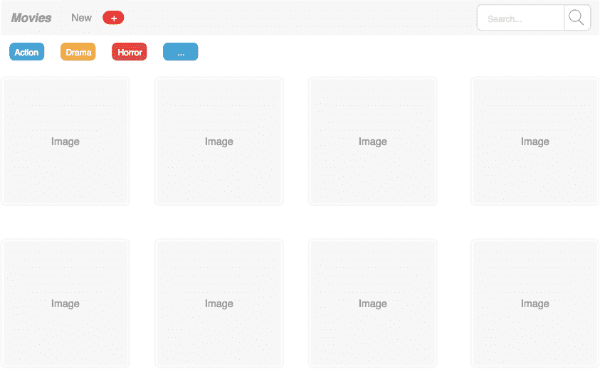

对于每部电影，我们将显示其封面图像和标题。此外，用户可以通过单击右侧的按钮来按类别筛选电影。最后，如果用户单击导航栏上的“New”按钮，将弹出一个模态框，要求用户填写以下字段：

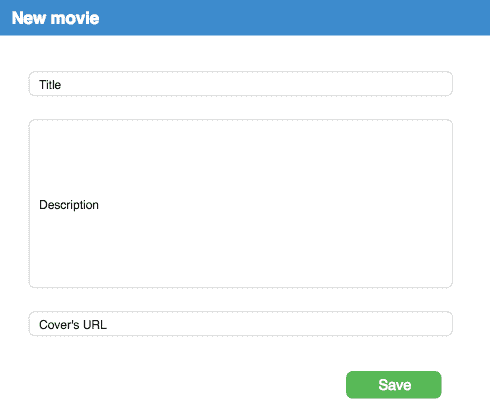

现在应用程序的模拟已经定义，我们将使用 JavaScript 框架快速构建 Web 应用程序。例如，我将使用当前最新稳定版本的 Angular 5。

# 使用 Angular 开发 Web 应用程序

Angular 是由 Google 开发的完全集成的框架。它允许您构建动态 Web 应用程序，而无需考虑选择哪些库以及如何处理日常问题。请记住，目标是要吸引大量观众，因此选择了 Angular 作为最常用的框架之一。但是，您可以选择您熟悉的任何框架，例如 React、Vue 或 Ember。

除了内置的可用模块外，Angular 还利用了**单页应用程序**（SPA）架构的强大功能。这种架构允许您在不刷新浏览器的情况下在页面之间导航，因此使应用程序更加流畅和响应，包括更好的性能（您可以预加载和缓存额外的页面）。

Angular 自带 CLI。您可以按照[`cli.angular.io`](https://cli.angular.io)上的逐步指南进行安装。本书专注于 Lambda。因此，本章仅涵盖了 Angular 的基本概念，以便让那些不是 Web 开发人员的人能够轻松理解。

一旦安装了**Angular CLI**，我们需要使用以下命令创建一个新的 Angular 应用程序：

```go
ng new frontend
```

CLI 将生成基本模板文件并安装所有必需的**npm**依赖项以运行 Angular 5 应用程序。文件结构如下：

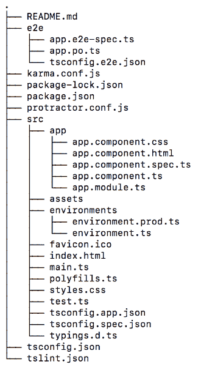

接下来，在`frontend`目录中，使用以下命令启动本地 Web 服务器：

```go
ng serve
```

该命令将编译所有的`TypeScripts`文件，构建项目，并在端口`4200`上启动 Web 服务器：

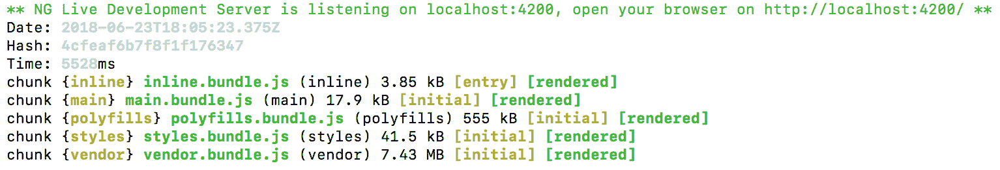

打开浏览器并导航至[`localhost:4200`](http://localhost:4200)。您在浏览器中应该看到以下内容：

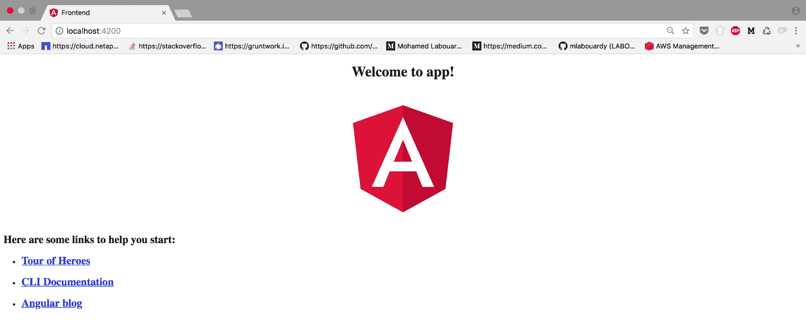

现在我们的示例应用程序已构建并运行，让我们创建我们的 Web 应用程序。Angular 结构基于组件和服务架构（类似于模型-视图-控制器）。

# 生成您的第一个 Angular 组件

对于那些没有太多 Angular 经验的人来说，组件基本上就是 UI 的乐高积木。您的 Web 应用程序可以分为多个组件。每个组件都有以下文件：

+   **COMPONENT_NAME.component.ts**：用 TypeScript 编写的组件逻辑定义

+   **COMPONENT_NAME.component.html**：组件的 HTML 代码

+   **COMPONENT_NAME.component.css**：组件的 CSS 结构

+   **COMPONENT_NAME.component.spec.ts**：组件类的单元测试

在我们的示例中，我们至少需要三个组件：

+   导航栏组件

+   电影列表组件

+   电影组件

在创建第一个组件之前，让我们安装**Bootstrap**，这是 Twitter 开发的用于构建吸引人用户界面的前端 Web 框架。它带有一组基于 CSS 的设计模板，用于表单、按钮、导航和其他界面组件，以及可选的 JavaScript 扩展。

继续在终端中安装 Bootstrap 4：

```go
npm install bootstrap@4.0.0-alpha.6
```

接下来，在`.angular-cli.json`文件中导入 Bootstrap CSS 类，以便在应用程序的所有组件中使 CSS 指令可用：

```go
"styles": [
   "styles.css",
   "../node_modules/bootstrap/dist/css/bootstrap.min.css"
]
```

现在我们准备通过发出以下命令来创建我们的导航栏组件：

```go
ng generate component components/navbar
```

覆盖默认生成的`navbar.component.html`中的 HTML 代码，以使用 Bootstrap 框架提供的导航栏：

```go
<nav class="navbar navbar-toggleable-md navbar-light bg-faded">
  <button class="navbar-toggler navbar-toggler-right" type="button" data-toggle="collapse" data-target="#navbarSupportedContent" aria-controls="navbarSupportedContent" aria-expanded="false" aria-label="Toggle navigation">
    <span class="navbar-toggler-icon"></span>
  </button>
  <a class="navbar-brand" href="#">Movies</a>

  <div class="collapse navbar-collapse" id="navbarSupportedContent">
    <ul class="navbar-nav mr-auto">
      <li class="nav-item active">
        <a class="nav-link" href="#">New <span class="sr-only">(current)</span></a>
      </li>
    </ul>
    <form class="form-inline my-2 my-lg-0">
      <input class="form-control mr-sm-2" type="text" placeholder="Search ...">
      <button class="btn btn-outline-success my-2 my-sm-0" type="submit">GO !</button>
    </form>
  </div>
</nav>
```

打开`navbar.component.ts`并将选择器属性更新为`movies-navbar`。这里的选择器只是一个标签，可以用来引用其他组件上的组件：

```go
@Component({
  selector: 'movies-navbar',
  templateUrl: './navbar.component.html',
  styleUrls: ['./navbar.component.css']
})
export class NavbarComponent implements OnInit {
   ...
}
```

`movies-navbar`选择器需要添加到`app.component.html`文件中，如下所示：

```go
<movies-navbar></movies-navbar> 
```

Angular CLI 使用实时重新加载。因此，每当我们的代码更改时，CLI 将重新编译，重新注入（如果需要），并要求浏览器刷新页面：

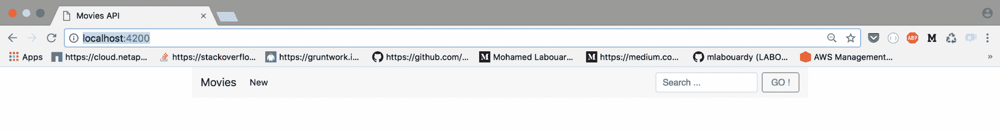

当添加`movies-navbar`标签时，`navbar.component.html`文件中的所有内容都将显示在浏览器中。

同样，我们将为电影项目创建一个新组件：

```go
ng generate component components/movie-item
```

我们将在界面中将电影显示为卡片；用以下内容替换`movie-item.component.html`代码：

```go
<div class="card" style="width: 20rem;">
  
  <div class="card-block">
    <h4 class="card-title">Movie</h4>
    <p class="card-text">Some quick description</p>
    <a href="#" class="btn btn-primary">Rent</a>
  </div>
</div>
```

在浏览器中，您应该看到类似于这样的东西：

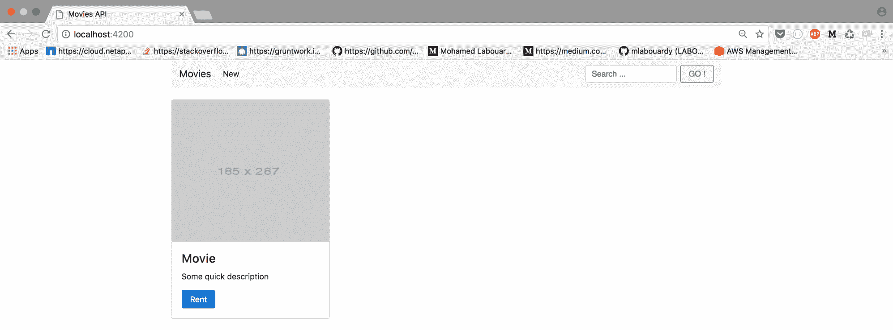

创建另一个组件来显示电影列表：

```go
ng generate component components/list-movies
```

该组件将使用 Angular 的`ngFor`指令来遍历`movies`数组中的`movie`并通过调用`movie-item`组件打印出电影（这称为组合）：

```go
<div class="row">
  <div class="col-sm-3" *ngFor="let movie of movies">
    <movie-item></movie-item>
  </div>
</div>
```

`movies`数组在`list-movies.component.ts`中声明，并在类构造函数中初始化：

```go
import { Component, OnInit } from '@angular/core';
import { Movie } from '../../models/movie';

@Component({
  selector: 'list-movies',
  templateUrl: './list-movies.component.html',
  styleUrls: ['./list-movies.component.css']
})
export class ListMoviesComponent implements OnInit {

  public movies: Movie[];

  constructor() {
    this.movies = [
      new Movie("Avengers", "Some description", "https://image.tmdb.org/t/p/w370_and_h556_bestv2/cezWGskPY5x7GaglTTRN4Fugfb8.jpg"),
      new Movie("Thor", "Some description", "https://image.tmdb.org/t/p/w370_and_h556_bestv2/bIuOWTtyFPjsFDevqvF3QrD1aun.jpg"),
      new Movie("Spiderman", "Some description"),
    ]
  }

  ...

}
```

`Movie`类是一个简单的实体，有三个字段，即`name`，`cover`和`description`，以及用于访问和修改类属性的 getter 和 setter：

```go
export class Movie {
  private name: string;
  private cover: string;
  private description: string;

  constructor(name: string, description: string, cover?: string){
    this.name = name;
    this.description = description;
    this.cover = cover ? cover : "http://via.placeholder.com/185x287";
  }

  public getName(){
    return this.name;
  }

  public getCover(){
    return this.cover;
  }

  public getDescription(){
    return this.description;
  }

  public setName(name: string){
    this.name = name;
  }

  public setCover(cover: string){
    this.cover = cover;
  }

  public setDescription(description: string){
    this.description = description;
  }
}
```

如果我们运行上述代码，我们将在浏览器中看到三部电影：

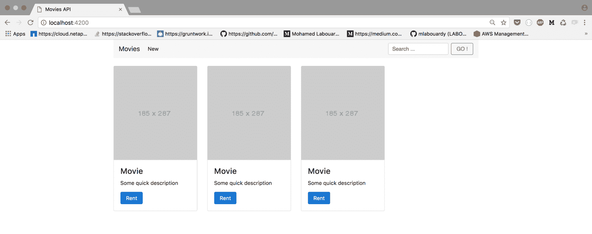

到目前为止，电影属性在 HTML 页面中是硬编码的，为了改变这一点，我们需要将电影项目传递给`movie-item`元素。更新`movie-item.component.ts`以添加一个新的电影字段，并使用`Input`注释来使用 Angular 输入绑定：

```go
export class MovieItemComponent implements OnInit {
  @Input()
  public movie: Movie;

  ...
}
```

在前面组件的 HTML 模板中，使用`Movie`类的 getter 来获取属性的值：

```go
<div class="card">
    
    <div class="card-block">
      <h4 class="card-title">{{movie.getName()}}</h4>
      <p class="card-text">{{movie.getDescription()}}</p>
      <a href="#" class="btn btn-primary">Rent</a>
    </div>
</div>
```

最后，使`ListMoviesComponent`将`MovieItemComponent`子嵌套在`*ngFor`重复器中，并在每次迭代中将`movie`实例绑定到子的`movie`属性上：

```go
<div class="row">
  <div class="col-sm-3" *ngFor="let movie of movies">
    <movie-item [movie]="movie"></movie-item>
  </div>
</div>
```

在浏览器中，您应该确保电影的属性已经正确定义：

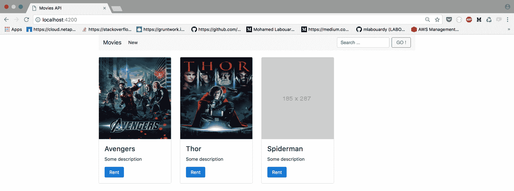

到目前为止一切都很顺利。但是，电影列表仍然是静态的和硬编码的。我们将通过调用无服务器 API 从数据库动态检索电影列表来解决这个问题。

# 使用 Angular 访问 Rest Web 服务

在前几章中，我们创建了两个阶段，即`staging`和`production`环境。因此，我们应该创建两个环境文件，以指向正确的 API Gateway 部署阶段：

+   `environment.ts`：包含开发 HTTP URL：

```go
export const environment = {
  api: 'https://51cxzthvma.execute-api.us-east-1.amazonaws.com/staging/movies'
};
```

+   `environment.prod.ts`：包含生产 HTTP URL：

```go
export const environment = {
  api: 'https://51cxzthvma.execute-api.us-east-1.amazonaws.com/production/movies'
};
```

如果执行`ng build`或`ng serve`，`environment`对象将从`environment.ts`中读取值，并且如果使用`ng build --prod`命令将应用程序构建为生产模式，则将从`environment.prod.ts`中读取值。

要创建服务，我们需要使用命令行。命令如下：

```go
ng generate service services/moviesApi
```

`movies-api.service.ts`将实现`findAll`函数，该函数将使用`Http`服务调用 API Gateway 的`findAll`端点。`map`方法将帮助将响应转换为 JSON 格式：

```go
import { Injectable } from '@angular/core';
import { Http } from '@angular/http';
import 'rxjs/add/operator/map';
import { environment } from '../../environments/environment';

@Injectable()
  export class MoviesApiService {

    constructor(private http:Http) { }

    findAll(){
      return this.http
      .get(environment.api)
      .map(res => {
        return res.json()
      })
    }

}
```

在调用`MoviesApiService`之前，需要在`app.module.ts`的主模块中的提供程序部分导入它。

更新`MoviesListComponent`以调用新服务。在浏览器控制台中，您应该会收到有关 Access-Control-Allow-Origin 头在 API Gateway 返回的响应中不存在的错误消息。这将是即将到来部分的主题：

！[](img/851f2f1c-7972-4bc7-bdc7-5f9b7f7a7bb5.png)

# 跨域资源共享

出于安全目的，如果外部请求与您的网站的确切主机、协议和端口不匹配，浏览器将阻止流。在我们的示例中，我们有不同的域名（localhost 和 API Gateway URL）。

这种机制被称为**同源策略**。为了解决这个问题，您可以使用 CORS 头、代理服务器或 JSON 解决方法。在本节中，我将演示如何在 Lambda 函数返回的响应中使用 CORS 头来解决此问题：

1.  修改`findAllMovie`函数的代码以添加`Access-Control-Allow-Origin:*`以允许来自任何地方的跨域请求（或指定域而不是*）：

```go
return events.APIGatewayProxyResponse{
    StatusCode: 200,
    Headers: map[string]string{
      "Content-Type": "application/json",
      "Access-Control-Allow-Origin": "*",
    },
    Body: string(response),
  }, nil
```

1.  提交您的更改；应触发新的构建。在 CI/CD 管道的最后，`FindAllMovies` Lambda 函数的代码将被更新。测试一下；您应该会在`headers`属性的一部分中看到新的密钥：

！[](img/07d58921-c7aa-4a90-b4c1-07eeb1c06fc0.png)

1.  如果刷新 Web 应用程序页面，JSON 对象也将显示在控制台中：

！[](img/c4214806-29e1-4105-98d1-f7c212456f0e.png)

1.  更新`list-movies.component.ts`以调用`MoviesApiService`的`findAll`函数。返回的数据将存储在`movies`变量中：

```go
constructor(private moviesApiService: MoviesApiService) {
  this.movies = []

  this.moviesApiService.findAll().subscribe(res => {
    res.forEach(movie => {
    this.movies.push(new Movie(movie.name, "Some description"))
    })
  })
}
```

1.  结果，电影列表将被检索并显示：

！[](img/deeaef10-1459-4d94-ba8d-3ce1d7d111c0.png)

1.  我们没有封面图片；您可以更新 DynamoDB 的`movies`表以添加图像和描述属性：

！[](img/05553e5c-ccd9-442f-b0e1-340b1d1880ec.png)

NoSQL 数据库允许您随时更改表模式，而无需首先定义结构，而关系数据库则要求您使用预定义的模式来确定在处理数据之前的结构。

1.  如果刷新 Web 应用程序页面，您应该可以看到带有相应描述和海报封面的电影：

！[](img/38fd8f1e-4d36-468e-baca-ea0ea6b6d55f.png)

1.  通过实现新的电影功能来改进此 Web 应用程序。由于用户需要填写电影的图像封面和描述，因此我们需要更新`insert` Lambda 函数，以在后端生成随机唯一 ID 的同时添加封面和描述字段：

```go
svc := dynamodb.New(cfg)
req := svc.PutItemRequest(&dynamodb.PutItemInput{
  TableName: aws.String(os.Getenv("TABLE_NAME")),
  Item: map[string]dynamodb.AttributeValue{
    "ID": dynamodb.AttributeValue{
      S: aws.String(uuid.Must(uuid.NewV4()).String()),
    },
    "Name": dynamodb.AttributeValue{
      S: aws.String(movie.Name),
    },
    "Cover": dynamodb.AttributeValue{
      S: aws.String(movie.Cover),
    },
    "Description": dynamodb.AttributeValue{
      S: aws.String(movie.Description),
    },
  },
})
```

1.  一旦新更改被推送到代码存储库并部署，打开您的 REST 客户端并发出 POST 请求以添加新的电影，其 JSON 方案如下：

！[](img/06a712ec-4680-4479-a7a0-0ff4dd8b9a4f.png)

1.  应返回`200`成功代码，并且在 Web 应用程序中应列出新电影：

！[](img/604c09c6-c24d-4dae-916c-2e9d1cffd8ba.png)

如*单页应用程序*部分所示，当用户点击“新建”按钮时，将弹出一个带有创建表单的模态框。为了构建这个模态框并避免使用 jQuery，我们将使用另一个库，该库提供了一组基于 Bootstrap 标记和 CSS 的本机 Angular 指令：

+   使用以下命令安装此库：

```go
npm install --save @ng-bootstrap/ng-bootstrap@2.0.0
```

+   安装后，需要将其导入到主`app.module.ts`模块中，如下所示：

```go
import {NgbModule} from '@ng-bootstrap/ng-bootstrap';

@NgModule({
  declarations: [AppComponent, ...],
  imports: [NgbModule.forRoot(), ...],
  bootstrap: [AppComponent]
})
export class AppModule {
}
```

+   为了容纳创建表单，我们需要创建一个新的组件：

```go
ng generate component components/new-movie
```

+   该组件将有两个用于电影标题和封面链接的`input`字段。另外，还有一个用于电影描述的`textarea`元素：

```go
<div class="modal-header">
 <h4 class="modal-title">New Movie</h4>
 <button type="button" class="close" aria-label="Close" (click)="d('Cross click')">
 <span aria-hidden="true">&times;</span>
 </button>
</div>
<div class="modal-body">
 <div *ngIf="showMsg" class="alert alert-success" role="alert">
 <b>Well done !</b> You successfully added a new movie.
 </div>
 <div class="form-group">
 <label for="title">Title</label>
 <input type="text" class="form-control" #title>
 </div>
 <div class="form-group">
 <label for="description">Description</label>
 <textarea class="form-control" #description></textarea>
 </div>
 <div class="form-group">
 <label for="cover">Cover</label>
 <input type="text" class="form-control" #cover>
 </div>
</div>
<div class="modal-footer">
   <button type="button" class="btn btn-success" (click)="save(title.value, description.value, cover.value)">Save</button>
</div>
```

+   用户每次点击保存按钮时，将响应点击事件调用`save`函数。`MoviesApiService`服务中定义的`insert`函数调用 API Gateway 的`insert`端点上的`POST`方法：

```go
insert(movie: Movie){
  return this.http
    .post(environment.api, JSON.stringify(movie))
    .map(res => {
    return res
  })
}
```

+   在导航栏中的 New 元素上添加点击事件：

```go
<a class="nav-link" href="#" (click)="newMovie(content)">New <span class="badge badge-danger">+</span></a>
```

+   点击事件将调用`newMovie`并通过调用`ng-bootstrap`库的`ModalService`模块打开模态框：

```go
import { Component, OnInit, Input } from '@angular/core';
import { NgbModal } from '@ng-bootstrap/ng-bootstrap';

@Component({
 selector: 'movies-navbar',
 templateUrl: './navbar.component.html',
 styleUrls: ['./navbar.component.css']
})
export class NavbarComponent implements OnInit {

 constructor(private modalService: NgbModal) {}

 ngOnInit() {}

 newMovie(content){
 this.modalService.open(content);
 }

}
```

+   一旦编译了这些更改，从导航栏中单击“新建”项目，模态框将弹出。填写必填字段，然后单击保存按钮：

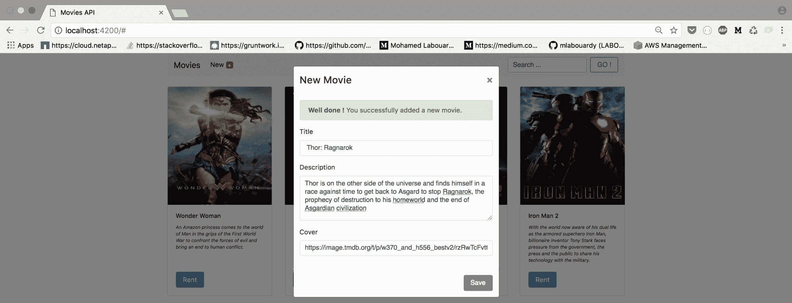

+   电影将保存在数据库表中。如果刷新页面，电影将显示在电影列表中：

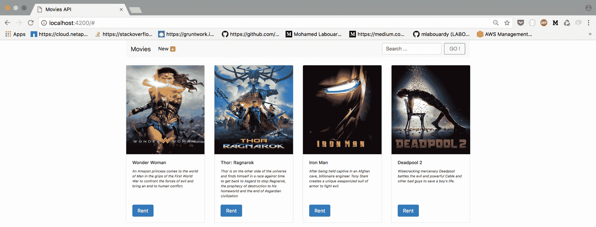

# S3 静态网站托管

现在我们的应用程序已创建，让我们将其部署到远程服务器。不要维护 Web 服务器，如 EC2 实例中的 Apache 或 Nginx，让我们保持无服务器状态，并使用启用了 S3 网站托管功能的 S3 存储桶。

# 设置 S3 存储桶

要开始，可以从 AWS 控制台或使用以下 AWS CLI 命令创建一个 S3 存储桶：

```go
aws s3 mb s3://serverlessmovies.com
```

接下来，为生产模式构建 Web 应用程序：

```go
ng build --prod
```

`--prod`标志将生成代码的优化版本，并执行额外的构建步骤，如 JavaScript 和 CSS 文件的最小化，死代码消除和捆绑：

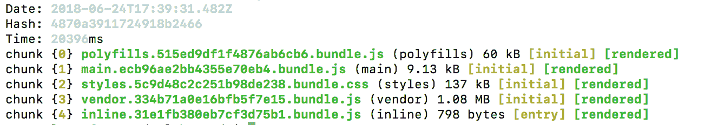

这将为您提供`dist/`目录，其中包含`index.html`和所有捆绑的`js`文件，准备用于生产。配置存储桶以托管网站：

```go
aws s3 website s3://serverlessmovies.com  -- index-document index.html
```

将*dist/*文件夹中的所有内容复制到之前创建的 S3 存储桶中：

```go
aws s3 cp --recursive dist/ s3://serverlessmovies.com/
```

您可以通过 S3 存储桶仪表板或使用`aws s3 ls`命令验证文件是否已成功存储：

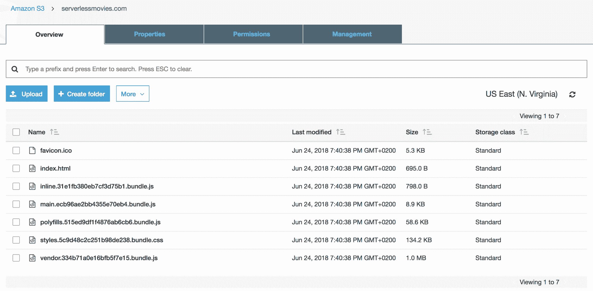

默认情况下，创建 S3 存储桶时是私有的。因此，您应该使用以下存储桶策略使其公开访问：

```go
{
  "Id": "Policy1529862214606",
  "Version": "2012-10-17",
  "Statement": [
    {
      "Sid": "Stmt1529862213126",
      "Action": [
        "s3:GetObject"
      ],
      "Effect": "Allow",
      "Resource": "arn:aws:s3:::serverlessmovies.com/*",
      "Principal": "*"
    }
  ]
}
```

在存储桶配置页面上，单击“权限”选项卡，然后单击“存储桶策略”，将策略内容粘贴到编辑器中，然后保存。将弹出警告消息，指示存储桶已变为公共状态：

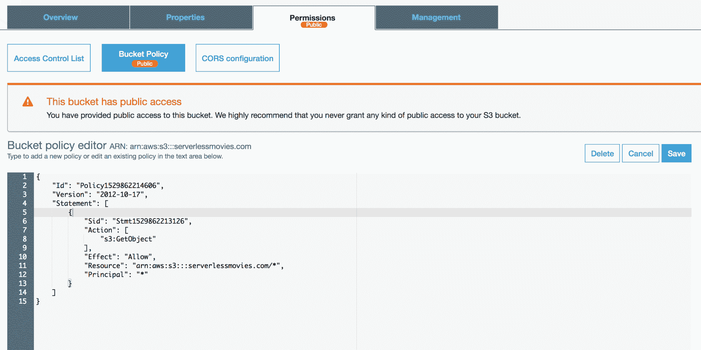

要访问 Web 应用程序，请将浏览器指向[`serverlessmovies.s3-website-us-east-1.amazonaws.com`](http://serverlessmovies.s3-website-us-east-1.amazonaws.com)（用您自己的存储桶名称替换）：

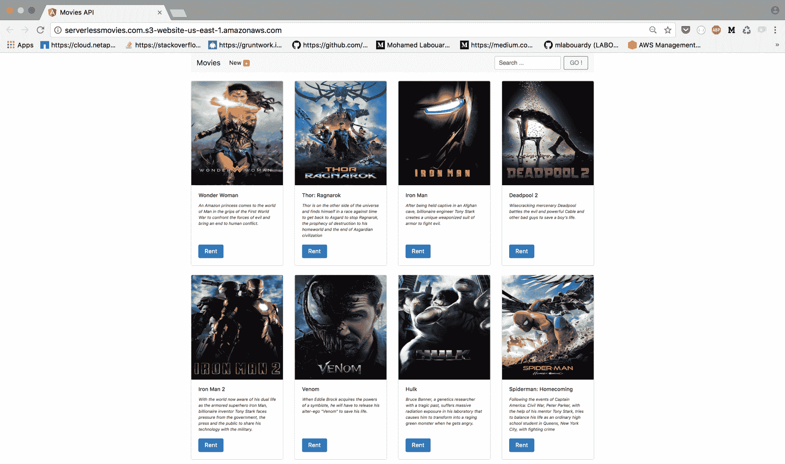

现在我们的应用程序已部署到生产环境，让我们创建一个自定义域名，以便用户友好地访问网站。为了将域流量路由到 S3 存储桶，我们将使用**Amazon Route 53**创建一个指向存储桶的别名记录。

# 设置 Route 53

如果您是 Route 53 的新手，请使用您拥有的域名创建一个新的托管区域，如下图所示。您可以使用现有的域名，也可以从亚马逊注册商或 GoDaddy 等外部 DNS 注册商购买一个域名。确保选择公共托管区域：

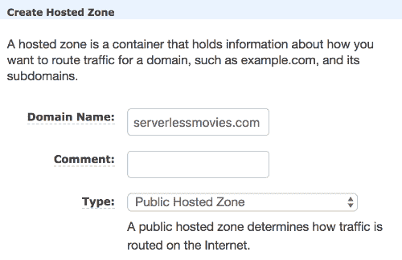

创建后，`NS`和`SOA`记录将自动为您创建。如果您从 AWS 购买了域名，您可以跳过此部分。如果没有，您必须更改您从域名注册商购买的域名的名称服务器记录。在本例中，我从 GoDaddy 购买了[`serverlessmovies.com/`](http://serverlessmovies.com/)域名，因此在域名设置页面上，我已将名称服务器更改为 AWS 提供的`NS`记录值，如下所示：

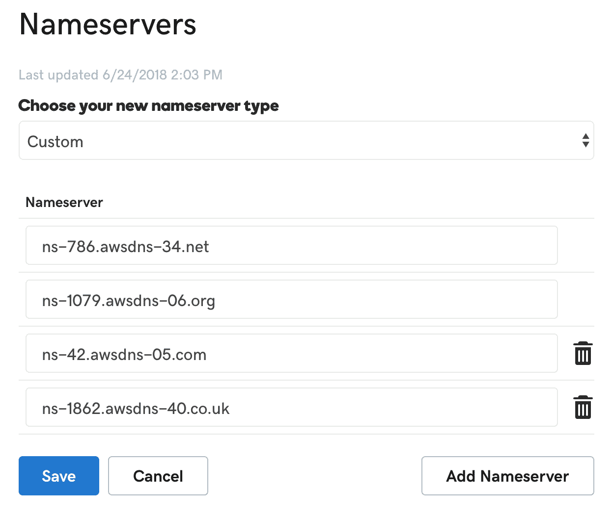

更改可能需要几分钟才能传播。一旦由注册商验证，跳转到`Route 53`并创建一个新的`A`别名记录，该记录指向我们之前创建的 S3 网站，方法是从下拉列表中选择目标 S3 存储桶：

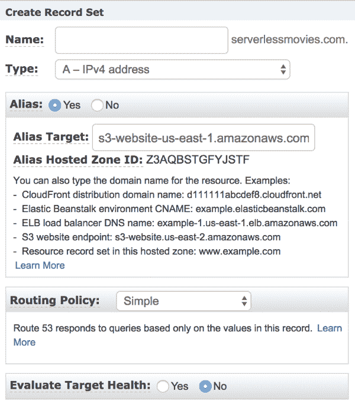

完成后，您将能够打开浏览器，输入您的域名，并查看您的 Web 应用程序：

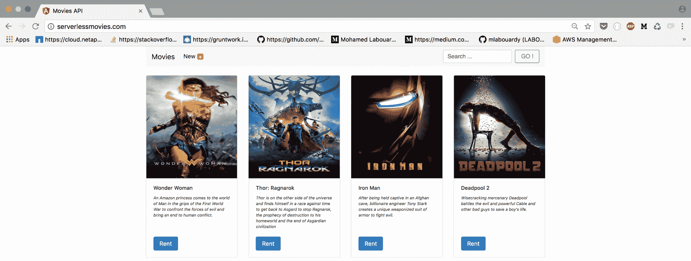

拥有一个安全的网站可以产生差异，并使用户更加信任您的 Web 应用程序，这就是为什么在接下来的部分中，我们将使用 AWS 提供的免费 SSL 来显示自定义域名的内容，并使用`HTTPS`。

# 证书管理器

您可以轻松地通过**AWS 证书管理器（ACM）**获得 SSL 证书。点击“请求证书”按钮创建一个新的 SSL 证书：

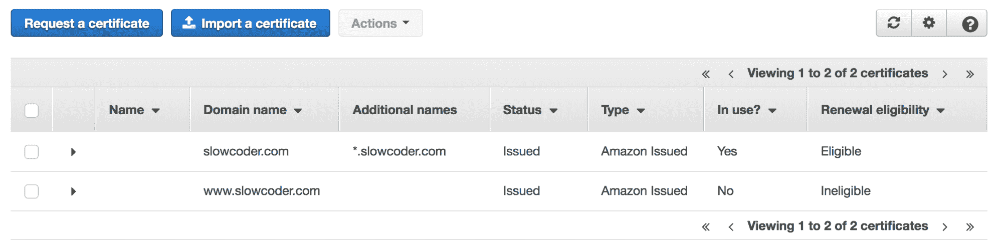

选择请求公共证书并添加您的域名。您可能还希望通过添加一个星号来保护您的子域：

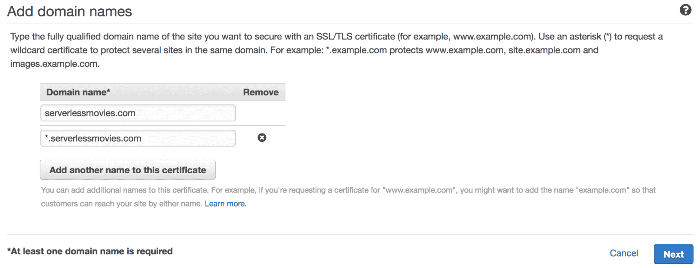

在两个域名下，点击 Route 53 中的创建记录按钮。这将自动在 Route 53 中创建一个`CNAME`记录集，并由 ACM 检查以验证您拥有这些域：

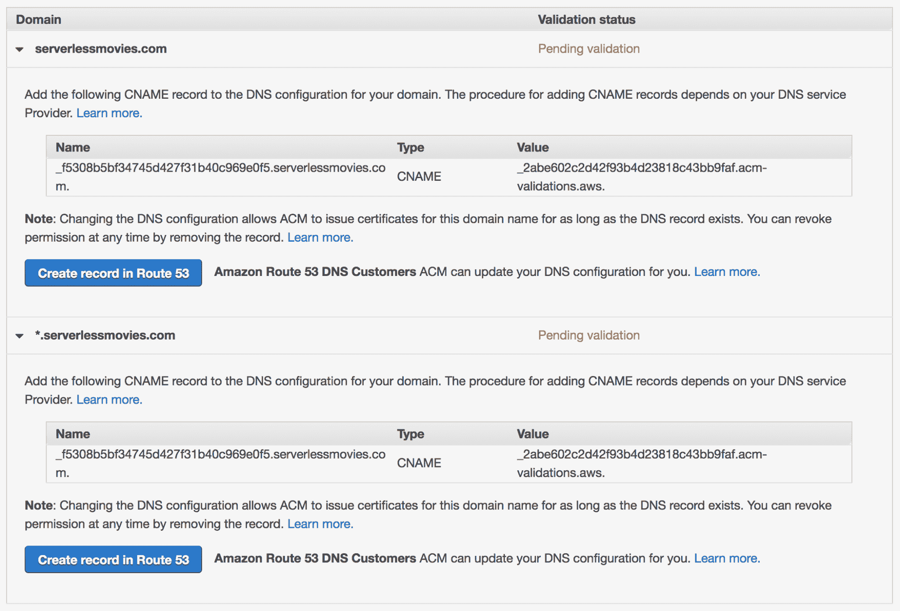

一旦亚马逊验证域名属于您，证书状态将从“待验证”更改为“已签发”：

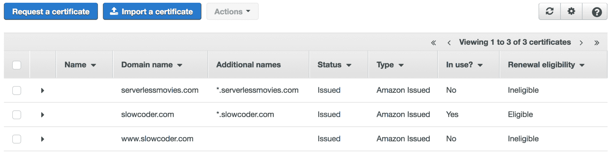

然而，我们无法配置 S3 存储桶以使用我们的 SSL 来加密流量。这就是为什么我们将在 S3 存储桶前使用一个 CloudFront 分发，也被称为 CDN。

# CloudFront 分发

除了使用 CloudFront 在网站上添加 SSL 终止外，CloudFront 主要用作**内容交付网络（CDN）**，用于在世界各地的多个边缘位置存储静态资产（如 HTML 页面、图像、字体、CSS 和 JavaScript），从而实现更快的下载和更短的响应时间。

也就是说，导航到 CloudFront，然后创建一个新的 Web 分发。在原始域名字段中设置 S3 网站 URL，并将其他字段保留为默认值。您可能希望将`HTTP`流量重定向到`HTTPS`：

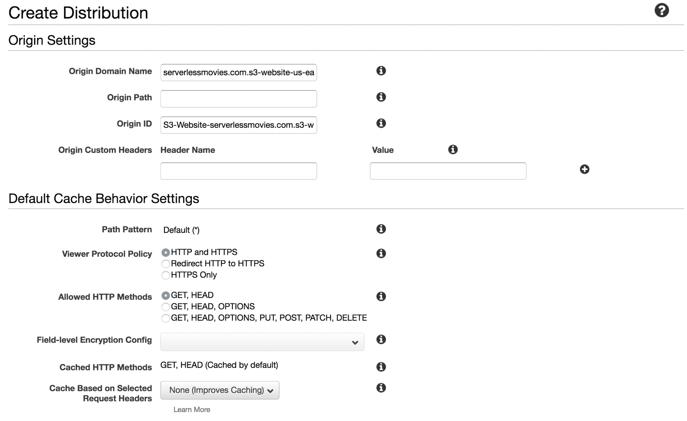

接下来，选择我们在*证书管理器*部分创建的 SSL 证书，并将您的域名添加到备用域名（CNAME）区域：

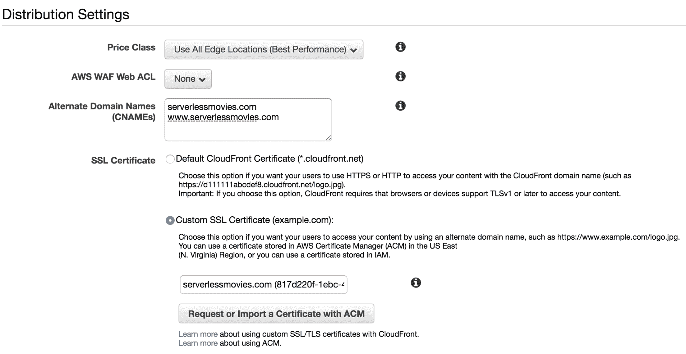

点击保存，并等待几分钟，让 CloudFront 复制所有文件到 AWS 边缘位置：

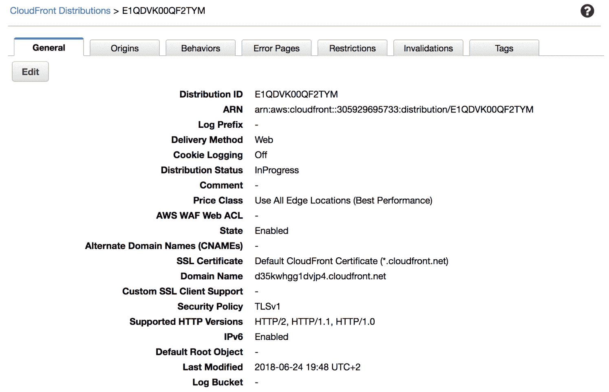

一旦 CDN 完全部署，跳转到域名托管区域页面，并更新网站记录以指向 CloudFront 分发域：

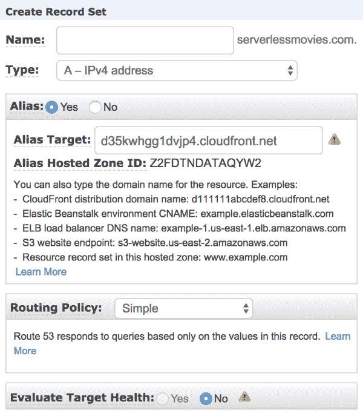

如果您再次转到 URL，您应该会被重定向到`HTTPS`：

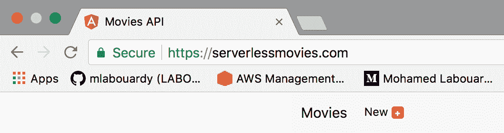

随意创建一个新的`CNAME`记录用于 API Gateway URL。该记录可能是[`api.serverlessmovies.com`](https://api.serverlessmovies.com)，指向[`51cxzthvma.execute-api.us-east-1.amazonaws.com/production/movies`](http://51cxzthvma.execute-api.us-east-1.amazonaws.com/production/movies)。

# CI/CD 工作流

我们的无服务器应用程序已部署到生产环境。但是，为了避免每次实现新功能时都重复相同的步骤，我们可以创建一个 CI/CD 流水线，自动化前一节中描述的工作流程。我选择 CircleCI 作为 CI 服务器。但是，您可以使用 Jenkins 或 CodePipeline——请确保阅读前几章以获取更多详细信息。

如前几章所示，流水线应该在模板文件中定义。以下是用于自动化 Web 应用程序部署流程的流水线示例：

```go
version: 2
jobs:
  build:
    docker:
      - image: node:10.5.0

    working_directory: ~/serverless-movies

    steps:
      - checkout

      - restore_cache:
          key: node-modules-{{checksum "package.json"}}

      - run:
          name: Install dependencies
          command: npm install && npm install -g @angular/cli

      - save_cache:
          key: node-modules-{{checksum "package.json"}}
          paths:
            - node_modules

      - run:
          name: Build assets
          command: ng build --prod --aot false

      - run:
          name: Install AWS CLI
          command: |
            apt-get update
            apt-get install -y awscli

      - run:
          name: Push static files
          command: aws s3 cp --recursive dist/ s3://serverlessmovies.com/
```

以下步骤将按顺序执行：

+   从代码存储库检出更改

+   安装 AWS CLI，应用程序 npm 依赖项和 Angular CLI

+   使用`ng build`命令构建工件

+   将工件复制到 S3 存储桶

现在，您的 Web 应用程序代码的所有更改都将通过流水线进行，并将自动部署到生产环境：

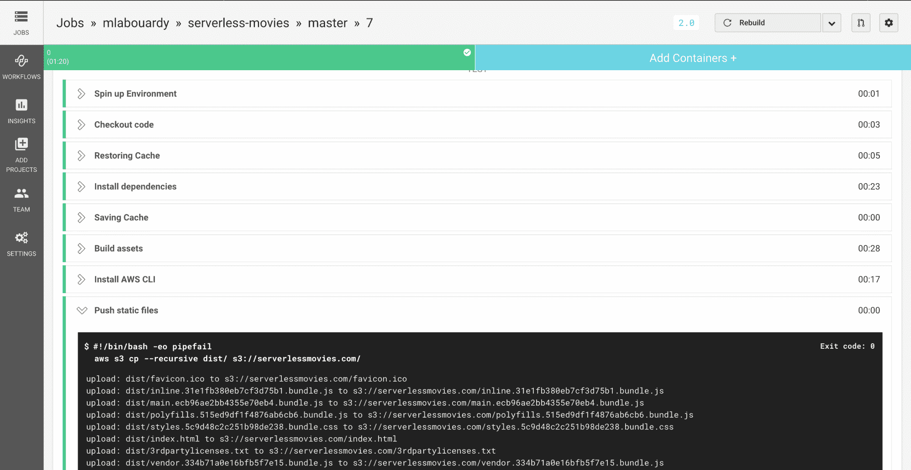

# API 文档

在完成本章之前，我们将介绍如何为迄今为止构建的无服务器 API 创建文档。

在 API Gateway 控制台上，选择要为其生成文档的部署阶段。在下面的示例中，我选择了`production`环境。然后，单击“导出”选项卡，单击“导出为 Swagger”部分：

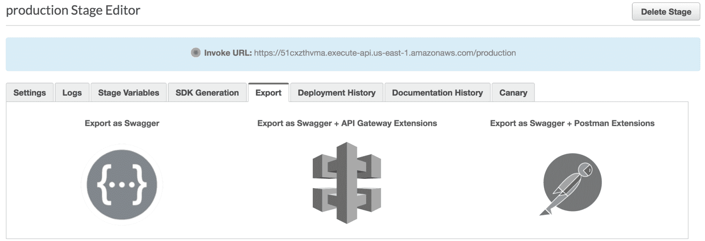

Swagger 是**OpenAPI**的实现，这是 Linux Foundation 定义的关于如何描述和定义 API 的标准。这个定义被称为**OpenAPI 规范文档**。

您可以将文档保存为 JSON 或 YAML 文件。然后，转到[`editor.swagger.io/`](https://editor.swagger.io/)并将内容粘贴到网站编辑器上，它将被编译，并生成一个 HTML 页面，如下所示：

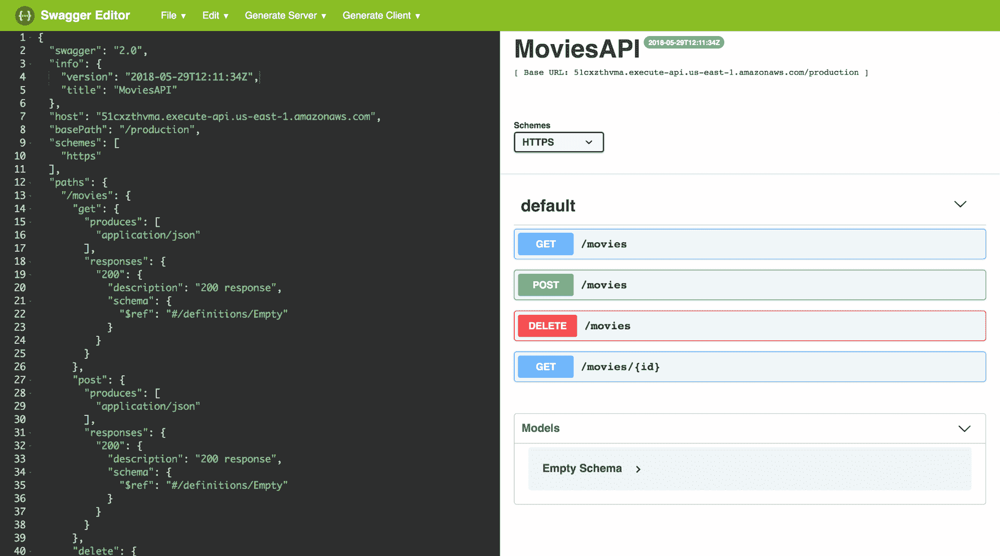

AWS CLI 也可以用于导出 API Gateway 文档，使用`aws apigateway get-export --rest-api-id API_ID --stage-name STAGE_NAME --export-type swagger swagger.json`命令。

API Gateway 和 Lambda 函数与无服务器应用程序类似。可以编写 CI/CD 来自动化生成文档，每当在 API Gateway 上实现新的端点或资源时。流水线必须执行以下步骤：

+   创建一个 S3 存储桶

+   在存储桶上启用静态网站功能

+   从[`github.com/swagger-api/swagger-ui`](https://github.com/swagger-api/swagger-ui)下载 Swagger UI，并将源代码复制到 S3

+   创建 DNS 记录（[docs.serverlessmovies.com](http://docs.serverlessmovies.com)）

+   运行`aws apigateway export`命令生成 Swagger 定义文件

+   使用`aws s3 cp`命令将`spec`文件复制到 S3

# 摘要

总之，我们已经看到了如何使用多个 Lambda 函数从头开始构建无服务器 API，以及如何使用 API Gateway 创建统一的 API 并将传入的请求分派到正确的 Lambda 函数。我们通过 DynamoDB 数据存储解决了 Lambda 的无状态问题，并了解了保留并发性如何帮助保护下游资源。然后，我们在 S3 存储桶中托管了一个无服务器 Web 应用程序，并在其前面使用 CloudFront 来优化 Web 资产的交付。最后，我们学习了如何使用 Route 53 将域流量路由到 Web 应用程序，并如何使用 SSL 终止来保护它。

以下图示了我们迄今为止实施的架构：

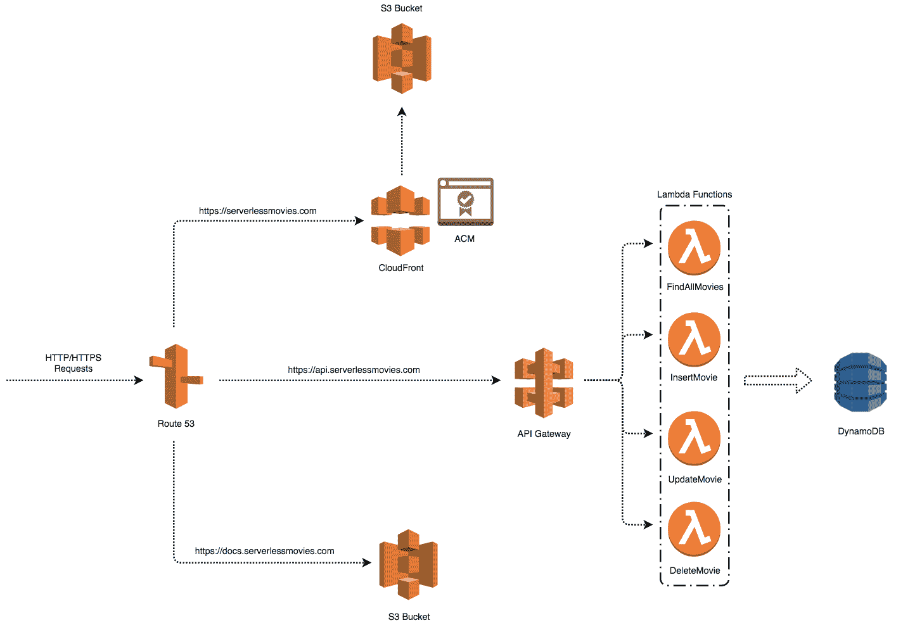

在下一章中，我们将改进 CI/CD 工作流程，添加单元测试和集成测试，以在将 Lambda 函数部署到生产环境之前捕获错误和问题。

# 问题

1.  实现一个以电影类别为输入并返回与该类别对应的电影列表的 Lambda 函数。

1.  实现一个 Lambda 函数，以电影标题作为输入，返回所有标题中包含关键字的电影。

1.  在 Web 应用程序上实现一个删除按钮，通过调用 API Gateway 的`DeleteMovie` Lambda 函数来删除电影。

1.  在 Web 应用程序上实现一个编辑按钮，允许用户更新电影属性。

1.  使用 CircleCI、Jenkins 或 CodePipeline 实现 CI/CD 工作流程，自动化生成和部署 API Gateway 文档。
