# 第十一章：监控和故障排除

Lambda 监控与传统应用程序监控不同，因为您不管理代码运行的基础基础设施。因此，无法访问 OS 指标。但是，您仍然需要函数级别的监控来优化函数性能，并在发生故障时进行调试。在本章中，您将学习如何实现这一点，以及如何在 AWS 中调试和故障排除无服务器应用程序。您将学习如何基于 CloudWatch 中的指标阈值设置警报，以便在可能出现问题时收到通知。您还将了解如何使用 AWS X-Ray 对应用程序进行分析，以检测异常行为。

# 使用 AWS CloudWatch 进行监控和调试

AWS CloudWatch 是监控 AWS 服务的最简单和最可靠的解决方案，包括 Lambda 函数。它是一个集中的监控服务，用于收集指标和日志，并根据它们创建警报。AWS Lambda 会自动代表您监视 Lambda 函数，并通过 CloudWatch 报告指标。

# CloudWatch 指标

默认情况下，每次通过 Lambda 控制台调用函数时，它都会报告有关函数资源使用情况、执行持续时间以及计费时间的关键信息：

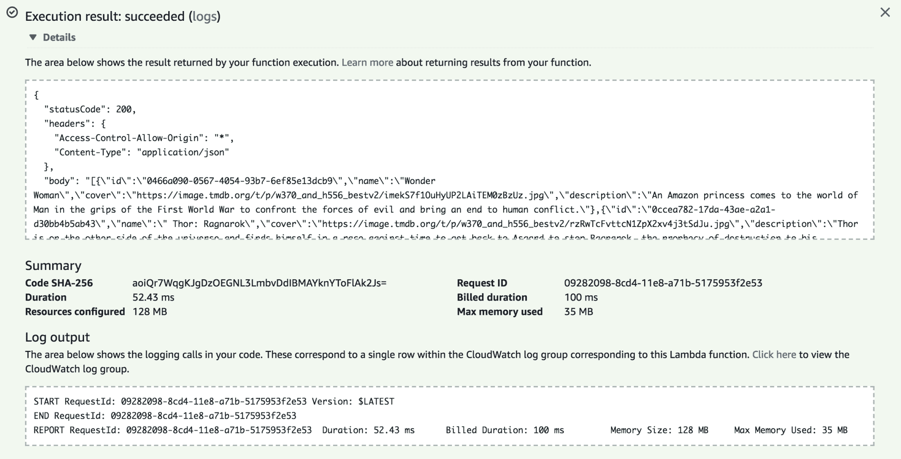

单击“监控”选项卡可以快速实时了解情况。此页面将显示多个 CloudWatch 指标的图形表示。您可以在图形区域的右上角控制可观察时间段：

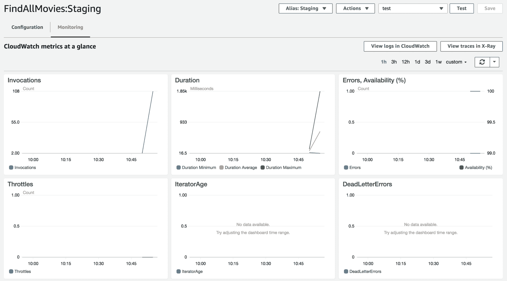

这些指标包括：

+   函数被调用的次数

+   执行时间（毫秒）

+   错误率和由于并发预留和未处理事件（死信错误）而导致的节流计数

在 CloudWatch 中为 AWS Lambda 提供的所有可用指标列表可以在[`docs.aws.amazon.com/lambda/latest/dg/monitoring-functions-metrics.html`](https://docs.aws.amazon.com/lambda/latest/dg/monitoring-functions-metrics.html)找到。

对于每个指标，您还可以单击“在指标中查看”直接查看 CloudWatch 指标：

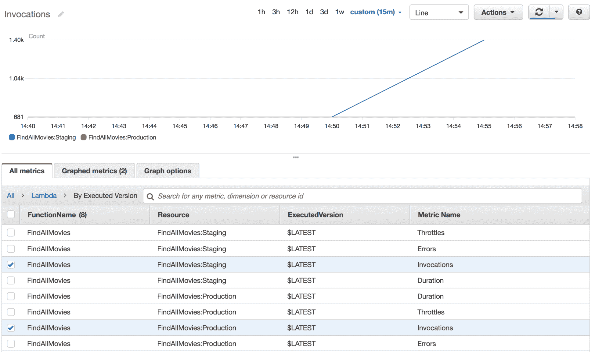

前面的图表表示在过去 15 分钟内`production`和`staging`别名的`FindAllMovies`函数的调用次数。您可以进一步创建自定义图表。这使您可以为 Lambda 函数构建自定义仪表板。它将概述负载（您可能会遇到的任何问题）、成本和其他重要指标。

此外，您还可以使用 CloudWatch Golang SDK 创建自定义指标并将其发布到 CloudWatch。以下代码片段是使用 CloudWatch SDK 发布自定义指标的 Lambda 函数。该指标表示插入到 DynamoDB 中的`Action`电影的数量（为简洁起见，某些部分被省略）：

```go
svc := cloudwatch.New(cfg)
req := svc.PutMetricDataRequest(&cloudwatch.PutMetricDataInput{
  Namespace: aws.String("InsertMovie"),
  MetricData: []cloudwatch.MetricDatum{
    cloudwatch.MetricDatum{
      Dimensions: []cloudwatch.Dimension{
        cloudwatch.Dimension{
          Name: aws.String("Environment"),
          Value: aws.String("production"),
        },
      },
      MetricName: aws.String("ActionMovies"),
      Value: aws.Float64(1.0),
      Unit: cloudwatch.StandardUnitCount,
    },
  },
})
```

该指标由名称、命名空间、维度列表（名称-值对）、值和度量单位唯一定义。在您向 CloudWatch 发布了一些值之后，您可以使用 CloudWatch 控制台查看统计图表：

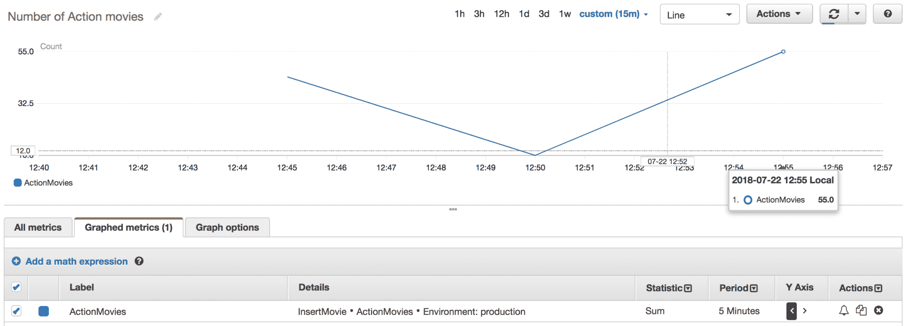

现在我们知道如何使用 AWS 提供的现成指标监视我们的 Lambda 函数，并将自定义指标插入到 CloudWatch 中以丰富它们的可观察性。让我们看看如何基于这些指标创建警报，以便在 Lambda 函数出现问题时实时通知我们。

# CloudWatch 警报

CloudWatch 允许您在发生意外行为时基于可用指标创建警报。在以下示例中，我们将基于`FindAllMovies`函数的错误率创建警报：

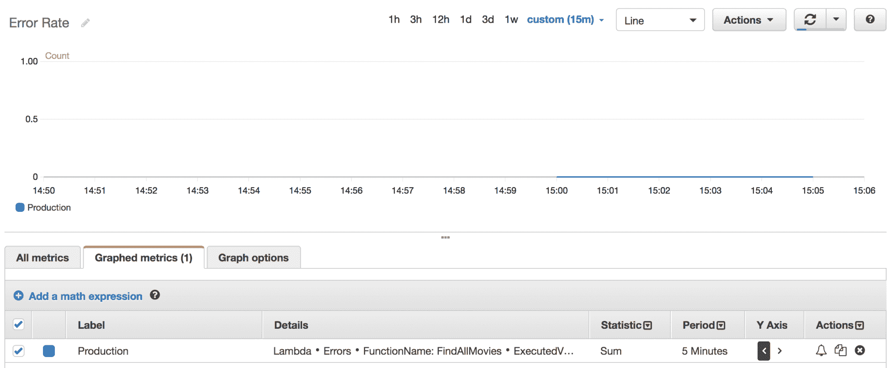

为了实现这一点，请点击“操作”列中的铃铛图标。然后，填写以下字段以设置一个警报，如果在五分钟内错误数量超过`10`，则会触发警报。一旦触发警报，将使用**简单通知服务**（**SNS**）发送电子邮件：

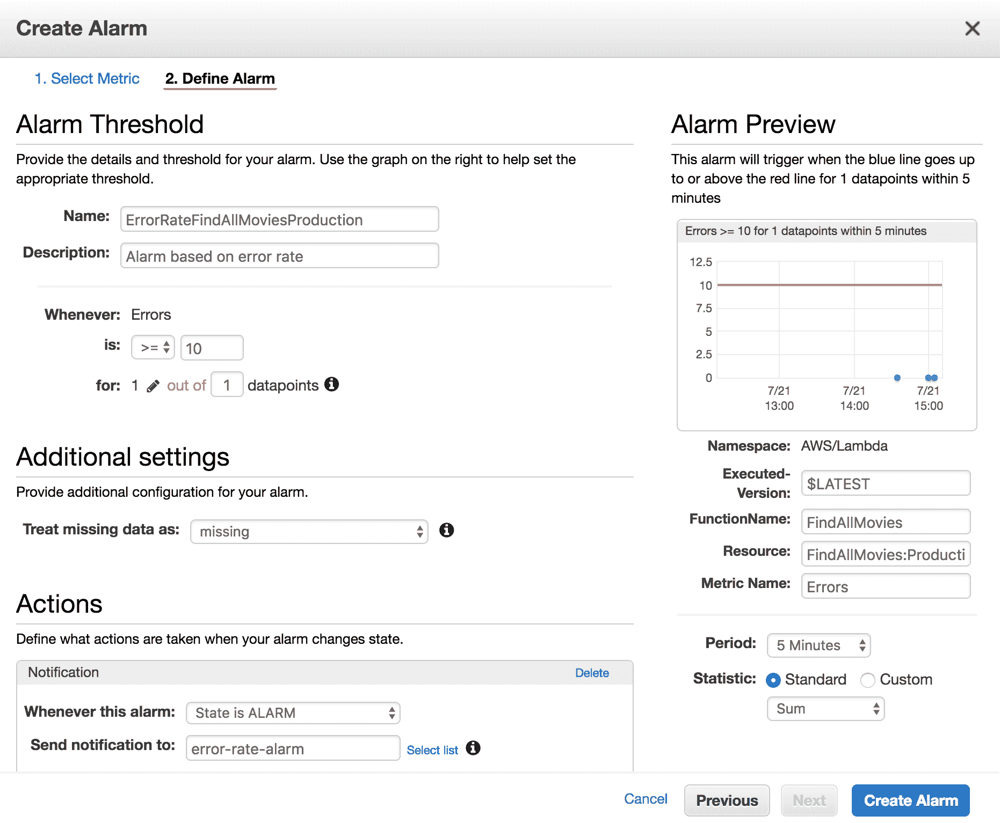

CloudWatch 将通过 SNS 主题发送通知，您可以创建尽可能多的 SNS 主题订阅，以便将通知传递到您想要的位置（短信、HTTP、电子邮件）。

点击“创建警报”按钮；您应该收到一封确认订阅的电子邮件。您必须在通知发送之前确认订阅：

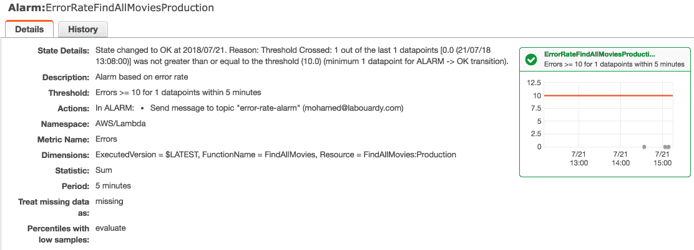

一旦确认，每当 Lambda 函数的错误率超过定义的阈值时，警报将从“正常”状态更改为“警报”状态：

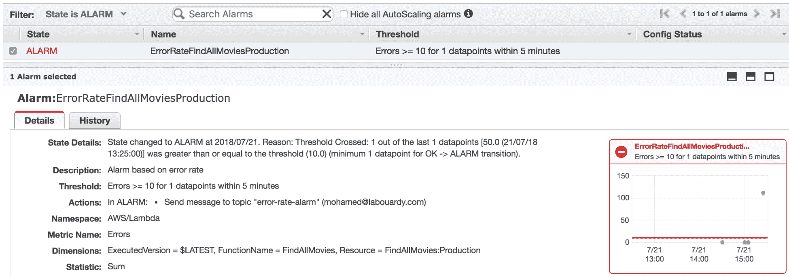

之后，将会向您发送一封电子邮件作为事件的响应：

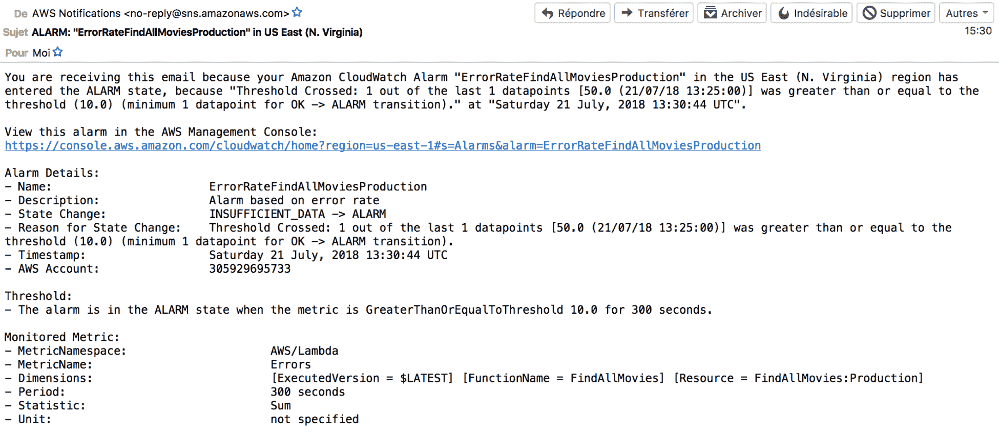

您可以通过使用此 AWS CLI 命令临时更改其状态来模拟警报：`aws cloudwatch set-alarm-state --alarm-name ALARM_NAME --state-value ALARM --state-reason demo`。

# CloudWatch 日志

在使用 AWS Lambda 时，当函数被调用时，您可能会遇到以下错误：

+   应用程序错误

+   权限被拒绝

+   超时

+   内存超限

除了第一个用例外，其余的都可以通过授予正确的 IAM 策略并增加 Lambda 函数的超时或内存使用量来轻松解决。然而，第一个错误需要更多的调试和故障排除，这需要在代码中添加日志记录语句来验证您的代码是否按预期工作。幸运的是，每当 Lambda 函数的代码响应事件执行时，它都会将日志条目写入与 Lambda 函数关联的 CloudWatch 日志组，即`/aws/lambda/FUNCTION_NAME`。

为了实现这一点，您的 Lambda 函数应被授予以下权限：

```go
{
  "Version": "2012-10-17",
  "Statement": [
    {
      "Sid": "1",
      "Effect": "Allow",
      "Action": [
        "logs:CreateLogStream",
        "logs:CreateLogGroup",
        "logs:PutLogEvents"
      ],
      "Resource": "*"
    }
  ]
}
```

也就是说，您可以使用 Go 的内置日志记录库，称为`log`包。以下是如何使用`log`包的示例：

```go
package main

import (
  "log"

  "github.com/aws/aws-lambda-go/lambda"
)

func reverse(s string) string {
  runes := []rune(s)
  for i, j := 0, len(runes)-1; i < j; i, j = i+1, j-1 {
    runes[i], runes[j] = runes[j], runes[i]
  }
  return string(runes)
}

func handler(input string) (string, error) {
  log.Println("Before:", input)
  output := reverse(input)
  log.Println("After:", output)
  return output, nil
}

func main() {
  lambda.Start(handler)
}
```

代码是不言自明的，它对给定字符串执行了一个反向操作。我已经使用`log.Println`方法在代码的各个部分周围添加了日志记录语句。

然后，您可以将函数部署到 AWS Lambda，并从 AWS 控制台或使用`invoke`命令调用它。Lambda 会自动集成到 Amazon CloudWatch 日志，并将代码中的所有日志推送到与 Lambda 函数关联的 CloudWatch 日志组：

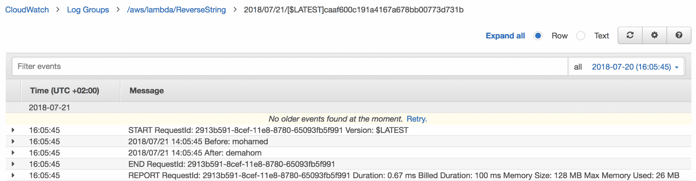

到目前为止，我们已经学会了如何通过日志和运行时数据来排除故障和分析每次调用。在接下来的部分中，我们将介绍如何在 Lambda 函数的代码中跟踪所有上游和下游对外部服务的调用，以便快速轻松地排除错误。为了跟踪所有这些调用，我们将在实际工作执行的不同代码段中使用 AWS X-Ray 添加代码仪器。

有许多第三方工具可用于监视无服务器应用程序，这些工具依赖于 CloudWatch。因此，它们在实时问题上也会失败。我们期望这在未来会得到解决，因为 AWS 正在以快速的速度推出新的服务和功能。

# 使用 AWS X-Ray 进行跟踪

AWS X-Ray 是 AWS 管理的服务，允许您跟踪 Lambda 函数发出的传入和传出请求。它将这些信息收集在段中，并使用元数据记录附加数据，以帮助您调试、分析和优化函数。

总的来说，X-Ray 可以帮助您识别性能瓶颈。然而，它可能需要在函数执行期间进行额外的网络调用，增加用户面对的延迟。

要开始，请从 Lambda 函数的配置页面启用主动跟踪：

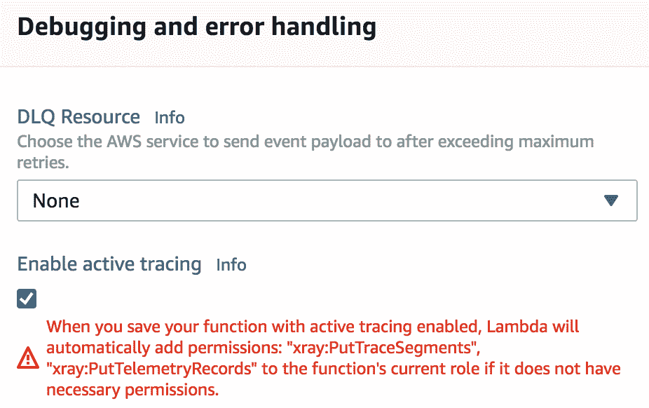

要求以下 IAM 策略以使 Lambda 函数发布跟踪段到 X-Ray：

```go
{
  "Version": "2012-10-17",
  "Statement": {
    "Effect": "Allow",
    "Action": [
      "xray:PutTraceSegments",
      "xray:PutTelemetryRecords"
    ],
    "Resource": [
      "*"
    ]
  }
}
```

接下来，转到 AWS X-Ray 控制台，单击“跟踪”，多次调用 Lambda 函数，并刷新页面。将在跟踪列表中添加新行。对于每个跟踪，您将获得代码响应和执行时间：

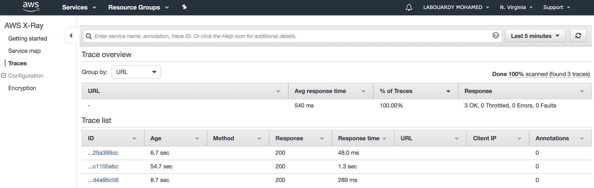

这是`FindAllMovies`函数的跟踪；它包括 Lambda 初始化函数所需的时间：

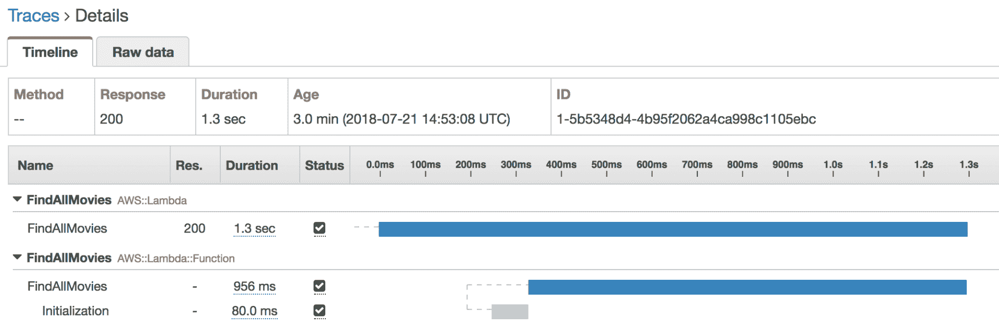

您还可以通过单击“服务映射”项以图形格式可视化此信息：

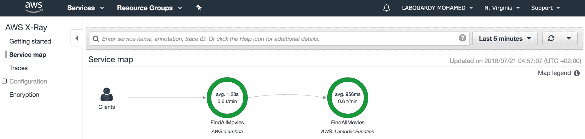

对于每个被跟踪的调用，Lambda 将发出 Lambda 服务段和其所有子段。此外，Lambda 将发出 Lambda 函数段和 init 子段。这些段将被发出，而无需对函数的运行时进行任何更改或需要任何其他库。如果要使 Lambda 函数的 X-Ray 跟踪包括用于下游调用的自定义段、注释或子段，可能需要安装以下 X-Ray Golang SDK：

```go
go get -u github.com/aws/aws-xray-sdk-go/...
```

更新`FindAllMovies`函数的代码以使用`Configure`方法配置 X-Ray：

```go
xray.Configure(xray.Config{
  LogLevel: "info",
  ServiceVersion: "1.2.3",
})
```

我们将通过使用`xray.AWS`调用包装 DynamoDB 客户端来在子段中跟踪对 DynamoDB 的调用，如下面的代码所示：

```go
func findAll(ctx context.Context) (events.APIGatewayProxyResponse, error) {
  xray.Configure(xray.Config{
    LogLevel: "info",
    ServiceVersion: "1.2.3",
  })

  sess := session.Must(session.NewSession())
  dynamo := dynamodb.New(sess)
  xray.AWS(dynamo.Client)

  res, err := dynamo.ScanWithContext(ctx, &dynamodb.ScanInput{
    TableName: aws.String(os.Getenv("TABLE_NAME")),
  })

  ...
}
```

再次在 X-Ray“跟踪”页面上调用 Lambda 函数；将添加一个新的子段，显示它扫描`movies`表所花费的时间：

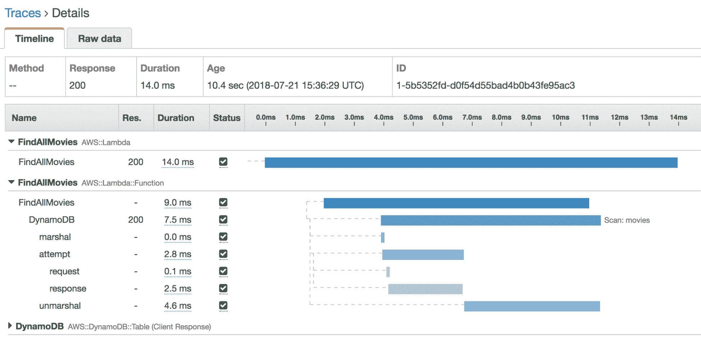

DynamoDB 调用还将显示为 X-Ray 控制台中服务映射上的下游节点：

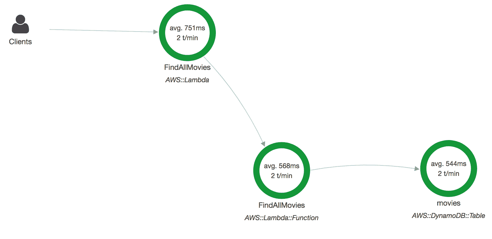

现在我们已经熟悉了 X-Ray 的工作原理，让我们创建一些复杂的东西。考虑一个简单的 Lambda 函数，它以电影海报页面的 URL 作为输入。它解析 HTML 页面，提取数据，并将其保存到 DynamoDB 表中。此函数将在给定 URL 上执行`GET`方法：

```go
res, err := http.Get(url)
if err != nil {
  log.Fatal(err)
}
defer res.Body.Close()
```

然后，它使用`goquery`库（**JQuery** Go 的实现）从 HTML 页面中提取数据，使用 CSS 选择器：

```go
doc, err := goquery.NewDocumentFromReader(res.Body)
if err != nil {
  log.Fatal(err)
}

title := doc.Find(".header .title span a h2").Text()
description := doc.Find(".overview p").Text()
cover, _ := doc.Find(".poster .image_content img").Attr("src")

movie := Movie{
  ID: uuid.Must(uuid.NewV4()).String(),
  Name: title,
  Description: description,
  Cover: cover,
}
```

创建电影对象后，它使用`PutItem`方法将电影保存到 DynamoDB 表：

```go
sess := session.Must(session.NewSession())
dynamo := dynamodb.New(sess)
req, _ := dynamo.PutItemRequest(&dynamodb.PutItemInput{
  TableName: aws.String(os.Getenv("TABLE_NAME")),
  Item: map[string]*dynamodb.AttributeValue{
    "ID": &dynamodb.AttributeValue{
      S: aws.String(movie.ID),
    },
    "Name": &dynamodb.AttributeValue{
      S: aws.String(movie.Name),
    },
    "Cover": &dynamodb.AttributeValue{
      S: aws.String(movie.Cover),
    },
    "Description": &dynamodb.AttributeValue{
      S: aws.String(movie.Description),
    },
  },
})
err = req.Send()
if err != nil {
  log.Fatal(err)
}
```

现在我们的函数处理程序已定义，将其部署到 AWS Lambda，并通过将 URL 作为输入参数进行测试。结果，电影信息将以 JSON 格式显示：

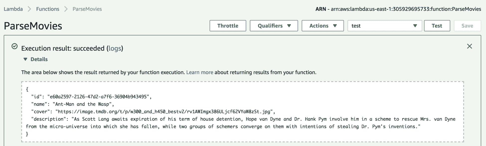

如果您将浏览器指向前几章构建的前端，新电影应该是页面上列出的电影之一：

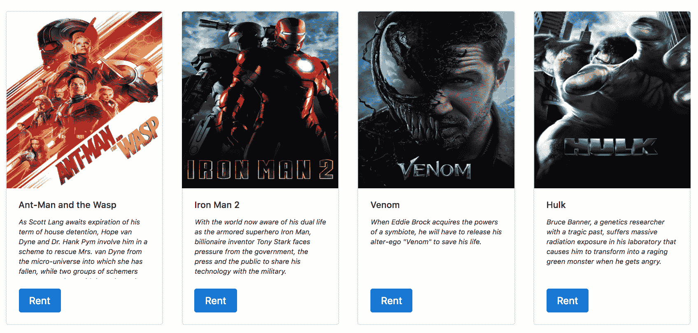

现在我们的 Lambda 函数正在按预期工作；让我们为下游服务添加跟踪调用。首先，配置 X-Ray 并使用`ctxhttp.Get`方法将`GET`调用作为子段进行检测：

```go
xray.Configure(xray.Config{
  LogLevel: "info",
  ServiceVersion: "1.2.3",
})

// Get html page
res, err := ctxhttp.Get(ctx, xray.Client(nil), url)
if err != nil {
  log.Fatal(err)
}
defer res.Body.Close()
```

接下来，在解析逻辑周围创建一个子段。子段称为`Parsing`，并且使用`AddMetaData`方法记录有关子段的其他信息以进行故障排除：

```go
xray.Capture(ctx, "Parsing", func(ctx1 context.Context) error {
  doc, err := goquery.NewDocumentFromReader(res.Body)
  if err != nil {
    return err
  }

  title := doc.Find(".header .title span a h2").Text()
  description := doc.Find(".overview p").Text()
  cover, _ := doc.Find(".poster .image_content img").Attr("src")

  movie := Movie{
    ID: uuid.Must(uuid.NewV4()).String(),
    Name: title,
    Description: description,
    Cover: cover,
  }

  xray.AddMetadata(ctx1, "movie.title", title)
  xray.AddMetadata(ctx1, "movie.description", description)
  xray.AddMetadata(ctx1, "movie.cover", cover)

  return nil
})
```

最后，使用`xray.AWS()`调用包装 DynamoDB 客户端：

```go
sess := session.Must(session.NewSession())
dynamo := dynamodb.New(sess)
xray.AWS(dynamo.Client)
```

结果，`ParseMovies` Lambda 函数的以下子段将出现在跟踪中：

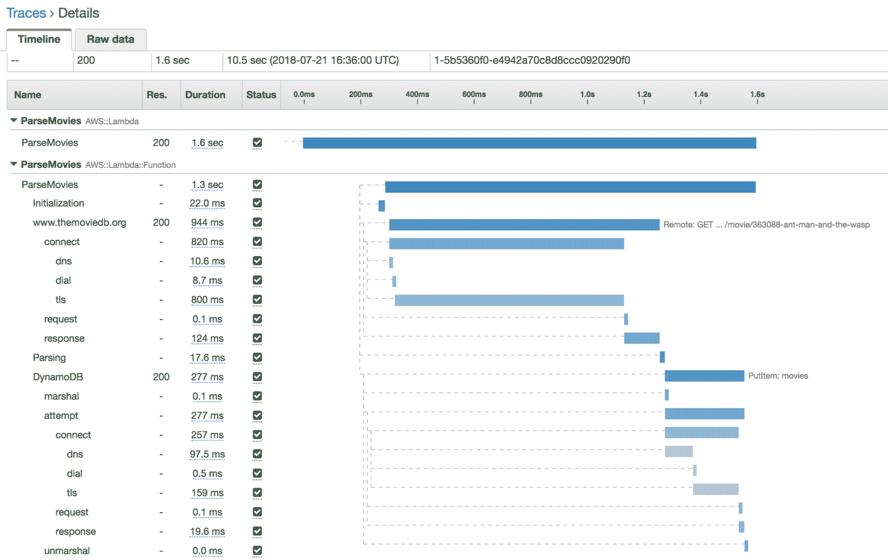

如果单击“子段”-“解析”选项卡上的“元数据”，将显示电影属性如下：

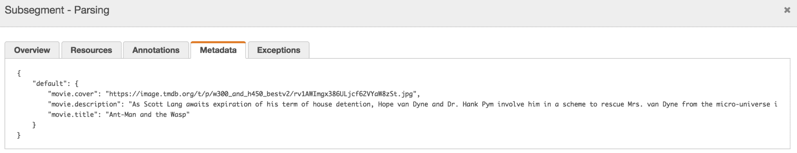

在服务映射上，将显示对 DynamoDB 的下游调用和出站 HTTP 调用：

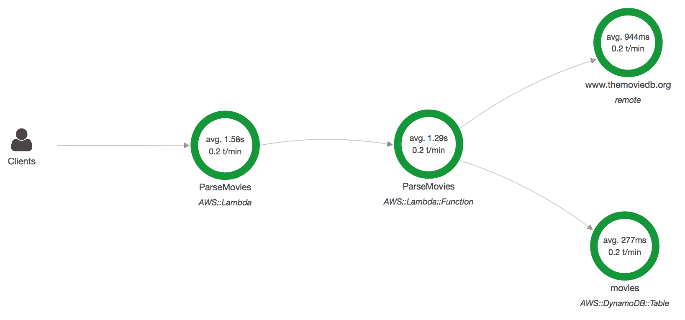

到目前为止，您应该清楚如何轻松排除性能瓶颈、延迟峰值和其他影响基于 Lambda 的应用程序性能的问题。

当您跟踪 Lambda 函数时，X-Ray 守护程序将自动在 Lambda 环境中运行，收集跟踪数据并将其发送到 X-Ray。如果您想在将函数部署到 Lambda 之前测试函数，可以在本地运行 X-Ray 守护程序。安装指南可以在这里找到：[`docs.aws.amazon.com/xray/latest/devguide/xray-daemon-local.html`](https://docs.aws.amazon.com/xray/latest/devguide/xray-daemon-local.html)。

# 摘要

在本章中，您学习了如何使用 AWS CloudWatch 指标实时监控 Lambda 函数。您还学习了如何发布自定义指标，并使用警报和报告检测问题。此外，我们还介绍了如何将函数的代码日志流式传输到 CloudWatch。最后，我们看到了如何使用 AWS X-Ray 进行调试，如何跟踪上游和下游调用，以及如何在 Golang 中将 X-Ray SDK 与 Lambda 集成。

在下一章中，您将学习如何保护您的无服务器应用程序。
