# 第十二章：保护您的无服务器应用程序

AWS Lambda 是终极的按需付费云计算服务。客户只需将他们的 Lambda 函数代码上传到云端，它就可以运行，而无需保护或修补底层基础设施。然而，根据 AWS 的共享责任模型，您仍然负责保护您的 Lambda 函数代码。本章专门讨论在 AWS Lambda 中可以遵循的最佳实践和建议，以使应用程序根据 AWS Well-Architected Framework 具有弹性和安全性。本章将涵盖以下主题：

+   身份验证和用户控制访问

+   加密环境变量

+   使用 CloudTrail 记录 AWS Lambda API 调用

+   扫描依赖项的漏洞

# 技术要求

为了遵循本章，您可以遵循 API Gateway 设置章节，或者基于 Lambda 和 API Gateway 的无服务器 RESTful API。本章的代码包托管在 GitHub 上，网址为[`github.com/PacktPublishing/Hands-On-Serverless-Applications-with-Go`](https://github.com/PacktPublishing/Hands-On-Serverless-Applications-with-Go)。

# 身份验证和用户控制访问

到目前为止，我们构建的无服务器应用程序运行良好，并向公众开放。只要有 API Gateway 调用 URL，任何人都可以调用 Lambda 函数。幸运的是，AWS 提供了一个名为 Cognito 的托管服务。

**Amazon Cognito**是一个规模化的身份验证提供程序和管理服务，允许您轻松地向您的应用程序添加用户注册和登录。用户存储在一个可扩展的目录中，称为用户池。在即将到来的部分中，Amazon Cognito 将用于在允许他们请求 RESTful API 之前对用户进行身份验证。

要开始，请在 Amazon Cognito 中创建一个新的用户池并为其命名：

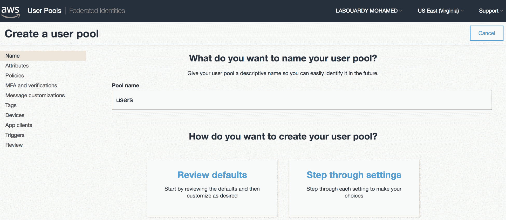

单击“审阅默认值”选项以使用默认设置创建池：

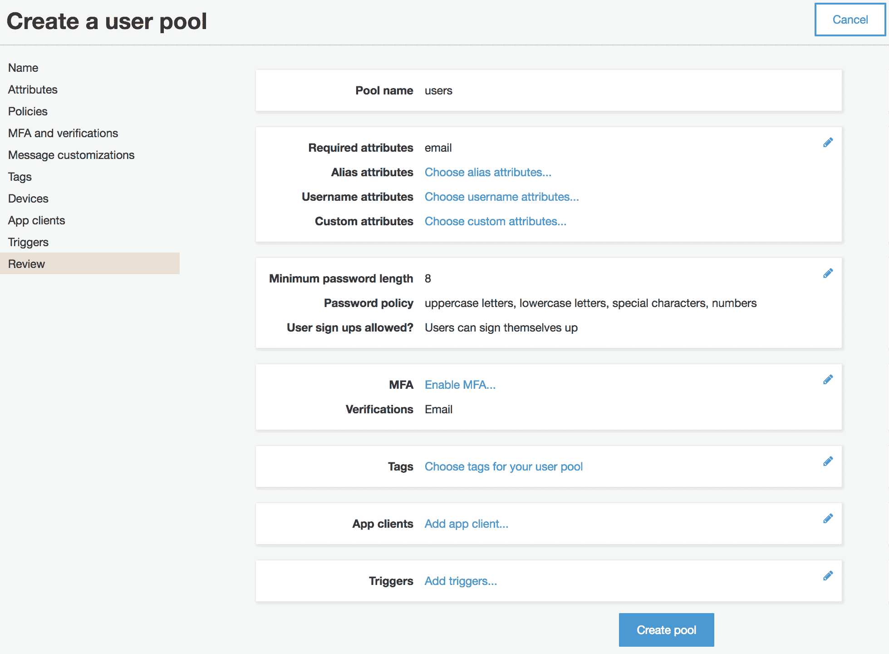

从导航窗格中单击“属性”，并在“电子邮件地址或电话号码”下的“允许电子邮件地址”选项中选中以允许用户使用电子邮件地址登录：

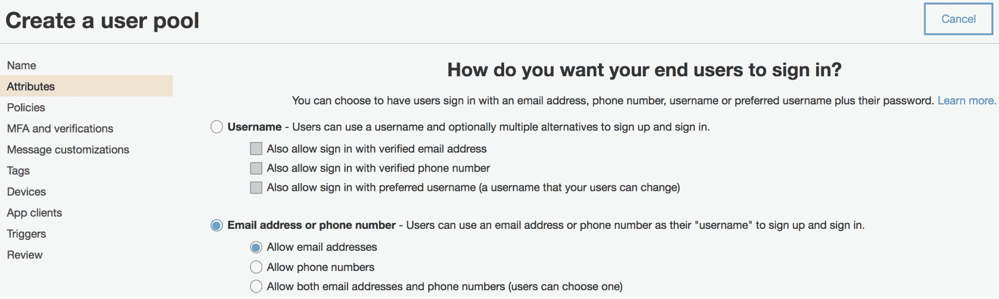

返回到“审阅”并单击“创建池”。创建过程结束时应显示成功消息：

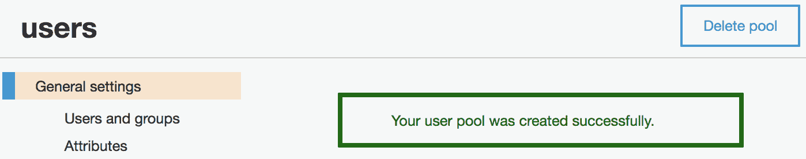

创建第一个用户池后，从“常规设置”下的应用程序客户端中注册您的无服务器 API，并选择“添加应用程序客户端”。给应用程序命名，并取消“生成客户端密钥”选项如下：身份验证将在客户端上完成。因此，出于安全目的，客户端密钥不应传递到 URL 上：

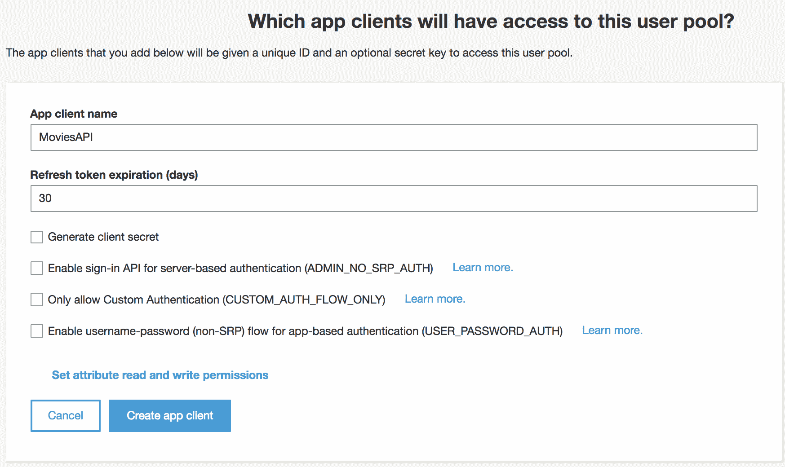

选择“创建应用程序客户端”以注册应用程序，并将**应用程序客户端 ID**复制到剪贴板：

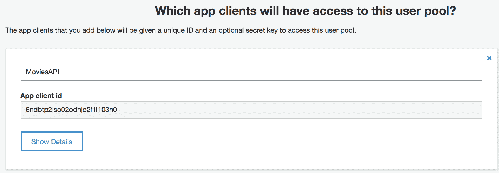

现在用户池已创建，我们可以配置 API Gateway 以在授予对 Lambda 函数的访问之前验证来自成功用户池身份验证的访问令牌。

# 保护 API 访问

要开始保护 API 访问，请转到 API Gateway 控制台，选择我们在前几章中构建的 RESTful API，并从导航栏中单击“授权者”：

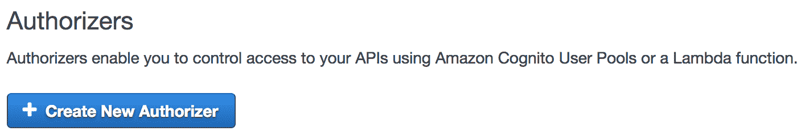

单击“创建新的授权者”按钮，然后选择 Cognito。然后，选择我们之前创建的用户池，并将令牌源字段设置为`Authorization`。这定义了包含 API 调用者身份令牌的传入请求标头的名称为`Authorization`：

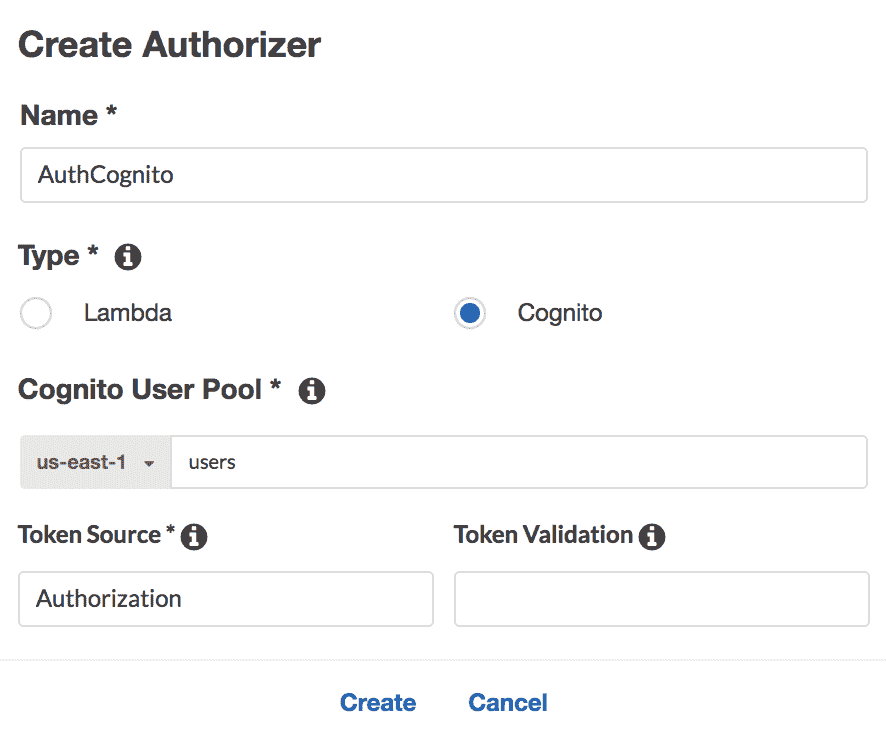

填写完表单后，单击“创建”以将 Cognito 用户池与 API Gateway 集成：

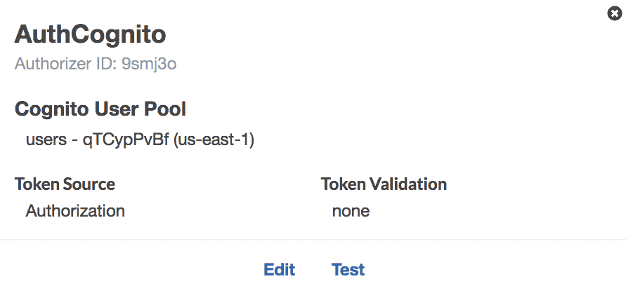

现在，您可以保护所有端点，例如，为了保护负责列出所有电影的端点。点击`/movies`资源下的相应`GET`方法：

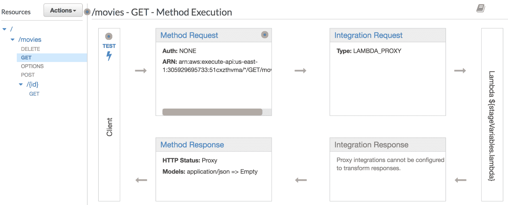

点击 Method Request 框，然后点击 Authorization，并选择我们之前创建的用户池：

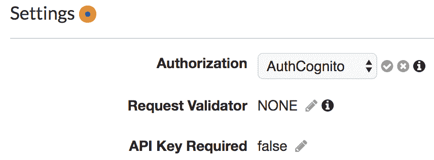

将 OAuth Scopes 选项保留为`None`，并为其余方法重复上述过程以保护它们：

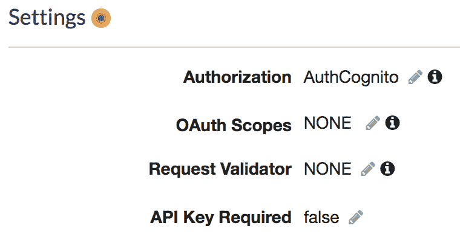

完成后，重新部署 API，并将浏览器指向 API Gateway 调用 URL：

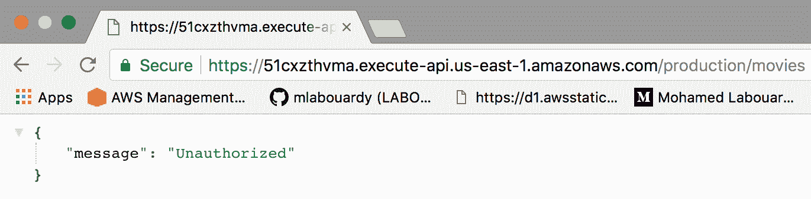

这次，端点是受保护的，需要进行身份验证。您可以通过检查我们之前构建的前端来确认行为。如果检查网络请求，API Gateway 请求应返回 401 未经授权错误：

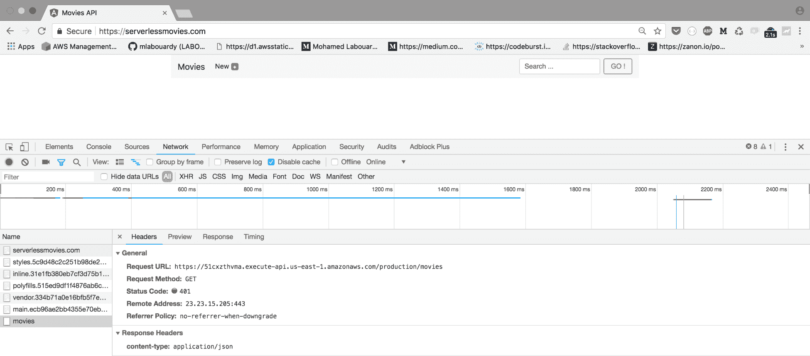

为了修复此错误，我们需要更新客户端（Web 应用程序）执行以下操作：

+   使用 Cognito JavaScript SDK 登录用户池

+   从用户池中获取已登录用户的身份令牌

+   在 API Gateway 请求的 Authorization 标头中包含身份令牌

返回的身份令牌具有 1 小时的过期日期。一旦过期，您需要使用刷新令牌来刷新会话。

# 使用 AWS Cognito 进行用户管理

在客户端进行更改之前，我们需要在 Amazon Cognito 中创建一个测试用户。为此，您可以使用 AWS 管理控制台，也可以使用 AWS Golang SDK 以编程方式完成。

# 通过 AWS 管理控制台设置测试用户

点击用户和组，然后点击创建用户按钮：

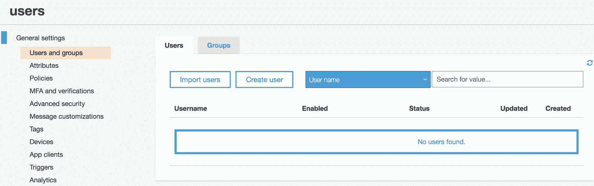

设置用户名和密码。如果要收到确认电子邮件，可以取消选中“标记电子邮件为已验证？”框：

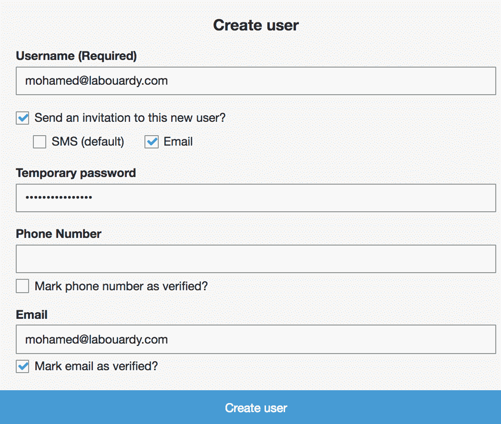

# 使用 Cognito Golang SDK 进行设置

创建一个名为`main.go`的文件，内容如下。该代码使用`cognitoidentityprovider`包中的`SignUpRequest`方法来创建一个新用户。作为参数，它接受一个包含客户端 ID、用户名和密码的结构体：

```go
package main

import (
  "log"
  "os"

  "github.com/aws/aws-sdk-go-v2/aws/external"
  "github.com/aws/aws-sdk-go-v2/service/cognitoidentityprovider"
  "github.com/aws/aws-sdk-go/aws"
)

func main() {
  cfg, err := external.LoadDefaultAWSConfig()
  if err != nil {
    log.Fatal(err)
  }

  cognito := cognitoidentityprovider.New(cfg)
  req := cognito.SignUpRequest(&cognitoidentityprovider.SignUpInput{
    ClientId: aws.String(os.Getenv("COGNITO_CLIENT_ID")),
    Username: aws.String("EMAIL"),
    Password: aws.String("PASSWORD"),
  })
  _, err = req.Send()
  if err != nil {
    log.Fatal(err)
  }
}
```

使用`go run main.go`命令运行上述命令。您将收到一封带有临时密码的电子邮件：

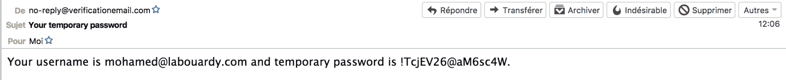

注册后，用户必须通过输入通过电子邮件发送的代码来确认注册。要确认注册过程，必须收集用户收到的代码并使用如下方式：

```go
cognito := cognitoidentityprovider.New(cfg)
req := cognito.ConfirmSignUpRequest(&cognitoidentityprovider.ConfirmSignUpInput{
  ClientId: aws.String(os.Getenv("COGNITO_CLIENT_ID")),
  Username: aws.String("EMAIL"),
  ConfirmationCode: aws.String("CONFIRMATION_CODE"),
})
_, err = req.Send()
if err != nil {
  log.Fatal(err)
}
```

现在 Cognito 用户池中已创建了一个用户，我们准备更新客户端。首先创建一个登录表单如下：

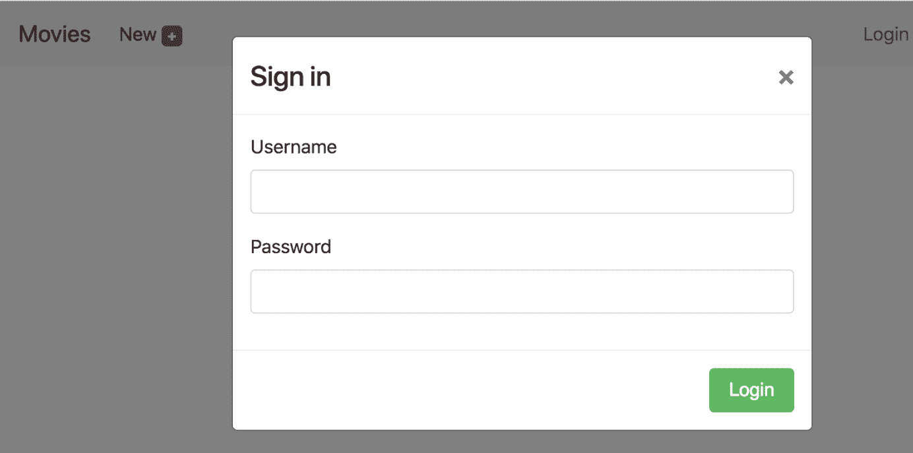

接下来，使用 Node.js 包管理器安装 Cognito SDK for Javascript。该软件包包含与 Cognito 交互所需的 Angular 模块和提供程序：

```go
npm install --save amazon-cognito-identity-js
```

此外，我们还需要创建一个带有`auth`方法的 Angular 服务，该方法通过提供`UserPoolId`对象和`ClientId`创建一个`CognitoUserPool`对象，根据参数中给定的用户名和密码对用户进行身份验证。如果登录成功，将调用`onSuccess`回调。如果登录失败，将调用`onFailure`回调：

```go
import { Injectable } from '@angular/core';
import { CognitoUserPool, CognitoUser, AuthenticationDetails} from 'amazon-cognito-identity-js';
import { environment } from '../../environments/environment';

@Injectable()
export class CognitoService {

  public static CONFIG = {
    UserPoolId: environment.userPoolId,
    ClientId: environment.clientId
  }

  auth(username, password, callback){
    let user = new CognitoUser({
      Username: username,
      Pool: this.getUserPool()
    })

    let authDetails = new AuthenticationDetails({
      Username: username,
      Password: password
    })

    user.authenticateUser(authDetails, {
      onSuccess: res => {
        callback(null, res.getIdToken().getJwtToken())
      },
      onFailure: err => {
        callback(err, null)
      }
    })
  }

  getUserPool() {
    return new CognitoUserPool(CognitoService.CONFIG);
  }

  getCurrentUser() {
    return this.getUserPool().getCurrentUser();
  }

}
```

每次单击登录按钮时都会调用`auth`方法。如果用户输入了正确的凭据，将会与 Amazon Cognito 服务建立用户会话，并将用户身份令牌保存在浏览器的本地存储中。如果输入了错误的凭据，将向用户显示错误消息：

```go
signin(username, password){
    this.cognitoService.auth(username, password, (err, token) => {
      if(err){
        this.loginError = true
      }else{
        this.loginError = false
        this.storage.set("COGNITO_TOKEN", token)
        this.loginModal.close()
      }
    })
  }
```

最后，`MoviesAPI`服务应更新以在每个 API Gateway 请求调用的`Authorization`头中包含用户身份令牌（称为 JWT 令牌 - [`docs.aws.amazon.com/cognito/latest/developerguide/amazon-cognito-user-pools-using-tokens-with-identity-providers.html#amazon-cognito-user-pools-using-the-id-token`](https://docs.aws.amazon.com/cognito/latest/developerguide/amazon-cognito-user-pools-using-tokens-with-identity-providers.html#amazon-cognito-user-pools-using-the-id-token)）。

```go
@Injectable()
export class MoviesApiService {

  constructor(private http: Http,
    @Inject(LOCAL_STORAGE) private storage: WebStorageService) {}

    findAll() {
      return this.http
          .get(environment.api, {
              headers: this.getHeaders()
          })
          .map(res => {
              return res.json()
          })
    }

    getHeaders() {
      let headers = new Headers()
      headers.append('Authorization', this.storage.get("COGNITO_TOKEN"))
      return headers
    }

}
```

先前的代码示例已经在 Angular 5 中进行了测试。此外，请确保根据自己的 Web 框架采用代码。

要测试它，请返回浏览器。登录表单应该弹出；使用我们之前创建的用户凭据填写字段。然后，单击“登录”按钮：

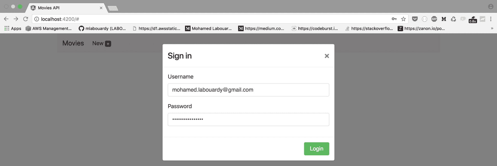

用户身份将被返回，并且将使用请求头中包含的令牌调用 RESTful API。 API 网关将验证令牌，并将调用`FindAllMovies` Lambda 函数，该函数将从 DynamoDB 表返回电影：

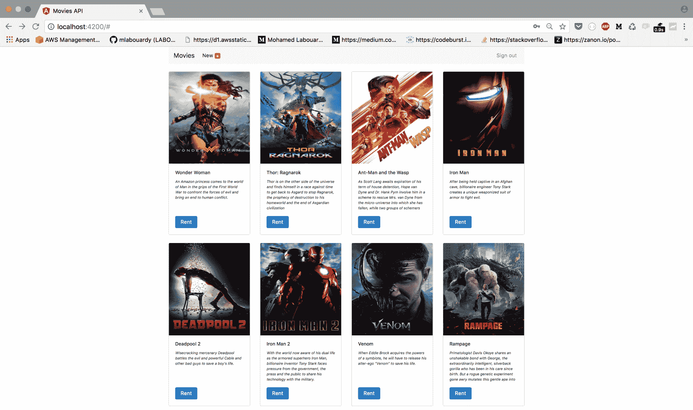

对于 Web 开发人员，Cognito 的`getSession`方法可用于从本地存储中检索当前用户，因为 JavaScript SDK 配置为在正确进行身份验证后自动存储令牌，如下面的屏幕截图所示：

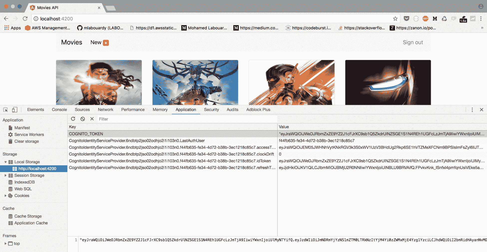

总之，到目前为止，我们已经完成了以下工作：

+   构建了多个 Lambda 函数来管理电影存储

+   在 DynamoDB 表中管理 Lambda 数据持久性

+   通过 API Gateway 公开这些 Lambda 函数

+   在 S3 中构建用于测试构建堆栈的 Web 客户端

+   通过 CloudFront 分发加速 Web 客户端资产

+   在 Route 53 中设置自定义域名

+   使用 AWS Cognito 保护 API

以下模式说明了我们迄今为止构建的无服务器架构：

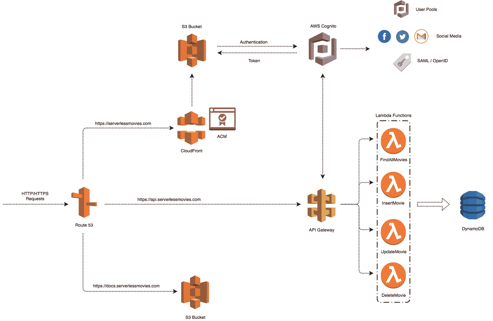

Amazon Cognito 可以配置多个身份提供者，如 Facebook、Twitter、Google 或开发人员认证的身份。

# 加密环境变量

在之前的章节中，我们看到如何使用 AWS Lambda 的环境变量动态传递数据到函数代码，而不更改任何代码。根据**Twelve Factor App**方法论（[`12factor.net/`](https://12factor.net/)），您应该始终将配置与代码分开，以避免将敏感凭据检查到存储库，并能够定义 Lambda 函数的多个发布版本（暂存、生产和沙盒）具有相同的源代码。此外，环境变量可用于根据不同设置更改函数行为**（A/B 测试）**。

如果要在多个 Lambda 函数之间共享秘密，可以使用 AWS 的**系统管理器参数存储**。

以下示例说明了如何使用环境变量将 MySQL 凭据传递给函数的代码：

```go
func handler() error {
  MYSQL_USERNAME := os.Getenv("MYSQL_USERNAME")
  MYSQL_PASSWORD := os.Getenv("MYSQL_PASSWORD")
  MYSQL_DATABASE := os.Getenv("MYSQL_DATABASE")
  MYSQL_PORT := os.Getenv("MYSQL_PORT")
  MYSQL_HOST := os.Getenv("MYSQL_HOST")

  uri := fmt.Sprintf("%s:%s@tcp(%s:%s)/%s", MYSQL_USERNAME, MYSQL_PASSWORD, MYSQL_HOST, MYSQL_PORT, MYSQL_DATABASE)
  db, err := sql.Open("mysql", uri)
  if err != nil {
    return err
  }
  defer db.Close()

  _, err = db.Query(`CREATE TABLE IF NOT EXISTS movies(id INT PRIMARY KEY AUTO_INCREMENT, name VARCHAR(50) NOT NULL)`)
  if err != nil {
    return err
  }

  for _, movie := range []string{"Iron Man", "Thor", "Avengers", "Wonder Woman"} {
    _, err := db.Query("INSERT INTO movies(name) VALUES(?)", movie)
    if err != nil {
      return err
    }
  }

  movies, err := db.Query("SELECT id, name FROM movies")
  if err != nil {
    return err
  }

  for movies.Next() {
    var name string
    var id int
    err = movies.Scan(&id, &name)
    if err != nil {
      return err
    }

    log.Printf("ID=%d\tName=%s\n", id, name)
  }
  return nil
}
```

一旦函数部署到 AWS Lambda 并设置环境变量，就可以调用该函数。它将输出插入到数据库中的电影列表：

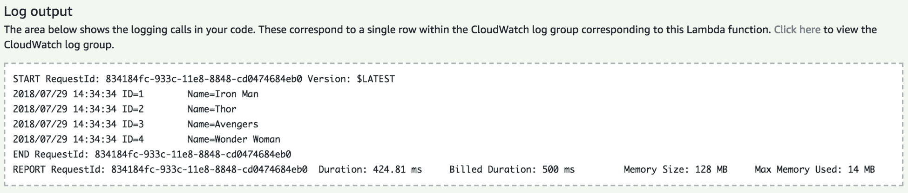

到目前为止，一切都很好。但是，数据库凭据是明文！

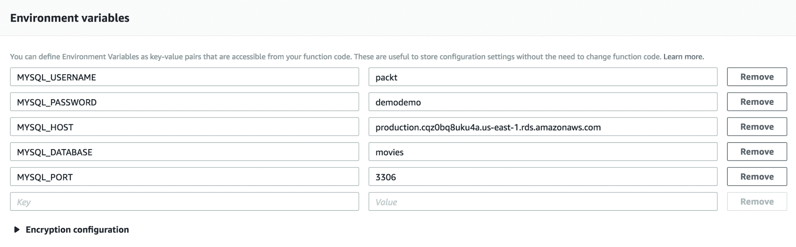

幸运的是，AWS Lambda 在两个级别提供加密：在传输和静态时，使用 AWS 密钥管理服务。

# 数据静态加密

AWS Lambda 在部署函数时加密所有环境变量，并在调用函数时解密它们（即时）。

如果展开“加密配置”部分，您会注意到默认情况下，AWS Lambda 使用默认的 Lambda 服务密钥对环境变量进行加密。此密钥在您在特定区域创建 Lambda 函数时会自动创建：

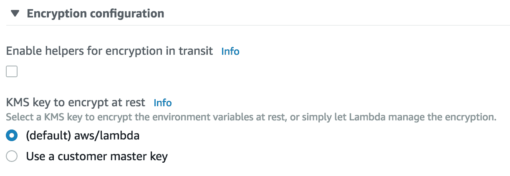

您可以通过导航到身份和访问管理控制台来更改密钥并使用自己的密钥。然后，单击“加密密钥”：

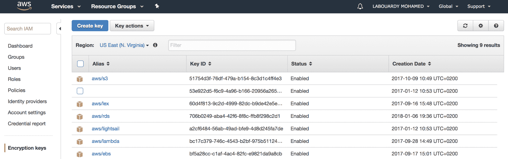

单击“创建密钥”按钮创建新的客户主密钥：

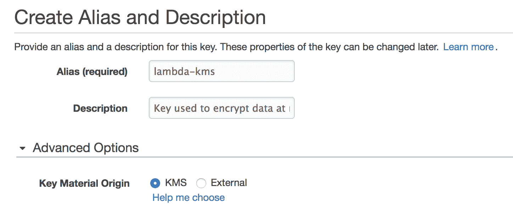

选择一个 IAM 角色和帐户来通过**密钥管理服务**（**KMS**）API 管理密钥。然后，选择您在创建 Lambda 函数时使用的 IAM 角色。这允许 Lambda 函数使用**客户主密钥**（**CMK**）并成功请求`encrypt`和`decrypt`方法：

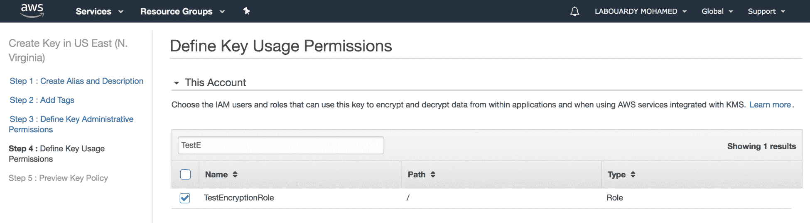

创建密钥后，返回 Lambda 函数配置页面，并将密钥更改为您刚刚创建的密钥：

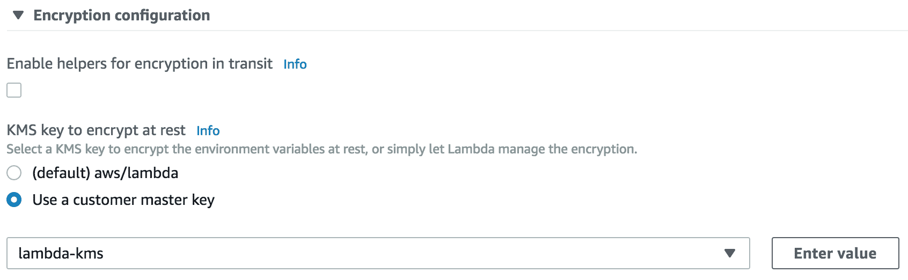

现在，当存储在 Amazon 中时，AWS Lambda 将使用您自己的密钥加密环境变量。

# 数据传输加密

建议在部署函数之前对环境变量（敏感信息）进行加密。AWS Lambda 在控制台上提供了加密助手，使此过程易于遵循。

为了通过在传输中加密（使用之前使用的 KMS），您需要通过选中“启用传输加密的帮助程序”复选框来启用此功能：

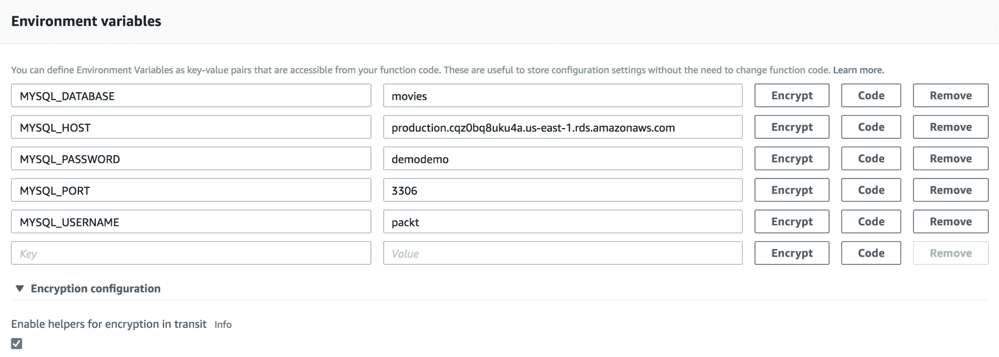

通过单击适当的加密按钮对`MYSQL_USERNAME`和`MYSQL_PASSWORD`进行加密：

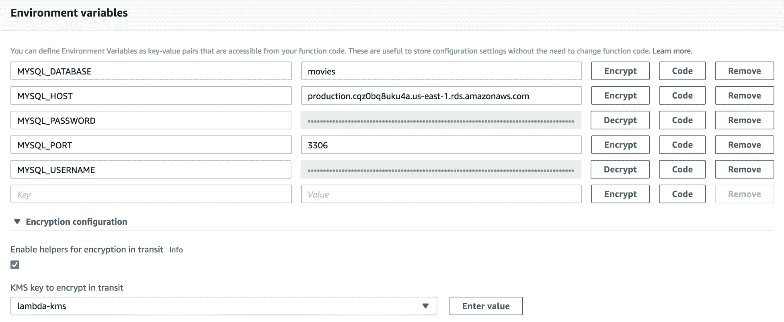

凭据将被加密，并且您将在控制台中看到它们作为`CipherText`。接下来，您需要更新函数的处理程序，使用 KMS SDK 解密环境变量：

```go
var encryptedMysqlUsername string = os.Getenv("MYSQL_USERNAME")
var encryptedMysqlPassword string = os.Getenv("MYSQL_PASSWORD")
var mysqlDatabase string = os.Getenv("MYSQL_DATABASE")
var mysqlPort string = os.Getenv("MYSQL_PORT")
var mysqlHost string = os.Getenv("MYSQL_HOST")
var decryptedMysqlUsername, decryptedMysqlPassword string

func decrypt(encrypted string) (string, error) {
  kmsClient := kms.New(session.New())
  decodedBytes, err := base64.StdEncoding.DecodeString(encrypted)
  if err != nil {
    return "", err
  }
  input := &kms.DecryptInput{
    CiphertextBlob: decodedBytes,
  }
  response, err := kmsClient.Decrypt(input)
  if err != nil {
    return "", err
  }
  return string(response.Plaintext[:]), nil
}

func init() {
  decryptedMysqlUsername, _ = decrypt(encryptedMysqlUsername)
  decryptedMysqlPassword, _ = decrypt(encryptedMysqlPassword)
}

func handler() error {
  uri := fmt.Sprintf("%s:%s@tcp(%s:%s)/%s", decryptedMysqlUsername, decryptedMysqlPassword, mysqlHost, mysqlPort, mysqlDatabase)
  db, err := sql.Open("mysql", uri)
  if err != nil {
    return err
  }
  ...
}
```

如果您使用自己的 KMS 密钥，您需要授予附加到 Lambda 函数的执行角色（IAM 角色）`kms:Decrypt`权限。还要确保增加默认执行超时时间，以允许足够的时间完成函数的代码。

# 使用 CloudTrail 记录 AWS Lambda API 调用

捕获 Lambda 函数发出的所有调用对于审计、安全和合规性非常重要。它为您提供了与其交互的 AWS 服务的全局概览。利用此功能的一个服务是**CloudTrail**。

CloudTrail 记录了 Lambda 函数发出的 API 调用。这很简单易用。您只需要从 AWS 管理控制台导航到 CloudTrail，并按事件源筛选事件，事件源应为`lambda.amazonaws.com`。

在那里，您应该看到每个 Lambda 函数发出的所有调用，如下面的屏幕截图所示：

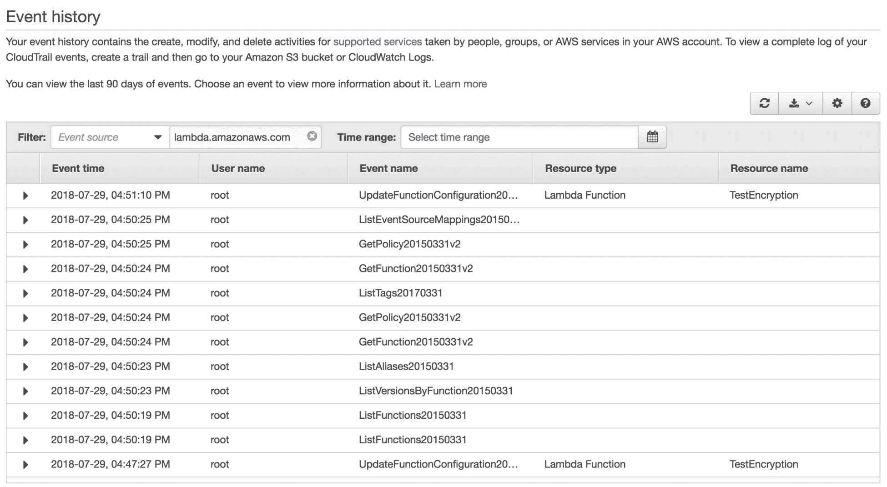

除了公开事件历史记录，您还可以在每个 AWS 区域中创建一个跟踪，将 Lambda 函数的事件记录在单个 S3 存储桶中，然后使用**ELK**（Elasticsearch、Logstash 和 Kibana）堆栈实现日志分析管道，如下所示处理您的日志：

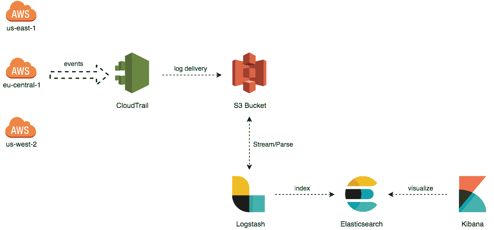

最后，您可以创建交互式和动态小部件，构建 Kibana 中的仪表板，以查看 Lambda 函数事件：

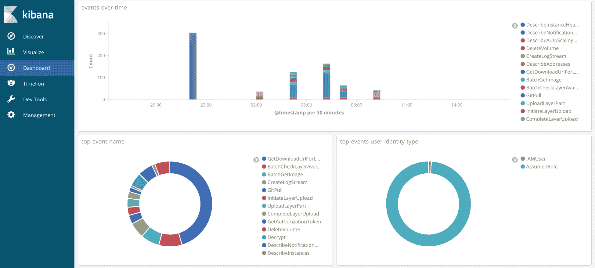

# 为您的依赖项进行漏洞扫描

由于大多数 Lambda 函数代码包含多个第三方 Go 依赖项（记住`go get`命令），因此对所有这些依赖项进行审计非常重要。因此，漏洞扫描您的 Golang 依赖项应该成为您的 CI/CD 的一部分。您必须使用第三方工具（如**S****nyk** ([`snyk.io/`](https://snyk.io/)）自动化安全分析，以持续扫描依赖项中已知的安全漏洞。以下截图描述了您可能选择为 Lambda 函数实施的完整端到端部署过程：

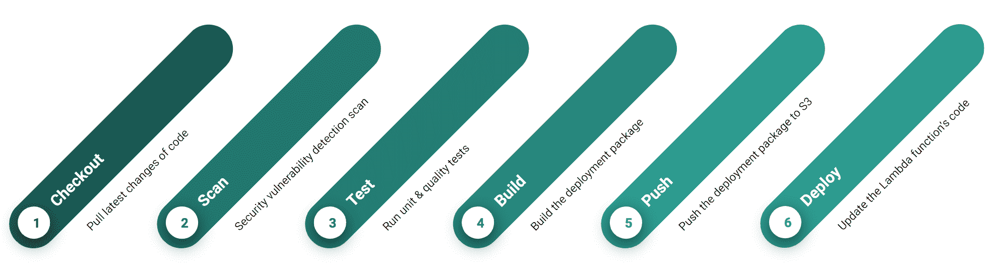

通过将漏洞扫描纳入工作流程，您将能够发现并修复软件包中已知的漏洞，这些漏洞可能导致数据丢失、服务中断和对敏感信息的未经授权访问。

此外，应用程序最佳实践仍然适用于无服务器架构，如代码审查和 git 分支等软件工程实践，以及安全性安全检查，如输入验证或净化，以避免 SQL 注入。

# 摘要

在本章中，您学习了一些构建基于 Lambda 函数的安全无服务器应用程序的最佳实践和建议。我们介绍了 Amazon Cognito 如何作为身份验证提供程序，并如何与 API Gateway 集成以保护 API 端点。然后，我们看了 Lambda 函数代码实践，如使用 AWS KMS 加密敏感数据和输入验证。此外，其他实践也可能非常有用和救命，例如应用配额和节流以防止消费者消耗所有 Lambda 函数容量，以及每个函数使用一个 IAM 角色以利用最小特权原则。

在下一章中，我们将讨论 Lambda 定价模型以及如何根据预期负载估算价格。

# 问题

1.  将用户池中的用户与身份池集成，以允许用户使用其 Facebook 帐户登录。

1.  将用户池中的用户与身份池集成，以允许用户使用其 Twitter 帐户登录。

1.  将用户池中的用户与身份池集成，以允许用户使用其 Google 帐户登录。

1.  实现一个表单，允许用户在 Web 应用程序上创建帐户，以便他们能够登录。

1.  为未经身份验证的用户实现忘记密码流程。
