# 设计成本效益的应用程序

在本章中，我们将讨论 AWS Lambda 的定价模型，并学习如何根据预期负载估算这个价格。我们还将介绍一些优化和降低无服务器应用成本的技巧，同时保持弹性和可用性。本章将涵盖以下主题：

+   Lambda 定价模型

+   最佳内存大小

+   代码优化

+   Lambda 成本和内存跟踪

# Lambda 定价模型

AWS Lambda 改变了运维团队配置和管理组织基础设施的方式。客户现在可以在不担心底层基础设施的情况下运行他们的代码，同时支付低廉的价格。每月的前 100 万次请求是免费的，之后每 100 万次请求收费 0.20 美元，因此您可能会无限期地使用 Lambda 的免费套餐。然而，如果您不额外关注函数的资源使用和代码优化，密集的使用情况和大量的工作负载应用可能会不必要地花费您数千美元。

为了控制 Lambda 成本，您必须了解 Lambda 定价模型的工作原理。有三个因素决定了函数的成本：

+   **执行次数**：调用次数；每次请求支付 0.0000002 美元。

+   **分配的内存**：为函数分配的 RAM 量（范围在 128 MB 和 3,008 MB 之间）。

+   **执行时间**：持续时间是从代码开始执行到返回响应或其他终止的时间。时间向最接近的 100 毫秒取整（Lambda 按 100 毫秒的增量计费），并且您可以设置的最大超时时间为 5 分钟。

+   **数据传输**：如果您的 Lambda 函数发起外部数据传输，将按照 EC2 数据传输速率收费（[`aws.amazon.com/ec2/pricing`](https://aws.amazon.com/ec2/pricing)）。

# Lambda 成本计算器

现在您已经熟悉了定价模型，让我们看看如何提前计算 Lambda 函数的成本。

在前几章中，我们为`FindAllMovies`函数分配了 128 MB 的内存，并将执行超时设置为 3 秒。假设函数每秒执行 10 次（一个月内执行 2500 万次）。您的费用将如下计算：

+   **每月计算费用**：每月计算价格为每 GB/s 0.00001667 美元，免费套餐提供 400,000 GB/s。总计算（秒）=25 百万*（1 秒）=25,000,000 秒。总计算（GB/s）=25,000,000*128 MB/1,024=3,125,000 GB/s。

总计算-免费套餐计算=每月应付费计算 GB/s

3,125,000 GB/s - 400,000 免费套餐 GB/s = 2,725,000 GB/s

每月计算费用=2,725,000 GB/s*$0.00001667=$45.42

+   **每月请求费用**：每月请求价格为每 100 万次请求 0.20 美元，免费套餐提供每月 100 万次请求。

总请求次数-免费套餐请求=每月应付费请求

25 百万次请求-1 百万免费套餐请求=24 百万次每月应付费请求

每月请求费用=24 百万*$0.2/百万=$4.8

因此，总月费用是计算和请求费用的总和，如下所示：

总费用=计算费用+请求费用=45.24 美元+4.8 美元=50.04 美元

# 最佳内存大小

正如我们在前一节中看到的，分配的 RAM 数量会影响计费。此外，它还会影响函数接收的 CPU 和网络带宽的数量。因此，您需要选择最佳的内存大小。为了找到函数的价格和性能的正确平衡和最佳水平，您必须使用不同的内存设置测试您的 Lambda 函数，并分析函数实际使用的内存。幸运的是，AWS Lambda 会在关联的日志组中写入日志条目。日志包含每个请求的函数分配和使用的内存量。以下是日志输出的示例：

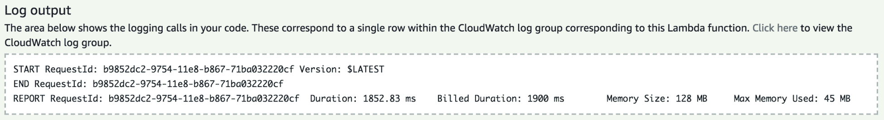

通过比较内存大小和最大内存使用字段，您可以确定您的函数是否需要更多内存，或者您是否过度配置了函数的内存大小。如果您的函数需要更多内存，您可以随时从“基本设置”部分为其提供更多内存，具体如下：

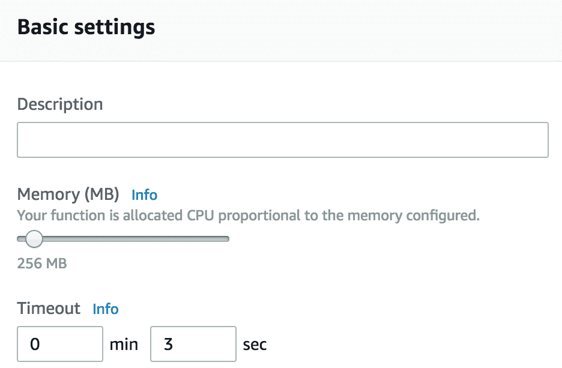

点击“保存”，然后再次调用函数。在日志输出中，您会注意到内存大小会影响执行时间：

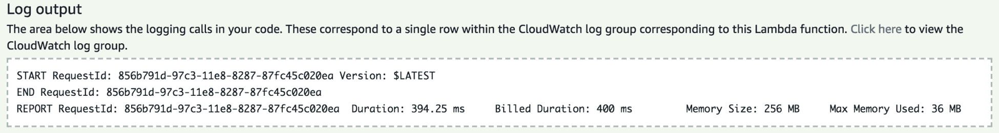

增加函数内存设置将提供显著的性能提升。随着 Lambda 中内存设置的增加，成本将线性增加。同样，减少函数内存设置可能有助于降低成本，但这也会增加执行时间，并且在最坏的情况下可能导致超时或内存超限错误。

将最小内存设置分配给 Lambda 函数并不总是会提供最低总成本。由于内存不足，函数可能会失败和超时。此外，完成所需的时间可能会更长。因此，您将支付更多费用。

# 代码优化

在前面的部分中，我们看到了如何使用不同的内存设置在规模上测试函数会导致分配更多的 CPU 容量，这可能会影响 Lambda 函数的性能和成本。然而，在优化资源使用之前，您需要先优化函数的代码，以帮助减少需要执行的内存和 CPU 的数量。与传统应用程序相反，AWS Lambda 会为您管理和修补基础架构，这使开发人员可以专注于编写高质量、高效和世界级的代码，以便快速执行。

为函数分配更多资源可能会导致更快的执行，直到达到一定阈值，增加更多内存将不再提供更好的性能。

设计 AWS Lambda 函数时，要考虑以下几点，以便以成本效益的方式进行设计：

+   对于某些请求，可以使用热容器。有了这些知识，我们可以通过实施以下操作来改善 Lambda 函数的性能：

+   通过使用全局变量和单例模式，避免在每次调用时重新初始化变量。

+   保持数据库和 HTTP 连接的活动状态并重复使用，这些连接是在先前的调用期间建立的。在 Go 中，您可以使用 `init` 函数来设置所需的状态，并在加载函数处理程序时运行一次性计算。

+   设计您的架构为异步；解耦的组件可能需要更少的计算时间来完成其工作，而不是紧密耦合的组件。此外，避免花费 CPU 周期等待同步请求的响应。

+   使用监控和调试工具，如 AWS X-Ray，分析和排除性能瓶颈、延迟峰值和其他影响 Lambda 应用性能的问题。

+   使用并发预留来设置限制，以防止无限自动缩放、冷启动，并保护下游服务。您还可以通过在 Lambda 触发器和函数之间放置 **简单队列服务**（SQS）来限制执行次数，调整 Lambda 函数触发的频率。

# Lambda 成本和内存跟踪

在 AWS Lambda 中设计成本效益的无服务器应用的关键在于监控成本和资源使用情况。不幸的是，CloudWatch 并未提供有关资源使用或 Lambda 函数成本的开箱即用指标。幸运的是，对于每次执行，Lambda 函数都会将执行日志写入 CloudWatch，如下所示：

```go
REPORT RequestId: 147e72f8-5143-11e8-bba3-b5140c3dea53 Duration: 12.00 ms Billed Duration: 100 ms  Memory Size: 128 MB Max Memory Used: 21 MB 
```

前面的日志显示了给定请求分配和使用的内存。这些值可以通过简单的 CloudWatch 日志指标过滤器提取。此功能使您能够在日志中搜索特定关键字。

打开 AWS CloudWatch 控制台，并从导航窗格中选择“日志组”。接下来，搜索与您的 Lambda 函数关联的日志组。它的名称应该是：`/aws/lambda/FUNCTION_NAME`：

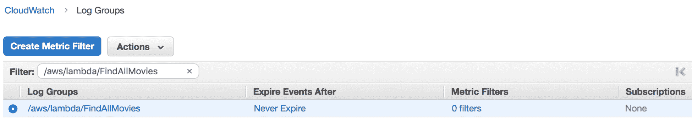

接下来，点击“创建度量过滤器”按钮：

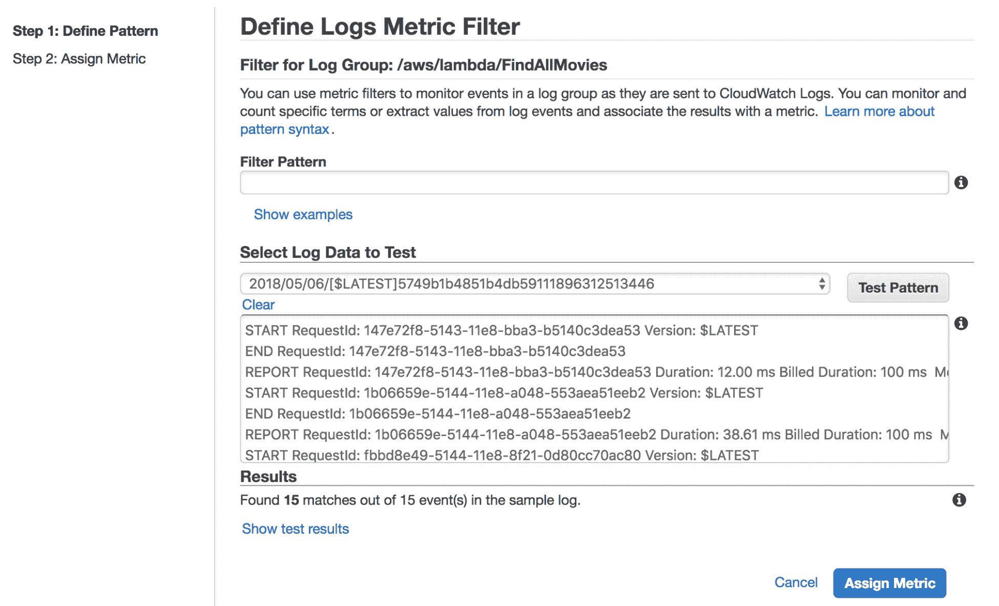

定义一个度量过滤器模式，解析以空格分隔的术语。度量过滤器模式必须指定以逗号分隔的名称字段，并用方括号括起整个模式，例如`[a,b,c]`。然后，点击“测试模式”以测试您的过滤器模式对日志中现有数据的结果。将打印以下记录：

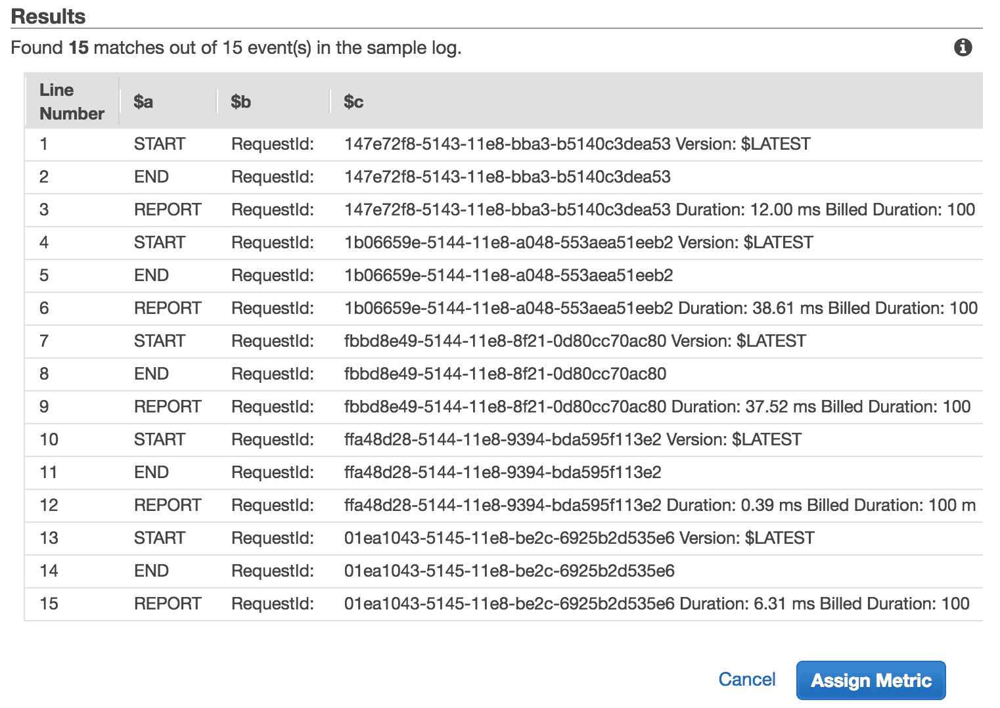

如果您不知道自己有多少字段，可以使用方括号括起来的省略号：

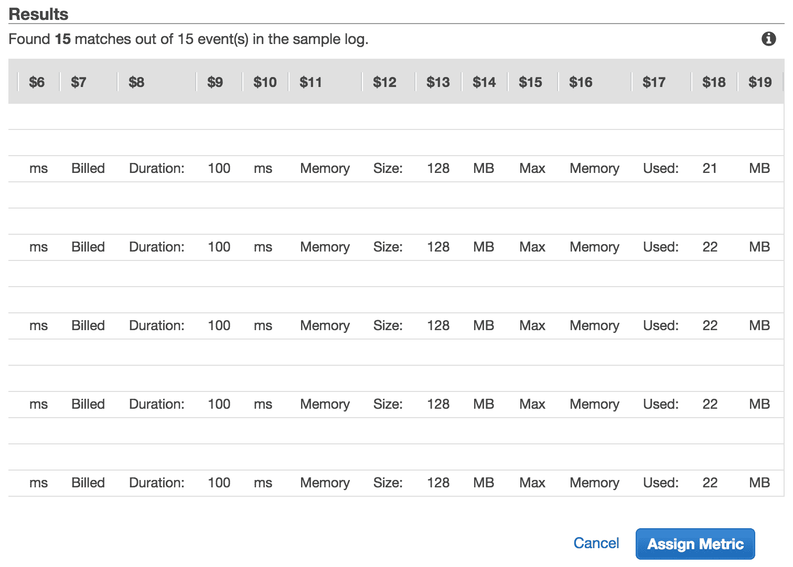

列`$13`将存储分配给函数的内存，`$18`表示实际使用的内存。接下来，点击“分配度量”以创建已分配内存的度量：

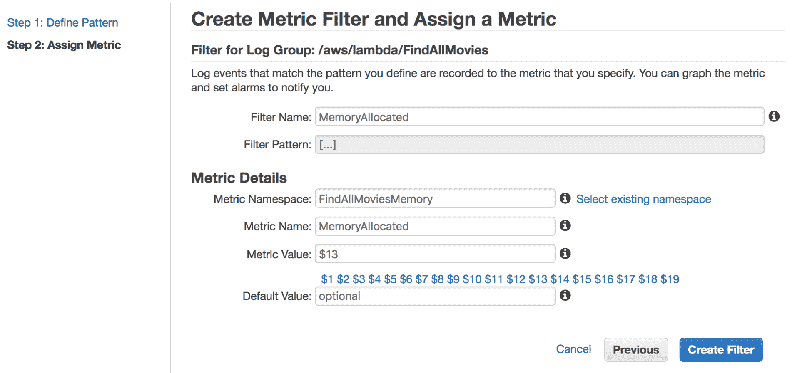

点击“创建过滤器”按钮保存。您现在应该看到新创建的过滤器：

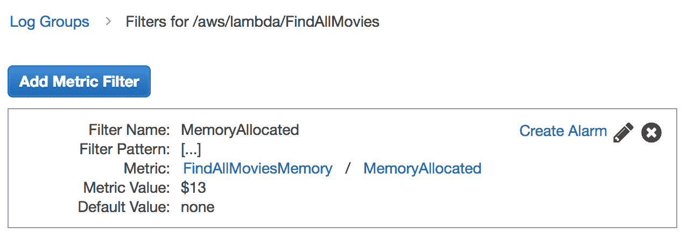

应用相同的步骤为内存使用创建另一个过滤器：

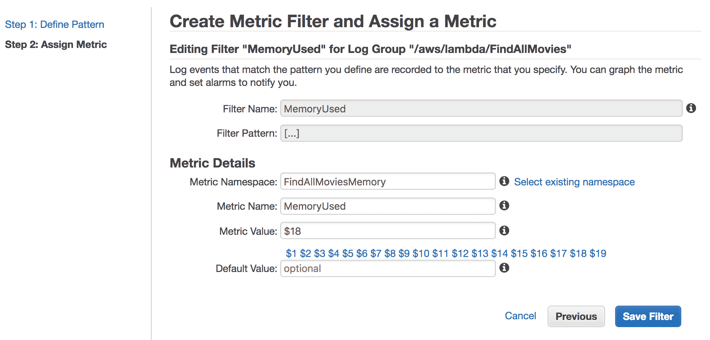

一旦定义了两个过滤器，请确保您的 Lambda 函数正在运行，并在函数填充新的 CloudWatch 指标值时等待几秒钟：

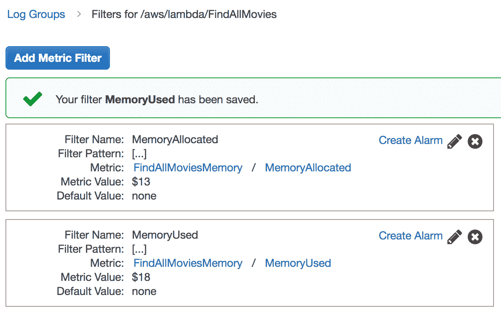

回到 CloudWatch，在我们之前创建的两个度量标准的基础上创建一个新的图表：

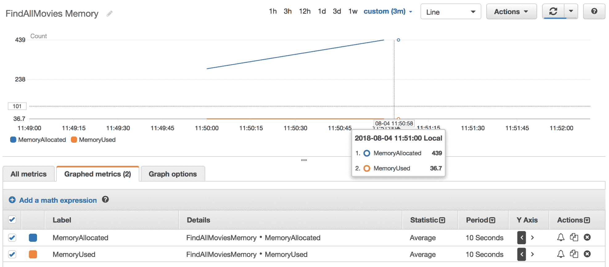

您还可以进一步进行，并创建一个几乎实时的 CloudWatch 警报，如果内存使用量超过某个阈值（例如，相对于您分配的内存的 80%）。此外，重要的是要关注函数的持续时间。您可以按照本节中描述的相同过程从 Lambda 执行日志中提取计费持续时间，并根据提取的值设置警报，以便在函数完成所需时间可疑地长时收到通知。

# 摘要

使用 AWS Lambda 非常简单-您不必预配和管理任何基础设施，并且在几秒钟内就可以轻松运行一些有用的东西。此外，AWS Lambda 相对于 EC2 的一个巨大优势是您不必为闲置资源付费。这非常强大，但也是 Lambda 最大的风险之一。在开发过程中忘记成本是非常常见的，但一旦您开始在生产中运行大量工作负载和多个函数，成本可能会很高。因此，在这成为问题之前，跟踪 Lambda 成本和使用情况非常重要。

最后一章将介绍**基础设施即代码**（IaC）的概念，以帮助您以自动化的方式设计和部署 N 层无服务器应用程序，以避免人为错误和可重复的任务。
