# 第十四章：基础设施即代码

典型的基于 Lambda 的应用程序由多个函数组成，这些函数由事件触发，例如 S3 存储桶中的新对象，传入的 HTTP 请求或新的 SQS 消息。这些函数可以独立存在，也可以利用其他资源，例如 DynamoDB 表，Amazon S3 存储桶和其他 Lambda 函数。到目前为止，我们已经看到如何从 AWS 管理控制台或使用 AWS CLI 创建这些资源。在实际情况下，您希望花费更少的时间来提供所需的资源，并更多地专注于应用程序逻辑。最终，这就是无服务器的方法。

这最后一章将介绍基础设施即代码的概念，以帮助您以自动化的方式设计和部署 N-Tier 无服务器应用程序，以避免人为错误和可重复的任务。

# 技术要求

本书假设您对 AWS 无服务器应用程序模型有一些基本了解。如果您对 SAM 本身还不熟悉，请参阅第一章，*无服务器 Go*，直到第十章，*测试您的无服务器应用程序*。您将获得一个逐步指南，了解如何开始使用 SAM。本章的代码包托管在 GitHub 上，网址为[`github.com/PacktPublishing/Hands-On-serverless-Applications-with-Go`](https://github.com/PacktPublishing/Hands-On-Serverless-Applications-with-Go)。

# 使用 Terraform 部署 AWS Lambda

**Terraform**是 HashiCorp 构建的开源自动化工具。它用于通过声明性配置文件创建，管理和更新基础设施资源。它支持以下提供程序：

+   **云提供商**：AWS，Azure，Oracle Cloud 和 GCP

+   **基础设施软件**：

+   **Consul**：这是一个分布式，高可用的服务发现和配置系统。

+   **Docker**：这是一个旨在通过使用容器更轻松地创建，部署和运行应用程序的工具。

+   **Nomad**：这是一个易于使用的企业级集群调度程序。

+   **Vault**：这是一个提供安全，可靠的存储和分发机密的工具。

+   其他**SaaS**和**PaaS**

Terraform 不是配置管理工具（如 Ansible，Chef 和 Puppet＆Salt）。它是用来生成和销毁基础设施的，而配置管理工具用于在现有基础设施上安装东西。但是，Terraform 可以进行一些配置（[`www.terraform.io/docs/provisioners/index.html`](https://www.terraform.io/docs/provisioners/index.html)）。

这个指南将向您展示如何使用 Terraform 部署 AWS Lambda，因此您需要安装 Terraform。您可以找到适合您系统的包并下载它（[`www.terraform.io/downloads.html`](https://www.terraform.io/downloads.html)）。下载后，请确保`terraform`二进制文件在`PATH`变量中可用。配置您的凭据，以便 Terraform 能够代表您进行操作。以下是提供身份验证凭据的四种方法：

+   通过提供商直接提供 AWS `access_key`和`secret_key`。

+   AWS 环境变量。

+   共享凭据文件。

+   EC2 IAM 角色。

如果您遵循了第二章，*开始使用 AWS Lambda*，您应该已经安装并配置了 AWS CLI。因此，您无需采取任何行动。

# 创建 Lambda 函数

要开始创建 Lambda 函数，请按照以下步骤进行：

1.  使用以下结构创建一个新项目：

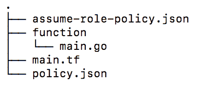

1.  我们将使用最简单的 Hello world 示例。`function`文件夹包含一个基于 Go 的 Lambda 函数，显示一个简单的消息：

```go
package main

import "github.com/aws/aws-lambda-go/lambda"

func handler() (string, error) {
  return "First Lambda function with Terraform", nil
}
func main() {
  lambda.Start(handler)
}
```

1.  您可以构建基于 Linux 的二进制文件，并使用以下命令生成`deployment`包：

```go
GOOS=linux go build -o main main.go
zip deployment.zip main
```

1.  现在，函数代码已经定义，让我们使用 Terraform 创建我们的第一个 Lambda 函数。将以下内容复制到`main.tf`文件中：

```go
provider "aws" {
  region = "us-east-1"
}

resource "aws_iam_role" "role" {
  name = "PushCloudWatchLogsRole"
  assume_role_policy = "${file("assume-role-policy.json")}"
}

resource "aws_iam_policy" "policy" {
  name = "PushCloudWatchLogsPolicy"
  policy = "${file("policy.json")}"
}

resource "aws_iam_policy_attachment" "profile" {
  name = "cloudwatch-lambda-attachment"
  roles = ["${aws_iam_role.role.name}"]
  policy_arn = "${aws_iam_policy.policy.arn}"
}

resource "aws_lambda_function" "demo" {
  filename = "function/deployment.zip"
  function_name = "HelloWorld"
  role = "${aws_iam_role.role.arn}"
  handler = "main"
  runtime = "go1.x"
}
```

1.  这告诉 Terraform 我们将使用 AWS 提供程序，并默认为创建我们的资源使用`us-east-1`区域：

+   **IAM 角色**是在执行期间 Lambda 函数将要承担的执行角色。它定义了我们的 Lambda 函数可以访问的资源：

```go
{
  "Version": "2012-10-17",
  "Statement": [
    {
      "Action": "sts:AssumeRole",
      "Principal": {
        "Service": "lambda.amazonaws.com"
      },
      "Effect": "Allow",
      "Sid": ""
    }
  ]
}
```

+   **IAM 策略**是授予我们的 Lambda 函数权限的权限列表，以将其日志流式传输到 CloudWatch。以下策略将附加到 IAM 角色：

```go
{
  "Version": "2012-10-17",
  "Statement": [
    {
      "Sid": "1",
      "Effect": "Allow",
      "Action": [
        "logs:CreateLogStream",
        "logs:CreateLogGroup",
        "logs:PutLogEvents"
      ],
      "Resource": "*"
    }
  ]
}
```

+   **Lambda 函数**是一个基于 Go 的 Lambda 函数。部署包可以直接指定为本地文件（使用`filename`属性）或通过 Amazon S3 存储桶。有关如何将 Lambda 函数部署到 AWS 的详细信息，请参阅第六章，*部署您的无服务器应用*。

1.  在终端上运行`terraform init`命令以下载和安装 AWS 提供程序，如下所示：

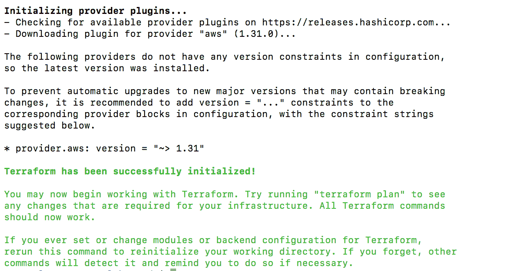

1.  使用`terraform plan`命令创建执行计划（模拟运行）。它会提前显示将要创建的内容，这对于调试和确保您没有做错任何事情非常有用，如下一个屏幕截图所示：

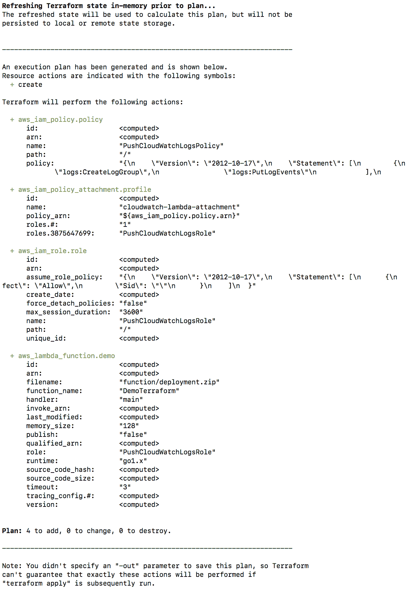

1.  在将其部署到 AWS 之前，您将能够检查 Terraform 的执行计划。准备好后，通过发出以下命令应用更改：

```go
terraform apply
```

1.  确认配置，输入`yes`。将显示以下输出（为简洁起见，某些部分已被裁剪）：

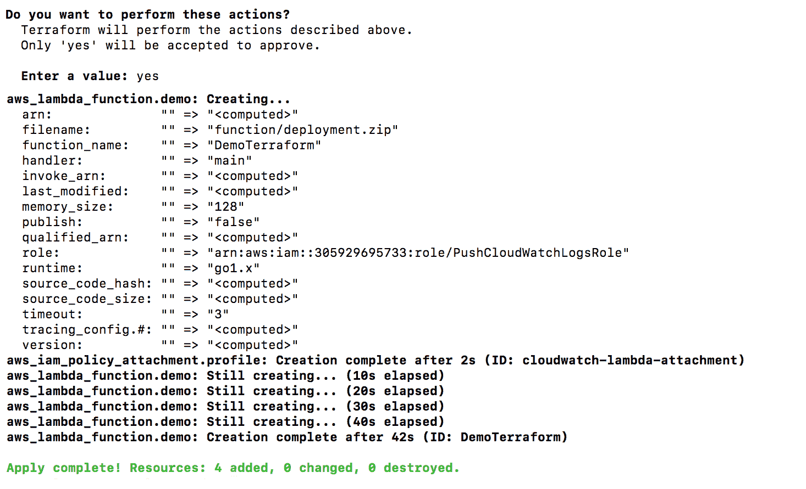

确保用于执行这些命令的 IAM 用户具有执行 IAM 和 Lambda 操作的权限。

1.  如果返回 AWS Lambda 控制台，应该创建一个新的 Lambda 函数。如果尝试调用它，应返回预期的消息，如下一个屏幕截图所示：

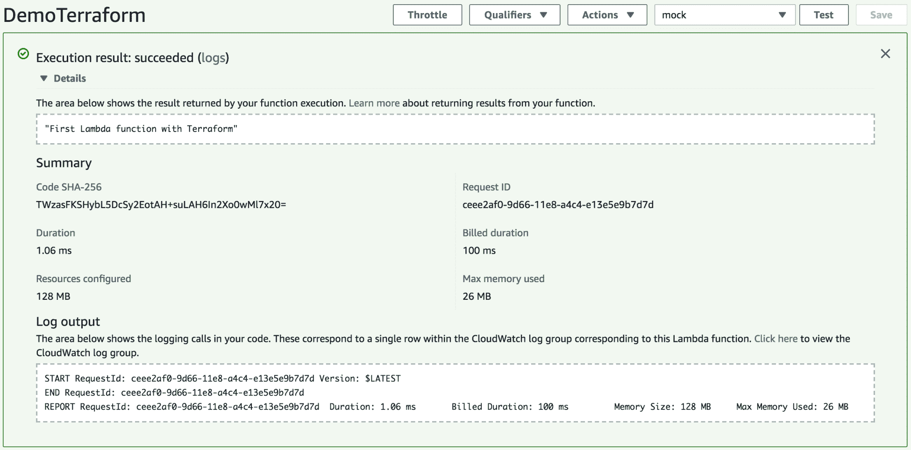

1.  到目前为止，我们在模板文件中定义了 AWS 区域和函数名称。但是，我们使用基础架构即代码工具的原因之一是可用性和自动化。因此，您应始终使用变量并避免硬编码值。幸运的是，Terraform 允许您定义自己的变量。为此，请创建一个`variables.tf`文件，如下所示：

```go
variable "aws_region" {
  default = "us-east-1"
  description = "AWS region"
}

variable "lambda_function_name" {
  default = "DemoFunction"
  description = "Lambda function's name"
}
```

1.  更新`main.tf`以使用变量而不是硬编码的值。注意使用`${var.variable_name}`关键字：

```go
provider "aws" {
  region = "${var.aws_region}"
}

resource "aws_lambda_function" "demo" {
  filename = "function/deployment.zip"
  function_name = "${var.lambda_function_name}"
  role = "${aws_iam_role.role.arn}"
  handler = "main"
  runtime = "go1.x"
}
```

1.  函数按预期工作后，使用 Terraform 创建我们迄今为止构建的无服务器 API。

1.  在一个新目录中，创建一个名为`main.tf`的文件，其中包含以下配置：

```go
resource "aws_iam_role" "role" {
 name = "FindAllMoviesRole"
 assume_role_policy = "${file("assume-role-policy.json")}"
}

resource "aws_iam_policy" "cloudwatch_policy" {
 name = "PushCloudWatchLogsPolicy"
 policy = "${file("cloudwatch-policy.json")}"
}

resource "aws_iam_policy" "dynamodb_policy" {
 name = "ScanDynamoDBPolicy"
 policy = "${file("dynamodb-policy.json")}"
}

resource "aws_iam_policy_attachment" "cloudwatch-attachment" {
 name = "cloudwatch-lambda-attchment"
 roles = ["${aws_iam_role.role.name}"]
 policy_arn = "${aws_iam_policy.cloudwatch_policy.arn}"
}

resource "aws_iam_policy_attachment" "dynamodb-attachment" {
 name = "dynamodb-lambda-attchment"
 roles = ["${aws_iam_role.role.name}"]
 policy_arn = "${aws_iam_policy.dynamodb_policy.arn}"
}
```

1.  上述代码片段创建了一个具有扫描 DynamoDB 表和将日志条目写入 CloudWatch 权限的 IAM 角色。使用 DynamoDB 表名作为环境变量配置一个基于 Go 的 Lambda 函数：

```go
resource "aws_lambda_function" "findall" {
  function_name = "FindAllMovies"
  handler = "main"
  filename = "function/deployment.zip"
  runtime = "go1.x"
  role = "${aws_iam_role.role.arn}"

  environment {
    variables {
      TABLE_NAME = "movies"
    }
  }
}
```

# 设置 DynamoDB 表

接下来，我们必须设置 DynamoDB 表。执行以下步骤：

1.  为表的分区键创建一个 DynamoDB 表：

```go
resource "aws_dynamodb_table" "movies" {
  name = "movies"
  read_capacity = 5
  write_capacity = 5
  hash_key = "ID"

  attribute {
      name = "ID"
      type = "S"
  }
}
```

1.  使用新项目初始化`movies`表：

```go
resource "aws_dynamodb_table_item" "items" {
  table_name = "${aws_dynamodb_table.movies.name}"
  hash_key = "${aws_dynamodb_table.movies.hash_key}"
  item = "${file("movie.json")}"
}
```

1.  项目属性在`movie.json`文件中定义：

```go
{
  "ID": {"S": "1"},
  "Name": {"S": "Ant-Man and the Wasp"},
  "Description": {"S": "A Marvel's movie"},
  "Cover": {"S": http://COVER_URL.jpg"}
}
```

# 配置 API Gateway

最后，我们需要通过 API Gateway 触发函数：

1.  在 REST API 上创建一个`movies`资源，并在其上公开一个`GET`方法。如果传入的请求与定义的资源匹配，它将调用之前定义的 Lambda 函数：

```go
resource "aws_api_gateway_rest_api" "api" {
  name = "MoviesAPI"
}

resource "aws_api_gateway_resource" "proxy" {
  rest_api_id = "${aws_api_gateway_rest_api.api.id}"
  parent_id = "${aws_api_gateway_rest_api.api.root_resource_id}"
  path_part = "movies"
}

resource "aws_api_gateway_method" "proxy" {
  rest_api_id = "${aws_api_gateway_rest_api.api.id}"
  resource_id = "${aws_api_gateway_resource.proxy.id}"
  http_method = "GET"
  authorization = "NONE"
}

resource "aws_api_gateway_integration" "lambda" {
  rest_api_id = "${aws_api_gateway_rest_api.api.id}"
  resource_id = "${aws_api_gateway_method.proxy.resource_id}"
  http_method = "${aws_api_gateway_method.proxy.http_method}"

  integration_http_method = "POST"
  type = "AWS_PROXY"
  uri = "${aws_lambda_function.findall.invoke_arn}"
}
```

1.  发出以下命令安装 AWS 插件，生成执行计划并应用更改：

```go
terraform init
terraform plan
terraform apply
```

1.  创建整个基础架构应该只需要几秒钟。创建步骤完成后，Lambda 函数应该已创建并正确配置，如下一个屏幕截图所示：

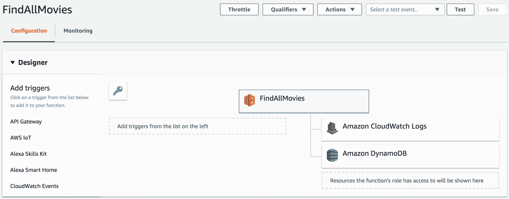

1.  API Gateway 也是一样，应该定义一个新的 REST API，其中`/movies`资源上有一个`GET`方法，如下所示：

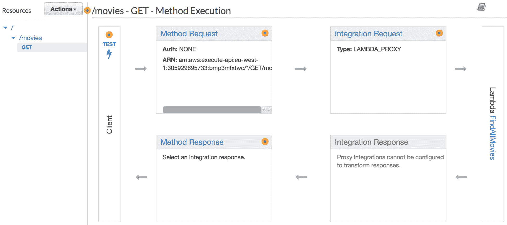

1.  在 DynamoDB 控制台中，应创建一个新表，并在下一个屏幕截图中显示一个电影项目：

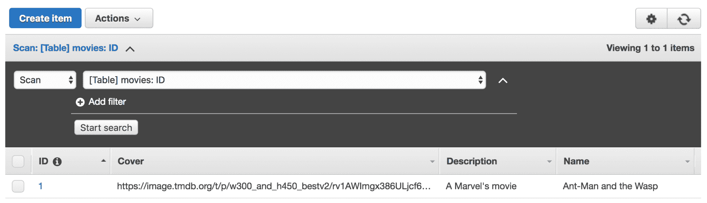

1.  为了调用我们的 API Gateway，我们需要部署它。创建一个部署阶段，让我们称之为`staging`：

```go
resource "aws_api_gateway_deployment" "staging" {
  depends_on = ["aws_api_gateway_integration.lambda"]

  rest_api_id = "${aws_api_gateway_rest_api.api.id}"
  stage_name = "staging"
}
```

1.  我们将使用 Terraform 的输出功能来公开 API URL；创建一个`outputs.tf`文件，内容如下：

```go
output "API Invocation URL" {
  value = "${aws_api_gateway_deployment.staging.invoke_url}"
}
```

1.  再次运行`terraform apply`以创建这些新对象，它将检测到更改并要求您确认它应该执行的操作，如下所示：

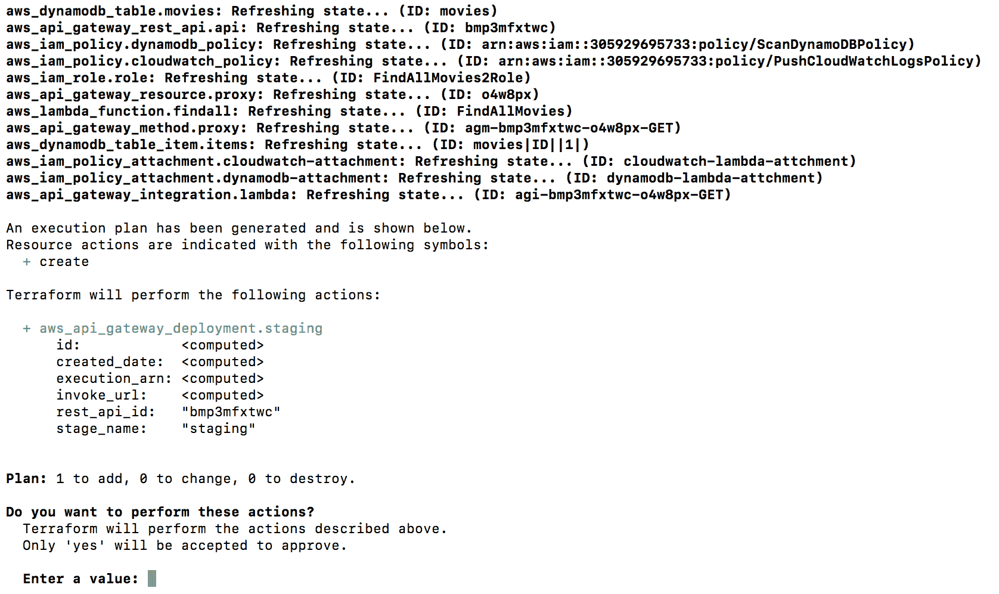

1.  API Gateway URL 将显示在输出部分；将其复制到剪贴板：

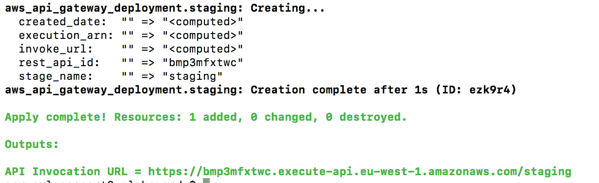

1.  如果您将您喜欢的浏览器指向 API 调用 URL，将显示错误消息，如下一张截图所示：

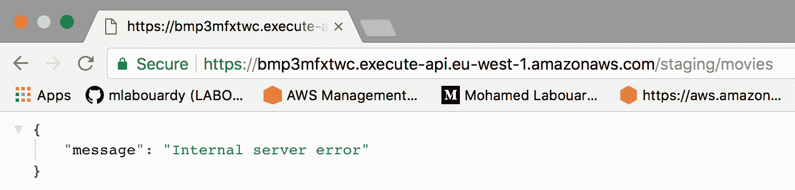

1.  我们将通过授予 API Gateway 调用 Lambda 函数的执行权限来解决这个问题。更新`main.tf`文件以创建`aws_lambda_permission`资源：

```go
resource "aws_lambda_permission" "apigw" {
  statement_id = "AllowAPIGatewayInvoke"
  action = "lambda:InvokeFunction"
  function_name = "${aws_lambda_function.findall.arn}"
  principal = "apigateway.amazonaws.com"

  source_arn = "${aws_api_gateway_deployment.staging.execution_arn}/*/*"
}
```

1.  使用`terraform apply`命令应用最新更改。在 Lambda 控制台上，API Gateway 触发器应该显示如下：

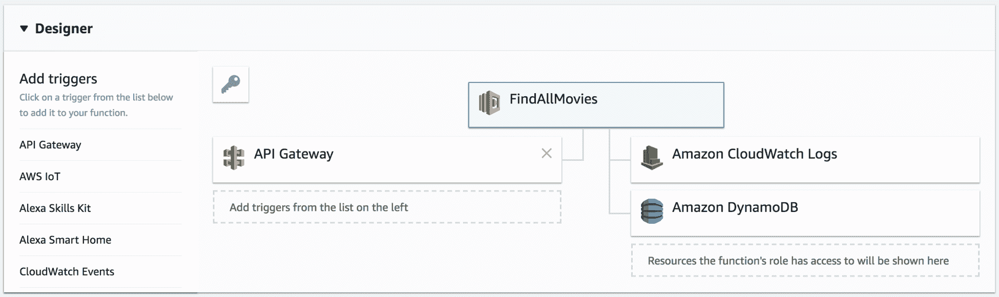

1.  在您喜欢的网络浏览器中加载输出中给出的 URL。如果一切正常，您将以 JSON 格式在 DynamoDB 表中看到存储的电影，如下一张截图所示：

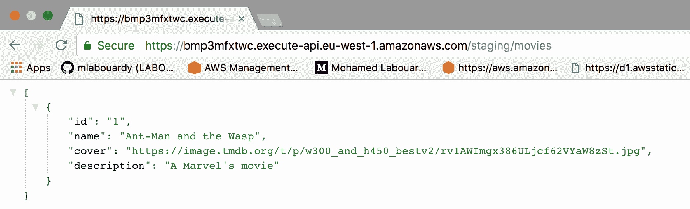

Terraform 将基础设施的状态存储在状态文件（`.tfstate`）中。状态包含资源 ID 和所有资源属性。如果您使用 Terraform 创建 RDS 实例，则数据库凭据将以明文形式存储在状态文件中。因此，您应该将文件保存在远程后端，例如 S3 存储桶中。

# 清理

最后，要删除所有资源（Lambda 函数、IAM 角色、IAM 策略、DynamoDB 表和 API Gateway），您可以发出`terraform destroy`命令，如下所示：

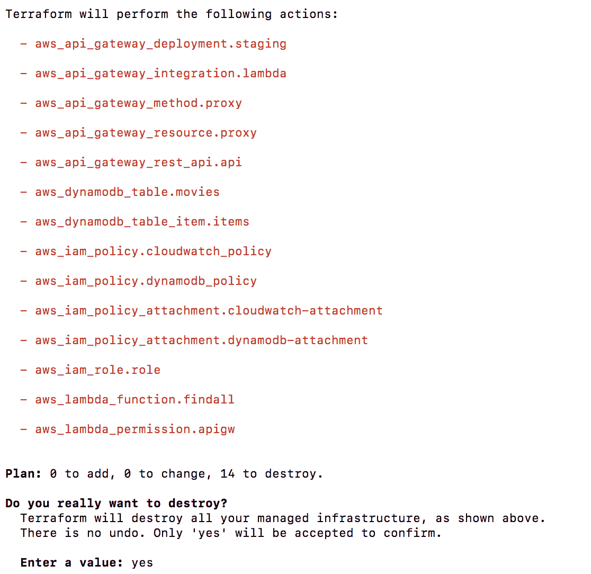

如果您想删除特定资源，可以使用`--target`选项，如下所示：`terraform destroy --target=RESOURCE_NAME`。操作将仅限于资源及其依赖项。

到目前为止，我们已经使用模板文件定义了 AWS Lambda 函数及其依赖关系。因此，我们可以像任何其他代码一样对其进行版本控制。我们使用和配置的整个无服务器基础设施被视为源代码，使我们能够在团队成员之间共享它，在其他 AWS 区域中复制它，并在失败时回滚。

# 使用 CloudFormation 部署 AWS Lambda

**AWS CloudFormation**是一种基础设施即代码工具，用于以声明方式指定资源。您可以在蓝图文档（模板）中对您希望 AWS 启动的所有资源进行建模，AWS 会为您创建定义的资源。因此，您花费更少的时间管理这些资源，更多的时间专注于在 AWS 中运行的应用程序。

Terraform 几乎涵盖了 AWS 的所有服务和功能，并支持第三方提供商（平台无关），而 CloudFormation 是 AWS 特定的（供应商锁定）。

您可以使用 AWS CloudFormation 来指定、部署和配置无服务器应用程序。您创建一个描述无服务器应用程序依赖关系的模板（Lambda 函数、DynamoDB 表、API Gateway、IAM 角色等），AWS CloudFormation 负责为您提供和配置这些资源。您不需要单独创建和配置 AWS 资源，并弄清楚什么依赖于什么。

在我们深入了解 CloudFormation 之前，我们需要了解模板结构：

+   **AWSTemplateFormatVersion**：CloudFormation 模板版本。

+   **Description**：模板的简要描述。

+   **Mappings**：键和相关值的映射，可用于指定条件参数值。

+   **Parameters**：运行时传递给模板的值。

+   **Resources**：AWS 资源及其属性（Lambda、DynamoDB、S3 等）。

+   **输出**：描述每当查看堆栈属性时返回的值。

了解 AWS CloudFormation 模板的不同部分后，您可以将它们放在一起，并在`template.yml`文件中定义一个最小模板，如下所示：

```go
AWSTemplateFormatVersion: "2010-09-09"
Description: "Simple Lambda Function"
Parameters:
  FunctionName:
    Description: "Function name"
    Type: "String"
    Default: "HelloWorld"
  BucketName:
    Description: "S3 Bucket name"
    Type: "String"
Resources:
  ExecutionRole:
    Type: "AWS::IAM::Role"
    Properties:
      AssumeRolePolicyDocument:
        Version: "2012-10-17"
        Statement:
          - Effect: "Allow"
            Principal:
              Service:
                - "lambda.amazonaws.com"
            Action:
              - "sts:AssumeRole"
      Policies:
        - PolicyName: "PushCloudWatchLogsPolicy"
          PolicyDocument:
            Version: "2012-10-17"
            Statement:
              - Effect: "Allow"
              - Action:
                - logs:CreateLogGroup
                - logs:CreateLogStream
                - logs:PutLogEvents
              - Resource: "*"
  HelloWorldFunction:
    Type: "AWS::Lambda::Function"
    Properties:
      Code:
        S3Bucket: !Ref BucketName
        S3Key: deployment.zip
      FunctionName: !Ref FunctionName
      Handler: "main"
      Runtime: "go1.x"
      Role: !GetAtt ExecutionRole.Arn
```

上述文件定义了两个资源：

+   `ExecutionRole`：分配给 Lambda 函数的 IAM 角色，它定义了 Lambda 运行时调用的代码的权限。

+   `HelloWorldFunction`：AWS Lambda 定义，我们已将运行时属性设置为使用 Go，并将函数的代码存储在 S3 上的 ZIP 文件中。该函数使用 CloudFormation 的内置`GetAtt`函数引用 IAM 角色；它还使用`Ref`关键字引用参数部分中定义的变量。

也可以使用 JSON 格式；在 GitHub 存储库中可以找到 JSON 版本（[`github.com/PacktPublishing/Hands-On-serverless-Applications-with-Go`](https://github.com/PacktPublishing/Hands-On-Serverless-Applications-with-Go)）。

执行以下步骤开始：

1.  使用以下命令构建后，创建一个 S3 存储桶来存储部署包：

```go
aws s3 mb s3://hands-on-serverless-go-packt/
GOOS=linux go build -o main main.go
zip deployment.zip main
aws s3 cp deployment.zip s3://hands-on-serverless-go-packt/
```

1.  转到 AWS CloudFormation 控制台，然后选择“创建堆栈”，如下一个屏幕截图所示：

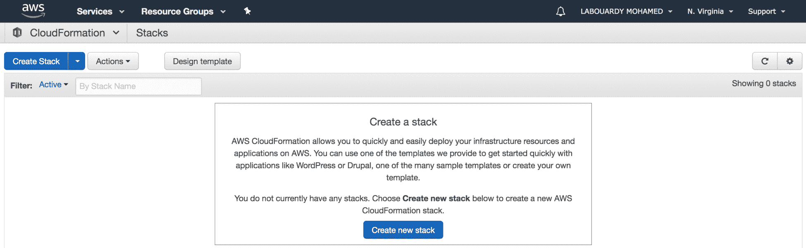

1.  在“选择模板”页面上，选择模板文件，它将上传到 Amazon S3 存储桶，如下所示：

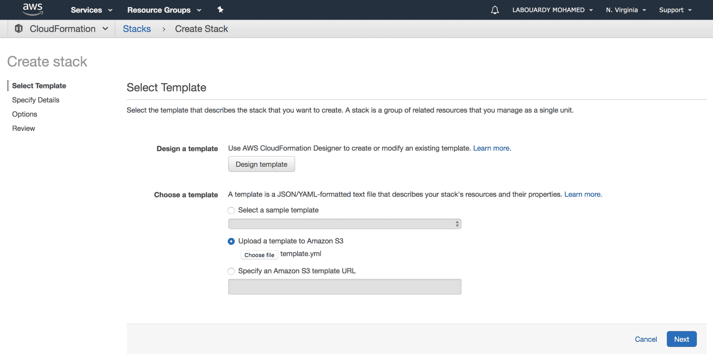

1.  单击“下一步”，定义堆栈名称，并根据需要覆盖默认参数，如下一个屏幕截图所示：

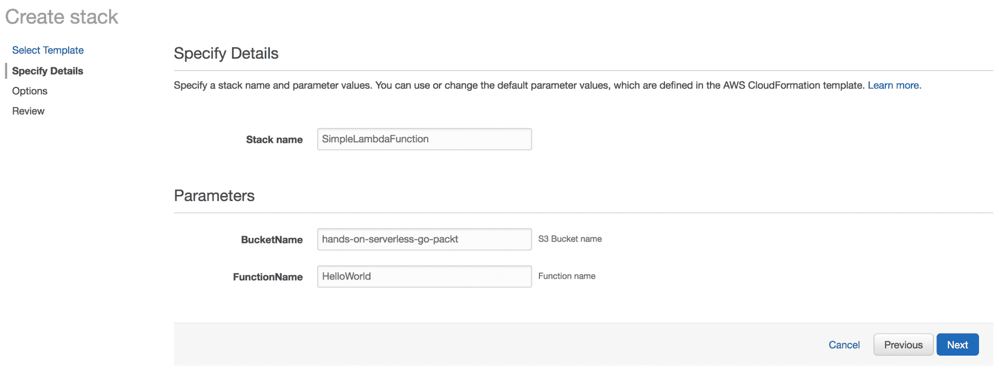

1.  单击“下一步”，将选项保留为默认值，然后单击“创建”，如下一个屏幕截图所示：

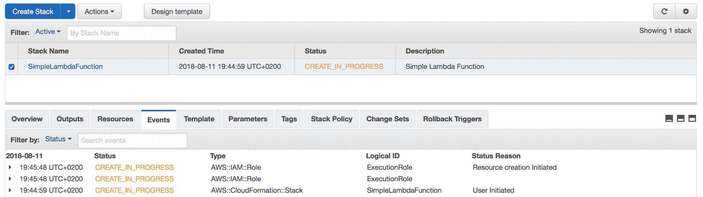

1.  堆栈将开始创建模板文件中定义的所有资源。创建后，堆栈状态将从**CREATE_IN_PROGRESS**更改为**CREATE_COMPLETE**（如果出现问题，将自动执行回滚），如下所示：

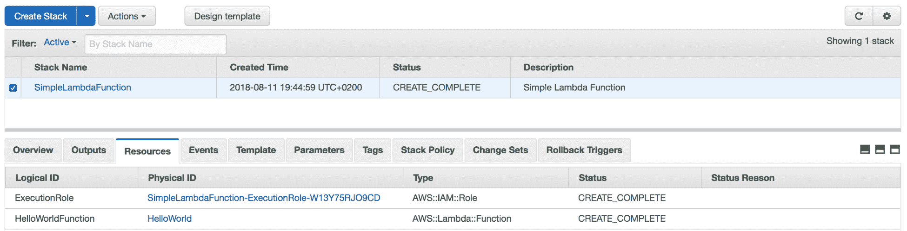

1.  因此，我们的 Lambda 函数应该如下屏幕截图所示创建：

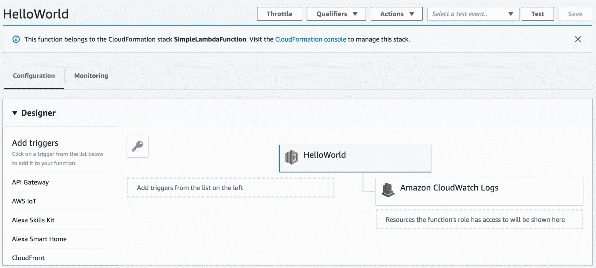

1.  您始终可以更新您的 CloudFormation 模板文件。例如，让我们创建一个新的 DynamoDB 表：

```go
AWSTemplateFormatVersion: "2010-09-09"
Description: "Simple Lambda Function"
Parameters:
  FunctionName:
    Description: "Function name"
    Type: "String"
    Default: "HelloWorld"
  BucketName:
    Description: "S3 Bucket name"
    Type: "String"
  TableName:
    Description: "DynamoDB Table Name"
    Type: "String"
    Default: "movies"
Resources:
  ExecutionRole:
    Type: "AWS::IAM::Role"
    Properties:
      AssumeRolePolicyDocument:
        Version: "2012-10-17"
        Statement:
          - 
            Effect: "Allow"
            Principal:
              Service:
                - "lambda.amazonaws.com"
            Action:
              - "sts:AssumeRole"
      Policies:
        - 
          PolicyName: "PushCloudWatchLogsPolicy"
          PolicyDocument:
            Version: "2012-10-17"
            Statement:
              - Effect: Allow
                Action:
                - logs:CreateLogGroup
                - logs:CreateLogStream
                - logs:PutLogEvents
                Resource: "*"
        - 
          PolicyName: "ScanDynamoDBTablePolicy"
          PolicyDocument:
            Version: "2012-10-17"
            Statement:
              - Effect: Allow
                Action:
                - dynamodb:Scan
                Resource: "*"
  HelloWorldFunction:
    Type: "AWS::Lambda::Function"
    Properties:
      Code:
        S3Bucket: !Ref BucketName
        S3Key: deployment.zip
      FunctionName: !Ref FunctionName
      Handler: "main"
      Runtime: "go1.x"
      Role: !GetAtt ExecutionRole.Arn
      Environment:
        Variables:
          TABLE_NAME: !Ref TableName
  DynamoDBTable:
    Type: "AWS::DynamoDB::Table"
    Properties:
      TableName: !Ref TableName
      AttributeDefinitions:
        -
          AttributeName: "ID"
          AttributeType: "S"
      KeySchema:
        -
          AttributeName: "ID"
          KeyType: "HASH"
      ProvisionedThroughput:
        ReadCapacityUnits: 5
        WriteCapacityUnits: 5
```

1.  在 CloudFormation 控制台上，选择我们之前创建的堆栈，然后从菜单中单击“更新堆栈”，如下所示：

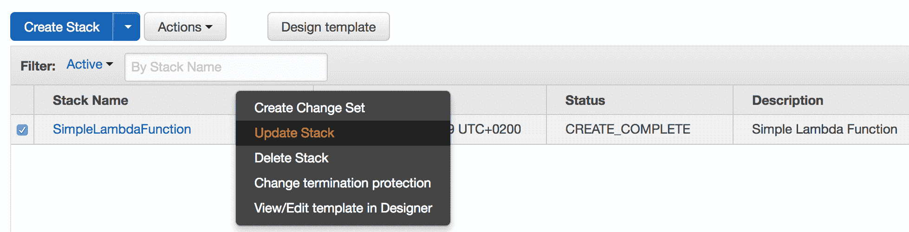

1.  上传更新后的模板文件，如下所示：

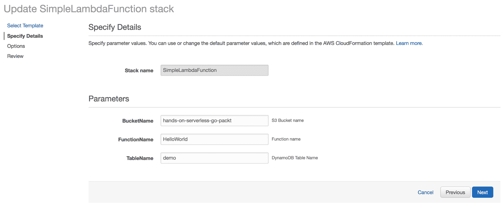

1.  与 Terraform 类似，AWS CloudFormation 将检测更改并提前显示将更改的资源，如下所示：

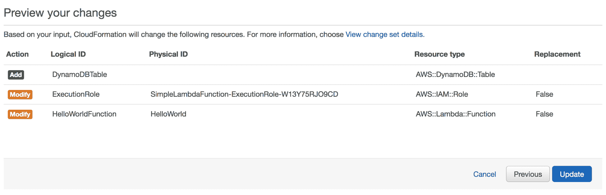

1.  单击“更新”按钮以应用更改。堆栈状态将更改为 UPDATE_IN_PROGRESS，如下一个屏幕截图所示：

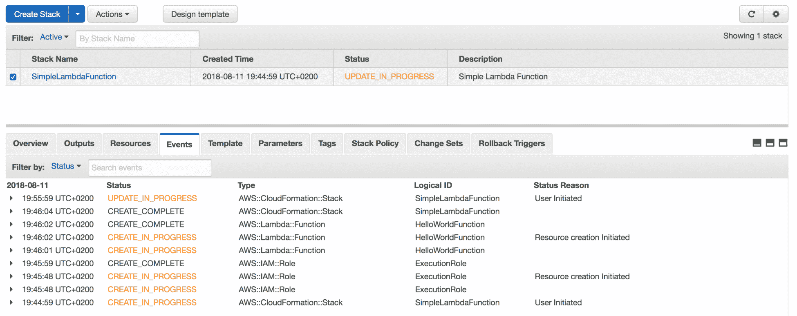

1.  应用更改后，将创建一个新的 DynamoDB 表，并向 Lambda 函数授予 DynamoDB 权限，如下所示：

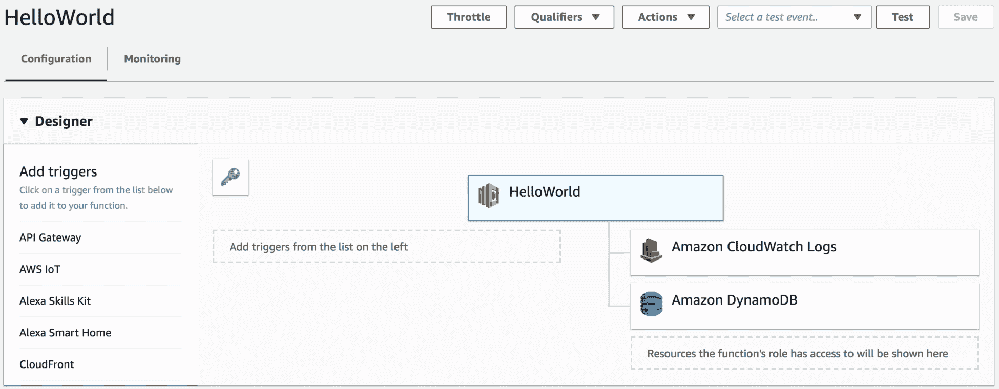

每当 CloudFormation 必须定义 IAM 角色、策略或相关资源时，`--capabilities CAPABILITY_IAM`选项是必需的。

1.  AWS CLI 也可以用来使用以下命令创建您的 CloudFormation 堆栈：

```go
aws cloudformation create-stack --stack-name=SimpleLambdaFunction \
 --template-body=file://template.yml \
 --capabilities CAPABILITY_IAM \
 --parameters ParameterKey=BucketName,ParameterValue=hands-on-serverless-go-packt 
 ParameterKey=FunctionName,ParameterValue=HelloWorld \
 ParameterKey=TableName,ParameterValue=movies
```

# CloudFormation 设计师

除了从头开始编写自己的模板外，还可以使用 CloudFormation 设计模板功能轻松创建您的堆栈。以下屏幕截图显示了如何查看到目前为止创建的堆栈的设计：

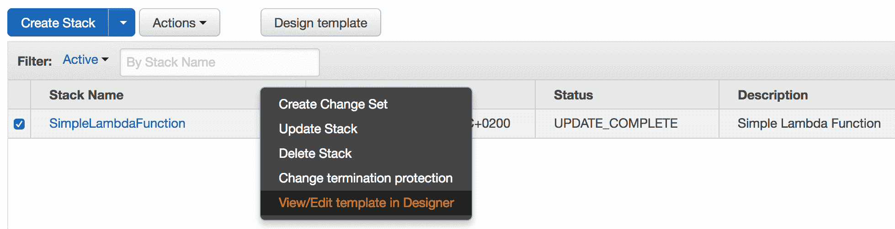

如果一切顺利，您应该看到以下组件：

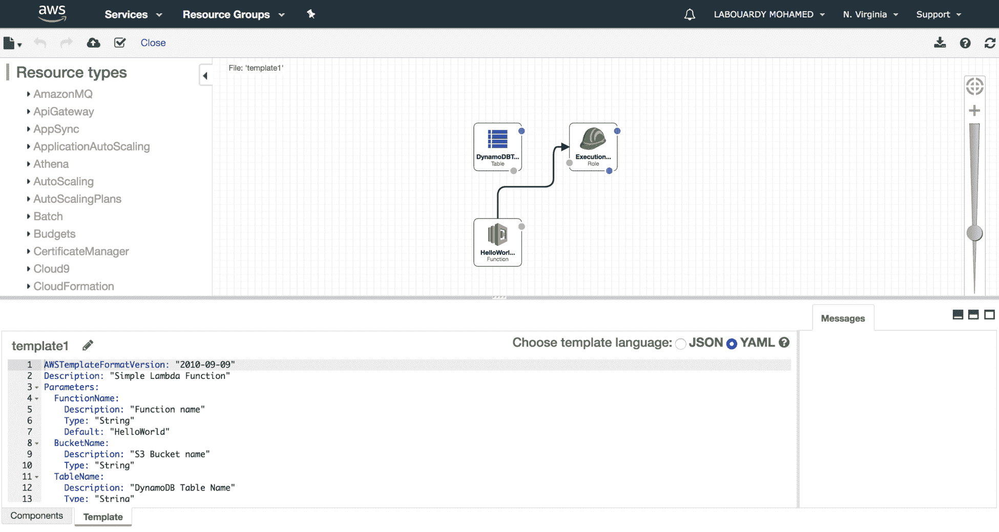

现在，您可以通过从左侧菜单拖放组件来创建复杂的 CloudFormation 模板。

# 使用 SAM 部署 AWS Lambda

**AWS 无服务器应用程序模型**（**AWS SAM**）是定义无服务器应用程序的模型。AWS SAM 受到 AWS CloudFormation 的本地支持，并定义了一种简化的语法来表达无服务器资源。您只需在模板文件中定义应用程序中所需的资源，并使用 SAM 部署命令创建一个 CloudFormation 堆栈。

之前，我们看到了如何使用 AWS SAM 来本地测试 Lambda 函数。此外，SAM 还可以用于设计和部署函数到 AWS Lambda。您可以使用以下命令初始化一个快速的基于 Go 的无服务器项目（样板）：

```go
sam init --name api --runtime go1.x
```

上述命令将创建一个具有以下结构的文件夹：

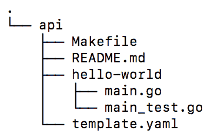

`sam init`命令提供了一种快速创建无服务器应用程序的方法。它生成一个简单的带有关联单元测试的 Go Lambda 函数。此外，将生成一个包含构建和生成部署包步骤列表的 Makefile。最后，将创建一个模板文件，称为 SAM 文件，其中描述了部署函数到 AWS Lambda 所需的所有 AWS 资源。

现在我们知道了如何使用 SAM 生成样板，让我们从头开始编写自己的模板。创建一个名为`findall`的文件夹，在其中创建一个`main.go`文件，其中包含`FindAllMovies`函数的代码内容：

```go
// Movie entity
type Movie struct {
  ID string `json:"id"`
  Name string `json:"name"`
  Cover string `json:"cover"`
  Description string `json:"description"`
}

func findAll() (events.APIGatewayProxyResponse, error) {
  ...
  svc := dynamodb.New(cfg)
  req := svc.ScanRequest(&dynamodb.ScanInput{
    TableName: aws.String(os.Getenv("TABLE_NAME")),
  })
  res, err := req.Send()
  if err != nil {
    return events.APIGatewayProxyResponse{
      StatusCode: http.StatusInternalServerError,
      Body: "Error while scanning DynamoDB",
    }, nil
  }

  movies := make([]Movie, 0)
  for _, item := range res.Items {
    movies = append(movies, Movie{
      ID: *item["ID"].S,
      Name: *item["Name"].S,
      Cover: *item["Cover"].S,
      Description: *item["Description"].S,
    })
  }
  ...
  return events.APIGatewayProxyResponse{
    StatusCode: 200,
    Headers: map[string]string{
      "Content-Type": "application/json",
      "Access-Control-Allow-Origin": "*",
    },
    Body: string(response),
  }, nil
}

func main() {
  lambda.Start(findAll)
}
```

接下来，在`template.yaml`文件中创建一个无服务器应用程序定义。以下示例说明了如何创建一个带有 DynamoDB 表的 Lambda 函数：

```go
AWSTemplateFormatVersion: '2010-09-09'
Transform: AWS::serverless-2016-10-31
Resources:
  FindAllFunction:
    Type: AWS::serverless::Function
    Properties:
      Handler: main
      Runtime: go1.x
      Policies: AmazonDynamoDBFullAccess 
      Environment:
        Variables: 
          TABLE_NAME: !Ref MoviesTable
  MoviesTable: 
     Type: AWS::serverless::SimpleTable
     Properties:
       PrimaryKey:
         Name: ID
         Type: String
       ProvisionedThroughput:
         ReadCapacityUnits: 5
         WriteCapacityUnits: 5
```

该模板类似于我们之前编写的 CloudFormation 模板。SAM 扩展了 CloudFormation 并简化了表达无服务器资源的语法。

使用`package`命令将部署包上传到*CloudFormation*部分中创建的 S3 存储桶：

```go
sam package --template-file template.yaml --output-template-file serverless.yaml \
    --s3-bucket hands-on-serverless-go-packt
```

上述命令将部署页面上传到 S3 存储桶，如下截图所示：

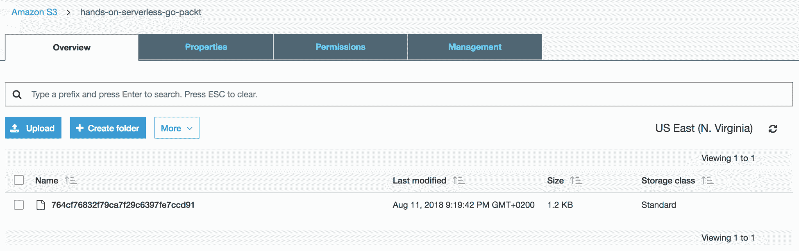

此外，将基于您提供的定义文件生成一个名为`serverless.yaml`的 SAM 模板文件。它应该包含指向您指定的 Amazon S3 存储桶中的`deployment` ZIP 的`CodeUri`属性：

```go
AWSTemplateFormatVersion: '2010-09-09'
Resources:
  FindAllFunction:
    Properties:
      CodeUri: s3://hands-on-serverless-go-packt/764cf76832f79ca7f29c6397fe7ccd91
      Environment:
        Variables:
          TABLE_NAME:
            Ref: MoviesTable
      Handler: main
      Policies: AmazonDynamoDBFullAccess
      Runtime: go1.x
    Type: AWS::serverless::Function
  MoviesTable:
    Properties:
      PrimaryKey:
        Name: ID
        Type: String
      ProvisionedThroughput:
        ReadCapacityUnits: 5
        WriteCapacityUnits: 5
    Type: AWS::serverless::SimpleTable
Transform: AWS::serverless-2016-10-31
```

最后，使用以下命令将函数部署到 AWS Lambda：

```go
sam deploy --template-file serverless.yaml --stack-name APIStack \
 --capabilities CAPABILITY_IAM

```

`CAPABILITY_IAM`用于明确确认 AWS CloudFormation 被允许代表您为 Lambda 函数创建 IAM 角色。

当您运行`sam deploy`命令时，它将创建一个名为 APIStack 的 AWS CloudFormation 堆栈，如下截图所示：

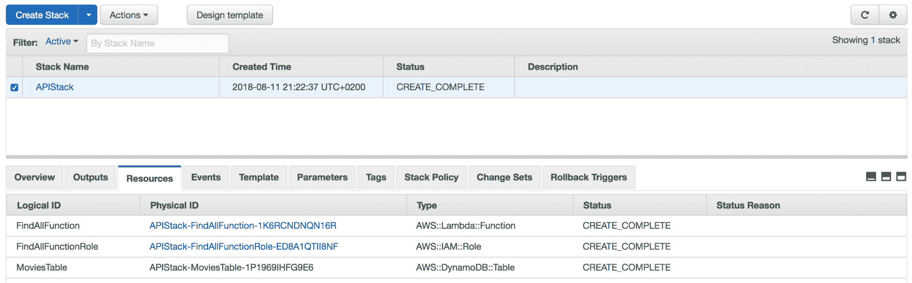

资源创建后，函数应该部署到 AWS Lambda，如下所示：

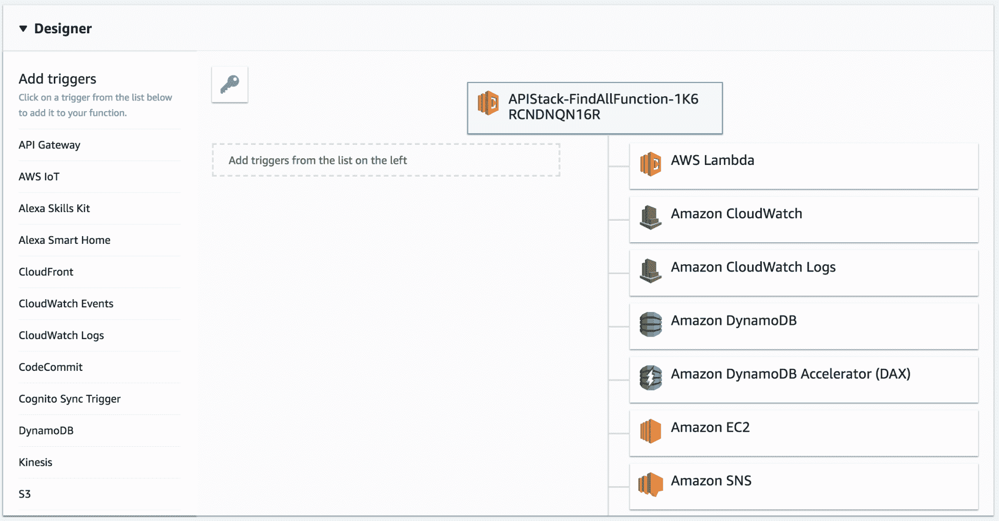

SAM 范围仅限于无服务器资源（支持的 AWS 服务列表可在以下网址找到：[`docs.aws.amazon.com/serverlessrepo/latest/devguide/using-aws-sam.html`](https://docs.aws.amazon.com/serverlessrepo/latest/devguide/using-aws-sam.html)）。

# 导出无服务器应用程序

AWS Lambda 允许您为现有函数导出 SAM 模板文件。选择目标函数，然后从操作菜单中单击“导出函数”，如下所示：

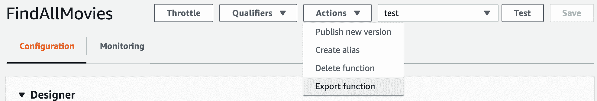

单击“下载 AWS SAM 文件”以下载模板文件，如下所示：

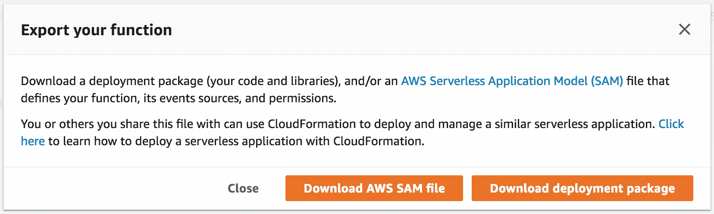

模板将包含函数的定义、必要的权限和触发器：

```go
AWSTemplateFormatVersion: '2010-09-09'
Transform: 'AWS::serverless-2016-10-31'
Description: An AWS serverless Specification template describing your function.
Resources:
  FindAllMovies:
    Type: 'AWS::serverless::Function'
    Properties:
      Handler: main
      Runtime: go1.x
      CodeUri: .
      Description: ''
      MemorySize: 128
      Timeout: 3
      Role: 'arn:aws:iam::ACCOUNT_ID:role/FindAllMoviesRole'
      Events:
        Api1:
          Type: Api
          Properties:
            Path: /MyResource
            Method: ANY
        Api2:
          Type: Api
          Properties:
            Path: /movies
            Method: GET
      Environment:
        Variables:
          TABLE_NAME: movies
      Tracing: Active
      ReservedConcurrentExecutions: 10
```

现在，您可以使用`sam package`和`sam deploy`命令将函数导入到不同的 AWS 区域或 AWS 账户中。

# 总结

管理无服务器应用程序资源可以是非常手动的，或者您可以自动化工作流程。但是，如果您有一个复杂的基础架构，自动化流程可能会很棘手。这就是 AWS CloudFormation、SAM 和 Terraform 等工具发挥作用的地方。

在本章中，我们学习了如何使用基础设施即代码工具来自动化创建 AWS 中无服务器应用程序资源和依赖关系。我们看到了一些特定于云的工具，以及松散耦合的工具，可以在多个平台上运行。然后，我们看到了这些工具如何用于部署基于 Lambda 的应用程序到 AWS。

到目前为止，您可以编写一次无服务器基础设施代码，然后多次使用它。定义基础设施的代码可以进行版本控制、分叉、回滚（回到过去）并用于审计基础设施更改，就像任何其他代码一样。此外，它可以以编程方式发现和解决。换句话说，如果基础设施已经被手动修改，您可以销毁该基础设施并重新生成一个干净的副本——不可变基础设施。

# 问题

1.  编写一个 Terraform 模板来创建`InsertMovie` Lambda 函数资源。

1.  更新 CloudFormation 模板，以便在收到传入的 HTTP 请求时通过 API Gateway 触发定义的 Lambda 函数。

1.  编写一个 SAM 文件来建模和定义构建本书中一直使用的无服务器 API 所需的所有资源。

1.  配置 Terraform 以将生成的状态文件存储在远程 S3 后端。

1.  为我们在本书中构建的无服务器 API 创建一个 CloudFormation 模板。

1.  为我们在本书中构建的无服务器 API 创建一个 Terraform 模板。
