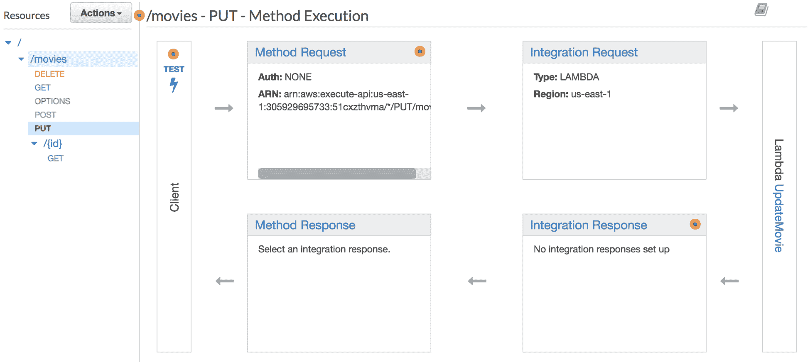
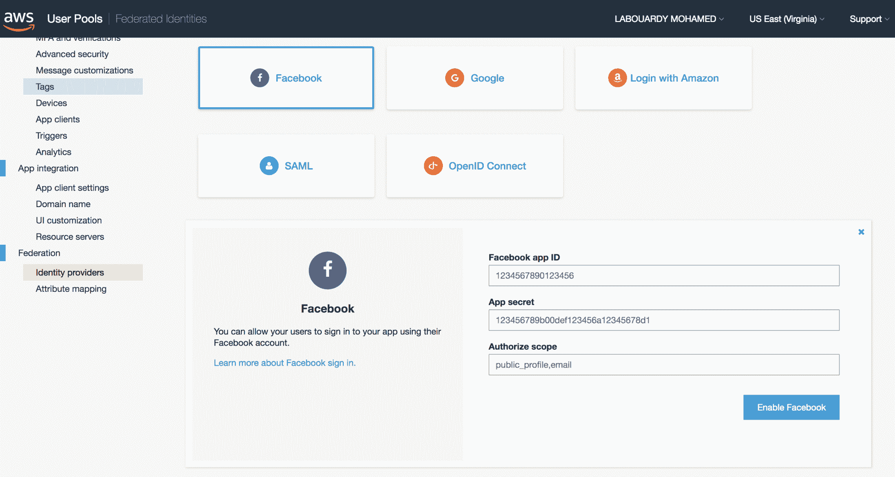
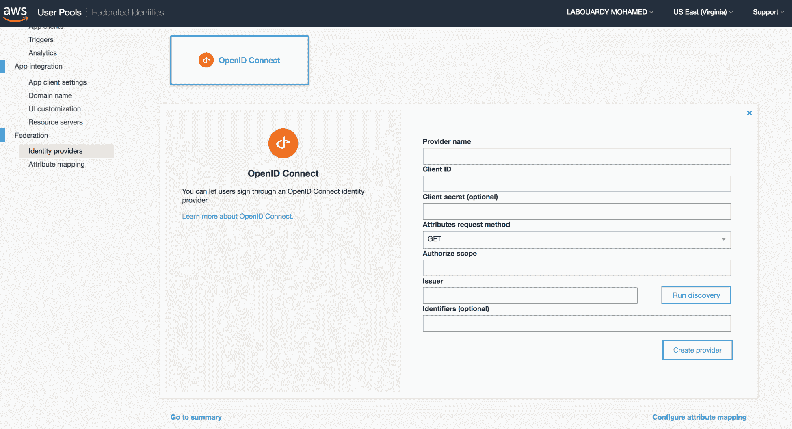
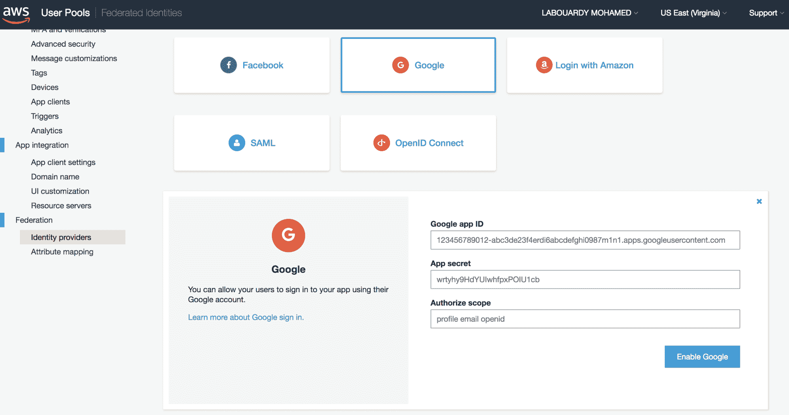

# 评估

# 第一章：无服务器

1.  使用无服务器方法的优势是什么？

**答案**：

+   +   NoOps：没有管理或配置开销，上市时间更快。

+   自动缩放和 HA：根据负载增强的可伸缩性和弹性。

+   成本优化：只为您消耗的计算时间付费。

+   Polygot：利用纳米服务架构的力量。

1.  Lambda 是一种节省时间的方法的原因是什么？

**答案**：您按执行次数付费，不会为闲置资源付费，而使用 EC2 实例时，您还会为未使用的资源付费。

1.  无服务器架构如何实现微服务？

**答案**：微服务是将单片应用程序分解为一组较小和模块化服务的方法。无服务器计算是微服务应用程序的关键启用。它使基础设施变得事件驱动，并完全由构成应用程序的每个服务的需求控制。此外，无服务器意味着函数，而微服务是一组函数。

1.  AWS Lambda 函数的最长时间限制是多少？

**答案**：默认情况下，每个 Lambda 函数的超时时间为 3 秒；您可以设置的最长持续时间为 5 分钟。

1.  以下哪些是 AWS Lambda 支持的事件源？

+   亚马逊 Kinesis 数据流

+   亚马逊 RDS

+   AWS CodeCommit

+   AWS 云形成

**答案**：亚马逊 Kinesis 数据流、AWS CodeCommit 和 CloudFormation 是 AWS Lambda 支持的事件源。所有支持的事件源列表可以在以下网址找到：[`docs.aws.amazon.com/lambda/latest/dg/invoking-lambda-function.html`](https://docs.aws.amazon.com/lambda/latest/dg/invoking-lambda-function.html)

1.  解释 Go 中的 goroutine 是什么。如何停止 goroutines？

**答案**：goroutine 是轻量级线程；它使用一种称为**通道**的资源进行通信。通道通过设计，防止了在使用 goroutines 访问共享内存时发生竞态条件。要停止 goroutine，我们传递信号通道。该信号通道用于推送一个值。goroutine 定期轮询该通道。一旦检测到信号，它就会退出。

1.  AWS 中的 Lambda@Edge 是什么？

**答案**：Lambda@Edge 允许您在 CloudFront 的边缘位置运行 Lambda 函数，以便自定义返回给最终用户的内容，延迟最低。

1.  功能即服务和平台即服务之间有什么区别？

**答案**：PaaS 和 FaaS 都允许您轻松部署应用程序并在不担心基础架构的情况下进行扩展。但是，FaaS 可以节省您的资金，因为您只需为处理传入请求所使用的计算时间付费。

1.  什么是 AWS Lambda 冷启动？

**答案**：当触发新事件时会发生冷启动；AWS Lambda 创建和初始化一个新实例或容器来处理请求，这比热启动需要更长的时间（启动延迟），在热启动中，容器是从先前的事件中重用的。

1.  AWS Lambda 函数可以是无状态的还是有状态的？

**答案**：Lambda 函数必须是无状态的，以利用由于传入事件速率增加而导致的自动扩展的能力。

# 第二章：开始使用 AWS Lambda

1.  AWS CLI 不支持哪种格式？

+   JSON

+   表

+   XML

+   文本

**答案**：支持的值为 JSON、表和文本。默认输出为 JSON。

1.  是否建议使用 AWS 根帐户进行日常与 AWS 的交互？如果是的话，为什么？

**答案**：AWS 根帐户具有创建和删除 AWS 资源、更改计费甚至关闭 AWS 帐户的最终权限。因此，强烈建议为日常任务创建一个仅具有所需权限的 IAM 用户。

1.  您需要设置哪些环境变量才能使用 AWS CLI？

**答案**：以下是配置 AWS CLI 所需的环境变量：

+   +   `AWS_ACCESS_KEY_ID`

+   `AWS_SECRET_ACCESS_KEY`

+   `AWS_DEFAULT_REGION`

1.  如何使用具有命名配置文件的 AWS CLI？

**回答**：`AWS_PROFILE`可用于设置要使用的 CLI 配置文件。配置文件存储在凭据文件中。默认情况下，AWS CLI 使用`default`配置文件。

1.  解释 GOPATH 环境变量。

**回答**：`GOPATH`环境变量指定 Go 工作区的位置。默认值为`$HOME/go`。

1.  哪个命令行命令编译 Go 程序？

+   `go build`

+   `go run`

+   `go fmt`

+   `go doc`

**回答**：上述命令执行以下操作：

+   +   `build`：它是一个编译包和依赖项并生成单个二进制文件。

+   `run`：它是一个编译和运行 Go 程序。

+   `fmt`：它是一个重新格式化包资源。

+   `doc`：它是一个显示包或函数文档的包。

1.  什么是 Go 工作区？

**回答**：Go 工作区是一个您将加载和处理 Go 代码的目录。该目录必须具有以下层次结构：

+   +   `src`：它包含 Go 源文件。

+   `bin`：它包含可执行文件。

+   `pkg`：它包含包对象。

# 第三章：使用 Lambda 开发无服务器函数

1.  创建 AWS Lambda 函数的 IAM 角色的命令行命令是什么？

**回答**：使用以下命令创建一个 IAM 角色；它允许 Lambda 函数调用您帐户下的 AWS 服务：

```go
aws iam create-role ROLE_NAME --assume-role-policy-document file://assume-role-lambda.json
```

`assume-role-lambda.json`文件包含以下内容：

```go
{  
 "Version":"2012-10-17",
 "Statement":[  
  {  
  "Effect":"Allow",
  "Principal":{  
   "AWS":"*"
  },
  "Action":"sts:AssumeRole"
  }
 ]
} 
```

1.  在弗吉尼亚地区（`us-east-1`）创建一个新的 S3 存储桶并将 Lambda 部署包上传到其中的命令行命令是什么？

**回答**：以下命令可用于创建一个 S3 存储桶：

```go
aws s3 mb s3://BUCKET_NAME --region us-east-1
```

要将部署包上传到存储桶，发出以下命令：

```go
aws s3 cp deployment.zip s3://BUCKET_NAME --region us-east-1
```

1.  Lambda 包大小限制是多少？

+   10 MB

+   50 MB

+   250 MB

**回答**：AWS Lambda 部署包的总最大限制为 50MB 压缩和 250MB 未压缩。

1.  AWS Lambda 控制台支持编辑 Go 源代码。

+   真

+   假

**回答**：错误；Go 是最近添加的语言，其开发人员尚未添加内联编辑器的功能。因此，您必须提供一个 ZIP 文件格式的可执行二进制文件或引用一个 S3 存储桶和对象键，您已经上传了部署包。

1.  AWS Lambda 执行环境的基础是什么？

+   亚马逊 Linux 镜像

+   微软 Windows 服务器

**回答**：AWS Lambda 执行环境基于亚马逊 Linux AMI。

1.  AWS Lambda 中如何表示事件？

**回答**：AWS Lambda 中的事件以 JSON 格式表示。

# 第五章：使用 DynamoDB 管理数据持久性

1.  实现更新处理程序以更新现有的电影项目。

**回答**：处理程序期望以 JSON 格式的电影项目；输入将被编码为`Movie`结构。使用`PutItem`方法将电影插入表中，如下所示：

```go
func update(request events.APIGatewayProxyRequest) (events.APIGatewayProxyResponse, error) {
  var movie Movie
  err := json.Unmarshal([]byte(request.Body), &movie)
  if err != nil {
    return events.APIGatewayProxyResponse{
      StatusCode: 400,
      Body: "Invalid payload",
    }, nil
  }

  ...

  svc := dynamodb.New(cfg)
  req := svc.PutItemRequest(&dynamodb.PutItemInput{
    TableName: aws.String(os.Getenv("TABLE_NAME")),
    Item: map[string]dynamodb.AttributeValue{
      "ID": dynamodb.AttributeValue{
        S: aws.String(movie.ID),
      },
      "Name": dynamodb.AttributeValue{
        S: aws.String(movie.Name),
      },
    },
  })
  _, err = req.Send()
  if err != nil {
    return events.APIGatewayProxyResponse{
      StatusCode: http.StatusInternalServerError,
      Body: "Error while updating the movie",
    }, nil
  }

  response, err := json.Marshal(movie)
  ...

  return events.APIGatewayProxyResponse{
    StatusCode: 200,
    Body: string(response),
    Headers: map[string]string{
      "Content-Type": "application/json",
    },
  }, nil
}

```

1.  在 API Gateway 中创建一个新的 PUT 方法来触发`update` Lambda 函数。

**回答**：在`/movies`资源上公开一个`PUT`方法，并配置目标为之前定义的 Lambda 函数。以下截图展示了结果：



1.  实现一个单一的 Lambda 函数来处理所有类型的事件（GET、POST、DELETE、PUT）。

**回答**：

```go
func handler(request events.APIGatewayProxyRequest) (events.APIGatewayProxyResponse, error) {
 switch request.HTTPMethod {
 case http.MethodGet:
 // get all movies handler
 break
 case http.MethodPost:
 // insert movie handler
 break
 case http.MethodDelete:
 // delete movie handler
 break
 case http.MethodPut:
 // update movie handler
 break
 default:
 return events.APIGatewayProxyResponse{
 StatusCode: http.StatusMethodNotAllowed,
 Body: "Unsupported HTTP method",
 }, nil
 }
}
```

1.  更新`findOne`处理程序以返回对于有效请求但空数据（例如，所请求的 ID 没有电影）的适当响应代码。

**回答**：在处理用户输入（在我们的情况下是电影 ID）时，验证是强制性的。因此，您需要编写一个正则表达式来确保参数中给定的 ID 格式正确。以下是用于验证 ID 的正则表达式示例：

+   +   包含字母数字 ID 的模式：`[a-zA-Z0-9]+`

+   仅数字 ID 的模式：`[0-9]+`

1.  使用`Range`标头和`Query`字符串在`findAll`端点上实现分页系统。

**回答**：在`ScanRequest`方法中使用 Limit 选项来限制返回的项目数：

```go
dynamodbClient := dynamodb.New(cfg)
req := dynamodbClient.ScanRequest(&dynamodb.ScanInput{
    TableName: aws.String(os.Getenv("TABLE_NAME")),
    Limit: aws.Int64(int64(size)),
})
```

可以从请求标头中读取要返回的项目数：

```go
size, err := strconv.Atoi(request.Headers["Size"])
```

# 第七章：实施 CI/CD 流水线

1.  使用 CodeBuild 和 CodePipeline 为其他 Lambda 函数实现 CI/CD 流水线。

**回答**：`FindAllMovies` Lambda 函数的 CI/CD 流水线可以按以下方式实现：

```go
version: 0.2
env:
  variables:
    S3_BUCKET: "movies-api-deployment-packages"
    PACKAGE: "github.com/mlabouardy/lambda-codepipeline"

phases:
  install:
    commands:
      - mkdir -p "/go/src/$(dirname ${PACKAGE})"
      - ln -s "${CODEBUILD_SRC_DIR}" "/go/src/${PACKAGE}"
      - go get -u github.com/golang/lint/golint

  pre_build:
    commands:
      - cd "/go/src/${PACKAGE}"
      - go get -t ./...
      - golint -set_exit_status
      - go vet .
      - go test .

  build:
    commands:
      - GOOS=linux go build -o main
      - zip $CODEBUILD_RESOLVED_SOURCE_VERSION.zip main
      - aws s3 cp $CODEBUILD_RESOLVED_SOURCE_VERSION.zip s3://$S3_BUCKET/

  post_build:
    commands:
      - aws lambda update-function-code --function-name FindAllMovies --s3-bucket $S3_BUCKET --s3-key $CODEBUILD_RESOLVED_SOURCE_VERSION.zip
```

`InsertMovie` Lambda 函数的 CI/CD 流水线可以按以下方式实现：

```go
version: 0.2
env:
  variables:
    S3_BUCKET: "movies-api-deployment-packages"
    PACKAGE: "github.com/mlabouardy/lambda-codepipeline"

phases:
  install:
    commands:
      - mkdir -p "/go/src/$(dirname ${PACKAGE})"
      - ln -s "${CODEBUILD_SRC_DIR}" "/go/src/${PACKAGE}"
      - go get -u github.com/golang/lint/golint

  pre_build:
    commands:
      - cd "/go/src/${PACKAGE}"
      - go get -t ./...
      - golint -set_exit_status
      - go vet .
      - go test .

  build:
    commands:
      - GOOS=linux go build -o main
      - zip $CODEBUILD_RESOLVED_SOURCE_VERSION.zip main
      - aws s3 cp $CODEBUILD_RESOLVED_SOURCE_VERSION.zip s3://$S3_BUCKET/

  post_build:
    commands:
      - aws lambda update-function-code --function-name InsertMovie --s3-bucket $S3_BUCKET --s3-key $CODEBUILD_RESOLVED_SOURCE_VERSION.zip
```

`Updatemovie` Lambda 函数的 CI/CD 流水线可以按以下方式实现：

```go
version: 0.2
env:
  variables:
    S3_BUCKET: "movies-api-deployment-packages"
    PACKAGE: "github.com/mlabouardy/lambda-codepipeline"

phases:
  install:
    commands:
      - mkdir -p "/go/src/$(dirname ${PACKAGE})"
      - ln -s "${CODEBUILD_SRC_DIR}" "/go/src/${PACKAGE}"
      - go get -u github.com/golang/lint/golint

  pre_build:
    commands:
      - cd "/go/src/${PACKAGE}"
      - go get -t ./...
      - golint -set_exit_status
      - go vet .
      - go test .

  build:
    commands:
      - GOOS=linux go build -o main
      - zip $CODEBUILD_RESOLVED_SOURCE_VERSION.zip main
      - aws s3 cp $CODEBUILD_RESOLVED_SOURCE_VERSION.zip s3://$S3_BUCKET/

  post_build:
    commands:
      - aws lambda update-function-code --function-name UpdateMovie --s3-bucket $S3_BUCKET --s3-key $CODEBUILD_RESOLVED_SOURCE_VERSION.zip
```

`DeleteMovie` Lambda 函数的 CI/CD 流水线可以按以下方式实现：

```go
version: 0.2
env:
  variables:
    S3_BUCKET: "movies-api-deployment-packages"
    PACKAGE: "github.com/mlabouardy/lambda-codepipeline"

phases:
  install:
    commands:
      - mkdir -p "/go/src/$(dirname ${PACKAGE})"
      - ln -s "${CODEBUILD_SRC_DIR}" "/go/src/${PACKAGE}"
      - go get -u github.com/golang/lint/golint

  pre_build:
    commands:
      - cd "/go/src/${PACKAGE}"
      - go get -t ./...
      - golint -set_exit_status
      - go vet .
      - go test .

  build:
    commands:
      - GOOS=linux go build -o main
      - zip $CODEBUILD_RESOLVED_SOURCE_VERSION.zip main
      - aws s3 cp $CODEBUILD_RESOLVED_SOURCE_VERSION.zip s3://$S3_BUCKET/

  post_build:
    commands:
      - aws lambda update-function-code --function-name DeleteMovie --s3-bucket $S3_BUCKET --s3-key $CODEBUILD_RESOLVED_SOURCE_VERSION.zip
```

1.  使用 Jenkins Pipeline 实现类似的工作流程。

**回答**：我们可以使用 Jenkins 并行阶段功能并行运行代码块，如下所示：

```go
def bucket = 'movies-api-deployment-packages'

node('slave-golang'){
    stage('Checkout'){
        checkout scm
        sh 'go get -u github.com/golang/lint/golint'
        sh 'go get -t ./...'
    }

    stage('Test'){
        parallel {
            stage('FindAllMovies') {
                sh 'cd findAll'
                sh 'golint -set_exit_status'
                sh 'go vet .'
                sh 'go test .'
            }
            stage('DeleteMovie') {
                sh 'cd delete'
                sh 'golint -set_exit_status'
                sh 'go vet .'
                sh 'go test .'
            }
            stage('UpdateMovie') {
                sh 'cd update'
                sh 'golint -set_exit_status'
                sh 'go vet .'
                sh 'go test .'
            }
            stage('InsertMovie') {
                sh 'cd insert'
                sh 'golint -set_exit_status'
                sh 'go vet .'
                sh 'go test .'
            }
        }
    }

    stage('Build'){
        parallel {
            stage('FindAllMovies') {
                sh 'cd findAll'
                sh 'GOOS=linux go build -o main main.go'
                sh "zip findAll-${commitID()}.zip main"
            }
            stage('DeleteMovie') {
                sh 'cd delete'
                sh 'GOOS=linux go build -o main main.go'
                sh "zip delete-${commitID()}.zip main"
            }
            stage('UpdateMovie') {
                sh 'cd update'
                sh 'GOOS=linux go build -o main main.go'
                sh "zip update-${commitID()}.zip main"
            }
            stage('InsertMovie') {
                sh 'cd insert'
                sh 'GOOS=linux go build -o main main.go'
                sh "zip insert-${commitID()}.zip main"
            }
        }
    }

    stage('Push'){
        parallel {
            stage('FindAllMovies') {
                sh 'cd findAll'
                sh "aws s3 cp findAll-${commitID()}.zip s3://${bucket}"
            }
            stage('DeleteMovie') {
                sh 'cd delete'
                sh "aws s3 cp delete-${commitID()}.zip s3://${bucket}"
            }
            stage('UpdateMovie') {
                sh 'cd update'
                sh "aws s3 cp update-${commitID()}.zip s3://${bucket}"
            }
            stage('InsertMovie') {
                sh 'cd insert'
                sh "aws s3 cp insert-${commitID()}.zip s3://${bucket}"
            }
        }
    }

    stage('Deploy'){
        parallel {
            stage('FindAllMovies') {
                sh 'cd findAll'
                sh "aws lambda update-function-code --function-name FindAllMovies \
                --s3-bucket ${bucket} \
                --s3-key findAll-${commitID()}.zip \
                --region us-east-1"
            }
            stage('DeleteMovie') {
                sh 'cd delete'
                sh "aws lambda update-function-code --function-name DeleteMovie \
                --s3-bucket ${bucket} \
                --s3-key delete-${commitID()}.zip \
                --region us-east-1"
            }
            stage('UpdateMovie') {
                sh 'cd update'
                sh "aws lambda update-function-code --function-name UpdateMovie \
                --s3-bucket ${bucket} \
                --s3-key update-${commitID()}.zip \
                --region us-east-1"
            }
            stage('InsertMovie') {
                sh 'cd insert'
                sh "aws lambda update-function-code --function-name InsertMovie \
                --s3-bucket ${bucket} \
                --s3-key insert-${commitID()}.zip \
                --region us-east-1"
            }
        }
    }
}

def commitID() {
    sh 'git rev-parse HEAD > .git/commitID'
    def commitID = readFile('.git/commitID').trim()
    sh 'rm .git/commitID'
    commitID
}
```

1.  使用 CircleCI 实现相同的流水线。

**回答**：CircleCI 工作流选项可用于定义一组构建作业：

```go
version: 2
jobs:
  build_findall:
    docker:
      - image: golang:1.8

    working_directory: /go/src/github.com/mlabouardy/lambda-circleci

    build_dir: findAll

    environment:
        S3_BUCKET: movies-api-deployment-packages

    steps:
      - checkout

      - run:
         name: Install AWS CLI & Zip
         command: |
          apt-get update
          apt-get install -y zip python-pip python-dev
          pip install awscli

      - run:
          name: Test
          command: |
           go get -u github.com/golang/lint/golint
           go get -t ./...
           golint -set_exit_status
           go vet .
           go test .

      - run:
         name: Build
         command: |
          GOOS=linux go build -o main main.go
          zip $CIRCLE_SHA1.zip main

      - run:
          name: Push
          command: aws s3 cp $CIRCLE_SHA1.zip s3://$S3_BUCKET

      - run:
          name: Deploy
          command: |
            aws lambda update-function-code --function-name FindAllMovies \
                --s3-bucket $S3_BUCKET \
                --s3-key $CIRCLE_SHA1.zip --region us-east-1

  build_insert:
    docker:
      - image: golang:1.8

    working_directory: /go/src/github.com/mlabouardy/lambda-circleci

    build_dir: insert

    environment:
        S3_BUCKET: movies-api-deployment-packages

    steps:
      - checkout

      - run:
         name: Install AWS CLI & Zip
         command: |
          apt-get update
          apt-get install -y zip python-pip python-dev
          pip install awscli

      - run:
          name: Test
          command: |
           go get -u github.com/golang/lint/golint
           go get -t ./...
           golint -set_exit_status
           go vet .
           go test .

      - run:
         name: Build
         command: |
          GOOS=linux go build -o main main.go
          zip $CIRCLE_SHA1.zip main

      - run:
          name: Push
          command: aws s3 cp $CIRCLE_SHA1.zip s3://$S3_BUCKET

      - run:
          name: Deploy
          command: |
            aws lambda update-function-code --function-name InsertMovie \
                --s3-bucket $S3_BUCKET \
                --s3-key $CIRCLE_SHA1.zip --region us-east-1

  build_update:
    ...

  build_delete:
    ...

workflows:
  version: 2
  build_api:
    jobs:
      - build_findall
      - build_insert
      - build_update
      - build_delete
```

1.  在现有流水线中添加新阶段，如果当前的 git 分支是主分支，则发布新版本。

**回答**：

```go
version: 2
jobs:
  build:
    docker:
      - image: golang:1.8

    working_directory: /go/src/github.com/mlabouardy/lambda-circleci

    environment:
        S3_BUCKET: movies-api-deployment-packages

    steps:
      - checkout

      - run:
         name: Install AWS CLI & Zip
         ...

      - run:
          name: Test
          ...

      - run:
         name: Build
         ...

      - run:
          name: Push
          ...

      - run:
          name: Deploy
          ...

      - run:
          name: Publish
          command: |
            if [ $CIRCLE_BRANCH = 'master' ]; then 
              aws lambda publish-version --function-name FindAllMovies \
                --description $GIT_COMMIT_DESC --region us-east-1
            fi
          environment:
            GIT_COMMIT_DESC: git log --format=%B -n 1 $CIRCLE_SHA1
```

1.  配置流水线，每次部署或更新 Lambda 函数时都在 Slack 频道上发送通知。

**回答**：您可以使用 Slack API 在部署步骤结束时向 Slack 频道发布消息：

```go
- run:
    name: Deploy
    command: |
      aws lambda update-function-code --function-name FindAllMovies \
          --s3-bucket $S3_BUCKET \
          --s3-key $CIRCLE_SHA1.zip --region us-east-1
      curl -X POST -d '{"token":"$TOKEN", "channel":"$CHANNEL", "text":"FindAllMovies has been updated"}' \
           http://slack.com/api/chat.postMessage
```

# 第九章：使用 S3 构建前端

1.  实现一个 Lambda 函数，该函数以电影类别作为输入，并返回与该类别对应的电影列表。

**回答**：

```go
func filter(category string)(events.APIGatewayProxyResponse, error) {
    ...

    filter: = expression.Name("category").Equal(expression.Value(category))
    projection: = expression.NamesList(expression.Name("id"), expression.Name("name"), expression.Name("description"))
    expr, err: = expression.NewBuilder().WithFilter(filter).WithProjection(projection).Build()
    if err != nil {
        return events.APIGatewayProxyResponse {
            StatusCode: http.StatusInternalServerError,
            Body: "Error while building DynamoDB expression",
        }, nil
    }

    svc: = dynamodb.New(cfg)
    req: = svc.ScanRequest( & dynamodb.ScanInput {
        TableName: aws.String(os.Getenv("TABLE_NAME")),
        ExpressionAttributeNames: expr.Names(),
        ExpressionAttributeValues: expr.Values(),
        FilterExpression: expr.Filter(),
        ProjectionExpression: expr.Projection(),
    })

    ...
}
```

1.  实现一个 Lambda 函数，该函数以电影的标题作为输入，并返回所有标题中包含关键字的电影。

**回答**：

```go
func filter(keyword string) (events.APIGatewayProxyResponse, error) {
  ...

  filter := expression.Name("name").Contains(keyword)
  projection := expression.NamesList(expression.Name("id"), expression.Name("name"), expression.Name("description"))
  expr, err := expression.NewBuilder().WithFilter(filter).WithProjection(projection).Build()
  if err != nil {
    return events.APIGatewayProxyResponse{
      StatusCode: http.StatusInternalServerError,
      Body: "Error while building DynamoDB expression",
    }, nil
  }

  svc := dynamodb.New(cfg)
  req := svc.ScanRequest(&dynamodb.ScanInput{
    TableName: aws.String(os.Getenv("TABLE_NAME")),
    ExpressionAttributeNames: expr.Names(),
    ExpressionAttributeValues: expr.Values(),
    FilterExpression: expr.Filter(),
    ProjectionExpression: expr.Projection(),
  })
  ... 
}
```

1.  在 Web 应用程序上实现删除按钮，通过调用 API Gateway 中的 `DeleteMovie` Lambda 函数来删除电影。

**回答**：更新 MoviesAPI 服务以包括以下函数：

```go
delete(id: string){
    return this.http
      .delete(`${environment.api}/${id}`, {headers: this.getHeaders()})
      .map(res => {
        return res
      })
}
```

1.  在 Web 应用程序上实现编辑按钮，允许用户更新电影属性。

**回答**：

```go
update(movie: Movie){
    return this.http
      .put(environment.api, JSON.stringify(movie), {headers: this.getHeaders()})
      .map(res => {
        return res
      })
}
```

1.  使用 CircleCI、Jenkins 或 CodePipeline 实现 CI/CD 工作流，自动化生成和部署 API Gateway 文档。

**回答**：

```go
def bucket = 'movies-api-documentation'
def api_id = ''

node('slaves'){
  stage('Generate'){
    if (env.BRANCH_NAME == 'master') {
      sh "aws apigateway get-export --rest-api-id ${api_id} \
        --stage-name production \
        --export-type swagger swagger.json"
    }
    else if (env.BRANCH_NAME == 'preprod') {
      sh "aws apigateway get-export --rest-api-id ${api_id} \
        --stage-name staging \
        --export-type swagger swagger.json"
    } else {
      sh "aws apigateway get-export --rest-api-id ${api_id} \
        --stage-name sandbox \
        --export-type swagger swagger.json"
    }
  }

  stage('Publish'){
    sh "aws s3 cp swagger.json s3://${bucket}"
  }
}
```

# 第十章：测试您的无服务器应用程序

1.  为 `UpdateMovie` Lambda 函数编写一个单元测试。

**回答**：

```go
package main

import (
  "testing"

  "github.com/stretchr/testify/assert"

  "github.com/aws/aws-lambda-go/events"
)

func TestUpdate_InvalidPayLoad(t *testing.T) {
  input := events.APIGatewayProxyRequest{
    Body: "{'name': 'avengers'}",
  }
  expected := events.APIGatewayProxyResponse{
    StatusCode: 400,
    Body: "Invalid payload",
  }
  response, _ := update(input)
  assert.Equal(t, expected, response)
}

func TestUpdate_ValidPayload(t *testing.T) {
  input := events.APIGatewayProxyRequest{
    Body: "{\"id\":\"40\", \"name\":\"Thor\", \"description\":\"Marvel movie\", \"cover\":\"poster url\"}",
  }
  expected := events.APIGatewayProxyResponse{
    Body: "{\"id\":\"40\", \"name\":\"Thor\", \"description\":\"Marvel movie\", \"cover\":\"poster url\"}",
    StatusCode: 200,
    Headers: map[string]string{
      "Content-Type": "application/json",
      "Access-Control-Allow-Origin": "*",
    },
  }
  response, _ := update(input)
  assert.Equal(t, expected, response)
}
```

1.  为 `DeleteMovie` Lambda 函数编写一个单元测试。

**回答**：

```go
package main

import (
  "testing"

  "github.com/stretchr/testify/assert"

  "github.com/aws/aws-lambda-go/events"
)

func TestDelete_InvalidPayLoad(t *testing.T) {
  input := events.APIGatewayProxyRequest{
    Body: "{'name': 'avengers'}",
  }
  expected := events.APIGatewayProxyResponse{
    StatusCode: 400,
    Body: "Invalid payload",
  }
  response, _ := delete(input)
  assert.Equal(t, expected, response)
}

func TestDelete_ValidPayload(t *testing.T) {
  input := events.APIGatewayProxyRequest{
    Body: "{\"id\":\"40\", \"name\":\"Thor\", \"description\":\"Marvel movie\", \"cover\":\"poster url\"}",
  }
  expected := events.APIGatewayProxyResponse{
    StatusCode: 200,
    Headers: map[string]string{
      "Content-Type": "application/json",
      "Access-Control-Allow-Origin": "*",
    },
  }
  response, _ := delete(input)
  assert.Equal(t, expected, response)
}
```

1.  修改之前章节中提供的 `Jenkinsfile`，包括执行自动化单元测试的步骤。

**回答**：请注意在 **测试** 阶段中使用 `go test` 命令：

```go
def bucket = 'movies-api-deployment-packages'

node('slave-golang'){
  stage('Checkout'){
    checkout scm
  }

  stage('Test'){
    sh 'go get -u github.com/golang/lint/golint'
    sh 'go get -t ./...'
    sh 'golint -set_exit_status'
    sh 'go vet .'
    sh 'go test .'
  }

  stage('Build'){
    sh 'GOOS=linux go build -o main main.go'
    sh "zip ${commitID()}.zip main"
  }

  stage('Push'){
    sh "aws s3 cp ${commitID()}.zip s3://${bucket}"
  }

  stage('Deploy'){
    sh "aws lambda update-function-code --function-name FindAllMovies \
      --s3-bucket ${bucket} \
      --s3-key ${commitID()}.zip \
      --region us-east-1"
  }
}

def commitID() {
  sh 'git rev-parse HEAD > .git/commitID'
  def commitID = readFile('.git/commitID').trim()
  sh 'rm .git/commitID'
  commitID
}
```

1.  修改 `buildspec.yml` 定义文件，包括在将部署包推送到 S3 之前执行单元测试的步骤。

**回答**：

```go
version: 0.2
env:
  variables:
    S3_BUCKET: "movies-api-deployment-packages"
    PACKAGE: "github.com/mlabouardy/lambda-codepipeline"

phases:
  install:
    commands:
      - mkdir -p "/go/src/$(dirname ${PACKAGE})"
      - ln -s "${CODEBUILD_SRC_DIR}" "/go/src/${PACKAGE}"
      - go get -u github.com/golang/lint/golint

  pre_build:
    commands:
      - cd "/go/src/${PACKAGE}"
      - go get -t ./...
      - golint -set_exit_status
      - go vet .
      - go test .

  build:
    commands:
      - GOOS=linux go build -o main
      - zip $CODEBUILD_RESOLVED_SOURCE_VERSION.zip main
      - aws s3 cp $CODEBUILD_RESOLVED_SOURCE_VERSION.zip s3://$S3_BUCKET/

  post_build:
    commands:
      - aws lambda update-function-code --function-name FindAllMovies --s3-bucket $S3_BUCKET --s3-key $CODEBUILD_RESOLVED_SOURCE_VERSION.zip
```

1.  为在之前章节中实现的每个 Lambda 函数编写一个 SAM 模板文件。

**回答**：以下是 `FindAllMovies` Lambda 函数的 SAM 模板文件；可以使用相同的资源来创建其他函数：

```go
AWSTemplateFormatVersion: '2010-09-09'
Transform: AWS::Serverless-2016-10-31

Parameters:
  StageName:
    Type: String
    Default: staging
    Description: The API Gateway deployment stage

Resources:
  FindAllMovies:
    Type: AWS::Serverless::Function
    Properties:
      Handler: main
      Runtime: go1.x
      Role: !GetAtt FindAllMoviesRole.Arn 
      CodeUri: ./findall/deployment.zip
      Environment:
        Variables: 
          TABLE_NAME: !Ref MoviesTable
      Events:
        AnyRequest:
          Type: Api
          Properties:
            Path: /movies
            Method: GET
            RestApiId:
              Ref: MoviesAPI

  FindAllMoviesRole:
   Type: "AWS::IAM::Role"
   Properties:
     Path: "/"
     ManagedPolicyArns:
         - "arn:aws:iam::aws:policy/service-role/AWSLambdaBasicExecutionRole"
     AssumeRolePolicyDocument:
       Version: "2012-10-17"
       Statement:
         -
           Effect: "Allow"
           Action:
             - "sts:AssumeRole"
           Principal:
             Service:
               - "lambda.amazonaws.com"
     Policies: 
        - 
          PolicyName: "PushCloudWatchLogsPolicy"
          PolicyDocument:
            Version: "2012-10-17"
            Statement:
              - Effect: Allow
                Action:
                - logs:CreateLogGroup
                - logs:CreateLogStream
                - logs:PutLogEvents
                Resource: "*"
        - 
          PolicyName: "ScanDynamoDBTablePolicy"
          PolicyDocument:
            Version: "2012-10-17"
            Statement:
              - Effect: Allow
                Action:
                - dynamodb:Scan
                Resource: "*"

  MoviesTable: 
     Type: AWS::Serverless::SimpleTable
     Properties:
       PrimaryKey:
         Name: ID
         Type: String
       ProvisionedThroughput:
         ReadCapacityUnits: 5
         WriteCapacityUnits: 5

  MoviesAPI:
    Type: 'AWS::Serverless::Api'
    Properties:
      StageName: !Ref StageName
      DefinitionBody:
        swagger: 2.0
        info:
          title: !Sub API-${StageName}
        paths:
          /movies:
            x-amazon-apigateway-any-method:
              produces:
                - application/json
              x-amazon-apigateway-integration:
                uri:
                  !Sub "arn:aws:apigateway:${AWS::Region}:lambda:path/2015-03-31/functions/${FindAllMovies.Arn}:current/invocations"
                passthroughBehavior: when_no_match
                httpMethod: POST
                type: aws_proxy
```

# 第十二章：保护您的无服务器应用程序

1.  将用户池中的用户与身份池集成，允许用户使用其 Facebook 帐户登录。

**回答**：为了将 Facebook 与 Amazon Cognito 身份池集成，您必须遵循给定的步骤：

+   +   从 Facebook 开发者门户（[`developers.facebook.com/`](https://developers.facebook.com/)）创建 Facebook 应用程序。

+   复制应用程序 ID 和密钥。

+   在 Amazon Cognito 控制台中配置 Facebook 作为提供者：



+   +   按照 Facebook 指南（[`developers.facebook.com/docs/facebook-login/login-flow-for-web/v2.3`](https://developers.facebook.com/docs/facebook-login/login-flow-for-web/v2.3)）在 Web 应用程序中添加 Facebook 登录按钮。

+   用户经过身份验证后，将返回一个 Facebook 会话令牌；必须将此令牌添加到 Amazon Cognito 凭据提供程序中以获取 JWT 令牌。

+   最后，将 JWT 令牌添加到 API Gateway 请求的 `Authorization` 标头中。

1.  将用户池中的用户与身份池集成，允许用户使用其 Twitter 帐户登录。

**回答**：Amazon Cognito 不支持 Twitter 作为默认的身份验证提供者。因此，您需要使用 **OpenID Connect** 来扩展 Amazon Cognito：



1.  将用户池中的用户与身份池集成，允许用户使用其 Google 帐户登录。

+   +   要启用 Google 登录，您需要从 Google 开发者控制台创建一个新项目（[`console.developers.google.com/`](https://console.developers.google.com/)）

+   在 API 和身份验证下启用 Google API，然后创建 OAuth 2.0 客户端 ID。

+   在 Amazon Cognito 控制台中配置 Google：



+   +   按照 Google Web 文档（[`developers.google.com/identity/sign-in/web/sign-in`](https://developers.google.com/identity/sign-in/web/sign-in)）添加 Google 登录按钮。

+   一旦用户经过身份验证，将生成一个身份验证令牌，该令牌可用于检索 JWT 令牌。

1.  实现一个表单，允许用户在 Web 应用程序上创建帐户，以便他们能够登录。

**答案**：可以创建一个基于 Go 的 Lambda 函数来处理帐户创建工作流程。函数的入口点如下所示：

```go
package main

import (
  "os"

  "github.com/aws/aws-lambda-go/lambda"
  "github.com/aws/aws-sdk-go-v2/aws"
  "github.com/aws/aws-sdk-go-v2/aws/external"
  "github.com/aws/aws-sdk-go-v2/service/cognitoidentityprovider"
)

type Account struct {
  Username string `json:"username"`
  Password string `json:"password"`
}

func signUp(account Account) error {
  cfg, err := external.LoadDefaultAWSConfig()
  if err != nil {
    return err
  }

  cognito := cognitoidentityprovider.New(cfg)
  req := cognito.SignUpRequest(&cognitoidentityprovider.SignUpInput{
    ClientId: aws.String(os.Getenv("COGNITO_CLIENT_ID")),
    Username: aws.String(account.Username),
    Password: aws.String(account.Password),
  })
  _, err = req.Send()
  if err != nil {
    return err
  }
  return nil
}

func main() {
  lambda.Start(signUp)
}
```

1.  为未经身份验证的用户实现忘记密码流程。

**答案**：可以创建一个基于 Go 的 Lambda 函数来重置用户密码。函数的入口点如下所示：

```go
package main

import (
  "os"

  "github.com/aws/aws-lambda-go/lambda"
  "github.com/aws/aws-sdk-go-v2/aws"
  "github.com/aws/aws-sdk-go-v2/aws/external"
  "github.com/aws/aws-sdk-go-v2/service/cognitoidentityprovider"
)

type Account struct {
  Username string `json:"username"`
}

func forgotPassword(account Account) error {
  cfg, err := external.LoadDefaultAWSConfig()
  if err != nil {
    return err
  }

  cognito := cognitoidentityprovider.New(cfg)
  req := cognito.ForgotPasswordRequest(&cognitoidentityprovider.ForgotPasswordInput{
    ClientId: aws.String(os.Getenv("COGNITO_CLIENT_ID")),
    Username: aws.String(account.Username),
  })
  _, err = req.Send()
  if err != nil {
    return err
  }

  return nil
}

func main() {
  lambda.Start(forgotPassword)
}
```

# 第十四章：

1.  编写一个 Terraform 模板来创建`InsertMovie` Lambda 函数资源。

**答案**：为 Lambda 函数设置执行角色：

```go
resource "aws_iam_role" "role" {
  name = "InsertMovieRole"
  assume_role_policy = "${file("assume-role-policy.json")}"
}

resource "aws_iam_policy" "cloudwatch_policy" {
  name = "PushCloudWatchLogsPolicy"
  policy = "${file("cloudwatch-policy.json")}"
}

resource "aws_iam_policy" "dynamodb_policy" {
  name = "ScanDynamoDBPolicy"
  policy = "${file("dynamodb-policy.json")}"
}

resource "aws_iam_policy_attachment" "cloudwatch-attachment" {
  name = "cloudwatch-lambda-attchment"
  roles = ["${aws_iam_role.role.name}"]
  policy_arn = "${aws_iam_policy.cloudwatch_policy.arn}"
}

resource "aws_iam_policy_attachment" "dynamodb-attachment" {
  name = "dynamodb-lambda-attchment"
  roles = ["${aws_iam_role.role.name}"]
  policy_arn = "${aws_iam_policy.dynamodb_policy.arn}"
}
```

接下来，创建 Lambda 函数：

```go
resource "aws_lambda_function" "insert" {
  function_name = "InsertMovie"
  handler = "main"
  filename = "function/deployment.zip"
  runtime = "go1.x"
  role = "${aws_iam_role.role.arn}"

  environment {
    variables {
      TABLE_NAME = "movies"
    }
  }
}
```

在 REST API 的`/movies`资源上公开一个`POST`方法：

```go
resource "aws_api_gateway_method" "proxy" {
  rest_api_id = "${var.rest_api_id}"
  resource_id = "${var.resource_id}"
  http_method = "POST"
  authorization = "NONE"
}

resource "aws_api_gateway_integration" "lambda" {
  rest_api_id = "${var.rest_api_id}"
  resource_id = "${var.resource_id}"
  http_method = "${aws_api_gateway_method.proxy.http_method}"

  integration_http_method = "POST"
  type = "AWS_PROXY"
  uri = "${aws_lambda_function.insert.invoke_arn}"
}

resource "aws_lambda_permission" "apigw" {
  statement_id = "AllowAPIGatewayInvoke"
  action = "lambda:InvokeFunction"
  function_name = "${aws_lambda_function.insert.arn}"
  principal = "apigateway.amazonaws.com"

  source_arn = "${var.execution_arn}/*/*"
}
```

1.  更新 CloudFormation 模板，以响应传入的 HTTP 请求，触发已定义的 Lambda 函数与 API Gateway。

**答案**：将以下属性添加到“资源”部分：

```go
API:
    Type: 'AWS::ApiGateway::RestApi'
    Properties:
        Name: API
        FailOnWarnings: 'true'
DemoResource:
    Type: 'AWS::ApiGateway::Resource'
    Properties:
        ParentId:
            'Fn::GetAtt': [API, RootResourceId]
        PathPart: demo
        RestApiId:
            Ref: API
DisplayMessageMethod:
    Type: 'AWS::ApiGateway::Method'
    Properties:
        HttpMethod: GET
        AuthorizationType: NONE
        ResourceId:
            Ref: DemoResource
        RestApiId:
            Ref: API
        Integration:
            Type: AWS
            Uri: {'Fn::Join': ["", "- \"arn:aws:apigateway:\"\n- !Ref \"AWS::Region\"\n- \":lambda:path/\"\n- \"/2015-03-31/functions/\"\n- Fn::GetAtt:\n - HelloWorldFunction\n - Arn\n- \"/invocations\""]}
            IntegrationHttpMethod: GET
```

1.  编写 SAM 文件，对构建通过本书构建的无服务器 API 所需的所有资源进行建模和定义。

**答案**：

```go
Resources:
  FindAllMovies:
    Type: AWS::Serverless::Function
    Properties:
      Handler: main
      Runtime: go1.x
      Role: !GetAtt FindAllMoviesRole.Arn 
      CodeUri: ./findall/deployment.zip
      Environment:
        Variables: 
          TABLE_NAME: !Ref MoviesTable
      Events:
        AnyRequest:
          Type: Api
          Properties:
            Path: /movies
            Method: GET
            RestApiId:
              Ref: MoviesAPI

  InsertMovie:
    Type: AWS::Serverless::Function
    Properties:
      Handler: main
      Runtime: go1.x
      Role: !GetAtt InsertMovieRole.Arn 
      CodeUri: ./insert/deployment.zip
      Environment:
        Variables: 
          TABLE_NAME: !Ref MoviesTable
      Events:
        AnyRequest:
          Type: Api
          Properties:
            Path: /movies
            Method: POST
            RestApiId:
              Ref: MoviesAPI

  DeleteMovie:
    Type: AWS::Serverless::Function
    Properties:
      Handler: main
      Runtime: go1.x
      Role: !GetAtt DeleteMovieRole.Arn 
      CodeUri: ./delete/deployment.zip
      Environment:
        Variables: 
          TABLE_NAME: !Ref MoviesTable
      Events:
        AnyRequest:
          Type: Api
          Properties:
            Path: /movies
            Method: DELETE
            RestApiId:
              Ref: MoviesAPI

  UpdateMovie:
    Type: AWS::Serverless::Function
    Properties:
      Handler: main
      Runtime: go1.x
      Role: !GetAtt UpdateMovieRole.Arn 
      CodeUri: ./update/deployment.zip
      Environment:
        Variables: 
          TABLE_NAME: !Ref MoviesTable
      Events:
        AnyRequest:
          Type: Api
          Properties:
            Path: /movies
            Method: PUT
            RestApiId:
              Ref: MoviesAPI
```

1.  配置 Terraform 以将生成的状态文件存储在远程 S3 后端。

**答案**：使用以下 AWS CLI 命令创建一个 S3 存储桶：

```go
aws s3 mb s3://terraform-state-files --region us-east-1
```

在存储桶上启用服务器端加密：

```go
aws s3api put-bucket-encryption --bucket terraform-state-files \
    --server-side-encryption-configuration file://config.json
```

加密机制设置为 AES-256：

```go
{
  "Rules": [
    {
      "ApplyServerSideEncryptionByDefault": {
        "SSEAlgorithm": "AES256"
      }
    }
  ]
}
```

配置 Terraform 以使用先前定义的存储桶：

```go
terraform {
  backend "s3" {
    bucket = "terraform-state-files"
    key = "KEY_NAME"
    region = "us-east-1"
  }
}
```

1.  为通过本书构建的无服务器 API 创建 CloudFormation 模板。

**答案**：

```go
AWSTemplateFormatVersion: "2010-09-09"
Description: "Simple Lambda Function"
Parameters:
  BucketName:
    Description: "S3 Bucket name"
    Type: "String"
  TableName:
    Description: "DynamoDB Table Name"
    Type: "String"
    Default: "movies"
Resources:
  FindAllMoviesRole:
    Type: "AWS::IAM::Role"
    Properties:
      AssumeRolePolicyDocument:
        Version: "2012-10-17"
        Statement:
          - 
            Effect: "Allow"
            Principal:
              Service:
                - "lambda.amazonaws.com"
            Action:
              - "sts:AssumeRole"
      Policies:
        - 
          PolicyName: "PushCloudWatchLogsPolicy"
          PolicyDocument:
            Version: "2012-10-17"
            Statement:
              - Effect: Allow
                Action:
                - logs:CreateLogGroup
                - logs:CreateLogStream
                - logs:PutLogEvents
                Resource: "*"
        - 
          PolicyName: "ScanDynamoDBTablePolicy"
          PolicyDocument:
            Version: "2012-10-17"
            Statement:
              - Effect: Allow
                Action:
                - dynamodb:Scan
                Resource: "*"
  FindAllMovies:
    Type: "AWS::Lambda::Function"
    Properties:
      Code:
        S3Bucket: !Ref BucketName
        S3Key: findall-deployment.zip
      FunctionName: "FindAllMovies"
      Handler: "main"
      Runtime: "go1.x"
      Role: !GetAtt FindAllMoviesRole.Arn
      Environment:
        Variables:
          TABLE_NAME: !Ref TableName

  InsertMovieRole:
    Type: "AWS::IAM::Role"
    Properties:
      AssumeRolePolicyDocument:
        Version: "2012-10-17"
        Statement:
          - 
            Effect: "Allow"
            Principal:
              Service:
                - "lambda.amazonaws.com"
            Action:
              - "sts:AssumeRole"
      Policies:
        - 
          PolicyName: "PushCloudWatchLogsPolicy"
          PolicyDocument:
            Version: "2012-10-17"
            Statement:
              - Effect: Allow
                Action:
                - logs:CreateLogGroup
                - logs:CreateLogStream
                - logs:PutLogEvents
                Resource: "*"
        - 
          PolicyName: "PutItemDynamoDBTablePolicy"
          PolicyDocument:
            Version: "2012-10-17"
            Statement:
              - Effect: Allow
                Action:
                - dynamodb:PutItem
                Resource: "*"
  InsertMovie:
    Type: "AWS::Lambda::Function"
    Properties:
      Code:
        S3Bucket: !Ref BucketName
        S3Key: insert-deployment.zip
      FunctionName: "InsertMovie"
      Handler: "main"
      Runtime: "go1.x"
      Role: !GetAtt InsertMovieRole.Arn
      Environment:
        Variables:
          TABLE_NAME: !Ref TableName

  UpdateMovieRole:
    Type: "AWS::IAM::Role"
    Properties:
      AssumeRolePolicyDocument:
        Version: "2012-10-17"
        Statement:
          - 
            Effect: "Allow"
            Principal:
              Service:
                - "lambda.amazonaws.com"
            Action:
              - "sts:AssumeRole"
      Policies:
        - 
          PolicyName: "PushCloudWatchLogsPolicy"
          PolicyDocument:
            Version: "2012-10-17"
            Statement:
              - Effect: Allow
                Action:
                - logs:CreateLogGroup
                - logs:CreateLogStream
                - logs:PutLogEvents
                Resource: "*"
        - 
          PolicyName: "PutItemDynamoDBTablePolicy"
          PolicyDocument:
            Version: "2012-10-17"
            Statement:
              - Effect: Allow
                Action:
                - dynamodb:PutItem
                Resource: "*"
  UpdateMovie:
    Type: "AWS::Lambda::Function"
    Properties:
      Code:
        S3Bucket: !Ref BucketName
        S3Key: update-deployment.zip
      FunctionName: "UpdateMovie"
      Handler: "main"
      Runtime: "go1.x"
      Role: !GetAtt UpdateMovieRole.Arn
      Environment:
        Variables:
          TABLE_NAME: !Ref TableName

  DeleteMovieRole:
    Type: "AWS::IAM::Role"
    Properties:
      AssumeRolePolicyDocument:
        Version: "2012-10-17"
        Statement:
          - 
            Effect: "Allow"
            Principal:
              Service:
                - "lambda.amazonaws.com"
            Action:
              - "sts:AssumeRole"
      Policies:
        - 
          PolicyName: "PushCloudWatchLogsPolicy"
          PolicyDocument:
            Version: "2012-10-17"
            Statement:
              - Effect: Allow
                Action:
                - logs:CreateLogGroup
                - logs:CreateLogStream
                - logs:PutLogEvents
                Resource: "*"
        - 
          PolicyName: "DeleteItemDynamoDBTablePolicy"
          PolicyDocument:
            Version: "2012-10-17"
            Statement:
              - Effect: Allow
                Action:
                - dynamodb:DeleteItem
                Resource: "*"
  DeleteMovie:
    Type: "AWS::Lambda::Function"
    Properties:
      Code:
        S3Bucket: !Ref BucketName
        S3Key: update-deployment.zip
      FunctionName: "DeleteMovie"
      Handler: "main"
      Runtime: "go1.x"
      Role: !GetAtt DeleteMovieRole.Arn
      Environment:
        Variables:
          TABLE_NAME: !Ref TableName

  MoviesApi:
    Type: "AWS::ApiGateway::RestApi"
    Properties:
      Name: "MoviesApi"
      FailOnWarnings: "true"
  MoviesResource:
    Type: "AWS::ApiGateway::Resource"
    Properties:
      ParentId:
        Fn::GetAtt:
          - "MoviesApi"
          - "RootResourceId"
      PathPart: "movies"
      RestApiId:
        Ref: MoviesApi
  CreateMovieMethod:
    Type: "AWS::ApiGateway::Method"
    Properties:
      HttpMethod: "POST"
      AuthorizationType: "NONE"
      ResourceId:
        Ref: MoviesResource
      RestApiId:
        Ref: MoviesApi
      Integration:
        Type: "AWS"
        Uri:
          Fn::Join:
            - ""
            - - "arn:aws:apigateway:"
              - !Ref "AWS::Region"
              - ":lambda:path/"
              - "/2015-03-31/functions/"
              - Fn::GetAtt:
                - InsertMovie
                - Arn
              - "/invocations"
        IntegrationHttpMethod: "POST"
  DeleteMovieMethod:
    Type: "AWS::ApiGateway::Method"
    Properties:
      HttpMethod: "DELETE"
      AuthorizationType: "NONE"
      ResourceId:
        Ref: MoviesResource
      RestApiId:
        Ref: MoviesApi
      Integration:
        Type: "AWS"
        Uri:
          Fn::Join:
            - ""
            - - "arn:aws:apigateway:"
              - !Ref "AWS::Region"
              - ":lambda:path/"
              - "/2015-03-31/functions/"
              - Fn::GetAtt:
                - DeleteMovie
                - Arn
              - "/invocations"
        IntegrationHttpMethod: "DELETE"
  UpdateMovieMethod:
    Type: "AWS::ApiGateway::Method"
    Properties:
      HttpMethod: "PUT"
      AuthorizationType: "NONE"
      ResourceId:
        Ref: MoviesResource
      RestApiId:
        Ref: MoviesApi
      Integration:
        Type: "AWS"
        Uri:
          Fn::Join:
            - ""
            - - "arn:aws:apigateway:"
              - !Ref "AWS::Region"
              - ":lambda:path/"
              - "/2015-03-31/functions/"
              - Fn::GetAtt:
                - UpdateMovie
                - Arn
              - "/invocations"
        IntegrationHttpMethod: "PUT"
  ListMoviesMethod:
    Type: "AWS::ApiGateway::Method"
    Properties:
      HttpMethod: "GET"
      AuthorizationType: "NONE"
      ResourceId:
        Ref: MoviesResource
      RestApiId:
        Ref: MoviesApi
      Integration:
        Type: "AWS"
        Uri:
          Fn::Join:
            - ""
            - - "arn:aws:apigateway:"
              - !Ref "AWS::Region"
              - ":lambda:path/"
              - "/2015-03-31/functions/"
              - Fn::GetAtt:
                - FindAllMovies
                - Arn
              - "/invocations"
        IntegrationHttpMethod: "GET"

  DynamoDBTable:
    Type: "AWS::DynamoDB::Table"
    Properties:
      TableName: !Ref TableName
      AttributeDefinitions:
        -
          AttributeName: "ID"
          AttributeType: "S"
      KeySchema:
        -
          AttributeName: "ID"
          KeyType: "HASH"
      ProvisionedThroughput:
        ReadCapacityUnits: 5
        WriteCapacityUnits: 5
```

1.  为通过本书构建的无服务器 API 创建 Terraform 模板。

**答案**：为了避免代码重复，并保持模板文件的清晰和易于遵循和维护，可以使用“循环”，“条件”，“映射”和“列表”来创建已定义的 Lambda 函数的 IAM 角色：

```go
resource "aws_iam_role" "roles" {
  count = "${length(var.functions)}"
  name = "${element(var.functions, count.index)}Role"
  assume_role_policy = "${file("policies/assume-role-policy.json")}"
}

resource "aws_iam_policy" "policies" {
  count = "${length(var.functions)}"
  name = "${element(var.functions, count.index)}Policy"
  policy = "${file("policies/${element(var.functions, count.index)}-policy.json")}"
}

resource "aws_iam_policy_attachment" "policy-attachments" {
  count = "${length(var.functions)}"
  name = "${element(var.functions, count.index)}Attachment"
  roles = ["${element(aws_iam_role.roles.*.name, count.index)}"]
  policy_arn = "${element(aws_iam_policy.policies.*.arn, count.index)}"
}
```

可以应用相同的方法来创建所需的 Lambda 函数：

```go
resource "aws_lambda_function" "functions" {
  count = "${length(var.functions)}"
  function_name = "${element(var.functions, count.index)}"
  handler = "main"
  filename = "functions/${element(var.functions, count.index)}.zip"
  runtime = "go1.x"
  role = "${element(aws_iam_role.roles.*.arn, count.index)}"

  environment {
    variables {
      TABLE_NAME = "${var.table_name}"
    }
  }
}
```

最后，可以按以下方式创建 RESTful API：

```go
resource "aws_api_gateway_rest_api" "api" {
  name = "MoviesAPI"
}

resource "aws_api_gateway_resource" "proxy" {
  rest_api_id = "${aws_api_gateway_rest_api.api.id}"
  parent_id = "${aws_api_gateway_rest_api.api.root_resource_id}"
  path_part = "movies"
}

resource "aws_api_gateway_deployment" "staging" {
  depends_on = ["aws_api_gateway_integration.integrations"]

  rest_api_id = "${aws_api_gateway_rest_api.api.id}"
  stage_name = "staging"
}

resource "aws_api_gateway_method" "proxies" {
  count = "${length(var.functions)}"
  rest_api_id = "${aws_api_gateway_rest_api.api.id}"
  resource_id = "${aws_api_gateway_resource.proxy.id}"
  http_method = "${lookup(var.methods, element(var.functions, count.index))}"
  authorization = "NONE"
}

resource "aws_api_gateway_integration" "integrations" {
  count = "${length(var.functions)}"
  rest_api_id = "${aws_api_gateway_rest_api.api.id}"
  resource_id = "${element(aws_api_gateway_method.proxies.*.resource_id, count.index)}"
  http_method = "${element(aws_api_gateway_method.proxies.*.http_method, count.index)}"

  integration_http_method = "POST"
  type = "AWS_PROXY"
  uri = "${element(aws_lambda_function.functions.*.invoke_arn, count.index)}"
}

resource "aws_lambda_permission" "permissions" {
  count = "${length(var.functions)}"
  statement_id = "AllowAPIGatewayInvoke"
  action = "lambda:InvokeFunction"
  function_name = "${element(aws_lambda_function.functions.*.arn, count.index)}"
  principal = "apigateway.amazonaws.com"

  source_arn = "${aws_api_gateway_deployment.staging.execution_arn}/*/*"
}
```
