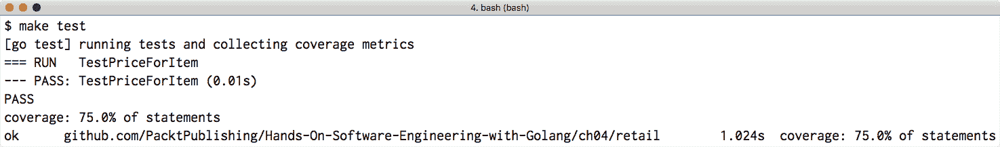
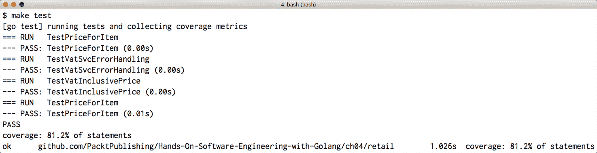
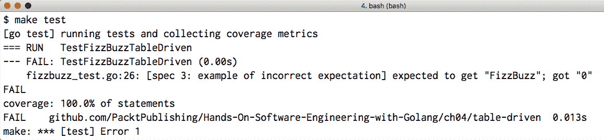
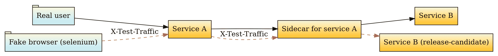
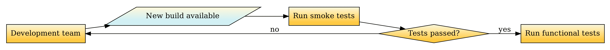
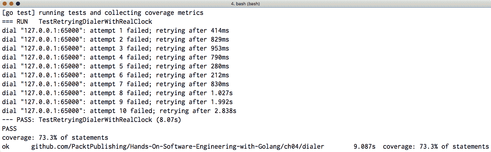
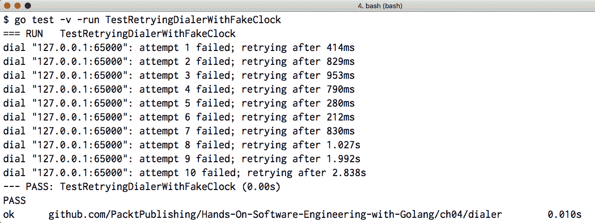

# 第四章：测试的艺术

"程序测试可以用来显示错误的存在，但永远不能显示它们的缺失！"

- 艾德加·迪杰斯特拉

软件系统注定会随着时间的推移而增长和演变。开源或闭源软件项目有一个共同点：随着在代码库上工作的工程师数量的增加，它们的*复杂性*似乎呈上升趋势。因此，拥有一个全面的代码库测试集至关重要。本章深入探讨了可以应用于 Go 项目的不同类型的测试。

本章将涵盖以下主题：

+   识别在编写单元测试时可以用作测试代码内部使用对象的替代品的高级原语，如桩（stubs）、模拟（mocks）、间谍（spies）和伪造对象（fake objects）

+   比较黑盒和白盒测试：两者的区别以及为什么两者都是编写全面测试套件所必需的

+   集成测试和功能（端到端）测试之间的区别

+   高级测试概念：烟雾测试，以及我个人最喜欢的一种测试 – 混乱测试！

+   在 Go 中编写干净测试的技巧和窍门以及需要避免的陷阱

# 技术要求

本章讨论的主题的完整代码已发布到本书的 GitHub 仓库中的`Chapter04`文件夹下。

您可以通过访问[`github.com/PacktPublishing/Hands-On-Software-Engineering-with-Golang`](https://github.com/PacktPublishing/Hands-On-Software-Engineering-with-Golang)来获取本书的 GitHub 仓库。

为了让您尽快开始，每个示例项目都包含一个 makefile，它定义了以下目标集：

| **Makefile 目标** | **描述** |
| --- | --- |
| `deps` | 安装任何必需的依赖项 |
| `test` | 运行所有测试并报告覆盖率 |
| `lint` | 检查 lint 错误 |

与本书的所有章节一样，您需要一个相当新的 Go 版本，您可以在[`golang.org/dl/`](https://golang.org/dl/)下载它。

# 单元测试

根据定义，单元是我们能测试的最小可能的代码块。在 Go 编程的上下文中，这通常是一个*单个函数*。然而，根据我们在前几章中探讨的 SOLID 设计原则，每个*Go 包*也可以被视为一个独立的单元，并以此进行测试。

术语*单元测试*指的是对应用程序的每个*单元*进行*隔离*测试的过程，以验证其行为是否符合特定的规范集。

在本节中，我们将深入了解我们可用的不同单元测试方法（黑盒与白盒测试）。我们还将检查使我们的代码更容易进行单元测试的策略，以及内置的 Go 测试包以及旨在使编写测试更加流畅的第三方包。

# 模拟、桩、伪造和间谍 – 共同点和不同点

在深入探讨单元测试背后的概念之前，我们需要讨论和澄清我们将在接下来的部分中使用的某些术语。虽然这些术语已经存在多年，但软件工程师在编写测试时偶尔会将它们混淆。一个很好的例子是，当工程师交替使用*mock*和*stub*这两个术语时，这种混淆变得明显。

为了建立一些共同的基础，以便进行富有成效的讨论，并消除关于这个术语的任何混淆，让我们根据 Gerard Meszaros 在*《XUnit Test Patterns: Refactoring Test Code》*一书中对测试模式的概述，来检查每个术语的定义。

# stubs 和 spies！

**stub**是我们可以在测试中使用的最简单的测试模式。stubs 通常实现特定的接口，不包含任何实际逻辑；它们只是提供固定答案以响应测试过程中进行的调用。

让我们剖析一个简短的代码示例，说明我们如何有效地使用 stub 的概念进行测试。`Chapter04/captcha`包实现了 CAPTCHA 测试背后的验证逻辑。

CAPTCHA 是一种相当直接的方法，可以确定系统是在与人类用户还是另一个程序交互。这是通过显示一个随机、通常带有噪声的图像，其中包含扭曲的字母和数字序列，然后提示用户输入图像的文本内容来实现的。

作为 SOLID 原则的大粉丝，我选择定义两个接口，`Challenger`和`Prompter`，以抽象 CAPTCHA 图像生成和用户提示的实现。毕竟，有大量的不同方法可以生成 CAPTCHA 图像：我们可以从一组固定的图像中随机选择一个，使用神经网络生成，或者甚至调用第三方图像生成服务。同样，我们实际上提示用户回答的方式也是如此。以下是这两个接口的定义：

```go
// Challenger is implemented by objects that can generate CAPTCHA image 
// challenges.
type Challenger interface {
 Challenge() (img image.Image, imgText string)
}

// Prompter is implemented by objects that display a CAPTCHA image to the 
// user, ask them to type their contents and return back their response.
type Prompter interface {
 Prompt(img image.Image) string
}
```

最后，实际的业务逻辑并不真正关心 CAPTCHA 图像或用户的答案是如何获得的。我们所需做的就是获取一个挑战，提示用户，然后执行一个简单的字符串比较操作，如下所示：

```go
func ChallengeUser(c Challenger, p Prompter) bool {
 img, expAnswer := c.Challenge()
 userAnswer := p.Prompt(img)

 if subtle.ConstantTimeEq(int32(len(expAnswer)), int32(len(userAnswer))) 
     == 0 {
 return false
 }

 return subtle.ConstantTimeCompare([]byte(userAnswer), []byte(expAnswer)) == 1
}
```

上述代码的一个有趣之处，至少在我看来，是它使用常数时间字符串比较，而不是使用内置的相等运算符来比较预期的答案和用户的响应。

常数时间比较检查是安全相关代码中的一种常见模式，因为它可以防止信息泄露，而信息泄露可能会被对手利用来执行时间侧信道攻击。当执行时间攻击时，攻击者向系统提供可变长度的输入，然后通过统计分析收集关于系统实现的信息，这些信息基于执行特定操作所需的时间。

想象一下，在前面的 CAPTCHA 场景中，如果我们使用了一个简单的字符串比较，本质上是比较每个字符，并在**第一个不匹配**时返回 false，攻击者会如何通过时间攻击缓慢地暴力破解答案：

+   首先按照 `$a` 模式提供答案，并测量获取响应所需的时间。`$` 符号是所有可能的字母数字字符的占位符。本质上，我们尝试组合，如 `aa`、`ba` 等。

+   一旦我们确定了一个比其他操作**耗时更长**的操作，我们就可以假设那个特定的 `$` 值（比如，`4`）是 CAPTCHA 答案的预期第一个字符！这个操作耗时较长的原因是字符串比较代码匹配了第一个字符，然后尝试匹配下一个字符，而不是立即返回，就像在出现不匹配时那样。

+   继续提供答案的过程，但这次使用 `4$a` 模式，并不断扩展模式，直到可以恢复预期的 CAPTCHA 答案。

为了测试 `ChallengeUser` 函数，我们需要为它的每个参数创建一个存根。这将使我们能够完全控制比较业务逻辑的输入。以下是一些可能看起来像的存根：

```go
type stubChallenger string

func (c stubChallenger) Challenge() (image.Image, string) {
 return image.NewRGBA(image.Rect(0, 0, 100, 100)), string(c)
}
type stubPrompter string

func (p stubPrompter) Prompt(_ image.Image) string {
 return string(p)
}
```

很简单，对吧？正如你所见，存根没有任何逻辑；它们只是返回一个预设的答案。有了这两个存根，我们可以编写两个测试函数来测试匹配/不匹配代码路径：

```go
func TestChallengeUserSuccess(t *testing.T) {
 got := captcha.ChallengeUser(stubChallenger("42"), stubPrompter("42"))
 if got != true {
 t.Fatal("expected ChallengeUser to return true")
 }
}

func TestChallengeUserFail(t *testing.T) {
 got := captcha.ChallengeUser(stubChallenger("lorem ipsum"), stubPrompter("42"))
 if got != false {
 t.Fatal("expected ChallengeUser to return false")
 }
}
```

既然我们已经对存根的工作原理有了大致的了解，让我们看看另一种有用的测试模式：间谍！一个**间谍**不过是一个记录所有对其调用的方法的详细日志的存根。对于每次方法调用，间谍记录调用者提供的参数，并使它们可供测试代码检查。

当然，当谈到 Go 语言时，最受欢迎的间谍实现是来自 `net/http/httptest` 包的古老而值得尊敬的 `ResponseRecorder` 类型。`ResponseRecorder` 实现了 `http.ResponseWriter` 接口，可以用来测试 HTTP 请求处理代码，而无需启动实际的 HTTP 服务器。然而，HTTP 服务器测试并不那么有趣；让我们看看一个稍微更有趣的例子。`Chapter04/chat` 包含一个简单的聊天室实现，非常适合应用间谍测试模式。以下是对 `Room` 类型及其构造函数的定义：

```go
// Publisher is implemented by objects that can send a message to a user.
type Publisher interface {
 Publish(userID, message string) error
}

type Room struct {
 pub Publisher
 mu    sync.RWMutex
 users []string
}

// NewRoom creates a new chat root instance that used pub to broadcast 
// messages.
func NewRoom(pub Publisher) *Room {
 return &Room{pub: pub}
}
```

正如你所见，`Room` 包含一个由 `NewRoom` 构造函数传入的值初始化的 `Publisher` 实例。`Room` 类型公开的其他有趣的方法（这里未展示，但在本书的 GitHub 仓库中可用）包括 `AddUser` 和 `Broadcast`。第一个方法向房间添加新用户，而后者可以用来向房间内所有当前用户广播特定消息。

在我们编写实际的测试代码之前，让我们创建一个实现`Publisher`接口的 spy 实例，并记录任何发布的消息：

```go
type entry struct {
 user    string
 message string
}

type spyPublisher struct {
 published []entry
}

func (p *spyPublisher) Publish(user, message string) error {
 p.published = append(p.published, entry{user: user, message: message})
 return nil
}
```

在先前的 spy 实现中，每次调用`Publish`方法时，stub 都会将一个`{user, message}`元组追加到`published`切片中。当我们的 spy 准备好使用时，编写实际的测试就变得轻而易举：

```go
func TestChatRoomBroadcast(t *testing.T) {
 pub := new(spyPublisher)
 room := chat.NewRoom(pub)
 room.AddUser("bob")
 room.AddUser("alice")
 _ = room.Broadcast("hi")
 exp := []entry{
 {user: "bob", message: "hi"},
 {user: "alice", message: "hi"},
 }
 if got := pub.published; !reflect.DeepEqual(got, exp) {
 t.Fatalf("expected the following messages:\n%#+v\ngot:\n%#+v", exp, got)
 }
}
```

此测试场景涉及创建一个新的房间，向其中添加一些用户，并向所有加入房间的用户广播消息。测试运行器的任务是验证对`Broadcast`的调用实际上确实向所有用户广播了消息。我们可以通过检查我们的注入 spy 记录的消息列表来实现这一点。

# Mocks

你可以将**mocks**视为增强版的 stubs！与 stub 展示的固定行为相反，mocks 允许我们以*声明性*的方式指定 mock 期望接收的调用列表，以及它们的顺序和期望的参数值。此外，mocks 允许我们根据方法调用者提供的参数元组为每个方法调用指定不同的返回值。

考虑到所有因素，mocks 是我们可用的非常强大的原始工具，用于编写高级测试。然而，为测试中想要替换的每个对象从头开始构建 mock 是一个相当繁琐的任务。这就是为什么通常更好的做法是使用外部工具和代码生成来自动化创建测试所需的 mock。

# 介绍 gomock

在本节中，我们将介绍 `gomock` ^([4])，这是一个非常流行的 Go 语言 mocking 框架，它利用反射和代码生成自动根据 Go 接口定义创建 mock。

该框架及其支持工具可以通过运行以下命令进行安装：

```go
$ go get github.com/golang/mock/gomock
$ go install github.com/golang/mock/mockgen
```

`mockgen`工具负责分析单个 Go 文件或整个包，并为其中定义的所有（或特定）接口生成 mock。它支持两种操作模式：

+   **源代码扫描**：我们将 Gi 文件传递给`mockgen`，然后对其进行解析以检测接口定义。

+   **反射辅助模式**：我们将一个包和接口列表传递给`mockgen`。该工具使用 Go 反射包分析每个接口的结构。

`gomock`为通过`mockgen`工具创建的 mock 实例指定预期行为提供了一个简单且简洁的 API。要访问此 API，你需要创建一个 mock 的新实例并调用其奇特的`EXPECT`方法。`EXPECT`返回一个特殊对象（在`gomock`术语中称为*recorder*），为我们提供了声明针对 mock 执行的方法调用行为的方式。

要注册新的期望，我们需要执行以下操作：

1.  声明我们期望被调用的方法及其参数。

1.  指定当模拟调用带有指定参数集的方法时，模拟应该返回给调用者的返回值（或值）。

1.  可选地，我们需要指定调用者预期调用的方法次数。

为了进一步简化测试的创建，`mockgen`将返回的记录器实例填充了与我们要模拟的接口名称匹配的方法。我们只需要在记录器对象上调用这些方法，并将模拟期望从调用者接收到的参数作为`interface{}`值的可变列表指定。当定义预期的参数集时，你基本上有两个选择：

+   指定一个与方法签名中类型匹配的值（例如，如果参数是`string`类型，则为`foo`）。`gomock`只有在输入参数、*值*严格等于预期中指定的值时，才会匹配到期望的调用。

+   提供一个实现了`gomock.Matcher`接口的值。在这种情况下，`gomock`将委托比较给匹配器本身。这个强大的功能让我们能够模拟任何可以想到的自定义测试谓词。`gomock`已经定义了一些方便的内置匹配器，我们可以在测试中使用：`Any`、`AssignableToTypeOf`、`Nil`和`Not`。

在指定了预期的方法调用及其参数后，`gomock`将返回一个期望对象，该对象提供辅助方法，以便我们可以进一步配置预期的行为。例如，我们可以使用期望对象的`Return`方法来定义一旦期望匹配，将返回给调用者的值集。还重要的是要注意，除非我们*明确地*指定期望的模拟方法调用次数，否则`gomock`将假设该方法只能调用一次，如果方法根本未调用或多次调用，将触发测试失败。如果您需要更精细地控制期望调用次数，返回的期望对象提供了以下一组辅助方法：`Times`、`MinTimes`和`MaxTimes`。

在接下来的两节中，我们将分析一个示例项目，并逐步讲解如何为它编写一个完整的、基于模拟的单元测试。

# 探索我们想要编写测试的项目细节

为了演示在我们的代码中创建和使用模拟，我们将使用来自`Chapter04/dependency`包的示例代码。这个包定义了一个`Collector`类型，其目的是为给定的项目 ID 组装一组直接和间接（传递）依赖。为了使事情更有趣，让我们假设每个依赖项可以属于以下两个类别之一：

+   我们需要包含（例如，一个图像文件）或预留（例如，一块内存或磁盘空间）的资源

+   另一个拥有其*自己依赖集*的项目

要获取直接依赖及其相应类型的列表，`Collector`依赖将执行一系列调用到外部服务的操作。为了确保实现更容易测试，我们不会与外部服务的具体客户端实例一起工作。相反，我们将定义一个接口，其中包含访问服务所需的方法集，并在我们的测试代码中注入一个满足该接口的模拟。以下是对`API`接口的以下定义：

```go
type API interface {
 // ListDependencies returns the list of direct dependency IDs for a
 // particular project ID or an error if a non-project ID argument is
 // provided.
 ListDependencies(projectID string) ([]string, error)

 // DependencyType returns the type of a particular dependency.
 DependencyType(dependencyID string) (DepType, error)
}
```

要创建一个新的`Collector`实例，我们需要调用`NewCollector`构造函数（未显示）并提供一个 API 实例作为参数。然后，可以通过调用`AllDependencies`方法来获取特定项目 ID 的*独特*依赖集。这是一个相当简短的方法，其完整实现如下：

```go
func (c *Collector) AllDependencies(projectID string) ([]string, error) {
 ctx := newDepContext(projectID)
 for ctx.HasUncheckedDeps() {
 projectID = ctx.NextUncheckedDep()
 projectDeps, err := c.api.ListDependencies(projectID)
 if err != nil {
 return nil, xerrors.Errorf("unable to list dependencies for project %q: %w", projectID, err)
 }
 if err = c.scanProjectDependencies(ctx, projectDeps); err != nil {
 return nil, err
 }
 }
 return ctx.depList, nil
}
```

上述代码块实际上是一个伪装的**广度优先搜索**（BFS）算法！`ctx`变量存储一个辅助结构，其中包含以下内容：

+   *一个队列*，其条目对应于我们尚未访问的依赖集（资源或项目）。当我们访问项目依赖图中的节点时，任何新发现的依赖将被追加到队列的末尾，以便在未来的搜索循环迭代中访问。

+   一旦队列中的所有条目都已被处理，就会返回给调用者一组独特的已发现依赖 ID。

为了初始化搜索，最初，我们将传递给方法作为参数的`projectID`值填充到队列中。在每次循环迭代中，我们取出一个未检查的依赖 ID，并调用`ListDependencies` API 调用以获取其所有直接依赖的列表。然后，获取到的依赖 ID 列表被传递给`scanProjectDependencies`方法，该方法的角色是检查依赖列表并更新`ctx`变量的内容。该方法实现相当直接：

```go
func (c *Collector) scanProjectDependencies(ctx *depCtx, depList []string) error {
 for _, depID := range depList {
 if ctx.AlreadyChecked(depID) {
 continue
 }
 ctx.AddToDepList(depID)
 depType, err := c.api.DependencyType(depID)
 if err != nil {
 return xerrors.Errorf("unable to get dependency type for id %q: %w", depID, err)
 }
 if depType == DepTypeProject {
 ctx.AddToUncheckedList(depID)
 }
 }
 return nil
}
```

在迭代依赖列表时，实现会自动跳过任何已经访问过的依赖。另一方面，新的依赖 ID 通过调用`AddToDepList`方法被追加到`ctx`变量跟踪的唯一依赖集。

正如我们之前提到的，如果依赖对应于另一个项目，我们需要*递归地*访问其自己的依赖并将它们作为*传递性依赖*添加到我们的集合中。`API`接口中的`DependencyType`方法为我们提供了通过其 ID 查询依赖类型的方式。如果依赖确实指向一个*项目*，我们通过调用`AddToUncheckedList`方法将其追加到未访问依赖队列的末尾。最后一步保证了依赖最终将由`AllDependencies`方法内部的搜索循环处理。

# 利用 gomock 编写应用程序的单元测试

既然我们已经了解了示例项目的实现细节，我们可以继续编写一个简单的基于模拟的单元测试。在我们开始之前，我们需要为`API`接口创建一个模拟。这可以通过使用以下选项调用`mockgen`工具来实现：

```go
$ mockgen \
    -destination mock/dependency.go \
    github.com/PacktPublishing/Hands-On-Software-Engineering-with-Golang/Chapter04/dependency \
    API
```

前一个命令执行以下操作：

+   在`dependency`包中创建一个`mock`文件夹

+   生成一个名为`dependency.go`的文件，其中包含模拟`API`接口的适当代码，并将其放置在`mock`文件夹中

为了避免您手动输入前面的命令，`Chapter04/dependency`文件夹中的`Makefile`包含了一个预定义的目标，用于重建在此示例中使用的模拟。您需要做的只是切换到包含示例代码的文件夹，并运行`make mocks`。

到目前为止，一切顺利。那么我们如何在测试中使用模拟呢？首先，我们需要创建一个`gomock`控制器并将其与 Go 标准库通过测试函数传递给我们的`testing.T`实例关联起来。控制器实例定义了一个`Finish`方法，我们的代码必须在返回测试之前始终运行此方法（例如，通过`defer`语句）。此方法检查每个模拟对象上注册的期望，如果未满足，则自动失败测试。以下是我们的测试函数前缀可能的样子：

```go
// Create a controller to manage all our mock objects and make sure
// that all expectations were met before completing the test
ctrl := gomock.NewController(t)
defer ctrl.Finish()

// Obtain a mock instance that implements API and associate it with the controller.
api := mock_dependency.NewMockAPI(ctrl)
```

此特定单元测试的目的是验证对`AllDependencies`方法的特定输入调用是否产生预期的依赖项 ID 列表。正如我们在上一节中看到的，`AllDependencies`方法的实现使用外部提供的`API`实例来检索每个依赖项的信息。鉴于我们的测试将向`Collector`依赖项注入模拟的 API 实例，我们的测试代码必须声明对模拟的预期调用集。考虑以下代码块：

```go
gomock.InOrder(
 api.EXPECT().
 ListDependencies("proj0").Return([]string{"proj1", "res1"}, nil),
 api.EXPECT().
 DependencyType("proj1").Return(dependency.DepTypeProject, nil),
 api.EXPECT().
 DependencyType("res1").Return(dependency.DepTypeResource, nil),
 api.EXPECT().
 ListDependencies("proj1").Return([]string{"res1", "res2"}, nil),
 api.EXPECT().
 DependencyType("res2").Return(dependency.DepTypeResource, nil),
)
```

在正常情况下，`gomock`只会检查方法调用期望是否满足，而不管它们被调用的顺序如何。然而，如果一个测试依赖于一系列方法调用以特定顺序执行，它可以指定这一点给`gomock`，通过使用带有有序期望列表的`gomock.InOrder`辅助函数。这种特定模式可以在前面的代码片段中看到。

在设置好模拟期望后，我们可以通过引入必要的逻辑来连接所有组件，调用`AllDependencies`方法，传入模拟所期望的输入（`proj0`），并验证返回的输出是否与预定义的值（`"proj1", "res1", "res2"`）匹配，来完成我们的单元测试：

```go
collector := dependency.NewCollector(api)
depList, err := collector.AllDependencies("proj0")
if err != nil {
 t.Fatal(err)
}

if exp := []string{"proj1", "res1", "res2"}; !reflect.DeepEqual(depList, exp) {
 t.Fatalf("expected dependency list to be:\n%v\ngot:\n%v", exp, depList)
}
```

这就结束了我们关于使用 `gomock` 加速基于模拟的测试编写的简短示例。作为一个有趣的学习活动，你可以尝试更改前面测试的预期输出，以便测试失败。然后，你可以逆向工作并尝试找出如何调整模拟期望，以便再次使测试通过。

# 伪造对象

与我们之前讨论的其他测试模式类似，**伪造对象** 也遵循一个特定的接口，这允许我们将它们注入到被测试的主题中。主要区别在于，伪造对象实际上包含一个*完全工作*的实现，其行为与它们打算替代的对象相匹配。

那么，有什么问题吗？伪造对象实现通常是针对运行测试进行优化的，因此它们并不打算在生产环境中使用。例如，我们可以为我们的测试提供一个内存中的键值存储实现，但我们的生产部署需要更好的可用性保证。

为了更好地理解伪造对象的工作原理，让我们看看 `Chapter04/compute` 包的内容。这个包导出一个名为 `SumOfSquares` 的函数，它对一个 32 位浮点数值的切片进行操作。该函数对切片中的每个元素进行平方，将结果相加，并返回它们的总和。请注意，我们在这里使用单个函数纯粹是为了演示目的；在现实世界的场景中，我们会将这个函数与其他类似函数组合，形成一个计算图，然后我们的实现将对其进行评估。

为了故意给这个特定的场景增加一些额外的复杂性，让我们假设传递给这个函数的输入切片通常包含一个非常大的数值数量。当然，仍然可以使用 CPU 来计算结果。不幸的是，依赖于这个功能的实际生产服务有一个相当严格的时间预算，因此使用 CPU 并不是一个选择。为此，我们决定通过将工作卸载到 GPU 来实现一个矢量化解决方案。

`Device` 接口描述了可以卸载到 GPU 的操作集：

```go
type Device interface {
 Square([]float32) []float32
 Sum([]float32) float32
}
```

给定一个实现了 `Device` 的对象实例，我们可以定义 `SumOfSquares` 函数如下：

```go
func SumOfSquares(c Device, in []float32) float32 {
 sq := c.Square(in)
 return c.Sum(sq)
}
```

这里没有什么太复杂的...唉，直到我们开始编写测试，我们才意识到，虽然我们通常运行生产代码的计算节点确实提供了强大的 GPU，但同样的话并不能适用于我们工程师本地使用的每台机器，或者每次创建新的拉取请求时运行我们的测试的 CI 环境。

显然，尽管我们的实际工作负载处理的是长输入，但我们的测试中并没有严格的相同要求；正如我们将在以下部分看到的那样，这是端到端测试的工作。因此，如果我们的测试运行时没有 GPU 可用，我们可以回退到 CPU 实现。这是一个很好的例子，说明模拟对象如何帮助我们。那么，让我们首先定义一个使用 CPU 进行所有计算的`Device`实现：

```go
type cpuComputeDevice struct{}

func (d cpuComputeDevice) Square(in []float32) []float32 {
 for i := 0; i < len(in); i++ {
 in[i] *= in[i]
 }
 return in
}

func (d cpuComputeDevice) Sum(in []float32) (sum float32) {
 for _, v := range in {
 sum += v
 }
 return sum
}
```

然后，我们的测试代码可以在 GPU 或 CPU 基于的实现之间动态切换，可能通过检查环境变量的值或作为测试参数传递的某些命令行标志：

```go
func TestSumOfSquares(t *testing.T) {
 var dev compute.Device
 if os.Getenv("USE_GPU") != "" {
 t.Log("using GPU device")
 dev = gpu.NewDevice()
 } else {
 t.Log("using CPU device")
 dev = cpuComputeDevice{}
 }
 // Generate deterministic sample data and return the expected sum
 in, expSum := genTestData(1024)
 if gotSum := compute.SumOfSquares(dev, in); gotSum != expSum {
 t.Fatalf("expected SumOfSquares to return %f; got %f", expSum, gotSum)
 }
}
```

通过使用一个模拟对象，我们可以在仍然提供这种能力的同时运行我们的测试，让那些有本地访问 GPU 的工程师使用基于 GPU 的实现来运行测试。成功！

# 黑盒测试与白盒测试在 Go 包中的应用——一个示例

黑盒测试和白盒测试是编写单元测试的两种不同方法。每种方法都有其自身的优点和目标。因此，我们不应将它们视为相互竞争的方法，而应将它们视为相互补充。那么，这两种测试类型之间主要的区别是什么？

黑盒测试是在假设我们测试的包的底层实现细节（也称为**被测试对象**（**SUT**））对我们，即测试者，是完全透明的（因此得名黑盒）的情况下进行的。结果，我们只能测试特定包的**公共接口**或行为，并确保它遵守其宣传的合同。

另一方面，白盒测试假设我们事先了解特定包的实现细节。这允许测试者要么为每个测试构建，以便在包内执行特定的代码路径，要么直接测试包的内部实现。

为了理解这两种方法之间的区别，让我们看看一个简短的例子。`Chapter04/retail`包实现了一个名为`PriceCalculator`的**外观**。

外观是一种软件设计模式，它通过一个简单的接口抽象了一个或多个软件组件的复杂性。

在基于微服务的设计背景下，外观模式允许我们透明地组合或聚合多个、专业的微服务中的数据，同时为外观客户端提供一个简单的 API 来访问它。

在这个特定的场景中，外观接收一个表示项目的 UUID 和一个表示我们感兴趣的日期的日期作为输入。然后，它与两个后端微服务通信，以检索有关项目价格和特定日期应用的增值税率的详细信息。最后，它将包含增值税的项目价格返回给外观的客户端。

# 外观背后的服务

在我们深入探讨价格计算器的内部工作原理之前，让我们花点时间检查这两个微服务依赖项是如何工作的；毕竟，我们将需要这些信息来编写我们的测试。

`price` 微服务提供了一个用于检索特定日期某项商品发布价格的 REST 端点。该服务以类似以下的 JSON 有效负载响应：

```go
{
 "price": 10.0,
 "currency": "GBP"
}
```

在本例中的第二个微服务被称为 `vat`，它也是 RESTful 的。它提供了一个用于检索特定日期适用的增值税率的端点。该服务以以下 JSON 有效负载响应：

```go
{
 "vat_rate": 0.29
}
```

如您所见，返回的 JSON 有效负载非常简单，因此我们的测试代码模拟它将是微不足道的。

# 编写黑盒测试

为了编写我们的黑盒测试，我们将首先检查 `retail` 包的 *公共* 接口。快速浏览 `retail.go` 文件揭示了 `NewPriceCalculator` 函数，该函数接收 `price` 和 `vat` 服务的 URL 作为参数，并返回一个 `PriceCalculator` 实例。计算器实例可以通过调用 `PriceForItem` 方法并传递商品的 UUID 作为参数来获取商品的增值税包含价格。另一方面，如果我们对获取过去特定日期的增值税包含商品价格感兴趣，我们可以调用 `PriceForItemAtDate` 方法，该方法也接受一个时间段参数。

黑盒测试将存在于名为 `retail_test` 的单独包中。`$PACKAGE_test` 命名约定，或多或少，是进行黑盒测试的标准方式，因为其名称本身暗示了正在测试的包，同时防止我们的测试代码访问正在测试的包的内部。

黑盒测试的一个缺点是我们需要模拟/存根任何测试代码所依赖的外部对象和/或服务。在这种情况下，我们需要为 `price` 和 `vat` 服务提供存根。幸运的是，与 Go 标准库一起提供的 `net/http/httptest` 包提供了一个方便的辅助函数，用于使用随机、未使用的端口启动本地 HTTPS 服务器。由于我们需要为我们的测试启动两个服务器，让我们创建一个小的辅助函数来完成这项工作：

```go
func spinUpTestServer(t *testing.T, res map[string]interface{}) *httptest.Server {
 encResponse, err := json.Marshal(res)
 if err != nil {
 t.Fatal(err)
 }

 return httptest.NewServer(http.HandlerFunc(func(w http.ResponseWriter, req *http.Request) {
 w.Header().Set("Content-Type", "application/json")
 if _, wErr := w.Write(encResponse); wErr != nil {
 t.Fatal(wErr)
 }
 }))
}
```

这里没有什么太复杂的；`spinUpTestServer` 函数接收一个包含预期响应内容的映射，并返回一个服务器（我们的测试代码需要显式关闭），该服务器始终以 JSON 格式响应有效负载。有了这个辅助函数，设置我们服务的存根变得非常容易：

```go
// t is a testing.T instance
priceSvc := spinUpTestServer(t, map[string]interface{}{
 "price": 10.0,
})
defer priceSvc.Close()

vatSvc := spinUpTestServer(t, map[string]interface{}{
 "vat_rate": 0.29,
})
defer vatSvc.Close()
```

因此，我们现在需要做的就是调用`NewPriceCalculator`构造函数并传递两个假服务器的地址。等等！如果这些服务器总是监听随机端口，我们如何知道要将哪些地址传递给构造函数？`httptest`包提供的`Server`实现的一个特别方便的特性是它通过一个名为`URL`的公共属性公开服务器监听传入连接的端点。以下是我们的黑盒测试其余部分的样子：

```go
pc := retail.NewPriceCalculator(priceSvc.URL, vatSvc.URL)
got, err := pc.PriceForItem("1b6f8e0f-bbda-4f4e-ade5-aa1abcc99586")
if err != nil {
 t.Fatal(err)
}

if exp := 12.9; got != exp {
 t.Fatalf("expected calculated retail price to be %f; got %f", exp, got)
}
```

如我们之前提到的，前面的代码片段位于不同的包中，因此我们的测试必须导入测试包并使用`retail`选择器访问其公共内容。

我们可以添加一些额外的测试，例如，验证当其中一个或两个服务返回错误时`PriceForItem`的行为，但仅使用黑盒测试我们就无法测试到这里！让我们运行我们的测试并看看我们能获得什么样的覆盖率：



图 1：仅运行黑盒测试

这点不错！然而，如果我们需要进一步提高测试覆盖率指标，我们需要投入一些时间并想出一些白盒测试。

# 通过白盒测试提高代码覆盖率

与我们在上一节中编写的测试相比，一个主要的不同之处在于新的一组测试将位于我们正在测试的包的**同一**包中。为了区分我们之前编写的黑盒测试并提示其他工程师查看测试代码，我们将新测试放在一个名为`retail_internal_test.go`的文件中。

现在，是时候揭开`retail`包的实现细节了！包的公共 API 始终是我们探索工作的好起点。一个有效的策略是识别每个导出的函数，然后（在心中）跟随其调用图来定位其他候选函数/方法，我们可以通过我们的白盒测试来执行它们。在不太可能的情况下，如果包没有导出任何函数，我们可以将注意力转移到其他导出符号上，例如结构体或接口。例如，以下是`retail`包中`PriceCalculator`结构体的定义：

```go
type PriceCalculator struct {
 priceSvc svcCaller
 vatSvc   svcCaller
}
```

如我们所见，该结构体包含两个`svcCaller`类型的私有字段，其名称清楚地表明它们以某种方式与门面需要调用的两个服务相关联。如果我们继续浏览代码，我们将发现`svcCaller`实际上是一个接口：

```go
type svcCaller interface {
 Call(req map[string]interface{}) (io.ReadCloser, error)
}
```

`Call`方法接收一个请求参数映射并返回一个响应流作为`io.ReadCloser`。从测试编写者的角度来看，这种抽象的使用应该让我们感到非常高兴，因为它为我们提供了轻松模拟对两个实际服务调用的一条途径！

如我们在上一节中看到的，`PriceCalculator`类型公开的公共 API 由两个方法组成：

+   `PriceForItem`，它返回特定时间点的物品价格

+   `PriceForItemAtDate`，它返回特定时间点的物品价格

由于`PriceForItem`方法是一个简单的包装器，它使用当前日期/时间作为参数调用`PriceForItemAtDate`，我们将重点关注后者。`PriceForItemAtDate`的实现如下所示：

```go
func (pc *PriceCalculator) PriceForItemAtDate(itemUUID string, date time.Time) (float64, error) {
 priceRes := struct {
 Price float64 `json:"price"`
 }{}
 vatRes := struct {
 Rate float64 `json:"vat_rate"`
 }{}
 req := map[string]interface{}{"item": itemUUID, "period": date}
 if err := pc.callService(pc.priceSvc, req, &priceRes); err != nil {
 return 0, xerrors.Errorf("unable to retrieve item price: %w", err)
 }
 req = map[string]interface{}{"period": date}
 if err := pc.callService(pc.vatSvc, req, &vatRes); err != nil {
 return 0, xerrors.Errorf("unable to retrieve vat percent: %w", err)
 }
 return vatInclusivePrice(priceRes.Price, vatRes.Rate), nil
}
```

上一段代码块使用了名为`callService`的辅助函数来向`price`和`vat`服务发送请求，并将它们的响应解包到`priceRes`和`vatRes`变量中。为了更清楚地了解底层发生了什么，让我们快速查看`callService`的实现：

```go
func (pc *PriceCalculator) callService(svc svcCaller, req map[string]interface{}, res interface{}) error {
 svcRes, err := svc.Call(req)
 if err != nil {
 return xerrors.Errorf("call to remote service failed: %w", err)
 }
 defer drainAndClose(svcRes)

 if err = json.NewDecoder(svcRes).Decode(res); err != nil {
 return xerrors.Errorf("unable to decode remote service response: %w", err)
 }
 return nil
}
```

`callService`方法实现相当简单。它所做的只是调用提供的`svcCaller`实例上的`Call`方法，将返回的输出作为 JSON 流处理，并尝试将其反序列化到调用者提供的`res`参数中。

现在，让我们回到`PriceForItemAtDate`方法的实现。假设在联系远程服务时没有发生错误，它们的个别响应作为参数传递给`vatInclusivePrice`辅助函数。

如您可能从其名称中看出，它实现了将增值税率应用于价格的业务逻辑。将业务逻辑与负责与其他服务通信的代码分开不仅是一个良好设计的良好指标，而且也使我们的测试编写工作更容易。让我们添加一个小型的表格驱动测试来验证业务逻辑：

```go
func TestVatInclusivePrice(t *testing.T) {
 specs := []struct {
 price   float64
 vatRate float64
 exp     float64
 }{
 {42.0, 0.1, 46.2},
 {10.0, 0, 10.0},
 }
 for specIndex, spec := range specs {
 if got := vatInclusivePrice(spec.price, spec.vatRate); got != spec.exp {
 t.Errorf("[spec %d] expected to get: %f; got: %f", specIndex, spec.exp, got)
 }
 }
}
```

在这个测试到位后，接下来我们想要测试的是`PriceForItem`。为了做到这一点，我们需要以某种方式控制对外部服务的访问。虽然我们将使用存根来简化，但我们也可以使用之前章节中讨论的任何其他测试模式。这里有一个存根，它实现了与我们的黑盒测试中的测试服务器相同的策略，但无需实际启动服务器！

```go
type stubSvcCaller map[string]interface{}

func (c stubSvcCaller) Call(map[string]interface{}) (io.ReadCloser, error) {
 data, err := json.Marshal(c)
 if err != nil {
 return nil, err
 }

 return ioutil.NopCloser(bytes.NewReader(data)), nil
}
```

使用前面的存根定义，让我们为`PriceForItem`方法的正常路径添加一个测试：

```go
func TestPriceForItem(t *testing.T) {
 pc := &PriceCalculator{
 priceSvc: stubSvcCaller{ "price": 42.0, },
 vatSvc: stubSvcCaller{ "vat_rate": 0.10, },
 }

 got, err := pc.PriceForItem("foo")
 if err != nil {
 t.Fatal(err)
 }

 if exp := 46.2; got != exp {
 t.Fatalf("expected calculated retail price to be %f; got %f", exp, got)
 }
}
```

当然，如果没有明确测试当必需的依赖项失败时会发生什么，我们的测试就不会真正完整！为此，我们需要另一个存根，它总是返回一个错误：

```go
type stubErrCaller struct {
 err error
}

func (c stubErrCaller) Call(map[string]interface{}) (io.ReadCloser, error) { 
 return nil, c.err 
}
```

使用这个存根实现，我们可以测试当特定*错误类别*发生时`PriceCalculator`方法的行为。例如，这里有一个模拟`vat`服务返回 404 响应的测试，以向调用者指示在指定时间段内没有可用的增值税率数据：

```go
func TestVatSvcErrorHandling(t *testing.T) {
 pc := &PriceCalculator{
 priceSvc: stubSvcCaller{ "price": 42.0, },
 vatSvc: stubErrCaller{
 err: errors.New("unexpected response status code: 404"),
 },
 }

 expErr := "unable to retrieve vat percent: call to remote service failed: unexpected response status code: 404"
 _, err := pc.PriceForItem("foo")
 if err == nil || err.Error() != expErr {
 t.Fatalf("expected to get error:\n %s\ngot:\n %v", expErr, err)
 }
}
```

让我们一起运行黑盒和白盒测试，以检查在引入新测试后总覆盖率如何变化：



图 2：运行黑盒和白盒测试

虽然在 Go 标准库的源代码中，白盒测试和黑盒测试的比例似乎强烈倾向于白盒测试，但这并不意味着你不应该编写黑盒测试！黑盒测试当然有自己的位置，当你试图复制触发特定错误的特定条件和输入集时，它们非常有用。更重要的是，正如我们将在接下来的章节中看到的，黑盒测试通常可以作为构建另一类测试的模板，这类测试通常被称为*集成测试*。

# 表格驱动测试与子测试

在本节中，我们将比较两种不同的方法，用于分组和执行多个测试用例。这两种方法，即表格驱动测试和子测试，可以很容易地使用 Go 内置的`testing`包提供的基本原语来实现。对于每种方法，我们将讨论其优缺点，并最终概述一种策略，将两种方法结合起来，以便我们可以取长补短。

# 表格驱动测试

表格驱动测试是一种相当紧凑且相当简洁的方式来高效地测试特定代码片段在不同场景下的行为。典型的表格驱动测试的格式由两个不同的部分组成：测试用例定义和测试运行代码。

为了演示这一点，让我们考察一个著名的`FizzBuzz`测试的实现：给定一个数字 N，`FizzBuzz`实现预期在数字能被 3 整除时返回`Fizz`，在数字能被 5 整除时返回`Buzz`，在数字能被 3 和 5 同时整除时返回`FizzBuzz`，在其他所有情况下返回该数字本身。以下是从`Chapter04/table-driven/fizzbuzz.go`文件中的列表，其中包含我们将要使用到的实现：

```go
func Evaluate(n int) string {
 if n != 0 {
 switch {
 case n%3 == 0 && n%5 == 0:
 return "FizzBuzz"
 case n%3 == 0:
 return "Fizz"
 case n%5 == 0:
 return "Buzz"
 }
 }
 return fmt.Sprint(n)
}
```

在大多数情况下，测试场景将只被一个测试函数访问。考虑到这一点，一个很好的策略是使用 Go 的一个非常酷的特性：匿名结构体，将场景列表封装在测试函数中。以下是如何使用单块代码定义包含场景和场景列表的结构体的方法：

```go
specs := []struct {
 descr string
 input int
 exp   string
}{
 {descr: "evenly divisible by 3", input: 9, exp: "Fizz"},
 {descr: "evenly divisible by 5", input: 25, exp: "Buzz"},
 {descr: "evenly divisible by 3 and 5", input: 15, exp: "FizzBuzz"},
 // The following case is intentionally wrong to trigger a test failure!
 {descr: "example of incorrect expectation", input: 0, exp: "FizzBuzz"},
 {descr: "edge case", input: 0, exp: "0"},
}
```

在前面的代码片段中，你可能已经注意到我为每个测试用例都包含了一个描述。这更多的是一种个人偏好，但在我看来，这使测试代码看起来更令人愉悦，更重要的是，它帮助我们轻松地定位失败的测试用例的规格，而不是在视觉上扫描整个列表寻找与失败的 N^(th)场景相对应的场景。当然，对于前面那个每个测试用例都整齐地放在一行中的例子，任何一种方法都会很有效，但想想如果每个规格块都包含嵌套对象，并且每个规格都使用不同数量的行来定义，事情会变得多么困难。

一旦我们写下了我们的规范，确保我们也包括了我们可以想到的所有任何*边缘*案例，就是时候运行测试了。这实际上是容易的部分！我们只需要遍历规范列表，使用每个规范提供的输入调用被测试的主题，并验证输出是否符合预期值：

```go
for specIndex, spec := range specs {
 if got := fizzbuzz.Evaluate(spec.input); got != spec.exp {
 t.Errorf("[spec %d: %s] expected to get %q; got %q", specIndex, spec.descr, spec.exp, got)
 }
}
```

前述测试运行器实现的一个重要方面是，即使测试案例失败，我们也不会通过调用任何`t.Fail/FailNow`或`t.Fatal/f`辅助函数来立即终止测试，而是耗尽我们的测试案例列表。这是故意的，因为它允许我们一次性查看所有失败的案例。如果我们运行前面的代码，我们会得到以下输出：



图 3：表格驱动测试中失败案例的示例

这种方法的一个不幸的缺点是我们不能请求`go test`命令明确地针对一个特定的测试案例。我们可以始终请求`go test`只独立运行一个*特定的测试函数*（例如，`go test -run TestFizzBuzzTableDriven`），但不能只运行该测试函数中的失败测试案例编号 3；我们需要每次都顺序测试所有案例！如果我们的测试运行器代码复杂，每个测试案例执行时间较长，能够针对特定的测试案例将节省大量时间。

# 子测试

随着 Go 1.7 的发布，内置的 *testing* 包增加了运行子测试的支持。子测试不过是一系列按顺序执行的测试函数的层次结构。这种测试代码的层次结构类似于你在其他编程语言中可能接触到的测试套件的概念。

那么，它是如何工作的呢？`testing.T`类型已经增加了一个名为`Run`的新方法，它具有以下签名：

```go
Run(description string, func(t *testing.T)) 
```

这种新方法提供了一种生成子测试的新机制，这些子测试将在独立运行的同时，仍然保留使用父测试函数执行任何必需的设置和清理步骤的能力。

如你所预期，由于每个子测试函数都接收自己的`testing.T`实例参数，它可以反过来生成附加的子测试，这些子测试位于其下方。以下是按照这种方法的一个典型测试的示例：

```go
func TestXYZ(t *testing.T){
 // Run suite setup code...

 t.Run("test1", func(t *testing.T){
 // test1 code
 })

 t.Run("test2", func(t *testing.T){
 // test2 code
 })

 // Run suite tear-down code...
}
```

更重要的是，每个子测试都有自己的唯一名称，该名称通过连接所有祖先测试函数的名称和传递给`Run`调用的描述字符串生成。这使得通过在调用`go test`时指定名称，可以轻松地针对特定层次结构树中的任何子测试。例如，在前面代码片段中，我们可以通过运行`go test -run TestXYZ/test2`来针对`test2`。

与其测试驱动的兄弟相比，子测试的一个缺点是它们定义得更加冗长。如果我们需要定义大量测试场景，这可能会带来一些挑战。

# 两者之最佳

最后，没有什么阻止我们将这两种方法结合起来，形成一个混合方法，它结合了两种方法的优点：表格驱动测试的简洁性和子测试的选择性定位。

为了实现这一点，我们需要定义我们的表格驱动规范，就像我们之前做的那样。然后，我们遍历规范列表，并为每个测试案例启动一个子测试。以下是如何调整我们的`FizzBuzz`测试以遵循此模式的方法：

```go
func TestFizzBuzzTableDrivenSubtests(t *testing.T) {
 specs := []struct {
 descr, exp string
 input      int
 }{
 {descr: "evenly divisible by 3", input: 9, exp: "Fizz"},
 {descr: "evenly divisible by 3 and 5", input: 15, exp: "FizzBuzz"},
 {descr: "edge case", input: 0, exp: "0"},
 }
 for specIndex, spec := range specs {
 t.Run(spec.descr, func(t *testing.T) {
 if got := fizzbuzz.Evaluate(spec.input); got != spec.exp {
 t.Errorf("[spec %d: %s] expected to get %q; got %q", specIndex, spec.descr, spec.exp, got)
 }
 })
 }
}
```

假设我们只想运行第二个测试案例。我们可以通过在运行`go test`时将它的完全限定名称作为`-run`标志的值来轻松实现这一点：

```go
go test -run TestFizzBuzzTableDrivenSubtests/evenly_divisible_by_3_and_5
```

# 使用第三方测试框架

测试 Go 代码的一个好处是，该语言本身自带电池：它附带了一个内置的、尽管是简约的、用于编写和运行测试的框架。

从纯粹主义者的角度来看，这就是你需要的一切来启动运行！内置的`testing`包提供了运行、跳过或失败测试所需的所有机制。软件工程师需要做的只是设置所需的测试依赖项，并为每个测试编写适当的谓词。使用`testing`包的一个缺点是它不提供你从 Java、Ruby 或 Python 背景可能习惯的更复杂的测试原语，如断言或模拟。当然，没有什么阻止你自己实现这些！

或者，如果你不反对导入额外的测试依赖项，你可以使用几个现成的第三方包之一，这些包提供了所有这些缺失的功能。由于本书的范围不包括所有第三方测试包的完整、详细列表，我们将关注其中最受欢迎的测试框架包之一：`gocheck`。

`gocheck`包^([3])可以通过运行`go get gopkg.in/check.v1`来安装。它建立在标准的 Go `testing`包之上，并为将测试组织成测试套件提供支持。每个套件都是使用一个常规的 Go 结构定义的，你也可以利用它来存储测试可能需要的任何额外信息。

为了将每个测试套件作为测试的一部分运行，你需要将其注册到`gocheck`中，并将`gocheck`钩子连接到 Go 测试包。以下是一个简短的示例，说明如何做到这一点：

```go
import (
 "testing"

 "gopkg.in/check.v1"
)

type MySuite struct{}

// Register suite with go check
var _ = check.Suite(new(MySuite))

// Hook up gocheck into the "go test" runner.
func Test(t *testing.T) { check.TestingT(t) }
```

正如你所期望的，任何支持测试套件的框架都允许你通过在套件类型上定义以下任何方法，为套件和每个测试可选地指定设置和清理方法：

+   `SetUpSuite(c *check.C)`

+   `SetUpTest(c *check.C)`

+   `TearDownTest(c *check.C)`

+   `TearDownSuite(c *check.C)`

同样，任何匹配 `TestXYZ(c *check.C)` 模式的 suite 方法都将被视为测试，并在 suite 运行时执行。`check.C` 类型提供了访问一些有用方法的能力，例如以下内容：

+   `Log/Logf`: 将消息打印到测试日志

+   `MkDir`: 创建一个在 *suite* 运行完成后自动删除的临时文件夹

+   `Succeed/SucceedNow/Fail/FailNow/Fatal/Fatalf`: 控制正在运行的测试的结果

+   `Assert`: 如果指定的谓词条件不满足，则测试失败

默认情况下，`gocheck` 缓存所有输出，仅在测试失败时才发出。虽然这有助于减少噪音并加快嘈杂测试的执行速度，但您可能希望看到所有输出。幸运的是，`gocheck` 支持两个级别的详细程度，可以通过传递给 `go test` 调用的命令行标志来控制。

要强制 `gocheck` 为所有测试输出缓存的调试日志，无论其通过/失败状态如何，您可以在 `go test` 中使用 `-check.v` 参数。当您试图找出为什么某个测试挂起时，`gocheck` 倾向于缓存所有日志输出并不是最佳选择。在这种情况下，您可以通过使用 `-check.vv` 参数来提高详细程度并禁用缓存。最后，如果您希望从测试套件中运行特定的测试（类似于 `go test -run XYZ`），您可以使用 `-check.f XYZ` 运行 `gocheck`，其中 `XYZ` 是匹配您希望运行的测试（s）名称的正则表达式。

虽然我们提到了 `check.C` 对象提供了一个 `Assert` 方法，但我们并没有深入探讨其工作原理或断言谓词是如何定义的。`Assert` 方法的签名如下：

```go
Assert(obtained interface{}, checker Checker, args ...interface{}) 
```

下表包含由 `gocheck` 提供的实用 `Checker` 实现列表，您可以使用它来编写测试断言。

| **Checker** | **描述** | **示例** |
| --- | --- | --- |
| `Equals` | 检查相等性 | `c.Assert(res, check.Equals, 42)` |
| `DeepEquals` | 检查接口、切片和其他对象是否相等 | `c.Assert(res, check.DeepEquals, []string{"hello", "world"})` |
| `IsNil` | 检查值是否为 nil | `c.Assert(err, check.IsNil)` |
| `HasLen` | 检查切片/映射/通道/字符串的长度 | `c.Assert(list, check.HasLen, 2)` |
| `Matches` | 检查字符串是否与正则表达式匹配 | `c.Assert(val, check.Matches, ".*hi.*")` |
| `ErrorMatches` | 检查错误消息是否与正则表达式匹配 | `c.Assert(err, check.Matches, ".*not found")` |
| `FitsTypeOf` | 检查参数是否被分配给具有给定类型的变量 | `c.Assert(impl, check.FitsTypeOf, os.Error(nil))` |
| `Not` | 反转检查结果 | `c.Assert(val, check.Not(check.Equals)), 42)` |

当然，如果您的测试需要比 `gocheck` 内置的谓词更复杂的谓词，您始终可以通过实现 `Checker` 接口来自定义。

这就结束了我们对`gocheck`的浏览。如果您对在项目中使用它感兴趣，我肯定会推荐您访问包主页^([3])并阅读其优秀的文档。如果您已经使用`gocheck`但想探索其他流行的 Go 测试框架，我建议您看看`stretchr/testify`包^([7])，它提供了类似于`gocheck`的功能（测试套件、断言等），但也包括对更高级测试原语（如模拟）的支持。

# 集成测试与功能测试

在本节中，我们将尝试消除对两种非常重要且有用的测试类型定义之间的任何混淆：**集成**测试和**功能**测试。

# 集成测试

集成测试从单元测试结束的地方开始。而单元测试确保系统中的每个单独单元在隔离状态下正确工作，集成测试确保不同的单元（或微服务架构中的服务）正确交互。

让我们考虑一个假设的场景，即我们正在构建一个电子商务应用程序。遵循 SOLID 设计原则，我们将后端实现拆分成了多个微服务。每个微服务都附带其自己的单元测试集，并且按照设计，提供了一个遵守所有工程团队达成的协议的 API。为了本演示的目的，并且为了保持简单，我们希望将精力集中在编写以下两个微服务的集成测试上：

+   **商品**微服务执行以下功能：

    +   它提供了一个用于操作和查询商品元数据的机制；例如，添加或删除产品，返回有关商品价格、描述等信息

    +   它提供了一个通知机制，其他服务可以订阅元数据更改

+   **篮子**微服务存储客户已选商品列表。当新商品被插入客户的篮子时，篮子服务查询商品服务以获取商品元数据并更新篮子的价格摘要。同时，它订阅了商品服务的变更流，并在商品元数据更新时更新篮子的内容。

需要注意的一个重要实现方面是，每个微服务都使用自己的专用数据存储。但请记住，这种方法并不一定意味着数据存储在物理上是分离的。也许我们正在使用单个数据库服务器，并且每个微服务都在该服务器上拥有自己的数据库。

这两个服务的集成测试将位于一个单独的 Go 测试文件中，可能带有`_integration_test.go`后缀，这样我们只需查看文件名就能立即知道其目的。测试的设置阶段期望所需的数据库实例已经由外部准备就绪。正如我们将在本章后面看到的那样，通过使用环境变量提供数据库连接设置是一种简单的方法。测试将继续启动我们想要测试的服务，然后运行以下集成场景：

+   调用产品服务 API 将新产品插入目录。然后，它会使用购物车服务 API 将产品添加到客户购物车中，并验证用于购物车服务的数据库中包含具有正确产品元数据的条目。

+   将产品添加到客户购物车中。然后，它会使用产品服务 API 修改项目描述，并验证相关的购物车数据库条目是否正确更新。

集成测试的一个注意事项是我们需要在各个测试之间保持严格的隔离。因此，在运行每个测试场景之前，我们必须确保每个服务的内部状态已正确重置。通常，这意味着我们需要清除每个服务使用的数据库，也许还需要重启服务，以防它们还维护任何额外的内存状态。

显然，设置、连接和准备每个集成测试所需的各种组件所需的努力使得编写此类测试变得相当繁琐。尽管不降低集成测试的重要性，但我相信工程师可以通过编写大量单元测试和少量集成测试来更好地利用他们的时间。

# 功能测试

功能测试或端到端测试将系统测试提升到了全新的水平。功能测试的主要目的是确保整个系统按预期工作。为此，功能测试旨在模拟涉及多个系统组件的复杂交互场景。功能测试的一个非常常见的用例是通过模拟用户在系统中的旅程来验证端到端正确性。

例如，对一个在线音乐流媒体服务的功能测试将模拟为新用户订阅服务，搜索特定歌曲，将其添加到他们的播放列表中，并在播放完成后可能为该歌曲提交评分。

重要的是要明确，所有前面的交互都旨在通过网页进行。这是一个需要求助于可脚本化的浏览器自动化框架，如 Selenium ^([6])，以便准确模拟我们期望真实用户在使用系统时执行的所有所需按钮点击的明确案例。

虽然你可能能找到一个提供 Selenium Go 绑定的包，但事实是，Go 并不是编写功能测试的最佳工具。与存在于 Go 文件中的单元测试和集成测试相反，功能测试通常是用 Python、JavaScript 或 Ruby 等语言编写的。另一个重要的区别是，由于它们的复杂性增加，功能测试的运行时间通常**显著**更长。

虽然软件工程师在开发特定功能时也提供功能测试套件并不罕见，但在大多数情况下，编写功能测试的任务是**质量保证**（**QA**）团队的主要职责之一。事实上，功能测试是 QA 工程师在为新版本发出绿灯之前遵循的预发布工作流程的前沿和中心部分。

功能测试通常不针对生产系统；你肯定不希望用虚拟用户账户填满你的生产数据库，对吧？相反，功能测试针对的是**预发布环境**，这些环境是隔离的，通常是缩小规模的沙盒，它们反映了实际生产环境的设置。这包括系统运行所需的所有服务和资源（数据库、消息队列等）。一个例外是，访问外部第三方服务，如支付网关或电子邮件提供商，通常会被模拟，除非特定的功能测试有其他要求。

# 功能测试之二——在生产环境中测试！

这并不是说你实际上不能在实时生产环境中运行你的功能测试！当然，这究竟是好是坏是一个有争议的问题，但如果你决定走这条路，你可以应用一些模式来以**安全**和**可控**的方式实现这一点。

要开始行动，你可以从修订你的数据库模式开始，使它们包括一个字段，指示每行是否包含真实数据或测试运行的一部分。然后，每个服务在处理实时流量时可以默默地忽略任何测试记录。

如果你正在使用微服务架构，你可以设计你的服务，使它们不直接与其他服务通信，而是通过本地代理进行通信，该代理作为**边车**进程与每个服务一起部署。这种模式被称为**大使**模式，并开辟了实现一系列真正酷炫技巧的可能性，正如我们将在本章后面看到的。

由于所有代理最初都配置为与已部署的服务通信，因此没有任何东西阻止我们部署特定服务的较新版本，并使其与现有版本并行运行。由于新部署的服务无法接收流量，因此通常使用术语**暗启动**来指代这种部署方式。

一旦我们需要的测试服务的版本成功部署，每个功能测试都可以重新配置本地代理，将*测试*流量（可能通过 HTTP 头或其他类型的标签识别）重定向到新部署的服务。这可以在以下图中看到：



图 4：使用大使模式在生产中进行测试

这个巧妙的方法允许我们在生产环境中运行测试，而不干扰实时流量。正如你所知，与沙盒测试相比，实时测试需要更多的准备工作。这可能是 QA 团队似乎更喜欢使用预发布环境的原因之一。

在我看来，如果你的系统构建得可以轻松引入这些模式之一以方便实时测试，你绝对应该这样做。毕竟，在运行在一个负载和流量配置文件与生产系统不真正一致的隔离环境中时，你能收集到的数据量是有限的。

# 烟雾测试

烟雾测试或构建验收测试构成了一类特殊的测试，这些测试传统上被 QA 团队用作早期合理性检查。

使用单词*smoke*指的是古老的谚语“哪里有烟，哪里就有火”。这些检查明确设计用来识别早期预警信号，表明可能存在问题。不言而喻，任何烟雾测试中发现的任何问题都被 QA 团队视为一个阻止器；如果烟雾测试失败，则不再进行进一步测试。QA 团队向开发团队报告其发现，并等待提交修订的候选版本以进行测试。

一旦烟雾测试成功通过，QA 团队将继续运行他们的功能测试套件，然后在发布前给出绿灯。以下图总结了为 QA 目的运行烟雾测试的过程：



图 5：将烟雾测试作为 QA 过程的一部分运行

当谈到执行时，烟雾测试是功能测试的完全对立面。虽然功能测试可以长时间执行，但烟雾测试必须尽可能快地执行。因此，烟雾测试被精心设计，以测试系统用户界面部分中特定、尽管有限的流程，这些流程被认为是系统操作的关键。例如，社交网络应用的烟雾测试将验证以下内容：

+   用户可以使用有效的用户名和密码登录

+   点击帖子上的点赞按钮会增加该帖子的点赞计数器

+   删除联系人会将他们从用户的联系人列表中删除

+   点击注销按钮将用户从服务中注销

编写、演进和维护烟雾测试的责任通常落在 QA 团队身上。因此，QA 团队在单独的、专用的存储库中维护烟雾测试是有意义的，他们拥有并控制这个存储库。这里有一个有趣的问题：QA 团队会选择手动执行烟雾测试，还是投入时间和精力来自动化这个过程？逻辑上，尽管有点陈词滥调，答案是：这取决于...

最终，决策取决于 QA 团队的大小、团队成员的个人偏好，以及可供团队使用的测试基础设施。不用说，自动化烟雾测试无疑是首选方案，因为 QA 团队能够在短时间内高效地验证大量场景。另一方面，如果构建发布的频率较低，那么手动进行烟雾测试可能成本更低，并且能更好地利用 QA 团队的时间和资源。

# 混沌测试——以有趣和有趣的方式破坏你的系统！

让我从一个问题开始这个部分！你对当前软件栈的质量有多自信？如果你的回答是“我真的不知道，直到我让它失败”，那么我们完全一致！如果不是这样，让我向你介绍**混沌测试**的概念。

混沌测试是一个最初由 Netflix 工程团队提出的术语。混沌测试背后的关键点是评估系统在各个组件表现出不同类型的故障时的行为。那么，我们在这里讨论的是哪些类型的故障呢？以下是一些按相对严重程度（从低到高）排序的有趣示例：

+   一个服务无法到达它所依赖的另一个服务

+   服务之间的调用表现出高延迟/抖动

+   网络链路出现数据包丢失

+   数据库节点故障

+   我们失去了一块关键的存储设备

+   我们云服务提供商在整个可用区发生故障

Netflix 工程师指出，我们不应该害怕失败，而应该拥抱它，尽可能多地了解它。所有这些学习都可以应用于微调我们系统的设计，使它们在对抗失败方面变得更加稳健和有弹性。

这些类型的故障发生的可能性很低。尽管如此，如果我们能准备好在它们实际发生时减轻它们的影响，那就更好了。毕竟，从系统稳定性的角度来看，预防性地操作总是优于在出现故障时（通常是在巨大的压力下）试图做出反应。

你可能会想：*但是，如果某些故障在统计上不太可能发生，我们最初如何触发它们呢？* 唯一的方法是以一种方式设计我们的系统，以便可以根据需要注入故障。在*功能测试第二部分 – 生产中的测试*部分，我们讨论了大使模式，它可以帮助我们实现这一点。

大使模式将服务发现和通信与实际服务实现解耦。这是通过每个服务部署的边车进程实现的，该进程充当代理。

边车代理服务可用于其他用途，例如根据标签或头部条件路由流量，充当断路器，将流量分支以执行 A/B 测试，记录请求，强制执行安全规则，或者向系统中*注入人工故障*。

从混沌工程的角度来看，边车代理是引入故障的简单途径。让我们看看一些我们可以利用代理将故障注入系统的例子：

+   指示代理延迟发送请求或等待在返回上游响应给发起请求的服务之前。这是一种模拟延迟的有效方法。如果我们选择不使用固定间隔，而是随机化它们，我们可以在服务间通信中注入抖动。

+   配置代理以以概率*P*丢弃出站请求。这模拟了降级网络连接。

+   配置代理以使单个服务丢弃发送到另一个服务的所有出站流量。同时，所有其他服务代理都设置为按常规转发流量。这模拟了网络分区。

这还不是全部。如果我们运行在提供 API 的云服务提供商上，该 API 可以帮助我们破坏更多东西，我们可以将混沌测试进一步推进！例如，我们可以使用这样的 API 随机终止节点或关闭一个或所有负载均衡器，并检查我们的系统是否可以自动恢复。在混沌测试中，唯一的限制是你的想象力！

# 编写测试的技巧和窍门

在本节中，我将介绍一些可以帮助提升你日常测试工作流程的有趣想法。更重要的是，我们还将探索一些你可以在测试中使用的巧妙技巧，以隔离测试、模拟对系统二进制的调用以及控制测试中的时间。

# 使用环境变量设置或跳过测试

在任何规模的项目中，你最终都会遇到一系列依赖于外部资源的测试，这些资源以临时方式创建或配置。

这样的用例的一个典型例子是一个与数据库通信的测试套件。作为在代码库上本地工作的工程师，我们可能会启动一个具有或多或少可预测端点的本地数据库实例，并使用它进行测试。然而，当在 CI 下运行时，我们可能需要使用某些云提供商上已经配置好的数据库实例，或者更常见的是，CI 设置阶段可能需要在 Docker 容器中启动数据库，这个过程会产生一个不可预测的端点来连接。

为了支持此类场景，我们必须避免在测试中硬编码资源端点的位置，并*推迟*它们的发现和配置，直到测试运行时。为此，一个解决方案是使用一组环境变量来向我们的测试提供这些信息。以下是从`Chapter04/db`包中的一个简单测试示例，说明了如何实现这一点：

```go
func TestDBConnection(t *testing.T) {
 host, port, dbName, user, pass := os.Getenv("DB_HOST"), os.Getenv("DB_PORT"),
 os.Getenv("DB_NAME"), os.Getenv("DB_USER"), os.Getenv("DB_PASS")

 db, err := sql.Open("postgres", makeDSN(user, pass, dbName, host, port))
 if err != nil {
 t.Fatal(err)
 }
 _ = db.Close()
 t.Log("Connection to DB succeeded")
}
```

上述示例使得无论我们在本地还是 CI 环境中运行测试，测试都变得非常简单。但如果我们需要运行本地难以启动的专用数据库，情况会怎样呢？可能我们需要一个在集群配置下运行的数据库，或者内存需求超过我们开发机上可用内存的数据库。如果我们可以简单地*跳过*本地运行时的这个测试，那岂不是很好？

事实上，使用与我们配置数据库端点相同的机制也可以很容易地实现这一点。更准确地说，所需配置设置的*缺失*可以作为测试需要跳过的提示。在先前的示例中，我们可以在获取数据库配置的环境值后添加一个简单的`if`块来实现这一点：

```go
if host == "" {
 t.Skip("Skipping test as DB connection info is not present")
}
```

太好了！现在，如果我们没有在运行测试之前导出`DB_HOST`环境变量，这个特定的测试将被跳过。

# 加速本地开发中的测试

在本节中，我们将介绍一些在本地工作时加速测试的方法。为了澄清，我假设您已经建立了一个适当的持续集成（CI）基础设施；无论我们在这里采取什么捷径，CI 都会始终运行所有测试。

我们议程上的第一项是慢速测试与快速测试的比较。为了辩论的目的，假设我们发现自己处于编写一个完整的、纯 CPU 的 Go 语言射线追踪器实现的情况。为了确保正确性并避免在调整实现时出现回归，我们引入了一个测试套件，该套件渲染一系列示例场景，并将射线追踪器的输出与一系列预渲染的参考图像进行比较。

由于这是一个纯 CPU 实现，并且我们的测试以全高清分辨率渲染，因此可以想象，运行每个测试都会花费相当多的时间。在 CI 上运行时这不是问题，但在本地工作时可能会成为障碍。

更糟糕的是，`go test`会尝试运行所有测试，即使其中一个失败了。此外，它还会自动失败运行时间过长的测试（超过 10 分钟）。幸运的是，`go test`命令支持一些非常有用的标志，我们可以使用这些标志来解决这些问题。

首先，我们可以通过将`-short`标志传递给`go test`调用，通知长时间运行的测试尝试缩短它们的运行时间。这个标志通过`testing`包的`Short`辅助函数暴露出来，当定义了`-short`标志时，它返回`true`。那么，我们如何使用这个标志来使我们的光线追踪器测试运行得更快呢？

一种方法就是简单地跳过已知运行时间非常长的测试。一个更好的替代方案是检测到`-short`标志的存在，并将光线追踪器的输出分辨率降低，例如，降低到原始分辨率的四分之一。这种改变仍然允许我们在本地测试时验证渲染输出，同时将我们测试的总运行时间限制在可接受的水平。

回到`go test`运行所有测试的问题，即使其中一个失败了，我们实际上可以指示`go test`在检测到失败的测试时立即终止，通过传递`-failfast`命令行标志。此外，我们可以使用`-timeout`标志来调整每个测试的最大执行时间。它接受任何可以被`time.Duration`类型解析的字符串（例如，`*1h*`），但如果你的测试运行时间不可预测，你也可以传递一个`*0*`的超时值来禁用超时。

# 通过构建标志排除测试类别

到目前为止，我们已经讨论了白盒测试、黑盒测试、集成测试和端到端测试。通过在我们的项目中包含所有这些类别的测试，我们可以确信代码库将在多种不同的场景中按预期行为。

现在，假设我们正在处理一个特定的功能，我们只想运行单元测试。或者，我们可能只需要运行集成测试来确保我们的更改不会引入其他包的回归。我们该如何做到这一点？

相对简单的方法是为每个测试类别维护单独的文件夹，但这会偏离被认为是 Go 语言习惯的做法。另一个替代方案是在我们的测试中添加类别名称作为前缀或后缀，并使用带有`-run`标志的`go test`（如果我们使用第三方包如`gocheck`则使用`-check.f`标志）来仅运行名称与特定正则表达式匹配的测试。从这个角度来看，虽然这种方法可行，但它很容易出错；对于大型代码库，我们需要编写复杂的正则表达式，这些表达式可能无法匹配所有需要运行的测试。

一个更聪明的解决方案是利用 Go 对条件编译的支持，并将其重新用于满足我们的需求。这是一个很好的时机来解释什么是条件编译，以及最重要的是，它在底层是如何工作的。

当一个包正在构建时，`go build` 命令会扫描每个 Go 文件内的注释，寻找可以解释为编译器指令的特殊关键字。**构建标签** 是这类注释的一个例子。`go build` 使用构建标签来决定一个包中的特定 Go 文件是否应该传递给 Go 编译器。构建标签的一般语法如下：

```go
// +build tag1 ... tagN

package some_package
```

为了被 `go build` 正确识别，所有的构建标签都必须作为注释出现在 Go 文件的 *顶部*。虽然你可以定义多个构建标签，但非常重要的一点是，*最后一个* 构建标签必须与包名声明之间有一个空白（非注释）行分隔。否则，`go build` 将假设构建标签是包级注释的一部分，并简单地忽略它。对于刚开始接触 Go 构建标签的软件工程师来说，偶尔会陷入这个陷阱，所以如果你发现自己感到困惑，不知道为什么构建标签没有被识别，那么构建标签后面缺少空白行可能是最有可能的原因。

让我们更详细地看看标签语法的复杂性，并阐述 `go build` 如何应用规则来解释 `+build` 关键字后面的标签列表：

+   由 *空白字符* 分隔的标签被视为一系列 OR 条件。

+   由 *逗号* 分隔的标签被视为一系列 AND 条件。

+   以 `!` 开头的标签被视为 NOT 条件。

+   如果定义了多个 `+build` 行，它们将被作为一个 AND 条件合并在一起。

`go build` 命令识别针对目标操作系统（例如，`linux, windows, darwin`）、CPU 架构（例如，`amd64, 386, arm64`）以及 Go 编译器版本（例如，`go1.10` 以指定 Go 1.10 及以后的版本）的几个预定义标签。以下表格展示了使用标签来建模复杂构建约束的一些示例。

| **构建目标场景** | **构建标签** |
| --- | --- |
| 仅当目标是 Linux | linux |
| Linux 或 macOS | linux darwin |
| x64 目标，但仅当 Go 编译器 >= 1.10 | amd64,go1.10 |
| 32 位 Linux 或 64 位所有平台 *除了* OS X | linux,386 amd64,!darwin |

到现在为止，你应该对构建标签的工作方式有了更好的理解。但是，所有这些信息如何应用到我们的特定用例中呢？首先，让我强调一点，测试文件也是常规的 Go 文件，因此它们也会被扫描以查找构建标签的存在！其次，我们不仅限于内置的标签，我们还可以定义自己的自定义标签，并通过 `-tags` 命令行标志将它们传递给 `go build` 或 `go test`。

你可能已经看到了我要去哪里了……我们可以从为每个测试系列定义一个构建标签开始，例如，`integration_tests`、`unit_tests` 和 `e2e_tests`。此外，我们将定义一个 `all_tests` 标签，因为我们需要保留一起运行所有测试的能力。最后，我们将编辑我们的测试文件并添加以下构建标签注释：

+   `+build unit_tests all_tests` 添加到包含单元测试的文件中

+   `+build integration_tests all_tests` 添加到包含集成测试的文件中

+   `+build e2e_tests all_tests` 添加到包含端到端测试的文件中

如果你希望尝试前面的示例，你可以查看 `Chapter04/buildtags` 包的内容。

# 这不是你想要的输出 – 模拟对外部二进制文件的调用

你在尝试测试调用外部进程并使用其输出作为实现业务逻辑一部分的代码时是否遇到过困难？在某些情况下，可能可以使用我们之前讨论的一些技巧来装饰我们的代码，以便测试可以使用钩子来模拟执行命令的输出。不幸的是，有时这将是不可行的。例如，被测试的代码可能导入了一个第三方包，而这个包实际上负责执行某些外部命令。

`Chapter04/pinger` 包导出一个名为 `RoundtripTime` 的函数。其任务是计算到达远程主机的往返时间。在底层，它调用 `ping` 命令并解析其输出。这是它的实现方式：

```go
func RoundtripTime(host string) (time.Duration, error) {
 var argList = []string{host}
 if runtime.GOOS == "windows" {
 argList = append(argList, "-n", "1", "-l", "32")
 } else {
 argList = append(argList, "-c", "1", "-s", "32")
 }

 out, err := exec.Command("ping", argList...).Output()
 if err != nil {
 return 0, xerrors.Errorf("command execution failed: %w", err)
 }
 return extractRTT(string(out))
}
```

由于 Unix-like 系统和 Windows 之间的 `ping` 命令标志名称略有不同，代码依赖于操作系统嗅探来选择适当的标志集，以便 `ping` 发送一个带有 32 字节有效载荷的单个请求。`extractRTT` 辅助函数只是应用正则表达式来提取时间信息并将其转换为 `time.Duration` 值。

为了演示的目的，让我们假设我们正在运营一个视频流媒体服务，我们的业务逻辑（位于另一个 Go 包中）使用 `RoundtripTime` 结果将我们的客户重定向到离他们最近的边缘服务器。我们被分配编写该服务的 *端到端* 测试，因此，不幸的是，我们不允许模拟对 `RoundtripTime` 函数的任何调用；我们的测试实际上需要调用 `ping` 命令！

如果你发现自己处于类似的情况，让我建议一个很好的技巧，你可以用它来模拟对外部进程的调用。当我第一次加入 Canonical 公司并开始处理 juju 代码库时，我遇到了这个概念。事后看来，这个想法相当简单。然而，实现并不是一目了然的，需要一些平台特定的调整，所以向提出这个想法的工程师致敬。

这种方法利用了这样一个事实：当你尝试执行一个二进制文件（例如，使用`os/exec`包中的`Command`函数）时，操作系统会在当前工作目录中查找该二进制文件，如果失败，它将按顺序扫描系统`PATH`环境变量中的每个条目，尝试找到它。对我们有利的是，类 Unix 系统和 Windows 遵循相同的逻辑。另一个有趣的观察是，当你要求 Windows 执行名为`foo`的命令时，它会搜索名为`foo.exe`的可执行文件或名为`foo.bat`的批处理文件。

为了模拟外部进程，我们需要提供两块信息：预期的进程输出和适当的状态码；状态码为*零*表示进程成功完成。因此，如果我们能够创建一个*可执行*的 shell 脚本，在退出时以特定的状态码打印出预期的输出，并将它的路径添加到系统`PATH`变量的*前面*，我们就可以欺骗操作系统执行我们的脚本而不是真正的二进制文件！

到目前为止，我们正在进入特定于操作系统的代码领域。这种做法可能会被一些工程师所不齿，他们认为 Go 程序应该是跨操作系统和 CPU 架构可移植的。然而，在这种情况下，我们只需要处理两个操作系统家族，所以我们可能可以这样做。让我们看看我们的测试代码将要注入的 Unix 和 Windows shell 脚本的模板。以下是 Unix 的模板：

```go
#!/bin/bash 
cat <<!!!EOF!!! | perl -pe 'chomp if eof'
%s
!!!EOF!!!
exit %d
```

该脚本使用 here 文档语法`^([1])`来输出两个`!!!EOF!!!`标签之间的文本。由于 here 文档包含一个额外的、尾随的换行符，我们将输出通过 Perl 单行命令管道传递，以去除它。`%s`占位符将被我们希望命令输出的文本（可能跨越多行）替换。最后，`%d`占位符将被命令返回的退出码替换。

Windows 版本要简单得多，因为在这里文档不支持内置的 shell 解释器（`cmd.exe`）。因此，我选择将输出写入文件，并让 shell 脚本将其打印到标准输出。下面是这个过程的示例：

```go
@echo off
type %s
exit /B %d
```

在这种情况下，`%s`占位符将被替换为包含模拟命令输出的外部文件的路径，并且，像之前一样，`%d`占位符将被替换为命令的退出码。

在我们的测试文件中，我们将定义一个名为`mockCmdOutput`的辅助函数。由于空间限制，我不会在这里列出函数的完整代码，而是简要说明其工作原理（完整实现，您可以查看`Chapter04/pinger`源代码）。简而言之，`mockCmdOutput`执行以下操作：

+   创建一个临时文件夹，测试完成后将自动删除

+   根据操作系统选择合适的 shell 脚本模板

+   将 shell 脚本写入临时文件夹，并更改其权限以便使其可执行（对于类 Unix 系统来说很重要）

+   将临时文件夹添加到当前运行进程（`go test`）的`PATH`环境变量开头

由于`mockCmdOutput`修改了系统路径，我们必须确保在每个测试运行之前将其重置到原始值。我们可以通过将我们的测试分组到一个`gocheck`测试套件中，并提供一个保存原始`PATH`值的测试设置函数以及一个从保存值中恢复的测试清理函数来轻松实现这一点。在所有管道就绪后，以下是我们可以编写模拟`ping`输出的测试函数的方法：

```go
func (s *PingerSuite) TestFakePing(c *check.C) {
 mock := "32 bytes from 127.0.0.1: icmp_seq=0 ttl=32 time=42000 ms"
 mockCmdOutput(c, "ping", mock, 0)

 got, err := pinger.RoundtripTime("127.0.0.1")
 c.Assert(err, check.IsNil)
 c.Assert(got, check.Equals, 42*time.Second)
}
```

为了确保命令被正确模拟，我们设置测试以对 localhost 进行往返测量（通常需要 1 毫秒或更少的时间）并模拟`ping`命令返回一个荒谬的高数值（42 秒）。尝试在 OS X、Linux 或 Windows 上运行测试；你将始终得到一致的结果。

# 当你有无限的时间时，测试超时变得非常简单！

我很确定，在某个时候，你编写过一些依赖于标准库`time`包提供的时间管理函数的代码。可能是一些定期轮询远程端点的代码——使用`time.NewTicker`是一个很好的案例——或者你可能正在使用`time.After`在等待事件发生的 goroutine 中实现超时机制。在稍微不同的场景中，使用`time.NewTimer`为你的服务器代码提供足够的时间在关闭前清空所有连接也是一个绝妙的主意。

然而，测试使用这些模式中的任何一种的代码并不是一件简单的事情。例如，假设你正在尝试测试一段代码，该代码会阻塞直到接收到事件或在没有接收到事件的情况下经过特定的时间。在后一种情况下，它会向调用者返回某种超时错误。为了验证超时逻辑按预期工作，并避免如果阻塞代码永远不会返回而导致测试运行器锁定，典型的做法是启动一个 goroutine 来运行阻塞代码，并在返回预期的错误时通过（例如，通过一个 channel）发出信号。启动 goroutine 的测试函数将使用`select`块等待 goroutine 的成功信号或固定时间的流逝，之后它会自动失败测试。

如果我们采用这种方法，这样的测试在放弃之前应该等待多长时间？如果已知阻塞代码的最大等待时间（例如，定义为*常量*），那么事情相对简单；我们的测试至少需要等待那么长时间，*加上*一些额外时间来考虑在不同环境中运行测试时的速度差异（例如，本地与 CI）。未能考虑到这些差异可能导致测试不稳定——这些测试可能会*随机*失败，让你的 CI 系统激烈地抱怨。

如果超时是可配置的，或者至少指定为一个*全局变量*，我们的测试可以在执行时修补它，事情就会容易得多。然而，如果测试时间被指定为一个常量，但其值仅为几秒钟的量级，显然，有多个测试运行了那么长时间实际上只是在*等待*，这是适得其反的。

类似地，在某些情况下，超时可能通过包含随机因子的公式来计算。这将使得在没有求助于诸如将随机数生成器的种子设置为特定值之类的技巧的情况下，以确定性的方式预测超时变得更加困难。当然，在这种情况下，如果另一个工程师稍微调整了用于计算超时的公式，我们的测试就会直接失败。

`Chapter04/dialer`包是一个值得进一步研究的有趣案例，因为它展示了我在这里描述的两个问题：通过公式计算的长等待时间！这个包提供了一个拨号包装器，它将指数退避重试机制叠加在网络拨号函数（例如，`net.Dial`）之上。

要创建一个新的重试拨号器，我们需要调用`NewRetryingDialer`构造函数：

```go
func NewRetryingDialer(ctx context.Context, dialFunc DialFunc, maxAttempts int) *RetryingDialer {
 if maxAttempts > 31 {
 panic("maxAttempts cannot exceed 31")
 }

 return &RetryingDialer{
 ctx:         ctx,
 dialFunc:    dialFunc,
 maxAttempts: maxAttempts,
 }
}
```

调用者提供了一个`context.Context`实例，它可以用来在例如，应用程序收到关闭信号时取消挂起的拨号尝试。现在，让我们继续探讨拨号器实现的要点——`Dial`调用：

```go
func (d *RetryingDialer) Dial(network, address string) (conn net.Conn, err error) {
 for attempt := 1; attempt <= d.maxAttempts; attempt++ {
 if conn, err = d.dialFunc(network, address); err == nil {
 return conn, nil
 }

 log.Printf("dial %q: attempt %d failed; retrying after %s", address, attempt, expBackoff(attempt))
 select {
 case <-time.After(expBackoff(attempt)): // Try again
 case <-d.ctx.Done():
 return nil, d.ctx.Err()
 }
 }
 return nil, ErrMaxRetriesExceeded
}
```

这是一个相当直接的实现：每次拨号尝试失败时，我们调用`expBackoff`辅助函数来计算下一次尝试的等待时间。然后，我们阻塞直到等待时间结束或上下文被取消。最后，如果我们意外地超过了配置的最大重试次数，代码将自动退出并返回错误给调用者。写一个简短的测试来验证前面的代码是否按预期处理超时如何？这将是它的样子：

```go
func TestRetryingDialerWithRealClock(t *testing.T) {
 log.SetFlags(0)

 // Dial a random local port that nothing is listening on.
 d := dialer.NewRetryingDialer(context.Background(), net.Dial, 20)
 _, err := d.Dial("tcp", "127.0.0.1:65000")
 if err !=  {
 t.Fatal(err)
 }
}
```

运行前面的测试会产生以下输出：



图 6：使用真实时钟测试重试拨号器

成功！测试通过了。但是等等；看看测试的运行时间！*9 秒*！！！我们难道不能做得更好吗？如果我们可以像为其他编程语言编写测试时那样在 Go 中模拟时间，那岂不是太棒了？实际上，借助像`jonboulle/clockwork`和`juju/clock`这样的包，这是可能的[2]。我们将使用后者包进行测试，因为它还支持模拟计时器。

`juju/clock`包暴露了一个`Clock`接口，其方法签名与内置`time`包导出的函数相匹配。更重要的是，它提供了一个真实的时钟实现（`juju.WallClock`），我们应该将其注入到生产代码中，以及一个我们可以操纵于测试中的模拟时钟实现。

如果我们能够将一个`clock.Clock`实例注入到`RetryingDialer`结构体中，我们就可以用它来替换重试代码中的`time.After`调用。这很简单：只需修改 dialer 构造函数参数列表，使其包括一个时钟实例。

现在，让我们创建一个之前测试的副本，但这次将一个模拟时钟注入到 dialer 中。为了控制时间，我们将启动一个 go-routine，通过固定的时间间隔不断推进时钟，直到测试完成。为了简洁，以下列表仅包括控制时钟的代码；除此之外，测试的其余设置及其期望与之前完全相同：

```go
doneCh := make(chan struct{})
defer close(doneCh)
clk := testclock.NewClock(time.Now())
go func() {
 for {
 select {
 case <-doneCh: // test completed; exit go-routine
 return
 default:
 clk.Advance(1 * time.Minute)
 }
 }
}()
```

如预期的那样，我们的新测试也成功通过了。然而，与之前的测试运行相比，新的测试只用了极短的时间——仅为 0.010 秒：



图 7：使用模拟时钟测试重试 dialer

个人而言，模拟时钟是我最喜欢的测试原语之一。如果你在测试中没有使用模拟时钟，我强烈建议你至少尝试一下。我相信你也会得出结论，模拟时钟是编写任何处理时间方面的代码的良好行为的测试的绝佳工具。此外，通过在现有的代码库中引入时钟进行少量重构来提高测试套件的稳定性，这是一个合理的权衡。

# 摘要

如同古老的谚语所说：没有良好的基础就无法建造房屋。同样的原则也适用于软件工程。拥有一个稳固的测试基础设施对于工程师在开发新功能的同时，有信心他们的更改不会破坏现有代码，起到了至关重要的作用。

在本章中，我们深入探讨了在开发中到大型系统时需要了解的不同类型的测试。首先，我们讨论了单元测试的概念，这是所有项目的基本测试类型，无论大小，其主要作用是确保代码的各个单元在独立情况下按预期工作。然后，我们处理了更复杂的模式，如集成和功能测试，这些测试验证单元以及由此扩展的整个系统能够和谐地一起工作。本章的最后部分致力于探索高级测试概念，如冒烟测试和混沌测试，并以一系列编写测试的实用技巧和窍门结束。

现在，是时候戴上你的软件工程帽子，将你迄今为止所获得的所有知识运用到实践中了。为此，在接下来的章节中，我们将从头开始，使用 Go 语言构建一个完整的端到端系统。这个系统将作为我们在本书其余部分介绍的所有概念的实践探索的沙盒。

# 问题

1.  模拟和存根之间有什么区别？

1.  解释一下模拟对象是如何工作的，并描述一个场景，说明你为什么选择使用模拟对象而不是模拟。

1.  表驱动测试的主要组成部分是什么？

1.  单元测试和集成测试之间有什么区别？

1.  集成测试和功能测试之间有什么区别？

1.  描述*大使*模式以及如何利用它安全地在生产环境中运行测试。

# 进一步阅读

1.  **Bash 手册**: 这里文档：[`www.gnu.org/savannah-checkouts/gnu/bash/manual/bash.html#Here-Documents`](https://www.gnu.org/savannah-checkouts/gnu/bash/manual/bash.html#Here-Documents).

1.  `clockwork`: `golang`的模拟时钟：[`github.com/jonboulle/clockwork`](https://github.com/jonboulle/clockwork).

1.  `gocheck`: Go 语言的丰富测试：[`labix.org/gocheck`](http://labix.org/gocheck).

1.  `gomock`: Go 编程语言的模拟框架：[`github.com/golang/mock`](https://github.com/golang/mock).

1.  Meszaros, Gerard: 《XUnit 测试模式：重构测试代码》。Upper Saddle River, NJ, USA：Prentice Hall PTR，2006 – ISBN 0131495054 ([`www.worldcat.org/title/xunit-test-patterns-refactoring-test-code/oclc/935197390`](https://www.worldcat.org/title/xunit-test-patterns-refactoring-test-code/oclc/935197390)).

1.  **Selenium**: 浏览器自动化：[`www.seleniumhq.org`](https://www.seleniumhq.org).

1.  `testify`: 一个具有常见断言和模拟的工具包，与标准库配合良好：[`github.com/stretchr/testify`](https://github.com/stretchr/testify).

1.  `juju/clock`: 时钟定义和测试时钟：[`github.com/juju/clock`](https://github.com/juju/clock).
