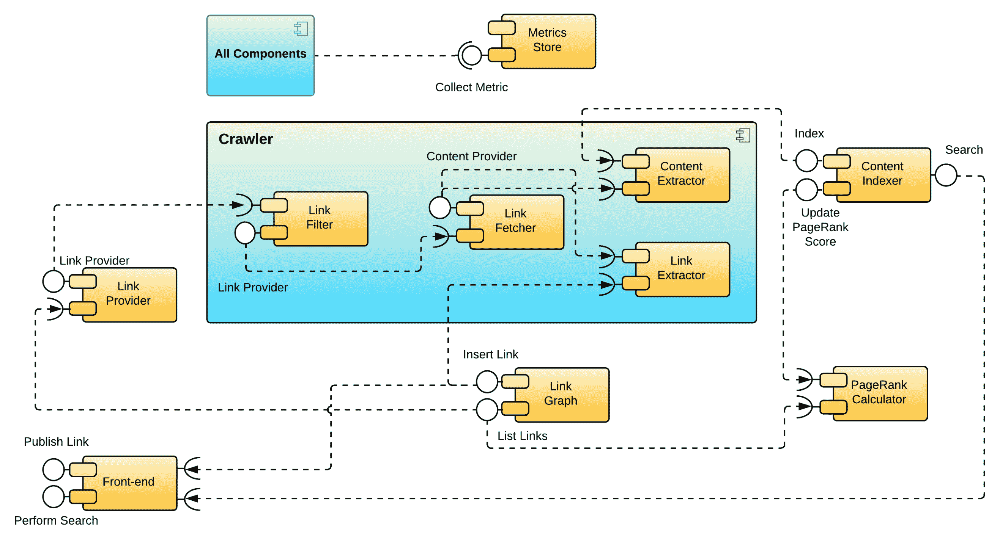

# 第五章：Links 'R' Us 项目

“软件任务中最困难的部分是达到完整和一致的需求规格，而构建程序的本质实际上是对规格的调试。”

- 弗雷德里克·P·布鲁克斯 ^([3])

在本章中，我们将讨论 Links 'R' Us，这是一个我们将从本书剩余章节开始从头构建的 Go 项目。这个项目被特别设计用来结合您迄今为止所学的一切，以及我们在以下章节中将要涉及的一些更技术性的主题：数据库、管道、图处理、gRPC、仪表化和监控。

本章将涵盖以下主题：

+   我们将要构建的系统及其主要功能的简要概述

+   为项目选择合适的软件开发生命周期（SDLC）模型

+   功能性和非功能性需求分析

+   Links 'R' Us 服务的基于组件的建模

+   为项目选择合适的架构（单体与微服务）

# 系统概述 – 我们将要构建什么？

在接下来的章节中，我们将逐步组装我们的**搜索引擎**。与所有项目一样，我们需要为它想出一个听起来很酷的名字。让我向您介绍**Links 'R' Us**！

那么，Links 'R' Us 项目的核心功能是什么？主要且相当明显的一个功能是能够搜索内容。然而，在我们能够将我们的搜索引擎向公众开放之前，我们首先需要用内容来填充它。为此，我们需要为用户提供提交 URL 到我们的搜索引擎的手段。搜索引擎随后会爬取这些链接，索引其内容，并将任何新遇到的链接添加到其数据库中以便进一步爬取。

我们需要为 Links 'R' Us 的启动做所有这些吗？简短的答案是：不！虽然用户搜索会返回包含用户搜索查询关键词的结果，但我们缺乏以有意义的方式对这些结果进行排序的能力，尤其是如果结果数量达到数千个。

因此，我们需要在我们的系统中引入某种链接或内容质量指标，并按此对返回的结果进行排序。为了避免重蹈覆辙，我们将站在搜索引擎**巨头**（即谷歌）的肩膀上，并实现一个经过实战考验的算法，称为 `PageRank`。

`PageRank` 算法是由一篇如今非常流行且被广泛引用的论文《The PageRank Citation Ranking: Bringing Order to the Web》提出的。这篇原始论文于 1998 年由拉里·佩奇、谢尔盖·布林、拉杰夫·莫特瓦尼和特里·温格拉德撰写，并在多年以来一直作为谷歌搜索引擎实现的基础。

给定一个包含网页之间链接的图，`PageRank` 算法会根据指向它的链接数量及其相对重要性分数，为图中的每个链接分配一个重要性分数。

虽然`PageRank`最初被引入作为一种组织网络内容工具，但其通用形式适用于任何类型的链接图。在过去的几年里，人们一直在研究将`PageRank`理念应用于众多领域，从生物化学^([5])到交通优化^([10])。

我们将在第八章基于图的数据处理和第十二章构建分布式图处理系统中更详细地探讨`PageRank`算法，作为围绕我们可以采用的多种方法以促进单个节点或节点集群（离核图处理）上大型图处理的大讨论的一部分。

# 为我们的项目选择 SDLC 模型

在深入探讨“链接之用”项目细节之前，我们需要考虑我们在第一章软件工程的鸟瞰中讨论的 SDLC 模型，并选择一个更适合此类项目的模型。选择合适的模型至关重要：它将作为我们捕捉项目需求、定义组件及其接口合同、以及合理划分独立构建和测试的工作块（逻辑块）的指南。

在本节中，我们将概述选择敏捷框架作为我们项目的主要理由，并详细阐述一套使用称为*大象生鱼片*的技术来加快我们开发速度的有趣方法。

# 使用敏捷框架加速迭代

首先，从所有目的来看，Links 'R' Us 是一个典型的绿色领域项目类型。由于没有紧迫的项目交付截止日期，我们绝对应该花时间探索我们可用于实现系统各个组件的任何替代技术的优缺点。

例如，当涉及到索引和搜索我们系统将要抓取的文档时，在决定使用哪一个之前，我们需要评估几个相互竞争的产品/服务。此外，如果我们决定使用 Docker 等工具来容器化我们的项目，那么有几个编排框架（例如，Kubernetes^([6])、Apache Mesos^([2])或 Docker Swarm^([11]）可用于将我们的服务部署到我们的预发布和生产环境中。

就软件开发的速度而言，在接下来的几章中，我们将逐步和分阶段地构建“链接之用”的各个组件。鉴于我们正在开发的是一个面向用户的产品，必须以小迭代的方式进行工作，以便我们尽可能早地将原型版本提供给用户焦点小组。这将使我们能够收集宝贵的反馈，有助于我们在开发过程中对产品进行微调和抛光。

由于所有上述原因，我认为采用敏捷方法来开发“链接之用”是明智的。我个人的偏好是使用 Scrum。由于我们实际上没有支持项目开发的真实开发团队，站立会议、计划会议和回顾会议等概念不适用于我们的具体情况。相反，我们需要妥协，并在我们自己的敏捷工作流程中采用 Scrum 背后的某些想法。

为了达到这个目的，在需求分析部分，我们将专注于创建用户故事。一旦这个过程完成，我们将使用这些故事作为输入，推断出我们需要构建的一组高级组件，以及它们之间预期的交互方式。最后，当实施每个用户故事的时候，我们将扮演“产品负责人”的角色，将每个故事分解成一系列卡片，然后我们将这些卡片安排在看板板上。

但在我们开始处理用户故事之前，我想介绍一个非常有用且有帮助的技术，可以帮助你更快地迭代自己的项目：“大象生鱼片”。

# “大象生鱼片”——如何更快地迭代！

这个名字独特的技巧的存在归功于阿利斯泰尔·科克本博士发明的一项练习。这个练习的目的是帮助人们（无论是工程师还是非工程师）练习和学习如何将复杂的用户故事卡片（即“大象”）拆分成非常薄的垂直切片，这样团队就可以经常并行处理。

可能会让人觉得奇怪，但我发现我在过去参与的项目中最有帮助的切片大小仅仅是“一天的工作量”。一天分割的合理性是每天（在功能标志后面）交付总工作量的小部分，这种方法与敏捷开发倡导的“快速发布”座右铭是一致的。

说到将卡片拆分为一天的工作量，这当然不是一件简单的事情。这需要一点练习和耐心，以使你的大脑从长期任务转移到分解和优化更短时间的工作负载。另一方面，这种方法允许工程团队尽早识别和解决潜在的阻碍因素；不言而喻，我们当然更希望在大冲刺的早期而不是中期，甚至更糟糕的是，在大冲刺周期的接近结束时发现阻碍因素！

这种技术的另一个优点，至少从 Go 工程师的角度来看，是它让我们更加仔细地思考如何组织我们的代码库，以确保在每天结束时，我们总能有一块可以干净编译和部署的软件。这种约束迫使我们养成按照我们在第二章中探讨的 SOLID 设计原则来思考代码的习惯，即*最佳实践编写清晰且可维护的 Go 代码*。

# 需求分析

要对“Links 'R' Us”项目进行详细的需求分析，我们基本上需要回答两个关键问题：我们需要构建什么，以及我们的设计建议如何与一系列目标相匹配？

要回答*什么*的问题，我们需要列出我们系统预期实现的所有核心功能，以及描述各种参与者如何与之交互。这形成了我们分析中的**功能需求**（**FRs**）。

要回答后面的问题，我们必须声明我们解决方案的**非功能需求**（**NFRs**）。通常，非功能需求列表包括诸如**服务级别目标**（**SLOs**）和容量和可扩展性要求，以及与我们项目相关的安全考虑因素。

# 功能需求

既然我们已经决定利用敏捷模型来实施我们的项目，那么定义我们的功能需求列表的下一步逻辑步骤就是建立*用户故事*。

用户故事的概念涉及到从与系统交互的参与者角度表达软件需求的需要。在许多类型的项目中，参与者通常被认为是系统的最终用户。然而，在一般情况下，*其他系统*（例如，后端服务）也可能扮演参与者的角色。

每个用户故事都以一个 *succinct* 的需求规范开始。重要的是要注意，规范本身必须 *始终* 从受其影响的行为者的视角来表述。此外，在创建用户故事时，我们应该始终努力捕捉每个需求的背后 *业务价值*，也称为 *真正的原因*。更重要的是，敏捷开发的核心理念之一是所谓的 *完成定义*。在编写故事时，我们需要包括一个 *验收标准* 列表，该列表将用作验证工具，以确保每个故事目标都已被成功实现。

为了定义 Links 'R' Us 的功能需求，我们将使用以下相对标准化的敏捷模板：

作为 `[行为者]`，

我需要能够 `[简短需求]`，

为了[原因/业务价值]。

此用户故事的验收标准如下：

[标准]列表

我还想指出最后一件事，虽然每个故事都会记录特定功能的 *需求*，但它们都将完全缺乏任何形式的实现细节。这是故意的，并且与使用任何敏捷框架时的推荐实践一致。正如我们在第一章中讨论的，*软件工程的鸟瞰图*，我们的目标是将任何技术实现决策推迟到最后时刻。如果我们一开始就决定如何实现每个用户故事，我们就会对我们的开发过程施加不必要的限制，从而限制我们的灵活性和在特定时间预算内可以完成的工作量。

现在让我们应用前面的模板来捕捉 Links 'R' Us 项目的功能需求集合，作为一个用户故事列表，这些故事将在接下来的章节中逐一解决。

# 用户故事 – 链接提交

作为 `最终用户`，

我需要能够 `提交新的链接到 Links 'R' Us`，

为了更新链接图并使其内容可搜索。

此用户故事的验收标准如下：

+   提供前端或 API 端点，以方便最终用户提交链接。

+   提交的链接有以下标准：

    +   必须添加到图中

    +   必须被系统爬取并添加到其索引中

+   已提交的链接应由后端接受，但不得两次插入到图中。

# 用户故事 – 搜索

作为 `最终用户`，

我需要能够 `提交全文搜索查询`，

为了从 Links 'R' Us 索引的内容中检索相关匹配结果列表。

此用户故事的验收标准如下：

+   为用户提供前端或 API 端点以提交全文查询。

+   如果查询匹配多个项目，它们将以列表形式返回，最终用户可以分页浏览。

+   结果列表中的每个条目都必须包含以下项目：标题或链接描述、指向内容的链接，以及表示链接上次爬取时间的戳。*如果可行*，链接还可以包含一个表示为百分比的关联度分数。

+   当查询不匹配任何项目时，应向最终用户返回适当的响应。

# 用户故事 – 爬取链接图

作为 `爬虫后端系统`，

我需要能够 `从链接图中获取一个经过清理的链接列表`，

以便 `在同时获取和索引其内容的同时，通过新发现的链接扩展链接图`。

这个用户故事的验收标准如下：

+   爬虫可以查询链接图并接收需要爬取的过时链接列表。

+   爬虫接收到的链接是从远程主机检索的，除非远程服务器提供了爬虫之前已经看到的 `ETag` 或 `Last Modified` 头信息。

+   获取的内容被扫描以查找链接，并且链接图得到更新。

+   获取的内容被索引并添加到搜索语料库中。

# 用户故事 – 计算 PageRank 分数

作为 `PageRank 计算器后端系统`，

我需要能够 `访问链接图`，

以便 `计算并持久化每个链接的 PageRank 分数`。

这个用户故事的验收标准如下：

+   PageRank 计算器可以获取整个链接图的不可变快照。

+   图中的每个链接都被分配一个 PageRank 分数。

+   搜索语料库条目被标注为更新的 PageRank 分数。

# 用户故事 – 监控 Links 'R' Us 健康状况

作为 `Links 'R' Us 网站可靠性工程 (SRE) 团队的成员`，

我需要能够 `监控所有 Links 'R' Us 服务的健康状况`，

以便 `检测和解决导致服务性能下降的问题`。

这个用户故事的验收标准如下：

+   所有 Links 'R' Us 服务应定期向集中式指标收集系统提交健康和性能相关的指标。

+   为每个服务创建一个监控仪表板。

+   一个高级监控仪表板跟踪整体系统健康状况。

+   基于指标的警报被定义并链接到分页服务。每个警报都附带一个自己的*剧本*，其中包含需要由值班 SRE 团队成员执行的一系列步骤。

# 非功能性需求

在本节中，我们将讨论 Links 'R' Us 项目的非功能性需求列表。请记住，这个列表并不详尽。由于这不是一个真实世界的项目，我选择只描述一小部分从我们将要在下一章中构建的组件的角度来看有意义的可能非功能性需求。

# 服务级别目标

从 **站点可靠性工程** (**SRE**) 的角度来看，我们需要制定一个 SLO 列表，这些 SLO 将作为衡量 Links 'R' Us 项目性能的标尺。理想情况下，我们应该为我们的每个服务定义单独的 SLO。在设计阶段这可能不是立即可行的，但至少我们需要为系统面向用户的部分制定一个现实的 SLO。

SLO 由三个部分组成：我们正在测量的东西的描述、以百分比表示的预期服务级别，以及测量发生的周期。以下表格列出了 Links 'R' Us 的一些初始和相当标准的 SLO：

| **指标** | **预期** | **测量周期** | **备注** |
| --- | --- | --- | --- |
| Links 'R' Us 可用性 | 99% 的正常运行时间 | 每年 | 每年可容忍 3 天 15 小时 39 分钟的停机时间 |
| 索引服务可用性 | 99.9% 的正常运行时间 | 每年 | 每年可容忍 8 小时 45 分钟的停机时间 |
| PageRank 计算器服务可用性 | 70% 的正常运行时间 | 每年 | 不是我们系统面向用户的部分；该服务可以承受更长时间的停机 |
| 搜索响应时间 | 30% 的请求在 0.5 秒内得到响应 | 每月 |  |
| 搜索响应时间 | 70% 的请求在 1.2 秒内得到响应 | 每月 |  |
| 搜索响应时间 | 99% 的请求在 2.0 秒内得到响应 | 每月 |  |
| PageRank 计算器服务的 CPU 利用率 | 90% | 每周 | 我们不应该为闲置的计算节点付费 |
| SRE 团队事件响应时间 | 90% 的工单在 8 小时内得到解决 | 每月 |  |

请记住，在这个阶段，我们实际上并没有任何先前数据可用；我们更多或更少地使用 *猜测* 来确定我们希望实现的服务级别。一旦完整系统部署到生产环境，并且我们的 SRE 团队更好地理解了系统的独特之处，我们将重新审视并更新 SLO，以更好地反映现实情况。

作为快速提醒，本书的第十三章 第十三章，*指标收集与可视化*，专门关注在生产服务中涉及到的 SRE 方面。在该章中，我们将详细阐述我们可以使用的流行工具，用于捕获、可视化和警报我们的服务级别相关指标。

# 安全考虑

正如我们所知，当涉及到在线服务时，*安全* 是一个可以决定特定产品成败的因素。为此，我们需要讨论在构建像 Links 'R' Us 这样的项目时可能出现的潜在安全问题，并制定应对这些问题的策略。

我们的分析基于这样一个前提，*你永远不应该信任客户端*，在这种情况下，与 Links 'R' Us 互动的用户。如果我们的项目取得成功，它无意中会吸引恶意行为者的注意，他们会在某个时候试图定位并利用我们系统中的安全漏洞。

我之前提出的一个用例涉及用户提交一个服务最终会爬取并添加到其搜索索引中的 URL。你可能想知道一个只爬取用户提交的 URL 的服务可能会出什么问题？以下是一些有趣的例子。

大多数云服务提供商运行一个内部元数据服务，每个计算节点都可以查询以获取自身的信息。此服务通常通过一个*链路本地*地址（例如`169.254.169.254`）访问，节点可以通过简单的 HTTP GET 请求检索它们感兴趣的信息。

链路本地地址是由**互联网工程任务组**（**IETF**）保留的特殊地址块。该块中 IPv4 地址的范围用 CIDR 表示法描述为`169.254.0.0/16`（65,536 个唯一地址）。类似地，以下地址块已被保留用于 IPv6：`fe80::/10`。

这些地址是特殊的，因为它们只在特定的网络段内有效，并且不能超出该网络段进行路由；也就是说，路由器将拒绝将它们转发到其他网络。因此，链路本地地址在内部使用是安全的。

假设我们已经将“链接‘R’我们”项目部署到 Amazon EC2。EC2 元数据服务的文档页面^([1])引用了许多恶意对手可能会使用的链路本地端点。以下是两个从攻击者角度来看更有趣的例子：

+   `http://169.254.169.254/latest/meta-data/iam/info`返回有关调用来源的计算节点关联的角色信息。

+   `http://169.254.169.254/latest/meta-data/iam/security-credentials/<role-name>`返回与特定角色关联的一组临时安全凭证。

在潜在的攻击场景中，恶意用户将第一个 URL 提交给爬虫。如果爬虫只是简单地抓取链接并将响应添加到搜索索引中，攻击者就可以执行有针对性的搜索并获取与部署爬虫服务的节点相关的安全角色的*名称*。利用这些信息，攻击者随后将第二个 URL 提交给爬虫，希望再次走运并等待链接被索引后，通过执行第二次有针对性的搜索查询来检索一组有效凭证。这样，对手就可以未经授权访问项目内部使用的另一个服务（例如，一个存储服务如 S3）。

如果你对此感到好奇，谷歌云和微软 Azure 通过要求计算节点在联系其元数据服务时必须存在一个特殊的 HTTP 头来缓解这种信息泄露漏洞。然而，这并不意味着我们不应该在我们的爬取操作中排除*其他*IP 范围。首先，我们应该始终排除*私有网络*地址。毕竟，我们可能选择使用的一些服务（例如 Elasticsearch）可能会暴露未经身份验证的 RESTful API，这些 API 可以通过运行爬虫代码的计算节点访问。显然，我们不希望我们的后端服务信息出现在我们的搜索索引中！以下表格列出了我们应该绝对避免爬取的一些特殊 IPv4 地址范围：

| **IP 块（CIDR 表示法）** | **描述** |
| --- | --- |
| 10.0.0.0/8 | 私有网络 |
| 172.16.0.0/12 | 私有网络 |
| 192.168.0.0/16 | 私有网络 |
| 169.254.0.0/16 | 链路本地地址 |
| 127.0.0.1 | 环回 IP 地址 |
| 0.0.0.0/8 | 本地机器上的所有 IP 地址 |
| 255.255.255.255/32 | 当前网络的广播地址 |

前面的表格中的列表并不完整。实际上，你可能需要排除一些额外的 IP 块，例如为运营商级流量、多播和测试网络预留的 IP 块。更重要的是，如果我们云提供商的网络堆栈支持 IPv6，我们还应该排除等效的 IPv6 地址范围。如果你对这个主题感兴趣，你可以在 MASSCAN 项目的 GitHub 仓库中找到一个全面的 IPv4 黑名单^([8])。

最后，你可能知道也可能不知道的是，许多 URL 爬取库支持除了`http/https`之外的其他方案。这些方案中的一个例子是`file`，除非禁用，否则可能会允许攻击者欺骗爬虫读取和索引爬虫执行节点上的本地文件内容（例如，`/etc/passwd`）。

如果你之前没有使用过文件协议方案，请尝试在你的浏览器中输入以下地址：`file:///`。

# 成为好网民

虽然我们的最终目标是能够爬取和索引整个互联网，但事实是，我们检索和索引的链接指向的是属于他人的内容。可能发生的情况是，第三方反对我们索引其控制下的域的*一些*或*所有*链接。

幸运的是，网站管理员有一种标准化的方式来通知爬虫，不仅关于它们可以爬取哪些链接以及哪些链接不允许爬取，还可以指定一个可接受的爬取速度，以避免对远程主机造成高负载。这一切都是通过编写一个`robots.txt`文件并将其放置在每个域的根目录下实现的。该文件包含一系列如下所示的指令：

+   **User-Agent**：以下指令适用的爬虫（用户代理字符串）的名称

+   **Disallow**：一个正则表达式，用于排除任何匹配的 URL 被爬取

+   **Crawl-Delay**：爬虫在爬取该域名后续链接之前等待的秒数

+   **Sitemap**：一个指向 XML 文件的链接，该文件定义了域名内的所有链接，并提供爬虫可以用来优化其链接访问模式的元数据，如*最后更新*时间戳

要成为好网民，我们需要确保我们的爬虫实现尊重它遇到的任何`robots.txt`文件的内容。最后但同样重要的是，我们的解析器应该能够正确处理远程主机返回的各种状态码，并在检测到远程主机问题或远程主机决定限制我们时降低爬取速度。

# 系统组件建模

在映射项目架构的第一步，我们将开始创建一个 UML 组件图。这里的主要目标是识别和描述构成我们系统的各种*组件*之间的结构连接。

组件被定义为封装的独立单元，它是系统或子系统的组成部分。组件通过暴露和消费一个或多个接口相互通信。

基于组件设计的要点之一是，组件应始终被视为抽象的逻辑实体，它们暴露特定的行为。这种设计方法与 SOLID 原则紧密一致，并为我们提供了在项目开发过程中的任何时刻自由更改或甚至交换组件实现的灵活性。

下面的图表将“链接之用”项目分解为高级组件，并直观地展示了每个组件暴露和使用的接口：

图 1：“链接之用”项目的 UML 组件图

如果你对这种图表所使用的符号不熟悉，这里有一个快速说明，解释每个符号代表什么：

+   两侧带有两个类似端口符号的框表示组件。

+   组件也可以嵌套在其他组件内部。在这种情况下，每个子组件都被封装在其父组件表示的框内。在前面的图表中，**链接过滤器**是**爬虫**的子组件。

+   完整的圆圈表示特定组件*实现*的*接口*。例如，**搜索**是**内容索引器**组件实现的接口之一。

+   半圆表示一个组件*需要*特定的接口。例如，**链接提取器**组件需要由**链接图**组件实现的**插入链接**接口。

现在我们已经绘制出了构建我们项目所需系统组件的高级视图，我们需要花些时间更详细地检查每一个。

# 爬虫

爬虫组件实际上是搜索引擎的核心。它在一个链接集上运行，这些链接要么被播种到系统中，要么在爬取先前链接集时发现。正如你在前面的组件模型图中看到的，爬虫本身实际上是一个封装了其他几个子组件的包，这些子组件以类似管道的配置运行。让我们更详细地检查每个子组件的作用。 

# 链接过滤器

一个简单的爬虫实现会尝试检索作为输入提供的任何链接。但正如我们所知，网络上有各种内容，从文本或 HTML 文档到图像、音乐、视频以及各种其他类型的二进制数据（例如，归档、ISO、可执行文件等）。

你可能会同意，尝试下载搜索引擎无法处理的物品不仅会浪费资源，而且还会给“链接 R 我们”服务的运营商（也就是我们）带来额外的运行成本。因此，从爬虫中排除此类内容将是一种有益的成本降低策略。

这就是**链接过滤器**组件发挥作用的地方。在我们尝试获取远程链接之前，链接过滤器将首先尝试识别另一侧的内容，并丢弃任何看起来不指向我们可以处理的内容的链接。

# 链接获取器

所有通过链接过滤器筛选存活的链接都将被**链接获取器**组件消耗。正如其名称所暗示的，这个组件负责与每个链接目标建立 HTTP 连接，并检索服务器另一端返回的任何内容。

获取器会仔细处理远程服务器返回的 HTTP 状态码和任何 HTTP 头信息。如果返回的状态码表明内容已移动到不同的位置（即 301 或 302），获取器将自动跟随重定向，直到到达内容的最终目的地。从逻辑上讲，我们不希望我们的获取器陷入无限重定向循环，试图爬取配置错误（或恶意）的远程主机。为此，爬虫需要维护一个重定向跳数计数器，并在超过特定值时终止爬取尝试。

获取器还非常关注另一个重要的 HTTP 头信息，即`Content-Type`头信息。这个头信息由远程服务器填充，并标识服务器返回的数据类型（也称为 MIME 类型）。如果远程服务器回复一个不支持的 MIME 类型头信息（例如，指示图像或 JavaScript 文件），获取器应自动丢弃链接，并防止其进入爬取管道的下一阶段，即**内容提取器**和**内容索引器**。

# 内容提取器

**内容提取器**试图从从远程服务器下载的文档中识别并提取所有文本。例如，如果链接指向一个纯文本文档，那么提取器会原样输出文档内容。另一方面，如果链接指向一个 HTML 文档，提取器会移除任何 HTML 元素，并输出文档的纯文本部分。

输出的内容被发送到**内容索引器**组件，以便对其进行分词并更新 Links 'R' Us 全文搜索索引。

# 链接提取器

我们将要检查的最后一个爬虫组件是**链接提取器**。它扫描检索到的 HTML 文档，并尝试识别和提取其中所有的链接。

链接提取是一个不幸的简单任务。虽然确实大多数链接可以通过一系列正则表达式提取，但还有一些边缘情况需要我们额外的逻辑处理，如下面的例子所示：

+   相对链接需要转换为绝对链接。

+   如果文档的`<head>`部分包含`<base href="xxx">`标签，我们需要解析它并使用其内容来重写相对链接。

+   我们可能会遇到没有指定协议的链接。这些特殊链接以`//`开头，通常用于引用 CDN 中的内容或在包含来自非 HTTPS 源静态资源的 HTTPS 页面中（例如，购物车结账页面中的图片）。当网络浏览器遇到这样的链接时，它会自动使用当前 URL 的协议来获取这些链接。

链接提取器会将所有新发现的链接传输到**链接图**组件，以便更新现有图连接并创建新的连接。

# 内容索引器

**内容索引器**是 Links 'R' Us 项目中的另一个非常重要的组件。该组件执行两个不同的功能。

首先，该组件维护一个全文索引，用于爬虫检索到的所有文档。任何由**内容提取器**组件输出的新或更新文档都会传播到**内容索引器**，以便更新索引。

逻辑上讲，如果一个索引没有搜索手段，那么它的实用性将大大降低。为此，内容索引器公开了允许其他组件对索引执行全文搜索并按检索日期和/或 PageRank 分数排序的机制。

# 链接提供者

**链接提供者**组件定期清理链接图，并收集新爬取遍历的候选链接列表。候选链接包括以下内容：

+   最近发现的尚未被爬取的链接

+   最近爬取尝试失败的链接（例如，爬虫从远程服务器收到了 404/NOT-FOUND 响应）

+   爬虫过去成功处理但需要重新访问的链接，以防指向的内容已更改

由于万维网由令人难以置信数量的页面组成（截至 2020 年 1 月，大约有 61.6 亿个页面），因此假设随着时间的推移，我们发现的链接图增长，我们最终会达到一个点，即我们需要抓取的链接集将超过我们计算节点的可用内存容量！这就是为什么链接提供者组件采用 *流式* 方法：当链接清洗过程正在执行时，任何选定的链接候选者将立即传递给 *捕收器* 组件以进行进一步处理。

# 链接图

**链接图** 负责跟踪不仅包括捕收器迄今为止发现的全部链接，还包括它们的连接方式。它为其他组件提供了添加或从图中删除链接的接口，当然，查询图。

几个其他系统组件依赖于链接图组件公开的接口：

+   *链接提供者* 会查询链接图来决定哪些链接应该被接下来抓取。

+   捕收器的 *链接提取器* 子组件会将新发现的链接添加到图中。

+   *PageRank 计算器* 组件需要访问整个图的连接信息，以便计算每个链接的 PageRank 分数。

注意，我并不是在谈论一个 *单一* 接口，而是在使用复数形式：*接口*。这是故意的，因为链接图组件是实施 **命令查询责任分离**（**CQRS**）模式的理想候选者。

CQRS 模式属于架构模式家族。CQRS 背后的关键思想是将特定组件公开的写入和读取模型分离，以便它们可以独立优化。**命令** 指的是改变模型状态的操作，而 *查询* 是检索和返回当前模型状态。

这种分离使我们能够为读取和写入执行不同的业务逻辑路径，并且实际上使我们能够实现复杂的访问模式。例如，写入可以是同步过程，而读取可能是异步的，并且可以提供对数据的有限视图。

作为另一个例子，该组件可以为写入和读取使用不同的数据存储。写入最终会缓慢地流入读取存储，但也许读取存储的数据也可以通过从其他下游组件获取的外部数据来增强。

# PageRank 计算器

**PageRank** 计算器实现了异步、周期性的过程，用于重新评估 Links 'R' Us 图中每个链接的 PageRank 分数。

在开始新的计算遍历之前，PageRank 组件将首先使用链接图组件公开的接口来获取当前图状态的快照。这包括图顶点（链接目的地）和连接它们的边（链接）。

一旦每个链接的 PageRank 值被计算出来，PageRank 组件将联系文本索引器组件，并使用更新的 PageRank 分数标注每个索引文档。这是一个异步过程，并且不会干扰“链接之用”用户执行的任何搜索。

# 指标存储

由于“链接之用”项目由多个组件组成，因此对我们来说部署监控基础设施是有意义的，这样我们就可以跟踪每个组件的健康状况。这样，我们可以识别出那些表现出高错误率或负载过高的组件，并需要扩展。

这是**指标存储**组件的主要作用。正如您在组件图中可以看到的，我们设计中的所有组件都将指标传输到指标收集器，因此依赖于它。当然，这并不是一个**硬**依赖：我们的系统设计应该假设指标收集器在任何时候都可能离线，并确保在生产中发生这种情况时，其他组件不会受到影响。

# 前端

前端组件的目的是渲染一个简单、静态的基于 HTML 的用户界面，这将使用户能够方便地与项目交互。更具体地说，前端组件的设计将使用户能够执行以下一系列功能：

+   直接提交新的 URL 进行索引。

+   输入一个关键词或基于短语搜索查询。

+   分页特定查询的搜索结果。

重要的是要注意，在我们的当前设计中，前端组件作为我们项目对外部世界可访问的入口点！鉴于其他项目组件**不能**直接被最终用户访问，我们可以认为前端还充当了一个**API 网关**，其中每个传入的 API 请求都映射到内部系统组件的**一个或多个**调用。除了将我们的内部组件与外界隔离的明显安全优势之外，API 网关模式还提供了以下一系列额外的好处：

+   如果一些内部调用需要异步执行，网关可以并行执行它们，并在聚合它们的响应并同步返回给用户之前等待它们完成。

+   它使我们能够将内部组件之间通信的方式与外部世界用于与我们的系统接口的机制解耦。这意味着我们可以向外部世界公开 RESTful API，同时仍然保留选择每个内部组件最合适的传输方式（例如，REST、gRPC 或可能是一个消息队列）的灵活性。

# 集成式或微服务？终极问题

在开始开发“链接之用”服务之前，我们需要决定我们的系统组件是作为大型单体服务的一部分开发，还是我们将直接实施面向服务的架构。

虽然从外面看，使用微服务的概念确实很有吸引力，但它也带来了很多运营开销。除了构建和连接所有组件所需的精神努力外，我们还需要担心以下问题：

+   每个服务是如何部署的？我们是进行滚动部署吗？那么，关于暗黑或测试版本呢？当出现问题需要回滚时，回滚到之前的部署有多容易？

+   我们是否会使用像 Kubernetes 这样的容器编排层？服务之间的流量是如何路由的？我们需要使用像 Istio 或 Linkerd 这样的服务网格吗？

+   我们如何监控我们服务的健康状态？此外，我们如何收集所有服务的日志？

+   我们将如何处理服务中断？我们需要实现断路器来防止有问题的服务破坏依赖于它的上游服务吗？

当然，我们所有人都知道单体设计的缺点，但另一方面，我们没有任何可用数据来证明从项目开始就拆分组件成微服务的额外成本是合理的。

考虑到每种方法的优缺点，看起来最好的行动方案是采取混合方法！我们最初将使用单体设计来开发我们的组件。然而，这里有个转折，每个组件都将定义一个接口，其他组件将使用该接口与其通信。

为了在不引入它们具体实现之间的任何耦合的情况下连接组件，我们将使用*代理*设计模式。最初，我们将提供模拟代理实现，以促进*同一进程*内组件之间的通信。这当然在功能上等同于我们通常在单体设计中直接连接组件。

随着我们的系统增长和演变，我们最终会达到一个需要将一个或多个组件提取为独立服务的地方。使用前面的模式，我们只需要更新我们的代理以使用适当的传输（例如，REST、gRPC 和消息队列）来连接组件，而无需修改任何现有的组件实现。

# 概述

这标志着“链接之用”项目的介绍结束。我希望到这一点，你已经对接下来几章将要构建的内容有了大致的了解。如果你对项目组件的技术实现细节感到好奇，那是非常正常的。本章的主要目的是介绍项目的高级概述。我们将在接下来的页面中详细分析每个组件的构建！

为了使以下章节的概念和代码更容易理解，我们将把每一章分成两个核心部分：

+   在每一章的前半部分，我们将深入探讨一个特定的技术主题，例如，对流行数据库类型（关系型、NoSQL 等）的调查，如何在 Go 中创建管道，如何大规模运行图操作，什么是 gRPC 以及如何使用它，等等。

+   在本章的后半部分，我们将把前半部分的概念应用到构建“链接之用”项目的一个或多个组件上。

在下一章中，我们将集中精力构建“链接之用”项目的关键组件之一：一个完整功能的数据持久层，用于存储爬虫发现的链接和索引爬虫检索到的每个网页的内容。

# 问题

1.  功能性需求与非功能性需求之间的区别是什么？

1.  描述用户故事的主要组成部分。

1.  如果我们盲目地爬取用户提交给系统的任何链接，在“链接之用”场景中可能会出现哪些问题？

1.  列出 SLO 的关键组成部分。

1.  UML 组件图的目的是什么？

# 进一步阅读

1.  亚马逊弹性计算云：*实例元数据和用户数据*：[`docs.aws.amazon.com/AWSEC2/latest/UserGuide/ec2-instance-metadata.html`](https://docs.aws.amazon.com/AWSEC2/latest/UserGuide/ec2-instance-metadata.html)

1.  Apache Mesos: 将数据中心当作单一资源池来编程：[`mesos.apache.org`](https://mesos.apache.org)

1.  布鲁克斯，弗雷德里克·P.，小：*《人月神话（周年纪念版）》*。波士顿，马萨诸塞州，美国：Addison-Wesley Longman 出版公司，1995 — [`www.worldcat.org/title/mythical-man-month/oclc/961280727`](https://www.worldcat.org/title/mythical-man-month/oclc/961280727)

1.  Istio: *连接、安全、控制和观察服务*：[`istio.io`](https://istio.io)

1.  Ivn，Gbor 和 Grolmusz，Vince：*当网络遇到细胞：使用个性化 PageRank 分析蛋白质相互作用网络*。

1.  Kubernetes: *生产级容器编排*：[`kubernetes.io`](https://kubernetes.io)

1.  Linkerd: *适用于 Kubernetes 及更广泛的超轻量级服务网格*：[`linkerd.io`](https://linkerd.io)

1.  MASSCAN: 大规模 IP 端口扫描器；保留 IP 排除列表：[`github.com/robertdavidgraham/masscan/blob/master/data/exclude.conf`](https://github.com/robertdavidgraham/masscan/blob/master/data/exclude.conf)

1.  Page, L.; Brin, S.; Motwani, R.; and Winograd, T.: *PageRank 引文排名：为网络带来秩序*. In: 第七届国际万维网会议论文集. 澳大利亚布里斯班，1998 年，第 161–172 页

1.  Pop, Florin ; Dobre, Ciprian: *一种高效的 PageRank 方法用于城市交通优化*.

1.  Swarm: *一个 Docker 原生集群系统*: [`github.com/docker/swarm`](https://github.com/docker/swarm)
