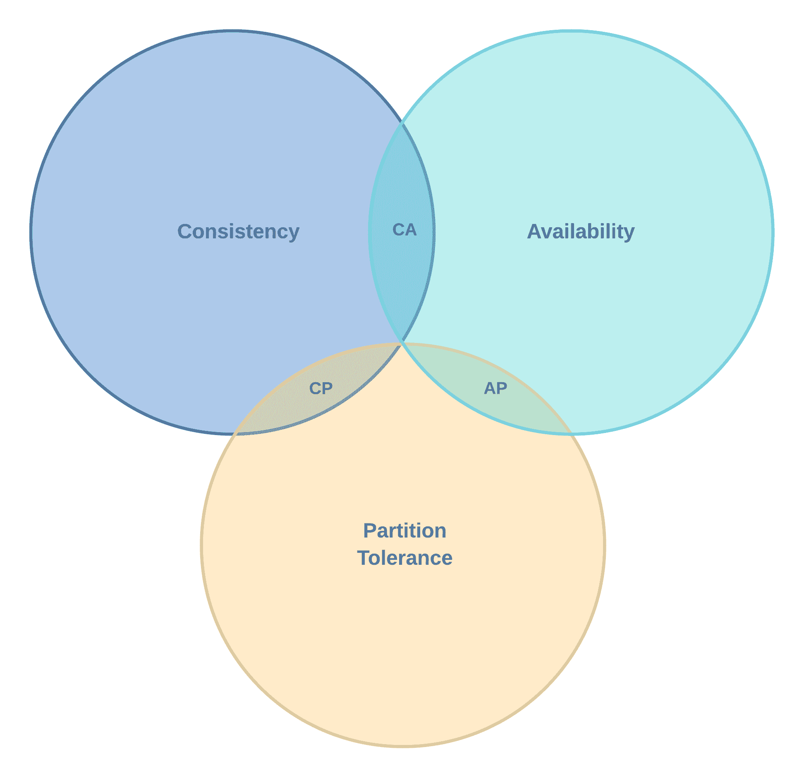
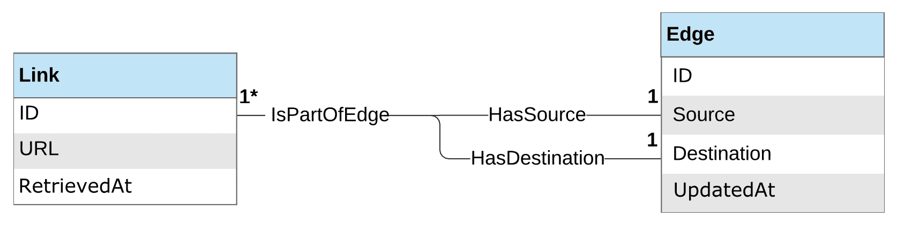

# 第六章：构建持久化层

“数据库模式通常是易变的、非常具体且高度依赖的。这是为什么面向对象的应用程序和数据库之间的接口如此难以管理，以及为什么模式更新通常很痛苦的一个原因。”

- 罗伯特·C·马丁 ^([14])

在本章中，我们将专注于设计和实现 Links 'R' Us 组件中的两个数据访问层：链接图和文本索引器。更具体地说，在接下来的页面中，我们将执行以下操作：

+   讨论和比较不同类型的数据库技术

+   识别和理解需要创建数据访问层作为底层数据库层的抽象的主要原因

+   分析链接图组件的实体、关系和查询需求，定义数据层的 Go 接口，并从头开始构建两个替代数据层实现：一个简单的内存存储，我们可以用于测试目的，以及一个由 CockroachDB 支持的生产就绪存储

+   提出一个用于索引和搜索网页内容的文档模型，并实现一个基于流行的 bleve Go 包的内存索引器，以及一个基于 Elasticsearch 的水平可扩展变体

+   概述创建可跨不同数据层实现共享和重用测试套件的策略

# 技术要求

本章将要讨论的主题的完整代码已发布在本书的 GitHub 仓库的 `Chapter06` 文件夹下。

您可以通过 [`github.com/PacktPublishing/Hands-On-Software-Engineering-with-Golang`](https://github.com/PacktPublishing/Hands-On-Software-Engineering-with-Golang) 访问本书的 GitHub 仓库。

为了让您尽快开始，每个示例项目都包含一个 makefile，它定义了以下目标集：

| **Makefile 目标** | **描述** |
| --- | --- |
| `deps` | 安装任何必需的依赖项。 |
| `test` | 运行所有测试并报告覆盖率。 |
| `lint` | 检查 lint 错误。 |

与本书中的所有其他章节一样，您需要一个相当新的 Go 版本，您可以从 [`golang.org/dl`](https://golang.org/dl)*.* 下载。

# 运行需要 CockroachDB 的测试

要运行使用 CockroachDB 作为后端的链接图测试，您需要从 [`www.cockroachlabs.com/get-cockroachdb`](https://www.cockroachlabs.com/get-cockroachdb) 下载 CockroachDB 的最新版本（v19.1.2 或更高版本）。

在下载并解压 CockroachDB 存档后，您可以通过切换到存档提取的文件夹并运行以下命令集来为测试启动一个 CockroachDB 实例：

```go
cockroach start --insecure --advertise-addr 127.0.0.1:26257.
cockroach sql --insecure -e 'CREATE DATABASE linkgraph;'
```

针对 CockroachDB 后端的链接图测试将通过查找访问 CockroachDB 实例的有效**数据源名称**（DSN）来检查`CDB_DSN`环境变量的内容。如果环境变量为空或未定义，所有 CockroachDB 测试将自动跳过。

假设您已经按照前面的说明启动了本地的 CockroachDB 实例，您可以通过执行以下命令来定义一个合适的 DSN，在运行 CockroachDB 测试套件之前：

```go
export CDB_DSN='postgresql://root@localhost:26257/linkgraph?sslmode=disable'
```

最后，需要注意的是，所有测试都假设数据库模式已经预先设置。如果您刚刚创建了数据库，可以通过切换到这本书源代码仓库的本地检出副本并运行`make run-cdb-migrations`来应用所需的 DB 迁移集。

# 运行需要 Elasticsearch 的测试

要运行使用 Elasticsearch 作为后端的链接图测试，您需要从[`www.elastic.co/downloads/elasticsearch`](https://www.elastic.co/downloads/elasticsearch)*.*下载一个较新的 Elasticsearch 版本（v7.2.0 或更高版本）。

下载并解压 Elasticsearch 存档后，您可以切换到提取文件的目录，并通过运行以下命令启动本地 Elasticsearch 实例（使用合理的默认配置选项）：

```go
bin/elasticsearch
```

Elasticsearch 测试通过检查`ES_NODES`环境变量的内容来获取要连接的 Elasticsearch 集群端点列表。假设您已经按照上述说明启动了本地 Elasticsearch 实例，您可以如下定义`ES_NODES`：

```go
export ES_NODES='http://localhost:9200'
```

如我们将在以下章节中看到的，Elasticsearch 索引器将被设计成一旦成功连接到 Elasticsearch 集群，就能自动为索引文档定义模式。因此，在运行 Elasticsearch 测试套件之前不需要单独的迁移步骤。

# 探索数据库系统的分类

在以下章节中，我们将列出最受欢迎的数据库技术，并分析每种技术的优缺点。根据我们的分析，我们将选择最适合实现 Links 'R' Us 的链接图和文本索引组件的数据库类型。

# 键值存储

我们将要考察的第一种数据库技术是键值存储。正如其名所示，键值存储数据库将数据持久化为键值对的集合，其中键作为访问特定集合中存储数据的唯一标识符。根据这个定义，键值存储在功能上等同于哈希表数据结构。流行的键值存储实现包括 memcached^([15])、AWS DynamoDB^([8])、LevelDB^([13])和针对 SSD 优化的 RocksDB^([20])。

键值存储支持的基本操作集包括**插入**、**删除**和**查找**。然而，一些流行的键值存储实现还提供了对**范围查询**的支持，允许客户端迭代两个特定键之间的**有序**键值对列表。就键和值而言，大多数键值存储实现对其内容不施加任何约束。这意味着任何类型的数据（例如，字符串、整数或甚至是二进制大对象）都可以用作键。

键值存储使用的数据访问模式使得在多个节点之间进行数据分区比其他数据库技术要容易得多。这种属性使得键值存储能够水平扩展，以适应增加的流量需求。

让我们来看看一些常见用例，在这些用例中，键值存储通常被认为是一个非常好的选择：

+   缓存！我们可以将键值存储用作通用缓存，用于各种事物。例如，我们可以为 CDN 服务缓存网页或存储常用数据库查询的结果，以减少 Web 应用的响应时间。

+   用于会话数据的分布式存储：想象一下，如果我们运营一个高流量的网站。为了处理流量，我们通常会启动一些后端服务器并将它们放置在负载均衡器后面。除非我们的负载均衡器内置了对粘性会话（总是将来自同一用户的请求发送到同一后端服务器）的支持，否则每个请求都会由不同的后端服务器处理。这可能会对有状态应用程序造成问题，因为它们需要访问与每个用户关联的会话数据。如果我们给每个用户请求标记一个唯一的用户 ID，我们就可以使用它作为键，从键值存储中检索会话数据。

+   数据库系统的存储层。键值存储的特性使它们成为实现更复杂类型数据库的非常吸引人的底层原语。例如，CockroachDB ^([5])等关系型数据库和 Apache Cassandra ^([2])等 NoSQL 数据库是建立在键值存储之上的系统的典型例子。

键值存储的主要缺点是，我们无法在不引入某种辅助数据结构以促进索引作用的情况下，有效地在存储的数据中进行搜索。

# 关系型数据库

关系型数据库的概念是由 E. F. Codd 在 1970 年提出的 ^([6])。关系型数据库中数据组织的主要单元被称为**表**。每个表都与一个**模式**相关联，该模式定义了每个表**列**的名称和数据类型。

在表中，每个数据记录由一个**行**表示，该行反过来由一个**主键**标识，这是一个列值的元组，必须在所有表行中是*唯一*的。表列也可以引用其他表中存在的记录。这类列通常被称为**外键**。

访问和查询关系型数据库的标准方式是通过使用类似英语的*结构化查询语言**（SQL**），实际上它是各种领域特定语言的子集：

+   一种数据*定义*语言，包括用于管理数据库模式（例如，创建、修改或删除表、索引和约束）的命令

+   一种数据*操作*语言，支持一系列灵活的命令，用于插入、删除以及当然，查询数据库内容

+   一种数据*控制*语言，提供了一种简化的方式来控制单个用户对数据库的访问级别

+   一种*事务控制*语言，允许数据库用户启动、提交或中止数据库事务

关系型数据库最重要的特性之一是事务的概念。可以将事务视为一系列 SQL 语句的包装器，确保要么*全部*应用这些语句，要么*全部*不应用。为了确保在出现错误或故障（例如，断电或网络连接丢失）的情况下事务能够可靠地工作，并且当多个事务并发执行时，其结果始终是确定的，关系型数据库必须符合一组通常用缩写**ACID**表示的属性。让我们来看看**ACID**代表什么：

+   **原子性**：事务要么完全应用，要么完全不应用。

+   **一致性**：不允许事务的内容将数据库带入无效状态。这意味着数据库系统必须验证事务中包含的每个语句，与即将修改的表上定义的约束（例如，主键、外键或唯一键）进行验证。

+   **隔离性**：每个事务必须与其他事务完全隔离执行。如果多个事务正在并发执行，最终结果应该等同于依次运行每个事务。

+   **耐用性**：一旦事务被提交，它将保持提交状态，即使数据库系统重启或运行其上的节点发生断电。

在性能方面，像 PostgreSQL^([18])和 MySQL^([17])这样的关系型数据库通常很容易进行垂直扩展。将更强大的 CPU 和/或更多内存添加到您的数据库服务器上，基本上是一种标准操作程序，用于增加数据库可以处理的**每秒查询数**（**QPS**）或**每秒事务数**（**TPS**）。另一方面，水平扩展关系型数据库要困难得多，通常取决于您的工作负载类型。

对于**写密集型**的工作负载，我们通常求助于数据分片等技术。数据分片允许我们将一个或多个表的内容分割成多个数据库节点。这种分区是通过每行的**分片键**来实现的，它决定了哪个节点负责存储表的每一行。这种方法的一个缺点是它在查询时引入了额外的复杂性。虽然写操作相当高效，但读操作并不简单，因为数据库可能需要查询每个**单独**的节点，然后将结果汇总在一起，以便回答甚至像`SELECT COUNT(*) FROM X`这样的简单查询。

另一方面，如果我们的工作负载是**读密集型**的，水平扩展通常是通过启动**读副本**来实现的，这些副本会镜像一个或多个**主节点**的更新。写操作总是路由到主节点，而读操作由读副本（理想情况下）或如果读副本无法访问，甚至由主节点来处理。

虽然关系型数据库非常适合事务型工作负载和复杂查询，但它们并不是查询具有任意嵌套的层次数据或建模图状结构的最佳工具。此外，随着存储数据的量超过特定阈值，查询的运行时间会越来越长。最终，会达到一个点，以前实时执行的报告查询只能作为离线批处理作业来处理。因此，对大量数据处理有需求的公司已经逐渐将他们的重点转向 NoSQL 数据库。

# NoSQL 数据库

在过去几年中，NoSQL 数据库的受欢迎程度急剧上升。它们的关键价值主张如下：

+   它们非常适合处理大量数据。

+   按设计，NoSQL 数据库系统可以轻松地进行垂直和水平扩展。事实上，大多数 NoSQL 数据库系统承诺随着数据库集群中节点数量的增加，性能将线性增长。

+   更高级的 NoSQL 解决方案甚至可以跨数据中心进行扩展，并包括自动将客户端请求路由到最近数据中心的支持。

然而，众所周知，没有免费的午餐。为了实现这种性能提升，NoSQL 数据库必须做出一些牺牲！作为分布式系统，NoSQL 数据库必须遵守**CAP 定理**的规则。

CAP 定理是由埃里克·布赖尔在 2000 年提出的^([4])，是支配分布式系统操作的几个基本定理之一。它表明，网络共享数据系统只能保证以下**两个**属性：

+   **一致性**：系统中的每个节点对存储的数据都有相同的视图。这意味着对数据的一次读取操作将始终返回最后一次执行写入操作时的值。

+   **可用性**：即使某些节点离线，系统仍然可以在合理的时间内处理读取和写入请求。

+   **分区容错性**：如果发生网络分割，一些集群节点将变得孤立，因此无法与集群中剩余的节点交换消息。然而，系统应该保持运行，并且当分割的节点重新加入集群时，集群应该能够达到一致状态。

如以下图所示，如果我们把 CAP 定理的三个基本属性中的两个配对，我们可以获得一些有趣的分布式系统配置：



图 1：CAP 定理三个属性的交集

让我们简要分析一下，在出现错误的情况下，这些配置是如何反应的：

+   **一致性 – 分区（CP）容错性**：这类分布式系统通常使用投票协议来确保大多数节点都同意它们拥有存储数据的最新版本；换句话说，它们达到**法定人数**。这允许系统从网络分区事件中恢复。然而，如果可供达到法定人数的节点不足，系统将向客户端返回错误，因为数据一致性比可用性更重要。

+   **可用性 – 分区（AP）容错性**：这类分布式系统更倾向于可用性而不是一致性。即使在网络分割的情况下，AP 系统也会尝试处理读取请求，尽管可能会向客户端返回过时的数据。

+   **一致性 – 可用性（CA）**：在实践中，所有分布式系统在某种程度上都会受到网络分区的影响。因此，除非我们谈论的是单节点系统，否则纯 CA 类型的系统实际上并不可行。我们可能将传统关系型数据库的单节点部署归类为 CA 系统。

最后，选择合适的 NoSQL 解决方案在很大程度上取决于您的特定用例。那么，如果用例需要这三个属性中的所有三个，我们是不是就没有运气了？

幸运的是，多年来，几个 NoSQL 解决方案（例如，Cassandra ^([2])) 已经发展了对现在被称为 **可调一致性** 的支持。可调一致性允许客户端根据每个查询指定他们期望的一致性级别。例如，在创建新的用户账户时，我们通常会选择强一致性语义。另一方面，在查询热门视频的观看次数时，我们可以降低期望的一致性级别，并满足于一个近似、最终一致的价值。

# 文档数据库

文档数据库是专门化的 NoSQL 数据库，用于存储、索引和查询复杂且可能深度嵌套的 *文档-like* 对象。所有文档都存储在一个 *集合* 中，这相当于关系数据库中的表。使文档数据库独特的关键区别在于，它们不强制执行特定的模式（即它们是无模式的），而是从存储的数据中 *推断* 模式。这种设计决策允许我们在同一个集合中存储 *不同* 类型的文档。更重要的是，每个单独的文档的模式和内容都可以随着时间的推移而演变，而不会对数据库的查询性能产生明显的影响。

与标准化了 SQL 的关系数据库相反，文档数据库通常实现自己的 **领域特定语言** (**DSL**) 用于查询数据。然而，它们也提供了高级原语（例如，支持 map-reduce），用于在集合中的多个文档上计算复杂的聚合。这使得文档数据库非常适合生成 **商业智能** (**BI**) 和其他类型的分析报告。

文档数据库系统的列表相当长，所以我只会列出一些我认为更受欢迎的实现：MongoDB ^([16])、CouchDB ^([3]) 和 Elasticsearch ^([9])。

# 理解数据层抽象的需求

在我们深入探讨链接图和文本索引器组件的数据层建模之前，我们需要花一些时间讨论引入数据层抽象背后的原因。

首先，数据层的主要目的是将我们的代码与底层数据存储实现解耦。通过针对一个定义良好且数据存储无关的接口进行编程，我们确保我们的代码保持清洁、模块化，并且完全不了解访问每个数据存储的细微差别。

这种方法的额外好处是，它为我们提供了在决定为我们的生产系统使用哪种数据存储技术之前，对不同数据存储技术进行 A/B 测试的灵活性。更重要的是，即使我们的原始决策在长期内证明不够出色（例如，服务流量超过存储的垂直/水平扩展能力），我们也可以轻松切换到不同的系统。这可以通过连接一个新的数据存储适配器实现，而无需修改我们服务实现中的任何高级部分。

这种抽象层的最终优势与测试有关。通过为每个我们感兴趣支持的数据存储提供单独的 Go 包，我们不仅可以封装特定存储的逻辑，还可以编写全面的测试套件来测试每个存储的行为，而无需从其余代码库中完全隔离。一旦我们确信实现符合预期，我们可以使用我们在第四章《测试的艺术》中概述的任何测试机制（例如，模拟、存根和假对象）来测试需要访问数据存储的其他高级组件，而实际上并不需要配置真实的数据存储实例。

初始时，这可能看起来不是什么大好处。然而，对于产生多个包的大型 Go 项目来说，在测试之间设置、用固定值填充以及最终清理数据库的成本可能相当高。与使用内存数据存储实现相比，针对真实数据库的测试不仅运行时间更长，而且可能证明相当不可靠。

你在过去可能遇到的一个常见问题是，对于属于不同包但尝试并发访问和/或填充相同数据库实例的测试，可能存在潜在的数据库访问竞态条件。结果，一些与数据库相关的测试可能会以非确定性的方式随机开始失败。当然，根据墨菲定律，这种问题很少在本地测试时出现，而是在你提交的拉取请求进行持续集成系统测试时才倾向于显现出来！

如果你的代码库中的多个包由于`go test`命令默认会并发运行属于不同包的测试，因此与底层数据库有很强的耦合，那么最终陷入这种混乱的情况是很常见的。作为一个临时的解决方案，你可以通过提供`-parallel 1`命令行标志来强制`go test`序列化所有测试的执行。然而，这个选项会严重增加测试套件的总体执行时间，对于大型项目来说可能是过度杀鸡用牛刀。将需要真实数据库存储实例的测试封装到一个单独的包中，并在其他地方使用模拟，是缓解此类问题的干净且优雅的解决方案。

# 设计链接图组件的数据层。

在以下章节中，我们将对用于链接图组件操作所需的数据模型进行扩展分析。我们将通过为组成数据访问层的实体创建一个**实体-关系**（**ER**）图来启动我们的分析。然后，我们将定义一个接口，该接口完全描述了数据访问层必须支持的操作集。

最后，我们将设计和构建两个替代的数据访问层实现（内存和 CockroachDB 支持的），这两个实现都满足上述接口。为了确保两种实现的行为完全相同，我们还将创建一个全面的、存储无关的测试套件，并安排我们的测试代码为每个单独的存储实现调用它。

我们将在以下章节中讨论的所有代码都可以在本书的 GitHub 仓库的`Chapter06/linkgraph`文件夹中找到。

# 为链接图存储创建 ER 图。

以下图展示了链接图数据访问层的 ER 图。鉴于爬虫检索网页链接并发现网站之间的连接，对我们来说使用基于图的表现形式来对系统建模是有意义的。正如您所看到的，ER 图由两个模型组成：**链接**和**边**：



图 2：链接图组件的 ER 图

链接模型实例代表由爬虫组件处理或发现的网页集合。其属性集包括一个用于唯一标识每个链接的 ID 值，与之关联的 URL，以及一个表示爬虫最后一次检索它的时间戳值。上述列表构成了为“链接‘R’Us”项目建模链接图所需的*最小*属性集。在实际实现中，我们可能会希望用以下附加元数据来增强我们的链接模型：

+   URL 内容的 MIME 类型（由远程服务器指示）及其字节数长度。

+   最后一次爬取尝试的 HTTP 状态码。这对于重试失败的尝试或从我们的图中删除死链接非常有用。

+   执行未来爬取请求的（按域名或按链接）首选时间窗口。由于网络爬虫在从远程服务器获取链接时往往会引起显著的流量峰值，因此这些信息可以由我们的爬虫用于在非高峰时段安排其更新周期，从而最小化其对远程服务器的影响。

图中的每个网页可能包含*零个或多个*指向其他网页的出站链接。Edge 模型实例表示图中两个链接之间的**单向**连接。如图所示，Edge 模型的属性集包括边本身的唯一 ID，以及源链接和目标链接的 ID。这种建模方法还可以支持网页之间的**双向**链接（也称为反向链接），但有一个小的限制，即它们需要表示为两个独立的边条目。

此外，边属性集还包含一个时间戳值，用于跟踪爬虫上次访问边的时间。对于结构变化非常快的图，如 WWW，一个常见的挑战是如何有效地检测边相关变化：新的边可能会在任何时候出现，而其他边可能会消失。处理边添加是一个简单任务；我们只需要为爬虫检测到的每个出站边创建一个 Edge 模型实例。另一方面，处理边**删除**则稍微复杂一些。

我们将为爬虫组件采用的方法将利用最后更新时间戳作为检测现有边是否**过时**并需要删除的手段。每次爬虫处理图中的链接时，它将执行以下操作：

1.  为每个出站链接创建一个 Link 模型条目。

1.  为每个唯一的出站链接创建一个 Edge 模型，其中包含以下操作：

    +   `origin`始终设置为当前正在处理的链接。

    +   `destination`是每个检测到的出站链接。

    +   `updatedAt`时间戳是当前系统时间。

通过遵循这些步骤，任何具有相同`(source, destination)`元组的链接将刷新其`UpdatedAt`字段，而过时的旧链接将保留其之前的`UpdatedAt`值。如果我们安排爬虫记录它开始爬取特定页面的确切时间，我们只需删除所有*源*是刚刚爬取的链接且`UpdatedAt`值早于记录的时间戳的边。

# 列出数据访问层所需的一组操作

遵循我们在前几章中讨论的 SOLID 设计原则，我们将开始设计链接图数据访问层，首先列出它需要执行的操作（在 SOLID 术语中称为责任），然后通过 Go 接口正式描述它们。

对于我们的特定用例，链接图访问层必须支持以下一组操作：

1.  当爬虫发现其内容已更改时，将链接插入图或更新现有链接。

1.  通过 ID 查找链接。

1.  遍历图中存在的所有链接。这是链接图组件必须向其他组件（例如，爬虫和`PageRank`计算器）提供的主要服务，这些组件构成了“链接的 R'Us”项目。

1.  向图中插入一条边或刷新现有边的`UpdatedAt`值。

1.  遍历图中的边列表。这个功能是`PageRank`计算组件所必需的。

1.  删除来自特定链接且在最后一次爬虫遍历期间未更新的陈旧链接。

# 定义链接图的 Go 接口

为了满足上一节中列出的操作列表，我们将定义`Graph`接口如下：

```go
type Graph interface {
 UpsertLink(link *Link) error
 FindLink(id uuid.UUID) (*Link, error)

 UpsertEdge(edge *Edge) error
 RemoveStaleEdges(fromID uuid.UUID, updatedBefore time.Time) error

 Links(fromID, toID uuid.UUID, retrievedBefore time.Time) (LinkIterator, error)
 Edges(fromID, toID uuid.UUID, updatedBefore time.Time) (EdgeIterator, error)
}
```

前两个方法允许我们在知道其 ID 的情况下更新`Link`模型并从后端存储中检索它。在下面的代码中，你可以看到`Link`类型的定义，其字段与 ER 图中的字段相匹配：

```go
type Link struct {
 ID          uuid.UUID
 URL         string RetrievedAt time.Time
}
```

每个链接都被分配了一个唯一的 ID（确切地说是一个 V4 UUID）并且包含两个字段：访问网页的 URL 和一个时间戳字段，用于跟踪链接内容最后被爬虫检索的时间。

接下来的两个方法来自`Graph`接口，允许我们操作图的边。让我们首先检查`Edge`类型的定义：

```go
type Edge struct {
 ID        uuid.UUID
 Src       uuid.UUID
 Dst       uuid.UUID
 UpdatedAt time.Time
}
```

与链接类似，边也被分配了自己的唯一 ID（也是一个 V4 UUID）。此外，`Edge`模型跟踪以下内容：

+   构成边的源链接和目标链接的 ID

+   最后更新的时间戳

# 对链接和边进行分区以并行处理图

如您可能已经注意到的，`Links`和`Edges`方法的签名表明，它们被设计为返回一个*迭代器*，以便它们可以访问图顶点和边的筛选子集。更具体地说，它们执行以下操作：

+   `Links`方法返回一组链接，其 ID 属于`fromID, toID)`范围，并且它们的最后检索时间早于提供的时间戳。

+   `Edges`方法返回一组边，其*起点 ID*属于`[fromID, toID)`范围，并且它们的最后更新时间早于提供的时间戳。

在这一点上，我们需要花一些时间来详细阐述这些方法设计背后的推理。我们可以争论，在某个时刻，链接图将足够大，以至于为了高效地处理它，我们最终必须将其分割成块，并并行处理每个块。为此，我们的设计必须预见这一需求，并包括一种机制，根据它们的个别 ID 将链接和边分组到分区中。给定一个`[fromID, toID)`范围，所有图实现都将使用以下逻辑来选择通过迭代器返回哪些链接和边模型实例：

+   返回 ID 在`[fromID, toID)`范围内的链接。

+   返回 ID 在`[fromID, toID)`范围内的边。换句话说，边始终属于与它们的源链接相同的分区。

重要的是要注意，尽管前面的方法签名接受一个 UUID 范围作为输入，但实现一个合适的分区方案来计算 UUID 范围本身的*责任*在于调用者。只要有效，`Links`和`Edges`方法将乐意接受调用者提供的任何 UUID 范围。

在[第十章“构建、打包和部署软件”中，我们将探讨使用`math/big`包来简化 UUID 空间的分割，以便将其输入到上述存储方法中。

# 迭代链接和边

由于调用`Links`和`Edges`方法可能返回的链接或边的数量没有上限，我们将实现*迭代器*设计模式，并按需懒加载 Link 和 Edge 模型。这些方法返回的`LinkIterator`和`EdgeIterator`类型本身就是接口。这是故意的，因为它们的内部实现细节显然将取决于我们为链接图持久化层选择的数据库技术。以下是它们的定义：

```go
// LinkIterator is implemented by objects that can iterate the graph links.
type LinkIterator interface {
 Iterator

 // Link returns the currently fetched link object.
 Link() *Link
}

// EdgeIterator is implemented by objects that can iterate the graph edges.
type EdgeIterator interface {
 Iterator

 // Edge returns the currently fetched edge objects.
 Edge() *Edge
}
```

前面的两个接口都定义了一个*获取器*方法来检索迭代器当前指向的`Link`或`Edge`实例。两个迭代器之间的共同逻辑已被提取到一个单独的接口中，称为`Iterator`，这两个接口都包含了这个接口。`Iterator`接口的定义如下：

```go
type Iterator interface {
 // Next advances the iterator. If no more items are available or an
 // error occurs, calls to Next() return false.
 Next() bool

 // Error returns the last error encountered by the iterator.
 Error() error

 // Close releases any resources associated with an iterator.
 Close() error
}
```

要迭代边或链接的列表，我们必须从图中获取一个迭代器，并在`for`循环中运行我们的业务逻辑：

```go
// 'linkIt' is a link iterator
for linkIt.Next(){
 link := linkIt.Link()
 // Do something with link...
}

if err := linkIt.Error(); err != nil {
 // Handle error...
}
```

调用`linkIt.Next()`时，如果发生以下情况将返回 false：

+   我们已经迭代了所有可用的链接

+   发生错误（例如，我们失去了与数据库的连接）

因此，我们不需要在循环内部检查是否发生了错误 - 我们只需要在退出`for`循环后检查*一次*。这种模式产生的代码看起来更干净，实际上在 Go 标准库的多个地方都有使用，例如`bufio`包中的`Scanner`类型。

# 使用共享测试套件验证图实现

如前几节所述，我们将构建`Graph`接口的内存和数据库支持实现。为此，我们需要制定一套全面的测试来确保这两种实现的行为完全相同。

实现这一目标的一种方法是为第一个实现编写测试，然后为未来可能引入的每个额外实现重复它们。然而，这种方法实际上并不容易扩展：如果我们未来修改 `Graph` 接口怎么办？我们需要追踪并更新可能散布在不同包中的大量测试。

一个更好、更干净的方法是提出一个共享的、与实现无关的测试套件，然后将其连接到每个底层图实现。我选择了这种方法，因为它减少了所需的维护量，同时允许我们对所有实现运行 **完全相同的测试集**：当我们更改我们的实现之一时，这是一种相当有效的方法来检测回归。

但是，如果测试套件是共享的，它应该放在哪里，以便我们可以将其包含在所有特定实现的测试套件中？答案是将其封装到自己的专用测试包中，这样我们的常规测试代码就可以在需要的地方导入和使用。

`SuiteBase` 的定义位于 `Chapter06/linkgraph/graph/graphtest` 包中，并且依赖于我们在 第四章 《测试的艺术》中介绍的 `gocheck` ^([11]) 框架。该测试套件包括以下测试组：

+   **链接/边更新测试**：这些测试旨在验证我们可以将新的边/链接插入到图中，并且它们被分配了一个有效、唯一的 ID。

+   **并发链接/边迭代器支持**：这些测试确保在代码通过多个迭代器实例并发访问图内容时不会发生数据竞争。

+   **分区迭代器测试**：这些测试验证如果我们把我们的图分成 N 个分区，并为每个分区分配一个迭代器，每个迭代器将接收一组唯一的链接/边（即，没有项目会在多个分区中列出）以及所有迭代器都将处理图中存在的全部链接/边集合。此外，边迭代器测试确保每个边与其源链接出现在同一个分区中。

+   **链接查找测试**：一组简单的测试，用于验证图实现查找现有或未知链接 ID 时的行为。

+   **过时边删除测试**：一组测试，用于验证我们可以使用 `updated-before-X` 断言成功从图中删除过时的边。

要为一个新的图实现创建测试套件，我们只需定义一个新的测试套件，该套件执行以下操作：

+   集成 `SuiteBase`

+   提供一个套件设置辅助工具，该工具创建适当的图实例并调用 `SuiteBase` 提供的 `SetGraph` 方法，这样我们就可以在运行任何前面的测试之前将其连接到基本测试套件。

# 实现内存图存储

内存图实现将作为编写完整图存储实现的温和介绍。由于在内存中维护图，这种实现简单、自包含且对并发访问安全。这使得它成为编写需要访问链接图组件的单元测试的理想候选。

让我们看看它的实现，从`InMemoryGraph`类型的定义开始：

```go
type edgeList []uuid.UUID

type InMemoryGraph struct {
 mu sync.RWMutex

 links map[uuid.UUID]*graph.Link
 edges map[uuid.UUID]*graph.Edge

 linkURLIndex map[string]*graph.Link
 linkEdgeMap  map[uuid.UUID]edgeList
}
```

`InMemoryGraph`结构定义了两个映射（`links`和`edges`），它们维护已插入图中的`Link`和`Edge`模型集合。为了加速基于 ID 的查找，这两个映射都使用模型 ID 作为它们的键。

回到我们的 ER 图，我们可以看到链接 URL 也应该是唯一的。为此，内存图还维护一个辅助映射（`linkURLIndex`），其中键是添加到图中的 URL，值是指向链接模型的指针。当我们检查下一节中`UpsertLink`方法的实现时，我们将详细介绍这个特定映射的使用细节。

为了实现`Edges`和`RemoveStaleEdges`方法，我们还应该能够高效地回答另一种类型的查询：*查找从特定链接起源的边列表*。这是通过定义另一个辅助映射`linkEdgeMap`来实现的。此映射将链接 ID 与对应于从它起源的边的 ID 片段相关联。

最后，为了确保我们的实现对并发访问安全，结构定义包括一个`sync.RWMutex`字段。与提供单一读者/写者语义的常规`sync.Mutex`不同，`sync.RWMutex`支持*多个并发读者*，因此为*读密集型*工作负载提供了更好的吞吐量保证。

# 插入链接

让我们通过查看`UpsertLink`方法的实现来开始我们对内存图实现的探索。由于更新操作将始终修改图，因此该方法将获取一个*写*锁，以便我们可以以原子方式应用任何修改。该方法包含两个不同的代码路径。

如果要插入的链接没有指定 ID，我们将其视为插入尝试*除非*我们已经添加了另一个具有相同 URL 的链接。在后一种情况下，我们将静默地将插入转换为*更新*操作，同时确保我们始终保留最新的`RetrievedAt`时间戳：

```go
if link.ID == uuid.Nil {
 link.ID = existing.ID
 origTs := existing.RetrievedAt
 *existing = *link
 if origTs.After(existing.RetrievedAt) {
 existing.RetrievedAt = origTs
 }
 return nil
}

// Omitted: insert new link into the graph (see next block of code)...
```

一旦我们验证我们需要为链接创建一个新条目，我们就可以在将其插入图之前为其分配一个唯一的 ID。这是通过一个小型循环来实现的，我们不断生成新的 UUID 值，直到我们获得一个唯一的值。由于我们为我们的实现使用 V4（随机）UUID，我们基本上可以保证在第一次尝试中获得一个唯一的值。循环的存在保证了我们的代码即使在 UUID 冲突这种极不可能发生的情况下也能正确运行：

```go
// Insert new link into the graph
// Assign new ID and insert link
for {
 link.ID = uuid.New()
 if s.links[link.ID] == nil {
 break
 }
}

lCopy := new(graph.Link)
*lCopy = *link
s.linkURLIndex[lCopy.URL] = lCopy
s.links[lCopy.ID] = lCopy
return nil
```

一旦我们为链接生成了一个 ID，我们就可以制作一个由调用者提供的链接的**副本**，以确保我们的实现之外的任何代码都不能修改图数据。然后，我们将链接插入适当的映射结构中。

# 更新边

在`UpsertEdge`中的边更新逻辑与我们在上一节中检查的`UpsertLink`实现有很多共同之处。我们首先需要做的是获取写锁并验证边的源和目的链接确实存在：

```go
s.mu.Lock()
defer s.mu.Unlock()

_, srcExists := s.links[edge.Src]
_, dstExists := s.links[edge.Dst]
if !srcExists || !dstExists {
 return xerrors.Errorf("upsert edge: %w", graph.ErrUnknownEdgeLinks)
}
```

接下来，我们扫描从指定源链接出发的边集，并检查我们是否可以找到一个到相同目的地的**现有**边。如果确实如此，我们只需更新条目的`UpdatedAt`字段，并将其内容复制回提供的`edge`指针。这确保了调用者提供的`entry`值中的`ID`和`UpdatedAt`与存储中包含的值同步：

```go
// Scan edge list from source
for _, edgeID := range s.linkEdgeMap[edge.Src] {
 existingEdge := s.edges[edgeID]
 if existingEdge.Src == edge.Src && existingEdge.Dst == edge.Dst {
 existingEdge.UpdatedAt = time.Now()
 *edge = *existingEdge
 return nil
 }
}
```

如果前面的循环没有产生匹配项，我们将在存储中创建并插入一个新的边。正如以下代码片段所示，我们遵循与链接插入相同的策略。首先，我们为边分配一个新的、唯一的 ID，并填充其`UpdatedAt`值。然后，我们创建提供的`Edge`对象的**副本**并将其插入存储的`edges`映射中：

```go
for {
 edge.ID = uuid.New()
 if s.edges[edge.ID] == nil {
 break
 }
}

edge.UpdatedAt = time.Now()
eCopy := new(graph.Edge)
*eCopy = *edge
s.edges[eCopy.ID] = eCopy

// Append the edge ID to the list of edges originating from the edge's source link.
s.linkEdgeMap[edge.Src] = append(s.linkEdgeMap[edge.Src], eCopy.ID)
return nil
```

最后，在返回之前，我们还需要做一些最后的记录工作：我们需要将新链接添加到从指定源链接出发的边列表中。为此，我们使用源链接 ID 作为键索引`linkEdgeMap`，并将新插入的边 ID 追加到相应的边列表中。

# 查找链接

查找链接是一个相当简单的操作。我们所需做的就是获取一个**读**锁，通过 ID 查找链接，并执行以下操作之一：

+   将链接返回给调用者

+   如果未找到提供的 ID 的链接，则返回错误

链接查找逻辑概述在以下代码片段中：

```go
func (s *InMemoryGraph) FindLink(id uuid.UUID) (*graph.Link, error) {
 s.mu.RLock()
 defer s.mu.RUnlock()

 link := s.links[id]
 if link == nil {
 return nil, xerrors.Errorf("find link: %w", graph.ErrNotFound)
 }

 lCopy := new(graph.Link)
 *lCopy = *link
 return lCopy, nil
}
```

由于我们想要确保没有外部代码可以在不调用`UpsertLink`方法的情况下修改图的内容，因此`FindLink`实现总是返回存储在图中的链接的**副本**。

# 遍历链接/边

要获取图链接或边的迭代器，用户需要调用`Links`或`Edges`方法。让我们看看`Links`方法是如何实现的：

```go
func (s *InMemoryGraph) Links(fromID, toID uuid.UUID, retrievedBefore time.Time) (graph.LinkIterator, error) {
 from, to := fromID.String(), toID.String()

 s.mu.RLock()
 var list []*graph.Link
 for linkID, link := range s.links {
 if id := linkID.String(); id >= from && id < to && link.RetrievedAt.Before(retrievedBefore) {
 list = append(list, link)
 }
 }
 s.mu.RUnlock()

 return &linkIterator{s: s, links: list}, nil
}
```

在前面的实现中，我们获取一个**读**锁，然后继续迭代图中的所有链接，寻找属于`[fromID, toID)`分区范围**并且**其`RetrievedAt`值小于指定的`retrievedBefore`值的链接。任何满足此谓词的链接都将追加到`list`变量中。

为了确定一个链接 ID 是否属于指定的分区范围，我们将其转换为字符串，然后依赖于字符串比较来验证它是否等于`fromID`或位于分区范围的两端之间。显然，执行字符串转换和比较不如直接比较 UUID 值的底层字节表示那么高效。然而，由于这个特定的实现仅用于调试目的，我们可以专注于保持代码简单，而不是担心其性能。

一旦我们迭代完所有链接，我们就创建一个新的`linkIterator`实例并将其返回给用户。现在，让我们来看看迭代器的实现，从其类型定义开始：

```go
type linkIterator struct {
 s *InMemoryGraph

 links    []*graph.Link
 curIndex int
}
```

如您所见，迭代器存储了对内存中图的指针、要迭代的`Link`模型列表以及一个用于跟踪迭代器在列表中偏移量的索引。

迭代器的`Next`方法的实现相当简单：

```go
func (i *edgeIterator) Next() bool {
 if i.curIndex >= len(i.links) {
 return false
 }
 i.curIndex++
 return true
}
```

除非我们已经到达了链接列表的末尾，我们才会前进`curIndex`并返回 true，以表示通过调用`Link`方法还有更多数据可供检索，其实现如下：

```go
func (i *linkIterator) Link() *graph.Link {
 i.s.mu.RLock()
 link := new(graph.Link)
 *link = *i.links[i.curIndex-1]
 i.s.mu.RUnlock()
 return link
}
```

请记住，与这个迭代器关联的`Link`模型实例由内存中的图维护，并且可能与其他迭代器实例共享。因此，当某个 goroutine 正在从迭代器中消耗链接时，另一个 goroutine 可能正在修改它们的内容。为了避免数据竞争，每当用户调用迭代器的`Link`方法时，我们都会在链接图上获得一个*读*锁。在持有锁的同时，我们可以安全地获取下一个链接并创建一个副本，然后将其返回给调用者。

最后，让我们看看`Edges`方法的实现。逻辑与`Links`非常相似，但在填充属于请求分区的边列表的方式上有一个细微的差别：

```go
func (s *InMemoryGraph) Edges(fromID, toID uuid.UUID, updatedBefore time.Time) (graph.EdgeIterator, error) {
 from, to := fromID.String(), toID.String()
 s.mu.RLock()
 var list []*graph.Edge
 for linkID := range s.links {
 if id := linkID.String(); id < from || id >= to {
 continue
 }
 for _, edgeID := range s.linkEdgeMap[linkID] {
 if edge := s.edges[edgeID]; edge.UpdatedAt.Before(updatedBefore) {
 list = append(list, edge)
 }
 }
 }
 s.mu.RUnlock()
 return &edgeIterator{s: s, edges: list}, nil
}
```

正如我们在*并行处理图中的链接和边分区*部分中提到的，每条边都属于其起源的相同分区。因此，在前面的实现中，我们首先遍历图中的链接集合，并跳过不属于所需分区的那些链接。一旦我们找到了属于请求分区范围的链接，我们就遍历从它起源的边列表（通过`linkEdgeMap`字段），并将满足*更新前-X*谓词的任何边追加到`list`变量中。

然后，`list`变量中的内容被用来创建一个新的`edgeIterator`实例，然后将其返回给调用者。`edgeIterator`的实现方式与`linkIterator`大致相同，因此我们在这里将省略其完整实现。您可以通过访问这本书的 GitHub 仓库轻松查找。

# 移除过时的边

我们需要探索的最后一点功能是`RemoveStaleEdges`方法。调用者使用链接（源）的 ID 和`updatedBefore`值来调用它：

```go
func (s *InMemoryGraph) RemoveStaleEdges(fromID uuid.UUID, updatedBefore time.Time) error {
 s.mu.Lock()
 defer s.mu.Unlock()

 var newEdgeList edgeList
 for _, edgeID := range s.linkEdgeMap[fromID] {
 edge := s.edges[edgeID]
 if edge.UpdatedAt.Before(updatedBefore) {
 delete(s.edges, edgeID)
 continue
 }
 newEdgeList = append(newEdgeList, edgeID)
 }
 s.linkEdgeMap[fromID] = newEdgeList
 return nil
}
```

与其他会修改图内容的其他操作一样，我们需要获取一个*写*锁。然后，我们遍历从指定源链接出发的边列表，忽略那些`UpdatedAt`值小于指定`updatedBefore`参数的边。任何幸存下来的边都会添加到`newEdgeList`中，这将成为指定源链接的新出边列表。

# 为图实现设置测试套件

在我们结束对内存图实现的巡礼之前，我们需要花些时间编写一个测试套件，该套件将对刚刚创建的存储实现执行共享验证套件。这只需要几行代码，如下所示：

```go
var _ = gc.Suite(new(InMemoryGraphTestSuite))

type InMemoryGraphTestSuite struct {
 graphtest.SuiteBase
}

func (s *InMemoryGraphTestSuite) SetUpTest(c *gc.C) {
 s.SetGraph(NewInMemoryGraph())
}

// Register our test-suite with go test.
func Test(t *testing.T) { gc.TestingT(t) }
```

由于我们正在使用一个纯内存实现，我们可以在运行每个测试之前通过提供一个`SetUpTest`方法来欺骗性地重新创建图，该方法是`gocheck`框架在运行测试套件时自动为我们调用的。 

# 使用 CockroachDB 支持的图实现进行横向扩展

虽然内存图实现对于运行我们的单元测试或甚至为演示或端到端测试目的启动 Links 'R' Us 系统的小实例来说确实是一个很好的资产，但它并不是我们真正想在生产级系统中使用的。

首先，内存存储中的数据在服务重启后不会持久化。即使我们能够以某种方式解决这个问题（例如，通过定期将图快照到磁盘），我们最好的办法也是扩展我们的图：例如，我们可以在具有更快 CPU 和/或更多内存的机器上运行链接图服务。但仅此而已；鉴于我们预计图的大小最终会超过单个节点的存储容量，我们需要想出一个更有效的解决方案，该解决方案可以跨多台机器进行扩展。

为了达到这个目的，以下章节将探讨第二个图实现，该实现利用一个可以支持我们的扩展需求的数据库系统。虽然无疑有许多 DBMS 可以满足我们的需求，但我已经决定基于以下原因将图实现建立在 CockroachDB 上^([5])：

+   它可以通过简单地增加集群中可用的节点数量来轻松地进行横向扩展。CockroachDB 集群可以在节点出现或下线时自动重新平衡和自我修复。这种特性使其非常适合我们的用例！

+   CockroachDB 完全符合 ACID 规范，并支持分布式 SQL 事务。

+   CockroachDB 支持的 SQL 方言与 PostgreSQL 语法兼容，许多人都应该已经熟悉。

+   CockroachDB 实现了 PostgreSQL 网络协议；这意味着我们不需要专门的驱动程序包来连接到数据库，而可以直接使用经过实战检验的纯 Go Postgres^([19])包来连接到数据库。

# 处理数据库迁移

在创建对 DBMS 的依赖时，我们需要引入一个外部机制来帮助我们管理我们将要运行的查询的表的架构。

遵循推荐的行业最佳实践，我们需要在小型、增量步骤中对数据库模式进行更改，以便在部署我们软件的新版本到生产环境中应用，或者在发现错误后决定回滚部署时撤销更改。

对于这个特定的项目，我们将借助`gomigrate`工具来管理我们的数据库模式^([7])。这个工具可以与大多数流行的数据库系统（包括 CockroachDB）一起工作，并提供一个方便的命令行工具，我们可以用它来应用或撤销数据库模式更改。`gomigrate`期望数据库迁移被指定为两个独立的文件：一个包含应用迁移的 SQL 命令（*up*路径）的文件，另一个包含撤销迁移的文件（*down*路径）。迁移文件名的标准格式使用以下模式：

```go
timestamp-description-{up/down}.sql 
```

添加时间戳组件确保`gomigrate`始终按正确的顺序获取并应用更改。

要执行任何必需的迁移，我们需要调用`gomigrate` CLI 工具并为其提供以下信息：

+   目标数据库的数据源**名称**（DSN）URL。

+   迁移文件所在位置的路径。该工具不仅支持本地路径，还可以从 GitHub、GitLab、AWS S3 和 Google Cloud Storage 拉取迁移。

+   迁移*方向*命令。这通常是`up`来应用迁移或`down`来撤销它们。

你可能会想知道：`gomigrate`是如何确保迁移只执行一次的？答案是：通过维护状态！那么，这个状态存储在哪里呢？当你第一次在数据库上运行`gomigrate`工具时，它将创建两个额外的表，这些表被工具用来跟踪它已经应用了哪些迁移。这使得工具可以在多次运行时保持安全（例如，每次我们部署软件的新版本到生产环境时）。

链接图项目的所有必需迁移都位于`Chapter06/linkgraph/store/cdb/migrations`文件夹中。更重要的是，顶层 makefile 包括一个`run-cdb-migrations`目标，该目标将安装（如果缺失）`gomigrate`工具并自动运行任何*挂起*的迁移。实际上，这个命令被链接到本书 GitHub 存储库的 CI 系统用来在运行 CockroachDB 测试之前启动测试数据库。

# CockroachDB 实现的数据库模式概述

设置 CockroachDB 图实现所需的表是一个相当直接的过程。以下是我们运行包含的数据库迁移时将应用的所有 SQL 语句的合并列表：

```go
CREATE TABLE IF NOT EXISTS links (
 id UUID PRIMARY KEY DEFAULT gen_random_uuid(),
 url STRING UNIQUE,
 retrieved_at TIMESTAMP
);

CREATE TABLE IF NOT EXISTS edges (
 id UUID PRIMARY KEY DEFAULT gen_random_uuid(),
 src UUID NOT NULL REFERENCES links(id) ON DELETE CASCADE,
 dst UUID NOT NULL REFERENCES links(id) ON DELETE CASCADE,
 updated_at TIMESTAMP,
 CONSTRAINT edge_links UNIQUE(src,dst)
);
```

你可能已经注意到，在构建内存图实现时，我们必须手动强制执行一些约束。例如，我们必须检查以下内容：

+   链接和边 ID 是唯一的

+   URL 是唯一的

+   边的源和目标链接 ID 指向现有链接

+   边的`(source, destination)`元组是唯一的

对于 CockroachDB 实现，我们可以在定义表模式时通过引入唯一性和外键约束，简单地委托这些检查到数据库本身。这种方法的微小缺点是，当 SQL 语句执行尝试返回错误时，我们需要检查其内容以检测是否发生了约束验证。如果确实如此，我们可以向调用者返回一个更有意义、类型化的错误，例如`graph.ErrUnknownEdgeLinks`，以匹配内存实现的行为。

# 插入链接

要将链接插入到 CockroachDB 存储，我们将使用一个类似于 upsert 的 SQL 查询，该查询利用数据库在发生冲突时指定要应用的操作的支持：

```go
INSERT INTO links (url, retrieved_at) VALUES ($1, $2) 
ON CONFLICT (url) DO UPDATE SET retrieved_at=GREATEST(links.retrieved_at, $2)
RETURNING id, retrieved_at
```

基本上，如果我们尝试插入一个与现有链接具有相同`url`的链接，前面的冲突解决操作将确保我们只需将`retrieved_at`列更新为原始值和调用者指定的值中的最大值。无论是否发生冲突，查询总是会返回行的`id`（现有或由数据库分配）以及`retrieved_at`列的值。相关的`UpsertLink`方法实现如下：

```go
func (c *CockroachDBGraph) UpsertLink(link *graph.Link) error {
 row := c.db.QueryRow(upsertLinkQuery, link.URL, link.RetrievedAt.UTC())
 if err := row.Scan(&link.ID, &link.RetrievedAt); err != nil {
 return xerrors.Errorf("upsert link: %w", err)
 }

 link.RetrievedAt = link.RetrievedAt.UTC()
 return nil
}
```

此方法将提供的模型中的字段绑定到`upsertLinkQuery`，然后继续执行它。然后，它将查询返回的`id`和`retrieved_at`值扫描到适当的模型字段中。

# 插入边

要插入边，我们将使用以下查询：

```go
INSERT INTO edges (src, dst, updated_at) VALUES ($1, $2, NOW())
ON CONFLICT (src,dst) DO UPDATE SET updated_at=NOW()
RETURNING id, updated_at
```

如您所见，查询包括一个冲突解决步骤，用于尝试插入具有相同`(src, dst)`元组的边的情况。如果发生这种情况，我们只需将`updated_at`列的值更改为当前时间戳。

毫不奇怪，将边插入到 CockroachDB 存储的代码看起来与链接插入代码非常相似：

```go
func (c *CockroachDBGraph) UpsertEdge(edge *graph.Edge) error {
 row := c.db.QueryRow(upsertEdgeQuery, edge.Src, edge.Dst)
 if err := row.Scan(&edge.ID, &edge.UpdatedAt); err != nil {
 if isForeignKeyViolationError(err) {
 err = graph.ErrUnknownEdgeLinks
 }
 return xerrors.Errorf("upsert edge: %w", err)
 }

 edge.UpdatedAt = edge.UpdatedAt.UTC()
 return nil
}
```

再次，我们将相关字段绑定到一个我们将继续执行的查询，并使用查询返回的`id`和`updated_at`字段更新提供的边模型。

前面的代码有一个小变化！当我们定义边表的架构时，我们还为 `src` 和 `dst` 字段指定了一个 *外键* 约束。因此，如果我们尝试插入一个未知源和/或目标 ID 的边，我们将得到一个错误。为了检查错误是否实际上是由外键违规引起的，我们可以使用以下辅助工具：

```go
func isForeignKeyViolationError(err error) bool {
 pqErr, valid := err.(*pq.Error)
 if !valid {
 return false
 }
 return pqErr.Code.Name() == "foreign_key_violation"
}
```

为了匹配内存存储实现的行为，如果错误指向外键违规，我们返回更用户友好的 `graph.ErrUnknownEdgeLinks` 错误。

# 查找链接

要通过其 ID 查找链接，我们将使用以下标准 SQL 选择查询：

```go
SELECT url, retrieved_at FROM links WHERE id=$1"
```

`FindLink` 方法的实现如下：

```go
func (c *CockroachDBGraph) FindLink(id uuid.UUID) (*graph.Link, error) {
 row := c.db.QueryRow(findLinkQuery, id)
 link := &graph.Link{ID: id}
 if err := row.Scan(&link.URL, &link.RetrievedAt); err != nil {
 if err == sql.ErrNoRows {
 return nil, xerrors.Errorf("find link: %w", graph.ErrNotFound)
 }
 return nil, xerrors.Errorf("find link: %w", err)
 }
 link.RetrievedAt = link.RetrievedAt.UTC()
 return link, nil
}
```

执行查询后，我们创建一个新的 `Link` 模型实例，并用返回的链接字段填充它。如果选择查询没有匹配任何链接，SQL 驱动程序将返回 `sql.ErrNoRows` 错误。前面的代码检查此错误，并向调用者返回用户友好的 `graph.ErrNotFound` 错误。

# 迭代链接/边

要选择与特定分区对应且检索时间戳早于提供值的链接，我们将使用以下查询：

```go
SELECT id, url, retrieved_at FROM links WHERE id >= $1 AND id < $2 AND retrieved_at < $3
```

`Links` 方法的实现如下所示：

```go
func (c *CockroachDBGraph) Links(fromID, toID uuid.UUID, accessedBefore time.Time) (graph.LinkIterator, error) {
 rows, err := c.db.Query(linksInPartitionQuery, fromID, toID, accessedBefore.UTC())
 if err != nil {
 return nil, xerrors.Errorf("links: %w", err)
 }

 return &linkIterator{rows: rows}, nil
}
```

如您所见，该方法使用指定的参数执行查询，并返回一个 `linkIterator` 以消费返回的结果集。CockroachDB 迭代器的实现只是 SQL 查询返回的 `sql.Rows` 值的包装。以下是 `Next` 方法实现的示例：

```go
func (i *linkIterator) Next() bool {
 if i.lastErr != nil || !i.rows.Next() {
 return false
 }

 l := new(graph.Link)
 i.lastErr = i.rows.Scan(&l.ID, &l.URL, &l.RetrievedAt)
 if i.lastErr != nil {
 return false
 }
 l.RetrievedAt = l.RetrievedAt.UTC()

 i.latchedLink = l
 return true
}
```

`Edges` 方法使用以下查询，它产生的结果集与内存实现完全相同：

```go
SELECT id, src, dst, updated_at FROM edges WHERE src >= $1 AND src < $2 AND updated_at < $3"
```

下面是 `Edges` 实现的示例：

```go
func (c *CockroachDBGraph) Edges(fromID, toID uuid.UUID, updatedBefore time.Time) (graph.EdgeIterator, error) {
 rows, err := c.db.Query(edgesInPartitionQuery, fromID, toID, updatedBefore.UTC())
 if err != nil {
 return nil, xerrors.Errorf("edges: %w", err)
 }

 return &edgeIterator{rows: rows}, nil
}
```

`edgeIterator` 的实现与 `linkIterator` 非常相似，所以我们将节省一些空间并省略它。您可以通过检查位于本书 GitHub 仓库 `Chapter06/linkgraph/store/cdb` 包中的 `iterator.go` 文件中的源代码来查看完整的迭代器实现。

# 移除过时边

我们将要检查的最后一个功能部分是 `RemoveStaleEdges` 方法，它使用以下查询来删除在特定时间点之后未更新的边：

```go
DELETE FROM edges WHERE src=$1 AND updated_at < $2
```

让我们看看 `RemoveStaleEdges` 方法的实现：

```go
func (c *CockroachDBGraph) RemoveStaleEdges(fromID uuid.UUID, updatedBefore time.Time) error {
 _, err := c.db.Exec(removeStaleEdgesQuery, fromID, updatedBefore.UTC())
 if err != nil {
 return xerrors.Errorf("remove stale edges: %w", err)
 }

 return nil
}
```

这里没有什么异常之处；前一个代码片段中的代码只是将参数绑定到删除查询并执行它。

# 为 CockroachDB 实现设置测试套件

要创建和连接 CockroachDB 实现的测试套件，我们将严格按照内存实现所采取的步骤进行。第一步是定义一个包含共享 `graphtest.SuiteBase` 类型的测试套件，并将其注册到 `go test`：

```go
var _ = gc.Suite(new(CockroachDBGraphTestSuite))

type CockroachDBGraphTestSuite struct {
 graphtest.SuiteBase
 db *sql.DB
}

// Register our test-suite with go test.
func Test(t *testing.T) { gc.TestingT(t) }
```

然后，我们需要为测试套件提供一个设置方法，该方法将创建一个新的 CockroachDB 图实例并将其连接到基本套件。遵循我们在第四章《测试的艺术》中讨论的测试范式，我们的测试套件依赖于一个环境变量，该变量应包含连接到 CockroachDB 实例的 DSN。如果环境变量未定义，整个测试套件将自动跳过：

```go
func (s *CockroachDBGraphTestSuite) SetUpSuite(c *gc.C) {
 dsn := os.Getenv("CDB_DSN")
 if dsn == "" {
 c.Skip("Missing CDB_DSN envvar; skipping cockroachdb-backed graph test suite")
 }

 g, err := NewCockroachDBGraph(dsn)
 c.Assert(err, gc.IsNil)
 s.SetGraph(g)

 // keep track of the sql.DB instance so we can execute SQL statements 
 // to reset the DB between tests!
 s.db = g.db
}
```

为了确保所有测试都能按预期工作，我们的一个要求是测试套件中的每个测试都提供一个干净的数据库实例。为此，我们需要定义一个*针对每个测试的*设置方法，该方法将清空所有数据库表：

```go
func (s *CockroachDBGraphTestSuite) SetUpTest(c *gc.C) { s.flushDB(c) }

func (s *CockroachDBGraphTestSuite) flushDB(c *gc.C) {
 _, err := s.db.Exec("DELETE FROM links")
 c.Assert(err, gc.IsNil)
 _, err = s.db.Exec("DELETE FROM edges")
 c.Assert(err, gc.IsNil)
}
```

最后，我们需要为测试套件提供一个清理方法。一旦测试套件执行完毕，我们将再次截断数据库表并释放数据库连接：

```go
func (s *CockroachDBGraphTestSuite) TearDownSuite(c *gc.C) {
 if s.db != nil {
 s.flushDB(c)
 c.Assert(s.db.Close(), gc.IsNil)
 }
}
```

注意，在清理过程中刷新数据库内容不是强制性的。在我看来，始终这样做是一个好习惯，以防其他包的测试集使用相同的数据库实例，但期望它最初为空。

# 为文本索引器组件设计数据层

在接下来的章节中，我们将对文本索引器组件进行深入分析。我们将确定文本索引器组件必须能够支持的操作集，并将它们正式编码为一个名为`Indexer`的 Go 接口。

类似于链接图分析的方式，我们将构建两个具体的`Indexer`接口实现：一个基于流行的 bleve ^([1]) 包的内存实现，以及一个使用 Elasticsearch ^([9]) 实现的水平扩展实现。

# 索引文档的模型

在我们分析索引器组件的第一步中，我们将首先描述`Indexer`实现将索引和搜索的文档模型：

```go
type Document struct {
 LinkID uuid.UUID

 URL string

 Title string
 Content string

 IndexedAt time.Time
 PageRank float64
}
```

所有文档都必须包含一个非空的属性称为`LinkID`。该属性是一个 UUID 值，它将文档与从链接图中获得的链接连接起来。除了链接 ID 之外，每个文档还存储了索引文档的 URL，使我们不仅能够将其作为搜索结果的一部分显示，而且还可以在未来实现更高级的搜索模式（例如，针对特定域的约束搜索）。

`Title`和`Content`属性对应于链接指向 HTML 页面时的`<title>`元素的值，而`Content`属性存储了爬虫在处理链接时提取的文本块。这两个属性都将被索引并可供搜索。

`IndexedAt`属性包含一个时间戳，指示特定文档最后一次索引的时间，而`PageRank`属性则跟踪`PageRank`计算器组件将为每个文档分配的`PageRank`分数。由于`PageRank`分数可以被视为每个链接的质量指标，因此文本索引器实现将尝试通过按其与输入查询的相关性和`PageRank`分数对搜索匹配进行排序来优化返回的结果集。

# 列出文本索引器需要支持的操作集

对于文本索引器组件用例，我们需要能够执行以下操作集：

1.  当文档内容发生变化时，向索引中添加文档或重新索引现有文档。此操作通常由爬虫组件调用。

1.  通过其 ID 查找文档。

1.  执行全文查询并获取一个*可迭代*的结果列表。当用户点击搜索按钮时，我们的项目前端组件将调用此操作，并消费返回的迭代器以向最终用户展示分页结果列表。

1.  更新特定文档的`PageRank`分数。当需要更新特定链接的`PageRank`分数时，`PageRank`计算器组件将调用此操作。

# 定义 Indexer 接口

类似于我们在建模链接图组件时采用的方法，我们将把前面的操作列表封装到一个名为`Indexer`的 Go 接口中：

```go
type Indexer interface {
 Index(doc *Document) error
 FindByID(linkID uuid.UUID) (*Document, error)
 Search(query Query) (Iterator, error)
 UpdateScore(linkID uuid.UUID, score float64) error
}
```

`Search`方法期望输入参数为`Query`类型，而不是简单的字符串值。这是设计上的考虑；它为我们提供了灵活性，以便在将来进一步扩展索引器的查询功能，以支持更丰富的查询语义，而无需修改`Search`方法的签名。以下是`Query`类型的定义：

```go
type Query struct {
 Type       QueryType
 Expression string
 Offset     uint64
}

type QueryType uint8

const (
 QueryTypeMatch QueryType = iota
 QueryTypePhrase
)
```

`Expression`字段存储由最终用户输入的搜索查询。然而，索引器组件的解释会根据`Type`属性值的不同而变化。作为概念验证，我们只将实现两种最常见的搜索类型：

+   按任意顺序搜索一组关键词

+   搜索*精确*短语匹配

在未来，我们可以选择添加对其他类型查询的支持，例如*布尔*、*日期*或*基于域*的查询。

执行搜索查询后，文本索引器将返回一个`Iterator`接口实例，该实例提供了一个简单的 API 来消费搜索结果。这是`Iterator`接口的定义：

```go
type Iterator interface {
 // Close the iterator and release any allocated resources.
 Close() error

 // Next loads the next document matching the search query.
 // It returns false if no more documents are available.
 Next() bool

 // Error returns the last error encountered by the iterator.
 Error() error

 // Document returns the current document from the result set.
 Document() *Document

 // TotalCount returns the approximate number of search results.
 TotalCount() uint64
}
```

获取迭代器实例后，我们可以使用简单的`for`循环来消费每个搜索结果：

```go
// 'docIt' is a search iterator
for docIt.Next() {
 doc := docIt.Document()
 // Do something with doc...
}

if err := docIt.Error(); err != nil {
 // Handle error...
}
```

对`docIt.Next()`的调用将在我们迭代完所有结果或发生错误时返回 false。与我们在前几节中检查的链接图迭代器类似，我们只需要在退出迭代循环后检查一次错误的存在。

# 使用共享测试套件验证索引器实现

在接下来的几页中，我们将构建两个完全不同的索引器实现。与链接图组件类似，我们还将设计一个共享测试套件，以帮助我们验证这两个实现的行为完全相同。

我们共享的索引器测试的`SuiteBase`定义可以在`Chapter06/textindexer/index/indextest`包中找到，它依赖于我们在第四章中介绍的`gocheck`^([11])框架，即《测试的艺术》。该套件定义了以下索引操作组的测试：

+   **文档索引测试**：这些测试旨在验证索引器组件成功处理有效文档，并拒绝任何未定义所需文档属性集的文档（例如，它包含一个空的链接 ID）。

+   **文档查找测试**：这些测试验证我们可以通过其链接 ID 查找先前索引的文档，并且返回的文档模型与传递和索引的文档相同。

+   **关键词搜索测试**：一系列旨在验证关键词搜索产生正确文档集的测试。

+   **精确短语搜索测试**：另一系列旨在验证精确短语搜索产生正确文档集的测试。

+   `PageRank` **分数更新测试**：这些测试执行`PageRank`分数更新代码路径，并验证索引文档的分数值更改反映在返回的搜索结果顺序中。

要为实际的索引器实现创建一个测试套件，我们只需做以下几步：

+   定义一个新的测试套件，该套件嵌入`SuiteBase`

+   提供一个套件设置辅助函数，该函数创建适当的索引器实例，然后调用`SuiteBase`公开的`SetIndexer`方法，将索引器连接到基本测试套件

# 使用 bleve 的内存索引器实现

我们第一次尝试实现内存索引器将基于一个流行的 Go 全文搜索包 bleve^([1])。虽然 bleve 主要设计用于在磁盘上存储其索引，但它也支持内存索引。这使得它成为在隔离或演示目的下运行单元测试的绝佳候选者，如果我们不想启动一个资源消耗更大的选项，如 Elasticsearch。

基于 bleve 的索引器实现的完整源代码可在本书 GitHub 仓库的`Chapter06/textindexer/store/memory`包中找到。`InMemoryBleveIndexer`类型的定义相当简单：

```go
type InMemoryBleveIndexer struct {
 mu   sync.RWMutex
 docs map[string]*index.Document

 idx bleve.Index
}
```

`idx`字段存储了对 bleve 索引的引用。为了加快索引速度，我们不会将完整的`Document`模型传递给 bleve，而是使用一个更轻量级的表示，它只包含我们执行搜索所需的三个字段：标题、内容和`PageRank`分数。

这种方法的明显缺点是，由于 bleve 存储了文档数据的部分视图，我们无法从 bleve 执行搜索查询后返回的结果列表中重新创建原始文档。为了解决这个问题，内存中的索引器维护一个映射，其中键是文档链接 ID，值是索引器处理的文档的不可变副本。在处理结果列表时，返回的文档 ID 用于索引映射和恢复原始文档。为了确保内存中的索引器可以安全地并发使用，对映射的访问由读写互斥锁保护。

# 索引文档

内存索引器的`Index`方法实现概述如下：

```go
func (i *InMemoryBleveIndexer) Index(doc *index.Document) error {
 if doc.LinkID == uuid.Nil {
 return xerrors.Errorf("index: %w", index.ErrMissingLinkID)
 }
 doc.IndexedAt = time.Now()
 dcopy := copyDoc(doc)
 key := dcopy.LinkID.String()
 i.mu.Lock()
 if orig, exists := i.docs[key]; exists {
 dcopy.PageRank = orig.PageRank
 }
 if err := i.idx.Index(key, makeBleveDoc(dcopy)); err != nil {
 return xerrors.Errorf("index: %w", err)
 }
 i.docs[key] = dcopy
 i.mu.Unlock()
 return nil
}
```

为了保证唯一修改已索引文档的方式是通过重新索引操作，索引器被设计为与传递给`Index`方法的文档的不可变副本一起工作。`copyDoc`辅助函数创建原始文档的副本，我们可以安全地将其存储在内部文档映射中。

要将新文档添加到索引或重新索引现有文档，我们需要向 bleve 提供两个参数：基于字符串的文档 ID 和要索引的文档。`makeBleveDoc`辅助函数返回原始文档的部分、轻量级视图，正如我们在上一节中提到的，它只包含我们用作搜索查询一部分的字段。

当更新现有文档时，我们不希望索引操作修改已分配给文档的`PageRank`分数，因为这会干扰搜索结果的排序方式。为此，如果文档已存在，我们需要修补传递给 bleve 的轻量级文档，使其反映正确的`PageRank`值。

# 查找文档和更新它们的 PageRank 分数

如果我们知道文档的链接 ID，我们可以调用`FindByID`方法来查找索引中的文档。实现相当直接；我们只需获取一个读锁，并在索引器维护的内部映射中查找指定的 ID。如果存在匹配的条目，我们创建一个副本并将其返回给调用者：

```go
func (i *InMemoryBleveIndexer) FindByID(linkID uuid.UUID) (*index.Document, error) {
 return i.findByID(linkID.String())
}

func (i *InMemoryBleveIndexer) findByID(linkID string) (*index.Document, error) {
 i.mu.RLock()
 defer i.mu.RUnlock()

 if d, found := i.docs[linkID]; found {
 return copyDoc(d), nil
 }

 return nil, xerrors.Errorf("find by ID: %w", index.ErrNotFound)
}
```

你可能想知道为什么`FindByID`实现将输入 UUID 转换为字符串并将实际的文档查找委托给未导出的`findByID`方法。在上一节中，我们看到当我们请求 bleve 索引文档时，我们需要提供一个基于字符串的文档 ID。bleve 将在文档通过搜索查询匹配时将此 ID 返回给我们。正如以下部分将变得明显，通过提供一个接受 linkID 作为字符串的`findByID`方法，我们可以在迭代搜索结果时重用文档查找代码。

要更新现有文档的`PageRank`分数，客户端调用`UpdateScore`方法，该方法期望一个文档的链接 ID 和更新的`PageRank`分数：

```go
func (i *InMemoryBleveIndexer) UpdateScore(linkID uuid.UUID, score float64) error {
 i.mu.Lock()
 defer i.mu.Unlock()
 key := linkID.String()
 doc, found := i.docs[key]
 if !found {
 doc = &index.Document{LinkID: linkID}
 i.docs[key] = doc
 }

 doc.PageRank = score
 if err := i.idx.Index(key, makeBleveDoc(doc)); err != nil {
 return xerrors.Errorf("update score: %w", err)
 }
 return nil
}
```

更新任何可搜索文档属性都需要重新索引操作。因此，`UpdateScore`实现将获取一个*写*锁，并在内部文档映射中查找文档。如果找到文档，其`PageRank`分数将就地更新，并将文档传递给 bleve 进行索引。

# 搜索索引

内存索引器的客户端通过调用`Search`方法提交搜索查询。此方法的实现如下：

```go
func (i *InMemoryBleveIndexer) Search(q index.Query) (index.Iterator, error) {
 var bq query.Query
 switch q.Type {
 case index.QueryTypePhrase:
 bq = bleve.NewMatchPhraseQuery(q.Expression)
 default:
 bq = bleve.NewMatchQuery(q.Expression)
 }

 searchReq := bleve.NewSearchRequest(bq)
 searchReq.SortBy([]string{"-PageRank", "-_score"})
 searchReq.Size = batchSize
 searchReq.From = q.Offset
 rs, err := i.idx.Search(searchReq)
 if err != nil {
 return nil, xerrors.Errorf("search: %w", err)
 }
 return &bleveIterator{idx: i, searchReq: searchReq, rs: rs, cumIdx: q.Offset}, nil
}
```

我们实现需要做的第一件事是检查调用者要求我们执行哪种类型的查询，然后调用适当的 bleve 辅助函数从调用者提供的表达式构建查询。

接下来，生成的查询被转换为一个新搜索请求，我们要求 bleve 按`PageRank`和相关性降序排序结果。Bleve 搜索结果总是分页的。因此，除了任何排序偏好外，我们还必须指定我们希望 bleve 返回的每页结果数（批处理大小）。搜索请求对象还允许我们通过指定其`From`字段的值来控制结果列表中的偏移量。

下一步是将搜索请求提交给 bleve 并检查是否存在错误。如果一切按计划进行且没有返回错误，实现将创建一个新的迭代器实例，调用者可以使用它来消费匹配的文档。

# 遍历搜索结果列表

`bleveIterator`类型实现了`indexer.Iterator`接口，并定义如下：

```go
type bleveIterator struct {
 idx       *InMemoryBleveIndexer
 searchReq *bleve.SearchRequest

 cumIdx uint64
 rsIdx  int
 rs     *bleve.SearchResult

 latchedDoc *index.Document
 lastErr    error
}
```

迭代器实现跟踪两个指针：

+   指向内存索引器实例的指针，允许迭代器在迭代器前进时访问存储的文档

+   指向已执行搜索请求的指针，迭代器使用它来触发新的 bleve 搜索，一旦当前页的结果已被消耗

为了跟踪分页搜索结果列表中的位置，迭代器还维护两个计数器：

+   一个累积计数器（`cumIdx`），它跟踪全局结果列表中的绝对位置

+   一个计数器（`rsIdx`），它跟踪当前页结果中的位置

bleve 查询返回的`bleve.SearchResult`对象提供了有关匹配结果总数和当前结果页中文档数量的信息。迭代器的`Next`方法利用此信息来决定迭代器是否可以前进。

当调用迭代器的`Next`方法时，实现会快速检查是否发生错误或我们已经迭代了全部结果集。如果是这种情况，`Next`将返回`false`以指示没有更多项目可用。后者的检查是通过比较 bleve 报告的总结果计数与迭代器在其内部状态中跟踪的`cumIdx`值来实现的：

```go
if it.lastErr != nil || it.rs == nil || it.cumIdx >= it.rs.Total {
 return false
}
```

我们下一步的行动是检查我们是否已经耗尽了当前页的结果。这通过比较当前结果页中的文档数量与`rsIdx`计数器的值来实现。如果当前结果页中的所有文档都已消耗，并且没有更多的结果页可用，则方法返回`false`以通知调用者。

否则，实现会自动通过以下方式获取下一页的结果：

1.  更新存储的搜索请求，以便结果偏移量指向下一页的开始位置

1.  执行一个新的 bleve 搜索请求以获取下一页的结果

1.  重置`rsIdx`计数器，以便我们可以处理新检索到的页面的第一个结果

以下代码片段概述了前面的步骤：

```go
if it.rsIdx >= it.rs.Hits.Len() {
 it.searchReq.From += it.searchReq.Size
 if it.rs, it.lastErr = it.idx.idx.Search(it.searchReq); it.lastErr != nil {
 return false
 }
 it.rsIdx = 0
}

nextID := it.rs.Hits[it.rsIdx].ID
if it.latchedDoc, it.lastErr = it.idx.findByID(nextID); it.lastErr != nil {
 return false
}

it.cumIdx++
it.rsIdx++
return true
```

要锁定结果集中的下一个文档，我们从 bleve 结果中提取其 ID，并通过在内存索引上调用`findByID`方法来查找完整的文档。正如我们在前面的部分中看到的，文档查找代码始终返回索引文档的*副本*，我们可以在迭代器中安全地缓存它。最后，两个位置跟踪计数器都会增加，并返回一个`true`值给调用者，以指示迭代器已成功前进，并且可以通过调用迭代器的`Document`方法检索下一个文档。

# 为内存索引器设置测试套件

内存索引器实现的测试套件嵌入我们在“使用共享测试套件验证索引器实现”部分中概述的共享测试套件。由于该套件依赖于`gocheck`框架，我们需要添加一些额外的代码来将套件注册到`go test`框架中：

```go
var _ = gc.Suite(new(InMemoryBleveTestSuite))

type InMemoryBleveTestSuite struct {
 indextest.SuiteBase
 idx *InMemoryBleveIndexer
}

// Register our test-suite with go test.
func Test(t *testing.T) { gc.TestingT(t) }
```

为了确保每个测试都使用一个干净的索引实例，该套件提供了一个针对每个测试的设置方法，在运行每个测试之前重新创建索引：

```go
func (s *InMemoryBleveTestSuite) SetUpTest(c *gc.C) {
 idx, err := NewInMemoryBleveIndexer()
 c.Assert(err, gc.IsNil)
 s.SetIndexer(idx) // Keep track of the concrete indexer implementation so we can clean up 
    // when tearing down the test
    s.idx = idx } 
func (s *InMemoryBleveTestSuite) TearDownTest(c *gc.C) { c.Assert(s.idx.Close(), gc.IsNil) }
```

由于 bleve 索引实例存储在内存中，我们还需要定义一个针对每个测试的清理方法，以确保在每次测试完成后关闭索引并释放任何获取的资源。

# 在 Elasticsearch 索引器实现中进行扩展

内存中 bleve 索引器实现的一个注意事项是我们或多或少被限制在单个节点上运行索引。这不仅给我们的整体系统设计引入了一个单点故障，而且也限制了我们的服务可以处理的大量搜索流量。

我们确实可以争论我们尝试水平扩展我们的实现。在撰写本文时，bleve 没有提供任何内置机制来运行在分布式模式下；我们需要从头开始推出一个自定义解决方案。一种方法就是创建一个多主设置。这里的想法是启动多个索引服务实例，并将它们放置在允许客户端通过 API 访问索引的 *网关服务* 后面。当客户端提供要索引的文档时，网关将要求 *所有* 索引实例处理该文档，并且只有在所有实例都成功索引了文档后，才会向调用者返回。另一方面，网关可以将传入的搜索请求委派给池中的任何随机索引实例。鉴于搜索是一种读密集型的工作负载，上述方法 *可能* 会很好地工作。我说可能是因为在这种实现中可能会有很多问题发生。

构建分布式系统很困难；弄清楚它们在发生故障时的行为甚至更困难。我们肯定更倾向于使用经过大规模生产系统实战检验的现成解决方案；最好是那些其故障模式（通过像 Jepsen ^([12]) 这样的框架发现）已知且理解良好的解决方案。为此，我们将基于 Elasticsearch ^([9]) 构建我们的第二个索引器实现。以下是使用 Elasticsearch 的一些好处：

+   我们可以在自己的基础设施上运行 Elasticsearch，或者使用商业上可用的托管 Elasticsearch SaaS 服务之一。

+   Elasticsearch 内置了对集群的支持，并且可以水平扩展。

+   它公开了一个 REST API，并为大多数流行的编程语言提供了客户端。客户端列表包括官方的 Go 客户端 ^([21])，我们将使用它来实现我们的索引器。

# 创建一个新的 Elasticsearch 索引器实例

要创建一个新的 Elasticsearch 搜索索引器，客户端需要调用 `NewElasticSearchIndexer` 构造函数并提供要连接的弹性搜索节点列表。我们的实现将使用官方的 Go 客户端库 Elasticsearch，该库由 `go-elastic` 包提供 ^([21])：

```go
func NewElasticSearchIndexer(esNodes []string) (*ElasticSearchIndexer, error) {
 cfg := elasticsearch.Config{
 Addresses: esNodes,
 }
 es, err := elasticsearch.NewClient(cfg)
 if err != nil {
 return nil, err
 }
 if err = ensureIndex(es); err != nil {
 return nil, err
 }

 return &ElasticSearchIndexer{
 es: es,
 }, nil
}
```

在创建新的 go-elastic 客户端之后，构造函数会调用 `ensureIndex` 辅助函数，该函数检查我们将用于存储文档的 Elasticsearch 索引（在数据库术语中相当于表）是否已经存在。如果没有，辅助函数将自动为我们创建它，使用以下字段映射集（在数据库术语中相当于表模式）：

```go
{
 "mappings" : {
 "properties": {
 "LinkID": {"type": "keyword"},
 "URL": {"type": "keyword"},
 "Content": {"type": "text"},
 "Title": {"type": "text"},
 "IndexedAt": {"type": "date"},
 "PageRank": {"type": "double"}
 }
 }
}
```

提供字段映射不是 Elasticsearch 的严格要求！实际上，索引引擎完全能够通过分析其内容简单地推断每个文档字段的类型。然而，如果我们明确在我们的端提供字段映射，我们不仅迫使 Elasticsearch 为每个字段类型使用一个*特定的索引器实现*，我们还可以单独配置和微调每个字段索引器的行为。

前面的 JSON 文档定义了以下映射集：

+   `LinkID`和`URL`字段指定了`keyword`字段类型。此类型指示 Elasticsearch 将其索引为文本块，适用于如`查找 LinkID 为 X 的文档`之类的查询。

+   `Content`和`Title`字段指定了`text`字段类型。Elasticsearch 将使用一个特殊的索引器，允许我们对这些字段执行全文搜索。

+   `IndexedAt`和`PageRank`字段被解析并存储为日期和双精度值。

# 索引和查找文档

要将文档更新到索引中，我们需要向 Elasticsearch 集群提交一个更新操作。更新请求的内容使用以下代码块填充：

```go
esDoc := makeEsDoc(doc)
update := map[string]interface{}{
 "doc":           esDoc,
 "doc_as_upsert": true,
}
```

`makeEsDoc`辅助函数将输入的`indexer.Document`实例转换为 Elasticsearch 可以处理的表现形式。需要注意的是，映射的文档不包括`PageRank`分数值，即使原始文档中存在该值。这是故意的，因为我们只允许通过调用`UpdateScore`来修改`PageRank`分数。`doc_as_upsert`标志作为提示，告诉 Elasticsearch 如果文档不存在，则应创建该文档，即它应将更新请求视为 upsert 操作。

在填充更新文档后，我们只需将其序列化为 JSON，执行一个`synchronous`更新，并检查任何报告的错误：

```go
var buf bytes.Buffer
err := json.NewEncoder(&buf).Encode(doc)
if err != nil {
 return xerrors.Errorf("index: %w", err)
}

res, err := i.es.Update(indexName, esDoc.LinkID, &buf, i.es.Update.WithRefresh("true"))
if err != nil {
 return xerrors.Errorf("index: %w", err)
}

var updateRes esUpdateRes
if err = unmarshalResponse(res, &updateRes); err != nil {
 return xerrors.Errorf("index: %w", err)
}
```

当使用 go-elastic 客户端对 Elasticsearch 执行任何 API 调用时，错误可以通过两种不同的方式报告：

+   客户端返回错误和`nil`响应值。这种情况可能发生，例如，如果 Elasticsearch 节点的 DNS 解析失败，或者客户端无法连接到提供的任何节点地址。

+   Elasticsearch 发送一个包含结构化错误的 JSON 响应作为其有效载荷。

为了处理后者的情况，我们可以使用方便的`unmarshalResponse`辅助函数，该函数检查响应中是否存在错误，并将它们作为常规 Go 错误值返回。

关于文档查找？这个操作被建模为一个搜索查询，我们尝试匹配一个具有特定链接 ID 值的单个文档。像对 Elasticsearch 集群的任何其他请求一样，搜索查询被指定为 JSON 文档，通过 HTTP POST 请求发送到集群。`FindByID`实现通过定义嵌套的`map[string]interface{}`项块来内联创建搜索查询，然后通过 JSON 编码器实例序列化：

```go
var buf bytes.Buffer
query := map[string]interface{}{
 "query": map[string]interface{}{
 "match": map[string]interface{}{
 "LinkID": linkID.String(),
 },
 },
 "from": 0,
 "size": 1,
}
if err := json.NewEncoder(&buf).Encode(query); err != nil {
 return nil, xerrors.Errorf("find by ID: %w", err)
}
```

在这一点上，我想指出，我仅选择使用内联、无类型的简单方法来定义搜索查询。理想情况下，您会为查询的每一部分定义嵌套结构，而不是使用映射。除了与类型值一起工作的明显好处之外，与结构一起工作的另一个重要好处是，我们可以切换到一个更高效的 JSON 编码器实现，该实现不需要使用*反射*。一个这样的例子是 easyjson ^([10])，它利用代码生成来创建高效的 JSON 编码器/解码器，并承诺比 Go 标准库中提供的 JSON 编码器实现快 4 倍到 5 倍。

在我们的查询成功序列化为 JSON 之后，我们调用`runSearch`辅助函数，将查询提交给 Elasticsearch。辅助函数将获得的响应反序列化为嵌套结构，同时检查是否存在错误：

```go
searchRes, err := runSearch(i.es, query)
if err != nil {
 return nil, xerrors.Errorf("find by ID: %w", err)
}

if len(searchRes.Hits.HitList) != 1 {
 return nil, xerrors.Errorf("find by ID: %w", index.ErrNotFound)
}

doc := mapEsDoc(&searchRes.Hits.HitList[0].DocSource)
```

如果一切按计划进行，我们将收到单个结果。然后，该结果被传递给`mapEsDoc`辅助函数，将其转换回一个`Document`模型实例，如下所示：

```go
func mapEsDoc(d *esDoc) *index.Document {
 return &index.Document{
 LinkID:    uuid.MustParse(d.LinkID),
 URL:       d.URL,
 Title:     d.Title,
 Content:   d.Content,
 IndexedAt: d.IndexedAt.UTC(),
 PageRank:  d.PageRank,
 }
}
```

如前所述的代码片段所示，大多数字段只是复制到文档中，除了`LinkID`字段，它必须首先从字符串表示形式解析为 UUID 值。然后，转换后的文档被返回给`FindByID`方法的调用者。

# 执行分页搜索

如您所预期的那样，作为一个主要工作是在文档内进行搜索的产品，Elasticsearch 支持多种不同的查询类型，从基于关键词的搜索到复杂的地理空间或基于时间的查询。不幸的是，指定查询的语法略有不同，这取决于我们希望执行查询的类型。

结果表明，对于我们的特定用例，我们可以使用相同的查询语法来处理基于关键词和短语查询。我们所需做的只是将调用者提供的`QueryType`转换为 Elasticsearch 特定的值，然后将其插入到预定义的搜索模板中。为了实现这一点，索引器实现使用*switch*块将传入的查询类型转换为 Elasticsearch 可以识别和解释的值：

```go
var qtype string
switch q.Type {
case index.QueryTypePhrase:
 qtype = "phrase"
default:
 qtype = "best_fields"
}
```

我们可以继续使用一系列嵌套的`map[string]interface{}`值，以（相当冗长）的格式组装我们的搜索查询，该格式是 Elasticsearch 所期望的，如下所示：

```go
query := map[string]interface{}{
 "query": map[string]interface{}{
 "function_score": map[string]interface{}{
 "query": map[string]interface{}{
 "multi_match": map[string]interface{}{
 "type":   qtype,
 "query":  q.Expression,
 "fields": []string{"Title", "Content"},
 },
 },
 "script_score": map[string]interface{}{
 "script": map[string]interface{}{
 "source": "_score + doc['PageRank'].value",
 },
 },
 },
 },
 "from": q.Offset,
 "size": batchSize,
}
```

为了处理匹配结果的分页，查询通过`from`和`size`查询字段指定了页面偏移量和页面大小。

上述查询模板展示了另一个非常实用的 Elasticsearch 功能：**分数提升**。默认情况下，Elasticsearch 根据提交查询的相关性对返回的文档进行排序。对于某些类型的查询，默认的内置相关性分数计算算法可能不会产生有意义的排序值（例如，所有文档都包含搜索关键字并被分配相同的 relevance 分数）。为此，Elasticsearch 提供了用于操作或甚至完全覆盖匹配文档的相关性分数的辅助工具。

我们特定的查询模板指定了一个自定义脚本，该脚本通过**聚合**匹配文档的 PageRank 分数和由 Elasticsearch（通过`_score`字段公开）计算的查询相关性分数来计算有效相关性分数。这个小技巧确保了具有更高`PageRank`分数的文档始终在结果集中排序得更高。

就像我们对`FindByID`实现所做的那样，我们再次调用`runSearch`辅助函数向 Elasticsearch 提交搜索请求并反序列化返回结果的第一页。如果操作成功，将创建一个新的`esIterator`实例并将其返回给调用者，以便可以消费搜索查询的结果：

```go
searchRes, err := runSearch(i.es, query)
if err != nil {
 return nil, xerrors.Errorf("search: %w", err)
}

return &esIterator{es: i.es, searchReq: query, rs: searchRes, cumIdx: q.Offset}, nil
```

与其内存中的兄弟类似，`esIterator`实现维护自己的全局和每页计数器集合，以跟踪其在 Elasticsearch 返回的结果集中的位置。每次调用迭代器的`Next`方法时，迭代器都会检查是否发生错误或是否已消耗所有搜索结果。如果发生这种情况，则`Next`调用返回`false`以通知调用者没有更多结果可用。

如果迭代器尚未耗尽当前结果页，它会执行以下操作：

+   两个内部位置跟踪计数器都会增加

+   下一个可用的结果通过调用`mapEsDoc`辅助函数（见上一节）转换为`Document`模型，并在迭代器对象内部锁定

+   向调用者返回一个`true`值，以指示可以通过调用迭代器的`Document`方法检索到下一个结果

否则，如果已到达当前结果页的末尾并且还有更多结果可用，迭代器会调整最后搜索查询的偏移字段，并发送新的搜索请求以获取下一页的结果。

为了简洁起见，我们在此不会列出`esIterator`实现的源代码，因为它几乎与我们已检查的内存索引实现相同。您可以通过打开此`Chapter06/textindexer/store/es`包中的`iterator.go`文件来查看迭代器的完整文档化源代码，该文件可在本书的 GitHub 仓库中找到。

# 更新文档的 PageRank 分数

要更新现有文档的 `PageRank` 分数，我们需要构建一个更新请求负载，该负载将由 go-elastic 客户端通过 HTTP POST 请求提交到 Elasticsearch 集群。更新负载包括一个包含需要更新的字段名称和值的映射。

为了方便文档更新，go-elastic 客户端公开了一个 `Update` 方法，该方法期望以下一组参数：

+   包含要更新文档的索引名称

+   要更新的文档的 ID

+   以 JSON 编码的文档更新负载

以下代码片段说明了如何组装更新请求并将其传递给 `Update` 方法：

```go
var buf bytes.Buffer
update := map[string]interface{}{
 "doc": map[string]interface{}{
 "LinkID":   linkID.String(),
 "PageRank": score,
 },
 "doc_as_upsert": true,
}
if err := json.NewEncoder(&buf).Encode(update); err != nil {
 return xerrors.Errorf("update score: %w", err)
}
```

如果调用 `UpdateScore` 方法的调用者提供了一个不存在的文档链接 ID，我们希望能够创建一个包含仅 `LinkID` 和 `PageRank` 分数的占位符文档。这可以通过在我们的更新负载中包含 `doc_as_upsert` 标志来实现。

# 为 Elasticsearch 索引器设置测试套件

基于 Elasticsearch 的索引器实现定义了自己的 go-check 测试套件，该套件嵌入共享的索引器测试套件，并提供针对 Elasticsearch 实现特定的设置和清理方法。

套件中的每个测试都使用相同的 `ElasticSearchIndexer` 实例，该实例通过以下套件设置方法初始化一次：

```go
func (s *ElasticSearchTestSuite) SetUpSuite(c *gc.C) {
 nodeList := os.Getenv("ES_NODES")
 if nodeList == "" {
 c.Skip("Missing ES_NODES envvar; skipping elasticsearch-backed index test suite")
 }

 idx, err := NewElasticSearchIndexer(strings.Split(nodeList, ","))
 c.Assert(err, gc.IsNil)
 s.SetIndexer(idx)
 // Keep track of the concrete indexer implementation so we can access 
    // its internals when setting up the test
    s.idx = idx
}
```

由于 Elasticsearch 是一个资源密集型应用程序，因此你可能在本地开发机器上不会运行它。为此，套件设置代码将检查 `ES_NODES` 环境变量的存在，该变量包含要连接的 Elasticsearch 节点的逗号分隔列表。如果没有定义该变量，则整个测试套件将自动跳过。

为了保证测试之间不相互干扰，为每个测试提供一个空白的 Elasticsearch 索引非常重要。为此，在每次测试运行之前，一个针对每个测试的设置方法会删除 Elasticsearch 索引，以及之前测试运行中添加到索引中的任何文档：

```go
func (s *ElasticSearchTestSuite) SetUpTest(c *gc.C) {
 if s.idx.es != nil {
 _, err := s.idx.es.Indices.Delete([]string{indexName})
 c.Assert(err, gc.IsNil)
 }
}
```

测试套件代码的其余部分负责将套件注册到 go-check 框架中，并添加适当的钩子，以便在调用 `go test` 时运行套件。

# 摘要

在本章中，我们通过定义链接图和文本索引器组件的数据层抽象来为 Links 'R' Us 系统奠定基础。此外，为了证明我们的抽象层确实使得替换底层实现变得容易，我们为每个组件提供了两个兼容且完全可测试的实现。

在下一章中，我们将讨论使用 Go 构建高效数据处理管道的策略和模式，并实现 Links 'R' Us 项目的网络爬虫组件。

# 问题

1.  关系型数据库和无 SQL 数据库之间的关键区别是什么？请提供一个示例用例，说明在哪种情况下关系型数据库比无 SQL 数据库更适合，反之亦然。

1.  你会如何扩展一个关系型数据库系统以适应读密集型和写密集型的工作负载？

1.  CAP 定理是什么？在选择使用哪种 NoSQL 实现时，它是否很重要？

1.  为什么在业务逻辑和底层数据库之间提供一个抽象层很重要？

1.  你会如何在上一章最后一部分讨论的`Indexer`接口中添加一个新方法？

# 进一步阅读

1.  Go 语言的现代文本索引库。可在以下网址找到：[`github.com/blevesearch/bleve`](https://github.com/blevesearch/bleve).

1.  Apache Cassandra：快速管理大量数据，无需担忧。可在以下网址找到：[`cassandra.apache.org`](http://cassandra.apache.org).

1.  Apache CouchDB。可在以下网址找到：[`couchdb.apache.org`](https://couchdb.apache.org).

1.  埃里克·A.布勒尔：《走向健壮的分布式系统》。在：**分布式计算原理**（PODC），2000 年。

1.  CockroachDB：为全球业务提供超可靠 SQL。可在以下网址找到：[`www.cockroachlabs.com`](https://www.cockroachlabs.com).

1.  科德，E. F.：《大型共享数据银行的关系模型》。在：ACM 通讯 Bd. 13. 纽约，纽约，美国，ACM（1970），第 6 期，第 377-387 页。

1.  数据库迁移。命令行界面和 Golang 库。可在以下网址找到：[`github.com/golang-migrate/migrate`](https://github.com/golang-migrate/migrate).

1.  DynamoDB：适用于任何规模的快速灵活 NoSQL 数据库服务。可在以下网址找到：[`aws.amazon.com/dynamodb`](https://aws.amazon.com/dynamodb).

1.  Elasticsearch：开源搜索和分析。可在以下网址找到：[`www.elastic.co/`](https://www.elastic.co/).

1.  golang 的快速 JSON 序列化器。可在以下网址找到：[`github.com/mailru/easyjson`](https://github.com/mailru/easyjson).

1.  gocheck：Go 语言的丰富测试。可在以下网址找到：[`labix.org/gocheck`](http://labix.org/gocheck).

1.  Jepsen：打破分布式系统，让你无需担忧。可在以下网址找到：[`github.com/jepsen-io/jepsen`](https://github.com/jepsen-io/jepsen).

1.  LevelDB：一个由谷歌编写的快速键值存储库，它提供从字符串键到字符串值的有序映射。可在以下网址找到：[`github.com/google/leveldb`](https://github.com/google/leveldb).

1.  马丁，罗伯特·C.：《整洁架构：软件结构和设计的工匠指南》，罗伯特·C.马丁系列。波士顿，马萨诸塞州：普伦蒂斯·霍尔，2017 年——ISBN [978-0-13-449416-6](https://worldcat.org/isbn/978-0-13-449416-6).

1.  memcached：一个分布式内存对象缓存系统。可在以下网址找到：[`memcached.org`](https://memcached.org).

1.  MongoDB：现代应用中最受欢迎的数据库。可在以下网址找到：[`www.mongodb.com`](https://www.mongodb.com).

1.  MySQL：世界上最受欢迎的开源数据库。可在以下网址找到：[`www.mysql.com`](https://www.mysql.com).

1.  PostgreSQL：世界上最先进的开源关系型数据库。可在以下网址获取：[`www.postgresql.org`](https://www.postgresql.org)。

1.  纯 Go 编写的 Postgres 数据库/SQL 驱动程序。可在以下网址获取：[`github.com/lib/pq`](https://github.com/lib/pq)。

1.  RocksDB：一个可嵌入的持久化键值存储，用于快速存储。可在以下网址获取：[`rocksdb.org`](https://rocksdb.org)。

1.  Elasticsearch 的官方 Go 客户端。可在以下网址获取：[`github.com/elastic/go-elasticsearch`](https://github.com/elastic/go-elasticsearch)。
