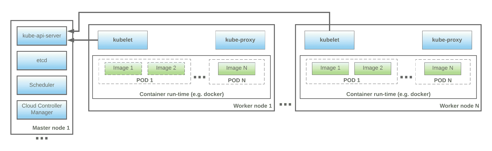
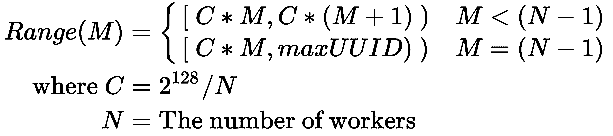
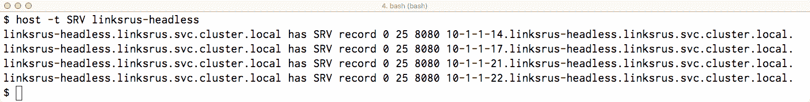
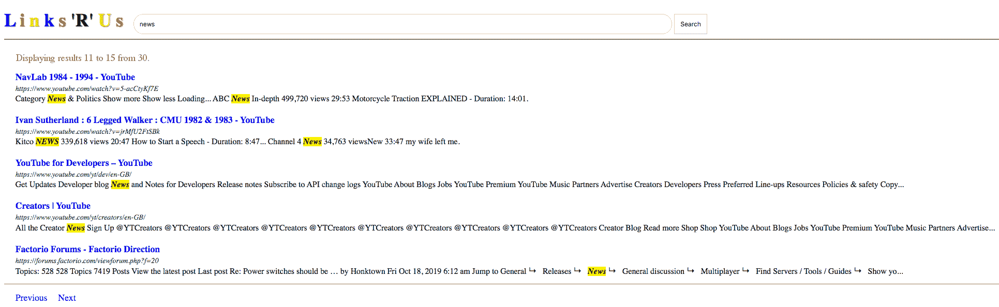
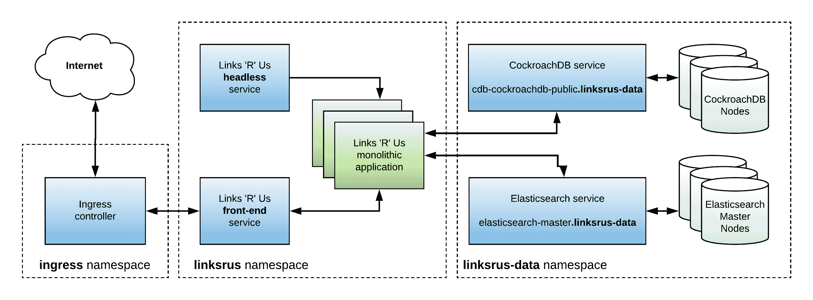
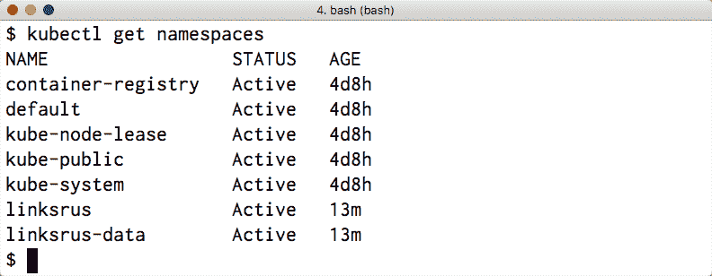
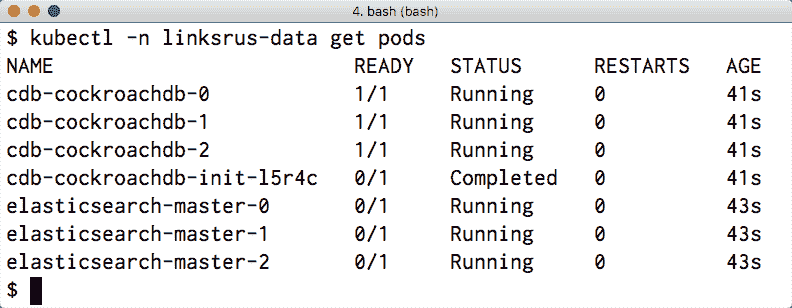
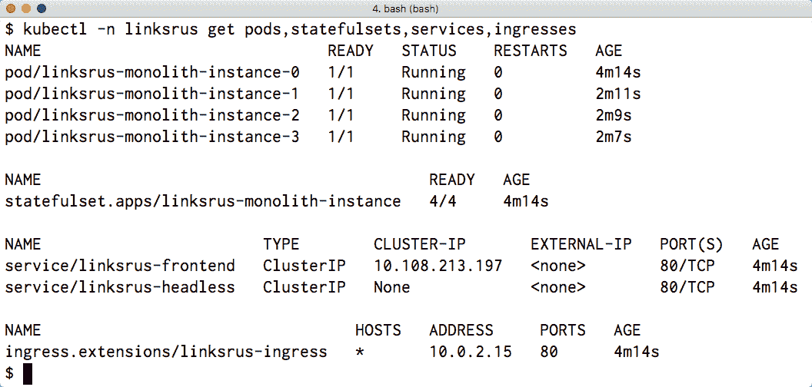

# 第十章：构建、打包和部署软件

"Kubernetes 是分布式系统的 Linux。"

– Kelsey Hightower

本章将指导您完成将 Go 程序 docker 化的步骤，并迭代构建您应用程序可能的最小容器镜像的最佳实践。在此之后，本章将专注于 Kubernetes。

我们将开始对 Kubernetes 的探索之旅，通过比较构成 Kubernetes 集群的节点类型，并更深入地了解构成 Kubernetes 控制平面的各种服务的功能。接下来，我们将描述如何在您的本地开发机器上设置 Kubernetes 集群的逐步指南。本章的最后一部分是对您迄今为止所学内容的实际应用。我们将把之前章节中创建的所有组件集中起来，与一个完全功能的前端连接，并创建一个单一代码库的 Links 'R' Us 版本，然后将其部署到 Kubernetes 上。

本章将涵盖以下主题：

+   使用中间构建容器为您的 Go 应用程序编译静态二进制文件

+   使用正确的链接器标志以确保 Go 可执行文件编译成尽可能小的尺寸

+   构成 Kubernetes 集群的组件的解剖结构

+   Kubernetes 支持的不同类型的资源类型及其应用

+   在您的本地工作站上启动 Kubernetes 集群

+   使用我们在前几章中开发的组件构建 Links 'R' Us 的单一代码库版本，并在 Kubernetes 上部署它

# 技术要求

本章将讨论的主题的完整代码已发布到本书的 GitHub 仓库中的 `Chapter10` 文件夹下。

您可以通过将网络浏览器指向以下 URL 来访问本书的 GitHub 仓库，其中包含本书各章节的代码和所有必需的资源：[`github.com/PacktPublishing/Hands-On-Software-Engineering-with-Golang`](https://github.com/PacktPublishing/Hands-On-Software-Engineering-with-Golang)。

为了让您尽可能快地上手，每个示例项目都包含一个 Makefile，它定义了以下目标集：

| **Makefile 目标** | **描述** |
| --- | --- |
| `deps` | 安装任何必需的依赖项。 |
| `test` | 运行所有测试并报告覆盖率。 |
| `lint` | 检查 lint 错误。 |

与本书中的其他所有章节一样，您需要一个相当新的 Go 版本，您可以在 [`golang.org/dl`](https://golang.org/dl)*.* 下载。

要运行本章中的一些代码，您需要在您的机器上有一个工作的 Docker^([5])安装。此外，一些示例已被设计为可以在 Kubernetes^([8])上运行。如果您没有访问 Kubernetes 集群进行测试，您可以简单地遵循以下章节中概述的说明，在您的笔记本电脑或工作站上设置一个小型集群。

# 使用 Docker 构建和打包 Go 服务

在过去几年中，越来越多的软件工程师开始使用 Docker 等系统来容器化他们的应用程序。容器提供了一个简单且干净的方式来执行应用程序，无需担心底层硬件或操作系统。换句话说，相同的容器镜像可以在您的本地开发机器上运行，在云上的虚拟机上运行，甚至可以在您公司数据中心中的裸机服务器上运行。

# 容器化的好处

除了便携性之外，容器化还提供了从软件工程和 DevOps 角度出发的几个更重要的好处。首先，容器使得部署软件的新版本变得容易，如果出现问题，可以轻松回滚部署。其次，容器化引入了额外的安全层；每个应用程序不仅与其他应用程序完全隔离，而且与底层主机本身也完全隔离。

每当构建一个新的容器镜像（例如，作为持续集成管道的一部分）时，目标应用程序都会打包一个运行所需的全部依赖项的**不可变**副本。因此，当工程师运行特定的容器时，他们可以保证运行与他们其他同事完全相同的二进制文件，而本地编译和运行应用程序可能会产生不同的结果，这取决于开发机器上安装的编译器版本或系统库。

为了更进一步，除了容器化我们的应用程序之外，我们还可以容器化用于构建它们的工具。这使我们能够创建**密封**的构建，并为支持可重复的构建铺平道路，这些好处我们在第三章，*依赖管理*中已经列举过。

当执行密封构建时，生成的二进制工件不受构建机器上安装的任何软件或系统库的影响。相反，构建过程使用固定的编译器和依赖项版本，以确保编译相同的代码库快照（例如，特定的 git SHA）将始终产生相同的、逐位相同的二进制文件。

在下一节中，我们将深入了解为 Go 应用程序构建 Docker 容器的过程，并探讨一系列针对优化容器大小的最佳实践。

# Docker 化 Go 应用程序的最佳实践

Go 语言自带生成独立、静态二进制文件的支持，这使得它成为容器化的理想选择！让我们来看看为您的 Go 应用程序构建 Docker 容器的最佳实践。

由于静态 Go 二进制文件通常相当大，我们必须采取额外措施确保我们构建的容器不包含任何在构建时使用的构建工具（例如，Go 编译器）。除非您使用的是非常旧的 Docker 版本，否则您当前安装的版本很可能支持一个名为 *build containers* 的功能。

构建容器包含编译我们的 Go 应用程序所需的所有工具：Go 编译器和 Go 标准库、git、编译协议缓冲定义的工具等等。我们将使用构建编译器作为一个 *中间* 容器来编译和链接我们的应用程序。然后，我们将创建一个 *新* 容器，将编译的二进制文件复制过来，并丢弃构建容器。

为了了解这个过程是如何工作的，让我们检查构建 Links 'R' Us 应用程序的 Dockerfile，我们将在本章的最后部分构建它。您可以在本书 GitHub 仓库的 `Chapter10/linksrus` 文件夹中找到 Dockerfile：

```go
FROM golang:1.13 AS builder

WORKDIR $GOPATH/src/github.com/PacktPublishing/Hands-On-Software-Engineering-with-Golang
COPY . .
RUN make deps

RUN GIT_SHA=$(git rev-parse --short HEAD) && \
 CGO_ENABLED=0 GOARCH=amd64 GOOS=linux \
 go build -a \
 -ldflags "-extldflags '-static' -w -s -X main.appSha=$GIT_SHA" \
 -o /go/bin/linksrus-monolith \
 github.com/PacktPublishing/Hands-On-Software-Engineering-with-Golang/Chapter10/linksrus
```

第一行指定了我们用作构建容器基础的容器。我们可以在 Dockerfile 中使用 `builder` 别名来引用此容器。前一个 Dockerfile 中的其余命令执行以下操作：

+   应用程序源文件从主机复制到构建容器中。请注意，我们将整个书籍仓库复制到容器中，以确保 `make deps` 命令可以从这本书的仓库中解析所有包导入，而不是尝试从 GitHub 下载它们。

+   `make deps` 命令被调用以获取任何外部包依赖项。

+   最后，调用 Go 编译器来编译应用程序并将生成的二进制文件放置在已知位置（在这种情况下，`/go/bin/linksrus-monolith`）。

让我们放大并解释当执行 `go build` 命令时实际上会发生什么：

+   `GIT_SHA` 环境变量被设置为当前提交的短 git SHA。`-X main.appSha=$GIT_SHA` 链接器标志覆盖了主包中名为 `appSha` 的占位符变量的值。我们将输出 `appSha` 变量的值到应用程序日志中，以便操作员可以通过查看日志的尾部来轻松地确定当前部署的应用程序版本。

+   `CGO_ENABLED=0` 环境变量通知 Go 编译器我们不会从我们的程序中调用任何 C 代码，并允许它从最终二进制文件中优化掉相当多的代码。

+   `-static` 标志指示编译器生成一个静态二进制文件。

+   最后，`-w`和`-s`标志指示 Go 链接器从最终二进制文件中删除调试符号（更具体地说，是 DWARF 部分和符号信息）。这仍然允许你在发生 panic 时获取完整的堆栈跟踪，但防止你将调试器（例如，delve）附加到二进制文件上。从积极的一面来看，这些标志将显著减少最终二进制文件的总大小！

Dockerfile 的下一部分包含构建最终容器的步骤：

```go
FROM alpine:3.10
RUN apk update && apk add ca-certificates && rm -rf /var/cache/apk/*
COPY --from=builder /go/bin/linksrus-monolith /go/bin/linksrus-monolith

ENTRYPOINT ["/go/bin/linksrus-monolith"]
```

由于我们知道 Links 'R' Us 应用程序很可能会建立 TLS 连接，我们需要确保最终的容器镜像包含全球受信任机构的 CA 证书。这是通过安装`ca-certificates`包来实现的。为了完成构建，我们需要将编译的二进制文件从**构建**容器复制到最终容器中。

# 选择适合您应用程序的基础容器

在前面的例子中，我选择使用*Alpine*作为应用程序的基础容器。那么，为什么选择 alpine 而不是更广为人知的，如 Ubuntu？答案是大小！

Alpine Linux^([1])容器是你可以找到的最小的基础容器之一。它包含一个小的 libc 实现（musl）并使用 busybox 作为其 shell。因此，alpine 容器的总大小仅为 5 M，这使得它非常适合托管我们的 Go 静态二进制文件。此外，它还包括自己的包管理器（apk），允许你在构建最终容器时安装额外的包，如 ca-certificates 或网络工具。

如果我们不需要这个额外的功能，那么能否制作出一个更小的应用程序容器呢？答案是肯定的！我们可以使用特殊的**scratch**容器作为我们的基础容器。正如其名所示，scratch 容器实际上是空的...它没有根文件系统，只包含我们的应用程序二进制文件。然而，它也有一些注意事项：

+   它不包含任何 CA 证书，也没有其他方式可以安装它们，除了从中间构建容器复制它们。然而，如果你的应用程序或微服务将仅使用非 TLS 连接与私有子网中的服务通信，这可能不是问题。

+   该容器不包含 shell。这使得实际上无法 SSH 到正在运行的容器进行调试（例如，检查 DNS 解析是否工作或 grep 日志文件）。

我的建议是始终使用像 alpine 或类似的小型容器，而不是使用 scratch 容器。

到目前为止，你应该能够应用我们在前几节中概述的最佳实践，并为你的 Go 应用程序创建空间高效的容器镜像。那么，接下来是什么？下一步当然是部署和扩展你的应用程序。正如你可能猜到的，我们不会手动进行！相反，我们将利用现有的、工业级的解决方案来管理大规模容器：Kubernetes。

# Kubernetes 的温和介绍

Kubernetes^([8])是一个开源平台，用于管理容器化工作负载，它从一开始就考虑了未来的可扩展性。它最初由 Google 在 2014 年发布，包含了他们在运行大规模、生产级应用程序方面的见解和最佳实践。如今，它已经超越了最受欢迎的云提供商的托管容器服务，并正在成为在本地和云中部署应用程序的*事实标准*。

详细描述 Kubernetes 超出了本书的范围。相反，以下章节的目标是为你提供一个 Kubernetes 的简要介绍，并将一些基本概念提炼成易于消化的格式，以便你能够启动一个测试集群并将“链接即服务”项目部署到其中。

# 漏洞探查

好的，我们已经提到 Kubernetes 将承担繁重的工作并为你管理不同类型的容器化工作负载。但是，它内部是如何工作的呢？以下图表展示了构成 Kubernetes 集群的基本组件：



图 1：Kubernetes 集群的高级概述

Kubernetes 集群由两种类型的节点组成：**master 节点**和**worker 节点**。这些可以是物理机或虚拟机。master 节点实现了集群的控制平面，而 worker 节点将它们的资源（CPU、内存、磁盘，甚至是 GPU）集中起来，并执行由 master 分配给它们的工作负载。

每个 master 节点运行以下进程：

+   **kube-api-server**。你可以将其视为一个 API 网关，允许工作节点和集群管理员访问集群的控制平面。

+   **etcd** 实现了一个键值存储，其中持久化了集群的当前状态。它还提供了一个方便的 API，允许客户端监视特定的键或一组键，并在它们的值发生变化时接收通知。

+   **scheduler** 监控集群状态以处理即将到来的工作负载，并确保每个工作负载都被分配给可用的某个工作节点。如果工作负载需求无法由任何工作节点满足，调度器可能会选择将现有工作负载**重新调度**到不同的工作节点，以便为即将到来的工作负载腾出空间。

+   **云控制器管理器**处理与集群宿主云底层的所有必要交互。此类交互的例子包括提供**云特定**服务，如存储或负载均衡器，以及创建或操作诸如路由表和 DNS 记录等资源。

一个生产级别的 Kubernetes 集群通常配置有多个主节点；控制平面管理集群状态，因此它必须**高度可用**。在这种情况下，数据将在主节点之间自动复制，并使用基于 DNS 的负载均衡来访问 kube-api-server 网关。

现在，让我们看看工作节点的内部结构。鉴于 Kubernetes 管理容器，每个工作节点提供合适的容器运行时是一个关键要求。正如你可能猜到的，最常用的运行时是 Docker；然而，Kubernetes 也会高兴地与其他类型的容器运行时接口一起工作，例如 containerd ^([4]) 或 rkt ^([12])。

每个在特定工作节点上安排的工作负载都在其容器运行时中独立执行。在 Kubernetes 中，最小的作业单位被称为**pod**。Pod 包含一个或多个在同一工作实例上执行的容器镜像。虽然单容器 pod 是最常见的，但多容器 pod 也非常有用。例如，我们可以部署一个包含 nginx 和一个侧车容器的 pod，该容器监控外部配置源并在需要时重新生成 nginx 配置。通过创建额外的 pod 实例，可以水平扩展应用程序。

工作节点还运行以下进程：

+   **kubelet**代理连接到主机的**api-server**，并监视分配给其运行的工作节点的作业。它通过在容器意外死亡时自动重启它们来确保所需的容器始终处于运行状态。

+   **kube-proxy**像网络代理一样工作。它维护一组规则，控制内部（集群）或外部流量路由到当前在工作节点上执行的任务的 pod。

# 总结最常用的 Kubernetes 资源类型

运营商通过创建、删除或以类似 CRUD 的接口操纵不同类型的资源来与 Kubernetes 集群交互。让我们简要地看看一些最常用的 Kubernetes 资源类型。

很少会遇到不需要任何配置的应用程序。虽然我们可以在创建我们的 Pod 时直接硬编码配置设置，但这通常被认为是不良的做法，而且坦白说，当我们需要更改共享多个应用程序的配置设置（例如，数据库的端点）时，这会变成一个主要的挫折来源。为了缓解这个问题，Kubernetes 提供了*配置映射*资源。配置映射是一系列键值对的集合，可以注入到 Pod 中作为环境变量，或者以纯文本文件的形式挂载。这种方法允许我们在单个位置管理配置设置，并在创建应用程序的 Pod 时避免硬编码它们。Kubernetes 还提供了**秘密**资源，它的工作方式与配置映射类似，但旨在用于在 Pod 之间共享敏感信息，如证书密钥和服务凭证。

**命名空间**资源作为一个虚拟容器，用于逻辑上分组其他 Kubernetes 资源并控制对它们的访问。如果多个团队使用同一个集群进行部署，这是一个非常实用的功能。在这种情况下，每个团队通常被分配对其自己的命名空间的完全访问权限，这样他们就不能干扰其他团队部署的资源，除非他们被授予明确的访问权限。

一旦 Pod 死亡，其任何容器中存储的数据都将丢失。为了支持我们希望在 Pod 重启之间持久化数据或我们希望在多个 Pod 实例之间共享相同数据集（例如，由 Web 服务器提供的页面）的使用案例，Kubernetes 提供了**持久卷**（**PV**）和**持久卷声明**（**PVC**）资源。持久卷不过是一块可供集群使用的块存储。根据底层基础结构，它可以是集群管理员手动配置的，也可以是由底层基础结构按需动态分配的（例如，在 AWS 上运行时，可以是 EBS 卷）。另一方面，持久卷声明代表操作员对具有特定属性（例如，大小、IOPS 和旋转磁盘或 SSD）的存储块的需求。Kubernetes 控制平面试图将可用的卷与操作员指定的声明相匹配，并将卷挂载到引用每个声明的 Pod 上。

要在 Kubernetes 上部署无状态应用程序，推荐的方法是创建一个 **deployment** 资源。deployment 资源指定了一个用于实例化应用程序单个 Pod 的模板和所需的副本数量。Kubernetes 持续监控每个 deployment 的状态，并通过创建新的 Pod（使用模板）或删除超出请求副本数量的现有 Pod 来尝试将集群状态与所需状态同步。在 deployment 中的每个 Pod 都会被 Kubernetes 分配一个随机主机名，并且与每个其他 Pod 共享 *相同的 PVC*。

许多类型的工作负载，如数据库或消息队列，需要一种有状态的部署方式，其中 Pod 被分配稳定且可预测的主机名，并且每个单独的 Pod 都有自己的 PVC。更重要的是，这些应用程序通常以集群配置运行，并期望节点以特定的顺序部署、升级和扩展。在 Kubernetes 中，这种类型的部署是通过创建一个 **StatefulSet** 来实现的。类似于 deployment 资源，StatefulSet 也定义了一个 Pod 模板和副本数量。每个副本都会被分配一个主机名，该主机名是通过连接 StatefulSet 的名称和集合中每个 Pod 的索引来构建的（例如，web-0 和 web-1）。

能够根据需要上下调整已部署 Pod 的数量是一个很好的特性，但如果没有其他集群资源能够连接到它们，那么这个特性就不是很实用！为此，Kubernetes 支持另一种类型的资源，称为 **服务**。服务有两种类型：

+   一个服务可以位于一组 Pod 的前面，充当一个 **负载均衡器**。在这种情况下，该服务会自动分配一个 IP 地址和 DNS 记录，以帮助客户端发现它。如果你在疑惑，这种功能是通过在每个工作节点上运行的 **kube-proxy** 组件实现的。

+   一个 **无头服务**允许你实现自定义的服务发现机制。这些服务不会被分配集群 IP 地址，并且完全被 kube-proxy 忽略。然而，这些服务为服务创建 DNS 记录，并解析到服务背后每个 Pod 的地址。

我们将要检查的最后一个 Kubernetes 资源是 **ingress**。根据其配置，ingress 会公开 HTTP 或 HTTPS 端点，用于将集群外部的流量路由到集群内部特定的服务。大多数 ingress 控制器实现支持的常见功能包括 TLS 终止、基于名称的虚拟主机和入站请求的 URL 重写。

这就结束了我们对最常见的 Kubernetes 资源类型的概述。请记住，这仅仅是冰山一角！Kubernetes 支持许多其他资源类型（例如，cron 作业），甚至提供了允许操作员定义他们自己的自定义资源的 API。如果您想了解更多关于 Kubernetes 资源的信息，我强烈建议您浏览在线上可用的相当广泛的 Kubernetes 文档集 [8]。

接下来，您将学习如何轻松地在您的笔记本电脑或工作站上设置自己的 Kubernetes 集群。

# 在您的笔记本电脑上运行 Kubernetes 集群！

几年前，对 Kubernetes 的实验基本上仅限于那些被授予访问测试或开发集群权限的工程师，或者他们拥有在云上启动和运行自己集群所需资源和知识。如今，事情要简单得多... 事实上，您甚至可以在几分钟内就在您的笔记本电脑上启动一个完全可操作的 Kubernetes 集群！

让我们来看看一些最流行的、对开发者友好的 Kubernetes 发行版，您可以在您的开发机器上部署它们：

+   K3S [7] 是一个微型（实际上是一个 50 M 的二进制文件！）发行版，允许您在资源受限的设备上运行 Kubernetes。它为多个架构提供了二进制文件，包括 ARM64/ARMv7。这使得它成为在 Raspberry Pi 上运行 Kubernetes 的理想选择。

+   Microk8s [9] 是 Canonical 的一个项目，承诺零操作 Kubernetes 集群设置。在 Linux 上将 Kubernetes 集群启动并运行就像运行 `snap install microk8s` 一样简单。在其他平台上，安装 microk8s 的推荐方法是使用 Multipass [11] 这样的应用程序启动一个虚拟机，并在其中运行上述命令。

+   Minikube [10] 是另一个发行版，这次是由 Kubernetes 作者提供的。它可以与不同类型的虚拟机管理程序一起工作（例如，VirtualBox、Hyperkit、Parallels、VMware Fusion 或 Hyper-V），甚至可以在裸金属（仅限 Linux）上部署。

为了尽可能简化您在您喜欢的操作系统上设置自己的 Kubernetes 集群并运行即将在下一节中展示的示例，我们将仅使用 Minikube，并使用 VirtualBox 作为我们的虚拟机管理程序。

在我们开始之前，请确保您已下载并安装以下软件：

+   Docker [5]。

+   VirtualBox [13]。

+   您平台上的 kubectl 二进制文件。

+   您平台上的 Helm [6] 二进制文件。Helm 是 Kubernetes 的包管理器，我们将使用它来部署 Links 'R' Us 项目的 CockroachDB 和 Elasticsearch 实例。

+   您平台上的最新 Minikube 版本。

在所有前置依赖都准备就绪的情况下，我们可以使用以下代码启动我们的 Kubernetes 集群：

```go
minikube start --kubernetes-version=v1.15.3 \
               --memory=4g \
               --network-plugin=cni
```

这个命令将在一个拥有 4 GB 内存的虚拟机上创建 Kubernetes 1.15.3，并部署到该虚拟机上。它还将更新本地 kubectl 配置，以便自动连接到我们刚刚配置的集群。更重要的是，它将为集群启用 **容器网络接口**（**CNI**）插件。在下一章中，我们将利用这一功能安装像 Calico ^([2]) 或 Cilium ^([3]) 这样的网络安全解决方案，并定义细粒度的网络策略来锁定我们的集群。

由于我们部署的服务将运行在 Minikube 的虚拟机中，从 **主机** 访问它们的唯一方法是通过配置一个 ingress 资源。幸运的是，Minikube 提供了一个合适的 ingress 实现作为插件，我们可以通过运行 `minikube addons enable ingress` 来激活它。更重要的是，为了我们的测试，我们希望使用一个私有 Docker 仓库来推送我们将构建的 Docker 镜像。Minikube 随带一个私有仓库插件，我们可以通过运行 `minikube addons enable registry` 来启用它。

然而，默认情况下，Minikube 的私有仓库以不安全模式运行。当使用不安全仓库时，我们需要明确配置我们的本地 Docker 守护进程以允许连接到它们；否则，我们无法推送我们的镜像。该仓库在 Minikube 使用的 IP 地址上暴露在端口 `5000`。

您可以通过运行 `minikube ip` 来找到 Minikube 的 IP 地址。

在 Linux 上，您可以编辑 `/etc/docker/daemon.json`，合并以下 JSON 块（将 `$MINIKUBE_IP` 替换为使用 `minikube ip` 命令获得的 IP），然后按照以下方式重启 Docker 守护进程：

```go
{
 "insecure-registries" : [
 "$MINIKUBE_IP:5000"
 ]
}
```

在 OS X 和 Windows 上，您只需在 Docker for desktop 上右键单击，选择首选项，然后点击“守护进程”选项卡，即可访问受信任的不安全仓库列表。

我们需要做的最后一件事是安装所需的集群资源，以便我们可以使用 Helm 包管理器。我们可以通过运行 `helm init` 来完成这项任务。

为了节省您的时间，我已经将所有前面的步骤编码到一个 Makefile 中，您可以在本书 GitHub 仓库的 `Chapter10/k8s` 文件夹中找到它。

要启动集群，安装所有必需的插件，并配置 Helm，你只需输入 `make bootstrap-minikube`。

就这么简单！我们现在已经拥有了一个完全可用的 Kubernetes 集群。现在，我们准备构建和部署 Links 'R' Us 项目的单体版本。

# 构建 和部署 Links 'R' Us 的单体版本

这是检验的时刻！在接下来的章节中，我们将利用本章学到的所有知识，将我们在前几章中开发的 Links 'R' Us 组件组装成一个单体应用程序，然后我们将继续在 Kubernetes 上部署它。

根据 第五章 中 *Links 'R' Us 项目* 的用户故事，为了使我们的应用程序满足我们的设计目标，它应该提供以下服务：

+   一个定期运行的多遍爬虫，用于扫描链接图，检索索引链接，并在未来的遍历中增加新发现的链接以进行爬取

+   另一个定期运行的服务，用于重新计算并持久化不断扩展的链接图的 PageRank 分数

+   为我们的最终用户提供前端，以便执行搜索查询并提交网站 URL 以进行索引

到目前为止，我们还没有真正讨论前端。别担心；我们将在接下来的某个部分为我们的应用程序构建一个完整的前端。

如你可能猜到的，由于涉及的组件数量，最终的应用程序无疑将包含相当多的样板代码。鉴于在本章中不可能包含完整的源代码，我们只会关注最有趣的部分。尽管如此，你可以在本书 GitHub 仓库的 `Chapter10/linksrus` 文件夹中找到整个应用程序的文档化源代码。

# 在应用程序实例之间分配计算

预计 Links 'R' Us 项目一夜之间取得成功并吸引大量流量，尤其是在在 Hacker News 和 Slashdot 等网站上发布链接之后，我们需要制定一个合理的扩展计划。尽管我们目前正在处理一个单体应用程序，但我们总是可以通过启动额外的实例来水平扩展。此外，随着我们的链接图规模的增长，我们无疑需要为我们的网络爬虫和 PageRank 计算器提供额外的计算资源。

使用像 Kubernetes 这样的容器编排平台的一个关键好处是我们可以轻松地扩展（或缩减）任何已部署的应用程序。正如我们在本章开头所看到的，连接到 `Ingress` 的 `Service` 资源可以充当负载均衡器，并将 *传入* 流量分配给我们的应用程序。这透明地处理了我们的前端扩展问题，而无需我们进行额外的开发工作。

另一方面，确保 *每个* 应用程序实例爬取图的具体 *子集* 并不简单，因为这需要应用程序实例之间进行协调。这意味着我们需要在各个实例之间建立一个通信通道。或者，这是否意味着我们不需要这样做？

# 将 UUID 空间划分为不重叠的分区

在 第六章 中，我们提到了 *构建持久层*，我们提到，由链接图组件公开的 `Links` 和 `Edges` 方法的调用者负责实现一个合适的分区方案，并将适当的 UUID 范围作为参数提供给这些方法。那么，我们该如何实现这样的分区方案呢？

我们的方法利用了观察到的链接（和边）ID 实际上是 V4（随机）UUID，并且因此预计在庞大的（2¹²⁸）UUID 空间中分布得或多或少均匀。让我们假设我们可用的总工作器数量（即分区数量）是*N*。目前，我们将工作器数量视为固定且已知优先级。在下一节中，我们将学习如何利用 Kubernetes 基础设施自动发现这些信息。

为了确定*M[th]*（其中 0 <= M < N）工作器需要提供给图`Links`和`Edges`方法的 UUID 范围，我们需要进行一些计算。首先，我们需要将 128 位 UUID 空间细分为*N*个大小相等的部分；本质上，每个部分将包含*C = 2¹²⁸ / N*个 UUID。因此，为了计算*M[th]*工作器的 UUID 范围，我们可以使用以下公式：



如果工作器数量（*N*）是*奇数*，那么我们将无法均匀地分割 UUID 空间；因此，**最后**的(N-1)部分将以特殊方式处理：它始终扩展到 UUID 空间的**末尾**（UUID 值`ffffffff-ffff-ffff-ffff-ffffffffffff`）。这确保了我们始终覆盖整个 UUID 空间，无论*N*是奇数还是偶数！

这种分割方式的理由如下：

+   大多数现代数据库系统倾向于在内存中缓存主键索引

+   它们包含用于在主键范围内执行*范围扫描*的特殊优化代码路径

前两个特性的组合使得这种解决方案对于爬虫和 PageRank 计算组件执行的读密集型工作负载非常有吸引力。一个小麻烦是 UUID 是 128 位值，Go 没有提供用于执行 128 位算术的标量类型。幸运的是，标准库提供了`math/big`包，它可以执行任意精度的算术运算！

让我们继续创建一个辅助函数，它将为我们处理所有这些计算。`Range`辅助函数的实现将位于一个名为`range.go`的文件中，它是`Chapter10/linksrus/partition`包的一部分（参见本书的 GitHub 仓库）。其类型定义如下：

```go
type Range struct {
 start       uuid.UUID
 rangeSplits []uuid.UUID
}
```

对于我们的特定应用，我们将提供两个构造函数来创建范围。第一个构造函数创建一个覆盖整个 UUID 空间的`Range`，并将其分割成`numPartitions`：

```go
func NewFullRange(numPartitions int) (Range, error) {
 return NewRange(
 uuid.Nil,
 uuid.MustParse("ffffffff-ffff-ffff-ffff-ffffffffffff"),
 numPartitions,
 )
}
```

如您所见，构造函数将范围的创建委托给`NewRange`辅助函数，其实现已被分解成更小的片段：

```go
if bytes.Compare(start[:], end[:]) >= 0 {
 return Range{}, xerrors.Errorf("range start UUID must be less than the end UUID")
} else if numPartitions <= 0 {
 return Range{}, xerrors.Errorf("number of partitions must be at least equal to 1")
}

// Calculate the size of each partition as: ((end - start + 1) / numPartitions)
tokenRange := big.NewInt(0)
partSize := big.NewInt(0)
partSize = partSize.Sub(big.NewInt(0).SetBytes(end[:]), big.NewInt(0).SetBytes(start[:]))
partSize = partSize.Div(partSize.Add(partSize, big.NewInt(1)), big.NewInt(int64(numPartitions)))
```

在继续之前，代码会验证提供的 UUID 范围是否有效，确保起始 UUID 小于结束 UUID。为此，我们使用方便的`bytes.Compare`函数，该函数比较两个字节切片，如果两个字节切片相等或第一个字节切片大于第二个字节切片，则返回大于或等于零的值。这里的一个注意事项是，UUID 类型定义为`[16]byte`，而`bytes.Compare`函数期望字节切片。然而，我们可以通过使用便利操作符`[:]`轻松地将每个 UUID 转换为字节切片。

在初步的参数验证之后，我们创建一个空的`big.Integer`值，并使用`math/big`包的繁琐 API 通过`(end - start) + 1`表达式加载结果。一旦值被加载，我们就将其除以调用者作为函数参数提供的分区数量。这得到了我们在上一节中看到的公式中的`C`值。

以下代码块使用一个`for`循环来计算并存储我们正在创建的范围内每个分区所对应的**结束**UUID：

```go
var to uuid.UUID
var err error
var ranges = make([]uuid.UUID, numPartitions)
for partition := 0; partition < numPartitions; partition++ {
 if partition == numPartitions-1 {
 to = end
 } else {
 tokenRange.Mul(partSize, big.NewInt(int64(partition+1)))
 if to, err = uuid.FromBytes(tokenRange.Bytes()); err != nil {
 return nil, xerrors.Errorf("partition range: %w", err)
 }
 }
 ranges[partition] = to
}
return &Range{start: start, rangeSplits: ranges}, nil
```

正如我们在上一节中提到的，最后一个分区的结束 UUID 总是最大的可能 UUID 值。对于所有其他分区，我们通过将每个分区的尺寸乘以分区号再加一来计算结束值。一旦所有计算完成，就为调用者分配并返回一个新的`Range`对象。除了计算出的结束范围之外，我们还跟踪范围的起始 UUID。

现在，为了使`Range`类型更容易在爬虫服务代码中使用，让我们定义两个辅助方法：

```go
func (r *Range) Extents() (uuid.UUID, uuid.UUID) {
 return r.start, r.rangeSplits[len(r.rangeSplits)-1]
}

func (r *Range) PartitionExtents(partition int) (uuid.UUID, uuid.UUID, error) {
 if partition < 0 || partition >= len(r.rangeSplits) {
 return uuid.Nil, uuid.Nil, xerrors.Errorf("invalid partition index")
 }
 if partition == 0 {
 return r.start, r.rangeSplits[0], nil
 }
 return r.rangeSplits[partition-1], r.rangeSplits[partition], nil
}
```

`Extends`方法返回整个范围的起始（包含）和结束（排除）UUID 值。另一方面，`PartitionExtents`函数返回范围内特定**分区**的起始和结束 UUID 值。

# 为每个 Pod 分配分区范围

在上一节中介绍的`Range`类型帮助下，我们现在有了查询分配给每个单独分区的 UUID 范围的方法。对于我们的特定用例，分区的数量等于我们启动的 Pod 数量。然而，我们缺少的一个重要信息是分配给每个已启动 Pod 的分区号！因此，我们现在有两个问题需要解决：

+   单个 Pod 的分区号是多少？

+   总共有多少个 Pod？

如果我们将我们的应用程序作为具有*N*个副本的 StatefulSet 部署，该集中每个 Pod 都会被分配一个遵循模式`SET_NAME-INDEX`的主机名，其中`INDEX`是从*0*到*N-1*的数字，表示 Pod 在集中的索引。我们只需要从我们的应用程序中读取 Pod 的主机名，解析数字后缀，并将其用作分区号。

回答第二个问题的方法之一是查询 Kubernetes 服务器 API。然而，这需要额外的努力来设置（例如，创建服务帐户、RBAC 记录）——更不用说这实际上将我们锁定在 Kubernetes 上了！幸运的是，有一个更简单的方法...

如果我们要为我们的应用程序创建一个**无头**服务，它将自动生成一组 SRV 记录，我们可以查询并获取属于该服务的每个单独 Pod 的主机。以下图显示了在 Kubernetes 集群中的一个 Pod 内部运行 SRV 查询的结果：



图 2：`linksrus-headless`服务与四个 Pod 相关联，其主机名在右侧可见

根据前面截图显示的信息，我们可以编写一个辅助程序来找出运行应用程序实例的分区数和总分区数，如下所示：

```go
func (det FromSRVRecords) PartitionInfo() (int, int, error) {
 hostname, err := os.Hostname()
 if err != nil {
 return -1, -1, xerrors.Errorf("partition detector: unable to detect host name: %w", err)
 }
 tokens := strings.Split(hostname, "-")
 partition, err := strconv.ParseInt(tokens[len(tokens)-1], 10, 32)
 if err != nil {
 return -1, -1, xerrors.Errorf("partition detector: unable to extract partition number from host name suffix")
 }
 _, addrs, err := net.LookupSRV("", "", det.srvName)
 if err != nil {
 return -1, -1, ErrNoPartitionDataAvailableYet
 }
 return int(partition), len(addrs), nil
}
```

要获取主机名，我们调用由`os`包提供的`Hostname`函数。然后，我们在破折号分隔符上分割，提取主机名的最右边部分，并使用`ParseInt`将其转换为数字。

接下来，为了获取 SRV 记录，我们使用`net`包中的`LookupSRV`函数，并将服务名作为最后一个参数传递。然后，我们计算结果的数量以确定集合中的总 Pod 数量。需要注意的一个重要事项是，SRV 记录的创建不是瞬时的！当 StatefulSet 最初部署时，SRV 记录变得可用需要一些时间。为此，如果 SRV 查找没有返回任何结果，代码将返回一个类型错误，让调用者知道他们应该稍后再试。

# 为应用程序服务构建包装器

到目前为止，我们故意设计了各种 Link 'R' Us 组件，使它们与其输入源或多或少解耦。例如，来自第七章，*数据处理管道*的爬虫组件期望一个迭代器，该迭代器产生要爬取的链接集合，而来自第八章，*基于图的数据处理*的 PageRank 计算器组件只为创建 PageRank 算法使用的图节点和边提供便利方法。

要将这些组件集成到更大的应用程序中，我们需要提供一个薄层来实现两个关键功能：

+   它通过一个合适的链接图将每个组件与来自第六章，*构建持久层*的文本索引器数据存储实现连接起来

+   它管理每个组件的**刷新周期**（例如，触发新的爬虫遍历或重新计算 PageRank 分数）

每个服务都将从“链接‘R’我们”应用程序的主包中启动，并独立于其他服务执行。如果任何服务由于错误而退出，我们希望我们的应用程序能够干净地关闭，记录错误，并以适当的退出状态码退出。这需要引入一个管理每个服务执行的监督机制。在我们到达那里之前，让我们首先定义一个接口，我们的应用程序中的每个服务都需要实现：

```go
type Service interface {
 Name() string
 Run(context.Context) error
}
```

这并不令人惊讶... `Name` 方法返回服务的名称，我们可以用它来记录日志。正如你可能猜到的，`Run` 方法实现了服务的业务逻辑。对 `Run` 的调用预期会阻塞，直到提供的上下文过期或发生错误。

# 爬虫服务

爬虫服务的业务逻辑相当简单。服务使用计时器休眠，直到下一个更新间隔到期，然后执行以下步骤：

1.  首先，它查询关于分区分配的最新信息。这包括 pod 的分区号和分区总数（pod 计数）。

1.  使用上一步骤中的分区计数信息，创建一个新的完整`Range`，并计算当前分配的分区号的范围（UUID 范围）。

1.  最后，该服务获取了计算出的 UUID 范围的链接迭代器，并将其用作数据源来驱动我们在第七章，“数据处理管道”中构建的爬虫组件。

服务构造函数期望一个配置对象，它不仅包括所需的配置选项，还包括服务所依赖的一组接口。这种方法允许我们通过注入满足这些接口的模拟对象来完全隔离地测试服务。以下是爬虫服务的`Config`类型：

```go
type Config struct {
 GraphAPI GraphAPI
 IndexAPI IndexAPI
 PrivateNetworkDetector crawler_pipeline.PrivateNetworkDetector
 URLGetter crawler_pipeline.URLGetter
 PartitionDetector partition.Detector
 Clock clock.Clock

 Fand so onhWorkers int
 UpdateInterval time.Duration
 ReIndexThreshold time.Duration
 Logger *logrus.Entry
}
```

你可能想知道为什么我选择在这个包内重新定义`GraphAPI`和`IndexAPI`接口，而不是简单地导入并使用来自`graph`或`index`包的原始接口。这实际上是对接口分离原则的应用！原始接口包含比我们实际需要的更多方法。例如，以下是为访问链接图和索引文档而需要的爬虫所需的方法集：

```go
type GraphAPI interface {
 UpsertLink(link *graph.Link) error
 UpsertEdge(edge *graph.Edge) error
 RemoveStaleEdges(fromID uuid.UUID, updatedBefore time.Time) error
 Links(fromID, toID uuid.UUID, retrievedBefore time.Time) (graph.LinkIterator, error)
}

type IndexAPI interface {
 Index(doc *index.Document) error
}
```

使用尽可能小的图和索引 API 接口定义的一个非常实用的副作用是，这些最小接口也恰好与我们在上一章中创建的 gRPC 客户端兼容。我们将在下一章利用这一观察结果，以便将我们的单体应用程序拆分为微服务！现在，让我们看看其他配置字段：

+   `PartitionDetector`将由服务查询以获取其分区信息。当在 Kubernetes 上运行时，检测器将使用上一节中的代码来发现可用的分区。或者，可以注入一个总是报告单个分区的分区检测器，以便我们可以在我们的开发机器上以独立二进制文件的形式运行应用程序。

+   `Clock`允许我们在测试中注入一个假的时钟实例。正如我们在第四章，*测试的艺术*中所做的那样，我们将使用`juju/clock`包来模拟测试中的时间相关操作。

+   `Fand so onhWorkers`控制爬虫组件用于检索链接的工作线程数量。

+   `UpdateInterval`指定爬虫应该多久执行一次新的遍历。

+   `ReIndexThreshold`在下一轮爬虫遍历中选择要爬取的链接集合时用作过滤器。当链接的*最后检索时间*比`time.Now() - ReIndexThreshold`更早时，将考虑该链接进行爬取。

+   `Logger`指定用于日志消息的可选日志实例。我们将在下一章中更多地讨论结构化日志。

# PageRank 计算器服务

与爬虫服务类似，PageRank 服务也会定期唤醒以重新计算图中每个链接的 PageRank 分数。在底层，它使用我们在第八章，*基于图的数据处理*中构建的 PageRank 计算器组件来执行完整的 PageRank 算法遍历。服务层负责填充计算器组件使用的内部图表示，调用它来计算更新的 PageRank 分数，并更新每个索引文档的 PageRank 分数。

服务构造函数还接受一个类似这样的`Config`对象：

```go
type Config struct {
 GraphAPI GraphAPI
 IndexAPI IndexAPI
 PartitionDetector partition.Detector
 Clock clock.Clock

 ComputeWorkers int
 UpdateInterval time.Duration
 Logger *logrus.Entry
}
```

`pagerank`服务包定义了自己的`GraphAPI`和`IndexAPI`类型版本。如下面的代码所示，这些接口的方法列表与我们之前在爬虫服务中使用的不同：

```go
type GraphAPI interface {
 Links(fromID, toID uuid.UUID, retrievedBefore time.Time) (graph.LinkIterator, error)
 Edges(fromID, toID uuid.UUID, updatedBefore time.Time) (graph.EdgeIterator, error)
}

type IndexAPI interface {
 UpdateScore(linkID uuid.UUID, score float64) error
}
```

`ComputeWorkers`参数传递给 PageRank 计算器组件，并控制用于执行 PageRank 算法的工作线程数量。另一方面，`UpdateInterval`参数控制分数刷新频率。

不幸的是，目前无法以分区模式运行 PageRank 服务。正如我们在第八章图基于数据处理中看到的，计算器实现是在以下假设下进行的：图中的每个节点都可以向图中的**每个**其他节点发送消息，并且所有顶点都可以访问共享的全局状态（聚合器）。目前，我们将使用检测到的分区信息作为约束，在**单个**Pod 上执行服务（更具体地说，分配给分区 0 的那个）。不过，不用担心！在第十二章构建分布式图处理系统中，我们将重新审视这个实现并纠正所有上述问题。

# 为用户提供一个完全功能的用户界面

当然，我们的这个小项目如果没有为用户提供适当的用户界面是无法完成的！为了构建一个，我们将利用 Go 标准库对 HTML 模板的支持（`text/template`和`html/template`包）来为 Links 'R' Us 设计一个完全功能的静态网站。为了简单起见，所有的 HTML 模板都将作为字符串嵌入到我们的应用程序中，并在应用程序启动时解析为`text.Template`。在功能方面，我们的前端必须实现许多功能。

首先，它必须实现一个索引/着陆页，用户可以在其中输入搜索查询。查询可以是基于关键字或短语的。索引页面还应包括一个链接，可以导航用户到另一个页面，他们可以在那里提交网站进行索引。以下截图显示了索引页面模板的渲染：


图 3：Links 'R' Us 的着陆页

接下来，我们需要一个页面，网站管理员可以手动提交他们的网站进行索引。正如我们之前提到的，索引/着陆页将包括一个链接到网站提交页面。以下截图显示了索引网站提交页面的渲染效果：


图 4：手动提交网站进行索引的表单

我们整个应用程序中最后，并且显然是最重要的页面是搜索结果页面。如图所示，结果页面显示与用户搜索查询匹配的网站的分页列表。页面标题包括一个搜索文本框，显示当前搜索的术语，并允许用户在不离开页面的情况下更改搜索术语：



图 5：搜索结果分页列表

生成单个搜索结果块模板的模板，如前一个截图所示，包括三个部分：

+   一个指向网页的链接。链接文本将显示匹配页面的标题或页面本身的链接，具体取决于爬虫是否能够提取其标题。

+   以较小字体显示匹配网页的 URL。

+   包含突出显示匹配关键词的页面内容摘要。

现在我们已经为渲染构成 Links 'R' Us 前端页面的所有必要模板定义了所有必要的模板，我们需要注册一系列 HTTP 路由，以便我们的最终用户可以访问我们的服务。

# 指定前端应用的端点

以下表格列出了我们前端服务需要处理的 HTTP 请求类型和端点，以便实现我们之前描述的所有功能：

| **请求类型** | **路径** | **描述** |
| --- | --- | --- |
| GET | `/` | 显示索引页面 |
| GET | `/search?q=TERM` | 显示 TERM 的第一页结果 |
| GET | `/search?q=TERM&offset=X` | 显示从特定偏移量开始的 TERM 的结果 |
| GET | `/submit/site` | 显示网站提交表单 |
| POST | `/submit/site` | 处理网站提交 |
| ANY | 任何其他路径 | 显示 404 页面 |

为了让我们的工作更简单，我们将使用 `gorilla/mux` 作为首选的路由器。创建路由器并注册端点处理程序就像使用以下代码一样简单：

```go
svc := &Service{
 router: mux.NewRouter(),
 cfg:    cfg,
}

svc.router.HandleFunc(indexEndpoint, svc.renderIndexPage).Methods("GET")
svc.router.HandleFunc(searchEndpoint, svc.renderSearchResults).Methods("GET")
svc.router.HandleFunc(submitLinkEndpoint, svc.submitLink).Methods("GET", "POST")
svc.router.NotFoundHandler = http.HandlerFunc(svc.render404Page)
```

为了使前端服务更容易测试，`Service` 类型存储了对路由器的引用。这样，我们可以使用 `httptest` 包的原始程序直接在 mux 上执行 HTTP 请求，而无需启动任何服务器。

# 执行搜索和分页结果

搜索和分页结果对于前端服务来说基本上是一个直接的任务。我们服务需要做的只是解析搜索词、请求查询字符串中的偏移量，并调用在服务实例化时作为配置选项传递的文本索引存储库的 `Query` 方法。

然后，服务消费结果迭代器，直到它已经处理了足够的结果以填充结果页面或迭代器达到结果集的末尾。考虑以下代码：

```go
for resCount := 0; resultIt.Next() && resCount < svc.cfg.ResultsPerPage; resCount++ {
 doc := resultIt.Document()
 matchedDocs = append(matchedDocs, matchedDoc{
 doc: doc,
 summary: highlighter.Highlight(
 template.HTMLEscapeString(
 summarizer.MatchSummary(doc.Content),
 ),
 ),
 })
}
```

服务为每个结果创建了一个装饰模型，该模型提供了一些方便的方法，这些方法将由模板内的 Go 代码块调用。此外，`matchedDoc` 类型包含一个 `summary` 字段，其中包含匹配页面内容的简短摘录，并突出显示搜索词。

为了在文本摘要中突出显示搜索词，关键词突出显示器将每个术语包裹在一个`<em>`标签中。然而，这种方法要求结果页面模板以**原始 HTML**格式渲染摘要。因此，我们必须非常小心，不要允许我们的结果摘要中包含任何其他 HTML 标签，因为这会使我们的应用程序容易受到**跨站脚本**（**XSS**）攻击。虽然爬虫组件从爬取的页面中删除了所有 HTML 标签，但在将生成的摘要传递给关键词突出显示器之前，逃避任何 HTML 字符也不无裨益。

为了能够渲染导航标题和页脚，我们需要向页面模板提供有关当前分页状态的信息。以下代码显示了如何用所需的片段信息填充`paginationDetails`类型：

```go
pagination := &paginationDetails{
 From:  int(offset + 1),
 To:    int(offset) + len(matchedDocs),
 Total: int(resultIt.TotalCount()),
}
if offset > 0 {
 pagination.PrevLink = fmt.Sprintf("%s?q=%s", searchEndpoint, searchTerms)
 if prevOffset := int(offset) - svc.cfg.ResultsPerPage; prevOffset > 0 {
 pagination.PrevLink += fmt.Sprintf("&offset=%d", prevOffset)
 }
}
if nextPageOffset := int(offset) + len(matchedDocs); nextPageOffset < pagination.Total {
 pagination.NextLink = fmt.Sprintf("%s?q=%s&offset=%d", searchEndpoint, searchTerms, nextPageOffset)
}
```

当当前结果偏移量大于 0 时，将始终渲染一个**上一个**结果页面链接。除非我们正在返回到**第一个**结果页面，否则链接将始终包含一个偏移量参数。同样，只要我们没有达到结果集的末尾，就会渲染**下一个**结果页面链接。

# 生成搜索结果的令人信服的摘要

生成一个描述性的简短摘要，向用户传达足够的信息，关于匹配他们查询的网页内容，这是一个相当难以解决的问题。事实上，自动摘要自然语言处理和机器学习的一个活跃的研究领域。

建立这样的系统可能超出了本书的范围。相反，我们将实现一个更简单的算法，该算法生成的摘要应该是足够好的，适用于我们的特定用例。以下是算法步骤的概述：

1.  将匹配页面的内容拆分成句子。

1.  对于每个句子，计算匹配关键词与总词数的比例。这将作为我们选择和优先考虑要包含在摘要中的句子集的质量指标。

1.  跳过任何匹配率为零的句子；也就是说，它们不包含任何搜索关键词。这些句子对我们摘要的实际用途并没有真正的作用。

1.  将剩余的句子添加到一个列表中，其中每个条目都是一个包含`{序号，文本，匹配率}`的元组。序号值指的是句子在文本中的位置。

1.  按照匹配率**降序**对列表进行排序。

1.  初始化一个用于摘要的句子片段的第二个列表和一个变量，用于跟踪摘要中剩余的字符数。

1.  遍历排序后的列表；对于每个条目，执行以下操作：如果其长度小于剩余的摘要字符数，则将条目原样追加到第二个列表中，并从剩余字符变量中减去其长度。如果其长度大于剩余的摘要字符数，则截断句子文本到剩余的摘要字符数，将其追加到第二个列表中，并**终止**迭代。

1.  按照升序顺序对摘要片段列表进行排序。这确保了句子片段以与文本相同的顺序出现。

1.  按照以下方式遍历排序后的片段列表并连接条目：

    +   如果当前句子的序号比上一句的序号多一个，它们应该用单个句号连接，就像它们在原始文本中连接在一起一样。

    +   否则，句子应该用省略号连接，因为它们属于文本的不同部分。

上述算法的完整 Go 实现太长，无法在此列出，但如果您感兴趣，可以通过访问本书的 GitHub 仓库并浏览`Chapter10/linksrus/service/frontend`文件夹下的`summarizer.go`文件来查看它。

# 突出显示搜索关键词

一旦我们为匹配的文档生成了摘要，我们需要识别并突出显示其中存在的所有搜索关键词。为此任务，我们将创建一个名为`matchHighlighter`的辅助类型，它构建一组正则表达式以匹配每个搜索关键词，并用一个特殊的 HTML 标签将其包裹起来，我们的前端模板使用突出显示样式渲染。

前端通过调用`newMatchHighlighter`函数创建一个用于整个结果集的单一`matchHighlighter`实例，该函数在以下代码中列出：

```go
func newMatchHighlighter(searchTerms string) *matchHighlighter {
 var regexes []*regexp.Regexp
 for _, token := range strings.Fields(strings.Trim(searchTerms, `"`)) {
 re, err := regexp.Compile(
 fmt.Sprintf(`(?i)%s`, regexp.QuoteMeta(token)),
 )
 if err != nil {
 continue
 }
 regexes = append(regexes, re)
 }

 return &matchHighlighter{regexes: regexes}
}
```

构造函数接收用户的搜索词作为输入，并将它们分割成一个单词列表。请注意，如果用户正在搜索一个精确短语，搜索词将被引号包围。因此，在将术语字符串传递给`strings.Fields`之前，我们需要删除输入字符串开头和结尾的任何引号。

然后，对于每个单独的术语，我们编译一个**不区分大小写**的正则表达式，该表达式将由`Highlight`方法使用。具体如下：

```go
func (h *matchHighlighter) Highlight(sentence string) string {
 for _, re := range h.regexes {
 sentence = re.ReplaceAllStringFunc(sentence, func(match string) string {
 return "<em>" + match + "</em>"
 })
 }
 return sentence
}
```

`Highlight`方法简单地遍历正则表达式列表，并将每个匹配项包裹在一个`<em>`标签中，我们的结果页面模板可以使用 CSS 规则来样式化。

# 协调单个服务的执行

到目前为止，我们已经为我们的单体应用创建了三个服务，它们都实现了`Service`接口。现在，我们需要引入一个协调它们执行并确保在它们中的任何一个报告错误时都能干净地终止的监督器。让我们定义一个新的类型，以便我们可以模拟一组服务，并添加一个辅助`Run`方法来管理它们的执行生命周期：

```go
type Group []Service

func (g Group) Run(ctx context.Context) error {...}
```

现在，让我们将 `Run` 方法的实现分解成更小的部分，并逐一分析：

```go
if ctx == nil {
 ctx = context.Background()
}
runCtx, cancelFn := context.WithCancel(ctx)
defer cancelFn()
```

如您所见，首先，我们创建了一个新的可取消上下文，该上下文包装了由 `Run` 方法调用者外部提供给我们的一个上下文。包装上下文将作为参数传递给每个单独服务的 `Run` 方法，从而确保所有服务都可以通过两种方式之一取消：

+   如果调用者，例如，提供的上下文被取消或过期

+   如果任何服务引发错误，则由管理器处理

接下来，我们将为组中的每个服务启动一个 goroutine 并执行其 `Run` 方法，如下所示：

```go
var wg sync.WaitGroup
errCh := make(chan error, len(g))
wg.Add(len(g))
for _, s := range g {
 go func(s Service) {
 defer wg.Done()
 if err := s.Run(runCtx); err != nil {
 errCh <- xerrors.Errorf("%s: %w", s.Name(), err)
 cancelFn()
 }
 }(s)
}
```

如果发生错误，goroutine 将使用服务名称对其进行注释，并将其写入缓冲错误通道，然后在调用包装上下文的取消函数之前。因此，如果任何服务失败，所有其他服务将自动被指示关闭。

`sync.WaitGroup` 帮助我们跟踪当前运行的 goroutine。如前所述，我们正在处理长时间运行的服务，其 `Run` 方法仅在上下文被取消或发生错误时返回。在任何情况下，包装上下文都将过期，这样我们的服务运行器就可以等待此事件发生，然后调用等待组的 `Wait` 方法，以确保在继续之前所有派生的 goroutine 都已终止。以下代码演示了如何实现这一点：

```go
 <-runCtx.Done()
 wg.Wait()
```

在返回之前，我们必须检查错误的存在。为此，我们关闭错误通道，以便可以使用 `range` 语句迭代它。关闭通道是安全的，因为所有可能写入它的 goroutine 都已经终止。考虑以下代码：

```go
 var err error
 close(errCh)
 for srvErr := range errCh {
 err = multierror.Append(err, srvErr)
 }
 return err
```

如前文代码片段所示，在关闭通道后，代码将取消队列并汇总任何报告的错误，并将它们返回给调用者。注意，如果没有发生错误，将返回一个 nil 错误值。

# 将所有内容整合在一起

主包作为我们应用程序的入口点。它将各种服务的配置选项作为命令行标志暴露出来，并负责以下事项：

+   为链接图（内存或 CockroachDB）和文本索引器（内存或 Elasticsearch）实例化适当的数据存储实现

+   使用正确的配置选项实例化各种应用程序服务

`runMain` 方法实现了应用程序的主循环：

```go
func runMain(logger *logrus.Entry) error {
 svcGroup, err := setupServices(logger)
 if err != nil {
 return err
 }

 ctx, cancelFn := context.WithCancel(context.Background())
 defer cancelFn()
 return svcGroup.Run(ctx)
} 
```

如前文代码所示，第一行实例化了所有必需的服务并将它们添加到 `Group` 中。然后，创建了一个新的可取消上下文，并用于调用组的（阻塞）`Run` 方法。

# 以干净的方式终止应用程序

到目前为止，你可能想知道：应用程序是如何终止的？答案是应用程序从操作系统接收信号。Go 标准库中的`signal`包提供了一个`Notify`函数，允许应用程序注册并接收当应用程序接收特定信号类型时的通知。常见的信号类型包括以下：

+   `SIGINT`，当用户按下*Ctrl* + *C*时通常发送到前台应用程序。

+   `SIGHUP`，许多应用程序（例如，HTTP 服务器）挂钩并用作重新加载其配置的触发器。

+   `SIGKILL`，在操作系统杀死应用程序之前发送给应用程序。这个特定的信号无法捕获。

+   `SIGQUIT`，当用户按下 *Ctrl*+ *_* 时发送到前台应用程序。Go 运行时挂钩此信号，以便在终止应用程序之前打印每个正在运行的 goroutine 的堆栈。 

由于我们的应用程序将以 Docker 容器的形式运行，我们只对处理`SIGINT`（由 Kubernetes 在 Pod 即将关闭时发送）和`SIGHUP`（用于调试目的）感兴趣。由于前面的代码块在组的`Run`方法上，我们需要使用 goroutine 来监视传入的信号：

```go
go func() {
 sigCh := make(chan os.Signal, 1)
 signal.Notify(sigCh, syscall.SIGINT, syscall.SIGHUP)
 select {
 case s := <-sigCh:
 cancelFn()
 case <-ctx.Done():
 }
}()
```

在收到指定的信号之一后，我们立即调用上下文的取消函数并返回。这一动作将导致组中的所有服务干净地关闭，并且`svcGroup.Run`调用返回，从而允许`runMain`也返回，并使应用程序终止。

# 将单体应用 Docker 化并启动单个实例

`Chapter10/linksrus`包附带一个 Dockerfile，其中包含了构建单体应用的 Docker 化版本所需的步骤，然后你可以运行它，或者根据下一节中的指南将其部署到 Kubernetes。

要创建用于测试目的的 Docker 镜像，你只需在包目录中输入`make dockerize`。或者，如果你希望构建并将生成的镜像推送到 Docker 注册表，你可以输入`make dockerize-and-push`。Makefile 目标假设你正在运行 Minikube，并且已经根据前几节的说明启用了私有注册表插件。

由这个 Makefile 创建的所有 Docker 镜像的标签都将包括私有注册表的 URL 作为前缀。例如，如果当前 Minikube 使用的 IP 是`192.168.99.100`，生成的镜像将被标记如下：

+   `192.168.99.100/linksrus-monolith:latest`

+   `192.168.99.100/linksrus-monolith:$GIT_SHA`

如果你想要使用不同的私有注册表（例如，如果你使用 microk8s，则`localhost:32000`），你可以运行`make PRIVATE_REGISTRY=localhost:32000 dockerize-and-push`代替。

另一方面，如果您想将镜像推送到**公共**Docker 注册库，您可以通过使用带有`make PRIVATE_REGISTRY=dockerize-and-push`的**空**`PRIVATE_REGISTRY`环境变量来调用命令。

为了让那些不想启动 Kubernetes 集群来测试单体应用程序的人更容易，应用程序默认的命令行值将以独立模式启动应用程序：

+   将使用内存存储来存储链接图和文本索引器

+   每隔 5 分钟将触发一个新的爬虫遍历，每小时将进行一次 PageRank 重新计算。

+   前端暴露在端口`8080`

默认的递减设置使得通过运行命令（如`go run main.go`）在本地启动应用程序或通过运行`docker run -it --rm -p 8080:8080 $(minikube ip):5000/linksrus-monolith:latest`在 Docker 容器内启动应用程序变得容易。

# 在 Kubernetes 上部署和扩展单体

在本章的最后部分，我们将部署 Links 'R' Us 单体应用程序到 Kubernetes 上，并通过水平扩展我们的部署来测试分区逻辑。

以下图示说明了我们的最终设置将是什么样子。正如您所看到的，我们将使用 Kubernetes 命名空间来逻辑上分割部署的各种组件：



图 6：在 Kubernetes 上部署 Links 'R' Us 的单体版本

从前面的图中，我们可以看到`linksrus-data`命名空间将托管我们的数据存储，这些存储将以高可用模式配置。CockroachDB 集群由多个节点组成，这些节点隐藏在名为`cdb-cockroachdb-public`的 Kubernetes 服务资源后面。我们的应用程序可以通过服务的 DNS 条目`cdb-cockroachdb-public.linksrus-data`访问 DB 集群。Elasticsearch 集群遵循完全相同的模式；它也提供了一个服务，我们可以通过连接到`elasticsearch-master.linksrus-data:9200`来访问主节点。

另一方面，`linksrus`命名空间是我们将应用程序作为由四个副本组成的 StatefulSet 部署的地方。副本数量的选择是任意的，并且可以在任何时间点通过重新配置 StatefulSet 轻松向上或向下调整。

要查询所有 Pod 在 StatefulSet 中的 SRV 记录，我们将创建一个**无头**Kubernetes 服务。这个服务使我们能够使用我们在*爬虫服务*部分描述的分区发现代码。在我们将前端暴露给外部世界之前，我们需要创建另一个 Kubernetes 服务，该服务将作为负载均衡器，将传入流量分发到我们 StatefulSet 中的 Pod。

我们部署配方中的最后一个成分是一个 Ingress 资源，它将允许我们的最终用户通过互联网访问前端服务。

在以下章节中，我们将要处理的每个 Kubernetes 清单都可在本书 GitHub 存储库的`Chapter10/k8s`文件夹中找到。在同一个文件夹中，你可以找到一个包含以下便捷目标的 Makefile：

+   `bootstrap-minikube`: 使用 Minikube 引导 Kubernetes 集群并安装部署“Links 'R' Us”所需的所有附加组件

+   `deploy`: 部署“Links 'R' Us”项目的所有组件，包括数据存储

+   `purge`: 删除通过`make deploy`安装的所有组件

+   `dockerize-and-push`: 为“Links 'R' Us”项目构建并推送所有必需的容器镜像

# 设置所需的命名空间

要创建部署所需的命名空间，你需要切换到`Chapter10/k8s`文件夹，并运行以下命令来应用`01-namespaces.yaml`清单：

```go
kubectl apply -f 01-namespaces.yaml
```

应用清单后，当你运行`kubectl get namespaces`时，应该会显示新的命名空间。以下截图显示了 Kubernetes 集群命名空间列表：



图 7：列出 Kubernetes 集群命名空间

以下步骤包括部署我们的数据库服务，然后是部署单体“Links 'R' Us”应用程序。

# 使用 Helm 部署 CockroachDB 和 Elasticsearch

设置 CockroachDB 和 Elasticsearch 集群相当繁琐，涉及到应用相当多的清单。我们实际上会采取作弊的方式，使用`helm`工具来部署这两个数据存储！

对于 CockroachDB，我们可以运行以下命令来部署一个三节点集群：

```go
helm install --namespace=linksrus-data --name cdb \
    --values chart-settings/cdb-settings.yaml \
    --set ImageTag=v19.1.5 \
    stable/cockroachdb
```

前面命令引用的`cdb-settings.yaml`文件包含对默认图表值的覆盖，限制生成的数据库实例使用 512 M 的 RAM 和 100 M 的磁盘空间。

Elasticsearch 的`helm`图表目前维护在外部存储库中，在我们可以继续安装之前，必须使用`helm`注册。类似于 CockroachDB，还提供了一个设置覆盖文件，限制 Elasticsearch 主节点使用 512 M 的 RAM 和 300 M 的磁盘空间。以下命令将负责 Elasticsearch 的部署：

```go
helm repo add elastic https://helm.elastic.co 
helm install --namespace=linksrus-data --name es \
    --values chart-settings/es-settings.yaml \
    --set imageTag=7.4.0 \
    elastic/elasticsearch
```

在运行所有前面的命令后，你应该能够输入`kubectl -n linksrus-data get pods`并看到以下类似的输出：



图 8：列出 linksrus-data 命名空间中的 Pod

一旦所有数据存储 Pod 都显示为*运行中*，我们就可以部署“Links 'R' Us”了！

# 部署“Links 'R' Us”

在我们能够创建 Links 'R' Us StatefulSet 之前，还有一个方面需要我们注意：CockroachDB 实例并不知道链接图的架构。不用担心……我们可以通过启动一个一次性容器来解决这个问题，该容器将为链接图创建数据库并应用来自第六章，*构建持久层*的架构迁移。

你可以在`Chapter10/cdb-schema`文件夹中找到这个容器的源代码和 Dockerfile。假设你目前使用 Minikube 作为你的集群，你可以在上一个文件夹中运行以下命令来创建 Docker 镜像并将其推送到 Minikube 公开的私有仓库：

```go
make dockerize-and-push
```

回到`Chapter10/k8s`文件夹中的清单，你可以应用`02-cdb-schema.yaml`清单来创建一个一次性 Kubernetes `Job`，该 Job 等待 DB 集群变得可用，确保链接图数据库和架构是最新的，然后退出。以下是这个 YAML 文件的内容：

```go
apiVersion: batch/v1
kind: Job
metadata:
 name: cdb-ensure-schema
 namespace: linksrus-data
spec:
 template:
 spec:
 containers:
 - name: cdb-schema
 imagePullPolicy: Always
 image: localhost:5000/cdb-schema:latest
 args: 
 - "linkgraph"
 - "cdb-cockroachdb-public.linksrus-data"
 restartPolicy: Never
```

最后，我们可以通过应用`03-linksrus-monolith.yaml`清单来部署剩余的 Links 'R' Us 资源。如果你还没有这样做，确保在应用清单之前，在`Chapter10/linksrus`文件夹中运行`make dockerize-and-push`，以确保 Kubernetes 可以找到引用的容器镜像。

`k8s`文件夹中的 Makefile 还定义了一个`dockerize-and-push`目标，它可以构建并推送运行 Links 'R' Us 演示所需的**所有**容器镜像，只需一个命令即可。

几秒钟后，你可以输入`kubectl -n linksrus get pods,statefulsets,services,ingresses`来获取我们刚刚部署的所有资源的列表。以下截图显示了此命令的预期输出：



图 9：列出 linksrus 命名空间中的所有资源

成功！我们的单体应用已经部署并连接到了`linksrus-data`命名空间中的数据存储。你可以通过将浏览器指向你的 ingress IP 地址来访问前端服务。在上面的输出中，我正在 VM 中使用 Minikube，因此显示的 ingress 地址无法从主机访问。然而，你可以通过运行`minikube ip`并指向它来轻松地找到 Minikube 使用的公共 IP。

你可以使用`kubectl -n linksrus logs linksrus-monolith-instance-X -f`命令跟踪 StatefulSet 中每个单独 pods 的日志，其中*X*是集合中的 pods 编号。

此外，你还可以使用`kubectl -n linksrus logs -lapp=linksrus-monolith-instance -f`命令来跟踪集中所有 pods 的日志。

# 摘要

在本章中，我们学习了如何以产生尽可能小尺寸容器镜像的方式对 Go 应用程序进行 docker 化。然后，我们讨论了 Kubernetes 背后的设计哲学和总体架构，并详细说明了您可以在 Kubernetes 集群上创建和管理的不同类型资源。在本章的最后部分，我们将 Links 'R' Us 项目的第一个完全功能版本拼凑起来，并将其作为单个单体应用程序部署到 Kubernetes 上。

在下一章中，我们将讨论在切换到微服务架构时可能遇到的挑战和潜在问题。

# 问题

1.  列举一些容器化的好处。

1.  Kubernetes 集群中主节点和工作节点之间的区别是什么？

1.  正常服务和无头服务之间的区别是什么？

1.  您会使用哪种 Kubernetes 资源来与您的前端共享 OAuth2 客户端 ID 和密钥？

1.  解释部署和 StatefulSet 之间的区别。

# 进一步阅读

1.  Alpine Linux：基于 musl libc 和 busybox 的安全导向、轻量级 Linux 发行版。[`alpinelinux.org`](https://alpinelinux.org).

1.  Calico：云原生时代的网络安全。[`www.projectcalico.org`](https://www.projectcalico.org).

1.  Cilium：API 感知的网络和安全。[`cilium.io`](https://cilium.io).

1.  Containerd：一个以简洁、健壮和可移植性为重点的行业标准容器运行时。[`containerd.io`](https://containerd.io).

1.  Docker：企业级容器平台。[`www.docker.com`](https://www.docker.com).

1.  Helm：Kubernetes 的包管理器。[`helm.sh`](https://helm.sh).

1.  K3S：轻量级 Kubernetes。[`k3s.io/`](https://k3s.io/).

1.  Kubernetes：生产级容器编排。[`www.kubernetes.io`](https://www.kubernetes.io).

1.  Microk8s：工作站和边缘/物联网的零操作 Kubernetes。[`microk8s.io`](https://microk8s.io).

1.  Minikube：专注于应用程序开发和教育的本地 Kubernetes。[`minikube.sigs.k8s.io`](https://minikube.sigs.k8s.io).

1.  Multipass：编排虚拟 Ubuntu 实例。[`multipass.run/`](https://multipass.run/).

1.  rkt：一个以安全性和标准为基础的容器引擎。[`coreos.com/rkt`](https://coreos.com/rkt).

1.  VirtualBox：适用于企业及家庭使用的强大 x86 和 AMD64/Intel64 虚拟化产品。[`www.virtualbox.org`](https://www.virtualbox.org).
