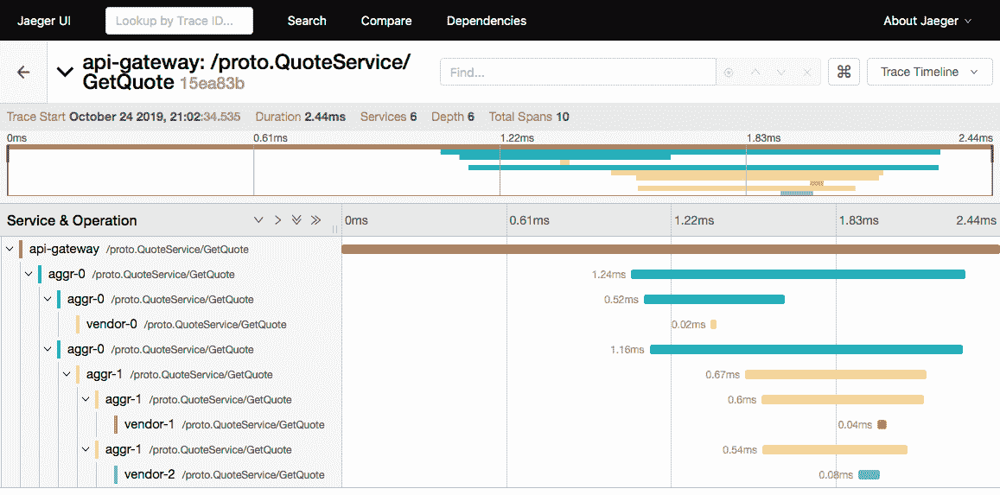
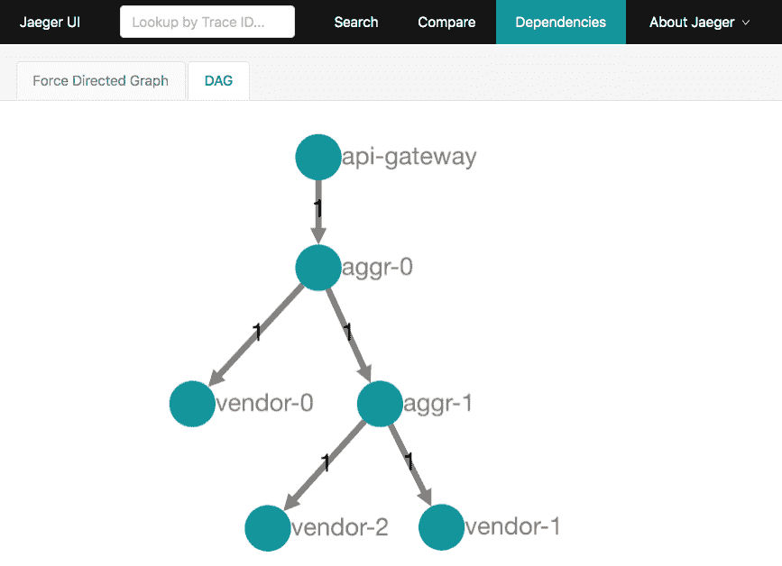
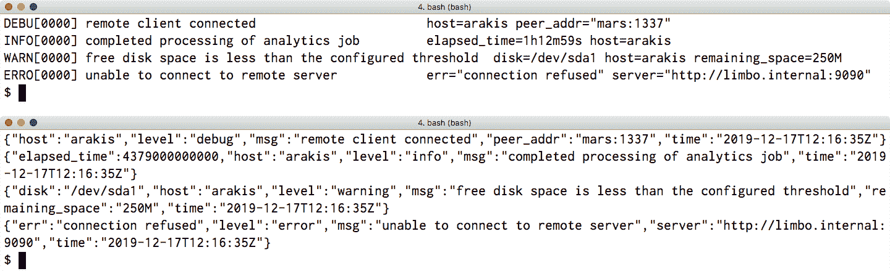
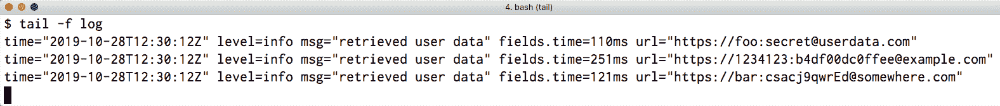
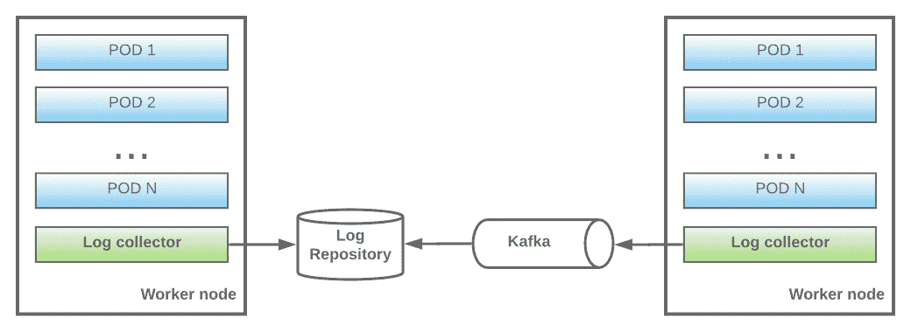
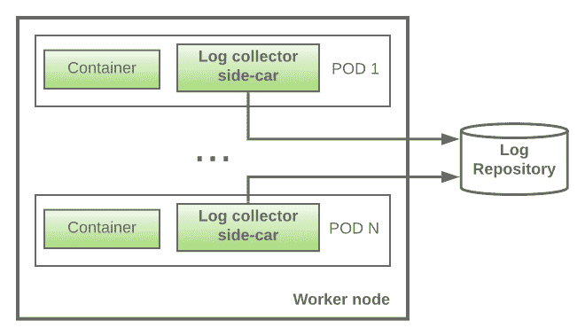
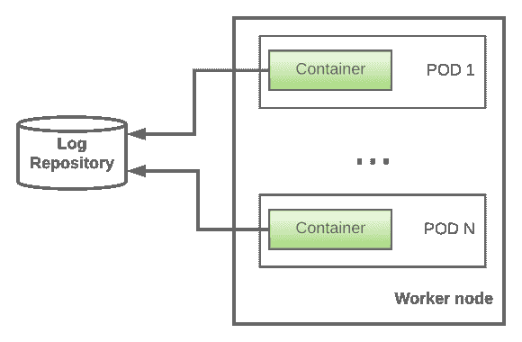
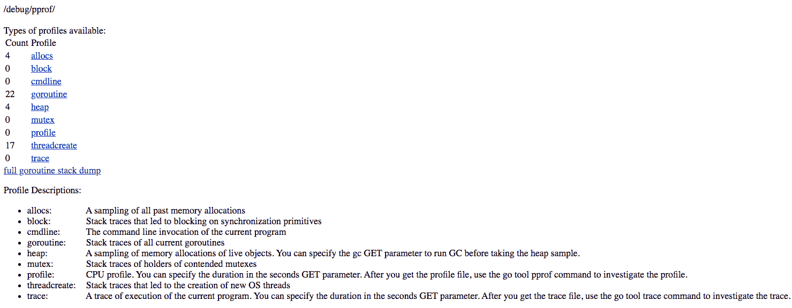
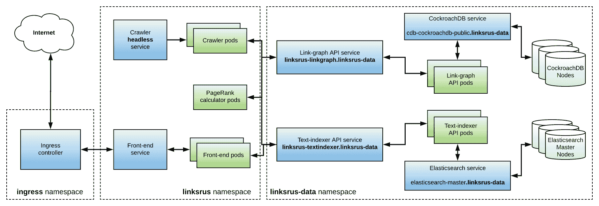
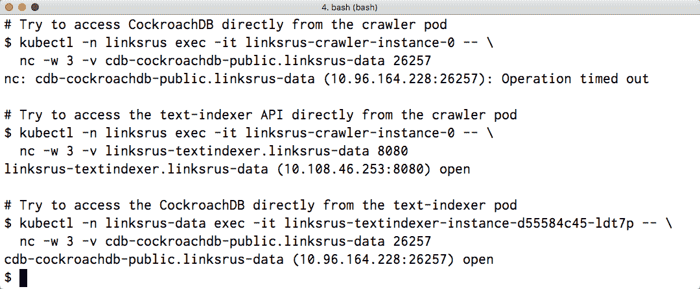

# 第十一章：将单体分解为微服务

“如果组件不能干净地组合（在迁移到微服务时），那么你所做的只是将复杂性从组件内部转移到组件之间的连接。这不仅只是移动复杂性；它将复杂性移动到一个不太明确且更难控制的地方。”

– 马丁·福勒和詹姆斯·刘易斯

本章介绍了**面向服务架构**（**SOA**）的概念，并将其与传统单体设计模式进行比较。这将帮助我们讨论微服务面临的各项挑战，如日志记录、跟踪和服务自省，并提供减少迁移到 SOA 时的痛点的建议。

在本章的末尾，我们将把上一章中的单体“链接之我行”实现分解为几个微服务，并将它们部署到 Kubernetes。

本章将涵盖以下主题：

+   何时从单体设计切换到基于微服务的架构是合适的？

+   微服务实现的常见反模式和如何规避它们

+   通过分布式系统跟踪请求

+   日志记录的最佳实践和要避免的陷阱

+   对实时 Go 服务的自省

+   将“链接之我行”单体分解为微服务并将它们部署到 Kubernetes

+   使用 Kubernetes 网络策略锁定对微服务的访问

通过利用本章所获得的知识，你将能够水平扩展自己的项目，以更好地处理 incoming traffic 的峰值。

# 技术要求

本章将要讨论的主题的完整代码已发布到本书的 GitHub 仓库中的`Chapter11`文件夹下。

你可以通过将网络浏览器指向以下 URL 来访问本书的 GitHub 仓库，该仓库包含本书每个章节的代码和所有必需的资源：[`github.com/PacktPublishing/Hands-On-Software-Engineering-with-Golang`](https://github.com/PacktPublishing/Hands-On-Software-Engineering-with-Golang)。

为了让你尽快开始，每个示例项目都包含一个 Makefile，它定义了以下目标集：

| **Makefile 目标** | **描述** |
| --- | --- |
| `deps` | 安装任何必需的依赖项 |
| `test` | 运行所有测试并报告覆盖率 |
| `lint` | 检查 lint 错误 |

与本书中的所有其他章节一样，你需要一个相当新的 Go 版本，你可以在[`golang.org/dl/`](https://golang.org/dl/)下载它。

要运行本章的一些代码示例，你需要在你的机器上有一个工作的 Docker 安装。

此外，一些示例被设计为在 Kubernetes 上运行。如果你没有访问 Kubernetes 集群进行测试，你可以简单地遵循以下章节中的说明，在你的笔记本电脑或工作站上设置一个小型集群。

# 单体架构与面向服务的架构

在过去几年中，越来越多的组织，尤其是在初创企业领域，已经开始积极采用 SOA 范式，无论是构建新系统还是对现有遗留系统进行现代化改造。

SOA 是一种创建系统的架构方法，这些系统由可能用不同编程语言编写的自主服务组成，并通过网络链接进行通信。

在接下来的章节中，我们将更详细地研究这种架构模式，并突出一些从单体应用程序迁移到微服务的最佳实践。同时，我们将探讨一些可能阻碍向基于微服务的架构过渡的常见反模式。

# 单体架构本身有什么固有的问题吗？

在您决定跳入水并转换您的单体应用程序为 SOA 之前，您应该稍作停顿，问问自己：基于微服务的架构设计是否是当前这个时间点适合我的应用程序的正确模型？

不要被围绕微服务的炒作所影响！尽管这种模型在谷歌、Netflix 或 Twitter 等公司的大规模应用中效果显著，但这并不意味着它也适用于您的特定用例。

单体系统设计已经存在很长时间，并且在支持业务关键系统方面一次又一次地证明了自己的价值。正如俗话所说：如果它对银行和航空公司足够好，那么它可能也适合您的下一个创业想法！

在许多情况下，转向基于微服务的架构的决定纯粹是由必要性驱动的；将大型单体系统扩展以应对流量不规则激增可能会非常昂贵，并且往往会导致我们可利用的资源利用率低下。这是一个很好的例子，说明转向微服务可能会产生可观察和可衡量的效果。

另一方面，如果您正在构建一个新产品或**最小可行产品**（MVP），从单体设计开始并从一开始引入正确的抽象，以便更容易地过渡到微服务，如果需要的话，这总是更容易。

许多新成立的初创公司陷入了这样的思维定式，认为微服务是继切片面包之后的最佳选择，而忘记了这种架构的潜在成本：复杂性增加，这直接转化为对 DevOps 需求的增加。因此，工程团队往往会在调试通信问题或设置复杂的监控微服务方案上花费大量开发时间，而不是将精力集中在构建和开发核心产品上。

# 微服务反模式及其处理方法

现在，让我们看看在处理基于微服务的项目时可能会遇到的反模式，并探讨处理它们的替代方法。

*共享数据库*可能是工程师在第一次尝试将单体应用拆分为微服务时犯的最大错误。一般来说，每个微服务都必须配备其自己的、私有的数据存储（假设它需要的话），并公开一个 API，以便其他微服务可以访问它。这种模式为我们提供了灵活性，可以根据每个特定微服务的需求选择最合适的技术（例如，NoSQL、关系型）。

微服务之间的通信可能会因为各种原因（例如，服务崩溃、网络分区或数据包丢失）而失败。正确的微服务实现应该基于这样的假设：出站调用可能在任何时候失败。当事情出错时，微服务不应该立即因为错误而退出，而应该始终实现某种形式的*重试逻辑*。

前述陈述的一个推论是，当连接到远程微服务在收到回复之前断开时，客户端无法确定远程服务器是否实际上成功处理了请求。根据前面的建议，客户端通常会重试调用。因此，每个公开 API 的微服务都必须以这种方式编写，使得请求始终是*幂等的*。

另一个常见的反模式是允许一个服务成为整个系统的*单点故障*。想象一下这样一个场景：你有三个服务，它们都依赖于由第四个下游服务公开的数据。如果后者服务配置不足，对三个上游服务的突发流量请求可能会导致对下游服务的请求超时。然后，上游服务会重试它们的请求，进一步增加下游服务的负载，直到它变得无响应或崩溃。结果，上游服务现在开始经历更高的错误率，这影响了其他上游服务对它们的调用，等等。

为了避免这种情况，微服务可以实现断路器模式：当特定下游服务的错误数量超过特定阈值时，断路器被触发，所有未来的请求都会自动以错误失败。定期地，断路器会允许一些请求通过，并在收到一定数量的成功响应后，断路器切换回开启位置，允许所有请求通过。

通过将此模式应用于您的微服务，我们允许下游服务从负载峰值或崩溃中恢复。此外，当下游服务不可用时，一些服务可能能够使用缓存的数据进行响应，从而确保系统即使在出现问题时也能保持功能正常。

正如我们已经解释过的，基于微服务的架构本质上很复杂，因为它们由大量移动部件组成。我们可能犯的最大错误是在没有为收集每个微服务的日志输出和监控其健康状态建立必要的基础设施之前就切换到这种架构。如果没有这种基础设施，我们实际上是在盲目飞行。在下一节中，我们将探讨几种不同的微服务仪表化和监控方法。

# 监控您的微服务状态

在以下章节中，我们将分析一系列用于监控微服务部署状态的不同的方法：

+   请求跟踪

+   日志收集和聚合

+   使用`pprof`对实时 Go 服务进行内省

# 通过分布式系统跟踪请求

在您可能拥有数百或数千个微服务运行的分布式系统中，请求跟踪是确定瓶颈、理解各个服务之间的依赖关系以及找出影响生产系统问题的根本原因的无价工具。

跟踪背后的想法是为传入的（通常是外部的）请求添加一个唯一的标识符，并在它通过系统传播时跟踪它，从一个微服务跳到另一个微服务，直到它最终退出系统。

分布式跟踪系统的概念绝对不是新的。事实上，像 Google 的 Dapper^([17])和 Twitter 的 Zipkin^([16])这样的系统已经存在了近十年。那么，为什么不是每个人都跳上这辆马车，为自己的代码库实现它呢？原因很简单：直到现在，更新整个代码库以支持请求跟踪曾经是一项艰巨的任务。

想象一个系统，其中组件通过不同类型的传输相互通信，也就是说，一些微服务使用 REST，其他使用 gRPC，还有一些可能通过 WebSockets 交换事件。确保请求 ID 被注入到所有发出的请求中，并在接收端反序列化，需要在所有微服务中实施相当多的努力。更重要的是，如果您选择走这条路，您将需要做一些研究，选择一个要使用的跟踪*供应商*，并最终将其（通常是专有的）API 集成，这将有效地将您锁定在其产品中。

一定要有更好的方法来实现请求跟踪！

# OpenTracing 项目

OpenTracing ^([18]) 项目是为了解决我们在上一节中概述的 exactly set of problems 而创建的。它提供了一个标准化的、供应商中立的 API，软件工程师可以使用它来对其代码库进行配置，以启用对请求跟踪的支持。此外，OpenTracing 不仅规定了跨服务边界传输跟踪上下文的适当编码，而且还提供了 API 以促进通过 REST 和 gRPC 传输交换跟踪上下文。

在我们继续之前，让我们花些时间解释一下我们将在以下部分中大量使用的术语。请求跟踪由一系列 **跨度** 组成。跨度表示在微服务内部执行的时间单位的工作。在典型场景中，当服务收到请求时开始一个新的跨度，当服务返回响应时结束。

此外，跨度也可以嵌套。如果服务 *A* 在发送响应之前需要联系下游服务 *B* 和 *C* 以获取额外的数据，那么 *B* 和 *C* 的跨度可以作为 *A* 的跨度的子跨度添加。因此，请求跟踪可以被视为一个 *跨度树*，其根是接收初始请求的服务。

# 演示分布式跟踪示例

为了理解分布式跟踪是如何工作的，让我们构建一个小型演示应用程序，该应用程序模拟从多个供应商收集特定 SKU 的价格报价的系统。您可以在本书 GitHub 存储库的 `Chapter11/tracing` 文件夹中找到此演示的完整源代码。

我们的系统将具有三种类型的服务，所有这些服务都将建立在 gRPC 之上：

+   **provider** 服务返回单个供应商的价格报价。在我们的示例场景中，我们将启动多个 provider 实例来模拟不同的供应商系统。

+   一个 **aggregator** 服务，它将传入的查询发送到一系列下游服务（提供者或其他聚合器），收集响应并返回聚合结果。

+   一个 **API 网关** 服务，它将作为捕获的请求跟踪的根。在现实世界中，API 网关将处理来自用户浏览器上运行的前端应用程序的请求。

让我们先列出服务的协议缓冲区和 RPC 定义：

```go
message QuotesRequest {
 string SKU = 1;
}

message QuotesResponse {
 repeated Quote quotes = 1;
}

message Quote {
 string vendor = 1;
 double price = 2;
}

service QuoteService {
 rpc GetQuote(QuotesRequest) returns (QuotesResponse);
}
```

如您所见，我们定义了一个名为 `GetQuote` 的单一 RPC，它接收一个 `QuotesRequest` 并返回一个 `QuotesResponse`。响应只是一个包含 `Quote` 对象的集合，每个对象都包含一个 `vendor` 字段和一个 `price` 字段。

# 提供者服务

首先也是最简单的服务是 `Provider`。以下是对 `Provider` 类型及其构造函数的定义：

```go
type Provider struct {
 vendorID string
}

func NewProvider(vendorID string) *Provider {
 return &Provider{ vendorID: vendorID }
}
```

接下来，我们将实现 `GetQuote` 方法，如前述协议缓冲定义中指定。为了使我们的示例尽可能简单，我们将提供一个模拟实现，它返回一个具有随机价格值和作为 `NewProvider` 构造函数参数传递的 `vendorID` 值的单个报价：

```go
func (p *Provider) GetQuote(ctx context.Context, req *proto.QuotesRequest) (*proto.QuotesResponse, error) {
 return &proto.QuotesResponse{
 Quotes: []*proto.Quote{
 &proto.Quote{ Vendor: p.vendorID, Price:  100.0 * rand.Float64() },
 },
 }, nil
}
```

为了模拟微服务架构，我们的主文件将启动多个此服务的实例。每个服务实例将创建自己的 gRPC 服务器并将其绑定到一个随机端口。让我们为 `Provider` 类型实现此功能：

```go
func (p *Provider) Serve(ctx context.Context) (string, error) {
 return doServe(ctx, p, tracer.MustGetTracer(p.vendorID))
}
```

`tracer` 包封装了创建满足 `opentracing.Tracer` 接口的跟踪实例所需的逻辑。获得的跟踪器将用于我们创建的每个服务，以便它可以收集和报告跨度。在接下来的章节中，我们将探讨在为我们的示例选择合适的跟踪提供者时，该包的实现。

在获取跟踪器后，`Serve` 方法调用 `doServe`，其任务是向一个随机可用的端口公开 gRPC 服务器并返回其监听地址。以下代码块中列出的 `doServe` 代码已被有意提取，因为我们将会使用它来实现聚合服务：

```go
func doServe(ctx context.Context, srv proto.QuoteServiceServer, tracer opentracing.Tracer) (string, error) {
 l, err := net.Listen("tcp", ":0")
 if err != nil {
 return "", err
 }
 tracerOpt := grpc.UnaryInterceptor(otgrpc.OpenTracingServerInterceptor(tracer))
 gsrv := grpc.NewServer(tracerOpt)
 proto.RegisterQuoteServiceServer(gsrv, srv)
 go func() {
 go func() { _ = gsrv.Serve(l) }()
 <-ctx.Done()
 gsrv.Stop()
 _ = l.Close()
 }()
 return l.Addr().String(), nil
}
```

在前面的函数中，前几行代码请求 `net` 包通过传递 `:0` 作为监听地址来监听一个随机空闲端口。下一行是真正发生魔法的地方！`grpc-opentracing` ^([10]) 包提供了 gRPC 拦截器，可以从传入的 gRPC 请求中解码跟踪相关信息并将它们 *嵌入* 到传递给 RPC 方法实现的请求上下文中。

gRPC 拦截器是一种中间件，它包装 RPC 调用并提供额外的功能。根据被包装的调用类型，拦截器被分类为单一或流式。

此外，拦截器可以在服务器端或客户端应用。在服务器端，拦截器通常用于实现诸如身份验证、日志记录和指标收集等功能。客户端拦截器可以用于实现如断路器或重试等模式。

由于我们的服务仅定义了单一 RPC，我们需要创建一个单一拦截器并将其传递给 `grpc.NewServer` 函数。然后，我们将 RPC 实现注册到服务器并启动一个 goroutine，以便我们可以开始服务请求直到提供的上下文过期。在 goroutine 运行期间，函数返回服务器监听器的地址。

# 聚合服务

我们接下来要实现的服务是 `Aggregator` 类型。如下代码片段所示，它存储了一个供应商 ID、要查询的提供者地址列表以及这些地址的 gRPC 客户端列表：

```go
type Aggregator struct {
 vendorID      string
 providerAddrs []string
 clients       []proto.QuoteServiceClient
}

func NewAggregator(vendorID string, providerAddrs []string) *Aggregator {
 return &Aggregator{
 vendorID:      vendorID,
 providerAddrs: providerAddrs,
 }
}
```

当调用 `Serve` 方法时，gRPC 客户端是延迟创建的：

```go
func (a *Aggregator) Serve(ctx context.Context) (string, error) {
 tracer := tracer.MustGetTracer(a.vendorID)
 tracerClientOpt := grpc.WithUnaryInterceptor(otgrpc.OpenTracingClientInterceptor(tracer))

 for _, addr := range a.providerAddrs {
 conn, err := grpc.Dial(addr, grpc.WithInsecure(), tracerClientOpt)
 if err != nil {
 return "", xerrors.Errorf("dialing provider at %s: %w", addr, err)
 }
 a.clients = append(a.clients, proto.NewQuoteServiceClient(conn))
 }

 return doServe(ctx, a, tracer)
}
```

这次，我们创建了一个**客户端**单例拦截器，并将其作为选项传递给每个我们拨打的客户端连接。然后，我们调用之前章节中检查的`doServe`辅助函数，以便我们可以启动我们的服务器。服务器和客户端都使用拦截器确保我们从传入请求中接收到的跟踪上下文信息会**自动**注入到任何出去的 gRPC 请求中，而无需我们做任何事情。

最后，让我们检查`Aggregator`类型的`GetQuote`方法是如何实现的：

```go
func (a *Aggregator) GetQuote(ctx context.Context, req *proto.QuotesRequest) (*proto.QuotesResponse, error) {
 // Run requests in parallel and aggregate results
 aggRes := new(proto.QuotesResponse)
 for quotes := range a.sendRequests(ctx, req) {
 aggRes.Quotes = append(aggRes.Quotes, quotes...)
 }
 return aggRes, nil
}
```

这个方法相当直接。它所做的只是分配一个新的`QuotesResponse`，调用`sendRequests`辅助函数，将结果展平到一个列表中，并将其返回给调用者。`sendRequests`方法并行查询下游提供者，并返回一个发布报价的通道：

```go
func (a *Aggregator) sendRequests(ctx context.Context, req *proto.QuotesRequest) <-chan []*proto.Quote {
 var wg sync.WaitGroup
 wg.Add(len(a.clients))
 resCh := make(chan []*proto.Quote, len(a.clients))
 for _, client := range a.clients {
 go func(client proto.QuoteServiceClient) {
 defer wg.Done()
 if res, err := client.GetQuote(ctx, req); err == nil {
 resCh <- res.Quotes
 }
 }(client)
 }
 go func() {
 wg.Wait()
 close(resCh)
 }()
 return resCh
}
```

注意从`GetQuote`传递到`client.GetQuote`调用中的请求上下文参数。这就是我们将此服务的跨度与下游服务的跨度关联所需做的全部工作。简单，对吧？

# 网关

网关服务不过是在 gRPC 客户端之上的包装。其实现中有趣的部分是`CollectQuotes`方法，这是我们的主包将调用来*开始一个新的跟踪*：

```go
func (gw *Gateway) CollectQuotes(ctx context.Context, SKU string) (map[string]float64, error) {
 span, ctx := opentracing.StartSpanFromContext(ctx, "CollectQuotes")
 defer span.Finish()

 res, err := gw.client.GetQuote(ctx, &proto.QuotesRequest{SKU: SKU})
 if err != nil {
 return nil, err
 }

 quoteMap := make(map[string]float64, len(res.Quotes))
 for _, quote := range res.Quotes {
 quoteMap[quote.Vendor] = quote.Price
 }
 return quoteMap, nil
}
```

这里，我们使用`StartSpanFromContext`来创建一个新的*命名*跨度，并将其跟踪详细信息嵌入到一个新的上下文中，该上下文包装了作为方法参数提供的上下文。

代码的其余部分相当直观：我们在嵌入的客户端实例上调用`GetQuote`方法，收集响应，并将它们放入一个映射中，然后将其返回给调用者。

# 将所有内容整合在一起

主要文件通过调用`deployServices`辅助函数来准备一个微服务部署环境。这里的想法是将服务以这种方式连接起来，以便通过系统跟踪请求将产生一个有趣的跟踪图。让我们看看这是如何实现的。

首先，辅助函数启动三个`Provider`实例，并跟踪它们的地址：

```go
var err error
providerAddrs := make([]string, 3)
for i := 0; i < len(providerAddrs); i++ {
 provider := service.NewProvider(fmt.Sprintf("vendor-%d", i))
 if providerAddrs[i], err = provider.Serve(ctx); err != nil {
 return nil, err
 }
}
```

然后，它启动一个`Aggregator`实例，并将其设置为连接到前面列表中的提供者*1*和*2*：

```go
aggr1 := service.NewAggregator("aggr-1", providerAddrs[1:])
aggr1Addr, err := aggr1.Serve(ctx)
if err != nil {
 return nil, err
}
```

随后，它实例化另一个`Aggregator`类型，并将其连接到提供者*0*和刚刚创建的聚合器：

```go
aggr0 := service.NewAggregator("aggr-0", []string{providerAddrs[0], aggr1Addr})
aggr0Addr, err := aggr0.Serve(ctx)
if err != nil {
 return nil, err
}
```

最后，创建一个以先前聚合器为目标并返回给调用者的`Gateway`实例：

```go
return service.NewGateway("api-gateway", aggr0Addr)
```

由`deployServices`函数返回的`Gateway`实例被`runMain`用于触发一个标记新请求跟踪开始的报价查询的执行：

```go
func runMain(ctx context.Context) error {
 gw, err := deployServices(ctx)
 if err != nil {
 return err
 }
 defer func() { _ = gw.Close() }()

 res, err := gw.CollectQuotes(ctx, "example")
 if err != nil {
 return err
 }
 fmt.Printf("Collected the following quotes:\n")
 for k, v := range res {
 fmt.Printf("  %q: %3.2f\n", k, v)
 }
 return nil
}
```

在下一节中，我们将把一个跟踪器实现连接到我们的代码中，以便我们可以捕获和可视化我们的代码生成的请求跟踪。

# 使用 Jaeger 捕获和可视化跟踪

在前面的章节中，我们看到了 OpenTracing 如何允许我们在微服务边界之间创建和传播跨度信息。但是，*如何* 以及更重要的是，*在哪里* 收集和处理这些信息？毕竟，如果没有切片和切块的手段，仅仅有这些信息将大大降低其价值。

正如我们之前提到的，OpenTracing 框架的一个关键设计目标是避免供应商锁定。为此，在跨度收集和可视化的方面，您可以选择一个开源解决方案，如 Uber 的 Jaeger ^([11]) 或 Elastic 的 APM ^([5])，您自己托管。或者，您可以使用几种可用的 **软件即服务** (**SaaS**) 解决方案 ^([19])。

就我们的开放跟踪示例而言，我们将使用 Jaeger ^([11]) 作为我们的跟踪器实现。Jaeger 安装简单，易于与我们迄今为止编写的代码集成。它是用 Go 编写的，也可以用作 Zipkin ^([16]) 的直接替换。Jaeger 部署通常由两个组件组成：

+   本地跨度收集代理通常作为侧车容器与您的应用程序一起部署。它收集应用程序通过 UDP 发布的跨度，应用 `*可配置*` 的概率采样，以便它可以选择要发送到上游的跨度子集，并将它们传输到 Jaeger 收集器服务。

+   收集器服务聚合由各种 Jaeger 代理实例传输的跨度，并将它们持久化到数据存储中。根据新产生的跨度速率，收集器可以配置为在 `*直接到存储*` 模式下工作，其中它们直接与数据库接口，或者在 `*流式*` 模式下工作，其中 Kafka 实例用作收集器和另一个进程之间的缓冲，该进程消费、索引并将数据存储在数据库中。

为了我们的测试目的，我们将使用官方的集成 Docker 镜像，该镜像包括一个代理和收集器实例（由内存存储支持），以及 Jaeger UI。我们可以使用以下命令启动容器：

```go
docker run -d --name jaeger \
  -p 6831:6831/udp \
  -p 16686:16686 \
  jaegertracing/all-in-one:1.14
```

端口 `6831` 是 Jaeger 代理监听我们的仪器化服务通过 UDP 发布的跨度的地方。另一方面，端口 `16686` 提供了 Jaeger UI，我们可以在这里浏览、搜索和可视化捕获的请求跟踪。

正如我们在前面的章节中提到的，`tracer` 包将封装实例化新的 Jaeger 跟踪器实例的逻辑。

让我们来看看 `GetTracer` 函数的实现。我们的服务调用的 `MustGetTracer` 函数调用 `GetTracer` 并在出错时崩溃，如下所示：

```go
func GetTracer(serviceName string) (opentracing.Tracer, error) {
 cfg, err := jaegercfg.FromEnv()
 if err != nil {
 return nil, err
 }
 cfg.ServiceName = serviceName
 cfg.Sampler = &jaegercfg.SamplerConfig{ 
 Type: jaeger.SamplerTypeConst, 
 Param: 1, // Sample all traces generated by our demo
 }
 tracer, closer, err := cfg.NewTracer()
 if err == nil {
 // Omitted: keep track of closer so we can close all tracers when exiting
 return tracer, nil
 }
 return err
}
```

Jaeger 的 Go 客户端提供了创建新跟踪器的一些便利助手。我们在这里选择的方法是从配置对象实例化一个跟踪器，我们可以通过 `FromEnv` 助手获得这个配置对象。`FromEnv` 使用一组合理的默认值初始化配置对象，然后检查环境以查找覆盖默认值的 Jaeger 特定变量。例如，可以使用 `JAEGER_AGENT_HOST` 和 `JAEGER_AGENT_PORT` 来指定 Jaeger 代理正在监听传入跟踪的地址。默认情况下，代理预计将在 `localhost:6831` 上监听，这与我们刚刚启动的 Docker 容器公开的端口相匹配。

接下来，我们需要为跟踪器配置采样策略。如果我们正在运行一个具有非常高吞吐量的部署，那么我们不一定希望跟踪每个请求，因为这会产生大量需要存储和索引的数据。为此，Jaeger 允许我们根据特定的应用程序需求配置不同的采样策略：

+   **恒定**采样器对每个跟踪总是做出相同的决定。这是我们用于示例的策略，以确保每次运行我们的演示时跟踪总是被持久化。

+   **概率**采样器以特定的概率（例如，10%的跟踪）保留跟踪。

+   **速率限制**采样器确保以特定的速率（例如，每秒 10 个跟踪）采样跟踪。

以下截图显示了由运行我们刚刚构建的示例应用程序生成的捕获跟踪的详细视图：



图 1：在 Jaeger 的 UI 中可视化请求跟踪

第一行表示在 `api-gateway` 中等待对出站报价请求的响应所花费的**总时间**。其下方的行包含对应于并行执行的其他请求的嵌套时间段。以下是发生事件的简要概述：

1.  网关向 aggr-0 发出请求并阻塞等待响应。

1.  aggr-0 并行发出两个请求：一个发送给 vendor-0，另一个发送给 aggr-1。然后，它在返回给网关响应之前阻塞等待下游响应。

1.  aggr-1 并行发出两个请求：一个发送给 vendor-1，另一个发送给 vendor-2。它在返回给 aggr-0 响应之前阻塞等待下游响应。

Jaeger UI 的另一个非常酷的功能是它可以以**有向无环图**（DAG）的形式显示服务之间的依赖关系。以下截图显示了我们的示例微服务部署的 DAG，它与前面的事件序列相匹配：



图 2：可视化服务之间的依赖关系

总结来说，请求跟踪是深入了解现代复杂基于微服务的系统内部结构的强大工具。我强烈建议您在您的下一个大型项目中考虑使用它。

# 将日志作为您的可靠盟友

一次又一次地，日志始终证明是调查当代计算机软件问题根本原因的无价资源。然而，在基于微服务的架构中，由于请求跨越服务边界，能够收集、关联和搜索每个单独服务发出的日志条目至关重要。

在接下来的章节中，我们将关注编写简洁、易于搜索的日志条目的最佳实践，并强调一些您绝对想要避免的常见陷阱。此外，我们将讨论从您的 Kubernetes pods（或 docker 化服务）收集和传输日志到中央位置以进行索引的解决方案。

# 日志最佳实践

我们最佳实践清单上的第一项是 **分级日志**。当使用分级日志时，您需要考虑两个方面：  

+   **选择为每条消息使用适当的日志级别**：Go 应用程序的大多数日志包至少支持 *DEBUG*、*INFO* 和 *ERROR* 级别。然而，您首选的日志解决方案也可能支持更细粒度的日志级别，例如 *TRACE*、*DEBUG* 和 *WARNING*。

+   **决定实际输出哪些日志级别**：例如，您可能希望应用程序仅在 *INFO* 和 *ERROR* 级别输出消息，以减少产生的日志量。

在调试应用程序时，在日志中包含 *DEBUG* 或 *TRACE* 消息也是有意义的，这样您可以更好地了解正在发生的事情。从逻辑上讲，您不应该需要重新编译和重新部署应用程序，只是为了更改其日志级别！为此，实现某种类型的钩子以允许您在应用程序执行时动态更改其活动日志级别是一种良好的做法。以下是一些您可以尝试的建议：

+   当应用程序接收到特定信号（例如，SIGHUP）时，在配置的日志级别和 *DEBUG* 级别之间切换。如果您的应用程序从配置文件中读取初始日志级别，您可以使用基于信号的相同方法强制重新加载配置文件。

+   暴露一个 HTTP 端点来更改日志级别。

+   将每个应用程序的日志级别设置存储在分布式键值存储中，如 etcd ^([6])，这允许客户端监视键的变化。如果您正在运行应用程序的多个实例，这是一种有效的方法，可以在单步中更改所有实例的日志级别。

如果你还没有这样做，你可以通过切换到**结构化**日志来提升你的日志记录水平。虽然使用正则表达式从日志中提取时间戳和消息的老方法确实有效，但将你的应用程序更新为输出服务可以轻松解析的日志格式，对于增加每单位时间内可以处理的日志量大有裨益。因此，应用程序日志可以实时或接近实时地搜索，让你能够更快地诊断问题。现在有很多 Go 包实现了结构化日志记录器。如果我们必须挑选一些，我们的列表中肯定会包括`sirupsen/logrus`^([14])、`uber-go/zap`^([20])、`rs/zerolog`^([21])和`gokit/log`^([9])。

那么，结构化日志条目是什么样的呢？以下截图展示了`sirupsen/logrus`包如何使用其内置的两种文本格式器格式和打印同一组日志。顶部的终端使用的是更适合在开发机器上运行应用程序的基于文本的格式化器，而底部的终端显示的是相同的 JSON 输出。正如你所见，每个日志条目至少包含一个级别、一个时间戳和一个消息。此外，日志条目可以包含可变数量的键值对：



图 3：由 logrus 生成的示例日志输出

当日志摄入平台消耗这样的日志条目时，它也会索引键值对并将它们提供给搜索。因此，你可以通过多个属性（例如，客户 ID、服务名称和数据中心位置）对日志条目进行切片和切块来编写高度针对性的查询。

总是要确保你的日志条目的*消息*部分从不包括*变量*部分。为了解释为什么不遵循这条建议可能会导致问题，让我们看看一个服务产生的两个等效错误消息，该服务的任务是重定向用户：

+   `level=error message="无法连接到服务器: dial tcp4: lookup invalid.host: no such host" service=redirector customer-id=42`

+   `level=error message="无法连接到服务器" err="dial tcp4: lookup invalid.host: no such host" host=invalid.host service=redirector customer-id=42`

第一条消息将 Go dialer 返回的错误嵌入到日志消息中。鉴于*没有这样的主机*错误很可能会随着每个请求而变化，将其添加到日志消息中引入了一个可变组件，这使得搜索变得更加困难。如果我们想找到所有失败的连接尝试的日志怎么办？唯一的方法是使用正则表达式，这将相当慢，因为日志搜索引擎需要对整个表进行全表扫描并将正则表达式应用于每个条目。

另一方面，第二条消息使用特定**类别**的错误常量消息，并包含错误详情和主机名作为键值对。搜索此类错误要容易得多：日志搜索引擎可能能够快速有效地使用索引来回答此类查询。更重要的是，我们可以进一步切片数据，例如，按主机计数失败的尝试。对于第一条消息，回答此类查询几乎是不可能的！

我们已经讨论过结构化日志记录的有用性。到目前为止，您可能想知道是否有一个应该始终包含在日志消息中的字段列表。我肯定会推荐至少包括以下信息：

+   应用程序/服务的**名称**。有这个值可以回答最常见的问题之一：“显示应用程序*foo*的日志”。

+   应用程序正在执行时的**主机名**。当您的日志存储是集中式时，如果需要确定哪个机器（或如果您使用 Kubernetes，则容器）产生了日志，这个字段非常有用。

+   用于编译应用程序二进制的 git（或您首选的 VCS）分支的**SHA**。如果您的组织是“频繁发布”格言的粉丝，将 SHA 添加到日志中可以轻松地将错误链接到代码库的特定快照。

想象一下，违背您的判断，您决定忽略“**周五永不部署**”的规则，并将一系列看似无害的更改推送到生产中的某些微服务；毕竟，代码经过了彻底的审查，所有测试都通过了。可能出什么问题呢，对吧？您周一回到工作岗位，您的邮箱里充满了由支持团队打开的工单。根据工单，几位用户在将产品添加到购物车时遇到了问题。为了帮助您追踪问题，支持团队在工单中包含了受影响用户 ID 以及他们访问服务的近似时间。

您启动日志搜索工具，输入时间戳和用户详情，然后收到 API 网关的日志列表，这是用户从他们的网络浏览器请求某物时遇到的第一个微服务。网关服务调用下游服务，不幸的是，这些服务**没有**访问用户 ID，因此不会出现在日志中...祝您好运，找到问题的原因！

为了避免这种棘手的情况，在日志条目中也包含一个**关联 ID**是一个好的做法。在这个特定的场景中，API 网关会为传入的请求生成一个唯一的关联 ID，并将其注入到对下游服务的请求中（然后它们将其包含在自己的日志条目中），等等。这种方法与请求跟踪非常相似，但不同的是，它不是跟踪跨度和时间相关的请求细节，而是允许我们在服务边界之间关联日志。

# 魔鬼在于（日志的）细节

当使用结构化日志时，很容易陷入一个误区，试图将尽可能多的信息塞入键值对中。不幸的是，这往往在安全方面证明是危险的！看看以下代码片段，它从我们提供的 URL 中检索用户的数据：

```go
func fetchUserData(url *url.URL) (*user.Data, error) {
 tick := time.Now()
 res, err := http.Get(url.String())
 if err != nil {
 return nil, err
 }
 defer func() { _ = res.Body.Close() }()

 logrus.WithFields(logrus.Fields{
 "url":  url,
 "time": time.Since(tick).String(),
 }).Info("retrieved user data")

 // omitted: read and unmarshal user data
}
```

每当我们成功获取数据时，我们都会记录一个包含 URL 和检索所需时间的*INFO*消息。这段代码看起来很无辜，对吧？错了！以下截图显示了该函数的日志输出：



图 4：忘记正确清理日志输出可能导致凭证泄露

哎呀！我们不小心把用户的凭证散布到了日志中... 我们必须非常小心，不要将任何凭证或其他敏感信息（例如，信用卡、银行账户或 SSN 号码）泄露到日志中。但是，我们如何在不需要审计代码库中的每一行日志的情况下实现这一点？大多数日志框架允许你提供一个`io.Writer`实例来接收日志输出。你可以利用这个功能来实现一个过滤机制，该机制使用一组正则表达式来屏蔽或删除符合特定模式的敏感信息。

你必须注意的另一个陷阱是**同步**日志。这里的黄金法则是将日志始终视为一个辅助功能，并且永远不应该干扰你服务的正常操作。如果你使用的是同步日志记录器，并且输出流阻塞（即，它无法跟上生成的日志量），你的服务也会阻塞，并导致上游服务出现明显的延迟。尽可能使用**异步**日志记录器实现 - 理想情况下，使用漏桶抽象来在无法跟上负载时丢弃消息。

# 在 Kubernetes 中传输和索引日志

如果你一直在遵循前几节的指南，你的应用程序现在将输出干净简洁的日志，这种格式适合被日志聚合系统摄取。唯一缺失的拼图是如何收集在 Kubernetes 集群上运行的每个应用程序实例的单独日志并将它们发送到自托管或 SaaS 日志索引解决方案。

# 在每个 Kubernetes 节点上运行日志收集器

此选项使用 Kubernetes *DaemonSet*在每个 Kubernetes 集群的每个节点上安装日志收集守护进程。除了相对容易实现之外，这种特定方法的优点是它对运行中的应用程序是完全透明的。

DaemonSet 是一种特殊的 Kubernetes 资源，确保所有集群节点都运行特定 Pod 的一个副本。使用 daemon sets 是一种非常常见的模式，原因如下：

+   运行集群存储守护进程（例如，ceph 或 glusterd）

+   收集和发送日志

+   监控节点并传输节点特定的指标（例如，负载、内存或磁盘空间使用情况）

当 Pod 执行时，Kubernetes 将捕获其标准输出和错误流并将它们重定向到一对日志文件。当你运行`kubectl logs`命令时，运行在工作节点上的`kubelet`实例通过读取这些文件来流式传输日志。

下一个图中显示的日志收集器 Pod 将每个正在执行的 Pod 捕获的日志文件进行消化，如果需要，将它们转换为日志索引服务期望的格式，并可选择地添加额外的信息，例如 Kubernetes 命名空间和容器主机名。根据使用的日志摄取解决方案，日志可以直接上传进行摄取或写入消息队列，例如 Kafka：



图 5：使用 DaemonSet 运行日志收集器

目前最流行的两个日志收集守护进程是 Fluent Bit^([8])，它用 C 编写，以及 Logstash^([15])，它用 Ruby 编写。通常，日志会被发送到 Elasticsearch 集群进行索引，并使用 Kibana^([12])这样的前端来浏览和搜索日志。这种类型的设置通常被称为 EFK 或 ELK 堆栈，具体取决于使用的日志收集守护进程。

# 使用边车容器收集日志

收集日志的第二种选择是为每个应用程序运行一个边车容器，如下面的图所示：



图 6：将日志收集器作为边车容器运行

与使用 Kubernetes 已内置的基础设施相比，这种方法可能感觉有点繁琐，但在以下情况发生时可以工作得相当好：

+   应用程序写入多个日志文件。例如，一个像 Apache 或 Nginx 这样的 Web 服务器可能被配置为将错误日志写入与访问日志不同的位置。在这种情况下，您将为每个要抓取的日志文件添加一个边车容器。

+   应用程序使用非标准日志格式，需要根据每个应用程序进行转换。

# 直接从应用程序发送日志

我们将要检查的最后一种日志传输策略是将日志传输逻辑实际嵌入到每个应用程序中。如图所示，应用程序正在直接将其日志发送到日志存储库：



图 7：从应用程序内部直接传输日志

这种策略的一个有趣用例是与需要应用程序导入和使用特定供应商软件开发套件的外部第三方 SaaS 产品集成。

# 检查实时 Go 服务

在从单体应用程序过渡到基于微服务的应用程序的漫长旅程之后，你已经达到了一个点，即所有你新而闪亮的服务都在生产中愉快地运行。在这个阶段，你可能会越来越好奇它们长期运行的状况：

+   它们使用了多少内存？

+   当前有多少 goroutines 正在运行？

+   是否有任何泄漏（内存或 goroutines）最终会迫使服务崩溃？

+   Go 垃圾收集器多久运行一次，每次运行实际上需要多少时间？

如果你使用容器编排框架，如 Kubernetes，崩溃的服务通常不是一个大问题；只需增加实例数量，Kubernetes 就会在它们崩溃时负责重启它们。然而，如果崩溃的根本原因是内存泄漏或运行中 goroutine 数量的无界增长，随着系统流量的增加，崩溃将变得越来越频繁。这种模式不可避免地会导致服务中断。

幸运的是，Go 运行时公开了大量信息，我们可以使用这些信息来回答这些问题。我们只需要提取、导出和汇总这些信息。在第十三章“指标收集和可视化”中，我们将讨论操作微服务架构的 SRE 方面，我们将探讨如 Prometheus 这样的指标收集系统，它不仅允许我们收集这些信息，还可以通过创建警报来采取行动，这些警报最终可能变成 SRE 团队的页面调用。

然而，在某些情况下，我们可能想要深入挖掘...以下是一些有趣的例子：

+   一个服务突然变得无响应，但 Go 死锁检测器并没有抱怨任何死锁。该服务仍然接受请求，但从未发送任何回复，我们需要找出原因。

+   我们的指标仪表板显示，服务 *Y* 的实例 *X* 正在使用相当多的堆内存。但我们如何检查堆的内容，看看是什么占用了所有这些内存？也许我们泄漏了文件句柄（例如，忘记关闭我们正在进行的 HTTP 调用的响应体）或者维护了对对象的未必要引用，这阻止了 Go 垃圾收集器释放它们。

+   一个数据摄取服务意外地 peg 了 CPU，但仅在运行在生产环境中时才会发生！到目前为止，你还没有能在本地开发机器上重现这个问题。

要调试如第一个示例中描述的问题，我们可以 SSH 进入服务执行所在的容器，并发送一个 *SIGQUIT* 信号。这将强制 Go 运行时为每个正在运行的 goroutine 输出堆栈跟踪并退出。然后，我们可以检查日志流，找出服务确切卡在何处。

如果你的 Go 应用程序似乎卡住了，正在前台运行，而不是寻找它的 pid 以发送一个 *SIGQUIT* 信号，你可以通过按 *CTRL+\* 来强制它为每个正在执行的 goroutine 输出堆栈跟踪。

注意，在幕后，这个键组合实际上向运行中的进程发送了一个 *SIGQUIT*，并会导致它退出。

然而，这个技巧的明显缺点是，我们的应用程序或服务实际上会崩溃。更重要的是，它并不真正允许我们检查其内部状态，这对于处理诸如其他示例中提到的情况是或多或少必需的。

幸运的是，Go 允许我们将 `pprof` 包嵌入到我们的服务中，并通过 HTTP 暴露其前端。你可能担心，将一个采样分析器与你的代码一起分发无疑会使它运行得更慢。原则上，这并不是真的，因为你可以要求 `pprof` 根据需要捕获各种类型的配置文件，从而使其在需要时才介入。如下代码片段所示，你所需要做的只是导入 `net/http/pprof` 包并启动一个 HTTP 服务器：

```go
import (
 "log"
 "net/http"
 _ "net/http/pprof" // import for side-effects
)

func exposeProfile() {
 go func() {
 log.Println(http.ListenAndServe("localhost:6060", nil))
 }()
}
```

`net/http/pprof` 函数定义了一个 `init` 函数，该函数将各种与 pprof 相关的路由处理程序注册到默认的 `http.ServeMux`。因此，通常只为了副作用而导入该包。启动 HTTP 服务器后，你只需将你的网络浏览器指向 `http://localhost:6060/debug/pprof`，就可以访问一个用于捕获 `pprof` 配置文件并使其可供下载的简约前端，以便可以通过 `pprof` 工具离线处理。

以下截图显示了暴露 `pprof` 前端以检查运行中的应用程序：



图 8：暴露 pprof 前端以检查运行中的应用程序

如前述截图所示，`pprof` 用户界面允许你按需捕获以下配置文件类型：

+   **allocs**：所有过去内存分配的样本

+   **block**：导致在同步原语上阻塞的堆栈跟踪

+   **cmdline**：当前程序的命令行调用

+   **goroutine**：所有当前 goroutine 的堆栈跟踪

+   **heap**：活动对象的内存分配样本

+   **mutex**：竞争互斥锁持有者的堆栈跟踪

+   **profile**：CPU 配置文件

+   **threadcreate**：导致创建新操作系统线程的堆栈跟踪

+   **trace**：当前程序执行的跟踪

如果您的应用程序/服务已经启动了自己的 HTTP 服务器，该服务器可能被暴露给外界（例如，通过 Kubernetes ingress），请确保将其路由绑定到新的**mux**实例，并通过运行在不同（内部）端口上的第二个 HTTP 服务器使用**默认 mux**来公开`pprof`路由。

这样做，您就不会有允许未经授权访问您的内省端点的风险。

我强烈建议您使用本节中讨论的方法为您的生产服务启用`pprof`支持。这只需要您稍微努力一点来设置，但如果您需要调试实时应用程序，这将证明是一个巨大的资产。

# 构建“Links 'R' Us”的基于微服务的版本

在本章的最后部分，我们将使用我们在上一章中构建和部署的单体应用“Links 'R' Us”，并将我们迄今为止所学的一切应用到将其分解为一组微服务。以下图表展示了我们在做出所有必要的更改后集群的预期状态：



图 9：将“Links 'R' Us”单体分解为微服务

我们将为“Links 'R' Us”的基于微服务的版本使用 Kubernetes manifest 文件，这些文件位于本书 GitHub 仓库的`Chapter11/k8s`文件夹下。

如果您还没有设置 Minikube 集群并将其私有仓库列入白名单，您可以选择短暂休息并手动按照第十章“构建、打包和部署软件”中的逐步说明进行操作，或者简单地运行`make bootstrap-minikube`，这将为您处理一切。另一方面，如果您已经从上一章部署了“Links 'R' Us”的单体版本，在继续之前请确保运行`kubectl delete namespace linksrus`。通过删除`**linksrus**`命名空间，Kubernetes 将移除所有针对“Links 'R' Us”的 pods、services 和 ingresses，但保留数据存储（位于`**linksrus-data**`命名空间中）。

为了部署我们在以下章节中定义的“Links 'R' Us”的各种组件，您需要构建和推送一些 Docker 镜像。为了节省您的时间，`Chapter11/k8s`文件夹中的 Makefile 提供了两个方便的构建目标，以尽可能快地让您开始运行：

+   `make dockerize-and-push`将构建所有必需的 Docker 镜像并将它们推送到 Minikube 的私有仓库

+   `make deploy`将确保所有必要的数据存储都已配置，并一次性应用部署基于微服务的“Links 'R' Us”版本的 manifests

在我们开始将单体应用拆分为微服务之前，我们首先需要处理一个小任务：移除我们的服务与底层数据存储之间的耦合。下一节将探讨如何利用我们在第九章，《与外界通信》中获得的知识来实现这一点。

# 解耦对数据存储的访问

上一章单体实现的一个基本问题是我们的应用程序直接与 Elasticsearch 和 CockroachDB 集群通信。我们实际上在应用程序和数据存储实现之间引入了紧密耦合。

现在是时候创建 Links 'R' Us 的基于微服务版本了，我们需要采取一些步骤来纠正这个问题。为此，我们将创建的前两个服务将作为重构工作中的一种代理，以促进对底层数据存储的访问。**文本索引器**和**链接图**服务将在**linksrus-data**命名空间中部署，并允许其他服务通过我们在第九章，《与外界通信》中定义的基于 gRPC 的 API 与数据存储进行交互。

在服务和数据存储之间引入间接层的一个重要好处是，我们能够随时更改数据存储实现，而无需更改、更新或以其他方式重新配置任何其他 Links 'R' Us 服务。

在服务实现方面，事情出奇地简单。每个服务二进制文件接收作为参数的数据存储连接 URI。然后，它在端口`8080`上创建一个 gRPC 服务器，并在端口 6060 上暴露`pprof`调试端点。所有样板代码都完美地整合到一个主文件中，您可以在本书 GitHub 仓库的`Chapter11/linksrus/linkgraph`和`Chapter11/linksrus/textindexer`文件夹中找到。

# 将单体应用拆分为独立的服务

从 Links 'R' Us 单体中提取单个服务，并为每个服务构建一个独立的服务二进制文件。这也是您可能会意识到我们自本书开始以来一直在宣扬的干净、基于接口的设计最终开始产生效益的时刻。

结果表明，我们可以从第十章，《构建、打包和部署软件》中提取特定服务的代码，稍作修改后即可直接使用。对于每个服务，我们将创建一个执行以下一系列任务的`main`包：

+   为每个服务创建一个日志实例

+   在可配置端口上暴露`pprof`调试端点

+   实例化用于访问链接图和文本索引器的 gRPC 客户端

+   为每个服务填充适当的配置对象

+   运行服务主循环，并在收到信号时干净地关闭应用程序

所有这些样板代码对于每个服务来说都大致相同，因此为了简洁起见，我们将省略它。然而，如果您愿意，可以将公共部分提取到单独的包中，并使每个服务的`main.go`文件更加精简。

每个服务的配置与上一章中单体实现的配置略有不同。我们希望我们的服务通过命令行标志或环境变量进行配置。后者为我们提供了在共享的 Kubernetes ConfigMap 中定义所有配置选项的灵活性，并将它们注入到我们的服务清单中。由于内置的`flags`包不支持此类功能，我们将切换到`urfave/cli`^([1])包来满足我们的标志解析需求。此包支持优雅地定义类型化标志，这还允许我们（可选地）指定可以设置为覆盖每个标志值的变量名：

```go
app.Flags = []cli.Flag{
 cli.StringFlag{
 Name:   "link-graph-api",
 EnvVar: "LINK_GRAPH_API",
 Usage:  "The gRPC endpoint for connecting to the link graph",
 },
 cli.StringFlag{
 Name:   "text-indexer-api",
 EnvVar: "TEXT_INDEXER_API",
 Usage:  "The gRPC endpoint for connecting to the text indexer",
 },
 // omitted: additional flags
}
```

我们的所有新服务都需要访问链接图和文本索引器数据存储。这两个存储都通过我们之前章节中描述的两个服务通过 gRPC 暴露。以下代码片段显示了如何为两个服务中的每一个获取一个高级（见第九章，*与外界通信*）客户端实例：

```go
// Obtain high-level client for link graph.
dialCtx, cancelFn := context.WithTimeout(ctx, 5*time.Second)
defer cancelFn()
linkGraphConn, err := grpc.DialContext(dialCtx, linkGraphAPI, grpc.WithInsecure(), grpc.WithBlock())
if err != nil {
 return nil, nil, xerrors.Errorf("could not connect to link graph API: %w", err)
}
graphCli := linkgraphapi.NewLinkGraphClient(ctx, linkgraphproto.NewLinkGraphClient(linkGraphConn))

// Obtain high-level client for text-indexer.
dialCtx, cancelFn := context.WithTimeout(ctx, 5*time.Second)
defer cancelFn()
indexerConn, err := grpc.DialContext(dialCtx, textIndexerAPI, grpc.WithInsecure(), grpc.WithBlock())
if err != nil {
 return nil, nil, xerrors.Errorf("could not connect to text indexer API: %w", err)
}
indexerCli := textindexerapi.NewTextIndexerClient(ctx, textindexerproto.NewTextIndexerClient(indexerConn))
```

如您所忆，在第九章，*与外界通信*中，我们精心设计了高级客户端，以便它们实现`graph.Graph`和`index.Indexer`接口的子集。这使得可以使用客户端作为*直接替换*用于单体“链接之用”版本中使用的具体图和索引存储实现。这是将 SOLID 设计原则应用于使我们的代码更加模块化和易于接口的益处的证明。

# 部署构成“链接之用”项目的微服务

现在我们已经为每个新的“链接之用”服务构建了独立的二进制文件，是时候将它们部署到 Kubernetes 上了！让我们快速了解一下部署每个单独服务所需的 Kubernetes 资源。

# 部署链接图和文本索引器 API 服务

对于链接图和文本索引器 API 服务，我们将在**linksrus-data**命名空间中为每个服务启动两个副本，我们将使用 Kubernetes 部署资源。

为了允许来自**linksrus**命名空间的客户端访问 API，我们将创建一个 Kubernetes 服务来负载均衡到我们将启动的 Pods 的流量。

客户端可以通过将他们的 gRPC 客户端连接到以下端点来访问数据存储：

+   `linksrus-textindexer.linksrus-data:8080`

+   `linksrus-linkgraph.linksrus-data:8080`

# 部署网络爬虫

爬虫服务部署将使用与上一章中单体实现相同的分区检测逻辑。因此，我们将作为 Kubernetes 状态集部署两个爬虫服务实例，这保证了每个 pod 都会被分配一个包含集合中 pod 序号的可预测主机名。

此外，我们还将创建一个**无头**的 Kubernetes 服务，该服务将为爬虫 pod 的 SRV 记录填充数据，并允许分区检测代码查询可用的 pod 总数。

# 部署 PageRank 服务

PageRank 服务仍然受到我们在上一章中讨论的相同约束和限制。因此，我们将通过创建一个副本计数设置为**一个**的 Kubernetes 部署来运行服务的**单个**实例。

# 部署前端服务

我们将要部署的最后一个服务是前端。正如我们集群中的大多数其他服务一样，我们将为前端创建一个具有所需副本数的 Kubernetes 部署。

正如我们在上一章中所做的那样，我们将定义一个 Kubernetes 服务来负载均衡流量到前端 pod，然后借助 Kubernetes ingress 资源将其暴露在集群外部。

# 使用网络策略锁定对我们的 Kubernetes 集群的访问

随着微服务数量的增加，可能是一个开始更积极地考虑安全性的好时机。我们真的希望集群中的每个 pod 都能访问所有命名空间中的其他 pod 吗？说实话，对于我们的当前部署来说，这并不那么重要。然而，对于更大的项目来说，这确实是一个你需要回答的问题。

Kubernetes 提供了一种特殊类型的资源，称为**网络策略**，以帮助我们创建细粒度的规则来管理对命名空间和 pod 的访问。创建和实施网络策略的先决条件是您的集群运行时启用了**cni**网络插件，并使用符合**容器网络接口**（**CNI**）的网络提供者实现。此类提供者的例子包括 Calico ^([2])、Cilium ^([3]) 和 Flannel ^([7])。

如果你已经使用 Makefile 中的 `make bootstrap-minikube` 目标在 `Chapter10/k8s` 或 `Chapter11/k8s` 文件夹中初始化了一个 Minikube 集群，Calico 已经为你安装好了。

或者，您可以通过运行以下命令手动将 Calico 安装到您的测试集群中：

`kubectl apply -f https://docs.projectcalico.org/v3.10/manifests/calico.yaml` 安装可能需要一些时间。你可以通过运行 `kubectl -n kube-system get pods -lk8s-app=calico-node -w` 来监控部署状态，等待 pod 状态显示为**运行**。

对于我们的 Links 'R' Us 部署，一个好的网络策略示例会是什么？由于现在期望 **linksrus** 命名空间中的各种 pod 通过 gRPC 访问数据存储，因此指定一个阻止来自其他命名空间的 pod 访问 **linksrus-data** 命名空间中任何其他 pod 的网络策略将是良好的实践。

Kubernetes 网络策略的一个真正酷的特性是我们可以将多个策略组合起来构建更复杂的策略。对于我们的用例，我们将从一个 **DENY ALL** 策略开始：

```go
kind: NetworkPolicy
apiVersion: networking.k8s.io/v1
metadata:
 namespace: linksrus-data
 name: deny-from-other-namespaces
spec:
 podSelector:
 matchLabels:
 ingress:
 - from:
 - podSelector: {}
```

每个策略有两个部分：

+   目标是我们指定想要控制访问的 pod 集合。在这个例子中，我们使用一个 `podSelector` 块和一个空的 `matchLabels` 选择器来匹配命名空间中的所有 pod。

+   交通源，即我们在尝试访问目标列表中的 pod 时，指定受策略影响的 pod 集合的位置。

因此，前面的策略可以解释为**拒绝**来自另一个命名空间中任何 pod 对 **linksrus-data** 命名空间中任何 pod 的访问。继续前进，我们将定义第二个网络策略，该策略将明确地将我们想要授予访问权限的 pod 列为白名单：

```go
kind: NetworkPolicy
apiVersion: networking.k8s.io/v1
metadata:
 namespace: linksrus-data
 name: allow-access-to-data-apis
spec:
 podSelector:
 matchLabels:
 role: data-api
 ingress:
 - from:
 - namespaceSelector:
 matchLabels: 
 role: linksrus-components
```

两个 gRPC 服务的 pod 已经被标记为 `role: data-api` 标签，该标签被前面的策略用来明确地针对我们感兴趣的 pod。另一方面，在 **linksrus** 命名空间中运行的 pod 已经被标记为 `role: linksrus-components` 标签，这允许我们将它们指定为入口选择器的一部分。此规则被解释为**允许**所有带有 **linksrus-components** 角色的 pod 从 **linksrus-data** 命名空间中的 pod 访问具有 **data-api** 角色的 pod*。

让我们通过运行 `kubectl apply -f 08-net-policy.yaml` 来应用这些规则，并通过连接到两个命名空间中的 pod 并运行 *nc* 命令来检查我们是否被允许连接到由两个网络策略保护的 pod 来验证它们是否按预期工作。以下屏幕截图显示了如何验证我们的网络策略按预期工作：



图 10：验证我们的网络策略按预期工作

成功！如前一个屏幕截图所示，尝试从 **linksrus** 命名空间中的一个爬虫 pod 连接到 CockroachDB 集群时超时，而尝试连接到文本索引器 API 的尝试则成功。另一方面，当在 **linksrus-data** 命名空间中运行的 pod 内执行相同命令时，连接到 CockroachDB 的尝试成功。

当然，对 Kubernetes 网络策略的简要介绍只是触及了表面。Kubernetes 文档中包含其他一些匹配规则，您可以使用这些规则为您的特定用例制定适当的网络策略。对于那些有兴趣进一步探索可以实施的不同类型策略的人，我强烈建议查看*Kubernetes 网络策略食谱*^([13])GitHub 仓库。

# 摘要

在本章中，我们专注于将单体应用程序拆分为一系列微服务的过程。我们确定了构建微服务的常见反模式，并详细阐述了绕过它们的方法。

在本章的第二部分，我们探讨了通过分布式系统跟踪请求的一些有趣方法，以及收集、聚合和搜索日志。在本章的最后部分，我们将上一章中的单体 Links 'R' Us 项目拆分为一系列微服务，并将它们部署到我们的测试 Kubernetes 集群中。

在下一章中，我们将讨论构建容错系统，并使用主/从模式构建 PageRank 计算器的分布式版本。

# 问题

1.  解释为什么使用微服务模式进行 MVP 或**概念验证**（**PoC**）项目通常被认为是一个糟糕的想法。

1.  描述断路器模式是如何工作的。

1.  列出能够跟踪请求穿越系统时的某些好处。

1.  为什么清理日志输出很重要？

1.  简要描述从运行在 Kubernetes 集群内部的 Pod 中收集日志的三个策略。

# 进一步阅读

1.  一个简单、快速且有趣的 Go 语言命令行应用程序构建包：[`github.com/urfave/cli`](https://github.com/urfave/cli)

1.  **Calico**：云原生时代的安全网络：[`www.projectcalico.org`](https://www.projectcalico.org)

1.  **Cilium**：API 感知网络和安全：[`cilium.io`](https://cilium.io)

1.  **Docker**：企业级容器平台：[`www.docker.com`](https://www.docker.com)

1.  **Elastic APM**：开源应用程序性能监控：[`www.elastic.co/products/apm`](https://www.elastic.co/products/apm)

1.  **etcd**：分布式、可靠的键值存储，用于分布式系统中最关键的数据：[`etcd.io`](https://etcd.io)

1.  **Flannel**：为 Kubernetes 设计的容器网络布线：[`github.com/coreos/flannel`](https://github.com/coreos/flannel)

1.  **Fluent Bit**：云原生日志转发器：[`fluentbit.io`](https://fluentbit.io)

1.  **gokit/log**：服务中结构化日志的最小接口：[`github.com/go-kit/kit/tree/master/log`](https://github.com/go-kit/kit/tree/master/log)

1.  **grpc-opentracing**: 通过 OpenTracing 项目在 gRPC 客户端启用分布式跟踪的包：[`github.com/grpc-ecosystem/grpc-opentracing`](https://github.com/grpc-ecosystem/grpc-opentracing)

1.  **Jaeger**: 为开源，端到端分布式跟踪：[`jaegertracing.io`](https://jaegertracing.io)

1.  **kibana**: 您进入 Elastic Stack 的窗口：[`www.elastic.co/products/kibana`](https://www.elastic.co/products/kibana)

1.  Kubernetes 网络策略菜谱：[`github.com/ahmetb/kubernetes-network-policy-recipes`](https://github.com/ahmetb/kubernetes-network-policy-recipes)

1.  **logrus**: 为 Go 提供结构化、可插拔的日志记录：[`github.com/sirupsen/logrus`](https://github.com/sirupsen/logrus)

1.  **Logstash**: 集中、转换和存储您的数据：[`www.elastic.co/products/logstash`](https://www.elastic.co/products/logstash)

1.  **OpenZipkin**: 分布式跟踪系统：[`zipkin.io`](https://zipkin.io)

1.  Sigelman, Benjamin H.; Barroso, Luiz André; Burrows, Mike; Stephenson, Pat; Plakal, Manoj; Beaver, Donald; Jaspan, Saul; Shanbhag, Chandan: *Dapper, a Large-Scale Distributed Systems Tracing Infrastructure*. Google, Inc., 2010.

1.  **The OpenTracing project**: [`opentracing.io`](https://opentracing.io)

1.  **The OpenTracing project: Supported tracers**: [`opentracing.io/docs/supported-tracers`](https://opentracing.io/docs/supported-tracers)

1.  **zap**: Go 中的闪电般快速、结构化、分层日志记录：[`github.com/uber-go/zap`](https://github.com/uber-go/zap)

1.  **zerolog**: 零分配 JSON 记录器：[`github.com/rs/zerolog`](https://github.com/rs/zerolog)
