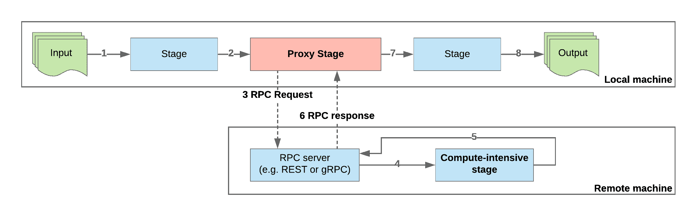

# 第十五章：评估

# 第一章

1.  软件工程被定义为将系统化、规范化和可量化的方法应用于软件开发、运行和维护。

1.  一些软件工程师必须能够回答的关键问题如下：

+   +   软件需要支持哪些业务用例？

    +   系统由哪些组件组成，它们之间是如何相互作用的？

    +   将用于实现各种系统组件的技术是什么？

    +   如何测试软件以确保其行为符合客户的期望？

    +   负载如何影响系统的性能，以及系统扩展的计划是什么？

1.  SRE 大约一半的时间用于与操作相关的任务，例如处理支持票证、待命、自动化流程以消除人为错误等。

1.  水晶模型并没有提供每个模型步骤所包含过程的详细视图。此外，它似乎也不支持与水晶步骤并行运行的跨切面过程，例如项目管理或质量控制。水晶模型的一个显著缺点是它基于所有客户需求都提前已知的假设。迭代增强模型试图通过执行小的增量水晶迭代来纠正这些问题，从而使开发团队能够适应需求的变化。

1.  根据精益开发模型，最常见的浪费来源如下：

+   +   在开发过程中引入非必要的变化

    +   对于签署新功能过于复杂的决策过程

    +   各个项目利益相关者和开发团队之间不必要的沟通

1.  团队决定以牺牲代码质量为代价，专注于快速交付。结果，代码库变得更加复杂，缺陷开始累积。现在，团队必须将部分开发时间用于修复错误，而不是开发请求的功能。因此，实施阶段成为瓶颈，降低了整个开发过程的效率。

1.  产品负责人的主要职责是管理项目的待办事项。另一方面，Scrum Master 负责组织和运行各种 Scrum 活动。

1.  反思会议作为反馈循环，用于在冲刺期间逐步提高团队的表现。团队成员应该讨论在上一个冲刺中做得好的事情以及做得不好的事情。反思会议的结果应该是一份纠正措施清单，以解决在冲刺期间遇到的问题。

1.  自动化很重要，因为它减少了人为错误的可能性。此外，它减少了测试和部署更改到生产所需的时间。测量同样重要，因为它允许 DevOps 工程师监控生产服务，并在其行为偏离预期规范时接收警报。

1.  公司预计将在一个高风险环境中运营。一方面，新的游戏机依赖于一种尚未可用且由第三方开发的技术。更重要的是，市场已经饱和：其他，规模更大的竞争对手也可能正在开发他们自己的下一代游戏机系统。ACME 游戏系统预期的竞争优势可能在他们的新系统发布时变得过时。这又是另一个风险来源。鉴于涉及的高风险，具有风险评估和原型制作过程的螺旋模型将是开发将驱动新控制台软件的最明智选择。

# 第二章

1.  以下就是 SOLID 缩写代表的含义：

    +   单一职责

    +   开放/封闭

    +   Liskov 替换

    +   接口隔离

    +   依赖反转

1.  代码混淆了两个职责：检索/修改文档的状态和为文档内容创建签名。此外，所提出的实现是不灵活的，因为它强制使用特定的签名算法。为了解决这个问题，我们可以从`Document`类型中移除`Sign`方法，并提供一个外部辅助工具，它可以对`Document`的实例以及任何可以将内容导出为字符串的类型进行签名：

```go
type ContentProvider interface {
 Content() string
}

type ECDADocumentSigner struct {//...}

func (s ECDADocumentSigner) Sign(pk *ecdsa.PrivateKey, contentProvider ContentProvider) (string, error) { //... }
```

1.  接口隔离原则背后的思想是向客户提供尽可能小的接口，以满足他们的需求，从而避免依赖于实际上不会使用的接口。在提供的示例中，写入方法接收一个`*os.File`实例作为参数。然而，由于函数实现可能只需要能够将数据写入文件，我们可以通过传递一个`io.Writer`来代替`*os.File`实例，达到相同的结果。除了打破对`*os.File`具体类型的依赖之外，这个变化还将允许我们为任何实现了`io.Writer`的类型（例如，套接字、日志记录器或其他类型）重用实现。

1.  由于以下原因，将`util`用作包名不是一个推荐的做法：

    +   它提供的上下文很少，无法说明包的目的和内容。

    +   它可能成为各种杂项、可能无关的类型和方法的家，这无疑会违反单一职责原则。

1.  导入周期会导致 Go 编译器在尝试编译和/或运行代码时发出编译时错误。

1.  使用零值定义新的 Go 类型的一些优点如下：

    +   不需要显式构造函数，因为 Go 在对象分配时会自动将零值赋给其字段。

    +   类型可以嵌入到其他类型中，并且无需任何进一步初始化即可直接使用（例如，将 `sync.Mutex` 嵌入到结构体中）。

# 第三章

1.  软件版本化的目的是双重的。首先，它允许软件工程师验证外部依赖项是否可以安全升级，而不会引入生产系统的问题。其次，能够通过它们的版本显式引用所需的软件依赖项是实现可重复构建概念的前提条件。

1.  语义版本是一个满足以下格式的字符串：`MAJOR.MINOR.PATCH`：

    +   当软件中引入破坏性更改时，会递增主要组件。

    +   当以向后兼容的方式向软件中引入新功能时，会递增次要组件。

    +   当对代码应用向后兼容的修复时，会递增补丁版本。

1.  在第一种情况下，我们会递增次要版本，因为新的 API 不会破坏向后兼容性。在第二种情况下，我们会递增主版本，因为新的必需参数与 API 的旧版本不兼容。最后，在第三种情况下，我们会递增补丁版本。

1.  一种方法是为每个构建标记一个唯一的、单调递增的数字。或者，我们可以在构建工件上标注一个时间戳，以指示它们创建的时间。

1.  vendoring 的优点如下：

    +   能够为当前或旧版本的软件运行可重复构建

    +   能够访问本地所需的依赖项，即使它们从最初托管的地方消失了。

vendoring 的缺点如下：

+   +   工程师应监控其依赖项的变更日志，并在安全修复可用时手动升级它们。

    +   如果 vendored 依赖项的作者没有为其包遵循语义版本，则升级依赖项可能会引入破坏性更改，这些更改必须在代码能够编译之前解决。

1.  dep 工具和 Go modules 之间的一些区别如下：

    +   Go modules 完全集成了各种命令，例如 `go get`、`go build` 和 `go test`。

    +   虽然 dep 工具选择一个包的最高公共版本，但 Go modules 选择可用的最低版本。

    +   Go modules 支持多版本依赖。

    +   Go modules 废弃了 dep 工具使用的 *vendor* 文件夹。

# 第四章

1.  模板满足特定的接口，并为其实现的每个方法调用返回**预定义**的答案。模拟允许我们以声明性方式指定以下内容：

    +   预期方法调用集的顺序和参数

    +   对于每个输入组合要返回的值集

1.  伪造对象提供了一个完全工作的实现，其行为与它们打算替代的对象相匹配。例如，我们可能不是让我们的测试与真实的**键值**（**KV**）存储进行通信，而是注入一个伪造对象，该对象提供了一个兼容的内存实现，用于 KV 存储的 API。

1.  表驱动的测试由三个主要组件组成：

    +   一种封装运行测试及其预期结果的参数的类型。在 Go 程序中，这通常通过匿名结构体来实现。

    +   一组用于评估的测试用例。

    +   测试运行器。在这里，一个循环遍历测试用例列表，使用正确的参数集调用被测试代码，并验证获得的结果是否符合每个测试用例的预期。

1.  单元测试的目的是确保特定的代码单元（一个函数、方法或包）在**隔离**状态下运行时，其行为符合一组规范。为此，单元测试通常会使用诸如存根、模拟或伪造对象等机制来替换被测试代码的任何外部依赖。另一方面，集成测试旨在同时测试多个单元，以验证它们是否正确交互。

1.  集成测试旨在同时测试多个单元，以验证它们是否正确交互。与单元测试类似，集成测试通常会使用诸如存根、模拟或伪造对象等机制作为外部组件的替代（例如，数据库、Web 服务器等）。另一方面，功能测试不使用任何模拟机制，因为其主要目的是测试**完整**系统的行为。

1.  代理模式在应用程序与其依赖的服务之间注入一个代理。代理通常作为与应用程序并行的边车进程运行，并公开 API 以执行以下操作：

    +   将出站服务调用重定向到服务的不同版本

    +   对出站服务调用的模拟响应

    +   为测试目的向请求或响应中注入故障

# 第五章

1.  功能需求概述了系统将实现的核心功能列表，以及系统与任何外部参与者之间的交互集合。另一方面，非功能需求列出了我们可以用来确定所提出的设计是否适合解决特定问题的机制和指标。

1.  用户故事由以下两个关键组件组成：

    +   需求规范必须始终从与系统交互的参与者的视角来表述

    +   一组验收标准（也称为*完成定义*），用于评估故事目标是否已成功实现

1.  攻击者可以提交一个精心设计的带有本地链接地址的链接，诱使爬虫调用托管我们项目的云提供商提供的元数据 API，并随后将响应缓存到搜索索引中。此外，攻击者可以将`file`作为其协议类型提交 URL，导致爬虫从机器上读取本地文件并将其内容泄露到搜索索引中。

1.  **服务级别目标**（SLO）由以下部分组成：

    +   对被测量的对象的描述

    +   预期的服务级别，以百分比指定

    +   测量发生的时间段

1.  一个 UML 组件图提供了对构成系统的核心组件的高级视图，并从实现和所需接口的角度可视化它们的依赖关系。

# 第六章

1.  关系型数据库更适合事务型工作负载和执行复杂查询。它们可以通过数据分片等机制进行水平扩展，但代价是需要额外的协调来执行查询。另一方面，NoSQL 数据库最适合处理大量**非规范化**数据。按设计，NoSQL 数据库可以高效地进行水平扩展（甚至跨数据中心），许多 NoSQL 产品承诺随着集群中节点数量的增加，查询性能呈线性增长。NoSQL 数据库的主要缺点是它们只能满足 CAP 定理（**一致性**、**可用性**和**分区容错性**）的两个方面。

对于执行大量并发事务的系统，如银行中可能遇到的系统，关系型数据库将是一个很好的选择。另一方面，需要处理大量事件以进行数据分析的系统可能更多地受益于 NoSQL 解决方案。

1.  为了将数据库管理系统（DBMS）扩展以应对读密集型工作负载，我们会部署多个只读副本，并更新我们的应用程序以将只读查询发送到副本，将写查询发送到主节点。对于写密集型工作负载，我们会部署多个主节点并启用数据分片，以便将写操作高效地分布在主节点之间。

1.  根据 CAP 定理，分布式系统只能满足以下三个属性中的两个：一致性、可用性和分区容错性。在决定使用哪种 NoSQL 解决方案时，我们必须确定对我们特定的应用程序来说，CAP 术语中的哪两个是最重要的（CP、AP 或 CA），然后限制我们的搜索范围，只考虑满足我们选择的 CAP 要求的 NoSQL 产品。

1.  拥有一个抽象层允许我们将业务逻辑与底层数据库系统解耦。这使得在未来切换到不同的 DBMS 变得容易得多，而无需更新我们的业务逻辑。此外，由于我们可以使用诸如存根、模拟或伪造对象等机制来避免针对实际数据库实例运行测试，因此测试我们的业务逻辑代码也变得更容易、更快。

1.  首先，您需要将新方法添加到`Indexer`接口中。然后，按照测试驱动的方法，您需要在`indextest`包中的`SuiteBase`类型中添加对新方法预期行为的测试。最后，您需要访问所有遵循`Indexer`接口的类型（在本例中为 bleve 和 Elasticsearch 索引器），并为新方法添加实现。

# 第七章

1.  Go 的`interface{}`类型没有关于底层类型的有用信息。如果我们用它来表示函数或方法的参数，我们实际上绕过了编译器在编译时对函数/方法参数进行静态检查的能力，而必须手动检查输入是否可以安全地转换为支持的已知类型。

1.  我们可以将计算密集型阶段迁移到具有足够计算资源的远程机器上，而不是在本地运行。然后，相应的本地阶段可以用一个代理来替换，该代理通过**远程过程调用**（**RPC**）将本地有效负载数据传输到远程机器，等待结果，并将结果推送到下一个本地阶段。以下图表概述了提出的解决方案：



1.  每个处理器函数都必须满足`Processor`接口，其定义如下：

```go
type Processor interface {
 Process(context.Context, Payload) (Payload, error)
}
```

此外，我们还定义了`ProcessorFunc`类型，它充当将具有兼容签名的函数转换为实现`Processor`接口的类型的适配器。

对于这个特定的用例，我们可以定义一个函数，该函数接收一个`Processor`和一个日志记录器（例如，来自`logrus`包）的实例，并返回一个新的`Processor`，该`Processor`在调用`Process`方法时添加额外的逻辑，如果发生错误则发出日志条目。`makeErrorLoggingProcessor`函数展示了实现此模式的一种可能方法：

```go
func makeErrorLoggingProcessor(proc Processor, logger *logrus.Logger) Processor {
 return ProcessorFunc(func(ctx context.Context, p Payload) (Payload, error) {
 out, err := proc.Process(ctx, p)
 if err != nil {
 logger.Error(err)
 }
 return out, err
 })
}
```

1.  同步管道按**先进先出**（**FIFO**）顺序一次处理一个有效负载，并在处理下一个可用有效负载之前等待它退出管道。因此，如果单个有效负载处理时间较长，它实际上会延迟处理其后排队等待的有效负载。在异步管道中，每个阶段异步操作，可以在当前有效负载被发送到下一阶段后立即开始处理下一个有效负载。

1.  死信队列是一种将管道有效载荷的错误处理延迟到以后的机制的机制。当管道在处理有效载荷时遇到错误，它会将有效载荷及其发生的错误附加到死信队列中。然后应用程序可以检查死信队列的内容，并根据其业务逻辑决定如何处理每个错误（例如，重试失败的有效载荷、记录或忽略错误等）。

1.  一个固定大小的工作池包含在池创建时同时创建的预定数量的工作者。动态池配置了较低的工人限制和较高的工人限制，可以根据需求自动扩展或缩小，以适应传入有效载荷速率的变化。

1.  为了测量每个有效载荷在管道中花费的总时间，我们将修改`pipeline.Payload`结构体并添加一个名为`processStartedAt`的新`*private*`字段，字段类型为`time.Time`。这个新字段将用于记录有效载荷进入管道的时间戳。接下来，我们将修改`linkSource`实现，在它发出新的`Payload`时填充`processStartedAt`。最后，我们将更新`nopSink`的（目前为空的）`Consume`方法，通过调用`time.Since`来计算经过的时间。

# 第八章

1.  BSP 计算机是由一组可能异构的处理器组成的抽象计算机模型，这些处理器通过计算机网络相互连接。处理器不仅可以访问自己的本地内存，还可以使用网络链路与其他处理器交换数据。换句话说，BSP 计算机实际上是一个**分布式内存**计算机，可以并行执行计算。

1.  **单程序多数据**（**SPMD**）技术将分布式数据处理任务建模为在单核机器上运行的独立软件组件。程序接收一组数据作为输入，对其应用处理函数，并输出一些结果。然后通过将数据集拆分为批次，启动多个相同程序的实例并行处理每个批次，并合并结果来实现并行性。

1.  超步骤被分解为两个阶段，或子步骤：

    +   计算步骤，其中每个处理器使用分配给处理器的数据作为输入，并行执行用户程序的单一迭代。

    +   在所有处理器完成计算步骤之后运行的通信步骤。在此步骤中，处理器通过网络进行通信，比较、交换或汇总各自计算的结果。

1.  以下代码块演示了我们可以如何创建一个聚合器来跟踪迄今为止看到的最低`int64`值。使用`int64`指针允许我们检测是否已经看到了任何值（否则，指针将是`nil`），如果是，则通过`Aggregate`方法看到的最低值。通过使用`sync.Mutex`强制执行对`int64`值的原子访问：

```go
type MinInt64Aggregator struct {
 mu       sync.Mutex
 minValue *int64
}
func (a *MinInt64Aggregator) Aggregate(v interface{}) {
 a.mu.Lock()
 if intV := v.(int64); a.minValue == nil || intV < *a.minValue {
 a.minValue = &intV
 }
 a.mu.Unlock()
}
func (a *MinInt64Aggregator) Set(v interface{}) {
 a.mu.Lock()
 intV := v.(int64)
 a.minValue = &intV
 a.mu.Unlock()
}
func (a *MinInt64Aggregator) Get() interface{} {
 a.mu.Lock()
 defer a.mu.Unlock()
 if a.minValue == nil {
 return nil
 }
 return *a.minValue
}
func (a *MinInt64Aggregator) Delta() interface{} { return a.Get() }
func (a *MinInt64Aggregator) Type() string { return "MinInt64Aggregator" }
```

1.  在随机冲浪者模型下，用户执行初始搜索并从链接图中随机选择一个页面。从那时起，用户随机选择以下两种选项之一：

    +   他们可以点击当前页面的任何出站链接并导航到新页面

    +   或者，他们可以选择运行一个新的搜索查询

前面的步骤会持续进行。

1.  PageRank 分数反映了随机冲浪者随机访问特定网页的概率。换句话说，该分数表达了相对于互联网上每个其他网页的每个网页的重要性（排名）。

1.  在 PageRank 算法的每个步骤中，每个链接都会将其累积的 PageRank 分数分配给其出站链接。死胡同从链接到它们的页面接收 PageRank 分数，但它们不会重新分配，因为它们没有出站链接。如果我们不采取措施处理这些问题情况，图中的死胡同最终会得到一个显著更高（且不正确）的 PageRank 分数，与图中的常规页面相比。

# 第九章

1.  下表总结了用户实体的 CRUD 端点：

| **HTTP 动词** | **路径** | **期望（JSON）** | **返回（JSON）** | **HTTP 状态** | **描述** |
| --- | --- | --- | --- | --- | --- |
| POST | `/users` | 用户条目 | 新的用户条目及其 ID | 200（成功）或 201（已创建） | 创建新用户 |
| GET | `/users` | 无 | 包含用户条目的数组 | 200（成功） | 获取用户列表 |
| GET | `/users/:id` | 无 | 指定 ID 的用户 | 200（成功）或 404（未找到） | 通过 ID 获取用户 |
| PUT | `/users/:id` | 用户条目 | 更新的用户条目 | 200（成功）或 404（未找到） | 通过 ID 更新用户 |
| PATCH | `/users/:id` | 一个*部分*用户条目 | 更新的用户条目 | 200（成功）或 404（未找到） | 通过 ID 更新用户的单个字段 |
| DELETE | `/users/:id` | 无 | 无 | 200（成功）或 404（未找到） | 通过 ID 删除用户 |

1.  基本认证头以明文形式传输。通过确保此信息通过 TLS 加密通道传输，我们防止恶意行为者拦截用户凭据。

1.  如果恶意对手成功在其目标受信任的证书存储中安装自己的**证书颁发机构**（**CA**），他们可以发起**中间人攻击**（**MitM**）并窃听目标与任何第三方之间的 TLS 流量。

1.  在三重 OAuth2 流程中，以下情况发生：

    1.  用户访问服务 A 并尝试通过服务 B 登录。

    1.  A 的后端服务器为服务 B 生成一个授权 URL，并将用户的浏览器重定向到该 URL。生成的 URL 包含 A 请求的权限集，以及 B 一旦同意授权后应将用户重定向到的 URL。

    1.  用户被重定向到服务 B，并同意服务 A 请求的权限。

    1.  用户的浏览器被重定向到包含嵌入 URL 中的访问代码的服务 A。

    1.  服务 A 的后端服务器联系服务 B，并使用访问令牌交换访问代码。

    1.  服务 A 使用令牌代表用户访问服务 B 上的某些资源（例如，用户详情）。

1.  协议缓冲区在以下原因上优于 JSON 用于请求/响应有效负载：

    +   它们使用更紧凑的二进制格式来序列化有效负载。

    +   协议缓冲区消息是严格类型的，并支持版本控制。

    +   Protoc 编译器可用于生成用于在多种编程语言中处理协议缓冲区消息所需的代码。

1.  gRPC 支持以下 RPC 模式：

    +   **单例 RPC**：客户端执行请求并接收响应。

    +   **服务器流式 RPC**：客户端初始化与服务器的 RPC 连接，并从服务器接收一系列响应。

    +   **客户端流式 RPC**：客户端初始化与服务器的 RPC 连接，并通过打开的连接发送一系列请求。服务器处理请求，并发送单个响应。

    +   **双向流式 RPC**：客户端和服务器共享一个双向通道，每端都可以异步发送和接收消息。

# 第十章

1.  容器化的某些好处如下：

    +   同一个容器镜像可以在本地开发机器或云实例上运行。

    +   部署软件的新版本非常简单，如果出现问题，还可以执行回滚。

    +   它引入了一个额外的安全层，因为应用程序既与主机又与其他应用程序隔离。

1.  主节点实现了 Kubernetes 集群的 *控制平面*。工作节点将它们的资源（CPU、内存、磁盘、GPU 等）汇总，并执行由主节点分配给它们的工作负载。

1.  一个常规的 Kubernetes 服务充当负载均衡器，将传入流量分发到一组 Pod。常规服务可以通过 Kubernetes 分配给它们的集群 IP 地址访问。无头服务提供了实现自定义服务发现机制的途径。它没有分配集群 IP 地址，对该服务的 DNS 查询返回该服务背后的所有 Pod 的完整列表。

1.  由于 OAuth2 客户端 ID 和密钥都是敏感信息，因此建议的 Kubernetes 方法是将它们与前端共享，即创建一个密钥资源。

1.  Kubernetes 部署会创建具有不可预测 ID 的 pod，而有状态集则分配可预测的名称，这些名称是通过连接有状态集名称和 pod 序号（例如，web-0、web-1 等等）来构建的。另一个区别是，虽然 Kubernetes 部署会并行启动所需数量的 pod，但有状态集则是顺序启动 pod。

# 第十一章

1.  基于微服务的架构为系统带来了许多好处。然而，同时，它也给系统增加了许多复杂性，并需要额外的努力来使其能够抵御网络问题、监控其内部状态以及在出现问题时进行调试。因此，选择这种模式用于 MVP 或 PoC 通常被认为是一种过早优化，可能会引入比解决的问题更多的问题。

1.  当特定下游服务的错误数量超过特定阈值时，断路器会被触发，所有未来的请求都会自动失败并显示错误。定期地，断路器会允许一些请求通过，并在收到一定数量的成功响应后，断路器会切换回开启位置，从而允许所有请求通过。

1.  能够追踪请求在系统中的传输过程，使我们能够做以下事情：

    +   确定请求在每个服务中花费的时间，并识别潜在的瓶颈

    +   理解并映射服务之间的依赖关系

    +   确定影响生产系统的问题的根本原因

1.  日志条目可能包含敏感信息，例如信用卡号码、安全凭证、客户姓名、地址或社会保障号码。除非我们主动清理这些条目，否则这些信息最终会出现在日志中，并可能被未经授权访问此类信息的实体（员工或第三方）看到。

1.  要收集在 Kubernetes 集群中运行的 pod 的日志，我们可以使用以下策略之一：

    +   使用守护集在每个 Kubernetes 节点上运行日志收集器。日志收集器会处理节点上运行的每个 pod 的日志文件，并将它们发送到集中式日志存储位置。

    +   在我们想要收集日志的应用程序所在的同一个 pod 中部署一个边车容器。边车容器会处理应用程序日志（可能是一个文件或多个文件）并将它们发送到集中式日志存储位置。

    +   直接从应用程序内部发送日志。

# 第十二章

1.  在领导者-跟随者配置中，节点进行选举并为集群选择一个领导者。所有读取和写入操作都通过集群领导者进行，而其他节点监控领导者，如果领导者变得不可用，则自动进行新的选举。正如其名所示，在多主配置中，集群有多个主节点，每个主节点都可以处理读取和写入请求。主节点实现某种形式的分布式一致性算法（Raft、Paxos 等），以确保它们始终共享集群状态的相同视图。

1.  在实现检查点策略时，主节点会定期要求工作节点将它们当前的状态持久化到持久存储中。如果此操作成功，则创建一个新的检查点。如果工作节点崩溃或变得不可用，主节点将要求剩余的健康工作节点从最后一个已知的检查点加载它们的状态，并从该点继续执行计算作业。

1.  分布式屏障是一种同步原语，当所有工作节点都达到相同的执行点时，它会通知主节点。这个原语是执行基于 BSP 模型（见第八章，*基于图的数据处理*）的计算作业的先决条件，该模型要求所有处理器以同步方式执行每个超级步骤。

1.  尽管算法本身没有错误地完成，但如果一个或多个工作节点尝试将它们的计算结果持久化到持久存储中，可能会出现问题。因此，只有在所有工作节点都持久化了计算结果之后，才能真正认为计算作业已经完成。

# 第十三章

1.  **服务级别指标**（**SLI**）是一种指标类型，它允许我们从最终用户的视角量化服务的感知质量（例如，可用性、吞吐量和延迟等指标）。**服务级别目标**（**SLO**）是一组 SLI 的值范围，它允许我们向最终用户或客户提供特定水平的服务。

1.  **服务级别协议**（**SLA**）是服务提供商和一位或多位服务消费者之间的一种隐式或显式合同。SLA 概述了一系列必须满足的 SLO 以及满足和未能满足它们的后果（财务或非财务）。

1.  在基于推的指标收集系统中，指标生成客户端通过 TCP 或 UDP 连接连接到指标收集和聚合服务并发布它们的指标。在基于拉的系统中，指标收集系统在其空闲时连接到每个客户端并收集（抓取）任何新的指标。

1.  由于现有的网络安全策略，指标收集服务无法与锁定子网中的任何指标生产者建立连接。然而，在该子网上运行的应用程序仍然应该能够访问其他子网，包括指标收集服务运行的子网。因此，在这种情况下，逻辑选择是使用基于推送的系统。

1.  Prometheus 计数器的值只能增加，而 Prometheus 仪表的值既可以增加也可以减少。

1.  操场剧本是一份简短的文档，总结了解决特定类型问题的最佳实践。能够访问与特定警报关联的操场剧本可以减少**平均修复时间**（**MTTR**），因为 SRE 可以遵循操场剧本的指示，快速诊断问题的根本原因，并应用推荐的步骤来修复它。
